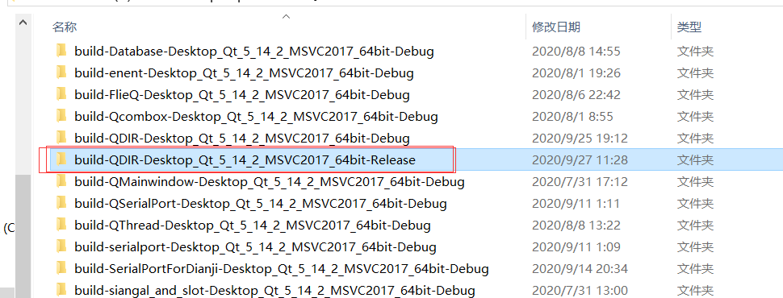
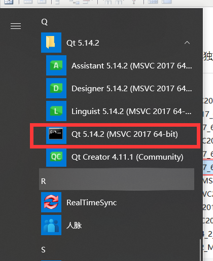
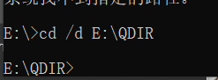
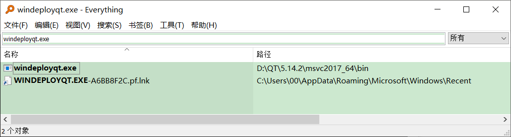
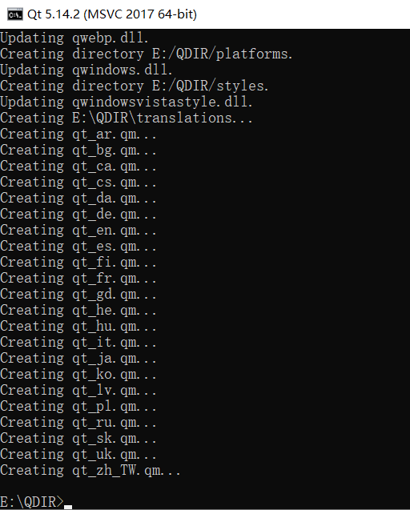
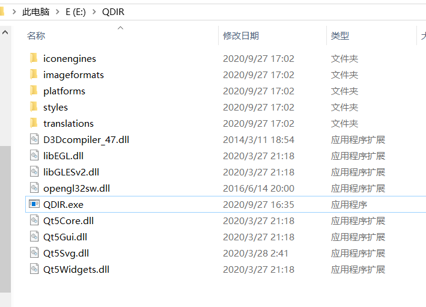
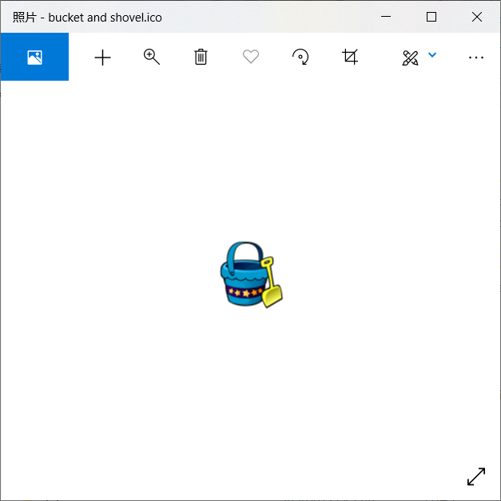
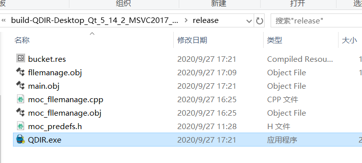

## 1.发布release版本的QT程序

　　在build release文件夹内找到exe文件，将其单独放在一个自建的空文件夹内

&nbsp;

&nbsp;

&nbsp;

## &nbsp;2.cd到含exe的空文件夹

　　在QT命令行cd到含exe的空文件夹，cd /d E:\QDIR

## 3.使用windeployqt.exe进行打包

首先找到windeployqt.exe的路径&nbsp;

&nbsp;

&nbsp;

&nbsp;

输入命令D:\QT\5.14.2\msvc2017_64\bin\windeployqt&nbsp;QDIR.exe即完成了打包

&nbsp;

## &nbsp;附：打包前修改exe图标

## 改变exe的图标

1、下载一个.ico格式的图标（如：bucket and shovel.ico），将bucket and shovel.ico复制到工程目录下。

&nbsp;

&nbsp;

2、工程目录下新建一个空白txt文档，文档内添加如下内容
`IDI_ICON1 ICON DISCARDABLE "bucket and shovel.ico"`
3、将文档后缀修改为.rc（如：bucke.rc, !!注意!!rc文件名不要含空格）&nbsp;
4、在工程的pro文件添加如下内容
`RC_FILE = bucket.rc`
5、重新编译程序，即可发现生成的程序图标变成了bucket.ico

&nbsp;
