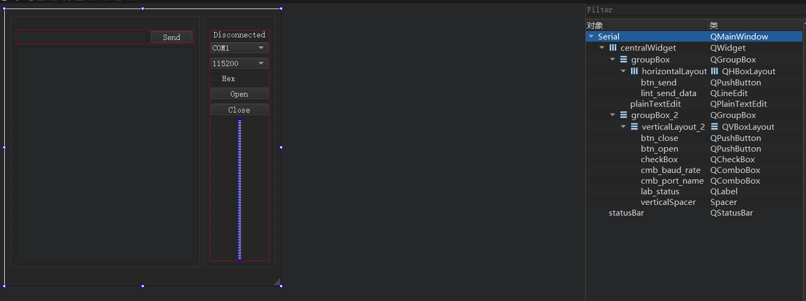

***.pro文件中***

QT += serialport

***serial.h:***

```c++
 1 #ifndef SERIAL_H
 2 #define SERIAL_H
 3 
 4 #include <QMainWindow>
 5 
 6 /*-------user--------------------*/
 7 //port
 8 #include <QSerialPort>
 9 //debug
10 #include <QDebug>
11 /*-------------------------------*/
12 
13 namespace Ui {
14 class Serial;
15 }
16 
17 class Serial : public QMainWindow
18 {
19     Q_OBJECT
20 
21 public:
22     explicit Serial(QWidget *parent = 0);
23     ~Serial();
24 
25 private slots:
26     //button
27     void btn_open_port(bool);
28     void btn_close_port(bool);
29     void btn_send_data(bool);
30 
31     //receive data
32     void receive_data();
33 
34 private:
35     Ui::Serial *ui;
36     /*----------funtion-------------------*/
37     void system_init();
38     /*----------variable-------------------*/
39     QSerialPort global_port;
40 };
41 
42 #endif // SERIAL_H
```

main.cpp:

```c++
 1 #include "serial.h"
 2 #include <QApplication>
 3 
 4 int main(int argc, char *argv[])
 5 {
 6     QApplication a(argc, argv);
 7     Serial w;
 8     w.show();
 9 
10     return a.exec();
11 }
```

***serial.cpp:***

```cpp
  1 #include "serial.h"
  2 #include "ui_serial.h"
  3 
  4 Serial::Serial(QWidget *parent) :
  5     QMainWindow(parent),
  6     ui(new Ui::Serial)
  7 {
  8     ui->setupUi(this);
  9     //user
 10     system_init();
 11 }
 12 
 13 Serial::~Serial()
 14 {
 15     delete ui;
 16 }
 17 
 18 /*--------------------------------------------------------------------------
 19  *          funtions
 20  * -------------------------------------------------------------------------*/
 21 void Serial::system_init()
 22 {
 23     //port config
 24     global_port.setParity(QSerialPort::NoParity);
 25     global_port.setDataBits(QSerialPort::Data8);
 26     global_port.setStopBits(QSerialPort::OneStop);
 27 
 28     //connect
 29     connect(ui->btn_open,&QPushButton::clicked,this,&Serial::btn_open_port);
 30     connect(ui->btn_close,&QPushButton::clicked,this,&Serial::btn_close_port);
 31     connect(ui->btn_send,&QPushButton::clicked,this,&Serial::btn_send_data);
 32     connect(&global_port,&QSerialPort::readyRead,this,&Serial::receive_data);
 33 }
 34 /*--------------------------------------------------------------------------
 35  *          slots
 36  * -------------------------------------------------------------------------*/
 37 void Serial::btn_open_port(bool)
 38 {
 39     /*--------port name------------------------*/
 40     qDebug()<<ui->cmb_port_name->currentIndex();//printf 0
 41 //    int i = 10;
 42 //    qDebug("%d",i);
 43     switch (ui->cmb_port_name->currentIndex()) {
 44     case 0:
 45         global_port.setPortName("COM1");
 46         break;
 47     case 1:
 48         global_port.setPortName("COM2");
 49         break;
 50     case 2:
 51         global_port.setPortName("COM3");
 52         break;
 53     case 3:
 54         global_port.setPortName("COM4");
 55         break;
 56     case 4:
 57         global_port.setPortName("COM5");
 58         break;
 59     case 5:
 60         global_port.setPortName("COM6");
 61         break;
 62     case 6:
 63         global_port.setPortName("COM7");
 64         break;
 65     default:
 66          global_port.setPortName("COM8");
 67         break;
 68     }
 69     /*--------baud rate-----------------------------*/
 70     switch (ui->cmb_baud_rate->currentIndex()) {
 71     case 0:
 72         global_port.setBaudRate(QSerialPort::Baud115200);
 73         break;
 74     case 1:
 75         global_port.setBaudRate(QSerialPort::Baud57600);
 76         break;
 77     case 2:
 78         global_port.setBaudRate(QSerialPort::Baud38400);
 79         break;
 80     case 3:
 81         global_port.setBaudRate(QSerialPort::Baud19200);
 82         break;
 83     case 4:
 84         global_port.setBaudRate(QSerialPort::Baud9600);
 85         break;
 86     case 5:
 87         global_port.setBaudRate(QSerialPort::Baud4800);
 88         break;
 89     case 6:
 90         global_port.setBaudRate(QSerialPort::Baud2400);
 91         break;
 92     default:
 93         global_port.setBaudRate(QSerialPort::Baud1200);
 94         break;
 95     }
 96     //open
 97     global_port.open(QIODevice::ReadWrite);
 98     ui->lab_status->setText("Connected");
 99     //test
100 //    global_port.write("1");
101 }
102 void Serial::btn_close_port(bool)
103 {
104     ui->lab_status->setText("Disconnected");
105     global_port.close();
106 }
107 /*------------sending data---------------------*/
108 void Serial::btn_send_data(bool)
109 {
110    QString data = ui->lint_send_data->text();
111    QByteArray array = data.toLatin1();//QString--->QByteArray
112    global_port.write(array);
113 }
114 /*-----------receive data-----------------*/
115 void Serial::receive_data()
116 {
117    QByteArray array = global_port.readAll();
118    qDebug()<<array;
119    if(ui->checkBox->checkState() == Qt::Checked){
120       ui->plainTextEdit->insertPlainText(QString(array.toHex(' ').toUpper().append(' ')));
121    }else {
122        ui->plainTextEdit->insertPlainText(QString(array));
123    }
124 }
```

***ui:***


