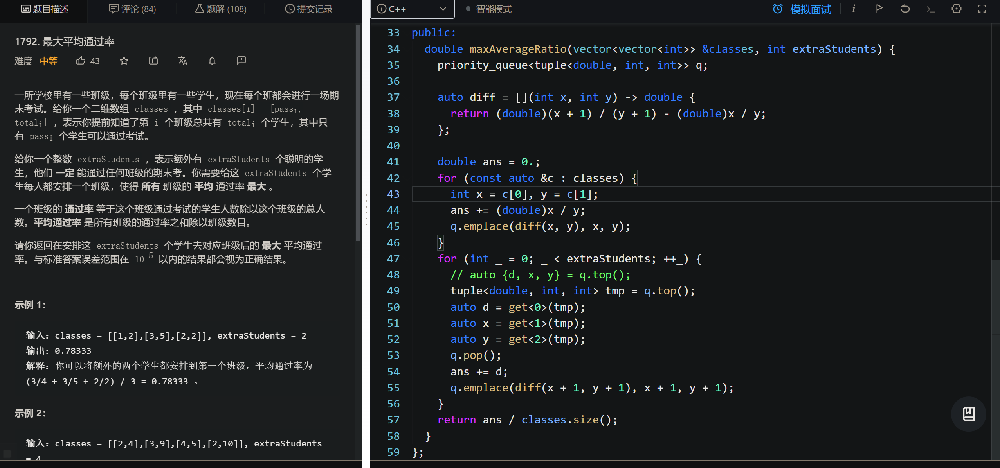

&nbsp;

&nbsp;

# 1.顶堆

&nbsp;&nbsp;C++11中，针对顺序容器(如vector、deque、list)，新标准引入了三个新成员：emplace_front、emplace和emplace_back，这些操作构造而不是拷贝元素。这些操作分别对应push_front、insert和push_back，允许我们将元素放置在容器头部、一个指定位置之前或容器尾部

priority_queue 默认从大到小排序， 从小到大：priority_queue&lt;int, vector&lt;int&gt;, greater&lt;int&gt; &gt; p;

pair举例
//默认是使用大根堆
priority_queue&lt;pair&lt;int,int&gt;&gt; pq0;
//小根堆，按照pair的first排，再按照second排序
priority_queue&lt;pair&lt;int,int&gt;,vector&lt;pair&lt;int,int&gt;&gt;,greater&lt;pair&lt;int,int&gt;&gt;&gt; pq1;
//大根堆
priority_queue&lt;pair&lt;int,int&gt;,vector&lt;pair&lt;int,int&gt;&gt;,less&lt;pair&lt;int,int&gt;&gt;&gt; pq2;

tuple举例
//默认是使用大根堆
priority_queue&lt;tuple&lt;int,int,int&gt;&gt; tp0;
//小根堆，按照tuple的0元素排，再按照1元素排，最后按2元素排
priority_queue&lt;tuple&lt;int,int,int&gt;,vector&lt;tuple&lt;int,int,int&gt;&gt;,greater&lt;tuple&lt;int,int,int&gt;&gt;&gt; tp1;
//大根堆
priority_queue&lt;tuple&lt;int,int,int&gt;,vector&lt;tuple&lt;int,int,int&gt;&gt;,less&lt;tuple&lt;int,int,int&gt;&gt;&gt; tp2;

# 2.元组tuple

tuple是一个固定大小的不同类型值的集合，是泛化的std::pair。我们也可以把他当做一个通用的结构体来用，不需要创建结构体又获取结构体的特征，在某些情况下可以取代结构体使程序更简洁，直观。std::tuple理论上可以有无数个任意类型的成员变量，而std::pair只能是2个成员，因此在需要保存3个及以上的数据时就需要使用tuple元组了。&nbsp;

tuple获取指定位置的值:

 auto d = get&lt;0&gt;(tmp);
      auto x = get&lt;1&gt;(tmp);
      auto y = get&lt;2&gt;(tmp);
