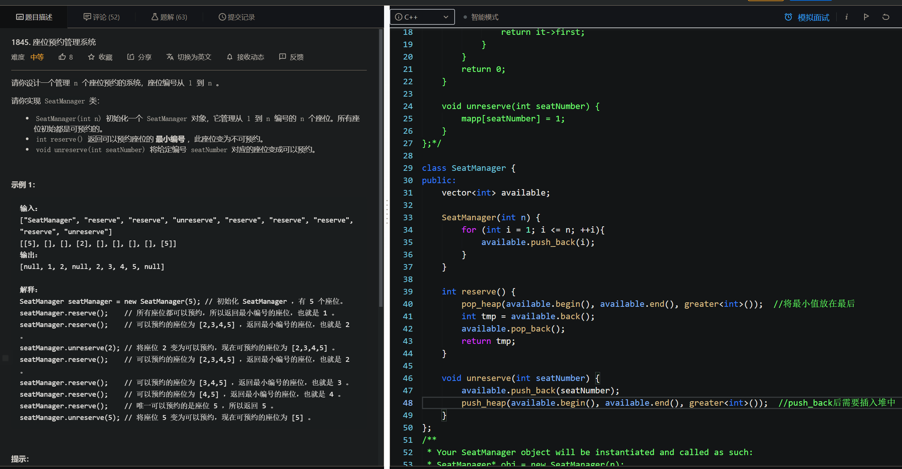
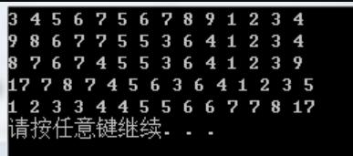

&nbsp;

&nbsp;

&nbsp;

make_heap
在容器范围内，就地建堆，保证最大值在所给范围的最前面，其他值的位置不确定

pop_heap
将堆顶(所给范围的最前面)元素移动到所给范围的最后，并且将新的最大值置于所给范围的最前面

push_heap
当已建堆的容器范围内有新的元素插入末尾后，应当调用push_heap将该元素插入堆中。

<pre> 1 #include&lt;iostream&gt;
 2 #include&lt;vector&gt;
 3 #include&lt;ctime&gt;
 4 #include&lt;deque&gt;
 5 #include&lt;list&gt;
 6 #include&lt;algorithm&gt;
 7 #include&lt;queue&gt;
 8 #include&lt;functional&gt;//greater使用
 9  
10 using namespace std;
11  
12 void print(vector&lt;int&gt; a) {
13     for (int i = 0; i &lt; a.size(); i++) {
14         cout &lt;&lt; a[i] &lt;&lt; " ";
15     }
16     cout &lt;&lt; endl;
17 }
18  
19 int main() {
20  
21     //堆排序算法（heapsort）
22     //make_heap();
23     //push_heap()
24     //sort_heap()
25     //pop_heap()
26     //堆就是一种特殊的二叉树，最关心的就是根
27     //大根堆，小根堆
28  
29     vector&lt;int&gt; ivec{3,4,5,6,7,5,6,7,8,9,1,2,3,4};
30     print(ivec);
31     //向量里所有的数据变成一个堆
32  
33     make_heap(ivec.begin(), ivec.end());
34     print(ivec);
35  
36     pop_heap(ivec.begin(), ivec.end());//最大的数据取走，但是并没s有删除
37     //把最大的数据放在结尾，剩下的元素排成一个堆
38     print(ivec);
39     ivec.pop_back();
40     //push_heap 使用首先要先把数据加在向量里
41  
42     ivec.push_back(17);
43     make_heap(ivec.begin(), ivec.end());
44     print(ivec);
45  
46     //sort_heap 把堆变成不是堆,普通的排序
47     sort_heap(ivec.begin(), ivec.end());
48     print(ivec);
49  
50     system("pause");
51 }</pre>

