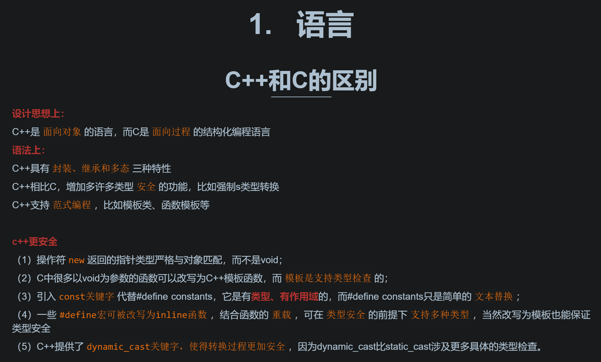
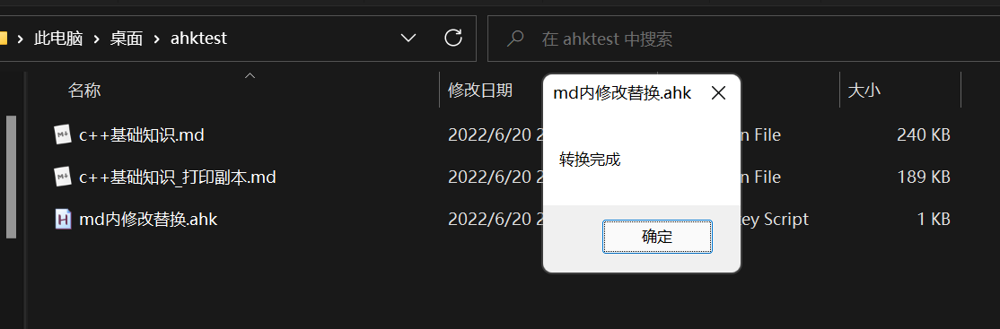
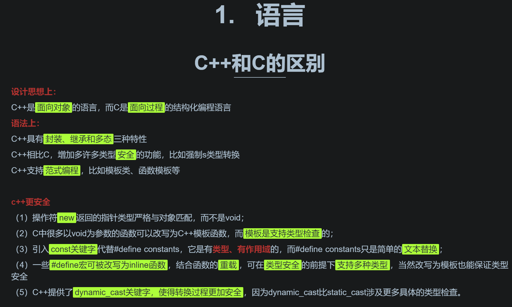
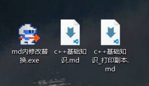

##### 午休刷视频发现了有个脚本小工具 尝试了下 立马真香

## 为脚本而生的工具: AHK

一直觉得身为码农 最起码的得会一种脚本语言 比较不错的选择就是linux的shell/windows下的bat批处理, 和python 

之前写过一个一键部署hexo 的bat 实现的简单的功能尚可 而要想实现复杂的功能就需要调用各种可执行文件了 偶然发现了AHK

真香!

一些通用的适用场景 官方的例子通常是热键绑定等 比如`实现右键+滚轮调节音量的酷炫操作`

## 而对我来说 可以解决什么问题呢

最近求职进入冲刺阶段了 一些基础知识需要恶补一下 好记性不如烂笔头 还是想着打印下来比较好 而通常写md用的是typora 很是喜欢一些主题的行内代码格式 也就是`这样` 在一些主题下比 ==高亮== 好看多了 

然而 打印出来的话 行内代码又不够明显 所以在打印前 还需要把 行内代码的 ` 转换成高亮的 ==

## AHK实现多文本字符串替换功能

```c++
SelectedFiles := FileSelect("M3", , "打开md", "md文件 (*.md)")  ; M3 = 选择多个现有文件.
if SelectedFiles.Length = 0
{
    MsgBox "The dialog was canceled."
    return
}

for SelectedFile in SelectedFiles
{
    Contents := FileRead(SelectedFile, "UTF-8")
    Contents := StrReplace(Contents, "````````````", "dian6")      
    Contents := StrReplace(Contents, "``````````", "dian5")      
    Contents := StrReplace(Contents, "````````", "dian4")
    Contents := StrReplace(Contents, "``````", "dian3")
    Contents := StrReplace(Contents, "``", "==")
    Contents := StrReplace(Contents, "dian3", "``````")
    Contents := StrReplace(Contents, "dian4", "````````")
    Contents := StrReplace(Contents, "dian5", "``````````")
    Contents := StrReplace(Contents, "dian6", "````````````")
    SelectedFile := StrReplace(SelectedFile, ".md", "_打印副本.md")
    FileObj := FileOpen(SelectedFile, "w") 
    FileObj.Write(Contents)
    FileObj.Close()
}
msgbox "转换完成"
return
```

`原效果如下`



`代码逻辑是生成一个副本`



转换后的状态



这样转换成pdf 再打印出来 重点就很突出了 而且转换的`速度`真的`很快` 工具会生成简单的界面多选文件

> ==之前更换图床 要是这么搞真的能省很多时间==   另外


## 打包exe

自己写的功能简单的小件本还可以打包成单个exe 不依赖node.js 纯净的虚拟机里也可以运行 确实方便


