## A new method to determine phase velocities of Rayleigh waves from microseisms -> bido单垂直分量大深度spac统一理论

>  [Cho bido通用公式 垂直分量  A new method to determine phase velocities of Rayleigh waves from microseisms.pdf](..\SPAC\Cho bido通用公式 垂直分量  A new method to determine phase velocities of Rayleigh waves from microseisms.pdf) 

> 摘要：
>
> - 我们开发了一种新的方法来确定相速度的垂直分量记录的地震传感器周围的圆周。我们通过取传感器站的不同权重集的地震图的平均值来计算两种不同的时间历史。这两个时间史的光谱比不包含关于到达方向或入射波的振幅的信息，而只取决于到达模式的相位速度。理论考虑表明，除了短波长外，在大多数情况下，使用有限数量的传感器在现场实现我们的方法所造成的定向混叠的影响都很小。非相干噪声的存在限制了我们的方法对长波长的有效性。在使用三个地震传感器阵列的现场测试中，我们获得了相速度从`5r到30r波长`范围内的适当估计，其中阵列半径r在几米量级。
>
> 笔记：
>
> - hrfk方法 感兴趣的最长波长与阵列直径一样大，而这种方法可以估计5-30r的波长范围相速度估计 因此，勘测更为深层
> - `波长越长 频率越低 速度越大 深度越深`

### 绪论

高分辨率(HR)方法(Caponetal.，1967；卡彭，1969)被广泛用于研究给定微地震波场的光谱特征，并通过解析频波数域来确定入射表面波的相速度(例如，阿斯滕和亨斯特里奇，1984；堀江，1985；廖和McEvilly，1979）。Asten和亨斯特里奇（1984）指出，在HR方法中，（1）的阵列直径应该与感兴趣的最长波长一样大，以提供足够的长波长分辨率；（2）从任何方向看时，必须有一些传感器的间距小于最短波长的一半，以避免在波数域内的混叠；而（3）传感器的数量必须大于任何时候出现的平面波的数量。这些要求要求使用大量的地震传感器。

> ==HRFK方法的特点  / 局限==
>
> 1. 有效特测的`最大波长`受阵列直径限制, 最大波长 = 最大直径
> 2. 个别传感器`间距`的要求, 对台阵摆布有要求
> 3. 对传感器的`数量`有要求

Aki（1957），在他的微观现象分析的一般理论中，提出了一种从微地震记录的垂直分量中确定相速度的方法(以下称为Aki的方法)。Aki的方法与HR方法的不同之处在于，它只需要一组传感器放置在一个圆的周长周围，并且在其中心放置另一个传感器。后来，他提议用一个半圆来代替这个圆圈(Aki，1965)。该方法包括计算记录在中心和圆周上某个点上的不同带通滤波波形对之间的相关系数，然后取这些相关系数的方位平均值。如果微距可以被视为固定在时间和空间，相关系数的方位平均可以估计将大量的传感器在所有必要的观测点和操作它们一次或使用较少的传感器和重复阵列测量与不同的阵列配置。

在Aki的方法中，所有关于相关波场的信息，在一般情况下是由来自不同方向、不同强度、不同模式的多个平面波组成的，因此被整合成一个单一的量，即相关系数的方位角平均值。后者只包含了关于波的相位速度的信息：到达方向和振幅的影响在这个过程中被抵消了。

> ==传统的spac/si算法==
>
> 1. > spac计算的是中心与圆周传感器的相关系数
>    >
>    > si计算的是两两之间的相关系数
>
> 2. 计算相关系数的方位角平均值, 从而抵消到达方向和振幅

亨斯特里奇（1979）开发了一个更通用的公式，使用谱表示，这足够普遍，包括Aki的方法作为一个特殊情况，但基于更强的假设，即相速度是频率的单值函数。在本研究中，`我们通过扩展亨斯特里奇（1979）的理论，开发了一种新的微地震勘探方法`，取消了单值主导的假设，并引入了一种新的技术，它解释了一个周长周围不均匀的传感器间隔。我们只处理微观运动的垂直分量记录，它们通常是由瑞利波主导的。我们的方法，就像Aki和亨斯特里奇的方法一样，能够确定相位速度，而无需解析入射波的单个分量，因此阵列配置不受任何与分辨率相关的约束，正如阿斯滕和亨斯特里奇（1984）所提到的。正如后面将展示的，这使得我们可以通过使用相对较少的传感器阵列来分析广泛的波长分量，即使波来自多个方向。

> 1. 亨斯特里奇<u>假设相速度是频率的单值函数</u>, 将spac视作其通用公式的一种特殊情况
> 2. 扩展: 取消单值主导假设, 

### **METHOD**

我们首先将傅里叶变换定义为

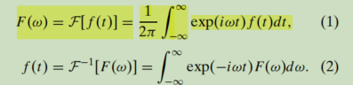

定义了周期为2π的任意正则周期函数的傅里叶展开式为

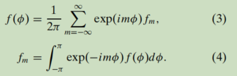

我们将一个随机函数f（·）的集合平均值表示为

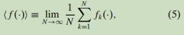

其中，fk（·）表示f（·）的第k个样本。

一个波场`z（t，x，y）`，由在xy平面上运动的瞬态和确定性的平面波分量组成，可以写成

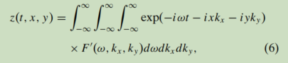

其中t表示时间，（x，y）在xy平面上的位置，F（ω，kx，ky）的频波数谱表示谐波分量的振幅和相位，它有一个角频率ω和一个波数向量（kx，ky）。上述方程的极性形式为，由（kx，ky）=（k cos φ，k sin φ）和（x，y）=（r cos θ，r sin θ）变换变量得到

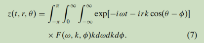

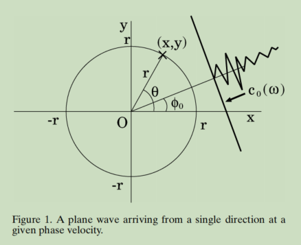

让我们假设波从一个单方向的φ0到达，相位速度为c0(ω)，这是一个频率的单值函数（图1）。相关的频率波数功率谱在等式6中可以写成这个形式

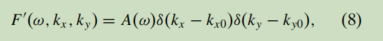

式中，[kx0(ω)，ky0(ω)]≡[k0(ω) cos φ0，k0(ω) sin φ0]，δ（·）表示狄拉克δ函数，`A(ω)是一个复频谱`。在极性形式下，方程7中的频谱-波数谱为

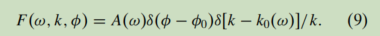

将方程8代入方程6或方程9代入方程7得到

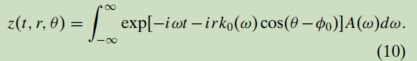

让我们假设地震图z（t，r，θ）在半径为r的圆周围的所有点上都是可用的。我们综合了两个时间史，α0(t)和α1(t)，通过是在每个时间对具有两个不同的权重函数的地震图进行积分：

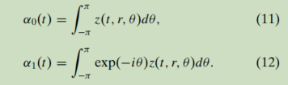

将方程10代入方程11和12，得到

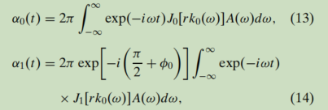

其中j0（·）和j1（·）分别表示第一类的零阶贝塞尔函数和一阶贝塞尔函数。这两个时间史的光谱比值然后由

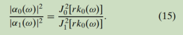

这意味着光谱比==不包含==关于到达方向φ0或A(ω)的振幅和相位的信息，而仅仅依赖于乘积rk0(ω)。由于r已知，我们可以确定波数k0(ω)。最后，相速度c0(ω)为

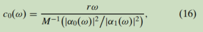

其中，M−1（·）表示函数M（·）≡J02（·）/J12（·）的inverse。

#### **General formulation**

在将上述概念应用于真实微地震记录的分析时，我们将波场视为具有随机相位和振幅在水平平面上运动的平面波的连续和。在随机过程理论的基础上，我们使用以下傅里叶-斯蒂尔特杰斯积分表示：

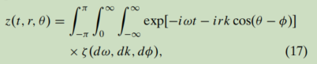

其中，ζ（dω，dk，dφ）是一个复值随机函数。从方程7和公式17的比较中可以明显看出，在确定性情况下，ζ（dω，dk，dφ）对应于乘积F（ω，k，φ）kdωdkdφ。

在确定性的情况下。正如Capon（1969）所做的那样，将微地震波场视为一个在时间和空间上都是静止的随机场是有用的。这相当于假设对应于频率ω、波数k和到达方向φ的不同增量集的函数ζ（dω、dk、dφ）相互不相关，因此

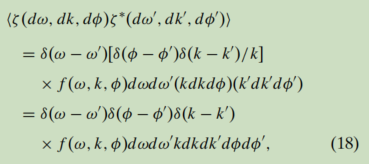

其中，星号表示复数共轭物。函数f（ω，k，φ），我们称之为频率波数方向（FWD）谱密度，表示从φ方向到达的波分量的功率，频率为ω和波数k的功率。方程17和18集是平稳随机过程的一般谱表示的极性形式。读者可以参考库普曼斯（1974）、普里斯特利（1981）和Yaglom（1962）的教科书来了解更多关于这个理论的细节

<u>让我们用z（t，r，θ）表示在半径为r的圆周围和方位角位置θ处要记录的地震图的==垂直分量==。所记录的事件由来自不同方向的不同强度的静止平面波和随机平面波组成。我们假设波来自于距离地震阵列足够远的==相互不相关的振动源==，因此入射波的==不同组成部分==是相互不相关的。</u>

我们在方程11和12中推广了时间史==α0(t)和α1(t)==的定义，并==将它们视为z（t，r，θ）的傅里叶级数展开中的第零系数和第一系数==：

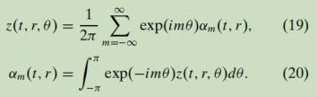

维纳-金钦定理表明，αm（t，r）的功==率谱密度，我们表示为Gm（ω，r）==，是由自相关函数的傅里叶变换给出的：

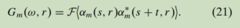

> 虽然这里说的是 自相关函数的傅里叶变换 
>
> 但是 在代码中为了方便书写, 仍然采用的是: 先对数据进行fft, r

经过一些代数（附录A），我们得到了与确定性情况下的方程15相对应的以下表示式：

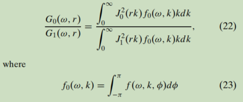

为频率为ω、波数为k的所有波分量的总功率。可以方便地将其看作是FWD谱密度的傅里叶级数展开中的零阶系数：

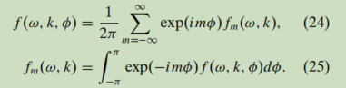

当波场由一种或多个瑞利波模组成，波数是频率的函数，无论是单值还是多值，我们可以使用后缀q表示与（q−1）模有关的量，并将FWD谱密度表示为

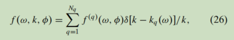

其傅里叶系数

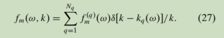

将方程27代入方程22，得到

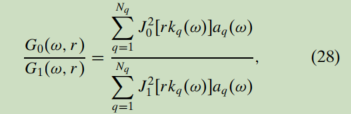

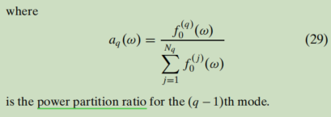

是（q−1）模式的功率划分比。

### **Spectral ratio function**谱比函数

当波数可以看作是频率的单值函数时，如在瑞利波的基模态主导场的情况下，我们可以将Nq设为1，并将方程28改写为

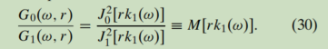

图2绘制了表示理论光谱比G0/G1的函数M（rk1）。在长波长极限（rk1→0）下，光谱比显著增加，因为方程30中的分子和分母分别趋于1和0。分子消失atrk1≈2.4，光谱比因此消失；分母消失atrk1≈3.8，光谱比再次趋于无穷大。

当波数是频率的多值函数时，从方程28和30很容易看出，谱比G0/G1介于M[rkq (ω)]的最大值和最小值之间：

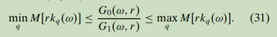

图3通过绘制一个合成波场的估计谱比G0/G1来说明了这种关系，该波场由瑞利波的基本模和第一高模的混合物组成，具有不同的频率无关的功率分配比（a0： a1）。我们使用理论色散曲线kq (ω)对KSKB下面的速度结构，这是后面提到的测试地点之一，并假设阵列半径为r = 3 m，用方程28计算光谱比。从图3可以看出，即使功率在两种模式之间均匀分配，对应的谱比并不一定落在每个模态的光谱比值的算术平均值上。

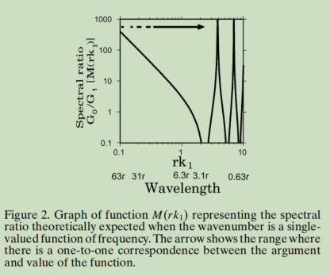

### 代码流程

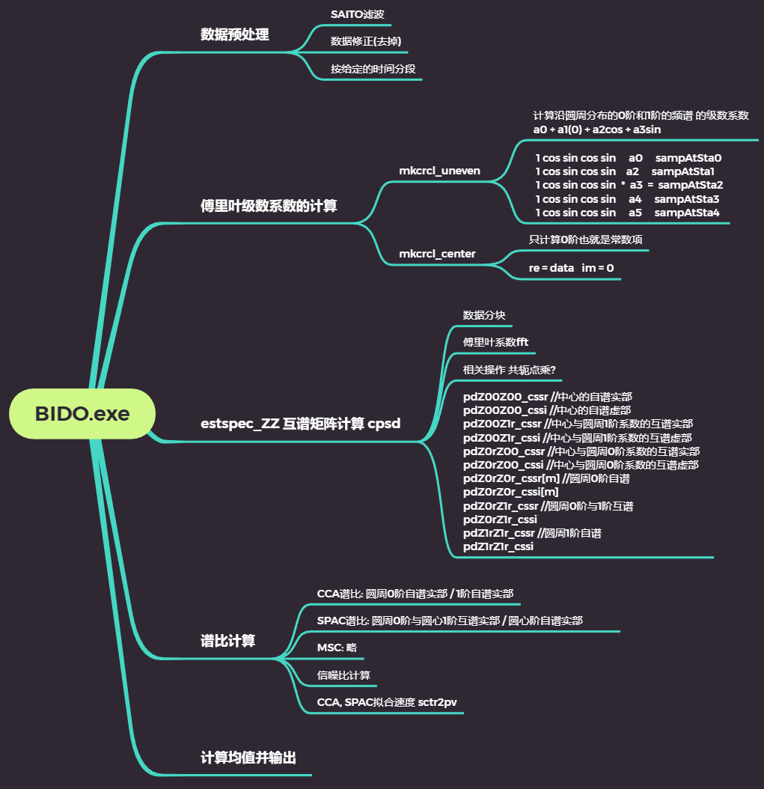

## A generic formulation for microtremor exploration methods using three-component records from a circular array -> cho通用理论公式推导(扩展到三分量)

>  [Cho 通用公式理论推导 2006CHO_GeoJI_165__236C[1] 使用来自圆形阵列的三分量记录的微震勘探方法的通用公式.pdf](..\SPAC\Cho 通用公式理论推导 2006CHO_GeoJI_165__236C[1] 使用来自圆形阵列的三分量记录的微震勘探方法的通用公式.pdf) 

### 摘要

我们提出了一种分析方法的通用公式，用来估计瑞利波和爱波的相位速度，通过称为“光谱比spectral ratios”的中间量，使用来自一个传感器的圆形阵列的微振动的三组分记录。在每个时间时刻，<u>记录集被展开为一个关于方位角的傅里叶级数</u>，因此我们得到了一组以复杂时间历史的形式表示的傅里叶系数。然后我们<u>估计这些傅里叶系数的功率和交叉谱密度</u>。由此得到的光谱密度通常包含瑞利波和爱波各模态的相速度、功率和到达方向的信息。通过取两种不同的光谱密度的==<u>商</u>==，我们可以`抵消它们的功率和到达方向的信息`，并单独==提取它们的相速度的信息==。在实际应用中，必须根据有限数量的地震传感器的记录来均匀或不均匀地估计光谱比率。我们描述了一个估计它们的一般程序，并讨论了有限数量的传感器及其配置所产生的定向混叠对光谱比估计的影响。我们还讨论了由非相干噪声的存在引起的光谱比估计的偏差。利用我们的方法，也可以估计微震颤的中心到达方向、瑞利波的椭圆度，以及瑞利波是前进的还是逆行的。

关键词：勘探地震学、爱波、微震、瑞利波、地震阵列、表面波。

### 1.介绍

构成微振动（环境振动）的表面波的相速度色散曲线对地下速度结构的估计提供了有用的约束（例如Liaw&McEvilly1979；阿斯滕和亨斯特里奇1984；堀户社1985）。对于估计表面波的相位速度，最常用的工具之一是频率-波数谱法(Caponetal.1967；Capon1969)，它在频-波数域内分解给定的波场，并识别单个波分量的功率。在使用频波数谱方法时，必须考虑到地震阵列设计的不同限制，以提高空间分辨率。例如，Asten&亨斯特ridge（1984）指出，<u>阵列直径应该与最长波长一样大</u>，以便在长波长范围内提供足够的分辨率。

> fk方法 计算每个波分量的功率 同时明确fk方法应该选择合适的阵列直径以适应长波长，为其提供足够的分辨率
>
> ==HRFK方法的特点  / 局限==
>
> 1. 有效特测的`最大波长`受阵列直径限制, 最大波长 = 最大直径
> 2. 个别传感器`间距`的要求, 对台阵摆布有要求
> 3. 对传感器的`数量`有要求

Aki（1957）提出了一种完全不同的方法来估计表面波的相位速度。在他的方法中，有关波场的整个信息被整合成一个单一的量，这被称为空间自相关函数的方位角平均值。这个量只包含关于波的相位速度的信息；关于波的其他属性的信息，如它们的功率和到达方向，在其推导过程中被抵消了。阵列设计不受与分辨能力相关的约束，因为该算法不包含解析单个平面波分量的程序(Choetal.2004)。然而，Aki（1957）以两个独立的公式提出了他的理论，一个单独与垂直运动有关，另一个单独与水平运动有关，他没有假定这两个成分都存在的情况。他的水平运动的公式再次以不同的方式提出了类瑞利偏化波和类爱极化波，因此不适用于两种波都存在的情况。

> spac方法，采用合适的阵列 抵消掉功率和到达方向的影响 将波长的信息整合成一个只与波的相速度相关的信息（空间自相关函数的方位角均值），但是 都只是单分量 不是两者同时存在的统一化公式
>
> ==传统的spac/si算法==
>
> 1. > spac计算的是中心与圆周传感器的相关系数
>    >
>    > si计算的是两两之间的相关系数
>
> 2. 计算相关系数的方位角平均值, 从而抵消到达方向和振幅

亨斯特里奇（1979）使用随机波场的光谱表示,将Aki（1957）的冗长公式重新整理为简单的形式，他还设计了一个更一般的理论，包括Aki（1957）的方法作为一个特殊情况，除了它仅适用于垂直运动。尽管亨斯特里奇（1979）理论是建立在强大的假设，单一模式（基本模式）主导波场，赵等etal.（2004）最近能够提升这个假设，他们修改和重新制定亨斯特里奇（1979）理论允许情况下存在一个以上的波模式。

> 亨斯特里奇 提出了一个更一般的理论， spac是此理论的一种特殊情况 ，但是假设过于大，最近有人研究发现这个假设可以缩小，理论可以在更多的情况下应用？
>
> 1. 亨斯特里奇<u>假设相速度是频率的单值函数</u>, 将spac视作其通用公式的一种特殊情况
> 2. 扩展: 取消单值主导假设, 

尽管Aki（1965）为宣传他的理论做出了努力，但Aki（1957）的理论渴望看到它对微震颤探索的实际应用。从冈田和Sakajiri（1983）的开创性工作开始，日本对Aki方法的实地实施情况进行了积极的调查，但大多数最早的报告都是用日语发表的。冈田和松岛股份有限公司（1989）首次展示了如何处理在水平运动中同时存在瑞利波和爱波的情况。然而，这些研究大多是基于单模（基本模）主导表面波场的假设，因此并没有充分利用Aki（1957）理论中固有的所有潜在可能性。

20世纪90年代，日本内外的研究人员开始发表阿基（1957）理论对微震勘探的英文应用报告（如费拉兹尼等1991；霍夫等1992；德木等1992；1997；马拉尼尼等吉；德卢卡等1997；1997；周等1997；1998；2001；2003；2003；户藤等2002；2002；阿斯顿等2004；莫川等2004；ıa等2005）。尽管如此，关于单一模式占主导地位的基本假设很少被推翻，亨斯特里奇（1979）的多用途理论也很少被提及。

不同的研究文章引用了Aki（1957）的理论，并进行了部分修改，每一篇都有自己的优缺点。这使得我们很难从Aki（1957）的方法中获得完整的整个理论观点，并难以最大限度地利用他的算法中固有的奇妙潜力。在本文中，我们进一步扩展了亨斯特里奇（1979）对Aki（1957）方法的推广，并建立了一个一致的理论，整合了整个相关方法的整个家族。我们研究的目的是在最一般的公式中，利用圆形传感器阵列的三组分记录来估计瑞利波和洛夫波的相速度的方法。

> 文章的目的：`进一步扩展了亨斯特里奇（1979）对Aki（1957）方法的推广，并建立一个一致的理论`

我们首先将微震颤波场表示为一个在时间和空间上都是静止的表面波的随机场。基本方程是以这样一种形式导出的，允许水平运动中瑞利波和爱波在水平运动中共存（例如冈田和松岛，1989），也允许多个波模式共存(例如Cho等，2004)。在本文的前半部分，我们首先重申了Aki（1957）的原始理论，然后通过引入亨斯特里奇（1979）的思想对其进行扩展和推广，最后说明了它适用于微震颤探索的一些具体方法。值得注意的是，我们的分析理论是以这样一种方式制定的，即`通过放置在圆周周围的传感器获得的微震颤记录`，<u>首先被整合成称为“光谱比”的中间量，然后再从中提取有关相速度的信息</u>。我们的方法有可能在某些情况下能够分析相对于阵列半径的非常长的波长，因为不需要解析单个的平面波分量(Choetal.2004)。

我们的理论建立在这样一个基本假设之上，即地震图在一定半径的周长周围随处可见，如果有必要，也在其中心。然而，在实践中，地震图只能在有限数量的放置传感器的离散位置使用。如果可能的话，最理想的方法是将传感器放置在周长周围的均匀间隔上，但在许多实际情况下，圆形形状的约束很可能迫使人们以不均匀的间隔放置传感器。在我们的论文，我们提出一个一般的方法来估计傅里叶系数的不同方位订单从地震图获得传感器均匀或不均匀间隔在周长，我们理论上评估有限数量的传感器的影响及其配置对光谱比率的估计。我们还提出了一种方法，从理论上评估光谱比估计中的偏差，这些偏差是由每个传感器的每个组件记录所特有的非相干噪声造成的。

### 2.微动作为静止随机场 一些假设

我们将周期为2π的普通周期函数f（φ）的傅里叶级数展开定义为

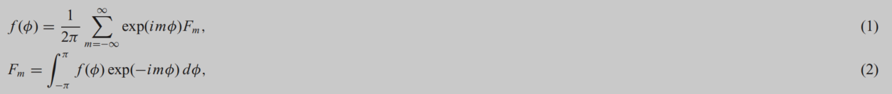

其中，i是虚数单位。我们还将f(t)的傅里叶变换F和逆变换F^-1 定义为

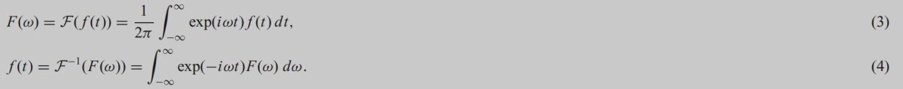

我们将一个随机函数f（·）的集合平均值表示为

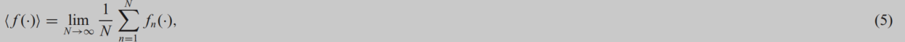

其中，fn（·）表示f（·）的第n个样本。

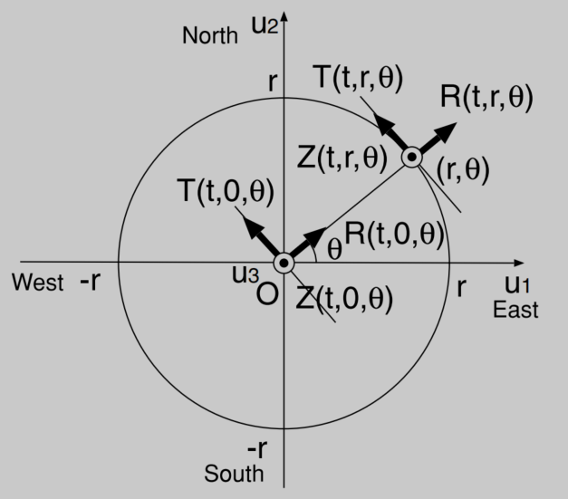

假设我们用半径为r的圆形传感器阵列测量微震动场，并假设在周长上的任意位置(r，θ)和圆心坐标的原点O处都有三分量地震图。如图1所示，我们将垂直轴、径向轴和横轴分别标记为Z、R和T，向上方向、离心方向和逆时针方向均为正。

弹性波传播理论预测，当微震振的振动源距离足够远且靠近地面时，微震振场主要由表面波主导，即瑞利波和/或爱波，它们以平面波的形式到达地震阵列。在本节中，我们推导了表示在这种情况下波场的基本方程。

我们首先考虑，作为入射瑞利波和爱波，单一，确定性，谐波平面波分量，从方位角φ角频率ω和绝对波数k。如果我们用ζ‘R(ω，k，φ)和ζ’L(ω，k，φ)表示描述坐标原点的振幅和相位的复杂傅里叶谱，谐波的贡献是通过纠正这些谱的相位延迟和轴的旋转：

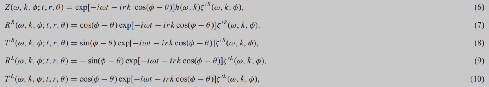

其中，上标R和L表示所讨论的量分别属于瑞利波和爱波。复函数h(ω，k)，描述了振幅比（椭圆度的倒数）和瑞利波的垂直分量和水平分量之间的相位延迟，取纯虚值，因为相位延迟总是±π/2。当Arg[h(ω，k)]=−π/2和π/2时，地面运动呈逆行和前进趋势。

通过对上谐波分量的所有频率、波数和到达方向进行`三次积分`，得到各分量地震图的以下表达式：

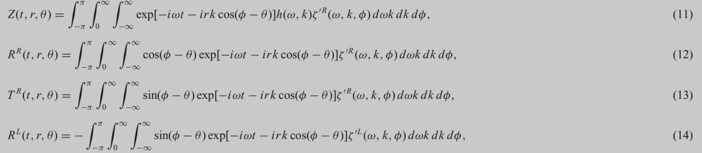

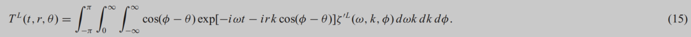

通过总结瑞利波和爱波的贡献，得到了完整的R分量和t分量地震图：

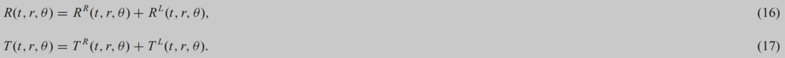

接下来，我们将考虑微振动，或由大量未指定的振动源产生的无尽信号场。基本概念保持不变，除了手续必须修改为基于随机过程的更适当的理论；详情见亚格洛姆（1962）、库普曼斯（1974）和普里斯特利（1981）的教科书。更具体地说，我们只需要替换eq中的ζ‘R(ω，k，φ)dωkdkdφ部分。（11）与一个集合函数ζR(dω，dk，dφ)，这被称为一个集成的光谱或一个随机的光谱测量(例如Yaglom1962)。这给出了微振动随机场的垂直分量{Z}的一般表示：

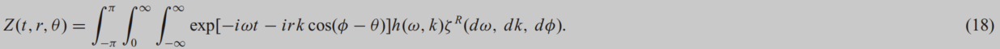

同样的论据也适用于水平分量{Rl}和{Tl}（l=R或L）：

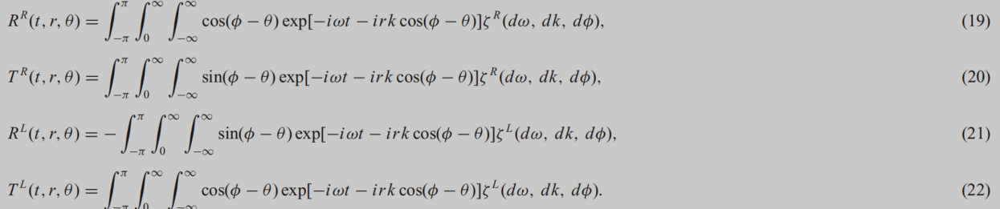

我们认为微震颤是一个在时间和空间上静止的随机场。这等价于假设积分谱ζR(dω，dk，dφ)和ζL(dω，dk，dφ)与频率ω、波数k和到达方向φ的正交关系：

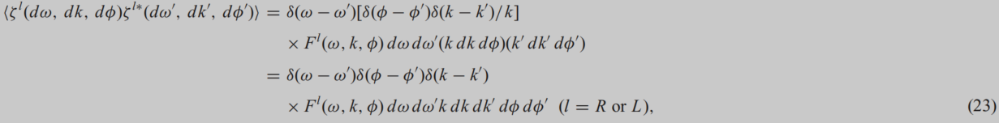

其中星号表示复共轭，δ（·）表示Dirac函数。函数FR(ω，k，φ)和FL(ω，k，φ)，我们称之为频率-波数-方向(FWD)谱密度，分别表示瑞利波和Love波的平面波分量的强度，频率为ω和波数k。eq（23）中由δ（ω−ω‘）表示的正交性。对应于时间上的平稳性，而由δ(k−k‘)δ（φ−φ’）表示的正交性对应于空间上的平稳性。

如果瑞利波和爱波的功率集中在它们的离散模式上，那么FWD频谱密度可以用以下方式表示，因为波数随后成为频率的多值函数：

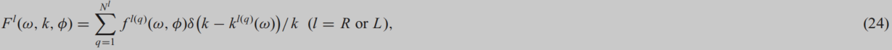

其中fR(q)（ω，φ）和fL(q)（ω，φ）为频率方向谱密度，分别代表瑞利波和爱波的强度，频率为ω。

我们<u>假设瑞利波和洛夫波信号是相互不相关的，假设它们的振动源在统计意义上是相互不相关的</u>：

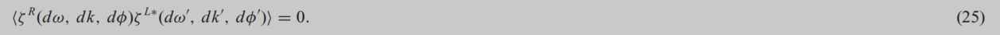

到此为止，我们已经对微震颤领域建立了以下假设：

1. 微震颤场表示为来自不同方向、不同强度、不同相位速度的平面波的集合，并以瑞利波和爱波（等式18-22）为主。
2. 瑞利波的场和爱波的场都被表示为一个在时间和空间上是`静止的随机场`(eq。 23).这与来自不同方向、不同相速度的波相互不相关的假设相对应。
3. 瑞利波的波数（或相位速度）和爱波的波数)都是频率的==<u>多值函数</u>==(eq。 24).
4. 瑞利波和爱波是`相互不相关`的(eq。 25).

### 3.Aki的spac方法

Aki（1957）方法的独创性在于，将给定波场上的整个信息，用方程式（16）-（22）表示，整合成一个单一的量，称为`空间自相关函数的方位角平均值`。我们想通过以尽可能简单的形式重新表述Aki（1957）的原始理论来开始我们的论点。

我们定义在圆周长上的一个点(r，θ)获得的垂直运动记录与在其中心O获得的垂直运动记录之间的空间自相关函数为

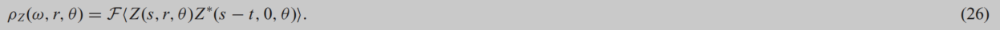

将eqs（18）、（23）和（24）替换为eq。26表示为

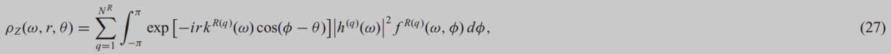

其中，为了简单起见，函数h(ω，kR(q)（ω）)已被重写为h(q)（ω）。

我们将方位平均空间自相关系数¯ρZ0(ω，r)定义为空间自相关函数ρZ(ω，r，θ)的方位平均¯ρZ(ω，r)，由它在中心所取的值¯ρZ（ω，0）归一化。顺便说一句，这个分母等于中心垂直运动的功率谱密度：

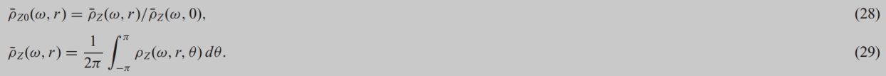

通过将eqs（27）和（29）代入eqs。（28）和使用的关系(A1)，我们有

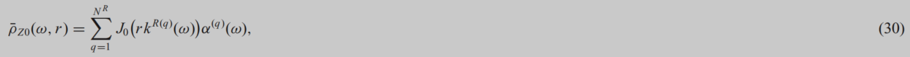

其中Jm（·）表示第一阶m的贝塞尔函数，和

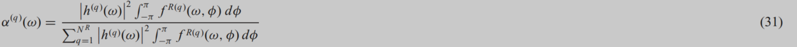

为(q−1)次模态与垂直运动时瑞利波总功率的功率划分比，满足以下关系：

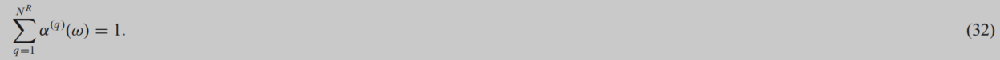

可以通过eq的方法来估计参数rkR(q)（ω）的值。（30），因为方位平均空间自相关系数¯ρZ0(ω，r)可以从圆阵列测量记录中估计出来。这里特别感兴趣的情况是，只有瑞利波的基本模式占主导地位(NR=1)。在这种情况下，rkR（ω）的值（我们从此省略上标（1），表示与基模有关的量，只要我们假设它占主导地位）可以通过使用¯ρZ0(ω，r)的观测值简单地反转函数J0（·）来估计。由于阵列半径r已知，因此可以估计波数kR（ω），最后通过cR（ω）=ω/kR（ω）估计相速度。

在一般情况下，不能假设单个模态的优势，每个模态都有两个未知数，即kR(q)（ω）和α(q)（ω）(q=1，……，NR)。Aki（1957）提出部署(不同半径的2NR−1)阵列，建立观测eq。（30）为每个半径，并与兼容性条件（32）同时求解它们。

同样，让我们定义水平运动的空间自相关函数：

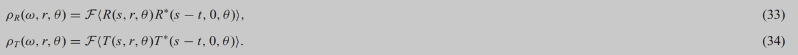

将等式（16）和（17）替换为等式（33）和（34），并利用等式。（25），我们已经有了

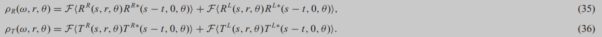

将方程式（19）-（22）代入上述方程式，利用方程式（23）和（24），经过一些代数得到，

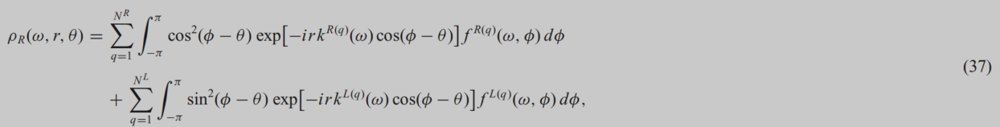

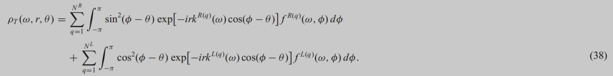

我们定义了空间自相关函数的方位平均¯ρR(ω，r)和¯ρT(ω，r)，以及方位平均空间自相关系数¯ρR0(ω，r)和¯ρT0(ω，r)，其方法与我们对垂直运动所做的方法相同：

为瑞利波或爱波的(q−1)模式与瑞利波和爱波水平运动时的总功率分配比，满足以下条件：

方程（43）和（44）是水平运动的观测方程，对应于方程。（30）在垂直运动的情况下。正如我们在第1节中所述，Aki（1957）只考虑了单独存在瑞利波(NL=0)或单独存在Love波(NR=0)的特殊情况，这构成了他的方法的一个弱点。为了克服这一问题，冈田和松岛（1989）、费拉齐尼等人（1991）、Chouet等人（1998）和萨帕洛蒂等人（2003），在单一模式主导(NR=NL=1）的假设下，首先通过反转观测公式从¯ρZ0(ω，r)的观测值估计kR（ω）。（30），然后解决了两个观测eq（43）和（44）同时寻找一组kL（ω）和γL（ω）给观测值¯ρR0(ωr)和¯ρT0(ωr)(注意兼容条件γR（ω）+γL（ω）=1)。M‘etaxian等人（1997）解决了三个未知kR（ω）、kL（ω）和γL（ω）的两个等式（43）和（44），这是由于他们的约束假设kR（ω）和kL（ω）是特定形式的ω函数。

在一般情况下，不能假设单一模式的优势，我们有三个未知数，即kR(q)（ω），α(q)（ω）和γR(q)（ω）(q=1，…，对于每个瑞利波和两个未知数，即kL(q)（ω）和γL(q)（ω）(q=1，…，NL)，对于每个模式的爱波。独立未知数的数量为3NR+2NL−2，因为上述未知数受到两个相容性条件（32）和（46）的约束，因此它们必须至少用同样多的观测方程来求解。但是，请注意，垂直运动必须至少有(NR−1)观测方程，因为α(q)（ω）可以单独从垂直运动记录中确定；水平运动必须至少有(NR+2NL−1)观测方程，因为kL(q)（ω）、γR(q)和γL(q)可以单独从水平运动记录中确定。

另一方面，如果我们至少有(2NR+2NL−1)水平运动的观测方程，我们可以确定kR(q)（ω），kL(q)（ω），γR(q)和γL(q)，即使我们不能确定α(q)（ω）。类似地，如果我们至少有(2NR−1)垂直运动观测方程，我们可以确定α(q)（ω）和kR(q)（ω），即使我们不能确定kL(q)（ω）、γR(q)和γL(q)，这种情况我们在上面已经描述过了。

### ==4.统一Aki的方法==

在本节中，我们通过介绍亨斯特里奇（1979）的思想，以及我们在前一节中描述的阿基（1957）的理论。Henstridge（1979）重新解释了空间自相关函数的方位平均，出现在Aki（1957）的公式中，作为一个与微震场相对于方位的傅里叶级数展开中的零阶系数有关的量。亨斯特里奇（1979）的聪明才智在于发现了`包含在高阶傅里叶系数中的信息的效用`。

让我们在傅里叶级数中扩展时间史Z（t、r、θ)、R(t、r、θ)和T(t、r、θ)：

其中X代表Z、R或t。

替换入eq。（48）要么是eq。（18）、式（16）、（19）和（21），或式（17）、（20）和（22），利用公式(A1)、(A4)和(A5)，我们得到了Zm(t、r)、Rm(t、r)和Tm(t、r)的以下表达式：

其中ζlm(dω，dk)是积分谱ζl(dω，dk，dφ)(l=R或L)相对于方位角φ的傅里叶级数展开的m阶系数：

上述傅里叶系数与FWD谱密度的傅里叶系数之间的关系

其中，δll‘表示克罗内克三角洲。如果瑞利波和爱波的功率集中在它们的离散模式上，则可以表示FWD频谱密度的傅里叶系数，其方法与eq中相同。（24），由

阵列中心的傅里叶系数Zm（t、0）、Rm（t、0）和Tm（t、0）的含义将在后面的章节中进行解释。

### 4.1光谱密度

Xm(t、r1)和Yn(t、r2)的傅里叶系数的交叉或功率谱密度GXmYn(r1、r2、ω)，用公式（49）-（51）(X和Y代表Z、r或T)表示，定义为：

其中

维纳-金定理表明，<u>`谱密度`GXmYn(r1，r2；ω)表示为交叉函数或`自相关函数的傅里叶变换`</u>：

将等式（49）-（51）替换为等式。（57），利用方程式（53）和（54），我们利用FWD谱密度得到了不同种类谱密度的具体表达式：

亨斯特里奇（1979）推导了垂直运动的谱密度表示，对应于我们的GZmZn(r1，r2；ω)。我们上面显示的方程是他的理论的扩展，以解释存在多种模态的情况，也是包括水平运动的情况的推广。

### ==4.2光谱比==

由方程式（58）-（60）表示的光谱密度通过fl(q)m−n（ω）包含了关于不同波模式的强度和到达方向的信息。通过取两个适当选择的谱密度的商，我们可以`抵消这些信息`，`并推导出对相位分析相速度有用的不同公式`，例如。

顺便说一下，在上述一些方程中出现的分母GZ0Z0（0,0；ω）等于阵列中心垂直运动的功率谱密度的4π^2^倍，而分母GT1T1（0,0；ω）(=GR1R11（0,0；ω）)等于阵列中心水平运动的功率谱密度的π^2^倍。这意味着微震颤的水平-垂直(H/V)谱，经常被用于评估浅层地下结构的放大特征(例如中村1989；Konno&Ohmachi1998；Arai&Tokimatsu2004)，用我们的符号表示：

正如我们上面提到的，对于瑞利波的每种模式我们有三个未知，即kR(q)（ω），α(q)（ω）和γR(q)（ω）(q=1，…，NR)，对于每种爱波模式有两个未知，即k^L(q)^（ω）和γ^L(q)^（ω）(q=1，…，NL)。然而，我们并不一定要估计所有这些未知数，因为我们对相速度分析的主要兴趣在于估计k^R(q)^（ω）和k^L(q)^（ω）。我们所要做的就是从方程式（62）-（72）中找出必要的问题，并与关于功率分配比α^(q)^（ω）和γ^l(q)^（ω）的兼容性条件（32）和（46）同时求解。如果我们要单独估计瑞利波的相速度，就足以从谱比（62）-（64）中提取一个或多个，并与相容条件（32）同时求解它们。

正如Tokimatsu等人（1992c)、Tokimatsu(1997）指出的，当所述介质中地震波速度随深度单调增加时，在许多情况下假定基本模主导表面波场是安全的。许多数据分析结果(例如Cho等人，2004年)表明，`这种单一模式占主导地位的假设与现实并不远`。在这种情况下，估计相位速度的程序变得非常简单。方程式（62）-（64）、（69）和（70）方程式中的任何一个都足以估计瑞利波的相速度，而（71）和（72）方程式中的任何一个都足以估计爱的波的相速度。事实上，通过设置N^R^=1，我们有

<u>一旦从测量中知道了左侧的光谱比值，波数k^R^（ω）和k^L^（ω）可以通过反演右边的函数来估计，因为阵列半径r、r~1~和r~2~是已知的。最后通过c^R^（ω）=ω/k^R^（ω）和c^L^（ω）=ω/k^L^（ω）得到了相速度。在等式（62）-（72）和（74）-（75）的右侧出现的函数如图2所示。</u>

图2。在等式（62）-（72）和（74）-（75）的右侧出现的函数图。

我们在`本文中描述的方法与现有理论的关系`如下：

1. Eq.（62）相当于eq。由Aki（1957）衍生而来的（30）。eq左侧的数量¯ρZ0(ω，r)。首先取圆周上的记录Z(t、r、θ)与中心的记录Z(t、0、θ)之间的交叉谱密度ρZ(ω、r、θ)，与方位θ积分，最后用中心的功率谱密度归一化，得到（30）。另一方面，在eq的左侧的商GZ0Z0(0，r；ω)/GZ0Z0（0,0；ω）。（62）首先将圆周上的记录Z(t，r、θ)积分，取位于中心的记录Z(t，0、θ)之间的交叉谱密度GZ0Z0Z0(0，r；ω)，最后用中心的功率谱密度归一化。这两个量实际上是相同的，尽管在它们的推导中，方位角积分和交叉谱密度的行为是相反的。同样，等式（65）和（66）分别等同于由Aki（1957）推导出的等式（43）和（44）。详见附录B
2. Aki（1965）提出使用半径为r的半圆的记录，而不是一个完整圆的记录，对于方位角θ，中心记录和圆周上的记录之间的交叉谱密度ρZ(ω，r，θ)。然而，用我们的理论公式，`我们不能用一个半圆周围的数据来代替一个圆周围的数据`：详见附录C。
3. 通过假设单一模式占主导地位，并在eq中设置N^R^=1。（63），我们得到了一个亨斯特里奇（1979）称之为“`散射函数`”的量。
4. eq（64）与Cho等人（2004）在相速度分析中定义和使用的光谱比相同。

在实践中，微震振场的光谱比是一个平稳的随机过程，必须根据有限数量的样本记录进行估计，因此它们的估计本质上受到不确定性的影响。这意味着，在我们假设单模态占主导地位的情况下，当我们反转方程式（74）和（75）时，对表面波的相位速度的估计存在不确定性。<u>Cho等人（2004）指出，由eq（64）所表示的光谱比估计的`方差`。与光谱比本身的大小平方成正比：</u>

在此基础上，他们在以单模为主的假设下，从理论上计算了（74）中第三个方程估计的相速度的方差。对于任何其他光谱比的方差，即两个功率谱密度的商（方程63、63、67、68、70和72）。

在下面，我们将讨论`利用有限数量传感器的现场记录来估计不同光谱比值的方法`，同时我们还提出了一种从理论上评估由此获得的估计中所包含的偏差的方法。

### 5.有限数量传感器的数据处理

让我们表示用一个位置传感器(r，θ)获得的三分量地震图，以矢量形式表示为

其中u3（t、r、θ）、u1（t、r、θ）、u2（t、r、θ）代表<u>垂直、东西、南北</u>分量，向上、东、北运动分别为正（图1）。位置（r、θ）的Z、R、T分量地震图（图1）通过以下坐标变换得到：

当r=0时，参数θ变成了一个伪值，所以在这种情况下，我们使用符号u(t，0)=(u3(t，0)，u1(t，0)，u2(t，0))t。通过在eq中设置r=0，`得到中心记录的傅里叶系数`。（78），然后代入eq。 (48):

假设我们要估计傅里叶系数(eq。48)从放置在位置(r，θj)(j=1，…，N)周围半径为r（>0）的N个传感器的记录。首先，我们近似出无穷和。47)，出现在X(t，r，θ)相对于θ的傅里叶级数展开中，其有限的阶项和最高可达±K：

通过设置在eq中的（82）θ=θ~1~，……，θ~N~。，我们得到了一个关于X~m~(t，r)的联立方程组：

其中

在本文中，我们将交叉谱密度GˆXmYn(r1，r2；ω)表示为<u>两个时间序列`傅里叶系数`之间`互相关函数`的`傅里叶变换`</u>，但在实际中，使用直接方法(Bendat&1971)，该傅里叶变换从计算效率的角度是更好的。

只要微震颤信号在时间和空间上是静止的（均匀的），交叉谱密度就具有以下数学特性，即使信号也不是从各个方向均匀地到达，这可以用来增加测量阵列设计的灵活性：

1. 我们不一定必须`同时`（simultaneously）在圆周围的所有点进行测量来估计交叉光谱密度中心记录和圆周记录的傅立叶系数之间的 GXmYn(r, 0; ω)。 例如，GXY 可能是用以下算法估计，从等式(91)推导出来。通过重复改变 θ~j~的过程，在圆周上的点 A~j~(r, θ j) 及其中心 O 处同时获取记录，然后估计他们之间交叉光谱密度 F X(s ,r, θj)Yn∗(s − t, 0) （图3a）：

   

   

   > 注意 这里特别提出了 ==不需要同时==测量  因此==可能节省传感器数量==

2. 在这种情况下，来自圆周上Aj点和中心O的记录集可以被来自其他两个位置的一组记录取代，从它们的原始位置转换而不改变它们的相对几何形状(图3b)。

3. 以上考虑使我们注意到，我们将一个偶数2N的传感器等距地放置在一个周长周围，点Aj和中心O之间的相对几何仅仅是中心O和点Aj+N之间的相对几何的平移。因此，从效率的角度来看，如果我们要在一个圆周围部署传感器并在圆中心部署传感器，最好在圆周围放置奇数的传感器。

4. 只要波场在时间和空间上是静止的，我们就不一定要使用光谱密度，用相同时间和位置的记录估计，作为计算光谱比的分子和分母。例如，当我们估计光谱比GZ0Z0(0，r；ω)/GZ0Z0（0,0；ω）时，我们可以使用圆周上某一点的功率谱密度，而不是其中心的功率谱密度作为分母。
