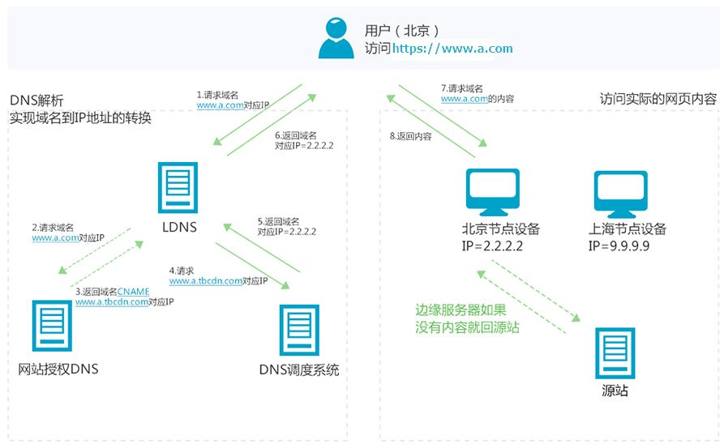
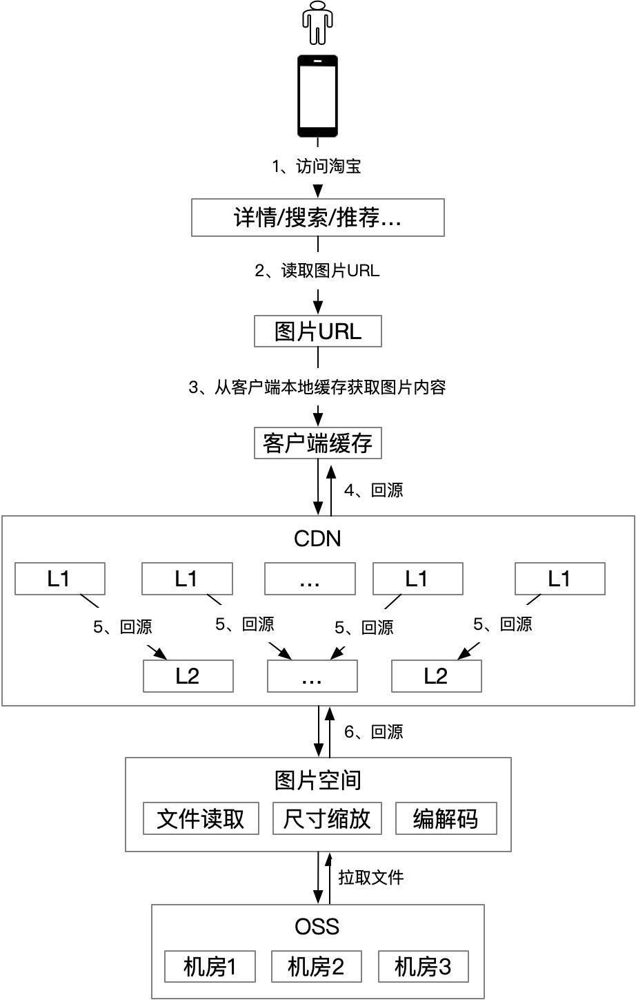
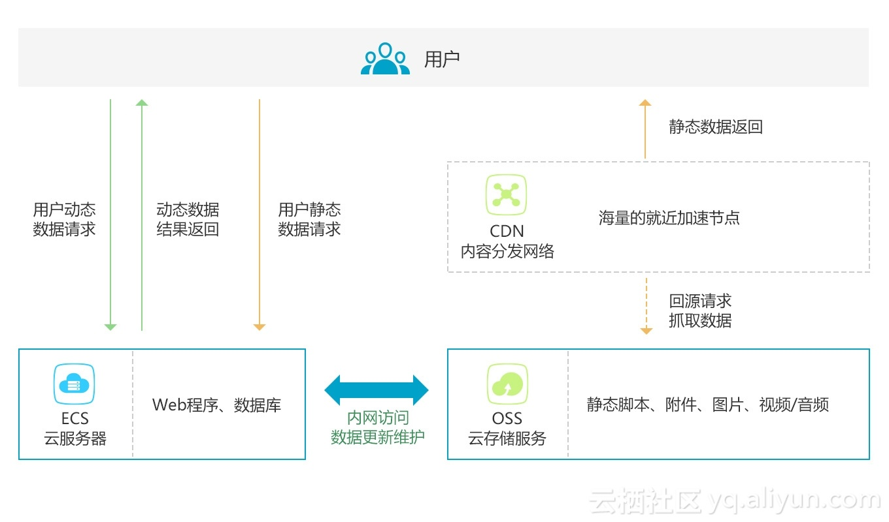
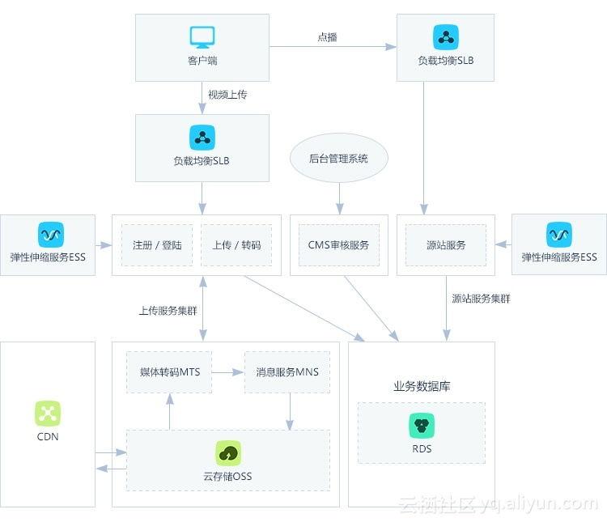
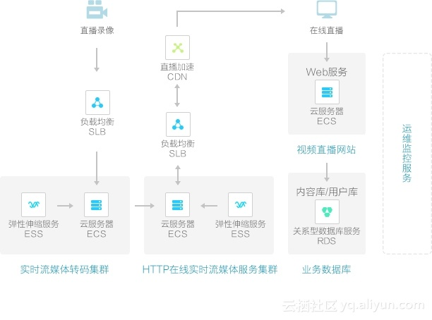
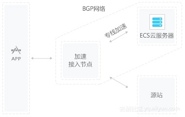

# 起因

前些日子配置博客，解决国内网络的访问问题的时候发现自定义里面的cdn链接有问题，今天看面经发现有问cdn相关的问题，所以还是了解以下这些相关的知识吧，也不知cdn，包括CNAME，域名绑定啊，还有ICP什么的，万一能顺带更好的解决前几天的问题呢

# CNAME

使用githubpage 绑定到个人域名的时候遇到了CNAME

### CNAME记录

**真实名称记录**（英语：Canonical Name Record），即**CNAME记录**，是域名系统（[DNS](https://zh.m.wikipedia.org/wiki/DNS)）的一种记录。<u>CNAME记录用于将一个[域名](https://zh.m.wikipedia.org/wiki/域名)（同名）映射到另一个域名（真实名称），[域名解析服务器](https://zh.m.wikipedia.org/wiki/域名解析服务器)遇到CNAME记录会以映射到的目标重新开始查询。</u>

> 域名绑定的时候就用到了这种互指
>
> 域名绑定的一种解决方案就是 
>
> 1. 在github博客仓库中新建CNAME文件，里面填写另一个域名
> 2. 在另一个域名的配置界面，设置CNAME指向github格式的博客地址  或者A指向github访问地址的ip

### 使用A记录和CNAME进行域名解析的区别

A记录就是把一个`域名`解析到一个`IP地址`（Address，特制数字IP地址），而CNAME记录就是把`域名`解析到另外一个`域名`。其功能是差不多，CNAME将几个主机名指向一个别名，其实跟指向IP地址是一样的，因为这个别名也要做一个A记录的。但是使用CNAME记录可以很方便地变更IP地址。如果一台服务器有100个网站，他们都做了别名，该台服务器变更IP时，只需要变更别名的A记录就可以了。

### 大佬的解释

#### **1.A记录**

A记录，即Address记录，它并不是一个IP或者一个域名，我们可以把它理解为一种指向关系：

> 域名 [www.xx.com](http://www.xx.com/) → 1.1.1.1
> 主机名 DD → 2.2.2.2

也就是当你访问这些域名或者主机名的时候，DNS服务器上会通过A记录会帮你解析出相应的IP地址，以达到后续访问目的。所以A记录是IP解析，直接将域名或主机名指向某个IP。

#### **2.CNAME**

CNAME记录，也叫别名记录，相当于给A记录中的域名起个小名儿，比如[www.xx.com](http://www.xx.com/)的小名儿就叫[www.yy.com](http://www.yy.com/)好了，然后CNAME记录也和A记录一样，是一种指向关系，把小名儿[www.yy.com](http://www.yy.com/)指向了[www.xx.com](http://www.xx.com/)，然后通过A记录，[www.xx.com](http://www.xx.com/)又指向了对应的IP：

> [www.yy.com](http://www.yy.com/)→ [www.xx.com](http://www.xx.com/) → 1.1.1.1

这样一来就能通过它的小名儿直接访问1.1.1.1了。

#### 这时候有人问：这不多了一步嘛，不嫌麻烦？

假如这个时候我又想给原域名取几个小名儿，分别叫[www.cc.com](http://www.cc.com/)和[www.kk.com](http://www.kk.com/)那么存在下列指向关系：

> [www.yy.com](http://www.yy.com/) → [www.xx.com](http://www.xx.com/) → 1.1.1.1
> [www.cc.com](http://www.cc.com/) → [www.xx.com](http://www.xx.com/) → 1.1.1.1
> [www.kk.com](http://www.kk.com/) → [www.xx.com](http://www.xx.com/) → 1.1.1.1

突然服务器的IP地址因为一些不可描述的原因要更换了，不再是1.1.1.1了，换成了2.2.2.2，这时候你发现，只要把[www.xx.com](http://www.xx.com/)的指向修改一下即可：

> 域名 [www.xx.com](http://www.xx.com/) → 2.2.2.2

这时候你又发现了，原来他的小名儿不需要做更改，直接就能访问服务器，因为他们都只指向了[www.xx.com](http://www.xx.com/)，服务器IP改没改它们不管。

那么假如不用CNAME，直接做A记录会怎样？

> [www.yy.com](http://www.yy.com/) → 1.1.1.1
> [www.cc.com](http://www.cc.com/) → 1.1.1.1
> [www.xx.com](http://www.xx.com/) → 1.1.1.1
> [www.kk.com](http://www.kk.com/) → 1.1.1.1

那么当1.1.1.1更改的时候，全部相关A记录指向关系都要做更改，这才麻烦

### **CNAME的应用就是CDN**

# [CDN](https://www.zhihu.com/question/36514327/answer/1604554133)

> 参考这位大佬的文章 [阿里巴巴大淘宝技术](https://www.zhihu.com/org/a-li-ba-ba-tao-xi-ji-zhu)

淘宝的图片访问，有98%的流量都走了CDN缓存。只有2%会回源到源站，节省了大量的服务器资源。
但是，如果在用户访问高峰期，图片内容大批量发生变化，大量用户的访问就会穿透cdn，对源站造成巨大的压力。

## CDN工作原理

> **边缘节点**
>
> 也称CDN节点、Cache节点等；是相对于网络的复杂结构而提出的一个概念，指距离最终用户接入具有较少的中间环节的网络节点，对最终接入用户有较好的响应能力和连接速度。其作用是将访问量较大的网页内容和对象保存在服务器前端的专用cache设备上，以此来提高网站访问的速度和质量。

内容分发网络（Content Delivery Network，简称CDN）是建立并覆盖在承载网之上，由分布在不同区域的边缘节点服务器群组成的分布式网络。
CDN应用广泛，支持多种行业、多种场景内容加速，例如：图片小文件、大文件下载、视音频点播、直播流媒体、全站加速、安全加速。

借用阿里云官网的例子，来简单介绍CDN的工作原理。

假设通过CDN加速的域名为`www.a.com`，接入CDN网络，开始使用加速服务后，当终端用户（北京）发起HTTP请求时，处理流程如下：

1. 当终端用户（北京）向`www.a.com`下的指定资源发起请求时，首先向LDNS（本地DNS）发起域名解析请求。
2. LDNS检查缓存中是否有`www.a.com`的IP地址记录。如果有，则直接返回给终端用户；如果没有，则向授权DNS查询。
3. 当授权DNS解析`www.a.com`时，返回域名**`CNAME`** `www.a.tbcdn.com`对应IP地址。
4. 域名解析请求发送至阿里云DNS调度系统，并为请求分配最佳节点IP地址。
5. LDNS获取DNS返回的解析IP地址。
6. 用户获取解析IP地址。
7. 用户向获取的IP地址发起对该资源的访问请求。

- 如果该IP地址对应的节点已缓存该资源，则会将数据直接返回给用户，例如，图中步骤7和8，请求结束。
- 如果该IP地址对应的节点未缓存该资源，则节点向源站发起对该资源的请求。获取资源后，结合用户自定义配置的缓存策略，将资源缓存至节点，例如，图中的北京节点，并返回给用户，请求结束。

从这个例子可以了解到：

1. `CDN的加速资源是跟域名绑定的。`
2. 通过域名访问资源，首先是通过DNS分查找离用户最近的CDN节点（边缘服务器）的IP
3. 通过IP访问实际资源时，如果CDN上并没有缓存资源，则会到源站请求资源，并缓存到CDN节点上，这样，用户下一次访问时，该CDN节点就会有对应资源的缓存了。

### 我理解的实现原理：

在域名解析的过程中，通过域名的单向CNAME绑定到临近服务器的域名，定位ip为与原域名服务器相关的服务器ip，请求访问临近服务器，临近服务器缓存中不包含所请求的资源的话，再不惜高延迟的访问原域名服务器，同时cdn缓存数据

## 淘宝图片空间和CDN的架构 

淘宝整个图片的访问链路有三级缓存（客户端本地、CDN L1、CDN L2），所有图片都持久化的存储到OSS中。真正处理图片的是img-picasso系统，它的功能比较复杂，包括从OSS读取文件，对图片尺寸进行缩放，编解码，所以机器成本比较高。

CDN的缓存分成2级，合理的分配L1和L2的比例，一方面，可以通过一致性hash的手段，在同等资源的情况下，缓存更多内容，提升整体缓存命中率；另一方面，可以平衡计算和IO，充分利用不同配置的机器的能力。

用户访问图片的过程如下：

1. 用户通过手机淘宝来搜索商品或者查看宝贝详情。
2. 详情/搜索/推荐通过调用商品中心返回商品的图片URL。
3. 客户端本地如果有该图片的缓存，则直接渲染图片，否则执行下一步。
4. 从CDN L1回源图片，如果L1有该图片的缓存，则客户端渲染图片，同时缓存到本地，如果L1没有缓存，则执行下一步。
5. 从CDN L2回源图片，如果L2有该图片的缓存，则客户端渲染图片，同时CDN L1及客户端缓存图片内容，如果CDN L2没有缓存该图片，则执行下一步。
6. 从图片空间回源图片，图片空间会从OSS拉取图片源文件，按要求进行尺寸缩放，然后执行编解码，返回客户端能够支持的图片内容，之后客户端就可以渲染图片，同时CDN的L1、L2以及客户端都会缓存图片内容。

## CDN的优势

### 最大的优势：**加速网站的访问**

尽管使用 CDN 的好处取决于互联网资产的大小和需求，但对于大多数用户而言，主要好处可以分为以下四个不同的部分：

1. **缩短网站加载时间** – 通过将内容分发到访问者附近的 CDN 服务器（以及其他优化措施），访问者体验到更快的页面加载时间。由于访问者更倾向于离开加载缓慢的网站，CDN 可以降低跳出率并增加人们在该网站上停留的时间。换句话说，网站速度越快，用户停留的时间越长。
2. **减少带宽成本** – 网站托管的带宽消耗成本是网站的主要费用。通过缓存和其他优化，CDN 能够减少源服务器必须提供的数据量，从而降低网站所有者的托管成本。
3. **增加内容可用性和冗余** – 大流量或硬件故障可能会扰乱正常的网站功能。由于 CDN 具有分布式特性，因此与许多源服务器相比，CDN 可以处理更多流量并更好地承受硬件故障。
4. **改善网站安全性** – CDN 可以通过提供 [DDoS 缓解](https://www.cloudflare.com/learning/ddos/ddos-mitigation/)、安全证书的改进以及其他优化措施来提高安全性。

## CDN应用场景

### **1、网站站点/应用加速**

<u>站点或者应用中大量静态资源的加速分发，建议将站点内容进行动静分离，动态文件可以结合云服务器ECS，静态资源如各类型图片、html、css、js文件等，建议结合 对象存储OSS 存储海量静态资源，可以有效加速内容加载速度，轻松搞定网站图片、短视频等内容分发</u>

- 架构示意图

### **2、视音频点播/大文件下载分发加速**

支持各类文件的下载、分发，支持在线点播加速业务，如mp4、flv视频文件或者平均单个文件大小在20M以上，主要的业务场景是视音频点播、大文件下载（如安装包下载）等，建议搭配对象存储OSS使用，可提升回源速度，节约近2/3回源带宽成本。

- 架构示意图

### **3、视频直播加速**

视频流媒体直播服务，支持媒资存储、切片转码、访问鉴权、内容分发加速一体化解决方案。结合弹性伸缩服务，及时调整服务器带宽，应对突发访问流量；结合媒体转码服务，享受高速稳定的并行转码，且任务规模无缝扩展。

- 架构示意图

### **4、移动应用加速**

移动APP更新文件（apk文件）分发，移动APP内图片、页面、短视频、UGC等内容的优化加速分发。提供httpDNS服务，避免DNS劫持并获得实时精确的DNS解析结果，有效缩短用户访问时间，提升用户体验。

- 架构示意图

# ICP

### 是什么

ICP，即“网络内容服务商”，可简单的理解为互联网网站，但不是所有的网站都需要办理ICP经营许可证，只有经营性且作为第三方平台的信息类网站才需要办理ICP经营许可证，而且是必须办理后才可以上线经营提供服务。

ICP许可证主要是面向在网上涉及到经营性质或者在网上提供有偿信息服务的网站需要申请的，像这种性质的网站很多，比如有网上注册需要登陆的、会员进行充值的、还有就像58同城,BOSS直聘，智联等这种招聘信息的，还有就是运营游戏产品的，进行游戏充值的，你办了ICP许可证才可以在网上发布消息，`ICP许可证是国家要求办理的，如果经营性质网站不办理时属于违法行为`。

### 个人遇到的坑

前面也提到了，前面做域名备案遇到了好多坑，稍微记录一下，以后做个人域名的备案就不要再踩了：

#### 域名和服务器最好选择同一家厂商

前面我域名在阿里买，服务器图便宜买的腾讯云的，这样导致的直接后果就是，备案的时候要提供个人信息，实名认证，究极全的信息的完整截图，而阿里云的域名管理界面我反正是没有找到信息如此之全的截图

#### 备案看当地政策

在户口所在地备案事情还少一点，在外地的话，备案时需要提供居住证或者其他证件（像我这种学生党只能使用学生证）

#### 个人介绍？网站介绍？

因为流程没有走下去，懒得折腾了，看网上说个人介绍，网站介绍之类的也很有讲究，填信息前多上网搜索吧
