## Frequency-Bessel Transform Method for Effective Imaging of Higher-Mode Rayleigh Dispersion Curves From Ambient Seismic Noise Data

### 摘要

两个站点记录的环境地震噪声数据的互相关函数近似于两个站点间的格林函数的部分，这已被广泛认识。因此，互相关函数除了基本模态外，还应该包括更高的模态。然而，从环境地震噪声数据中测量或提取泛音的问题仍然存在。本文提出了一种频率贝塞尔变换方法，从环境地震噪声数据中提取高模态的色散曲线。然后，我们通过进行广泛的数值模拟和对美国阵列观测到的环境地震噪声数据进行处理，来评估F-J方法的有效性、准确性和适用性。本研究表明，F-J方法是一种提取环境地震噪声数据多模色散曲线的方法，因此在环境地震噪声层析领域具有显著的应用潜力

### **1. Introduction**

环境地震噪声，在岩工工程领域也称为微震，是由各种被动源产生的随机波场（例如，冈田和素托，2003；杨等，2007；杨和里茨沃勒，2008)。在阿基（1957）和其他研究人员的开创性工作之后（例如，坎皮罗和保罗，2003；德罗德等，2003；洛布基斯和韦弗，2001；2005等，2005a，2005b；桑切斯-塞斯马等人，2011；夏皮罗和坎皮罗，2004；夏皮罗等人，2005；斯奈德，2004)，一旦无用的环境噪声数据被转换为有用的地震数据，可以从中提取表面波的群和/或相速度。因此，环境地震噪声表面层析成像新领域迅速出现，并广泛应用于不同尺度的地质结构测绘，从岩土技术工程应用的浅层结构到地壳和岩石圈结构（如本森等，2007,2009；林等，2008；莫斯蒂等，2007；中村，1989；西田等，2009；2003；佐藤等，2003；2001；夏皮罗等，2005；沈和20茨沃勒，2016；泰勒等，2009；东木，1997；杨和里茨沃勒，2008；姚等，2006)。

环境噪声互相关法为比传统地震面波法在较短的周期内测量相/群速度提供了一种有效的工具。因此，它显著提高了地震面波层析成像的分辨率，并扩展了其适用性（例如，Bensen等，2009年；林等，2011年；田等，2013年；杨和里茨沃勒，2008年；杨等，2011年）。然而，它仍然存在着与经典的表面波层析成像方法类似的问题，如反转地壳和岩石圈结构的非唯一性和有限的精度。非唯一性的发生是因为在反演中只使用了基本的色散曲线。因此，提取泛音的色散曲线并在反演中使用，对于解决或降低非唯一性、提高表面波反演的精度至关重要。这一概念长期以来在表面波断层扫描的研究中早已得到认可（例如，Asten，2006；马拉斯奇尼等人，2010；Nolet & Panza，1976；威金斯，1972；横井，2010）。

从环境噪声中提取色散曲线是微震测量和环境地震噪声层析成像的关键步骤。在过去几十年中，已经发展了许多方法，如空间自相关法（Aki，1957）、频率波数（FK）法（康彭，1969；拉科斯等，1969年）、相速度图像分析(Yao等，2006年）、表面波多通道分析（MASW）方法（例如，公园等，1998年，2007年；公园与米勒，2008年）和高分辨率线性雷达变换（如罗等，2008年；Pan等，2016年）。基本色散曲线的提取方法被认为是成熟的。最近，越来越多的研究人员通过仔细分析确定环境地震噪声的较高模式（例如，布鲁克斯等，2009年；20月等，2015年；哈蒙等，2007年；金曼和特兰伯特，2010年；林等，2013年；莫德雷特等，2014年；西田等人，2008年；铆钉等人，2015年；萨维奇等人，2013年；托马等人，2018年；姚等人，2011年）。

本文提出了一种新的频率-贝塞尔方法（简称F-J方法）来提取泛音的色散曲线。通过各种综合数据，系统地研究了其有效性、准确性和适用性。我们还通过将该方法应用于USArray中观测到的环境地震噪声数据来测试这种新方法。

### **2. Theory of Frequency-Bessel Transform Method**

在平面多层各向同性弹性模型中，考虑环境地震噪声是一个在空间和时间上都是平稳的随机场。两个接收机之间的环境地震噪声记录的时间互相关函数（CCF）被定义为（例如，Jacobson，1962）

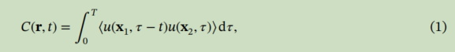

其中，u（x，t）是在点x和r = x1−x2中的环境地震噪声记录的垂直分量。⟨·⟩表示随机系综上的平均值。根据均分假设（坎皮罗&保罗，2003；坎皮罗，2006），环境地震噪声是一个各向同性场，因此C（r，t）= C（r，t），r = |r|是两个站之间的距离。在频域中，公式(1)变为

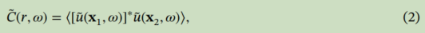

式中，C（r，𝜔）=F[C（r，t）]、u (x、𝜔）=F[u（x，t）]和“∗”表示复形共轭物。然后，我们将频率向量波数变换定义为CCF   C（r，𝜔）的频谱如下：

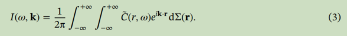

这种集成是在整个曲面上执行的。在圆柱坐标系中，方程(3)变为

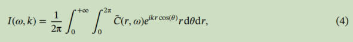

其中，k=|k|。通过使用贝塞尔函数的积分表示（例如，Temme，1996），

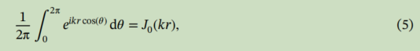

==式(4)可简化为==

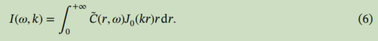

式(6)表明，对于各向同性CCF，向量波数（二维）可以简化为一维积分，并且只依赖于向量波数(k)的范数，而不依赖于向量k。注意到I（𝜔，k）是一个简化的频率贝塞尔变换。因此，本文以后将使用I（𝜔，k）而不是I（𝜔，k），并将其命名为频率贝塞尔谱图（缩写为F-J谱图）。

根据以往的研究（如，桑切泽斯马和坎皮罗，2006；Sato et al.，2012），==两点之间环境地震噪声数据的CCF的傅里叶变换近似于这些点之间格林函数的虚部==，即，

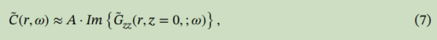

其中A是一个常数，Gzz（r，z=0；𝜔）是具有下中心距离r的格林函数的垂直分量的光谱，并记录在表面（z = 0）。

对于平面层状弹性半空间，各向同性源（如爆炸和垂直振动源）产生的格林函数形式如下（如Chen，1993、1999；Hisada，1994；Kennett，1986；卢科&阿普塞尔，1983)：

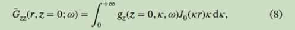

其中g（z，𝜅，𝜔）是一个独立于r的核函数。此外，J0（kr）是第一一种零阶的贝塞尔函数。

将方程(7)和(8)代入方程(6)，得到

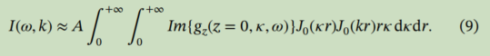

通过交换积分阶，利用贝塞尔函数的正交性质（例如，Arfken et al.，2012）：∫0+∞J0（kr）J0（𝜅r）rdr=1𝜅𝛿（k−𝜅），可以将上述方程简化为

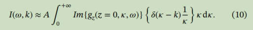

最后，我们得到

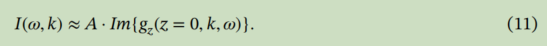

根据𝜔和c，（c =𝜔∕k，c为相速度），上面的方程可以重算为

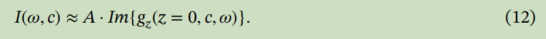

我们可以看到，I（𝜔，c）可以通过积分使用公式(6)精确地计算出来。然而，在实践中，我们不能获得这样一个精确的I（𝜔，c），因为只有有限的可用数据来评估积分。例如，我们只有数据{C（r𝑗，𝜔），𝑗= 1,2，……，N}。如附录A所示，利用观测阵列提供的有限可用地震数据，我们可以通过有限离散求和得到近似的I（𝜔，c）：

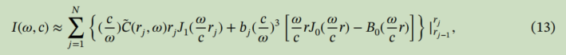

式中，rj为计算CCFC（r𝑗，𝜔）的第j对站之间的距离，定义为r0 = 0，函数B0(x) =∫0 xJ 0（𝜂）d𝜂，和系数bj由b𝑗=[C（r~𝑗~）−C（r~𝑗−1~）]∕𝛿r𝑗.给出

我们注意到核函数gz（z = 0，c，𝜔）与长期函数det |I−Rsl DR𝑓s U | (I成反比（I是一个单位矩阵；R是反射矩阵；下标D和U表示上下移动；s，l和f分别表示源、半空间边界和自由曲面；例如，Kennett，1986；McMechan & Yedlin，1981）。显然，色散点的长期函数的根（c=cn（𝜔），n=0,1,2，...）是核函数的奇异点。因此，核函数gz（z = 0，c，𝜔）在色散点上趋于无穷。

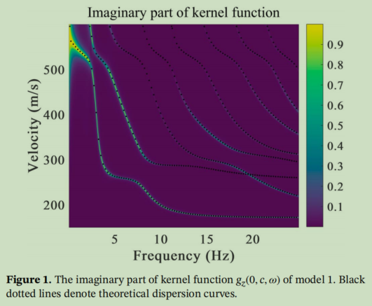

图1显示了一个给定的平面层模型在“f-c”域中的Im{gz（z = 0，c，𝜔）}的一个例子，其参数如表1所示。黑色虚线是理论上预测的色散曲线，与核函数虚部值较大的区域完全匹配。在理论上，核函数在色散点上的值应该是无穷大的。由于有限的像素扫描，在绘制Im{gz（z = 0，c，𝜔）}中只能观察到有限但较大的值。根据核函数的这个奇异性质，提出了一种新的di提取方法

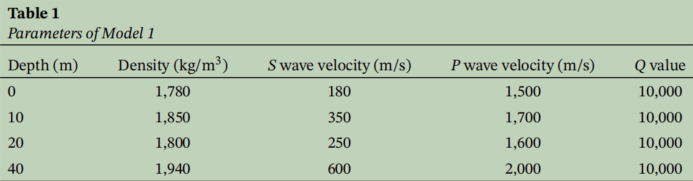

步骤1。对于一个给定的地震观测阵列，在对环境地震噪声记录进行预处理后，计算出所有可能的观测站对的光谱CCFs。此步骤与环境地震噪声表面波层析成像中的预处理程序相同（例如，Bensen等，2007年；林等，2008年；Prieto等，2011年；夏皮罗和坎皮罗，2004年；Yao等，2006年）。

步骤2。将光谱CCFs作为站间距离（rj）的函数进行排序，并对其进行频率-贝塞尔变换，即利用每个给定𝜔的离散求和公式计算F-J光谱图I（𝜔，c）。

步骤3。利用图像识别算法从I（𝜔，c）图像中识别色散曲线。

因此，我们将这种新方法命名为频率-贝塞尔变换方法，简称为F-J方法。我们的新方法与MASW（Park & Miller，2008；Park等，2007）和Radon变换方法（例如，Luo等，2008；Pan等，2016；简称RTM)相似，但有所不同。在MASW和RTM中，变换的基函数是“eikx”或“ei𝜔px”，因此表示一个一维空间傅里叶变换。而在F-J方法中，矢量波数变换的基函数是“rJ0（kr）”。这代表了一个各向同性的二维空间傅里叶变换，尽管只涉及一维变换积分。前一种一维波数变换，或Radon变换，对应于水平分层介质中的二维波传播问题，或者物理上的由无限长线源激发的波传播问题。然而，F-J方法中所涉及的二维波数变换对应于水平分层介质中的三维波传播问题或水平分层介质中的点源激发的波传播问题。在我们的研究中遇到的几乎所有的实际问题都是三维问题；因此，F-J方法是一个合适的选择。

### **3. Tests With Synthetic Data**

为了评估F-J方法的有效性和准确性，我们进行了一些数值试验。首先，通过合成大量的理论地震图，得到了环境地震噪声数据给定了平面层状模型，其色散曲线可以独立计算（Chen，1993）。由于F-J方法与尺度无关，因此我们只合成了小尺度模型的环境地震噪声数据。其次，我们将F-J方法应用于这些合成的环境噪声数据，对色散曲线进行成像，以评估F-J方法的有效性和准确性。给定了平面层状模型，其色散曲线可以独立计算（Chen，1993）。由于F-J方法与尺度无关，因此我们只合成了小尺度模型的环境地震噪声数据。其次，我们将F-J方法应用于这些合成的环境噪声数据，对色散曲线进行成像，以评估F-J方法的有效性和准确性。

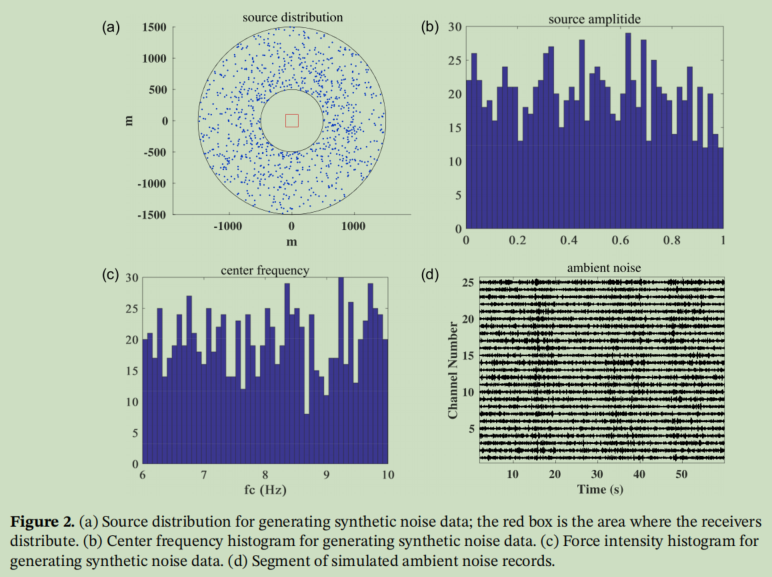

#### **3.1. Synthetic Ambient Seismic Noise Data**

我们遵循方法（Bonnefoy-Claudet et al.，2004）来合成环境噪声数据；1000个源随机分布在500-50-1500米的环区表面，如图2a所示。每个源都是一个垂直的点力与瑞克小波。源的中心频率随机分布在6~10Hz之间，如图2b所示。力的强度也随机分布在0.001到1之间，如图2c所示。合成环境噪声的垂直分量计算了约60秒，频带为0.5到25 Hz。我们采用广义反射传输系数法（例如，陈，1993,1999年；陈&张，2001；Hisada，1994；Zhang et al.，2003)来计算综合地震图。图2d显示了模拟的环境噪声记录的片段。本研究考虑了三种类型的观测阵列：线性阵列、三线阵列和随机分布阵列，如图3所示。

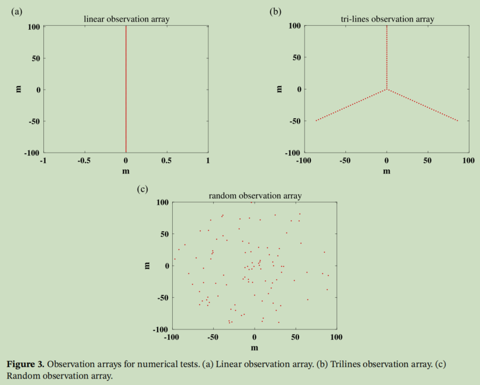

#### **3.2. Structure With Soft Layers**

数值试验的第一个模型（以下简称模型1）包括四层低速区（表1；Ikeda et al.，2012）。研究了三个观测阵列。计算了该速度模型的核函数Im{gz（0，c，𝜔）}的虚部，如图1所示，其中色散曲线用黑色虚线表示。我们可以看到核函数与理论色散曲线完全匹配。此外，第一模态的能量在4-9和19-25Hz两个频率范围内占主导地位。在13-17hz范围内，出现了其他更高的模式色散曲线

**3.2.1. Linear Observation Array**

在线性观测阵列中，有100个接收机沿着一条线均匀分布，如图3a所示。阵列的总范围为200米，接收器之间的间隔为2米。合成的环境噪声数据是使用第3.1节中描述的过程生成。扫描（𝜔，c）后，应用F-J方法得到F-J谱图I（𝜔，c)，如图4a所示。

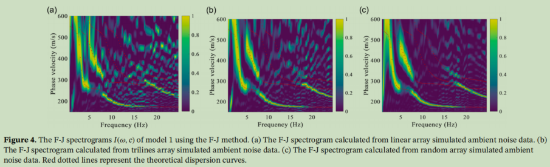

如图4a所示，我们可以通过追踪I（𝜔，c）图像的峰值点来提取多模态的色散曲线。基模色散曲线出现在4-5和7-17Hz的频率范围内。第一个较高的模式色散曲线出现在5-8和20-24Hz的频率范围内，另一个更高的模式出现在18-20Hz的频率范围内。这些色散曲线与用广义反射-透射系数法计算出的理论色散曲线非常吻合（Chen，1993）。

**3.2.2. Trilines Observation Array**

在这个观测阵列中，100个接收器从中心点均匀分布在三条辐射线上，如图3b所示。任意两条线之间的夹角为120◦，每条线上接收器之间的间隔一致为3m。距中心点的最大半径为99 m。我们将F-J方法应用于合成环境噪声数据，得到F-J光谱图I（𝜔，c），如图4b所示。

通过追踪图4b所示的I（𝜔，c）图像的峰值点，我们不仅可以确定3-5和7-20Hz频率范围内的基本模色散曲线，还可以确定4-9和20-25Hz频率范围内的第一个高模色散曲线。这些色散曲线虽然只有部分分段，但与用红色虚线表示的理论色散曲线很吻合。图像I（𝜔，c）上显示的另一个有趣的特征是，清晰识别的色散曲线片段与核函数Im{gz（0，c，𝜔）}值较大的区域很好地相关联，如图1所示。

**3.2.3. Random Observation Array**

第三个观测阵列是一个随机阵列，其中接收器随机分布在一个区域内。我们现在研究F-J方法在这个随机观察阵列中的有效性。图3c显示了要研究的观测阵列的配置。100个接收器随机分布在一个半径为100米的圆圈内。

同样，我们将F-J方法应用于合成环境噪声数据，得到了I（𝜔，c）的图像，如图4c所示。在这幅图像中，可以清晰地识别出3-5hz和7-20hz频率范围内的基本色散曲线，而第一个较高模式可以很好地确定4-9hz和20-25hz频率范围内的色散曲线。我们还可以区分其他频率范围内泛音的色散曲线，如分别在16-20hz和15-18hz频率范围内的第二和第三模式的色散曲线。我们注意到，“累积”似乎发生在第一个和第一个之间19 Hz的第二模式，如图4c所示（例如，Boaga等，2013；德尼尔，2005；马利舍夫斯基等，2008；团等，2011；张&陈，2003；张与露，2003；张等，2016)。这两种模态不交叉，但在这个频率下，它们的相速度在这个频率下非常接近。

进一步比较图4a-4c的结果可以看出，F-J方法用随机分布的观测阵列得到的色散曲线优于线性阵列和三线阵列。因此，我们将在以下的测试中使用随机观测阵列来实现F-J方法。

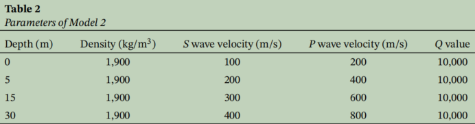

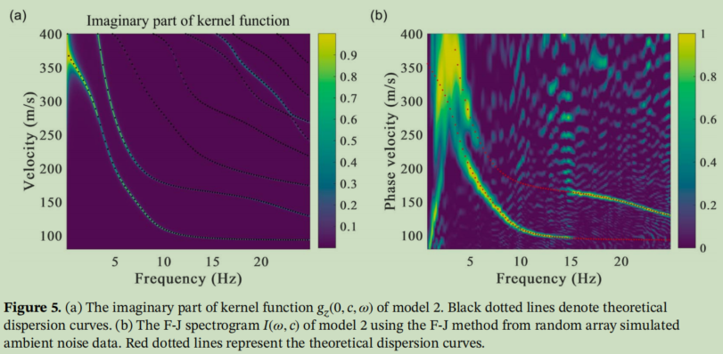

**3.3. Monotonically Increasing Velocity Model**

模型2是一个四层单调递增的速度模型（Foti et al.，2014）。表2显示了该模型的参数。图5a绘制了该模型对应的核函数Im{gz（0、c、𝜔）}。接收机的分布与模型1的随机观测阵列的分布相同。通过将F-J方法应用于合成噪声数据，我们得到了I（𝜔，c）的图像，如图5b所示。在图像上可以清楚地看到小于15 Hz的频率和15~25Hz频率范围内的第一个高模的色散曲线，这与核函数图一致（图5a）。

**3.4. Realistic 1-D Velocity Model**

模型3是基于上海实际近地表砂岩和粉砂壤土结构的一维速度模型，包含六层。表3显示了该模型的参数。图6a为模型3的核函数映射的虚部。观测数组与模型2中的问题相同。此外，图6b显示了I（𝜔，c）的图像。再一次，多模瑞利色散曲线可以清晰地识别在我（𝜔，c）图像：基本模式色散曲线出现在频率低于10 Hz，和第一、第二、第三、第五、第六高模色散曲线出现在频率高于8、11、16赫兹和频率范围内的14-20和19-24Hz，分别。

## CC-FJpy: A Python Package for Extracting Overtone Surface-Wave Dispersion from Seismic Ambient Noise Cross <u>Correlation</u>

近二十年来，地震环境噪声互相关（CC）一直是地震学中最重要的技术之一。通常，只从环境噪声中提取基模表波色散。近年来，利用频率-贝塞尔变换（F-J）方法，也可以从环境噪声中提取泛音色散，为反演增加了显著的价值。该方法也被证实对地震事件的阵地震记录是有效的。在本文中，我们将描述我们的算法和一个称为CC-FJpy的Python包。对于F-J方法，我们使用Nvidia的图形处理单元来加速计算，这可以达到100倍的计算效率。我们已经将我们的经验和技术封装到CC-FJpy中，并通过环境噪声和地震数据对CC-FJpy进行了测试，以确保它的速度和易用性。我们的开源软件包CC-FJpy可以促进利用环境噪声的表面波研究的发展，并使其更容易从高模表面波开始。

### Introduction

在过去的20年里，通过发展噪声互相关（CC）技术实现了表面波成像的重要信息（例如，卡姆皮罗和保罗，2003；Sabra等，2005a，b；夏皮罗等，2005；姚等，2006；本森等，2009；林等，2009年，林和里茨沃勒，2011年；方等，2015年，2016年；沈和里茨沃勒，2016年）。对于环境噪声表面波成像，特别是岩石圈成像，通常只获得基本模式并用于反演（例如，Bensen et al.，2007）。研究证实，高模表波色散数据可以在表波反转中提供更多约束（例如，Nolet，1976年；Yokoi，2010年；Pan等，2019年；Wu等，2020年）。然而，提取高模色散度一直具有挑战性。最近，J. Wang et al.（2019）取得了突破，利用频率-贝塞尔变换（F-J）方法从环境噪声CC函数（CCFs）中有效提取瑞利波多模色散曲线。随后，Hu等人（2020）验证了该方法可以应用于爱情波的分析。李和C应用该方法对东北地区的局部三维速度模型进行了更新。为了进一步促进对高模式表面波的研究，我们将我们的算法打包成一个开源的Python包CC-FJpy。

通过F-J方法进行的成像过程可分为以下四个步骤：(1)读取数据和预处理，(2)噪声CC、(3) F-J扫描，(4)色散曲线提取和反演（图1）。其中，步骤(1)主要取决于存储格式（如地震分析代码[SAC]或mini种子)和数据的存储顺序，步骤(4)有许多个性化的解决方案（例如，Shen等人，2013年；德雷林和蒂尔曼，2019年；Pan等人，2019年）。我们建议使用ObsPy来读取和预处理数据（Beyreuther等人，2010）。CCFJpy主要处理步骤(2)噪声CC和步骤(3) F-J扫描。CC-FJpy的核心代码由C语言和计算统一设备架构（CUDA）编程语言编写，并通过Cython封装为Python接口。

噪声CC技术是地震学中的一个重要工具。由CC得到的CCFs可以近似为格林函数（例如，Weaver和Lobkis，2004；桑切斯-塞斯马和坎皮罗，2006年）。在地震学中，环境噪声CCFs被广泛应用于表面波成像（例如姚等，2006年；本森等，2009年）、体波成像（如波利等，2012年；冯等，2017年）、全波形反转(Sager等，2018年，2020年；K. Wang等，2019年）和衰减模拟（例如劳伦斯等，2013年）。地震学家已经努力提高CCFs的质量（例如，Seats等，2012；沈等，2012；谢等，2020年）和CC的效率（如图形处理单元[GPU]加速，Ventosa等，2019年）。CCF的计算是基于每个站对的连续记录，主要包括波形的数据加载、预处理和CC的计算三个步骤。对于N（N > 2）站记录，需要计算C2N站对的CCFs。如果以每个站对为单位进行计算，则会有重复的数据加载、预处理和快速傅里叶变换（FFT）。为了提高计算效率，在CC-FJpy中的N个站单元中进行了数据加载、预处理和FFT的规划，避免了重复计算。

对于F-J方法，其核心是对以下积分进行数值计算：

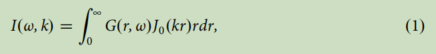

其中Gr；ω可以是CCFs或地震记录，k为波数，r为环境噪声的站间距离或地震记录的震中距离，J0x为第1类的第零个贝塞尔函数。梯形积分可以用来实现方程(1)，但它忽略了贝塞尔函数的已知特征。J. Wang等人（2019）以更多的计算为代价，给出了更准确的积分格式。为了平衡效率和准确性，我们使用GPU来加速这个过程。该GPU非常适合于这类计算，可以有效地缩短计算时间。此外，我们注意到贝塞尔函数可以表示为两种汉克尔函数的和，它们分别表示向内外传播的波场。向内的波场可以与从环境噪声中检索到的向外的格林函数相互作用，并产生污染色散谱的交叉伪影（Forbriger，2003；Xi等人，2021年）。在CC-FJpy中，我们封装了使用汉克尔函数而不是贝塞尔函数的积分，以避免交叉的伪影。

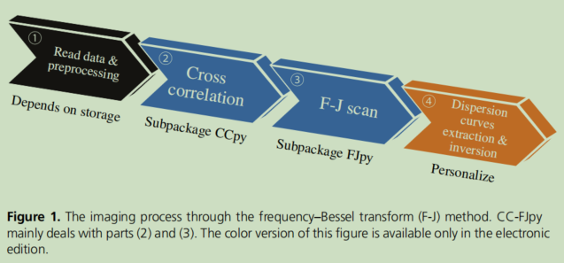

### Implementation

#### Calculation of CC

首先，让我们简要回顾一下CC的基本公式：

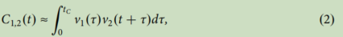

其中v1t和v2t分别为站1和站2在时间窗[0；tC]中的连续宽带记录。通常，tC不是总的连续记录时间，因为记录被分为单位时间段或窗口，如1小时、一天或一周。CCFs是通过用不同的时间窗叠加大量的C1；2t来获得的。在时域内对公式(2)的直接计算是很耗时的，所以对于大多数程序，它都是在频域内实现的：

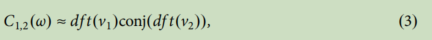

其中df t是离散傅里叶变换，conj是复共轭。

要计算一个站点对的CCFs，需要执行三个步骤，包括数据加载、预处理和计算CC（例如，MATLAB（参见数据和资源）函数（子例程）xcorr）。在此基础上，对于N（N > 2）站，需要对C2N站对进行先前的计算（图2a)。在此过程中，每个站的数据有N−1次重复加载、预处理和FFT（基于站对的计算）。为了提高计算效率，CC-FJpy执行加载数据、预处理、FFT以N站数据为单位，以避免重复（图2b）。此外，CC-FJpy将ccf堆叠在频域内，可以减少对逆FFT（IFFT）的调用次数。我们使用由C编程语言调用的FFT的fftw-3包（Frigo和Johhnson，2005）。所有的C代码都通过Cython被封装为一个Python接口。

在许多情况下，为了提高CCF的质量，需要进行重叠的单元（Seats et al.，2012）。在我们的程序中，我们设计了一个更大的读取单元TC用于读取，并在内部执行tC的重叠，以提高效率。用户可以通过Python界面ccfj选择重叠率，是否使用光谱白化，是否使用一位和其他选项。抄送。我们将在USArray的示例部分中展示一个来自USArray的数据的具体示例。具体情况请参考包装手册及附件“example_CC.ipynb”（详见本文的补充资料）。

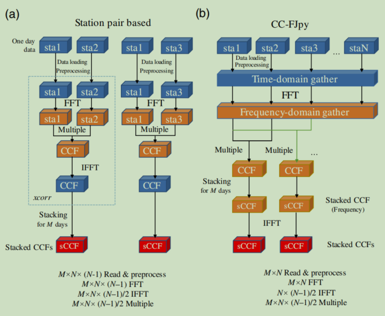

#### Implementation of the F-J method

F-J方法的核心是方程(1)的数值计算。对于N，观察到的Gri；ω的排列顺序为增加CCFs站间的距离或地震记录的震中距离，可用梯形积分近似式(1)：

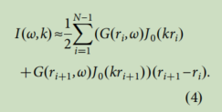

对于梯形积分，Gr；ω仅在观测点ri处得到，而J0kr在0到∞之间已知。因此，J. Wang等人（2019）通过对格林函数的线性插值，给出了方程(1)的另一种数值积分格式：

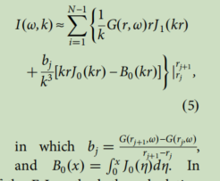

在F-J方法的早期实现中，B0x的计算是采用梯形积分进行的。之后，我们找到了B0x：的原语

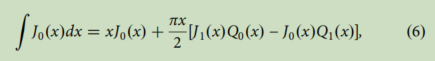

其中Qix是第ith Struve函数，可以由鲁克德谢尔（1984）的子例程计算。

对于色散特征，地震学家倾向于显示频率相速度（fc）域而不是频率波数（fk）域。域转换可以通过来执行

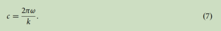

通常，在计算nc相速度点和nf频率点时，无论是使用方程(4)还是方程(5)，F-J方法的计算规模都相当大，特别是对于噪声数据。然而F-J方法自然适用于通过Nvidia GPU的并行加速。ci和ωi的每个计算都没有关联。CUDA编程使我们能够在GPU设备上执行F-J积分。公式(4)和(5)可以打包成不同的“内核”，这是在GPU设备上运行的代码，并由nf×nc GPU线程调度。此外，我们用Python封装了CUDA程序；这使得通过调用具有不同参数的函数ccfj.fj_noise来快速实现方程(4)和(5)成为可能。值得注意的是，将方程(4)和(5)中的贝塞尔函数改变为第一种汉克尔函数将有助于消除“交叉”伪影（福布里格，2003；Xi等人，2021年）。我们用贝塞尔函数或汉克尔函数增加了参数来进行控制。值得注意的是，用不同积分形式提取的色散曲线是相同的，但信噪比不同。具有当前最高信噪比的积分形式（具有Hankel函数的方程5）是CC-FJpy的默认设置，而其他积分形式则是可选的。

<u>值得注意的是，对于噪声数据，我们通常只使用CCFs的实部进行计算，而对于地震数据，我们计算所记录的频谱的实部和虚部，并取jIω；kj。这主要是因为地震具有源时间函数，它会影响纯实部或虚部的结果。</u>此外，Li和Chen（2020a）指出，用于地震记录的F-J方法可能需要辅助时间窗（多窗口F-J方法[MWFJ]）。因此，我们专门设计了Python接口ccfj.fj_earthquake和ccfj。地震事件的MWFJ。有关详细信息，请参考手册和Python示例（请参见补充材料中的文件“example_noise.ipynb”和“example_EQ.ipynb”）。
