## 微动

微动，也被称为地脉动或地震噪音，是地面的微弱振动，形成此类信号的震源大致可以分3类，首先是形成的微动信号小于0.5Hz的一类，它一般为几百或几千公里尺度的海洋和气象活动；第二类为尺度为几十上百公里的现象扰动或风的影响导致的微动；第三类，也是本次研究使用的主要的信号源，人文活动引起的微动，它引起的微动信号频率通常大于1Hz。

## [瑞利波](https://zhuanlan.zhihu.com/p/546892103)

p波是前后的 s波是上下的 瑞雷波是前后上下的滚动

#### 瑞利波特点

1）主要在自由地表传播，即`能量集中在自由地表`。当为均匀半空间时，瑞利波是没有频散的；当为更复杂的情况，如多层介质时，瑞利波是具有频散的。因此，在地表观测到的瑞利波都是有频散的，正如地震记录中瑞利波的波形很长，这就是因为不同频率的瑞利波到时不同造成。(频散：不同频率的波，相速度不同。)

2）<u>瑞利波由P波与SV波大于临界角入射到地表造成</u>。具体一点来讲，P波与SV波大于临界角入射，导致转换波(P, SV)相干叠加沿地表传播形成瑞利波。

注意：单独P波或者SV波是不能沿地表稳定传播的，这从数学上可以证明。只有P与SV耦合成为面波才能稳定传播。

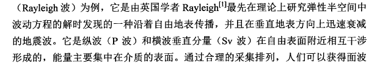

3)几何衰减因子为 1/sqrt r ,比体波( 1/r )衰减得慢。

4)质点运动幅度随深度指数衰减，因此能量主要集中于地表。在地表附近，质点运动为逆行(逆时针)椭圆(retrograde)，随着深度的增加，会逐渐变为顺行(顺时针)椭圆(prograde)。

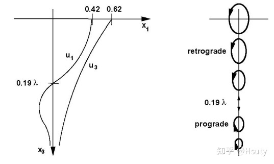

## 波的模态

> 高频面波方法主要利用面波在层状介质中的频散持性进行浅地表勘探，主要包括了瑞雷波方法和勒夫波方法。在均匀半空间条件下，瑞雷波没有频散现象，而是Ｗ—个固定的相速度（例如，当泊松比为0.２５时，相速度为横波速度的０．９２倍）传播。然而，当地下介质为多层介质时，瑞雷波出现频散现象。对于给定的模式，长波长的成分具有更深的穿透深度，并且对深部更加敏感；短波长的成分则对表层介质更加敏感。高频面波在层状介质中会发育多阶模态，按照顺序依次被命名为基阶、一阶高阶、二阶高阶等。因此，面波方法可ｙＪｌ通过反演单模态或者联合反演多模态面波的相速度来获得地表
> 介质的横波速度。因此，判定面波模式阶数，拾取准确可靠的面波相速度值对反
> 演结果的可靠性至关重要

要理解高阶面波成像原理，首先要理解normal modes, 其是`无震源情况下，弹性动力学方程的非零解`。其与特征向量味道类似，反映了介质固有的属性。举个例子，敲击钟，钟会响，这个声音其实就反映了钟固有的物理属性；也就说，不同的钟，其声音是有区别的。再进一步，这个声音其实可以利用某种分解，分成很多个类似特征向量的东西叠加起来，这些类似特征向量的东西在面波领域就叫做normal mode。文献里面称为特征函数。

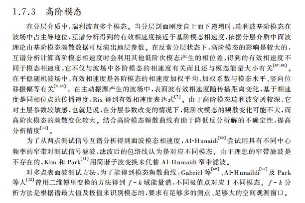

#### 高阶模态的形成

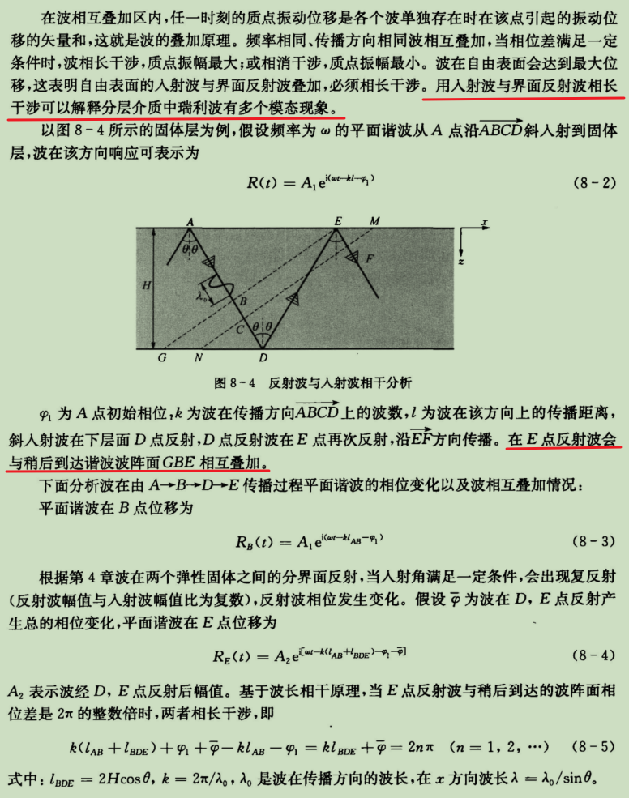

==理论上基阶波和高阶波同时都存在，速度递增的岩土层基阶波发育，表现在FK域能量最大的地方，有速度倒转或横向不均质体存在时，在该位置对应的频率会出现能量较大的高阶波==   比如软弱夹层或者地质裂缝


#### 模态分离

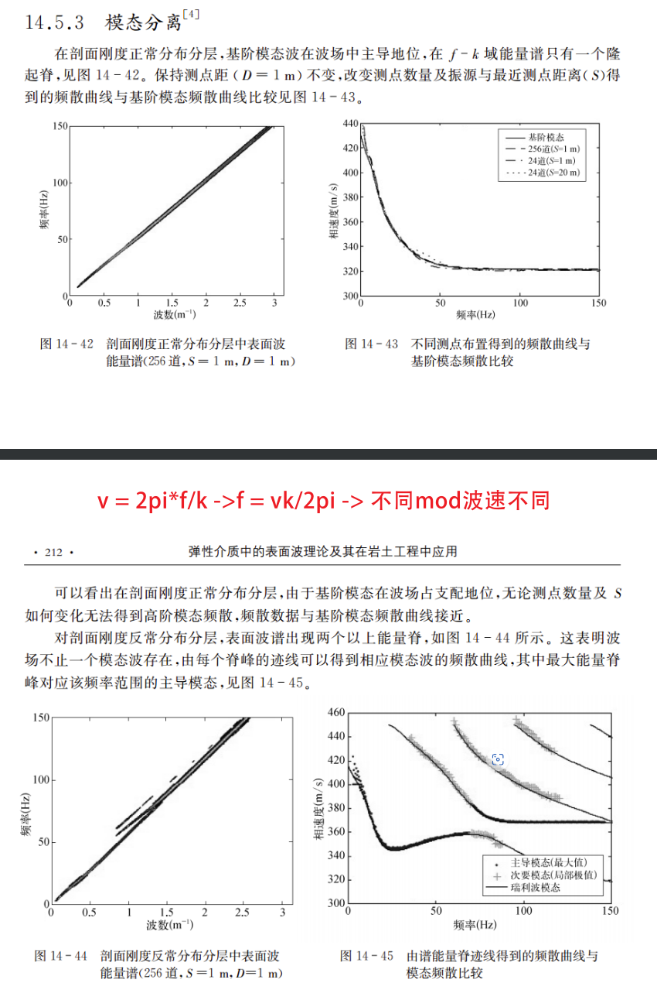

> 1. 不同模态的波的产生: 软弱夹层或者地质裂缝等有速度倒转或横向不均质体存在 导致波的位移出现偏差  (瑞雷波是由P和SH混合得到的表面波 两个波在不均匀介质体上的偏移不一样)
>
> 2. 不同模态的波的区分/体现:主要体现在表面波普的能量脊上,  v = 2pi*f/k ->f = vk/2pi -> 不同mod波速不同
> 3. 分离不同模态的难点: 能量泄露导致影响高模态波的极值点  或者相同波数的能量合并

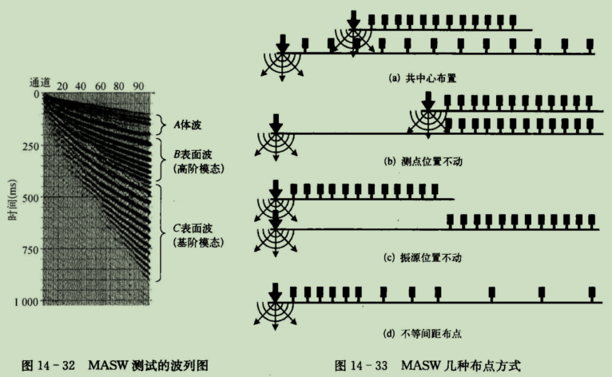


增大偏移距离 也就是==增大台站之间的距离== 可以减少空间混淆

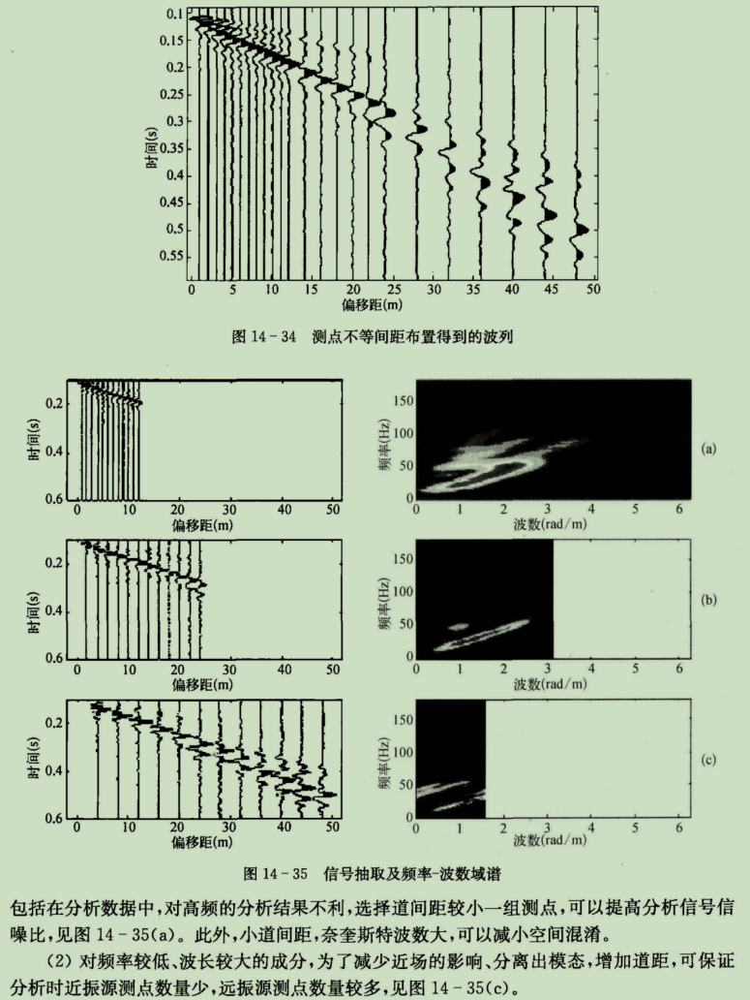


## 傅里叶变换

> 傅里叶的本质是求解时间序列与正余弦序列的==互相关== 来求解序列中有没有该频率

[(26条消息) 用C语言实现DFT算法_姚明明的博客-CSDN博客_dft算法](https://blog.csdn.net/mingzhuo_126/article/details/86597894)

```c++
void DFT_Calculate_Point(int k)
{
	int n = 0;
	complex Sum_Point;
	complex One_Point[N];
	Sum_Point.real = 0;
	Sum_Point.imag = 0;
	for(n=0; n<N; n++)
	{
		One_Point[n].real = cos(2*PI/N*k*n)*Input_Squence[n];  //复数的实部
		One_Point[n].imag = -sin(2*PI/N*k*n)*Input_Squence[n]; //复数的虚部
		
		Sum_Point.real += One_Point[n].real;	//对实部求和
		Sum_Point.imag += One_Point[n].imag;	//对虚部求和		
	}
	Result_Point[k].real = Sum_Point.real;
	Result_Point[k].imag = Sum_Point.imag;
}
```

[如何理解DFT？ - 知乎 (zhihu.com)](https://zhuanlan.zhihu.com/p/137509394)

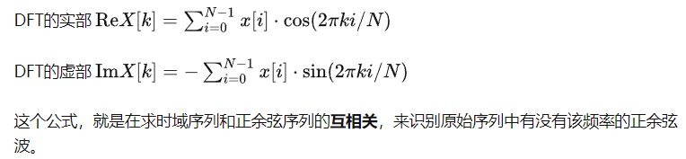

[C语言系列之FFT算法实现 - 知乎 (zhihu.com)](https://zhuanlan.zhihu.com/p/135259438)


## 互谱分析

互相关只能得到相位信息, 与幅值无关

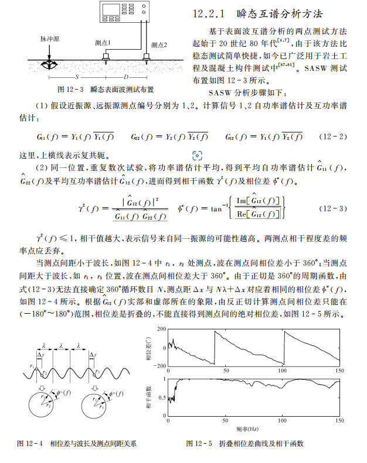

 从两点之间的互相关可以得到相位差, 但是==相位差存在折叠== 可能存在的多个周期  m*360


#### [互相关(cross-correlation)中的一些概念及其实现 (qq.com)](https://mp.weixin.qq.com/s?__biz=MzA4Nzg4MDY1Mw==&mid=2652406597&idx=4&sn=84a911e135695ed680b00711bb1759e3&chksm=8bde85e7bca90cf189e8f42ffefbaa26f4794a67857cf40eee7f7f738507da8684f8368d5fb2&scene=27)


## 频率波数域分析

#### 一维傅里叶:

时域->频域  只能得到采样频率/2的信息

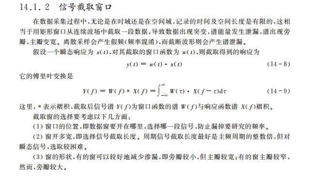

==hrfk代码中用的是cos taper==

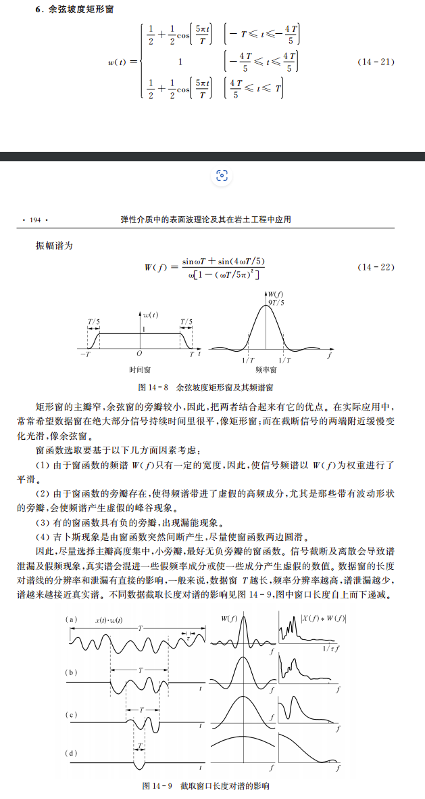

#### 二维傅里叶 频率波数域

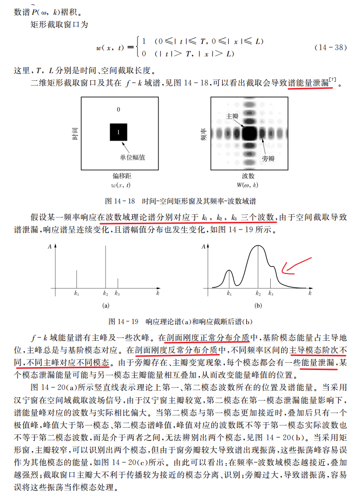

[窗函数 - 维基百科，自由的百科全书 (wikipedia.org)](https://zh.wikipedia.org/zh-sg/窗函数#频谱分析)

采取不同的窗将会导致不同的能量泄露, 而泄露的能量会影响其他的波峰  导致识别导错误的波数


~~存在波数混淆的情况 所以理论上 bandwidth = 0, 得到的就是多个波的k?~~

而且 猜测是否存在这样的关系, 在k轴上的排布 总是基阶波的波数最小, 也就是从kgrid上搜索, 离远点最近的就是基阶波, 其次的极值点是高模态波, 所以我们的排布不应该是按极值点的大小 而应该是按极值点波数的大小

> 和刘工确认过, 总是基阶波的相速度最小, 也就是波数最小 

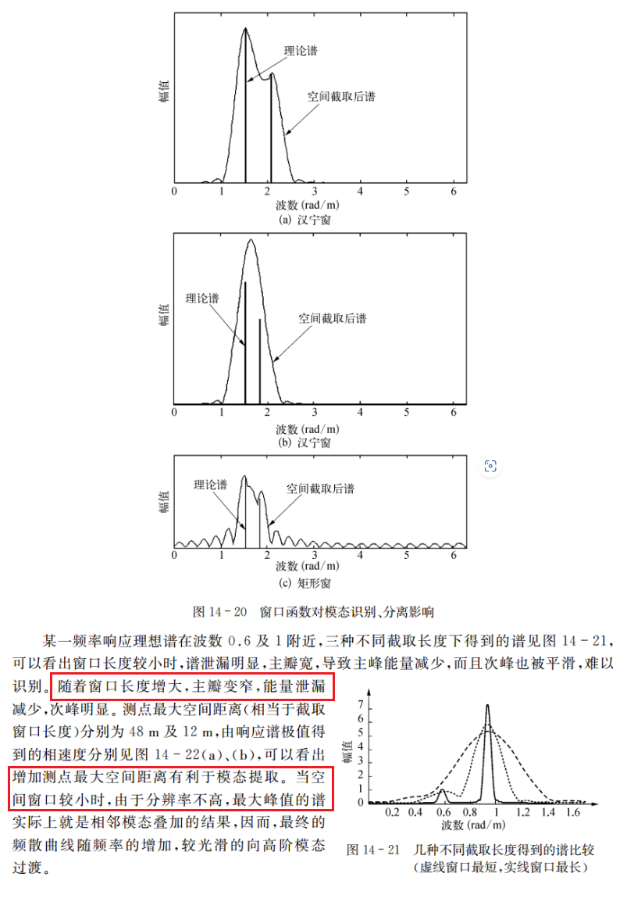


#### t-p变换

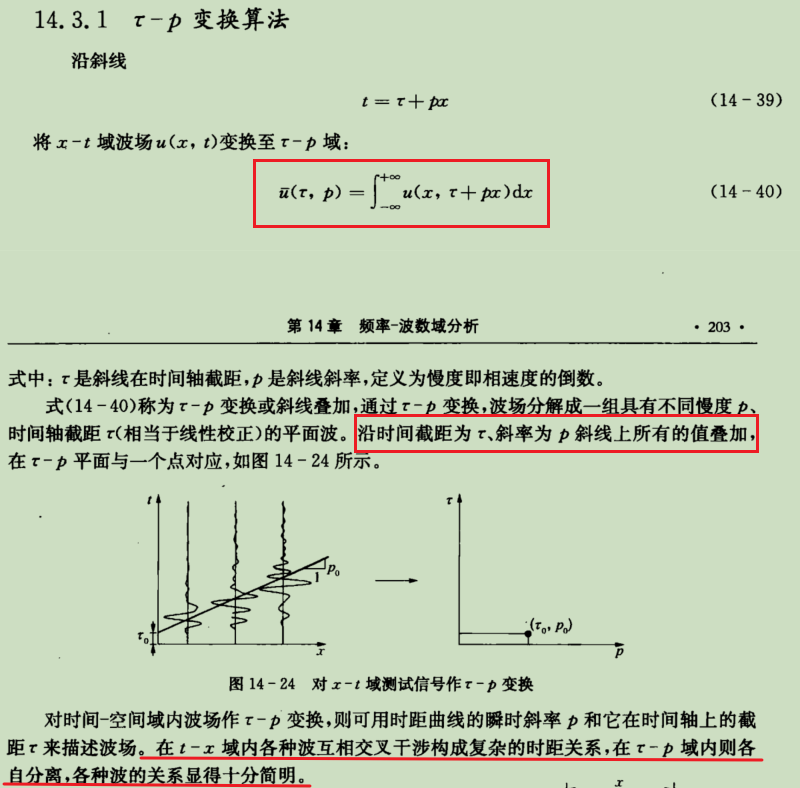

属于是最直观的 甚至可以算是可以直接从信号采样图像上得到的波束图, 多模态的波的分离也比较简单, 沿着按位置排布的直线 直接画斜率即


## 台阵响应

> 1. [okada微动勘探技术.pdf](..\FK\okada微动勘探技术.pdf) 
> 2. [capon_1969-ieee-high-resolution_frequency wavenumber_spectrum_analysis.pdf](..\FK\capon_1969-ieee-high-resolution_frequency-wavenumber_spectrum_analysis.pdf) 
> 3. [USE OF SHORT-PERIOD MICROTREMORS.pdf](..\FK\USE OF SHORT-PERIOD MICROTREMORS.pdf) 


阵列信号处理中最核心的技术是==波束形成技术== <u>将阵列的接收信号通过一定的加权</u>，使阵列方向图<u>在期望信号方向的增益恒定</u>，而系统总的输出功率最小，从而完成==空间域滤波==的目的, 自适应波束形成算法可以根据信号环境的变化，来自适应调整各阵元的加权因子，达到增强信号同时抑制干扰的目的.


#### 微动信号的波束形成假设:

1. 延迟仅与相对位置有关, 与绝对位置无关
2. 地层介质均质, 各向同性, 通过阵列的信号沿直线传播  延时仅与阵列的几何形态和来波方向决定

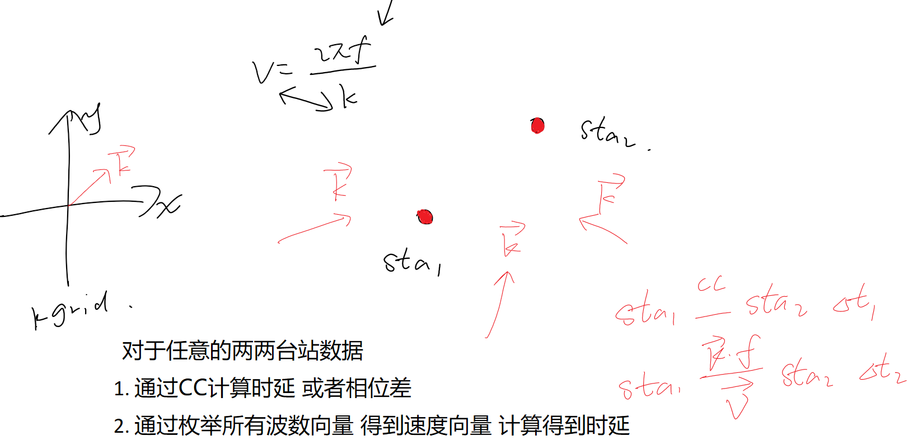

> 为什么垂直分量的检波器 可以提取到"水平矢量"的信息?
>
> 因为矢量信息是矢量慢度/速度/波数, ==体现在 延迟时间也就是传感器的位置上==

#### 常规波束形成(fk)

fk的台阵响应属于常规波束, 独立性波束, 波束之间没有做互相关运算

传统fk==属于独立性波束范畴==, 在代码上直接对fft也就是能量进行累加

 

#### 自适应波束形成(hrfk)

更接近上面的流程, 用到了两两之间互相关的信息, 是对矢量波数k的遍历, 然后根据两两互相关计算得到的相位延迟信息, 卷积的过程应该也是一个类似求互相关的过程


### fk和hrfk在代码上的异同

相同:

1. 都划分了kgrid, 将台站的相对坐标投影到矢量波数网格

   例如 k范围 -4rad/m - 4rad/s 划分200个,  `k = kx * x相对 + ky * y相对 -> re = cosk   im = sink`  累加即为==台站响应array response==

2. 整体流程相同, 例如band加gauss窗, 都是绘制功率谱, 搜索极大值

不同: 最后卷积功率谱矩阵不同

1. fk采用的是 原始的傅里叶变换累加(能量)与_shift(矢量波数矩阵) 直接点乘累加, 得到的是直观的能量

   ```c++
   double FK::value(double kx, double ky, int index) const {
     double k2 = kx * kx + ky * ky;
     if (k2 > maximumK2())
       return -1;
     
     QList<FKStationSignals *>::const_iterator it;
     double val = 0;
     for (int i = _iFreqMin; i <= _iFreqMax; i++) {
       Complex sum;
       for (it = _array.begin(); it != _array.end(); ++it) {
         FKStationSignals *s = static_cast<FKStationSignals *>(*it);
         if (s->isSelected())
           // getShiftedSignal: 取到fft的复数 与kx ky上的权重点乘
           sum += s->getShiftedSignal(0, i, index);
       }
       val += sum.abs2() * _gaussianPtr[i];
     }
     return val; //得到的是能量信息 总能量
   }
   ```

2. hrfk采用的是 严格按照capon公式, 引入互相关

   ```c++
   double HRFK::value(double kx, double ky, int index) const {
     double k2 = kx * kx + ky * ky;
     if (k2 > maximumK2())
       return -1;
   
     Complex sum;
     for (register int i = 0; i < _selectedStationCount; i++) {
       Complex shiftStat1 = _array.at(_stationIndexes[i])->getShift(index);
       shiftStat1 = conjugate(shiftStat1);
       for (register int j = 0; j < _selectedStationCount; j++) {
         Complex tmp(shiftStat1);
         tmp *= _array.at(_stationIndexes[j])->getShift(index);
         tmp *= _Rmatrix[j * _selectedStationCount + i];
         sum += tmp;
       }
     }
     return 1.0 / sum.abs();
   }
   ```


## 频率波数法

> 1. [okada微动勘探技术.pdf](..\FK\okada微动勘探技术.pdf) 
> 2. [capon_1969-ieee-high-resolution_frequency wavenumber_spectrum_analysis.pdf](..\FK\capon_1969-ieee-high-resolution_frequency-wavenumber_spectrum_analysis.pdf) 
> 3. [USE OF SHORT-PERIOD MICROTREMORS.pdf](..\FK\USE OF SHORT-PERIOD MICROTREMORS.pdf) 

如前所述，表面波的检测方法对微震颤测量方法至关重要。迄今为止，已经发展了两种方法：<u>频率-波数法和空间自相关法</u>。这两种方法的共同特性是，`微震振被视为一个随机过程`，它们的光谱构成了分析的基础。两种方法都观察微震颤的`垂直分量`，以提取瑞利波.

在基于这些共同理由的方法中，似乎有更多的使用频率波数法的病例报告，包括阿斯滕和亨斯特里奇（1984）、堀井（1985）、松岛和大岛（1989）、松岛和冈田（1990a）、东木等（1992）等。频率-波数方法将在本节中进行解释。

频率波数方法利用大小与目标深度相符的阵列获取微震颤数据，然后计算频率波数功率谱密度函数（f-k谱）。这个微震颤中所包含的表面波被检测为相位速度和频率（或周期）的函数。用f-k光谱的参数来检测表面波的方法，以下简称为==f-k方法==。f-k方法起源于Lacoss等人（1969）和Capon（1969）对LASA的研究。该方法由阿基和理查兹（1980）在教科书中进行了全面的描述，并在下面的第6部分中引用了该教科书的一些适当的部分.

### 3.4.1 频率波数功率谱密度函数

一般来说，一个可以看作是一个时间随机过程的现象可以用其==功率谱密度函数==（或简单的功率谱）来表征。这个函数定义了<u>该现象的功率的频率组成</u>。同样地，<u>一个可以在时间和空间上被看作是一个随机过程的现象，可以用一个==频率-波数功率谱密度函数==来表征。利用这个函数，可以描述现象的`频率组成和传播速度矢量`。</u>

微震颤可以被认为是一个随机过程，在时间和空间上，包含传播波。微震颤的f-k光谱可以通过以下两种方法之一来估计：

1. 估计微震颤的自相关函数，并对其进行傅里叶变换。
2. 直接对微震颤记录进行傅里叶变换，并平均其绝对值的平方


<u>==第一种==方法是功率谱密度函数(psd)的定义。它对应于单变量情况的“维纳-钦钦定理”。用数学表示，设R（ξ、η、τ）为微震颤X (x、y、t）的自相关函数：</u>

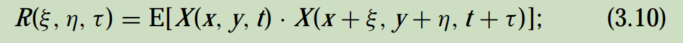

然后估计其f-k功率谱密度函数P (kx、ky、ω）：

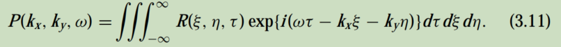

==第二种==方法是用有限傅里叶变换估计功率谱密度函数。更实用的方法是使用FFT。下面的解释涉及到离散功率谱的使用。这两种方法相等的证明超出了本教科书的范围，但感兴趣的读者可以参考本达特和皮埃尔索尔（1986）在单变量情况下的证明。他们的证明含蓄地表明了微震颤测量方法中常用的实际方法的有效性，即通过将数据细分为几个时间块来估计有限时间内一组观测数据的功率谱密度函数。

假设Plmk是一个功率谱密度函数：


其中，Flmk为微震颤记录X（l x，m y，k t）的有限傅里叶变换，在距离delta x和delta y和时间delta t的三维空间中进行数字化：


严格地说，微震颤在时-空间领域并不总是一个完全平稳的过程。它们依赖于大气压力和海浪运动，它们受过渡变化的影响，而在空间上，地下结构是不均匀的。因此，上述原理<u>不能普遍应用于实际数据</u>。然而，用于地质结构估计的微震数据是在有限的时间和空间范围内收集的，在此范围内的数据需要“平稳”。针对上述原理，已经发展了几种f-k光谱方法：例如“波束形成法”和“最大似然法”。


### 3.4.2 Beam-forming method

光束形成法（BFM）是估计f-k谱中最简单的方法。这也被称为传统的方法。该方法<u>将多个观测站收集的微震数据视为单个地震仪的记录</u>。它收集了数据，并以最高的功率估计了波的速度和方向。为了形成波束，考虑波数kx和ky的波的时移以及在基站（xi、yi）观测到的基站（x0、y0）的频率ω：

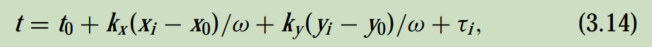

式中，t0为波到达基站的时间（x0、y0），τi表示观测站（xi、yi）的特征延迟，有时称为“站残差”“station residual.”。

如果站i的微震记录为Xi (t)，则光束的输出写为


时间序列b的功率谱b（kx/ω、ky/ω、t）的估计值为


这可以用公式（3.10）来重写：

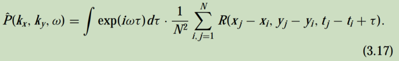

通过引入该形式的加权函数W（κx，κy）


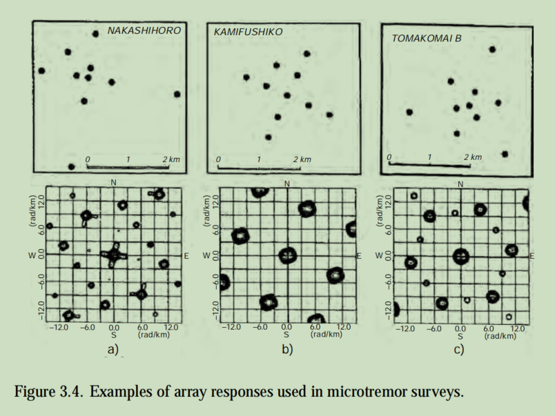

功率谱的估计值可以写为真实功率谱的加权平均值：


==加权函数W（κx、κy）==是观测站（xi、yi）分布中唯一的，由公式（3.18）计算。这被称为“台站响应”。==“array response.”==

图3.4显示了三个微震颤观察阵列的例子，以及相关的阵列响应。在中心的主峰周围可以看到几个大的侧裂片。这些侧叶保持在f-k功率谱中。为了减少估计误差，地震仪的数量及其分布应使阵列响应接近于二维δ函数。

如果加权函数是一个中心在κx = κy = 0的δ函数，则方程（3.19）左侧的谱估计值与谱的真实值完全吻合。


> 聚束法的理解: 
>
> 1. 将整个台阵的多个台站视为一个台站 
> 2. 根据台阵的摆放 阵列的形状计算个各个台站的权重函数对array response进行加权
> 3. 根据功率谱估算最大波数


### ==3.4.3 最大似然估计法==

> ==最大似然估计==
>
> **极大似然估计提供了一种给定观察数据来评估模型参数的方法，即：“模型已定，参数未知”。**
>
> 极大似然估计中采样需满足一个重要的假设，就是所有的采样都是独立同分布的。
>
> ==似然函数 p(x|θ)==
>
> 对于这个函数： p(x|θ) 输入有两个：x表示某一个具体的数据； θ 表示模型的参数
>
> 如果 θ 是已知确定的， x 是变量，这个函数叫做概率函数(probability function)，它描述对于不同的样本点 x ，其出现概率是多少。
>
> 如果 x 是已知确定的， θ 是变量，这个函数叫做似然函数(likelihood function), 它描述对于不同的模型参数，出现 x 这个样本点的概率是多少。
>
> 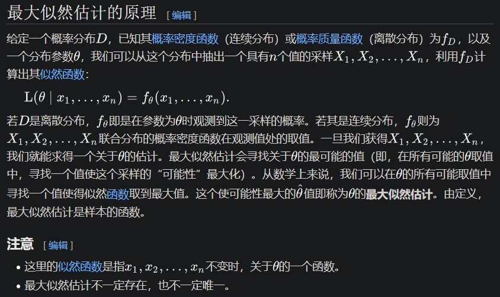
>
> 简单来说就是根据采样到的结果, 反推其参数
>
> <u>最大似然估计其实就是列出概率密度函数 对被估计的参数求导 让其为0</u>
>
> <u>然后再求解该参数</u>
>
> 思想: 
>
> 1. 时间和空间上的随机过程可以由 频率波数功率谱密度函数来表征, 描述出该过程的频率组成和传播速度矢量
> 2. 列出采样的数据集的 fk功率谱的概率密度函数, 
> 3. 也用到了聚束法的array responce 也就是台阵坐标的权重分布


最大似然法（MLM）是由Capon（1969）开发的。该方法的分辨率优于BFM，但其数学阐述有点困难。Aki和理查兹（1980）简明地解释了这个方法如下。

假设一个数据集dt，i, 其有限长度N的正态分布 具有均值st 和协方差矩阵的ρ.  对于站数M，dt，i有M×N个采样值，其==概率密度函数==为：为：


其中Φ~ij~^kl^是一个MN×MN矩阵Φ的一个元素，Φ是协方差矩阵的逆。协方差矩阵的元素是


其中，后缀i和j对应站号，k和l对应时间。

现在，我们考虑==单个观测站==最简单的情况，即方程（3.20）中的M = 1。N个变量dt（t = 1,2，...，N）的概率密度函数可以写成


这里Φ^kl^是M×N[^难道不应该是N*N吗]  矩阵Φ的一个元素，它是协方差矩阵ρ^kl^的逆矩阵。协方差矩阵ρ^kl^的一个元素是


这里我们<u>假设信号s~k~的形式有一个已知的形状为f~k~（k = 1,2，……，N），而它的振幅包含一个未知的因子==c==</u>，即

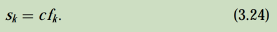

现在==对因子c的最佳估计==是我们想知道的。使用`矩阵表达式`，将方程（3.22）的`指数项`的内部改写为：

> ==注意 最大似然估计 的估计对象为 振幅因子c==  <u>进而</u>再对信号向量s进行最大似然估计

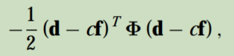

其中d和f是dk和fk的列向量，T表示向量的转置。然后，微分(求导)关于c的方程，


让结果为0，c最可能的==估计==是

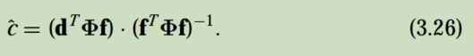

在推导式（3.26）中，<u>Φ的对称性质</u>, 被使用到

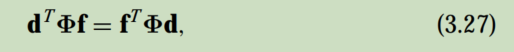

<u>**由式（3.27）可知，==信号向量s的最大似然估计==为**</u>


如果d = cf，则s = cf，即在信号中没有引入失真，则可以计算出c的估计值的方差。 因为

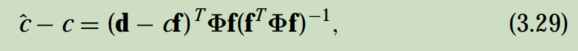

并使用


我们得到

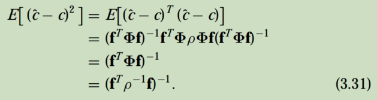

总结以上结果，信号c振幅的最大似然估计由（d^T^Φf）（f^T^Φf）^-1^给出，其估计的方差等于（f^T^ρ^−1^f）^−1^，其中ρ是背景噪声的协方差矩阵, Φ是协方差矩阵的逆


capon所使用的对功率谱的最大似然估计是 振幅[^幅值]为= 1,  f~k~= exp {iω（k− l）delta t)的正弦波信号的信号估计的方差，其中ω是要估计功率谱的角频率

总之，对功率谱的估计变成了


其中f^∗^是复数f的共轭。

方程（3.32）是对功率谱的合理估计，因为这是在`一定频率下的正弦型振动的最大似然估计的方差`。协方差给出了附近频率噪声功率谱的高分辨率估计。

通过将方程（3.32）扩展到二维空间，由Capon（1969）对f-k谱的估计为


> 1. - exp后面那一部分是台站的坐标在波数观测矩阵上的投影	
>    - 初始化是 k = kx* x相对 + ky* y相对 -> re = cosk   im = sink
>    - 代码对应到公式: 
>      - 公式exp[ikx(xi-xj)+iky(yi-yj)] 
>      - 欧拉变化为 cos[kx(xi-xj)+ky(yi-yj)] + isin[kx(xi-xj)+ky(yi-yj)]
>
> 2. 代码中对每个台站i都初始化一个204*204的kxky观测矩阵, 并计算其坐标在 kxky上的投影 到 _shift(i); (重点是保存了当前位置 在kxky上的每个点的投影)   `k = kx * x相对 + ky * y相对 -> re = cosk   im = sink`  累加即为==台站响应array response==
>
> 3. 功率矩阵绘制 使用互谱矩阵的逆 与 kxky卷积 (卷积的过程即为公式中求和的过程, 取其sum的倒数)
>
>    1. 互谱矩阵的逆
>
>       ```c++
>       //多个频点叠加的互相关矩阵
>       //经频率间 平滑平均得到微动记录 ｎ×ｎ互谱矩阵
>       Complex *HRFK::crossCorrelationMatrix(int component) {
>         Complex *covmat = new Complex[_selectedStationCount * _selectedStationCount];
>         // Cache for signals
>         Complex *sig = new Complex[_selectedStationCount];
>         /*
>         Filling in the upper part of the matrix and the diagonal elements with the
>         cross products Summation over all frequency samples
>         */
>       
>         Complex tmp, specRow, specCol;
>         for (register int iFreq = _iFreqMin; iFreq <= _iFreqMax; iFreq++) {
>           // Fill in the cache with signals
>           //将当前频率的所有信号频谱 拼在一起
>           for (register int s = 0; s < _selectedStationCount; s++) {
>             HRFKStationSignals *stat = _array.at(_stationIndexes[s]);
>             sig[s] = stat->getSignalSpectrum(component, iFreq); //得到信号频谱
>           }
>           // 1 0 0 0
>           // 1 1 0 0
>           // 1 1 1 0
>           // 1 1 1 1
>           for (register int row = 0; row < _selectedStationCount; row++) {
>             for (register int col = row; col < _selectedStationCount; col++) {
>               tmp = sig[col];
>               tmp = conjugate(tmp); //共轭
>               tmp *= sig[row];
>               tmp *= _gaussianPtr[iFreq]; //加窗
>               covmat[col * _selectedStationCount + row] += tmp;
>             }
>           }
>         }
>       
>         delete[] sig;
>         return covmat;
>       }
>       
>       
>       //对互功率谱归一化 并*H算子进行共轭转置 最后求其广义逆
>       void HRFK::initOperator(Complex *covmat, double dampingFactor) {
>         /*
>         Computes the auto-power for normalizing, normalizing factor also include the
>         division by the number of frequency samples
>         */
>       
>         /*
>         1. scale存储的是自功率谱Sii(f), Sjj[f] 即互功率谱对角线上的值
>         2. 高分辨频率波数法在于使用 sqrt(Sii(f), Sjj[f])对ij的互功率进行归一
>         */
>         double *scale = new double[_selectedStationCount];
>         for (register int row = 0; row < _selectedStationCount; row++) {
>           double s = covmat[row * _selectedStationCount + row].re();
>           if (s == 0) { // Flat spectrum for one station
>             return initOperatorError();
>           }
>           scale[row] = 1.0 / sqrt(s);
>         }
>         /*
>         Filling in the lower part of the matrix with conjugates of the upper part and
>         normalizing
>         */
>         //用上半部分的共轭填充矩阵的下半部分 并归一化
>         for (register int row = 0; row < _selectedStationCount; row++) {
>           for (register int col = row; col < _selectedStationCount; col++) {
>             Complex &upper = covmat[col * _selectedStationCount + row];
>             Complex &lower = covmat[row * _selectedStationCount + col];
>             upper *= scale[row] * scale[col];
>             lower = conjugate(upper);
>           }
>         }
>         delete[] scale;
>       
>         // Damping
>         if (dampingFactor > 0) {
>           dampingFactor = 1.0 - dampingFactor;
>           for (register int row = 0; row < _selectedStationCount; row++) {
>             for (register int col = row; col < _selectedStationCount; col++) {
>               covmat[row * _selectedStationCount + col] *= dampingFactor;
>             }
>           }
>           /*
>           Add white noise to avoid singular matrix
>           */
>           //避免奇异矩阵
>           dampingFactor = 1.0 - dampingFactor;
>           for (register int el = 0; el < _selectedStationCount; el++) {
>             covmat[el + _selectedStationCount * el] += dampingFactor;
>           }
>         }
>       
>         //计算逆矩阵
>         typedef double Type;
>         int M = _selectedStationCount;
>         int N = _selectedStationCount;
>         Matrix<complex<Type>> A(M, N);
>       
>         for (int i = 0; i < M; i++)
>           for (int j = 0; j < N; j++)
>             A[i][j] = complex<Type>(Type(covmat[j * M + i].re()),
>                                     Type(covmat[j * M + i].im()));
>       
>         Matrix<complex<Type>> invA = pinv(A, -1.0);
>       
>         for (register int row = 0; row < _selectedStationCount; row++) {
>           for (register int col = 0; col < _selectedStationCount; col++) {
>             Complex &RElement = _Rmatrix[row * _selectedStationCount + col];
>             Complex tmp(invA[row][col].real(), invA[row][col].imag());
>             RElement = tmp;
>           }
>         }
>         delete[] covmat;
>       }
>       ```
>
>       
>
>    2. 卷积 计算fk功率谱
>
>       ```c++
>       //#define COUTARRAYRESPONSE
>       double HRFK::value(double kx, double ky, int index) const {
>         double k2 = kx * kx + ky * ky;
>         if (k2 > maximumK2())
>           return -1;
>       
>         //这里的两两组合叠加权重体现和hrfk相对于fk的高分辨率部分, 台站相应更加精细
>         Complex sum;
>         for (register int i = 0; i < _selectedStationCount; i++) {
>           Complex shiftStat1 = _array.at(_stationIndexes[i])->getShift(index);
>           shiftStat1 = conjugate(shiftStat1);
>           for (register int j = 0; j < _selectedStationCount; j++) {
>             Complex tmp(shiftStat1);
>             tmp *= _array.at(_stationIndexes[j])->getShift(index);
>       #ifndef COUTARRAYRESPONSE
>             tmp *= _Rmatrix[j * _selectedStationCount + i]; //不加这个则为观测矩阵台站响应 array response
>       #endif
>             sum += tmp;
>           }
>         }
>       #ifndef COUTARRAYRESPONSE
>         return 1.0 / sum.abs();
>       #else
>         return sum.abs();  //输出array response
>       #endif
>       }
>       ```


其中，φi j(ω)是矩阵Φ(ω)的一个元素，（xi，yi）是观测站i的位置坐标。这里Φ(ω)是协方差矩阵ρτ，i，j的傅里叶变换的逆矩阵：

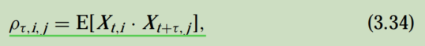

其中Xt,i 代表台站i 的微动噪声

> ==互谱矩阵的2种计算方法:== [估计信号的自/互功率谱密度方法](https://zhuanlan.zhihu.com/p/390104171)
>
> 1. 时域互相关再fft
> 2. 代码中的先fft 再共轭点乘


### 3.4.4 波的相位速度和传播方向

#### 估计相速度

在f-k方法中，寻找了f-k谱中最主要的波的相速度。从波数向量k0中，它被绘制在频率为f0（周期T0)的波数坐标（kxo，kyo）中，f-k谱的峰值，相速度c0可以得到为


图3.5：具有最高功率的波的f-k谱和相速度。每个图显示了在二维波数空间中轮廓的光谱功率。这6个图显示了6个频率，对应的周期范围为2.28 s到1.08 s。在每个图上，画的圆穿过轮廓光谱的峰值；这个圆的半径是指定周期内主波能量的波数。


图3.5显示了f-k功率谱与相速度之间的关系。图中使用的数据是在北海道大学校园采集的微震数据，所使用的分析方法为MLM。

#### 估计原始波的方向

微震测量方法，即使波的相速度来自于非平行层，也不能估计非平行层的结构。这是因为在将观测到的相速度反转到地下结构时，必须使用基于平行层状地下结构假设推导出的特征方程。在实际应用中，这是MSM的一个局限性。然而，在常用的f-k方法的情况下，可以从f-k功率谱中估计出最优势波的传播方向。

假设一个观测阵列的坐标系，y轴正方向向北，x轴正方向向东。从北顺时针取方位φ，根据谱峰值（kxo，kyo的波数坐标）计算出最主导波φ0的原点方向为：


### 3.4.5 通过分段平均计算交叉谱

我们已经看到，从f-k谱得到的方差是检测微震波表面波的最重要的估计。对f-k谱的估计越准确，对地下结构的后续估计就越准确。在估计f-k谱时，计算交叉谱是必要的。在BFM和MLM方法中有几种不同的算法。

Okada等人（1990）和松岛等人（1990a）由于当时数据处理系统的限制，从记录中选择一个或多个块，估计每个块的f-k谱，然后平均达到最终相速度

如果对数据处理系统没有限制，交叉频谱可以用Capon（1969）的方法来计算。利用该方法，采用块平均法或直接段法估计f-k谱：将长持续时间的记录分为M个段，并对各段的交叉谱进行平均。相速度是由这个平均交叉谱估计出来的。随机过程理论保证了该方法可以得到一个==更稳定==的估计。

以下是Capon（1973）的交叉谱计算方法。它相当冗长；然而，这是解释方法的一个重要基础，所以解释被认为是必要的。

在块平均法中，将长度为L的微震颤记录{Xi j}划分为M个段。将每个段的数据点数设置为N，即L = M×N，首先分别计算每个站和成对站的每个段的功率谱和交叉谱。然后，通过平均M段的谱来估计整个数据的f-k谱。相速度是由这个平均的f-k谱估计出来的。下面说明了为什么使用该算法可以变得稳定。

设P~jn​~为X~jn~的傅里叶变换，第j站微震颤记录的第n段，频率为f：


其中，K是台站的数量。通过平均M段得到的交叉谱ˆS~jk~的估计值为

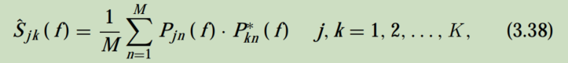


### 代码流程

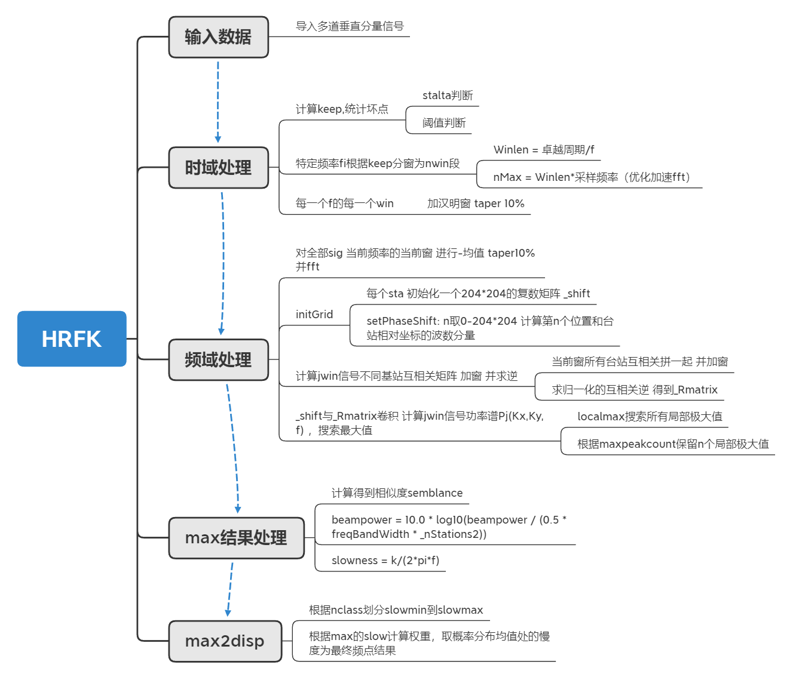


## 窗口长度

### 参数中的50T

> 计算界面中的T 不是卓越周期，可以理解为==与频率对应的窗口时间长度==，1HZ的100T窗口长度为100S

窗口长度 = 50T * 采样频率 / 当前频点


为每个频点参考上述公式, 计算合适的窗口长度, 进行带通(类似高通), 并且加快运算速度


短时傅里叶变换是为了得到

## fkpsd

本部分以s42 的4hz为例

> 完整的参数为: 
>
> 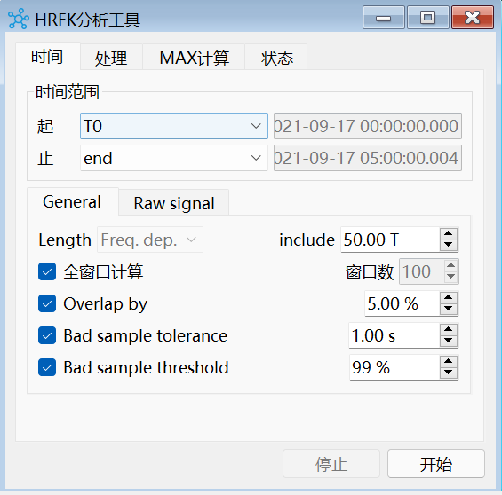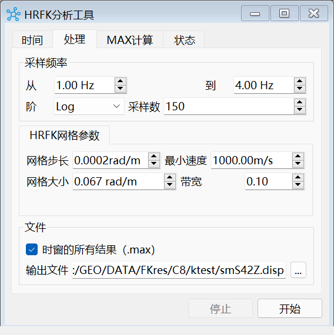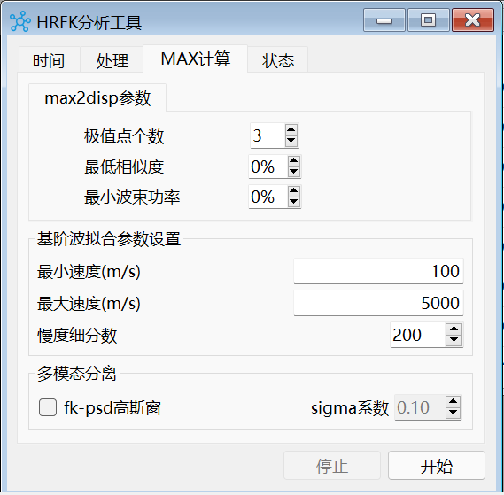
>
> 

origin源文件:   

1. [42 4hz 第一个win.opju](..\..\fk相关资料整理\42 4hz 第一个win.opju)  在该窗口没有效果

### s42 4hz原窗口

1. grid minv 100m/s

   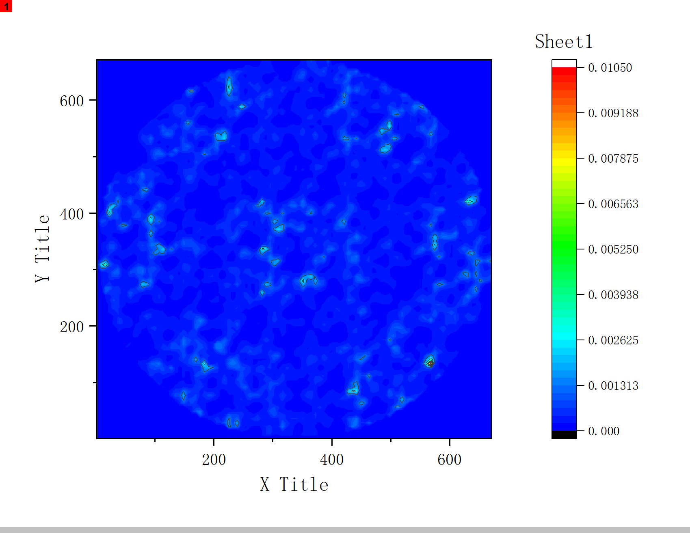

2. grid minv 1000m/s

   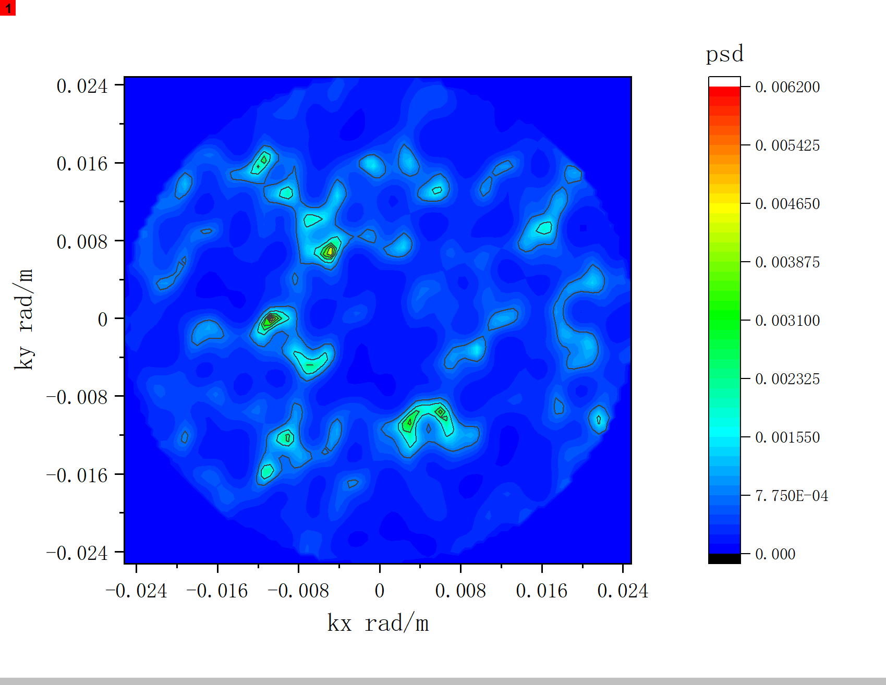

3. minv和maxk的限定对应关系

   100m/s 4hz处的理论maxk远大于给定的0.067 所以受给定的k的限制 (圆为给定k)

   1000m/s 4hz处的理论maxk远小于给定的0.067 或者0.04 所以受给定的minv的限制, 同时可以由v对应到额圆圈推导当前k

   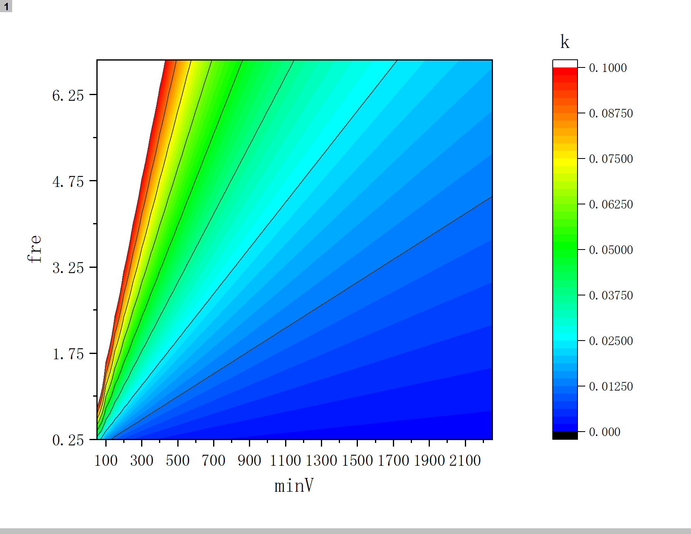


### s42 4hz gauss窗口

#### 0.05*width

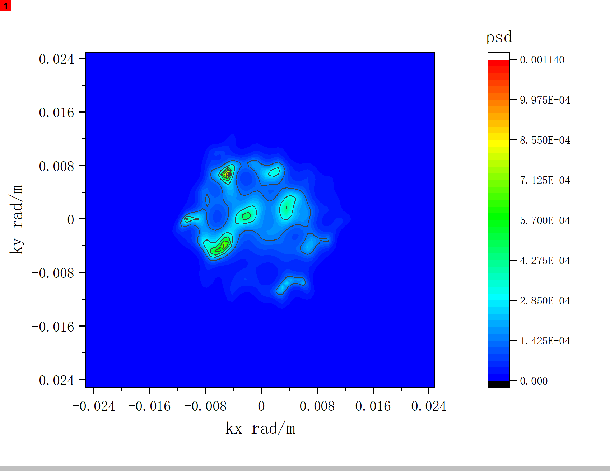

#### 0.04*width

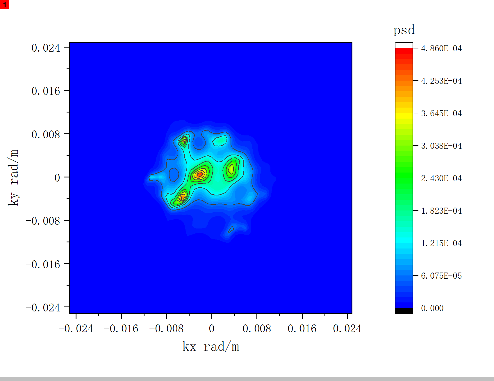

#### 0.03*width

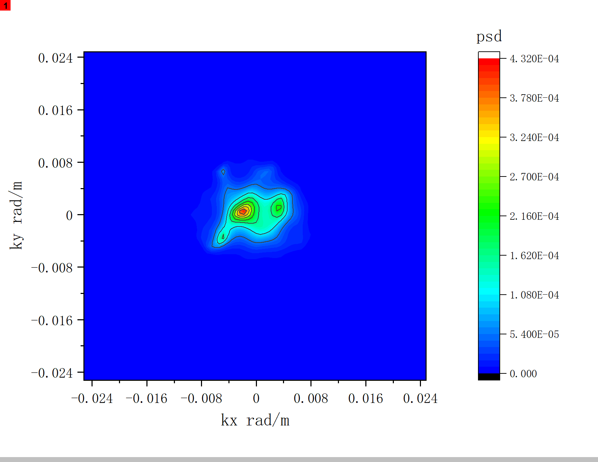


> 注意 42 4hz第一个窗口不明显 在第二个窗口可以看到较好的效果

## HRFK创新点

### 分窗操作 概率分布

- 需要对比capon原始分段的处理结果

### fft窗口加速

### gauss高阶波增强


## 待测试

1. gridstep调小 是否可以看到更细致的高阶波信息

   看不到 gauss 0.07-0.08内 已经是很细致的信息了

2. 差分高斯

   不行 会导致完全消灭极值点 并产生圆环附近的极值点
