## 微震颤测量方法

### 微震颤调查中使用的波型

微震颤的记录清楚地表明，微震颤在时间和空间上都是高度可变的、不规则的、振动的现象。然而，在弹性理论中，微震振是身体波和表面波的组合（Toks¨oz和Lacoss，1968）。如前所述，这种振动现象包括一组静止和稳定的光谱，分别在1小时和1-2公里半径的时间范围和空间变化范围内。

通过适当的仪器，可以观察到微震颤是普遍存在的。观察到的振动，以体波和表面波的组合形式，一般包含，

1. 复杂源的信息
2. 传输路径信息
3. 观测站的地下结构信息。

MSM涉及的是微震颤中所包含的这种弹性波。因此，MSM是广义上的一种弹性波测量方法，即MSM是一种地震测量方法。

然而，与传统的反射和折射地震方法不同，后者使用人工源并将波作为相位域的控制 MSM利用不受控制的自然现象作为来源，并根据随机过程的理论来处理微震颤光谱的各个方面（时间和空间特性）。

许多微震颤的来源可以被确定为作用于地球表面或海底。因此，表面波自然被认为是微震波的主要组成部分，超过身体波。MSM利用了这种主要的表面波传播模式。

### 从表面波的色散到地下结构

众所周知，随着色散，表面波的速度随频率（或周期）而变化。由于色散是地下结构的函数，理论上可以从色散来估计地下结构。MSM基本上是一种估计微震颤中所包含的表面波的色散的方法。

目前，我们的理论知识水平只能解决平行、各向同性和均匀层的表面波的色散特性。因此，用MSM估计的地下结构近似为平行、各向同性和均匀层。因此，从MSM得到的估计结构的精度低于传统的地震方法。这就是为什么MSM被认为是一种侦察方法的原因。然而，MSM通过利用横波速度来获得地下结构的物理性质，这与传统的工程尺度的地震测量相比很难进行测量。对地震运动响应的分析表明，横波速度在确定地下结构方面比p波速度更重要。因此，MSM适用于地震工程领域所要求的地下结构的估算。

MSM处理表面波，它应用表面波理论，将在下面的章节中描述，以检测可用的信号。

在MSM中还有一些问题需要解决，例如：

1. 规范观测系统，包括现场程序和仪器仪表
2. 反演问题；从相速度色散曲线，到速度结构

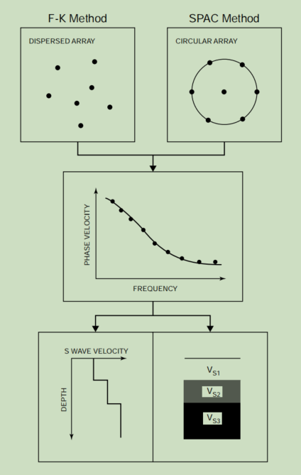

然而，MSM估计地下结构的基本方案或多或少已经完成。该基本方案及其过程如图3.1所示。它包括三个步骤：

1. 通过布置在地面上的地震仪网络（阵列）的观测
2. 估计地表波的色散作为对阵列正下方的地下结构的响应
3. 通过反演估计引起色散的地下结构


## 微振动的光谱表示

微震动中包含的体波和表面波通过一系列机制产生于时间和空间上的随机来源，并在各种地质条件下传播。因此，微震颤的记录有一个非常复杂的波形，并且没有一个简单的数学方程来描述它。因此，不能预测特定时间和位置的微震颤的振幅。这确实是一种随机现象。换句话说，微震颤的幅度是不确定的和不可重复的。

将微震的振幅作为一个随机变量，可以定义一个概率。通过这个概率，也可以定义微震颤振幅的概率分布或概率密度函数

刚和五十岚（1970）指出，<u>随着样本数量的增加，微震振振幅的频率分布趋于正态分布</u>。Sakaji（1998）利用上述在香港特区和管理信息中学收集的大量数据，在各种条件下重新研究了这一点。下面的例子来自于他通过估计微震颤作为随机变量的频率分布及其自相关函数来检验微震颤的时间稳定性的贡献。

图3.2显示了来自`微震颤垂直分量的频率分布（即概率密度函数）的估计值`，这是通过逐步将采样窗口从2分钟扩大到10分钟来估计的。数据取自1997年11月29日北京和香港的10分钟街区。

振幅通过采样区间内的最大值进行归一化，以方便视觉比较。每个直方图右上角的数字是振幅的平均值a和标准差s。平均值a用整个10分钟间隔内振幅平均值的偏差表示。a和s的值变化很小。直方图中叠加的曲线代表正态分布的概率密度函数，每列中张贴的平均值和标准差。虽然在MIS的前2个min的数据中观察到一些干扰，但MIS和HKD的记录都表明，随着采样间隔的增加，分布变得平稳；当数据长度超过4 min时，该分布近似于正态分布。

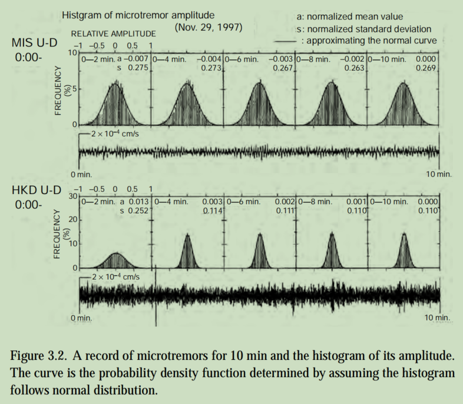

图3.3显示了图3.2中使用的10分钟数据的自相关函数的前10秒。每个图中显示振幅的平均值a和方差s2，其中平均值表示为与整个10分钟数据集的平均值的偏差。平均值和方差的变化相差不是很大；它们几乎是恒定的。

对于研究的10 min的数据长度，图3.2和3.3表明，微震颤振幅的平均值、方差和自相关函数都是恒定的，因此，微震颤满足平稳随机过程的特性。

这种微震颤的随机性质对于不同时间的数据是可重复的。然而，对于间隔超过3小时的数据样本，这并不总是如此。这表明==微震颤的平稳性持续时间不超过3小时。==

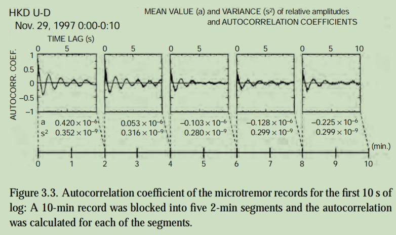

在采集过程中，当脚步声和过往汽车等瞬态脉冲噪声干扰数据时，微震动振幅的频率分布可能会大大偏离正态分布。即使在没有这种极端的情况下，观察到的振幅的频率分布有时也可能偏离正态分布。香港车站的数据包含这些时期。<u>MSM采用了一种基于正常过程的分析方法，即f-k方法（参见图3.1）。这种方法不适用于振幅偏离正态分布的数据集。</u>

现在，我们根据随机过程的理论来考虑微震颤1。这个基础将有助于理解随后的讨论。对于振幅不确定的微震颤，这里做出了两个假设：

1. 在一定的空间范围内，微震颤`在时间和空间上都是一个随机过程`
2. 同一域内有限时间内`某一点的微震颤记录可以视为随机过程的样本记录`（或样本函数）

第一个假设意味着==概率密度函数（或概率分布）不依赖于空间或时间==。换句话说，如果一个微震颤振幅的概率密度函数在某个时间点上被确定一次，那么该函数的形式就不会在更大的时间段内发生变化。


### 3.2.1 一个随机过程的光谱表示

本节一般地解释了一个随机过程的光谱描述。这是为了在考虑对微震颤的应用之前提供一个基础. 

设{X (t)：−∞< t <∞}是一个`零均值随机连续平稳过程`。然后存在一个正交的随机过程（Z(ω)}，使得对于所有的t，X (t)可以表示为：

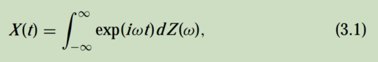

其中ω为角频率（Yaglom，1962；1981）。这个积分被定义为“均方意义”。“5方程（3.1）中的{Z(ω)}是一个复值随机过程，满足其期望值的以下条件：

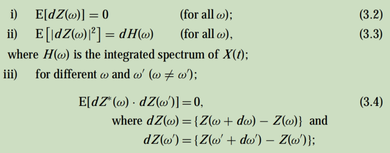

> 随机过程不能用傅里叶级数或傅里叶积分来表示。因此，总能量或总功率不能通过分成频率分量来考虑。这种光谱表示在形式上类似于傅里叶-斯蒂尔特耶斯积分，但这里的Z(ω)可以包含不可微函数。如果Z(ω)是可微的，则方程（3.1）与公共傅里叶积分相同。
>
> X (t)没有实际意义，除非有人考虑到X^2^(t)阶数的数量，如方差和协方差。

条件（iii）表示d Z(ω)和dZ（ω'）相互独立。这种随机过程被称为正交过程。这里*表示复数共轭物.

平稳随机过程{X(t)}的上述性质及其谱表示被认为是微震振的基本性质。这些特性在后续的微震颤数据分析中起着最重要的作用。


### 3.2.2 微振动的光谱表示

微震动作为一个平稳的随机过程，是时间、t和位置向量&（x、y）的函数现象。在一定的有限时间跨度内出现的微震颤记录可以看作是一个平稳随机过程的样本函数。它也可以被描述为一个光谱表示，如方程（3.1），除了这需要X的三个参数。

假设有一个记录的微震颤的样本函数

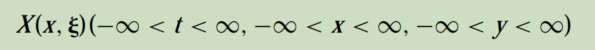

是一个均值为0的平稳随机过程，对t和 &是连续的。存在一个双正交过程Z'（ω，k），X（t，&）用光谱表示为

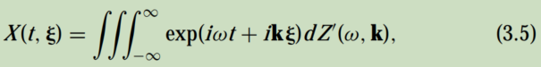

其中，ω = 2πf 和k =（kx，ky）。在这些表达式中，ω是角频率，k是波数向量，kx和ky分别是它的x和y分量。然后Z'（ω，k）满足以下关系：

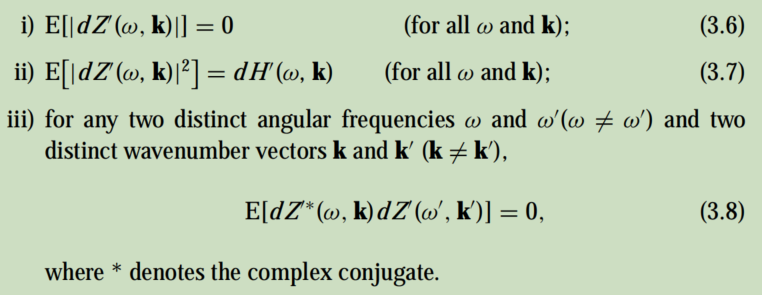

上述关系（iii）意味着随机过程Z'（ω，k）具有特殊性质，即其在ω和k值下的增量是不相关的，即

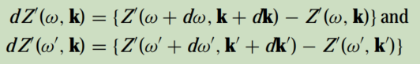

对于两个不同的角频率和两个不同的波数向量都是不相关的。

如果微震颤X（t，&）的谱对于频率和波数是连续且可微的，方程（3.7）的右侧变为dH'（ω，k）=h'（ω，k）dωdk，其中h'（ω，k）是X（t，&）的谱密度函数。则等式（3.7）可改写为：

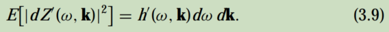

## 表面波检测

微震动含有大量的表面波。如上所述，这些表面波是在时间和空间意义上随机产生的，并通过广泛的地质条件传播。自然地，微震颤成为一种非常复杂的弹性波的组合，不仅包含体波和表面波，还包含散射波和衍射波。为了从这些组合中分离出表面波，研究人员尝试了各种方法。例如，当模拟仪器记录微震颤时，使用以下程序：

1. 在三个点上记录微震颤，形成一个三部分阵列，并识别出相互相似的小波。通过读取小波，可以导出表观周期和速度（Ikegami，1964）；
2. 更定量地，将带通滤波器应用于三方阵列记录的微震振，推导相速度与频率（Kudo et al.，1976）；
3. 通过数字处理，利用三方阵列记录中相似小波的自相关来定量推导周期和相位速度。

随着微震颤数字记录技术的发展，该分析方法已经发展到将微震颤理解为一种随机过程。目前，用于检测表面波的方法被称为（Okada et al.，1990）

1. 频波数谱法(f-k法）
2. 空间自相关法(SPAC法）

==f-k方法==是对20世纪60年代末在美国开发的一种技术的一种应用，用于使用直径可达200公里的地震网络来探测核爆炸。这个统计参数，称为f-k谱，在核爆炸的探测中起着核心作用（Capon，1969；Capon等人，1967；Lacoss等人，1969年）。f-k方法使用了这个f-k光谱。它的原理是“==从复杂的微震颤组合中探测到一个相对较强的波==。”

这种方法并==不考虑波的性质==，即它是否是色散的。==如果高模表面波占主导，则检测到该高模波，如果体波占主导，则检测到体波。==此外，在f-k光谱分析的基本理论中，也没有识别表面波或判断表面波的色散的逻辑。从这个意义上说，f-k方法并不是一种单独检测表面波的方法。然而，如果对微震测量方法采用f-k方法进行分析，则<u>假设表面波相对优于混合成微震组合的其他类型的波</u>。

==SPAC方法==是一种结合圆形阵列和数据分析方法的观测应用，用于理解由地震运动产生的各种波的传输特性。它是基于Aki（1957）（然后）新发展的随机过程理论，他试图通过假设微震波是来自各个方向的各向同性波，从微震波记录中估计地下结构

SPAC方法的基本原理是

1. 假设微震振的复波运动在时间和空间上是随机过程
2. 当构成微震波的波像表面波一样色散时，可以定义用圆形阵列观察到的<u>微震波数据的空间自相关系数</u>；，因此，
3. 空间自相关系数是相位速度和频率的函数关系

该方法清楚地说明了其基本理论，被认为是一种分离表面波的好方法。这项研究，在其出现时，是为地球物理调查方法提出了一个新的前沿。然而，它的实际申请需要等待20多年。其为数不多的应用包括冈田和坂百合（1983）、喜田（1985）和松冈等人（1996）。

在一个简单的表达式中，这两种方法都是基于从噪声中检测信号的理论。检测理论的基础来自于复杂变化现象的随机过程理论。在这个意义上，用微震振估计地下结构也是随机过程理论的一个应用。

下一节将讨论用这两种方法来检测表面波。


## 频率波数法

> 1. [okada微动勘探技术.pdf](..\FK\okada微动勘探技术.pdf) 
> 2. [capon_1969-ieee-high-resolution_frequency wavenumber_spectrum_analysis.pdf](..\FK\capon_1969-ieee-high-resolution_frequency-wavenumber_spectrum_analysis.pdf) 
> 3. [USE OF SHORT-PERIOD MICROTREMORS.pdf](..\FK\USE OF SHORT-PERIOD MICROTREMORS.pdf) 

如前所述，表面波的检测方法对微震颤测量方法至关重要。迄今为止，已经发展了两种方法：<u>频率-波数法和空间自相关法</u>。这两种方法的共同特性是，`微震振被视为一个随机过程`，它们的光谱构成了分析的基础。两种方法都观察微震颤的`垂直分量`，以提取瑞利波.

在基于这些共同理由的方法中，似乎有更多的使用频率波数法的病例报告，包括阿斯滕和亨斯特里奇（1984）、堀井（1985）、松岛和大岛（1989）、松岛和冈田（1990a）、东木等（1992）等。频率-波数方法将在本节中进行解释。

频率波数方法利用大小与目标深度相符的阵列获取微震颤数据，然后计算频率波数功率谱密度函数（f-k谱）。这个微震颤中所包含的表面波被检测为相位速度和频率（或周期）的函数。用f-k光谱的参数来检测表面波的方法，以下简称为==f-k方法==。f-k方法起源于Lacoss等人（1969）和Capon（1969）对LASA的研究。该方法由阿基和理查兹（1980）在教科书中进行了全面的描述，并在下面的第6部分中引用了该教科书的一些适当的部分.

### 3.4.1 频率波数功率谱密度函数

一般来说，一个可以看作是一个时间随机过程的现象可以用其==功率谱密度函数==（或简单的功率谱）来表征。这个函数定义了<u>该现象的功率的频率组成</u>。同样地，<u>一个可以在时间和空间上被看作是一个随机过程的现象，可以用一个==频率-波数功率谱密度函数==来表征。利用这个函数，可以描述现象的`频率组成和传播速度矢量`。</u>

微震颤可以被认为是一个随机过程，在时间和空间上，包含传播波。微震颤的f-k光谱可以通过以下两种方法之一来估计：

1. 估计微震颤的自相关函数，并对其进行傅里叶变换。
2. 直接对微震颤记录进行傅里叶变换，并平均其绝对值的平方


<u>==第一种==方法是功率谱密度函数(psd)的定义。它对应于单变量情况的“维纳-钦钦定理”。用数学表示，设R（ξ、η、τ）为微震颤X (x、y、t）的自相关函数：</u>


然后估计其f-k功率谱密度函数P (kx、ky、ω）：


==第二种==方法是用有限傅里叶变换估计功率谱密度函数。更实用的方法是使用FFT。下面的解释涉及到离散功率谱的使用。这两种方法相等的证明超出了本教科书的范围，但感兴趣的读者可以参考本达特和皮埃尔索尔（1986）在单变量情况下的证明。他们的证明含蓄地表明了微震颤测量方法中常用的实际方法的有效性，即通过将数据细分为几个时间块来估计有限时间内一组观测数据的功率谱密度函数。

假设Plmk是一个功率谱密度函数：

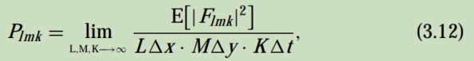

其中，Flmk为微震颤记录X（l x，m y，k t）的有限傅里叶变换，在距离delta x和delta y和时间delta t的三维空间中进行数字化：

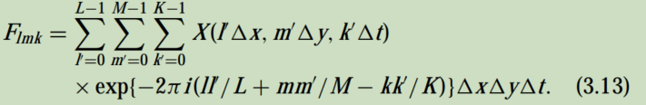

严格地说，微震颤在时-空间领域并不总是一个完全平稳的过程。它们依赖于大气压力和海浪运动，它们受过渡变化的影响，而在空间上，地下结构是不均匀的。因此，上述原理<u>不能普遍应用于实际数据</u>。然而，用于地质结构估计的微震数据是在有限的时间和空间范围内收集的，在此范围内的数据需要“平稳”。针对上述原理，已经发展了几种f-k光谱方法：例如“波束形成法”和“最大似然法”。


### 3.4.2 Beam-forming method

光束形成法（BFM）是估计f-k谱中最简单的方法。这也被称为传统的方法。该方法<u>将多个观测站收集的微震数据视为单个地震仪的记录</u>。它收集了数据，并以最高的功率估计了波的速度和方向。为了形成波束，考虑波数kx和ky的波的时移以及在基站（xi、yi）观测到的基站（x0、y0）的频率ω：


式中，t0为波到达基站的时间（x0、y0），τi表示观测站（xi、yi）的特征延迟，有时称为“站残差”“station residual.”。

如果站i的微震记录为Xi (t)，则光束的输出写为

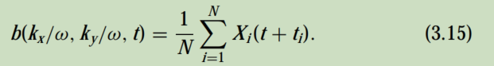

时间序列b的功率谱b（kx/ω、ky/ω、t）的估计值为

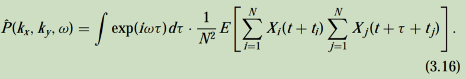

这可以用公式（3.10）来重写：


通过引入该形式的加权函数W（κx，κy）

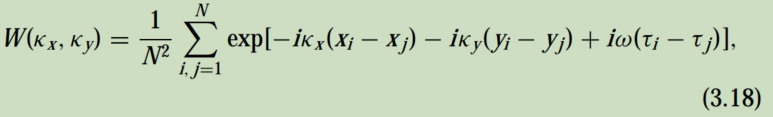


功率谱的估计值可以写为真实功率谱的加权平均值：

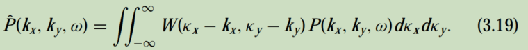

==加权函数W（κx、κy）==是观测站（xi、yi）分布中唯一的，由公式（3.18）计算。这被称为“台站响应”。==“array response.”==

图3.4显示了三个微震颤观察阵列的例子，以及相关的阵列响应。在中心的主峰周围可以看到几个大的侧裂片。这些侧叶保持在f-k功率谱中。为了减少估计误差，地震仪的数量及其分布应使阵列响应接近于二维δ函数。

如果加权函数是一个中心在κx = κy = 0的δ函数，则方程（3.19）左侧的谱估计值与谱的真实值完全吻合。


> 聚束法的理解: 
>
> 1. 将整个台阵的多个台站视为一个台站 
> 2. 根据台阵的摆放 阵列的形状计算个各个台站的权重函数对array response进行加权
> 3. 根据功率谱估算最大波数


### ==3.4.3 最大似然估计法==

> ==最大似然估计==
>
> **极大似然估计提供了一种给定观察数据来评估模型参数的方法，即：“模型已定，参数未知”。**
>
> 极大似然估计中采样需满足一个重要的假设，就是所有的采样都是独立同分布的。
>
> ==似然函数 p(x|θ)==
>
> 对于这个函数： p(x|θ) 输入有两个：x表示某一个具体的数据； θ 表示模型的参数
>
> 如果 θ 是已知确定的， x 是变量，这个函数叫做概率函数(probability function)，它描述对于不同的样本点 x ，其出现概率是多少。
>
> 如果 x 是已知确定的， θ 是变量，这个函数叫做似然函数(likelihood function), 它描述对于不同的模型参数，出现 x 这个样本点的概率是多少。
>
> 
>
> 简单来说就是根据采样到的结果, 反推其参数
>
> <u>最大似然估计其实就是列出概率密度函数 对被估计的参数求导 让其为0</u>
>
> <u>然后再求解该参数</u>
>
> 思想: 
>
> 1. 时间和空间上的随机过程可以由 频率波数功率谱密度函数来表征, 描述出该过程的频率组成和传播速度矢量
> 2. 列出采样的数据集的 fk功率谱的概率密度函数, 
> 3. 也用到了聚束法的array responce 也就是台阵坐标的权重分布


最大似然法（MLM）是由Capon（1969）开发的。该方法的分辨率优于BFM，但其数学阐述有点困难。Aki和理查兹（1980）简明地解释了这个方法如下。

假设一个数据集dt，i, 其有限长度N的正态分布 具有均值st 和协方差矩阵的ρ.  对于站数M，dt，i有M×N个采样值，其==概率密度函数==为：为：

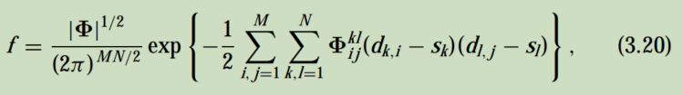

其中Φ~ij~^kl^是一个MN×MN矩阵Φ的一个元素，Φ是协方差矩阵的逆。协方差矩阵的元素是

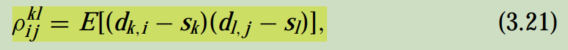

其中，后缀i和j对应站号，k和l对应时间。

现在，我们考虑==单个观测站==最简单的情况，即方程（3.20）中的M = 1。N个变量dt（t = 1,2，...，N）的概率密度函数可以写成

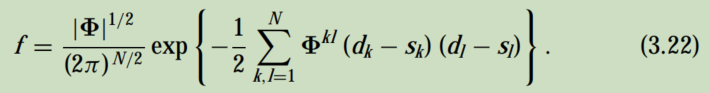

这里Φ^kl^是M×N[^难道不应该是N*N吗]  矩阵Φ的一个元素，它是协方差矩阵ρ^kl^的逆矩阵。协方差矩阵ρ^kl^的一个元素是

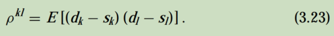

这里我们<u>假设信号s~k~的形式有一个已知的形状为f~k~（k = 1,2，……，N），而它的振幅包含一个未知的因子==c==</u>，即


现在==对因子c的最佳估计==是我们想知道的。使用`矩阵表达式`，将方程（3.22）的`指数项`的内部改写为：

> ==注意 最大似然估计 的估计对象为 振幅因子c==  <u>进而</u>再对信号向量s进行最大似然估计


其中d和f是dk和fk的列向量，T表示向量的转置。然后，微分(求导)关于c的方程，

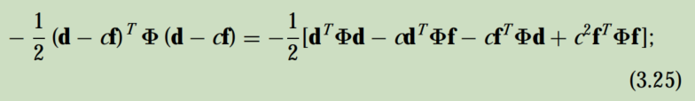

让结果为0，c最可能的==估计==是


在推导式（3.26）中，<u>Φ的对称性质</u>, 被使用到


<u>**由式（3.27）可知，==信号向量s的最大似然估计==为**</u>

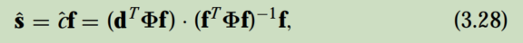

如果d = cf，则s = cf，即在信号中没有引入失真，则可以计算出c的估计值的方差。 因为


并使用

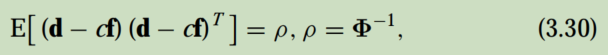

我们得到


总结以上结果，信号c振幅的最大似然估计由（d^T^Φf）（f^T^Φf）^-1^给出，其估计的方差等于（f^T^ρ^−1^f）^−1^，其中ρ是背景噪声的协方差矩阵, Φ是协方差矩阵的逆


capon所使用的对功率谱的最大似然估计是 振幅[^幅值]为= 1,  f~k~= exp {iω（k− l）delta t)的正弦波信号的信号估计的方差，其中ω是要估计功率谱的角频率

总之，对功率谱的估计变成了

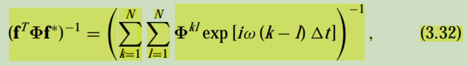

其中f^∗^是复数f的共轭。

方程（3.32）是对功率谱的合理估计，因为这是在`一定频率下的正弦型振动的最大似然估计的方差`。协方差给出了附近频率噪声功率谱的高分辨率估计。

通过将方程（3.32）扩展到二维空间，由Capon（1969）对f-k谱的估计为

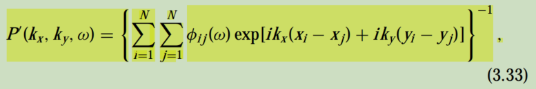

> 1. - exp后面那一部分是台站的坐标在波数观测矩阵上的投影	
>    - 初始化是 k = kx* x相对 + ky* y相对 -> re = cosk   im = sink
>    - 代码对应到公式: 
>      - 公式exp[ikx(xi-xj)+iky(yi-yj)] 
>      - 欧拉变化为 cos[kx(xi-xj)+ky(yi-yj)] + isin[kx(xi-xj)+ky(yi-yj)]
>    
> 2. 代码中对每个台站i都初始化一个204*204的kxky观测矩阵, 并计算其坐标在 kxky上的投影 到 _shift(i); (重点是保存了当前位置 在kxky上的每个点的投影)   `k = kx * x相对 + ky * y相对 -> re = cosk   im = sink`  累加即为==台站响应array response==
>
> 3. 功率矩阵绘制 使用互谱矩阵的逆 与 kxky卷积 (卷积的过程即为公式中求和的过程, 取其sum的倒数)
>
>    1. 互谱矩阵的逆
>
>       ```c++
>       //多个频点叠加的互相关矩阵
>       //经频率间 平滑平均得到微动记录 ｎ×ｎ互谱矩阵
>       Complex *HRFK::crossCorrelationMatrix(int component) {
>         Complex *covmat = new Complex[_selectedStationCount * _selectedStationCount];
>         // Cache for signals
>         Complex *sig = new Complex[_selectedStationCount];
>         /*
>         Filling in the upper part of the matrix and the diagonal elements with the
>         cross products Summation over all frequency samples
>         */
>       
>         Complex tmp, specRow, specCol;
>         for (register int iFreq = _iFreqMin; iFreq <= _iFreqMax; iFreq++) {
>           // Fill in the cache with signals
>           //将当前频率的所有信号频谱 拼在一起
>           for (register int s = 0; s < _selectedStationCount; s++) {
>             HRFKStationSignals *stat = _array.at(_stationIndexes[s]);
>             sig[s] = stat->getSignalSpectrum(component, iFreq); //得到信号频谱
>           }
>           // 1 0 0 0
>           // 1 1 0 0
>           // 1 1 1 0
>           // 1 1 1 1
>           for (register int row = 0; row < _selectedStationCount; row++) {
>             for (register int col = row; col < _selectedStationCount; col++) {
>               tmp = sig[col];
>               tmp = conjugate(tmp); //共轭
>               tmp *= sig[row];
>               tmp *= _gaussianPtr[iFreq]; //加窗
>               covmat[col * _selectedStationCount + row] += tmp;
>             }
>           }
>         }
>       
>         delete[] sig;
>         return covmat;
>       }
>       
>       
>       //对互功率谱归一化 并*H算子进行共轭转置 最后求其广义逆
>       void HRFK::initOperator(Complex *covmat, double dampingFactor) {
>         /*
>         Computes the auto-power for normalizing, normalizing factor also include the
>         division by the number of frequency samples
>         */
>       
>         /*
>         1. scale存储的是自功率谱Sii(f), Sjj[f] 即互功率谱对角线上的值
>         2. 高分辨频率波数法在于使用 sqrt(Sii(f), Sjj[f])对ij的互功率进行归一
>         */
>         double *scale = new double[_selectedStationCount];
>         for (register int row = 0; row < _selectedStationCount; row++) {
>           double s = covmat[row * _selectedStationCount + row].re();
>           if (s == 0) { // Flat spectrum for one station
>             return initOperatorError();
>           }
>           scale[row] = 1.0 / sqrt(s);
>         }
>         /*
>         Filling in the lower part of the matrix with conjugates of the upper part and
>         normalizing
>         */
>         //用上半部分的共轭填充矩阵的下半部分 并归一化
>         for (register int row = 0; row < _selectedStationCount; row++) {
>           for (register int col = row; col < _selectedStationCount; col++) {
>             Complex &upper = covmat[col * _selectedStationCount + row];
>             Complex &lower = covmat[row * _selectedStationCount + col];
>             upper *= scale[row] * scale[col];
>             lower = conjugate(upper);
>           }
>         }
>         delete[] scale;
>       
>         // Damping
>         if (dampingFactor > 0) {
>           dampingFactor = 1.0 - dampingFactor;
>           for (register int row = 0; row < _selectedStationCount; row++) {
>             for (register int col = row; col < _selectedStationCount; col++) {
>               covmat[row * _selectedStationCount + col] *= dampingFactor;
>             }
>           }
>           /*
>           Add white noise to avoid singular matrix
>           */
>           //避免奇异矩阵
>           dampingFactor = 1.0 - dampingFactor;
>           for (register int el = 0; el < _selectedStationCount; el++) {
>             covmat[el + _selectedStationCount * el] += dampingFactor;
>           }
>         }
>       
>         //计算逆矩阵
>         typedef double Type;
>         int M = _selectedStationCount;
>         int N = _selectedStationCount;
>         Matrix<complex<Type>> A(M, N);
>       
>         for (int i = 0; i < M; i++)
>           for (int j = 0; j < N; j++)
>             A[i][j] = complex<Type>(Type(covmat[j * M + i].re()),
>                                     Type(covmat[j * M + i].im()));
>       
>         Matrix<complex<Type>> invA = pinv(A, -1.0);
>       
>         for (register int row = 0; row < _selectedStationCount; row++) {
>           for (register int col = 0; col < _selectedStationCount; col++) {
>             Complex &RElement = _Rmatrix[row * _selectedStationCount + col];
>             Complex tmp(invA[row][col].real(), invA[row][col].imag());
>             RElement = tmp;
>           }
>         }
>         delete[] covmat;
>       }
>       ```
>
>       
>
>    2. 卷积 计算fk功率谱
>
>       ```c++
>       //#define COUTARRAYRESPONSE
>       double HRFK::value(double kx, double ky, int index) const {
>         double k2 = kx * kx + ky * ky;
>         if (k2 > maximumK2())
>           return -1;
>       
>         //这里的两两组合叠加权重体现和hrfk相对于fk的高分辨率部分, 台站相应更加精细
>         Complex sum;
>         for (register int i = 0; i < _selectedStationCount; i++) {
>           Complex shiftStat1 = _array.at(_stationIndexes[i])->getShift(index);
>           shiftStat1 = conjugate(shiftStat1);
>           for (register int j = 0; j < _selectedStationCount; j++) {
>             Complex tmp(shiftStat1);
>             tmp *= _array.at(_stationIndexes[j])->getShift(index);
>       #ifndef COUTARRAYRESPONSE
>             tmp *= _Rmatrix[j * _selectedStationCount + i]; //不加这个则为观测矩阵台站响应 array response
>       #endif
>             sum += tmp;
>           }
>         }
>       #ifndef COUTARRAYRESPONSE
>         return 1.0 / sum.abs();
>       #else
>         return sum.abs();  //输出array response
>       #endif
>       }
>       ```


其中，φi j(ω)是矩阵Φ(ω)的一个元素，（xi，yi）是观测站i的位置坐标。这里Φ(ω)是协方差矩阵ρτ，i，j的傅里叶变换的逆矩阵：


其中Xt,i 代表台站i 的微动噪声

> ==互谱矩阵的2种计算方法:== [估计信号的自/互功率谱密度方法](https://zhuanlan.zhihu.com/p/390104171)
>
> 1. 时域互相关再fft
> 2. 代码中的先fft 再共轭点乘


### 3.4.4 波的相位速度和传播方向

#### 估计相速度

在f-k方法中，寻找了f-k谱中最主要的波的相速度。从波数向量k0中，它被绘制在频率为f0（周期T0)的波数坐标（kxo，kyo）中，f-k谱的峰值，相速度c0可以得到为

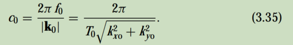

图3.5：具有最高功率的波的f-k谱和相速度。每个图显示了在二维波数空间中轮廓的光谱功率。这6个图显示了6个频率，对应的周期范围为2.28 s到1.08 s。在每个图上，画的圆穿过轮廓光谱的峰值；这个圆的半径是指定周期内主波能量的波数。

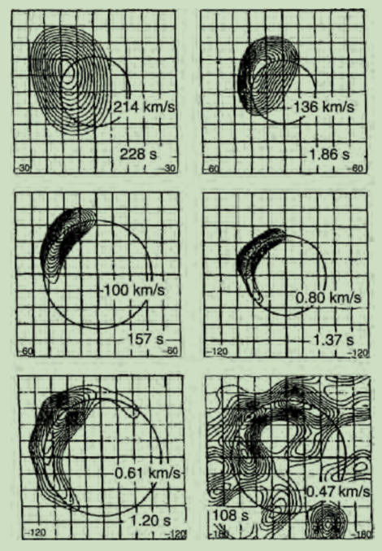

图3.5显示了f-k功率谱与相速度之间的关系。图中使用的数据是在北海道大学校园采集的微震数据，所使用的分析方法为MLM。

#### 估计原始波的方向

微震测量方法，即使波的相速度来自于非平行层，也不能估计非平行层的结构。这是因为在将观测到的相速度反转到地下结构时，必须使用基于平行层状地下结构假设推导出的特征方程。在实际应用中，这是MSM的一个局限性。然而，在常用的f-k方法的情况下，可以从f-k功率谱中估计出最优势波的传播方向。

假设一个观测阵列的坐标系，y轴正方向向北，x轴正方向向东。从北顺时针取方位φ，根据谱峰值（kxo，kyo的波数坐标）计算出最主导波φ0的原点方向为：

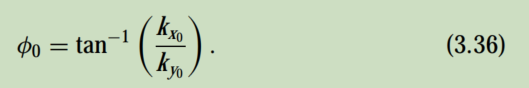

### 3.4.5 通过分段平均计算交叉谱

我们已经看到，从f-k谱得到的方差是检测微震波表面波的最重要的估计。对f-k谱的估计越准确，对地下结构的后续估计就越准确。在估计f-k谱时，计算交叉谱是必要的。在BFM和MLM方法中有几种不同的算法。

Okada等人（1990）和松岛等人（1990a）由于当时数据处理系统的限制，从记录中选择一个或多个块，估计每个块的f-k谱，然后平均达到最终相速度

如果对数据处理系统没有限制，交叉频谱可以用Capon（1969）的方法来计算。利用该方法，采用块平均法或直接段法估计f-k谱：将长持续时间的记录分为M个段，并对各段的交叉谱进行平均。相速度是由这个平均交叉谱估计出来的。随机过程理论保证了该方法可以得到一个==更稳定==的估计。

以下是Capon（1973）的交叉谱计算方法。它相当冗长；然而，这是解释方法的一个重要基础，所以解释被认为是必要的。

在块平均法中，将长度为L的微震颤记录{Xi j}划分为M个段。将每个段的数据点数设置为N，即L = M×N，首先分别计算每个站和成对站的每个段的功率谱和交叉谱。然后，通过平均M段的谱来估计整个数据的f-k谱。相速度是由这个平均的f-k谱估计出来的。下面说明了为什么使用该算法可以变得稳定。

设P~jn​~为X~jn~的傅里叶变换，第j站微震颤记录的第n段，频率为f：

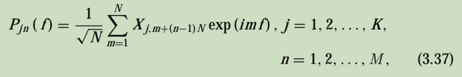

其中，K是台站的数量。通过平均M段得到的交叉谱ˆS~jk~的估计值为


### 代码流程


## 空间自相关法

空间自相关方法（SPAC）是基于Aki（1957）提出的理论，以确定当波数矢量的分布过于复杂时，地震波的时间和空间谱与相位分析之间的关系。

阿奇理论的意义在于它将复杂的波现象作为一个在时间和空间维度上的随机过程来处理。当然，这种复杂的波现象也包括微震颤。当考虑从复杂的“噪声”中提取必要信息的方法时，该想法形成了一个重要的基础。

Aki（1957），作为他的理论应用的一个例子，试图从一个短周期（<1 s）微震颤的记录来估计地下结构。在他的时代，数字数据记录系统是不可用的，他的实验结果不能被认为是“优秀的”。然而，将自然噪声理解为一种信号，并利用该信号为有意义的地下结构提出新方向的想法受到了高度尊重。

后来，冈田和坂吉里（1983）、喜中（1985）、冈田等（1990）、费拉齐尼等（1990）、费拉齐尼等（1991）、霍夫等（1992）、马拉格尼等（1993）、凌（1994）和松冈等（1996）11发表了微震颤方法的应用。

关于空间自相关方法（SAM）的应用的报道并不多。然而，与频率-波数方法相比，它有==两个优点==：

1. 与频率波数方法相比，它需要更少的站点和`更小的阵列`来实现类似的结果。在微震观察中，阵列的大小是非常重要的，因为大阵列增加了场功，降低了场效率；大阵列可能会影响微震颤方法的假设，即阵列下的层是次平行的。

2. 通过记录微震颤信号的垂直和水平分量，不仅可以检测到瑞利波，还可以检测到`爱的波`（冈田和松岛，1989）。其理论基础是对瑞利波检测的扩展，易于理解。

Aki的论文（1957,1965）有一个局限性，因为它们不能探测到爱波的能量，而且使用他的方法也不能将爱波和瑞利波分开。Ferrazzini等人（1991年）在夏威夷的普乌奥奥火山附近观察了火山起源的三分量微震，他根据瑞利波和爱波的相速度估算了地下结构。他们的方法包括了上面提到的“限制”。冈田和松岛（1989）对该方法进行了改进，并开发了一种新的算法（见第3.6节）。松岛和冈田（1990b）以及最近的山本（2000）将新算法应用于微震数据，并分离出爱波能量。他们的结果表明，由传播的爱波估计的横波速度结构与由瑞利波估计的横波速度结构非常一致。

微震测量方法==最终寻求估计地下s波速度结构==。因此，由于爱波仅由s波能量组成，因此SPAC方法被认为可以分离出爱波的潜力是巨大的。到目前为止，已经发表的应用程序很少，而且它们仅限于利用微震颤垂直分量的观测进行勘探。然而该方法具有更广泛的应用的可能性，数据的收集、处理和分析要简单得多。因此，SPAC方法明显优于频率-波数法。

理论上，SPAC方法需要一个特殊的阵列，多个地震仪排列成圆形图案。通过定义圆阵列观测到的微震数据中色散波的空间自相关系数，该理论证明了`空间自相关系数是基于阵列半径的频率和相位速度的函数`。以下各部分将描述空间自相关方法的理论基础。


### 3.5.1 极坐标系中微动的光谱表示

在用SPAC方法分析微震数据时，便于使用极坐标系进行微震光谱分析。通过使用极坐标关系，

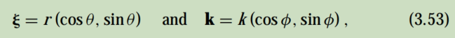

等式（3.5）被重写为

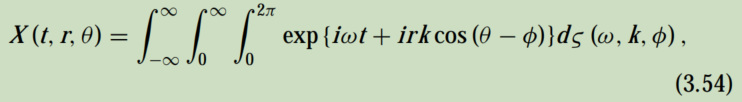

其中

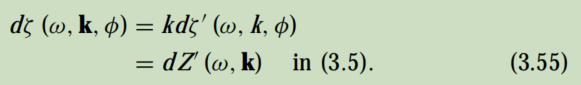

从式（3.54）可以看出，微震振作为平稳随机过程的过程可以表示为从不同方向φ到达的不同角频率ω和波数k独立（即不相关）产生的波的连续和。

方程（3.54）的ζ（ω，k，φ）满足以下关系：

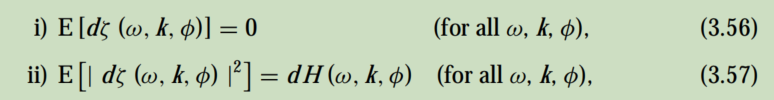

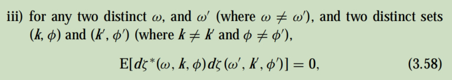

式中，*表示复数共轭物。现在我们做了两个假设：

- 假设1：微震颤主要由表面波组成，其中一种模态（通常是基本模态）占主导地位。

- 假设2：因此，ω和k作为彼此的函数相关，Z或ζ，即以随机过程表示的微震振，仅在曲线上具有显著意义[ω，k (ω)]

当我们讨论微震颤的垂直分量时，所提到的表面波是瑞利波。在这种情况下，方程（3.54）的光谱表示变为

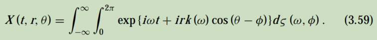

一般来说，由于微震颤的光谱在频率和方向上是连续的和可微的，因此随机过程ζ（ω，φ）满足以下关系：

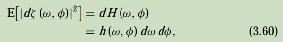

其中h（ω，φ）可以称为“频率-方向谱密度”，h（ω，φ）dω dφ表示来自φ和φ + dφ之间方向的波分量对总功率的平均贡献，角频率在ω和ω + dω之间的波分量的平均贡献。

当这个平均贡献求和（即积分）时，相对于所有方向，得到一个站h0(ω)的微震颤的功率谱密度函数（或简称“功率谱”）为

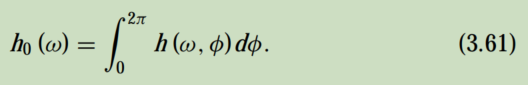


### 3.5.2 空间自相关函数和空间协方差函数

为了便于表达，下面在极坐标空间中将地球表面的坐标（x，y）表示为（r，θ）。

现在，假设有两个微震观测站A和B，它们之间的距离是r。设A为坐标系（0、0）的原点，则站B站的坐标为（r、θ）。

由式（3.59）可知，A站的微震记录可以表示为

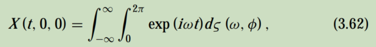

而在B处的记录是

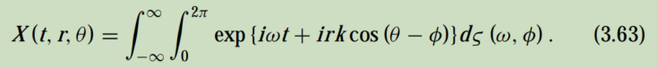

A和B之间的空间自相关函数为

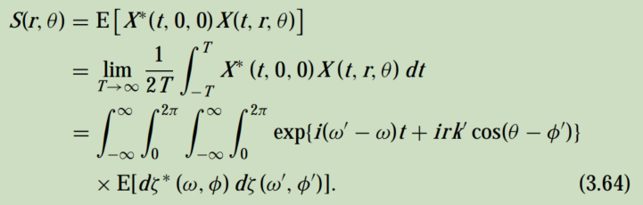

该方程由方程（3.57）、（3.58）、（3.59）和（3.60）简化为

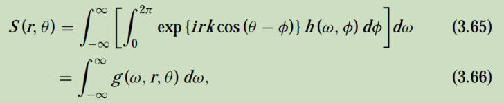

其中

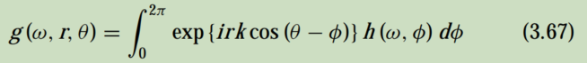

称为角频率ω下微震振的空间协方差函数（亨斯特里奇，1979）。

在原点（0、0）处的此方程被计算为

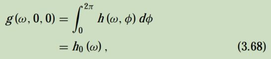

并给出了方程（3.61）的功率谱。同样地，在原点处的空间自相关函数为

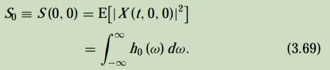

这里，h0(ω) dω是在一个站（A或B）观测到的，角频率之间的微振动X（ω，ω，θ）分量对总功率的平均贡献。因此，方程（3.69）左边的s0给出了阵列空间内一个站点的随机过程（即微震颤记录）的总功率。


### 3.5.3 圆阵列的空间自相关系数及其与相速度的关系

假设我们在原点a周围的一个圆上放置一个由几个站点组成的阵列。我们定义了圆阵列观测到的微震颤的平均空间自相关函数和空间自相关系数。为简单起见，考虑了一个具有特定频率ω的分量。

现在，设g（ω，r，θ）为频率为ω的圆阵列周长上的中心和一个点之间的==空间协方差函数==。然后，我们可以通过`在所有方向上平均`g（ω，r，θ）来定义空间协方差函数的方向平均值：

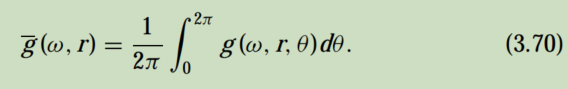

用方程（3.67）代入被积函数，得到了

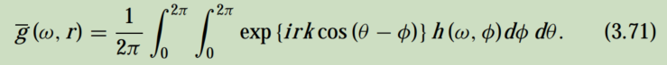

在式（3.71）中，==沿θ的积分为==

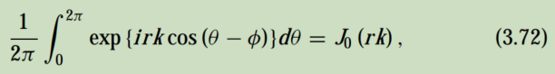

这是带有变量rk的第一类零阶的贝塞尔函数。因此，方程（3.71）是简单的

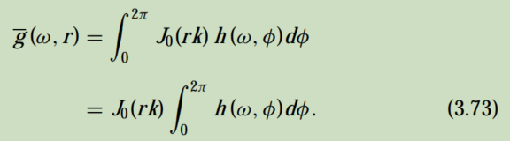

使用方程（3.61）或（3.68），方程（3.73）进一步简化为

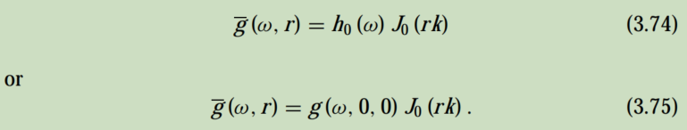

同样，由方程（3.64）去定义的空间自相关函数的方向性平均值降低为

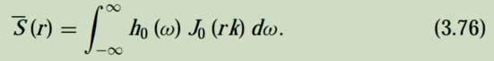

在方程（3.74）或（3.76）中积分的项意味着，对于阵列空间内微震动的总功率，ω和ω + dω之间的波的分量的平均贡献总是由系数J0（rk）加权，这与地下结构有关。因此，S (r)，即（3.76）的左侧，给出了在半径为r的圆形阵列下的地下结构影响下传播的所有微震颤的总功率。

现在我们定义“角频率ω下的空间自相关系数”，==ρ（ω，r）==，或简单地“空间自相关系数”，ρ（f，r），为阵列空间（圆心，即原点）的功率谱归一化为h0(ω)：


使用等式（3.74），


或从k=ω/c(ω)（其中c(ω)为相速度）


以及ω = 2πf


因此，频率f处的空间自相关系数通过第一阶零阶的贝塞尔函数与相速度c (f)有关。图3.6为由两个变量f和r控制的空间自相关系数示意图。

从上述理论推导中可以看出，一定频率的相速度可以通过  空间自相关系数来计算 频率为ω的波的分量，由半径为r12的圆阵列记录的微震颤产生。

上面定义的空间自相关系数是阵列位置所特有的一个量，它反映了阵列正下方的地下结构


## 估算相速度和地下结构

如前所述，微震颤测量方法的基本原理被描述为“检测微震颤中所包含的表面波的色散形式，即确定相位速度和频率（或周期）之间的关系。”在这里，频带与调查深度的范围有关。使用的时间越长，调查的深度就越深。然而，它们之间的关系在调查之前并不清楚

用于确定结构性质的基本变量，相速度c和频率f，在特征方程中隐含地相关：


其中，vpj、vsj、ρj和hj分别为由N层组成的结构的第j层的参数，即p波速度、s波速度、密度和厚度。这个方程不能作为自变量f的函数明确求解。但是，作为一种形式，假设这个方程有一个解，它可以写成


为简单起见，省略层参数，将公式（4.2）改写为


表面波由多种波模组成，当频率高于某一值时，由方程（4.1）解析的相速度不是唯一的。此外，解的数量随着频率的增加而增加。然而，在大多数表面波中，`基本模态占主导地位`。例外的情况是，当地下结构的泊松比很大时，即横波速度与p波速度的比率（vs/vp）非常小。因此，在实际应用中，认为大于二阶的高模分量可以忽略不计，并且对表面波的每个频率分量都得到了一个唯一的相位速度。因此，公式（4.3）表示基模相速度与频率之间的关系，速度c可以看作是频率f的单值函数。

综上所述，检测微振动表面波的方法是从观测中找到方程（4.3）的关系，并估计方程（4.1）或（4.2）的层参数。

如前一章所述，有两种检测表面波的方法，即寻找关系（4.3）：频率波数（f-k）方法和空间自相关（SPAC）方法。

最近用微震振估计地下结构的案例主要采用f-k方法。但这种方法有两个主要缺点：一是它对所需的阵列大小使用了相对狭窄的频率范围，二是由于f-k谱的退化现象，难以准确估计相速度（Okada et al.，1995）。为了避免退化，该方法需要大量的阵列和大量的观测站。然而，一个大的阵列尺寸会对横向分辨率产生不利影响。考虑到f-k方法的这些缺陷，本章讨论了使用SPAC方法进行数据采集和处理，该方法没有这些缺陷。


### 4.1.1 空间自相关（SPAC）方法

对微震颤垂直分量的观测表明，方程（3.80）中的相速度c对应于基模瑞利波的相速度。如上所述，这是因为基模在表面波中占主导地位。

考虑在用半径为r的圆阵列观察到的微振动中估计瑞利波的相速度的情况。假设r = r0，
