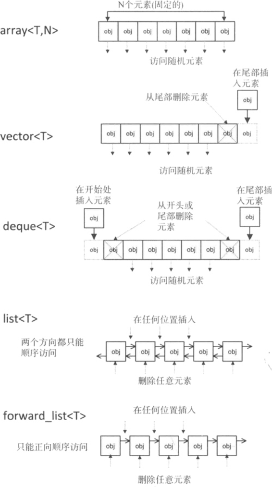
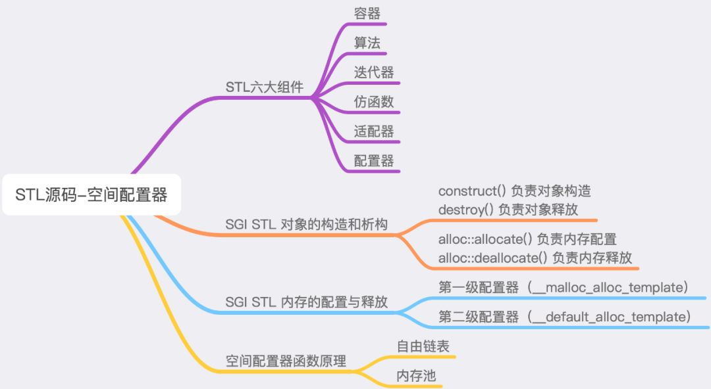
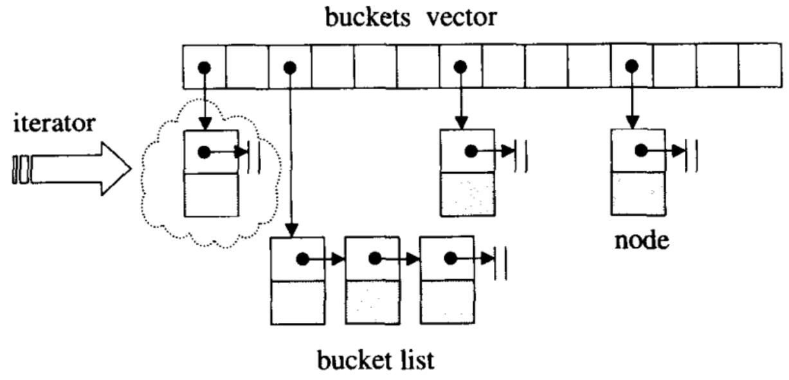
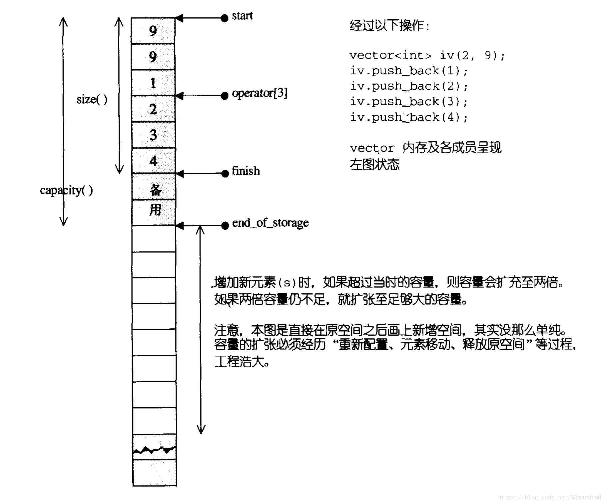
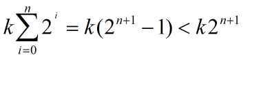
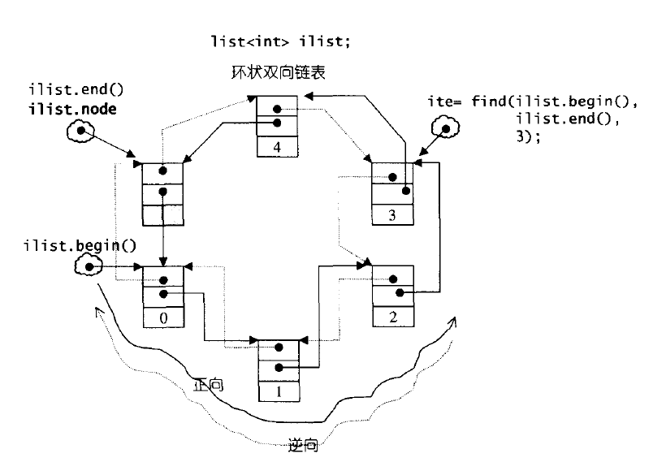
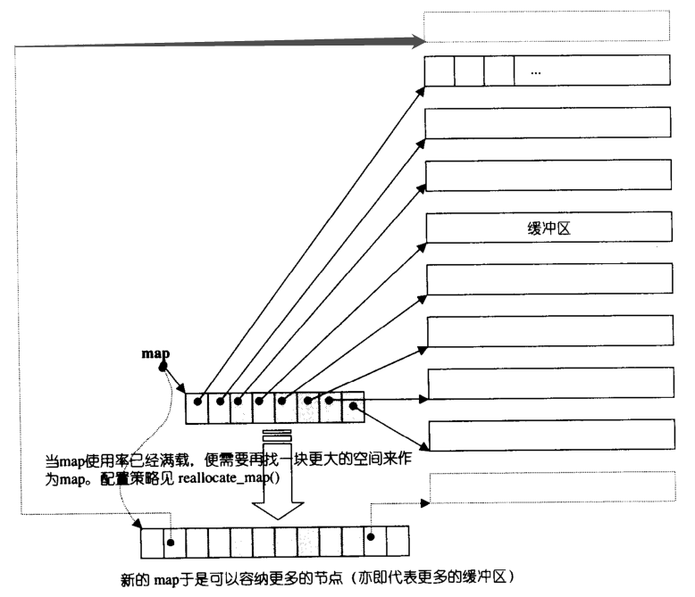
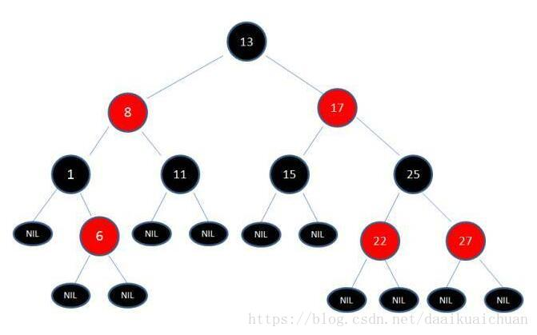

### 什么是`C++ STL`？

C++ STL从广义来讲包括了三类：`算法`，`容器`和`迭代器`。

- 算法包括排序，复制等常用算法，以及不同容器特定的算法。

- 容器就是数据的存放形式，包括==序列式容器==和==关联式容器==，序列式容器就是list，vector等，关联式容器就是set，map等。

  1. ==序列式容器==: 以<u>线性排列（类似普通数组的存储方式）</u>来存储某一指定类型（例如 int、double 等）的数据

     

  2. ==关联式容器==: 使用关联式容器存储的元素，都是一个一个的“键值对”（ <key,value> ），这是和序列式容器最大的不同。除此之外，序列式容器中存储的元素默认都是未经过排序的，而使用关联式容器存储的元素，默认会根据各元素的键值的大小做升序排序。 <u>C++ STL 标准库提供了 4 种关联式容器，分别为 map、set、multimap、multiset</u>

- 迭代器就是`在不暴露容器内部结构的情况`下对容器的`遍历`。

### `六大组件`

`容器 算法 迭代器 仿函数 配接器 配置器`

- 仿函数: 行为类似函数, 可作为算法的某种策略, 是一种重载了operator()的class或class template
- 配接器: 一种用来修饰容器或者仿函数或者迭代器接口的东西
- 配置器: 负责空间配置与管理, 实现了动态控件配置, 管理和释放的class template


### 标准库中有`哪些容器`？分别有什么特点？

标准库中的容器主要分为三类：顺序容器、关联容器、容器适配器。

- 顺序容器包括五种类型：
  - `array<T, N>`数组：固定大小数组，支持快速随机访问，但不能插入或删除元素；
  - `vector<T>`动态数组：支持快速随机访问，尾位插入和删除的速度很快；
  - `deque<T>`双向队列：支持快速随机访问，首尾位置插入和删除的速度很快；（可以看作是`vector`的增强版，与`vector`相比，可以快速地在首位插入和删除元素）
  - `list<T>`双向链表：只支持双向顺序访问，任何位置插入和删除的速度都很快；
  - `forward_list<T>`单向链表：只支持单向顺序访问，任何位置插入和删除的速度都很快。
- 关联容器包含两种类型：
  - map容器：
  - `map<K, T>`关联数组：用于保存关键字-值对 p`；
  - `unordered_map<K, T>`：用哈希函数组织的`map`；
  - `unordered_multimap<K, T>`：关键词可重复出现的`unordered_map`；
  - set容器：
  - `set<T>`：只保存关键字；
  - `multiset<T>`：关键字可重复出现的`set`；
  - `unordered_set<T>`：用哈希函数组织的`set`；
  - `unordered_multiset<T>`：关键词可重复出现的`unordered_set`；
- 容器适配器包含三种类型：
  - `stack<T>`栈、`queue<T>`队列、`priority_queue<T>`优先队列。


### [空间配置器](https://www.notion.so/5-30-STL-0499f51a21f94420bbed9675c0befab5)



内存配置由alloc::allocate()负责

内存释放由alloc::deallocate()负责

对象构造: construct

对象析构: destory

#### 双层级配置器

- 第一级配置器直接实用malloc和free`(>128B时)`
- 第二级配置器实用内存池的方式, 维护16条链表(2-128B)


### 什么是`stl内存池`，如何实现

内存池（Memory Pool） 是一种**内存分配**方式。通常我们习惯直接使用new、malloc 等申请内存，这样做的缺点在于：由于所申请内存块的大小不定，当频繁使用时会`造成大量的内存碎片`并进而降低性能。内存池则是在真正使用内存之前，先`申请分配一定数量的、大小相等`(一般情况下)的`内存块`留作备用。当有新的内存需求时，就从内存池中分出一部分内存块， 若内存块不够再继续申请新的内存。这样做的一个显著优点是尽量避免了内存碎片，使得内存分配效率得到提升。

#### stl

`allocate 包装 malloc，deallocate包装free`

一般是一次20*2个的申请，先用一半，留着一半，为什么也没个说法，侯捷在STL那边书里说好像是C++委员会成员认为20是个比较好的数字，既不大也不小。

1. 首先客户端会调用malloc()配置一定数量的区块（固定大小的内存块，通常为8的倍数 ），假设40个32bytes(也就是4字节)的区块，其中20个区块（一半）给程序实际使用，1个区块交出，另外19个处于维护状态。剩余20个（一半）留给内存池，此时一共有（20*32byte）

   > 申请40个内存块 一块4字节  20个实际使用  20个留着

2. 客户端之后有有内存需求，想申请（20* 64bytes）的空间，这时内存池只有（20* 32bytes），就先将（10*64bytes)个区块返回，1个区块交出，另外9个处于维护状态，此时内存池空空如也.

3. 接下来如果客户端还有内存需求，就必须再调用malloc()配置空间，此时新申请的区块数量会增加一个随着配置次数越来越大的附加量，同样一半提供程序使用，另一半留给内存池。申请内存的时候用永远是先看内存池有无剩余，有的话就用上，然后挂在0-15号某一条链表上，要不然就重新申请。

4. 如果整个堆的空间都不够了，就会在原先已经分配区块中寻找能满足当前需求的区块数量，能满足就返回，不能满足就向客户端报bad_alloc异常


### 什么时候需要用`hash_map`，什么时候需要用`map`?

总体来说，hash_map `查找速度`会比 map 快，而且查找速度基本和数据数据量大小无关，属于常数级别;而 map 的查找速度是 log(n) 级别。

并不一定常数就比 log(n) 小，hash 还有 hash 函数的耗时，明白了吧，如果你考虑效率，特别是在元素达到一定数量级时，考虑考虑 hash_map。但若你对内存使用特别严格，希望程序尽可能少消耗内存，那么一定要小心，hash_map 可能会让你陷入尴尬，特别是当你的 hash_map 对象特别多时，你就更无法控制了。而且 hash_map 的构造速度较慢。

现在知道如何选择了吗？权衡三个因素: <u>查找速度, 数据量, 内存使用</u> 。

> 查找速度快 hashmap  数据量大 对内存有要求用map

### STL中`hashtable`的`底层实现`？

STL中的hashtable使用的是**开链法**解决hash冲突问题，如下图所示。



hashtable中的bucket（桶）所维护的list既不是list也不是slist，而是其自己定义的由<u>hashtable_node</u>数据结构组成的linked-list，而<u>bucket聚合体本身使用vector进行存储</u>。hashtable的迭代器只提供前进操作，不提供后退操作

在hashtable设计bucket的数量上，其`内置了28个质数`[53, 97, 193,…,429496729]，<u>在创建hashtable时，会根据存入的元素个数选择大于等于元素个数的质数作为hashtable的容量（vector的长度）</u>，`其中每个bucket所维护的linked-list长度也等于hashtable的容量`==<u>(消耗内存)</u>==。如果插入hashtable的元素个数超过了bucket的容量，就要进行重建table操作，即找出下一个质数，创建新的buckets vector，重新计算元素在新hashtable的位置。

### `vector` 底层原理及其相关面试题

##### 1. vector的底层原理

<u>vector底层是一个动态数组，包含三个迭代器，`start`和`finish`之间是已经被使用的空间范围，`end_ of_storage`是整块连续空间包括备用空间的尾部。</u>

当空间不够装下数据（vec.push_back(val)）时，会自动申请另一片更大的空间（1.5倍或者2倍），然后把原来的数据拷贝到新的内存空间，接着释放原来的那片空间【vector内存增长机制】。

当释放或者删除（vec.clear()）里面的数据时，其存储空间不释放，仅仅是清空了里面的数据。

因此，对vector的任何操作一旦引起了空间的重新配置，指向原vector的所有迭代器会都失效了。



##### 2. vector中的reserve和resize的区别

- reserve是直接扩充到已经确定的大小，可以减少多次开辟、释放空间的问题（优化push_back），就可以提高效率，其次还可以减少多次要拷贝数据的问题。reserve只是保证vector中的空间大小（capacity）最少达到参数所指定的大小n。**reserve()只有一个参数。**

- resize()可以改变有效空间的大小，也有改变默认值的功能。capacity的大小也会随着改变（可能？）。resize()可以有多个参数。

##### 3. vector中的size和capacity的区别

- size表示当前vector中有多少个元素（finish – start），而capacity函数则表示它已经分配的内存中可以容纳多少元素（end_of_storage – start）。

##### 4. vector的元素类型可以是引用吗？

- <u>vector的底层实现要求连续的对象排列，引用并非对象，没有实际地址，因此vector的元素类型不能是引用</u>。

##### 5. vector迭代器失效的情况

- <u>当插入一个元素到vector中，由于`引起了内存重新分配`，所以指向原内存的迭代器全部失效</u>。

- 当删除容器中一个元素后,该迭代器所指向的元素已经被删除，那么也造成迭代器失效。erase方法会返回下一个有效的迭代器，所以当我们要删除某个元素时，需要it=vec.erase(it)

  > `指向被删除元素的迭代器失效`

##### 6. 正确释放vector的内存(clear(), swap(), shrink_to_fit())

vec.clear()：清空内容，但是不释放内存。

`vector().swap(vec)：清空内容，且释放内存，想得到一个全新的vector。`

vec.shrink_to_fit()：请求容器降低其capacity和size匹配。

`vec.clear();vec.shrink_to_fit();：清空内容，且释放内存。`

##### 7. vector 扩容为什么要以1.5倍或者2倍扩容?

根据查阅的资料显示，考虑可能产生的`堆空间浪费，成倍增长倍数不能太大`，使用较为广泛的扩容方式有两种，以2倍的方式扩容，或者以1.5倍的方式扩容。

以2倍的方式扩容，导致下一次申请的内存必然大于之前分配内存的总和，导致之前分配的内存不能再被使用，所以最好倍增长因子设置为(1,2)之间：



> 使用2倍（k=2）扩容机制扩容时，<u>每次扩容后的新内存大小必定大于前面的总和</u>。
> 而<u>使用1.5倍（k=1.5)扩容时，在几次扩展以后，可以重用之前的内存空间了</u>。<u>==可以更好的实现对内存的重复利用==</u>。

##### 8. vector的常用函数

```c++
vector<int> vec(10,100);        创建10个元素,每个元素值为100
vec.resize(r,vector<int>(c,0)); 二维数组初始化
reverse(vec.begin(),vec.end())  将元素翻转
sort(vec.begin(),vec.end());    排序，默认升序排列
vec.push_back(val);             尾部插入数字
vec.size();                     向量大小
find(vec.begin(),vec.end(),1);  查找元素
iterator = vec.erase(iterator)  删除元素
```

### `list` 底层原理及其相关面试题

##### 1. list的底层原理

list的底层是一个**双向链表**，以结点为单位存放数据，结点的地址在`内存中不一定连续`，每次插入或删除一个元素，就配置或释放一个元素空间。

<u>list不支持随机存取，**适合需要大量的插入和删除**，而不关心随即存取的应用场景。</u>



##### 2. list的常用函数

list人称小vector 除了不能随机读取，几乎所有的vector函数都可以使用 还能`push_front`

```c++
list.push_back(elem)    在尾部加入一个数据
list.pop_back()         删除尾部数据
list.push_front(elem)   在头部插入一个数据
list.pop_front()        删除头部数据
list.size()             返回容器中实际数据的个数
list.sort()             排序，默认由小到大 
list.unique()           移除数值相同的连续元素
list.back()             取尾部迭代器
list.erase(iterator)    删除一个元素，参数是迭代器，返回的是删除迭代器的下一个位置
```

### deque底层原理及其相关面试题

##### 1. deque的底层原理

deque是一个双向开口的连续线性空间（**双端队列**），在头尾两端进行元素的插入跟删除操作都有理想的时间复杂度。



##### 2. 什么情况下用vector，什么情况下用list，什么情况下用deque

vector可以随机存储元素（即可以通过公式直接计算出元素地址，而不需要挨个查找），但在非尾部插入删除数据时，效率很低，<u>适合对象简单，对象数量变化不大，随机访问频繁。除非必要，我们尽可能选择使用vector而非deque，因为deque的迭代器比vector迭代器复杂很多。</u>

<u>list不支持随机存储，适用于`对象大，对象数量变化频繁，插入和删除频繁`，比如`写多读少`的场景。</u>

需要从首尾两端进行插入或删除操作的时候需要选择deque。

##### 3. deque的常用函数

```c++
deque.push_back(elem)   在尾部加入一个数据。
deque.pop_back()        删除尾部数据。
deque.push_front(elem)  在头部插入一个数据。
deque.pop_front()       删除头部数据。
deque.size()            返回容器中实际数据的个数。
deque.at(idx)           传回索引idx所指的数据，如果idx越界，抛出out_of_range。
```

### `vector如何释放空间`?

由于vector的内存占用空间只增不减，比如你首先分配了10,000个字节，然后erase掉后面9,999个，留下一个有效元素，但是内存占用仍为10,000个。`所有内存空间是在vector析构时候才能被系统回收`。empty()用来检测容器是否为空的，clear()可以清空所有元素。但是即使clear()，vector所占用的内存空间依然如故，无法保证内存的回收。

`如果需要空间动态缩小`，可以考虑使用deque。如果vector，可以用swap()来帮助你释放内存。

> 动态缩小使用vector加shrink_to_fit 不可以吗？

```C++
vector(Vec).swap(Vec); //将Vec的内存清除；?????
vector().swap(Vec); //清空Vec的内存；
```

### 如何在共享内存上使用STL标准库？

#### 错误方法

想像一下把STL容器，例如map, vector, list等等，放入共享内存中，IPC一旦有了这些强大的通用数据结构做辅助，无疑进程间通信的能力一下子强大了很多。

我们没必要再为共享内存设计其他额外的数据结构，另外，STL的高度可扩展性将为IPC所驱使。STL容器被良好的封装，默认情况下有它们自己的内存管理方案。

当一个元素被插入到一个STL列表(list)中时，列表容器自动为其分配内存，保存数据。考虑到要将STL容器放到共享内存中，而容器却自己在堆上分配内存。

<u>一个最笨拙的办法是在堆上构造STL容器，然后把容器复制到共享内存，并且确保所有容器的内部分配的内存指向共享内存中的相应区域，这基本是个`不可能完成`的任务</u>。例如下边进程A所做的事情：

```c++
//Attach to shared memory
void* rp = (void*)shmat(shmId,NULL,0);
//Construct the vector in shared
//memory using placement new
vector<int>* vpInA = new(rp) vector<int>*;
//The vector is allocating internal data
//from the heap in process A's address
//space to hold the integer value
(*vpInA)[0] = 22;
```

然后进程B希望从共享内存中取出数据：

```c++
vector<int>* vpInB =  (vector<int>*) shmat(shmId,NULL,0);

//问题 - 向量包含
//在进程A的地址中分配的指针和空间
//在这里无效 
int i = *(vpInB)[0];
```

#### [正确方法](http://blog.jqian.net/post/creating-stl-containers-in-shared-memory.html)

进一步考察STL容器，我们发现它的模板定义中有第二个默认参数，也就是allocator 类，该类实际是一个内存分配模型。默认的allocator是从堆上分配内存（注：这就是STL容器的默认表现，我们甚至可以改造它从一个网络数据库中分配空间，保存数据）。下边是 vector 类的一部分定义：

```c++
template<class T, class A = allocator<T> >
class vector
{
    //other stuff
};
```

考虑如下声明：

```c++
//User supplied allocator myAlloc
vector<int,myAlloc<int> > alocV;
```

假设 `myAlloc<int>` 从`共享内存上分配内存`，则 `alocV` 将完全在共享内存上被构造，所以进程A可以如下：

```c++
//Attach to shared memory
void* rp = (void*)shmat(shmId,NULL,0);
//Construct the vector in shared memory
//using placement new
vector<int>* vpInA =
  new(rp) vector<int,myAlloc<int> >*;
//The vector uses myAlloc<int> to allocate
//memory for its internal data structure
//from shared memory
(*v)[0] = 22;
```

进程B可以如下读出数据：

```c++
vector<int>* vpInB = (vector<int,myAlloc<int> >*) shmat(shmId,NULL,0);

//Okay since all of the vector is
//in shared memory
int i = *(vpInB)[0];
```

所有附着在共享内存上的进程都可以安全的使用该vector。在这个例子中，该类的所有内存都在共享内存上分配，同时可以被其他的进程访问。只要提供一个用户自定义的allocator，任何STL容器都可以安全的放置到共享内存上。

> 有可用的`SharedAllocator`模板类 和 `Pool` 类完成共享内存的分配与回收。

#### 假设进程A在共享内存中放入了数个容器，进程B如何找到这些容器呢？

一个方法就是进程A把容器放在共享内存中的确定地址上（fixed offsets），则进程B可以从该已知地址上获取容器。另外一个改进点的办法是，进程A先在共享内存某块确定地址上放置一个map容器，然后进程A再创建其他容器，然后给其取个名字和地址一并保存到这个map容器里。

进程B知道如何获取该保存了地址映射的map容器，然后同样再根据名字取得其他容器的地址。

### `map`插入方式有哪几种？

总体就是两者 insert和[]; 其中insert有很多种写法

1) 用insert函数插入pair数据，

```cpp
mapStudent.insert(pair<int, string>(1, "student_one")); 
```

2) 用insert函数插入value_type数据

```cpp
mapStudent.insert(map<int, string>::value_type (1, "student_one"));
```

3) 在insert函数中使用make_pair()函数

```cpp
mapStudent.insert(make_pair(1, "student_one"));
```

4) 用数组方式插入数据    <u>key值已存在时是否会覆盖原value值</u> （insert重复插入 不会修改原始pair，直接视为无效）

```cpp
mapStudent[1] = "student_one";
```

### map 、set、multiset、multimap 底层原理及其相关面试题

##### 1. map 、set、multiset、multimap的底层原理

map 、set、multiset、multimap的底层实现都是**红黑树**，epoll模型的底层数据结构也是红黑树，linux系统中CFS进程调度算法，也用到红黑树。



红黑树的特性：

> 1. 每个结点或是红色或是黑色；
> 2. 根结点是黑色；
> 3. 每个叶结点是黑的；
> 4. 如果一个结点是红的，则它的两个儿子均是黑色；
> 5. 每个结点到其子孙结点的所有路径上包含相同数目的黑色结点。

红黑树详解具体看这篇：[别再问我什么是红黑树了](https://www.iamshuaidi.com/?p=2061)

对于STL里的map容器，count方法与find方法，都可以用来判断一个key是否出现，mp.count(key) > 0统计的是key出现的次数，因此只能为0/1，而mp.find(key) != mp.end()则表示key存在。

##### 2. map 、set、multiset、multimap的特点

set和multiset会根据特定的排序准则自动将元素排序，set中元素不允许重复，multiset可以重复。

map和multimap将key和value组成的pair作为元素，根据key的排序准则自动将元素排序（`因为红黑树也是二叉搜索树，所以map默认是按key排序的`），map中元素的key不允许重复，multimap可以重复。

map和set的增删改查速度为都是logn，是比较高效的。

##### 3. 为何map和set的插入删除效率比其他序列容器高，而且每次insert之后，以前保存的iterator不会失效？

因为存储的是结点，不需要内存拷贝和内存移动。

因为插入操作只是结点指针换来换去，结点内存没有改变。而iterator就像指向结点的指针，内存没变，指向内存的指针也不会变。

##### 4. 为何map和set不能像vector一样有个reserve函数来预分配数据?

<u>因为在map和set内部存储的已经不是元素本身了，而是包含元素的结点。</u>也就是说map内部使用的Alloc并不是map<Key, Data, Compare, Alloc>声明的时候从参数中传入的Alloc。

##### 5. map 、set、multiset、multimap的常用函数

```c++
it map.begin() 　 返回指向容器起始位置的迭代器（iterator）
it map.end() 返回指向容器末尾位置的迭代器
bool map.empty() 若容器为空，则返回true，否则false
it map.find(k) 寻找键值为k的元素，并用返回其地址
int map.size() 返回map中已存在元素的数量
map.insert({int,string}) 插入元素	
```

### unordered_map、unordered_set 底层原理及其相关面试题

unordered_map的底层是一个防冗余的哈希表（采用除留余数法）。`哈希表最大的优点，就是把数据的存储和查找消耗的时间大大降低，时间复杂度为O(1)；而代价仅仅是消耗比较多的内存`。

使用一个下标范围比较大的数组来存储元素。可以设计一个函数（哈希函数（一般使用除留取余法），也叫做散列函数），使得每个元素的key都与一个函数值（即数组下标，hash值）相对应，于是用这个数组单元来存储这个元素；也可以简单的理解为，按照key为每一个元素“分类”，然后将这个元素存储在相应“类”所对应的地方，称为桶。

但是，不能够保证每个元素的key与函数值是一一对应的，因此极有可能出现对于不同的元素，却计算出了相同的函数值，这样就产生了“冲突”，换句话说，就是把不同的元素分在了相同的“类”之中。 一般可采用拉链法解决冲突

```c++
unordered_map.begin() 　　  返回指向容器起始位置的迭代器（iterator） 
unordered_map.end() 　　    返回指向容器末尾位置的迭代器 
unordered_map.cbegin()　    返回指向容器起始位置的常迭代器（const_iterator） 
unordered_map.cend() 　　   返回指向容器末尾位置的常迭代器 
unordered_map.size()  　　  返回有效元素个数 
unordered_map.insert(key)  插入元素 
unordered_map.find(key) 　 查找元素，返回迭代器
unordered_map.count(key) 　返回匹配给定主键的元素的个数 
```

### 迭代器的底层机制和失效的问题

##### 1. 迭代器的底层原理

迭代器是连接容器和算法的一种重要桥梁，通过迭代器可以在不了解容器内部原理的情况下遍历容器。它的底层实现包含两个重要的部分：萃取技术和模板偏特化。

<u>萃取技术（traits）可以进行类型推导</u>，根据不同类型可以执行不同的处理流程，比如容器是vector，那么traits必须推导出其迭代器类型为随机访问迭代器，而list则为双向迭代器。

例如STL算法库中的distance函数，distance函数接受两个迭代器参数，然后计算他们两者之间的距离。显然对于不同的迭代器计算效率差别很大。比如对于vector容器来说，由于内存是连续分配的，因此指针直接相减即可获得两者的距离；而list容器是链式表，内存一般都不是连续分配，因此只能通过一级一级调用next()或其他函数，每调用一次再判断迭代器是否相等来计算距离。vector迭代器计算distance的效率为O(1),而list则为O(n),n为距离的大小。

使用萃取技术（traits）进行类型推导的过程中会使用到模板偏特化。<u>模板偏特化可以用来推导参数</u>，如果我们自定义了多个类型，除非我们把这些自定义类型的特化版本写出来，否则我们只能判断他们是内置类型，并不能判断他们具体属于是个类型。

```cpp
template <typename T>
struct TraitsHelper {
     static const bool isPointer = false;
};
template <typename T>
struct TraitsHelper<T*> {
     static const bool isPointer = true;
};

if (TraitsHelper<T>::isPointer)
     ...... // 可以得出当前类型int*为指针类型
else
     ...... // 可以得出当前类型int非指针类型
```

###### 一个理解traits的例子

```cpp
// 需要在T为int类型时，Compute方法的参数为int，返回类型也为int，
// 当T为float时，Compute方法的参数为float，返回类型为int
template <typename T>
class Test {
public:
     TraitsHelper<T>::ret_type Compute(TraitsHelper<T>::par_type d);
private:
     T mData;
};

template <typename T>
struct TraitsHelper {
     typedef T ret_type;
     typedef T par_type;
};

// 模板偏特化，处理int类型
template <>
struct TraitsHelper<int> {
     typedef int ret_type;
     typedef int par_type;
};

// 模板偏特化，处理float类型
template <>
struct TraitsHelper<float> {
     typedef float ret_type;
     typedef int par_type;
};
```

当函数，类或者一些封装的通用算法中的某些部分会因为数据类型不同而导致处理或逻辑不同时，traits会是一种很好的解决方案。

##### 2. 迭代器的种类

1. 输入迭代器：是只读迭代器，在每个被遍历的位置上只能读取一次。例如上面find函数参数就是输入迭代器。

2. 输出迭代器：是只写迭代器，在每个被遍历的位置上只能被写一次。
3. 前向迭代器：兼具输入和输出迭代器的能力，但是它可以对同一个位置重复进行读和写。但它不支持operator–，所以只能向前移动。
4. 双向迭代器：很像前向迭代器，只是它向后移动和向前移动同样容易。
5. 随机访问迭代器：有双向迭代器的所有功能。而且，它还提供了“迭代器算术”，即在一步内可以向前或向后跳跃任意位置， 包含指针的所有操作，可进行随机访问，随意移动指定的步数。支持前面四种Iterator的所有操作，并另外支持it + n、it – n、it += n、 it -= n、it1 – it2和it[n]等操作。

##### 3. 迭代器失效的问题

1. 插入操作

   对于vector和string，如果`容器内存被重新分配`，iterators,pointers,references失效；如果没有重新分配，那么插入点之前的iterator有效，插入点之后的iterator失效；

   对于deque，如果插入点位于除front和back的其它位置，iterators,pointers,references失效；当我们插入元素到front和back时，deque的迭代器失效，但reference和pointers有效；

   对于list和forward_list，所有的iterator,pointer和refercnce有效。

2. 删除操作

   对于vector和string，删除点之前的iterators,pointers,references有效；off-the-end迭代器总是失效的；

   对于deque，如果删除点位于除front和back的其它位置，iterators,pointers,references失效；当我们插入元素到front和back时，off-the-end失效，其他的iterators,pointers,references有效；

   对于list和forward_list，所有的iterator,pointer和refercnce有效。

   对于关联容器map来说，如果某一个元素已经被删除，那么其对应的迭代器就失效了，不应该再被使用，否则会导致程序无定义的行为。

### 为什么vector的插入操作可能会导致`迭代器失效`？

vector动态增加大小时，并不是在原空间后增加新的空间，而是以原大小的两倍在另外配置一片较大的新空间，然后将内容拷贝过来，并释放原来的空间。由于操作改变了空间，所以迭代器失效。

### vector的reserve()和resize()方法之间有什么区别？

首先，`vector`的容量`capacity()`是指在不分配更多内存的情况下可以保存的最多元素个数，而`vector`的大小`size()`是指实际包含的元素个数；

其次，`vector`的`reserve(n)`方法只改变`vector`的容量，如果当前容量小于`n`，则重新分配内存空间，调整容量为`n`；如果当前容量大于等于`n`，则无操作；

最后，`vector`的`resize(n)`方法改变`vector`的大小，如果当前容量小于`n`，则调整容量为`n`，同时将其全部元素填充为初始值；如果当前容量大于等于`n`，则不调整容量，只将其前`n`个元素填充为初始值。
