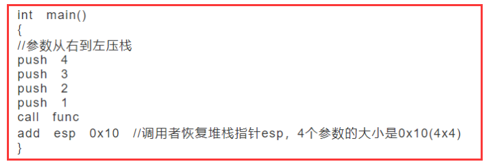
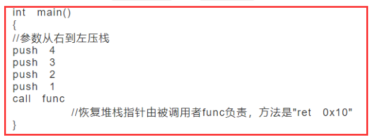
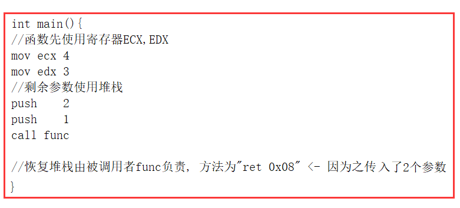
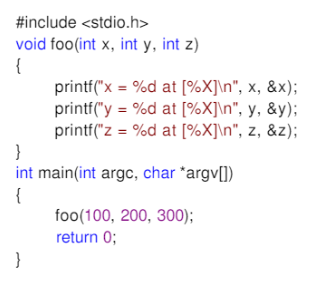
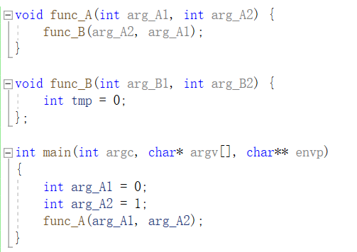
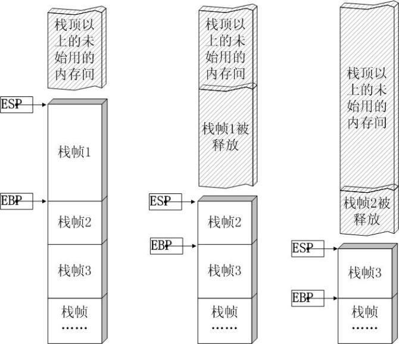
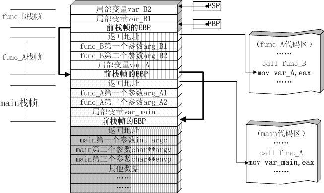

### `C++和C`的区别

**设计思想上：**

C++是`面向对象`的语言，而C是`面向过程`的结构化编程语言

**语法上：**

C++具有`封装、继承和多态`三种特性

C++相比C，增加多许多类型`安全`的功能，比如强制s类型转换

C++支持`范式编程`，比如模板类、函数模板等

**c++更安全**

（1）操作符`new`返回的指针类型严格与对象匹配，而不是void；

（2）C中很多以void为参数的函数可以改写为C++模板函数，而`模板是支持类型检查`的；

（3）引入`const关键字`代替#define constants，它是有**类型、有作用域**的，而#define constants只是简单的`文本替换`；

（4）一些`#define宏可被改写为inline函数`，结合函数的`重载`，可在`类型安全`的前提下`支持多种类型`，当然改写为模板也能保证类型安全

（5）C++提供了`dynamic_cast关键字，使得转换过程更加安全`，因为dynamic_cast比static_cast涉及更多具体的类型检查。


### C++中`标准库`是什么？

C++ 标准库可以分为两部分：

- 标准函数库： 这个库是由通用的、独立的、不属于任何类的函数组成的。函数库继承自 C 语言。

- 面向对象类库： 这个库是类及其相关函数的集合。
  1. 输入/输出 I/O、字符串和字符处理、数学、时间、日期和本地化、动态分配、其他、宽字符函数
  2. 标准的 C++ I/O 类、String 类、数值类、STL 容器类、STL 算法、STL 函数对象、STL 迭代器、STL 分配器、本地化库、异常处理类、杂项支持库


### 面向`过程`和面向`对象`的区别

<u>==**面向过程**==</u>

优点：`性能比面向对象高`，因为类调用时需要实例化，开销比较大，比较消耗资源;比如单片机、嵌入式开发、 Linux/Unix等一般采用面向过程开发，性能是最重要的因素。

缺点：`没有`面向对象`易维护、易复用、易扩展`

<u>==**面向对象**==</u>

优点：`易维护、易复用、易扩展`，由于面向对象有封装、继承、多态性的特性，可以设计出`低耦合`的系统，使`系统 更加灵活、更加易于维护`

缺点：`性能`比面向过程`低`


### 面向对象的`六个原则`

- 单一职责原则：就一个类而言，就应该仅有一个引起它发生变化的原因。

  - 在项目中做了一些工具类 去实现对单类功能的封装

- 开方封闭原则：软件实体可以扩展，但是不能修改。
  
  - 软件中的对象（类，模块，函数等等）应该对于==扩展==是开放的，但是对于修改是封闭的
  - <u>一些设计模式 比如装饰器模式 煎饼+鸡蛋+培根</u>
  - <u>dynamic_cast 转换 来在子类对象中添加新的方法 从而可以通过父类指针调用</u>
  
- 里氏替换原则：所有引用基类的地方必须能透明地使用其子类的对象。只要父类出现的地方子类就可以出现，而且替换成子类不会有任何的错误或异常，使用者可能根本就不需要知道是父类还是子类。

- 依赖倒转原则：高层模块不应该依赖底层模块，两个都应该依赖其抽象；抽象不应该依赖细节，细节应该依赖抽象。

- 迪米特原则：如果两个类之间不必发生彼此通信，那么这两个类就不应该发生直接的相互引用。如果其中一个类必须要调用另一个类的话，可以通过第三者转发这个调用。

  - 调用者或者依赖者只需要知道他需要的方法即可。类和类之间的关系越密切，耦合度越大，当一个类发生改变时，对另一个类的影响也大。

- 接口隔离原则：类与类之间的依赖关系应该建立在最小的接口之上，接口隔离原则将非常庞大、臃肿的接口拆分成更小的和更具体的接口，这样客户端将会只需要知道他们感兴趣的方法。

  - 接口隔离原则的摸底是系统解开耦合，从而更容易重构，更改和重新部署。

  

### C++为什么可以`函数重载`

`c++函数重载的原理:`

编译器在编译.cpp文件中当前使用的作用域里的同名函数时，根据函数形参的类型和顺序会对函数进行重命名（不同的编译器在编译时对函数的重命名标准不一样）但是总的来说，他们都把文件中的同一个函数名进行了重命名；

**在vs编译器中：**

根据返回值类型（不起决定性作用）+形参类型和顺序（起决定性作用）的规则重命名并记录在map文件中。

在**linux g++** **编译器中：**

根据`函数名字的字符数`+`形参类型和顺序`的规则重命名记录在符号表中；从而产生不同的函数名，当外面的函数被调用时，便是根据这个记录的结果去寻找符合要求的函数名,进行调用；

**为什么c语言不能实现函数重载**

**编译器在编译**.c文件时，`只会给函数进行简单的重命名`；具体的方法是给函数名之前加上”_”;所以加入两个函数名相同的函数在编译之后的函数名也照样相同；调用者会因为不知道到底调用那个而出错；

`重载匹配的原则`

> 1. 名字查找
> 2. 确定候选函数
> 3. 寻找最佳匹配


### ==C++11新特性==

- 空指针nullptr：nullptr关键字用于区分空指针与0，其类型为nullptr_t，能够隐式的转换为任何指针或成员指针的类型，从而进行相等或不等的比较。而NULL一般被宏定义成0，在重载时可能会遇到问题。

- ==Lambda表达式==：匿名函数特性：

  - ```c++
    auto add = [](int a, int b) -> int{return a+b;};
    ```

  - 编译器实现 **lambda 表达式**大致分为一下几个步骤

    1. 创建 **lambda 类**，实现构造函数，使用 lambda 表达式的函数体重载 **operator()**（所以 lambda 表达式 也叫匿名函数对象）
    2. 创建 lambda 对象
    3. 通过对象调用 **operator()**

- 右值引用：基于右值引用可实现移动语义和完美转发， 消除两个对象交互时不必要的对象拷贝，节省运算存储空间，提高效率。

- 泛化的常量表达式：编译期常量

  - ```c++
    constexpr int N = 9;
    int arr[N];
    ```

- ==初始化列表==
- 统一的初始化语法
- 类型推导```auto```：编译器可以根据初始值自动推导出类型，但是不能用于函数传参以及数组类型的推导。
- 基于范围的for循环```for(auto &x:v)```
- 构造函数委托
- ==final和override==：final用于禁止虚函数被重写/禁止类被继承，override来显示地重写虚函数。
- default和delete
- 静态==assertio==
- 智能指针：四种智能指针可用于解决内存管理问题
- 正则表达式
- 增强的==元组==
- 哈希表
- ==atomic原子操作==：可用于多线程资源互斥操作。

#### c++14新特性

1. auto优化

   1. auto可以作为函数返回值
   2. auto可以作为lambda参数

2. 模板

   1. 支持变量模板

      ```c++
      template<class T>
      constexpr T pi = T(3.1415926535897932385L);
      
      int main() {
          cout << pi<int> << endl; // 3
          cout << pi<double> << endl; // 3.14159
          return 0;
      }
      ```

   2. 支持别名模板

      ```c++
      template<typename T, typename U>
      struct A {
          T t;
          U u;
      };
      
      template<typename T>
      using B = A<T, int>;
      
      int main() {
          B<double> b;
          b.t = 10;
          b.u = 20;
          cout << b.t << endl;
          cout << b.u << endl;
          return 0;
      }
      ```

#### c++17新特性


### 一个`空类`都有什么`默认`函数

三个构造，一个赋值2个寻址

1. 无参的构造函数

```c
Empty(){}
```

2. 拷贝构造函数

```c++
Empty(const Empty& copy){}
```

3. 赋值运算符

```c++
Empty& operator = (const Empty& copy){}
```

4. 析构函数（非虚）

```c++
~Empty(){}
```

5. 寻址函数

```c++
Empty* operator&(){}//取址运算符
```

6. const取址函数

```c++
const Empty* operator&() const {}//const 取址运算符
```


### `this指针`

1. 定义

- 在 C++ 中，每一个对象都能通过 this 指针来访问自己的地址。`this 指针是所有成员函数的隐含参数`。因此，在成员函数内部，`它可以用来指向调用对象`。

  > 这样理解 类的成员函数也是保存在代码段的 成员函数就是通过this指针作为隐含的形参和类联系起来

2. `this只能在成员函数中使用`  全局函数 类的静态成员函数都不行

   成员函数默认第一个参数为T* const register this。

   `（友元函数，全局函数不是成员函数）`

3. this指针`不能再静态函数`中使用

- 静态函数如同静态变量一样，他不属于具体的哪一个对象，`静态函数表示了整个类范围意义上的信息`，而`this指针却实实在在的对应一个对象`，所以this指针不能被静态函数使用。

4. `this指针的创建`

- this指针在<u>成员函数的开始执行前构造</u>的，在成员的执行结束后清除。

5. this指针只有在`成员函数`中才有定义

- 创建一个对象后，不能通过对象使用this指针。也无法知道一个对象的this指针的位置（只有在成员函数里才有this指针的位置）。当然，在成员函数里，你是可以知道this指针的位置的（可以`&this`获得)，也可以直接使用的。
- this 实际上是成员函数的一个形参，在调用成员函数时将对象的地址作为实参传递给 this。不过 this 这个形参是隐式的，它并不出现在代码中，而是在编译阶段由编译器默默地将它添加到参数列表中。
- this 作为隐式形参，`本质上是成员函数的局部变量`，所以只能用在成员函数的内部，并且只有在通过对象调用成员函数时才给 this 赋值。


### C++中类成员的`访问权限`

1. public修饰的成员变量

- 能被类成员函数、子类函数、友元访问，也能被类的对象访问，`不需要通过成员函数就可以由类的实例直接访问`

2. private修饰的成员变量

-  只能被类成员函数及友元访问，不能被其他任何访问，本身的类对象也不行，`类的实例要通过成员函数才可以访问`，这个可以起到`信息隐藏`

3. protected是受保护变量

   - `只能被类成员函数、子类函数及友元访问，不能被其他任何访问，本身的类对象也不行`，也就是说，`基类中有protected成员，子类继承于基类，那么也可以访问基类的protected成员，要是基类是private成员，则对于子类也是隐藏的，不可访问`


### `重载、覆盖（重写）、隐藏（重定义）`

1. **重载：**

   两个函数名相同，但是`参数列表`不同（个数，类型），返回值类型没有要求，在同一作用域中。

   > ==<u>**只有返回值不同的话不会引起重载**</u>==

2. **重写：**

   - `子类继承了父类`，父类中的函数是虚函数，在子类中重新定义了这个虚函数，这种情况是重写。这样的函数地址是在运行期间绑定。需要函数返回值也相同。
   - （如果派生类在虚函数声明时使用了override描述符，那么该函数必须重载其基类中的同名函数，否则代码将无法通过编译）

3. **隐藏：**（重定义）

   - 如果派生类的函数与基类的函数同名，但参数不同，则无论有无virtual关键字，`基类的函数都被隐藏`。不存在子类和父类的同名函数重载。**<u>==（子和父的函数有不同的地方，那么肯定隐藏父的）==</u>**
   - 如果派生类的函数与基类的函数同名，并且参数也相同，但是基类函数没有virtual关键字，此时基类的函数被隐藏。**<u>==（子和父的函数完全相同，基类没有virtual，则父中虚函数被隐藏）==</u>**


### C++中`struct和class`的区别

在C++中，可以用struct和class定义类，都可以继承。区别在于：

1. `默认的继承访问权`。class默认的是private,strcut默认的是public。
2. `默认访问权限`：struct作为数据结构的实现体，它默认的数据访问控制是public的，而class作为对象的实现体，它默认的成员变量访问控制是private的。
3. “class”这个关键字还用于`定义模板参数`，就像“typename”。但关建字“struct”不用于定义模板参数
4. class和struct在使用大括号`{ }`上的区别
   - **关于使用大括号初始化**
     1. class和struct如果定义了构造函数的话，都不能用大括号进行初始化
     2. 如果没有定义构造函数，struct可以用大括号初始化。
     3. 如果没有定义构造函数，且所有成员变量全是public的话，class可以用大括号初始化


### `struct 和union`的区别

1. **结构体struct**

- 各成员`各自拥有自己的内存`，各自使用互不干涉，同时存在的，`遵循内存对齐原则。一个struct变量的总长度等于所有成员的长度之和。`

2. **联合体union**

- 各成员`共用一块内存空间`，并且同时只有一个成员可以得到这块内存的使用权(对该内存的读写)，各变量共用一个内存首地址。因而，`联合体比结构体更节约内存`。一个union变量的总长度至少能容纳最大的成员变量，而且要满足是所有成员变量类型大小的整数倍。`不允许对联合体变量名U2直接赋值或其他操作`。


### ifndef/define/endif和program once的`区别`

- 两者都是为了防止头文件被重复包含
- ifndef是由语言本身提供支持，program once一般由编译器提供支持，较老的编译器可能会提供不支持的情况；
- 运行速度上ifndef一般慢于program once；
- ifndef作用于某一段被包含的代码，而program once则是针对包含该语句的文件；
- 如果用ifndef包含某一段宏定义，若宏定义出现“撞车”情况，可能会出现这个宏在程序中提示宏未定义的情况。program once针对整个文件，因此不会存在撞车情况，但是如果某个头文件被多次拷贝，program once无法保证不被多次包含；
- program once是从物理上判断是不是同一个头文件，而不是从内容上。ifndef则是从内容上防止重复包含。


### [使用`初始化列表`的好处](https://www.cnblogs.com/wuyepeng/p/9863763.html)

1. 类成员中存在`常量`，如`const` int a,只能用初始化不能复制
2. 类成员中存在`引用`，同样只能使用初始化不能赋值。
3. 提高效率

**构造函数的两个执行阶段**

1. `初始化阶段`：所有类类型（class type）的成员都会在初始化阶段初始化，即使该成员没有出现在构造函数的初始化列表中。
2. `计算阶段`：如果类成员，初始化列表只用调用类的拷贝构造函数，不使用初始化列表则需先调用默认构造函数构造对象，再给对象赋值，赋值的阶段即为计算阶段，`初始化列表可以省去计算阶段`从而优化性能


### [C++如何阻止一个类被实例化](https://www.cnblogs.com/Stephen-Qin/p/11514588.html)

1. 定义一个无用的抽象函数，使得类成为`抽象类`。
2. 将构造函数定义为private.
3. 使用 构造函数=delete


### 说一说你理解的`内存对齐`以及原因

1. <u>==内存存取粒度.==</u>
2. 4字节存取粒度的处理器取int类型变量（32位系统），<u>==该处理器只能从地址为4的倍数的内存开始读取数据==</u>。
3. 假如没有内存对齐机制，数据可以任意存放，可能出现两块内存才能合并出一个小数据
4. 有了内存对齐, 提高了数据读取的效率。


### C/C++ 中==指针和引用==的区别？

1. 指针有自己的一块`空间`，而引用只是一个`别名`；
2. 使用`sizeof看一个指针的大小是4`，而`引用则是被引用对象的大小`<u>==；大小==</u>
3. 指针可以被初始化为`NULL`，而引用必须被`初始化`且必须是一个已有`对象`的引用；<u>==初始化==</u>
4. 作为参数传递时，`指针需要被解引用`才可以对对象进行操作，而`直接对引用的修改都会改变引用所指向的对象`；
5. 可以有`const指针`，但是没有const引用；
6. 指针在使用中可以指向其它对象，但是引用只能是一个对象的引用，不能被改变；<u>==指向是否可改==</u>
7. 指针可以有`多级指针`（**p），而引用至于`一级`； <u>==多级==</u>
8. 指针和引用使用`++`运算符的意义不一样； 指针++移动地址，引用++正常++
9. 如果返回动态内存分配的对象或者内存，必须使用指针，引用可能引起内存泄露


### `传值、传指针、传引用`

#### 对于使用传递的值而不作修改的函数：

- 如果数据对象很小，如内置数据类型或者小型结构，则按值传递；
- 如果数据对象是数组，则使用指针，并将指针声明为指向const的指针；
- 如果数据结构比较大，则使用const指针或const引用，提高程序效率；
- 如果数据对象是类对象，则使用const引用。

#### 对于做修改的函数

- 如果数据对象是内置数据类型，则使用指针；
- 如果数据对象是数组，则只能使用指针；
- 如果数据对象是结构，则使用指针或引用；
- 如果数据对象是类对象，则使用引用。


### C++`右值引用`

#### 目的：

- 消除两个对象交互式不必要的对象拷贝，节省运行存储资源，提高效率；
- 能够更简洁明确地定义泛型函数。

#### 左值和右值的概念：

- 左值：能对表达式取地址、或具名变量/对象。一般表达式结束后依然存在的持久对象。
- 右值：不能对表达式取地址，或匿名对象。一般指表达式结束就不再存在的临时对象。

#### 移动语义：

​		对于一个包含指针成员变量的类，由于编译器默认的拷贝构造函数都是浅拷贝，所以我们一般都需要通过实现深拷贝的拷贝构造函数，为指针成员分配新的内存并进行内容拷贝，从而避免悬挂指针的问题。

#### 完美转发

​		完美转发是指在函数模板中，完全依照模板的参数的类型，将参数传递给函数模板中调用的另一个函数，即传入转发函数的是左值对象，目标函数就能获得左值对象，转发函数是右值对象，目标函数就能获得右值对象，从而不产生额外的开销。

​		因此转发函数和目标函数参数一般采用引用类型，从而避免拷贝的开销。同时，由于目标函数可能既需要接受左值引用，有需要接受右值引用，所以考虑转发也需要兼容这两种类型。


### `野指针`是什么？

野指针就是指向      `一个已删除的对象`或者`未申请访问权限内存区域`       的指针

指针变量未初始化

任何[指针变量](https://baike.baidu.com/item/指针变量)刚被创建时不会自动成为NULL指针，它的缺省值是随机的，它会乱指一气。指针释放后之后未置空

有时[指针](https://baike.baidu.com/item/指针)在free或delete后未赋值 NULL，便会使人以为是合法的。别看free和delete的名字（尤其是delete），它们只是把指针所指的内存给释放掉，但并没有把指针本身干掉。此时指针指向的就是“垃圾”内存。释放后的指针应立即将指针置为NULL，防止产生“野指针”。

指针操作超越变量作用域

数组越界

不要返回指向栈内存的指针或引用，因为栈内存在函数结束时会被释放。


### c++四个==智能指针==：[shared_ptr](http://c.biancheng.net/view/7898.html),unique_ptr,weak_ptr,auto_ptr

C++里面的四个智能指针: auto_ptr, `shared_ptr`, `weak_ptr`, `unique_ptr` 其中后三个是c++11支持，并且第一个已经被11弃用。

`为什么要使用智能指针`：

智能指针的作用是管理一个指针，因为存在以下这种情况：

> 申请的空间在函数结束时`忘记释放，造成内存泄漏`。使用智能指针可以很大程度上的避免这个问题，因为智能指针就是一个<u>==类==</u>，当超出了类的作用域是，类会自动调用<u>==析构函数==</u>，析构函数会自动释放资源。所以`智能指针的作用原理就是在函数结束时自动释放内存空间，不需要手动释放内存空间。`

1. auto_ptr（c++98的方案，cpp11已经抛弃）

- 采用`所有权模式`。

```c++
auto_ptr<string> p1 (new string ("I reigned lonely as a cloud.”));
auto_ptr<string> p2;
p2 = p1; //auto_ptr不会报错.
```

- 此时不会报错，`p2剥夺了p1的所有权`，但是当程序运行时访问p1将会报错。所以auto_ptr的缺点是：存在潜在的内存崩溃问题！

- > auto_ptr采用`copy语义`来转移指针资源，转移指针资源的所有权的同时`将原指针置为NULL`，这跟通常理解的copy行为是不一致的(不会修改原数据)，而这样的行为在有些场合下不是我们希望看到的。
  >
  > <u>所以取代的原因是和我们的使用习惯不一样吗？赋值等号运算与我们理解的不一样</u>
  >
  > 而现在C++11的对move语义的支持，使得这样的资源转移**通常**只会在**必要的场合**发生，
  > 例如转移一个临时变量（右值）给某个named variable（左值），
  > 或者一个函数的返回（右值）
  >
  > 这也就是用unique_ptr代替auto_ptr的原因，
  > 本质上来说，就是unique_ptr禁用了copy，而用move替代。
  >
  > 之所以说通常，是因为，也可以用std:move来实现左值move给左值，例如：
  >
  > ```cpp
  > unique_ptr<string> p1(new string("I reigned lonely as a cloud"));
  > unique_ptr<string> p2(std::move(p1));
  > ```

2. unique_ptr（替换auto_ptr）

- unique_ptr实现`独占式拥有`或严格拥有概念，保证同一时间内只有一个智能指针可以指向该对象。它对于避免资源泄露(例如“以new创建对象后因为发生异常而忘记调用delete”)特别有用。

- 采用`所有权`模式，还是上面那个例子

````c++
unique_ptr<string> p3 (new string  ("auto")); 
unique_ptr<string> p4；   
p4 = p3;//此时会报错！！
````

- 编译器认为p4=p3非法，避免了p3不再指向有效数据的问题。因此，unique_ptr比auto_ptr更安全。

- 另外unique_ptr还有更聪明的地方：当程序试图将一个 unique_ptr 赋值给另一个时，如果源 unique_ptr 是个`临时右值`，编译器允许这么做；如果源 unique_ptr 将存在一段时间，编译器将禁止这么做，比如：

```c++
unique_ptr<string> pu1(new string ("hello world"));
unique_ptr<string> pu2;
pu2 = pu1;                   // #1 not allowed
unique_ptr<string> pu3;
pu3 = unique_ptr<string>(new string ("You"));  // #2 allowed
```

- 其中#1留下悬挂的unique_ptr(pu1)，这可能导致危害。而#2不会留下悬挂的unique_ptr，因为它调用 unique_ptr 的构造函数，该构造函数创建的临时对象在其所有权让给 pu3 后就会被销毁。这种随情况而已的行为表明，unique_ptr 优于允许两种赋值的auto_ptr 。

- 注：如果确实想执行类似与#1的操作，要安全的重用这种指针，可给它赋新值。C++有一个标准库函数`std::move()`，让你能够将一个unique_ptr赋给另一个。例如：

```c++
unique_ptr<string> ps1, ps2;
ps1 = demo("hello");
ps2 = move(ps1); //(ps1不在指向原来对象)
ps1 = demo("alexia");
cout << *ps2 << *ps1 << endl;
```

3. <u>[==shared_ptr==](https://www.cnblogs.com/diysoul/p/5930361.html)</u>

- shared_ptr实现`共享式拥有`概念。多个智能指针可以指向相同对象，该对象和其相关资源会在“`最后一个引用被销毁`”时候`释放`。从名字share就可以看出了资源可以被多个指针共享，它使用计数机制来表明资源被几个指针共享。可以通过成员函数use_count()来查看资源的所有者个数。除了可以通过new来构造，还可以通过传入auto_ptr, unique_ptr,weak_ptr来构造。当我们调用release()时，当前指针会释放资源所有权，计数减一。当计数等于0时，资源会被释放。<u>==引用计数==</u>

- shared_ptr 是为了解决 auto_ptr 在对象所有权上的局限性(auto_ptr 是独占的), 在使用引用计数的机制上提供了可以共享所有权的智能指针。

- 成员函数：

  1. use_count 返回引用计数的个数
  2. unique 返回是否是独占所有权( use_count 为 1)
  3. swap 交换两个 shared_ptr 对象(即交换所拥有的对象)
  4. reset 放弃内部对象的所有权或拥有对象的变更, 会引起原有对象的引用计数的减少
  5. get 返回内部对象(指针), 由于已经重载了()方法, 因此和直接使用对象是一样的.如 shared_ptr<int> sp(new int(1)); sp 与 sp.get()是等价的

  ```c++
  #include <iostream>
  #include <memory>
  using namespace std;
  int main()
  {
      //构建 2 个智能指针
      std::shared_ptr<int> p1(new int(10));
      std::shared_ptr<int> p2(p1);
      //输出 p2 指向的数据
      cout << *p2 << endl;   //输出10
      p1.reset();//引用计数减 1,p1为空指针
      if (p1) {
          cout << "p1 不为空" << endl;
      }
      else {
          cout << "p1 为空" << endl;  //输出
      }
      //以上操作，并不会影响 p2
      cout << *p2 << endl;    //输出10
      //判断当前和 p2 同指向的智能指针有多少个
      cout << p2.use_count() << endl;  //输出 1
      return 0;
  }
  ```

4. weak_ptr  ( `shared_ptr 指针的一种辅助工具`)

- weak_ptr 是一种`不控制对象生命周期`的智能指针, 它指向一个 shared_ptr 管理的对象. 进行该对象的内存管理的是那个强引用的 shared_ptr. weak_ptr只是提供了对管理对象的一个访问手段。weak_ptr 设计的目的是为配合 shared_ptr 而引入的一种智能指针来协助 shared_ptr 工作, 它只可以从一个 shared_ptr 或另一个 weak_ptr 对象构造, `它的构造和析构不会引起引用记数的增加或减少。weak_ptr是用来解决shared_ptr相互引用时的死锁问题,如果说两个shared_ptr相互引用,那么这两个指针的引用计数永远不可能下降为0,资源永远不会释放`。它是对对象的一种弱引用，不会增加对象的引用计数，和shared_ptr之间可以相互转化，shared_ptr可以直接赋值给它，它可以通过调用lock函数来获得shared_ptr。

  ````c++
  class B;
  class A{
  public:
  	shared_ptr<B> pb_;
  	~A(){
      cout<<"A delete\n";
    }
  };
  
  class B{
  public:
    shared_ptr<A> pa_;
  	~B(){
      cout<<"B delete\n";
    }
  };
  
  void fun(){
    shared_ptr<B> pb(new B());
    shared_ptr<A> pa(new A());
    pb->pa_ = pa;
    pa->pb_ = pb;
    cout<<pb.use_count()<<endl; //2
    cout<<pa.use_count()<<endl; //2
  }
  
  int main(){
    fun();
    return 0;
  }
  ````

- 可以看到fun函数中pa ，pb之间`互相引用`，两个资源的引用计数为2，当要跳出函数时，智能指针pa，pb析构时两个资源引用计数会减一，但是两者引用计数还是为1，导致跳出函数时资源没有被释放（pa_，pb_未释放，因为AB是在堆上申请的内存），如果把其中一个改为weak_ptr就可以了，我们把类A里面的shared_ptr pb_; 改为weak_ptr pb_; 运行结果如下，这样的话，资源B的引用开始就只有1，当pb析构时，B的计数变为0，B得到释放，B释放的同时也会使A的计数减一，同时pa析构时使A的计数减一，那么A的计数为0，A得到释放。

- 注意的是`我们不能通过weak_ptr直接访问对象的方法`，比如B对象中有一个方法print(),我们不能这样访问，pa->pb_->print(); 因为pb_是一个weak_ptr，应该先把它转化为shared_ptr,如：

  ````c++
  shared_ptr p = pa->pb_.lock();  //将weak_ptr转换为shared_ptr
  p->print();
  ````

### `智能指针的线程安全`问题

- 智能指针shared_ptr本身（底层实现原理是引用计数）是线程安全的但对象的读写则不是，因为shared_ptr有两个数据成员，一个是指向的对象的指针，还有一个就是我们上面看到的引用计数管理对象。

- 当智能指针发生拷贝的时候，标准库的实现是先拷贝智能指针，再拷贝引用计数对象（拷贝引用计数对象的时候，会使use_count加一），这两个操作并不是原子操作。

- 如果线程1拷贝对象后线程2将该对象销毁，然后线程1再将引用计数加1，就会产生悬空指针。
  1. 同一个shared_ptr被多个线程读，是线程安全的；
  2. 同一个shared_ptr被多个线程写，不是线程安全的；
  3. 共享引用计数的不同的shared_ptr被多个线程写，是线程安全的。

- 线程不安全例子：

```c++
shared_ptr<Foo> g(new Foo); // 线程之间共享的 shared_ptr
shared_ptr<Foo> x; // 线程 A 的局部变量
shared_ptr<Foo> n(new Foo); // 线程 B 的局部变量
```

- 1. 线程 A 执行x = g;（即 read g），以下完成了步骤 1，还没来及执行步骤 2。这时切换到了 B 线程。
  2. 同时线程 B 执行 g = n; （即 write G），两个步骤一起完成了。
  3. 这时 Foo1对象已经销毁，x.ptr 成了空悬指针！ 
- `我刚读完他 你就把他写没了`


weak_ptr不会增加引用计数，不能直接操作对象的内存（需要先调用[lock](https://links.jianshu.com/go?to=https://en.cppreference.com/w/cpp/memory/weak_ptr/lock)接口），需要和shared_ptr配套使用。

同时，通过weak_ptr获得的shared_ptr可以安全使用，因为其[lock](https://links.jianshu.com/go?to=https://en.cppreference.com/w/cpp/memory/weak_ptr/lock)接口是原子性的，那么`lock返回的是一个新的shared_ptr`，不存在同一个shared_ptr的读写操作。


### `栈和堆`比较

- 申请方式不同。
  - 栈由系统自动分配。
  - 堆是程序员申请和释放的。
- 申请大小限制不同。
  - 栈顶和栈底是之前预设好的，栈是向栈底扩展，大小固定，可以通过ulimit -a查看，由ulimit -s修改。  4M
  - 堆向高地址扩展，是不连续的内存区域，大小可以灵活调整。 3G 128T
- 申请效率不同。
  - 栈由系统分配，速度快，不会有碎片。
  - 堆由程序员分配，速度慢，且会有碎片。


### `堆快`一点还是`栈快`

毫无疑问是**<u>==栈快==</u>**一点。

因为<u>操作系统会在底层对栈提供支持，会分配专门的寄存器存放栈的地址，栈的入栈出栈操作也十分简单，并且有专门的指令执行，所以栈的效率比较高也比较快</u>。

而堆的操作是由C/C++函数库提供的，在分配堆内存的时候需要`一定的算法寻找合适大小的内存`。<u>并且获取堆的内容需要==两次访问==，第一次访问指针，第二次根据指针保存的地址访问内存，因此堆比较慢。</u>

> 栈为什么快?
>
> 1. 底层提供支持, 有专门的寄存器
> 2. 栈的出入操作简单, 专门的指令
>
> 堆为什么慢?
>
> 1. 算法查找合适的内存块
> 2. 两次访问 先访问指针 在访问内存块


### 什么时候会发生`段错误`

1. 使用`未经初始化及或已经释放的指针地址`，使用野指针:

2. 试图修改字符串常量的内容（`写入只读的内存地址`）

3. `数组越界`
4. `堆栈溢出`
5. `错误的访问类型`引起
6. 访问了不属于进程地址空间的内存 最常见的就是给一个指针以0地址；
7. 访问了不存在的内存 最常见的情况不外乎解引用空指针了：
8. 内存越界，数组越界，变量类型不一致等
9. 试图把一个整数按照字符串的方式输出


### C++`异常处理`的办法

- try、throw和catch

- 函数的异常声明列表

  ```C++
  int fun() throw(int, double, A, B, C){...};
  ```

- C++标准异常类exception：

  - bad_typeid：使用typeid运算符如果其操作数是一个多态类的指针，而该指针的值为NULL，则会抛出异常。
  - bad_cast：在用dynamic_cast进行从多态基类对象到派生类的引用的强制类型转换时，如果转换时不安全的，则会抛出此异常。
  - bad_alloc：用new运算符进行动态内存分配时，若没有足够的内存，则会引发此异常。
  - out_of_range：用vector或string的at成员成员函数根据下表访问元素时，若下标越界，则抛出异常


### `内存溢出`原因

1. 内存中加载的==数据量过于庞大==，如一次从数据库取出过多数据  (new读取几个g的文件) 

2. **<u>==递归==</u>** 调用层次太多。递归函数在运行时会执行压栈操作，当压栈次数太多时，也会导致堆栈溢出。

3. ==没有释放资源==: 比如sharedptr, socket, 基类析构函数不是virtual从而无法调用子类析构等 或者new的忘记了释放 `集合类中有对对象的引用，使用完后未清空，使得不能回收`

4. 代码中存在<u>==死循环或循环==</u>产生过多重复的对象实体


### 什么是`内存泄漏`

由于疏忽或错误造成了程序`未能释放`掉不再使用的内存的情况。内存泄漏并非指内存在物理上的消失，而是应用程序分配某段内存后，`由于设计错误，失去了对该段内存的控制，因而造成了内存的浪费`。

#### 内存泄漏的分类：

1. 堆内存泄漏 （Heap leak）。对内存指的是程序运行中根据需要分配通过malloc,realloc new等从堆中分配的一块内存，再是完成后必须通过调用对应的 free或者delete 删掉。如果程序的设计的错误导致这部分内存没有被释放，那么此后这块内存将不会被使用，就会产生Heap Leak.   ==new了没有delete==

2. 系统资源泄露（Resource Leak）。主要指程序使用系统分配的资源比如 Bitmap,handle ,SOCKET等没有使用相应的函数释放掉，导致系统资源的浪费，严重可导致系统效能降低，系统运行不稳定。 ==套接字未释放啊之类的 子线程未释放==

3. 没有将==基类的析构函数定义为虚函数==。当基类指针指向子类对象时，如果基类的析构函数不是virtual，那么子类的析构函数将不会被调用，子类的资源没有正确是释放，因此造成内存泄露


### 如何判断/解决`内存泄漏`

#### **检测工具**

- Linux下可以使用==Valgrind工具==  Wǎ'ěr gélín
- Windows下可以使用==CRT库==
- 运行时检测工具 ==BoundsChecker==

#### **避免内存泄露的几种方式**

- 计数法：使用new或者malloc时，让该数+1，delete或free时，该数-1，程序执行完打印这个计数，如果不为0则表示存在内存泄露

  `智能指针思想`

- 一定要将基类的析构函数声明为**虚函数**    `（不然子类无法析构）`

- 对象数组的释放一定要用**delete []**`（只有默认的常量类型可以用delete删除指针数组）`

- 有new就有delete，有malloc就有free，保证它们一定成对出现


### 为什么不能在`STL`容器中存储`auto_ptr`

- <u>==一个STL对象是可以“拷贝构造”和“赋值”==</u>，而且当一个源对象复制到目标对象后 ，`源对象的状态通常是不会改变`的。

- 但是，这不适用于auto_ptr（智能指针）。因为一个auto_ptr对象拷贝或赋值到另一个对象时会使源对象产生预期变动之外的变化。引发这个问题的原因是`auto_ptr指针的唯一性`，即一个对象只能有一个auto_ptr指针所指向它。因此，当auto_ptr以传值方式被复制给另外一个对象时，源对象就放弃了对象的拥有权，把它转移到目标对象上。


### C++中`拷贝构造/赋值`函数的形参能否进行`值传递`？

`赋值函数如果为值传递，仅仅是多了一次拷贝构造，并不会无限递归`

**<u>==拷贝构造如果为值传递，才会引起无限递归==</u>**


### [`构造函数可以定义为虚函数`吗](https://blog.csdn.net/qq_28584889/article/details/88749862)

**`构造函数不能是虚函数`**

1. 从vptr角度解释
   - 虚函数的调用是通过虚函数表来查找的，而虚函数表由`类的实例化对象`的vptr指针(vptr可以参考[C++的虚函数表指针vptr](https://blog.csdn.net/qq_28584889/article/details/88748923))指向，该指针存放在对象的内部空间中，需要调用构造函数完成初始化。如果构造函数是虚函数，那么调用构造函数就需要去找vptr，但此时vptr还没有初始化！**<u>==（用虚函数构造我 但是使用虚函数需要我）==</u>**

2. 从多态角度解释
   - 虚函数主要是实现多态，在运行时才可以明确调用对象，根据传入的对象类型来调用函数，例如通过父类的指针或者引用来调用它的时候可以变成调用子类的那个成员函数。而`构造函数是在创建对象时自己主动调用的，不可能通过父类的指针或者引用去调用。那使用虚函数也没有实际意义`。
   - 在调用构造函数时还不能确定对象的真实类型（由于子类会调父类的构造函数）；并且构造函数的作用是提供初始化，在对象生命期仅仅运行一次，不是对象的动态行为，没有必要成为虚函数。


### 为什么`析构函数必须是虚函数`？为什么C++默认的析构函数不是虚函数

1. - 将可能会被继承的父类的析构函数设置为虚函数，可以保证当我们new一个子类，然后使用基类指针指向该子类对象，释放基类指针时可以释放掉子类的空间，防止内存泄漏。
   - 如果不是虚函数的话，子类的构析函数不会被调用，子类申请的内存不会被释放。

2. - C++默认的析构函数不是虚函数是因为虚函数需要额外的虚函数表和虚表指针，占用额外的内存。而对于不会被继承的类来说，其析构函数如果是虚函数，就会`浪费内存`。因此C++默认的析构函数不是虚函数，而是只有当需要当作父类时，设置为虚函数。
3. - 如果父类的析构函数是虚函数，则`子类的析构函数一定是虚函数`（即使是子类的析构函数不加virtual,这是C++的语法规则），`在父类指针或引用指向一个子类时，触发动态绑定（多态）`，析构实例化对象时，若是子类则会执行子类的析构函数，同时，编译器会在子类的析构函数中插入父类的析构函数，最终实现了先调用子类析构函数再调用父类析构函数。


### ==关键字==

关键字一般怎么回答:

- 目的是什么? 
- 使用他的一些具体场景

1. 修饰变量时
2. 修饰指针时
3. 修饰函数时
4. 修饰全局或者局部时
5. 修饰类内或者类外时


### `auto和decltype`区别和联系

auto 让编译器通过初始值来进行类型推演。从而获得定义变量的类型，所以说 `auto 定义的变量必须有初始值`。

当引用被用作初始值的时候，真正参与初始化的其实是引用对象的值。此时编译器以引用对象的类型作为auto的类型。

auto一般会忽略掉顶层const，但底层const会被保留下来，比如当初始值是一个指向常量的指针时：

```c++
const int ci = i, &cr = ci;
auto b = ci; //b是一个整数（ci的顶层const特性被忽略掉了)
auto c = cr; //c是一个整数（Cr是ci的别名，ci本身是一个顶层const)
auto d = &i; //d是一个整型指针（整数的地址就是指向整数的指针）
auto e = &ci; //e是一个指向整形常量的指针（对常量对象取地址是一种底层const)
```

[decltype](https://www.cnblogs.com/QG-whz/p/4952980.html)的作用是`选择并返回操作数的数据类型`。在此过程中，编译器只是分析表达式并得到它的类型，却不进行实际的计算表达式的值。(主要用在泛型编程中结合auto，用于追踪函数的返回值类型)

```c++
template <typename _Tx, typename _Ty>
auto multiply(_Tx x, _Ty y)->decltype(_Tx*_Ty){
    return x*y;
}
```

decltype处理顶层const和引用的方式与auto有些许不同。如果decltype使用的表达式是一个变量，则decltype返回该变量的类型(包括顶层const和引用在内).

如果decltype得到引用则必须初始化。

注意:decltype((variable))（注意是双层括号)的结果永远是引用，而decltype(variable)结果只有当 variable本身就是一个引用时才是引用。

> 使用：顶堆的自定义排序  [顶堆 | qianxunslimgのblog](https://qianxunslimg.github.io/2022/04/20/ding-dui/)
>
> ```c++
> auto cmp = [](const pair<int, int> a, const pair<int, int> b)->bool{
> 	return a.first + a.second > b.first + b.second;
> };
> priority_queue<pair<int, int>, vector<pair<int, int>>, decltype(cmp)> que(cmp);
> ```


### `const` 作用和应用场景

1. [const修饰指针](https://blog.csdn.net/oguro/article/details/52694295)

   - int * const p; `const限定的是p` 是指针，所以`指向不可更改`

   - const int* p 或者 int const* p; `const限定的都是*p 是值`， 所以`指向的值不可更改`

2. [const修饰函数](https://blog.csdn.net/lihao21/article/details/8634876)
   - const修饰

     - 常函数：成员函数`后加const`后我们称为这个函数为常函数

       1. `常函数内不可以修改成员属性`


### const与constexpr

const具有常量和只读变量两个性质, 因此在使用的过程中存在二义性, 因此 c++11引入了编译期常量constexpr来负责其常量这一性质, const只用来修饰只读属性,

**编译器在**`编译`**程序时可以顺带将其结果计算出来，而无需等到程序运行阶段，这样的优化`**极大地提高了程序的执行效率`。

大多数情况是可以混用的, 但是有些时候是不可混用的 例如const/constexpr修饰返回值


### `static`关键字的作用

1. 全局静态变量
   - 在全局变量前加上关键字static，全局变量就定义成一个全局静态变量.
   - 内存中的位置：静态存储区（数据段），在整个程序运行期间一直存在。
   - 初始化：未经初始化的全局静态变量会被自动初始化为0（自动对象的值是任意的，除非他被显式初始化）；
   - 作用域：全局静态变量在声明他的`文件之外`是`不可见`的，准确地说是从定义之处开始，到文件结尾。

2. 局部静态变量
   - 在局部变量之前加上关键字static，局部变量就成为一个局部静态变量。
   - 内存中的位置：静态存储区
   - 初始化：未经初始化的局部静态变量会被自动初始化为0（自动对象的值是任意的，除非他被显式初始化）；
   - 作用域：作用域仍为`局部作用域`，当定义它的函数或者语句块结束的时候，作用域结束。但是当局部静态变量离开作用域后，并`没有销毁`，而是仍然驻留在内存当中，只不过我们不能再对它进行访问，直到该函数<u>再次被调用</u>，并且`值不变`；

3. 静态函数 （**<u>==限定在局部==</u>**）
   - 在函数返回类型前加static，函数就定义为静态函数。函数的定义和声明在默认情况下都是extern的，但静态函数只是在声明他的文件当中可见，不能被其他文件所用。
   - 函数的`实现`使用static修饰，那么这个函数只可在本cpp内使用，不会同其他cpp中的同名函数引起冲突；
   - warning：不要再头文件中声明static的全局函数，不要在cpp内声明非static的全局函数，如果你要在多个cpp中复用该函数，就把它的声明提到头文件里去，否则cpp内部声明需加上static修饰；

4. 类的静态成员
   - 在类中，`静态成员可以实现多个对象之间的数据共享`，并且使用静态数据成员还不会破坏隐藏的原则，即保证了安全性。因此，静态成员是类的所有对象中共享的成员，而不是某个对象的成员。<u>对多个对象来说，静态数据成员只存储一处，供所有对象共用。不存在对象内存里。</u>

5. 类的静态函数
   - 静态成员函数和静态数据成员一样，它们都属于类的静态成员，它们都不是对象成员。因此，对静态成员的引用不需要用对象名。
   - 在静态成员函数的实现中不能直接引用类中说明的非静态成员，可以引用类中说明的静态成员（这点非常重要）。如果静态成员函数中要引用非静态成员时，可通过对象来引用。从中可看出，调用静态成员函数使用如下格式：<类名>::<静态成员函数名>(<参数表>);


### static什么时候初始化

1. 全局, 类里面static成员什么时候初始化: 

   > 全局变量, 文件域的静态变量和类的静态成员变量==在main执行之前==的<u>静态初始化过程中分配内存并初始化</u>

2. 函数里面static成员什么时候初始化:

   > ==局部静态变量==(一般为函数内的静态变量)在==第一次使用==时分配内存并初始化。这里的变量包含内置数据类型和自定义类型的对象。


### 哪些场景下使用static

1. 全局情况下使static变量 主要是为了限制作用域, 在其他文件内不可见,同时初始化一次
2. 在局部情况下使用static 是为了防止重复初始化, 保存static的值的变化情况, 比如说统计函数调用次数
3. 类的静态成员函数 我一般是在制作工具类的情况下使用(或者提供一些相关的工具接口), 比如我要实现多种滤波方法, 我就可以写一个滤波类, 其中全是静态成员函数
4. 类的静态成员 最典型的就是单例模式 
5. 普通的静态函数主要就是限制函数的有效范围 只在声明他的文件中可见


### `extern`

1. extern关键字可以置于变量或者函数前，以<u>标示变量或者函数的定义在别的文件中，提示编译器遇到此变量和函数时`在其他模块中寻找其定义`。这里起到的是声明作用范围的用处。</u>

2. extern “C”

   1. c和c++对同一个函数经过编译后生成的函数名是不同的
   2. 为了能够**正确的在C++代码中调用C语言**的代码：在程序中加上extern "C"后，相当于告诉编译器这部分代码是C语言写的，因此要按照C语言进行编译，而不是C++；

3. 哪些情况下使用extern "C"：

   （1）C++代码中调用C语言代码；

   （2）在C++中的头文件中使用；

   （3）在多个人协同开发时，可能有人擅长C语言，而有人擅长C++；

4. extern c 使用方法
   
   1. 在C语言的头文件中，对其外部函数只能指定为extern类型，`C语言中不支持extern "C"声明`，在.c文件中包含了extern "C"时会出现编译语法错误。所以使用extern "C"全部都放在于cpp程序相关文件或其头文件中。


### `inline`了解吗

inline是C++关键字, 用于`指定内联函数`, 这样可以<u>解决一些频繁调用的函数大量消耗栈空间（栈内存）的问题</u>。关键字inline`必须与函数定义放在一起`才能使函数成为内联函数，仅仅将inline放在函数声明前面不起任何作用。 ==只是对编译器的建议==


### `inline和宏`的区别

1.  内联函数在`编译时`展开，而宏在`预编译`时展开
2.  在编译的时候，内联函数直接被`嵌入到目标代码`中去，而宏只是一个简单的文本替换。
3.  内联函数可以进行诸如类型安全检查、语句是否正确等编译功能，宏不具有这样的功能。
4.  宏不是函数，而inline是`函数`
5.  宏在定义时要小心处理宏参数，一般用括号括起来，否则容易出现`二义性`。而内联函数不会出现二义性。
6.  inline可以不展开，宏一定要展开。因为inline指示对编译器来说，只是一个建议，编译器可以选择忽略该建议，不对该函数进行展开。


### c++中四种`cast转换`

C++中四种类型转换是：static_cast, dynamic_cast, const_cast, reinterpret_cast

1. const_cast
   - 用于将const变量转为非const
   - 只能去掉`底层`const  （`靠左`的const：const int* p = &a (修饰指针，指向可改，值不可改)）

- 也就是可以把不可改变的值变为可以改变的值

2. **<u>==static_cast==</u>**

   - 用于各种隐式转换，比如非const转const，void*转指针等, static_cast能用于多态`向上`转化，如果向下转能成功但是不安全，结果未知；
   - 首先，对于内置类型，低精度的变量给高精度变量赋值会发生隐式类型转换，其次，对于只存在单个参数的构造函数的对象构造来说，函数调用可以直接使用该参数传入，编译器会自动调用其构造函数生成临时对象。
   - 任何具有明确意义的类型转换，只要不包含底层const，都可以使用static_cast。例如，通过将一个运算对象强制转换成douuble类型就能使表达式执行浮点数除法；

   ```c++
   //进行强制类型转换以便执行浮点数除法
   double slope = static_cast<double>(j)/i;
   ```

   - 当需要把一个`较大的算数类型赋值给较小的类型`时，static_cast非常有用。此时强制转换类型告诉程序的读者和编译器：我们知道并且不在乎潜在的精度损失。一般来说，如果编译器发现一个较大的算术类型并且试图赋值给较小的类型时，就会给出警告信息，但是当我们执行了显式的类型转换后，警告信息就会被关闭了。
   - static_cast对于编译器无法自动执行的类型转换也非常有用。例如，我们可以时用static_cast找回存在与void*的指针中的值:

   ````c++
   void* p = &d; //正确，任何非常量对象的地址都能存入void*
   //正确：将void*转换回初始的指针类型
   double *dp = static_cast<double*>(P);
   ````

   - 当我们把指针存放在void*中，并且使用static_cast将其强制转换为原来的类型时，应该确保指针的值保持不变。也就是说，强制转换的结果将与其原始的地址相等，因此我们必须确保转换后的类型就是指针所指的类型。类型一旦不符，将产生未定义的后果。

3. dynamic_cast

   - 用于动态类型转换。==**只能用于含有虚函数的类**==，用于类层次间的向上和向下转化。只能转指针或引用。向下转化时，如果是非法的对于指针返回NULL，对于引用抛异常。要深入了解内部转换的原理。
   - 它通过判断在执行到该语句的时候变量的`运行时类型`和`要转换的类型`是否相同来判断是否能够进行向下转换。
   - `dynamic_cast`只用于对象的指针和引用。当用于多态类型时，它允许任意的隐式类型转换以及相反过程。不过，与static_cast不同，在后一种情况里（注：即隐式转换的相反过程），==dynamic_cast会检查操作是否有效==。也就是说，它会检查转换是否会返回一个被请求的有效的完整对象。检测在运行时进行。（用于将**<u>==父类指向子类的指针==</u>**转换为**<u>==子类指针==</u>**， 前提是本身自己是子类）
   - 如果被转换的指针不是一个被请求的有效完整的对象指针，返回值为NULL.

4. reinterpret_cast

   - 几乎什么都可以转，比如将int转指针，可能会出问题，尽量少用；
   - reinterpret_cast通常为运算对象的`位模式`提供较低层次上的重新解释。举个例子，加入有如下的转换


### 在什么情况下你应该使用dynamic_cast替代虚函数?

**<u>==由于种种原因（父类不可修改或不可获得）需要使用父类指针调用子类中的非虚函数时==</u>**


### `volatile`关键字的作用

- volatile关键字是<u>防止在共享的空间发生读取的错误。只保证其可见性，不保证原子性；使用volatile指每次从内存中读取数据，而不是从编译器优化后的缓存中读取数据</u>，简单来讲就是`防止编译器优化`。

- 在单任务环境中，如果在两次读取变量之间不改变变量的值，编译器就会发生优化，会将RAM中的值赋值到寄存器中；由于访问寄存器的效率要高于RAM，所以在需要读取变量时，直接寄存器中获取变量的值，而不是从RAM中。

- 在多任务环境中，虽然在两次读取变量之间不改变变量的值，在一些情况下变量的值还是会发生改变，比如在发生中断程序或者有其他的线程。这时候如果编译器优化，依旧从寄存器中获取变量的值，修改的值就得不到及时的响应（在RAM还未将新的值赋值给寄存器，就已经获取到寄存器的值）。

- 要想`防止编译器优化`，就需要在声明变量时加volatile关键字，加关键字后，就在RAM中读取变量的值，而不是直接在寄存器中取值。


### `override`关键字作用

如果派生类在虚函数声明时使用了override描述符，那么该函数==**<u>必须重写其基类中的同名函数</u>**==，否则代码将无法通过编译


### `final`关键字作用

1. `类 禁用继承`
2. `方法 禁用重写`


### [strlen和sizeof区别？](https://interviewguide.cn/#/Doc/Knowledge/C++/基础语法/基础语法?id=16、strlen和sizeof区别？)

- sizeof是`运算符`，并不是`函数`，结果在编译时得到而非运行中获得；strlen是字符处理的库函数。
- sizeof参数可以是`任何`数据的类型或者数据（sizeof参数不退化）；strlen的参数只能是字符指针且结尾是'\0'的`字符串`。
- 因为sizeof值在`编译`时确定，所以不能用来得到动态分配（运行时分配）存储空间的大小。


### memmove 和 memcpy的区别

他们的作用是一样的，唯一的区别是，当内存发生局部重叠的时候，`memmove保证拷贝的结果是正确的`，memcpy不保证拷贝的结果的正确。


### ==虚函数和多态==

多态的实现主要分为`静态多态`和`动态多态`，静态多态主要是重载，在编译的时候就已经确定；动态多态是用虚函数机制实现的，在运行期间动态绑定。举个例子：一个父类类型的指针指向一个子类对象时候，使用父类的指针去调用子类中重写了的父类中的虚函数的时候，会调用子类重写过后的函数，在父类中声明为加了virtual关键字的函数，在子类中重写时候不需要加virtual也是虚函数。

- 虚函数的实现：在有虚函数的类中，类的最开始部分是一个虚函数表的指针，这个指针指向一个虚函数表，表中放了虚函数的地址，实际的虚函数在代码段(.text)中。虚函数表存放在代码段的只读数据段。

- 当子类继承了父类的时候也会继承其虚函数表，当子类重写父类中虚函数时候，会将其继承到的虚函数表中的地址替换为重新写的函数地址。使用了虚函数，会增加访问内存开销，降低效率。

- 子类重写父类虚函数后，父类虚函数仍然可以通过子类调用。

- 不同子类继承同一父类时虚函数表不同。同一子类创建不同对象时虚函数表相同。

- 继承了多个父类会有多个虚函数表指针，如果父类有2张虚函数表，子类也会继承2张虚函数表。子类自己的虚函数表加在第一张虚函数表之后。

虚函数存储在对象开头，占4字节（32位）

同一个类，创造的不同对象，其虚指针的值是一样的，全都是指向该类的虚函数表。


### [虚函数表具体是怎样`实现运行时多态`的?](http://c.biancheng.net/view/267.html)

子类若重写父类虚函数，`虚函数表中，该函数的地址会被替换`，对于存在虚函数的类的对象，在VS中，`对象的对象模型的头部存放指向虚函数表的指针`，通过该机制实现多态。


### 虚函数表存储在什么位置

1. windows下是在常量区
2. linux下 首先是在只读数据段 rodata 编译时放在代码段


### [虚继承](https://codeantenna.com/a/xMPwa2Aj7L)解决了什么问题

1. `菱形继承`带来的问题： 从成员模型可以看出来，菱形继承有**数据冗余**和**数据二义性**的问题。在最下面的一层D类中，对象会有**2份**最上层对象A类里面的成员
2. 二义性可以通过命名空间解决 但是数据还是会冗余
3. **在多个类同时需要继承同一个父类的时候，在继承方式前加上virtual关键字**。


### `虚`菱形`继承`中的`内存分布`


1. 最底层的公共基类的虚表指针和成员放在最后
2. 从最底层的公共基类开始虚表中的函数替换, 没有再查找第一直接基类, 第二直接基类...
3. 内存分布依次为: 第一直接基类的虚表和成员->第二直接基类的虚表和成员->自己的成员->最底层基类的虚表二号成员
4. 自己特有的虚函数. 加在第一直接基类的虚表的后面


### `抽象类`

1. **抽象类的定义**： 称带有纯虚函数的类为抽象类。

2. **抽象类的作用**： 抽象类的主要作用是将有关的操作作为结果接口组织在一个继承层次结构中，由它来`为派生类提供一个公共的根`，派生类将具体实现在其基类中作为接口的操作。所以派生类实际上刻画了一组子类的操作接口的通用语义，这些语义也传给子类，子类可以具体实现这些语义，也可以再将这些语义传给自己的子类。

3. **使用抽象类时注意：**

   抽象类只能作为基类来使用，其纯虚函数的实现由派生类给出。`如果派生类中没有重新定义纯虚函数，而只是继承基类的纯虚函数，则这个派生类仍然还是一个抽象类`。如果派生类中给出了基类纯虚函数的实现，则该派生类就不再是抽象类了，它是一个可以建立对象的具体的类。


### 重写`override`的函数中包含有默认`参数`的情况，会发生动态绑定吗？

[不要重写父类函数的默认参数_DoronLee的博客-CSDN博客](https://blog.csdn.net/DoronLee/article/details/79128755)

> 不要重写父类的默认参数，因为重写了也没用！

因为默认参数的值要在`编译时确定`，所以是`early binding`，==<u>**默认参数**</u>==不会发生动态绑定。

（子类的默认参数值不会用上）


### 定义两个函数，一个带`const(重载)`，一个不带，会有问题吗？

不会，这**<u>==相当于函数的重载==</u>**。

````c++
class A { 
 void fun() const {}
 void fun() {} 
};
````

（这里的两个函数指的是一个类中两个成员函数，带const，const是放在函数后面的，也就是对this指针做const限定。所以说是重载）

> 可以这样理解 this指针可以看做一个`隐形的传入成员函数的指针`，是一个`参数`，所以<u>对形参的const限定与否触发了函数的重载</u>
>
> 而 const如果写在右边 那么就是返回值不同了 前面提到，单单的返回值不同并不能触发重载


### [C++中的静态绑定和动态绑定](https://www.cnblogs.com/lizhenghn/p/3657717.html)

- 找到`函数名对应的地址`，然后将`函数调用处用该地址替换`，这称为函数绑定，或符号决议。
- 一般情况下，在`编译期间（包括链接期间）就能完成符号决议`，不用等到程序执行时再进行额外的操作，这称为静态绑定。如果编译期间不能完成符号决议，就必须在`程序执行期间完成`，这称为动态绑定。
- `非虚函数一般都是静态绑定`，而**<u>==虚函数都是动态绑定==</u>**（如此才可实现多态性）。


### 如何不用虚函数`实现虚函数`的功能

==答: 使用function闭包 包装lamda捕获this指针==

> 为什么function可以而函数指针不行?
>
> 因为实现动态多态主要就是对类的this指针进行捕获, 函数指针确定了形参就无法更改, 没法动态绑定派生类的this指针
>
> 而function可以包装`lamda`函数, 而lamda可以`对this指针进行捕获` 从而实现多态


### C语言是怎么进行`函数调用`的？

每一个函数调用都会分配函数栈，在栈内进行函数执行过程。

1. 将被调用函数的参数按照`从右到左的顺序压入栈`中,**<u>==再把返回地址压栈==</u>**
2. 调用call指令保存eip寄存器的值，然后跳转到函数代码
3. 然后把当前函数的esp指针压栈。
4. 将调用者的 %ebp 压入栈
5. 将 %esp 的值赋给 %ebp。
6. 根据函数中局部变量的个数抬高esp的值并初始化这段栈空间
7. 将其余寄存器的值压栈

> 1. 将调用者的 %ebp 压入栈
> 2. 将 %esp 的值赋给 %ebp。
> 3. 根据函数中局部变量的个数抬高esp的值并初始化这段栈空间


### C++如何`处理返回值`

<u>函数的返回值用于**初始化在调用函数时创建的临时对象**(temporary object)，如果返回类型不是引用，在调用函数的地方会将函数返回值复制给临时对象。</u>

> - char（8bit）：寄存器a1
> - short（16bit）：寄存器ax
> - int（32bit）：寄存器eax     如果是64位，那么就是存放在eax和edx中了，高位在edx，低位在eax。
> - double（64bit）：协处理器堆栈
> - 指针、引用：寄存器eax
> - 类的对象且体积超过64bit：主调函数会在函数栈上创建临时对象存放


### [C++中的`RTTI`机制](https://www.jianshu.com/p/3b4a80adffa7)

RTTI(Run Time Type Identification)即**<u>==通过运行时类型识别==</u>**，程序能够使用基类的指针或引用来检查着这些指针或引用所指的对象的实际派生类型。

RTTI提供了两个非常有用的操作符：typeid和dynamic_cast。


### ==编译过程==


- 预编译(.i)

  > <u>预编译程序所完成的基本上是对源程序的“`替代`”工作</u>

  主要处理源代码文件中的以“#”开头的预编译指令。处理规则见下

  1. 删除所有的#define，`展开所有的宏定义`。
  2. 处理所有的条件`预编译指令`，如“#if”、“#endif”、“#ifdef”、“#elif”和“#else”。
  3. 处理“#include”预编译指令，将文件内容替换到它的位置，这个过程是递归进行的，文件中包含其他文件。
  4. 删除所有的注释，“//”和“/**/”。
  5. 保留所有的#pragma 编译器指令，编译器需要用到他们，如：#pragma once 是为了防止有文件被重复引用。
  6. 添加行号和文件标识，便于编译时编译器产生调试用的行号信息，和编译时产生编译错误或警告时能够显示行号。

- 编译(.s)

  > <u>把预编译后的代码进行词法,语法,语义分析和优化 得到`汇编代码`</u>

  把预编译之后生成的xxx.i或xxx.ii文件，进行一系列词法分析、语法分析、语义分析及优化后，生成相应的`汇编代码文件`。

  1. 词法分析：利用类似于“有限状态机”的算法，将源代码程序输入到扫描机中，将其中的字符序列分割成一系列的记号。
  2. 语法分析：语法分析器对由扫描器产生的记号，进行语法分析，产生语法树。由语法分析器输出的语法树是一种以表达式为节点的树。
  3. 语义分析：语法分析器只是完成了对表达式语法层面的分析，语义分析器则对表达式是否有意义进行判断，其分析的语义是静态语义——在编译期能分期的语义，相对应的动态语义是在运行期才能确定的语义。
  4. 优化：源代码级别的一个优化过程。
  5. 目标代码生成：由代码生成器将中间代码转换成目标机器代码，生成一系列的代码序列——汇编语言表示。
  6. 目标代码优化：目标代码优化器对上述的目标机器代码进行优化：寻找合适的寻址方式、使用位移来替代乘法运算、删除多余的指令等。

- 汇编(.o)

  > `把汇编代码转换成机器码`

  将汇编代码转变成机器可以执行的指令(机器码文件)。 汇编器的汇编过程相对于编译器来说更简单，没有复杂的语法，也没有语义，更不需要做指令优化，只是根据汇编指令和机器指令的对照表一一翻译过来，汇编过程有汇编器as完成。经汇编之后，产生目标文件(与可执行文件格式几乎一样)xxx.o(Windows下)、xxx.obj(Linux下)。

- ==链接==(.exe .out)

  将不同的源文件产生的目标文件进行链接，从而形成一个可以执行的程序。链接分为静态链接和动态链接：

  1. **<u>==静态链接==</u>**：<u>（拿空间和更新难度 换 运行速度）</u>

     函数和数据被编译进一个二进制文件。在使用静态库的情况下，在编译链接可执行文件时，链接器从库中`复制这些函数和数据`并把它们和应用程序的其它模块`组合`起来创建最终的可执行文件。

  2. **<u>==动态链接==</u>**：<u>（拿运行速度 换 空间和更新难度）</u>

     动态链接的基本思想是把程序按照模块拆分成各个相对独立部分，在<u>程序运行时才将它们链接在一起形成一个完整的程序</u>，而不是像静态链接一样把所有程序模块都链接成一个单独的可执行文件。


### 静态库和动态`库比较`

##### 静态库的优缺点

◼ 优点：

​	<u>◆ 静态库被打包到应用程序中加载速度快</u>

​	<u>◆ 发布程序无需提供静态库，移植方便</u>

◼ 缺点：

​	◆ 消耗系统资源，浪费内存

​	◆ 更新、部署、发布麻烦

##### 动态库的优缺点

◼ 优点：

​	◆ 可以实现进程间资源共享（`共享库`）

​	◆ 更新、部署、发布`简单`

​	◆ 可以控制何时加载动态库 （`使用到的时候才动态加载`）

◼ 缺点：

​	◆ 加载速度比静态库`慢` （<u>其实相差不多 只是稍慢</u>）

​	◆ 发布程序时需要提供`依赖`的动态库


### 静态库动态`库的制作`

#### gcc制作 静态库

> 1. 汇编不进行链接 生成目标代码
>
>    ```c++
>     gcc -c add.c sub.c div.c mult.c 
>    ```
>
> 2. 使用ar工具（archive）  c表示创建 s表示索引
>
>    ```C
>    ar rcs libcalc.a add.o sub.o mult.o div.o
>    ```
>
> 3. 使用静态库 (-I指定include路径 -l指定静态库名称 -L指定静态库路径)
>
>    ```c++
>    gcc main.c -o app -I ./include/ -l calc -L ./lib
>    ```

#### gcc制作 动态库

> 1. 使用gcc得到<u>与位置无关的代码</u> -fpic
>
>    ```c++
>    gcc -c –fpic add.c sub.c div.c mult.c 
>    ```
>
> 2. gcc 得到动态库
>
>    ```c++
>    gcc -shared add.o sub.o mult.o div.o -o libcalc.so
>    ```
>
> 3. 添加到环境变量
>
>    ```c++
>    export LD_LIBRARY_PATH=$LD_LIBRARY_PATH:/home/qianxunslimg/Desktop/c++code/1.4/library/lib
>    ```
>
> 4. 使用动态库
>
>    ```c++
>    gcc main.c -o main -I include/ -L lib/ -l calc
>    ```

#### windows Vs怎么制作动态库

1. 项目常规 配置类型选择为动态库.dll (或者直接新建工程 目标为dll)

   

2. **将要释放的接口函数以如下格式进行声明**

```c++
__declspec(dllexport) int add(int a, int b);
```


### C++中`几种类型的new`

- plain new：普通的new，在空间分配时抛出异常std::bad_alloc；

  ```C++
  void* operator new(std::size_t) throw(std::bad_alloc);
  void operator delelte(void *)throw();
  
  char *p = new char[10011];
  ```

- nothrow new：在空间分配失败的时候不抛出异常，而是返回NULL

  ```C++
  void* operator new(std::size_t, const std::nothrow) throw();
  void operator delelte(void *)throw();
  
  char *p = new(nothrow) char[1011];
  ```

- placement new：这种允许在已经分配成功的内存上重新构造对象或对象数组，其不分配内存，唯一的事情就是调用对象的构造函数。

  - 其作用是返回 使用一块较大的动态分配的内存来构造不同的对象
  - 其构造的对象数组要显示的调用他们的析构函数来销毁。

  ```C++
  void* operator new(size_t, void*);
  void operator delelte(void*, void*);
  
  ADT *q = new(p) ADT;
  q->ADT::~ADT();
  ```


### new/delete与malloc/free的区别是什么

1. new/delete是`C++的关键字`，而malloc/free是`C语言的库函数`

2. new/delete 还可以进行`构造和析构`

3. new/delete底层是基于malloc/free来实现的，而malloc/free不能基于new/delete实现；

4. 是否需要`手动计算 空间大小`

5. malloc返回类型为void*,必须强制类型转换对应类型指针，new则`直接返回对应类型指针；`

6. 是否需要手动检查开辟是否成功, 一个是手动判空 一个是抛出异常可以捕获

7. 无论释放几个空间大小，free只传递指针，多个对象时delete需加[]

8. 是否可以被重载

9. malloc分配的空间可以再次调整 relloc

10. `对于new/delete若内存分配失败，用户可以指定处理函数或重新制定分配器（new_handler(可以在此处进行扩展)），malloc/free用户是不可以处理的。`


### [`new和delete`是如何实现的？](https://interviewguide.cn/#/Doc/Knowledge/C++/基础语法/基础语法?id=9、new和delete是如何实现的？)

- new的实现过程是：首先调用名为**operator new**的标准库函数，`分配`足够大的原始为类型化的内存，以保存指定类型的一个对象；接下来运行该类型的一个`构造`函数，用指定初始化构造对象；最后返回指向新分配并构造后的的对象的`指针`
- delete的实现过程：对`指针指向`的对象运行适当的析构函数；然后通过调用名为**operator delete**的标准库函数释放该对象所用内存


### `malloc与free`的实现原理？

1. 在标准C库中，提供了malloc/free函数分配释放内存，这两个函数底层是由`brk`、`mmap`、，`munmap`这些系统调用实现的;

2. `brk`是将数据段(.data)的`最高地址指针`_edata`往高地址推`,mmap是在进程的虚拟地址空间中（堆和栈中间，称为文件映射区域的地方）`找一块空闲的虚拟内存`。这两种方式分配的都是虚拟内存，==<u>没有分配物理内存</u>==。在第一次访问已分配的虚拟地址空间的时候，发生缺页中断，操作系统负责分配物理内存，然后建立虚拟内存和物理内存之间的映射关系；

3. malloc`小于128k`的内存，使用`brk`分配内存，将_edata往高地址推；malloc`大于128k`的内存，使用`mmap`分配内存，在堆和栈之间找一块空闲内存分配；brk分配的内存需要等到高地址内存释放以后才能释放，而mmap分配的内存可以单独释放。当最高地址空间的空闲内存超过128K（可由M_TRIM_THRESHOLD选项调节）时，执行内存紧缩操作（trim）。在上一个步骤free的时候，发现最高地址空闲内存超过128K，于是内存紧缩。

4. malloc是从堆里面申请内存，也就是说函数返回的指针是指向堆里面的一块内存。操作系统中有一个记录空闲内存地址的链表。当操作系统收到程序的申请时，就会遍历该链表，然后就寻找第一个空间大于所申请空间的堆结点，然后就将该结点从空闲结点链表中删除，并将该结点的空间分配给程序。


### free是怎么知道它要free的空间有多大

malloc返回的内存地址<u>前面有一段空间存储了该块内存的长度</u>，一般这段空间是16个字节，<u>在free时，解析传入内存地址的前一段内存空间，就可以得到具体的长度。</u>


### `被free回收的内存`是立即返还给操作系统吗

不是的，<u>被free回收的内存会首先被ptmalloc使用双链表保存起来</u>，当用户下一次申请内存的时候，会尝试从这些内存中寻找合适的返回。这样就避免了频繁的系统调用，占用过多的系统资源。<u>同时ptmalloc也会尝试对小块内存进行合并，避免过多的内存碎片</u>。

> `先使用ptmalloc双链表保存起来(并对小的内存进行合并) 下一次会优先在双链表中查找合适的`

#### ==标准答案==

- malloc 通过 **brk()** 方式申请的内存，free 释放内存的时候，**并不会把内存归还给操作系统，而是缓存在 malloc 的内存池中，待下次使用**；
- malloc 通过 **mmap()** 方式申请的内存，free 释放内存的时候，**会把内存归还给操作系统，内存得到真正的释放**


### `malloc`的原理？

#### **内存池**

<u>为了减少内存碎片和系统调用的开销</u>，malloc其采用内存池的方式，`先申请大块内存`作为堆区，然后将堆区`分为多个内存块`，以`块`作为内存管理的基本单位。

- 当进行内存分配时，Malloc会通过隐式链表遍历所有的空闲块，选择满足要求的块进行分配；

- 当进行内存合并时，malloc采用边界标记法，根据每个块的前后块是否已经分配来决定是否进行块合并。

#### brk（sbrk）和mmap函数

两者的作用是扩展heap的上界brk
Brk（）的参数设置为新的brk上界地址，成功返回1，失败返回0；
Sbrk（）的参数为申请内存的大小，返回heap新的上界brk的地址

#### mmap()

mmap的第一种用法是映射磁盘文件到内存中；第二种用法是匿名映射，不映射磁盘文件，而向映射区申请一块内存。
malloc使用的是mmap的第二种用法（匿名映射）。
munmap函数用于释放内存。

#### ==**申请内存**==

Malloc在申请内存时，一般会通过brk或者mmap系统调用进行申请。

<u>当申请内存小于128K时，会使用系统函数==brk在堆区==中分配；</u>

<u>当申请内存大于128K时，会使用系统函数==mmap在映射区==分配</u>。

栈、`映射区内存至顶向下扩展`，堆至低向上扩展。


### [C++的`内存管理`是怎样的](https://interviewguide.cn/#/Doc/Knowledge/C++/内存管理/内存管理?id=类的对象存储空间)

#### [1、类的对象存储空间？](https://interviewguide.cn/#/Doc/Knowledge/C++/内存管理/内存管理?id=1、类的对象存储空间？)

- `非静态`成员的数据类型大小之和。

- 编译器加入的额外成员变量（如指向`虚函数表的指针`）。

- 为了`边缘对齐`优化加入的`padding`。  

  空类(无非静态数据成员)的对象的size为1, 当作为基类时, size为0.

#### [2、简要说明C++的内存分区](https://interviewguide.cn/#/Doc/Knowledge/C++/内存管理/内存管理?id=2、简要说明c的内存分区)

C++中的内存分区，分别是堆、栈、自由存储区、全局/静态存储区、常量存储区和代码区

- **自由存储区**：如果说堆是操作系统维护的一块内存，那么自由存储区就是C++中通过new和delete动态分配和释放对象的`抽象概念`。需要注意的是，自由存储区和堆比较像，但不等价。

- **全局/静态存储区**：全局变量和静态变量被分配到同一块内存中，在以前的C语言中，全局变量和静态变量又分为初始化的和未初始化的，在C++里面没有这个区分了，它们共同占用同一块内存区，在该区定义的变量若没有初始化，则会被自动初始化，例如int型变量自动初始为0

- **常量存储区**：这是一块比较特殊的存储区，这里面存放的是常量，不允许修改 

  > 只读, 注意 ==虚函数表存放在此==

- **代码区**：存放函数体的二进制代码

- ?==共享库文件/映射区==？（调用的库文件，位于堆和栈之间）从上向下生长；存储动态链接库以及调用mmap函数进行的文件映射  

  > 1. malloc大于128k会调用mmap在映射区分配内存
  > 2. mmap内存映射文件到内存
  > 3. 加载动态库到此区域

==运行起来还会有==

- **栈**：在执行函数时，函数内局部变量的存储单元都可以在栈上创建，函数执行结束时这些存储单元自动被释放。栈内存分配运算内置于处理器的指令集中，效率很高，但是分配的内存容量有限 

  > （由高地址向低地址增长，和堆的增长方式相对，对不同的OS来说，栈的初始大小有规定，可以修改，目前`默认一般为2M`，由编译器自动分配释放）

- **堆**：就是那些由 `new`分配的内存块，他们的释放编译器不去管，由我们的应用程序去控制，一般一个`new`就要对应一个 `delete`。如果程序员没有释放掉，那么在程序结束后，操作系统会自动回收

  > （由低地址向高地址增长，一般new和malloc分配，由程序员分配释放）

  


### C++中的`RAII机制`

资源获取就是初始化

由于系统的资源不具有自动释放的功能，而C++中的类具有自动调用析构函数的功能。**如果把资源用类进行封装起来，对资源操作都封装在类的内部，在析构函数中进行释放资源。当定义的局部变量的生命结束时，它的析构函数就会自动的被调用，如此，就不用程序员显示的去调用释放资源的操作了。**  ==智能指针，lock_guard()==


### 什么是`内存池`，如何实现

内存池（Memory Pool） 是一种**内存分配**方式。通常我们习惯直接使用new、malloc 等申请内存，这样做的缺点在于：由于所申请内存块的大小不定，当频繁使用时会`造成大量的内存碎片`并进而降低性能。内存池则是在真正使用内存之前，先`申请分配一定数量的、大小相等`(一般情况下)的`内存块`留作备用。当有新的内存需求时，就从内存池中分出一部分内存块， 若内存块不够再继续申请新的内存。这样做的一个显著优点是尽量避免了内存碎片，使得内存分配效率得到提升。

#### stl

`allocate 包装 malloc，deallocate包装free`

一般是一次20*2个的申请，先用一半，留着一半，为什么也没个说法，侯捷在STL那边书里说好像是C++委员会成员认为20是个比较好的数字，既不大也不小。

1. 首先客户端会调用malloc()配置一定数量的区块（固定大小的内存块，通常为8的倍数 ），假设40个32bytes(也就是4字节)的区块，其中20个区块（一半）给程序实际使用，1个区块交出，另外19个处于维护状态。剩余20个（一半）留给内存池，此时一共有（20*32byte）

   > 申请40个内存块 一块4字节  20个实际使用  20个留着

2. 客户端之后有有内存需求，想申请（20* 64bytes）的空间，这时内存池只有（20* 32bytes），就先将（10*64bytes)个区块返回，1个区块交出，另外9个处于维护状态，此时内存池空空如也.

3. 接下来如果客户端还有内存需求，就必须再调用malloc()配置空间，此时新申请的区块数量会增加一个随着配置次数越来越大的附加量，同样一半提供程序使用，另一半留给内存池。申请内存的时候用永远是先看内存池有无剩余，有的话就用上，然后挂在0-15号某一条链表上，要不然就重新申请。

4. 如果整个堆的空间都不够了，就会在原先已经分配区块中寻找能满足当前需求的区块数量，能满足就返回，不能满足就向客户端报bad_alloc异常


### `数组名和指针`的区别

int a[10];

int *p = new int[10];

1. 用运算符sizeof 可以计算出数组的容量（字节数）。sizeof(p),p 为指针得到的是一个指针变量的字节数，而不是p 所指的内存容量。
2. 编译器为了简化对数组的支持，实际上是利用指针实现了对数组的支持。具体来说，就是将表达式中的数组元素引用转换为指针加偏移量的引用。
3. 在向函数传递参数的时候，如果实参是一个数组，那用于接受的形参为对应的指针。也就是`传递过去是数组的首地址而不是整个数组，能够提高效率`；
4. 在使用下标的时候，两者的用法相同，都是原地址加上下标值，不过`数组名的原地址就是数组首元素的地址是固定的`，指针的原地址就不是固定的。 a不可以++  p可以++


### `Debug`和`Release`的区别

1. 调试版本，包含调试信息，所以容量比Release大很多，并且不进行任何优化（优化会使调试复杂化，因为源代码和生成的指令间关系会更复杂），便于程序员调试。Debug模式下生成两个文件，除了.exe或.dll文件外，还有一个.`pdb`文件，该文件记录了代码中断点等调试信息；
2. 发布版本，不对源代码进行调试，`编译时对应用程序的速度进行优化，使得程序在代码大小和运行速度上都是最优的`。（调试信息可在单独的PDB文件中生成）。Release模式下生成一个文件.exe或.dll文件。
3. 实际上，Debug 和 Release 并没有本质的界限，他们`只是一组编译选项的集合`，编译器只是按照预定的选项行动。事实上，我们甚至可以修改这些选项，从而得到优化过的调试版本或是带跟踪语句的发布版本。


### 知道`回调函数`吗？它的作用？

> 信号槽 按钮响应函数 按键绑定 sort的cmp等

1. 当发生某种事件时，系统或其他函数将会自动调用你定义的一段函数；
2. 回调函数就相当于一个中断处理函数，由系统在符合你设定的条件时自动调用。为此，你需要做三件事：1，声明；2，定义；3，设置触发条件，就是在你的函数中把你的回调函数名称转化为地址作为一个参数，以便于系统调用；
3. <u>回调函数就是一个通过函数指针调用的函数。如果你把函数的指针（地址）作为参数传递给另一个函数，当这个指针被用为调用它所指向的函数时，我们就说这是回调函数；</u>
4. 因为可以把调用者与被调用者分开。调用者不关心谁是被调用者，所有它需知道的，只是存在一个具有某种特定原型、某些限制条件（如返回值为int）的被调用函数。


### 如何设计一个`Log日志系统`

1. 单例模式保证只有一个日志器
2. 使用static保证不同模块的日志器相互不影响
3. 策略模式实现不同日志级别的控制
4. 中间件保证跨平台的日志系统
5. 装饰器模式实现对输出位置的控制
6. 消息队列+多线程实现异步输出
7. 互斥锁或者读写锁保证日志的并发输出
8. socket在增加输出位置的时候做初始化, 连接远端服务器备份, 序列化和数据压缩
9. 考虑使用:
   1. 序列化结构 + 数据压缩 减小文件大小
   2. 宏多态 + raii(析构)避免内存泄漏, 并简化输出语句(写宏就可以了)
   3. 对不同级别的日志分文件写入并适当考虑删除冗余数据(级别信息)
   4. 增加日志格式器, 实现不同日志格式输出(如控制台只做简单的日志信息输出, 文件进行详细日志输出)
   5. redis持久化


### ==函数调用、程序运行、栈==


### main函数执行前

**main函数执行之前**，主要就是初始化系统相关资源：

- 设置栈指针
- 初始化静态`static`变量和`global`全局变量，即`.data`段的内容
- 将未初始化部分的全局变量赋初值：数值型`short`，`int`，`long`等为`0`，`bool`为`FALSE`，指针为`NULL`等等，即`.bss`段的内容
- <u>全局对象初始化，在`main`之前调用构造函数，这是可能会执行前的一些代码</u>
- 将main函数的参数`argc`，`argv`等传递给`main`函数，然后才真正运行`main`函数
- `__attribute__((constructor))`

**main函数执行之后**：

- 全局对象的析构函数会在main函数之后执行；

- 可以用 **`atexit`** 注册一个函数，它会在main 之后执行;

- `__attribute__((destructor))`

  

```c++
class TestClas{
public:
  TestClass();
};

TestClass::TestClass(){
cout << "TestClass" << endl;
}

TestClass Ts;//定义个全局变量，让类里面的代码在main之前执行

int main(){}
```


### C++如何处理返回值？

[写的很好的一个博客](https://blog.csdn.net/m0_37836661/article/details/106490987)

执行某个函数时，如果有参数，则在**栈上**为形式参数分配空间（如果是引用类型的参数则类外），继续进入到函数体内部，如果遇到变量，则按情况为变量在不同的存储区域分配空间（如果是static类型的变量，则是在进行编译的过程中已经就分配了空间），函数内的语句执行完后，如果函数没有返回值，则直接返回调用该函数的地方（即执行远点），如果存在返回值，则**先将返回值进行拷贝传回**，再返回执行远点，函数全部执行完毕后，进行退栈操作，将刚才函数内部在栈上申请的内存空间释放掉。

<u>函数的返回值用于**初始化在调用函数时创建的临时对象**(temporary object)，如果返回类型不是引用，在调用函数的地方会将函数返回值复制给临时对象。</u>

> - char（8bit）：寄存器a1
> - short（16bit）：寄存器ax
> - int（32bit）：寄存器eax     如果是64位，那么就是存放在eax和edx中了，高位在edx，低位在eax。
> - double（64bit）：协处理器堆栈
> - 指针、引用：寄存器eax
> - 类的对象且体积超过64bit：主调函数会在函数栈上创建临时对象存放


### 函数的`默认参数`为什么必须放在最后

1. 结构上：`参数从右到左压栈，调用函数时参数从左到右赋值。`
2. 应用上：把设定==默认值的形参放在最右边==可以让函数少传参还能正常执行
3. 如果默认参数在左边还需要占位, 太麻烦了

```c++
int sum(int a = 10, int b){
	return a+b;
} // sum(1); 怎么调用? 如果强行说按照个数匹配的话
//那这样的呢?
int sum(int a = 10, int b = 5){
  return a+b;
}// sum(1); 怎么调用? 加个占位符?
```

### `main函数`之前和之后发生了什么

**main函数执行之前**，主要就是初始化系统相关资源：

- 设置栈指针
- 初始化静态`static`变量和`global`全局变量，即`.data`段的内容
- 将未初始化部分的全局变量赋初值：数值型`short`，`int`，`long`等为`0`，`bool`为`FALSE`，指针为`NULL`等等，即`.bss`段的内容
- <u>全局对象初始化，在`main`之前调用构造函数，这是可能会执行前的一些代码</u>
- 将main函数的参数`argc`，`argv`等传递给`main`函数，然后才真正运行`main`函数
- `__attribute__((constructor))`

**main函数执行之后**：

- 全局对象的析构函数会在main函数之后执行；

- 可以用 **`atexit`** 注册一个函数，它会在main 之后执行;

- `__attribute__((destructor))`


### 写个函数在`main函数执行前`先运行

```c++
class TestClas{
public:
  TestClass();
};

TestClass::TestClass(){
cout << "TestClass" << endl;
}

TestClass Ts;//定义个全局变量，让类里面的代码在main之前执行

int main(){}
```


### C语言参数`压栈顺序`

<u>==从右到左==</u>   **压栈顺序主要考虑出栈读取**

printf函数的原型是：printf（const char* format,…）

它是一个不定参函数，那么我们在实际使用中是怎么样知道它的参数个数呢？这就要靠format了，编译器通过format中的%占位符的个数来确定参数的个数。

现在我们假设参数的压栈顺序是从左到右的，这时，函数调用的时候，format最先进栈，之后是各个参数进栈，最后pc进栈，此时，由于format先进栈了，上面压着未知个数的参数，想要知道参数的个数，必须找到format，而要找到format，必须要知道参数的个数，这样就陷入了一个无法求解的死循环了！！


### 函数`调用方式`

##### 函数参数压栈顺序

- C/C++程序的参数压栈顺序和调用约定，一般而言都是==从右到左==压栈

- 调用约定

  - 如果函数调用约定为__ cdecl，从右到左压参数入栈，并且由调用者把参数弹出栈，实现可变参数的函数只能使用该调用约定。__ cdecl是C和C++程序缺省调用方式，由于每一个函数调用者都会有清空堆栈的代码，因此产生的可执行文件会比调用 __stdcall函数的大

    

  - 如果函数调用约定为__stdcall，从右到左参数入栈，由函数体自己在退出时清空堆栈

    

  - 如果函数调用约定为__fastcall，它先使用通用寄存器ECX和EDX传递参数，剩余的参数入栈，被调用的函数在返回前清理传送参数的内存栈

    

  - thiscall调用约定只能应用在C++成员函数调用上。this指针存放在ECX寄存器中，参数从右到左入栈

  - 注意：`thiscall不是关键字`，不能被程序员调用。而__ stdcall、__ cdecl、__fastcall都可以直接加在要输出的函数前

- 举例

  - 以printf()函数为例，其函数原型是printf(const char* format, ...)

  - 它是一个不定参函数，在实际使用的时候如何知道它的参数个数呢？编译器通过format中的%占位符个数来确定参数的个数

  - 假设参数的压栈顺序是从左到右，那么当函数调用的时候，format最先入栈，随后是其他的参数入栈，最后PC指针入栈。此时由于format最先入栈，上面压着未知个数的参数，想要知道参数的个数，就必须找到format；而找到format，必须要知道参数的个数，这就陷入了一个无法求解的死循环

  - 👆这个例子也可以回答：为什么函数参数压栈顺序是从右到左？为了在栈顶取得不定长参数的个数

- 其他的验证方法

  - 可以将传入的参数地址输出比对，会发现x,y,z的栈内地址依次是x<y<z，而栈的生长方向是从高到低，也就是先入栈的地址更高，后入栈的地址更低，因此，可以证明入栈顺序为z,y,x

    


### 函数`压栈过程`



多个函数的压栈顺序如下：

- 1.在main函数调用func_A的时候，首先在自己的栈帧中压入函数返回地址，然后为func_A创建新栈帧并压入系统栈

- 2.在func_A调用func_B的时候，同样先在自己的栈帧中压入函数返回地址，然后为func_B创建新栈帧并压入系统栈

- 3.在func_B返回时，func_B的栈帧被弹出系统栈，func_A栈帧中的返回地址被“露”在栈顶，此时处理器按照这个返回地址重新跳到func_A代码区中执行

- 4.在func_A返回时，func_A的栈帧被弹出系统栈，main函数栈帧中的返回地址被“露”在栈顶，此时处理器按照这个返回地址跳到main函数代码区中执行

- 当前栈帧的帧顶位置和帧底位置分别使用ESP和EBP标识，其中ESP永远指向系统栈最上面一个栈帧的栈顶，EBP永远指向系统栈最上面一个栈帧的底部，ESP和EBP之间的内存空间为当前栈帧

- 具体的压栈顺序（包括参数、返回地址等等）

  

  - 1.参数入栈：将参数从右到左压入栈

  - 2.返回地址入栈：将当前代码区调用指令的下一条指令地址压入栈中，供函数返回时继续执行
    - 👆⭐此处的“调用指令的下一条指令地址”指的是函数调用处的下一条语句，如main中调用函数func_A如int a = func_A(m,n)，则下一条指令地址应当是int a = 返回值这一个赋值指令

  - 3.代码区转跳：处理器从当前代码区专挑到被调用函数的入口处

  - 4.栈帧调整：

    - 1）保存当前栈帧状态值，已备后面恢复该栈帧时使用，即当前栈EBP指向的地址入栈

    - 2）将当前栈帧切换到新栈帧，将ESP值装入EBP，更新栈底位置

    - 3）给新栈帧分配空间，即使用ESP值减去所需空间大小，得到新的栈顶位置，抬高栈顶

  - 5.当函数结束返回时，从当前栈帧的EBP恢复城调用者的栈顶（ESP），再从栈顶弹出之前的EBP值（也就是4.1）保存EBP），作为栈底值，这样EBP和ESP都恢复了调用函数B前的位置，完成了系统栈的恢复。
