# 1.   语言

## C++和C的区别

**设计思想上：**

C++是`面向对象`的语言，而C是`面向过程`的结构化编程语言

**语法上：**

C++具有`封装、继承和多态`三种特性

C++相比C，增加多许多类型`安全`的功能，比如强制s类型转换

C++支持`范式编程`，比如模板类、函数模板等

 **c++更安全**

（1）操作符`new`返回的指针类型严格与对象匹配，而不是void；这可以避免一些潜在的类型错误。

（2）C中很多以void为参数的函数可以改写为C++模板函数，而`模板是支持类型检查`的；

（3）引入`const关键字`代替#define constants，它是有**类型、有作用域**的，而#define constants只是简单的`文本替换`；

（4）一些`#define宏可被改写为inline函数`，结合函数的`重载`，可在`类型安全`的前提下`支持多种类型`，当然改写为模板也能保证类型安全

（5）C++提供了`dynamic_cast关键字，使得转换过程更加安全`，因为dynamic_cast比static_cast涉及更多具体的类型检查。

## 面向过程和面向对象的区别

<u>==**面向过程**==</u>

- 面向过程是一种以过程或函数为中心的编程方式。程序的重点是按照顺序执行一系列的操作步骤来解决问题。
- 面向过程的代码组织方式是基于函数的，将问题划分为多个函数，每个函数执行特定的操作。
- 面向过程注重算法和流程控制，将问题分解为一系列的步骤，通过顺序、选择和循环来实现控制流程。
- 面向过程的设计思想强调数据和操作之间的分离，通常使用全局变量和函数来操作数据

优点：`性能比面向对象高`，因为类调用时需要实例化，开销比较大，比较消耗资源;比如单片机、嵌入式开发、 Linux/Unix等一般采用面向过程开发，性能是最重要的因素。

缺点：`没有`面向对象`易维护、易复用、易扩展`

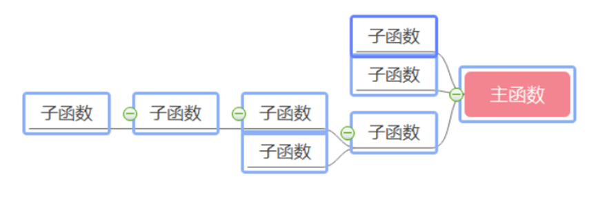

<u>==**面向对象**==</u>

优点：`易维护、易复用、易扩展`，由于面向对象有封装、继承、多态性的特性，可以设计出`低耦合`的系统，使`系统 更加灵活、更加易于维护`

缺点：`性能`比面向过程`低`

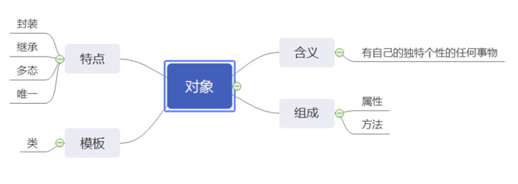

## 面向对象的六大原则

1.`单一职责`原则：`就一个类而言，应该仅有一个引起它发生变化的原因`

如果一个类的职责过多，就等于把这些职责耦合在一起，一个职责的变化可能会削弱这个或者抑制这个类完成其他职责的能力。这种耦合会导致脆弱的设计，当发生变化时，这种高耦合会导致意想不到的变化

 

2.`开放封闭`原则:软件实体(类，模块，函数等等)应该`可以扩展`，`但是不能修改`

面对需求的时候，对程序的改动是通过增加新的代码来完成的，而不是通过对原代码的改变来完成，对于原代码的改变很麻烦，可能会导致意想不到的错误

`开放封闭原则是面向对象设计的核心所在`，遵循这个原则，实现了可维护，可扩展，可复用，灵活性好，开发人员应该进队程序中呈现出频繁变化的那些部分作出抽象，但是也不能可以地对每一个部分进行抽象，拒绝不成熟的抽象一样很重要

个人理解：简单工厂模式并不是属于23中设计模式之一，主要就是因为简单工厂模式不符合开放封闭的原则，在类里面增加switch...case语句，当有新的功能或者是类的时候，就要修改该工厂类，代码的可维护性减低了

 

3.`里氏代换`原则：`子类型必须能够替换掉他们的父类型`

只有当子类可以替换到父类，软件单位的功能不受到影响的时候，父类才能真正被复用，而子类也能够在父类的基础上增加新的行为

如果没有里氏代换原则，我们在开发的时候如果改变了子类的行为，同时对父类产生了影响，这样你要修改子类，也就必须要修改父类了。

 

4.`依赖倒转`原则：也叫依赖倒置原则，其内容如下：

A：高层模块不应该依赖底层模块，`两个都应该抽象`

B：抽象不应该依赖细节，`细节应该依赖抽象`

倒转，假如用户的需求需要改变，软件开发的时候你用的是db2数据库，但是最后要改为mysql数据库，由于高层的模块依赖的是底层的模块，这就使得底层模块也要做修改。但是如果高层模块依赖的是接口或者是抽象类的话，因为接口和抽象类是不变的，所以如果你要更改数据库的话，就不怕出现混乱，A和B两个说的都是这样的意思。因为依赖的是抽象类或者接口，有里氏代换规则可以知道，子类的变化对于父类造不成影响。

针对上面的例子，我们可以做一个抽象的数据库的类，让db2继承这个抽象类，加入现在要换为mysql数据库，只要让mysql去继承这个类就可以，不管用哪个数据库，我们都建立的是抽象数据类的引用，用它去指向你要访问的类就ok了

 

5.`迪米特`法则：如果两个类之间不必发生彼此直接通信，那么这两个类就不应当发生直接的相互引用。如果其中一个类需要调用另一个类的某个方法的话，可以`通过第三者转发这个调用`

对于这个原则，我是这样理解的，两个类之间相互知道了解，就是将一个类直接暴露给了另外一个类，这样子违反了信息的隐藏。如果多个类之间需要两两发生调用的话，那么就需要调用者知道被调用这的全部信息，这是我们可以通过一个中介来转发需要通信的两个类之间的请求，所有的类，只需要将自己暴露给中介就可以了，不需要给被调用者，这样做简化了代码，这也就是设计模式中的中介者模式

这样`降低了类与类之间的耦合性`，符合我们提倡的低耦合的观点，耦合性越弱，越有利于复用，一个处在弱耦合的类被修改，不会对有关系的类造成波及

 

6、`接口隔离`原则

表明客户端不应该被强迫实现一些他们不会使用的接口，应该把接口中方法分组，然后用多个接口代替它，每个接口服务于一个子模块。简单说，就是`使用多个专门的接口比使用单个接口好很多`。

该原则观点如下：
1）一个类对另外一个类的依赖性应当是建立在最小的接口上

2）客户端程序不应该依赖它不需要的接口方法。

## C++中，为什么可以函数重载，实现原理

`c++函数重载的原理:`

编译器在编译.cpp文件中当前使用的作用域里的同名函数时，根据函数形参的类型和顺序会对函数进行重命名（不同的编译器在编译时对函数的重命名标准不一样）但是总的来说，他们都把文件中的同一个函数名进行了重命名；

**在vs编译器中：**

根据返回值类型（不起决定性作用）+形参类型和顺序（起决定性作用）的规则重命名并记录在map文件中。

在**linux g++** **编译器中：**

根据`函数名字的字符数`+`形参类型和顺序`的规则重命名记录在符号表中；从而产生不同的函数名，当外面的函数被调用时，便是根据这个记录的结果去寻找符合要求的函数名,进行调用；

**为什么c语言不能实现函数重载**

**编译器在编译**.c文件时，`只会给函数进行简单的重命名`；具体的方法是给函数名之前加上”_”;所以加入两个函数名相同的函数在编译之后的函数名也照样相同；调用者会因为不知道到底调用那个而出错；


`重载匹配的原则`

> 1. 名字查找
> 2. 确定候选函数
> 3. 寻找最佳匹配

 

## C++11有哪些新特性？

C++11 最常用的新特性如下：

#### 1. `lambda表达式`

#### 2. `auto关键字`

编译器可以根据初始值自动推导出类型。但是不能用于函数传参以及数组类型的推导

#### 3. `nullptr关键字`

nullptr是一种特殊类型的字面值，它可以被转换成任意其它的指针类型；而NULL一般被宏定义为0，在遇到重载时可能会出现问题。

#### 4. `智能指针`

C++11新增了std::shared_ptr、std::weak_ptr等类型的智能指针，用于解决内存管理的问题。

#### 5. `初始化列表`

使用初始化列表来对类进行初始化

#### 6. `右值引用`

基于右值引用可以实现移动语义和完美转发，消除两个对象交互时不必要的对象拷贝，节省运算存储资源，提高效率

#### 7. `atomic原子操作`

用于多线程资源互斥操作

#### 8. 新增STL容器`array`以及`tuple`

#### 9. `const和constexpr`  c++11新特性

- [constexpr和const的区别详解 C++11 (notion.so)](https://www.notion.so/constexpr-const-C-11-b85fe6ba81e2481e879194f32a7be763)

  const存在双重语义, 即只读(变量)和常量的属性, 为了将双重语义区分开, c++11添加了constexpr关键字

  ```cpp
  int add5(const int a) {
    int nums[a]; //报错 a为只读局部变量
    return a + 5;
  }
  int main() {
    const int n = 10;
    int a[10];  //不报错 a为常量
    return 0;
  }
  ```

在 C++ 11 标准中，const 用于为修饰的变量添加“`只读`”属性；**`而 constexpr 关键字则用于指明其后是一个常量（或者常量表达式）`**，编译器在**`编译`**程序时可以顺带将其结果计算出来，而无需等到程序运行阶段，这样的优化`**极大地提高了程序的执行效率**`。

<u>大多数情况是可以混用的, 但是有些时候是不可混用的 例如const/constexpr修饰返回值</u>

  ```cpp
  #include <array>
  #include <iostream>
  using namespace std;
  constexpr int sqr1(int arg) { return arg * arg; }
  const int sqr2(int arg) { return arg * arg; }
  int main() {
    array<int, sqr1(10)> mylist1;  //可以，因为sqr1时constexpr函数
    //报错 表达式必须含有常量值
    array<int, sqr2(10)> mylist1;  //不可以，因为sqr2不是constexpr函数
    return 0;
  }
  ```

## NULL和nullptr的区别

在C语言中，NULL通常被定义为：#define NULL ((void *)0)

C++是强类型语言，void*是不能隐式转换成其他类型的指针的

在C++中，NULL实际上是0. 因为C++中不能把void*类型的指针隐式转换成其他类型的指针，所以为了解决空指针的表示问题，C++引入了nullptr来表示空指针。

为解决NULL代指空指针存在的二义性问题，在C++11版本(2011年发布)中特意引入了nullptr这一新的关键字来代指空指针，从上面的例子中我们可以看到，使用nullptr作为实参，确实选择了正确的以void*作为形参的函数版本


## [void*是怎样的存在？](https://zhuanlan.zhihu.com/p/98061960)

#### **指针类型的含义**

在说明`void*`之前，先了解一下普通指针类型的含义。

```c
//main.c
#include <stdio.h>
int main(void)
{
    int a[] = {0x01020304,2019};
    int *b = a;
    char *c = (char*)&a[0];
    printf("b+1:%d\n",*(b+1));
    printf("c+1:%d\n",*(c+1));
    return 0;
}
```

上面的输出结果为：

```text
b+1:2019
c+1:3
```

一个是指向整型的指针，一个是指向char型的指针，当它们执行算术运算时，`它们的步长就是对应类型占用空间大小`。

即

```text
b + 1 //移动sizeof(int)字节  4
c + 1 //移动sizeof(char)字节 2
```

#### **结论**

各种类型之间没有本质区别，只是解释内存中的数据方式不同。例如，对于int型指针b，解引用时，会解析4字节，算术运算时，也是以该类型占用空间大小为单位，所以b+1，移动4字节，解引用，处理4字节内容，得到2019。对于char型指针c，解引用时，会解析1个字节，算术运算时，也是以sizeof(char)为单位，所以c+1，移动一字节，解引用，处理1字节，得到03。所以像下面这样的操作：

```text
char a[] = {01,02,03,04};
int *b = (int*)(a+2);
```

如果你试图解引用b，即*b，就可能遇到无法预料的问题，因为将会访问非法内存位置。a+2，移动sizeof(char)字节，指向03，此时按照int类型指针解引用，由于int类型解引用会处理4字节内存，但是后面已经没有属于数组a的合法内容了，因此可能出错。

#### **void**

说回void*，前面说了，指针的类型不过是解释数据的方式不同罢了，这样的道理也可用于很多场合的强制类型转换，例如将int类型指针转换为char型指针，并不会改变内存的实际内容，只是修改了解释方式而已。而void * 是一种无类型指针，任何类型指针都可以转为`void*`，它无条件接受各种类型。而既然是无类型指针，那么就**<u>不要尝试</u>**做下面的事情：

- 解引用
- 算术运算

由于不知道其解引用操作的内存大小，以及算术运算操作的大小，因此它的结果是未知的。

```c
#include <stdio.h>
int main(void)
{
    int a = 10;
    int *b = &a;
    void *c = b; 
    *c;    //warning: dereferencing ‘void *’ pointer
    return 0;
}
```

#### **如何使用**

既然如此，那么void* 有什么用呢？实际上我们在很多接口中都会发现它们的参数类型都是void*,例如:

```text
ssize_t read(int fd, void *buf, size_t count);
void *memcpy(void *dest, const void *src, size_t n);
```

为何要如此设计？因为对于这种通用型接口，你不知道用户的数据类型是什么，但是你必须能够处理用户的各种类型数据，因而会使用void* 。void*  能包容地接受各种类型的指针。也就是说，如果你期望接口能够接受任何类型的参数，你可以使用void* 类型。但是在具体使用的时候，你必须转换为具体的指针类型。例如，你传入接口的是int* ，那么你在使用的时候就应该按照int* 使用。

#### **注意**

使用void*需要特别注意的是，你必须清楚原始传入的是什么类型，然后转换成对应类型。例如，你准备使用库函数qsort进行排序：

```text
void qsort(void *base,size_t nmemb,size_t size , int(*compar)(const void *,const void *));
```

它的第三个参数就是比较函数，它接受的参数都是const void*，如果你的比较对象是一个结构体类型，那么你自己在实现compar函数的时候，也必须是转换为该结构体类型使用。举个例子，你要实现学生信息按照成绩比较：

```c
typedef struct student_tag
{
    char name[STU_NAME_LEN];  //学生姓名
    unsigned int id;          //学生学号
    int score;                //学生成绩
}student_t;

int studentCompare(const void *stu1,const void *stu2)
{
　　/*强转成需要比较的数据结构*/
    student_t *value1 = (student_t*)stu1;
    student_t *value2 = (student_t*)stu2;
    return value1->score-value2->score;
}
```

在将其传入`studentCompare`函数后，必须转换为其对应的类型进行处理。

#### **总结**

void* 很强大，但是一定要在合适的时候使用；同时强转很逆天，但是一定要注意前后的类型是否真的能正确转换。通俗地说void*：

- <u>**这里有一片内存数据，我也不知道什么类型，给你了，你自己想怎么用怎么用吧，不过要用对奥！**</u>
- <u>**我这里什么类型都能处理，你给我一片内存数据就可以了**</u>

## [使用初始化列表的好处](https://www.cnblogs.com/wuyepeng/p/9863763.html)

[C++ 初始化列表](https://www.cnblogs.com/graphics/archive/2010/07/04/1770900.html)

1.类成员中存在`常量`，如`const` int a,只能用初始化不能复制

2.类成员中存在`引用`，同样只能使用初始化不能赋值。

3.提高效率

```c++
template < class  T>
class  NamedPtr {
public  :
    NamedPtr( const string& initName, T *initPtr);
    ...
private:
  const string& name;  // 必须通过成员初始化列表
              // 进行初始化
  T * const ptr;  // 必须通过成员初始化列表
          // 进行初始化
};

struct Test1
{
    Test1() // 无参构造函数
    { 
        cout << "Construct Test1" << endl ;
    }

    Test1(const Test1& t1) // 拷贝构造函数
    {
        cout << "Copy constructor for Test1" << endl ;
        this->a = t1.a ;
    }

    Test1& operator = (const Test1& t1) // 赋值运算符
    {
        cout << "assignment for Test1" << endl ;
        this->a = t1.a ;
        return *this;
    }

    int a ;
};

struct Test2
{
    Test1 test1 ;
    Test2(Test1 &t1)
    {
        test1 = t1 ;
    }
    
    //如果是初始化列表 就可以省去计算阶段
     Test2(Test1 &t1)
    {
        test1 = t1 ;
    }
};
```

- **构造函数的两个执行阶段**
  1. `初始化阶段`：所有类类型（class type）的成员都会在初始化阶段初始化，即使该成员没有出现在构造函数的初始化列表中。
  2. `计算阶段`：如果类成员，初始化列表只用调用类的拷贝构造函数，不使用初始化列表则需先调用默认构造函数构造对象，再给对象赋值，赋值的阶段即为计算阶段，`初始化列表可以省去计算阶段`从而优化性能

## 1.8.  auto 和 [decltype](https://www.cnblogs.com/QG-whz/p/4952980.html)区别和联系

auto 让编译器通过初始值来进行类型推演。从而获得定义变量的类型，所以说 `auto 定义的变量必须有初始值`。

当引用被用作初始值的时候，真正参与初始化的其实是引用对象的值。此时编译器以引用对象的类型作为auto的类型。

auto一般会忽略掉顶层const，但底层const会被保留下来，比如当初始值是一个指向常量的指针时：

```c++
const int ci = i, &cr = ci;
auto b = ci; //b是一个整数（ci的顶层const特性被忽略掉了)
auto c = cr; //c是一个整数（Cr是ci的别名，ci本身是一个顶层const)
auto d = &i; //d是一个整型指针（整数的地址就是指向整数的指针）
auto e = &ci; //e是一个指向整形常量的指针（对常量对象取地址是一种底层const)
```

[decltype](https://www.cnblogs.com/QG-whz/p/4952980.html)的作用是`选择并返回操作数的数据类型`。在此过程中，编译器只是分析表达式并得到它的类型，却不进行实际的计算表达式的值。(主要用在泛型编程中结合auto，用于追踪函数的返回值类型)

```c++
template <typename _Tx, typename _Ty>
auto multiply(_Tx x, _Ty y)->decltype(_Tx*_Ty){
    return x*y;
}
```

decltype处理顶层const和引用的方式与auto有些许不同。如果decltype使用的表达式是一个变量，则decltype返回该变量的类型(包括顶层const和引用在内).

如果decltype得到引用则必须初始化。

注意:decltype((variable))（注意是双层括号)的结果永远是引用，而decltype(variable)结果只有当 variable本身就是一个引用时才是引用。

> 使用：顶堆的自定义排序  [顶堆 | qianxunslimgのblog](https://qianxunslimg.github.io/2022/04/20/ding-dui/)
>
> ```c++
> auto cmp = [](const pair<int, int> a, const pair<int, int> b)->bool{
>   	return a.first + a.second > b.first + b.second;
> };
> priority_queue<pair<int, int>, vector<pair<int, int>>, decltype(cmp)> que(cmp);
> ```

- `auto` 用于变量的类型推断，可以根据变量的初始化表达式自动推导出变量的类型。例如：

  ```cpp
  auto x = 10; // x 的类型推断为 int
  auto y = 3.14; // y 的类型推断为 double
  ```

- `decltype` 用于查询表达式的类型，可以获取表达式的静态类型。它不进行类型推断，而是直接返回表达式的类型。例如：

  ```cpp
  int x = 10;
  decltype(x) y = 20; // y 的类型为 int，和 x 的类型一致
  ```

## 1.9.  [C++11右值引用](https://zhuanlan.zhihu.com/p/85668787)

右值引用是C++11中引入的新特性 , 它实现了转移语义和精确传递。它的主要目的有两个方面：

1. 消除两个对象交互时不必要的对象拷贝，节省运算存储资源，提高效率。

2. 能够更简洁明确地定义泛型函数。

 

#### 左值和右值的概念：

左值：`能对表达式取地址`、或具名对象/变量。一般指表达式结束后依然存在的`持久对象`。

右值：不能对表达式取地址，或匿名对象。一般指表达式结束就不再存在的`临时对象`。

C++11中，右值引用就是对一个右值进行引用的类型。由于右值通常不具有名字，所以我们一般只能通过右值表达式获得其引用，比如：

T && a=ReturnRvale();

假设ReturnRvalue()函数返回一个右值，那么上述语句声明了一个名为a的右值引用，其值等于ReturnRvalue函数返回的临时变量的值。

 

可以使用move将对左值进行右值引用

 int k = 4;

  int&& s = move(k);

此时s和k地址一样。

### 1.9.1. 移动构造

基于右值引用可以实现转移语义和完美转发新特性。

移动语义：

- 对于一个包含指针成员变量的类，由于编译器默认的拷贝构造函数都是浅拷贝，所有我们一般需要通过实现深拷贝的拷贝构造函数，为指针成员分配新的内存并进行内容拷贝，从而避免悬挂指针的问题。

- 但是如下列代码所示：

```c++
#include <iostream>

class MyClass {
public:
    MyClass() {
        std::cout << "Default Constructor" << std::endl;
        data_ = new int[100];  // 分配资源
    }

    MyClass(const MyClass& other) {
        std::cout << "Copy Constructor" << std::endl;
        data_ = new int[100];
        std::copy(other.data_, other.data_ + 100, data_);  // 拷贝资源
    }

    MyClass(MyClass&& other) noexcept {
        std::cout << "Move Constructor" << std::endl;
        data_ = other.data_;  // 窃取资源
        other.data_ = nullptr;  // 将被移动对象的资源置为空指针，避免重复释放
    }

    MyClass& operator=(const MyClass& other) {
        std::cout << "Copy Assignment Operator" << std::endl;
        if (this != &other) {
            delete[] data_;  // 释放原有资源
            data_ = new int[100];
            std::copy(other.data_, other.data_ + 100, data_);  // 拷贝资源
        }
        return *this;
    }

    MyClass& operator=(MyClass&& other) noexcept {
        std::cout << "Move Assignment Operator" << std::endl;
        if (this != &other) {
            delete[] data_;  // 释放原有资源
            data_ = other.data_;  // 窃取资源
            other.data_ = nullptr;  // 将被移动对象的资源置为空指针，避免重复释放
        }
        return *this;
    }

    ~MyClass() {
        std::cout << "Destructor" << std::endl;
        delete[] data_;  // 析构函数释放资源
    }

private:
    int* data_;
};

int main() {
    MyClass obj1;
    MyClass obj2(obj1);  // 使用拷贝构造函数，执行资源拷贝
    MyClass obj3(std::move(obj1));  // 使用移动构造函数，执行资源转移
    MyClass a = obj2;  // 调用拷贝构造函数
    MyClass b = std::move(obj3);  // 调用移动构造函数

    return 0;
}
```

移动构造和移动赋值是 C++11 引入的特性，用于实现对象的高效移动语义。通过移动构造和移动赋值，可以在避免不必要的对象拷贝的同时，实现对资源的高效转移。

### 1.9.2. [完美转发](https://blog.csdn.net/xiangbaohui/article/details/103673177)

完美转发（perfect forwarding）是指在函数模板中将参数以原始的方式（包括引用类型和常量性）转发给其他函数，实现参数的精确传递，既能保持参数类型的准确性，又能避免不必要的拷贝或移动操作。

完美转发常用于以下情况：

1. 实现通用的转发函数：当我们编写一个接收可变数量和类型参数的转发函数时，我们希望能够将参数原样传递给其他函数，而不用关心参数的具体类型。完美转发可以帮助我们实现这个功能。

下面是一个简单的示例，演示了如何使用完美转发来编写一个通用的转发函数：

```cpp
#include <iostream>
#include <utility>

// 转发函数，将参数原样传递给其他函数
template<typename Func, typename... Args>
decltype(auto) forward_func(Func&& func, Args&&... args) {//c++11写法  c++14+可以直接auto
    return std::forward<Func>(func)(std::forward<Args>(args)...);
}

// 示例函数，用于演示转发函数的使用
void foo(int& x) {
    std::cout << "Lvalue reference: " << x << std::endl;
}

void foo(int&& x) {
    std::cout << "Rvalue reference: " << x << std::endl;
}

int main() {
    int x = 42;

    // 使用转发函数将参数传递给 foo 函数
    forward_func(foo, x);            // 传递 lvalue
    forward_func(foo, std::move(x)); // 传递 rvalue

    return 0;
}
```

输出结果为：

```yaml
Lvalue reference: 42
Rvalue reference: 42
```

在这个示例中，`forward_func` 是一个模板函数，接收可变数量和类型的参数。它使用了完美转发来将参数原样传递给其他函数。我们调用 `forward_func(foo, x)` 时，参数 `x` 是一个左值，因此调用了 `foo(int& x)` 函数。而在调用 `forward_func(foo, std::move(x))` 时，参数 `std::move(x)` 是一个右值，因此调用了 `foo(int&& x)` 函数。

2. 包装其他函数的参数：完美转发可以用于包装其他函数的参数，将其转发给另一个函数，从而实现参数的传递和操作的透明性。

以下是一个示例，展示了如何使用完美转发包装一个函数的参数，并将其传递给另一个函数：

```cpp
#include <iostream>
#include <utility>

// 原始函数，用于处理参数
void process_data(int& x) {
    std::cout << "Lvalue reference: " << x << std::endl;
}

void process_data(int&& x) {
    std::cout << "Rvalue reference: " << x << std::endl;
}

// 包装函数，使用完美转发将参数传递给原始函数
template<typename... Args>
void wrapper_func(Args&&... args) {
    process_data(std::forward<Args>(args)...);
}

int main() {
    int x = 42;

    // 使用包装函数将参数传递给原始函数
    wrapper_func(x);            // 传递 lvalue
    wrapper_func(std::move(x)); // 传递 rvalue

    return 0;
}
```

输出结果为：

```yaml
Lvalue reference: 42
Rvalue reference: 42
```

在这个示例中，`wrapper_func` 函数使用完美转发将参数传递给 `process_data` 函数，实现了参数的传递和操作的透明性。无论参数是左值还是右值，都可以通过 `wrapper_func` 函数将其正确地传递给 `process_data` 函数。

这些示例展示了完美转发的应用场景和用法。通过完美转发，我们可以实现通用的转发函数和包装函数的参数，保持参数的类型准确性，并避免不必要的拷贝或移动操作。


## push_back()和emplace_back()区别

如果传入类，push_back()先构造对象，再将对象放到末尾（如果是右值就进行移动构造），emplace_back()直接在末尾构造。

`push_back()` 和 `emplace_back()` 都是用于向容器（如 `std::vector`）的尾部添加元素的函数。它们的区别在于添加元素的方式和参数传递的方式。

1. `push_back()` 函数：
   - `push_back()` 函数接受一个参数，该参数是要添加到容器的元素的副本。
   - 当调用 `push_back()` 时，会创建一个元素的副本，并将副本添加到容器的尾部。
   - 这意味着会进行元素的拷贝构造操作，适用于传统的拷贝语义。
2. `emplace_back()` 函数：
   - `emplace_back()` 函数接受可变数量的参数，这些参数将用于在容器的尾部构造一个新的元素。
   - 当调用 `emplace_back()` 时，不会创建元素的副本，而是直接在容器的内存空间上构造新的元素。
   - 这意味着会进行元素的原地构造操作，适用于移动语义或者完美转发。

总结区别：

- `push_back()` 添加的是元素的副本，需要进行拷贝构造操作。
- `emplace_back()` 在容器的尾部直接构造新的元素，避免了额外的拷贝构造操作。

为了更好地理解它们的实现，我们可以看一下它们的简化版本：

```cpp
template<typename T>
void push_back(const T& value) {
    // 创建元素的副本并添加到容器尾部
    T copy = value;  // 拷贝构造元素的副本
    // 将副本添加到容器尾部
    // ...
}

template<typename... Args>
void emplace_back(Args&&... args) {
    // 在容器尾部原地构造新的元素
    // ...
}
```

这里的代码只是为了说明它们的大致实现方式，并非完整实现。`push_back()` 会创建元素的副本，而 `emplace_back()` 则直接在容器的尾部构造新的元素。

需要注意的是，`emplace_back()` 使用了可变数量的参数和完美转发技术，以便将参数传递给元素的构造函数。

这就是 `push_back()` 和 `emplace_back()` 的区别和实现方式。根据具体的情况，选择适合的函数可以提高代码的效率和性能。

## 1.11. C++11 Lambda表达式

Lambda表达式定义一个匿名函数，并且可以捕获一定范围内的变量，其定义如下：

[capture] (params)mutable->return-type{statement}

其中，

- [capture]：捕获列表，捕获上下变量以供lambda使用。编译器根据符号[]判断接下来代码是否是lambda函数。

- (Params)：参数列表，与普通函数的参数列表一致，如果不需要传递参数，则可以连通括号一起省略。
- mutable是修饰符，默认情况下lambda函数总是一个const函数，Mutable可以取消其常量性。在使用该修饰符时，参数列表不可省略。
- ->return-type:返回类型是返回值类型
- {statement}:函数体，内容与普通函数一样，除了可以使用参数之外，还可以使用所捕获的变量。

Lambda表达式与普通函数最大的区别就是其可以通过捕获列表访问一些上下文中的数据。其形式如下:

> - [ ] [var]表示值传递方式捕捉变量var
>
> - [ ] [=]表示值传递方式捕捉所有父作用域的变量（包括this)
> - [ ] [&var]表示引用传递捕捉变量var
> - [ ] [&]表示引用传递捕捉所有父作用域的变量（包括this）
> - [ ] [this]表示值传递方式捕捉当前的this指针

Lambda的类型被定义为“闭包”的类，其通常用于STL库中，在某些场景下可用于`简化仿函数`的使用，同时`Lambda作为局部函数，也会提高复杂代码的开发加速，轻松在函数内重用代码，无须费心设计接口`。

## 1.12. [头文件循环引用](https://blog.csdn.net/qq_22488067/article/details/73195621)

```c++
A.h
#include "B.h"
class A{
public:
　　B* m_b;
}

B.h
#include "A.h"
class B{
public:
　　A* m_a;
}
```

上面这样是编译不过的，把A.h中的

\#include "B.h"

去掉，改为

class B;

1. 两个类不能互相include对方的头文件，两者也不能都是实体对象，必须其中一个为指针。 因为两个类相互引用，不管哪个类在前面，都会出现有一个类未定义的情况，所以可以`提前声明一个类`，而类的声明就是提前告诉编译器，所要引用的是个类，但此时后面的那个类还没有定义，因此无法给对象分配确定的内存空间，因此`只能使用类指针`。如果非得互相引用实体，那应该是错误的设计。 
2. 用指针的原因是：假设两个类分别为A和B，在B中用指针调用A，那么在A需要知道B占空间大小的时候，就会去找到B的定义文件，虽然B的定义文件中并没有导入A的头文件，不知道A的占空间大小，但是由于在B中调用A的时候用的指针形式，B只知道指针占4个字节就可以，不需要知道A真正占空间大小，也就是说，A也是知道B的占空间大小的。 

# 2.   重载、模板

## 2.1.  运算符重载

### 2.1.1. 算术运算符

```c++
complex complex::operator+(const complex &A) const{
	complex B;
	B.m_real = this->m_real + A.m_real;
	B.m_imag = this->m_imag + A.m_imag;
	return B;
}
//以全局函数的形式重载
Complex operator+(const Complex &c1, const Complex &c2){
	Complex c;
	c.m_real = c1.m_real + c2.m_real;
	c.m_imag = c1.m_imag + c2.m_imag;
	return c;
}
```

### 2.1.2. []

```c++
int& Array::operator[](int i){
	return m_p[i];
}
```

### 2.1.3. <<,>>

```c++
istream & operator>>(istream &in, complex &A){
	in >> A.m_real >> A.m_imag;
  return in;
}

ostream & operator<<(ostream &out, complex &A){
	out << A.m_real <<" + "<< A.m_imag <<" i ";
	return out;
}
```

### 2.1.4. ++i和i++的实现

1. ++i 实现：

```c++
int& int::operator++ (){
	*this +=1；
	return *this；
}
```

2. i++ 实现：

````c++
const int  int::operator++ (int){
	int oldValue = *this；
	++（*this）；
	return oldValue；
}
````

### 2.1.5. 函数调用运算符()

```c++
class Complex {
  double real, imag;

public:
  Complex(double r = 0, double i = 0) : real(r), imag(i){};
  operator double() { return real; } //重载强制类型转换运算符 double
};

int main() {
  Complex c(1.2, 3.4);
  cout << (double)c << endl; //输出 1.2  !!!!!!!!!!
  double n = 2 + c;          //等价于 double n = 2 + c. operator double()
  cout << n;                 //输出 3.2
}
```

举个简单的例子，下面这个名为absInt的struct含有一个调用运算符，该运算符负责返回其参数的绝对值：

```c++
struct absInt {
  int operator()(int val) const{
    return val<0?-val:val;
  }
};

int main(){
  int i = -42;
	absInt absObj;			//含有函数调用运算符的对象
	int ui = absObj(i); //将i传递给absObj.operator(); 
}

```

### 2.1.6. 成员访问运算符* ->

```c++
class ObjContainer {
  vector<Obj *> a;

public:
  void add(Obj *obj) {
    a.push_back(obj); // 调用向量的标准方法
  }
  friend class SmartPointer;
};

class SmartPointer {
  ObjContainer oc;
  Obj *operator->() const {
    if (!oc.a[index]) {
      cout << "Zero value";
      return (Obj *)0;
    }
    return oc.a[index];
  }
};
```

A* ca;  	调用ca->相当于调用ca->oc.a[index]->;

## 2.2.  类模板

C++ 中类模板的写法如下：

```c++
template <类型参数表>
class 类模板名{
   成员函数和成员变量
};
```

## 2.3.  C++11中的可变参数模板

C++11的可变参数模板，`对参数进行了高度泛化`，可以表示任意数目、任意类型的参数，其语法为：在class或typename后面带上`省略号`”。

例如：

```c++
Template<class ... T>
void func(T ... args){
	cout<<”num is”<<sizeof ...(args)<<endl;
}
```

func();//args不含任何参数

func(1);//args包含一个int类型的实参

func(1,2.0);//args包含一个int一个double类型的实参

其中T叫做模板参数包，args叫做函数参数包

省略号作用如下：

1）声明一个包含0到任意个模板参数的参数包

2）在模板定义得右边，可以将参数包展成一个个独立的参数

C++11可以使用递归函数的方式展开参数包，获得可变参数的每个值。通过递归函数展开参数包，需要提供一个参数包展开的函数和一个递归终止函数。例如：

```c++
#include<iostream>
using namespace std;
// 最终递归函数
void print(){
  cout << "empty" << endl;
}

// 展开函数
template <class T, class ...Args>
void print(T head, Args... args){
  cout << "parameter " << head << endl;
  print(args...);
}

int main(){
  print(1, 2, 3, 4); return 0;
}
```

参数包Args ...在展开的过程中递归调用自己，没调用一次参数包中的参数就会少一个，直到所有参数都展开为止。当没有参数时就会调用非模板函数printf终止递归过程

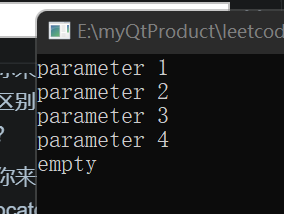

## 模板可以在cpp文件中实现吗？

> 一般是不可以的 因为会产生编译和链接问题 编译问题比较好解决 就是在实现前也声明是模板
>
> > 1. 模板定义很特殊。由template<…>处理的任何东西都意味着编译器`在当时不为它分配存储空间`，它一直处于等待状态直到被一个模板实例告知。在编译器和连接器的某一处，有一机制能去掉指定模板的多重定义。
> >
> >    所以为了容易使用，几乎总是在头文件中放置全部的模板声明和定义。
> >
> > 2. 在分离式编译的环境下，编译器编译某一个.cpp文件时并不知道另一个.cpp文件的存在，也不会去查找（当遇到未决符号时它会寄希望于连接器）。这种模式在没有模板的情况下运行良好，但遇到模板时就傻眼了，因为模板仅在需要的时候才会实例化出来。
> >
> >    所以，当编译器只看到模板的声明时，它不能实例化该模板，只能创建一个具有外部连接的符号并期待连接器能够将符号的地址决议出来。
> >
> >    然而当实现该模板的.cpp文件中没有用到模板的实例时，编译器懒得去实例化，所以，整个工程的.obj中就找不到一行模板实例的二进制代码，于是连接器也黔驴技穷了。
>
> 链接问题解决起来有如下三种方法:
>
> 1. 在声明中声明一个实例化对象 然后cpp中也实现临时的他
> 2. 在使用的时候 不止包含.h 也包含cpp
> 3. 在.h中包含.cpp 然后项目中移除.cpp （注意不是删除）

### 模板类在.h中定义，在.cpp中实现

c++中常见的过程是将类**定义**放在一个c++头文件中，将**实现**放在一个c++源文件中。然后，源文件成为项目的一部分，这意味着它是单独编译的。但是当我们为模板类实现这个过程时，会出现一些编译和链接问题。

本文通过示例介绍了三种可能的解决方案：

1、您可以在实现模板类的同一个源文件中创建模板类的对象；

2、可以在main.cpp中包含实现模板类的源文件；

3、您可以在定义模板类(TestTemp.h)的头文件中包含实现模板类(TestTemp.cpp)的源文件，**并从项目(而不是文件夹)中删除 实现模板类的源文件**。

> c++中常见的过程是将类定义放在一个c++头文件中，将实现放在一个c++源文件中。然后，源文件成为项目的一部分，这意味着它是单独编译的。但是当我们为模板类实现这个过程时，会出现一些**编译**和**链接**问题。

#### 编译问题

```c++
// TestTemp.h 
#ifndef _TESTTEMP_H_
#define _TESTTEMP_H_
  
template<class T>
class TestTemp {
public:
    TestTemp();
    void SetValue( T obj_i );
    T Getalue();
 
private:
 
    T m_Obj;
};
#endif

// TestTemp.cpp
#include "TestTemp.h"

TestTemp::TestTemp(){}

void TestTemp::SetValue( T obj_i ){}

T TestTemp::Getalue(){
    return m_Obj;
}
```

如果你尝试像上面所示的一般实现模板类，它会产生一组编译错误，如:

```text
: error C2955: 'TestTemp' : use of  class template requires template argument list
: error C2065: 'T' : undeclared identifier
```

在这种情况下，编译器不知道对象类型。所以它不能编译。

所以，我们在实现模板类的成员函数时，应添加< T>：

```c++
+// TestTemp.h
#ifndef _TESTTEMP_H_
#define _TESTTEMP_H_
 
template<class T>
class TestTemp  {
public: 
    TestTemp();
    void SetValue( T obj_i );
    T Getalue();
 
private:
    T m_Obj;
};
#endif

// TestTemp.cpp
#include "TestTemp.h"
 
template <class T>
TestTemp<T>::TestTemp(){}

template <class T>
void TestTemp<T>::SetValue( T obj_i ){}

template <class T>
T TestTemp<T>::Getalue(){
    return m_Obj;
}
```

#### 链接问题

使用上述代码，在解决了所有编译错误之后，当您在TestTemp.cpp之外的任何文件中创建该类的对象时，可能会得到一些链接错误。下面是一些示例代码:

```cpp
// main.cpp
#include "TestTemp.h"
    ...
    TestTemp<int> TempObj;
    ...
```

链接错误：

```text
: error LNK2001: unresolved external symbol "public: __thiscall
TestTemp<int>::TestTemp<int>(void)"
(??0?$TestTemp@H@@QAE@XZ)
```

#### 原因

当编译器遇到某个特定类型的TestTemp对象声明时，例如int，它必须能够访问模板实现源。否则，它将不知道如何构造TestTemp成员函数。而且，如果将实现放在源文件(TestTemp.cpp)中，并将其作为项目的单独部分，则编译器在尝试编译mian.cpp源文件时将无法找到它（即，此时仅仅#include"TestTemp.h" 是不够的，这只告诉编译器如何分配对象数据和如何构建对成员函数的调用，**而不是如何构建成员函数**。同时，**编译器不会抱怨，**它将假定这些函数在其他地方提供，并让链接器来查找它们）。

因此，当需要**链接时**，您将获得对任何未在类定义中 定义为内联的类成员函数 的"unresolved references"。

### 解决

#### 方法1

您可以在实现模板类的源文件中创建模板类的对象(TestTemp.cpp)。因此，不需要将对象创建代码与其在其他文件中的实际实现链接起来。这将导致编译器编译这些特定类型，以便关联的类成员函数在链接时可用。下面是示例代码:

*模板类头文件*

```cpp
// TestTemp.h
#ifndef _TESTTEMP_H_
#define _TESTTEMP_H_
template<class T>
class TestTemp  
{
public:
    TestTemp();
    void SetValue( T obj_i );
    T Getalue();
 
private:
    T m_Obj;
};
#endif
```

*模板类源文件*

```cpp
// TestTemp.cpp
#include "TestTemp.h"
 
template <class T>
TestTemp<T>::TestTemp(){}
 
template <class T>
void TestTemp<T>::SetValue( T obj_i ){}
 
template <class T>
T TestTemp<T>::Getalue(){
    return m_Obj;
}

//⭐⭐⭐⭐
// No need to call this TemporaryFunction() function,
// it's just to avoid link error.
void TemporaryFunction (){
    TestTemp<int> TempObj;
}

/*或者：可以按照下面的方式写：
参考：http://warp.povusers.org/programming/template_declarations.html
中的“Practical usage example 2: "Manual" export templates”这一小节
*/
template class TestTemp<int>;
```

> “*TestTemp.cpp*”中的临时函数将解决链接错误。不需要调用这个函数，因为它是全局的。

#### 方法2

可以在mian.cpp源文件中包含实现模板类的源文件。下面是示例代码:

*模板类头文件*

```cpp
// TestTemp.h
#ifndef _TESTTEMP_H_
#define _TESTTEMP_H_
 
template<class T>
class TestTemp  
{
public:
    TestTemp();
    void SetValue( T obj_i );
    T Getalue();
private:
    T m_Obj;
};
#endif
```

*模板类源文件*

```cpp
// TestTemp.cpp
#include "TestTemp.h"

template <class T>
TestTemp<T>::TestTemp()
{
}
 
template <class T>
void TestTemp<T>::SetValue( T obj_i )
{
}
 
template <class T>
T TestTemp<T>::Getalue()
{
   return m_Obj;
}
```

*main.cpp源文件*

```cpp
// main.cpp
#include "TestTemp.h"
#include "TestTemp.cpp" //⭐ 
              ...
        TestTemp<int> TempObj;
        TempObj.SetValue( 2 );
        int nValue = TempObj.Getalue();
              ...
```

#### 方法3

您可以在定义模板类(TestTemp.h)的头文件中 <u>#include实现模板类(TestTemp.cpp)的源文件</u>，并`从项目`(而不是文件夹)中`删除源文件`。下面是示例代码:

*模板类头文件*

```cpp
// TestTemp.h
#ifndef _TESTTEMP_H_
#define _TESTTEMP_H_
template<class T>
class TestTemp  
{
public:
    TestTemp();
    void SetValue( T obj_i );
    T Getalue();
private:
    T m_Obj;
};
#include "TestTemp.cpp" //⭐

#endif
```

*模板类源文件*

```cpp
// TestTemp.cpp
#include "TestTemp.h"

template <class T>
TestTemp<T>::TestTemp(){}

template <class T>
void TestTemp<T>::SetValue( T obj_i ){}
 
template <class T>
T TestTemp<T>::Getalue(){
    return m_Obj;
}
```

*main.cpp源文件*

```cpp
// main.cpp
#include "TestTemp.h" 
               ...
    TestTemp<int> TempObj;
    TempObj.SetValue( 2 );
    int nValue = TempObj.Getalue();
               ...
```

注意：

不要忘记从项目中删除 实现模板类的那个源文件（在本文中，就是要remove掉：“TestTemp.cpp”）

> 好处当然是分离了声明和定义，可以避免对头文件的频繁改动，加快编译的速度。
>
> 缺陷是一旦将二者分离，以后新增模板的一个实例化类型，都得跑到对应的CPP文件中添加新的显式实例化。一旦有新人来了不知道这个潜规则，有可能会在这里卡很久。
>
> 那么什么时候要分离，什么时候不分离呢？
>
> 权衡一下，当这个模板会被很多CPP文件include的时候，比如当它是事件分发系统的一个`AddListener<T>()`方法的时候，那么使用分离可以避免上面说的头文件改动导致的大量重编译。
>
> 反过来说，如果这个模板的使用群体很小众，只有你自己的模块在用，甚至只有一到两个CPP文件include到它，亦或者可以保证这个头文件的改动频率非常地低，那么用传统的不分离方案就行了，省时省力并且代码还易读易维护。


# 3.   类

## 3.1.  空类占多大内存，为什么

`1字节`，

`类中static数据不占空间。`

`虚函数表占4字节，函数不占内存`。

编译器往往会给一个`空类隐含的加一个字节（char）`，这样空类在实例化后在内存得到了`独一无二的地址`。

## 3.2.  this指针

### 理解

1. 定义

- 在 C++ 中，每一个对象都能通过 this 指针来访问自己的地址。`this 指针是所有成员函数的隐含参数`。因此，在成员函数内部，`它可以用来指向调用对象`。

  > 这样理解 类的成员函数也是保存在代码段的 成员函数就是通过this指针作为隐含的形参和类联系起来

2. `this只能在成员函数中使用`  全局函数 类的静态成员函数都不行

   成员函数默认第一个参数为T* const register this。

   `（友元函数，全局函数不是成员函数）`

3. this指针`不能再静态函数`中使用

- 静态函数如同静态变量一样，他不属于具体的哪一个对象，`静态函数表示了整个类范围意义上的信息`，而`this指针却实实在在的对应一个对象`，所以this指针不能被静态函数使用。

4. `this指针的创建`

- this指针在成员函数的开始执行前构造的，在成员的执行结束后清除。

5. this指针只有在`成员函数`中才有定义

- 创建一个对象后，不能通过对象使用this指针。也无法知道一个对象的this指针的位置（只有在成员函数里才有this指针的位置）。当然，在成员函数里，你是可以知道this指针的位置的（可以`&this`获得)，也可以直接使用的。
- this 实际上是成员函数的一个形参，在调用成员函数时将对象的地址作为实参传递给 this。不过 this 这个形参是隐式的，它并不出现在代码中，而是在编译阶段由编译器默默地将它添加到参数列表中。
-  this 作为隐式形参，`本质上是成员函数的局部变量`，所以只能用在成员函数的内部，并且只有在通过对象调用成员函数时才给 this 赋值。

**类的this指针有以下特点**

(1）**this**只能在成员函数中使用，全局函数、静态函数都不能使用this。实际上，**传入参数为当前对象地址，成员函数第一个参数为**为**T \* const this**

如：

```text
class A{public:	int func(int p){}};
```

其中，**func**的原型在编译器看来应该是：

**int func(A \* const this,int p);**

（2）由此可见，**this**在成员函数的开始前构造，在成员函数的结束后清除。这个生命周期同任何一个函数的参数是一样的，没有任何区别。当调用一个类的成员函数时，编译器将类的指针作为函数的this参数传递进去。如：

```text
A a;a.func(10);//此处，编译器将会编译成：A::func(&a,10);
```

看起来和静态函数没差别，对吗？不过，区别还是有的。`编译器通常会对this指针做一些优化`，因此，this指针的传递效率比较高，例如VC通常是通过ecx（计数寄存器）传递this参数的。


### 几个this指的易混问题

#### [#](https://interviewguide.cn/notes/03-hunting_job/02-interview/01-02-01-内存管理.html#a-this指针是什么时候创建的)A. this指针是什么时候创建的？

this在成员函数的开始执行前构造，在成员的执行结束后清除。

但是如果class或者struct里面没有方法的话，它们是没有构造函数的，只能当做C的struct使用。采用TYPE xx的方式定义的话，在栈里分配内存，这时候this指针的值就是这块内存的地址。采用new的方式创建对象的话，在堆里分配内存，new操作符通过eax（累加寄存器）返回分配的地址，然后设置给指针变量。之后去调用构造函数（如果有构造函数的话），这时将这个内存块的地址传给ecx，之后构造函数里面怎么处理请看上面的回答

#### [#](https://interviewguide.cn/notes/03-hunting_job/02-interview/01-02-01-内存管理.html#b-this指针存放在何处-堆、栈、全局变量-还是其他)B. this指针存放在何处？堆、栈、全局变量，还是其他？

this指针会`因编译器不同而有不同`的放置位置。可能是`栈`，也可能是`寄存器`，甚至全局变量。在汇编级别里面，一个值只会以3种形式出现：立即数、寄存器值和内存变量值。不是存放在寄存器就是存放在内存中，它们并不是和高级语言变量对应的。

#### [#](https://interviewguide.cn/notes/03-hunting_job/02-interview/01-02-01-内存管理.html#c-this指针是如何传递类中的函数的-绑定-还是在函数参数的首参数就是this指针-那么-this指针又是如何找到-类实例后函数的)C. this指针是如何传递类中的函数的？绑定？还是在函数参数的首参数就是this指针？那么，this指针又是如何找到“类实例后函数的”？

大多数编译器通过ecx（寄数寄存器）寄存器传递this指针。事实上，这也是一个潜规则。一般来说，不同编译器都会遵从一致的传参规则，否则不同编译器产生的obj就无法匹配了。

在call之前，编译器会把对应的对象地址放到eax中。this是通过函数参数的首参来传递的。this指针在调用之前生成，至于“类实例后函数”，没有这个说法。类在实例化时，只分配类中的变量空间，并没有为函数分配空间。自从类的函数定义完成后，它就在那儿，不会跑的

#### [#](https://interviewguide.cn/notes/03-hunting_job/02-interview/01-02-01-内存管理.html#d-this指针是如何访问类中的变量的)D. this指针是如何访问类中的变量的？

如果不是类，而是结构体的话，那么，如何通过结构指针来访问结构中的变量呢？如果你明白这一点的话，就很容易理解这个问题了。

在C++中，类和结构是只有一个区别的：类的成员默认是private，而结构是public。

this是类的指针，如果换成结构体，那this就是结构的指针了。

#### [#](https://interviewguide.cn/notes/03-hunting_job/02-interview/01-02-01-内存管理.html#e-我们只有获得一个对象后-才能通过对象使用this指针。如果我们知道一个对象this指针的位置-可以直接使用吗)E.我们只有获得一个对象后，才能通过对象使用this指针。如果我们知道一个对象this指针的位置，可以直接使用吗？

**this指针只有在成员函数中才有定义。**因此，你获得一个对象后，也不能通过对象使用this指针。所以，我们无法知道一个对象的this指针的位置（只有在成员函数里才有this指针的位置）。当然，<u>在成员函数里，你是可以知道this指针的位置的（可以通过&this获得）</u>，也可以直接使用它。

> this指针的首地址不就是类的地址吗, 在成员函数外是不可以使用的

#### F.每个类编译后，是否创建一个类中函数表保存函数指针，以便用来调用函数？

普通的类函数（不论是成员函数，还是静态函数）都不会创建一个函数表来保存函数指针。只有虚函数才会被放到函数表中。但是，即使是虚函数，如果编译期就能明确知道调用的是哪个函数，编译器就不会通过函数表中的指针来间接调用，而是会直接调用该函数。正是由于this指针的存在，用来指向不同的对象，从而确保不同对象之间调用相同的函数可以互不干扰。

> 肯定不能 只有虚函数表才需要保存一个虚函数表 普通的函数只需要用类的对象调用, 将this指针也就是对象的首地址传入即可

## 3.3.  C++中类成员的访问权限

1. public修饰的成员变量
   
- 能被类成员函数、子类函数、友元访问，也能被类的对象访问，`不需要通过成员函数就可以由类的实例直接访问`
  
2. private修饰的成员变量
   
-  只能被类成员函数及友元访问，不能被其他任何访问，本身的类对象也不行，`类的实例要通过成员函数才可以访问`，这个可以起到`信息隐藏`
   
3. protected是受保护变量
   
   - `只能被类成员函数、子类函数及友元访问，不能被其他任何访问，本身的类对象也不行`，也就是说，`基类中有protected成员，子类继承于基类，那么也可以访问基类的protected成员，要是基类是private成员，则对于子类也是隐藏的，不可访问`
   
     > 可以理解为可以继承的private?

## 3.4.  C++中struct和class的区别

在C++中，可以用struct和class定义类，都可以继承。区别在于：

1. `默认的继承访问权`。class默认的是private,strcut默认的是public。
2. `默认访问权限`：struct作为数据结构的实现体，它默认的数据访问控制是public的，而class作为对象的实现体，它默认的成员变量访问控制是private的。
3. “class”这个关键字还用于`定义模板参数`，就像“typename”。但关建字“struct”不用于定义模板参数
4. class和struct在使用大括号`{ }`上的区别
   - **关于使用大括号初始化**
     1. class和struct如果定义了构造函数的话，都不能用大括号进行初始化
     2. 如果没有定义构造函数，struct可以用大括号初始化。
     3. 如果没有定义构造函数，且所有成员变量全是public的话，class可以用大括号初始化

## 3.5.  C++类内可以定义引用数据成员吗？

`可以，必须通过成员函数初始化列表初始化。` （必须使用初始化列表的情况：const 和引用, 初始化列表还有一个好处是省去计算阶段）

````c++
class A{
public:
  A(int &b):a(b){}
  int &a;
};

int main(){
  int b = 10;
  A a(b);
  cout << a.a <<endl;
  return 0;
}
````

## 3.6.  一个空类都有什么默认函数

三个构造，一个赋值2个寻址

1. 无参的构造函数

```c
Empty(){}
```

2. 拷贝构造函数

```c++
Empty(const Empty& copy){}
```

3. 赋值运算符

```c++
Empty& operator = (const Empty& copy){}
```

4. 析构函数（非虚）

```c++
~Empty(){}
```

5. 寻址函数

```c++
Empty* operator&(){}//取址运算符
```

6. const取址函数

```c++
const Empty* operator&() const {}//const 取址运算符
```


## 3.7.  Struct 和union的区别

1. **结构体struct**

- 各成员`各自拥有自己的内存`，各自使用互不干涉，同时存在的，`遵循内存对齐原则。一个struct变量的总长度等于所有成员的长度之和。`

2. **联合体union**

- 各成员`共用一块内存空间`，并且同时只有一个成员可以得到这块内存的使用权(对该内存的读写)，各变量共用一个内存首地址。因而，`联合体比结构体更节约内存`。一个union变量的总长度至少能容纳最大的成员变量，而且要满足是所有成员变量类型大小的整数倍。`不允许对联合体变量名U2直接赋值或其他操作`。

## 3.8.  [C++如何阻止一个类被实例化](https://www.cnblogs.com/Stephen-Qin/p/11514588.html)

1. 定义一个无用的抽象函数，使得类成为`抽象类`。
2. 将构造函数定义为private.
3. 使用 构造函数=delete

## [3.9 说一说你理解的内存对齐以及原因](https://zhuanlan.zhihu.com/p/30007037)

### 为什么要进行内存对齐

> `因为大多数处理器有内存存取粒度的限制，比如说32位系统是4字节的存取粒度，只能从地址为4的倍数的内存开始读取数据，所以需要内存对齐，数据在内存的存放没有规则的话，会给数据的读取增添很大的工作量，所以需要按照对齐规则存放数据，进行内存对齐`
>
> <u>==需要考虑成员变量定义的先后顺序，可以优化数据存储大小==</u>

- 尽管内存是以字节为单位，但是大部分处理器并不是按字节块来存取内存的.它一般会以双字节,四字节,8字节,16字节甚至32字节为单位来存取内存，我们将上述这些存取单位称为<u>==内存存取粒度.==</u>

- 现在考虑4字节存取粒度的处理器取int类型变量（32位系统），<u>==该处理器只能从地址为4的倍数的内存开始读取数据==</u>。

- 假如没有内存对齐机制，数据可以任意存放，现在一个int变量存放在从地址1开始的联系四个字节地址中，该处理器去取数据时，要先从0地址开始读取第一个4字节块,剔除不想要的字节（0地址）,然后从地址4开始读取下一个4字节块,同样剔除不要的数据（5，6，7地址）,最后留下的两块数据合并放入寄存器.这需要做很多工作.

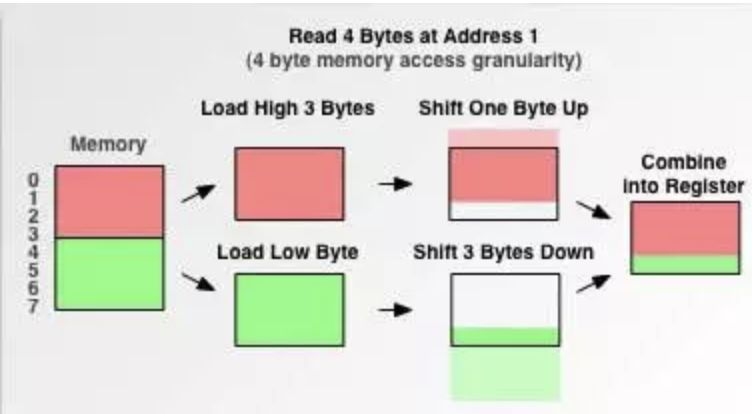

- 现在有了内存对齐的，int类型数据只能存放在按照对齐规则的内存中，比如说0地址开始的内存。那么现在该处理器在取数据时一次性就能将数据读出来了，而且不需要做额外的操作，提高了效率。

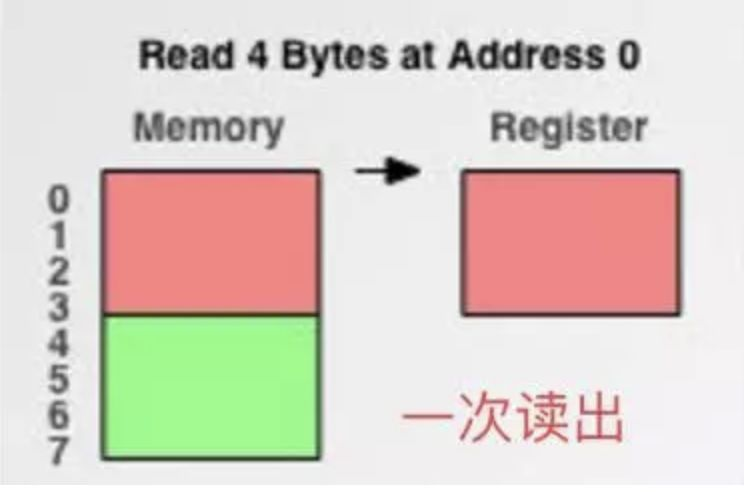

### 内存对齐规则

每个特定平台上的编译器都有自己的默认“对齐系数”（也叫对齐模数）。gcc中默认#pragma pack(4)，可以通过预编译命令#pragma pack(n)，n = 1,2,4,8,16来改变这一系数。

> #pragma pack(n) 设定最大对齐值

有效对齐值：是给定值#pragma pack(n)和结构体中最长数据类型长度中较小的那个。有效对齐值也叫**对齐单位**。

了解了上面的概念后，我们现在可以来看看内存对齐需要遵循的规则：

1. 结构体第一个成员的**偏移量（offset）**为0，以后每个成员相对于结构体首地址的 offset 都是**该成员大小与有效对齐值中较小那个**的整数倍，如有需要编译器会在成员之间加上填充字节。

2.  **结构体的总大小**为 有效对齐值 的**整数倍**，如有需要编译器会在最末一个成员之后加上填充字节。

```c++
//32位系统 4字节内存存取粒度
//32位系统
#include<stdio.h>
struct{
    int i;    
    char c1;  
    char c2;  
}x1;

struct{
    char c1;  
    int i;    
    char c2;  
}x2;

struct{
    char c1;  
    char c2; 
    int i;    
}x3;

int main(){
    printf("%d\n",sizeof(x1));  // 输出8
    printf("%d\n",sizeof(x2));  // 输出12
    printf("%d\n",sizeof(x3));  // 输出8
    return 0;
}
```

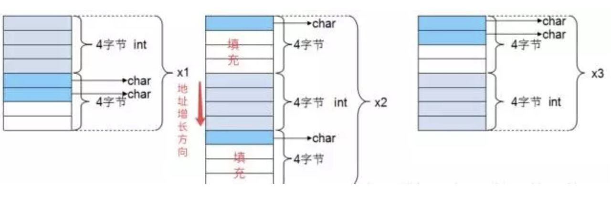

添加了#pragma pack(n)后规则就变成了下面这样：

1. 偏移量要是n和当前变量大小中较小值的整数倍

2. 整体大小要是n和最大变量大小中较小值的整数倍

3. n值必须为1,2,4,8…，为其他值时就按照默认的分配规则

例如，对于上个例子的三个结构体，如果前面加上#pragma pack(1)，那么此时有效对齐值为1字节，此时根据对齐规则，不难看出成员是连续存放的，三个结构体的大小都是6字节。

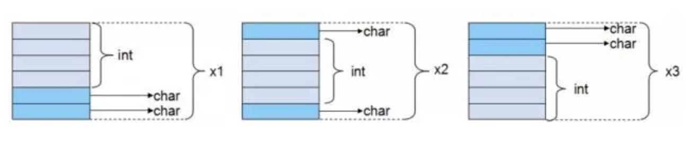

如果前面加上#pragma pack(2)，有效对齐值为2字节，此时根据对齐规则，三个结构体的大小应为6,8,6。内存分布图如下：

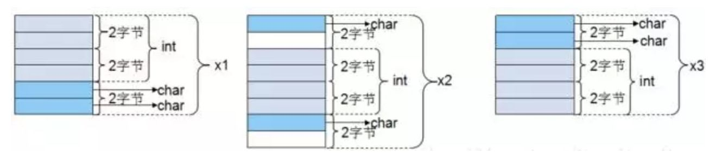

# 4. 指针和引用

## 4.1.  C/C++ 中指针和引用的区别？

1. 指针有自己的一块`空间`，而引用只是一个`别名`；

2. 使用`sizeof看一个指针的大小是4`，而`引用则是被引用对象的大小`<u>==；大小==</u>

3. 指针可以被初始化为`NULL`，而引用必须被`初始化`且必须是一个已有`对象`的引用；<u>==初始化==</u>

4. 作为参数传递时，`指针需要被解引用`才可以对对象进行操作，而`直接对引用的修改都会改变引用所指向的对象`；

5. 可以有`const指针`，但是没有const引用；

6. 指针在使用中可以指向其它对象，但是引用只能是一个对象的引用，不能被改变；<u>==指向是否可改==</u>

7. 指针可以有`多级指针`（**p），而引用至于`一级`； <u>==多级==</u>

8. 指针和引用使用`++`运算符的意义不一样； 指针++移动地址，引用++正常++

9. 如果返回动态内存分配的对象或者内存，必须使用指针，引用可能引起内存泄露？

   [在函数内new一个对象，如果作为引用返回，是不是就可以不用delete了？ - 知乎 (zhihu.com)](https://www.zhihu.com/question/33971459)

## C++的引用

### 引用的定义及使用

#### 1. 引用变量

用一个最简单的例子：

```cpp
int main() {
    int a = 1;
    int &ra = a;
    int *pa = &a;
    return 0;
}
```

这里有一个规定：**引用变量必须在声明的时候同时进行初始化，而不能先声明再赋值**，其实这一点并不重要，这就是语法规则，不然我完全可以这样定义引用：
`int &ra;`
`ra = #a;`
`%a = 10;`
其中我称`#`为取引用符，称`%`为取引用值符。我之所以想在这里内涵一下指针，是想让大家明白，所谓语法就是编译器定义的规则，最终编译器要将根据语法规则写出的C++代码变成汇编代码，汇编代码将最终实现编译器所规定的语法的含义！这有助于我们从汇编的角度，区分指针和引用。

我们看一下上面这段代码编译成的汇编代码(我是用的是Ubuntu 20.04下，默认的最高版本即 `g++ 9.3.0`):

```text
    pushq   %rbp                # 保存"栈底"寄存器 %rbp

    movq    %rsp, %rbp          # 分配32字节大小的函数栈帧空间
    subq    $32, %rsp

    movl    $1, -28(%rbp)       # 定义变量a，并将初始化值1放入a的内存空间中,即-28(%rbp)

    leaq    -28(%rbp), %rax     # 定义引用ra，取a的地址，然后将其放入ra的内存空间中，即-24(%rbp)
    movq    %rax, -24(%rbp)

    leaq    -28(%rbp), %rax     # 定义指针pa，取a的地址，然后将其放入pa的内存空间中，即-16(%rbp)
    movq    %rax, -16(%rbp)
    
    movl    $0, %eax            # 设置main()的返回值
```

如果你不懂汇编代码或者不了解linux函数栈帧的设计，那我只能骚凹瑞，你只能相信我的注释和结论。我们可以看到，**指针和引用变量，都是占用内存空间的，他们的内容，都是所引用或所指向的变量的起始地址**。

到这里我们先解决了了一个经典的问题：引用占内存吗？显然，在当前编译器的实现中(这句话很重要)，引用是需要占据内存空间的，大小等于你架构的位数，即在x86_64上就是8个字节。因为引用有一个广为人知的说法，就是变量的别名，从描述上，好像引用是不占内存的，仅仅是个名字，可能老的编译器也是这样实现的，但是现代的编译器，不是这样的！

#### 2. 引用与指针

接下来是另一个误区，**引用就是指针！**显然这种看法==<u>**也是错误**</u>==的，引用和指针的确是在用法上相似，而且他们在汇编语言的级别，都是所指向和引用的对象的地址，**但是**，编译器赋予了指针和引用完全不同的语义

> 例如++上的不同 但是 也仅仅是语义上的不同

### 二、为什么需要引用？

#### 1. 先给结论

《C++ Primer plus》中有一句原话：“类设计的语义常常要求使用引用，这是C++新增这项特性的主要原因。”也就是说，引用是为了引用对象。可这又是为什么呢？引用的真正目的是什么呢？我的回答是：**为了减少临时变量的copy**

#### 2. 值传递、指针传递和引用传递

我相信，大家对这三种方式，几乎已经不能再熟悉了：

```cpp
void swap_value(int a, int b) {
    int tmp = a;
    a = b;
    b = tmp;
}
void swap_point(int *a, int *b) {
    int tmp = *a;
    *a = *b;
    *b = tmp;
}
void swap_ref(int &a, int &b) {
    int tmp = a;
    a = b;
    b = tmp;
}
```

对于需要修改变量的时候，只能使用指针传递和引用传递。但是对于不需要修改的时候：

- 如果变量是内置类型或很小的结构体、类对象，如int，那么推荐值传递
- 如果变量是很大的结构体或者类对象，那么使用const 指针或const 引用将是首选

需要传递的是内置变量或者很小的结构体时，编译器将直接使用寄存器进行操作，显然这是最快的，如果要用指针和引用，那么会多一次放存操作；当需要传递的值很大，寄存器不够用时，那么使用指针或者引用，将只需要传递变量的地址就可以了！

这里就是我们认为指针和引用都可以减少“临时变量”的原因，我们把函数的参数，当成了临时变量！函数的参数可太惨了，因为在汇编中，参数和普通变量一样，都是存在与栈帧中，都是有名字的变量，其生命周期是整个函数，因此<u>参数并不是我们的临时变量</u>，那谁是？

#### 3. 谁是临时变量？为什么需要引用

我们先直接给出例子：

```cpp
string string_add(string s1, string s2) {
    return s1 + s2;
}

int main() {
    string a("456");
    string b("789");
    string_add("123", a + b);
    return 0;
}
```

这个代码并不难理解，但是我们需要分析一下参数传递过程，显然翻译成汇编后分析难度有点大，因为这段代码翻译成汇编后，足足有350行，因为有很多string类的实现。我们就不分析汇编了，我们把自己变成一个编译器，来思考这段代码如何实现参数传递.

与之前的代码不同，在这里我们并没有直接传递相应类型的参数，而是传了一个`" "`C语言的标准字符串和两个string对象相加的表达式，那么这个时候怎么办呢，这就需要我们首先构造**临时变量**，即首先在当前函数的栈帧中留出一块空间(编译器负责)，将临时对象构造到这个空间中，然后再将临时对象的值，**复制**给形式参数，然后临时变量就不需要了。

其中，构造临时变量的过程是必须的！但是copy临时变量的过程是多余的，如果调用的函数能够直接使用临时变量就好了？怎么做到呢，比如将临时变量的地址传给调用的函数？好方法，怎么实现呢，指针可以吗？不行，因为指针无法获取临时变量的地址，那怎么办呢？**引用！**

```cpp
string string_add(const string& s1, const string& s2) {
    return s1 + s2;
}
```

当我使用引用时，编译器就知道不需要copy，而是将临时变量的地址给到了引用，然后由引用将其传递给调用函数，而这一过程指针是做不到，这就是我为什么我们需要引用！

至此，我已经给除了我的理解，这就是为什么要使用引用的终极答案。

但是这里还有几个问题没有说到：

- 临时变量的定义依然没定
- 右值引用呢？move()呢
- 为什么说，C++为类对象，引入了引用的概念

### 三、右值引用

#### 1. 临时变量的定义

我们在上一小节，交代了引用是如何优化临时变量的copy的，因为我们得知了一件事：引用可以指向临时变量，那那些人在引用眼里属于临时变量呢？

```cpp
int func() {
    return 0;
}
int main() {

    int a = 1;

    // 右值类
    const int &r1 = 1;
    const int &r2 = a * 2 + 1;
    const int &r3 = func();
    // 类型转化类
    const long &r4 = a;
    
    return 0;
}
```

根据《C++ Primer plus》分为了两类：

- 右值类，所谓右值即只能出现在`=`右边的值，他们不能被赋值，不能被取地址
  典型的如，**常量**( `" "`字符串除外，因为他本质上是指针变量)、**表达式**、**非引用返回值的函数**（引用返回值函数最后说）等。
- 类型转化类
  如上一节中先将`" "`字符串转为string对象，构造了一个string临时变量

**需要注意，在执行上述引用时，都会在栈帧中分配空间来存放临时变量，使之不再临时，而引用就是他们的名字，这样就让临时变量和普通变量一样，有自己的名字和内存空间，可以通过引用来赋值和取址。**

并且，从这里我们get到两点：

1. 如果真的是像我上面给出的例子，都是内置的数据类型，那么引用完全就是在添乱，因为首先对于常量，根本不需要占用内存(栈内存)和寄存器，是可以写在汇编代码中的，占用的是代码段的空间，还有两外两种情况，因为临时变量就是int，那么我完全可以用寄存器来存放，速度更快，因为引用使用的是内存地址，这样会增加一次内存访问，这就是**为什么引用是为类对象而生的原因之一，因为对象一般很大，无法使用寄存器来存放临时变量**，之二的理由放在下一节
2. 为啥，使用的是 `const int &`，这是有历史原因的，比如下面的代码：

```cpp
void swap(int &a, int &b) {
   int tmp = a;
   a = b;
   b = tmp;
}
int main() {
   long a = 1, b = 2;
   swap(a, b);
   swap(1, 2);
   return 0;
}
```

如果`int &`可以引用临时变量，那么当我们修改引用时就意味着在修改临时变量，那么上面的swap()函数将失效，甚至出现`swap(1, 2);`这种滑稽的调用。于是，在现代编译器中，禁止非const引用指向临时变量。可是这将大大限制引用的使用，因为如果我就是想修改参数的值呢?于是就出现了：**右值引用**

#### 2. 右值引用

<u>右值引用就可以引用临时变量，并对其进行修改</u>，因此引用其实有四类：

- `int &ra = a;`
  即左值引用，只能引用左值
- `const &rb1 = b;`/`const &rb1 = b;`
  即**const引用**，可引用右值和左值
- `int &&rc = c;`
  即右值引用，只能引用右值
- `const int &&rc = c;`
  即**const右值引用**，只能引用右值

很多地方统称前两种为左值引用，包括《C++ Primer plus》，我认为这样会混淆视听，因为const引用可以引用右值。

- 左值就是可以取地址的变量，又分为常规左值变量和const 左值变量；
- 右值是不可取地址的临时变量，包括常量、非引用函数返回值、表达式等；

而右值仅仅是临时变量的一种，其还可以在发生数据类型转化时产生。

临时变量只有在被引用的时候才会拥有变量的属性，即内存空间和名字，否则可能就是一个寄存器或者一个没名字的临时栈内存区域，对于如int到long的类型转化，仅仅是对寄存器的截断或填充。

**因此可引用的内容其实是：左值+临时变量。因此在上面介绍四种引用类型时说法上使用了大家熟悉右值，但是其实应该是临时变量。**

注意：右值引用修改的是<临时变量>，对于<u>类型转化类</u>的临时变量，此修改是不会上传到原值的：

```cpp
void func(int &&a, int &&b) {
    int tmp = a;
    a = b;
    b = tmp;
}
int main() {
    long a = 1, b = 2;
    func(a, b);
    printf("%ld %ld", a, b);
}
```

运行结果是 `1 2`

既然说到了右值，那么`std::move()`函数，也该出场了。

#### 3. std::move() 

move的本质就是==帮助编译器选择重载函数==, 告诉编译器"==请尽量把此参数当做右值来处理=="

> std::move 并不会真正地移动对象，真正的移动操作是在移动构造函数、移动赋值函数等完成的，std::move 只是将参数转换为右值引用而已（相当于一个 static_cast）。
>
> 回到题主的问题上来，在代码
>
> ```cpp
> std::string str = "test";
> string&& r = std::move(str);
> ```
>
> 中，其实==只是定义了一个指向 str 的右值引用而已==，str 并没有被移走。随后执行
>
> ```cpp
> std::string t(r);
> ```
>
> ，需要注意的是右值引用用于表达式中时会变为左值，所以这里调用的其实是复制构造函数，str 自然也不会被移走。如果要移走的话还要加一次 std::move，比如
>
> ```cpp
> std::string t(std::move(r));  //调用了移动构造
> ```
>
> str 就能被移走了。  
>
> ==因为move 所以调用的移动构造 是移动构造拖走的==

> 在C++11之前，只有一种operator=定义，即拷贝：
>
> string& operator=(const string& another); // 复制
>
> 代码：
>
> string a = "aaaa";
>
> string b = a; // 调用 operator=(const string&) 来复制  ==其实是拷贝构造吧==
>
> 在C++11起，operator=有两个重载，一个复制，一个移动：
>
> string& operator=(const string& another); // 复制
>
> string& operator=(string&& another); // 移动
>
> 那么问题就来了，写string b = a 调用的是哪个重载呢？所以才引入了std::move。
>
> std::move就是一个static_cast，把string类型转换成string&&类型，以使移动的那个重载被调用。
>
> 至于被"move"后的对象还能用吗？
>
> C++11标准中对此有定义，在章节17.6.5.15 [lib.types.movedfrom]：
>
> 被"move"后的对象依然合法并处于未定义状态。也即，被"move"后的string对象的值可以是任意的，可能是空字符串，也可以烫烫烫，也可以是其它的值。
>
> 被"move"后的对象是依然合法的，这个被delete后的指针变成非法不一样。你可以继续使用它，但是要注意重新赋值。
>
> 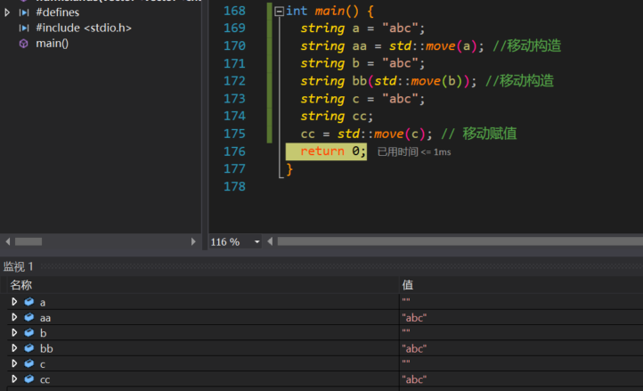

`std::move()`函数通常的解释是，将左值转变为右值，C库给出来其源码，其解释也是这么说的：

```cpp
  /**
   *  @brief  Convert a value to an rvalue.
   *  @param  __t  A thing of arbitrary type.
   *  @return The parameter cast to an rvalue-reference to allow moving it.
  */
  template<typename _Tp>
    constexpr typename std::remove_reference<_Tp>::type&&
    move(_Tp&& __t) noexcept
    { return static_cast<typename std::remove_reference<_Tp>::type&&>(__t); }
```

很多人爱贴这个代码，但是真的有人能完全解释，这个短短的4行代码吗？我觉得很难，使用了template、typename(模板函数)，constexpr(不变表达式?)，noexcept(无异常)，static_cast(强制类型转化)等关键字，以及std::remove_reference<_Tp>::type&&，这种看了头大语法。

我当然要根据之前说法给出我的解释：**`std::move()`作用是基于当前的左值创建一个可引用的临时变量来处理**。我的这个定义我认为是非常精准的，不过还需要进行补充解释：

- `std::move()`是创建新临时变量，但原变量依然是左值的普通变量，而非临时变量

```cpp
void func(int &&a, int &&b) {
   int tmp = a;
   a = b;
   b = tmp;
}
int main() {
   int a = -1, b = -2;
   std::move(a);
   std::move(b);
   func(a, b);
}
```

上面的代码依然是语法错误

- `正确的用法应该是:`

```cpp
void func(int &&a, int &&b) {
   int tmp = a;
   a = b;
   b = tmp;
}
int main() {
   int a = 1;
   long b = 2;
   func(std::move(a), std::move(b));
   printf("%d %ld", a, b);
}
```

我在这个代码里，玩了一手花的，以巧妙的解释move()是如何**创造可引用的临时变量**，简直是神来之笔，首先这个代码的返回值是惊人的`2 2`，为什么呢？

首先，我们前面说过，引用将临时变量变得和普通变量一样，也就是说，普通变量其实已经具备了临时变量的一切(**主要是内存空间！**)，那么此时我们不需要做任何工作，只需要将普通变量的内存空间当作临时变量的内存空间即可！对应了`std::move(a)`，这种情况下对临时变量的修改是会体现在普通变量a上的，这就是为啥a的值变成了2。

但是，如果是需要进行类型转化而产生的临时变量，对应于`std::move(b)`，是没办法直接用内存空间的，比如`long &&`使用`int`，就会导致错误的内存访问，此时就必须创建新的临时变量，那么这个时候，对临时变量的修改是不会会体现在普通变量上的，这就是为啥b的值不变，最终导致了`2 2`的结果。

来看一下汇编代码：

```text
    movl    $1, -24(%rbp)       # int a = 1;
    movq    $2, -16(%rbp)       # long b = 2;
    
    leaq    -16(%rbp), %rax     # std::move(b)
    movq    %rax, %rdi
    call    _ZSt4moveIRlEONSt16remove_referenceIT_E4typeEOS2_
    movq    (%rax), %rax
    movl    %eax, -20(%rbp)
    
    leaq    -24(%rbp), %rax     # std::move(a)
    movq    %rax, %rdi
    call    _ZSt4moveIRiEONSt16remove_referenceIT_E4typeEOS2_
    
    movq    %rax, %rdx          # func()
    leaq    -20(%rbp), %rax
    movq    %rax, %rsi
    movq    %rdx, %rdi
    call    _Z4funcOiS_ 
```

可以看到在执行`std::move(b)`的时候，用了一块4字节的栈帧！！！

到这里可以说，引用的所有原理就全部说完了。

但是，还有，但是。

`std::move()`有什么用？<u>确实，将int、long转为右值，就是脱裤子FP</u>，毫无用处，真正的作用，体现在类对象中，尤其是：

- 实现`移动构造`函数

  > 或者说是去==用move告诉编译器去调用拷贝构造或者拷贝赋值==
  >
  > 为什么move之后最好不用原值了呢? (没说那种莫宁奇妙move没屁用的)
  >
  > 因为move调用的是移动 而移动一般释放了原内存空间

- `类的运算符重载`

### 四、类与引用

#### 准备

我们假设定义一个Buff类：

```cpp
class Buff {
public:
    Buff(char *data, size_t size) : data_(data), size_(size) {};
private:
    char *data_;
    size_t size_;
};
char p[100];
int main() {
    Buff f1{p, sizeof(p)};

}
```

如果我需要，用f1来初始化一个新的对象，有两种方法：

- 使用默认的赋值构造函数
  `Buff f2(f1);`或`Buff f2 = f1;`
- 使用赋值语句
  `Buff f2;`
  `f2 = f1;`

但是无论那一种，他们都将采用"浅复制"，即，仅仅赋值字段的值，如：

```cpp
char p[100];
int main() {
    Buff f{p, sizeof(p)};
    Buff f1(f);
    Buff f2 = f;
    Buff f3;
    f3 = f;
}
```

运行结果：

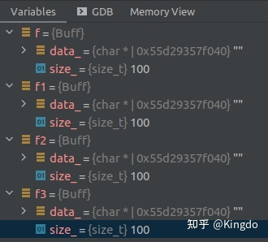

可以看到他们的`data_`字段完全相同。

那么要想实现"深复制"，就需要我们自己重载默认赋值构造函数：

#### 1. 左值引用，复制构造函数

```cpp
Buff(const Buff &b) {
        size_ = b.size_;
        data_ = static_cast<char *>(malloc(size_));
        memcpy(data_, b.data_, size_);
    }
```

右值引用，移动(复制)构造函数

```c
Buff(Buff &&b) noexcept {
        size_ = b.size_;
        data_ = b.data_;
        b.data_ = nullptr;
    }
```

我们发现，基于右值引用实现的移动(复制)构造函数，竟然与默认构造函数很想，区别在于我们会在移动(复制)构造函数中修改参数的值，甚至将其设置为nullptr，这是为什么呢，**因为右值引用，引用的是临时变量，因此我们完全可以“剥夺其资源”，从而大大的加快了构造函数的执行效率，这一过程也是引用真正的能区别与指针，且发挥其作用的地方，诠释了为什么引用是为类的对象而生**

之所以需要`b.data_ = nullptr;`是因为临时变量在将来执行析构函数时，会释放data_，但是我们的f2在执行析构时，也会执行相同的操作，一块内存是不能delete两次的，但是delete nullptr是没有问题的。

#### 2. std::move()

此外，`std::move()`函数，也将在这里体现成他的价值，比如，有一个RawBuff类，使用了我们的Buff类：

```cpp
class Buff {
public:
    Buff() = default;

    Buff(char *data, size_t size) : data_(data), size_(size) {};

    Buff(Buff &b) {
        size_ = b.size_;
        data_ = static_cast<char *>(malloc(size_));
        memcpy(data_, b.data_, size_);
    }

    Buff(Buff &&b) noexcept {
        size_ = b.size_;
        data_ = b.data_;
        b.data_ = nullptr;
    }

private:
    char *data_;
    size_t size_;
};

class RawBuff {
public:
    explicit RawBuff(Buff &buff) : buff_(buff) {}

    explicit RawBuff(Buff &&buff) : buff_(buff) {}

private:
    Buff buff_;
};

Buff getBuff() {
    return Buff();
}

char p[100];

int main() {
    Buff f{p, sizeof(p)};
    RawBuff rf1(f);
    RawBuff rf2(getBuff());
}
```

我们可以看到，基于我们之前说的，这个代码是没有问题的，但是如果我提出这样的一个要求，我构造的RawBuff对象，需要修改传入的Buff对象之后再赋值给自己的字段，但是这个修改又不能反映到让原buff对象中，怎么办呢？其实答案很简单，只需要使用值传递就好了：

```cpp
explicit RawBuff(Buff buff) {
        //Make some changes to the buff
        buff_ = buff;
    }
```

但是值传递带来的问题，如果处理呢？于是就可以使用`std::move()`，修改上述构造函数：

```cpp
explicit RawBuff(Buff buff) {
        //Make some changes to the buff
        buff_ = std::move(buff);
    }
```

因为buff本身就是一个在执行完构造函数就会被抛弃的，那使用std::move()，将其变成临时变量，然后再由Buff()的移动(复制)构造函数剥夺其内存空间，完美！！！！

#### 3. 重载赋值运算符

我在上一小节的结尾，故意留了一个错误，我说是Buff()的移动(复制)构造函数剥夺了参数buff，其实是不对的，因为`buff_ = std::move(buff);`使用的是赋值语句，如果我们没有重载默认复制构造函数，那么赋值运算符也是“浅复制”，但是当我们重载了之后，赋值运算符就无法使用了，必须也对其重载：

```cpp
    Buff &operator=(Buff const &b) {
        if (this == &b)
            return *this;
        size_ = b.size_;
        memcpy(data_, b.data_, size_);
        return *this;
    }

    Buff &operator=(Buff &&b) noexcept {
        if (this == &b)
            return *this;
        size_ = b.size_;
        data_ = b.data_;
        b.data_ = nullptr;
        return *this;
    }
```

### 重点

引用的真正目的是，**为了减少临时变量的copy**，是因为我们只要在比较区分，指针和引用，核心原因就是指针不能引用临时变量

引用做返回值的用法：

- 如果返回值是非引用值，那么函数返回值就是一个右值的类型的临时变量而已，
- 如果返回值是引用，那么需要注意几点：
  1. 不能返回函数的动态变量的引用，因为函数结束后，动态变量的内存就被回收了
  2. 可以返回static静态变量
  3. 可以返回引用类型的参数，这是《C++ Primer plus》的例子

## [#](https://interviewguide.cn/notes/03-hunting_job/02-interview/01-01-03-基础语法.html#_50、从汇编层去解释一下引用)`从汇编层去解释一下引用`

```cpp
9:      int x = 1;
00401048  mov     dword ptr [ebp-4],1
10:     int &b = x;
0040104F   lea     eax,[ebp-4]
00401052  mov     dword ptr [ebp-8],eax
```

x的地址为ebp-4，b的地址为ebp-8，因为栈内的变量内存是从高往低进行分配的，所以b的地址比x的低。

lea eax,[ebp-4] 这条语句将`x的地址`ebp-4放入`eax寄存器`

mov dword ptr [ebp-8],eax 这条语句将`eax的值放入b的地址`

ebp-8中上面两条汇编的作用即：将x的地址存入变量b中，这不和将某个变量的地址存入指针变量是一样的吗？`所以从汇编层次来看，的确引用是通过指针来实现的。`

## 讲讲C++的左值，右值，右值引用和完美转发

**c++的左值，右值 精辟总结**

> 当一个对象被用作右值的时候，使用的是对象的值（内容）；当对象被用作左值的时候，用的是对象的身份（在内存中的位置）[左值右值，完美转发参考文档](https://blog.csdn.net/edwardlulinux/article/details/80865957)。

左值持久，右值短暂；move：显示地将一个左值转换为对应右值的引用类型，还可以获取绑定到左值上的右值引用，int&& rr3 = std::move(rrl); 使用move就意味着**除了对rrl赋值或销毁它外**，我们不再使用它。

std::forward<T>()与std::move()相区别的是，move()会无条件的将一个参数转换成右值，而forward()则会保留参数的左右值类型，可以使用std::forward实现**完美转发**。

**移动语义解决了无用拷贝的问题：移动构造函数**；

**右值引用：函数的返回值**。

int& 左值引用

int&& 右值引用


### **c++中无用拷贝的情况**

```cpp
/*类里面 没有移动构造函数
这样就会使用 copy construct function，会导致大量无用的 memory copy。
*/
class Test {  
public:
    string desc; 
    int * arr{nullptr};
    Test():arr(new int[5000]{1,2,3,4}) { 
        cout << "default constructor" << endl;
    }
    Test(const Test & t) {
        cout << "copy constructor" << endl;
        if (arr == nullptr) arr = new int[5000];
        copy(t.arr,t.arr+5000, arr);
    }
    ~Test(){
        cout << "destructor " << desc << endl;
        delete [] arr;
    }
};

Test createTest() {
    return Test();
}

int main(){

    Test reusable;
    reusable.desc = "reusable";
    Test duplicated(reusable);
    duplicated.desc = "duplicated";

    Test t(createTest());
    t.desc = "t";

    cout<<"end"<<endl;
}

```

运行结果

```text
default constructor
copy constructor
default constructor
end
destructor t
destructor duplicated
destructor reusable
```


### **使用移动语义move避免无用的拷贝**

```cpp
/*使用移动 construct function，避免无用的memory copy。
*/

class Test {   
    public:
    string desc;
    int * arr{nullptr};
    Test():arr(new int[5000]{1,2,3,4}) { 
        cout << "__default constructor" << endl;
    }
    Test(const Test & t) {
        cout << "__copy constructor" << endl;
        if (arr == nullptr) arr = new int[5000]; //在这里要将 t.arr 置为空，因为经过move之后，我们认为不在使用这个值了，避免在新的对象中把指针释放后，原来的对象中存在野指针的现象
        copy(t.arr,t.arr+5000, arr);
    }
    Test(Test && t): arr(t.arr) {
        cout << "__move constructor" << endl;
        t.arr = nullptr;
    }
    ~Test(){
        cout << "..destructor " << desc << endl;
        delete [] arr;
    }
};

Test createTest(string str) {
    Test rt;
    rt.desc = str;
    cout<<"createTest:"<<&rt<<endl;
    return rt;
}

void main(){
    Test reusable;
    reusable.desc = "reusable";
    cout<<"reusable.arr "<<reusable.arr<<endl;
    
    Test duplicated(std::move(reusable));
    duplicated.desc = "duplicated";
    cout<<"reusable.arr "<<reusable.arr<<endl;
    cout<<"duplicated.arr "<<duplicated.arr<<endl;

    cout<<"rvalue--"<<endl;
    Test&& rt1 = createTest("rval");      //使用右值引用接收
    cout<<"rt1.arr "<<rt1.arr<<endl;
    
    cout<<"no rvalue--"<<endl;
    Test rt2 = createTest("normalVal");      //不使用右值引用接收，可以看到这里比使用右值引用接收 多了一次构造和析构（createTest中的临时对象）
    cout<<"createTest:"<<&rt2<<endl;        //尴尬，其实这里编译器已经做了优化了，可以看到第地址一样
    cout<<"rt2.arr "<<rt2.arr<<endl;

    cout<<"end"<<endl;
}
```

输出结果

```text
__default constructor
reusable.arr 0x56521b946e70
__move constructor
reusable.arr 0
duplicated.arr 0x56521b946e70
rvalue--
__default constructor
createTest:0x7ffd092ea390
rt1.arr 0x56521b94c0b0
no rvalue--
__default constructor
createTest:0x7ffd092ea3c0
createTest:0x7ffd092ea3c0
rt2.arr 0x56521b950ee0
end
..destructor normalVal
..destructor rval
..destructor duplicated
..destructor reusable
```

### 完美转发 forward的作用

std::forward被称为**完美转发**，它的作用是保持原来的`值`属性不变。啥意思呢？通俗的讲就是，如果原来的值是左值，经std::forward处理后该值还是左值；如果原来的值是右值，经std::forward处理后它还是右值。

看看下面的例子，你应该就清楚上面这句话的含义了:

```cpp
#include <iostream>

template<typename T>
void print(T & t){
    std::cout << "左值" << std::endl;
}

template<typename T>
void print(T && t){
    std::cout << "右值" << std::endl;
}

template<typename T>
void testForward(T && v){
    print(v);
    print(std::forward<T>(v));
    print(std::move(v));
}

int main(int argc, char * argv[])
{
    testForward(1);

    std::cout << "======================" << std::endl;

    int x = 1;
    testFoward(x);
}

//clang++ -std=c++11 -g -o forward test_forward.cpp
```

在上面的代码中，定义了两个模板函数，一个接收左值，另一个接收右值。在`testForward`函数中向模板函数`print`传入不同的参数，这样我们就可以观察出forward与move的区别了。

上面代码执行结果如下：

```text
左值
右值
右值
=========================
左值
左值
右值
```

从上面第一组的结果我们可以看到，传入的1虽然是右值，但经过函数传参之后它==<u>**变成了左值**</u>==（在内存中分配了空间）；而第二行由于使用了std::forward函数，所以不会改变它的右值属性，因此会调用参数为右值引用的print模板函数；第三行，因为std::move会将传入的参数强制转成右值，所以结果一定是右值。

再来看看第二组结果。因为x变量是左值，所以第一行一定是左值；第二行使用forward处理，它依然会让其保持左值，所以第二也是左值；最后一行使用move函数，因此一定是右值。

通过上面的例子我想你应该已经清楚forward的作用是什么了吧？

### ==还有这样的==

```c++
int main() {
  string a = "abc";
  string &&aa = std::move(a);
  string b = aa; // a aa bb都是abc 因为这样调用的还是拷贝构造
  string c =
      std::forward<string>(aa); // a aa都无 因为调用了移动构造 和move一样的效果
  return 0;
}
```


### forward实现原理

要分析forward实现原理，我们首先来看一下forward代码实现。由于我们之前已经有了[分析std::move](http://avdancedu.com/a39d51f9/)的基础，所以再来看forward代码应该不会太困难。

```cpp
……

template <typename T>
T&& forward(typename std::remove_reference<T>::type& param)
{
    return static_cast<T&&>(param);
}

template <typename T>
T&& forward(typename std::remove_reference<T>::type&& param)
{
    return static_cast<T&&>(param);
}

……
```

forward实现了两个模板函数，一个接收左值，另一个接收右值。在上面有代码中：

```cpp
typename std::remove_reference<T>::type
```

的含义我们在[分析std::move](http://avdancedu.com/a39d51f9/)时已经向你做了说细的说明，其含义就是获得去掉引用的参数类型。所以上面的两上模板函数中，第一个是左值引用模板函数，第二个是右值引用模板函数。

紧接着std::forward模板函数对传入的参数进行强制类型转换，转换的目标类型符合引用折叠规则，因此左值参数最终转换后仍为左值，右值参数最终转成右值。

### 小结

本文我们首先通一个小例子向你介绍了std::forward的作用为“完美转发”，也就是不改变原值的属性。接着我带你分析了std::forward的原码实现，如果你看过我之前对[std::move的分析文章](http://avdancedu.com/a39d51f9/)，相信你在阅读std:forward的代码实现时不会遇到什么困难。

## 4.2.  野指针是什么？

野指针就是指向      `一个已删除的对象`或者`未申请访问权限内存区域`       的指针

指针变量未初始化

任何[指针变量](https://baike.baidu.com/item/指针变量)刚被创建时不会自动成为NULL指针，它的缺省值是随机的，它会乱指一气。指针释放后之后未置空

有时[指针](https://baike.baidu.com/item/指针)在free或delete后未赋值 NULL，便会使人以为是合法的。别看free和delete的名字（尤其是delete），它们只是把指针所指的内存给释放掉，但并没有把指针本身干掉。此时指针指向的就是“垃圾”内存。释放后的指针应立即将指针置为NULL，防止产生“野指针”。

指针操作超越变量作用域

数组越界

不要返回指向栈内存的指针或引用，因为栈内存在函数结束时会被释放。


## 4.3.  c++四个智能指针：[shared_ptr](http://c.biancheng.net/view/7898.html),unique_ptr,weak_ptr,auto_ptr

C++里面的四个智能指针: auto_ptr, `shared_ptr`, `weak_ptr`, `unique_ptr` 其中后三个是c++11支持，并且第一个已经被11弃用。

`为什么要使用智能指针`：

智能指针的作用是管理一个指针，因为存在以下这种情况：

> 申请的空间在函数结束时`忘记释放，造成内存泄漏`。使用智能指针可以很大程度上的避免这个问题，因为智能指针就是一个<u>==类==</u>，当超出了类的作用域是，类会自动调用<u>==析构函数==</u>，析构函数会自动释放资源。所以`智能指针的作用原理就是在函数结束时自动释放内存空间，不需要手动释放内存空间。`

1. auto_ptr（c++98的方案，cpp11已经抛弃）

- 采用`所有权模式`。

```c++
auto_ptr<string> p1 (new string ("I reigned lonely as a cloud.”));
auto_ptr<string> p2;
p2 = p1; //auto_ptr不会报错.
```

- 此时不会报错，`p2剥夺了p1的所有权`，但是当程序运行时访问p1将会报错。所以auto_ptr的缺点是：存在潜在的内存崩溃问题！

- > auto_ptr采用`copy语义`来转移指针资源，转移指针资源的所有权的同时`将原指针置为NULL`，这跟通常理解的copy行为是不一致的(不会修改原数据)，而这样的行为在有些场合下不是我们希望看到的。
  >
  > <u>所以取代的原因是和我们的使用习惯不一样吗？赋值等号运算与我们理解的不一样</u>
  >
  > 而现在C++11的对move语义的支持，使得这样的资源转移**通常**只会在**必要的场合**发生，
  > 例如转移一个临时变量（右值）给某个named variable（左值），
  > 或者一个函数的返回（右值）
  >
  > 这也就是用unique_ptr代替auto_ptr的原因，
  > 本质上来说，就是unique_ptr禁用了copy，而用move替代。
  >
  > 之所以说通常，是因为，也可以用std:move来实现左值move给左值，例如：
  >
  > ```cpp
  >   unique_ptr<string> p1(new string("I reigned lonely as a cloud"));
  >   unique_ptr<string> p2(std::move(p1));
  > ```

2. unique_ptr（替换auto_ptr）

- unique_ptr实现`独占式拥有`或严格拥有概念，保证同一时间内只有一个智能指针可以指向该对象。它对于避免资源泄露(例如“以new创建对象后因为发生异常而忘记调用delete”)特别有用。

- 采用`所有权`模式，还是上面那个例子

````c++
unique_ptr<string> p3 (new string  ("auto")); 
unique_ptr<string> p4；   
p4 = p3;//此时会报错！！
````

- 编译器认为p4=p3非法，避免了p3不再指向有效数据的问题。因此，unique_ptr比auto_ptr更安全。

- 另外unique_ptr还有更聪明的地方：当程序试图将一个 unique_ptr 赋值给另一个时，如果源 unique_ptr 是个`临时右值`，编译器允许这么做；如果源 unique_ptr 将存在一段时间，编译器将禁止这么做，比如：

```c++
unique_ptr<string> pu1(new string ("hello world"));
unique_ptr<string> pu2;
pu2 = pu1;                   // #1 not allowed
unique_ptr<string> pu3;
pu3 = unique_ptr<string>(new string ("You"));  // #2 allowed
```

- 其中#1留下悬挂的unique_ptr(pu1)，这可能导致危害。而#2不会留下悬挂的unique_ptr，因为它调用 unique_ptr 的构造函数，该构造函数创建的临时对象在其所有权让给 pu3 后就会被销毁。这种随情况而已的行为表明，unique_ptr 优于允许两种赋值的auto_ptr 。

- 注：如果确实想执行类似与#1的操作，要安全的重用这种指针，可给它赋新值。C++有一个标准库函数`std::move()`，让你能够将一个unique_ptr赋给另一个。例如：

```c++
unique_ptr<string> ps1, ps2;
ps1 = demo("hello");
ps2 = move(ps1); //(ps1不在指向原来对象)
ps1 = demo("alexia");
cout << *ps2 << *ps1 << endl;
```

3. <u>[==shared_ptr==](https://www.cnblogs.com/diysoul/p/5930361.html)</u>

- shared_ptr实现`共享式拥有`概念。多个智能指针可以指向相同对象，该对象和其相关资源会在“`最后一个引用被销毁`”时候`释放`。从名字share就可以看出了资源可以被多个指针共享，它使用计数机制来表明资源被几个指针共享。可以通过成员函数use_count()来查看资源的所有者个数。除了可以通过new来构造，还可以通过传入auto_ptr, unique_ptr,weak_ptr来构造。当我们调用release()时，当前指针会释放资源所有权，计数减一。当计数等于0时，资源会被释放。<u>==引用计数==</u>

- shared_ptr 是为了解决 auto_ptr 在对象所有权上的局限性(auto_ptr 是独占的), 在使用引用计数的机制上提供了可以共享所有权的智能指针。

- 成员函数：
  1. use_count 返回引用计数的个数
  2. unique 返回是否是独占所有权( use_count 为 1)
  3. swap 交换两个 shared_ptr 对象(即交换所拥有的对象)
  4. reset 放弃内部对象的所有权或拥有对象的变更, 会引起原有对象的引用计数的减少
  5. get 返回内部对象(指针), 由于已经重载了()方法, 因此和直接使用对象是一样的.如 shared_ptr<int> sp(new int(1)); sp 与 sp.get()是等价的
  
  ```c++
  #include <iostream>
  #include <memory>
  using namespace std;
  int main()
  {
      //构建 2 个智能指针
      std::shared_ptr<int> p1(new int(10));
      std::shared_ptr<int> p2(p1);
      //输出 p2 指向的数据
      cout << *p2 << endl;   //输出10
      p1.reset();//引用计数减 1,p1为空指针
      if (p1) {
          cout << "p1 不为空" << endl;
      }
      else {
          cout << "p1 为空" << endl;  //输出
      }
      //以上操作，并不会影响 p2
      cout << *p2 << endl;    //输出10
      //判断当前和 p2 同指向的智能指针有多少个
      cout << p2.use_count() << endl;  //输出 1
      return 0;
  }
  ```

4. weak_ptr  ( `shared_ptr 指针的一种辅助工具`)

- weak_ptr 是一种`不控制对象生命周期`的智能指针, 它指向一个 shared_ptr 管理的对象. 进行该对象的内存管理的是那个强引用的 shared_ptr. weak_ptr只是提供了对管理对象的一个访问手段。weak_ptr 设计的目的是为配合 shared_ptr 而引入的一种智能指针来协助 shared_ptr 工作, 它只可以从一个 shared_ptr 或另一个 weak_ptr 对象构造, `它的构造和析构不会引起引用记数的增加或减少。weak_ptr是用来解决shared_ptr相互引用时的死锁问题,如果说两个shared_ptr相互引用,那么这两个指针的引用计数永远不可能下降为0,资源永远不会释放`。它是对对象的一种弱引用，不会增加对象的引用计数，和shared_ptr之间可以相互转化，shared_ptr可以直接赋值给它，它可以通过调用lock函数来获得shared_ptr。

  ````c++
  class B;
  class A{
  public:
  	shared_ptr<B> pb_;
  	~A(){
      cout<<"A delete\n";
    }
  };
  
  class B{
  public:
    shared_ptr<A> pa_;
  	~B(){
      cout<<"B delete\n";
    }
  };
  
  void fun(){
    shared_ptr<B> pb(new B());
    shared_ptr<A> pa(new A());
    pb->pa_ = pa;
    pa->pb_ = pb;
    cout<<pb.use_count()<<endl; //2
    cout<<pa.use_count()<<endl; //2
  }
  
  int main(){
    fun();
    return 0;
  }
  ````

- 可以看到fun函数中pa ，pb之间`互相引用`，两个资源的引用计数为2，当要跳出函数时，智能指针pa，pb析构时两个资源引用计数会减一，但是两者引用计数还是为1，导致跳出函数时资源没有被释放（pa_，pb_未释放，因为AB是在堆上申请的内存），如果把其中一个改为weak_ptr就可以了，我们把类A里面的shared_ptr pb_; 改为weak_ptr pb_; 运行结果如下，这样的话，资源B的引用开始就只有1，当pb析构时，B的计数变为0，B得到释放，B释放的同时也会使A的计数减一，同时pa析构时使A的计数减一，那么A的计数为0，A得到释放。

- 注意的是`我们不能通过weak_ptr直接访问对象的方法`，比如B对象中有一个方法print(),我们不能这样访问，pa->pb_->print(); 因为pb_是一个weak_ptr，应该先把它转化为shared_ptr,如：

  ````c++
  shared_ptr p = pa->pb_.lock();  //将weak_ptr转换为shared_ptr
  p->print();
  ````

## 4.4.  智能指针的线程安全问题

- 智能指针shared_ptr本身（底层实现原理是引用计数）是线程安全的但对象的读写则不是，因为shared_ptr有两个数据成员，一个是指向的对象的指针，还有一个就是我们上面看到的引用计数管理对象。

- 当智能指针发生拷贝的时候，标准库的实现是先拷贝智能指针，再拷贝引用计数对象（拷贝引用计数对象的时候，会使use_count加一），这两个操作并不是原子操作。

- 如果线程1拷贝对象后线程2将该对象销毁，然后线程1再将引用计数加1，就会产生悬空指针。
  1. 同一个shared_ptr被多个线程读，是线程安全的；
  2. 同一个shared_ptr被多个线程写，不是线程安全的；
  3. 共享引用计数的不同的shared_ptr被多个线程写，是线程安全的。

- 线程不安全例子：

```c++
shared_ptr<Foo> g(new Foo); // 线程之间共享的 shared_ptr
shared_ptr<Foo> x; // 线程 A 的局部变量
shared_ptr<Foo> n(new Foo); // 线程 B 的局部变量
```

- 1. 线程 A 执行x = g;（即 read g），以下完成了步骤 1，还没来及执行步骤 2。这时切换到了 B 线程。
  2. 同时线程 B 执行 g = n; （即 write G），两个步骤一起完成了。
  3. 这时 Foo1对象已经销毁，x.ptr 成了空悬指针！ 
-  `我刚读完他 你就把他写没了`

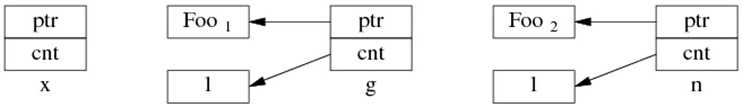

weak_ptr不会增加引用计数，不能直接操作对象的内存（需要先调用[lock](https://links.jianshu.com/go?to=https://en.cppreference.com/w/cpp/memory/weak_ptr/lock)接口），需要和shared_ptr配套使用。

同时，通过weak_ptr获得的shared_ptr可以安全使用，因为其[lock](https://links.jianshu.com/go?to=https://en.cppreference.com/w/cpp/memory/weak_ptr/lock)接口是原子性的，那么`lock返回的是一个新的shared_ptr`，不存在同一个shared_ptr的读写操作。


另一个例子：


## 4.5.  为什么不能在STL容器中存储auto_ptr

- <u>==一个STL对象是可以“拷贝构造”和“赋值”==</u>，而且当一个源对象复制到目标对象后 ，`源对象的状态通常是不会改变`的。

- 但是，这不适用于auto_ptr（智能指针）。因为一个auto_ptr对象拷贝或赋值到另一个对象时会使源对象产生预期变动之外的变化。引发这个问题的原因是`auto_ptr指针的唯一性`，即一个对象只能有一个auto_ptr指针所指向它。因此，当auto_ptr以传值方式被复制给另外一个对象时，源对象就放弃了对象的拥有权，把它转移到目标对象上。

## 4.6.  [智能指针的实现](https://www.cnblogs.com/wxquare/p/4759020.html)

https://www.nowcoder.com/tutorial/93/8f38bec08f974de192275e5366d8ae24

- 智能指针类将一个计数器与类指向的对象相关联，引用计数跟踪该类有多少个对象共享同一指针。
  1. 每次<u>创建类的新对象</u>时，初始化指针并将<u>引用计数置为1</u>；
  2. 当对象作为另一对象的副本而创建时，拷贝构造函数拷贝指针并增加与之相应的引用计数；
  3. 对一个对象进行赋值时，赋值操作符`减少左操作数所指对象的引用计数`（如果引用计数为减至0，则删除对象），并`增加右操作数所指对象的引用计数`；
  4. 调用析构函数时，构造函数减少引用计数（如果引用计数减至0，则删除基础对象。

- 智能指针就是模拟指针动作的类。

- 所有的智能指针都会重载 `->` 和 `*` 操作符。

- 智能指针还有许多其他功能，比较有用的是自动销毁。这主要是利用栈对象的有限作用域以及临时对象（有限作用域实现）析构函数释放内存。

```c++
#include <iostream>
#include <memory>

template <typename T> 
class SmartPointer {
private:
  T *_ptr;
  size_t *_count;

public:
  SmartPointer(T *ptr = nullptr) : _ptr(ptr) {
    if (_ptr) {
      _count = new size_t(1);  //初始化非空 设置count为1
    } else {
      _count = new size_t(0);	//初始化为空 count设为0
    }
  }

  SmartPointer(const SmartPointer &ptr) {
    if (this != &ptr) {
      this->_ptr = ptr._ptr;
      this->_count = ptr._count;
      (*this->_count)++;  //拷贝构造 count++
    }
  }

  SmartPointer &operator=(const SmartPointer &ptr) {
    if (this->_ptr == ptr._ptr) {
      return *this;
    }
    if (this->_ptr) {
      (*this->_count)--;   //本身存在实例化对象，更换指向 因此count--
      if (this->_count == 0) {
        delete this->_ptr;
        delete this->_count;
      }
    }
    this->_ptr = ptr._ptr;  //更改指向
    this->_count = ptr._count;
    (*this->_count)++;  //count++
    return *this;
  }

  T &operator*() {
    assert(this->_ptr == nullptr);
    return *(this->_ptr);  //* 返回指针的解引用 实例化的对象
  }

  T *operator->() {
    assert(this->_ptr == nullptr);
    return this->_ptr;  //->返回的是个指针
  }

  ~SmartPointer() {   //RAII机制, 对象离开作用域即调用析构函数
    (*this->_count)--;   //对象析构count--
    if (*this->_count == 0) { //引用计数为0，析构释放空间
      delete this->_ptr;
      delete this->_count;
    }
  }

  size_t use_count() { return *this->_count; }  //返回指向ptr堆空间的智能指针
};

int main() {
  {
    SmartPointer<int> sp(new int(10));
    SmartPointer<int> sp2(sp);
    SmartPointer<int> sp3(new int(20));
    sp2 = sp3;
    std::cout << sp.use_count() << std::endl;
    std::cout << sp3.use_count() << std::endl;
  }
  // delete operator
}
```

## 4.7.  [==函数指针==](https://www.runoob.com/cprogramming/c-fun-pointer-callback.html)

1. 定义
   - <u>函数指针是指向函数的指针变量。</u>
   - `函数指针本身首先是一个指针变量，该指针变量指向一个具体的函数`。这正如用指针变量可指向整型变量、字符型、数组一样，这里是指向函数。
   - C<u>在编译时，每一个函数都有一个入口地址，该入口地址就是函数指针所指向的地址</u>。有了指向函数的指针变量后，可用该指针变量调用函数，就如同用指针变量可引用其他类型变量一样，在这些概念上是大体一致的。
2. 用途：
   
- **<u>==调用函数和做函数的参数，比如回调函数。==</u>**
  
3. 示例：

   ```c++
   char * fun(char * p)  {…}    // 函数fun
   char * (*pf)(char * p);       // 函数指针pf
   pf = fun;            // 函数指针pf指向函数fun
   pf(p);            // 通过函数指针pf调用函数fun
   ```

### <u>补充</u>

**1) 什么是函数指针?**

函数指针指向的是特殊的数据类型，函数的类型是由其返回的数据类型和其参数列表共同决定的，而函数的名称则不是其类型的一部分。

一个具体函数的名字，如果后面不跟调用符号(即括号)，则该名字就是该函数的指针(注意：大部分情况下，可以这么认为，但这种说法并不很严格)。

**2) 函数指针的声明方法**

int (*pf)(const int&, const int&); (1) `星在括号里面才是函数指针`

上面的pf就是一个函数指针，指向所有返回类型为int，并带有两个const int&参数的函数。注意`*pf两边的括号是必须`的，否则上面的定义就变成了：

int *pf(const int&, const int&); (2) ==这个就是普通的函数声明==

而这声明了一个函数pf，其返回类型为int *， 带有两个const int&参数。

**3) 为什么有函数指针**

函数与数据项相似，函数也有地址。我们希望在同一个函数中通过使用相同的形参在不同的时间使用产生不同的效果。

> 1. 为了代码更加简短 简写ifelse 或者switch 条件和函数指针都作为数组 实现条件和函数的映射
>
>    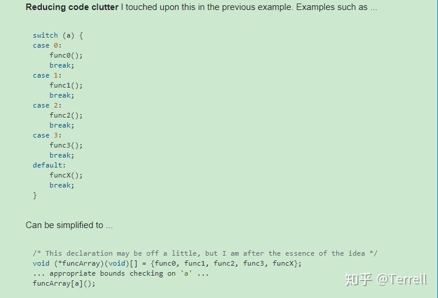
>
> 2. `回调函数 把函数昨晚参数传进对应的处理函数中 比如qt的信号槽 mfc的按钮响应绑定` 类比 C++标准库的std::sort函数，std::sort函数可以指定一个比较函数作为参数，这样sort的调用者可以根据需要自行指定如何进行比较。

**4) 一个函数名就是一个指针，它指向函数的代码。**

一个函数地址是该函数的进入点，也就是调用函数的地址。函数的调用可以通过函数名，也可以通过指向函数的指针来调用。函数指针还允许将函数作为变元传递给其他函数；

**5) 两种方法赋值：**

指针名 = 函数名； 指针名 = &函数名

### [C++ 函数指针 & 类成员函数指针 | 菜鸟教程 (runoob.com)](https://www.runoob.com/w3cnote/cpp-func-pointer.html)

#### typedef 定义可以简化函数指针的定义

```c++
int test(int a)
{
    return a;
}
 
int main(int argc, const char * argv[])
{
    
    typedef int (*fp)(int a);
    fp f = test;
    cout<<f(2)<<endl;
    return 0;
}
```

#### 函数指针同样是可以`作为参数`传递给函数的

```c++
int test(int a)
{
    return a-1;
}
int test2(int (*fun)(int),int b)
{
    int c = fun(10)+b;
    return c;
}
 
int main(int argc, const char * argv[])
{
    typedef int (*fp)(int a);
    fp f = test;
    cout<<test2(f, 1)<<endl; // 调用 test2 的时候，把test函数的地址作为参数传递给了 test2  输出10
    return 0;
}
```

#### 利用函数指针，我们可以构成函数指针数组，更明确点的说法是构成指向函数的指针数组。

```c++
void t1(){cout<<"test1"<<endl;}
void t2(){cout<<"test2"<<endl;}
void t3(){cout<<"test3"<<endl;}
 
int main(int argc, const char * argv[]){
    typedef void (*fp)(void);
    fp b[] = {t1,t2,t3}; // b[] 为一个指向函数的指针数组
    b[0](); // 利用指向函数的指针数组进行下标操作就可以进行函数的间接调用了
    
    return 0;
}
```

#### 指向类成员函数的函数指针

**定义：**类成员函数指针（member function pointer），是 C++ 语言的一类指针数据类型，用于存储一个指定类具有给定的形参列表与返回值类型的成员函数的访问信息。

基本上要注意的有两点：

- 1、函数指针赋值要使用 **&对象::函数名**
- 2、使用 **.\*** (实例对象)或者 **->\***（实例对象指针）调用类成员函数指针所指向的函数

##### A) 类成员函数指针指向类中的非静态成员函数

对于 **nonstatic member function （非静态成员函数）**取地址，获得该函数`在内存中的实际地址`

对于 **virtual function（虚函数）**, 其地址在编译时期是未知的，所以对于 virtual member function（虚成员函数）取其地址，所能获得的`只是`一个索引值  ==//所以不能指向虚函数==

>   ==void (A::*ptr)(int) = &A::setA;==

```c++
class A {
public:
  A(int aa = 0) : a(aa) {}
  ~A() {}
  void setA(int aa = 1) { a = aa; }
  virtual void print() { cout << "A: " << a << endl; }
  virtual void printa() { cout << "A1: " << a << endl; }

private:
  int a;
};

class B : public A {
public:
  B() : A(), b(0) {}
  B(int aa, int bb) : A(aa), b(bb) {}
  ~B() {}
  virtual void print() {
    A::print();
    cout << "B: " << b << endl;
  }
  virtual void printa() {
    A::printa();
    cout << "B: " << b << endl;
  }

private:
  int b;
};

int main(void) {
  A a;
  B b;
  void (A::*ptr)(int) = &A::setA;
  A *pa = &a;
  //对于非虚函数，返回其在内存的真实地址
  printf("A::set(): %p\n", &A::setA); // A::set(): 0x8048a38
  //对于虚函数， 返回其在虚函数表的偏移位置
  printf("B::print(): %p\n", &A::print);  // B::print(): 0x1
  printf("B::print(): %p\n", &A::printa); // B::print(): 0x5
  a.print();                              // A: 0
  a.setA(10);

  a.print(); // A: 10
  a.setA(100);
  a.print(); // A : 100
  //对于指向类成员函数的函数指针，引用时必须传入一个类对象的this指针，所以必须由类实体调用
  (pa->*ptr)(1000);
  a.print(); // A : 1000
  (a.*ptr)(10000);
  a.print(); // A : 10000
  return 0;
}
```

`void (A::*ptr)(int) = &A::setA;`

 `(a.*ptr)(10000);`  //就是调用A的setA(10000)

##### B) 类成员函数指针指向类中的静态成员函数

>  `定义的时候不加类名作用域就是指向静态成员函数了` 
>
>  ==void (~~A::~~*pp)(void) = &A::funb;==

```c++
class A {
public:
  // p1是一个指向非static成员函数的函数指针
  void (A::*p1)(void);
  // p2是一个指向static成员函数的函数指针
  void (*p2)(void);
  A() {
    /*对指向非static成员函数的指针和指向static成员函数的指针
    **的变量的赋值方式是一样的，都是&ClassName::memberVariable形式
    **区别在于：
    **对p1只能用非static成员函数赋值
    **对p2只能用static成员函数赋值
    **
    **再有，赋值时如果直接&memberVariable，则在VS中报"编译器错误 C2276"
    */
    p1 = &A::funa; //函数指针赋值一定要使用 &
    p2 = &A::funb;
    // p1 =&A::funb;//error
    // p2 =&A::funa;//error
    // p1=&funa;//error,编译器错误 C2276
    // p2=&funb;//error,编译器错误 C2276
  }

  void funa(void) { puts("A"); }
  static void funb(void) { puts("B"); }
};

int main() {
  A a;
  // p是指向A中非static成员函数的函数指针
  void (A::*p)(void);
  (a.*a.p1)(); //打印 A
  //使用.*(实例对象)或者->*（实例对象指针）调用类成员函数指针所指向的函数
  p = a.p1;
  (a.*p)(); //打印 A
  A *b = &a;
  (b->*p)(); //打印 A
  /*尽管a.p2本身是个非static变量,但是a.p2是指向static函数的函数指针，
  **所以下面这就话是错的!
  */
  //    p = a.p2;//error
  void (*pp)(void);  //不加类名作用域就是指向静态成员函数了
  pp = &A::funb;
  pp(); //打印 B
  return 0;
}
```

### 总结

> 函数指针定义时都是 (*p) *和指针名称一起括起来的

类成员函数指针与普通函数指针不是一码事。前者要==具体的对象==用 **.** 与 **->** 运算符来使用，而后者可以直接调用

<u>普通函数指针实际上`保存的是函数体的开始地址`</u>，因此也称"代码指针"，以区别于 C/C++ 最常用的数据指针。

而类成员函数指针就不仅仅是类成员函数的内存起始地址，还需要能解决因为 C++ 的多重继承、虚继承而带来的类实例地址的调整问题，所以类成员函数指针在调用的时候一定要传入类实例对象。

## 4.8.  函数内可以返回一个局部变量的引用吗？

不可以。

```c++
int *get10(){
  int a = 10;
  int *b = &a;
  return b;
}//错误
```

解决：

1. 加static
2. 加传入参数
3. 分配在堆上

## [Difference between *ptr[10] and ( *ptr) [10]](https://stackoverflow.com/questions/13910749/difference-between-ptr10-and-ptr10)

```
int *ptr[10];
```

This is an array of 10 `int*` pointers, not as you would assume, a pointer to an array of 10 `int`s

```
int (*ptr)[10];
```

This is a pointer to an array of 10 `int`

It is I believe the same as `int *ptr;` in that both can point to an array, but the given form can ONLY point to an array of 10 `int`s


For the following code:

```c
    int (*ptr)[10];
    int a[10]={99,1,2,3,4,5,6,7,8,9};
    ptr=&a;
    printf("%d",(*ptr)[1]);
```

What should it print? I'm expecting the garbage value here but the output is `1`.
(for which I'm concluding that initializing this way pointer array i.e `ptr[10]` would start pointing to elements of `a[10]` in order).

But what about this code fragment:

```c
int *ptr[10];
int a[10]={0,1,2,3,4,5,6,7,8,9};
*ptr=a;
printf("%d",*ptr[1]);
```

It is giving the segmentation fault.

# 5. 构造、析构函数

## 5.1.  C++中析构函数的作用

- 析构函数与构造函数对应，当对象结束其生命周期，如对象所在的函数已调用完毕时，系统会自动执行析构函数。
- 析构函数名也应与类名相同，只是在函数名前面加一个位取反符~，例如~stud( )，以区别于构造函数。它不能带任何参数，也没有返回值（包括void类型）。只能有一个析构函数，不能重载。
- 如果用户没有编写析构函数，编译系统会自动生成一个缺省的析构函数（即使自定义了析构函数，编译器也总是会为我们合成一个析构函数，并且如果自定义了析构函数，编译器在执行时会先调用自定义的析构函数再调用合成的析构函数），它也不进行任何操作。所以许多简单的类中没有用显式的析构函数。
- 如果一个类中有指针，且在使用的过程中动态的申请了内存，那么最好显示构造析构函数在销毁类之前，释放掉申请的内存空间，避免内存泄漏。
- 类析构顺序：1）派生类本身的析构函数；2）对象成员析构函数；3）基类析构函数。

## 5.2.  C++中拷贝构造/赋值函数的形参能否进行值传递？

```c++
A& operator=(A other) // 进行值传递而非引用传递（拷贝构造时也有赋值过程）？
A a;
A b(a);
A b=a;  都是拷贝构造函数来创建对象b
```

强调：这里b对象是不存在的，是用a 对象来构造和初始化b的！！

`赋值函数如果为值传递，仅仅是多了一次拷贝构造，并不会无限递归`

**<u>==拷贝构造如果为值传递，才会引起无限递归==</u>**

 ````c++
 Example(Example& ex)    //拷贝构造函数（引用传递参数）
 {
   //aa = ex.aa;       //如果构造函数是成员函数赋值则可以，默认使用参数列表初始化
   *this = ex;        //如果是类拷贝则不行
   cout << "调用构造函数" << endl;
 }
 ````

## 5.3.  [构造函数可以定义为虚函数吗](https://blog.csdn.net/qq_28584889/article/details/88749862)

**`构造函数不能是虚函数`**

1. 从vptr角度解释
   - 虚函数的调用是通过虚函数表来查找的，而虚函数表由`类的实例化对象`的vptr指针(vptr可以参考[C++的虚函数表指针vptr](https://blog.csdn.net/qq_28584889/article/details/88748923))指向，该指针存放在对象的内部空间中，需要调用构造函数完成初始化。如果构造函数是虚函数，那么调用构造函数就需要去找vptr，但此时vptr还没有初始化！**<u>==（用虚函数构造我 但是使用虚函数需要我）==</u>**

2.  从多态角度解释
   - 虚函数主要是实现多态，在运行时才可以明确调用对象，根据传入的对象类型来调用函数，例如通过父类的指针或者引用来调用它的时候可以变成调用子类的那个成员函数。而`构造函数是在创建对象时自己主动调用的，不可能通过父类的指针或者引用去调用。那使用虚函数也没有实际意义`。
   - 在调用构造函数时还不能确定对象的真实类型（由于子类会调父类的构造函数）；并且构造函数的作用是提供初始化，在对象生命期仅仅运行一次，不是对象的动态行为，没有必要成为虚函数。


## 5.4.  为什么析构函数必须是虚函数？为什么C++默认的析构函数不是虚函数

1. - 将可能会被继承的`父类`的析构函数设置为虚函数，可以保证当我们new一个子类，然后使用基类指针指向该子类对象，释放基类指针时可以释放掉子类的空间，防止内存泄漏。
   - 如果不是虚函数的话，子类的构析函数不会被调用，子类申请的内存不会被释放。

2. - C++默认的析构函数不是虚函数是因为虚函数需要额外的虚函数表和虚表指针，占用额外的内存。而对于不会被继承的类来说，其析构函数如果是虚函数，就会`浪费内存`。因此C++默认的析构函数不是虚函数，而是只有当需要当作父类时，设置为虚函数。

````c++
class Father {
public:
  virtual ~Father() {
    cout << "class Father destroyed" << endl;
  }
};

class Son : public Father {
public:
  ~Son() {
    cout << "class Son destroyed" << endl;
  }
};

int main() {
  Father* p = new Son;
  delete p;   //如果不是虚函数 则不调用子类的析构函数
  return 0;
}
````

- 如果父类的析构函数是虚函数，则`子类的析构函数一定是虚函数`（即使是子类的析构函数不加virtual,这是C++的语法规则），`在父类指针或引用指向一个子类时，触发动态绑定（多态）`，析构实例化对象时，若是子类则会执行子类的析构函数，同时，编译器会在子类的析构函数中插入父类的析构函数，最终实现了先调用子类析构函数再调用父类析构函数。

```c++
//Rectangle Triangle继承自Shape
//area()为Shape的virtual方法
int main( ){
   Shape *shape;
   Rectangle rec(10,7);
   Triangle  tri(10,5);
   // 存储矩形的地址
   shape = &rec;
   // 调用矩形的求面积函数 area
   shape->area(); 
   // 存储三角形的地址
   shape = &tri;
   // 调用三角形的求面积函数 area
   shape->area(); 
   return 0;
}
```

# 6.   关键字、函数

> 关键字一般怎么回答:
>
> - 目的是什么? 
> - 使用他的一些具体场景
>
> 1. 修饰变量时
> 2. 修饰指针时
> 3. 修饰函数时
> 4. 修饰全局或者局部时
> 5. 修饰类内或者类外时

## 6.1.  const 作用和应用场景

### 6.1.1. [const修饰指针](https://blog.csdn.net/oguro/article/details/52694295)

~~**const修饰指针有三种情况：**`离谁近谁不可修改` 说法是**<u>==反==</u>**过来的？~~

1. ~~const修饰指针——指向常量的指针( const int *p = &a )~~

   ~~指针的指向可以修改，但是指针指向的值不可以修改.~~

2. ~~const修饰常量——指针常量( int * const p = &a )~~

   ~~指针的指向不可以修改，但是指针指向的值可以修改.~~

3. ~~const既修饰指针，又修饰常量(const int * const p = &a )~~

   ~~指针的指向不可以修改，指针指向的值也不可以修改.~~

前面理解不大对，正确的理解应该是 

int* p = new int(10); 

此时`*p是值`， `p是指针`

- int * const p; `const限定的是p` 是指针，所以`指向不可更改`

- const int* p 或者 int const* p; `const限定的都是*p 是值`， 所以`指向的值不可更改`

### 6.1.2. [const修饰函数](https://blog.csdn.net/lihao21/article/details/8634876)

const修饰

- 常函数：成员函数`后加const`后我们称为这个函数为常函数

  1. `常函数内不可以修改成员属性`

  ````c++
  class Screen {
  public:
      int ok() const {return _cursor; }  //合法
      int error(intival) const { _cursor = ival; } //非法
  };
  ````

  2. 常函数内修改成员属性的两种方法：
     - 成员属性声明时加关键字mutable后，在常函数中依然可以修改
     - 将成员变量以引用的方式传入函数
     - 值得注意的是，把一个成员函数声明为const可以保证这个成员函数不修改数据成员，但是，<u>如果数据成员是指针，则const成员函数并不能保证不修改指针指向的对象，编译器不会把这种修改检测为错误</u>。例如，

  ````c++
  class Name {
  public:
      void setName(const string &s) const;
  private:
      char *m_sName;
  };
   
  void setName(const string &s) const {
      m_sName = s.c_str();      // 错误！不能修改m_sName;
   
      for (int i = 0; i < s.size(); ++i) 
          m_sName[i] = s[i];    // 不好的风格，但不是错误的
  }
  ````

- 常对象
  1. 声明对象前加const称该对象为常对象
  2. `常对象只能调用常函数`，普通对象既可以调用普通成员函数，也可以调用常函数

### 6.1.3. const修饰的成员函数可以重载么

#### 首先明确const修饰参数 能不能重载

==值传递==作为参数 加const==不构成==重载 会报从重定义的错

> 因为这是**值传递，只是把值传进去了，并不是把自己传进去。**
>
> 本来就不会修改原来的 又何必const呢?

==指针或者引用==加const==构成==重载  (注意 底层const可以 而int* const p是不行的)

```c++
int te(const int* a){  //z
	return *a;
}

int te(int* a) {
	return *a;
}

int main(){
	int a = 1;
	std::cout << te(&a) << std::endl;
	const int b = 2;
	std::cout << te(&b) << std::endl;
}

```

> 因为，这样传进去是一个真实有效的值，它把原值直接传到函数中，这个const是有效的，因为他会影响到底传进去的这个参数能不能被修改

#### 那么

**const修饰的成员函数同时也`能`实现函数的重载。**

因为const修饰成员函数其实修饰的是传递进去的this指针 所以是可以重载的

1. 要想调用`const修饰的重载函数`，需要用`const对象`去调用。
2. 如果一个函数用const修饰了，但是这个函数没有实现重载，那么非const对象和const对象都能调用这个函数。
   - 如下代码：若没有fun只有const fun， 则t1也会调用const fun

````c++
#include<iostream>  
using namespace std;  
   
class Test  
{  
protected:  
    int x;  
public:  
    Test (int i):x(i) {}  
    void fun() const  {  
        cout << "fun() const called " << endl;  
    }  
    void fun()  {  
        cout << "fun() called " << endl;  
    }  
};  
   
int main()  
{  
    Test t1 (10);  
    const Test t2 (20);  
    t1.fun();  //fun() called
    t2.fun();  //fun() const called
    return 0;  
}
````

#### `const修饰的成员函数` 怎么让他去可以`修改成员变量`

1. 用`mutable`修改成员变量

2. 函数的参数中, 把成员变量的`引用`传进去

   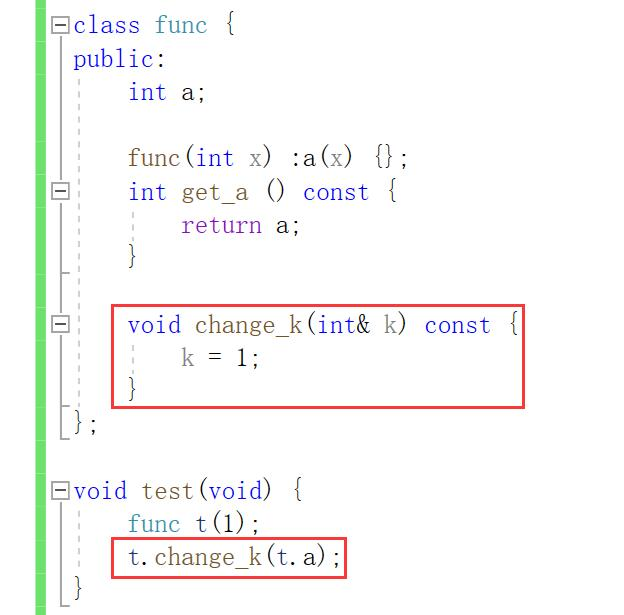

3. const_cast去掉函数指针的底层const ? 不知道可不可以 瞎扯的

#### `mutable`关键字了解吗

> mutalbe的中文意思是“可变的，易变的”，是constant（即C++中的const）的反义词。在C++中，==mutable也是为了突破const的限制而设置的，被mutable修饰的变量将永远处于可变的状态。==
>
> mutable的作用有两点： （1）保持常量对象中大部分数据成员仍然是“只读”的情况下，实现对个别数据成员的修改； （2）使类的const函数可以修改对象的mutable数据成员。
>
> 使用mutable的注意事项： （1）mutable只能作用于==类==的非静态和非常量数据成员。 （2）在一个类中，<u>应尽量或者不用mutable</u>，大量使用mutable表示程序设计存在缺陷。
>
> 示例代码如下：
>
> ```c++
> //mutable int test;//编译出错
> 
> class Student
> {
> 	string name;
> 	mutable int getNum;
> 	//mutable const int test;    //编译出错
> 	//mutable static int static1;//编译出错
> public:
> 	Student(char* name)
> 	{
> 		this->name=name;
> 		getNum=0;
> 	}
> 	string getName() const   //这个const本身是不会修改非mutable成员的
> 	{
> 		++getNum;
> 		return name;
> 	}
> 	void pintTimes() const
> 	{
> 		cout<<getNum<<endl;
> 	}
> };
> 
> int main(int argc, char* argv[])
> {
> 	const Student s("张三");
> 	cout<<s.getName()<<endl;
> 	s.pintTimes();
> 	return 0;
> }
> ```
>
> 程序输出结果：
>
> ```javascript
> 张三
> 1
> ```


### 6.1.4. 常量引用

int& ref = 1 ==错误== : 非常量引用的初始值必须为左值

const int & ref = 10// 正确，加上const之后,编译器将代码修改为 int temp = 10; const int & ref = temp;

### 6.1.5. 顶层const(const指针)和底层const(const常量)

1. 指向`常量`的指针，`底层const`。声明时const可以放在类型名前后都可，拿int类型来说，声明时：const int和int const 是等价的，

````c++
int num_a = 1;
int const *p_a = &num_a; //底层const
//*p_a = 2; //错误，指向“常量”的指针不能改变所指的对象
````

2. 指针常量，顶层const

   > 记忆 *（指针）const（常量）   **<u>==指针常量==</u>** 	
   >
   > 记忆  const（常量） int *（指针）  **<u>==常量指针==</u>**		

````c++
int num_b = 2;
int *const p_b = &num_b; //顶层const
//p_b = &num_a; //错误，指针常量不能改变存储的地址值
````

- 当执行对象的拷贝过程中（赋值操作，函数的值传递）时，如果被拷贝对象拥有底层const资格，则拷贝对象必须拥有相同的底层const资格。或者两个对象的数据类型必须能够转换。一般来说，非常量可以转换成常量，反之则不行。

````c++
int k = 2;
int *const a = &k;
int *b = a;//可以
int const* a = &k;
int *b = a;//不行
````

- 使用命名的强制类型转换函数const_cast时，需要能够分辨底层const和顶层const，因为const_cast只能改变运算对象的底层const。

`````c++
int k = 4;
int *const a = &k;
int* b = const_cast<int*>(a);
a = b;//错误，顶层const不能改变
`````


#### [25、C++的顶层const和底层const](https://interviewguide.cn/#/Doc/Knowledge/C++/基础语法/基础语法?id=25、c的顶层const和底层const)

**概念区分**

- **顶层**const：指的是const修饰的变量**本身**是一个常量，无法修改，指的是指针，就是 * 号的右边
- **底层**const：指的是const修饰的变量**所指向的对象**是一个常量，指的是所指变量，就是 * 号的左边

**举个例子**

```cpp
int a = 10;int* const b1 = &a;        //顶层const，b1本身是一个常量
const int* b2 = &a;       //底层const，b2本身可变，所指的对象是常量
const int b3 = 20;            //顶层const，b3是常量不可变
const int* const b4 = &a;  //前一个const为底层，后一个为顶层，b4不可变
const int& b5 = a;           //用于声明引用变量，都是底层const
```

**区分作用**

- 执行对象拷贝时有限制，常量的底层const不能赋值给非常量的底层const
- 使用命名的强制类型转换函数const_cast时，只能改变运算对象的底层const

```cpp
const int a;int const a;const int *a;int *const a;Copy to clipboardErrorCopied
```

- int const a和const int a均表示定义常量类型a。
- const int *a，其中a为指向int型变量的指针，const在 * 左侧，表示a指向不可变常量。(看成const (*a)，对引用加const)
- int *const a，依旧是指针类型，表示a为指向整型数据的常指针。(看成const(a)，对指针const)


### `const和constexpr`  c++11新特性

- [constexpr和const的区别详解 C++11 (notion.so)](https://www.notion.so/constexpr-const-C-11-b85fe6ba81e2481e879194f32a7be763)

  const存在双重语义, 即只读(变量)和常量的属性, 为了将双重语义区分开, c++11添加了constexpr关键字

  ```cpp
  int add5(const int a) {
    int nums[a]; //报错 a为只读局部变量
    return a + 5;
  }
  int main() {
    const int n = 10;
    int a[10];  //不报错 a为常量
    return 0;
  ```

  在 C++ 11 标准中，const 用于为修饰的变量添加“`只读`”属性；**`而 constexpr 关键字则用于指明其后是一个常量（或者常量表达式）`**，编译器在**`编译`**程序时可以顺带将其结果计算出来，而无需等到程序运行阶段，这样的优化`**极大地提高了程序的执行效率**`。

  <u>大多数情况是可以混用的, 但是有些时候是不可混用的 例如const/constexpr修饰返回值</u>

  ```cpp
  #include <array>
  #include <iostream>
  using namespace std;
  constexpr int sqr1(int arg) { return arg * arg; }
  const int sqr2(int arg) { return arg * arg; }
  int main() {
    array<int, sqr1(10)> mylist1;  //可以，因为sqr1时constexpr函数
    //报错 表达式必须含有常量值
    array<int, sqr2(10)> mylist1;  //不可以，因为sqr2不是constexpr函数
    return 0;
  }
  ```


## 6.2.  static关键字的作用

### static关键字的作用

1. 全局静态变量
   - 在全局变量前加上关键字static，全局变量就定义成一个全局静态变量.
   - 内存中的位置：静态存储区（数据段），在整个程序运行期间一直存在。
   - 初始化：未经初始化的全局静态变量会被自动初始化为0（自动对象的值是任意的，除非他被显式初始化）；
   - 作用域：全局静态变量在声明他的`文件之外`是`不可见`的，准确地说是从定义之处开始，到文件结尾。

2. 局部静态变量
   - 在局部变量之前加上关键字static，局部变量就成为一个局部静态变量。
   - 内存中的位置：静态存储区
   - 初始化：未经初始化的局部静态变量会被自动初始化为0（自动对象的值是任意的，除非他被显式初始化）；
   - 作用域：作用域仍为`局部作用域`，当定义它的函数或者语句块结束的时候，作用域结束。但是当局部静态变量离开作用域后，并`没有销毁`，而是仍然驻留在内存当中，只不过我们不能再对它进行访问，直到该函数<u>再次被调用</u>，并且`值不变`；

3. 静态函数 （**<u>==限定在局部==</u>**）
   - 在函数返回类型前加static，函数就定义为静态函数。函数的定义和声明在默认情况下都是extern的，但静态函数只是在声明他的文件当中可见，不能被其他文件所用。
   - 函数的`实现`使用static修饰，那么这个函数只可在本cpp内使用，不会同其他cpp中的同名函数引起冲突；
   - warning：不要再头文件中声明static的全局函数，不要在cpp内声明非static的全局函数，如果你要在多个cpp中复用该函数，就把它的声明提到头文件里去，否则cpp内部声明需加上static修饰；

4. 类的静态成员
   - 在类中，`静态成员可以实现多个对象之间的数据共享`，并且使用静态数据成员还不会破坏隐藏的原则，即保证了安全性。因此，静态成员是类的所有对象中共享的成员，而不是某个对象的成员。<u>对多个对象来说，静态数据成员只存储一处，供所有对象共用。不存在对象内存里。</u>

5. 类的静态函数
   - 静态成员函数和静态数据成员一样，它们都属于类的静态成员，它们都不是对象成员。因此，对静态成员的引用不需要用对象名。
   - 在静态成员函数的实现中不能直接引用类中说明的非静态成员，可以引用类中说明的静态成员（这点非常重要）。如果静态成员函数中要引用非静态成员时，可通过对象来引用。从中可看出，调用静态成员函数使用如下格式：<类名>::<静态成员函数名>(<参数表>);

### static什么时候初始化

1. 全局, 类里面static成员什么时候初始化: 

   > 全局变量, 文件域的静态变量和类的静态成员变量==在main执行之前==的<u>静态初始化过程中分配内存并初始化</u>

2. 函数里面static成员什么时候初始化:

   > ==局部静态变量==(一般为函数内的静态变量)在==第一次使用==时分配内存并初始化。这里的变量包含内置数据类型和自定义类型的对象。

### 哪些场景下使用static

1. 全局情况下使static变量 主要是为了限制作用域, 在其他文件内不可见,同时初始化一次
2. 在局部情况下使用static 是为了防止重复初始化, 保存static的值的变化情况, 比如说统计函数调用次数
3. 类的静态成员函数 我一般是在制作工具类的情况下使用(或者提供一些相关的工具接口), 比如我要实现多种滤波方法, 我就可以写一个滤波类, 其中全是静态成员函数
4. 类的静态成员 最典型的就是单例模式 
5. 普通的静态函数主要就是限制函数的有效范围 只在声明他的文件中可见

## 6.3.  extern

1. extern关键字可以置于变量或者函数前，以<u>标示变量或者函数的定义在别的文件中，提示编译器遇到此变量和函数时`在其他模块中寻找其定义`。这里起到的是声明作用范围的用处。</u>

2. extern “C”
   
   - c和c++对同一个函数经过编译后生成的函数名是不同的，由于C++支持函数重载，因此编译器编译函数的过程中会将函数的参数类型也加到编译后的代码中，而不仅仅是函数名；而C语言并不支持函数重载，因此编译C语言代码的函数时不会带上函数的参数类型，一般只包括函数名。如果在c++中调用一个使用c语言编写的模块中的某个函数，那么c++是根据c++的名称修饰方式来查找并链接这个函数，那么就会发生链接错误。
   
   - 为了能够**正确的在C++代码中调用C语言**的代码：在程序中加上extern "C"后，相当于告诉编译器这部分代码是C语言写的，因此要按照C语言进行编译，而不是C++；
   
     哪些情况下使用extern "C"：
   
     （1）C++代码中调用C语言代码；
   
     （2）在C++中的头文件中使用；
   
     （3）在多个人协同开发时，可能有人擅长C语言，而有人擅长C++；
   
     举个例子，C++中调用C代码：
   
     ```cpp
     #ifndef __MY_HANDLE_H__
     #define __MY_HANDLE_H__
     
     extern "C"{
         typedef unsigned int result_t;
         typedef void* my_handle_t;
         
         my_handle_t create_handle(const char* name);
         result_t operate_on_handle(my_handle_t handle);
         void close_handle(my_handle_t handle);
     }
     ```
   
     综上，总结出使用方法**，在C语言的头文件中，对其外部函数只能指定为extern类型，`C语言中不支持extern "C"声明`，在.c文件中包含了extern "C"时会出现编译语法错误。**所以使用extern "C"全部都放在于cpp程序相关文件或其头文件中。
   
     总结出如下形式：
   
     （1）C++调用C函数：  `需要extern c`
   
     ```cpp
     //xx.h
     extern int add(...)
     
     //xx.c
     int add(){}
     
     //xx.cpp
     extern "C" {
         #include "xx.h"  //在调用的文件中 指定用c去编译
     }
     ```
   
     （2）C调用C++函数   `只需要extern`
   
     ```cpp
     //xx.h
     extern "C"{
         int add();  //原函数文件中 指定用c去编译
     }
     //xx.cpp
     int add(){    
     }
     //xx.c
     extern int add();
     ```
   
     

## `6.4.  inline`

- inline是C++关键字，在函数声明或定义中，函数返回类型前加上关键字inline，即可以把函数指定为`内联函数`。这样可以解决一些频繁调用的函数大量消耗栈空间（栈内存）的问题。关键字inline`必须与函数定义放在一起`才能使函数成为内联函数，仅仅将inline放在函数声明前面不起任何作用。

- **inline和宏的区别**
  1.  内联函数在`编译时`展开，而宏在预编译时展开
  2. 在编译的时候，内联函数直接被`嵌入到目标代码`中去，而宏只是一个简单的文本替换。
  3. 内联函数可以进行诸如类型安全检查、语句是否正确等编译功能，宏不具有这样的功能。
  4. 宏不是函数，而inline是`函数`
  5. 宏在定义时要小心处理宏参数，一般用括号括起来，否则容易出现`二义性`。而内联函数不会出现二义性。
  6. inline可以不展开，宏一定要展开。因为inline指示对编译器来说，只是一个建议，编译器可以选择忽略该建议，不对该函数进行展开。

- 在C++中引入了类及类的访问控制，这样，如果一个操作或者说一个[表达式](https://baike.baidu.com/item/表达式)涉及到类的保护成员或私有成员，你就不可能使用这种宏定义来实现（因为无法将this[指针](https://baike.baidu.com/item/指针)放在合适的位置）。

## 6.5.  c++中四种cast转换

C++中四种类型转换是：static_cast, dynamic_cast, const_cast, reinterpret_cast

1. const_cast
   - 用于将const变量转为非const
   - 只能去掉`底层`const  （`靠左`的const：const int* p = &a (修饰指针，指向可改，值不可改)）
- 也就是可以把不可改变的值变为可以改变的值
  
2. **<u>==static_cast==</u>**

   - 用于各种隐式转换，比如非const转const，void*转指针等, static_cast能用于多态`向上`转化，如果向下转能成功但是不安全，结果未知；
   - 首先，对于内置类型，低精度的变量给高精度变量赋值会发生隐式类型转换，其次，对于只存在单个参数的构造函数的对象构造来说，函数调用可以直接使用该参数传入，编译器会自动调用其构造函数生成临时对象。
   - 任何具有明确意义的类型转换，只要不包含底层const，都可以使用static_cast。例如，通过将一个运算对象强制转换成douuble类型就能使表达式执行浮点数除法；

   ```c++
   //进行强制类型转换以便执行浮点数除法
   double slope = static_cast<double>(j)/i;
   ```

   - 当需要把一个`较大的算数类型赋值给较小的类型`时，static_cast非常有用。此时强制转换类型告诉程序的读者和编译器：我们知道并且不在乎潜在的精度损失。一般来说，如果编译器发现一个较大的算术类型并且试图赋值给较小的类型时，就会给出警告信息，但是当我们执行了显式的类型转换后，警告信息就会被关闭了。
   - static_cast对于编译器无法自动执行的类型转换也非常有用。例如，我们可以时用static_cast找回存在与void*的指针中的值:

   ````c++
   void* p = &d; //正确，任何非常量对象的地址都能存入void*
   //正确：将void*转换回初始的指针类型
   double *dp = static_cast<double*>(P);
   ````

   - 当我们把指针存放在void*中，并且使用static_cast将其强制转换为原来的类型时，应该确保指针的值保持不变。也就是说，强制转换的结果将与其原始的地址相等，因此我们必须确保转换后的类型就是指针所指的类型。类型一旦不符，将产生未定义的后果。

3. dynamic_cast

   - 用于动态类型转换。==**只能用于含有虚函数的类**==，用于类层次间的向上和向下转化。只能转指针或引用。向下转化时，如果是非法的对于指针返回NULL，对于引用抛异常。要深入了解内部转换的原理。
   - 向上转换：指的是子类向基类的转换
   - 向下转换：指的是基类向子类的转换
   - 它通过判断在执行到该语句的时候变量的运行时类型和要转换的类型是否相同来判断是否能够进行向下转换。
   - `dynamic_cast`只用于对象的指针和引用。当用于多态类型时，它允许任意的隐式类型转换以及相反过程。不过，与static_cast不同，在后一种情况里（注：即隐式转换的相反过程），dynamic_cast会检查操作是否有效。也就是说，它会检查转换是否会返回一个被请求的有效的完整对象。检测在运行时进行。（用于将**<u>==父类指向子类的指针==</u>**转换为**<u>==子类指针==</u>**， 前提是本身自己是子类）
   - 如果被转换的指针不是一个被请求的有效完整的对象指针，返回值为NULL.
   - 代码：

   `````c++
   class Base { virtual void dummy() {} };
   class Derived : public Base {};
   
   Base* b1 = new Derived;
   Base* b2 = new Base;
   
   Derived* d1 = dynamic_cast<Derived *>(b1);     // succeeds
   Derived* d2 = dynamic_cast<Derived *>(b2);     // fails: d2 is 'NULL'
   `````

   - 如果一个引用类型执行了类型转换并且这个转换是不可能的，一个bad_cast的异常类型被抛出： 
   - 代码:

   ````c++
   class Base { virtual void dummy() {} };
   class Derived : public Base {};
   
   Base* b1 = new Derived;
   Base* b2 = new Base;
   
   Derived d1 = dynamic_cast<Derived &*>(b1);     // succeeds
   Derived d2 = dynamic_cast<Derived &*>(b2);     // fails: exception Thrown
   ````

   - 被转换对象obj的类型T1必须是多态类型，即T1必须公有继承自其它类，或者T1拥有虚函数（继承或自定义）。若T1为非多态类型，使用dynamic_cast会报编译错误

   > 理解：他这个转换是不是类似于 void* 转 int* double* 啥的 只是读取的方式不一样 内存还是在那 转来转去 还是那块内存
   >
   > 比如说， `子类转基类 再转子类 是不会有任何信息的丢失的`
   >
   > ```c++
   > class Base {
   >   virtual void dummy() {}
   >   	int a = 0;
   > };
   > class Derived : public Base {
   >   	int b = 1;
   > };
   > int main() {
   >   	Derived *p1 = new Derived;
   >   	Base *d1 = static_cast<Derived *>(p1);
   >   	Derived *p2 = dynamic_cast<Derived *>(d1);
   >   	return 0;
   > }
   > ```

4. reinterpret_cast

   - 几乎什么都可以转，比如将int转指针，可能会出问题，尽量少用；
   - reinterpret_cast通常为运算对象的`位模式`提供较低层次上的重新解释。举个例子，加入有如下的转换

   `````c++
   int *ip;
   char *pc = reinterpret_cast<char*>(ip);
   `````

   - 我们必须牢记pc所指的真实对象是一个int而非字符，如果把pc当成普通的字符指针使用就可能在运行时发生错误。例如：

   ````c++
   string str(pc);
   ````

5. 为什么不使用C的强制转换？
   
   - C的强制转换表面上看起来功能强大什么都能转，但是<u>转化不够明确，不能进行错误检查，容易出错。</u>

## 6.6.  volatile关键字的作用

- volatile关键字是<u>防止在共享的空间发生读取的错误。只保证其可见性，不保证原子性；使用volatile指每次从内存中读取数据，而不是从编译器优化后的缓存中读取数据</u>，简单来讲就是`防止编译器优化`。

- 在单任务环境中，如果在两次读取变量之间不改变变量的值，编译器就会发生优化，会将RAM中的值赋值到寄存器中；由于访问寄存器的效率要高于RAM，所以在需要读取变量时，直接寄存器中获取变量的值，而不是从RAM中。

- 在多任务环境中，虽然在两次读取变量之间不改变变量的值，在一些情况下变量的值还是会发生改变，比如在发生中断程序或者有其他的线程。这时候如果编译器优化，依旧从寄存器中获取变量的值，修改的值就得不到及时的响应（在RAM还未将新的值赋值给寄存器，就已经获取到寄存器的值）。

- 要想`防止编译器优化`，就需要在声明变量时加volatile关键字，加关键字后，就在RAM中读取变量的值，而不是直接在寄存器中取值。

## 6.7.  override关键字作用：

- 如果派生类在虚函数声明时使用了override描述符，那么该函数==**<u>必须重写其基类中的同名函数</u>**==，否则代码将无法通过编译

- 例如如下代码

  ```c++
  // This program has a subtle error in the virtual functions.
  #include <iostream>
  #include <memory>
  using namespace std;
  
  class Base
  {
      public:
          virtual void functionA(int arg) const{cout << "This is Base::functionA" << endl; }
  };
  
  class Derived : public Base
  {
      public:
          virtual void functionA(long arg) const{ cout << "This is Derived::functionA" << endl; }
  };
  int main()
  {
      // Base pointer b points to a Derived class object.
      shared_ptr<Base>b = make_shared<Derived>();
      // Call virtual functionA through Base pointer.
      b->functionA(99);   //最终的输出结果为"This is Base::functionA"
      return 0;
  }
  ```

  > 在该程序中，Base 类[指针](http://c.biancheng.net/c/80/) b 指向 Derived 类对象。因为 functionA 是一个虚函数，所以一般可以认为 b 对 functionA 的调用将选择 Derived 类的版本。
  >
  > 但是，从程序的输出结果来看，实际情况并非如此。其原因是这两个函数有不同的形参类型，所以 Derived 类中的 functionA 不能覆盖 Base 类中的 functionA。基类中的函数釆用的是 int 类型的参数，而派生类中的函数釆用的则是 long 类型的参数，因此，Derived 类中的 functionA 只不过是重载 Base 类中的 functionA 函数。

- 要确认派生类中的成员函数覆盖基类中的虚成员函数，可以在派生类的函数原型（如果函数以内联方式写入，则在函数头）后面加上 override 关键字。override 关键字告诉编译器，该函数应覆盖基类中的函数。如果该函数实际上没有覆盖任何函数，则会导致编译器错误。

  ```c++
  //This program demonstrates the use of the override keyword.
  #include <iostream>
  #include <memory>
  using namespace std;
  
  class Base
  {
      public:
          virtual void functionA(int arg) const { cout << "This is Base::functionA" << endl;}
  };
  class Derived : public Base
  {
      public:
          virtual void functionA(int arg) const override{ cout << "This is Derived::functionA" << endl; }
  };
  int main()
  {
      // Base pointer b points to a Derived class object.
      shared_ptr<Base>b = make_shared<Derived>();
      // Call virtual functionA through Base pointer.
      b->functionA(99);   //This is Derived::functionA
      return 0;
  }
  ```

## 6.8.  final关键字作用

1. `类 禁用继承`

   - C++11中允许将类标记为final，方法时直接在类名称后面使用关键字final，如此，意味着继承该类会导致编译错误。
   - 实例如下：

   ````c++
   class Super final{
    //......
   };
   ````

2. `方法 禁用重写`

   - C++中还允许将方法标记为fianal，这意味着无法再子类中重写该方法。这时final关键字至于方法参数列表后面，如下

   ````c++
   class Super{
   public:
     Supe();
     virtual void SomeMethod() final;
   };
   ````

## 6.9. strcpy和strlen

### strcpy

```c++
// Function to implement `strcpy()` function
char* strcpy(char* destination, const char* source){
    if (destination == NULL) {
        return NULL;
    }

    char *ptr = destination;
    while (*source != '\0'){
        *destination = *source;
        destination++;
        source++;
    }
    *destination = '\0';
    return ptr;
}
 
// Implement `strcpy()` function in C
int main(void)
{
    char source[] = "Techie Delight";
    char destination[25];
 
    printf("%s\n", strcpy(destination, source));
 
    return 0;
}
```


### [strlen和sizeof区别？](https://interviewguide.cn/#/Doc/Knowledge/C++/基础语法/基础语法?id=16、strlen和sizeof区别？)

- sizeof是运算符，并不是函数，结果在编译时得到而非运行中获得；strlen是字符处理的库函数。
- sizeof参数可以是任何数据的类型或者数据（sizeof参数不退化）；strlen的参数只能是字符指针且结尾是'\0'的字符串。
- 因为sizeof值在编译时确定，所以不能用来得到动态分配（运行时分配）存储空间的大小。

```cpp
  int main(int argc, char const *argv[]){
      const char* str = "name";
      sizeof(str); // 取的是指针str的长度，是8  在64位的编译环境下的
      strlen(str); // 取的是这个字符串的长度，不包含结尾的 \0。大小是4
      return 0;
  }
```

#### strcpy是字符串拷贝函数，原型：

````c++
char *strcpy(char* dest, const char *src);
````

- 从src逐字节拷贝到dest，直到遇到'\0'结束，因为没有指定长度，可能会导致拷贝越界，造成缓冲区溢出漏洞,`安全版本是strncpy函数`。

````c++
char *mystrncpy(char *dest, const char *src, size_t count) {
  char *tmp = dest;
  while (count) {
    if ((*tmp = *src) != 0)
      src++;
    tmp++;
    count--;
  }
  return dest;
}
````

```c++
  char str[16] = {"hello,world!\n"};
  strncpy(str, "ipc", strlen("ipc"));  //ipclo,world!
  printf("%s\n", str);
  strncpy(str, "ipc\n", strlen("ipc")); ////ipclo,world!
  printf("%s\n", str);
  strncpy(str, "ipc", strlen("ipc") + 1); //ipc  此时ipc<给定大小 str补%0
  printf("%s\n", str);
```

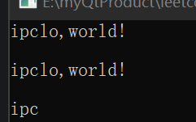

#### strncpy实现

#### strlen函数

​	是计算字符串长度的函数，返回从开始到'\0'之间的字符个数。

`sizeof计算字符串长度会加1`，自动添加'\0'

```c++
int main(){ 
  const char c[] = "12";
	cout << sizeof(c) << endl;//输出3
	cout << strlen(c);       //输出2
  
  char arr[10]={'1','2','3'};
  printf(" strlen(arr)=%d   sizeof(arr)=%d\n",strlen(arr),sizeof(arr)); //输出strlen 3， sizeof 10
  return 0;
}
```

## 6.10. memmove 和 memcpy的区别

1. memcpy和memmove都是C语言中的库函数，在头文件string.h中，作用是拷贝一定长度的内存的内容，原型分别如下：

   ```c++
    void *memcpy(void *dst, const void *src, size_t count);
    void *memmove(void *dst, const void *src, size_t count); 
   ```

   - 他们的作用是一样的，唯一的区别是，当内存发生局部重叠的时候，`memmove保证拷贝的结果是正确的`，memcpy不保证拷贝的结果的正确。

   ````c++
   void *memmove(void *dest, const void *src, size_t count){
     assert(dest != NULL || src != NULL)
       if (dst < src){//（memcpy没有if判断）
         char *p = (char *)dest;
         char *q = (char *)src;
         while (count--){
           *p++ = *q++;
         }
       }
     else{
       char *p = (char *)dest + count;
       char *q = (char *)src + count;
       while (count--){
         *--p = *--q;
       }
     }
     return dest;
   }
   ````

## `explicit`

explicit 关键字是用来`修饰构造函数或者类型转换函数`的，表示它们不能用于隐式转换或者拷贝初始化。explicit 的作用是防止一些不必要或者不合理的类型转换发生，提高代码的可读性和安全性。一般情况下，如果一个构造函数或者类型转换函数不希望被隐式调用，就应该加上 explicit 关键字。

举个例子，假设有一个类 Test，它有一个单参数的构造函数 Test(int)：

```cpp
class Test {
public:
    Test(int) {}
};
```

如果不加 explicit，那么这个构造函数就可以用于隐式转换，例如：

```cpp
void foo(Test t) {}

int main() {
    foo(10); // 隐式调用 Test(10)
    Test t = 20; // 拷贝初始化，隐式调用 Test(20)
}
```

这样可能会导致一些意想不到的结果，或者让人误解代码的意图。为了避免这种情况，可以在构造函数前加上 explicit：

```cpp
class Test {
public:
    explicit Test(int) {}
};
```

这样就禁止了隐式转换和拷贝初始化，只能显式地调用构造函数：

```cpp
void foo(Test t) {}

int main() {
    foo(Test(10)); // OK
    // foo(10); // 错误，不能隐式转换
    Test t = Test(20); // OK
    // Test t = 20; // 错误，不能拷贝初始化
}
```

从 C++11 开始，`explicit 还可以用于类型转换函数`，例如：

```cpp
class Test {
public:
    explicit operator bool() const;
};
```

这样就表示 Test 类型不能隐式地转换为 bool 类型，只能显式地调用类型转换函数：

```cpp
Test t;
if (t) {} // 错误，不能隐式转换为 bool
if (static_cast<bool>(t)) {} // OK
```

从 C++11 开始，`explicit 还可以用于多参数的构造函数`，例如：

```cpp
class Test {
public:
    explicit Test(int, int) {}
};
```

这样就表示 Test 类型不能用 {int, int} 进行隐式转换或者拷贝初始化，只能显式地调用构造函数：

```cpp
void foo(Test t) {}

int main() {
    foo(Test(10, 20)); // OK
    // foo({10, 20}); // 错误，不能隐式转换
    Test t = Test(30, 40); // OK
    // Test t = {30, 40}; // 错误，不能拷贝初始化
}
```

根据搜索结果[1](https://en.cppreference.com/w/cpp/language/explicit)[2](https://komorinfo.com/blog/cpp-explicit-specifier/)[3](https://blog.csdn.net/qq_35524916/article/details/58178072)[4](https://www.educba.com/c-plus-plus-explicit/)[5](https://www.cnblogs.com/winnersun/archive/2011/07/16/2108440.html)，我总结了以下几点：

- explicit 的作用是`防止不必要或者不合理的类型转换发生`，提高代码的可读性和安全性。
- explicit 可以用于单参数的构造函数或者除了第一个参数外其余参数都有默认值的多参构造函数，表示它们不能用于隐式转换或者拷贝初始化。
- explicit 可以用于`类型转换函数`，表示它们不能用于隐式转换。
- explicit 可以用于`多参数的构造函数`（C++11 起），表示它们不能用 { … } 进行隐式转换或者拷贝初始化。
- explicit 可以接受一个 `bool 类型的表达式（C++20 起）`，表示它们是否是 explicit 的取决于表达式的值。

# 7.   多态、虚函数

## 7.1.  虚函数和多态

多态的实现主要分为静态多态和动态多态，静态多态主要是重载，在编译的时候就已经确定；动态多态是用虚函数机制实现的，在运行期间动态绑定。举个例子：一个父类类型的指针指向一个子类对象时候，使用父类的指针去调用子类中重写了的父类中的虚函数的时候，会调用子类重写过后的函数，在父类中声明为加了virtual关键字的函数，在子类中重写时候不需要加virtual也是虚函数。

- 虚函数的实现：在有虚函数的类中，类的最开始部分是一个虚函数表的指针，这个指针指向一个虚函数表，表中放了虚函数的地址，实际的虚函数在代码段(.text)中。虚函数表存放在代码段的只读数据段。

- 当子类继承了父类的时候也会继承其虚函数表，当子类重写父类中虚函数时候，会将其继承到的虚函数表中的地址替换为重新写的函数地址。使用了虚函数，会增加访问内存开销，降低效率。

- 子类重写父类虚函数后，父类虚函数仍然可以通过子类调用。

- 不同子类继承同一父类时虚函数表不同。同一子类创建不同对象时虚函数表相同。

- 继承了多个父类会有多个虚函数表指针，如果父类有2张虚函数表，子类也会继承2张虚函数表。子类自己的虚函数表加在第一张虚函数表之后。

虚函数存储在对象开头，占4字节（32位）

同一个类，创造的不同对象，其虚指针的值是一样的，全都是指向该类的虚函数表。

## 7.2.  [虚继承](https://codeantenna.com/a/xMPwa2Aj7L)

`虚继承`主要用于`菱形`形式的继承形式，是为了在多继承的时候避免引发歧义，避免重复拷贝。重要概念是 **虚基类指针(vbptr)** 和 **虚基类表(vftable)**。

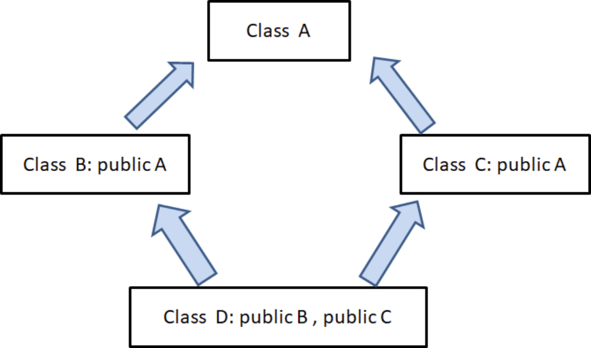

- `菱形继承`带来的问题： 从成员模型可以看出来，菱形继承有**数据冗余**和**数据二义性**的问题。在最下面的一层D类中，对象会有**2份**最上层对象A类里面的成员

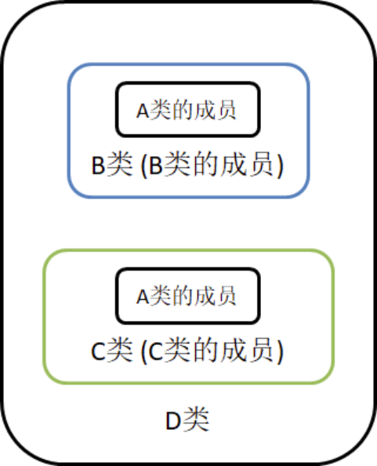

- 再来看一个例子，来看菱形继承所带来的问题

```c++
#include <iostream>
#include <string>

class Person {
public:
  std::string name;
};

class Student : public Person {
public:
  std::string No;
};

class Teacher : public Person {
public:
  std::string id;
};

class Course : public Student, public Teacher {
public:
  std::string course;
};

int main() {
  Course c;
  c.name = "tom"; // 二义性错误，无法明确访问是哪一个基类的name

  // 使用作用域解析运算符来解决二义性
  c.Student::name = "wang";
  c.Teacher::name = "lili";

  std::cout << "Student name: " << c.Student::name << "\n";
  std::cout << "Teacher name: " << c.Teacher::name << "\n";

  return 0;
}
```

`菱形虚拟继承`

- **菱形虚拟继承的概念**：
  菱形虚拟继承就是在多个类同时继承一个类的时候加上virtual关键字，使得父类的变量在全局只有一份，多个继承父类的类可以同时找到它并修改它
  作用就是： A类是父类， B,C类继承父类， D类继承B,C类。 那么A类的成员变量就在B和C类中，但是D类继承B,C类，A类的成员变量就在D类中有两份。菱形虚拟继承的作用是：**使得A类的成员变量在对象中只有一份**。
  **菱形虚拟继承的做法**：
  **在多个类同时需要继承同一个父类的时候，在继承方式前加上virtual关键字**。

```c++
class Person{
public:
	string name;
};
class Student :  virtual public Person   //学生类需要继承人这个类     加上virtual关键字，虚拟继承{
public:
 	string No;
};
class Teacher: virtual public Person    //老师类也需要继承人这个类     加上virtual关键字，虚拟继承{
public:
	string id;
};
class Course : public Student, public Teacher{
public:
	string course;
};
int main (){
	Course c;
	c.name = "tom"; //把name改为tom,所有类里面的name全都该为tom
}

```

```cpp
#include <iostream>

class Animal {
public:
    int age;
};

class Mammal : virtual public Animal {
public:
    void breathe() {
        std::cout << "Mammal: Breathing...\n";
    }
};

class WingedAnimal : virtual public Animal {
public:
    void flapWings() {
        std::cout << "WingedAnimal: Flapping wings...\n";
    }
};

class Bat : public Mammal, public WingedAnimal {
public:
    void fly() {
        std::cout << "Bat: Flying...\n";
    }
};

int main() {
    Bat bat;
    bat.age = 5;
    bat.breathe();
    bat.flapWings();
    bat.fly();

    std::cout << "Bat's age: " << bat.age << "\n";

    return 0;
}
```

- 总结：这样子，**就不会产生数据二义性了，和数据冗余了**，因为是继承，所有所有类里面都含有基类变量name。但是菱形虚拟继承做的是在所有类里面的name变量都是同一个。所有你Course类里面的name改变，所有类成员里面的name变量都是"tom"

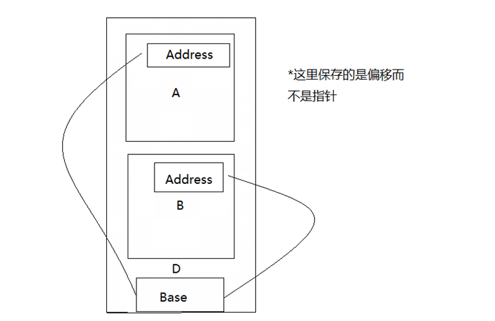

- 内存顺序：A的虚函数指针，A中Base偏移，A的数据，B的虚函数指针，B中Base偏移，B的数据，Base虚函数指针，Base数据。

## 虚菱形继承中的内存分布

```c++
class B {
 public:
  int ib;

 public:
  B(int i = 1) : ib(i) {}
  virtual void f() { cout << "B::f()" << endl; }
  virtual void Bf() { cout << "B::Bf()" << endl; }
};

class B1 : virtual public B {
 public:
  int ib1;

 public:
  B1(int i = 100) : ib1(i) {}
  virtual void f() { cout << "B1::f()" << endl; }
  virtual void f1() { cout << "B1::f1()" << endl; }
  virtual void Bf1() { cout << "B1::Bf1()" << endl; }
};

class B2 : virtual public B {
 public:
  int ib2;

 public:
  B2(int i = 1000) : ib2(i) {}
  virtual void f() { cout << "B2::f()" << endl; }
  virtual void f2() { cout << "B2::f2()" << endl; }
  virtual void Bf2() { cout << "B2::Bf2()" << endl; }
};

class D : public B1, public B2 {
 public:
  int id;

 public:
  D(int i = 10000) : id(i) {}
  virtual void f() { cout << "D::f()" << endl; }
  virtual void f1() { cout << "D::f1()" << endl; }
  virtual void f2() { cout << "D::f2()" << endl; }
  virtual void Df() { cout << "D::Df()" << endl; }
};
```

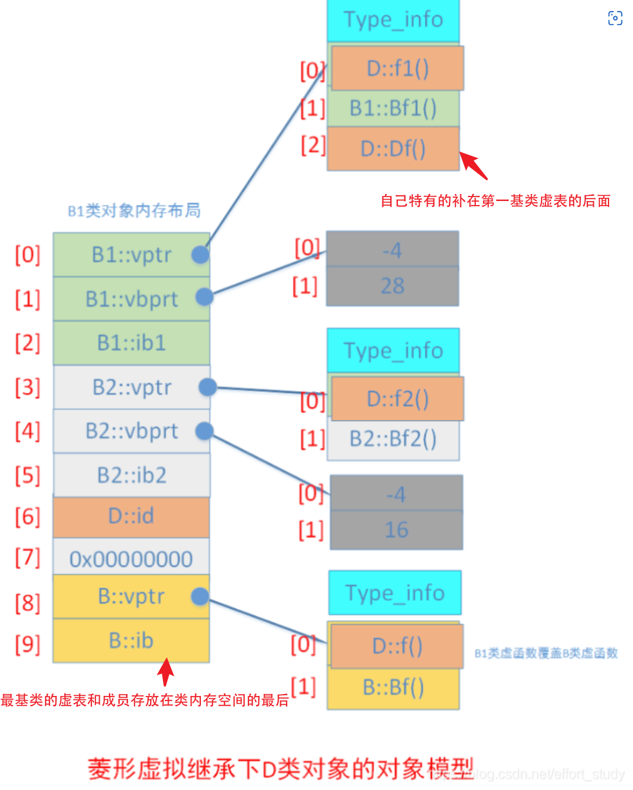

几个点:

1. 最底层的公共基类的虚表指针和成员放在最后
2. 从最底层的公共基类开始虚表中的函数替/换, 没有再查找第一直接基类, 第二直接基类...
3. 内存分布依次为: 第一直接基类的虚表和成员->第二直接基类的虚表和成员->自己的成员->最底层基类的虚表二号成员
4. 自己特有的虚函数. 加在第一直接基类的虚表的后面

## 7.3.  静态函数和虚函数的区别

- 静态函数在`编译的时候就已经确定运行时机`，虚函数在`运行的时候动态绑定`。虚函数因为用了虚函数表机制，调用的时候会增加一次内存开销

## 7.4.  [虚函数表具体是怎样实现运行时多态的?](http://c.biancheng.net/view/267.html)

- 子类若重写父类虚函数，`虚函数表中，该函数的地址会被替换`，对于存在虚函数的类的对象，在VS中，`对象的对象模型的头部存放指向虚函数表的指针`，通过该机制实现多态。

- 解释：

  ```c++
  class A{
  public:
      int i;
      virtual void func() {}
      virtual void func2() {}
  };
  class B : public A{
      int j;
      void func() {}
  };
  int main(){
      cout << sizeof(A) << ", " << sizeof(B);  //输出 8,12
      return 0;
  }
  ```

  > 在 32 位编译模式下，程序的运行结果是：
  > `8, 12`
  >
  > 如果将程序中的 virtual 关键字去掉，输出结果变为：
  > `4, 8`

  对比发现，有了虚函数以后，对象所占用的存储空间比没有虚函数时多了 4 个字节。实际上，任何有虚函数的类及其派生类的对象都包含这多出来的 4 个字节，这 4 个字节就是实现多态的关键——它位于对象存储空间的最前端，其中存放的是虚函数表的地址。

  每一个有虚函数的类（或有虚函数的类的派生类）都有一个虚函数表，该类的任何对象中都放着该虚函数表的指针（可以认为这是由编译器自动添加到构造函数中的指令完成的）。

  虚函数表是编译器生成的，程序运行时被载入内存。一个类的虚函数表中列出了该类的全部虚函数地址。例如，在上面的程序中，类 A 对象的存储空间以及虚函数表（假定类 A 还有其他虚函数）如图 1 所示。

  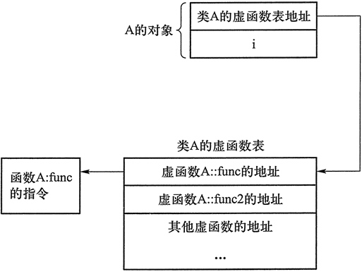


  类 B 对象的存储空间以及虚函数表（假定类 B 还有其他虚函数）如图 2 所示。

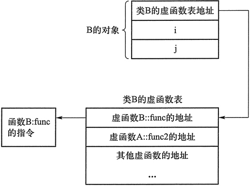

  多态的函数调用语句被编译成根据基类指针所指向的（或基类引用所引用的）对象中存放的虚函数表的地址，在虚函数表中查找虚函数地址，并调用虚函数的一系列指令。

  

## 7.5.  [纯虚函数](https://www.runoob.com/w3cnote/cpp-virtual-functions.html)

- 纯虚函数是在基类中声明的虚函数，它在基类中没有定义，但要求任何派生类`都要`定义自己的实现方法。在基类中实现纯虚函数的方法是在函数原型后`加 =0`:

  ````c++
  virtual void funtion1()=0
  ````

- 编译器要求在派生类中`必须予以重写`以实现多态性。同时含有纯虚拟函数的类称为`抽象类`，它`不能生成对象`。声明了纯虚函数的类是一个抽象类。所以，用户不能创建类的实例，只能创建它的派生类的实例。

## 7.6.  抽象类

1. **抽象类的定义**： 称带有纯虚函数的类为抽象类。

2. **抽象类的作用**： 抽象类的主要作用是将有关的操作作为结果接口组织在一个继承层次结构中，由它来`为派生类提供一个公共的根`，派生类将具体实现在其基类中作为接口的操作。所以派生类实际上刻画了一组子类的操作接口的通用语义，这些语义也传给子类，子类可以具体实现这些语义，也可以再将这些语义传给自己的子类。

3. **使用抽象类时注意：**

   抽象类只能作为基类来使用，其纯虚函数的实现由派生类给出。`如果派生类中没有重新定义纯虚函数，而只是继承基类的纯虚函数，则这个派生类仍然还是一个抽象类`。如果派生类中给出了基类纯虚函数的实现，则该派生类就不再是抽象类了，它是一个可以建立对象的具体的类。

## 7.7.  重载、覆盖（重写）、隐藏（重定义）

1. **重载：**

   两个函数名相同，但是`参数列表`不同（个数，类型），返回值类型没有要求，在同一作用域中。

   > ==<u>**只有返回值不同的话不会引起重载**</u>==

2. **重写：**
   - `子类继承了父类`，父类中的函数是虚函数，在子类中重新定义了这个虚函数，这种情况是重写。这样的函数地址是在运行期间绑定。需要函数返回值也相同。
   - （如果派生类在虚函数声明时使用了override描述符，那么该函数必须重载其基类中的同名函数，否则代码将无法通过编译）

3. **隐藏：**（重定义）
   - 如果派生类的函数与基类的函数同名，但参数不同，则无论有无virtual关键字，`基类的函数都被隐藏`。不存在子类和父类的同名函数重载。**<u>==（子和父的函数有不同的地方，那么肯定隐藏父的）==</u>**
   - 如果派生类的函数与基类的函数同名，并且参数也相同，但是基类函数没有virtual关键字，此时基类的函数被隐藏。**<u>==（子和父的函数完全相同，基类没有virtual，则父中虚函数被隐藏）==</u>**

## 7.8.  重写override的函数中包含有默认参数的情况，会发生动态绑定吗？

[不要重写父类函数的默认参数_DoronLee的博客-CSDN博客](https://blog.csdn.net/DoronLee/article/details/79128755)

> 不要重写父类的默认参数，因为重写了也没用！

因为默认参数的值要在`编译时确定`，所以是`early binding`，==<u>**默认参数**</u>==不会发生动态绑定。

（子类的默认参数值不会用上）

```c++
class Base{
public:
  virtual void f(int k) {}
};

class Derived:public Base{
public:
  void f(int k=1) {}    
};

int main(){
  Base *p = new Derived();
  p->f();//报错 参数是静态绑定的 所以调用的是base的f的参数类型，所以！没有默认参数 报错
}
//////////////////////////////////////////////////////////////
 
//如果基类也有默认参数，则可以运行子类函数（但是参数为父类默认参数）
class Base{
public:
  virtual void f(int k=2) {
    cout << k;
  }
};

class Derived:public Base{
public:
  void f(int k=1) {   
    cout << k;
    cout << "666";
  } 
};

int main(){
  Base *p = new Derived();
  p->f();//输出2 666
}
//////////////////////////////////////////////////////////////////

class Base{
public:
  virtual void f(int k) {
    cout << k;
  }
};

class Derived:public Base{
public:
  void f(int k=1) {   
    cout << k << endl;;
    cout << "666";
  } 
};

int main(){
  Base *p = new Derived();
  p->f(2);//输出2 666
}
```

==<u>**如下代码**</u>==

```c++
class Shape {
public:
  virtual void draw(int top = 1) { cout << top << endl; }
};
class Rect : public Shape {
public:
  virtual void draw(int top = 2) { cout << top << endl; }
};

int main() {
  Rect *rp = new Rect;
  Shape *sp = rp;
	//下面这两个函数都会调用rect的draw
  sp->draw(); //调用的是rect的draw，但默认参数是静态绑定的 所以用的是shape的draw的默认参数， 输出1；
  rp->draw(); //输出2
}
```


## 7.9.  [多继承情况下的内存布局？](https://m.nowcoder.com/answer/764869?tagId=&pos=1&type=0&onlyWrong=false&source=home)为什么会有自适应偏移？

对于多继承情况

考虑示例代码

```cpp
struct Base1 {...};
struct Base2 {...};
struct Derived : Base1, Base2 {...};
```

### 有如下内存布局

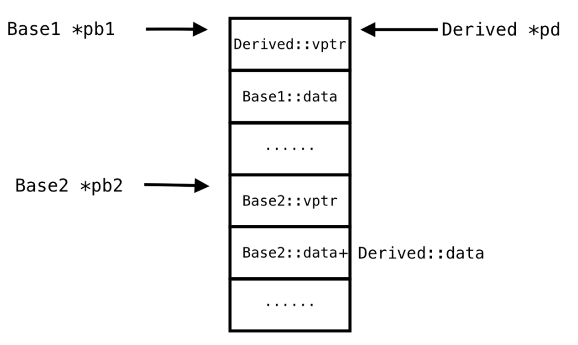

首先出现的是<u>`派生类Derived类的虚表指针vptr`</u>

> （这里插入一个提醒：
>
> 一直以来vptr都被国人翻译为虚函数表指针
>
> 但是vtbl英文原文是virtual table并非virtual function table
>
> 为什么呢
>
> 因为这个表不只是为了虚函数而准备的
>
> 一切虚拟化技术都会用这个表 包括 虚继承 RTTI等
>
> 所以当类本身与其直接间接基类内都未定义任何虚函数时也是有可能有虚表的
>
> 典型就是当前类继承了一个虚基类..提醒结束）

其次是<u>`第一直接基类的数据成员`</u>

然后是<u>`第二直接基类的虚表指针vptr`</u>

再次是<u>`第二直接基类的数据成员`</u>

如果还有后继直接基类 那么依此类推

### 解释

- 为何偏移0处是Derived类的vptr，而不是Base1的vptr

  > `因为非虚继承第一直接基类Base1与派生类Derived的基地址是一致的`
  >
  > **<u>==`Derived`的内存结构正是从Base1开始==</u>**
  >
  > 而对于	
  >
  > ```c++
  > Base1 *pb1 = new Derived;
  > pb1->polymorphicFunction();
  > ```
  >
  > 这样的多态引用
  >
  > 事实上我们也是用的Derived的虚表vtbl
  >
  > 因为Derived的vtbl和Base1的vtbl已经**<u>==融为一体==</u>**了
  >
  > 也就是说从Derived的vtbl中完全可以查到从Base1继承下来的虚函数
  >
  > 以及覆盖Base1的虚函数

- 对于Base2来说

  > 事实上图中所示的Base2::vptr并不是指向Base2类的vtbl
  >
  > 而是指向Derived类的vtbl中的一个thunk地址
  >
  > 这个所谓的thunk地址又指向一段汇编码
  >
  > 这段thunk汇编码负责做两件事：
  >
  > 1. 跳转到vtbl中正确的虚函数(也就是Derived的虚函数)地址所在的内存单元
  >
  > 2. 修改this指针使其指向Derived对象，并传入上一步检索到的虚函数中
  >
  >    
  >
  > `通过这个thunk策略`
  >
  > `编译器实现了C++的多态性`
  >
  > 举个例子
  >
  > ```cpp
  > Base2 *pb2 = new Derived;
  > delete pb2;
  > ```
  >
  > 此时使用pb2调用虚析构函数时
  >
  > 通过Base2::vptr跳转到了thunk汇编代码
  >
  > 执行thunk后跳转到vtbl中Derived::~Derived()所在的槽位
  >
  > 然后把当前指向Base2子对象部分的的this指针
  >
  > 添加适当偏移使其指向Derived对象的内存首地址
  >
  > 然后传入并调用Derived::~Derived()
  >
  > 从而实现了Base2 *pb2和事实对象类Derived的动态绑定


<u>父类1的虚函数表-父类1成员-父类2的虚函数表-父类2成员。。。</u>

<u>（派生类自己的虚函数记录在`第一张虚函数表末尾`，如果父类有2张虚函数表，则子类会继承2张虚函数表）</u>

### [C++ 虚函数表图解](https://blog.51cto.com/u_15295315/2999213)

###  虚表布局设计思想：

1. 表结构保护了Base1和Base2这些直接基类的vtbl结构，这样就能保持执行多态操作时的一致性，按照相应基类中虚函数的声明顺序完成固定偏移就能寻址到想要的虚函数

2. 将派生类覆盖了的虚函数叠加到第一直接基类Base1上面，符合Derived和Base1内存空间偏移一致的设计惯例。同时也`使得Base1中不需要thunk来完成跳转`

3. 非第一直接基类的vtbl区域里被覆盖的虚函数都需要`thunk来处理`跳转以及this指针的重定位

### c++多重继承的子类为何要使用多个虚函数表？

如果基类的虚函数表是`分开`2个的话，那上面的将父类指针指向子类对象的操作，`编译器只需要做一些指针偏移`，就可以得到正确的结果。把基类对象在子类对象的内存布局中完全分开可以更高效地实现父子类之间的转换。

## 7.10. 同时定义了两个函数，一个带const，一个不带，会有问题吗？

不会，这**<u>==相当于函数的重载==</u>**。

````c++
class A { 
 void fun() const {}
 void fun() {} 
};
````

（这里的两个函数指的是一个类中两个成员函数，带const，const是放在函数后面的，也就是对this指针做const限定。所以说是重载）

> 可以这样理解 this指针可以看做一个`隐形的传入成员函数的指针`，是一个`参数`，所以<u>对形参的const限定与否触发了函数的重载</u>
>
> 而 const如果写在右边 那么就是返回值不同了 前面提到，单单的返回值不同并不能触发重载

## 7.11. 动态绑定

### [C++中的静态绑定和动态绑定](https://www.cnblogs.com/lizhenghn/p/3657717.html)

- 找到`函数名对应的地址`，然后将`函数调用处用该地址替换`，这称为函数绑定，或符号决议。

- 一般情况下，在`编译期间（包括链接期间）就能完成符号决议`，不用等到程序执行时再进行额外的操作，这称为静态绑定。如果编译期间不能完成符号决议，就必须在`程序执行期间完成`，这称为动态绑定。

> - 静态类型：对象在声明时采用的类型，在编译期既已确定；
> - 动态类型：通常是指一个指针或引用目前所指对象的类型，是在运行期决定的；
> - 静态绑定：绑定的是静态类型，所对应的函数或属性依赖于对象的静态类型，发生在编译期；
> - 动态绑定：绑定的是动态类型，所对应的函数或属性依赖于对象的动态类型，发生在运行期；

从上面的定义也可以看出，`非虚函数一般都是静态绑定`，而**<u>==虚函数都是动态绑定==</u>**（如此才可实现多态性）。
先看代码和运行结果：

```c++
class A {
public:
  /*virtual*/ void func() { std::cout << "A::func()\n"; }
};

class B : public A {
public:
  void func() { std::cout << "B::func()\n"; }
};

class C : public A {
public:
  void func() { std::cout << "C::func()\n"; }
};
```

<u>**==动态类型可以更改 静态类型不可修改==**</u>

``````c++
C* pc = new C(); //pc的静态类型是它声明的类型C*，动态类型也是C*；
B* pb = new B(); //pb的静态类型和动态类型也都是B*；
A* pa = pc;      //pa的静态类型是它声明的类型A*，动态类型是pa所指向的对象pc的类型C*；
pa = pb;         //pa的动态类型可以更改，现在它的动态类型是B*，但其静态类型仍是声明时候的A*；
C *pnull = NULL; //pnull的静态类型是它声明的类型C*,没有动态类型，因为它指向了NULL；

pa->func();      //A::func() pa的静态类型永远都是A*，不管其指向的是哪个子类，都是直接调用A::func()；
pc->func();      //C::func() pc的动、静态类型都是C*，因此调用C::func()；
pnull->func();   //C::func() 不用奇怪为什么空指针也可以调用函数，因为这在编译期就确定了，和指针空不空没关系；
``````

 如果注释掉类C中的func函数定义，其他不变，即

```c++
class C : public A
{
};

pa->func();      //A::func() 理由同上；
pc->func();      //A::func() pc在类C中找不到func的定义，因此到其基类中寻找； ||||||||||||||||||||||||||||||||||||
pnull->func();   //A::func() 原因也解释过了；
```

如果为A中的void func()函数添加virtual特性，其他不变，即

```c++
class A{
public:
    virtual void func(){ std::cout << "A::func()\n"; }
};

pa->func();      //B::func() 因为有了virtual虚函数特性，pa的动态类型指向B*，因此先在B中查找，找到后直接调用；
pc->func();      //C::func() pc的动、静态类型都是C*，因此也是先在C中查找；
pnull->func();   //空指针异常，因为是func是virtual函数，因此对func的调用只能等到运行期才能确定，然后才发现pnull是空指针；
```

### 静态绑定和动态绑定的区别：

> 1. 静态绑定发生在编译期，动态绑定发生在运行期；
> 2.  对象的动态类型可以更改，但是静态类型无法更改；
> 3. 要想实现动态，必须使用动态绑定；
> 4. 在继承体系中只有虚函数使用的是动态绑定，其他的全部是静态绑定；

```c++
class E{
public:
    virtual void func(int i = 0)
    {
        std::cout << "E::func()\t"<< i <<"\n";
    }
};
class F : public E{
public:
    virtual void func(int i = 1)
    {
        std::cout << "F::func()\t" << i <<"\n";
    }
};

void test2(){
    F* pf = new F();
    E* pe = pf;
    pf->func(); //F::func() 1  正常，就该如此；
    pe->func(); //F::func() 0  哇哦，这是什么情况，调用了子类的函数，却使用了基类中参数的默认值！
}
```

#### 出现这个现象的原因

绝对不要重新定义一个继承而来的virtual函数的缺省参数值，因为`缺省参数值都是静态绑定（为了执行效率）`，而`virtual函数却是动态绑定`。

## `如何不用虚函数实现虚函数的功能`

==答: 使用function闭包 包装lamda捕获this指针==

> 为什么function可以而函数指针不行?
>
> 因为实现动态多态主要就是对类的this指针进行捕获, 函数指针确定了形参就无法更改, 没法动态绑定派生类的this指针
>
> 而function可以包装`lamda`函数, 而lamda可以`对this指针进行捕获` 从而实现多态

```c++
typedef void (*functionPtr)(void);
class Animal {
 public:
  Animal() {}
  ~Animal() {}
  void call() {
    // ptr();
    ftr();
  }

 protected:
  functionPtr ptr;
  function<void(void)> ftr;
};

class Cat : public Animal {
 public:
  Cat() {
    // this->ptr = catCall;  //绑定失败 因为形参有this, 参数不同
    // 重点是使用lamda捕获this指针 然后function绑定lamda
    ftr = [=]() { this->catCall(); };
  }
  ~Cat() {}

 private:
  void catCall() { cout << "cat call" << endl; }
};

class Dog : public Animal {
 public:
  Dog() {
    // this->ptr = catCall;  //绑定失败 因为形参有this, 参数不同
    // 重点是使用lamda捕获this指针 然后function绑定lamda
    ftr = [=]() { this->dogCall(); };
  }
  ~Dog() {}

 private:
  void dogCall() { cout << "dog call" << endl; }
};

int main() {
  Animal *animal = new Dog;
  animal->call();  // dog call
  animal = new Cat();
  animal->call();  // cat call
  return 0;
}
```

### std::function

#### C++函数种类

C++中的函数种类很多：

- 函数
- 函数指针
- Lambda函数
- bind创建的对象
- 仿函数（重载了函数调用运算符的类）

但这些函数可能共享一种调用方式。调用形式指明了调用返回的类型以及传递给调用的实参类型。比如：`int(int, int);`

#### 使用function

std::function是一个通用的多态函数包装器，可以调用普通函数、[Lambda](https://so.csdn.net/so/search?q=Lambda&spm=1001.2101.3001.7020)函数、仿函数、bind对象、类的成员函数和指向数据成员的指针，function定义在名为`function.h`头文件中。是一个模板，在创建function实例时，必须指明类型，如：

```sql
function<int(int, int)>
```

这里声明了一个function类型，它可以表示接受两个int、返回一个int的可调用函数。

[==C++11的function函数对象==](https://blog.csdn.net/WindSunLike/article/details/106679311)

##### **function可以将普通函数，lambda表达式和函数对象类统一起来。它们并不是相同的类型，然而通过function模板类，可以转化为相同类型的对象（function对象），从而放入一个map里**，从而方便使用。


### std::bind

可将std::bind函数看作一个通用的函数适配器，它接受一个可调用对象，生成一个新的可调用对象来“适应”原对象的参数列表。

std::bind将可调用对象与其参数一起进行绑定，绑定后的结果可以使用std::function保存。std::bind主要有以下两个作用：

- `将可调用对象和其参数绑定成一个仿函数`；
- `只绑定部分参数，减少可调用对象传入的参数`。

#### std::bind绑定普通函数

```cpp
double my_divide (double x, double y) {return x/y;}
auto fn_half = std::bind (my_divide,_1,2);  
std::cout << fn_half(10) << '\n';                        // 5
```

- bind的第一个参数是函数名，普通函数做实参时，会隐式转换成函数指针。因此std::bind (my_divide, _ 1,2) 等价于std::bind ( &my_divide,_1,2)；
- _ 1表示占位符，位于< functional>中，std::placeholders::_1；


# 8.   函数调用、程序运行、栈

## 8.1. [ 在main执行之前和之后执行的代码可能是什么？](https://interviewguide.cn/#/Doc/Knowledge/C++/基础语法/基础语法?id=1、-在main执行之前和之后执行的代码可能是什么？)

**main函数执行之前**，主要就是初始化系统相关资源：

- 设置栈指针
- 初始化静态`static`变量和`global`全局变量，即`.data`段的内容
- 将未初始化部分的全局变量赋初值：数值型`short`，`int`，`long`等为`0`，`bool`为`FALSE`，指针为`NULL`等等，即`.bss`段的内容
- <u>全局对象初始化，在`main`之前调用构造函数，这是可能会执行前的一些代码</u>
- 将main函数的参数`argc`，`argv`等传递给`main`函数，然后才真正运行`main`函数
- `__attribute__((constructor))`

**main函数执行之后**：

- 全局对象的析构函数会在main函数之后执行；

- 可以用 **`atexit`** 注册一个函数，它会在main 之后执行;

- `__attribute__((destructor))`

  

### 写个函数在main函数执行前先运行

```c++
class TestClas{
public:
  TestClass();
};

TestClass::TestClass(){
cout << "TestClass" << endl;
}

TestClass Ts;//定义个全局变量，让类里面的代码在main之前执行

int main(){}
```

## 8.2.  C语言参数压栈顺序？

<u>==从右到左==</u>   **压栈顺序主要考虑出栈读取**

printf函数的原型是：printf（const char* format,…）

它是一个不定参函数，那么我们在实际使用中是怎么样知道它的参数个数呢？这就要靠format了，编译器通过format中的%占位符的个数来确定参数的个数。

现在我们假设参数的压栈顺序是从左到右的，这时，函数调用的时候，format最先进栈，之后是各个参数进栈，最后pc进栈，此时，由于format先进栈了，上面压着未知个数的参数，想要知道参数的个数，必须找到format，而要找到format，必须要知道参数的个数，这样就陷入了一个无法求解的死循环了！！

## 8.3.  函数的默认参数为什么必须放在最后

1. 结构上：`参数从右到左压栈，调用函数时参数从左到右赋值。`
2. 应用上：把设定==默认值的形参放在最右边==可以让函数少传参还能正常执行
3. 如果默认参数在左边还需要占位, 太麻烦了

```c++
int sum(int a = 10, int b){
	return a+b;
} // sum(1); 怎么调用? 如果强行说按照个数匹配的话
//那这样的呢?
int sum(int a = 10, int b = 5){
  return a+b;
}// sum(1); 怎么调用? 加个占位符?
```

## 8.4.  [函数栈帧内存的分布](https://segmentfault.com/a/1190000017151354)

编程语言离不开函数，函数是对一段代码的封装，往往实现了某个特定的功能，在程序中可以多次调用这个函数。稍有编程经验的同学都知道，函数是由栈实现的，调用对应入栈，退出对应出栈。在写递归函数的时候，如果递归层次太深会出现栈溢出（StackOverFlow）的错误。

"函数栈"包含了对函数调用的基本理解，但是从细节来看，还有很多疑问，例如：

- 函数的栈是如何开辟的？
- 如何传入参数？
- 返回值是如何得到的？

本文以 C 语言为例，从内存布局、汇编代码的角度来分析函数栈的实现原理。

### Linux 进程内存布局

当程序被执行的时候，Linux 会为其在内存中分配相应的空间以支撑程序的运行，如下图所示。


在虚拟内存中，内存空间被分为多个区域。代码指令保存在文本段，已初始化的全局变量 `global` 保存在数据段，程序运行中动态申请的内存`malloc(10 * char())`放在堆中，而函数执行的时候则在栈中开辟空间运行。例如`main`函数便占有一个函数栈，其中的变量`i`和`ip`都保存在`main`的栈空间中。

<u>函数的栈空间有个名字叫做 `栈帧`，</u>下面就具体了解一下栈帧。

### 栈帧

下图是栈的结构。图中右侧是栈空间，其中有多个栈帧。从上往下由较早的栈帧到较新的栈帧，由于栈是从高地址往低地址生长的，所以最新的栈永远在最下面，即栈顶。


图中有两个画出了具体结构的栈帧，分别是函数 A 和函数 B。函数 A 的栈帧最上面有一块省略号标识的区域，其中保存的是上一个栈帧的寄存器值以及函数 A 自己内部创建的局部变量。下面的参数 n 到参数 1 则是函数 A 要传给函数 B 的调用参数。那么函数 B 如何获取？答案是用寄存器。

CPU 计算时会把很多变量放在寄存器中，根据硬件体系的不同，寄存器数量和作用也不同。<u>一般在 x86 32位中，寄存器 `%esp` 保存了栈指针的值，也就是栈顶，而 `%ebp` 作为当前栈帧的帧指针，也就是当前栈帧的底部，所以通过 `%esp` 和 `%ebp` 就可以知道当前栈帧的头跟尾。除了这两个寄存器，还有其它一些通用寄存器（`%eax`、`%edx`等），用于保存程序执行的临时值。</u>

了解了寄存器的基本知识后，下面我们就可以知道函数 B 如何获取到函数 A 传给它的参数了。参数 1 的地址是 `%ebp + 8`，参数 2 的地址是 `%ebp + 12`，参数 n 的地址是 `%ebp + 4 + 4 * n`。相信大家已经看明白，通过帧指针往上找就可以取得这些参数，而这些参数之所以在这里当然是函数 A 预先准备好的，关于这一点下文会有例子。

另外在所有参数的最下面保存着 `返回地址`，这个是在函数 B 返回之后接下来要执行的指令的地址。

看了函数 A 之后，再看看函数 B。在函数 B 的栈帧最上面是 `被保存的 %ebp`，这个指的是函数 A 的帧指针，毕竟 `%ebp` 这个寄存器就一个，所以新的函数入栈的时候要先把老的保存起来，等函数出栈再恢复。在这个老的帧指针下面则是其它需要保存的寄存器变量以及函数 B 自己内部用到的局部变量。再往下是 `参数构造区域`，也就是函数 B 即将调用另一个函数，在这里先把参数准备好。可以看出，函数 B 与函数 A 的栈帧结构是类似的。

了解了栈帧的理论之后，大家可能会觉得很抽象，下面结合具体实例来看栈帧从产生到消亡的过程。

### 函数调用实例

下面图是函数 `caller` 的具体执行过程，左边是 C 代码，中间是汇编码，右边是对应的栈帧。


我们一行一行的来分析，看中间汇编码，上面三行绿色的：

```perl
pushl %ebp // 保存旧的 %ebp
movl %esp, %ebp // 将 %ebp 设置为 %esp
subl $24, %esp // 将 %esp 减 24 开辟栈空间
```

这三行其实是为栈帧做准备工作。第一行保存旧的 `%ebp`，此时新的栈空间还没有创建，但保存旧的 `%ebp` 的这一行空间将作为新栈帧的栈底，也就是帧指针，因此第二行将栈指针 `%esp`（永远指向栈顶）的值设置到 `%ebp` 上。 第三行将 `%esp` 下移 24 个字节，这一行其实就是为函数 `caller` 开辟栈空间了。从图中可以看出，下面的空间用于保存 `caller` 中的变量以及传给下个函数的参数。有部分空间未使用，这个是为了地址对齐，不影响我们的分析，可以忽略。

在开辟了栈帧之后，就开始执行 `caller` 内部的逻辑了，`caller` 首先创建了两个局部变量（`arg1`和`arg2`）。对应的汇编代码为 `movl $534, -4(%ebp); movl $1057, -8(%ebp)`，其中 `-4(%ebp)` 表示 `%ebp - 4` 的位置，也就是图中 `arg1` 所在的位置， `arg2` 的位置则是 `%ebp - 8` 的位置。这两行是把 `534` 和 `1057` 保存到传送到这两个位置上。

继续往下是这几行：

```perl
leal -8(%ebp), %eax // 把 %ebp - 8 这个地址保存到 %eax 
movl %eax, 4(%esp)  // 把 %eax 的值保存到 %esp + 4 这个位置上
leal -4(%ebp), %eax  // 把 %ebp - 4 这个地址保存到 %eax 
movl %eax, ($esp)  // 把 %eax 的值保存到 %esp 这个位置上
```

第一行把 `%ebp - 8` 这个地址保存到 `%eax` 中，而 `%ebp - 8` 是 `arg2` 的地址，下一行把这个地址放到 `%esp + 4` 这个位置上，也就是图中 `&arg2` 的那个区域块。其实这一行是在为函数 `swap_add` 准备参数 `&arg2`，而下面两行则是准备参数 `&arg1`。

再下面一行是 `call swap_add`。这一行就是调用函数 `swap_add` 了，不过在这之前还需要把返回地址压到栈上，这里的返回地址是函数 `swap_add` 返回后要接着执行的代码的地址，也就是 `int diff = arg1 - arg2` 地址。

在调用 `swap_add` 后用到了其返回值 `sum` 继续进行计算，我们还不知道返回值是怎么拿到的。在这之前，我们先进入 `swap_add` 函数，下面是对应的代码执行图：


`swap_add` 对应的汇编代码的前三行与 `caller` 类似，同样是保存旧的帧指针，但是因为 `swap_add` 不需要保存额外的变量，只需要多用一个寄存器 `%ebx`，所以这里保存了这个寄存器的旧值，但是没有将 `%esp` 直接下移一段长度的操作。

接下来绿色的两行就是关键了：

```perl
movl 8(%ebp), %edx // 从 %ebp + 8 取值保存到 %edx
movl 12(%ebp), %ecx // 从 %ebp + 12 取值保存到 %ecx
```

这两行分别是从 `caller` 中保存参数 `&arg1` 和 `&arg2` 的地方取得地址值，并根据地址取得 `arg1`和`arg2` 的实际数值。

接下来的 4 行是交换操作，这里就不具体看每一行的逻辑了。

再下面一行 `addl %ebx, %eax` 是将返回值保存到寄存器 `%eax` 中，这里非常关键，**函数 `swap_add` 的返回值保存在 `%eax` 中**，一会儿 `caller` 就是从这个寄存器获取的。

`swap_add` 的最后几行是出栈操作，将 `%ebx` 和 `%ebp` 分别恢复为 `caller` 中的值。最后执行 `ret` 返回到 `caller` 中。

下面我们继续回到 `caller` 中，刚才执行到 `call swap_add`，下面几行是执行 `int diff = arg1 - arg2`，结果保存在 `%edx` 中。

最后一行是计算 `sum * diff`，对应的汇编代码为 `imull %edx, %eax`。这里是把 `%edx` 和 `%eax` 的值相乘并且把结果保存到 `%eax` 中。在上面的分析中，我们知道 `%eax` 保存着 `swap_add` 的返回值，这里还是从 `%eax` 中取出返回值进行计算，并且把结果继续保存到 `%eax` 中，而这个值又是 `caller` 的返回值，这样调用 `caller` 的函数也可以从这个寄存器中获取返回值了。

`caller` 函数的最后一行汇编代码是 `ret`，这会销毁 `caller` 的栈帧并且恢复相应寄存器的旧值。到此，`caller` 和 `swap_add` 这个函数的调用过程就全部分析完了。


寄存器ebp和esp来保存栈底地址和栈顶地址

eip专门记录下一条指令的寄存器

每当执行一条指令，eip寄存器加上相应指令的长度，这样每一条指令执行完成后，eip都执向下一条指令的地址。只要能够保存函数调用前，下一句代码的地址，这样在函数执行完成后将这个地址赋值给eip寄存器，就能够回到调用者的位置，这是函数实现的基本依据。


 

\1. 首先从右至左将被调用函数的参数压入栈中

\2. 然后调用call指令保存eip寄存器的值，然后跳转到函数代码

 

\3. 将上一个函数的栈底地址ebp的值压入栈中

\4. 将此时esp的值保存到ebp中，作为该函数的函数栈的栈底地址


\5. 根据函数中局部变量的个数抬高esp的值并初始化这段栈空间

\6. 将其余寄存器的值压栈


\7. 执行函数代码

\8. 通过eax或者内存拷贝的方式保存返回值

\9. 将上面保存的寄存器的值出栈

\10. 执行esp = ebp，时esp指向函数栈的栈底

\11. pop ebp 还原之前保存的值，使ebp指向调用者的函数栈栈底

\12. ret 返回或者ret n(n为整数)指令返回到调用者的下一句代码

## 8.5.  C语言是怎么进行函数调用的？

每一个函数调用都会分配函数栈，在栈内进行函数执行过程。==????==

1. 将被调用函数的参数按照`从右到左的顺序压入栈`中,**<u>==再把返回地址压栈==</u>**
2. 调用call指令保存eip寄存器的值，然后跳转到函数代码
3. 然后把当前函数的esp指针压栈。
4. 将调用者的 %ebp 压入栈
5. 将 %esp 的值赋给 %ebp。
6. 根据函数中局部变量的个数抬高esp的值并初始化这段栈空间
7. 将其余寄存器的值压栈

> 1. 将调用者的 %ebp 压入栈
> 2. 将 %esp 的值赋给 %ebp。
> 3. 根据函数中局部变量的个数抬高esp的值并初始化这段栈空间

 

## 8.6.  C++如何处理返回值？

[写的很好的一个博客](https://blog.csdn.net/m0_37836661/article/details/106490987)

执行某个函数时，如果有参数，则在**栈上**为形式参数分配空间（如果是引用类型的参数则类外），继续进入到函数体内部，如果遇到变量，则按情况为变量在不同的存储区域分配空间（如果是static类型的变量，则是在进行编译的过程中已经就分配了空间），函数内的语句执行完后，如果函数没有返回值，则直接返回调用该函数的地方（即执行远点），如果存在返回值，则**先将返回值进行拷贝传回**，再返回执行远点，函数全部执行完毕后，进行退栈操作，将刚才函数内部在栈上申请的内存空间释放掉。

<u>函数的返回值用于**初始化在调用函数时创建的临时对象**(temporary object)，如果返回类型不是引用，在调用函数的地方会将函数返回值复制给临时对象。</u>

> - char（8bit）：寄存器a1
> - short（16bit）：寄存器ax
> - int（32bit）：寄存器eax     如果是64位，那么就是存放在eax和edx中了，高位在edx，低位在eax。
> - double（64bit）：协处理器堆栈
> - 指针、引用：寄存器eax
> - 类的对象且体积超过64bit：主调函数会在函数栈上创建临时对象存放

## 8.7.  C++函数栈空间的最大值

默认是1M，不过可以调整

 

## 8.8.  [C++中的RTTI机制 - 简书](https://www.jianshu.com/p/3b4a80adffa7)

RTTI(Run Time Type Identification)即**<u>==通过运行时类型识别==</u>**，程序能够使用基类的指针或引用来检查着这些指针或引用所指的对象的实际派生类型。

RTTI提供了两个非常有用的操作符：typeid和dynamic_cast。

> typeid操作符，**<u>==返回指针和引用所指的实际类型==</u>**；
>
> ```c++
> #include <iostream>
> #include <typeinfo>
> using namespace std;
> 
> class A{
> public:
>      void Print() { cout<<"This is class A."<<endl; }
> };
> 
> class B : public A{
> public:
>      void Print() { cout<<"This is class B."<<endl; }
> };
> 
> struct C{
>      void Print() { cout<<"This is struct C."<<endl; }
> };
> int main()
> {
>      short s = 2;
>      unsigned ui = 10;
>      int i = 10;
>      char ch = 'a';
>      wchar_t wch = L'b';
>      float f = 1.0f;
>      double d = 2;
> 
>      cout<<typeid(s).name()<<endl; // short
>      cout<<typeid(ui).name()<<endl; // unsigned int
>      cout<<typeid(i).name()<<endl; // int
>      cout<<typeid(ch).name()<<endl; // char
>      cout<<typeid(wch).name()<<endl; // wchar_t
>      cout<<typeid(f).name()<<endl; // float
>      cout<<typeid(d).name()<<endl; // double
>     
>      A *pA1 = new A();
>      A a2;
> 
>      cout<<typeid(pA1).name()<<endl; // class A *
>      cout<<typeid(a2).name()<<endl; // class A
> 
>      B *pB1 = new B();
>      cout<<typeid(pB1).name()<<endl; // class B *
> 
>      C *pC1 = new C();
>      C c2;
> 
>      cout<<typeid(pC1).name()<<endl; // struct C *
>      cout<<typeid(c2).name()<<endl; // struct C
>     
>      return 0;
> }
> ```
>
> dynamic_cast操作符，**<u>==将基类类型的指针或引用安全地转换为其派生类类型的指针或引用==</u>**。
>
> ```c++
> #include <iostream>
> #include <typeinfo>
> using namespace std;
> 
> class A
> {
> public:
>      virtual void Print() { cout<<"This is class A."<<endl; }
> };
> 
> class B
> {
> public:
>      virtual void Print() { cout<<"This is class B."<<endl; }
> };
> 
> class C : public A, public B
> {
> public:
>      void Print() { cout<<"This is C."<<endl; }
>      void Printt() { cout << "This is Cc." << endl; }
> };
> 
> int main()
> {
>      A *pA = new C;
>      //C *pC = pA; // Wrong 编译器会提示错误
>      C *pC = dynamic_cast<C *>(pA);
>      if (pC != NULL)
>      {
>           pC->Print();  // This is C.
>           pC->Printt(); // Tiis is Cc.
>      }
>      delete pA;
> }
> ```

 

运行时类型检查，在C++层面主要体现在dynamic_cast和typeid,VS中虚函数表的-1位置存放了指向type_info的指针。对于存在虚函数的类型，typeid和dynamic_cast都会去查询type_info。

在执行dynamic_cast时，两个type_info会被交给runtime library函数，比较之后告诉我们是否吻合。如果吻合，返回转换后的指针；否则返回nullptr。

在 type_info 类中，拷贝构造函数和赋值运算符重载都被删除（C++11），同时也没有默认的构造函数（一个类只有一个type信息）<u>。==**typeid使用友元返回type_info引用**==</u>

程序中创建type_info对象的唯一方法是使用typeid操作符（由此可见，如果把typeid看作函数的话，其应该是type_info的友元）

如果表达式的类型是类类型且至少包含有一个虚函数，则typeid操作符返回表达式的动态类型，需要在运行时计算；否则，typeid操作符返回表达式的静态类型，在编译时就可以计算。

## 8.9.  在什么情况下你应该使用dynamic_cast替代虚函数?

如果我们需要在派生类中增加新的成员函数f，但又无法取得基类的源代码，因而无法在基类中增加相应的虚函数，这时，可以在派生类中增加非虚成员函数。但这样一来，就无法用基类指针调用函数f。如果在程序中需要通过基类指针(如使用该继承层次的某个类中所包含的指向基类对象的指针数据成员p)来调用f，则必须使用dynamic_cast将p转换为指向派生类的指针，才能调用f。也就是说，如果无法为基类增加虚函数，就可以使用dynamic_cast 代替虚函数。

> **<u>==由于种种原因（父类不可修改或不可获得）需要使用父类指针调用子类中的非虚函数时==</u>**

## 8.10. include头文件的顺序以及双引号””和尖括号<>的区别？

- Include头文件的顺序：对于include的头文件来说，如果在文件a.h中声明一个在文件b.h中定义的变量，而不引用b.h。那么要在a.c文件中引用b.h文件，并且要先引用b.h，后引用a.h,否则汇报变量类型未声明错误。

- 双引号和尖括号的区别：编译器预处理阶段`查找头文件的路径`不一样。**<u>==双引号先对当前文件目录进行查找==</u>**

  1. 对于使用双引号包含的头文件，查找头文件路径的顺序为：

     `当前头文件目录`-><u>编译器设置的头文件路径</u>（编译器可使用-I显式指定搜索路径）-><u>系统变量CPLUS_ INCLUDE_ PATH/C_ INCLUDE_PATH指定的头文件路径</u>

  2. 对于使用尖括号包含的头文件，查找头文件的路径顺序为：

     编译器设置的头文件路径（编译器可使用-I显式指定搜索路径）->`系统变量`<u>CPLUS_INCLUDE _PATH</u>/C_INCLUDE_PATH指定的头文件路径

## 8.11. `源码到可执行文件的过程`


- 预编译(.i)

  > <u>预编译程序所完成的基本上是对源程序的“`替代`”工作</u>

  主要处理源代码文件中的以“#”开头的预编译指令。处理规则见下

  1. 删除所有的#define，`展开所有的宏定义`。
  2. 处理所有的条件`预编译指令`，如“#if”、“#endif”、“#ifdef”、“#elif”和“#else”。
  3. 处理“#include”预编译指令，将文件内容替换到它的位置，这个过程是递归进行的，文件中包含其他文件。
  4. 删除所有的注释，“//”和“/**/”。
  5. 保留所有的#pragma 编译器指令，编译器需要用到他们，如：#pragma once 是为了防止有文件被重复引用。
  6. 添加行号和文件标识，便于编译时编译器产生调试用的行号信息，和编译时产生编译错误或警告时能够显示行号。

- 编译(.s)

  > <u>把预编译后的代码进行词法,语法,语义分析和优化 得到`汇编代码`</u>

  把预编译之后生成的xxx.i或xxx.ii文件，进行一系列词法分析、语法分析、语义分析及优化后，生成相应的`汇编代码文件`。

  1. 词法分析：利用类似于“有限状态机”的算法，将源代码程序输入到扫描机中，将其中的字符序列分割成一系列的记号。
  2. 语法分析：语法分析器对由扫描器产生的记号，进行语法分析，产生语法树。由语法分析器输出的语法树是一种以表达式为节点的树。
  3. 语义分析：语法分析器只是完成了对表达式语法层面的分析，语义分析器则对表达式是否有意义进行判断，其分析的语义是静态语义——在编译期能分期的语义，相对应的动态语义是在运行期才能确定的语义。
  4. 优化：源代码级别的一个优化过程。
  5. 目标代码生成：由代码生成器将中间代码转换成目标机器代码，生成一系列的代码序列——汇编语言表示。
  6. 目标代码优化：目标代码优化器对上述的目标机器代码进行优化：寻找合适的寻址方式、使用位移来替代乘法运算、删除多余的指令等。

- 汇编(.o)

  > `把汇编代码转换成机器码`

  将汇编代码转变成机器可以执行的指令(机器码文件)。 汇编器的汇编过程相对于编译器来说更简单，没有复杂的语法，也没有语义，更不需要做指令优化，只是根据汇编指令和机器指令的对照表一一翻译过来，汇编过程有汇编器as完成。经汇编之后，产生目标文件(与可执行文件格式几乎一样)xxx.o(Windows下)、xxx.obj(Linux下)。

- ==链接==(.exe .out)

  将不同的源文件产生的目标文件进行链接，从而形成一个可以执行的程序。链接分为静态链接和动态链接：

  1. **<u>==静态链接==</u>**：<u>（拿空间和更新难度 换 运行速度）</u>

     函数和数据被编译进一个二进制文件。在使用静态库的情况下，在编译链接可执行文件时，链接器从库中`复制这些函数和数据`并把它们和应用程序的其它模块`组合`起来创建最终的可执行文件。

     > `空间浪费`：因为每个可执行程序中对所有需要的目标文件都要有一份副本，所以如果多个程序对同一个目标文件都有依赖，会出现同一个目标文件都在内存存在多个副本； （`内存中的空间浪费`）
     >
     > `更新困难`：<u>每当库函数的代码修改了，这个时候就需要重新进行编译链接形成可执行程序</u>。
     >
     > `运行速度快`：但是静态链接的优点就是，在可执行程序中已经具备了所有执行程序所需要的任何东西，在执行的时候运行速度快。

  2. **<u>==动态链接==</u>**：<u>（拿运行速度 换 空间和更新难度）</u>

     动态链接的基本思想是把程序按照模块拆分成各个相对独立部分，在<u>程序运行时才将它们链接在一起形成一个完整的程序</u>，而不是像静态链接一样把所有程序模块都链接成一个单独的可执行文件。

     > `共享库`：就是即使需要每个程序都依赖同一个库，但是该库不会像静态链接那样在内存中存在多分，副本，而是这多个程序在执行时共享同一份副本；
     >
     > `更新方便`：更新时只需要替换原来的目标文件，而无需将所有的程序再重新链接一遍。当程序下一次运行时，新版本的目标文件会被自动加载到内存并且链接起来，程序就完成了升级的目标。
     >
     > `性能损耗`：<u>因为把链接推迟到了程序运行时，所以每次执行程序都需要进行链接，所以性能会有一定损失。</u>

### 库相关

#### 库的好处

1. 代码保密
2. 方便部署和分发

#### 静态库(.a)的制作和使用 

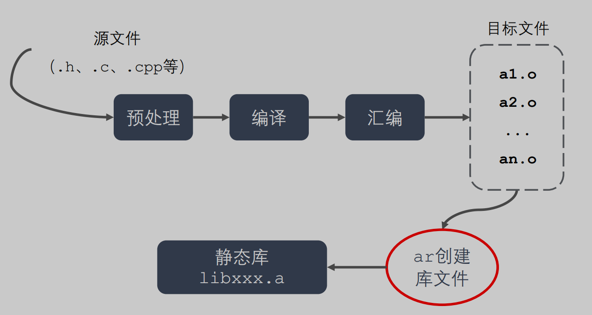


> 1. 汇编不进行链接 生成目标代码
>
>    ```c++
>     gcc -c add.c sub.c div.c mult.c 
>    ```
>
> 2. 使用ar工具（archive）  c表示创建 s表示索引
>
>    ```C
>    ar rcs libcalc.a add.o sub.o mult.o div.o
>    ```
>
> 3. 使用静态库 (-I指定include路径 -l指定静态库名称 -L指定静态库路径)
>
>    ```c++
>    gcc main.c -o app -I ./include/ -l calc -L ./lib
>    ```

#### 动态库(.so)的制作和使用

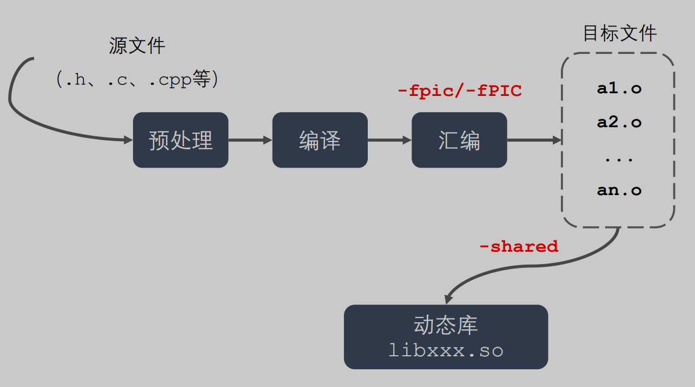

> 1. 使用gcc得到<u>与位置无关的代码</u> -fpic
>
>    ```c++
>    gcc -c –fpic add.c sub.c div.c mult.c 
>    ```
>
> 2. gcc 得到动态库
>
>    ```c++
>    gcc -shared add.o sub.o mult.o div.o -o libcalc.so
>    ```
>
> 3. 添加到环境变量
>
>    ```c++
>    export LD_LIBRARY_PATH=$LD_LIBRARY_PATH:/home/qianxunslimg/Desktop/c++code/1.4/library/lib
>    ```
>
> 4. 使用动态库
>
>    ```c++
>    gcc main.c -o main -I include/ -L lib/ -l calc
>    ```

#### 工作原理

◼ 静态库：GCC 进行链接时，会把静态库中代码打包到可执行程序中

◼ 动态库：GCC 进行链接时，动态库的代码不会被打包到可执行程序中

◼ 程序启动之后，动态库会被动态加载到内存中，通过 ldd （list dynamic 

dependencies）命令检查动态库依赖关系

◼ 如何定位共享库文件呢？ (`Linux`)

> 当系统加载可执行代码时候，能够知道其所依赖的库的名字，但是还需要知道绝对路径。此时就需要系统的动态载入器来获取该绝对路径。对于elf格式的可执行程序，是由ld-linux.so来完成的，它先后搜索elf文件的 **DT_RPATH段** ——> **环境变量LD_LIBRARY_PATH** ——> **/etc/ld.so.cache**文件列表 ——> **/lib/**，**/usr/lib**
>
> 目录找到库文件后将其载入内存

#### 优缺点

##### 静态库的优缺点

◼ 优点：

​	<u>◆ 静态库被打包到应用程序中加载速度快</u>

​	<u>◆ 发布程序无需提供静态库，移植方便</u>

◼ 缺点：

​	◆ 消耗系统资源，浪费内存

​	◆ 更新、部署、发布麻烦

##### 动态库的优缺点

◼ 优点：

​	◆ 可以实现进程间资源共享（`共享库`）

​	◆ 更新、部署、发布`简单`

​	◆ 可以控制何时加载动态库 （`使用到的时候才动态加载`）

◼ 缺点：

​	◆ 加载速度比静态库`慢` （<u>其实相差不多 只是稍慢</u>）

​	◆ 发布程序时需要提供`依赖`的动态库


### windows Vs怎么制作动态库

1. 项目常规 配置类型选择为动态库.dll (或者直接新建工程 目标为dll)

   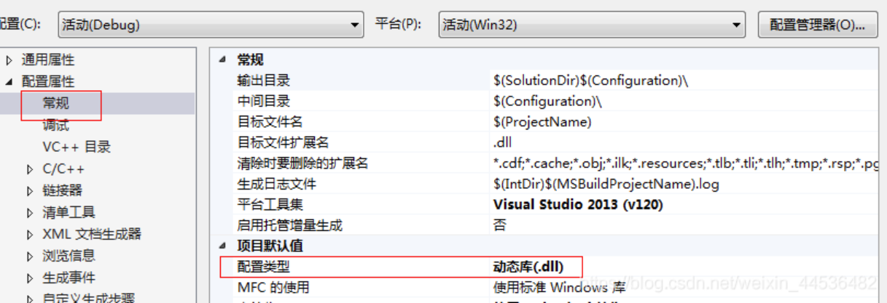

2. **将要释放的接口函数以如下格式进行声明**

```c++
__declspec(dllexport) int add(int a, int b);
```


# 9.   内存

## 9.1.  new/delete与malloc/free的区别是什么

1. new/delete是`C++的关键字`，而malloc/free是`C语言的库函数`

   > `语言`不同

2. malloc/free为函数只是开辟空间并释放，new/delete则不仅会开辟空间，并调用构造函数和析构函数进行初始化和清理

   > new/delete 还可以进行`构造和析构`

3. new/delete底层是基于malloc/free来实现的，而malloc/free不能基于new/delete实现；

   > 实现层次的`上下关系`

4. malloc开辟空间类型大小需手动计算，new是由编译器自己计算；

   > 是否需要`手动计算 空间大小`

5. malloc返回类型为void*,必须强制类型转换对应类型指针，new则`直接返回对应类型指针；`

   > `指针返回类型不同`

6. malloc开辟内存时返回内存地址要检查判空，因为若它可能开辟失败会返回NULL；new则不用判断，因为内存分配失败时，它会抛出异常bac_alloc,可以使用异常机制；

   > 是否需要手动检查开辟是否成功, 一个是手动判空 一个是抛出异常可以捕获

7. 无论释放几个空间大小，free只传递指针，多个对象时delete需加[]

   > 对于内置类型若new[]但用delete释放时，没有影响，但若是自定义类型如类时，若释放使用 delete时，这时则会只调用一次析构函数，只析构了一个对象，剩下的对象都没有被清理。

8. 因为new/delete是操作符，它调用operator new / operator delete,它们可以被重载，在标准库里它有8个重载版本；而malloc/free不可以重载；

   > 是否可以被重载

9. 对于malloc分配内存后，若在使用过程中内存分配不够或太多，这时可以使用realloc函数对其进行扩充或缩小，但是new分配好的内存不能这样被直观简单的改变；

   > malloc分配的空间可以再次调整 relloc

10. `对于new/delete若内存分配失败，用户可以指定处理函数或重新制定分配器（new_handler(可以在此处进行扩展)），malloc/free用户是不可以处理的。`

## [new和delete是如何实现的？](https://interviewguide.cn/#/Doc/Knowledge/C++/基础语法/基础语法?id=9、new和delete是如何实现的？)

- new的实现过程是：首先调用名为**operator new**的标准库函数，`分配`足够大的原始为类型化的内存，以保存指定类型的一个对象；接下来运行该类型的一个`构造`函数，用指定初始化构造对象；最后返回指向新分配并构造后的的对象的`指针`
- delete的实现过程：对`指针指向`的对象运行适当的析构函数；然后通过调用名为**operator delete**的标准库函数释放该对象所用内存

## 9.2.  free是怎么知道它要free的空间有多大

malloc返回的内存地址<u>前面有一段空间存储了该块内存的长度</u>，一般这段空间是16个字节，<u>在free时，解析传入内存地址的前一段内存空间，就可以得到具体的长度。</u>

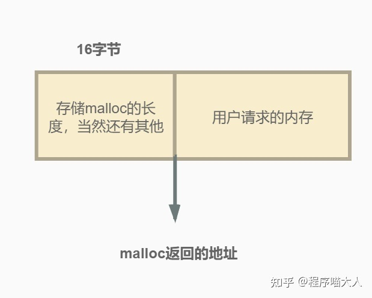

##  9.3.  allocator

标准库 allocator类定义在头文件memory中，它帮助我们将内存分配和对象构造分离开来。它提供一种类型感知的内存分配方法，它分配的内存是原始的、未构造的。


## 9.4.  malloc的原理，另外brk系统调用和mmap系统调用的作用分别是什么？

更详细：https://blog.csdn.net/z_ryan/article/details/79950737

**内存池**

<u>为了减少内存碎片和系统调用的开销</u>，malloc其采用内存池的方式，`先申请大块内存`作为堆区，然后将堆区`分为多个内存块`，以`块`作为内存管理的基本单位。当用户申请内存时，直接从堆区分配一块合适的空闲块。Malloc采用隐式链表结构将堆区分成连续的、大小不一的块，包含已分配块和未分配块；同时malloc采用显示链表结构来管理所有的空闲块，即使用一个双向链表将空闲块连接起来，每一个空闲块记录了一个连续的、未分配的地址。

当进行内存分配时，Malloc会通过隐式链表遍历所有的空闲块，选择满足要求的块进行分配；

当进行内存合并时，malloc采用边界标记法，根据每个块的前后块是否已经分配来决定是否进行块合并。

 

### 内存布局

介绍ptmalloc之前，我们先了解一下内存布局，以x86的32位系统为例：

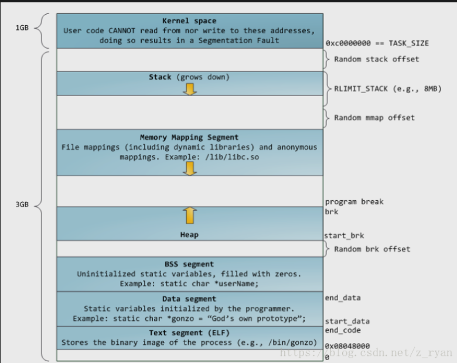
　　从上图可以看到，栈至顶向下扩展，堆至底向上扩展， mmap 映射区域至顶向下扩展。 mmap 映射区域和堆相对扩展，直至耗尽虚拟地址空间中的剩余区域，这种结构便于 C 运行时库使用 mmap 映射区域和堆进行内存分配。

### brk（sbrk）和mmap函数

首先，linux系统向用户提供申请的内存有brk(sbrk)和mmap函数。下面我们先来了解一下这几个函数。

#### brk() 和 sbrk()

```c++
#include <unistd.h>
int brk( const void *addr )
void* sbrk ( intptr_t incr );
```

> 两者的作用是扩展heap的上界brk
> Brk（）的参数设置为新的brk上界地址，成功返回1，失败返回0；
> Sbrk（）的参数为申请内存的大小，返回heap新的上界brk的地址

#### mmap()

```c++
#include <sys/mman.h>
void *mmap(void *addr, size\_t length, int prot, int flags, int fd, off\_t offset);
int munmap(void *addr, size_t length);
```

> mmap的第一种用法是映射磁盘文件到内存中；第二种用法是匿名映射，不映射磁盘文件，而向映射区申请一块内存。
> malloc使用的是mmap的第二种用法（匿名映射）。
> munmap函数用于释放内存。

### **申请内存**

Malloc在申请内存时，一般会通过brk或者mmap系统调用进行申请。

<u>当申请内存小于128K时，会使用系统函数==brk在堆区==中分配；</u>

<u>当申请内存大于128K时，会使用系统函数==mmap在映射区==分配</u>。

栈、`映射区内存至顶向下扩展`，堆至低向上扩展。

### **释放内存**

当用户使用free函数释放掉的内存，ptmalloc并不会马上交还给操作系统，而是被ptmalloc本身的空闲链表bins管理起来了，这样当下次进程需要malloc一块内存的时候，ptmalloc就会从空闲的bins上寻找一块合适大小的内存块分配给用户使用。这样的好处可以避免频繁的系统调用，降低内存分配的开销。

当释放mmaped chunk上的内存的时候会直接交还给操作系统。

 

**chunk** **内存块的基本组织单元**

在 ptmalloc 的实现源码中定义结构体 malloc_chunk 来描述这些块。malloc_chunk 定义如下：

```c++
struct malloc_chunk { 
  /* Size of previous chunk (if free). */ 
  INTERNAL_SIZE_T   prev_size;  
  /* Size in bytes, including overhead. */ 
  INTERNAL_SIZE_T   size;     

  struct malloc_chunk* fd/* double links -- used only if free. */ 
  struct malloc_chunk* bk; 

  /* Only used for large blocks: pointer to next larger size. */ 
  struct malloc_chunk* fd_nextsize;/* double links -- used only if free. */ 
  struct malloc_chunk* bk_nextsize; 
}; 
```


**主分配区和非主分配区**

Allocate的内存分配器中，为了解决多线程锁争夺问题，分为主分配区main_area和非主分配区no_main_area。

　1. 主分配区和非主分配区形成一个环形链表进行管理。

　2. 每一个分配区利用互斥锁使线程对q0于该分配区的访问互斥。

　3. 每个进程只有一个主分配区，也可以允许有多个非主分配区。

　4. ptmalloc根据系统对分配区的争用动态增加分配区的大小，分配区的数量一旦增加，则不会减少。

　5. 主分配区可以使用brk和mmap来分配，而非主分配区只能使用mmap来映射内存块

　6. 申请小内存时会产生很多内存碎片，ptmalloc在整理时也需要对分配区做加锁操作。

 

当一个线程需要使用malloc分配内存的时候，会先查看该线程的私有变量中是否已经存在一个分配区。若是存在。会尝试对其进行加锁操作。若是加锁成功，就在使用该分配区分配内存，若是失败，就会遍历循环链表中获取一个未加锁的分配区。若是整个链表中都没有未加锁的分配区，则malloc会开辟一个新的分配区，将其加入全局的循环链表并加锁，然后使用该分配区进行内存分配。当释放这块内存时，同样会先获取待释放内存块所在的分配区的锁。若是有其他线程正在使用该分配区，则必须等待其他线程释放该分配区互斥锁之后才能进行释放内存的操作。

## 9.5.  [C++的内存管理是怎样的](https://interviewguide.cn/#/Doc/Knowledge/C++/内存管理/内存管理?id=类的对象存储空间)

#### [1、类的对象存储空间？](https://interviewguide.cn/#/Doc/Knowledge/C++/内存管理/内存管理?id=1、类的对象存储空间？)

- `非静态`成员的数据类型大小之和。

- 编译器加入的额外成员变量（如指向`虚函数表的指针`）。

- 为了`边缘对齐`优化加入的`padding`。  

  空类(无非静态数据成员)的对象的size为1, 当作为基类时, size为0.

#### [2、简要说明C++的内存分区](https://interviewguide.cn/#/Doc/Knowledge/C++/内存管理/内存管理?id=2、简要说明c的内存分区)

C++中的内存分区，分别是堆、栈、自由存储区、全局/静态存储区、常量存储区和代码区。如下图所示

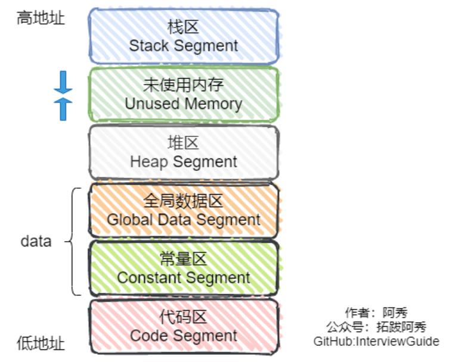

- **栈**：在执行函数时，函数内局部变量的存储单元都可以在栈上创建，函数执行结束时这些存储单元自动被释放。栈内存分配运算内置于处理器的指令集中，效率很高，但是分配的内存容量有限 

  > （由高地址向低地址增长，和堆的增长方式相对，对不同的OS来说，栈的初始大小有规定，可以修改，目前`默认一般为2M`，由编译器自动分配释放）

- ?共享库文件/映射区？（调用的库文件，位于堆和栈之间）从上向下生长；存储动态链接库以及调用mmap函数进行的文件映射  

  > 1. malloc大于128k会调用mmap在映射区分配内存
  > 2. mmap内存映射文件到内存
  > 3. 加载动态库到此区域

- **堆**：就是那些由 `new`分配的内存块，他们的释放编译器不去管，由我们的应用程序去控制，一般一个`new`就要对应一个 `delete`。如果程序员没有释放掉，那么在程序结束后，操作系统会自动回收

  > （由低地址向高地址增长，一般new和malloc分配，由程序员分配释放）

- **自由存储区**：如果说堆是操作系统维护的一块内存，那么自由存储区就是C++中通过new和delete动态分配和释放对象的`抽象概念`。需要注意的是，自由存储区和堆比较像，但不等价。

- **全局/静态存储区**：全局变量和静态变量被分配到同一块内存中，在以前的C语言中，全局变量和静态变量又分为初始化的和未初始化的，在C++里面没有这个区分了，它们共同占用同一块内存区，在该区定义的变量若没有初始化，则会被自动初始化，例如int型变量自动初始为0

- **常量存储区**：这是一块比较特殊的存储区，这里面存放的是常量，不允许修改 

  > 只读, 注意 ==虚函数表存放在此==

- **代码区**：存放函数体的二进制代码

###  [13、请说一下以下几种情况下，下面几个类的大小各是多少？](https://interviewguide.cn/#/Doc/Knowledge/C++/内存管理/内存管理?id=13、请说一下以下几种情况下，下面几个类的大小各是多少？)

```cpp
class A {};
int main(){
  cout<<sizeof(A)<<endl;// 输出 1;
  A a; 
  cout<<sizeof(a)<<endl;// 输出 1;
  return 0;
}Copy to clipboardErrorCopied
```

`空类的大小是1`， 在C++中空类会占一个字节，这是为了让对象的实例能够相互区别。具体来说，空类同样可以被实例化，并且每个实例在内存中都有独一无二的地址，因此，<u>编译器会给空类隐含加上一个字节，这样空类实例化之后就会拥有独一无二的内存地址</u>。当该空白类作为基类时，该类的大小就优化为0了，子类的大小就是子类本身的大小。这就是所谓的空白基类最优化。

空类的实例大小就是类的大小，所以sizeof(a)=1字节,`如果a是指针，则sizeof(a)就是指针的大小，即4字节`。

```cpp
class A { virtual Fun(){} };
int main(){
  cout<<sizeof(A)<<endl;// 输出 4(32位机器)/8(64位机器);
  A a; 
  cout<<sizeof(a)<<endl;// 输出 4(32位机器)/8(64位机器);
  return 0;
}Copy to clipboardErrorCopied
```

如果 有虚函数 类对象中都有一个<u>`虚函数表指针`</u> __vptr，其大小是4字节

```cpp
class A { static int a; };
int main(){
  cout<<sizeof(A)<<endl;// 输出 1;
  A a; 
  cout<<sizeof(a)<<endl;// 输出 1;
  return 0;
}Copy to clipboardErrorCopied
```

静态成员存放在静态存储区，不占用类的大小, 普通函数也不占用类大小

```cpp
class A { int a; };
int main(){
  cout<<sizeof(A)<<endl;// 输出 4;
  A a; 
  cout<<sizeof(a)<<endl;// 输出 4;
  return 0;
}Copy to clipboardErrorCopied
class A { static int a; int b; };;
int main(){
  cout<<sizeof(A)<<endl;// 输出 4;
  A a; 
  cout<<sizeof(a)<<endl;// 输出 4;
  return 0;
}Copy to clipboardErrorCopied
```

静态成员a不占用类的大小，所以类的大小就是b变量的大小 即4个字节

## 9.6.  栈和堆比较

#### [1. 堆和栈的区别](https://interviewguide.cn/#/Doc/Knowledge/C++/基础语法/基础语法?id=5、堆和栈的区别)

- 申请方式不同。
  - 栈由系统自动分配。
  - 堆是程序员申请和释放的。
- 申请大小限制不同。
  - 栈顶和栈底是之前预设好的，栈是向栈底扩展，大小固定，可以通过ulimit -a查看，由ulimit -s修改。  4M
  - 堆向高地址扩展，是不连续的内存区域，大小可以灵活调整。 3G 128T
- 申请效率不同。
  - 栈由系统分配，速度快，不会有碎片。
  - 堆由程序员分配，速度慢，且会有碎片。

**<u>==栈空间默认是4M, 堆区一般是 1G - 4G(32位是3g 1g内核   64位是128T)==</u>**

|                  | 堆                                                           | 栈                                                           |
| ---------------- | :----------------------------------------------------------- | :----------------------------------------------------------- |
| **管理方式**     | 堆中资源由程序员控制（容易产生memory leak）                  | 栈资源由编译器自动管理，无需手工控制                         |
| **内存管理机制** | 系统有一个记录空闲内存地址的链表，当系统收到程序申请时，遍历该链表，寻找第一个空间大于申请空间的堆结点，删 除空闲结点链表中的该结点，并将该结点空间分配给程序（大多数系统会在这块内存空间首地址记录本次分配的大小，这样delete才能正确释放本内存空间，另外系统会将多余的部分重新放入空闲链表中） | 只要栈的剩余空间大于所申请空间，系统为程序提供内存，否则报异常提示栈溢出。（这一块理解一下链表和队列的区别，不连续空间和连续空间的区别，应该就比较好理解这两种机制的区别了） |
| **空间大小**     | 堆是不连续的内存区域（因为系统是用链表来存储空闲内存地址，自然不是连续的），堆大小受限于计算机系统中有效的虚拟内存（32bit 系统理论上是4G），所以堆的空间比较灵活，比较大 | 栈是一块连续的内存区域，大小是操作系统预定好的，windows下栈大小是2M（也有是1M，在 编译时确定，VC中可设置） |
| **碎片问题**     | 对于堆，频繁的new/delete会造成大量碎片，使程序效率降低       | 对于栈，它是有点类似于数据结构上的一个先进后出的栈，进出一一对应，不会产生碎片。（看到这里我突然明白了为什么面试官在问我堆和栈的区别之前先问了我栈和队列的区别） |
| **生长方向**     | 堆向上，向高地址方向增长。                                   | 栈向下，向低地址方向增长。                                   |
| **分配方式**     | 堆都是动态分配（没有静态分配的堆）                           | 栈有静态分配和动态分配，静态分配由编译器完成（如局部变量分配），动态分配由alloca函数分配，但栈的动态分配的资源由编译器进行释放，无需程序员实现。 |
| **分配效率**     | 堆由C/C++函数库提供，机制很复杂。所以堆的效率比栈低很多。    | 栈是其系统提供的数据结构，计算机在底层对栈提供支持，分配专门 寄存器存放栈地址，栈操作有专门指令。 |

**形象的比喻**

栈就像我们去饭馆里吃饭，只管点菜（发出申请）、付钱、和吃（使用），吃饱了就走，不必理会切菜、洗菜等准备工作和洗碗、刷锅等扫尾工作，他的好处是快捷，但是自由度小。

堆就象是自己动手做喜欢吃的菜肴，比较麻烦，但是比较符合自己的口味，而且自由度大。


#### [2. 你觉得堆快一点还是栈快一点？](https://interviewguide.cn/#/Doc/Knowledge/C++/基础语法/基础语法?id=6、你觉得堆快一点还是栈快一点？)

毫无疑问是**<u>==栈快==</u>**一点。

因为<u>操作系统会在底层对栈提供支持，会分配专门的寄存器存放栈的地址，栈的入栈出栈操作也十分简单，并且有专门的指令执行，所以栈的效率比较高也比较快</u>。

而堆的操作是由C/C++函数库提供的，在分配堆内存的时候需要`一定的算法寻找合适大小的内存`。<u>并且获取堆的内容需要==两次访问==，第一次访问指针，第二次根据指针保存的地址访问内存，因此堆比较慢。</u>

> 栈为什么快?
>
> 1. 底层提供支持, 有专门的寄存器
> 2. 栈的出入操作简单, 专门的指令
>
> 堆为什么慢?
>
> 1. 算法查找合适的内存块
> 2. 两次访问 先访问指针 在访问内存块

## 9.7.  为什么堆栈增长方向不一样

> 进程地址空间的分布取决于操作系统，栈向什么方向增长取决于操作系统与CPU的组合。
>
> Windows的栈地址就比堆地址低

1. 历史原因 内存所以相向生长
2. 栈对方向不敏感 所以向下

为了最大程度利用地址空间。


C与C++语言的数组元素要分配在连续递增的地址上，也不反映栈的增长方向。

==========================================

**以简化的Linux/x86模型为例**

在简化的32位Linux/x86进程地址空间模型里，（主线程的）栈空间确实比堆空间的地址要高——它已经占据了用户态地址空间的最高可分配的区域，并且向下（向低地址）增长。借用Gustavo Duarte的

[Anatomy of a Program in Memory](http://duartes.org/gustavo/blog/post/anatomy-of-a-program-in-memory/)

里的图：

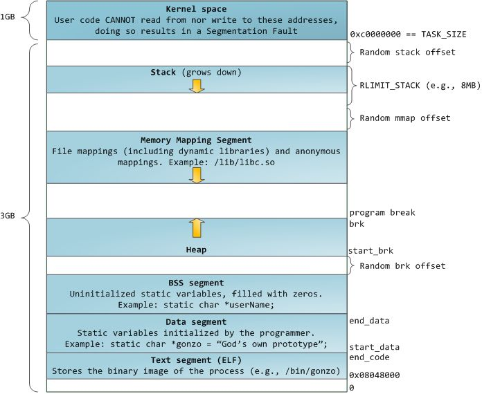

不过要留意的是这个图是简化模型。举两个例子：

- 虽然传统上Linux上的malloc实现会使用`brk()/sbrk()`来实现malloc()（这俩构成了上图中“Heap”所示的部分，这也是Linux自身所认为是heap的地方——用pmap看可以看到这里被标记为[heap]），但这并不是必须的——<u>一个malloc()实现完全可以只用或基本上只用==mmap==()来实现malloc()</u>，此时一般说的“Heap”（malloc-heap）就不一定在上图“Heap”（Linux heap）所示部分，而会在<u>“Memory Mapping Segment”部分散布开来</u>。不同版本的Linux在分配未指定起始地址的mmap()时用的顺序不一样，并不保证某种顺序。而且mmap()分配到的空间是<u>有可能出现在低于主可执行程序映射进来的text Segment所在的位置。</u>

  > ==所以即便在linux/86模型中 malloc或者new分配的空间也不一定比栈上的低, 一不一定后分配的比先分配的高==

- Linux上多线程进程中，“线程”其实是一组共享虚拟地址空间的进程。只有主线程的栈是按照上面图示分布，其它线程的栈的位置其实是“随机”的——它们可以由pthread_create()调用mmap()来分配，也可以由程序自己调用mmap()之后把地址传给pthread_create()。既然是mmap()来的，其它线程的栈出现在Memory Mapping Segment的任意位置都不出奇，与用于实现malloc()用的mmap()空间很可能是交错出现的。


## 9.8.  什么时候会发生段错误

https://blog.csdn.net/qq_35703848/article/details/90670581

段错误通常发生在访问非法内存地址的时候，具体来说分为以下几种情况：

1. 使用`未经初始化及或已经释放的指针地址`，使用野指针:

   strcpy(s,"abcd");

2. 试图修改字符串常量的内容（`写入只读的内存地址`）

   ```c++
   char *str = "samson";
   *str = "cool";
   ```

3. `数组越界`

4. `堆栈溢出`

5. `错误的访问类型`引起

   ```c++
   #include<stdio.h>
   #include<stdlib.h>
   
   int main(){
       char *c = "hello world";
       c[1] = 'H';
   }
   ```

   - 上述程序编译没有问题，但是运行时弹出SIGSEGV。此例中，”hello world”作为一个常量字符串，在编译后会被放在.rodata节（GCC），最后链接生成目标程序时.rodata节会被合并到text segment与代码段放在一起，故其所处内存区域是只读的。这就是错误的访问类型引起的SIGSEGV。

6. 访问了不属于进程地址空间的内存

   ```c++
   #include <stdio.h> 
   #include <stdlib.h>
   
   int main(){ 
       int* p = (int*)0xC0000fff; 
       *p = 10; 
   }　
   ```

   还有一种可能，往受到系统保护的内存地址写数据，最常见的就是给一个指针以0地址；

   ```c++
   int  i=0; 
   scanf ("%d", i);  /* should have used &i */ 
   printf ("%d\n", i);
   return 0;
   ```

7. 访问了不存在的内存
    最常见的情况不外乎解引用空指针了，如：

  ```c++
  int *p = null;
  *p = 1;
  ```

  - 在实际情况中，此例中的空指针可能指向用户态地址空间，但其所指向的页面实际不存在。

8. 内存越界，数组越界，变量类型不一致等

```c++
include <stdio.h>
    
int main(){ 
	char test[1]; 
	printf("%c", test[10]); 
	return 0; 
}　
```

- 这就是明显的数组越界了，或者这个地址根本不存在。

9. 试图把一个整数按照字符串的方式输出

```c++
int  main() { 
    int b = 10; 
    printf("%s\n", b);
    return 0; 
}　
```

## 9.9.  内存溢出原因

指程序申请内存时，没有足够的内存供申请者使用。内存溢出就是你要的内存空间超过了系统实际分配给你的空间，此时系统相当于没法满足你的需求，就会报内存溢出的错误

内存溢出原因：

1. 内存中加载的==数据量过于庞大==，如一次从数据库取出过多数据  (new读取几个g的文件) 

2. **<u>==递归==</u>** 调用层次太多。递归函数在运行时会执行压栈操作，当压栈次数太多时，也会导致堆栈溢出。

3. ==没有释放资源==: 比如sharedptr, socket, 基类析构函数不是virtual从而无法调用子类析构等 或者new的忘记了释放 `集合类中有对对象的引用，使用完后未清空，使得不能回收`

4. 代码中存在<u>==死循环或循环==</u>产生过多重复的对象实体

## 9.10. 什么是memory leak，也就是内存泄漏

内存泄漏(memory leak)是指由于疏忽或错误造成了程序`未能释放`掉不再使用的内存的情况。内存泄漏并非指内存在物理上的消失，而是应用程序分配某段内存后，`由于设计错误，失去了对该段内存的控制，因而造成了内存的浪费`。

### 内存泄漏的分类：

1. 堆内存泄漏 （Heap leak）。对内存指的是程序运行中根据需要分配通过malloc,realloc new等从堆中分配的一块内存，再是完成后必须通过调用对应的 free或者delete 删掉。如果程序的设计的错误导致这部分内存没有被释放，那么此后这块内存将不会被使用，就会产生Heap Leak.   ==new了没有delete==

2. 系统资源泄露（Resource Leak）。主要指程序使用系统分配的资源比如 Bitmap,handle ,SOCKET等没有使用相应的函数释放掉，导致系统资源的浪费，严重可导致系统效能降低，系统运行不稳定。 ==套接字未释放啊之类的 子线程未释放==

3. 没有将==基类的析构函数定义为虚函数==。当基类指针指向子类对象时，如果基类的析构函数不是virtual，那么子类的析构函数将不会被调用，子类的资源没有正确是释放，因此造成内存泄露。   

## 9.11. 如何判断内存泄漏？

内存泄漏通常是由于调用了malloc/new等内存申请的操作，但是`缺少了对应的free/delete`。

### 检查方式

#### 运行时检测: ==BoundsChecker==

使用工具软件BoundsChecker，BoundsChecker是一个运行时错误检测工具，它主要定位程序运行时期发生的各种错误；

#### **Linux:**

我们一方面可以使用linux环境下的内存泄漏检查工具**<u>==Valgrind==</u>**,另一方面我们在写代码时可以添加内存申请和释放的统计功能，统计当前申请和释放的内存是否一致，以此来判断内存是否泄露。

Valgrind：

编译：g++ -g -o test test.cpp

使用：valgrind --tool=`memcheck` ./test

可以检测如下问题：

使用未初始化的内存（全局/静态变量初始化为0，局部变量/动态申请初始化为随机值）；

内存读写越界；

内存覆盖（strcpy/strcat/memcpy）；

动态内存管理（申请释放方式不同，忘记释放等）；

内存泄露（动态内存用完后没有释放，又无法被其他程序使用）。

#### **Windows(vs)**

==_CrtDumpMemoryLeaks()==就是检测从程序开始到执行该函数进程的堆使用情况，通过使用 _CrtDumpMemoryLeaks()我们可以进行简单的内存泄露检测。

```c++
#define CRTDBG_MAP_ALLOC //放在程序最前
#include <iostream>
#include <stdlib.h>  
#include <crtdbg.h>   //这里
using namespace std;
int main(){
    int *a = new int[10];
    int *p = new int[1000];
    _CrtDumpMemoryLeaks(); //放在程序最后  //会输出在第几行 泄露了多少
    system("pause");
    return 0;
}

```

> 在我的开发过程中, 发生过一次内存泄露, 是多线程中计算150个频点的结果, 计算过程中涉及到矩阵的卷积, 忘记了释放, 导致的结果就是, 很大的数据计算时, 一个频点会泄露大概200MB的内存, 任务管理器肉眼可见的跑满, vs的调试过程
>
> 开启诊断工具 打断点 逐步调试 找到泄露位置 释放内存修复bug

### **避免内存泄露的几种方式**

- 计数法：使用new或者malloc时，让该数+1，delete或free时，该数-1，程序执行完打印这个计数，如果不为0则表示存在内存泄露

  `智能指针思想`

- 一定要将基类的析构函数声明为**虚函数**    `（不然子类无法析构）`

- 对象数组的释放一定要用**delete []**`（只有默认的常量类型可以用delete删除指针数组）`

- 有new就有delete，有malloc就有free，保证它们一定成对出现

### **检测工具**

- Linux下可以使用==Valgrind工具==  Wǎ'ěr gélín
- Windows下可以使用==CRT库==
- 运行时检测工具 ==BoundsChecker==

## 9.13. C++里是怎么定义常量的？常量存放在内存的哪个位置？

常量在C++里的定义就是一个top-level const加上对象类型，常量定义必须初始化。对于局部对象，常量存放在栈区，对于全局对象，常量存放在全局/静态存储区。对于字面值常量，常量存放在<u>常量存储区(代码段 最后常量存储区被打包到代码段)</u>。

> 以const int i=10;为例，之前一直误认为i是存储在常量存储区里的，大错特错！因为无法解释const栈变量的存储位置。实际上并不存在常量存储区 (或者说 ==常量存储区是包含在全局静态存储区?==)，只有全局/静态存储区。const类型的存储跟一般的变量没有区别，在外部定义的存储在全局数据区，static的存储在静态数据区，在函数内部定义的存储在栈，const跟非const存储上没区别，==只不过是read only==的。

## 到底怎么理解常量区?

感觉常量区是一个抽象的概念

虚函数表存储在常量区 rodata 即只读区 最后编译时会被打包到代码段

字面值常量(包括字符串常量)存储在常量存储区 最后被打包到代码段

全部常量存储在 全局静态区(或者说是.data的常量存储区? 一个图上.data包括全局静态和常量存储 )

局部常量存储在栈区 只是只读

## 9.14. const char * arr = "123"; char * brr = "123"; const char crr[] = "123"; char drr[] = "123"的区别是什么;

const char * arr = "123";

> //字符串123保存在常量区，const本来是修饰arr指向的值不能通过arr去修改，但是字符串“123”在常量区，本来就不能改变，`所以加不加const效果都一样`
>

char * brr = "123";（vs下不加const报错）

> //字符串123保存在常量区，这个arr指针指向的是同一个位置，同样不能通过brr去修改"123"的值
>

const char crr[] = "123";

> //这里123本来是在栈上的，但是编译器可能会做某些优化，将其放到常量区
>

char drr[] = "123";     `//保存在栈区 只有这个可以修改`

> //字符串123保存在栈区，可以通过drr去修改
>

 

## 9.15. c++中的RAII机制

RAII是Resource Acquisition Is Initialization（wiki上面翻译成 “资源获取就是初始化”）的简称，是C++语言的一种管理资源、避免泄漏的惯用法。利用的就是C++构造的对象最终会被销毁的原则。RAII的做法是使用一个对象，在其构造时获取对应的资源，在对象生命期内控制对资源的访问，使之始终保持有效，最后在对象析构的时候，释放构造时获取的资源。

由于系统的资源不具有自动释放的功能，而C++中的类具有自动调用析构函数的功能。**如果把资源用类进行封装起来，对资源操作都封装在类的内部，在析构函数中进行释放资源。当定义的局部变量的生命结束时，它的析构函数就会自动的被调用，如此，就不用程序员显示的去调用释放资源的操作了。**

#### 例子：智能指针，lock_guard()


### 1  RAII介绍

RAII全称是Resource Acquisition Is Initialization，翻译过来是资源获取即初始化，RAII机制用于管理资源的申请和释放。对于资源，我们通常经历三个过程，申请，使用，释放，这里的资源不仅仅是内存，也可以是文件、socket、锁等等。但是我们往往只关注资源的申请和使用，而忘了释放，这不仅会导致内存泄漏，可能还会导致业务逻辑的错误，RAII就用来解决此类问题。

### 2 C++中的RAII使用

我们看以下例子。

```javascript
std::mutex m;
void fn() {
    m.lock();                 
    使用资源
    m.unlock();                
}
```

上面的代码是对互斥变量的使用，我们看到加锁和解锁是成对出现的。如果我们忘了unlock那么别的线程再也无法枷锁成功，而且还会导致一直阻塞。我们看C++怎么解决这个问题。

```javascript
std::mutex m;
void fn(){    
    std::lock_guard<std::mutex> guard(m); 
    do_something();                            
    // 指向完函数后，guard会被析构，从而mutex也会被释放
}
```

我们看到上面的代码中，我们只需要加锁，操作资源，不需要手动解锁。那么RAII是怎么做的呢？我们看看`lock_guard的实现`。

```javascript
template <class Mutex> 
class lock_guard {
    private:
        Mutex& mutex_;

    public:
        lock_guard(Mutex& mutex) : mutex_(mutex) { mutex_.lock(); }
        ~lock_guard() { mutex_.unlock(); }
        // 禁止复制和赋值
        lock_guard(lock_guard const&) = delete;
        lock_guard& operator=(lock_guard const&) = delete;
};
```

我们看到实现很简单，在创建一个lock_guard对象的时候，lock_guard会初始化内部字段，并且执行加锁操作。当lock_guard析构的时候，会指向解锁操作，所以借助这个类，我们就不需要关注解锁的操作了，`具体的原理是利用了C++对象离开作用域后会自定执行析构函数`。


[`智能指针的实现就是RAII的使用`](https://cloud.tencent.com/developer/article/1855285)


## 什么是内存池，如何实现

内存池（Memory Pool） 是一种**内存分配**方式。通常我们习惯直接使用new、malloc 等申请内存，这样做的缺点在于：由于所申请内存块的大小不定，当频繁使用时会`造成大量的内存碎片`并进而降低性能。内存池则是在真正使用内存之前，先申请分配一定数量的、大小相等(一般情况下)的内存块留作备用。当有新的内存需求时，就从内存池中分出一部分内存块， 若内存块不够再继续申请新的内存。这样做的一个显著优点是尽量避免了内存碎片，使得内存分配效率得到提升。

这里**简单描述一下《STL源码剖析》中的内存池实现机制**：

**allocate 包装 malloc，deallocate包装free**

一般是一次20*2个的申请，先用一半，留着一半，为什么也没个说法，侯捷在STL那边书里说好像是C++委员会成员认为20是个比较好的数字，既不大也不小。

1. 首先客户端会调用malloc()配置一定数量的区块（固定大小的内存块，通常为8的倍数 ），假设40个32bytes(也就是4字节)的区块，其中20个区块（一半）给程序实际使用，1个区块交出，另外19个处于维护状态。剩余20个（一半）留给内存池，此时一共有（20*32byte）

   > 申请40个内存块 一块4字节  20个实际使用  20个留着

2. 客户端之后有有内存需求，想申请（20* 64bytes）的空间，这时内存池只有（20* 32bytes），就先将（10*64bytes)个区块返回，1个区块交出，另外9个处于维护状态，此时内存池空空如也.

3. 接下来如果客户端还有内存需求，就必须再调用malloc()配置空间，此时新申请的区块数量会增加一个随着配置次数越来越大的附加量，同样一半提供程序使用，另一半留给内存池。申请内存的时候用永远是先看内存池有无剩余，有的话就用上，然后挂在0-15号某一条链表上，要不然就重新申请。

4. 如果整个堆的空间都不够了，就会在原先已经分配区块中寻找能满足当前需求的区块数量，能满足就返回，不能满足就向客户端报bad_alloc异常

allocator就是用来分配内存的，最重要的两个函数是allocate和deallocate，就是用来申请内存和回收内存的，外部（一般指容器）调用的时候只需要知道这些就够了。

内部实现，目前的所有编译器都是直接调用的::operator new()和::operator delete()，说白了就是和直接使用new运算符的效果是一样的，所以老师说它们都没做任何特殊处理。

**其实最开始GC2.9之前**

new和 operator new 的区别：new 是个运算符，编辑器会调用 operator new(0)

operator new()里面有调用malloc的操作，那同样的 operator delete()里面有调用的free的操作

GC2.9下的alloc函数的一个比较好的分配器的实现规则如下：

维护一条0-15号的一共16条链表，其中 0 号表示8 bytes ，1 号表示 16 bytes，2 号表示 24 bytes。。。。而15 号表示 16* 8 = 128 bytes。

如果在申请内存时，申请内存的大小并不是8的倍数（比如2、4、7、9、18这样不是8的倍数），那就找刚好能满足内存大小的链表。比如想申请 12 个大小，那就按照 16 来处理，也就是找 1 号链表了；想申请 20 ，距离它最近的就是 24 了，那就找 2 号链表。

只许比所要申请的内容大，不许小！

**但是现在GC4.9及其之后** 也还有 alloc 函数，只不过已经变成_pool_alloc这个名字了，名字已经改了，也不再是默认的了。

你需要自己手动去指定它可以自己指定，比如

```cpp
vector<string,__gnu_cxx::pool_alloc<string>> vec;
```

这样来使用它，等于兜兜转转又回到以前那种对malloc和free的包装形式了。


## delete this

### 在成员函数中调用delete this会出现什么问题？对象还可以使用吗？

在类对象的内存空间中，只有数据成员和虚函数表指针，并不包含代码内容，类的成员函数单独放在代码段中。在调用成员函数时，隐含传递一个this指针，让成员函数知道当前是哪个对象在调用它。当调用delete this时，`类对象的内存空间被释放`。在delete this之后进行的其他任何函数调用，只要不涉及到this指针的内容，都能够正常运行。一旦涉及到this指针，如操作数据成员，调用虚函数等，就会出现不可预期的问题。


### 为什么是不可预期的问题？

delete this之后不是释放了类对象的内存空间了么，那么这段内存应该已经还给系统，不再属于这个进程。照这个逻辑来看，应该发生指针错误，无访问权限之类的令系统崩溃的问题才对啊？这个问题牵涉到操作系统的内存管理策略。delete this释放了类对象的内存空间，但是内存空间却并不是马上被回收到系统中，可能是缓冲或者其他什么原因，导致这段内存空间暂时并没有被系统收回。此时这段内存是可以访问的，你可以加上100，加上200，但是其中的值却是不确定的。当你获取数据成员，可能得到的是一串很长的未初始化的随机数；访问虚函数表，指针无效的可能性非常高，造成系统崩溃。


### 如果在类的析构函数中调用delete this，会发生什么？

会导致堆栈溢出。原因很简单，delete的本质是“为将被释放的内存调用一个或多个析构函数，然后，释放内存”。显然，delete this会去调用本对象的析构函数，而析构函数中又调用delete this，形成无限递归，造成堆栈溢出，系统崩溃。


## [#](https://interviewguide.cn/notes/03-hunting_job/02-interview/01-02-01-内存管理.html#_14、this指针调用成员变量时-堆栈会发生什么变化)this指针调用成员变量时，堆栈会发生什么变化？

当在类的非静态成员函数访问类的非静态成员时，编译器会自动将对象的地址传给作为隐含参数传递给函数，这个隐含参数就是this指针。

即使你并没有写this指针，编译器在链接时也会加上this的，对各成员的访问都是通过this的。

例如你建立了类的多个对象时，在调用类的成员函数时，你并不知道具体是哪个对象在调用，此时你可以通过查看this指针来查看具体是哪个对象在调用。This指针首先入栈，然后成员函数的参数从右向左进行入栈，最后函数返回地址入栈。

> <u>答的这是什么j8玩意</u> 
>
> 应该是this指针首先入栈也就是对象的首地址入栈 然后在偏移的位置找到成员变量吧


## [#](https://interviewguide.cn/notes/03-hunting_job/02-interview/01-02-01-内存管理.html#_15、类对象的大小受哪些因素影响)类对象的大小受哪些因素影响？

1. 类的`非静态成员变量大小`，静态成员不占据类的空间，成员函数也不占据类的空间大小；
2. 内存`对齐`另外分配的空间大小，类内的数据也是需要进行内存对齐操作的；
3. 虚函数的话，会在类对象插入`vptr指针`，加上指针大小；
4. 当该类是某类的派生类，那么派生类继承的`基类部分的数据成员`也会存在在派生类中的空间中，也会对派生类进行扩展。

# 补充的一些问题

## [#](https://interviewguide.cn/notes/03-hunting_job/02-interview/01-01-01-基础语法.html#_12、被free回收的内存是立即返还给操作系统吗)12、`被free回收的内存是立即返还给操作系统吗`？

不是的，<u>被free回收的内存会首先被ptmalloc使用双链表保存起来</u>，当用户下一次申请内存的时候，会尝试从这些内存中寻找合适的返回。这样就避免了频繁的系统调用，占用过多的系统资源。<u>同时ptmalloc也会尝试对小块内存进行合并，避免过多的内存碎片</u>。

> `先使用ptmalloc双链表保存起来(并对小的内存进行合并) 下一次会优先在双链表中查找合适的`


## [#](https://interviewguide.cn/notes/03-hunting_job/02-interview/01-01-01-基础语法.html#_18、a和-a有什么区别)18、`a和&a有什么区别`？

假设数组`int a[10]; int (*p)[10] = &a`;其中：

- a是数组名，是数组首元素地址，+1表示地址值加上一个int类型的大小，如果a的值是0x00000001，加1操作后变为0x00000005。*(a + 1) = a[1]。
- &a是数组的指针，其类型为int (*)[10]（就是前面提到的数组指针），其加1时，系统会认为是数组首地址加上整个数组的偏移（10个int型变量），值为数组a尾元素后一个元素的地址。
- 若(int *)p ，此时输出 *p时，其值为a[0]的值，因为被转为int *类型，解引用时按照int类型大小来读取。

## [#](https://interviewguide.cn/notes/03-hunting_job/02-interview/01-01-02-基础语法.html#_26、数组名和指针-这里为指向数组首元素的指针-区别)26、`数组名和指针`（这里为指向数组首元素的指针）区别？

- 二者均可通过增减偏移量来访问数组中的元素。

- 数组名不是真正意义上的指针，可以理解为`指针常量`，所以数组名没有自增、自减等操作。 (`指向不可更改`)

  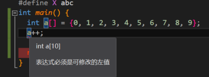

- **当数组名当做形参传递给调用函数后，就失去了原有特性，退化成一般指针，多了自增、自减操作，但sizeof运算符不能再得到原数组的大小了。**

> 假设数组`int a[10]; int (*p)[10] = &a`;其中：
>
> - a是数组名，是数组首元素地址，+1表示地址值加上一个int类型的大小，如果a的值是0x00000001，加1操作后变为0x00000005。*(a + 1) = a[1]。
> - &a是数组的指针，其类型为int (*)[10]（就是前面提到的数组指针），其加1时，系统会认为是数组首地址加上整个数组的偏移（10个int型变量），值为数组a尾元素后一个元素的地址。
> - 若(int *)p ，此时输出 *p时，其值为a[0]的值，因为被转为int *类型，解引用时按照int类型大小来读取。
>
> 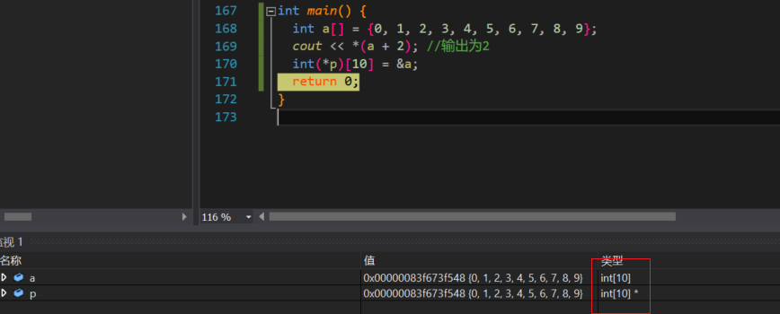


## [#](https://interviewguide.cn/notes/03-hunting_job/02-interview/01-01-02-基础语法.html#_30、extern-c-的用法)30、extern"C"的用法

为了能够**正确的在C++代码中调用C语言**的代码：在程序中加上extern "C"后，相当于告诉编译器这部分代码是C语言写的，因此要按照C语言进行编译，而不是C++；

哪些情况下使用extern "C"：

（1）C++代码中调用C语言代码；

（2）在C++中的头文件中使用；

（3）在多个人协同开发时，可能有人擅长C语言，而有人擅长C++；

举个例子，C++中调用C代码：

```cpp
#ifndef __MY_HANDLE_H__
#define __MY_HANDLE_H__

extern "C"{
    typedef unsigned int result_t;
    typedef void* my_handle_t;
    
    my_handle_t create_handle(const char* name);
    result_t operate_on_handle(my_handle_t handle);
    void close_handle(my_handle_t handle);
}
```

综上，总结出使用方法**，在C语言的头文件中，对其外部函数只能指定为extern类型，C语言中不支持extern "C"声明，在.c文件中包含了extern "C"时会出现编译语法错误。**所以使用extern "C"全部都放在于cpp程序相关文件或其头文件中。

总结出如下形式：

（1）C++调用C函数：  `需要extern c`

```cpp
//xx.h
extern int add(...)

//xx.c
int add(){
    
}

//xx.cpp
extern "C" {
    #include "xx.h"  //在调用的文件中 指定用c去编译
}
```

（2）C调用C++函数   `只需要extern`

```cpp
//xx.h
extern "C"{
    int add();  //原函数文件中 指定用c去编译
}
//xx.cpp
int add(){    
}
//xx.c
extern int add();
```


## [#](https://interviewguide.cn/notes/03-hunting_job/02-interview/01-01-03-基础语法.html#_50、从汇编层去解释一下引用)50、`从汇编层去解释一下引用`

```cpp
9:      int x = 1;

00401048  mov     dword ptr [ebp-4],1

10:     int &b = x;

0040104F   lea     eax,[ebp-4]

00401052  mov     dword ptr [ebp-8],eax
```

x的地址为ebp-4，b的地址为ebp-8，因为栈内的变量内存是从高往低进行分配的，所以b的地址比x的低。

lea eax,[ebp-4] 这条语句将`x的地址`ebp-4放入`eax寄存器`

mov dword ptr [ebp-8],eax 这条语句将`eax的值放入b的地址`

ebp-8中上面两条汇编的作用即：将x的地址存入变量b中，这不和将某个变量的地址存入指针变量是一样的吗？`所以从汇编层次来看，的确引用是通过指针来实现的。`


## [#](https://interviewguide.cn/notes/03-hunting_job/02-interview/01-01-03-基础语法.html#_55、malloc申请的存储空间能用delete释放吗)55、`malloc申请的存储空间能用delete释放吗`?

`不能`，malloc /free主要为了兼容C，new和delete `完全可以取代`malloc /free的。

malloc /free的操作对象都是必须明确大小的，而且不能用在`动态类`上。

new 和delete会自动进行类型检查和大小，malloc/free不能执行构造函数与析构函数，所以`动态对象它是不行的`。

<u>当然从理论上说使用malloc申请的内存是可以通过delete释放的。不过一般不这样写的。而且也不能保证每个C++的运行时都能正常。</u>

> malloc 然后直接delete void*是未定义行为, 效果不定, 因为void *不是一个对象
>
> 如果这样
>
> ```c++
> int main() {
>   int *num = (int *)malloc(10 * sizeof(int));
>   delete num;
>   return 0;
> }
> ```
>
> 是没有问题的, 只是会报警告C6280


## [#](https://interviewguide.cn/notes/03-hunting_job/02-interview/01-01-03-基础语法.html#_56、malloc与free的实现原理)56、malloc与free的实现原理？

1. 在标准C库中，提供了malloc/free函数分配释放内存，这两个函数底层是由`brk`、`mmap`、，`munmap`这些系统调用实现的;

2. `brk`是将数据段(.data)的`最高地址指针`_edata`往高地址推`,mmap是在进程的虚拟地址空间中（堆和栈中间，称为文件映射区域的地方）`找一块空闲的虚拟内存`。这两种方式分配的都是虚拟内存，==<u>没有分配物理内存</u>==。在第一次访问已分配的虚拟地址空间的时候，发生缺页中断，操作系统负责分配物理内存，然后建立虚拟内存和物理内存之间的映射关系；

3. malloc`小于128k`的内存，使用`brk`分配内存，将_edata往高地址推；malloc`大于128k`的内存，使用`mmap`分配内存，在堆和栈之间找一块空闲内存分配；brk分配的内存需要等到高地址内存释放以后才能释放，而mmap分配的内存可以单独释放。当最高地址空间的空闲内存超过128K（可由M_TRIM_THRESHOLD选项调节）时，执行内存紧缩操作（trim）。在上一个步骤free的时候，发现最高地址空闲内存超过128K，于是内存紧缩。

4. malloc是从堆里面申请内存，也就是说函数返回的指针是指向堆里面的一块内存。操作系统中有一个记录空闲内存地址的链表。当操作系统收到程序的申请时，就会遍历该链表，然后就寻找第一个空间大于所申请空间的堆结点，然后就将该结点从空闲结点链表中删除，并将该结点的空间分配给程序。


## [#](https://interviewguide.cn/notes/03-hunting_job/02-interview/01-01-03-基础语法.html#_57、malloc、realloc、calloc的区别)57、malloc、realloc、calloc的区别

malloc函数

```cpp
void* malloc(unsigned int num_size);
int *p = malloc(20*sizeof(int));
```

​	申请20个int类型的空间；

calloc函数

```cpp
void* calloc(size_t num, size_t size);
int *p = calloc(20, sizeof(int));
```

​	`省去了人为空间计算`；malloc申请的空间的值是随机初始化的，calloc申请的空间的值是`初始化为0`的；

​	calloc() 在内存中动态地分配 num 个长度为 size 的连续空间，并将每一个字节都初始化为 0。所以它的结果是分配了 num*size 个字节长度的内存空间，并且每个字节的值都是0。

realloc函数

```cpp
void realloc(void *p, size_t new_size);
```

​	给动态分配的空间`分配额外的空间`，用于`扩充`容量。


## [#](https://interviewguide.cn/notes/03-hunting_job/02-interview/01-01-04-基础语法.html#_62、对象复用的了解-零拷贝的了解)62、`对象复用`的了解，`零拷贝`的了解

**对象复用**

对象复用其本质是一种设计模式：`Flyweight享元模式`。

通过将对象存储到“对象池”中实现对象的重复利用，这样可以`避免多次创建重复对象的开销`，节约系统资源。

> `线程池?`

**零拷贝**

零拷贝就是一种避免 CPU 将数据从一块存储拷贝到另外一块存储的技术。

零拷贝技术可以减少数据拷贝和共享总线操作的次数。

在C++中，vector的一个成员函数**emplace_back()**很好地体现了零拷贝技术，它跟push_back()函数一样可以将一个元素插入容器尾部，区别在于：**使用push_back()函数需要调用拷贝构造函数和转移构造函数，而使用emplace_back()插入的元素原地构造，不需要触发拷贝构造和转移构造**，效率更高。举个例子：

```cpp
#include <vector>
#include <string>
#include <iostream>
using namespace std;

struct Person
{
    string name;
    int age;
    //初始构造函数
    Person(string p_name, int p_age): name(std::move(p_name)), age(p_age)
    {
         cout << "I have been constructed" <<endl;
    }
     //拷贝构造函数
     Person(const Person& other): name(std::move(other.name)), age(other.age)
    {
         cout << "I have been copy constructed" <<endl;
    }
     //转移构造函数
     Person(Person&& other): name(std::move(other.name)), age(other.age)
    {
         cout << "I have been moved"<<endl;
    }
};

int main()
{
    vector<Person> e;
    cout << "emplace_back:" <<endl;
    e.emplace_back("Jane", 23); //不用构造类对象

    vector<Person> p;
    cout << "push_back:"<<endl;
    p.push_back(Person("Mike",36));
    return 0;
}
//输出结果：
//emplace_back:
//I have been constructed
//push_back:
//I have been constructed
//I am being moved.
```


## [#](https://interviewguide.cn/notes/03-hunting_job/02-interview/01-01-04-基础语法.html#_65、c-的四种强制转换reinterpret-cast-const-cast-static-cast-dynamic-cast)65、C++的`四种强制转换`reinterpret_cast/const_cast/static_cast /dynamic_cast

**reinterpret_cast**

reinterpret_cast < type-id> (expression)

type-id 必须是一个指针、引用、算术类型、函数指针或者成员指针。它可以用于类型之间进行强制转换。

> 二进制层面的转换 比较强大比较狠 但是不好控制 类似c风格的void*强转

**const_cast**

const_cast<type_id> (expression)

该运算符用来`修改类型的const或volatile属性`。除了const 或volatile修饰之外， type_id和expression的类型是一样的。用法如下：

- 常量指针被转化成非常量的指针，并且仍然指向原来的对象
- 常量引用被转换成非常量的引用，并且仍然指向原来的对象
- const_cast一般用于`修改底指针`。如const char *p形式

**static_cast**

static_cast < type-id > (expression)

该运算符把expression转换为type-id类型，但没有运行时类型检查来保证转换的安全性。它主要有如下几种用法：

- 用于类层次结构中基类（父类）和派生类（子类）之间指针或引用引用的转换
  - 进行上行转换（把派生类的指针或引用转换成基类表示）是安全的  `(信息少转信息多 安全)`
  - 进行下行转换（把基类指针或引用转换成派生类表示）时，由于没有动态类型检查，所以是不安全的 `(信息少转信息多 用dynamic_cast)`
- 用于`基本数据类型`之间的转换，如把int转换成char，把int转换成enum。这种转换的安全性也要开发人员来保证。
- <u>把空指针转换成目标类型的空指针</u> 
- 把任何类型的表达式转换成`void`类型

注意：static_cast不能转换掉expression的const、volatile、或者__unaligned属性。

**dynamic_cast**

`有类型检查`，基类向派生类转换比较安全，但是派生类向基类转换则不太安全  `(安全的 父类转子类)`

dynamic_cast < type-id> (expression)

该运算符把expression转换成type-id类型的对象。type-id 必须是类的指针、类的引用或者void*

如果 type-id 是类指针类型，那么expression也必须是一个指针，如果 type-id 是一个引用，那么 expression 也必须是一个引用

dynamic_cast运算符可以在执行期决定真正的类型，也就是说expression必须是多态类型。如果下行转换是安全的（也就说，如果基类指针或者引用确实指向一个派生类对象）这个运算符会传回适当转型过的指针。如果 如果下行转换不安全，这个运算符会传回空指针（也就是说，基类指针或者引用没有指向一个派生类对象）

dynamic_cast主要用于类层次间的上行转换和下行转换，还可以用于类之间的交叉转换

在类层次间进行上行转换时，dynamic_cast和static_cast的效果是一样的

在进行下行转换时，dynamic_cast具有类型检查的功能，比static_cast更安全

举个例子：

```cpp
#include <bits/stdc++.h>
using namespace std;

class Base
{
public:
	Base() :b(1) {}
	virtual void fun() {};
	int b;
};

class Son : public Base
{
public:
	Son() :d(2) {}
	int d;
};

int main()
{
	int n = 97;

	//reinterpret_cast
	int *p = &n;
	//以下两者效果相同
	char *c = reinterpret_cast<char*> (p); 
	char *c2 =  (char*)(p);
	cout << "reinterpret_cast输出："<< *c2 << endl;
	//const_cast
	const int *p2 = &n;
	int *p3 = const_cast<int*>(p2);
	*p3 = 100;  //原来这里是不能够修改的 因为const是底层 修饰的是值 值不可更改 但是转换去掉了const特性
	cout << "const_cast输出：" << *p3 << endl;
	
	Base* b1 = new Son;
	Base* b2 = new Base;

	//static_cast
	Son* s1 = static_cast<Son*>(b1); //同类型转换
	Son* s2 = static_cast<Son*>(b2); //下行转换，不安全
	cout << "static_cast输出："<< endl;
	cout << s1->d << endl;
	cout << s2->d << endl; //下行转换，原先父对象没有d成员，输出垃圾值

	//dynamic_cast
	Son* s3 = dynamic_cast<Son*>(b1); //同类型转换
	Son* s4 = dynamic_cast<Son*>(b2); //下行转换，安全
	cout << "dynamic_cast输出：" << endl;
	cout << s3->d << endl;
	if(s4 == nullptr)
		cout << "s4指针为nullptr" << endl;
	else
		cout << s4->d << endl;
	
	
	return 0;
}
//输出结果
//reinterpret_cast输出：a
//const_cast输出：100
//static_cast输出：
//2
//-33686019
//dynamic_cast输出：
//2
//s4指针为nullptr
```

从输出结果可以看出，在进行下行转换时，dynamic_cast安全的，如果下行转换不安全的话其`会返回空指针`，这样在进行操作的时候可以预先判断`(转换完之后我可以if(ptr == nullptr)立马进行判断)`。而使用static_cast下行转换存在不安全的情况也可以转换成功，但是直接使用转换后的对象进行操作容易造成错误。


## [#](https://interviewguide.cn/notes/03-hunting_job/02-interview/01-01-04-基础语法.html#_78、类如何实现只能静态分配和只能动态分配)78、`类如何实现只能静态分配和只能动态分配`

1. <u>前者是把new、delete运算符`重载`为`private`属性。后者是把构造、析构函数设为`protected`属性，再用`子类`来动态创建</u>
2. 建立类的对象有两种方式：
   - 静态建立，静态建立一个类对象，就是由编译器为对象在栈空间中分配内存；
   - 动态建立，A *p = new A();动态建立一个类对象，就是使用new运算符为对象在堆空间中分配内存。这个过程分为两步，第一步执行operator new()函数，在堆中搜索一块内存并进行分配；第二步调用类构造函数构造对象；
3. 只有使用new运算符，对象才会被建立在堆上，因此只要限制new运算符就可以实现类对象只能建立在栈上，可以将new运算符设为私有。


## 81、知道C++中的组合吗？它与继承相比有什么优缺点吗？

**一：继承**

继承是Is a 的关系，比如说Student继承Person,则说明Student is a Person。继承的优点是子类可以重写父类的方法来方便地实现对父类的扩展。

继承的缺点有以下几点：

①：父类的`内部细节`对子类是可见的。

②：子类从父类继承的方法在`编译时就确定`下来了，所以无法在运行期间改变从父类继承的方法的行为。

③：如果对父类的方法做了修改的话（比如增加了一个参数），则子类的方法必须做出相应的修改。所以说`子类与父类是一种高耦合，违背了面向对象思想`。

**二：组合**

<u>组合也就是设计类的时候把`要组合的类的对象`加入到该类中作为自己的`成员变量`。</u>

组合的优点：

①：当前对象只能通过所包含的那个对象去调用其方法，所以所包含的对象的内部`细节`对当前对象时`不可见`的。

②：当前对象与包含的对象是一个`低耦合关系`，如果修改包含对象的类中代码不需要修改当前对象类的代码。

③：当前对象可以在运行时动态的绑定所包含的对象。可以通过set方法给所包含对象赋值。 `就是可以通过成员函数给(private)成员重新赋值`

组合的缺点：①：容易产生`过多的对象`。②：为了能组合多个对象，必须仔细对接口进行定义。 `(一般对应一个set 一个get)`


## [#](https://interviewguide.cn/notes/03-hunting_job/02-interview/01-01-05-基础语法.html#_82、函数指针)82、函数指针？

**1) 什么是函数指针?**

函数指针指向的是特殊的数据类型，函数的类型是由其返回的数据类型和其参数列表共同决定的，而函数的名称则不是其类型的一部分。

一个具体函数的名字，如果后面不跟调用符号(即括号)，则该名字就是该函数的指针(注意：大部分情况下，可以这么认为，但这种说法并不很严格)。

**2) 函数指针的声明方法**

int (*pf)(const int&, const int&); (1)     `星在括号里面才是函数指针`

上面的pf就是一个函数指针，指向所有返回类型为int，并带有两个const int&参数的函数。注意`*pf两边的括号是必须`的，否则上面的定义就变成了：

int *pf(const int&, const int&); (2)   <u>==这个就是普通的函数声明==</u>

而这声明了一个函数pf，其返回类型为int *， 带有两个const int&参数。

`**3) 为什么有函数指针**`

函数与数据项相似，函数也有地址。<u>我们希望在同一个函数中通过使用相同的形参在不同的时间使用产生不同的效果</u>。

> 1. 为了代码更加简短 简写ifelse 或者switch    条件和函数指针都作为数组 实现条件和函数的映射
>
>    
>
> 2. `回调函数 把函数昨晚参数传进对应的处理函数中 比如qt的信号槽 mfc的按钮响应绑定` 类比 C++标准库的std::sort函数，std::sort函数可以指定一个比较函数作为参数，这样sort的调用者可以根据需要自行指定如何进行比较。

**4) 一个函数名就是一个指针，它指向函数的代码。**

一个函数地址是该函数的进入点，也就是调用函数的地址。函数的调用可以通过函数名，也可以通过指向函数的指针来调用。函数指针还允许将函数作为变元传递给其他函数；

**5) 两种方法赋值：**

指针名 = 函数名； 指针名 = &函数名


## [#](https://interviewguide.cn/notes/03-hunting_job/02-interview/01-01-05-基础语法.html#_85、-函数调用过程栈的变化-返回值和参数变量哪个先入栈)85、 `函数调用过程栈的变化`，返回值和参数变量哪个先入栈？


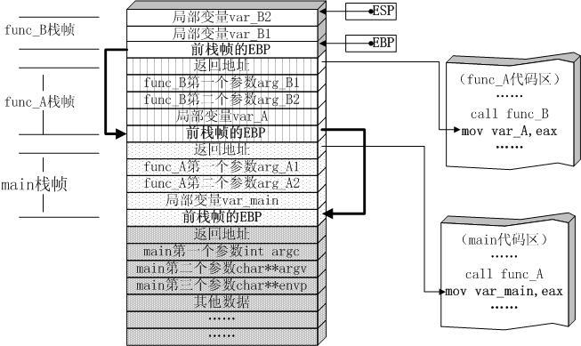

> 暂时这么记吧:
>
> 调用者也就是`上层的栈帧信息`->被调用函数内的`局部变量`->被调用函数的`参数 从右到左`->被调用函数的`返回地址`
>
> <u>注意: 32位和64位的压参顺序不一样 64位先拷贝到寄存器 从左到右压栈</u>  好像?

## [#](https://interviewguide.cn/notes/03-hunting_job/02-interview/01-01-05-基础语法.html#_87、你知道printf函数的实现原理是什么吗)87、你知道printf函数的实现原理是什么吗？

在C/C++中，对函数参数的扫描是从后向前的。

C/C++的函数参数是通过压入堆栈的方式来给函数传参数的（堆栈是一种先进后出的数据结构），最先压入的参数最后出来，在计算机的内存中，数据有2块，一块是堆，一块是栈（函数参数及局部变量在这里），而栈是从内存的高地址向低地址生长的，控制生长的就是堆栈指针了，最先压入的参数是在最上面，就是说在所有参数的最后面，最后压入的参数在最下面，结构上看起来是第一个，所以最后压入的参数总是能够被函数找到，因为它就在堆栈指针的上方。

printf的第一个被找到的参数就是那个`字符指针`，就是被双引号括起来的那一部分，函数通过`判断字符串里控制参数的个数来判断参数个数及数据类型`，通过这些就可<u>算出数据需要的堆栈指针的偏移量</u>了


## [#](https://interviewguide.cn/notes/03-hunting_job/02-interview/01-01-05-基础语法.html#_90、cout和printf有什么区别)90、cout和printf有什么区别？

cout<<是一个函数，cout<<后可以跟不同的类型是因为cout<<已存在针对各种类型数据的重载，所以会自动识别数据的类型。

输出过程会首先将输出字符放入缓冲区，然后输出到屏幕。

cout是有缓冲输出:

```cpp
cout < < "abc " < <endl; 
或cout < < "abc\n "; cout < <flush; 这两个才是一样的.
```

flush立即强迫缓冲输出。

printf是行缓冲输出，不是无缓冲输出。

> 缓冲区说不清楚就不说了:
>
> cout是c++的 printf是c的
>
> cout比printf慢


## [#](https://interviewguide.cn/notes/03-hunting_job/02-interview/01-01-05-基础语法.html#_93、定义和声明的区别)93、定义和声明的区别

> `变量:只有extern int globaldata是声明  extern int globaldata = 1就是定义了  int a 是定义了`

**如果是指变量的声明和定义：** 从编译原理上来说，声明是仅仅告诉编译器，有个某类型的变量会被使用，但是编译器并不会为它分配任何内存。而定义就是分配了内存。   

**如果是指函数的声明和定义：** 声明：一般在头文件里，对编译器说：这里我有一个函数叫function() 让编译器知道这个函数的存在。 定义：一般在源文件里，具体就是函数的实现过程 写明函数体。


## [#](https://interviewguide.cn/notes/03-hunting_job/02-interview/01-01-05-基础语法.html#_94、全局变量和static变量的区别)94、全局变量和static变量的区别

1. 全局变量（外部变量）的说明之前再冠以static就构成了静态的全局变量。

   `全局变量本身就是静态存储`方式，静态全局变量当然也是静态存储方式。

   这两者在存储方式上并无不同。这两者的区别在于非静态全局变量的==作用域==是整个源程序，当一个源程序由多个原文件组成时，非静态的全局变量在各个源文件中都是有效的。

   而静态全局变量则限制了其作用域，即只在定义该变量的源文件内有效，在同一源程序的其它源文件中不能使用它。由于静态全局变量的作用域限于一个源文件内，只能为该源文件内的函数公用，因此可以避免在其他源文件中引起错误。

   static全局变量与普通的全局变量的区别是static全局变量`只初始化一次`，防止在其他文件单元被引用。

   > 变量的话
   >
   > 1. 都是静态存储 但是作用域不同
   > 2. static只能初始化一次

2. static函数与普通函数有什么区别？ static函数与普通的函数`作用域`不同。尽在本文件中。只在当前源文件中使用的函数应该说明为内部函数（static），内部函数应该在当前源文件中说明和定义。

   对于可在当前源文件以外使用的函数应该在一个头文件中说明，要使用这些函数的源文件要包含这个头文件。 static函数与普通函数最主要区别是static函数在内存中只有一份，普通静态函数在每个被调用中维持一份拷贝程序的局部变量存在于（堆栈）中，全局变量存在于（静态区）中，动态申请数据存在于（堆）

   > 函数的话 
   >
   > 1. 作用域不同 普通静态函数只能在本文件中
   > 2. 静态成员函数只能通过类空间::调用


## [#](https://interviewguide.cn/notes/03-hunting_job/02-interview/01-01-05-基础语法.html#_95、-静态成员与普通成员的区别是什么)95、 静态成员与普通成员的区别是什么？

1. 生命周期

   静态成员变量从类被加载开始到类被卸载，`一直存在`；

   普通成员变量只有在类创建对象后才开始存在，对象结束，它的生命期结束；

2. 共享方式

   静态成员变量是`全类共享`；普通成员变量是每个对象单独享用的；

3. 定义位置

   普通成员变量存储在栈或堆中，而静态成员变量存储在`静态全局区`；

4. 初始化位置

   普通成员变量在类中初始化；静态成员变量在`类外初始化`；

5. 默认实参

   可以使用静态成员变量作为默认实参，   `意思也就是 你不属于某个对象你牛逼你了不起 你可以当个常量用` ???


## [#](https://interviewguide.cn/notes/03-hunting_job/02-interview/01-01-05-基础语法.html#_99、如何在不使用额外空间的情况下-交换两个数-你有几种方法)99、如何在不使用额外空间的情况下，交换两个数？你有几种方法

```cpp
1)  算术
x = x+y;
y = x-y;
x = x-y;

2)  异或

x = x^y;// 只能对int,char..
 y = x^y;
 x = x^y;
 x ^= y ^= x;
```

## [#](https://interviewguide.cn/notes/03-hunting_job/02-interview/01-01-05-基础语法.html#_100、你知道strcpy和memcpy的区别是什么吗)100、你知道strcpy和memcpy的区别是什么吗？

1. 复制的内容不同。strcpy只能复制字符串，而memcpy可以复制任意内容，例如字符数组、整型、结构体、类等。 

2. 复制的方法不同。strcpy不需要指定长度，它遇到被复制字符的串结束符"\0"才结束，所以容易溢出。memcpy则是根据其第3个参数决定复制的长度。
3. 用途不同。通常在复制字符串时用strcpy，而需要复制其他类型数据时则一般用memcpy

### 字符串拷贝

#### str`cpy`

从src逐字节拷贝到dest，直到遇到'\0'结束，因为没有指定长度，可能会导致拷贝越界，造成缓冲区溢出漏洞,`安全版本是strncpy函数`。

```c++
char* strcpy(char* destination, const char* source){
    if (destination == NULL)
        return NULL;
    char *ptr = destination;
    while (*source != '\0'){
        *destination = *source;
        destination++;
        source++;
    }
    *destination = '\0';
    return ptr;
}
```

#### str`ncpy`

```c++
char *mystrncpy(char *dest, const char *src, size_t count) {
  char *tmp = dest;
  while (count--) {
    if ((*tmp = *src) != 0)
      src++;
    tmp++;
  }
  return dest;
}
```

```c++
  char str[16] = {"hello,world!\n"};
  strncpy(str, "ipc", strlen("ipc"));  //ipclo,world!
  printf("%s\n", str);
  strncpy(str, "ipc\n", strlen("ipc")); ////ipclo,world!
  printf("%s\n", str);
  strncpy(str, "ipc", strlen("ipc") + 1); //ipc  此时ipc<给定大小 str补%0
  printf("%s\n", str);
```

## 101、程序在执行int main(int argc, char *argv[])时的内存结构，你了解吗？

参数的含义是程序在`命令行`下运行的时候，需要输入`argc 个`参数，每个参数是以char 类型输入的，依次存在数组里面，`数组是 argv[]`，所有的参数在指针

char * 指向的内存中，数组的中元素的个数为 argc 个，`第一个参数为程序的名称。`


## [#](https://interviewguide.cn/notes/03-hunting_job/02-interview/01-01-06-基础语法.html#_102、volatile关键字的作用)102、volatile关键字的作用？

volatile 关键字是一种类型修饰符，用它声明的类型变量表示可以被某些编译器未知的因素更改，比如：操作系统、硬件或者其它线程等。遇到这个关键字声明的变量，`编译器对访问该变量的代码就不再进行优化`，从而可以`提供对特殊地址的稳定访问`。声明时语法：int volatile vInt; <u>当要求使用 volatile 声明的变量的值的时候，系统总是重新从它所在的内存读取数据，即使它前面的指令刚刚从该处读取过数据。而且读取的数据立刻被保存。</u>

volatile用在如下的几个地方：

1. 中断服务程序中修改的供其它程序检测的变量需要加volatile；
2. 多任务环境下各任务间共享的标志应该加volatile；
3. 存储器映射的硬件寄存器通常也要加volatile说明，因为每次对它的读写都可能由不同意义；

> 不优化 提供对地址的稳定访问


## [#](https://interviewguide.cn/notes/03-hunting_job/02-interview/01-01-06-基础语法.html#_103、如果有一个空类-它会默认添加哪些函数)103、如果有一个空类，它会默认添加哪些函数？

```cpp
1)  Empty(); // 缺省构造函数//
2)  Empty( const Empty& ); // 拷贝构造函数//
3)  ~Empty(); // 析构函数//
4)  Empty& operator=( const Empty& ); // 赋值运算符//
```

## [#](https://interviewguide.cn/notes/03-hunting_job/02-interview/01-01-06-基础语法.html#_104、c-中标准库是什么)104、C++中标准库是什么？

C++ 标准库可以分为两部分：

- 标准函数库： 这个库是由通用的、独立的、不属于任何类的函数组成的。函数库继承自 C 语言。

- 面向对象类库： 这个库是类及其相关函数的集合。
  1. 输入/输出 I/O、字符串和字符处理、数学、时间、日期和本地化、动态分配、其他、宽字符函数
  2. 标准的 C++ I/O 类、String 类、数值类、STL 容器类、STL 算法、STL 函数对象、STL 迭代器、STL 分配器、本地化库、异常处理类、杂项支持库


## [#](https://interviewguide.cn/notes/03-hunting_job/02-interview/01-01-06-基础语法.html#_105、你知道const-char-与string之间的关系是什么吗)105、你知道const char* 与string之间的关系是什么吗？

1. string 是c++标准库里面其中一个，封装了对字符串的操作，实际操作过程我们可以用const char*给string类初始化
2. 三者的转化关系如下所示：

```cpp
a)  string转const char* 

string s = “abc”; 

const char* c_s = s.c_str(); 

b)  const char* 转string，直接赋值即可 

const char* c_s = “abc”; 
 string s(c_s); 

c)  string 转char* 
 string s = “abc”; 
 char* c; 
 const int len = s.length(); 
 c = new char[len+1]; 
 strcpy(c,s.c_str()); 

d)  char* 转string 
 char* c = “abc”; 
 string s(c); 

e)  const char* 转char* 
 const char* cpc = “abc”; 
 char* pc = new char[strlen(cpc)+1]; 
 strcpy(pc,cpc);

f)  char* 转const char*，直接赋值即可 
 char* pc = “abc”; 
 const char* cpc = pc;
```

### String实现

```c++
class String {
public:
  String(const char *str = nullptr);      // 普通构造函数
  String(const String &other);            // 拷贝构造函数
  ~String(void);                          // 析构函数
  String &operator=(const String &other); // 赋值函数
private:
  char *m_data; // 用于保存字符串
};
//普通构造函数
String::String(const char *str) {
  if (str == NULL) {
    m_data = new char[1];
    *m_data = '\0';
  } else {
    int length = strlen(str);
    m_data = new char[length + 1];
    strcpy(m_data, str);
  }
}
// String的析构函数
String::~String(void) { delete[] m_data; }
//拷贝构造函数
String::String(const String &other){ // 得分点：输入参数为const型
  int length = strlen(other.m_data);
  m_data = new char[length + 1];
  strcpy(m_data, other.m_data);
}
//赋值函数
String &String::operator=(const String &other){ // 得分点：输入参数为const型
  if (this == &other) {
    return *this;
  }
  delete[] m_data;
  m_data = new char[strlen(other.m_data) + 1];
  strcpy(m_data, other.m_data);
  return *this;
}
```

## [#](https://interviewguide.cn/notes/03-hunting_job/02-interview/01-01-06-基础语法.html#_106、你什么情况用指针当参数-什么时候用引用-为什么)106、你什么情况用指针当参数，什么时候用引用，为什么？

> 我一般传数组的时候用指针 因为传数组的话 用引用写起来稍微麻烦
>
> 简单数据类型的话 传值
>
> 负责类对象 或者结构体的话 传引用避免拷贝
>
> `数组啊 多级指针啊 不好使用引用传递`
>
> 通常情况下 更改数据用指针或者引用 不更改数值用const 引用或值传递
>
> ==乱套 瞎j8答吧==

1. 使用引用参数的主要原因有两个：

   程序员能修改调用函数中的数据对象

   通过传递引用而不是整个数据–对象，可以提高程序的运行速度

2. 一般的原则： 对于使用引用的值而不做修改的函数：

   如果数据对象很小，如内置数据类型或者小型结构，则按照值传递；

   如果数据对象是数组，则使用指针（唯一的选择），并且指针声明为指向const的指针；

   如果数据对象是较大的结构，则使用const指针或者引用，已提高程序的效率。这样可以节省结构所需的时间和空间；

   如果数据对象是类对象，则使用const引用（传递类对象参数的标准方式是按照引用传递）；

3. 对于修改函数中数据的函数：

   如果数据是内置数据类型，则使用指针

   如果数据对象是结构，则使用引用或者指针

   如果数据是类对象，则使用引用

   也有一种说法认为：“如果数据对象是数组，则只能使用指针”，这是不对的，比如

```cpp
template<typename T, int N>
void func(T (&a)[N])
{
    a[0] = 2;
}

int main()
{
    int a[] = { 1, 2, 3 };
    func(a);
    cout << a[0] << endl;
    return 0;
}
```

## [#](https://interviewguide.cn/notes/03-hunting_job/02-interview/01-01-06-基础语法.html#_108、如何设计一个计算仅单个子类的对象个数)108、如何设计一个计算仅单个子类的对象个数？

1、为类设计一个static静态变量count作为计数器；

2、类定义结束后初始化count;

3、在构造函数中对count进行+1;

4、 设计拷贝构造函数，在进行拷贝构造函数中进行count +1，操作；

5、设计复制构造函数，在进行复制函数中对count+1操作；

6、在析构函数中对count进行-1；


使用静态成员变量

<u>或者使用`智能指针`啊 设计一个别的对象对他进行计数</u>


## [#](https://interviewguide.cn/notes/03-hunting_job/02-interview/01-01-06-基础语法.html#_112、说一说strcpy、sprintf与memcpy这三个函数的不同之处)112、说一说strcpy、sprintf与memcpy这三个函数的不同之处

1. 操作对象不同

   ① strcpy的两个操作对象均为字符串

   ② sprintf的操作源对象可以是多种数据类型，目的操作对象是字符串

   ③ memcpy的两个对象就是两个任意可操作的内存地址，并不限于何种数据类型。

2. 执行效率不同

   memcpy最高，strcpy次之，sprintf的效率最低。

3. 实现功能不同

   ① strcpy主要实现`字符串`变量间的拷贝

   ② sprintf主要实现`其他数据类型格式到字符串`的转化

   ③ memcpy主要是`内存块`间的拷贝。


## [#](https://interviewguide.cn/notes/03-hunting_job/02-interview/01-01-06-基础语法.html#_114、你知道数组和指针的区别吗)114、你知道`数组名和指针`的区别吗？

int a[10];

int *p = new int[10];

2. 用运算符sizeof 可以计算出数组的容量（字节数）。sizeof(p),p 为指针得到的是一个指针变量的字节数，而不是p 所指的内存容量。
3. 编译器为了简化对数组的支持，实际上是利用指针实现了对数组的支持。具体来说，就是将表达式中的数组元素引用转换为指针加偏移量的引用。
4. 在向函数传递参数的时候，如果实参是一个数组，那用于接受的形参为对应的指针。也就是`传递过去是数组的首地址而不是整个数组，能够提高效率`；
5. 在使用下标的时候，两者的用法相同，都是原地址加上下标值，不过`数组名的原地址就是数组首元素的地址是固定的`，指针的原地址就不是固定的。 a不可以++  p可以++

 

## [#](https://interviewguide.cn/notes/03-hunting_job/02-interview/01-01-06-基础语法.html#_116、-如何禁止程序自动生成拷贝构造函数)116、 如何`禁止程序自动生成`拷贝构造函数？

1. 为了阻止编译器默认生成`拷贝构造函数和拷贝赋值函数`，我们需要手动去`重写`这两个函数，某些情况下，为了避免调用拷贝构造函数和拷贝赋值函数，我们需要将他们设置成`private`，防止被调用。  重点是还有拷贝复制= 会调用拷贝构造
2. 类的成员函数和friend函数还是可以调用private函数，如果这个private函数只声明不定义，则会产生一个连接错误；
3. 针对上述两种情况，我们可以定一个base类，在base类中将拷贝构造函数和拷贝赋值函数设置成private,那么派生类中编译器将不会自动生成这两个函数，且由于base类中该函数是私有的，因此，派生类将阻止编译器执行相关的操作


## [#](https://interviewguide.cn/notes/03-hunting_job/02-interview/01-01-06-基础语法.html#_117、你知道debug和release的区别是什么吗)117、你知道Debug和Release的区别是什么吗？

1. 调试版本，包含调试信息，所以容量比Release大很多，并且不进行任何优化（优化会使调试复杂化，因为源代码和生成的指令间关系会更复杂），便于程序员调试。Debug模式下生成两个文件，除了.exe或.dll文件外，还有一个.`pdb`文件，该文件记录了代码中断点等调试信息；
2. 发布版本，不对源代码进行调试，`编译时对应用程序的速度进行优化，使得程序在代码大小和运行速度上都是最优的`。（调试信息可在单独的PDB文件中生成）。Release模式下生成一个文件.exe或.dll文件。
3. 实际上，Debug 和 Release 并没有本质的界限，他们`只是一组编译选项的集合`，编译器只是按照预定的选项行动。事实上，我们甚至可以修改这些选项，从而得到优化过的调试版本或是带跟踪语句的发布版本。


## [#](https://interviewguide.cn/notes/03-hunting_job/02-interview/01-01-06-基础语法.html#_119、模板会写吗-写一个比较大小的模板函数)119、模板会写吗？写一个比较大小的模板函数

```cpp
#include<iostream> 

using namespace std; 
template<typename type1,typename type2>//函数模板 

type1 Max(type1 a,type2 b) 
{ 
   return a > b ? a : b; 
} 

void main() 
 { 
  cout<<"Max = "<<Max(5.5,'a')<<endl; 
} 
```

其实该模板有个比较隐晦的bug，那就是a、b只有在能进行转型的时候才能进行比较，否则 a > b 这一步是会报错的。

这个时候往往需要对于 > 号进行重载，这代码量瞬间上来了。

```c++
struct Node{
  int a;
  int b;
  Node(int val1 = 0, int val2 = 0){
    a = val1;
    b = val2,
  }
  bool operator > (const& Node other){
    return this->b>other.b;
  }
};
```

## 121、static_cast比C语言中的转换强在哪里？

1. 更加`安全`；
2. 更`直接明显`，能够一眼看出是什么类型转换为什么类型，容易找出程序中的错误；可清楚地辨别代码中每个显式的强制转；可读性更好，`能体现程序员的意图`


## [#](https://interviewguide.cn/notes/03-hunting_job/02-interview/01-01-07-基础语法.html#_122、成员函数里memset-this-0-sizeof-this-会发生什么)122、成员函数里memset(this,0,sizeof(*this))会发生什么

1. 有时候类里面定义了很多int,char,struct等c语言里的那些类型的变量，我习惯在构造函数中将它们初始化为0，但是一句句的写太麻烦，所以直接就memset(this, 0, sizeof *this);将整个对象的内存全部置为0。对于这种情形可以很好的工作，但是下面几种情形是不可以这么使用的；
2. 类含有虚函数表：这么做会破坏虚函数表，后续对虚函数的调用都将出现异常；
3. 类中含有C++类型的对象：例如，类中定义了一个list的对象，由于在构造函数体的代码执行之前就对list对象完成了初始化，假设list在它的构造函数里分配了内存，那么我们这么一做就破坏了list对象的内存。

## [#](https://interviewguide.cn/notes/03-hunting_job/02-interview/01-01-07-基础语法.html#_123、你知道回调函数吗-它的作用)123、你知道回调函数吗？它的作用？

> 信号槽 按钮响应函数 按键绑定 sort的cmp等

1. 当发生某种事件时，系统或其他函数将会自动调用你定义的一段函数；
2. 回调函数就相当于一个中断处理函数，由系统在符合你设定的条件时自动调用。为此，你需要做三件事：1，声明；2，定义；3，设置触发条件，就是在你的函数中把你的回调函数名称转化为地址作为一个参数，以便于系统调用；
3. <u>回调函数就是一个通过函数指针调用的函数。如果你把函数的指针（地址）作为参数传递给另一个函数，当这个指针被用为调用它所指向的函数时，我们就说这是回调函数；</u>
4. 因为可以把调用者与被调用者分开。调用者不关心谁是被调用者，所有它需知道的，只是存在一个具有某种特定原型、某些限制条件（如返回值为int）的被调用函数。


## [#](https://interviewguide.cn/notes/03-hunting_job/02-interview/01-01-07-基础语法.html#_124、什么是一致性哈希)124、[什么是一致性哈希？](https://segmentfault.com/a/1190000021199728)

> 服务器对对象的缓存 更平衡 nginx负载均衡?

**一致性哈希**

一致性哈希算法通过一个叫作一致性哈希环的数据结构实现。这个环的起点是 0，终点是 2^32 - 1，并且起点与终点连接，故这个环的整数分布范围是 [0, 2^32-1]，如下图所示：

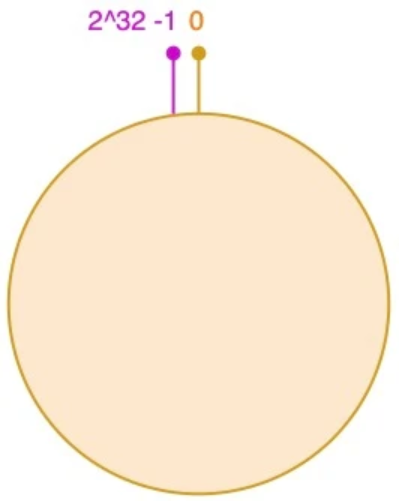

#### 3.1 将对象放置到哈希环

假设我们有 "semlinker"、"kakuqo"、"lolo"、"fer" 四个对象，分别简写为 o1、o2、o3 和 o4，然后使用哈希函数计算这个对象的 hash 值，值的范围是 [0, 2^32-1]：

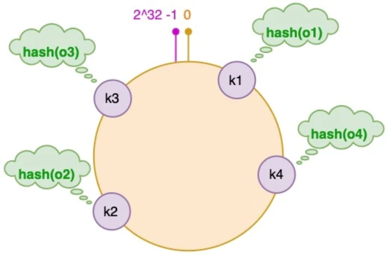

图中对象的映射关系如下：

```abnf
hash(o1) = k1; hash(o2) = k2;
hash(o3) = k3; hash(o4) = k4;
```

#### 3.2 将服务器放置到哈希环

接着使用同样的哈希函数，我们将服务器也放置到哈希环上，可以选择服务器的 IP 或主机名作为键进行哈希，这样每台服务器就能确定其在哈希环上的位置。这里假设我们有 3 台缓存服务器，分别为 cs1、cs2 和 cs3：

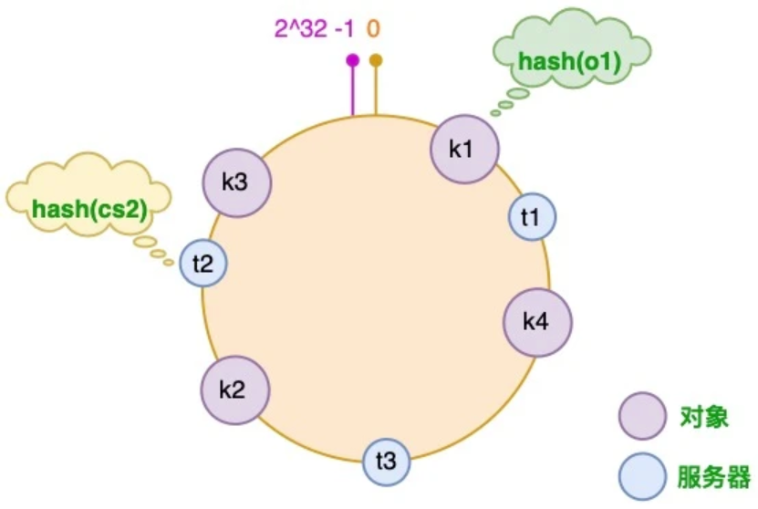

图中服务器的映射关系如下：

```bash
hash(cs1) = t1; hash(cs2) = t2; hash(cs3) = t3; # Cache Server
```

#### 3.3 为对象选择服务器

**将对象和服务器都放置到同一个哈希环后，在哈希环上顺时针查找距离这个对象的 hash 值最近的机器，即是这个对象所属的机器。** 以 o2 对象为例，顺序针找到最近的机器是 cs2，故服务器 cs2 会缓存 o2 对象。而服务器 cs1 则缓存 o1，o3 对象，服务器 cs3 则缓存 o4 对象。

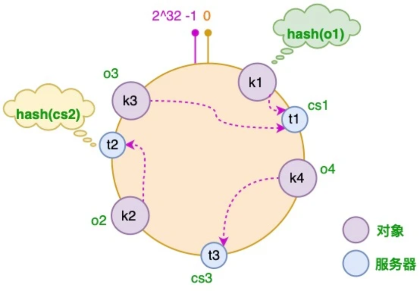

#### 3.4 服务器增加的情况

假设由于业务需要，我们需要增加一台服务器 cs4，经过同样的 hash 运算，该服务器最终落于 t1 和 t2 服务器之间，具体如下图所示：

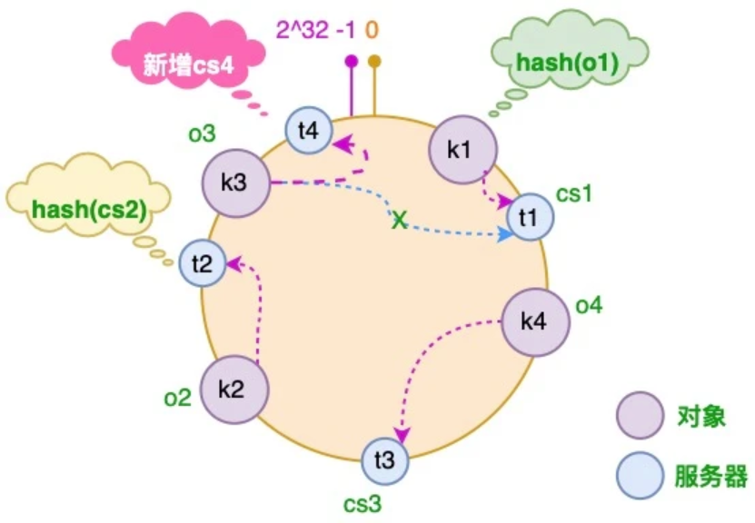

对于上述的情况，只有 t1 和 t2 服务器之间的对象需要重新分配。在以上示例中只有 o3 对象需要重新分配，即它被重新到 cs4 服务器。在前面我们已经分析过，如果使用简单的取模方法，当新添加服务器时可能会导致大部分缓存失效，而使用一致性哈希算法后，这种情况得到了较大的改善，因为只有少部分对象需要重新分配。

#### 3.5 服务器减少的情况

假设 cs3 服务器出现故障导致服务下线，这时原本存储于 cs3 服务器的对象 o4，需要被重新分配至 cs2 服务器，其它对象仍存储在原有的机器上。

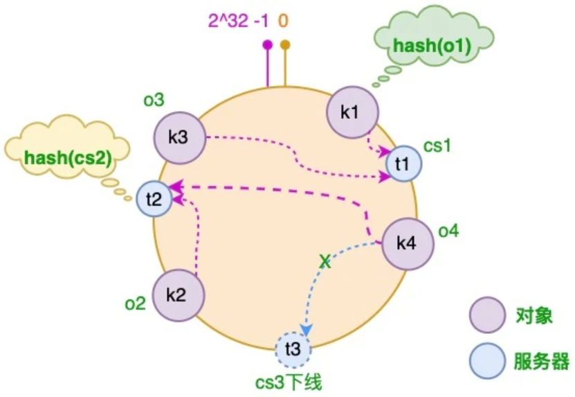

#### 3.6 虚拟节点

> 环上的是虚拟服务器 多个虚拟服务器再映射到物理服务器上, 
>
> 比如插入的新的服务器 是插入了一组虚拟服务器 均匀的分散在了环上,那么也就降低了一组分散的虚拟服务器的压力 每个虚拟服务器再映射到其他的多个服务器上

到这里一致性哈希的基本原理已经介绍完了，但对于新增服务器的情况还存在一些问题。新增的服务器 cs4 只分担了 cs1 服务器的负载，服务器 cs2 和 cs3 并没有因为 cs4 服务器的加入而减少负载压力。如果 cs4 服务器的性能与原有服务器的性能一致甚至可能更高，那么这种结果并不是我们所期望的。

**针对这个问题，我们可以通过引入虚拟节点来解决负载不均衡的问题。即将每台物理服务器虚拟为一组虚拟服务器，将虚拟服务器放置到哈希环上，如果要确定对象的服务器，需先确定对象的虚拟服务器，再由虚拟服务器确定物理服务器。**

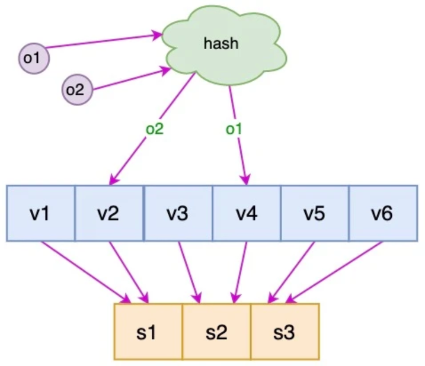

图中 o1 和 o2 表示对象，v1 ~ v6 表示虚拟服务器，s1 ~ s3 表示物理服务器。

### 

## [#](https://interviewguide.cn/notes/03-hunting_job/02-interview/01-01-07-基础语法.html#_126、为什么友元函数必须在类内部声明)126、为什么友元函数必须在类内部声明？

因为编译器必须能够读取这个结构的声明以理解这个数据类型的大、行为等方面的所有规则。

有一条规则在任何关系中都很重要，那就是谁可以访问我的私有部分。

**勘误**

本题问题表达有误，实际上：

友元函数不一定要在类内声明，`普通的友元函数可以在类外声明`，也可以在`类内`声明。

只有==友元工厂==才必须用到类内声明友元函数。


## [#](https://interviewguide.cn/notes/03-hunting_job/02-interview/01-01-07-基础语法.html#_133、为什么不能把所有的函数写成内联函数)133、为什么不能把所有的函数写成内联函数? 

内联函数以代码复杂为代价，它以省去函数调用的开销来提高执行效率。所以一方面如果内联函数体内代码执行时间相比函数调用开销较大，则没有太大的意义；另一方面每一处内联函数的调用都要复制代码，消耗更多的内存空间，因此以下情况不宜使用内联函数：

- 函数体内的代码比较长，将导致`内存消耗代价`
- 函数体内有`循环`，函数执行时间要比函数调用开销大

==<u>**编译时展开**</u>==


## [#](https://interviewguide.cn/notes/03-hunting_job/02-interview/01-01-07-基础语法.html#_134、为什么c-没有垃圾回收机制-这点跟java不太一样。)134、为什么C++没有垃圾回收机制？这点跟Java不太一样。

- 首先，实现一个垃圾回收器会带来`额外的空间和时间开销`。你需要开辟一定的空间保存指针的引用计数和对他们进行标记mark。然后需要单独开辟一个线程在空闲的时候进行free操作。
- 垃圾回收会使得C++不适合进行很多`底层的操作`。


## 如何设计一个Log日志系统，能满足多方面需求：如控制台输出，本地保存，socket到服务器备份。日志具有不同的等级。

1. 单例模式保证只有一个日志器
2. 使用static保证不同模块的日志器相互不影响
3. 策略模式实现不同日志级别的控制
4. 中间件保证跨平台的日志系统
5. 装饰器模式实现对输出位置的控制
6. 消息队列+多线程实现异步输出
7. 互斥锁或者读写锁保证日志的并发输出
8. socket在增加输出位置的时候做初始化, 连接远端服务器备份, 序列化和数据压缩
9. 考虑使用:
   1. 序列化结构 + 数据压缩 减小文件大小
   2. 宏多态 + raii(析构)避免内存泄漏, 并简化输出语句(写宏就可以了)
   3. 对不同级别的日志分文件写入并适当考虑删除冗余数据(级别信息)
   4. 增加日志格式器, 实现不同日志格式输出(如控制台只做简单的日志信息输出, 文件进行详细日志输出)
   5. redis持久化
