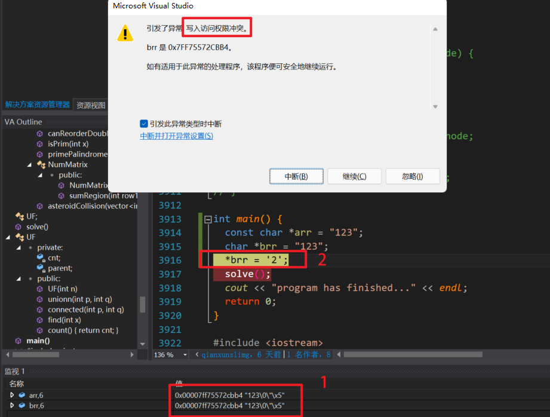
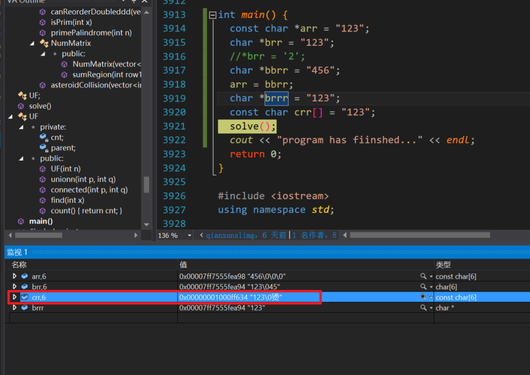
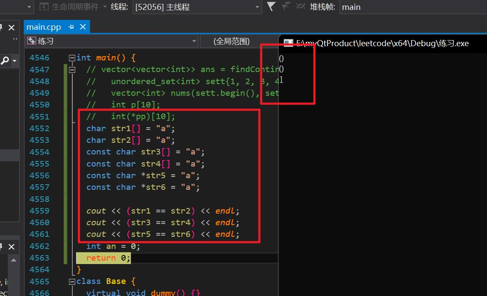
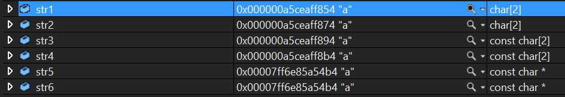

const char * arr = "123";

> //字符串123保存在常量区，const本来是修饰arr指向的值不能通过arr去修改，但是字符串“123”在常量区，本来就不能改变，`所以加不加const效果都一样`

char * brr = "123";（vs下不加const报错）

> //字符串123保存在常量区，这个arr指针指向的是同一个位置，同样不能通过brr去修改"123"的值

const char crr[] = "123";

> //这里123本来是在栈上的，但是编译器可能会做某些优化，将其放到常量区

char drr[] = "123";     `//保存在栈区 只有这个可以修改`

> //字符串123保存在栈区，可以通过drr去修改

 

### 运行分析



1. const char * arr = "123" 和 char * brr = "123"都保存在常量区 值相同 猜测可能是处理器优化 索性`指向了同一地址`
2. 由于两者都分配在了常量区 只是指向他们的指针不同 所以`不能通过指针去修改常量区的字符串`
3. char* 和 const char* 指针的指向是可以修改的 例如 char* bbrr = "456"; brr = bbrr;



1. const char crr[] = "123";明显与其他“123”的地址不同，因为其是字符串数组 const修饰数组不可修改。<u>crr[0] = '2'提示crr是不可修改的左值</u> 

2. char crr[] 本身crr指向就是不可更改的 也不能++-- 

   ```c++
     int *pp = new int(1);
     int ppp[3];
     ppp[0] = 2;
     ppp[1] = 3;
     ppp[2] = 4;
   
     //   ppp = pp; //不可
     pp = ppp;  //可
   ```

网上详细总计的char

```c++
  const char *p1 = "Hello world"; // p1 指向的地址可更改
  // 但是不可更改p指向的内容，比如*p1='c'是错误的
  p1 = "New Hello world"; // ok
  p1[0] = 'c';            // Compile ERROR !!!

  char const *p2 = "Hello world"; // 同p1
  p2 = "New Hello world";         // ok
  p2[0] = 'c';                    // Compile ERROR !!!
  char str[] = "Hello world";

  char *const p3 = str; // p3指向地址不可更改，但是可以更改所指向地址内容
  p3 = "New Hello world"; // Compile ERROR !!!
  p3[0] = 'c';            // ok
  p3[1] = 'p';            // ok
  p3[2] = 'p';            // ok

  char const *const p4 = "Hello world"; // p4指向地址和内容均不可更改
  p4 = "New Hello world";               // ERROR !!!
  p4[0] = 'c';                          // ERROR !!!
  const char *const p5 = "Hello world"; // 同p4
```




