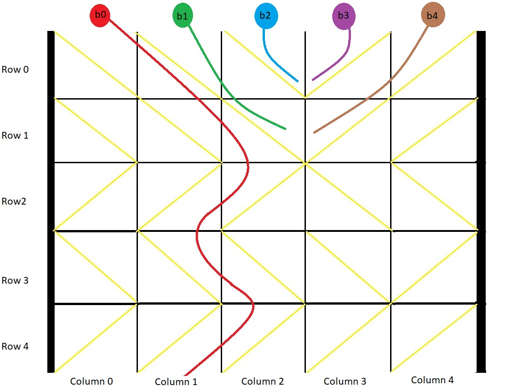
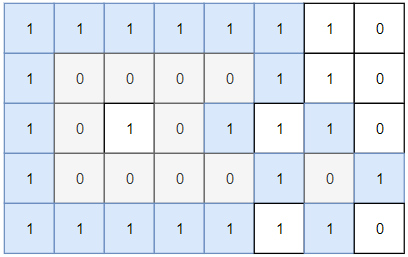
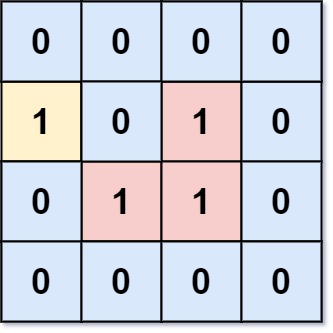
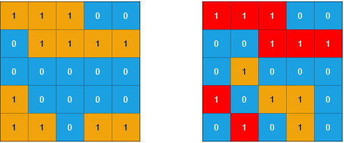
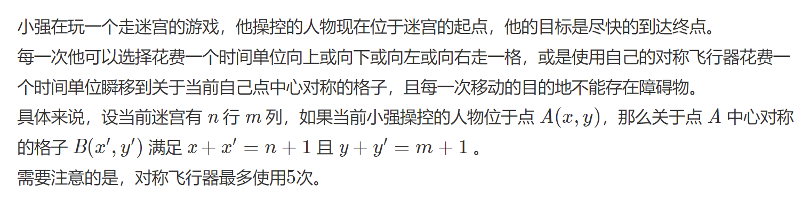
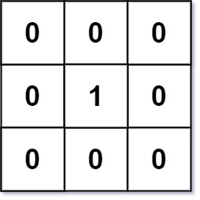
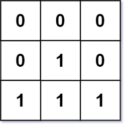
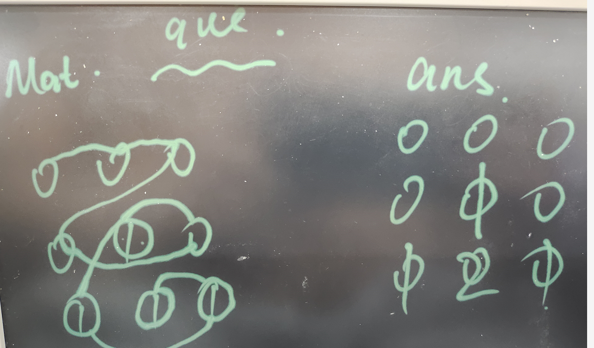
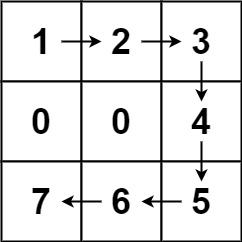

# dfs

### [54. 螺旋矩阵](https://leetcode.cn/problems/spiral-matrix/) 不是dfs 但是有四个方向

[labuladong 题解](https://labuladong.github.io/article/?qno=54)

难度中等1118

给你一个 `m` 行 `n` 列的矩阵 `matrix` ，请按照 **顺时针螺旋顺序** ，返回矩阵中的所有元素。

 

**示例 1：**


```
输入：matrix = [[1,2,3],[4,5,6],[7,8,9]]
输出：[1,2,3,6,9,8,7,4,5]
```

**示例 2：**


```
输入：matrix = [[1,2,3,4],[5,6,7,8],[9,10,11,12]]
输出：[1,2,3,4,8,12,11,10,9,5,6,7]
```

#### 模拟

```c++
class Solution {
public:
  vector<vector<int>> dir{{0, 1}, {1, 0}, {0, -1}, {-1, 0}};
  vector<int> spiralOrder(vector<vector<int>> &matrix) {
    int m = matrix.size();
    if(m == 0) return {};
    int n = matrix[0].size();
    vector<int> ans;
    vector<vector<bool>> used(m, vector<bool>(n, 0));
    int index = 0;
    int row = 0, col = 0;
    for (int i = 0; i < m * n; i++) {
      ans.push_back(matrix[row][col]);
      //temp判断是否撞墙 或者撞到之前走过的
      //撞到的话 就顺时针转向
      int tempRow = row + dir[index % 4][0];
      int tempCol = col + dir[index % 4][1];
      if (tempRow < 0 || tempCol < 0 || tempRow >= m || tempCol >= n || used[tempRow][tempCol]) {
        index++;
      } 
      used[row][col] = 1;
      row += dir[index%4][0];
      col += dir[index%4][1];
    }
    return ans;
  }
};
```


### [1706. 球会落何处](https://leetcode.cn/problems/where-will-the-ball-fall/)

难度中等135

用一个大小为 `m x n` 的二维网格 `grid` 表示一个箱子。你有 `n` 颗球。箱子的顶部和底部都是开着的。

箱子中的每个单元格都有一个对角线挡板，跨过单元格的两个角，可以将球导向左侧或者右侧。

- 将球导向右侧的挡板跨过左上角和右下角，在网格中用 `1` 表示。
- 将球导向左侧的挡板跨过右上角和左下角，在网格中用 `-1` 表示。

在箱子每一列的顶端各放一颗球。每颗球都可能卡在箱子里或从底部掉出来。如果球恰好卡在两块挡板之间的 "V" 形图案，或者被一块挡导向到箱子的任意一侧边上，就会卡住。

返回一个大小为 `n` 的数组 `answer` ，其中 `answer[i]` 是球放在顶部的第 `i` 列后从底部掉出来的那一列对应的下标，如果球卡在盒子里，则返回 `-1` 。

 

**示例 1：**



```
输入：grid = [[1,1,1,-1,-1],[1,1,1,-1,-1],[-1,-1,-1,1,1],[1,1,1,1,-1],[-1,-1,-1,-1,-1]]
输出：[1,-1,-1,-1,-1]
解释：示例如图：
b0 球开始放在第 0 列上，最终从箱子底部第 1 列掉出。
b1 球开始放在第 1 列上，会卡在第 2、3 列和第 1 行之间的 "V" 形里。
b2 球开始放在第 2 列上，会卡在第 2、3 列和第 0 行之间的 "V" 形里。
b3 球开始放在第 3 列上，会卡在第 2、3 列和第 0 行之间的 "V" 形里。
b4 球开始放在第 4 列上，会卡在第 2、3 列和第 1 行之间的 "V" 形里。
```

#### dfs 模拟滚动

from代表的含义 -1 1代表从从左 右 话过来 0代表从上面掉下 

搞麻烦了 还要分析特殊情况 妈的 自己的代码自己都看不懂了	

```c++
//dfs 模拟滚动
class Solution {
public:
  vector<int> ans;
  vector<int> findBall(vector<vector<int>> &grid) {
    ans.clear();
    for(int i = 0; i<grid[0].size(); i++)
      dfs(grid, 0, i, 0);
    return ans;
  }
  
  void dfs(vector<vector<int>> &grid, int x, int y, int from) {
    if (y < 0 || y >= grid[0].size()) {
      ans.push_back(-1);
      return;
    }
    int temp = from + grid[x][y];
    if (temp == 0) { // 1 + -1 = 0 死角
      ans.push_back(-1);
      return;
    }
    if (x == grid.size() - 1 && from != 0) { //到底
      ans.push_back(y);
      return;
    }
    if (from == 0) { //从上面来 向左右运动
      dfs(grid, x, y + grid[x][y], grid[x][y]);
    }
    //方向相同 向下
    if (from == grid[x][y])
      dfs(grid, x + 1, y, 0);
  }
};
```

#### for循环 模拟

```c++
// for循环 模拟
class Solution {
public:
    vector<int> findBall(vector<vector<int>> &grid) {
        int n = grid[0].size();
        vector<int> ans(n);
        for (int j = 0; j < n; ++j) {
            int col = j; // 球的初始列
            for (auto &row : grid) {
                int dir = row[col];
                col += dir; // 移动球
                if (col < 0 || col == n || row[col] != dir) { // 到达侧边或 V 形
                    col = -1;
                    break;
                }
            }
            ans[j] = col; // col >= 0 为成功到达底部
        }
        return ans;
    }
};
```

## 岛屿问题

#### [200. 岛屿数量](https://leetcode.cn/problems/number-of-islands/)

[labuladong 题解](https://labuladong.github.io/article/?qno=200)[思路](https://leetcode.cn/problems/number-of-islands/#)

难度中等1760

给你一个由 `'1'`（陆地）和 `'0'`（水）组成的的二维网格，请你计算网格中岛屿的数量。

岛屿总是被水包围，并且每座岛屿只能由水平方向和/或竖直方向上相邻的陆地连接形成。

此外，你可以假设该网格的四条边均被水包围。


**示例 1：**

```
输入：grid = [
  ["1","1","1","1","0"],
  ["1","1","0","1","0"],
  ["1","1","0","0","0"],
  ["0","0","0","0","0"]
]
输出：1
```

**示例 2：**

```
输入：grid = [
  ["1","1","0","0","0"],
  ["1","1","0","0","0"],
  ["0","0","1","0","0"],
  ["0","0","0","1","1"]
]
输出：3
```

#### dfs

```c++
class Solution {
public:
    int dir[4][2] = {{1, 0}, {-1, 0}, {0, 1}, {0, -1}};
    int numIslands(vector<vector<char>>& grid) {
      int m = grid.size();
      int n = grid[0].size();
      int ans = 0;
      for(int i = 0; i<m; i++){
        for(int j = 0; j<n; j++){
          if(grid[i][j] == '1'){
            dfs(grid, i, j);
            ans++;
          }
        }
      }
      return ans;
    }

    void dfs(vector<vector<char>>& grid, int x, int y){
      if(x<0 || y<0 || x>=grid.size() || y>=grid[0].size() || grid[x][y] == '0')
        return;
      grid[x][y] = '0';
      for(int i = 0; i<4; i++){
        dfs(grid, x+dir[i][0], y+dir[i][1]);
      }
    }
};
```


### [695. 岛屿的最大面积](https://leetcode.cn/problems/max-area-of-island/)

[labuladong 题解](https://labuladong.github.io/article/?qno=695)[思路](https://leetcode.cn/problems/max-area-of-island/#)

难度中等793

给你一个大小为 `m x n` 的二进制矩阵 `grid` 。

**岛屿** 是由一些相邻的 `1` (代表土地) 构成的组合，这里的「相邻」要求两个 `1` 必须在 **水平或者竖直的四个方向上** 相邻。你可以假设 `grid` 的四个边缘都被 `0`（代表水）包围着。

岛屿的面积是岛上值为 `1` 的单元格的数目。

计算并返回 `grid` 中最大的岛屿面积。如果没有岛屿，则返回面积为 `0` 。

 

**示例 1：**


```
输入：grid = [[0,0,1,0,0,0,0,1,0,0,0,0,0],[0,0,0,0,0,0,0,1,1,1,0,0,0],[0,1,1,0,1,0,0,0,0,0,0,0,0],[0,1,0,0,1,1,0,0,1,0,1,0,0],[0,1,0,0,1,1,0,0,1,1,1,0,0],[0,0,0,0,0,0,0,0,0,0,1,0,0],[0,0,0,0,0,0,0,1,1,1,0,0,0],[0,0,0,0,0,0,0,1,1,0,0,0,0]]
输出：6
解释：答案不应该是 11 ，因为岛屿只能包含水平或垂直这四个方向上的 1 。
```

#### dfs

四个方向进行深搜 因为题目没有要求不能改变原数组 所以可以在原数组上做修改 

遍历过了 就修改数组 `沉没岛屿`  避免重复搜索 （或者用used数组 或者 用set? 用set的话 pair是不行的 需要转换成数字 第几个格子）

```c++
class Solution {
public:
    int dir[4][2] = {{1, 0}, {-1, 0}, {0, 1}, {0, -1}};
    int maxAreaOfIsland(vector<vector<int>>& grid) {
      int m = grid.size();
      int n = grid[0].size();
      int ans = 0;
      for(int i = 0; i<m; i++){
        for(int j = 0; j<n; j++){
          if(grid[i][j] == 1){
            int temp = 0;
            dfs(grid, i, j, temp);
            ans = max(ans, temp);
          }
        }
      }
      return ans;
    }

    void dfs(vector<vector<int>>& grid, int x, int y, int& temp){
      if(x<0 || y<0 || x>=grid.size() || y>=grid[0].size() || grid[x][y] == 0)
        return;
      temp++;
      grid[x][y] = 0;
      for(int i = 0; i<4; i++){
        dfs(grid, x+dir[i][0], y+dir[i][1], temp);
      }
    }
};
```

### [1254. 统计封闭岛屿的数目](https://leetcode.cn/problems/number-of-closed-islands/)

[labuladong 题解](https://labuladong.github.io/article/?qno=1254)[思路](https://leetcode.cn/problems/number-of-closed-islands/#)

难度中等142

二维矩阵 `grid` 由 `0` （土地）和 `1` （水）组成。岛是由最大的4个方向连通的 `0` 组成的群，封闭岛是一个 `完全` 由1包围（左、上、右、下）的岛。

请返回 *封闭岛屿* 的数目。

 

**示例 1：**



```
输入：grid = [[1,1,1,1,1,1,1,0],[1,0,0,0,0,1,1,0],[1,0,1,0,1,1,1,0],[1,0,0,0,0,1,0,1],[1,1,1,1,1,1,1,0]]
输出：2
解释：
灰色区域的岛屿是封闭岛屿，因为这座岛屿完全被水域包围（即被 1 区域包围）。
```

#### 思路

1. 先把与边界相连的 岛屿 处理了 然后在深搜0
2. 设置一个撞到边界的标志位 根据标志位判断是否++

```c++
class Solution {
public:
    vector<vector<int>> dir{{0,1},{0,-1},{1,0},{-1,0}};
    int closedIsland(vector<vector<int>>& grid) {
      int ans = 0;
      for(int i = 0; i<grid.size(); i++){
        for(int j = 0; j<grid[0].size(); j++){
          bool flag = 1;
          if(grid[i][j] == 0){
            infect(grid, i, j, flag);
            if(flag)
              ans++;
          }
        }
      }
      return ans;
    }

    void infect(vector<vector<int>>& grid, int x, int y, bool& flag){
      if(x<0 || x>=grid.size() || y<0 || y>=grid[0].size()){
        flag = 0;//碰到边界 不是岛屿
        return;
      }
      if(grid[x][y]!=0){
        return;
      }
      grid[x][y] = 2;
      for(int i = 0; i<4; i++){
        infect(grid, x+dir[i][0], y+dir[i][1], flag);
      }
    }
};
```

### [1020. 飞地的数量](https://leetcode.cn/problems/number-of-enclaves/)

[labuladong 题解](https://labuladong.github.io/article/?qno=1020)[思路](https://leetcode.cn/problems/number-of-enclaves/#)

难度中等175

给你一个大小为 `m x n` 的二进制矩阵 `grid` ，其中 `0` 表示一个海洋单元格、`1` 表示一个陆地单元格。

一次 **移动** 是指从一个陆地单元格走到另一个相邻（**上、下、左、右**）的陆地单元格或跨过 `grid` 的边界。

返回网格中 **无法** 在任意次数的移动中离开网格边界的陆地单元格的数量。

 

**示例 1：**



```
输入：grid = [[0,0,0,0],[1,0,1,0],[0,1,1,0],[0,0,0,0]]
输出：3
解释：有三个 1 被 0 包围。一个 1 没有被包围，因为它在边界上。
```

#### 和[1254. 统计封闭岛屿的数目](https://leetcode.cn/problems/number-of-closed-islands/) 完全一样


### [1905. 统计子岛屿](https://leetcode.cn/problems/count-sub-islands/)

[labuladong 题解](https://labuladong.github.io/article/?qno=1905)[思路](https://leetcode.cn/problems/count-sub-islands/#)

难度中等61

给你两个 `m x n` 的二进制矩阵 `grid1` 和 `grid2` ，它们只包含 `0` （表示水域）和 `1` （表示陆地）。一个 **岛屿** 是由 **四个方向** （水平或者竖直）上相邻的 `1` 组成的区域。任何矩阵以外的区域都视为水域。

如果 `grid2` 的一个岛屿，被 `grid1` 的一个岛屿 **完全** 包含，也就是说 `grid2` 中该岛屿的每一个格子都被 `grid1` 中同一个岛屿完全包含，那么我们称 `grid2` 中的这个岛屿为 **子岛屿** 。

请你返回 `grid2` 中 **子岛屿** 的 **数目** 。

 

**示例 1：**



```
输入：grid1 = [[1,1,1,0,0],[0,1,1,1,1],[0,0,0,0,0],[1,0,0,0,0],[1,1,0,1,1]], grid2 = [[1,1,1,0,0],[0,0,1,1,1],[0,1,0,0,0],[1,0,1,1,0],[0,1,0,1,0]]
输出：3
解释：如上图所示，左边为 grid1 ，右边为 grid2 。
grid2 中标红的 1 区域是子岛屿，总共有 3 个子岛屿。
```

#### 还是比较简单的dfs

```c++
class Solution {
public:
    vector<vector<int>> dir{{0,1},{0,-1},{1,0},{-1,0}};
    int countSubIslands(vector<vector<int>>& grid1, vector<vector<int>>& grid2) {
      int m = grid2.size();
      int n = grid2[0].size();
      int ans = 0;
      for(int i = 0; i<m; i++){
        for(int j = 0; j<n; j++){
          if(grid2[i][j] == 1){
            bool flag = 0;
            dfs(grid1, grid2, i, j, flag);
            if(!flag)
              ans++;
          }
        }
      }
      return ans;
    }
		//注意：不能使用flag剪枝 必须沉没完整的岛屿
    void dfs(vector<vector<int>>& grid1, vector<vector<int>>& grid2, int x, int y, bool& flag){
      if(x<0 || y<0 || x>=grid2.size() || y>=grid2[0].size() || grid2[x][y] == 0)
        return;

      if(grid1[x][y] == 0){
        flag = 1;
      }
      grid2[x][y] = 0;
      for(int i = 0; i<4; i++){
        dfs(grid1, grid2, x+dir[i][0], y+dir[i][1], flag);
      }
    }
};
```

### 694. 不同的岛屿

给定一个非空01[二维数组](https://so.csdn.net/so/search?q=二维数组&spm=1001.2101.3001.7020)表示的网格，一个岛屿由四连通（上、下、左、右四个方向）的 1 组成，你可以认为网格的四周被海水包围。

请你计算这个[网格](https://so.csdn.net/so/search?q=网格&spm=1001.2101.3001.7020)中共有多少个**形状不同**的岛屿。
两个岛屿被认为是相同的，当且仅当一个岛屿可以通过平移变换（不可以旋转、翻转）和另一个岛屿重合。

```text
样例 1:
11000
11000
00011
00011
给定上图，返回结果 1。

样例 2:
11011
10000
00001
11011
给定上图，返回结果 3。

注意:
11
1
和
 1
11
是不同的岛屿，因为我们不考虑旋转、翻转操作。

注释 :  二维数组每维的大小都不会超过50。
```

#### 思路

- 记录开始BFS或DFS的起点，后续点跟起点做差，存储路径到set中去重，返回 set 的大小

牛逼啊 用set记录相对坐标 最后结果就是set的大小

#### 2.1 BFS

```cpp
class Solution {
public:
    int numDistinctIslands(vector<vector<int>>& grid) {
        if(grid.empty() || grid[0].empty()) return 0;
        int m = grid.size(), n = grid[0].size(), i, j, k, x, y, x0, y0, nx, ny;
        vector<vector<int>> dir = {{1,0},{0,1},{0,-1},{-1,0}};
        set<vector<vector<int>>> s;
        for(i = 0; i < m; ++i)
        {
        	for(j = 0; j < n; ++j)
        	{
        		if(grid[i][j] == 0)
        			continue;
        		x0 = i, y0 = j;
        		queue<vector<int>> q;
        		vector<vector<int>> path;
        		q.push({x0, y0});
        		grid[x0][y0] = 0;//访问过
        		while(!q.empty())
        		{
        			x = q.front()[0];
        			y = q.front()[1];
        			path.push_back({x-x0, y-y0});//路径记录相对坐标
        			q.pop();
        			for(k = 0; k < 4; ++k)
        			{
        				nx = x + dir[k][0];
        				ny = y + dir[k][1];
        				if(nx>=0 && nx<m && ny>=0 && ny<n && grid[nx][ny])
        				{
        					q.push({nx, ny});
        					grid[nx][ny] = 0;//访问过
        				}
        			}
        		}
        		s.insert(path);
        	}
        }
        return s.size();
    }
};
```

172 ms 43.6 MB

#### 2.2 [DFS](https://so.csdn.net/so/search?q=DFS&spm=1001.2101.3001.7020)

```cpp
class Solution {
    vector<vector<int>> dir = {{1,0},{0,1},{0,-1},{-1,0}};
    int m, n;
  	//注意用unordered_set是不行的
    set<vector<vector<int>>> s;
public:
    int numDistinctIslands(vector<vector<int>>& grid) {
        if(grid.empty() || grid[0].empty()) return 0;
        m = grid.size(), n = grid[0].size();
        for(int i = 0, j; i < m; ++i)
        {
            for(j = 0; j < n; ++j)
            {
                if(grid[i][j] == 0)
                    continue;
                vector<vector<int>> path;
                grid[i][j] = 0;//访问过
                DFS(grid,i,j,i,j,path);
                s.insert(path);
            }
        }
        return s.size();
    }

    void DFS(vector<vector<int>>& grid, int x0, int y0, int x, int y, vector<vector<int>>& path)
    {
        path.push_back({x-x0, y-y0});//路径记录相对坐标
        int k, nx, ny;
        for(k = 0; k < 4; ++k)
        {
            nx = x + dir[k][0];
            ny = y + dir[k][1];
            if(nx>=0 && nx<m && ny>=0 && ny<n && grid[nx][ny])
            {
                grid[nx][ny] = 0;//访问过
                DFS(grid, x0, y0, nx, ny, path);
            }
        }
    }
};
```

128 ms 35.8 MB

### [`827. 最大人工岛`](https://leetcode.cn/problems/making-a-large-island/)

难度困难154

给你一个大小为 `n x n` 二进制矩阵 `grid` 。**最多** 只能将一格 `0` 变成 `1` 。

返回执行此操作后，`grid` 中最大的岛屿面积是多少？

**岛屿** 由一组上、下、左、右四个方向相连的 `1` 形成。

 

**示例 1:**

```
输入: grid = [[1, 0], [0, 1]]
输出: 3
解释: 将一格0变成1，最终连通两个小岛得到面积为 3 的岛屿。
```

**示例 2:**

```
输入: grid = [[1, 1], [1, 0]]
输出: 4
解释: 将一格0变成1，岛屿的面积扩大为 4。
```

#### 暴力超时

每一个0变成1 然后dfs

```c++
class Solution {
public:
    int dir[4][2] = {{0, 1}, {1, 0}, {0, -1}, {-1, 0}};
    int largestIsland(vector<vector<int>>& grid) {
      vector<vector<int>> matrix;
      int n = grid.size();
      int ans = 0;
      for(int i = 0; i<n; i++){
        for(int j = 0; j<n; j++){
          if(grid[i][j] == 0){
            matrix = grid;
            int temp = 0;
            matrix[i][j] = 1;
            dfs(matrix, i, j, temp);
            ans = max(ans, temp);
          }
        }
      }
      return ans == 0?n*n:ans;
    }

    void dfs(vector<vector<int>>& grid, int x, int y, int& temp){
      if(x<0 || y<0 || x>=grid.size()||y>=grid[0].size()||grid[x][y] == 0)
        return;
      temp++;
      grid[x][y] = 0;
      for(int i = 0; i<4; i++){
        dfs(grid, x + dir[i][0], y+dir[i][1], temp);
      }
    }
};
```

#### 优化解法

暴力的问题在于每个0都进行了dfs 这是没必要的

1. 每个岛屿进行编号 直接原地修改岛屿的数值 并记录 该编号岛屿记录的面积
2. 遍历所有的0  查看四周存在哪些编号 用哈希进行去重 加起来即为联通的面积 取最大即可

```c++
class Solution {
public:
    bool inArea(vector<vector<int>>& grid, int row, int col) {
        return row >=0 && col >= 0 && row < grid.size() && col < grid[0].size();
    }
  
    int dfs(vector<vector<int>>& grid, int row, int col, int index) {
        if(!inArea(grid, row, col)) {
            return 0;
        }
        if(grid[row][col] != 1) {
            return 0;
        }
        grid[row][col] = index;
        return (1+dfs(grid, row + 1, col, index) + dfs(grid, row - 1, col, index) + dfs(grid, row, col + 1, index) + dfs(grid, row, col - 1, index));
    }
  
    set<int> findNeighbour(vector<vector<int>>& grid, int row, int col) {
        set<int> hashSet;
        if(inArea(grid, row+1, col) && grid[row+1][col] != 0) {
            hashSet.insert(grid[row+1][col]);
        }
        if(inArea(grid, row-1,col) && grid[row-1][col] != 0) {
            hashSet.insert(grid[row-1][col]);
        }
        if(inArea(grid, row, col+1) && grid[row][col+1] != 0) {
            hashSet.insert(grid[row][col+1]);
        }
        if(inArea(grid, row, col-1) && grid[row][col-1] != 0) {
            hashSet.insert(grid[row][col-1]);
        }
        return hashSet;
    }

    int largestIsland(vector<vector<int>>& grid) {
        int row = grid.size();
        int col = grid[0].size();
        int index = 2;
        int max_area = 0;  // max_are 记录最大的岛屿块，返回值初始化的时候设置这个，处理全是岛屿的case
        if(row == 0) {
            return 1;
        }
        unordered_map<int, int> record;
        for(int i = 0; i < row; ++i) {
            for(int j = 0; j < col; ++j) {
                if(grid[i][j] == 1) {
                    int size = dfs(grid, i, j, index);
                    record[index] = size;
                    max_area = std::max(max_area, size);
                    ++index;
                }
            }
        }
        if(max_area == 0) {
            return 1;
        }
        
        for(int i = 0; i < row; ++i) {
            for(int j = 0; j < col; ++j) {
                if(grid[i][j] == 0) {
                    set<int> neighbors = findNeighbour(grid, i, j);
                    if(neighbors.size() < 1) {
                        continue;
                    }
                    set<int>::iterator it = neighbors.begin();
                    int area = 1;
                    for(; it != neighbors.end(); ++it) {
                        area += record[*it]; 
                    }
                    max_area = std::max(max_area, area);
                }
            }
        }
        return max_area;
    }
};

```

# bfs

### 介绍

之前做题一直用的都是dfs，bfs只在层序遍历时用到过 感觉需要整理下bfs

#### dfs是深度优先，一直往深层遍历 思路和回溯有很大的相似

#### bfs是广度优先，在一个节点先遍历周围，遍历完自己这层后，在子节点重复这个步骤

二叉树已经很熟悉了，就是前中后三种遍历和层序遍历的区别

二维矩阵 或者说 图 的bfs从岛屿问题感受下

### [引入 200. 岛屿数量](https://leetcode-cn.com/problems/number-of-islands/)

[labuladong 题解](https://labuladong.github.io/article/?qno=200)[思路](https://leetcode-cn.com/problems/number-of-islands/#)

难度中等1672

给你一个由 `'1'`（陆地）和 `'0'`（水）组成的的二维网格，请你计算网格中岛屿的数量。

岛屿总是被水包围，并且每座岛屿只能由水平方向和/或竖直方向上相邻的陆地连接形成。

此外，你可以假设该网格的四条边均被水包围。

 

**示例 1：**

```
输入：grid = [
  ["1","1","1","1","0"],
  ["1","1","0","1","0"],
  ["1","1","0","0","0"],
  ["0","0","0","0","0"]
]
输出：1
```

dfs很熟悉了 类似的岛屿问题之前我都是用dfs做的 直接给出代码

```c++
class Solution {
public:
    int numIslands(vector<vector<char>>& grid) {
      int land_num = 0;
      for(int i = 0; i<grid.size(); i++){
        for(int j = 0; j<grid[0].size(); j++){
          if(grid[i][j] == '1'){
            dfs(grid, i, j);
            land_num++;
          }
        }
      }
      return land_num;
    }

    void dfs(vector<vector<char>>& grid, int i, int j){
      if(i<0||i>=grid.size()||j<0||j>=grid[0].size()||grid[i][j]!='1') return;
      grid[i][j] = '2';
      dfs(grid, i+1,j);
      dfs(grid, i,j+1);
      dfs(grid, i-1,j);
      dfs(grid, i,j-1);
    }
};
```

#### 下面看一下bfs的写法

- 主循环和思路一类似，不同点是在于搜索某岛屿边界的方法不同。
- bfs 方法：
  - 借用一个队列 queue，判断队列首部节点 (i, j) 是否未越界且为 1：
    - 若是则置零（删除岛屿节点），并将此节点上下左右节点 (i+1,j),(i-1,j),(i,j+1),(i,j-1) 加入队列；
    - 若不是则跳过此节点；
  - 循环 pop 队列首节点，直到整个队列为空，此时已经遍历完此岛屿

```c++
class Solution {
public:
    int numIslands(vector<vector<char>>& grid) {
      int land_num = 0;
      for(int i = 0; i<grid.size(); i++){
        for(int j = 0; j<grid[0].size(); j++){
          if(grid[i][j] == '1'){
            bfs(grid, i, j);
            land_num++;
          }
        }
      }
      return land_num;
    }

    void bfs(vector<vector<char>>& grid, int i, int j){
      queue<pair<int, int>> que;
      que.push(pair<int, int>(i, j));
      while(!que.empty()){
        pair<int, int> node = que.front();
        que.pop();
        i = node.first;
        j = node.second;
        if(i<0||i>=grid.size()||j<0||j>=grid[0].size()||grid[i][j]!='1')
          continue;
        grid[i][j] = '0';
        que.push(pair<int, int>(i + 1, j));
        que.push(pair<int, int>(i - 1, j));
        que.push(pair<int, int>(i, j + 1));
        que.push(pair<int, int>(i, j - 1));
      }
    }
};
```

### 总结

#### 从上题可以看出， bfs是接住了一个<u>队列 和 while循环</u> 类似二叉树的程序遍历 对四周所以接触的节点进行一层一层的遍历

#### 最短路径属于dp问题 可以考虑使用bfs

### [对称飞行器](https://www.nowcoder.com/questionTerminal/ef231526f822489d879949226b4bed65?answerType=1&f=discussion)



链接：https://www.nowcoder.com/questionTerminal/ef231526f822489d879949226b4bed65?answerType=1&f=discussion
来源：牛客网


##### **输入描述:**

```
第一行两个空格分隔的正整数 n,m\mathit n,mn,m ，分别代表迷宫的行数和列数。
接下来 n\mathit nn 行 每行一个长度为 m\mathit mm 的字符串来描述这个迷宫。
其中
. 代表通路。
 代表障碍。
S 代表起点。
E 代表终点。
保证只有一个 S 和 一个 E 。
```

##### **输出描述:**

```
仅一行一个整数表示从起点最小花费多少时间单位到达终点。
如果无法到达终点，输出 -1
```

#### 示例1

##### 输入

```
4 4
#S..
E#..
#...
....
```

##### 输出

```
4
```

##### 说明

```
一种可行的路径是用对称飞行器到达 (4,3) 再向上走一步，再向右走一步，然后使用一次对称飞行器到达终点。
```

#### 思路

1. 最短路径属于dp问题 优先考虑使用bfs dfs复杂会更高 代码也复杂
2. 

#### 代码

```c++
#include<bits/stdc++.h>
using namespace std;

struct NodeAli4 {
  int x;
  int y;
  int lastFly;
  int nowStep;
};

int dirX[4] = {0, 0, 1, -1};
int dirY[4] = {1, -1, 0, 0};

bool checkAli4(NodeAli4 &node, int n, int m, vector<string> &all,
               vector<vector<int>> &visited) {
  return node.x >= 0 && node.x < n && node.y >= 0 && node.y < m &&
         visited[node.x][node.y] == 0 && all[node.x][node.y] != '#';
}

int bfsAli4(NodeAli4 &node, vector<string> &all, vector<vector<int>> &visited,
            int n, int m) {
  queue<NodeAli4> que;
  que.push(node);
  while (!que.empty()) {
    NodeAli4 tempNode = que.front();
    que.pop();
    int x = tempNode.x;
    int y = tempNode.y;
    if (all[x][y] == 'E')
      return tempNode.nowStep;
    //相当于五叉树的层序
    for (int i = 0; i < 5; i++) {
      NodeAli4 nextNode;
      if (i == 4) {
        if (tempNode.lastFly > 0) {
          nextNode.x = n - 1 - x;
          nextNode.y = m - 1 - y;
          nextNode.lastFly = tempNode.lastFly - 1;
          nextNode.nowStep = tempNode.nowStep + 1;
        }
      } else {
        nextNode.x = x + dirX[i];
        nextNode.y = y + dirY[i];
        nextNode.lastFly = tempNode.lastFly;
        nextNode.nowStep = tempNode.nowStep + 1;
      }

      if (checkAli4(nextNode, n, m, all, visited)) {
        que.push(nextNode);
        visited[nextNode.x][nextNode.y] = 1;
      }
    }
  }
  return -1;
}

void ali4() {
  int n, m;
  cin >> n >> m;
  string temp;
  vector<string> all(n);
  vector<vector<int>> visited(n, vector<int>(m));
  for (int i = 0; i < n; i++) {
    cin >> all[i];
  }

  for (int i = 0; i < n; i++) {
    for (int j = 0; j < m; j++) {
      if (all[i][j] == 'S') {
        visited[i][j] = 1;
        NodeAli4 node = {i, j, 5, 0};
        cout << bfsAli4(node, all, visited, n, m);
        return;
      }
    }
  }
}

int main() {
  ali4();
  return 0;
}
```

### [剑指 Offer II 107. 矩阵中的距离](https://leetcode.cn/problems/2bCMpM/)

难度中等22收藏分享切换为英文接收动态反馈

给定一个由 `0` 和 `1` 组成的矩阵 `mat` ，请输出一个大小相同的矩阵，其中每一个格子是 `mat` 中对应位置元素到最近的 `0` 的距离。

两个相邻元素间的距离为 `1` 。

 

**示例 1：**



```
输入：mat = [[0,0,0],[0,1,0],[0,0,0]]
输出：[[0,0,0],[0,1,0],[0,0,0]]
```

**示例 2：**



```
输入：mat = [[0,0,0],[0,1,0],[1,1,1]]
输出：[[0,0,0],[0,1,0],[1,2,1]]
```


#### 解法 bfs

将所有0的位置压入队列，然后进行bfs

按下图走，四周有1是 1变0 坐标入队列 ans位置 = ans pre位置++



```c++
class Solution {
public:
    vector<vector<int>> dirs = {{1, 0}, {-1, 0}, {0, 1}, {0, -1}};
    vector<vector<int>> updateMatrix(vector<vector<int>>& mat) {
        int n = mat.size(), m = mat[0].size();
        vector<vector<int>> ans(n, vector<int>(m, 0));
        queue<pair<int, int>> que;
        for (int i = 0; i < n; i++) {
            for (int j = 0; j < m; j++) {
                if (!mat[i][j]) {
                    que.push({i, j});
                }
            }
        }
        while (!que.empty()) {
            auto f = que.front();
            que.pop();
            for (auto& d: dirs) {
                int x = f.first + d[0], y = f.second + d[1];
                //周围为1的方向时
                if (x >= 0 && x < n && y >= 0 && y < m && mat[x][y]) {
                    ans[x][y] = ans[f.first][f.second] + 1;
                    mat[x][y] = 0;
                    que.push({x, y});
                }
            }
        }
        return ans;
    }
};
```

#### 解法 按1暴力bfs

```c++
class Solution {
public:
    vector<vector<int>> dir{{0, 1}, {0, -1}, {1, 0}, {-1, 0}};
    vector<vector<int>> updateMatrix(vector<vector<int>>& mat) {
      vector<vector<int>> ans(mat.size(), vector<int>(mat[0].size()));
      vector<vector<bool>> used;
      for(int i = 0; i<mat.size(); i++){
        for(int j = 0; j<mat[0].size(); j++){
          if(mat[i][j] == 1){
            int depth = 0;
            used.clear(); //注意 重置内部元素的话 必须先clear
            // size相等的话 并不会执行resize内部的构造
            used.resize(mat.size(), vector<bool>(mat[0].size(), 0));
            bfs(mat, i, j, depth, used);
            ans[i][j] = depth;
          }
        }
      }
      return ans;
    }

    void bfs(vector<vector<int>>& mat, int x, int y, int& depth, vector<vector<bool>>& used){
      queue<pair<int, int>> que;
      que.push(pair<int, int>(x, y));
      used[x][y] = 1;
      while(!que.empty()){
        int n = que.size();
        depth++;
        while(n--){
            pair<int, int> node = que.front();
            que.pop();
            int i = node.first;
            int j = node.second;
            for(int ii = 0; ii<4; ii++){
                int newI = i + dir[ii][0];
                int newJ = j + dir[ii][1];
                if(newI<0||newI>=mat.size()||newJ<0||newJ>=mat[0].size() || used[newI][newJ])
                    continue;
                if(mat[newI][newJ] == 0)        
                    return;
                que.push(pair<int, int>(newI, newJ));
                used[newI][newJ] = 1;
            }
        }
      }
    }
};
```


### [剑指 Offer II 109. 开密码锁](https://leetcode.cn/problems/zlDJc7/)

难度中等15收藏分享切换为英文接收动态反馈

一个密码锁由 4 个环形拨轮组成，每个拨轮都有 10 个数字： `'0', '1', '2', '3', '4', '5', '6', '7', '8', '9'` 。每个拨轮可以自由旋转：例如把 `'9'` 变为 `'0'`，`'0'` 变为 `'9'` 。每次旋转都只能旋转一个拨轮的一位数字。

锁的初始数字为 `'0000'` ，一个代表四个拨轮的数字的字符串。

列表 `deadends` 包含了一组死亡数字，一旦拨轮的数字和列表里的任何一个元素相同，这个锁将会被永久锁定，无法再被旋转。

字符串 `target` 代表可以解锁的数字，请给出解锁需要的最小旋转次数，如果无论如何不能解锁，返回 `-1` 。

 

**示例 1:**

```
输入：deadends = ["0201","0101","0102","1212","2002"], target = "0202"
输出：6
解释：
可能的移动序列为 "0000" -> "1000" -> "1100" -> "1200" -> "1201" -> "1202" -> "0202"。
注意 "0000" -> "0001" -> "0002" -> "0102" -> "0202" 这样的序列是不能解锁的，因为当拨动到 "0102" 时这个锁就会被锁定。
```

**示例 2:**

```
输入: deadends = ["8888"], target = "0009"
输出：1
解释：
把最后一位反向旋转一次即可 "0000" -> "0009"。
```

**示例 3:**

```
输入: deadends = ["8887","8889","8878","8898","8788","8988","7888","9888"], target = "8888"
输出：-1
解释：
无法旋转到目标数字且不被锁定。
```

#### 解法 bfs求最优路径

枚举每次旋转的所有可能情况

符合要求的压入栈中

一轮一轮的波 先把所有位置都播一边 次数 = 0， 压所有情况入队列

然后 拨动所有次数 = 1的 压所有情况到队列之后

依次 直到最后

```c++
class Solution {
public:
    int openLock(vector<string>& deadends, string target) {
      unordered_set<string> sett(deadends.begin(), deadends.end());
      if(target == "0000" ) return 0;
      if(sett.count(target) || sett.count("0000")) return -1;

      auto num_prev = [](char x)->char{
        return (x == '0' ? '9' : x-1);
      };
      auto num_next = [](char x)->char{
        return (x == '9' ? '0' : x+1);
      };

      //枚举status通过一次旋转得到的数字
      auto get = [&](string& status)->vector<string>{
        vector<string> res;
        for(int i = 0; i<4; i++){
          char num = status[i];
          status[i] = num_prev(num);
          res.push_back(status);
          status[i] = num_next(num);
          res.push_back(status);
          status[i] = num;
        }
        return res;
      };

      queue<pair<string, int>> que;
      que.push(pair<string, int>("0000", 0));
      unordered_set<string> seen = {"0000"};
      while(!que.empty()){
        auto [status, step] = que.front();
        que.pop();
        for(auto& next_status : get(status)){
          if(!seen.count(next_status) && !sett.count(next_status)){
            if(next_status == target) return step+1;
            que.push(pair<string, int>(next_status, step+1));
            seen.insert(next_status);
          }
        }
      }
      return -1;
    }
};
```

起始可以写成常规的bfs 记录好每层的节点数

```c++
      queue<string> que;
      que.push("0000");
      unordered_set<string> seen = {"0000"};
      int ans = 0;
      while(!que.empty()){
        ans++;
        int n = que.size();
        while(n--){
          string status= que.front();
          que.pop();
          for(auto& next_status : get(status)){
            if(!seen.count(next_status) && !sett.count(next_status)){
              if(next_status == target) return ans;
              que.push(next_status);
              seen.insert(next_status);
            }
          }
        }
      }
      return -1;
```

### [剑指 Offer II 108. 单词演变](https://leetcode.cn/problems/om3reC/)

难度困难11

在字典（单词列表） `wordList` 中，从单词 `beginWord` 和 `endWord` 的 **转换序列** 是一个按下述规格形成的序列：

- 序列中第一个单词是 `beginWord` 。
- 序列中最后一个单词是 `endWord` 。
- 每次转换只能改变一个字母。
- 转换过程中的中间单词必须是字典 `wordList` 中的单词。

给定两个长度相同但内容不同的单词 `beginWord` 和 `endWord` 和一个字典 `wordList` ，找到从 `beginWord` 到 `endWord` 的 **最短转换序列** 中的 **单词数目** 。如果不存在这样的转换序列，返回 0。

 

**示例 1：**

```
输入：beginWord = "hit", endWord = "cog", wordList = ["hot","dot","dog","lot","log","cog"]
输出：5
解释：一个最短转换序列是 "hit" -> "hot" -> "dot" -> "dog" -> "cog", 返回它的长度 5。
```

#### bfs 密码锁

```c++
class Solution {
public:
    int ladderLength(string beginWord, string endWord, vector<string>& wordList) {
      //return 0;

      unordered_set<string> sett(wordList.begin(), wordList.end());
      auto get = [&](string str)->vector<string>{
        vector<string> res;
        for(int i = 0; i<str.size(); i++){
          string temp = str;
          for(int j = 0; j<26; j++){
            char ch = 'a' + j;
            temp[i] = ch;
            if(temp != str && sett.count(temp))
              res.push_back(temp);
          }
        }
        return res;
      };
      if(!sett.count(endWord)) return 0;
      unordered_set<string> seen;
      queue<string> que;
      que.push(beginWord);
      seen.insert(beginWord);
      int ans = 1;  //转换序列的长度 所以初值是1
      while(!que.empty()){
        int n = que.size();
        ans++;
        while(n--){
          string str = que.front();
          que.pop();
          for(string s: get(str)){
            // cout<<s<<" ";
            if(seen.count(s))
              continue;
            if(s == endWord) return ans;
            que.push(s);
            seen.insert(s);
          }
        }
      }
      return 0;
    }
};
```

### [863. `二叉树中所有距离为 K 的结点`](https://leetcode.cn/problems/all-nodes-distance-k-in-binary-tree/)

[思路](https://leetcode.cn/problems/all-nodes-distance-k-in-binary-tree/#)

难度中等536

给定一个二叉树（具有根结点 `root`）， 一个目标结点 `target` ，和一个整数值 `k` 。

返回到目标结点 `target` 距离为 `k` 的所有结点的值的列表。 答案可以以 **任何顺序** 返回。

**示例 1：**


```
输入：root = [3,5,1,6,2,0,8,null,null,7,4], target = 5, k = 2
输出：[7,4,1]
解释：所求结点为与目标结点（值为 5）距离为 2 的结点，值分别为 7，4，以及 1
```

#### 思考

构建parent 是怎么跨过根节点的？

> 起始仔细想想并不需要通过根节点的parent跨过，而是通过左右子树节点跨过，在根节点上 就是一个二叉树而非三叉

#### 解法

```c++
/**
 * Definition for a binary tree node.
 * struct TreeNode {
 *     int val;
 *     TreeNode *left;
 *     TreeNode *right;
 *     TreeNode(int x) : val(x), left(NULL), right(NULL) {}
 * };
 */
class Solution {
public:
    unordered_map<int, TreeNode*> parent;
    vector<int> distanceK(TreeNode* root, TreeNode* target, int k) {
        if(root == nullptr) return vector<int>{};
        dfs(root, nullptr);
        vector<int> ans;
        queue<TreeNode*> que;
        unordered_set<TreeNode*> visited;
        visited.insert(target);
        que.push(target);
        int diss = 0;
        while(!que.empty()){
          int n = que.size(); 
          while(n--){
            TreeNode* node = que.front();
            que.pop();
            if(diss == k){
              ans.push_back(node->val);
              continue;
            }
            TreeNode* par = parent[node->val];
            if(par && !visited.count(par)){
              que.push(par);
              visited.insert(par);
            }
            if(node->left && !visited.count(node->left)) {
              que.push(node->left);
              visited.insert(node->left);
            }
            if(node->right && !visited.count(node->right)) {
              que.push(node->right);
              visited.insert(node->right);
            }
          }
          diss++;
        }
        return ans;
    }
    void dfs(TreeNode* node, TreeNode* parentNode){
      if(node == nullptr) return;
      parent[node->val] = parentNode;
      dfs(node->left, node);
      dfs(node->right, node);
    }
};
```

### [675. 为高尔夫比赛砍树](https://leetcode.cn/problems/cut-off-trees-for-golf-event/)

难度困难188

你被请来给一个要举办高尔夫比赛的树林砍树。树林由一个 `m x n` 的矩阵表示， 在这个矩阵中：

- `0` 表示障碍，无法触碰
- `1` 表示地面，可以行走
- `比 1 大的数` 表示有树的单元格，可以行走，数值表示树的高度

每一步，你都可以向上、下、左、右四个方向之一移动一个单位，如果你站的地方有一棵树，那么你可以决定是否要砍倒它。

你需要按照树的高度从低向高砍掉所有的树，每砍过一颗树，该单元格的值变为 `1`（即变为地面）。

你将从 `(0, 0)` 点开始工作，返回你砍完所有树需要走的最小步数。 如果你无法砍完所有的树，返回 `-1` 。

可以保证的是，没有两棵树的高度是相同的，并且你至少需要砍倒一棵树。

 

**示例 1：**



```
输入：forest = [[1,2,3],[0,0,4],[7,6,5]]
输出：6
解释：沿着上面的路径，你可以用 6 步，按从最矮到最高的顺序砍掉这些树。
```

#### 解法 bfs

路径是固定的， 所以只需要查找每一步到下一步的最短路径 然后相加即可

```c++
class Solution {
public:
    vector<vector<int>> backup;
    vector<vector<int>> dir{{0, 1}, {0, -1}, {-1, 0}, {1, 0}};
    int cutOffTree(vector<vector<int>>& forest) {
      backup = forest;
      vector<pair<int, int>> allTree;
      // 存储所有要砍的树
      for(int i = 0; i<forest.size(); i++){
        for(int j = 0; j<forest[0].size(); j++){
          if(forest[i][j] > 1)
            allTree.push_back(pair<int ,int >(i, j));
        }
      }
			//对树按高度排序 确认要砍的路径
      auto cmp = [&](pair<int, int> a, pair<int, int> b){
        return forest[a.first][a.second] < forest[b.first][b.second];
      };
      sort(allTree.begin(), allTree.end(), cmp);
      int ans = 0;
      pair<int, int> pre(0, 0);
      //砍路径上相邻的两棵树
      for(int i = 0; i<allTree.size(); i++){
        int temp = bfs(forest, pre, allTree[i]);
        if(temp == -1) return -1;
        ans += temp;
        pre = allTree[i];
      }
      return ans;
    }
		
  	//查找两棵树间的最短路径
    int bfs(vector<vector<int>>& forest, pair<int, int> now, pair<int, int> next){
      if(now == next)
        return 0; 
      int ans = 0;
      queue<pair<int, int>> que;
      que.push(now);
      forest[now.first][now.second] = 0;
      while(!que.empty()){
        int n = que.size();
        ans++;
        while(n--){
          pair<int, int> nowT = que.front();
          int nowI = nowT.first;
          int nowJ = nowT.second;
          que.pop();
          for(int i = 0; i<4; i++){
            int nextI = nowI + dir[i][0];
            int nextJ = nowJ + dir[i][1];
            pair<int, int> nextT(nextI, nextJ);
            if(nextJ < 0 || nextI < 0 || nextI>=forest.size() || nextJ>=forest[0].size() || forest[nextI][nextJ] == 0)
              continue;
            if(nextT == next) {
              forest = backup;
              return ans;
            }
            forest[nextI][nextJ] = 0;
            que.push(nextT);
          }
        }
      }
      return -1;
    }
};
```


# 记忆化dfs

### [剑指 Offer II 112. 最长递增路径](https://leetcode.cn/problems/fpTFWP/)

难度困难17

给定一个 `m x n` 整数矩阵 `matrix` ，找出其中 **最长递增路径** 的长度。

对于每个单元格，你可以往上，下，左，右四个方向移动。 **不能** 在 **对角线** 方向上移动或移动到 **边界外**（即不允许环绕）。

 

**示例 1：**


```
输入：matrix = [[9,9,4],[6,6,8],[2,1,1]]
输出：4 
解释：最长递增路径为 [1, 2, 6, 9]。
```

解法 记忆化dfs

1. 普通dfs过于暴力 无法通过
2. 学习以下带返回值的dfs写法吧
3. 记忆化dfs就是在dfs开始的时候 先查找是否存在 不存在再继续搜索 最后返回时对记忆化赋值

```c++
class Solution {
public:
    const int dxy[4][2]={{-1,0},{1,0},{0,-1},{0,1}};
    int longestIncreasingPath(vector<vector<int>>& matrix) {
        int m=matrix.size();
        int n=matrix[0].size();
        int maxstep=0;
        vector<vector<int>> length(m,vector<int>(n));
        for(int i=0;i<m;i++){
            for(int j=0;j<n;j++){
                int step=dfs(matrix,i,j,length);
                maxstep=max(step,maxstep);
            }
        }
        return maxstep;
    }
    int dfs(vector<vector<int>>& matrix,int i,int j,vector<vector<int>>& length){
        if(length[i][j]!=0){
            return length[i][j];
        }
        int step=1;
        for(int k=0;k<4;k++){
            int dx=i+dxy[k][0];
            int dy=j+dxy[k][1];
            if(dx>=0&&dx<matrix.size()&&dy>=0&&dy<matrix[0].size()){
                if(matrix[dx][dy]>matrix[i][j]){
                    int path=dfs(matrix,dx,dy,length);
                    step=max(step,path+1);
                }
            }
        }
        length[i][j]=step;
        return step;;
    }
};
```
