# 框架

```c++
for 状态1 in 状态1的所有取值：
    for 状态2 in 状态2的所有取值：
        for ...
            dp[状态1][状态2][...] = 择优(选择1，选择2...)
```

# 一些dp问题

### [剑指 Offer II 088. 爬楼梯的最少成本](https://leetcode-cn.com/problems/GzCJIP/)

难度简单38英文版讨论区

数组的每个下标作为一个阶梯，第 `i` 个阶梯对应着一个非负数的体力花费值 `cost[i]`（下标从 `0` 开始）。

每当爬上一个阶梯都要花费对应的体力值，一旦支付了相应的体力值，就可以选择向上爬一个阶梯或者爬两个阶梯。

请找出达到楼层顶部的最低花费。在开始时，你可以选择从下标为 0 或 1 的元素作为初始阶梯。

 

**示例 1：**

```
输入：cost = [10, 15, 20]
输出：15
解释：最低花费是从 cost[1] 开始，然后走两步即可到阶梯顶，一共花费 15 。
```

 **示例 2：**

```
输入：cost = [1, 100, 1, 1, 1, 100, 1, 1, 100, 1]
输出：6
解释：最低花费方式是从 cost[0] 开始，逐个经过那些 1 ，跳过 cost[3] ，一共花费 6 。
```

#### 解法1

dp

1. dp数组含义： dp[i]表示到达当前台阶的最小花费
2. 状态转移： 当前台阶由之前两个台阶跳跃抵达dp[i] = min(dp[i-1] + nums[i-1], dp[i-2] + nums[i-2]);
3. base case: 第一和第二的花费为0

```c++
class Solution {
public:
    int minCostClimbingStairs(vector<int>& nums) {
      vector<int> dp(nums.size() + 1);
      for(int i = 2; i<nums.size() + 1; i++){
        dp[i] = min(dp[i-1] + nums[i-1], dp[i-2] + nums[i-2]);
      }
      return dp.back();
    }
};
```

### [剑指 Offer II 091. 粉刷房子](https://leetcode-cn.com/problems/JEj789/)

难度中等35英文版讨论区

假如有一排房子，共 `n` 个，每个房子可以被粉刷成红色、蓝色或者绿色这三种颜色中的一种，你需要粉刷所有的房子并且使其相邻的两个房子颜色不能相同。

当然，因为市场上不同颜色油漆的价格不同，所以房子粉刷成不同颜色的花费成本也是不同的。每个房子粉刷成不同颜色的花费是以一个 `n x 3` 的正整数矩阵 `costs` 来表示的。

例如，`costs[0][0]` 表示第 0 号房子粉刷成红色的成本花费；`costs[1][2]` 表示第 1 号房子粉刷成绿色的花费，以此类推。

请计算出粉刷完所有房子最少的花费成本。

 

**示例 1：**

```
输入: costs = [[17,2,17],[16,16,5],[14,3,19]]
输出: 10
解释: 将 0 号房子粉刷成蓝色，1 号房子粉刷成绿色，2 号房子粉刷成蓝色。
     最少花费: 2 + 5 + 3 = 10。
```

#### 解法 dp

1. dp数组含义：dp[i] [j]表示粉刷到第i个房子 用第j个颜色的最小花费
2. 状态转移方程：当前房子当前颜色 的值 为上一个房子 其他颜色中的最小值
3. base case：第一个房子 的花费 结尾当前颜色的cost

```c++
class Solution {
public:
    int minCost(vector<vector<int>>& costs) {
      int m = costs.size();
      int n = m == 0?0:costs[0].size();
      vector<vector<int>> dp(m, vector<int>(n));
      dp[0] = costs[0];
      for(int i = 1; i<m; i++){
        for(int j = 0; j<n; j++){
          int tempMin = INT_MAX;
          for(int k = 0; k<n; k++){
            if(k != j){
              tempMin = min(tempMin, dp[i-1][k]);
            }
          } 
          dp[i][j] = costs[i][j] + tempMin;
        }
      }
      return *min_element(dp.back().begin(), dp.back().end());
    }
};
```

### [剑指 Offer II 092. 翻转字符](https://leetcode-cn.com/problems/cyJERH/)

难度中等28英文版讨论区

如果一个由 `'0'` 和 `'1'` 组成的字符串，是以一些 `'0'`（可能没有 `'0'`）后面跟着一些 `'1'`（也可能没有 `'1'`）的形式组成的，那么该字符串是 **单调递增** 的。

我们给出一个由字符 `'0'` 和 `'1'` 组成的字符串 s，我们可以将任何 `'0'` 翻转为 `'1'` 或者将 `'1'` 翻转为 `'0'`。

返回使 s **单调递增** 的最小翻转次数。

 

**示例 1：**

```
输入：s = "00110"
输出：1
解释：我们翻转最后一位得到 00111.
```

**示例 2：**

```
输入：s = "010110"
输出：2
解释：我们翻转得到 011111，或者是 000111。
```

#### dp解法

1. dp数组含义：单调递增的子字符串 ：dp[0] [i]最后一个是0   dp[1] [i]最后一个是1

2. 状态转移方程：

   当前为0 = 之前为0 + 现在的数（是1的话 需要反转+1，0的话则不需要加）

   当前为1 = 之前为0 和 之前为1 中的小值 + 现在的数（是1的话 不需要反转，0的话需要反转+1）

3. base case：

```c++
class Solution {
public:
    int minFlipsMonoIncr(string s) {
      int n = s.size();
      vector<vector<int>> dp(2, vector<int>(n));
      dp[0][0] = s[0] == '0'?0:1;
      dp[1][0] = s[0] == '1'?0:1;
      for(int i = 1; i<n; i++){
        dp[0][i] = dp[0][i-1] + (s[i] == '0'?0:1);
        dp[1][i] = min(dp[0][i-1], dp[1][i-1]) + (s[i] == '1'?0:1);
      }
      return min(dp[0][n-1], dp[1][n-1]);
    }
};
```

#### 二刷

```c++
class Solution {
public:
    int minFlipsMonoIncr(string s) {
      int n = s.size();
      //dp[i][0]表示i 变为0 最小反转次数
      vector<vector<int>> dp(n, vector<int>(2));
      dp[0][0] = s[0] == '0'? 0: 1;
      dp[0][1] = s[0] == '0'? 1: 0;
      for(int i = 1; i<n; i++){
        if(s[i] == '0'){
          dp[i][0] = dp[i-1][0];
          dp[i][1] = min(dp[i-1][0] + 1, dp[i-1][1] + 1);
        }
        else{
          dp[i][0] = dp[i-1][0] + 1;
          dp[i][1] = min(dp[i-1][0], dp[i-1][1]);
        }
      }
      return min(dp[n-1][0], dp[n-1][1]);
    }
};
```

### [剑指 Offer II 093. 最长斐波那契数列](https://leetcode-cn.com/problems/Q91FMA/)

难度中等31英文版讨论区

如果序列 `X_1, X_2, ..., X_n` 满足下列条件，就说它是 *斐波那契式* 的：

- `n >= 3`
- 对于所有 `i + 2 <= n`，都有 `X_i + X_{i+1} = X_{i+2}`

给定一个**严格递增**的正整数数组形成序列 `arr` ，找到 `arr` 中最长的斐波那契式的子序列的长度。如果一个不存在，返回 0 。

*（回想一下，子序列是从原序列 `arr` 中派生出来的，它从 `arr` 中删掉任意数量的元素（也可以不删），而不改变其余元素的顺序。例如， `[3, 5, 8]` 是 `[3, 4, 5, 6, 7, 8]` 的一个子序列）*

 

**示例 1：**

```
输入: arr = [1,2,3,4,5,6,7,8]
输出: 5
解释: 最长的斐波那契式子序列为 [1,2,3,5,8] 。
```

**示例 2：**

```
输入: arr = [1,3,7,11,12,14,18]
输出: 3
解释: 最长的斐波那契式子序列有 [1,11,12]、[3,11,14] 以及 [7,11,18] 。
```

#### 暴力解法

因为是斐波那契 所以两个数就可以确定整个序列

暴力也就是枚举所有的两个数的组合 然后交替查找下一个数是否在nums中 并更新ans

```c++
class Solution {
public:
    int lenLongestFibSubseq(vector<int>& A) {
        int N = A.size();
        unordered_set<int> S(A.begin(), A.end());
        int ans = 0;
        for (int i = 0; i < N; ++i)
            for (int j = i+1; j < N; ++j) {
                int x = A[j], y = A[i] + A[j];
                int length = 2;
                while (S.find(y) != S.end()) {
                    int z = x + y;
                    x = y;
                    y = z;
                    ans = max(ans, ++length);
                }
            }

        return ans >= 3 ? ans : 0;
    }
};
```

二刷暴力

```c++
class Solution {
public:
    int lenLongestFibSubseq(vector<int>& arr) {
      unordered_set<int> sett(arr.begin(), arr.end());
      int maxx = *(arr.end()-1);
      int ans = 0;
      for(int i = 0; i<arr.size(); i++){
        for(int j = i+1; j<arr.size(); j++){
          int cnt = fibor(sett, arr[i], arr[j], maxx);
          //cout<<cnt<<" ";
          ans = max(ans, cnt>=3? cnt:0);
        }
      }
      //cout<<endl;
      return ans;
    }

    int fibor(unordered_set<int>& sett, int dp0, int dp1, int maxx){
      int cnt = 2;
      int temp = dp0;
      while(dp1 <= maxx){
        temp = dp1;
        dp1 = dp0 + dp1;
        dp0 = temp;
        if(sett.count(dp1))
          cnt++;
        else break;
      }
      return cnt;
    }
};
```

#### dp解法

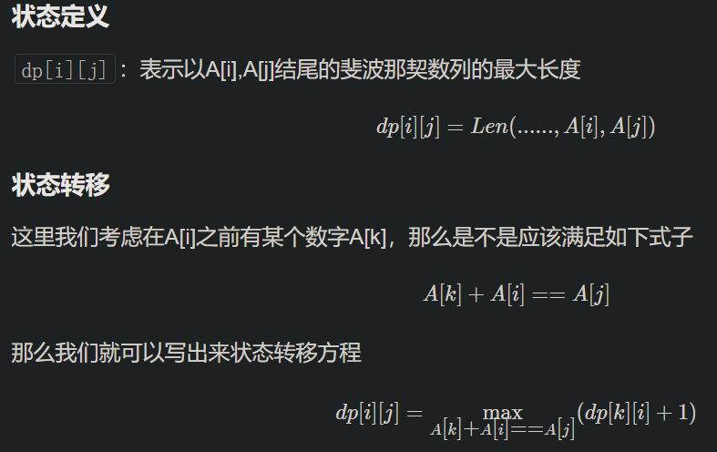

```c++
class Solution {
public:
    int lenLongestFibSubseq(vector<int>& nums) {
      int n = nums.size();
      if(n == 0) return 0;
      vector<vector<int>> dp(n, vector<int>(n, 2));
      unordered_map<int, int> mapp;
      for(int i = 0; i<n; i++)
        mapp[nums[i]] = i;
      int ans = 0;
      for(int i = 0; i<n; i++){
        for(int j = i+1; j<n; j++){
          int diff = nums[j] - nums[i];
          if(mapp.count(diff)){
            int preIndex = mapp[diff];
            if(preIndex<i)
              dp[i][j] = max(dp[i][j], dp[preIndex][i] + 1);
          }
          ans = max(ans, dp[i][j]);
        }
      }
      return ans>2?ans:0;
    }
};
```


### [118. 杨辉三角](https://leetcode-cn.com/problems/pascals-triangle/)

给定一个非负整数 *`numRows`，*生成「杨辉三角」的前 *`numRows`* 行。

在「杨辉三角」中，每个数是它左上方和右上方的数的和。


 

**示例 1:**

```
输入: numRows = 5
输出: [[1],[1,1],[1,2,1],[1,3,3,1],[1,4,6,4,1]]
```

#### 思路

1. dp迭代 生成二维ans数组

#### 代码

```c++
class Solution {
public:
    vector<vector<int>> generate(int numRows) {
        vector<vector<int>> ans;
        for(int i = 0; i<numRows; i++){
            vector<int> temp(i+1);
            temp[0] = temp[i] = 1;  //首位数据是确定的 base case
            for(int j = 1; j<i; j++){
                //状态转移方程
                temp[j] = ans[i-1][j-1] + ans[i-1][j];
            }
            ans.push_back(temp);
        }
        return ans;
    }
};
```

### [119. 杨辉三角 II ](https://leetcode-cn.com/problems/pascals-triangle-ii/)

给定一个非负索引 rowIndex，返回「杨辉三角」的第 rowIndex 行。

在「杨辉三角」中，每个数是它左上方和右上方的数的和。


示例 1:

输入: rowIndex = 3
输出: [1,3,3,1]

#### 思路

1. 注意 此处的rowIndex 从0开始

#### 朴素的dp解法

```c++
//dp解法
class Solution {
public:
    vector<int> getRow(int rowIndex) {
        vector<vector<int>> C(rowIndex + 1); //这道题rowindex从0开始
        for (int i = 0; i <= rowIndex; ++i) {
            C[i].resize(i + 1);
            C[i][0] = C[i][i] = 1; //base case 首尾必定是1
            for (int j = 1; j < i; ++j) {
                C[i][j] = C[i - 1][j - 1] + C[i - 1][j];
            }
        }
        return C[rowIndex];
    }
};
```

#### 滚动数组优化

```c++
class Solution {
public:
    vector<int> getRow(int rowIndex) {
        vector<int> pre, cur;
        for (int i = 0; i <= rowIndex; ++i) {
            cur.resize(i + 1);
            cur[0] = cur[i] = 1;
            for (int j = 1; j < i; ++j) {
                cur[j] = pre[j - 1] + pre[j];
            }
            pre = cur;
        }
        return pre;
    }
};
```

#### 继续优化 从后到前

```c++
class Solution {
public:
    vector<int> getRow(int rowIndex) {
        vector<int> row(rowIndex + 1);
        row[0] = 1;
        for (int i = 1; i <= rowIndex; ++i) {
            for (int j = i; j > 0; --j) {
                row[j] += row[j - 1];
            }
        }
        return row;
    }
};
```

#### 线性递推

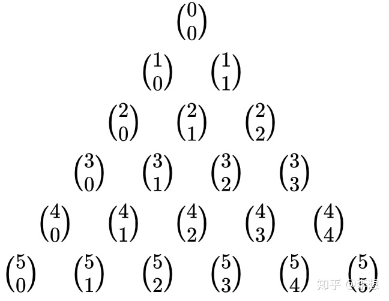

```c++
class Solution {
public:
    vector<int> getRow(int rowIndex) {
        vector<int> row(rowIndex + 1);
        row[0] = 1;
        for (int i = 1; i <= rowIndex; ++i) {
          	//杨辉三角 组合数规律
            row[i] = 1LL * row[i - 1] * (rowIndex - i + 1) / i;
        }
        return row;
    }
};
```


# 打家劫舍

### [剑指 Offer II 089. 房屋偷盗](https://leetcode-cn.com/problems/Gu0c2T/)

难度中等19

一个专业的小偷，计划偷窃沿街的房屋。每间房内都藏有一定的现金，影响小偷偷窃的唯一制约因素就是相邻的房屋装有相互连通的防盗系统，**如果两间相邻的房屋在同一晚上被小偷闯入，系统会自动报警**。

给定一个代表每个房屋存放金额的非负整数数组 `nums` ，请计算 **不触动警报装置的情况下** ，一夜之内能够偷窃到的最高金额。

 

**示例 1：**

```
输入：nums = [1,2,3,1]
输出：4
解释：偷窃 1 号房屋 (金额 = 1) ，然后偷窃 3 号房屋 (金额 = 3)。
     偷窃到的最高金额 = 1 + 3 = 4 。
```

**示例 2：**

```
输入：nums = [2,7,9,3,1]
输出：12
解释：偷窃 1 号房屋 (金额 = 2), 偷窃 3 号房屋 (金额 = 9)，接着偷窃 5 号房屋 (金额 = 1)。
     偷窃到的最高金额 = 2 + 9 + 1 = 12 。
```

#### 解法1 dp

1. dp含义：dp[i] 表示0 - i个房屋 能够偷的最多钱
2. 状态转移：max（偷当前房屋（这家存款 + 前前dp），不偷当前房屋（前dp）)
3. base case：   dp[0] = nums[0]; dp[1] = max(dp[0], nums[1]);

```c++
class Solution {
public:
    int rob(vector<int>& nums) {
      int n = nums.size();
      if(n == 1) return nums.front();
      vector<int> dp(n);
      dp[0] = nums[0];
      dp[1] = max(dp[0], nums[1]);
      for(int i = 2; i<n; i++){
        dp[i] = max(dp[i-1], dp[i-2] + nums[i]);
      }
      return dp.back();
    }
};
```

### [剑指 Offer II 090. 环形房屋偷盗](https://leetcode-cn.com/problems/PzWKhm/)

难度中等17

一个专业的小偷，计划偷窃一个环形街道上沿街的房屋，每间房内都藏有一定的现金。这个地方所有的房屋都 **围成一圈** ，这意味着第一个房屋和最后一个房屋是紧挨着的。同时，相邻的房屋装有相互连通的防盗系统，**如果两间相邻的房屋在同一晚上被小偷闯入，系统会自动报警** 。

给定一个代表每个房屋存放金额的非负整数数组 `nums` ，请计算 **在不触动警报装置的情况下** ，今晚能够偷窃到的最高金额。

 

**示例 1：**

```
输入：nums = [2,3,2]
输出：3
解释：你不能先偷窃 1 号房屋（金额 = 2），然后偷窃 3 号房屋（金额 = 2）, 因为他们是相邻的。
```

**示例 2：**

```
输入：nums = [1,2,3,1]
输出：4
解释：你可以先偷窃 1 号房屋（金额 = 1），然后偷窃 3 号房屋（金额 = 3）。
     偷窃到的最高金额 = 1 + 3 = 4 。
```

#### 解法

首尾房间不能同时被抢，那么只可能有三种不同情况：

- 要么都不被抢；
- 要么第一间房子被抢最后一间不抢；
- 要么最后一间房子被抢第一间不抢。

所以只需要计算 `第一家不抢和最后一家不抢`的 情况 取最大值

```c++
class Solution {
public:
    //首尾房间不能同时被抢，那么只可能有三种不同情况：
    //要么都不被抢；
    //要么第一间房子被抢最后一间不抢；
    //要么最后一间房子被抢第一间不抢。
    //所以只需要计算 第一家不抢和最后一家不抢的 情况 取最大值
    int rob(vector<int>& nums) {
      int n = nums.size();
      if(n == 1) return nums.front();
      if(n <= 3) return *max_element(nums.begin(), nums.end());
      vector<int> dp(n);
      // 从第二家 抢到最后
      dp[1] = nums[1];
      dp[2] = max(nums[1], nums[2]);
      for(int i = 3; i<n; i++){
        dp[i] = max(dp[i-2] + nums[i], dp[i-1]);
      }
      int tempMax = dp[n-1];
      //第一家抢到倒数第二家
      dp[0] = nums[0];
      dp[1] = max(nums[0], nums[1]);
      for(int i = 2; i<n - 1; i++){
        dp[i] = max(dp[i-2] + nums[i], dp[i-1]);
      }
      return max(tempMax, dp[n-2]);
    }
};
```

### [337. 打家劫舍 III](https://leetcode-cn.com/problems/house-robber-iii/)

[labuladong 题解](https://labuladong.github.io/article/?qno=337)[思路](https://leetcode-cn.com/problems/house-robber-iii/#)

难度中等1272

小偷又发现了一个新的可行窃的地区。这个地区只有一个入口，我们称之为 `root` 。

除了 `root` 之外，每栋房子有且只有一个“父“房子与之相连。一番侦察之后，聪明的小偷意识到“这个地方的所有房屋的排列类似于一棵二叉树”。 如果 **两个直接相连的房子在同一天晚上被打劫** ，房屋将自动报警。

给定二叉树的 `root` 。返回 ***在不触动警报的情况下** ，小偷能够盗取的最高金额* 。

 

**示例 1:**

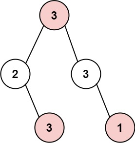

```
输入: root = [3,2,3,null,3,null,1]
输出: 7 
解释: 小偷一晚能够盗取的最高金额 3 + 3 + 1 = 7
```

**示例 2:**

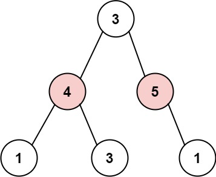

```
输入: root = [3,4,5,1,3,null,1]
输出: 9
解释: 小偷一晚能够盗取的最高金额 4 + 5 = 9
```

####  解法1 记忆化递归

**本题一定是要后序遍历，因为通过递归函数的返回值来做下一步计算**。

与198.打家劫舍，213.打家劫舍II一样，关键是要讨论当前节点抢还是不抢。

如果抢了当前节点，两个孩子就不能动，如果没抢当前节点，就可以考虑抢左右孩子（**注意这里说的是“考虑”**）

使用一个map把计算过的结果保存一下，这样如果计算过孙子了，那么计算孩子的时候可以复用孙子节点的结果。不然会超时

```c++
class Solution {
public:
    unordered_map<TreeNode*, int> mapp;
    int rob(TreeNode* root) {
      if(root == nullptr) return 0;
      if(root->left == nullptr && root->right == nullptr)
        return root->val;
      if(mapp[root]) return mapp[root];
      //偷父节点
      int val1 = root->val;
      if(root->left) val1 += rob(root->left->left) + rob(root->left->right);
      if(root->right) val1 += rob(root->right->left) + rob(root->right->right);
      //不偷父节点
      int val2 = rob(root->left) + rob(root->right);
      mapp[root] = max(val1, val2);
      return max(val1, val2);
    }
};
```

#### 解法2 树形dp

dp含义：使用一个pair记录当前节点 偷 与 不偷 可以获得的最大金钱

状态转移：偷当前节点（当前val + 左子树不偷 + 右子树不偷），不偷当前（左子树偷 + 右子树偷）

base case：节点为空 偷不偷都为0

```c++
class Solution {
public:
    int rob(TreeNode* root) {
      pair<int, int> ans = helper(root);
      return max(ans.first, ans.second);
    }
    //first偷 second不偷
    pair<int, int> helper(TreeNode* node){
      if(node == nullptr) return pair<int, int>(0, 0);
      pair<int, int> left = helper(node->left);
      pair<int, int> right = helper(node->right);
      //偷父节点
      int val1 = node->val + left.second + right.second;
      //不偷父节点
      int val2 = max(left.first, left.second) + max(right.first, right.second);
      return pair<int, int>(val1, val2);
    }
};
```

# 背包问题

## 总结

### 背包递推公式

问能否能装满背包（或者最多装多少）：dp[j] = max(dp[j], dp[j - nums[i]] + nums[i]); ，对应题目如下：

- [动态规划：416.分割等和子集(opens new window)](https://programmercarl.com/0416.分割等和子集.html)
- [动态规划：1049.最后一块石头的重量 II(opens new window)](https://programmercarl.com/1049.最后一块石头的重量II.html)

问装满背包有几种方法：dp[j] += dp[j - nums[i]] ，对应题目如下：

- [动态规划：494.目标和(opens new window)](https://programmercarl.com/0494.目标和.html)
- [动态规划：518. 零钱兑换 II(opens new window)](https://programmercarl.com/0518.零钱兑换II.html)
- [动态规划：377.组合总和Ⅳ(opens new window)](https://programmercarl.com/0377.组合总和Ⅳ.html)
- [动态规划：70. 爬楼梯进阶版（完全背包）(opens new window)](https://programmercarl.com/0070.爬楼梯完全背包版本.html)

问背包装满最大价值：dp[j] = max(dp[j], dp[j - weight[i]] + value[i]); ，对应题目如下：

- [动态规划：474.一和零(opens new window)](https://programmercarl.com/0474.一和零.html)

问装满背包所有物品的最小个数：dp[j] = min(dp[j - coins[i]] + 1, dp[j]); ，对应题目如下：

- [动态规划：322.零钱兑换(opens new window)](https://programmercarl.com/0322.零钱兑换.html)
- [动态规划：279.完全平方数(opens new window)](https://programmercarl.com/0279.完全平方数.html)

### [#](https://programmercarl.com/背包总结篇.html#遍历顺序)遍历顺序

#### [#](https://programmercarl.com/背包总结篇.html#_01背包)01背包

在[01背包](https://programmercarl.com/背包理论基础01背包-1.html)中我们讲解二维dp数组01背包先遍历物品还是先遍历背包都是可以的，且第二层for循环是从小到大遍历。

和[01背包（滚动数组）](https://programmercarl.com/背包理论基础01背包-2.html)中，我们讲解一维dp数组01背包只能先遍历物品再遍历背包容量，且第二层for循环是从大到小遍历。

**一维dp数组的背包在遍历顺序上和二维dp数组实现的01背包其实是有很大差异的，大家需要注意！**

#### [#](https://programmercarl.com/背包总结篇.html#完全背包)完全背包

说完01背包，再看看完全背包。

在[完全背包](https://programmercarl.com/背包问题理论基础完全背包.html)中，讲解了纯完全背包的一维dp数组实现，先遍历物品还是先遍历背包都是可以的，且第二层for循环是从小到大遍历。

但是仅仅是纯完全背包的遍历顺序是这样的，题目稍有变化，两个for循环的先后顺序就不一样了。

<u>**如果求组合数就是外层for循环遍历物品，内层for遍历背包**。</u>

<u>**如果求排列数就是外层for遍历背包，内层for循环遍历物品**。</u>

相关题目如下：

- 求组合数：[动态规划：518.零钱兑换II(opens new window)](https://programmercarl.com/0518.零钱兑换II.html)
- 求排列数：[动态规划：377. 组合总和 Ⅳ (opens new window)](https://mp.weixin.qq.com/s/Iixw0nahJWQgbqVNk8k6gA)、[动态规划：70. 爬楼梯进阶版（完全背包）(opens new window)](https://programmercarl.com/0070.爬楼梯完全背包版本.html)

如果求最小数，那么两层for循环的先后顺序就无所谓了，相关题目如下：

- 求最小数：[动态规划：322. 零钱兑换 (opens new window)](https://programmercarl.com/0322.零钱兑换.html)、[动态规划：279.完全平方数(opens new window)](https://programmercarl.com/0279.完全平方数.html)

## 01背包

#### 二维数组

背包最大重量为4， 每个物品只能用一次，问背包能装的最大价值？

| 物品  | 重量 | 价值 |
| ----- | ---- | ---- |
| 物品0 | 1    | 15   |
| 物品1 | 3    | 20   |
| 物品2 | 4    | 30   |

对于背包问题，有一种写法， 是使用二维数组，即**dp[i] [j] 表示从下标为[0-i]的物品里任意取，放进容量为j的背包，价值总和最大是多少**。

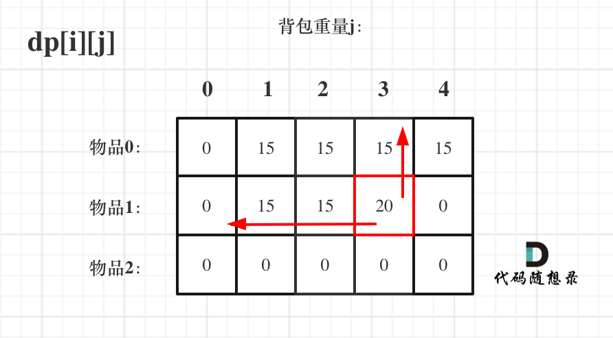

```c++
void test_2_wei_bag_problem1() {
    vector<int> weight = {1, 3, 4};
    vector<int> value = {15, 20, 30};
    int bagweight = 4;

    // 二维数组
    vector<vector<int>> dp(weight.size(), vector<int>(bagweight + 1, 0));

    // 初始化
    for (int j = weight[0]; j <= bagweight; j++) {
        dp[0][j] = value[0];
    }

    // weight数组的大小 就是物品个数
    for(int i = 1; i < weight.size(); i++) { // 遍历物品
        for(int j = 0; j <= bagweight; j++) { // 遍历背包容量
            if (j < weight[i]) dp[i][j] = dp[i - 1][j];
            else dp[i][j] = max(dp[i - 1][j], dp[i - 1][j - weight[i]] + value[i]);

        }
    }

    cout << dp[weight.size() - 1][bagweight] << endl;
}

int main() {
    test_2_wei_bag_problem1();
}
```

#### 滚动一维数组

```c++
void test_1_wei_bag_problem() {
    vector<int> weight = {1, 3, 4};
    vector<int> value = {15, 20, 30};
    int bagWeight = 4;

    // 初始化
  	//dp[i]表示前*个物品 背包容量为i时的最大价值
    vector<int> dp(bagWeight + 1, 0);
    for(int i = 0; i < weight.size(); i++) { // 遍历物品
        for(int j = bagWeight; j >= weight[i]; j--) { // 遍历背包容量
            dp[j] = max(dp[j], dp[j - weight[i]] + value[i]);  //dp复用
        }
    }
    cout << dp[bagWeight] << endl;
}

int main() {
    test_1_wei_bag_problem();
}
```

### [分割等和子集](https://leetcode-cn.com/problems/partition-equal-subset-sum/)

给你一个 只包含正整数 的 非空 数组 nums 。请你判断是否可以将这个数组分割成两个子集，使得两个子集的元素和相等。

> 示例 1：
>
> 输入：nums = [1,5,11,5]
> 输出：true
> 解释：数组可以分割成 [1, 5, 5] 和 [11] 。
>
> 示例 2：
>
> 输入：nums = [1,2,3,5]
> 输出：false
> 解释：数组不能分割成两个元素和相等的子集。

这也是一道经典的背包题

理解：

>背包的最大重量为sum/2
>
>物品的重量为nums[i]
>
>物品的价值为nums[i]
>
>`每个物品只有一个 求背包装最大的价值`

```c++
class Solution {
public:
    bool canPartition(vector<int>& nums) {
      int allSum = accumulate(begin(nums), end(nums), 0);
      if(allSum%2) return 0;
      int target = allSum/2;
      vector<vector<int>> dp(nums.size(), vector<int>(target+1, 0));
      for(int j = nums[0]; j<=target; j++){
        dp[0][j] = nums[0];
      }

      for(int i = 1; i<nums.size(); i++){
        for(int j = 0; j<=target; j++){
          if(j < nums[i]) dp[i][j] = dp[i-1][j];
          else{
            dp[i][j] = max(dp[i-1][j], dp[i-1][j-nums[i]] + nums[i]);            
          }
        }
      }
      return dp[nums.size()-1][target] == target;
    }
};

class Solution {
public:
    bool canPartition(vector<int>& nums) {
      int allSum = accumulate(begin(nums), end(nums), 0);
      if(allSum%2) return 0;
      int target = allSum/2;

      // dp[i]中的i表示背包内总和
      // 题目中说：每个数组中的元素不会超过 100，数组的大小不会超过 200
      // 总和不会大于20000，背包最大只需要其中一半，所以10001大小就可以
      vector<int> dp(10001, 0);
      //begin 0/1
      for(int i = 0; i<nums.size(); i++){
        for(int j = target; j>=nums[i]; j--){
          dp[j] = max(dp[j], dp[j-nums[i]] + nums[i]);
        }
      }
      return dp[target] == target;
    }
};
```

### [1049. 最后一块石头的重量 II](https://leetcode.cn/problems/last-stone-weight-ii/)

难度中等449收藏分享切换为英文接收动态反馈

有一堆石头，用整数数组 `stones` 表示。其中 `stones[i]` 表示第 `i` 块石头的重量。

每一回合，从中选出**任意两块石头**，然后将它们一起粉碎。假设石头的重量分别为 `x` 和 `y`，且 `x <= y`。那么粉碎的可能结果如下：

- 如果 `x == y`，那么两块石头都会被完全粉碎；
- 如果 `x != y`，那么重量为 `x` 的石头将会完全粉碎，而重量为 `y` 的石头新重量为 `y-x`。

最后，**最多只会剩下一块** 石头。返回此石头 **最小的可能重量** 。如果没有石头剩下，就返回 `0`。

 

**示例 1：**

```
输入：stones = [2,7,4,1,8,1]
输出：1
解释：
组合 2 和 4，得到 2，所以数组转化为 [2,7,1,8,1]，
组合 7 和 8，得到 1，所以数组转化为 [2,1,1,1]，
组合 2 和 1，得到 1，所以数组转化为 [1,1,1]，
组合 1 和 1，得到 0，所以数组转化为 [1]，这就是最优值。
```

**示例 2：**

```
输入：stones = [31,26,33,21,40]
输出：5
```

#### 解法

转换为等和子集问题，尽量一半一半的放，看凑的最接近一半的重量是多少

```c++
class Solution {
public:
    int lastStoneWeightII(vector<int>& nums) {
      int sum = accumulate(nums.begin(), nums.end(), 0);
      int target = sum/2;
      int n = nums.size();
      vector<int> dp(target + 1, 0);
      for(int i = 0; i<n; i++){
        for(int j = target; j>=nums[i]; j--){
          dp[j] = max(dp[j], dp[j-nums[i]] + nums[i]);
        }
      }
      //sum - dp是另一半 最后结果是另一半-这一半
      return sum - dp[target] - dp[target];
    }
};
```

### [494. 目标和](https://leetcode.cn/problems/target-sum/)

[labuladong 题解](https://labuladong.github.io/article/?qno=494)[思路](https://leetcode.cn/problems/target-sum/#)

难度中等1201收藏分享切换为英文接收动态反馈

给你一个整数数组 `nums` 和一个整数 `target` 。

向数组中的每个整数前添加 `'+'` 或 `'-'` ，然后串联起所有整数，可以构造一个 **表达式** ：

- 例如，`nums = [2, 1]` ，可以在 `2` 之前添加 `'+'` ，在 `1` 之前添加 `'-'` ，然后串联起来得到表达式 `"+2-1"` 。

返回可以通过上述方法构造的、运算结果等于 `target` 的不同 **表达式** 的数目。

 

**示例 1：**

```
输入：nums = [1,1,1,1,1], target = 3
输出：5
解释：一共有 5 种方法让最终目标和为 3 。
-1 + 1 + 1 + 1 + 1 = 3
+1 - 1 + 1 + 1 + 1 = 3
+1 + 1 - 1 + 1 + 1 = 3
+1 + 1 + 1 - 1 + 1 = 3
+1 + 1 + 1 + 1 - 1 = 3
```

原问题等同于： 找到nums一个正子集和一个负子集，使得总和等于target

我们假设P是正子集，N是负子集 例如： 假设nums = [1, 2, 3, 4, 5]，target = 3，一个可能的解决方案是+1-2+3-4+5 = 3 这里正子集P = [1, 3, 5]和负子集N = [2, 4]

那么让我们看看如何将其转换为子集求和问题：

```
                  sum(P) - sum(N) = target
sum(P) + sum(N) + sum(P) - sum(N) = target + sum(P) + sum(N)
                       2 * sum(P) = target + sum(nums)
```

因此，<u>原来的问题已转化为一个求子集的和问题： 找到nums的一个子集 P，使得sum(P) = (target + sum(nums)) / 2</u>

<u>请注意，上面的公式已经证明target + sum(num</u>s)必须是偶数

1. 确定dp数组以及下标的含义 dp[j] 表示：填满j（包括j）这么大容积的包，有dp[j]种方法
2. 例如：dp[j]，j 为5，
   - 已经有一个1（nums[i]） 的话，有 dp[4]种方法 凑成 dp[5]。
   - 已经有一个2（nums[i]） 的话，有 dp[3]种方法 凑成 dp[5]。
   - 已经有一个3（nums[i]） 的话，有 dp[2]中方法 凑成 dp[5]
   - 已经有一个4（nums[i]） 的话，有 dp[1]中方法 凑成 dp[5]
   - 已经有一个5 （nums[i]）的话，有 dp[0]中方法 凑成 dp[5]
3. dp数组如何初始化  dp[0] = 1，理论上也很好解释，装满容量为0的背包，有1种方法，就是装0件物品

```c++
class Solution {
public:
    int findTargetSumWays(vector<int>& nums, int target) {
      int sum = accumulate(nums.begin(), nums.end(), 0);
      int summ = sum+target;
      if(abs(target) > sum) return 0;
      if(summ%2) return 0;
      target = summ/2;
      vector<int> dp(target + 1, 0);
      //装满容量为0的背包，有1种方法，就是装0件物品
      dp[0] = 1;
      for(int i = 0; i<nums.size(); i++){
        for(int j = target; j>=nums[i]; j--){
          dp[j] += dp[j - nums[i]];
        }
      }
      return dp[target];
    }
};
```

### [`474. 一和零`](https://leetcode.cn/problems/ones-and-zeroes/)

难度中等715收藏分享切换为英文接收动态反馈

给你一个二进制字符串数组 `strs` 和两个整数 `m` 和 `n` 。

请你找出并返回 `strs` 的最大子集的长度，该子集中 **最多** 有 `m` 个 `0` 和 `n` 个 `1` 。

如果 `x` 的所有元素也是 `y` 的元素，集合 `x` 是集合 `y` 的 **子集** 。

 

**示例 1：**

```
输入：strs = ["10", "0001", "111001", "1", "0"], m = 5, n = 3
输出：4
解释：最多有 5 个 0 和 3 个 1 的最大子集是 {"10","0001","1","0"} ，因此答案是 4 。
其他满足题意但较小的子集包括 {"0001","1"} 和 {"10","1","0"} 。{"111001"} 不满足题意，因为它含 4 个 1 ，大于 n 的值 3 。
```

**示例 2：**

```
输入：strs = ["10", "0", "1"], m = 1, n = 1
输出：2
解释：最大的子集是 {"0", "1"} ，所以答案是 2 
```

#### 解法

1. 确定dp数组（dp table）以及下标的含义

   dp[i] [j]：最多有i个0和j个1的strs的最大子集的大小为dp[i] [j]。

2. 确定递推公式

   dp[i] [j] 可以由前一个strs里的字符串推导出来，strs里的字符串有zeroNum个0，oneNum个1。

   dp[i] [j] 就可以是 dp[i - zeroNum] [j - oneNum] + 1。

   然后我们在遍历的过程中，取dp[i][j]的最大值。

   所以递推公式：dp[i] [j] = max(dp[i] [j], dp[i - zeroNum] [j - oneNum] + 1);

   此时大家可以回想一下01背包的递推公式：dp[j] = max(dp[j], dp[j - weight[i]] + value[i]);

   对比一下就会发现，字符串的zeroNum和oneNum相当于物品的重量（weight[i]），字符串本身的个数相当于物品的价值（value[i]）。

   **这就是一个典型的01背包！** 只不过物品的重量有了两个维度而已。

```c++
class Solution {
public:
    int findMaxForm(vector<string>& strs, int m, int n) {
      //dp[i][j]：最多有i个0和j个1的strs的最大子集的大小为dp[i][j]。
      vector<vector<int>> dp(m+1, vector<int>(n+1, 0)); // 默认初始化0
      for(string str: strs){// 遍历物品
        int oneNum = 0, zeroNum = 0;
        for(char ch: str){
          if(ch == '0') zeroNum++;
          else oneNum++;
        }
        for(int i = m; i>=zeroNum; i--){ // 遍历背包容量且从后向前遍历！
          for(int j = n; j>=oneNum; j--){
            dp[i][j] =  max(dp[i][j], dp[i-zeroNum][j-oneNum] + 1);
          }
        }
      }
      return dp[m][n];
    }
};
```

## 完全背包

背包最大重量为4， **每件商品都有无限个**，问背包能装的最大价值？

| 物品  | 重量 | 价值 |
| ----- | ---- | ---- |
| 物品0 | 1    | 15   |
| 物品1 | 3    | 20   |
| 物品2 | 4    | 30   |

01背包和完全背包唯一不同就是体现在`遍历顺序`上

`反过来了`

##### **==<u>都是正序</u>==**

**如果求组合数就是外层for循环遍历物品，内层for遍历背包**。   1 2 和 2 1一样  （爬楼梯）

**如果求排列数就是外层for遍历背包，内层for循环遍历物品**。    1 2 和 2 1 不同 （爬楼梯）

```c++
// 组合数  先遍历物品，在遍历背包
void test_CompletePack() {
    vector<int> weight = {1, 3, 4};
    vector<int> value = {15, 20, 30};
    int bagWeight = 4;
    vector<int> dp(bagWeight + 1, 0);
    for(int i = 0; i < weight.size(); i++) { // 遍历物品
        for(int j = weight[i]; j <= bagWeight; j++) { // 遍历背包容量
            dp[j] = max(dp[j], dp[j - weight[i]] + value[i]);
        }
    }
    cout << dp[bagWeight] << endl;
}
int main() {
    test_CompletePack();
}


// 排列数 先遍历背包，再遍历物品
void test_CompletePack() {
    vector<int> weight = {1, 3, 4};
    vector<int> value = {15, 20, 30};
    int bagWeight = 4;

    vector<int> dp(bagWeight + 1, 0);

    for(int j = 0; j <= bagWeight; j++) { // 遍历背包容量
        for(int i = 0; i < weight.size(); i++) { // 遍历物品
            if (j - weight[i] >= 0) dp[j] = max(dp[j], dp[j - weight[i]] + value[i]);
        }
    }
    cout << dp[bagWeight] << endl;
}
int main() {
    test_CompletePack();
}
```

### [322. 零钱兑换](https://leetcode.cn/problems/gaM7Ch/)

难度中等34收藏分享切换为英文接收动态反馈

给定不同面额的硬币 `coins` 和一个总金额 `amount`。编写一个函数来计算可以凑成总金额所需的==最少的硬币个数==。如果没有任何一种硬币组合能组成总金额，返回 `-1`。

你可以认为每种硬币的数量是无限的。

 

**示例 1：**

```
输入：coins = [1, 2, 5], amount = 11
输出：3 
解释：11 = 5 + 5 + 1
```

**示例 2：**

```
输入：coins = [2], amount = 3
输出：-1
```

#### 解法 完全背包

```c++
class Solution {
public:
    int coinChange(vector<int>& coins, int amount) {
      vector<int> dp(amount+1, amount+1);
      dp[0] = 0;
      for(int i = 0; i<coins.size(); i++){
        for(int j = coins[i]; j<=amount; j++){
          dp[j] = min(dp[j] , dp[j-coins[i]] + 1);
        }
      }
      return dp[amount] == amount+1? -1:dp[amount];
    }
};
```

### [518. 零钱兑换 II](https://leetcode.cn/problems/coin-change-2/)

[labuladong 题解](https://labuladong.github.io/article/?qno=518)[思路](https://leetcode.cn/problems/coin-change-2/#)

难度中等862

给你一个整数数组 `coins` 表示不同面额的硬币，另给一个整数 `amount` 表示总金额。

请你计算并返回可以凑成总金额的硬币==组合数==。如果任何硬币组合都无法凑出总金额，返回 `0` 。

假设每一种面额的硬币有无限个。 

题目数据保证结果符合 32 位带符号整数。

 

**示例 1：**

```
输入：amount = 5, coins = [1, 2, 5]
输出：4
解释：有四种方式可以凑成总金额：
5=5
5=2+2+1
5=2+1+1+1
5=1+1+1+1+1
```

**示例 2：**

```
输入：amount = 3, coins = [2]
输出：0
解释：只用面额 2 的硬币不能凑成总金额 3 。
```

**示例 3：**

```
输入：amount = 10, coins = [10] 
输出：1
```

```c++
class Solution {
public:
    int change(int amount, vector<int>& coins) {
        vector<int> dp(amount + 1, 0);
        dp[0] = 1;
        for (int i = 0; i < coins.size(); i++) { // 遍历物品
            for (int j = coins[i]; j <= amount; j++) { // 遍历背包
                dp[j] += dp[j - coins[i]];
            }
        }
        return dp[amount];
    }
};
```

### [377. 组合总和 Ⅳ](https://leetcode.cn/problems/combination-sum-iv/)

难度中等636收藏分享切换为英文接收动态反馈

给你一个由 **不同** 整数组成的数组 `nums` ，和一个目标整数 `target` 。请你从 `nums` 中找出并返回总和为 `target` 的元素组合的个数。

题目数据保证答案符合 32 位整数范围。

 

**示例 1：**

```
输入：nums = [1,2,3], target = 4
输出：7
解释：
所有可能的组合为：
(1, 1, 1, 1)
(1, 1, 2)
(1, 2, 1)
(1, 3)
(2, 1, 1)
(2, 2)
(3, 1)
请注意，顺序不同的序列被视作不同的组合。
```

#### 解法 回溯 记忆化 dp

```c++
//回溯
class Solution {
public:
    int ans;
    int combinationSum4(vector<int>& nums, int target) {
        ans = 0;
        backtrack(nums, 0, target);
        return ans;
    }

    void backtrack(vector<int>& nums, int nowSum, int target){
        if(nowSum>target) return;
        if(nowSum == target){
            ans++;
            return;
        }
        for(int i = 0; i<nums.size(); i++){
            backtrack(nums, nowSum+nums[i], target);
        }
    }
};

//记忆化回溯
class Solution {
public:
    int combinationSum4(vector<int>& nums, int target) {
        return dfs(nums, target);
    }
    //备忘录，保存每层递归的计算结果，用于实现记忆化。
    unordered_map<int, int> memo;
    //dfs(target)的定义： 用nums中的元素凑成总和为target（每个元素可以使用多次），用多少中凑法。
    int dfs(vector<int>& nums, int target){
        if(target == 0)
            return 1;
        if(target < 0)
            return 0;
        if(memo.count(target) == 1)
            return memo[target];
        int res = 0;
        for(int i = 0; i < nums.size(); i++){
            res += dfs(nums, target - nums[i]);
        }
        memo[target] = res;
        return res;
    }
};

//完全背包dp  排列方法 先背包 后物品
class Solution {
public:
    int combinationSum4(vector<int>& nums, int target) {
        //使用dp数组，dp[i]代表组合数为i时使用nums中的数能组成的组合数的个数
        //dp[i]=dp[i-nums[0]]+dp[i-nums[1]]+dp[i=nums[2]]+...
        //举个例子比如nums=[1,3,4],target=7;
        //dp[7]=dp[6]+dp[4]+dp[3]
        //其实就是说7的组合数可以由三部分组成，1和dp[6]，3和dp[4],4和dp[3];
        vector<unsigned long long> dp(target+1);
        //是为了算上自己的情况，比如dp[1]可以由dp【0】和1这个数的这种情况组成。
        dp[0] = 1;
        for(int i = 0; i<=target; i++)
            for(int num : nums)
                //dp用int的话 有一个很傻逼的越界，需要 && dp[i - num] < INT_MAX - dp[i]
                if(i>=num)  
                    dp[i] += dp[i-num];
        return dp[target];
    }
};
```

### [`70. 爬楼梯`](https://leetcode.cn/problems/climbing-stairs/)

[思路](https://leetcode.cn/problems/climbing-stairs/#)

难度简单2410

假设你正在爬楼梯。需要 `n` 阶你才能到达楼顶。

每次你可以爬 `1` 或 `2` 个台阶。你有多少种不同的方法可以爬到楼顶呢？

 

**示例 1：**

```
输入：n = 2
输出：2
解释：有两种方法可以爬到楼顶。
1. 1 阶 + 1 阶
2. 2 阶
```

**示例 2：**

```
输入：n = 3
输出：3
解释：有三种方法可以爬到楼顶。
1. 1 阶 + 1 阶 + 1 阶
2. 1 阶 + 2 阶
3. 2 阶 + 1 阶
```

#### 解法1 斐波那契

```c++
class Solution {
public:
    int climbStairs(int n) {
        if(n == 1) return 1;
        if(n == 2) return 2 ;
        vector<int> dp(n+1, 0);
        dp[1] = 1;
        dp[2] = 2;
        for (int i = 3; i<=n; ++i){
          dp[i] = dp[i-1] + dp[i-2];
        }
        return dp[n];
    }
};
```

#### 解法2 完全背包 

1 2 中 和为n的排列数

```c++
class Solution {
public:
    int climbStairs(int n) {
        vector<int> dp(n + 1, 0);
        dp[0] = 1;
        int m = 2;
        for (int i = 1; i <= n; i++) { // 遍历背包
            for (int j = 1; j <= m; j++) { // 遍历物品
                if (i - j >= 0) dp[i] += dp[i - j];
            }
        }
        return dp[n];
    }
};
```

#### `扩展 每次可以跳 a-b 阶`

```c++
class Solution {
public:
    int climbStairs(int n, int a, int b) {
        vector<int> dp(n + 1, 0);
        dp[0] = 1;
        for (int i = 1; i <= n; i++)  // 遍历背包
            for (int j = a; j <= b; j++)  // 遍历物品
                if (i - j >= 0) dp[i] += dp[i - j];
        return dp[n];
    }
};
```

### [279. 完全平方数](https://leetcode-cn.com/problems/perfect-squares/)

给你一个整数 `n` ，返回 *和为 `n` 的完全平方数的`最少`数量* 。

**完全平方数** 是一个整数，其值等于另一个整数的平方；换句话说，其值等于一个整数自乘的积。例如，`1`、`4`、`9` 和 `16` 都是完全平方数，而 `3` 和 `11` 不是。

 

**示例 1：**

```
输入：n = 12
输出：3 
解释：12 = 4 + 4 + 4
```

**示例 2：**

```
输入：n = 13
输出：2
解释：13 = 4 + 9
```

#### 解法 完全背包

```c++
class Solution {
public:
    int numSquares(int n) {
        vector<int> dp(n + 1, 0);
        for(int i = 1; i<=n; i++){
            int minVal = INT_MAX;
            for(int j = 1; j*j<=i; j++){
                //i-j*j是从大到小的遍历dp,这样才可以保证最小次数
                minVal = min(minVal, dp[i-j*j]);  
            }
            dp[i] = minVal + 1;
        }
        return dp[n];
    }
};

//相比上面 耗时较多 难道是数组的赋值比较费时间？
class Solution {
public:
    int numSquares(int n) {
        vector<int> dp(n + 1, n + 1);
        dp[0] = 0;
        for(int i = 1; i<=n; i++){ // 遍历背包
            for(int j = 1; j*j<=i; j++){ // 遍历物品
                //i-j*j是从大到小的遍历dp,这样才可以保证最小次数
                dp[i] = min(dp[i], dp[i-j*j] + 1);  
            }
        }
        return dp[n];
    }
};

// 先物品 再背包
class Solution {
public:
    int numSquares(int n) {
        vector<int> dp(n + 1, INT_MAX);
        dp[0] = 0;
        for (int i = 1; i * i <= n; i++) { // 遍历物品
            for (int j = 1; j <= n; j++) { // 遍历背包
                if (j - i * i >= 0) {
                    dp[j] = min(dp[j - i * i] + 1, dp[j]);
                }
            }
        }
        return dp[n];
    }
};
```

### [`139. 单词拆分`](https://leetcode.cn/problems/word-break/)

[思路](https://leetcode.cn/problems/word-break/#)

难度中等1615收藏分享切换为英文接收动态反馈

给你一个字符串 `s` 和一个字符串列表 `wordDict` 作为字典。请你判断是否可以利用字典中出现的单词拼接出 `s` 。

**注意：**不要求字典中出现的单词全部都使用，并且字典中的单词可以重复使用。

 

**示例 1：**

```
输入: s = "leetcode", wordDict = ["leet", "code"]
输出: true
解释: 返回 true 因为 "leetcode" 可以由 "leet" 和 "code" 拼接成。
```

**示例 2：**

```
输入: s = "applepenapple", wordDict = ["apple", "pen"]
输出: true
解释: 返回 true 因为 "applepenapple" 可以由 "apple" "pen" "apple" 拼接成。
     注意，你可以重复使用字典中的单词。
```

**示例 3：**

```
输入: s = "catsandog", wordDict = ["cats", "dog", "sand", "and", "cat"]
输出: false
```

#### 暴力回溯 超时

```c++
class Solution {
public:
    string path;
    bool find = 0;
    bool wordBreak(string s, vector<string>& wordDict) {
      backtrack(s, wordDict);
      return find;
    }

    void backtrack(string& s, vector<string>& wordDict){
      if(find) return;
      if(path.size() == s.size()){
        if(path == s) find = 1;
        return;
      }
      if(path.size() >= s.size())
        return;
      for(int i = 0; i<wordDict.size(); i++){
        string temp = path;
        path += wordDict[i];
        backtrack(s, wordDict);
        path = temp;
      }
    }
};
```

#### 完全背包 排列 先物品再背包

- s 串能否分解为单词表的单词（前 s.length 个字符的 s 串能否分解为单词表单词）
- 将大问题分解为规模小一点的子问题：前 i个字符的子串，能否分解成单词
  剩余子串，是否为单个单词。
- dp[i]：长度为i的s[0:i-1]子串是否能拆分成单词。题目求:dp[s.length]

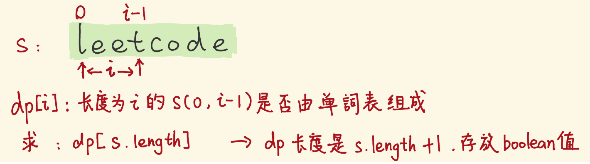

- 类似的，我们用指针 j 去划分s[0:i] 子串，如下图：
- s[0:i] 子串对应 dp[i+1] ，它是否为 true（s[0:i]能否 break），取决于两点：
  - 它的前缀子串 s[0:j-1] 的 dp[j]，是否为 true。
  - 剩余子串 s[j:i]，是否是单词表的单词。

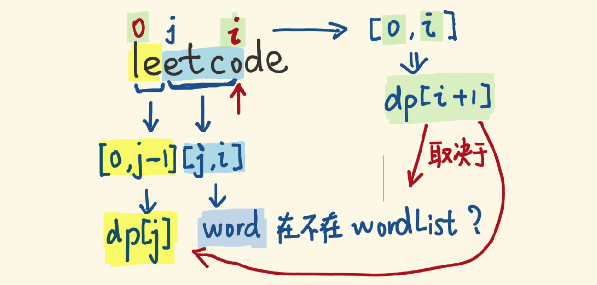

**base case**

- base case 为dp[0] = true。即，长度为 0 的s[0:-1]能拆分成单词表单词。
- 这看似荒谬，但这只是为了让边界情况也能套用状态转移方程，而已。
- 当 j = 0 时（上图黄色前缀串为空串），s[0:i]的dp[i+1]，取决于s[0:-1]的dp[0]，和，剩余子串s[0:i]是否是单个单词。
- 只有让dp[0]为真，dp[i+1]才会只取决于s[0:i]是否为单个单词，才能用上这个状态转移方程。

```c++
class Solution {
public:
 //排列的完全背包  
 bool wordBreak(string s, vector<string>& wordDict) {
   unordered_set<string> wordSet(wordDict.begin(), wordDict.end());
   vector<bool> dp(s.size() + 1, 0);
   dp[0] = 1;
   for(int i = 1; i<= s.size(); i++){
     for(int j = 0; j<i; j++){
       string word = s.substr(j, i-j);
       // cout<<word<<" ";
       if(wordSet.count(word) && dp[j]){
         dp[i] = 1;
         break;
       }
     }
   }
   return dp.back();
 }
};
```

# 炒股专题

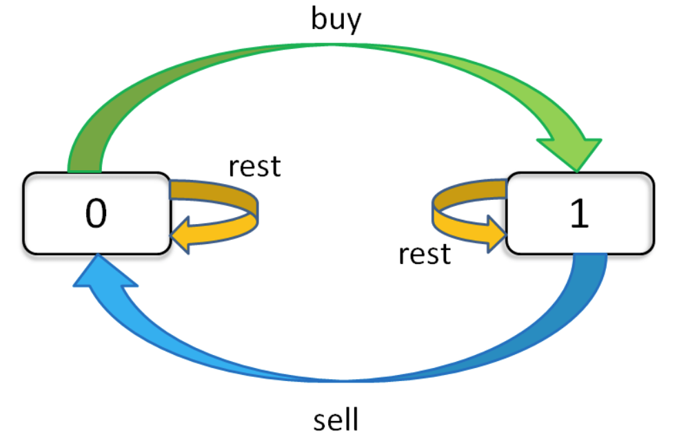

### [121. 买卖股票的最佳时机 `一次买卖`](https://leetcode-cn.com/problems/best-time-to-buy-and-sell-stock/) 

给定一个数组 `prices` ，它的第 `i` 个元素 `prices[i]` 表示一支给定股票第 `i` 天的价格。

你只能选择 **某一天** 买入这只股票，并选择在 **未来的某一个不同的日子** 卖出该股票。设计一个算法来计算你所能获取的最大利润。

返回你可以从这笔交易中获取的最大利润。如果你不能获取任何利润，返回 `0` 。

 

**示例 1：**

```
输入：[7,1,5,3,6,4]
输出：5
解释：在第 2 天（股票价格 = 1）的时候买入，在第 5 天（股票价格 = 6）的时候卖出，最大利润 = 6-1 = 5 。
     注意利润不能是 7-1 = 6, 因为卖出价格需要大于买入价格；同时，你不能在买入前卖出股票。
```

**示例 2：**

```
输入：prices = [7,6,4,3,1]
输出：0
解释：在这种情况下, 没有交易完成, 所以最大利润为 0。
```

#### 思路

1. 贪心 一次遍历 得到 当前值和当前之前的最小值做差 取max

2. 动态规划

   > dp数组的含义
   >
   > 1. dp{i}{0}表述第i天手中==没有==股票 时 的最大利润    = max(昨天手中就没有股票， 昨天手中有股票但是今天(i)给==卖==了)
   >
   > 2. dp{i}{1}表述第i天手中==有==股票 时 的最大利润       = max(昨天手中就有股票， 昨天手中没有股票但是今天(i)==买==了)
   >
   > ```c++
   >         dp[i][0]= max(dp[i-1][0], dp[i-1][1] + prices[i]);
   >         dp[i][1] = max(dp[i-1][1], -prices[i]);
   > ```

#### 代码

```c++
//dp
class Solution {
public:
    int maxProfit(vector<int>& prices) {
        int n = prices.size();
        vector<vector<int>> dp(n, vector<int>(2));
        for(int i = 0; i<n; i++){
            if(i == 0){
                //base case
                dp[i][0] = 0;
                dp[i][1] = -prices[i];
                continue;
            }
            dp[i][0]= max(dp[i-1][0], dp[i-1][1] + prices[i]);
            //注意这里不能时dp[i-1][0],因为只有一次操作
            //前面没有股票买卖 没有利润
            dp[i][1] = max(dp[i-1][1], -prices[i]);
        }
        return dp[n-1][0];
    }

    int maxProfit(vector<int>& prices) {
        int n = prices.size();
        int dp_i_0 = 0;
        int dp_i_1 = -prices[i];
        for(int i = 0; i<n; i++){
            // dp[i][0] = max(dp[i-1][0], dp[i-1][1] + prices[i])
            dp_i_0 = max(dp_i_0, dp_i_1 + prices[i]);
            // dp[i][1] = max(dp[i-1][1], -prices[i])
            dp_i_1 = max(dp_i_1, -prices[i]);
        }
        return dp_i_0;
    }
};

//贪心
class Solution {
public:
    int maxProfit(vector<int>& prices) {
        int n =prices.size();
        int left = 0; int right = 0;
        int ans = 0;
        while(right<n){
            if(prices[left]<prices[right])
                ans = max(ans, prices[right] - prices[left]);
            else left = right;
            right++;            
        }
        return ans;
    }

    int maxProfit(vector<int>& prices) {    
        int mmin = INT_MAX;//遇到最小的数
        int mmax = 0;//差值最大数
        for(int i : prices) {
            mmin = min(i, mmin); 
            mmax = max(i - mmin, mmax);
        }
        return mmax ;
    }
};
```


### [122. 买卖股票的最佳时机 `无限次买卖`](https://leetcode-cn.com/problems/best-time-to-buy-and-sell-stock-ii/)

给定一个数组 `prices` ，其中 `prices[i]` 表示股票第 `i` 天的价格。

在每一天，你可能会决定购买和/或出售股票。你在任何时候 **最多** 只能持有 **一股** 股票。你也可以购买它，然后在 **同一天** 出售。
返回 *你能获得的 **最大** 利润* 。

 

**示例 1:**

```
输入: prices = [7,1,5,3,6,4]
输出: 7
解释: 在第 2 天（股票价格 = 1）的时候买入，在第 3 天（股票价格 = 5）的时候卖出, 这笔交易所能获得利润 = 5-1 = 4 。
随后，在第 4 天（股票价格 = 3）的时候买入，在第 5 天（股票价格 = 6）的时候卖出, 这笔交易所能获得利润 = 6-3 = 3 。
```

**示例 2:**

```
输入: prices = [1,2,3,4,5]
输出: 4
解释: 在第 1 天（股票价格 = 1）的时候买入，在第 5 天 （股票价格 = 5）的时候卖出, 这笔交易所能获得利润 = 5-1 = 4 。
注意你不能在第 1 天和第 2 天接连购买股票，之后再将它们卖出。因为这样属于同时参与了多笔交易，你必须在再次购买前出售掉之前的股票。
```

#### 思路

1. 贪心 每次相邻两天涨价都卖股票

2. dp 同上 但是更为贴近经典模板 允许多次买卖 注意状态方程

   ```c++
   dp[i][0] = max(dp[i-1][0], dp[i-1][1] + prices[i]);
   dp[i][1] = max(dp[i-1][1], dp[i-1][0] - prices[i]);
   ```

#### 代码

```c++
class Solution {
public:
    //没有购买次数的限制
    int maxProfit(vector<int>& prices) {
        int n = prices.size();
        vector<vector<int>> dp(n, vector<int>(2));
        for(int i = 0; i<n; i++){
            if(i == 0){
                dp[i][0] = 0;
                dp[i][1] = -prices[i];
                continue;
            }
            dp[i][0] = max(dp[i-1][0], dp[i-1][1] + prices[i]);
            dp[i][1] = max(dp[i-1][1], dp[i-1][0] - prices[i]);
        }
        return dp[n-1][0];
    }

    //滚动优化
    int maxProfit(vector<int>& prices) {
        int n = prices.size();
        int dp_i_0 = 0;
        int dp_i_1 = INT_MIN;
        for(int i = 0; i<n; i++){
            int temp = dp_i_0; //临时存储上个dp_i_0     dp_i_1写在dp_i_0之前则无需temp 
            dp_i_0 = max(dp_i_0, dp_i_1 + prices[i]);
            dp_i_1 = max(dp_i_1, temp - prices[i]);
        }
        return dp_i_0;
    }
    
    //贪心 每次相邻两天涨价都卖股票
    int maxProfit(vector<int>& prices) {
        int max = 0;
        for (int i = 0; i < prices.size()-1; i++){
            if(prices[i]<prices[i+1]){
                max+=prices[i+1]-prices[i];
            }  
        }   
        return max;
    }
};
```

### [714. 买卖股票的最佳时机 `含手续费`](https://leetcode-cn.com/problems/best-time-to-buy-and-sell-stock-with-transaction-fee/)

给定一个整数数组 `prices`，其中 `prices[i]`表示第 `i` 天的股票价格 ；整数 `fee` 代表了交易股票的手续费用。

你可以无限次地完成交易，但是你每笔交易都需要付手续费。如果你已经购买了一个股票，在卖出它之前你就不能再继续购买股票了。

返回获得利润的最大值。

**注意：**这里的一笔交易指买入持有并卖出股票的整个过程，每笔交易你只需要为支付一次手续费。

 

**示例 1：**

```
输入：prices = [1, 3, 2, 8, 4, 9], fee = 2
输出：8
解释：能够达到的最大利润:  
在此处买入 prices[0] = 1
在此处卖出 prices[3] = 8
在此处买入 prices[4] = 4
在此处卖出 prices[5] = 9
总利润: ((8 - 1) - 2) + ((9 - 4) - 2) = 8
```

**示例 2：**

```
输入：prices = [1,3,7,5,10,3], fee = 3
输出：6
```

#### 思路

一样的套路 只是注意 -fee -fee.......在dp0上可能引发的越界问题 除非给定特别合适的初始值（-1？错）

> [9,8,7,1,2] 3
>
> 例如上面那个 会导致dp1错误  老老实实放在dp1上吧   -1000000是可以通过的


#### 代码


```````c++
class Solution {
public:
    int maxProfit(vector<int>& prices, int fee) {
      int n = prices.size();
      vector<vector<int>> dp(n, vector<int>(2));
      for(int i = 0; i<n; i++){
        if(i == 0){
          dp[i][0] = 0;
          dp[i][1] = -prices[i]-fee;
          continue;
        }
        dp[i][0] = max(dp[i-1][0], dp[i-1][1]+prices[i]);
        dp[i][1] = max(dp[i-1][1], dp[i-1][0]-prices[i]-fee);
      }
      return dp[n-1][0];
    }
  
  
    int maxProfit(vector<int>& prices, int fee) {
        int n = prices.size();
        int dp_0 = 0;
        int dp_1 = INT_MIN;
        for(int i = 0; i<n; i++){
            int temp = dp_0;
            //注意 这里-fee最好不要写在dp0上 不然INT_MIN可能越界，不好控制初始值
            dp_0 = max(dp_0, dp_1 + prices[i]);
            dp_1 = max(dp_1, temp - prices[i] - fee);
        }
        return dp_0;
    }
};
```````

### [309. 最佳买卖股票时机 `含冷冻期`](https://leetcode-cn.com/problems/best-time-to-buy-and-sell-stock-with-cooldown/)

给定一个整数数组`prices`，其中第 `prices[i]` 表示第 `*i*` 天的股票价格 。

设计一个算法计算出最大利润。在满足以下约束条件下，你可以尽可能地完成更多的交易（多次买卖一支股票）:

- 卖出股票后，你无法在第二天买入股票 (即冷冻期为 1 天)。

**注意：**你不能同时参与多笔交易（你必须在再次购买前出售掉之前的股票）。

 

**示例 1:**

```
输入: prices = [1,2,3,0,2]
输出: 3 
解释: 对应的交易状态为: [买入, 卖出, 冷冻期, 买入, 卖出]
```

#### 思路

0 1单独判断  注意代码中的状态方程

#### 代码

```c++
class Solution {
public:
    int maxProfit(vector<int>& prices) {
      int cooldown = 1;
      int n = prices.size();
      vector<vector<int>> dp(n, vector<int>(2));
      for(int i = 0; i<n; i++){
        if(i == 0){
          dp[i][0] = 0;
          dp[i][1] = -prices[i];
          continue;
        }
        //冷冻期内 的base case 和之前无关联
        if(i < cooldown+1){
          dp[i][0] = max(dp[i-1][0], dp[i-1][1] + prices[i]);
          dp[i][1] = max(dp[i-1][1], -prices[i]);
          continue;
        }
        dp[i][0] = max(dp[i-1][0], dp[i-1][1] + prices[i]);
        dp[i][1] = max(dp[i-1][1], dp[i-1-cooldown][0]-prices[i]);
      }
      return dp[n-1][0];
    }

    int maxProfit(vector<int>& prices) {
        int n = prices.size();
        int dp_i_0 = 0;
        int dp_i_1 = INT_MIN;
        int dp_pre_0 = 0; //代表dp[i-2][0];
        for(int i = 0; i<n; i++){
            int temp = dp_i_0;
            dp_i_0 = max(dp_i_0, dp_i_1 + prices[i]);
            dp_i_1 = max(dp_i_1, dp_pre_0 - prices[i]);       
            dp_pre_0 = temp;    
        }
        return dp_i_0;
    }
};
```

### [123. 买卖股票的最佳时机 `限制两笔交易`](https://leetcode-cn.com/problems/best-time-to-buy-and-sell-stock-iii/)

给定一个数组，它的第 `i` 个元素是一支给定的股票在第 `i` 天的价格。

设计一个算法来计算你所能获取的最大利润。你最多可以完成 **两笔** 交易。

**注意：**你不能同时参与多笔交易（你必须在再次购买前出售掉之前的股票）。

 

**示例 1:**

```
输入：prices = [3,3,5,0,0,3,1,4]
输出：6
解释：在第 4 天（股票价格 = 0）的时候买入，在第 6 天（股票价格 = 3）的时候卖出，这笔交易所能获得利润 = 3-0 = 3 。
     随后，在第 7 天（股票价格 = 1）的时候买入，在第 8 天 （股票价格 = 4）的时候卖出，这笔交易所能获得利润 = 4-1 = 3 。
```

**示例 2：**

```
输入：prices = [1,2,3,4,5]
输出：4
解释：在第 1 天（股票价格 = 1）的时候买入，在第 5 天 （股票价格 = 5）的时候卖出, 这笔交易所能获得利润 = 5-1 = 4 。   
     注意你不能在第 1 天和第 2 天接连购买股票，之后再将它们卖出。   
     因为这样属于同时参与了多笔交易，你必须在再次购买前出售掉之前的股票。
```

#### 思路

1. 有次数限制k for循环加一层k

#### 代码

```c++
class Solution {
public:
    int maxProfit(vector<int>& prices) {
        int maxk = 2;
        int n = prices.size();
        vector<vector<vector<int>>> dp(n, vector<vector<int>>(maxk+1, vector<int>(2)));
        for(int i = 0; i<n; i++){
            for(int k = 1; k<=maxk; k++){
                if(i == 0){
                    dp[i][k][0] = 0;
                    dp[i][k][1] = -prices[i];
                    continue;
                }
              	// 注意 一次买卖才算一次交易 所以我们只让他买的时候次数-1
                dp[i][k][0] = max(dp[i-1][k][0], dp[i-1][k][1] + prices[i]);
                dp[i][k][1] = max(dp[i-1][k][1], dp[i-1][k-1][0] - prices[i]);
            }
        }
        return dp[n-1][maxk][0];
    }

    //滚动优化
    int maxProfit(vector<int>& prices) {
        int dp_i10 = 0, dp_i20 = 0;
        int dp_i11 = INT_MIN, dp_i21 = INT_MIN;
        for(int price: prices){
            dp_i20 = max(dp_i20, dp_i21 + price);
            dp_i21 = max(dp_i21, dp_i10 - price);
            dp_i10 = max(dp_i10, dp_i11 + price);
            dp_i11 = max(dp_i11, -price);
        }
        return dp_i20;
    }
};
```

### [188. 买卖股票的最佳时机 `限制k笔交易`](https://leetcode-cn.com/problems/best-time-to-buy-and-sell-stock-iv/)

给定一个整数数组 `prices` ，它的第 `i` 个元素 `prices[i]` 是一支给定的股票在第 `i` 天的价格。

设计一个算法来计算你所能获取的最大利润。你最多可以完成 **k** 笔交易。

**注意：**你不能同时参与多笔交易（你必须在再次购买前出售掉之前的股票）。

 

**示例 1：**

```
输入：k = 2, prices = [2,4,1]
输出：2
解释：在第 1 天 (股票价格 = 2) 的时候买入，在第 2 天 (股票价格 = 4) 的时候卖出，这笔交易所能获得利润 = 4-2 = 2 。
```

**示例 2：**

```
输入：k = 2, prices = [3,2,6,5,0,3]
输出：7
解释：在第 2 天 (股票价格 = 2) 的时候买入，在第 3 天 (股票价格 = 6) 的时候卖出, 这笔交易所能获得利润 = 6-2 = 4 。
     随后，在第 5 天 (股票价格 = 0) 的时候买入，在第 6 天 (股票价格 = 3) 的时候卖出, 这笔交易所能获得利润 = 3-0 = 3 。
```

#### 思路

#### 代码

```c++
class Solution {
public:
    int maxProfit(int maxk, vector<int>& prices) {
        int n = prices.size();
        if(n<=0) return 0;
        if(maxk>n/2){//一次交易完成需要两天
            //复用之前交易次数k没有限制的情况
            return maxProfit_k_inf(prices);
        }

        vector<vector<vector<int>>> dp(n, vector<vector<int>>(maxk+1, vector<int>(2)));
        for(int i = 0; i<n; i++){
            for(int k = 1; k<=maxk; k++){
                if(i == 0){
                    dp[i][k][0] = 0;
                    dp[i][k][1] = -prices[i];
                    continue;
                }
                dp[i][k][0] = max(dp[i-1][k][0], dp[i-1][k][1] + prices[i]);
                dp[i][k][1] = max(dp[i-1][k][1], dp[i-1][k-1][0] - prices[i]);
            }
        }
        return dp[n-1][maxk][0];
    }

    //不限制次数k的买卖
    int maxProfit_k_inf(vector<int>& prices) {
        int n = prices.size();
        int dp_i_0 = 0;
        int dp_i_1 = INT_MIN;
        for(int i = 0; i<n; i++){
            dp_i_1 = max(dp_i_1, dp_i_0 - prices[i]);
            dp_i_0 = max(dp_i_0, dp_i_1 + prices[i]);
        }
        return dp_i_0;
    }
};
```

### `万法归一`

输入股票价格数组 `prices`，你最多进行 `max_k` 次交易，每次交易需要额外消耗 `fee` 的手续费，而且每次交易之后需要经过 `cooldown` 天的冷冻期才能进行下一次交易，请你计算并返回可以获得的最大利润。

怎么样，有没有被吓到？如果你直接给别人出一道这样的题目，估计对方要当场吐血，不过我们这样一步步做过来，你应该很容易发现这道题目就是之前我们探讨的几种情况的组合体嘛。

所以，我们只要把之前实现的几种代码掺和到一块，**在 base case 和状态转移方程中同时加上 `cooldown` 和 `fee` 的约束就行了**：

==怕难以理解 此处全用完整dp数组==

```c++
class Solution{
public:
    int maxProfit_all_in_one(int maxk, vector<int>& prices, int cooldown, int fee) {
        int n = prices.size();
        if(n<=0) return 0;
        if(maxk>n/2){//一次交易完成需要两天
            //复用之前交易次数k没有限制的情况
            return maxProfit_k_inf_cool(prices, cooldown, fee);
        }

        vector<vector<vector<int>>> dp(n, vector<vector<int>>(maxk+1, vector<int>(2)));
        for(int i = 0; i<n; i++){
            for(int k = 1; k<=maxk; k++){
            	if(i - 1 == -1){
                	dp[i][k][0] = 0;
                	dp[i][k][1] = -prices[i];
                	continue;
            	}
            	// 包含 cooldown 的 base case
            	if(i-cooldown -1< 0){
            		dp[i][k][0] = max(dp[i-1][k][0], dp[i-1][k][1] + prices[i]);
                	// 别忘了减 fee
                	dp[i][k][1] = max(dp[i-1][k][1], -prices[i]- fee);
                	continue;
            	}
                dp[i][k][0] = max(dp[i-1][k][0], dp[i-1][k][1] + prices[i]);
                dp[i][k][1] = max(dp[i-1][k][1], dp[i-cooldown-1][k-1][0] - prices[i] -fee);
            }
        }
        return dp[n-1][maxk][0];
    }
    
    // k 无限制，包含手续费和冷冻期
    int maxProfit_k_inf_cool(vector<int>& prices, int cooldown, int fee) {
        int n = prices.size();
        vector<vector<int>> dp(n, vector<int>(2));
        for(int i = 0; i<prices.size(); i++){
            if(i == 0){
                dp[i][0] = 0;
                dp[i][1] = -prices[i];
                continue;
            }
            // 包含 cooldown 的 base case
            if(i-cooldown -1< 0){
                dp[i][0] = max(dp[i-1][0], dp[i-1][1] + prices[i]);
                // 别忘了减 fee
                dp[i][1] = max(dp[i-1][1], -prices[i]- fee);
                continue;
            }
            dp[i][0] = max(dp[i-1][0], dp[i-1][1] + prices[i]);
            // 同时考虑 cooldown 和 fee
            dp[i][1] = max(dp[i-1][1], dp[i-cooldown-1][0] - prices[i]- fee);
        }
        return dp[n-1][0];
    }
};
```

# 子序列/子数组专题

## [题目总结 最长上升子序列](https://leetcode-cn.com/problems/pile-box-lcci/solution/ti-mu-zong-jie-zui-chang-shang-sheng-zi-7jfd3/)

### [300. 最长递增子序列](https://leetcode-cn.com/problems/longest-increasing-subsequence/)

[labuladong 题解](https://labuladong.gitee.io/article/?qno=300)[思路](https://leetcode-cn.com/problems/longest-increasing-subsequence/#)

难度中等2362收藏分享切换为英文接收动态反馈

给你一个整数数组 `nums` ，找到其中最长严格递增子序列的长度。

**子序列** 是由数组派生而来的序列，删除（或不删除）数组中的元素而不改变其余元素的顺序。例如，`[3,6,2,7]` 是数组 `[0,3,1,6,2,2,7]` 的子序列。

**示例 1：**

```
输入：nums = [10,9,2,5,3,7,101,18]
输出：4
解释：最长递增子序列是 [2,3,7,101]，因此长度为 4 。
```

**示例 2：**

```
输入：nums = [0,1,0,3,2,3]
输出：4
```

#### 思路

1. dp数组：注意 递增子序列与当前数字的大小有关 所以dp的含义为 以`当前数结尾的最长子序列长度`
2. 状态转移：当前比之前的大  则更新dp[i] 为max(dp[j+1] , dp[i])
3. base case: 所有单个数字的序列dp均为1

> 这不就是暴力吗？好像？

#### 代码

```c++
class Solution {
public:
    //主要是注意dp数组的含义
    //`当前数结尾的最长子序列长度`
    int lengthOfLIS(vector<int>& nums) {
        int n = nums.size();
        vector<int> dp(n, 1);
        int ans = 0;
        for(int i = 0; i<n; i++){
            int nowI = nums[i];//因为是nums[i]去比较的
            for(int j = 0; j<i; j++){
                if(nowI>nums[j]){
                    dp[i] = max(dp[j] + 1, dp[i]);
                }
            }
            ans = max(dp[i], ans);
        }
        return ans;
    }
};
```

#### 答案都看不懂啊 操他妈

https://leetcode-cn.com/problems/longest-increasing-subsequence/solution/zui-chang-shang-sheng-zi-xu-lie-dong-tai-gui-hua-2/

二分的思路是这样的[动态规划设计：最长递增子序列 :: labuladong的算法小抄](https://labuladong.github.io/algo/3/24/77/)

大佬的文章中提到了扑克牌的思路，其中有几个点

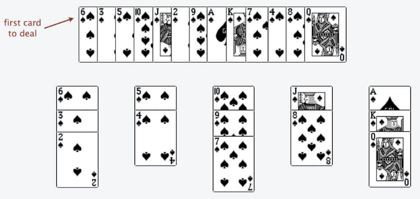

1. 每一堆扑克牌的最上方纸牌 是单调递增的

2. 结论：扑克牌的堆数 就是LIS的大小

3. 思路：因为每次放一张扑克牌，堆顶都是单调递增的

   所以可以每次去`二分查找`放在哪一堆（即找到`最接近的` 大于当前的 牌的 index），如果没有找到（即index == 堆的size）

   `开辟新的一堆`

4. 因此，使用的左边界的二分查找！

```c++
class Solution {
public:
    int lengthOfLIS(vector<int>& nums) {
      	//最多n堆
        vector<int> top(nums.size());
        //牌堆初始化为0
        int piles = 0;
        for(int num : nums) {
            //要处理的扑克牌
            int poker = num;
            //搜索左边界的二分查找 确定插入位置
            int left = 0, right = piles;
            while(left < right) {
                int m = (left + right) / 2;
                if(top[m] < num) left = m + 1;
                else right = m;  //左边界 在于 等于的时候仍然收缩有边界
            }
            // 没找到合适的牌堆，新建一堆
            if(piles == left) piles++;
            //将这张牌放到了 某一堆的最上方，也就是这堆的最小值
            top[left] = num; 
        }
        return piles;
    }
};
```

使用lower_bound的写法

比如序列是78912345，前三个遍历完以后tail是789，这时候遍历到1，就得把1放到合适的位置，于是在tail二分查找1的位置，变成了189（如果序列在此时结束，因为res不变，所以依旧输出3），再遍历到2成为129，然后是123直到12345 

1. lower_bound查找超范围的判断

   ```c++
     vector<int> v{0, 1, 2, 3, 4};
     auto it = lower_bound(v.begin(), v.end(), 6);
     int pos = it - v.begin(); // pos = 5 返回的就是查找区间的大小
     if (pos == v.size())
       cout << "超范围了。。。查找的元素比所有元素都大" << endl;
   	//或者
	if(it == v.end())
       cout<<"超了...";
   ```
   

```c++
class Solution {
public:
    int lengthOfLIS(vector<int> &nums) {
      //最多有多少堆 全递增的情况最多
	    vector<int> top(nums.size());
	    //牌堆初始化为0
	    int piles = 0;
	    for (int num : nums) {
	    	//要处理的扑克牌
	    	int poker = num;
	    	//搜索左边界的二分查找
	    	auto it = lower_bound(top.begin(), top.begin() + piles, poker);
	    	int pos = it - top.begin();
	    	// 没找到合适的牌堆，新建一堆
        //pos == piles表示在最后 也就是需要新建一堆
	    	if (pos == piles) {  //或者写做 it == top.begin() + piles
	    		piles++;
	    	}
	    	//将这张牌放到了 某一堆的最上方，也就是这堆的最小值
	    	top[pos] = num;
	    }
	    return piles;
    }
};
```


### [354. 俄罗斯套娃信封问题](https://leetcode-cn.com/problems/russian-doll-envelopes/)

[labuladong 题解](https://labuladong.github.io/article/?qno=354)[思路](https://leetcode-cn.com/problems/russian-doll-envelopes/#)

难度困难705

给你一个二维整数数组 `envelopes` ，其中 `envelopes[i] = [wi, hi]` ，表示第 `i` 个信封的宽度和高度。

当另一个信封的宽度和高度都比这个信封大的时候，这个信封就可以放进另一个信封里，如同俄罗斯套娃一样。

请计算 **最多能有多少个** 信封能组成一组“俄罗斯套娃”信封（即可以把一个信封放到另一个信封里面）。

**注意**：不允许旋转信封。

**示例 1：**

```
输入：envelopes = [[5,4],[6,4],[6,7],[2,3]]
输出：3
解释：最多信封的个数为 3, 组合为: [2,3] => [5,4] => [6,7]。
```

**示例 2：**

```
输入：envelopes = [[1,1],[1,1],[1,1]]
输出：1
```

#### 思路

1. 按照LIS进行dp
2. 按照LIS进行优化 二分查找

#### 代码

```c++
//按最长递增子序列进行升序 dp
class Solution {
public:
    int maxEnvelopes(vector<vector<int>>& envelopes) {
        int m = envelopes.size();
        vector<int> dp(m, 1);
        int ans = 0;
        sort(envelopes.begin(), envelopes.end(), [](vector<int> a, vector<int> b)->bool{return a[0]<b[0];});
        for(int i = 0; i<m; i++){
            vector<int> now = envelopes[i];
            for(int j = 0; j<i; j++){
                //if(j == i) continue;
                if(now[0]>envelopes[j][0] && now[1]>envelopes[j][1]){
                    dp[i] = max(dp[i], dp[j] + 1);
                }
            }
            ans = max(ans, dp[i]);
        }
        return ans;
    }
};

//二分做法
class Solution {
public:
    int maxEnvelopes(vector<vector<int>>& envelopes) {
        if (envelopes.empty()) 
            return 0;
        
        int n = envelopes.size();
        sort(envelopes.begin(), envelopes.end(), [](const auto& e1, const auto& e2) {
            return e1[0] < e2[0] || (e1[0] == e2[0] && e1[1] > e2[1]);
        });

        vector<int> f = {envelopes[0][1]};
        for (int i = 1; i < n; ++i) {
            if (int num = envelopes[i][1]; num > f.back()) {
                f.push_back(num);
            }
            else {
                //第一个>=num的位置
                auto it = lower_bound(f.begin(), f.end(), num);
                *it = num;
            }
        }
        return f.size();
    }
};
```

### [面试题 08.13. 堆箱子](https://leetcode-cn.com/problems/pile-box-lcci/)

难度困难66收藏分享切换为英文接收动态反馈

堆箱子。给你一堆n个箱子，箱子宽 wi、深 di、高 hi。箱子不能翻转，将箱子堆起来时，下面箱子的宽度、高度和深度必须大于上面的箱子。实现一种方法，搭出最高的一堆箱子。箱堆的高度为每个箱子高度的总和。

输入使用数组`[wi, di, hi]`表示每个箱子。

**示例1:**

```
 输入：box = [[1, 1, 1], [2, 2, 2], [3, 3, 3]]
 输出：6
```

**示例2:**

```
 输入：box = [[1, 1, 1], [2, 3, 4], [2, 6, 7], [3, 4, 5]]
 输出：10
```

#### 思路

简简单单的 LIS dp dp[i]表示 箱子`i在最上`的 累积的最大高度

注意 和套娃一样 由于存在相等的情况 所以需要排序

##### 代码

```c++
// LIS dp
class Solution {
public:
    int pileBox(vector<vector<int>>& box) {
        sort(box.begin(), box.end());
        int n = box.size();
        //dp[i]表示 箱子i在最上的 累积的最大高度
        vector<int> dp(n , 0);
        for(int i = 0; i<n; i++){
            //初始化dp base为箱子本身的高度
            dp[i] = box[i][2]; 
        }
        //注意 ans在i=0时没有比较 需要初始化为dp[0]
        int ans = dp[0];
        for(int i = 1; i<n; i++){
            for(int j = 0; j<i; j++){
                //下面箱子的宽度、高度和深度必须大于上面的箱子
                if(box[i][0]>box[j][0] && box[i][1]>box[j][1] && box[i][2]>box[j][2])
                    dp[i] = max(dp[i], dp[j] + box[i][2]);
            }
            ans = max(ans, dp[i]);
        }
        return ans;
    }
};
```

### [面试题 17.08. 马戏团人塔](https://leetcode-cn.com/problems/circus-tower-lcci/)

难度中等88英文版讨论区

有个马戏团正在设计叠罗汉的表演节目，一个人要站在另一人的肩膀上。出于实际和美观的考虑，在上面的人要比下面的人矮一点且轻一点。已知马戏团每个人的身高和体重，请编写代码计算叠罗汉最多能叠几个人。

**示例：**

```
输入：height = [65,70,56,75,60,68] weight = [100,150,90,190,95,110]
输出：6
解释：从上往下数，叠罗汉最多能叠 6 层：(56,90), (60,95), (65,100), (68,110), (70,150), (75,190)
```

#### 思路

- 先排序：高度升序排列，相同高度的宽度降序排列
- 然后DP数组下标 i 位置记录长为 i+1 最长递增序列末尾数字最小值
- 最后返回DP数组长度
- PS（新瓶装旧酒，和 俄罗斯套娃信封 问题一样）

#### 代码

```c++
class Solution {
public:
    int bestSeqAtIndex(vector<int>& height, vector<int>& weight) {
        int n = weight.size();
        vector<vector<int>> matrix = build(height, weight);
        sort(matrix.begin(), matrix.end(), [](vector<int> a, vector<int> b)
            ->bool{return a[0] < b[0]; });
        vector<int> dp(n, 1);
        int ans = 0;
        for(int i = 0; i<n; i++){
            for(int j = 0; j<i; j++){
                if(matrix[j][0]<matrix[i][0] && matrix[j][1] < matrix[i][1])
                    dp[i] = max(dp[i], dp[j] + 1);
            }
            ans = max(ans, dp[i]);
        }
        return ans;
    }

    vector<vector<int>> build(vector<int>& height, vector<int>& weight){
        int n = weight.size();
        vector<vector<int>> res(n, vector<int>(2));
        for(int i = 0; i<n; i++){
            res[i][0] = height[i];
            res[i][1] = weight[i];
        }
        return res;
    }
};


class Solution {
public:
    int bestSeqAtIndex(vector<int>& height, vector<int>& weight) {
        vector<pair<int,int>> tmp;
        for(int i = 0; i < height.size(); i++) tmp.push_back({height[i], weight[i]});
        sort(tmp.begin(), tmp.end(), [](const pair<int,int> &a, const pair<int,int> &b) {
            return a.first == b.first ? a.second > b.second : a.first < b.first;
        });
        vector<int> dp; //长度为N的地方 最小的数字
        for(const auto &[h, w]: tmp) {
            auto p = lower_bound(dp.begin(), dp.end(), w);  //二分查找第一个大于等于的地方
            if(p == dp.end()) dp.push_back(w);
            else *p = w;
        }
        return dp.size();
    }
};
```

## 重叠区间问题

### [435. 无重叠区间](https://leetcode-cn.com/problems/non-overlapping-intervals/)

[labuladong 题解](https://labuladong.github.io/article/?qno=435)[思路](https://leetcode-cn.com/problems/non-overlapping-intervals/#)

难度中等663

给定一个区间的集合 `intervals` ，其中 `intervals[i] = [starti, endi]` 。返回 * 需要移除区间的最小数量，使剩余区间互不重叠* 

 

**示例 1:**

```
输入: intervals = [[1,2],[2,3],[3,4],[1,3]]
输出: 1
解释: 移除 [1,3] 后，剩下的区间没有重叠。
```

**示例 2:**

```
输入: intervals = [ [1,2], [1,2], [1,2] ]
输出: 2
解释: 你需要移除两个 [1,2] 来使剩下的区间没有重叠。
```

**示例 3:**

```
输入: intervals = [ [1,2], [2,3] ]
输出: 0
解释: 你不需要移除任何区间，因为它们已经是无重叠的了。
```

#### 思路

1. 反向推断 移除区间的最小数量 只需要计算 满足不重复条件的区间的最大数量 LIS dp

2. 贪心 也是反向查找的思路 不过是按照右边界 拼接查找无重叠的最大区间数

   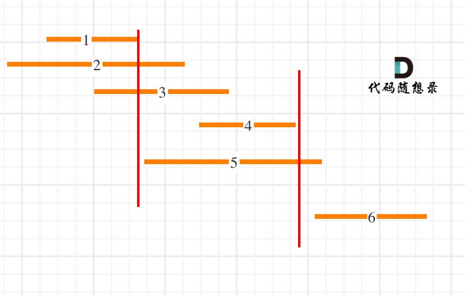

   如图 按照右边界排序 可以简单的找出无重叠的最大区间序列 1 4 6

   每次取非交叉区间的时候，都是可右边界最小的来做分割点（==<u>这样留给下一个区间的空间就越大</u>==），所以第一条分割线就是区间1结束的位置。

   接下来就是找大于区间1结束位置的区间，是从区间4开始。那有同学问了为什么不从区间5开始？别忘已经是按照右边界排序的了。

   区间4结束之后，在找到区间6，所以一共记录非交叉区间的个数是三个。

   总共区间个数为6，减去非交叉区间的个数3。移除区间的最小数量就是3。

#### 代码

```c++
//LIS dp 反向推断
class Solution {
public:
    int eraseOverlapIntervals(vector<vector<int>>& matrix) {
        sort(matrix.begin(), matrix.end());
        int n = matrix.size();
        //dp含义 不重叠的最大子区间个数
        vector<int> dp(n, 1);
        for(int i = 0; i<n; i++){
            for(int j = 0; j<i; j++){
                //反向思考 可以装入 即 不重叠
                if(matrix[j][1]<=matrix[i][0])
                    dp[i] = max(dp[i], dp[j] + 1);
            }
        }
        return n - dp[n-1];
    }
};

//按右端排序 贪心
class Solution {
public:
    int eraseOverlapIntervals(vector<vector<int>>& matrix) {
        sort(matrix.begin(), matrix.end(), 
            [](const vector<int>& a, const vector<int>& b)->bool{return a[1] < b[1];});
        int n = matrix.size();
        int maxNotOverlap = 1;
        int beginVal = matrix[0][1];
        for(int i = 1; i<n; i++){
            // 丑陋的代码 脑子不转。。
            // while(i<n && matrix[i][0]<beginVal){
            //     i++;
            // }
            // if(i == n) break;
            // beginVal = matrix[i][1];
            // maxNotOverlap++;

            if(matrix[i][0]>=beginVal){
                beginVal = matrix[i][1];
                maxNotOverlap++;
            }
        }
        return n - maxNotOverlap;
    }
};
```

### [646. 最长数对链](https://leetcode-cn.com/problems/maximum-length-of-pair-chain/)

难度中等214

给出 `n` 个数对。 在每一个数对中，第一个数字总是比第二个数字小。

现在，我们定义一种跟随关系，当且仅当 `b < c` 时，数对`(c, d)` 才可以跟在 `(a, b)` 后面。我们用这种形式来构造一个数对链。

给定一个数对集合，找出能够形成的最长数对链的长度。你不需要用到所有的数对，你可以以任何顺序选择其中的一些数对来构造。

 

**示例：**

```
输入：[[1,2], [2,3], [3,4]]
输出：2
解释：最长的数对链是 [1,2] -> [3,4]
```

#### 思路

1. LIS dp
2. 贪心 按右端排序 同上

#### 代码

```c++
//dp解法
class Solution {
public:
    int findLongestChain(vector<vector<int>>& matrix) {
        int n = matrix.size();
        sort(matrix.begin(), matrix.end());
        vector<int> dp(n, 1);
        for(int i = 0; i<n; i++){
            for(int j = 0; j<i; j++){
                if(matrix[j][1] < matrix[i][0])
                    dp[i] = max(dp[j] + 1, dp[i]);
            }
        }
        return dp[n - 1];
    }
};

//贪心解法
class Solution {
public:
    int findLongestChain(vector<vector<int>>& matrix) {
        int n = matrix.size();
        sort(matrix.begin(), matrix.end(),[](const vector<int>& a, const vector<int>& b)->
             bool{ return a[1] == b[1]? a[0]<b[0] : a[1]<b[1]; });
        int beginVal = matrix[0][1];
        int ans = 1;
        for(int i = 1; i<n; i++){
            if(matrix[i][0] > beginVal){
                beginVal = matrix[i][1];
                ans++;
            }
        }
        return ans;
    }
};
```

### [452. 用最少数量的箭引爆气球](https://leetcode-cn.com/problems/minimum-number-of-arrows-to-burst-balloons/)

[labuladong 题解](https://labuladong.github.io/article/?qno=452)[思路](https://leetcode-cn.com/problems/minimum-number-of-arrows-to-burst-balloons/#)

难度中等561收藏分享切换为英文接收动态反馈英文版讨论区

有一些球形气球贴在一堵用 XY 平面表示的墙面上。墙面上的气球记录在整数数组 `points` ，其中`points[i] = [xstart, xend]` 表示水平直径在 `xstart` 和 `xend`之间的气球。你不知道气球的确切 y 坐标。

一支弓箭可以沿着 x 轴从不同点 **完全垂直** 地射出。在坐标 `x` 处射出一支箭，若有一个气球的直径的开始和结束坐标为 `x``start`，`x``end`， 且满足  `xstart ≤ x ≤ x``end`，则该气球会被 **引爆** 。可以射出的弓箭的数量 **没有限制** 。 弓箭一旦被射出之后，可以无限地前进。

给你一个数组 `points` ，*返回引爆所有气球所必须射出的 **最小** 弓箭数* 。

**示例 1：**

```
输入：points = [[10,16],[2,8],[1,6],[7,12]]
输出：2
解释：气球可以用2支箭来爆破:
-在x = 6处射出箭，击破气球[2,8]和[1,6]。
-在x = 11处发射箭，击破气球[10,16]和[7,12]。
```

**示例 2：**

```
输入：points = [[1,2],[3,4],[5,6],[7,8]]
输出：4
解释：每个气球需要射出一支箭，总共需要4支箭。
```

#### 思路

LIS我特么射爆 其实不算LIS吧

#### 代码

```c++
//贪心正解
class Solution {
public:
    int findMinArrowShots(vector<vector<int>>& matrix) {
        int n = matrix.size();
        sort(matrix.begin(), matrix.end(),[](const vector<int>& a, const vector<int>& b)->
             bool{ return a[1] == b[1]? a[0]<b[0] : a[1]<b[1]; });
        int beginVal = matrix[0][1];
        int ans = 1;
        for(int i = 1; i<n; i++){
            //出范围 需要额外用一只箭
            if(matrix[i][0] > beginVal){
                beginVal = matrix[i][1];
                ans++;
            }
        }
        return ans;
    }
};

//dp超时
class Solution {
public:
    int findMinArrowShots(vector<vector<int>>& matrix) {
        int n = matrix.size();
        sort(matrix.begin(), matrix.end());
        //dp[i]表示射爆当前及其之前所有气球 需要的箭数
        vector<int> dp(n, 1);
        for(int i = 0; i<n; i++){
            for(int j = 0; j<i; j++){
                if(matrix[i][0] > matrix[j][1])
                    dp[i] = max(dp[i], dp[j] + 1);
            }
        }
        return dp[n - 1];
    }
};
```

### [960. 删列造序 III](https://leetcode-cn.com/problems/delete-columns-to-make-sorted-iii/)

难度困难64收藏分享切换为英文接收动态反馈英文版讨论区

给定由 `n` 个小写字母字符串组成的数组 `strs` ，其中每个字符串长度相等。

选取一个删除索引序列，对于 `strs` 中的每个字符串，删除对应每个索引处的字符。

比如，有 `strs = ["abcdef","uvwxyz"]` ，删除索引序列 `{0, 2, 3}` ，删除后为 `["bef", "vyz"]` 。

假设，我们选择了一组删除索引 `answer` ，那么在执行删除操作之后，最终得到的数组的行中的 **每个元素** 都是按**字典序**排列的（即 `(strs[0][0] <= strs[0][1] <= ... <= strs[0][strs[0].length - 1])` 和 `(strs[1][0] <= strs[1][1] <= ... <= strs[1][strs[1].length - 1])` ，依此类推）。

请返回 *`answer.length` 的最小可能值* 。

 

**示例 1：**

```
输入：strs = ["babca","bbazb"]
输出：3
解释：
删除 0、1 和 4 这三列后，最终得到的数组是 A = ["bc", "az"]。
这两行是分别按字典序排列的（即，A[0][0] <= A[0][1] 且 A[1][0] <= A[1][1]）。
注意，A[0] > A[1] —— 数组 A 不一定是按字典序排列的。
```

**示例 2：**

```
输入：strs = ["edcba"]
输出：4
解释：如果删除的列少于 4 列，则剩下的行都不会按字典序排列。
```

## 其他

### [674. 最长连续递增序列](https://leetcode-cn.com/problems/longest-continuous-increasing-subsequence/)

难度`简单`269英文版讨论区

给定一个未经排序的整数数组，找到最长且 **连续递增的子序列**，并返回该序列的长度。

**连续递增的子序列** 可以由两个下标 `l` 和 `r`（`l < r`）确定，如果对于每个 `l <= i < r`，都有 `nums[i] < nums[i + 1]` ，那么子序列 `[nums[l], nums[l + 1], ..., nums[r - 1], nums[r]]` 就是连续递增子序列。

 

**示例 1：**

```
输入：nums = [1,3,5,4,7]
输出：3
解释：最长连续递增序列是 [1,3,5], 长度为3。
尽管 [1,3,5,7] 也是升序的子序列, 但它不是连续的，因为 5 和 7 在原数组里被 4 隔开。 
```

**示例 2：**

```
输入：nums = [2,2,2,2,2]
输出：1
解释：最长连续递增序列是 [2], 长度为1。
```

```c++
class Solution {
public:
    int findLengthOfLCIS(vector<int>& nums) {
      int n = nums.size();
      //dp表示 当前为结束的递增子序列的长度
      vector<int> dp(n, 1);
      int maxx = 1;
      for(int i = 1; i<n; i++){
        if(nums[i] > nums[i-1])
          dp[i] = dp[i-1] + 1;
        maxx = max(dp[i], maxx);
      }
      return maxx;
    }
};
```

### [718. `最长重复子数组`](https://leetcode-cn.com/problems/maximum-length-of-repeated-subarray/)

难度中等673

给两个整数数组 `nums1` 和 `nums2` ，返回 *两个数组中 **公共的** 、长度最长的子数组的长度* 。

 

**示例 1：**

```
输入：nums1 = [1,2,3,2,1], nums2 = [3,2,1,4,7]
输出：3
解释：长度最长的公共子数组是 [3,2,1] 。
```

**示例 2：**

```
输入：nums1 = [0,0,0,0,0], nums2 = [0,0,0,0,0]
输出：5
```

#### [思路](https://leetcode-cn.com/problems/maximum-length-of-repeated-subarray/solution/zhe-yao-jie-shi-ken-ding-jiu-dong-liao-by-hyj8/)

1. dp数组的含义：dp[i] [j] 表示 以0 - i-1  0 - j-1的子数组中，以i-1和j-1为结尾的最大重复子数组的长度
2. base case: i == 0 || j == 0 时 则二者没有公共部分 dp[i] [j] = 0;

3. 状态转移： 
   - dp[i] [j] ：长度为i，末尾项为A[i-1]的子数组，与长度为j，末尾项为B[j-1]的子数组，二者的最大公共后缀子数组长度。
     如果 A[i-1] != B[j-1]， 有 dp[i] [j] = 0
     如果 A[i-1] == B[j-1] ， 有 dp[i] [j] = dp[i-1] [j-1] + 1

#### 代码

```c++
class Solution {
public:
    int findLength(vector<int>& nums1, vector<int>& nums2) {
      int m = nums1.size(), n = nums2.size();
      //dp[i][j]表示 0-i 0-j 以最后数字结尾的 最长重复子数组的长度
      vector<vector<int>> dp(m+1, vector<int>(n+1));
      int ans = 0;
      for(int i = 1; i<=m; i++){
        for(int j = 1; j<=n; j++){
          if(nums1[i - 1] == nums2[j - 1]){
            dp[i][j] = dp[i-1][j-1] + 1;
            ans = max(dp[i][j], ans);
          }
        }
      }
      return ans;
    }
};
```

### [516. 最长回文子序列](https://leetcode-cn.com/problems/longest-palindromic-subsequence/)

[labuladong 题解](https://labuladong.github.io/article/?qno=516)[思路](https://leetcode-cn.com/problems/longest-palindromic-subsequence/#)

难度中等777收藏分享切换为英文接收动态反馈英文版讨论区

给你一个字符串 `s` ，找出其中最长的回文子序列，并返回该序列的长度。

子序列定义为：不改变剩余字符顺序的情况下，删除某些字符或者不删除任何字符形成的一个序列。

 

**示例 1：**

```
输入：s = "bbbab"
输出：4
解释：一个可能的最长回文子序列为 "bbbb" 。
```

**示例 2：**

```
输入：s = "cbbd"
输出：2
解释：一个可能的最长回文子序列为 "bb" 。
```

```c++
class Solution {
public:
    int longestPalindromeSubseq(string s) {
      int n = s.size();
      //在子串 s[i..j] 中，最长回文子序列的长度为 dp[i][j]。
      vector<vector<int>> dp(n, vector<int>(n));
      for(int i = 0; i<n; i++)
        dp[i][i] = 1;//base case
      for(int i = n - 1; i>=0; i--){
        for(int j = i+1; j<n; j++){
          //状态转移
          if(s[i] == s[j])
            dp[i][j] = dp[i+1][j-1] + 2;
          else dp[i][j] = max(dp[i][j-1], dp[i+1][j]);
        }
      }
      return dp[0][n-1];
    }
};
```

### [剑指 Offer II 095. 最长公共子序列](https://leetcode-cn.com/problems/qJnOS7/)

难度中等65英文版讨论区

给定两个字符串 `text1` 和 `text2`，返回这两个字符串的最长 **公共子序列** 的长度。如果不存在 **公共子序列** ，返回 `0` 。

一个字符串的 **子序列** 是指这样一个新的字符串：它是由原字符串在不改变字符的相对顺序的情况下删除某些字符（也可以不删除任何字符）后组成的新字符串。

- 例如，`"ace"` 是 `"abcde"` 的子序列，但 `"aec"` 不是 `"abcde"` 的子序列。

两个字符串的 **公共子序列** 是这两个字符串所共同拥有的子序列。

 

**示例 1：**

```
输入：text1 = "abcde", text2 = "ace" 
输出：3  
解释：最长公共子序列是 "ace" ，它的长度为 3 。
```

**示例 2：**

```
输入：text1 = "abc", text2 = "abc"
输出：3
解释：最长公共子序列是 "abc" ，它的长度为 3 
```

#### dp解法

1. dp数组含义：dp[i] [j]表示 substr分别到 i和j的最大公共子序列长度

2. 状态转移方程：

   当前字符相同时：dp[i] [j] = dp[i-1] [j-1] + 1;

   当前字符不同时：dp[i] [j] = max(dp[i-1] [j], dp[i] [j-1]);

3. base case：处理第一行和第一列

```c++
class Solution {
public:
    int longestCommonSubsequence(string text1, string text2) {
      int m = text1.size(), n = text2.size();
      vector<vector<int>> dp(m, vector<int>(n));
      for(int i = 0; i<m; i++){
        if(text1[i] == text2[0])
          while(i<m)
            dp[i++][0] = 1;
      }
      for(int i = 0; i<n; i++){
        if(text1[0] == text2[i])
          while(i<n)
            dp[0][i++] = 1;
      }

      for(int i = 1; i<m; i++){
        for(int j = 1; j<n ; j++){
          if(text1[i] == text2[j]){
            //注意 这里 是在-1-1的基础上加1
            //例如 abcce ace 两个c的情况
            dp[i][j] = dp[i-1][j-1] + 1;
          }else dp[i][j] = max(dp[i-1][j], dp[i][j-1]);
        }
      }
      return dp[m-1][n-1];
    }
};
```

base case的简单写法 前插一行一列为0

```c++
class Solution {
public:
    int longestCommonSubsequence(string text1, string text2) {
      int m = text1.size(), n = text2.size();
      vector<vector<int>> dp(m+1, vector<int>(n+1));
      for(int i = 1; i<=m; i++){
        for(int j = 1; j<=n ; j++){
          if(text1[i-1] == text2[j-1]){
            //注意 这里 是在-1-1的基础上加1
            //例如 abcce ace 两个c的情况
            dp[i][j] = dp[i-1][j-1] + 1;
          }else dp[i][j] = max(dp[i-1][j], dp[i][j-1]);
        }
      }
      return dp[m][n];
    }
};
```

### [剑指 Offer II 096. 字符串交织](https://leetcode-cn.com/problems/IY6buf/)

难度中等14

给定三个字符串 `s1`、`s2`、`s3`，请判断 `s3` 能不能由 `s1` 和 `s2` **交织（交错）** 组成。

两个字符串 `s` 和 `t` **交织** 的定义与过程如下，其中每个字符串都会被分割成若干 **非空** 子字符串：

- `s = s1 + s2 + ... + sn`
- `t = t1 + t2 + ... + tm`
- `|n - m| <= 1`
- **交织** 是 `s1 + t1 + s2 + t2 + s3 + t3 + ...` 或者 `t1 + s1 + t2 + s2 + t3 + s3 + ...`

**提示：**`a + b` 意味着字符串 `a` 和 `b` 连接。

**示例 1：**


```
输入：s1 = "aabcc", s2 = "dbbca", s3 = "aadbbcbcac"
输出：true
```

#### dp解法

1. dp数组含义：前i j个元素可以构成s3前i+j个
2. 状态转移方程：见代码 
3. base case：dp[0] [0] = 1，初始化第一行第一列

```c++
class Solution {
public:
    bool isInterleave(string s1, string s2, string s3) {
      int m = s1.size(), n = s2.size();
      int nn = s3.size();
      if(m + n != nn) return 0;
      //dp含义 前i j个元素可以构成s3前i+j个
      vector<vector<int>> dp(m + 1, vector<int>(n + 1));
      dp[0][0] = 1;
      for(int i = 1; i<=m; i++){
        if(s1[i-1] != s3[i-1])
          break;
        dp[i][0] = 1;
      }
      for(int i = 1; i<=n; i++){
        if(s2[i-1] != s3[i-1])
          break;
        dp[0][i] = 1;
      }

      for(int i = 1; i<=m; i++){
        for(int j = 1; j<=n; j++){
          if(s1[i-1] == s3[i+j-1])
            dp[i][j] = dp[i-1][j];
          if(s2[j-1] == s3[i+j-1])
            dp[i][j] = dp[i][j] || dp[i][j-1];
        }
      }
      return dp[m][n];
    }
};
```

### [剑指 Offer II 097. 子序列的数目](https://leetcode-cn.com/problems/21dk04/)

难度困难20收藏分享切换为英文接收动态反馈

给定一个字符串 `s` 和一个字符串 `t` ，计算在 `s` 的子序列中 `t` 出现的个数。

字符串的一个 **子序列** 是指，通过删除一些（也可以不删除）字符且不干扰剩余字符相对位置所组成的新字符串。（例如，`"ACE"` 是 `"ABCDE"` 的一个子序列，而 `"AEC"` 不是）

题目数据保证答案符合 32 位带符号整数范围。

 

**示例 1：**

```
输入：s = "rabbbit", t = "rabbit"
输出：3
解释：
如下图所示, 有 3 种可以从 s 中得到 "rabbit" 的方案。
rabbbit
rabbbit
rabbbit
```

#### dp解法

1. dp数组含义：s的前i 对应t的钱j 的子序列数目

2. 状态转移方程

   

3. base case：dp[0] [0] = 1,dp[all] [0] = 1;

```c++
class Solution {
public:
    int numDistinct(string s, string t) {
        if (s.size() < t.size())
            return 0;

        vector<vector<unsigned int>> dp(s.size() + 1, vector<unsigned int>(t.size() + 1, 0));
        dp[0][0] = 1;

        for (int i = 0; i < s.size(); ++i) {
            dp[i + 1][0] = 1;
            for (int j = 0; j <= i && j < t.size(); ++j) 
                dp[i + 1][j + 1] = (s[i] == t[j]) ? dp[i][j] + dp[i][j + 1] : dp[i][j + 1];
        }
        return dp.back().back();
    }
};
```

### [53. 最大子数组和](https://leetcode.cn/problems/maximum-subarray/)

[labuladong 题解](https://labuladong.github.io/article/?qno=53)[思路](https://leetcode.cn/problems/maximum-subarray/#)

难度简单4973

给你一个整数数组 `nums` ，请你找出一个具有最大和的连续子数组（子数组最少包含一个元素），返回其最大和。

**子数组** 是数组中的一个连续部分。

 

**示例 1：**

```
输入：nums = [-2,1,-3,4,-1,2,1,-5,4]
输出：6
解释：连续子数组 [4,-1,2,1] 的和最大，为 6 。
```

#### 思路

##### dp

1. dp数组：**以 `nums[i]` 为结尾的「最大子数组和」为 `dp[i]`。**
2. base case：dp[0] = nums[0];
3. 状态转移：`dp[i]` 有两种「选择」，要么与前面的相邻子数组连接，形成一个和更大的子数组；要么不与前面的子数组连接，自成一派，自己作为一个子数组。

```c++
class Solution {
public:
    int maxSubArray(vector<int>& nums) {
      vector<int> dp(nums.size());
      dp[0] = nums[0];
      int ans = dp[0];
      for(int i = 1; i<nums.size(); i++){
        dp[i] = max(dp[i-1] + nums[i], nums[i]);
        ans = max(ans, dp[i]);
      }
      return ans;
    }
};
```

dp优化

优化空间的dp解法

```c++
class Solution {
public:
    int maxSubArray(vector<int> nums) {
      int ans = nums[0];
      int dp = nums[0];
      for (int i = 1; i < nums.size(); i++) {
        dp = max(dp + nums[i], nums[i]);
        ans = max(ans, dp);
      }
      return ans;
    }
};
```

##### 分治

```c++
class Solution {
public:
    int maxSubArray(vector<int>& nums) {
      //类似寻找最大最小值的题目，初始值一定要定义成理论上的最小最大值
      int result = INT_MIN;
      int numsSize = int(nums.size());
      result = maxSubArrayHelper(nums, 0, numsSize - 1);
      return result;
    }

    int maxSubArrayHelper(vector<int> &nums, int left, int right) {
      if (left == right) return nums[left];
      int mid = left + (right - left) / 2;
      int leftSum = maxSubArrayHelper(nums, left, mid);
      //注意这里应是mid + 1，否则left + 1 = right时，会无线循环
      int rightSum = maxSubArrayHelper(nums, mid + 1, right);
      int midSum = findMaxCrossingSubarray(nums, left, mid, right);
      int result = max(max(leftSum, rightSum), midSum);
      return result;
    }

    //跨越mid 找区间的最大值
    int findMaxCrossingSubarray(vector<int> &nums, int left, int mid, int right) {
      int leftSum = INT_MIN;
      int sum = 0;
      for (int i = mid; i >= left; i--) {
        sum += nums[i];
        leftSum = max(leftSum, sum);
      }

      int rightSum = INT_MIN;
      sum = 0;
      //注意这里i = mid + 1，避免重复用到nums[i]
      for (int i = mid + 1; i <= right; i++) {
        sum += nums[i];
        rightSum = max(rightSum, sum);
      }
      return (leftSum + rightSum);
    }
};
```


# 二维矩阵dp

### [62. 不同路径 经典简单的二维dp](https://leetcode-cn.com/problems/unique-paths/)

一个机器人位于一个 `m x n` 网格的左上角 （起始点在下图中标记为 “Start” ）。

机器人每次只能向下或者向右移动一步。机器人试图达到网格的右下角（在下图中标记为 “Finish” ）。

问总共有多少条不同的路径？

 

**示例 1：**


```
输入：m = 3, n = 7
输出：28
```

#### 思路

1. dp的含义：当前位置可以到达的路径数

   所以base case为横竖1

2. 状态转移方程 dp [i] [j] = dp[i-1] [j] + dp[i] [j-1]

#### 代码

```c++
class Solution {
public:
    int uniquePaths(int m, int n) {
        vector<vector<int>> dp(m, vector<int>(n));
        for(int i = 0; i<n; i++){
            dp[0][i] = 1;
        }
        for(int i = 0; i<m; i++){
            dp[i][0] = 1;
        }

        for(int i = 1; i<m; i++){
            for(int j = 1; j<n; j++){
                dp[i][j] = dp[i-1][j] + dp[i][j-1];
            }
        }
        return dp[m-1][n-1];
    }
};
```

### [64. 最小路径和](https://leetcode-cn.com/problems/minimum-path-sum/)

[labuladong 题解](https://labuladong.gitee.io/plugin-v4/?qno=64&target=gitee)[思路](https://leetcode-cn.com/problems/minimum-path-sum/#)

难度中等1191

给定一个包含非负整数的 `*m* x *n*` 网格 `grid` ，请找出一条从左上角到右下角的路径，使得路径上的数字总和为最小。

**说明：**每次只能向下或者向右移动一步。

**示例 1：**


```
输入：grid = [[1,3,1],[1,5,1],[4,2,1]]
输出：7
解释：因为路径 1→3→1→1→1 的总和最小。
```

**示例 2：**

```
输入：grid = [[1,2,3],[4,5,6]]
输出：12
```

#### 思路

1. 可以记一下这个短路的万能写法
2. 横 竖的 路径和是确定的 所以 这是base case
3. 状态转移方程 dp[i] [j] = min(dp[i-1] [j], dp[i] [j-1]) + grid[i] [j];

#### 代码

1. 回溯超时
2. dp

```c++
class Solution {
public:
    // vector<int> allAns;
    // int minPathSum(vector<vector<int>>& grid) {
    //   int ans = 0;
    //   int m = grid.size();
    //   int n = grid[0].size();
    //   goWay(ans, grid, 0 , 0);
    //   return *std::min_element(allAns.begin(), allAns.end());
    // }

    // void goWay(int tempans, vector<vector<int>> grid, int x, int y){
    //   if(x == grid.size()-1 && y == grid[0].size()-1){
    //     tempans+=grid[x][y];
    //     allAns.push_back(tempans);       
    //   }
    //   if(x >= grid.size() || y >= grid[0].size())
    //     return;
    //   tempans += grid[x][y];
    //   goWay(tempans, grid, x+1, y);
    //   goWay(tempans, grid, x, y+1);
    // }

    int minPathSum(vector<vector<int>>& grid) {
        //这个判断应该比较万能
        if (grid.size() == 0 || grid[0].size() == 0)
            return 0;
        int m = grid.size(), n = grid[0].size();
        auto dp = vector <vector<int>>(m, vector <int> (n));
        dp[0][0] = grid[0][0];
        for (int i = 1; i < m; i++) {
            dp[i][0] = dp[i - 1][0] + grid[i][0];
        }
        for (int j = 1; j < n; j++) {
            dp[0][j] = dp[0][j - 1] + grid[0][j];
        }
        for (int i = 1; i < m; i++) {
            for (int j = 1; j < n; j++) {
                dp[i][j] = min(dp[i - 1][j], dp[i][j - 1]) + grid[i][j];
            }
        }
        return dp[m - 1][n - 1];
    }
};
```

### [120. 三角形最小路径和](https://leetcode-cn.com/problems/triangle/)

难度中等995

给定一个三角形 `triangle` ，找出自顶向下的最小路径和。

每一步只能移动到下一行中相邻的结点上。**相邻的结点** 在这里指的是 **下标** 与 **上一层结点下标** 相同或者等于 **上一层结点下标 + 1** 的两个结点。也就是说，如果正位于当前行的下标 `i` ，那么下一步可以移动到下一行的下标 `i` 或 `i + 1` 。

 

**示例 1：**

```
输入：triangle = [[2],[3,4],[6,5,7],[4,1,8,3]]
输出：11
解释：如下面简图所示：
   2
  3 4
 6 5 7
4 1 8 3
自顶向下的最小路径和为 11（即，2 + 3 + 5 + 1 = 11）。
```

**示例 2：**

```
输入：triangle = [[-10]]
输出：-10
```

#### 思路

同上

#### 代码

```c++
class Solution {
public:
	int minimumTotal(vector<vector<int>> &nums) {
		int ans = INT_MAX;
		int m = nums.size();
		if (m == 0)
			return 0;
		vector<vector<int>> dp(m);
		for (int i = 0; i < m; i++) {
			vector<int> temp(i + 1);
			// base case
			if (i == 0) {
				temp[0] = nums[i][0];
				dp[i] = temp;
				continue;
			}
			for (int j = 0; j < i + 1; j++) {
				if (j == 0)
					temp[j] = dp[i - 1][j] + nums[i][j];
				if (j == i)
					temp[j] = dp[i - 1][j - 1] + nums[i][j];
				if (j != 0 && j != i)
					temp[j] = min(dp[i - 1][j], dp[i - 1][j - 1]) + nums[i][j];
			}
			dp[i] = temp;
		}

		for (int i = 0; i < dp[m - 1].size(); i++) {
			//cout << dp[m - 1][i] << endl;
			ans = min(ans, dp[m - 1][i]);
		}
		return ans;
	}
};
```

#### 

### [221. 最大正方形](https://leetcode-cn.com/problems/maximal-square/)

难度中等1091英文版讨论区

在一个由 `'0'` 和 `'1'` 组成的二维矩阵内，找到只包含 `'1'` 的最大正方形，并返回其面积。

 

**示例 1：**

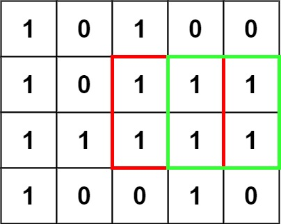

```
输入：matrix = [["1","0","1","0","0"],["1","0","1","1","1"],["1","1","1","1","1"],["1","0","0","1","0"]]
输出：4
```

#### 思路

1. dp含义： 当前点 之上 的最大正方形的面积
2. 状态转移：之前三方向的 最小dp值（最小说明受这个方向的限制） + 1
3. base case: 第一行第一列 为1的位置

#### 代码

```c++
class Solution {
public:
    int maximalSquare(vector<vector<char>>& matrix) {
      int ans = 0;
      int m = matrix.size(), n = matrix[0].size();
      vector<vector<int>> dp(m+1, vector<int>(n+1));
      for(int i = 1; i<=m; i++){
        for(int j = 1; j<=n; j++){
          if(matrix[i-1][j-1] == '1'){
            dp[i][j] = min(min(dp[i][j-1], dp[i-1][j]), dp[i-1][j-1])+1;
            ans = max(ans, dp[i][j]);
          }
        }
      }
      return ans*ans;
    }
};
```

# 二叉树的dp

二叉树的种类情况存在状态方程 随意有些dp的题目

### n个节点不超过m高度的二叉树种类数

链接：https://www.nowcoder.com/questionTerminal/aaefe5896cce4204b276e213e725f3ea

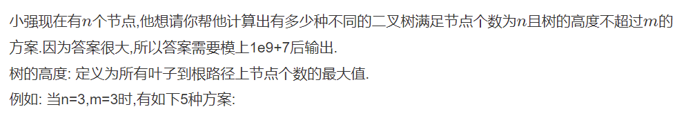

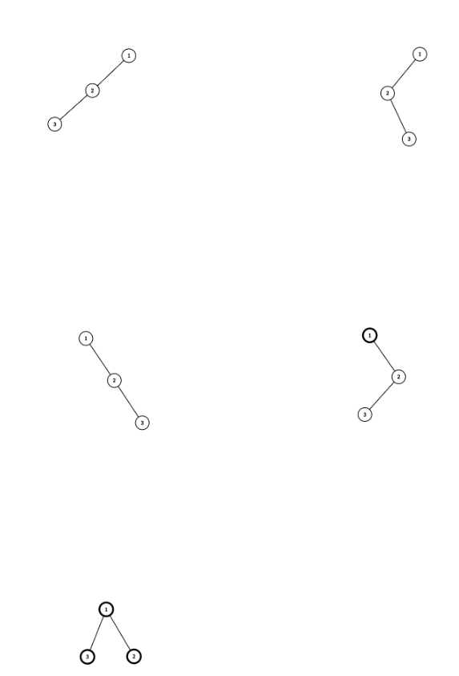


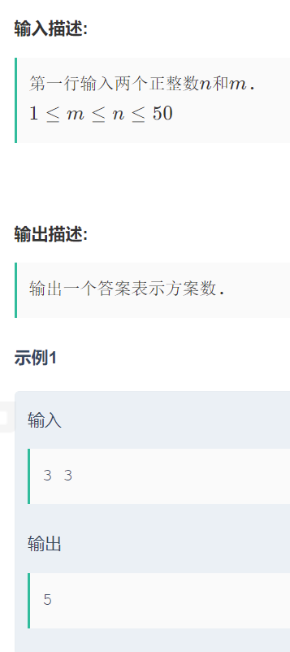

#### 思路

动态规划：

1. dp[i] [j]的含义为 i个节点 最大高度为j的二叉树种类数
2. 状态转移方程：

#### 代码

```c++
#include <bits/stdc++.h>
using namespace std;

const int MOD = 1e9 + 7;

int main() {
    int n; // 节点个数
    int m; // 最大高度
    cin >> n >> m;
    
    // dp[i][j] 表示 i 个节点能够组成的高度不超过 j 的树的个数
    vector<vector<long long>> dp(n + 1, vector<long long>(m + 1));
    for(int i = 0; i <= m; ++i) {
        dp[0][i] = 1;
    }
    
    for(int i = 1; i <= n; ++i) {
        for(int j = 1; j <= m; ++j) {
            // 选取一个节点作为根节点
            // k 个节点作为左子树，i - k - 1 个节点作为右子树
            for(int k = 0; k < i; ++k) {
                dp[i][j] = (dp[i][j] + dp[k][j - 1] * dp[i - k - 1][j - 1] % MOD) % MOD;
            }
        }
    }
    
    cout << dp[n][m] << endl;
}
```

# 字符串

### [97. 交错字符串](https://leetcode.cn/problems/interleaving-string/)

[思路](https://leetcode.cn/problems/interleaving-string/#)

难度中等698收藏分享切换为英文接收动态反馈

给定三个字符串 `s1`、`s2`、`s3`，请你帮忙验证 `s3` 是否是由 `s1` 和 `s2` **交错** 组成的。

两个字符串 `s` 和 `t` **交错** 的定义与过程如下，其中每个字符串都会被分割成若干 **非空** 子字符串：

- `s = s1 + s2 + ... + sn`
- `t = t1 + t2 + ... + tm`
- `|n - m| <= 1`
- **交错** 是 `s1 + t1 + s2 + t2 + s3 + t3 + ...` 或者 `t1 + s1 + t2 + s2 + t3 + s3 + ...`

**注意：**`a + b` 意味着字符串 `a` 和 `b` 连接。

 

**示例 1：**


```
输入：s1 = "aabcc", s2 = "dbbca", s3 = "aadbbcbcac"
输出：true
```

**示例 2：**

```
输入：s1 = "aabcc", s2 = "dbbca", s3 = "aadbbbaccc"
输出：false
```

#### 解法 dp

很简单的就能想到应该用dp 但是dp的实现：大小 basecase初始化 状态转移方程需要注意下

1. dp数组含义：dpij 标识 s1的前i个字母 s2的前j个字母 可不可以构成s3的前i+j
2. basecase：初始化dp00为真 不能太纠结这东西 重点是初始化第一行第一列
3. 状态转移：dp[i] [j] = （dp[i-1] [j]为真 并且s1的当前字母等于当前s3的字母） || （dp[i] [j-1]为真 并且s2的当前字母等于当前s3的字母）

```c++
class Solution {
public:
    bool isInterleave(string s1, string s2, string s3) {
      int m1 = s1.size(), m2 = s2.size(), n = s3.size();
      if(m1 + m2 != n) return 0;
      //dp[i][j]表示s1[0~i-1]和s2[0~j-1]能否交错组成s3[0~i+j-1]。 想好边缘条件，字符串涉及子串匹配啥的统统dp完事。
      vector<vector<bool>> dp(m1 + 1, vector<bool>(m2 + 1));
      dp[0][0] = 1;
      for(int i = 1; i<=m1; i++){
        dp[i][0] = dp[i-1][0] && (s1[i-1] == s3[i-1]);
      }
      for(int j = 1; j<=m2; j++){
        dp[0][j] = dp[0][j-1] && (s2[j-1] == s3[j-1]);
      }
      for(int i = 1; i<=m1; i++){
        for(int j = 1; j<=m2; j++){
          dp[i][j] = (dp[i-1][j] && s1[i-1] == s3[i+j-1]) || (dp[i][j-1] && s2[j-1] == s3[i+j-1]);
        }
      }
      return dp.back().back();
    }
};
```

### [72. 编辑距离](https://leetcode-cn.com/problems/edit-distance/)

[labuladong 题解](https://labuladong.gitee.io/plugin-v4/?qno=72&target=gitee)[思路](https://leetcode-cn.com/problems/edit-distance/#)

难度困难2239英文版讨论区

给你两个单词 `word1` 和 `word2`， * 请返回将 `word1` 转换成 `word2` 所使用的最少操作数* 。

你可以对一个单词进行如下三种操作：

- 插入一个字符
- 删除一个字符
- 替换一个字符

 

**示例 1：**

```
输入：word1 = "horse", word2 = "ros"
输出：3
解释：
horse -> rorse (将 'h' 替换为 'r')
rorse -> rose (删除 'r')
rose -> ros (删除 'e')
```

**示例 2：**

```
输入：word1 = "intention", word2 = "execution"
输出：5
解释：
intention -> inention (删除 't')
inention -> enention (将 'i' 替换为 'e')
enention -> exention (将 'n' 替换为 'x')
exention -> exection (将 'n' 替换为 'c')
exection -> execution (插入 'u')
```

#### 思路

1. dp含义：由于我们的目的求将 word1 转换成 word2 所使用的最少操作数 。那我们就定义 dp[i] [j]的含义为：**当字符串 word1 的长度为 i，字符串 word2 的长度为 j 时，将 word1 转化为 word2 所使用的最少操作次数为 dp[i] [j]**。

2. 状态方程：

   - 如果我们 word1[i] 与 word2 [j] 相等，这个时候不需要进行任何操作，显然有 dp[i] [j] = dp[i-1] [j-1]。

   - 如果我们 word1[i] 与 word2 [j] 不相等，这个时候我们就必须进行调整，而调整的操作有 3 种，我们要选择一种。三种操作对应的关系试如下（注意字符串与字符的区别）：
     - 如果把字符 word1[i] 替换成与 word2[j] 相等，则有 dp[i] [j] = dp[i-1] [j-1] + 1;
     - 如果在字符串 word1末尾插入一个与 word2[j] 相等的字符，则有 dp[i] [j] = dp[i] [j-1] + 1;
     - 如果把字符 word1[i] 删除，则有 dp[i] [j] = dp[i-1] [j] + 1;那么我们应该选择一种操作，使得 dp[i] [j] 的值最小，显然有**dp[i] [j] = min(dp[i-1] [j-1]，dp[i] [j-1]，dp[[i-1] [j]]) + 1;**

3. base case: 当 dp[i] [j] 中，如果 i 或者 j 有一个为 0，这个时候把 i - 1 或者 j - 1，就变成负数了，数组就会出问题了，所以我们的初始值是计算出所有的 dp[0] [0….n] 和所有的 dp[0….m] [0]。这个还是非常容易计算的，因为当有一个字符串的长度为 0 时，转化为另外一个字符串，那就只能一直进行插入或者删除操作了。

> 大佬：90%的字符串问题都可以用dp解决
>
> 我：** * **

```c++
class Solution {
public:
    int minDistance(string word1, string word2) {
        int m = word1.size();
        int n = word2.size();
        vector<vector<int>> dp(m+1, vector<int>(n+1));
        for(int i = 1; i<=m; i++)
            dp[i][0] = dp[i-1][0] + 1;
        for(int i = 1; i<=n; i++)
            dp[0][i] = dp[0][i-1] + 1;
        for(int i = 1; i<=m; i++){
            for(int j = 1; j<=n; j++){
                if(word1[i-1] == word2[j-1])
                    dp[i][j] = dp[i-1][j-1];
                else
                    dp[i][j] = min(min(dp[i-1][j], dp[i][j-1]), dp[i-1][j-1]) + 1;
            }
        }
        return dp[m][n];
    }
};
```

### [10. 正则表达式匹配](https://leetcode-cn.com/problems/regular-expression-matching/)

[labuladong 题解](https://labuladong.gitee.io/plugin-v4/?qno=10&target=gitee)[思路](https://leetcode-cn.com/problems/regular-expression-matching/#)

难度困难2842英文版讨论区

给你一个字符串 `s` 和一个字符规律 `p`，请你来实现一个支持 `'.'` 和 `'*'` 的正则表达式匹配。

- `'.'` 匹配任意单个字符
- `'*'` 匹配零个或多个前面的那一个元素

所谓匹配，是要涵盖 **整个** 字符串 `s`的，而不是部分字符串。

```c++
//背这个
class Solution {
public:
    bool isMatch(string s, string p) {
        if (p.empty()) return s.empty();
        //当前位置匹配
        auto first_match = !s.empty() && (s[0] == p[0] || p[0] == '.');
        
        if (p.length() >= 2 && p[1] == '*') {
            //通配符匹配0次 || 通配符匹配多次
            return isMatch(s, p.substr(2)) || (first_match && isMatch(s.substr(1), p));
        } else {
            //无通配符，向前匹配
            return first_match && isMatch(s.substr(1), p.substr(1));
        }
    }
};

class Solution {
public:
    unordered_map<string, int> memo;

    bool isMatch(string s, string p) {
        return dp(s, 0, p, 0);
    }
	/* 计算 p[j..] 是否匹配 s[i..] */
    bool dp(string& s, int i, string& p, int j) {
        int m = s.size(), n = p.size();
        // base case
        if (j == n) {
            return i == m;
        }
        if (i == m) {
            // 如果能匹配空串，一定是字符和 * 成对儿出现
            if ((n - j) % 2 == 1) {
                return false;
            }
            // 检查是否为 x*y*z* 这种形式
            for (; j + 1 < n; j += 2) {
                if (p[j + 1] != '*') {
                    return false;
                }
            }
            return true;
        }
    
        // 记录状态 (i, j)，消除重叠子问题
        string key = to_string(i) + "," + to_string(j);
        if (memo.count(key)) return memo[key];
    
        bool res = false;
    
        if (s[i] == p[j] || p[j] == '.') {
            // 匹配
            if (j < n - 1 && p[j + 1] == '*') {
			   // 1.1 通配符匹配 0 次或多次
                res = dp(s, i, p, j + 2) || dp(s, i + 1, p, j);
            } else {
                // 1.2 常规匹配 1 次
                res = dp(s, i + 1, p, j + 1);
            }
        } else {
             // 不匹配
            if (j < n - 1 && p[j + 1] == '*') {
                // 2.1 通配符匹配 0 次
                res = dp(s, i, p, j + 2);
            } else {
                // 2.2 无法继续匹配
                res = false;
            }
        }
        // 将当前结果记入备忘录
        memo[key] = res;
        return res;
    }
};
```

### [剑指 Offer 46. 把数字翻译成字符串](https://leetcode.cn/problems/ba-shu-zi-fan-yi-cheng-zi-fu-chuan-lcof/)

难度中等448

给定一个数字，我们按照如下规则把它翻译为字符串：0 翻译成 “a” ，1 翻译成 “b”，……，11 翻译成 “l”，……，25 翻译成 “z”。一个数字可能有多个翻译。请编程实现一个函数，用来计算一个数字有多少种不同的翻译方法。

 

**示例 1:**

```
输入: 12258
输出: 5
解释: 12258有5种不同的翻译，分别是"bccfi", "bwfi", "bczi", "mcfi"和"mzi"
```

#### `青蛙跳台阶`

```c++
class Solution {
public:
    int translateNum(int num) {
      string s = to_string(num);
      if(s.size() == 1) return 1;
      vector<int> dp(s.size());
      dp[0] = 1;
      dp[1] = (s.substr(0, 2) >="10" && s.substr(0, 2)<="25")?2:1;
      for(int i = 2; i<s.size(); i++){
        int temp = (s[i-1]-'0')*10 + (s[i]-'0');
        if(temp<10 || temp>25)
          dp[i] = dp[i-1];
        else dp[i] = dp[i-1] + dp[i-2];
      }
      return dp[s.size()-1];
    }
};
```

### [926. 将字符串翻转到单调递增](https://leetcode.cn/problems/flip-string-to-monotone-increasing/)

难度中等251

如果一个二进制字符串，是以一些 `0`（可能没有 `0`）后面跟着一些 `1`（也可能没有 `1`）的形式组成的，那么该字符串是 **单调递增** 的。

给你一个二进制字符串 `s`，你可以将任何 `0` 翻转为 `1` 或者将 `1` 翻转为 `0` 。

返回使 `s` 单调递增的最小翻转次数。

 

**示例 1：**

```
输入：s = "00110"
输出：1
解释：翻转最后一位得到 00111.
```

**示例 2：**

```
输入：s = "010110"
输出：2
解释：翻转得到 011111，或者是 000111。
```

#### 思路

简单DP思路：如果`s[i] == '1'`，那么这个字符不影响翻转次数，故有：`dp[i] = dp[i - 1]`。若`s[i] == '0'`，那我们有两种情况：1. 将`s[i]`由0翻转到1。2. 将前面的字符串`s[0:i-1]`中所有1翻转到0，两种情况取最小值，有`dp[i] = min{dp[i - 1] + 1, oneCount}`。所以我们还得用一个变量记录1的数量。

```c++
class Solution {
public:
    int minFlipsMonoIncr(string s) {
      int dp = 0, cnt = 0;
      for(int i = 0; i<s.size(); i++){
        if(s[i] == '1')
          cnt++;
        else dp = min(dp+1, cnt);
      }
      return dp;
    }
};
```
