# GEO术语

# 波

# 实体波

#### P波（纵波）

P波是最早到达的波。地球物质在实体波经过时，可以在三个方向（上下、左右、前后）上产生震动；如果，不同[质点](https://zh.wikipedia.org/wiki/質點)间的震动方向属于（相对于波速方向的）前后震动，也就是说震波以前后压缩、[纵波](https://zh.wikipedia.org/wiki/纵波)的方式向外传递，称为“[P波](https://zh.wikipedia.org/wiki/P波)”。P代表“主要”（`Primary`）或“压缩”（`Pressure`）。P波被称为主要是因为P波的传播来自于在传播方向上施加压力，而地球内部几乎不可压缩，因此P波很容易通过介质传递能量，故其震动最快、地震学应用相当高。事实上，P波是所有地震波里最快的波，因此也会是[地震仪](https://zh.wikipedia.org/wiki/地震儀)第一个记录到的波。因为压缩力在[固体](https://zh.wikipedia.org/wiki/固體)、[液体](https://zh.wikipedia.org/wiki/液體)中都能存在，因此P波能在固体和液体中传播(其实气体也可以借此传播，例如声波)。

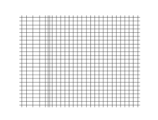

#### S波（横波）

S波到来的`比P波晚`，同样是由地震的岩石错位直接产生。S波中的S代表次要（`Secondary`）或剪力（`Shear`）。在S波的行进过程中，不同于P波的振动方式，S波影响的质点会在上下或左右方向震动、以[横波](https://zh.wikipedia.org/wiki/横波)的方式前进。S波的波速虽然较慢，约为P波的0.58倍，但是[振幅](https://zh.wikipedia.org/wiki/振幅)较大，约为P波的1.4倍。由于当地震波从地底来到地表时，S波的震动方向平行于地表的分量较多，较容易水平拉扯建筑物，而一般建筑水平耐震能力较弱（因为垂直耸立），故S波经常是造成地震破坏的主因。[[2\]](https://zh.wikipedia.org/wiki/地震波#cite_note-:1-2)

波的波速受剪切模量影响极大。事实上，在地表处，因为[风化层](https://zh.wikipedia.org/wiki/表岩屑)较厚、地面较软，剪切模数较低，S波速度常降至每秒数百米，这个时候波速下降的[动能](https://zh.wikipedia.org/wiki/動能)损失会由增加的震动幅度来弥补，造成地面摇晃增加，就容易引发[场址效应](https://zh.wikipedia.org/wiki/場址效應)[[12\]](https://zh.wikipedia.org/wiki/地震波#cite_note-13)。场址效应是一种影响[地震烈度](https://zh.wikipedia.org/wiki/地震震度)的因素[[13\]](https://zh.wikipedia.org/wiki/地震波#cite_note-14) ，他会造成原本应该离[震中](https://zh.wikipedia.org/wiki/震央)越远烈度就会越小的烈度，在当地震波被传至[冲积层](https://zh.wikipedia.org/wiki/沖積層)地表时震幅加大，地震的持续时间也会被延长，增加一场地震摇晃的影响力[[14\]](https://zh.wikipedia.org/wiki/地震波#cite_note-15)。场址效应会造成地震在地表较软区（通常是人口密集区）的所造成的伤害扩大，妨碍经济活动。2016年的[美浓大地震](https://zh.wikipedia.org/wiki/2016年高雄美濃地震)及同年的[熊本地震](https://zh.wikipedia.org/wiki/2016年熊本地震)都曾因此效应造成非震中区的重大灾情[[15\]](https://zh.wikipedia.org/wiki/地震波#cite_note-16)[[16\]](https://zh.wikipedia.org/wiki/地震波#cite_note-17)。

另外，从上式中还可以发现，因为液体无法承受剪切（[剪切模量](https://zh.wikipedia.org/wiki/剪切模量)趋近于0），所以S波不能通过地球中液体的地区（例如海洋和[外地核](https://zh.wikipedia.org/wiki/外核)）

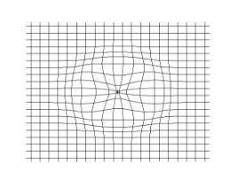

### 面波

在P波及S波相继到达测站后，下一种到达的波称为“面波”。面波不是体波。称为面波是因为他只沿着地球表面传递，能量只分布于表层而不深入内部[[4\]](https://zh.wikipedia.org/wiki/地震波#cite_note-:表面波碩士論文-4) ，所以在越深的地方表现越不明显[[19\]](https://zh.wikipedia.org/wiki/地震波#cite_note-:4-20) 。面波是一种“由地震波产生的波”，亦即，面波的产生是由P波和S波彼此干涉叠加而来：由于深度越浅，波速一般越低[[20\]](https://zh.wikipedia.org/wiki/地震波#cite_note-21)，基于[折射原理](https://zh.wikipedia.org/wiki/斯涅尔定律)，在近地表处发生的地震很容易就能把能量送进地表附近的低速层内，蓄积称为“陷波”的能量，当累积的发生相长干涉，便有机会使地层[共振](https://zh.wikipedia.org/wiki/共振)，产生面波[[2\]](https://zh.wikipedia.org/wiki/地震波#cite_note-:1-2)。面波在某些环境中会特别大，例如在具备[场址效应](https://zh.wikipedia.org/wiki/場址效應)的环境中，因为地震波在地表与地下的波速差较大，陷波容易产生，面波明显。然而也不是所有地震都能观测到明显的面波。一般来说，如果一场地震中面波有出现的话，他的速度会比S波更慢，但威力更大。事实上，大一点的地震中面波的震幅甚至可达数厘米[[19\]](https://zh.wikipedia.org/wiki/地震波#cite_note-:4-20)。

<u>[频散](https://zh.wikipedia.org/wiki/色散长波方程组)是面波的重要特征之一</u>。频散的意思是面波的波速会根据频率而有所不同[[8\]](https://zh.wikipedia.org/wiki/地震波#cite_note-:6-9)[[21\]](https://zh.wikipedia.org/wiki/地震波#cite_note-:0-22)。频散会导致在[震动图](https://zh.wikipedia.org/wiki/震动图)上，通常可以看到面波由低频至高频依序排列的现象。这是因为`越低频的面波波速越快`，越高频则越慢的缘故[[22\]](https://zh.wikipedia.org/wiki/地震波#cite_note-:5-23)。由于面波的共振频率和产生他的地层深度间有关系——`地层越低，频率越小`——所以分析面波的各频率的到来时间，就可以逆推出地底下的构造。举例来说，数十或数百秒震动周期的面波可以分析上部地幔构造，软流圈的低速带就可利用此方法进行研究[[2\]](https://zh.wikipedia.org/wiki/地震波#cite_note-:1-2)。

在固态中，<u>面波通常分成“`瑞利`波”及“`勒夫`波”两种</u>，“斯通利波”则较为少见。瑞利波由P波及S波干涉形成，勒夫波由S波本身的干涉形成。

#### 瑞利波 reylay `ps`

瑞利波的前进方式

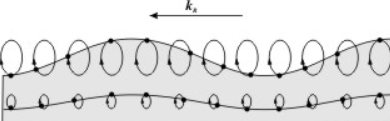

P波及S波干涉形成的面波称为“瑞利波”（英语：Rayleigh Wave），又称为“地滚波”。瑞利波频率低、震幅大，一般速度小于每秒三千米。在垂直面上，受瑞利波影响的粒子呈椭圆形振动，类似长的海浪起伏。垂直向地震仪收到的都是瑞利波。瑞利波的振幅会随深度增加而减少

#### 勒夫波 love `ss`

勒夫波的传递方式

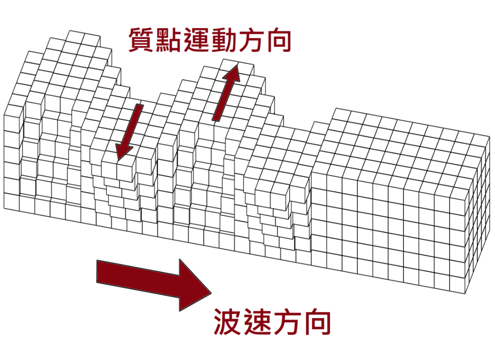

由S波相互干涉的面波为勒夫波（英语：Love Wave），又称为“L波”或“Q波”（来自[德语](https://zh.wikipedia.org/wiki/德语)Quer，意思是“侧向的”[[24\]](https://zh.wikipedia.org/wiki/地震波#cite_note-25)）。勒夫波的振动只发生在水平方向上，没有垂直分量，以“左右摇晃”的类型在地面上前进。勒夫波的特色是是侧向震动振幅会随深度增加而减少。由[浅源地震](https://zh.wikipedia.org/wiki/地震#按震源深度分)所引起的勒夫波最明显。勒夫波的波速比瑞利波快，约是S波的九成。

# [波的频散](https://zhuanlan.zhihu.com/p/29802868)

首先，从波函数说起，什么是`波函数`呢？

> 波动过程中，各个媒质质元都在各自的平衡位置附近振动，媒质质元的振动情况反映波动过程的规律，该规律为时间和空间位置的函数，描述这一函数关系的方程成为波函数。——《大学物理》，李甲科，西安：西安交通大学出版社

以最简单、最基本的平面简谐波为例，其波函数为 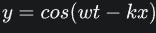

其中，w为角频率，rad/s；k 为波数，rad/m。

当 w = 1, k = 1时，空间波形曲线如下：

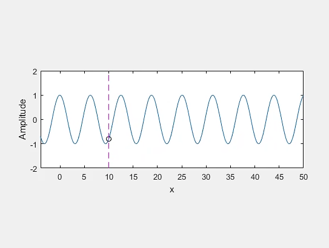

对于较为复杂的波，可通过傅里叶变换或傅里叶级数展开为多个平面简谐波的叠加，可以得到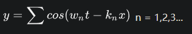

n = 1,2,3...

以两个简谐波叠加为例，波函数为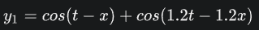

其空间波形曲线如下：

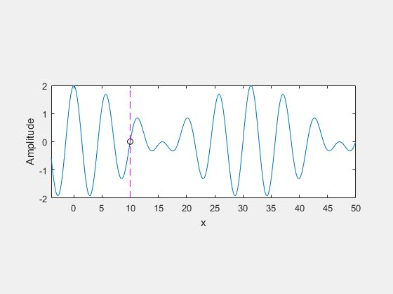

当波函数为 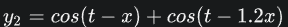 ，其空间波形曲线如下(`变化的`)：

对比y1和y2的空间曲线，可以看出，前者以固定的形状向前传递，而后者则不断变化，也就是说后者发生了**频散**。为了更好地解释频散，在这里引入两个概念，相速度和群速度，[怎么理解相速度和群速度？](https://www.zhihu.com/question/29444240) 相速度指波的某个成分的传播速度，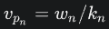；群速度为波的传播速度，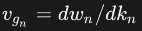。**于是频散可解释为，由于波的各组分的相速度不同，导致波形在空间发生变化，能量分布也随之改变的现象。**

波在传播过程中是否发生频散与波的类型及其所处的介质有关。宇宙空间内的电磁波不会发生频散，同时也不会衰减，因此可以传播很远的距离（天文级距离）；在空气中传播的声波也也可近似看做不发生频散。在某些工业领域，会出现波频散的现象。

以一个更为复杂的波函数来解释频散现象，该波函数为幅值和频率均不同的100个余弦函数的叠加，波函数形式如下：

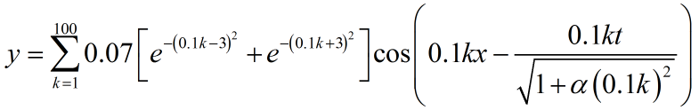

式中， a 为常数，这里取值0或0.1。

首先对相速度进行分析，a 不同取值下，波函数各成分的相速度如下：

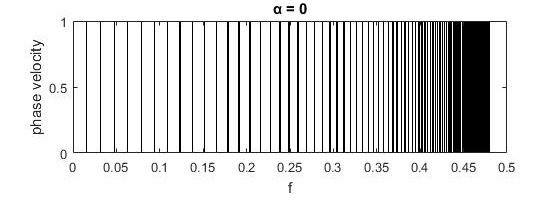

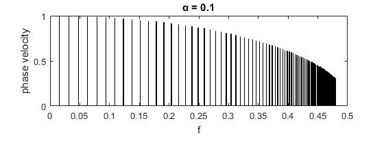

由上图可以看出，a = 0时，波的各成分相速度相同，不会发生频散；而 a = 0.1 时，波的各成分的相速度不同，将会发生频散，波形在空间都发生变化，如下图所示：

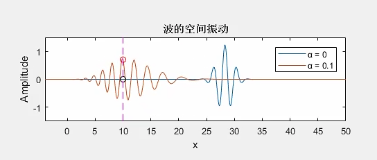

从上图可以看出，频散波的波形在空间明显发生了改变，空间上延伸更长，影响能量的分布，传播速度和传播距离也会发生改变。
