## 噪声干涉测量法的理论基础

从准随机环境地震场的记录中提取确定性信号是噪声干涉测量法的中心目标。它是从噪声源成像到地震层析成像和延时监测的众多应用的基础。在本章中，我们提供了噪声干涉测量的理论方法，并补充了对它们各自的优点和缺点的批判性讨论

本章的重点是在两个接收器之间近似格林函数的站间噪声相关性。我们详细解释了格林函数检索的最常见的数学模型，包括正态模求和、平面波分解和表示定理。虽然这个概念的简单性在很大程度上导致了其显著的成功，但每一种方法都依赖于不同但相关的假设，如波场等分配或噪声源的均匀分布。如果在地球上不能满足这些条件，可能会导致旅行时间、振幅或波形的偏差，从而限制该方法的准确性。

与这种成熟的方法相比，没有格林函数检索的干涉测量法在波场等分问题上不受限制条件。其基本概念是直接为给定噪声源的功率谱密度分布以及可能衰减、非均匀和各向异性的合适地球模型建立站间相关模型。这种方法导致了一个耦合问题，其中结构和来源都影响数据，就像地震断层扫描。相关函数的可观测变化通过固定频率灵敏度核与地球结构和噪声源的变化有关，可用于解决逆问题。虽然在数学和计算上更加复杂，但没有格林函数检索的干涉测量已经产生了有希望的初步结果，使未来的成功应用成为可能。

我们总结了噪声干涉测量的替代方法，包括反褶积、多维反褶积和尾波的迭代相关。

### Introduction

根据剑桥英语词典，噪音是不必要的、不愉快的或响亮的声音。这种不讨人喜欢的描述带有无用的历史内涵，很难反映出当今利用地球上无处不在的噪声领域的广泛应用。<u>地球上的地震噪声并不是随机的。它的传播受到波场上印记结构的物理定律的支配。这种结构可以利用干涉测量法“将噪声变成信号”（Curtis et al.，2006）。</u>

今天，大部分的环境噪声层析成像结果表面上是基于格林函数检索，即`假设两个站点之间的格林函数近似于噪声的时间平均互相关`的假设。通过将基于相关的格林函数近似作为传统的地震或主动源信号，已经建立的层析成像方法可以用来估计地下性质。格林的函数检索可以在实验室实验中观察到（例如，马尔科姆等人，2004；van Wijk，2006；Nooghabi等人，20 17），它可以在理论上使用正态模、平面波、表示定理或纯数值方法进行证明(例如，洛基斯和韦弗，2001；斯奈德。2004年；瓦帕纳尔和福克马，2006年；库普拉德，2008年；蔡，2009；库普拉德和卡普德维尔，20 I 0；Boschi等人，2013年)。

在过去的十年中，基于环境噪声站间相关性的干涉测量法已成为一种标准工具。在地震勘探中，干涉测量是主动源成像和监测的廉价替代方案（例如，Bussat和库格勒，2011年；莫德雷特等人，2013年，2014年；德里德等人，2014年；德里德和比昂迪，2015年；中田等人，2015年；德莱尼等人，2017年）。地震光照较差的地区的覆盖范围提高了区域地壳研究（例如，Sabra等，2005年；夏皮罗等，2005年；Stehly等人，2009年；夏皮罗，2018年），大陆和全球规模的断层扫描(例如，Lin等人，2008年；郑等，201 1年；Verbeke等，20 12年；赛金和肯尼特，20 12年；西田和蒙塔格纳，2009年；高等，20 13年；Haned等，201 6年），以及深层内部不连续点的成像（例如，Poli等人，20 1 2年；Boue等人，201 3年；Poli等人，20 1 5年）和内部核心（例如，Lin等人，201 3年；Huang等人，20 1 6年）。此外，环境噪音的无处不在，使人们能够长期研究沿着活动断层带、火山下和地热储层内(例如，布伦格尔等人，2008年a，b；奥伯曼等人，20 13年，20 1 4年，20 15年；希勒等人，20 15年；森斯-申费尔德和布伦格尔，20 1 8年；斯奈德等人，20 1 8年）。

一般来说，格林函数检索的理论依赖于环境波场是等分的假设，这意味着所有的传播模式都是等强的和统计上不相关的。等分可以直接通过非相关和均匀分布的噪声源的作用产生，也可以通过足够强的多重散射间接产生。

在地球上，由于各种原因，波场一般不能等分。散射可能太弱，衰减太强，无法产生显著的多重散射；噪声源分布非常不均，时间变量（见第1 -3章[McNamara等人，20 1 8；Gal和雷丁，20 1 8；Ardhuin等人，20 1 8])。虽然经验发现基模表面波的频率相关到达时间是相当鲁棒的，但波场的其他分量不满足格林函数检索的要求。记录充分的问题包括旅行时间和振幅误差、不正确的高模表面波、假到达的存在，以及体波的虚弱或完全缺失（例如，哈利迪和柯蒂斯，2008；蔡英文，2009；金曼和特兰伯特，20 1 0；弗朗特等，20 1 0；福加尼和斯尼德，20 1 0；菲希特纳，20 1 4；Kastle等人，201 6)。到目前为止，这已经阻止了有限频率和全波形反演技术的应用，即利用完全波形来提高分辨率(例如，尔等人，1 996；普拉特，1 999；弗里德里奇，2003；Yoshi

克服这些缺陷并建立一种没有格林函数检索的干涉测量方法的概念起源于日震学，尽管太阳的波场比地球的波场更均匀分布（伍德德，1 997；Gizon和B irch，2002；Hanasoge等人，20 1 1）。没有格林函数检索的干涉测量法对噪声源的分布或波场的特性没有任何假设。相反，可以计算任何噪声源分布和任何类型的介质的站间相关性。通过与观测到的相关性和计算进行比较，可以提取出有关噪声源和地球结构的信息（例如，Tromp等人，2010年；哈纳索格，20 13 年；哈诺索格和布拉尼奇，20 13 年；菲希特纳等人，20 17a；Sager等人，20 18年）。

在接下来的章节中，我们总结了最普遍的相关格林函数回归理论，它们分别基于正态模求和、平面波分解和表示定理。随后，我们概述了没有格林函数检索的干涉测量法的基本概念。最后，我们讨论了地震干涉测量的替代方法，以及未来可能的研究方向。

### Normal-Mode Summation

也许一个理论结果存在的，将在两点上记录的噪声与这些点之间的格林函数联系起来的最简单的背景是有限体中的声学正态模式。正是这种情况，我们将首先考虑，为此我们将给出一个相当完整的推导。对于这种情况，控制运动的方程是声波方程，

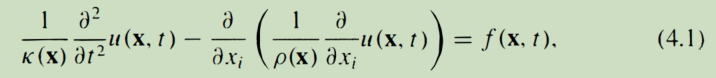

其中x是位置向量，K是体模量，p密度，f是激发压力波场u的外力。在本章中，我们采用了求和约定，这意味着重复指数的求和是隐含的。求解右侧消失的方程（4.1）的各种正态模态一般可以表示为

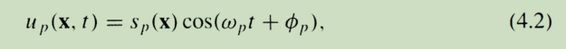

其中，sp (X)为空间模态的形状或特征函数，wp为模态的频率，¢P为模态的相位。对于下面提供的推导，不需要知道每个模式的精确形状。唯一使用的性质将是，模态在空间和时间上都是正交的。对于空间正交性，这意味着Ism (x)s11 (x)dx = 0；对于时间正交性，这意味着I cos（w111t +¢111）cos（w11t+cjJ11）dt=0，如果Wm f。W11需要注意的是，在现实媒体中，许多模式可以共享相同或接近相同的频率，从而导致更复杂的结果，下面将进行讨论（Tsai，201 0）。作为一个简单的例子，可能帮助直觉，可以考虑均匀一维字符串与固定终点x=0x=L，空间模式可以显式地写成罪（nrr x j L）与相应频率w11=nrrcjL，c是均匀波速度。空间正交性降低为m f. n的Jsin（mrrx/L）sin（nrrx/L）dx=0（例如，Haberman，2013）。

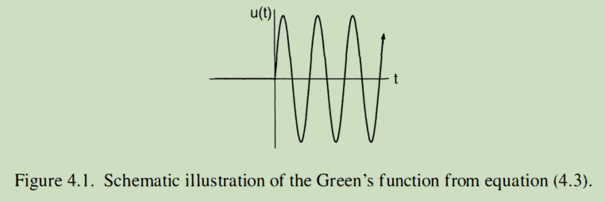

正态模态框架特别简单的部分原因是(1)格林函数特别容易描述，以及(2)噪声相关性由于正交性而简化。对于每个模式，空间正交关系可以用来证明格林函数是由（例如，Snieder，2004b）来描述的

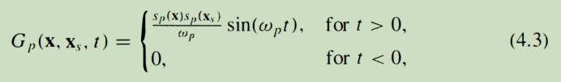

其示意图如图4所示。 1.换句话说，每个模态从t = 0开始呈正弦振荡，完整的格林函数是这些分量的和，G=L�=OGP（例如，吉尔伯特，1 970；哈伯曼，2013）。

定义两个任意函数f和g的归一化互相关为

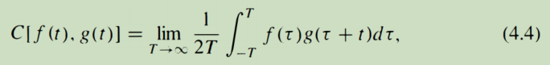

然后，对于任意的一般波场u（x，t）= Lp Apup（X，t），时间正交性质立即导致许多交叉项在互相关中消失。具体来说，如果所有的wp都不同（见下面更一般的情况），那么直接计算显示，在XA和x8位置的记录的互相关降低为

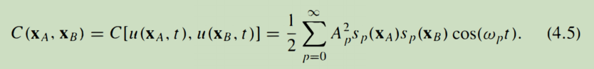

比较方程（4.3）和（4.5），可以清楚地看出格林函数和互相关之间存在潜在的关系。最常被引用的版本是，如果Ap = ajwp，有一个任意的常数，那么

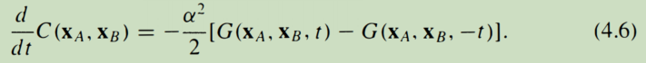

这个说法说，如果能量恰好在所有模态之间等分，因此振幅与频率成反比，那么两个站之间互相关的时间导数等于这两点之间的格林函数和时间反转格林函数的和，直到一个归一化因子。或者，如果模态振幅都相等，使得A P = a，那么

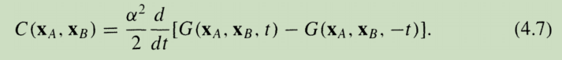

换句话说，如果模态振幅都相等，那么两个站点之间的互相关系等于一个格林函数及其时间反转版本的和的时间导数，同样达到一个归一化因子。

这两种关系（4.6）和（4.7）看起来不同，但实际上表达了相同的身份。由于时间导数导致goo的相位推进，很明显，这两个恒等式都表达了这样一个事实，即对于格林函数的每个模态分量，交叉函数的每个模态分量都期望是goo的相位推进。通过将方程（4.3）的正弦项与方程（4.5）的余弦项进行比较，也可以清楚地看出这一点。

必须注意两个相关的点。首先，到目前为止，恒等式属于确定性过程，不需要任何“噪声”属性。其次，然而，如上所述，恒等式要求所有的模态都有不同的频率。这显然不是一般预期的。例如，在地球上，来自两个不同方位角的两波波很容易具有相似的频率内容。如果具有相同频率的模态的交叉项虽然不满足时间正交性，但仍然以某种方式抵消，那么就可以解决这个问题。对于“噪声”源，如果噪声源在长时间范围内不相关，就可能发生这种情况。例如，举上面的例子，由两个不同的波源产生，可能是两个不同的海洋风暴，在两个不同的方位角。如果两个来源随机改变他们的相对阶段随着时间的推移，而不是保持相关时间确定性信号，如果至少有少量的阻尼系统等波激发在一个实例永远不贡献，然后最终这两者之间的互相关, 这种不同不相关噪声源的消除已经被许多作者讨论过（例如，Lobkis和Weaver，2001；蔡英文，2010），他们中的大多数人将每个独立的时间段视为一个集成的独立“实现”，这些作者已经表明，噪声的消除与时间的平方根成正比。虽然上述论点是启发式的，但数学上严格的推导有可能证明空间上不相关的源可以导致不相关的模式(例如，Lobkis和Weaver，200 I )，但这超出了这项工作的范围。最终的结果是一个类似于方程（4.6）的恒等式

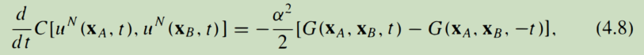

如果一个P = a I w P和uN是一个“噪声”场，每个模仍然在时间上保持正弦振动，但在足够长的时间内与所有其他模在时间上不相关，与前一段讨论的性质。这可能是最常被引用的格林函数-噪声相关恒等式。

到目前为止，我们只考虑了最简单的声波情况。然而，上面所有的论点也适用于弹性波动方程的模态，只做很小的修改。例如，对于垂直分量瑞利模，仍然可以用同样的方式写模和，方程（4.8）仍然以同样的方式成立。

正态模态推导的主要问题是，这些假设是非常有限的。例如，地球上的模式肯定从未接近等分，至少有两个原因。首先，地球上的大多数噪声源预计都在地球表面或靠近地球表面（例如，海浪、风、工业活动、交通），这些表面源激发基模波的强度比激发高阶模式强得多。因此，这些不同类型的模态将有非常不同的能量（并且将有非常不同的模态振幅），这意味着恒等式保持的条件不被满足。此外，即使在基模波的子集中，大的噪声源，如海洋风暴，在空间上集中在地球的某些区域，这一事实意味着，来自某些方向的波将会强得多，因此不会接近等分。由于产生公式（4.8）的假设在地球上是无效的，因此预计结果一般不会是准确的。此外，在~~正态~~normal模式框架内，尚不清楚如何评估地球上地震噪声的真实分布可能如何接近实现（4.8）噪声相关性。

### Plane Waves

鉴于正模推导的假设在地球上不成立，值得考虑方程（4.8）的恒等式仍然成立或至少近似成立的其他原因。我们的前进路径是考虑平面表面波入射到两个站，XA和x8的情况，就像以前一样。人们可能会注意到，对于波长只是弱非均匀地球半径的一小部分的波，平面波和正态模之间是等价的。平面波只是所产生的传播模式通过一个对应于正态模框架的驻波的远场源。对于均匀的半空间，需要注意的是，均分假设意味着来自所有方位角的能量振幅相等（例如，Weaver和Lobkis，2004）。由于这种等价性，很自然地假设一个类似的格林函数互相关恒等式，特别存在于这种情况下，“噪声”能量是等等的。虽然只使用远场源意味着近场源被排除在这个描述，人们可能会说，只要身体（像地球）足够大，衰减相对较小，远场贡献可能会主导能量从近场源，从而导致预期身份可能存在即使只使用远场源。

为了推导这个恒等式，我们可以再次简单地写下均匀、声学、非衰减介质中表面波的格林函数，并将其与远场平面波源的相关性进行比较。均匀二维介质中波的格林函数可以在频域上表示为

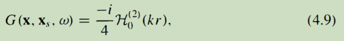

其中H62 l是第二阶汉克尔函数，k w I c是波数，Xs是源位置，rl=-Xs1。（请参见，例如，莫尔斯和Feshbach（1 953）或Snieder（2004b）的方程(4。9)，尽管它们使用的傅里叶约定与这里假设的略有不同。)同样，我们只写了二维声学情况的结果，但预期具有相同形式的弹性情况，例如，在横向均匀的三维介质中的瑞利波。这个表达式的远域、时域版本(例如，也许更容易被识别出来：

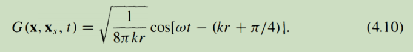

另一方面，远场平面波的一般和可以表示为

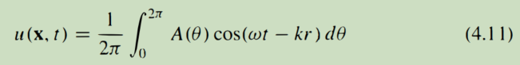

其中，每个方位角处的源的平面波密度由A (8)给出，r为从远场源到x的距离。就像在正态模的情况下，如果我们再次假设来自不同方位角的平面波源都是不相关的，那么最终互相关中的所有交叉项都会抵消并求和为零，只留下

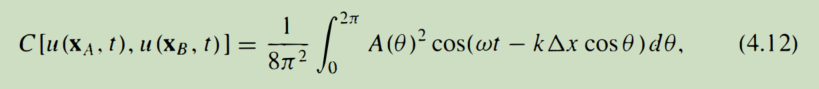

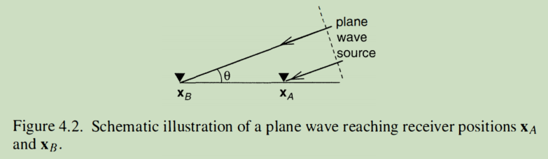

其中，D.x是xA和x8之间的距离，e是源相对于XA和x8之间的线的方位角（见图4.2）。注意，与正态情况不同的是，每个平面波都有一个相移，这解释了波到达x8和XA之间的时间延迟。

在这一点上，认识到如果A (e) = a是常数的，积分可以精确计算是有用的，并且即使A (e)不是方位角不是常数，也可以用平稳相位近似来近似。定性地说，平稳相位近似可以理解为，对振荡积分的主要贡献，如方程（4.12），发生在振荡阶段是平稳的点，而所有其他贡献近似抵消，由于附近点的正、负贡献(例如，B ath，1968年；本德和Orszag，1999)。最终的结果是，最终的积分可以通过替换在静止点上的非振荡部分的常数值，并只在这些静止点上进行积分来近似。在方程（4.12）的情况下，在=0°和=180°‘处有两个定相点，因此定相参数可以用来将原始积分近似为

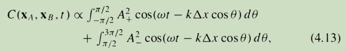

其中A+=A（0°）、A_A（l80°）和两个主要贡献来自与两个站一致的方位角上的两个固定相点。方程（4.13）可以通过直接积分（无需进一步的积分的平稳相位近似）来计算为

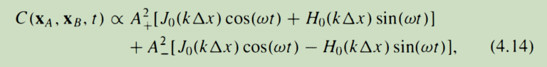

其中，10和h0分别为零阶的贝塞尔函数和Struve函数（Watson，2008）。虽然Struve函数不是一个常见的特殊函数，但它们与贝塞尔函数密切相关，可以认为是与贝塞尔函数配对，就像正弦和余弦对一样。因为平稳相位近似是一种高频近似，只要w足够高或A (B)足够接近于平稳相位点上的常数和非零。这将是一个精确的近似值。

考虑方程的两项(4。1 4)分别，为了方便而取远场近似，然后

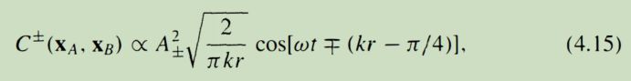

其中，c±分别表示正（e=0°）和负（e = 1 80°）对积分的贡献。在正态模式的情况下，比较e定量(4。用等式(4)。1 5)表明这些表达式之间有很强的相似性，通过取一项的时间导数，即d，可以得到一个恒等式

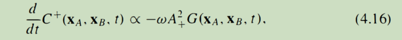

第二项也有类似的身份。因此我们可以看到，对表面波的互相关和格林函数的直接评估产生了与正态模态情况相似的特性，正如预期的那样。还可以注意的是，该身份也可以写成c++：A�dGjdt，类似于方程（4.7）。

与正态模式框架不同，这种显式的二维平面波框架在评估非均匀噪声源分布导致偏离预期结果的程度时也很有用。具体来说，可以将表面波噪声源的A (B)输入方程(4。12)，并简单地计算由此产生的旅行时间和来自噪声相关性的波形如何偏离预期的格林函数的旅行时间和波形。e量子化（4.12）中的积分可以在不使用定相近似的情况下进行数值计算。并且不需要关于平滑度的假设，只要来自不同方位角的来源不相关。这种性质的测试以前已经做过了(例如，Tsai，2009,2011；Weaver et al.，20 II)，并提出，虽然旅行时间通常只受到二阶的影响，但由于静止的相位区域仍然占主导地位，振幅和波形很容易被影响到一阶。
