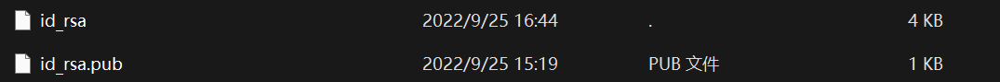

好久没更新博客, 突然发现github部署失败了

重新配置了下ssh密钥还是不对 clone的时候总是提醒输入git@github.co的密码, 问题是 根本没有这个密码

### 问题

1. github完全失联, 重新配置ssh也显示 ssh根本就没有被使用
2. gitee没有任何问题, 正常配置
3. git clone github的仓库是提醒输入密码 然后提示 permission denied
4. git clone github的仓库使用https的url是 443超时

### 尝试的解决方法

1. 彻底卸载git 重新配置 任然老问题

   ```c++
   git config –global user.name ‘xxxxx’ 
   git config –global user.email ‘xxx@xx.xxx’
   ```

2. 重新生成ssh 并配置到github 仍然没解决

   ```c++
   ssh-keygen -t rsa -C ‘my email’
   ```

3. 逐渐怀疑是端口问题 混乱的执行了如下代码

   ```c++
   git config --global http.proxy ""
   git config --global --unset http.proxy
   git config --global --unset https.proxy  
   ```

4. 针对网络问题 修改host 并刷线dns缓存  ipconfig /flushdns

5. 端口问题还没有解决 报错`ssh_dispatch_run_fatal: Connection to 223.75.236.241 port 22: Connection aborted` 发现.ssh目录下缺少config文件 添加如下的config文件

   ```c++
   Host github.com
   User git
   Hostname ssh.github.com
   PreferredAuthentications publickey
   IdentityFile ~/.ssh/id_rsa
   Port 443
   
   Host gitlab.com
   Hostname altssh.gitlab.com
   User git
   Port 443
   PreferredAuthentications publickey
   IdentityFile ~/.ssh/id_rsa
   ```

### 知识点

ssh使用非对称加密, 新建ssh后 会在.ssh目录下生成如下文件




其中

1. id_rsa为本次存储的私钥
2. id_rsa.pub为远端存储的公钥 需要填写到远端进行权限验证

> 吐槽一下, gitee真的离谱 几乎全是代码的文章 gitee page我提醒内容违法 ****
