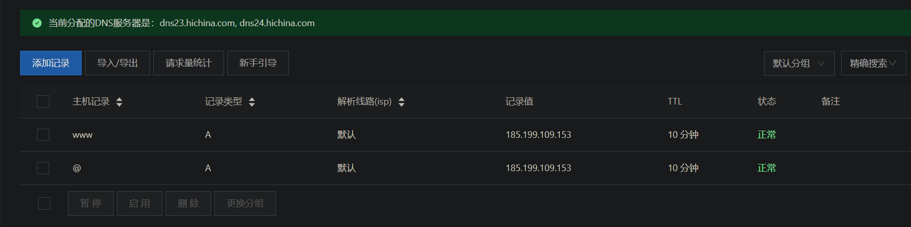
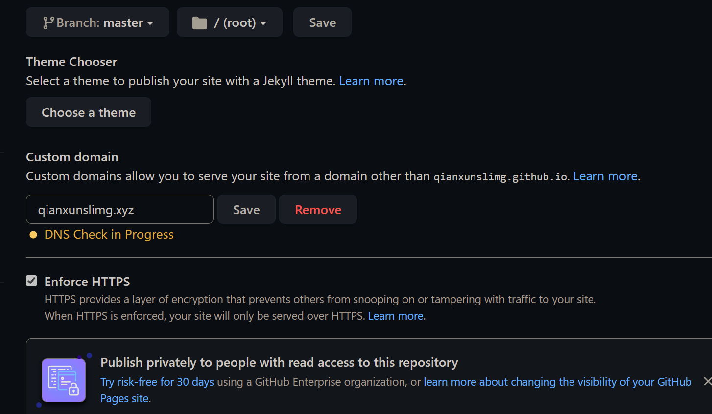

## 起因

写了篇以往研究的文章准备挂在简历上，结果发现，我心心念念调整好的butterfly居然不挂梯子根本加载不全，原来搞了半天的个人博客成了自嗨

## 探索过程

#### githubpage的问题？

首先我怀疑的是github访问网速过慢（自己梯子常开，没有内网打开过博客），遂把博客也部署到了giteepage，发现还是老问题，根本加载不出来

#### giteepage也有问题？

gitee总是给人不靠谱的感觉，上次的图床事故，这次的开源审核，加上之前看别人的博客也是提供两个版本，结果gitee的比github还卡

首先我想到的解决方法是我购买的阿里云oss存储服务可以挂载静态页面，但是部署上去之后发现必须绑定域名 不然会直接下载html，绑定域名的话就需要备案，备案就必须要服务器

#### 备案好麻烦

调查不够充分，在阿里云上买了域名，发现阿里云的服务器好贵，然后买了腾讯云的服务器，后续就是备案了，本来就很麻烦，因为这个不同平台的骚操作变得超级麻烦，遂暂时搁置

#### 查阅资料 定位问题

在网上稍微查了查才发现原来自己上述 都是弯路~，国内网络的加载问题是一些模块加载错误，F12查看，加载失败主要是以下几部分

1. google字体
2. 插件的css，js加载不出来

google字体可以通过360镜像解决，后面这个css和js真的是，毕竟我不是前端的，超出我的能力范围了，能直观的感受到内部调用了远端js，css文件被墙了，本地的话，我可以存储到阿里云oss，然后找到对应的路径进行修改，理不清，找不到，放弃了

## 解决问题

### 更换主题

剔除部分插件，关闭hexo-butterfly的部分功能还是没有解决问题，我投降还不行嘛

更换主题为极简的hexo-next，直接按默认配置的话，国内访问没有任何问题，但是当我手残打开一些。。小模块，真的是很小的模块，结果被`hexo及其主题`混乱的版本控制狠狠的恶心了一把，true/false 开关控制的功能竟然部署能直接报错的。。我.....算了，保存了极少极少的模块

### 域名绑定

解决完基本的功能后，想着尽量把域名用上吧，DNS服务器设置好，通过阿里云域名管理链接到github的ip，如下图

在github中，准确点是在hexo本地的souce目录下创建CNAME文件，填写个人域名`qianxunslimg.xyz`，这样就不会被覆盖掉，保证CNAME一直在仓库中了，然后setting中链接成功

## TODO

听说wordpress搭建博客很好，腾讯云可以直接支持，唉，太费劲了，找工作要紧，暂时先这样吧，暂时放弃花里胡哨的样式图个稳定
