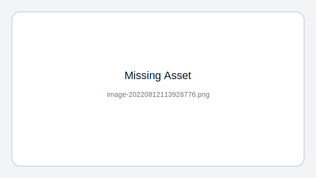

### 起因

帮看作业 每次都要点击到input输入数字再提交 枯燥且浪费事件

测试尝试学着写了下油猴脚本 解决表单重复填写的问题

### 主要功能

#### 给定分数区间 填写同名input (只有名字属性)



### 难点

input同名 且id不全 不能通过常规方法完全区分

### 代码

```js
// ==UserScript==
// @name         快速批卷
// @namespace    http://tampermonkey.net/
// @version      0.1
// @description  try to take over the world!
// @author       qianxunslimg
// @match        http://laoshi.homework.100eks.com/*
// @icon         https://www.google.com/s2/favicons?sz=64&domain=100eks.com
// @grant        none
// ==/UserScript==

(function() {
    'use strict';
    var input = {
        student_score: "10",
    };
    var flag = 1;
    Object.keys(input).forEach(function(key){
        var putval;
        var i = 0;
        $("input[name='"+key+"']").each(function () {
            i++;
            if($(this).val() != ""){
                flag = 0;
                alert("这份试卷已经看过了");
            }
            if(i == 1){ //第i个编辑框
                putval = 8 +num(0,3)
            }else if(i == 2)
                putval = 7 + num(0,2);
            else if(i == 3)
                putval = 15 + num(0,5);
            else if(i == 4)
                putval = 8 + num(0,3);
            else if(i == 5)
                putval = 5 + num(0,2);
            $(this).val(putval);
        });
    });
    if(flag)
        submitData(); //自动提交

    //生成从minNum到maxNum的随机数
    function num(minNum,maxNum){
        switch(arguments.length){
            case 1:
                return parseInt(Math.random()*minNum+1,10);
                break;
            case 2:
                return parseInt(Math.random()*(maxNum-minNum+1)+minNum,10);
                break;
            default:
                return 0;
                break;
        }
    }

})();
```
