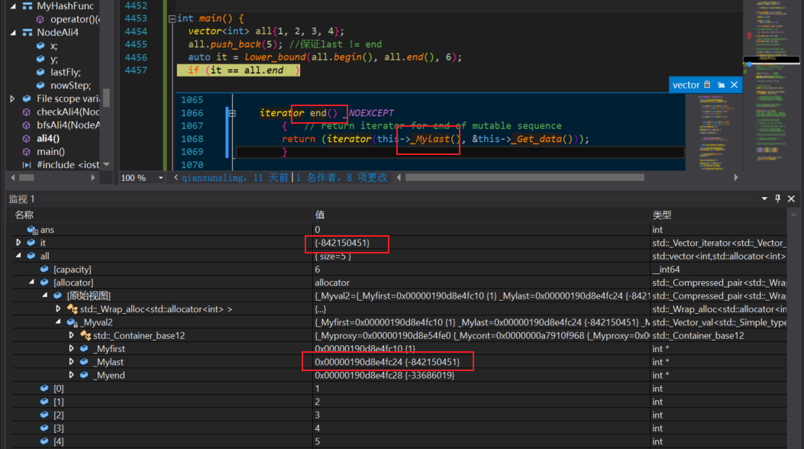
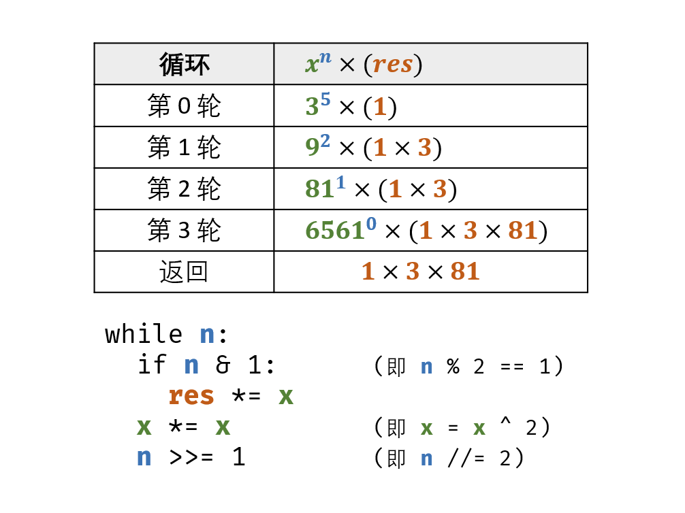

# 常用库函数

## 1. 字符(串)相关

1. 判断字符是否为数字、字母

   isalpha isdigit isalnum

   ```c++
   isalpha(char c)//判断是否为字母
   isdigit(char c)//判断是否为数字
   isalnum(char c)//判断是否为数字或字母
   ```

2. 字母的大小写转换

   ```c++
   tolower(char c)//变成小写字母
   toupper(char c)//变成大写字母
   ```

3. 字符串转整型 stoi:

   stoi(s,start,base)//s是要转换的字符串，start是起始位置，base是要转换的整数进制，默认是从0位置开始，转换为10进制

   ```c++
   int main() {
   	string str = "123";
   	int res = stoi(str);
   	cout << res << endl;
   	system("pause");
   	return 0;
   	}
   ```

4. 数值转字符串 to_string

   to_string(val)//val可以是任何数值类型

   ```c++
   int main() {
   	int num = 123;
   	string res = to_string(num);
   	cout << res << endl;
   	system("pause");
   	return 0;
   }
   ```

   

5. 分割字符串 分割字符串可以使用getline和istringstream联合实现。

   ```c++
   //根据','号分割字符串，getline默认的是按照行读取，但是指定就按照给定的标志分割。
   int main() {
   	string str = "1,2,3,4,5";
   	istringstream s_in(str);
   	string c;
   	while (getline(s_in, c, ',')) {
   		cout << c << endl;
   	}
   	system("pause");
   	return 0;
   }
   ```

## 2. 有序查找

1. lower_bound()  大于等于
   用于在指定区域内(左闭右开)查找**不小于目标值的第一个元素**，也就是说最终查找的不一定是和目标值想等的元素，也可能是比目标值大的元素。其底层实现是二分查找。

   ```c++
   int main() {
   	vector<int>nums{ 1,2,3,5,5 };
   	auto it1 = lower_bound(nums.begin(), nums.end(), 3);
   	cout << *it1<< endl;  //3
   	auto it2 = lower_bound(nums.begin(), nums.end(), 4);
   	cout << *it2 << endl; //5
   	system("pause");
   	return 0;
   }
   ```

   注意：lower_bound查找超范围的判断

   ```c++
     vector<int> v{0, 1, 2, 3, 4};
     auto it = lower_bound(v.begin(), v.end(), 6);
     int pos = it - v.begin(); // pos = 5 返回的就是查找区间的大小
     if (pos == v.size())
       cout << "超范围了。。。查找的元素比所有元素都大" << endl;
   	if(it == v.end())
       cout << "超范围了。。。查找的元素比所有元素都大" << endl;
   ```
   
   起始也没有这么麻烦 没找到的话返回的迭代器就是end()
   
   
   
2. upper_bound() 大于
   在指定目标区域中查找**大于目标值的第一个元素**，返回该元素所在位置的迭代器。

   ```c++
   int main() {
   	vector<int>nums{ 1,2,3,5,5 };
   	auto it1 = upper_bound(nums.begin(), nums.end(), 3);
   	cout << it1-nums.begin()<< endl;  //3
   	auto it2 = upper_bound(nums.begin(), nums.end(), 4);
   	cout << it2-nums.begin() << endl;  //3
   	system("pause");
   	return 0;
   }
   ```


这两个函数如果找不到 例如 查找6 `it-nums.begin() == nums.size();`


# 常用的手写函数

## 数字相关

### 1. 质数判断

其实还是很暴力的 重点在于判断到 sqrt(num)

```c++
bool isPrime(const int& num){
  if(num<=1) return 0;
  for(int i = 2; i*i<=num; i++){
    if(num%i == 0)
      return 0;
  }
  return 1;
}
```

### 2. 快速幂

时间复杂度 Ologn



```c++
double myPow(double x, int n) {
  bool sign = n < 0;
  double res = 1.0;
  while (n) {
    if (n % 2)
      res *= x;
    x *= x;
    n /= 2;
  }
  //cout << n;
  return sign ? 1 / res : res;
}
```
