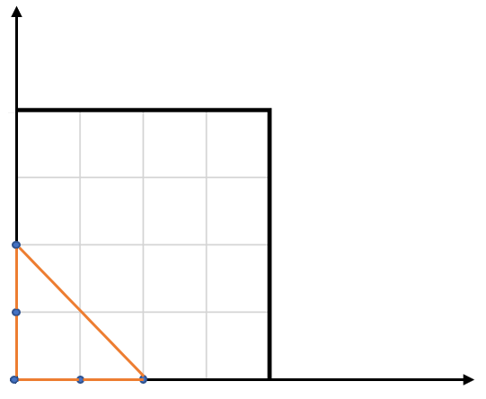
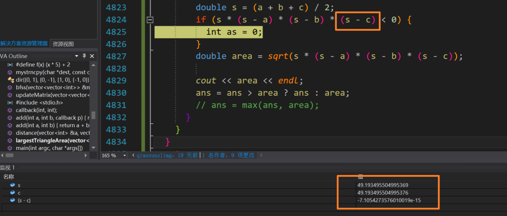

-nan

### 起因

在做题时发现了一个问题，三目运算符和max得出的结果不一致，max结果正确而三目运算符结果有问题

#### [812. 最大三角形面积](https://leetcode.cn/problems/largest-triangle-area/)

难度简单145

给定包含多个点的集合，从其中取三个点组成三角形，返回能组成的最大三角形的面积。

```
示例:
输入: points = [[0,0],[0,1],[1,0],[0,2],[2,0]]
输出: 2
解释: 
这五个点如下图所示。组成的橙色三角形是最大的，面积为2。
```



简单题简单做，枚举所有三点组合，应用海伦公式计算面积，代码如下`

```c++
class Solution {
public:
    double largestTriangleArea(vector<vector<int>>& points) {
      int n = points.size();
      double ans = 0;
      for(int i = 0; i<n; i++){
        for(int j = i+1; j<n; j++){
          for(int jj = j+1; jj<n; jj++){
            double a = distance(points[i], points[j]);
            double b = distance(points[i], points[jj]);
            double c = distance(points[j], points[jj]);
            //cout << a << " "<< b <<" " << c<<endl;
            double s = (a + b + c) / 2;
            double area = sqrt(s*(s-a)*(s-b)*(s-c));
            //cout << area<<endl;
            //ans = ans > area ? ans : area;  //错误
            ans = max(ans, area); //正确
          }
        }
      }
      return ans;
    }

    double distance(vector<int>& a, vector<int>& b){
      return sqrt((a[0] - b[0])*(a[0] - b[0]) + (a[1] - b[1])*(a[1] - b[1]));
    }
};
```

结果显示三目运算符更新ans出错，而max更新则正确，vs调试了一下



由于double精度的问题导致相减出现了负值，在sqrt计算后产生了 -nan(ind) 

导致后续的三目运算符比较出错！

### 归纳下-nan的产生原因

#### **nan: not a number 非数字**

##### **1. 出现原因：**

（1）分母为“0”，如果分母为零，自然时不能得到一个确定的数字的。
（2）对负数开平方、对负数求对数（log(-1.0)）。注：0/0会产生操作异常；0.0/0.0不会产生操作异常，而是会得到nan。
（3）有些[编译器](https://so.csdn.net/so/search?q=编译器&spm=1001.2101.3001.7020)在对无穷大与无穷小的计算时也会出现此类情况。

##### **2. 辨别办法：**

isnan(): ture is nan, false otherwise
