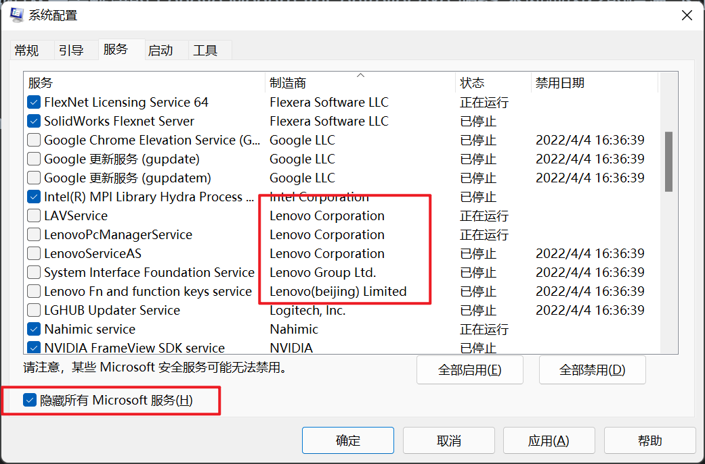
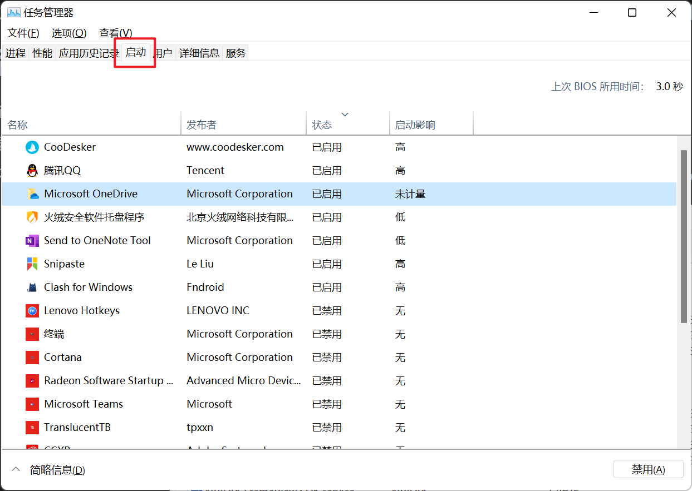

16g的内存，开机动不动就飙过50%

尤其是之前发现但从未去解决的 Lenovo.Modern.ImController.exe 服务 不断跑内存的情况 下定决心处理一下

### 流程

1. win + r  msconfig

   服务->隐藏所有Microsoft服务  然后剩余的服务 感觉用不到的该关关 

   不建议全部禁用 影响一些自己设置的开机启动项，个人就是lenovo全部禁用 解决了Lenovo.Modern.ImController.exe的问题

   其他的 也多多少少禁用下 很多没用的服务

2. 任务管理器的 启动项 该关关

   
