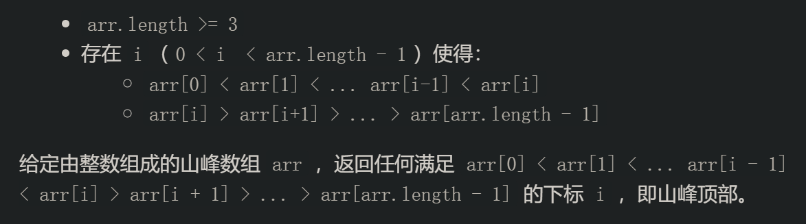
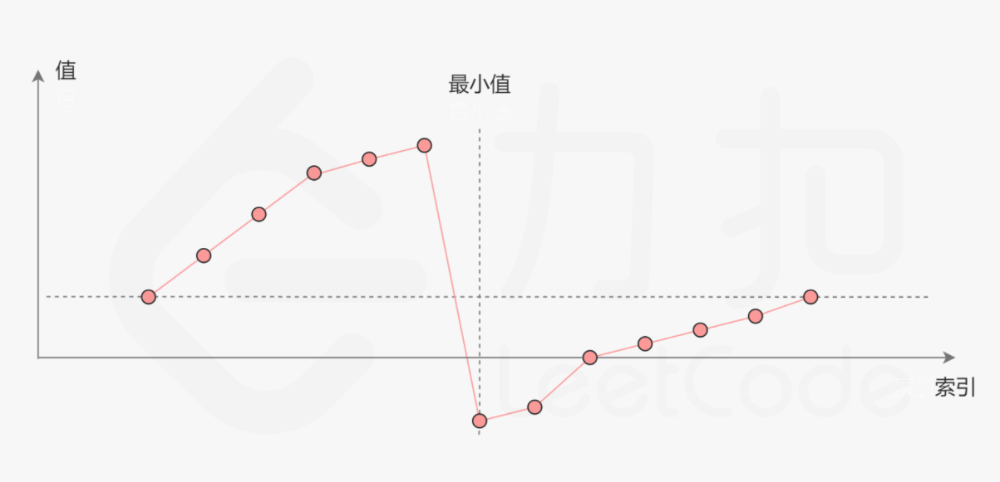
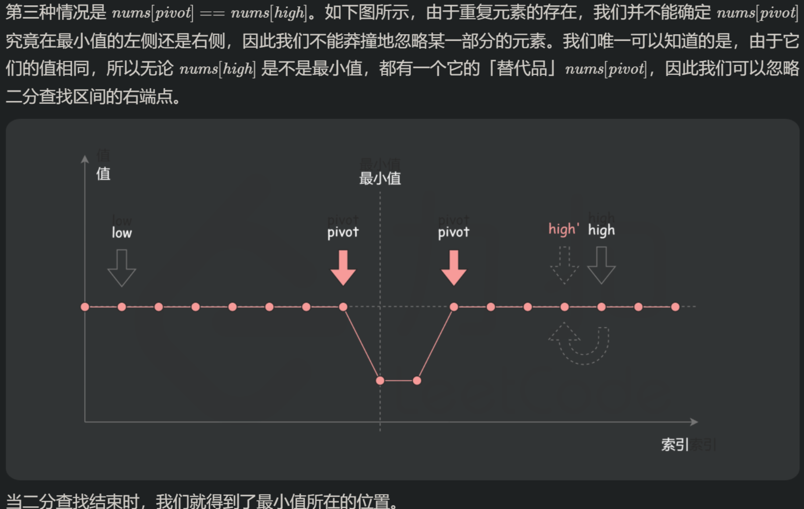
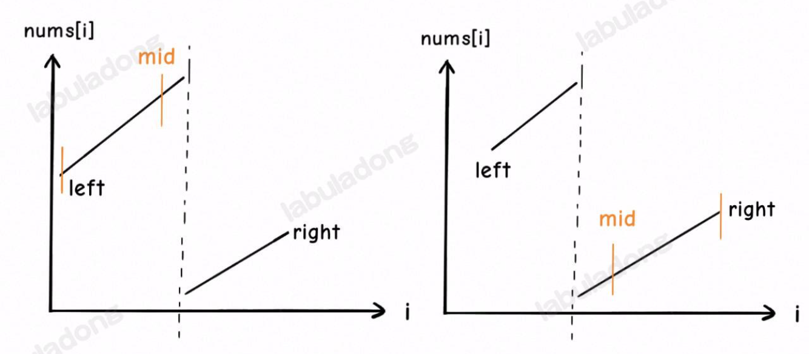

# [二分查找算法](https://www.cnblogs.com/kyoner/p/11080078.html)

## **一、二分查找的框架**

```c++
int binarySearch(int[] nums, int target) {
   int left = 0, right = ...;

while(...) {
     int mid = (right + left) / 2;
     if (nums[mid] == target) {
       ...
     } else if (nums[mid] < target) {
       left = ...
     } else if (nums[mid] > target) {
       right = ...
     }
   }
   return ...;
 }
```

**分析二分查找的一个技巧是：不要出现 else，而是把所有情况用 else if 写清楚，这样可以清楚地展现所有细节**。本文都会使用 else if，旨在讲清楚，读者理解后可自行简化。

其中...标记的部分，就是可能出现细节问题的地方，当你见到一个二分查找的代码时，首先注意这几个地方。后文用实例分析这些地方能有什么样的变化。

另外声明一下，计算 mid 时需要技巧防止溢出，建议写成: **`mid = left + (right - left) / 2`**，本文暂时忽略这个问题。

## **二、寻找一个数（基本的二分搜索）**

这个场景是最简单的，可能也是大家最熟悉的，即搜索一个数，如果存在，返回其索引，否则返回 -1。

`左闭右闭的模板`

```c++
int binarySearch(int[] nums, int size, int target) {
   int left = 0; 
   int right = size - 1; // 注意

while(left <= right) { // 注意
     int mid = (right + left) / 2;
     if(nums[mid] == target)
       return mid; 
     else if (nums[mid] < target)
       left = mid + 1; // 注意
     else if (nums[mid] > target)
       right = mid - 1; // 注意
     }
   return -1;
 }
```

1. 为什么 while 循环的条件中是 <=，而不是 < ？

   - 答：因为初始化 right 的赋值是 nums.length - 1，即最后一个元素的索引，而不是 nums.length。
   - 这二者可能出现在不同功能的二分查找中，区别是：前者相当于两端都闭区间 `[left, right]`，后者相当于左闭右开区间 `[left, right)`，因为索引大小为 nums.length 是越界的。
   - 我们这个算法中使用的是 [left, right] 两端都闭的区间。**这个区间就是`每次进行搜索`的区间，我们不妨称为「搜索区间」(search space)**。
   - 什么时候应该停止搜索呢？当然，找到了目标值的时候可以终止

   ```c++
   if(nums[mid] == target)
     return mid; 
   ```

   - 但如果没找到，就需要 while 循环终止，然后返回 -1。那 while 循环什么时候应该终止？**搜索区间为空的时候应该终止**，意味着你没得找了，就等于没找到嘛。
   - `while(left <= right)的终止条件是 left == right + 1`，写成区间的形式就是 `[right + 1, right]`，或者带个具体的数字进去 [3, 2]，可见**这时候搜索区间为空**，因为没有数字既大于等于 3 又小于等于 2 的吧。所以这时候 while 循环终止是正确的，直接返回 -1 即可。
   - while(left < right)的终止条件是 left == right，写成区间的形式就是 [right, right]，或者带个具体的数字进去 [2, 2]，**这时候搜索区间非空**，还有一个数 2，但此时 while 循环终止了。也就是说这区间 [2, 2] 被漏掉了，索引 2 没有被搜索，如果这时候直接返回 -1 就可能出现错误。
   - 当然，如果你非要用 while(left < right) 也可以，我们已经知道了出错的原因，就打个补丁好了：

   ```c++
   //...
    while(left < right) {
      // ...
    }
    return nums[left] == target ? left : -1; //注意 如果是插入位置 需要先判段left是否越界
   ```

2. 为什么 left = mid + 1，right = mid - 1？我看有的代码是 right = mid 或者 left = mid，没有这些加加减减，到底怎么回事，怎么判断？

   - 答：这也是二分查找的一个难点，不过只要你能理解前面的内容，就能够很容易判断。
   - 刚才明确了「搜索区间」这个概念，而且本算法的搜索区间是两端都闭的，即 [left, right]。那么当我们发现索引 mid 不是要找的 target 时，如何`确定下一步的搜索区间`呢？
   - 当然是去搜索 [left, mid - 1] 或者 [mid + 1, right] 对不对？因为 mid 已经搜索过，应该从搜索区间中去除。

3. 此算法有什么缺陷？
   - 答：至此，你应该已经掌握了该算法的所有细节，以及这样处理的原因。但是，这个算法存在局限性。
   - 比如说给你有序数组 nums = [1,2,2,2,3]，target = 2，此算法返回的索引是 2，没错。但是如果我想得到 target 的左侧边界，即索引 1，或者我想得到 target 的右侧边界，即索引 3，这样的话此算法是无法处理的。
   - 这样的需求很常见。你也许会说，找到一个 target 索引，然后向左或向右线性搜索不行吗？可以，但是不好，因为这样难以保证二分查找对数级的时间复杂度了。
   - 我们后续的算法就来讨论这两种二分查找的算法。（==左闭右开==的 ==插入位置==的 ==刚好大于==的 二分方法）

## 三、寻找左侧边界的二分搜索 

 ==//搜索>=target的第一个位置==

直接看代码，其中的标记是需要注意的细节： //正常二分法左闭右开的模板

```c++
int left_bound(int[] nums, int target) {
   if (nums.length == 0) return -1;
   int left = 0;
   int right = nums.length; // 注意

while (left < right) { // 注意
     int mid = (left + right) / 2;
     if (nums[mid] == target) {
       right = mid;
     } else if (nums[mid] < target) {
       left = mid + 1;
     } else if (nums[mid] > target) {
       right = mid; // 注意
     }
   }
   return left;
 }
```

1. 为什么 while(left < right) 而不是 <= ?    //==注意 仅仅是因为right的初始化 两种模板没有差别 都可以使用==
   - 答：用相同的方法分析，因为初始化 right = nums.length 而不是 nums.length - 1 。因此每次循环的「搜索区间」是 [left, right) 左闭右开。
   - while(left < right) 终止的条件是 `left == right`，此时搜索区间 `[left, left) 恰巧为空`，所以可以正确终止。

2. 为什么没有返回 -1 的操作？如果 nums 中不存在 target 这个值，怎么办？

   - 答：因为要一步一步来，先理解一下这个「左侧边界」有什么特殊含义：

     > ​     target = 2
     >
     > pos:            left                        mid      mid+1     right
     >
     > nums:          1             2             2            4
     >
     > index:          0             1             2            3             4

   - 对于这个数组，算法会返回 1。这个 1 的含义可以这样解读：nums 中`小于` 2 的`元素有 1 个`。
   - 比如对于有序数组 nums = [2,3,5,7], target = 1，算法会返回 0，含义是：nums 中小于 1 的元素有 0 个。如果 target = 8，算法会返回 4，含义是：nums 中小于 8 的元素有 4 个。
   - 综上可以看出，函数的返回值（即 left 变量的值）取值区间是闭区间 [0, nums.length]，所以我们简单添加两行代码就能在正确的时候 return -1：

   ```c++
   while (left < right) {
      //...
    }
    // target 比所有数都大
    if (left == nums.length) return -1; //[1,2,2,4]搜索8返回left 4，越界
    // 类似之前算法的处理方式
    return nums[left] == target ? left : -1;
   ```

3. 为什么 left = mid + 1，right = mid ？和之前的算法不一样？
   
- 答：这个很好解释，因为我们的「搜索区间」是 [left, right) 左闭右开，所以当 nums[mid] 被检测之后，下一步的搜索区间应该去掉 mid 分割成两个区间，即 `[left, mid) 或 [mid + 1, right)`。(mid已被被搜索判断)
  
4. 为什么该算法能够搜索左侧边界？

   - 答：关键在于对于 nums[mid] == target 这种情况的处理：

   ```c++
   if (nums[mid] == target)
        right = mid;
   ```

   - 可见，<u>找到 target 时`不要立即返回`，而是`缩小「搜索区间」的上界 right`，在区间 [left, mid) 中`继续搜索`，即`不断向左收缩`，达到`锁定左侧边界`的目的</u>。

5. 为什么返回 left 而不是 right？
   
   - 答：返回left和right都是一样的，因为 while 终止的条件是 left == right。

6. 经测试， 两种写法返回值完全一致

   ````c++
     //二分法细节 <写法
     int left_bound(vector<int> nums, int target) {
       if (nums.size() == 0)
         return -1;
       int left = 0;
       int right = nums.size(); // 注意
   
       while (left < right) { // 注意
         int mid = (left + right) / 2;
         if (nums[mid] == target) {
           right = mid;
         } else if (nums[mid] < target) {
           left = mid + 1;
         } else if (nums[mid] > target) {
           right = mid; // 注意
         }
       }
       // return left;    //返回>=target的左边界位置 [0,nums.size()]
   
       // 返回第一个target的位置 没有则返回-1；
       {
         if (left == nums.size())
           return -1; //[1,2,2,4]搜索8返回left 4，越界
                      // 类似之前算法的处理方式
         return nums[left] == target ? left : -1;
       }
     }
   
     //<= 写法 完全一致
     int left_bound2(vector<int> nums, int target) {
       if (nums.size() == 0)
         return -1;
       int left = 0;
       int right = nums.size() - 1; // 注意
   
       while (left <= right) { // 注意
         int mid = (left + right) / 2;
         if (nums[mid] == target) {
           right = mid - 1;
         } else if (nums[mid] < target) {
           left = mid + 1;
         } else if (nums[mid] > target) {
           right = mid - 1; // 注意
         }
       }
       // return left; //返回>=target的左边界位置 [0,nums.size()]
   
       // 返回第一个target的位置 没有则返回-1；
       {
         if (left == nums.size())
           return -1; //[1,2,2,4]搜索8返回left 4，越界
                      // 类似之前算法的处理方式
         return nums[left] == target ? left : -1;
       }
     }
   ````

   

## **四、寻找右侧边界的二分查找 ** 

==//> target的第一个位置==

寻找右侧边界和寻找左侧边界的代码差不多，只有两处不同，已标注：

```c++
int right_bound(int[] nums, int target) {
   if (nums.length == 0) return -1;
   int left = 0, right = nums.length;

while (left < right) {
     int mid = (left + right) / 2;
     if (nums[mid] == target) {
       left = mid + 1; // 注意
     } else if (nums[mid] < target) {
       left = mid + 1;
     } else if (nums[mid] > target) {
       right = mid;
     }
   }
   return left - 1; // 注意
}
```

1. 为什么这个算法能够找到右侧边界？

   - 答：类似地，关键点还是这里：

   ```c++
    if (nums[mid] == target) {
        left = mid + 1;     //与模板对应一致
   ```

   - 当 nums[mid] == target 时，不要立即返回，而是增大「搜索区间」的下界 left，使得区间不断向右收缩，达到锁定右侧边界的目的。

2. 为什么最后返回 ==left - 1== 而不像左侧边界的函数，返回 left？而且我觉得这里既然是搜索右侧边界，应该返回 right 才对。

   - 答：首先，while 循环的终止条件是 left == right，所以 left 和 right 是一样的，你非要体现右侧的特点，返回 right - 1 好了。  

     >   target = 2
     >
     >pos:            left                        mid      mid+1     right
     >
     >nums:          1             2             2            4
     >
     >index:          0             1             2            3             4

   - ==至于为什么要减一，这是搜索右侧边界的一个特殊点，关键在这个条件判断==：

   ```c++
   if (nums[mid] == target) {
        left = mid + 1;
        // 这样想: mid = left - 1
   ```

   - 因为我们对 left 的更新必须是 left = mid + 1，就是说 while 循环结束时，nums[left] **==一定不等于==** target 了，而 nums[left - 1]**可能是**target。
   - 至于为什么 left 的更新必须是 left = mid + 1，同左侧边界搜索，就不再赘述。

3. 为什么没有返回 -1 的操作？如果 nums 中不存在 target 这个值，怎么办？

   - 答：类似之前的左侧边界搜索，因为 while 的终止条件是 left == right，就是说 left 的取值范围是 [0, nums.length]，所以可以添加两行代码，正确地返回 -1：

   ```c++
   while (left < right) {
      // ...
   }
   if (left == 0) return -1;  //这个例子搜索0 就是返回left 0
   return nums[left-1] == target ? (left-1) : -1;
   ```

4. 经测试，左闭右闭的写法也可以 这点[剑指 Offer 53 - I. 在排序数组中查找数字 I](https://leetcode-cn.com/problems/zai-pai-xu-shu-zu-zhong-cha-zhao-shu-zi-lcof/)可以佐证

   ````c++
     //二分法细节 查找右边界
     //<写法
     int right_bound(vector<int> nums, int target) {
       if (nums.size() == 0)
         return -1;
       int left = 0, right = nums.size();
   
       while (left < right) {
         int mid = (left + right) / 2;
         if (nums[mid] == target) {
           left = mid + 1; // 注意
         } else if (nums[mid] < target) {
           left = mid + 1;
         } else if (nums[mid] > target) {
           right = mid;
         }
       }
       // return left - 1; //返回>=target的右边界位置 [0,nums.size()]
   
       // 返回最后一个target的位置 没有则返回-1；
       {
         if (left == 0)
           return -1; //这个例子搜索0 就是返回left 0
         return nums[left - 1] == target ? (left - 1) : -1;
       }
     }
   
     //<=写法
     int right_bound2(vector<int> nums, int target) {
       if (nums.size() == 0)
         return -1;
       int left = 0, right = nums.size() - 1;
   
       while (left <= right) {
         int mid = (left + right) / 2;
         if (nums[mid] == target) {
           left = mid + 1; // 注意
         } else if (nums[mid] < target) {
           left = mid + 1;
         } else if (nums[mid] > target) {
           right = mid - 1;
         }
       }
       // return left - 1; //返回>=target的右边界位置 [0,nums.size()]
   
       // 返回最后一个target的位置 没有则返回-1；
       {
         if (left == 0)
           return -1; //这个例子搜索0 就是返回left 0
         return nums[left - 1] == target ? (left - 1) : -1;
       }
     }
   ````

   

## **五、最后总结**

先来梳理一下这些细节差异的因果逻辑：

1. 第一个，最基本的二分查找算法：

   >因为我们初始化 right = nums.length - 1
   >所以决定了我们的「搜索区间」是 [left, right]
   >所以决定了 while (left <= right)
   >同时也决定了 left = mid+1 和 right = mid-1
   >
   >因为我们只需找到一个 target 的索引即可
   >所以当 nums[mid] == target 时可以立即返回

   

2. 第二个，寻找左侧边界的二分查找：

   >因为我们初始化 right = nums.length
   >所以决定了我们的「搜索区间」是 [left, right)
   >所以决定了 while (left < right)
   >同时也决定了 left = mid+1 和 right = mid
   >
   >因为我们需找到 target 的最左侧索引
   >所以当 nums[mid] == target 时不要立即返回
   >而要收紧右侧边界以锁定左侧边界


3. 第三个，寻找右侧边界的二分查找：

   >因为我们初始化 right = nums.length
   >所以决定了我们的「搜索区间」是 [left, right)
   >所以决定了 while (left < right)
   >同时也决定了 left = mid+1 和 right = mid
   >
   >因为我们需找到 target 的最右侧索引
   >所以当 nums[mid] == target 时不要立即返回
   >而要收紧左侧边界以锁定右侧边界
   >
   >又因为收紧左侧边界时必须 left = mid + 1
   >所以最后无论返回 left 还是 right，必须减一

- 分析二分查找代码时，不要出现 else，全部展开成 else if 方便理解。

* 注意「搜索区间」和 while 的终止条件，如果存在漏掉的元素，记得在最后检查。
* 如需要搜索左右边界，只要在 nums[mid] == target 时做修改即可。搜索右侧时需要减一。


# 二分题目

### [剑指 Offer II 068. 查找插入位置](https://leetcode-cn.com/problems/N6YdxV/)

难度简单13英文版讨论区

给定一个排序的整数数组 `nums` 和一个整数目标值` target` ，请在数组中找到 `target `，并返回其下标。如果目标值不存在于数组中，返回它将会被按顺序插入的位置。

请必须使用时间复杂度为 `O(log n)` 的算法。

 

**示例 1:**

```
输入: nums = [1,3,5,6], target = 5
输出: 2
```

**示例 2:**

```
输入: nums = [1,3,5,6], target = 2
输出: 1
```

#### 思路

这是一道典型的找左边界的题目

两种二分法都可以 左边界在于 缩小右边界

#### 代码

1. 两端闭区间写法
```c++
class Solution {
public:
    int searchInsert(vector<int>& nums, int target) {
        int n = nums.size();
        int left = 0, right = n-1;
        while(left <= right){
            int mid = (right - left) / 2 + left;
            if(nums[mid] >= target){
                right = mid - 1;
            }else left = mid + 1;
        }
        return left;
    }
}; 
```
2. 左闭右开
```c++
class Solution {
public:
    int searchInsert(vector<int>& nums, int target) {
        int n = nums.size();
        int left = 0, right = n;
        while(left < right){
            int mid = (right - left) / 2 + left;
            if(nums[mid] >= target){
                right = mid;
            }else left = mid + 1;
        }
        return left;
    }
}; 
```

### [剑指 Offer 53 - I. 在排序数组中查找数字 I](https://leetcode-cn.com/problems/zai-pai-xu-shu-zu-zhong-cha-zhao-shu-zi-lcof/)

难度简单288收藏分享切换为英文接收动态反馈

统计一个数字在排序数组中出现的次数。

####  思路

1. 查找左边界 向右数 (两种写法均可)  lower_bound
2. 查找右边界 向左数 （两种写法均可）upper_bound 但是注意 右边界查找的特性 大于当前值 所以要先--

**示例 1:**

```
输入: nums = [5,7,7,8,8,10], target = 8
输出: 2
```

#### 代码

1. 左边界 左闭右闭写法

```c++
class Solution {
public:
    int search(vector<int>& nums, int target) {
        int ans = 0;
        if(nums.size() == 0) return 0;
        int left = 0, right = nums.size() - 1;
        while(left <= right){
            int mid = (right - left) / 2 + left;
            if(nums[mid] >= target)
                right = mid - 1;
            else left = mid + 1;
        } 
        while(left <= nums.size() - 1 && nums[left] == target){
            left++;
            ans++;
        }
        return ans;
    }
};
```

2. 左边界 左闭右开写法

```c++
class Solution {
public:
    int search(vector<int>& nums, int target) {
        int ans = 0;
        if(nums.size() == 0) return 0;
        int left = 0, right = nums.size();
        while(left < right){
            int mid = (right - left) / 2 + left;
            if(nums[mid] >= target)
                right = mid;
            else left = mid + 1;
        } 
        while(left <= nums.size() - 1 && nums[left] == target){
            left++;
            ans++;
        }
        return ans;
    }
};
```

3. 右边界 左开右闭写法

```c++
class Solution {
public:
    int search(vector<int>& nums, int target) {
        int ans = 0;
        if(nums.size() == 0) return 0;
        int left = 0, right = nums.size();
        while(left < right){
            int mid = (right - left) / 2 + left;
            if(nums[mid] > target)
                right = mid;
            else left = mid + 1;
        } 
        left--;  //注意 右边界搜索的特性 必须-1 
        while(left >=0 && nums[left] == target){
            left--;
            ans++;
        }
        return ans;
    }
};
```

4. 右边界 左闭右开写法

```c++
class Solution {
public:
    int search(vector<int>& nums, int target) {
        int ans = 0;
        if(nums.size() == 0) return 0;
        int left = 0, right = nums.size() - 1;
        while(left <= right){
            int mid = (right - left) / 2 + left;
            if(nums[mid] > target)
                right = mid - 1;
            else left = mid + 1;
        } 
        left--;   //注意 右边界搜索的特性 必须-1
        while(left >=0 && nums[left] == target){
            left--;
            ans++;
        }
        return ans;
    }
};
```

### [729. 我的日程安排表 I](https://leetcode-cn.com/problems/my-calendar-i/)

难度中等118

实现一个 `MyCalendar` 类来存放你的日程安排。如果要添加的日程安排不会造成 **重复预订** ，则可以存储这个新的日程安排。

当两个日程安排有一些时间上的交叉时（例如两个日程安排都在同一时间内），就会产生 **重复预订** 。

日程可以用一对整数 `start` 和 `end` 表示，这里的时间是半开区间，即 `[start, end)`, 实数 `x` 的范围为，  `start <= x < end` 。

实现 `MyCalendar` 类：

- `MyCalendar()` 初始化日历对象。
- `boolean book(int start, int end)` 如果可以将日程安排成功添加到日历中而不会导致重复预订，返回 `true` 。否则，返回 `false` 并且不要将该日程安排添加到日历中。

 

**示例：**

```
输入：
["MyCalendar", "book", "book", "book"]
[[], [10, 20], [15, 25], [20, 30]]
输出：
[null, true, false, true]
```

#### 思路

1. 之前的思路是vector遍历 过于暴力
2. 和大佬学了一个`有序map调二分查找`的算法 秀

#### 代码

```c++
class MyCalendar {
    map<int, int> all;
public:
    MyCalendar() {}
    
    bool book(int start, int end) {
      if(all.empty()){
        all[start] = end;
        return 1;
      }
      //好家伙 有序map的二分学一下
      auto it = all.lower_bound(start);
      //it == all.end()说明比所有的都打 没找到
      if(it != all.end() && it->first < end)
        return 0;
      //如果it是第一个 直接成立了
      if(it != all.begin() && start<(--it)->second){
        return 0;
      }
      all[start] = end;
      return 1;
    }
};
```

### [剑指 Offer II 069. 山峰数组的顶部](https://leetcode-cn.com/problems/B1IidL/)

难度简单80英文版讨论区

符合下列属性的数组 `arr` 称为 **山峰数组**（**山脉数组）** ：

 

**示例 1：**

```
输入：arr = [0,1,0]
输出：1
```

**示例 2：**

```
输入：arr = [1,3,5,4,2]
输出：2
```

#### 二分要灵活

比如说 下面这个写法， 

1. 我比较的是左边的，并且每次搜索的区间是左闭右开 mid-1就保证index 不能越界 所以范围是[1, n) 然后对1进行特判
2. 最后终止的条件是 left = mid + 1 所以需要最终结果在left 上-1  （最后+1-1多试试就好了 奶奶的）

```c++
class Solution {
public:
    int peakIndexInMountainArray(vector<int>& arr) {
      int n = arr.size();
      if(arr[0]>arr[1]) return 0;
      int left = 1, right = n;
      while(left < right){
        int mid = left + (right - left) / 2;
        if(arr[mid] > arr[mid - 1])
          left = mid + 1;
        else right = mid;
      }
      return left - 1;
    }
};


class Solution {
public:
    int peakIndexInMountainArray(vector<int>& nums) {
      int left = 1, right = nums.size() - 1;
      while(left < right){
        int mid = left + (right - left) / 2;
        if(nums[mid] > nums[mid + 1]) right = mid;
        else left = mid + 1;
      }
      return left;
    }
};
```


### [剑指 Offer II 070. 排序数组中只出现一次的数字](https://leetcode-cn.com/problems/skFtm2/)

难度中等26

给定一个只包含整数的有序数组 `nums` ，每个元素都会出现两次，唯有一个数只会出现一次，请找出这个唯一的数字。

 

**示例 1:**

```
输入: nums = [1,1,2,3,3,4,4,8,8]
输出: 2
```

**示例 2:**

```
输入: nums =  [3,3,7,7,10,11,11]
输出: 10
```

题目很简单 主要是做一下思考 首先 两种二分写法完全一致 主要是理解一下最后的left和right

#### 解法

`首先 题目明确了不会在两端 因此可以缩小区间 同时避免mid+-越界`

我全是按照左闭右开写的 最后返回的left和right 一定是left == right;

注意到 我这种写法是按照 左边界 上升区间判断的 一次 最后在山顶的时候 仍然会执行一次 left = mid + 1;

因此 最终返回的是 left - 1

```c++
class Solution {
public:
    int peakIndexInMountainArray(vector<int>& nums) {
      int left = 1, right = nums.size() - 1;
      while(left < right){
        int mid = left + (right - left) / 2;
        if(nums[mid] > nums[mid - 1]) left = mid + 1;
        else right = mid;
      }
      return left - 1;
    }
};
```

下面这种写法 则是按照右边下降区间进行判断的,  最后在山顶会执行一次 right = mid; 没有+1了

所以最后的left 或者说right 就是山顶的index

```c++
class Solution {
public:
    int peakIndexInMountainArray(vector<int>& nums) {
      int left = 1, right = nums.size() - 1;
      while(left < right){
        int mid = left + (right - left) / 2;
        if(nums[mid] > nums[mid + 1]) right = mid;
        else left = mid + 1;
      }
      return left;
    }
};
```

### [540. 有序数组中的单一元素](https://leetcode.cn/problems/single-element-in-a-sorted-array/)

难度中等511

给你一个仅由整数组成的有序数组，其中每个元素都会出现两次，唯有一个数只会出现一次。

请你找出并返回只出现一次的那个数。

你设计的解决方案必须满足 `O(log n)` 时间复杂度和 `O(1)` 空间复杂度。

 

**示例 1:**

```
输入: nums = [1,1,2,3,3,4,4,8,8]
输出: 2
```

**示例 2:**

```
输入: nums =  [3,3,7,7,10,11,11]
输出: 10
```

#### 解法

1. 首先二分区间的缩小我是根据 mid的奇偶性来判断的 可以画个图来分析下
2. mid + 1 - 1 随便一写懒得改的，其实可以统一到一个写法 但是无所谓 体现灵活性 可以跟更好的理解搜索区间
3. 因为用到了mid-1 和 mid+1 防止越界 所以搜索区间都向内缩了一个单位
4. 因为3.所以需要对首尾进行特判

```c++
class Solution {
public:
    int singleNonDuplicate(vector<int>& nums) {
      //两端特判
      if(nums.size() == 1) return nums[0];
      if(nums[0] != nums[1]) return nums[0];
      if(nums[nums.size() - 1] != nums[nums.size() - 2]) return nums.back();

      //二分查找
      int left = 1, right = nums.size() - 1;
      while(left < right){
        int mid = left + (right - left) / 2;
        if(mid%2){
          if(nums[mid] == nums[mid - 1]){
            left = mid + 1;
          }else
            right = mid;
        }else{ //mid是偶数
          if(nums[mid] == nums[mid + 1]){
            left = mid + 1;
          }else right = mid;
        }
      }
      return nums[left];
    }
};
```

和上一道题差不多 最后区间终点的判断 影响返回下标

```c++
class Solution {
public:
    int singleNonDuplicate(vector<int>& nums) {
      //两端特判
      if(nums.size() == 1) return nums[0];
      if(nums[0] != nums[1]) return nums[0];
      //if(nums[nums.size() - 1] != nums[nums.size() - 2]) return nums.back();

      //二分查找
      int left = 1, right = nums.size();
      while(left < right){
        int mid = left + (right - left) / 2;
        if(mid%2){
          if(nums[mid] == nums[mid - 1]){
            left = mid + 1;
          }else
            right = mid;
        }else{ //mid是偶数
          //注意这样写 最后在目标出还是会执行一次 + 1 因此最后left是+1的
          // 1 1 2 2 3 4 4
          if(nums[mid] != nums[mid - 1]){
            left = mid + 1;
          }else right = mid;
        }
      }
      return nums[left - 1];
    }
};
```

其他的On解法就很多了, `所有异或`啊 `快慢指针直到下标异常`啊

## 旋转数组专题

### 总结

旋转数组 经典二分

1. 查找最小值 推荐用 < 开区间的模板 

   > 虽然是开区间 但是 初始值 n - 1 

2. 包含重复值 一般涉及到 left++ 或 right--

### [189. 轮转数组](https://leetcode-cn.com/problems/rotate-array/)

难度中等1406

给你一个数组，将数组中的元素向右轮转 `k` 个位置，其中 `k` 是非负数。

 

**示例 1:**

```
输入: nums = [1,2,3,4,5,6,7], k = 3
输出: [5,6,7,1,2,3,4]
解释:
向右轮转 1 步: [7,1,2,3,4,5,6]
向右轮转 2 步: [6,7,1,2,3,4,5]
向右轮转 3 步: [5,6,7,1,2,3,4]
```

**示例 2:**

```
输入：nums = [-1,-100,3,99], k = 2
输出：[3,99,-1,-100]
解释: 
向右轮转 1 步: [99,-1,-100,3]
向右轮转 2 步: [3,99,-1,-100]
```

##### 额外数组
```c++
class Solution {
public:
    void rotate(vector<int>& nums, int k) {
        int n = nums.size();
        vector<int> newArr(n);
        for (int i = 0; i < n; ++i) {
            newArr[(i + k) % n] = nums[i];
        }
        nums.assign(newArr.begin(), newArr.end());
    }
};
```
##### 三次反转
```c++
class Solution {
public:
    void rotate(vector<int>& nums, int k) {
        int n = nums.size();
        if(n<2) return;
        k = k % n;
        reverseArry(nums, 0, n-1);
        reverseArry(nums, 0, k-1);
        reverseArry(nums, k, n-1);
    }

    void reverseArry(vector<int>& nums, int left, int right){
        while(left<right){
					std::swap(nums[left++], nums[right--]);
        }
    }
};
```
##### 环状替换 最大公约数？

`int gcd(int a, int b)` 函数用于计算两个或多个整数的最大公约数。

```c++
class Solution {
public:
    void rotate(vector<int>& nums, int k) {
        int n = nums.size();
        k = k % n;
        int count = gcd(k, n);
        for (int start = 0; start < count; ++start) {
            int current = start;
            int prev = nums[start];
            do {
                int next = (current + k) % n;
                swap(nums[next], prev);
                current = next;
            } while (start != current);
        }
    }
};
```

### [153. 寻找旋转排序数组中的最小值](https://leetcode-cn.com/problems/find-minimum-in-rotated-sorted-array/)

难度中等702

已知一个长度为 `n` 的数组，预先按照升序排列，经由 `1` 到 `n` 次 **旋转** 后，得到输入数组。例如，原数组 `nums = [0,1,2,4,5,6,7]` 在变化后可能得到：

- 若旋转 `4` 次，则可以得到 `[4,5,6,7,0,1,2]`
- 若旋转 `7` 次，则可以得到 `[0,1,2,4,5,6,7]`

注意，数组 `[a[0], a[1], a[2], ..., a[n-1]]` **旋转一次** 的结果为数组 `[a[n-1], a[0], a[1], a[2], ..., a[n-2]]` 。

给你一个元素值 **互不相同** 的数组 `nums` ，它原来是一个升序排列的数组，并按上述情形进行了多次旋转。请你找出并返回数组中的 **最小元素** 。

你必须设计一个时间复杂度为 `O(log n)` 的算法解决此问题。

 

**示例 1：**

```
输入：nums = [3,4,5,1,2]
输出：1
解释：原数组为 [1,2,3,4,5] ，旋转 3 次得到输入数组。
```

**示例 2：**

```
输入：nums = [4,5,6,7,0,1,2]
输出：0
解释：原数组为 [0,1,2,4,5,6,7] ，旋转 4 次得到输入数组。
```


#### 思路

画个这样的图 分情况取讨论



#### 代码

和右边比较

```c++
class Solution {
public:
    int findMin(vector<int>& nums) {
        int n = nums.size();
        int left = 0, right = n-1;
        //取等号大多是为了在while中直return mid，不取等号就跳出while返回l的值
        while(left <= right){  //如果这里不 = 则最后直接返回nums[left]
            int mid = left + (right - left) / 2;
            if(nums[mid]< nums[right])
                right = mid; //不能mid-1不然会跳过最小 例如 4 5 1 2 3
            else 
                left = mid + 1;
        }
        return nums[left - 1];  //终止区间为[left + 1, right]
    }
};
```

`和左边比较`

```c++
class Solution {
public:
    int findMin(vector<int>& nums) {
      int n = nums.size();
      int left = 0, right = n;
      while(left < right){
        int mid = left + (right - left) /2;
        if(nums[mid] > nums[left])
          left = mid;
        else 
          right = mid;
      }
      // cout <<left << " " << right;
      //left+1超范围 说明数组是递增的 因此返回第一个
      return (left + 1 >= n) ?nums[0] :nums[left+1];
    }
};
```

### [154. 寻找旋转排序数组中的最小值 II 重复元素](https://leetcode-cn.com/problems/find-minimum-in-rotated-sorted-array-ii/)

难度困难473

已知一个长度为 `n` 的数组，预先按照升序排列，经由 `1` 到 `n` 次 **旋转** 后，得到输入数组。例如，原数组 `nums = [0,1,4,4,5,6,7]` 在变化后可能得到：

- 若旋转 `4` 次，则可以得到 `[4,5,6,7,0,1,4]`
- 若旋转 `7` 次，则可以得到 `[0,1,4,4,5,6,7]`

注意，数组 `[a[0], a[1], a[2], ..., a[n-1]]` **旋转一次** 的结果为数组 `[a[n-1], a[0], a[1], a[2], ..., a[n-2]]` 。

给你一个可能存在 **重复** 元素值的数组 `nums` ，它原来是一个升序排列的数组，并按上述情形进行了多次旋转。请你找出并返回数组中的 **最小元素** 。

你必须尽可能减少整个过程的操作步骤。

 

**示例 1：**

```
输入：nums = [1,3,5]
输出：1
```

**示例 2：**

```
输入：nums = [2,2,2,0,1]
输出：0
```

#### 思路



#### 代码

```c++
class Solution {
public:
    int findMin(vector<int>& nums) {
        int n = nums.size();
        int left = 0; 
        int right =  n - 1;
        //直接 之改成<=也能过
        while(left < right){
            int mid = (right - left) / 2 + left;
            if(nums[mid] < nums[right])
                right = mid;
            //看上图的第三种情况
            else if(nums[mid] == nums[right])  
                right--;
            else
                left = mid + 1;
        }
        return nums[left];
    }
};
```


### [`33. 搜索旋转排序数组`](https://leetcode-cn.com/problems/search-in-rotated-sorted-array/)

难度中等1937英文版讨论区

整数数组 `nums` 按升序排列，数组中的值 **互不相同** 。

在传递给函数之前，`nums` 在预先未知的某个下标 `k`（`0 <= k < nums.length`）上进行了 **旋转**，使数组变为 `[nums[k], nums[k+1], ..., nums[n-1], nums[0], nums[1], ..., nums[k-1]]`（下标 **从 0 开始** 计数）。例如， `[0,1,2,4,5,6,7]` 在下标 `3` 处经旋转后可能变为 `[4,5,6,7,0,1,2]` 。

给你 **旋转后** 的数组 `nums` 和一个整数 `target` ，如果 `nums` 中存在这个目标值 `target` ，则返回它的下标，否则返回 `-1` 。

 

**示例 1：**

```
输入：nums = [4,5,6,7,0,1,2], target = 0
输出：4
```

**示例 2：**

```
输入：nums = [4,5,6,7,0,1,2], target = 3
输出：-1
```

#### 思路

注意「断崖」左侧的所有元素比右侧所有元素都大，我们是可以在这样一个存在断崖的山坡上用二分搜索算法搜索元素的，主要分成两步：

**1、确定 `mid` 中点落在「断崖」左侧还是右侧**。

**2、在第 1 步确定的结果之上，根据 `target` 和 `nums[left], nums[right], nums[mid]` 的相对大小收缩搜索区间**。



具体来说，我们首先可以根据 `nums[mid]` 和 `nums[left]` 的相对大小确定 `mid` 和「断崖」的相对位置：

假设 `mid` 在「断崖」左侧，那么可以肯定 `nums[left..mid]` 是连续且有序的，所以如果 `nums[left] <= target < nums[mid]`，则可以收缩右边界，否则应该收缩左边界。

假设 `mid` 在「断崖」右侧，那么可以肯定 `nums[mid..right]` 是连续且有序的，所以如果 `nums[mid] < target <= nums[right]`，则可以收缩左边界，否则应该收缩右边界。

#### 代码

```c++
class Solution {
public:
    int search(vector<int>& nums, int target) {
      int left = 0, right = nums.size()-1;
      while(left <= right){
        int mid = left + (right-left);
        // 首先检查 nums[mid]，是否找到 target
        if(nums[mid] == target) return mid;
        else if(nums[mid] >= nums[left]){
          // mid 落在断崖左边，此时 nums[left..mid] 有序
          if(nums[left]<=target && target<nums[mid])
            // target 落在 [left..mid-1] 中
            right = mid-1;
          // target 落在 [mid+1..right] 中
          else left = mid+1;
        }else{
          // mid 落在断崖右边，此时 nums[mid..right] 有序
          if(nums[mid] < target && target<=nums[right])
            // target 落在 [mid+1..right] 中
            left = mid+1;
          // target 落在 [left..mid-1] 中
          else right = mid-1;
        }
      }
      return -1;
    }
};
```

#### 更好理解的

```c++
class Solution {
public:
    int search(vector<int>& nums, int target) {
      int n = nums.size();
      if(n == 0) return -1;
      if(n == 1) return target == nums[0] ? 0: -1;
      int left = 0, right = n-1;
      while(left <= right){
        int mid = left + (right - left) /2;
        if(nums[mid] == target)
          return mid;
        //此时 0 - mid是有序的
        else if(nums[0] <= nums[mid]){
          //注意必须是<=或者>= 不然边界不会搜索到
          if(nums[0] <= target && target < nums[mid]){
            right = mid - 1;
          }else left = mid + 1;
        }else{
          if(nums[n-1] >= target && target > nums[mid])
            left = mid + 1;
          else right = mid - 1;
        }
      }
      return -1;
    } 
};
```

### [81. 搜索旋转排序数组 II 包含重复元素](https://leetcode-cn.com/problems/search-in-rotated-sorted-array-ii/)

难度中等562

已知存在一个按非降序排列的整数数组 `nums` ，数组中的值不必互不相同。

在传递给函数之前，`nums` 在预先未知的某个下标 `k`（`0 <= k < nums.length`）上进行了 **旋转** ，使数组变为 `[nums[k], nums[k+1], ..., nums[n-1], nums[0], nums[1], ..., nums[k-1]]`（下标 **从 0 开始** 计数）。例如， `[0,1,2,4,4,4,5,6,6,7]` 在下标 `5` 处经旋转后可能变为 `[4,5,6,6,7,0,1,2,4,4]` 。

给你 **旋转后** 的数组 `nums` 和一个整数 `target` ，请你编写一个函数来判断给定的目标值是否存在于数组中。如果 `nums` 中存在这个目标值 `target` ，则返回 `true` ，否则返回 `false` 。

你必须尽可能减少整个操作步骤。

 

**示例 1：**

```
输入：nums = [2,5,6,0,0,1,2], target = 0
输出：true
```

**示例 2：**

```
输入：nums = [2,5,6,0,0,1,2], target = 3
输出：false
```

#### 思路

对于数组中有重复元素的情况，二分查找时可能会有 nums[left] = nums[mid] = nums[right]，此时无法判断哪个区间有序

例如nums=[3,1,2,3,3,3,3]，target=2，首次二分时无法判断区间 [0,3][0,3] 和区间 [4,6][4,6] 哪个是有序的。

对于这种情况，我们只能将当前二分区间的左边界加一，右边界减一，然后在新区间上继续二分查找。

#### 代码

```c++
class Solution {
public:
    bool search(vector<int> &nums, int target) {
        int n = nums.size();
        if (n == 0) return 0;
        int left = 0, right = n - 1;
        while (left <= right) {
            int mid = (left + right) / 2;
            if (nums[mid] == target) return true;
            //这两个都不是 target 所以++--
            if (nums[left] == nums[mid] && nums[mid] == nums[right]) {
                ++left;
                --right;
            } else if (nums[left] <= nums[mid]) {
                if (nums[left] <= target && target < nums[mid])
                    right = mid - 1;
                else 
                    left = mid + 1;
            } else {
                if (nums[mid] < target && target <= nums[n - 1]) 
                    left = mid + 1;
                else 
                    right = mid - 1;
            }
        }
        return false;
    }
};
```

### [面试题 10.03. 搜索旋转数组](https://leetcode-cn.com/problems/search-rotate-array-lcci/)

难度中等83

搜索旋转数组。给定一个排序后的数组，包含n个整数，但这个数组已被旋转过很多次了，次数不详。请编写代码找出数组中的某个元素，假设数组元素原先是按升序排列的。若有多个相同元素，返回索引值最小的一个。

**示例1:**

```
 输入: arr = [15, 16, 19, 20, 25, 1, 3, 4, 5, 7, 10, 14], target = 5
 输出: 8（元素5在该数组中的索引）
```

**示例2:**

```
 输入：arr = [15, 16, 19, 20, 25, 1, 3, 4, 5, 7, 10, 14], target = 11
 输出：-1 （没有找到）
```

#### 思路

和上面的一样

#### 代码

```c++
class Solution {
public:
    int search(vector<int>& arr, int target) {
        if(arr[0]==target)
            return 0;
        int l=0;
        int r=arr.size()-1;
        int mid=0;
        while(l<=r){
            mid=l+(r-l)/2;
            //mid值==target,则继续往左搜寻，找到最小的索引，最小索引一定不为0
            if(arr[mid]==target){
                while(mid>0&&arr[mid-1]==arr[mid])  mid--;
                return mid;
            }
            //说明mid~r是递增序列，判读target是否在中间
            if(arr[mid]<arr[r]){
                if(arr[mid]<target&&target<=arr[r]) l=mid+1;
                else    r=mid-1;
            }
            //说明 l~mid 是递增序列，判读target是否在中间
            else if(arr[mid]>arr[r]){
                if(arr[l]<=target&&target<arr[mid]) r=mid-1;
                else l=mid+1;
            }
            //arr[mid]==arr[r]说明要么r~0~mid都相等，要么mid~r都相等，无论哪种r 都可以舍去
            else{
                r--;
            }
        }
        return -1;
    }
};
```

## 矩阵二分

### [378. 有序矩阵中第 K 小的元素](https://leetcode.cn/problems/kth-smallest-element-in-a-sorted-matrix/)

难度中等805收藏分享切换为英文接收动态反馈

给你一个 `n x n` 矩阵 `matrix` ，其中每行和每列元素均按升序排序，找到矩阵中第 `k` 小的元素。
请注意，它是 **排序后** 的第 `k` 小元素，而不是第 `k` 个 **不同** 的元素。

你必须找到一个内存复杂度优于 `O(n2)` 的解决方案。

 

**示例 1：**

```
输入：matrix = [[1,5,9],[10,11,13],[12,13,15]], k = 8
输出：13
解释：矩阵中的元素为 [1,5,9,10,11,12,13,13,15]，第 8 小元素是 13
```

**示例 2：**

```
输入：matrix = [[-5]], k = 1
输出：-5
```

#### 解法1 归并

时间复杂度：O(klogn)，归并 kk 次，每次堆中插入和弹出的操作时间复杂度均为logn。

空间复杂度O(n)，堆的大小始终为 n。

```c++
class Solution {
public:
    int kthSmallest(vector<vector<int>>& matrix, int k) {
      int n = matrix.size();
      auto cmp = [&](pair<int, int>& a, pair<int, int>& b){
        return matrix[a.first][a.second] > matrix[b.first][b.second];
      };
      priority_queue<pair<int, int>, vector<pair<int, int>>, decltype(cmp)> que(cmp);
      for(int i = 0; i < n; i++){
        que.push(pair<int, int>(i, 0));
      }
      // 弹出前 k-1 小的值
      for(int i = 0; i<k-1; i++){
        pair<int, int> top = que.top();
        que.pop(); //每次把最小的拿出来
        int x = top.first, y = top.second;
        if(y != n-1){
          que.push(pair<int, int>(x, y+1));
        }
      }
      return matrix[que.top().first][que.top().second];
    }
};
```

#### 解法2 二分 最优

时间复杂度：O(nlog(r−l))，二分查找进行次数为O(log(r−l))，每次操作时间复杂度为 O(n)。

空间复杂度：O(1)。

```c++
  bool check(vector<vector<int>> &matrix, int mid, int k, int n) {
    int i = n - 1;
    int j = 0;
    int num = 0;
    //每次对于「猜测」的答案 mid，计算矩阵中有多少数不大于 mid
    //如果数量不少于 k，那么说明最终答案 x 不大于 mid；
    //如果数量少于 k，那么说明最终答案 x 大于 mid。
    while (i >= 0 && j < n) {
      if (matrix[i][j] <= mid) {
        num += i + 1;
        j++;
      } else {
        i--;
      }
    }
    return num >= k;
  }

  int kthSmallest2(vector<vector<int>> &matrix, int k) {
    int n = matrix.size();
    int left = matrix[0][0];
    int right = matrix[n - 1][n - 1];
    while (left < right) {
      int mid = left + ((right - left) >> 1);
      if (check(matrix, mid, k, n)) { //<=mid的个数>=k 找左边界
        right = mid;                  //向左上角收缩
      } else {
        left = mid + 1; //向右下角扩大
      }
    }
    return left;
  }
```

### [668. 乘法表中第k小的数](https://leetcode.cn/problems/kth-smallest-number-in-multiplication-table/)

难度困难264收藏分享切换为英文接收动态反馈

几乎每一个人都用 [乘法表](https://baike.baidu.com/item/乘法表)。但是你能在乘法表中快速找到第`k`小的数字吗？

给定高度`m` 、宽度`n` 的一张 `m * n`的乘法表，以及正整数`k`，你需要返回表中第`k` 小的数字。

**例 1：**

```
输入: m = 3, n = 3, k = 5
输出: 3
解释: 
乘法表:
1	2	3
2	4	6
3	6	9

第5小的数字是 3 (1, 2, 2, 3, 3).
```

**例 2：**

```
输入: m = 2, n = 3, k = 6
输出: 6
解释: 
乘法表:
1	2	3
2	4	6

第6小的数字是 6 (1, 2, 2, 3, 4, 6).
```

#### 解法1 暴力 sort 或二分 

时间复杂度 Om*n * logm* n  空间 Om*n		

sort略 只记录矩阵二分

```c++
class Solution {
public:
    int findKthNumber(int m, int n, int k) {
      vector<vector<int>> grid(m, vector<int>(n, 0));
      vector<int> all;
      for(int i = 0; i<m; i++)
        grid[i][0] = i+1;
      for(int j = 0; j<n; j++)
        grid[0][j] = j+1;

      for(int i = 1; i<m; i++)
        for(int j = 1; j<n; j++)
          grid[i][j] = grid[i][0]*grid[0][j];
          
      int left = grid[0][0], right = grid[m-1][n-1];
      while(left < right){
        int mid = left + (right - left) /2;
        if(check(grid, mid, m, n, k)){
          right =  mid;
        }else
          left = mid + 1;
      }
      return left;
    }

    bool check(vector<vector<int>>& grid, int mid, int m, int n, int k){
      int i = m-1;
      int j = 0;
      int cnt = 0;
      while(i >= 0 && j< n){
        if(grid[i][j] <= mid){
          cnt += i+1;
          j++;
        }else i--;
      }
      return cnt >= k;
    }
};

```

#### 解法2 二分猜数

```c++
class Solution {
public:
    int findKthNumber(int m, int n, int k) {
      int left = 1, right = m*n;
      while(left < right){
        int mid = left + (right - left) /2;
        if(check(mid, m, n, k))
          right = mid;
        else left = mid+1;
      }
      return left;
    }
		//按行一次数乘法表中比mid小的数的个数
    bool check(int mid, int m, int n, int k){
      int cnt = 0;
      for(int i = 1; i<=m; i++){
        cnt += min(mid/i, n);
      }
      return cnt >= k;
    }
};

```

涉及元素极多做不到遍历的二维矩阵里的第K小都可以用二分猜答案的套路，转化为“给定一个数，求矩阵中有多少个数比这个数小”，进而实现二分查找，主站378，719，786，2040题也是类似的思路


### [719. 找出第 k 小的距离对](https://leetcode.cn/problems/find-k-th-smallest-pair-distance/)

难度困难242收藏分享切换为英文接收动态反馈

给定一个整数数组，返回所有数对之间的第 k 个最小**距离**。一对 (A, B) 的距离被定义为 A 和 B 之间的绝对差值。

**示例 1:**

```
输入：
nums = [1,3,1]
k = 1
输出：0 
解释：
所有数对如下：
(1,3) -> 2
(1,1) -> 0
(3,1) -> 2
因此第 1 个最小距离的数对是 (1,1)，它们之间的距离为 0。
```

#### 解法 二分 + 双指针

```c++
class Solution {
public:
    int smallestDistancePair(vector<int>& nums, int k) {
      sort(nums.begin(), nums.end());
      int left = 0, right = nums.back() - nums.front();
      while(left < right){
        int mid = left + (right - left) /2;
        if(check(nums, mid, k))
          right = mid;
        else left = mid+1;
      }
      return left;
    }

    bool check(vector<int>& nums, int mid, int k){
      int cnt = 0, n = nums.size();
      for(int i = 0, j = 1; i<n-1; i++){
        while(j<n && nums[j]<=nums[i] + mid) j++;
        cnt+=j-i-1;
      }
      //cout <<cnt <<endl;
      return cnt >= k;
    }
    // 使用map计数是错误的 因为会重复计数 1 1 1 正确因该是0记3次 但是用map会0记6次
    // bool check(vector<int>& nums, int mid, int k){
    //   int cnt = 0;
    //   cout<<mid<<endl;
    //   for(int i = 0; i<nums.size(); i++){
    //     int rangeL = nums[i] - mid;
    //     int rangeR = nums[i] + mid;
    //     int tempCnt = 0;
    //     for(int j = rangeL; j<= rangeR; j++){
    //       tempCnt += mapp[j];
    //     }
    //     cnt += tempCnt - 1;
    //   }
    //   // cout <<cnt <<endl;
    //   return cnt >= k;
    // }
};
```

## 二分思想的使用

### [875. 爱吃香蕉的珂珂](https://leetcode.cn/problems/koko-eating-bananas/) 

[labuladong 题解](https://labuladong.github.io/article/?qno=875)[思路](https://leetcode.cn/problems/koko-eating-bananas/#)

难度中等309收藏分享切换为英文接收动态反馈

珂珂喜欢吃香蕉。这里有 `n` 堆香蕉，第 `i` 堆中有 `piles[i]` 根香蕉。警卫已经离开了，将在 `h` 小时后回来。

珂珂可以决定她吃香蕉的速度 `k` （单位：根/小时）。每个小时，她将会选择一堆香蕉，从中吃掉 `k` 根。如果这堆香蕉少于 `k` 根，她将吃掉这堆的所有香蕉，然后这一小时内不会再吃更多的香蕉。 

珂珂喜欢慢慢吃，但仍然想在警卫回来前吃掉所有的香蕉。

返回她可以在 `h` 小时内吃掉所有香蕉的最小速度 `k`（`k` 为整数）。

**示例 1：**

```
输入：piles = [3,6,7,11], h = 8
输出：4
```

**示例 2：**

```
输入：piles = [30,11,23,4,20], h = 5
输出：30
```

**示例 3：**

```
输入：piles = [30,11,23,4,20], h = 6
输出：23
```

二分查找左边界

```c++
class Solution {
public:
    int minEatingSpeed(vector<int>& nums, int h) {
      int right = *std::max_element(nums.begin(), nums.end());
      int left = 1;

      while(left <= right){
        int mid = left + (right - left)/2;
        int nowH = canEat(nums, mid);
        if(nowH == h)
          right = mid - 1;
        else if(nowH > h)
          left = mid + 1;
        else
          right = mid -1;
      }
      return left;
    }

    int canEat(vector<int>& nums, int k){
      int nowH = 0;
      for(auto num : nums){
        int n = num/k;
        if(num %k) n++;
        nowH+=n;
      }
      return nowH;
    }
};
```

### [274. H 指数](https://leetcode.cn/problems/h-index/)

难度中等262收藏分享切换为英文接收动态反馈

给你一个整数数组 `citations` ，其中 `citations[i]` 表示研究者的第 `i` 篇论文被引用的次数。计算并返回该研究者的 **`h` 指数**。

根据维基百科上 [h 指数的定义](https://baike.baidu.com/item/h-index/3991452?fr=aladdin)：h 代表“高引用次数”，一名科研人员的 `h`**指数**是指他（她）的 （`n` 篇论文中）**总共**有 `h` 篇论文分别被引用了**至少** `h` 次。且其余的 *`n - h`* 篇论文每篇被引用次数 **不超过** *`h`* 次。

如果 `h` 有多种可能的值，**`h` 指数** 是其中最大的那个。

 

**示例 1：**

```
输入：citations = [3,0,6,1,5]
输出：3 
解释：给定数组表示研究者总共有 5 篇论文，每篇论文相应的被引用了 3, 0, 6, 1, 5 次。
     由于研究者有 3 篇论文每篇 至少 被引用了 3 次，其余两篇论文每篇被引用 不多于 3 次，所以她的 h 指数是 3。
```

**示例 2：**

```
输入：citations = [1,3,1]
输出：1
```

#### 二分查找

注意是查找右边界的二分 最后的left要-1

```c++
class Solution {
public:
    int hIndex(vector<int>& nums) {
      int left = 0;
      int right = *std::max_element(nums.begin(), nums.end());
      while(left <= right){
        int mid = left + (right - left) /2;
        int papers = papersMoreThan(nums, mid);
        if(papers < mid)
          right = mid - 1;
        else if(papers == mid)
          left = mid + 1;
        else 
          left = mid + 1;
      }
      return left - 1;
    }
    // 引用次数多于k的篇数
    int papersMoreThan(vector<int>& nums, int k){
      int ans = 0;
      for(int& num : nums){
        if(num >= k)
          ans++;
      }
      return ans;
    }
};
```

### [275. H 指数 II](https://leetcode.cn/problems/h-index-ii/) 

难度中等197收藏分享切换为英文接收动态反馈

给你一个整数数组 `citations` ，其中 `citations[i]` 表示研究者的第 `i` 篇论文被引用的次数，`citations` 已经按照 **升序排列** 。计算并返回该研究者的 **`h` 指数**。

[h 指数的定义](https://baike.baidu.com/item/h-index/3991452?fr=aladdin)：h 代表“高引用次数”（high citations），一名科研人员的 h 指数是指他（她）的 （`n` 篇论文中）**总共**有 `h` 篇论文分别被引用了**至少** `h` 次。且其余的 *`n - h`* 篇论文每篇被引用次数 **不超过** *`h`* 次。

**提示：**如果 `h` 有多种可能的值，**`h` 指数** 是其中最大的那个。

请你设计并实现对数时间复杂度的算法解决此问题。

 

**示例 1：**

```
输入：citations = [0,1,3,5,6]
输出：3 
解释：给定数组表示研究者总共有 5 篇论文，每篇论文相应的被引用了 0, 1, 3, 5, 6 次。
     由于研究者有 3 篇论文每篇 至少 被引用了 3 次，其余两篇论文每篇被引用 不多于 3 次，所以她的 h 指数是 3 。
```

**示例 2：**

```
输入：citations = [1,2,100]
输出：2
```

#### 解法1 同上

```c++
class Solution {
public:
    int hIndex(vector<int>& nums) {
      int left = 0;
      int right = nums.back();
      while(left <= right){
        int mid = left + (right - left) /2;
        int papers = papersMoreThan(nums, mid);
        if(papers < mid)
          right = mid - 1;
        else if(papers == mid)
          left = mid + 1;
        else 
          left = mid + 1;
      }
      return left- 1;
    }
    // 引用次数多于k的篇数
    int papersMoreThan(vector<int>& nums, int k){
      int ans = 0;
      for(int& num : nums){
        if(num >= k)
          ans++;
      }
      return ans;
    }
};
```

#### 解法2

因为已经是排序的 所以大于当前索引的数目可以由下标得到，转换为了查找左边界的二分，上一道题也可以这么做

```c++
class Solution {
public:
    int hIndex(vector<int>& nums) {
      int n = nums.size();
      int left = 0;
      int right = n-1;
      while(left <= right){
        int mid = left + (right - left)/2;
        int papers = n - mid; //引用次数超过nums[mid]的篇数
        if(papers < nums[mid])
          right = mid - 1;
        else if(papers == nums[mid])
          right = mid - 1;
        else 
          left = mid + 1;
      }
      return n - left;
    }
};
```


### [29. 两数相除](https://leetcode.cn/problems/divide-two-integers/)

难度中等915

给定两个整数，被除数 `dividend` 和除数 `divisor`。将两数相除，要求不使用乘法、除法和 mod 运算符。

返回被除数 `dividend` 除以除数 `divisor` 得到的商。

整数除法的结果应当截去（`truncate`）其小数部分，例如：`truncate(8.345) = 8` 以及 `truncate(-2.7335) = -2`

 

**示例 1:**

```
输入: dividend = 10, divisor = 3
输出: 3
解释: 10/3 = truncate(3.33333..) = truncate(3) = 3
```

**示例 2:**

```
输入: dividend = 7, divisor = -3
输出: -2
解释: 7/-3 = truncate(-2.33333..) = -2
```

#### 二分

```c++
class Solution {
public:
    int divide(int dividend, int divisor) {
        // 考虑被除数为最小值的情况
        if (dividend == INT_MIN) {
            if (divisor == 1) {
                return INT_MIN;
            }
            if (divisor == -1) {
                return INT_MAX;
            }
        }
        // 考虑除数为最小值的情况
        if (divisor == INT_MIN) {
            return dividend == INT_MIN ? 1 : 0;
        }
        // 考虑被除数为 0 的情况
        if (dividend == 0) {
            return 0;
        }
        
        // 一般情况，使用二分查找
        // 将所有的正数取相反数，这样就只需要考虑一种情况
        bool rev = false;
        if (dividend > 0) {
            dividend = -dividend;
            rev = !rev;
        }
        if (divisor > 0) {
            divisor = -divisor;
            rev = !rev;
        }

        // 快速乘
        auto quickAdd = [](int y, int z, int x) {
            // x 和 y 是负数，z 是正数
            // 需要判断 z * y >= x 是否成立
            int result = 0, add = y;
            while (z) {
                if (z & 1) {
                    // 需要保证 result + add >= x
                    if (result < x - add) {
                        return false;
                    }
                    result += add;
                }
                if (z != 1) {
                    // 需要保证 add + add >= x
                    if (add < x - add) {
                        return false;
                    }
                    add += add;
                }
                // 不能使用除法
                z >>= 1;
            }
            return true;
        };
        
        int left = 1, right = INT_MAX, ans = 0;
        while (left <= right) {
            // 注意溢出，并且不能使用除法
            int mid = left + ((right - left) >> 1);
            bool check = quickAdd(divisor, mid, dividend);
            if (check) {
                ans = mid;
                // 注意溢出
                if (mid == INT_MAX) {
                    break;
                }
                left = mid + 1;
            }
            else {
                right = mid - 1;
            }
        }

        return rev ? -ans : ans;
    }
};
```

#### 大佬解法

```c++
class Solution {
public:
    int divide(int dividend, int divisor) {
        if (dividend == INT_MIN && divisor == -1) {
            return INT_MAX;
        }
        long dvd = labs(dividend), dvs = labs(divisor), ans = 0;
        int sign = dividend > 0 ^ divisor > 0 ? -1 : 1;
        while (dvd >= dvs) {
            long temp = dvs, m = 1;
            while (temp << 1 <= dvd) {
                temp <<= 1;
                m <<= 1;
            }
            dvd -= temp;
            ans += m;
        }
        return sign * ans;
    }
};
```


### [719. 找出第 K 小的数对距离](https://leetcode.cn/problems/find-k-th-smallest-pair-distance/)

难度困难343

数对 `(a,b)` 由整数 `a` 和 `b` 组成，其数对距离定义为 `a` 和 `b` 的绝对差值。

给你一个整数数组 `nums` 和一个整数 `k` ，数对由 `nums[i]` 和 `nums[j]` 组成且满足 `0 <= i < j < nums.length` 。返回 **所有数对距离中** 第 `k` 小的数对距离。

 

**示例 1：**

```
输入：nums = [1,3,1], k = 1
输出：0
解释：数对和对应的距离如下：
(1,3) -> 2
(1,1) -> 0
(3,1) -> 2
距离第 1 小的数对是 (1,1) ，距离为 0 。
```

#### 二分+ 滑窗

```c++
class Solution {
public:
    int smallestDistancePair(vector<int>& nums, int k) {
      sort(nums.begin(), nums.end());
      int left = 0, right = nums.back() - nums.front();
      while(left <= right){
        int mid = left + (right-left)/2;
        int cnt = cntLessEquals(nums, mid);
        if(cnt >= k)
          right = mid - 1;
        else left = mid+1;
      }
      return left;
    }

    int cntLessEquals(vector<int>& nums, int mid){
      int cnt = 0;
      int left = 0, right = 0, n = nums.size();
      while(right < n){
        while(nums[right] - nums[left] > mid)
          left++;
        cnt+=right - left;
        right++;
      }
      return cnt;
    }
};
```

### [287. 寻找重复数](https://leetcode.cn/problems/find-the-duplicate-number/)

难度中等1823

给定一个包含 `n + 1` 个整数的数组 `nums` ，其数字都在 `[1, n]` 范围内（包括 `1` 和 `n`），可知至少存在一个重复的整数。

假设 `nums` 只有 **一个重复的整数** ，返回 **这个重复的数** 。

你设计的解决方案必须 **不修改** 数组 `nums` 且只用常量级 `O(1)` 的额外空间。

 

**示例 1：**

```
输入：nums = [1,3,4,2,2]
输出：2
```

**示例 2：**

```
输入：nums = [3,1,3,4,2]
输出：3
```

 

**提示：**

- `1 <= n <= 105`
- `nums.length == n + 1`
- `1 <= nums[i] <= n`
- `nums` 中 **只有一个整数** 出现 **两次或多次** ，其余整数均只出现 **一次**


#### 二分

应用二分的思想 数小于等于每个数的个数

```c++
class Solution {
public:
    int findDuplicate(vector<int>& nums) {
      int n = nums.size();
      int left = 1, right = n - 1;
      while(left <= right){
        int mid = left + (right - left)/2;
        int cnt = 0;
        for(int& num : nums){
          cnt += num<=mid?1:0;
        }
        if(cnt <= mid){
          left = mid + 1;
        }else 
          right = mid - 1;
      }
      return left;
    }
};
```
