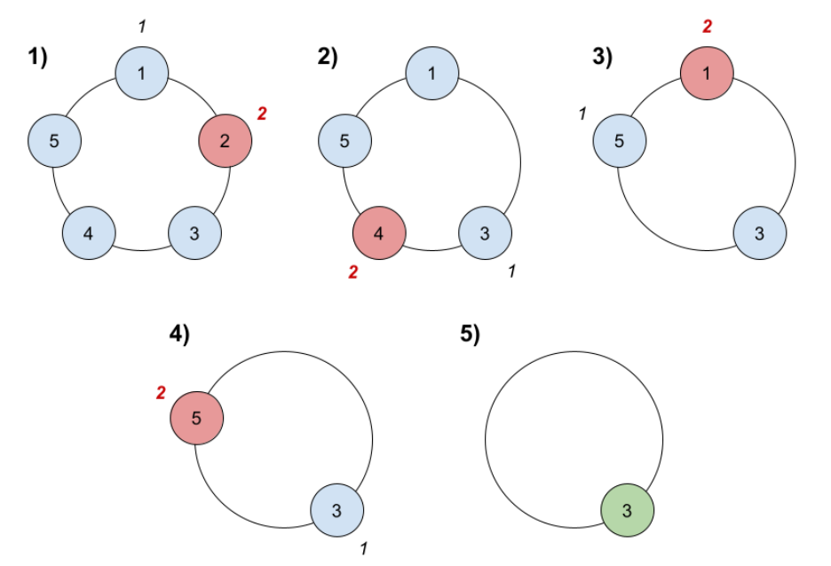
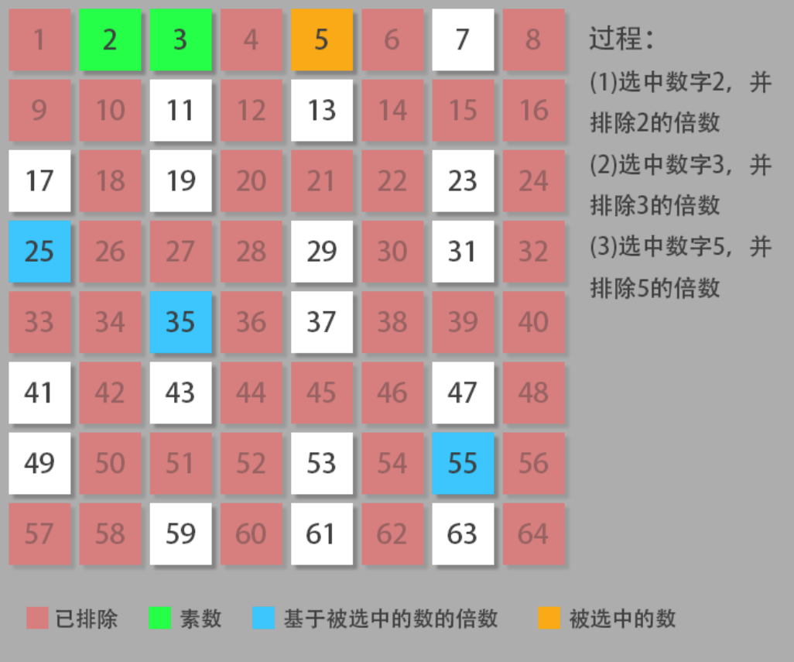

## 约瑟夫环

### [1823. 找出游戏的获胜者](https://leetcode-cn.com/problems/find-the-winner-of-the-circular-game/)

难度中等129收藏分享切换为英文接收动态反馈

共有 `n` 名小伙伴一起做游戏。小伙伴们围成一圈，按 **顺时针顺序** 从 `1` 到 `n` 编号。确切地说，从第 `i` 名小伙伴顺时针移动一位会到达第 `(i+1)` 名小伙伴的位置，其中 `1 <= i < n` ，从第 `n` 名小伙伴顺时针移动一位会回到第 `1` 名小伙伴的位置。

游戏遵循如下规则：

1. 从第 `1` 名小伙伴所在位置 **开始** 。
2. 沿着顺时针方向数 `k` 名小伙伴，计数时需要 **包含** 起始时的那位小伙伴。逐个绕圈进行计数，一些小伙伴可能会被数过不止一次。
3. 你数到的最后一名小伙伴需要离开圈子，并视作输掉游戏。
4. 如果圈子中仍然有不止一名小伙伴，从刚刚输掉的小伙伴的 **顺时针下一位** 小伙伴 **开始**，回到步骤 `2` 继续执行。
5. 否则，圈子中最后一名小伙伴赢得游戏。

给你参与游戏的小伙伴总数 `n` ，和一个整数 `k` ，返回游戏的获胜者。

 

**示例 1：**



```
输入：n = 5, k = 2
输出：3
解释：游戏运行步骤如下：
1) 从小伙伴 1 开始。
2) 顺时针数 2 名小伙伴，也就是小伙伴 1 和 2 。
3) 小伙伴 2 离开圈子。下一次从小伙伴 3 开始。
4) 顺时针数 2 名小伙伴，也就是小伙伴 3 和 4 。
5) 小伙伴 4 离开圈子。下一次从小伙伴 5 开始。
6) 顺时针数 2 名小伙伴，也就是小伙伴 5 和 1 。
7) 小伙伴 1 离开圈子。下一次从小伙伴 3 开始。
8) 顺时针数 2 名小伙伴，也就是小伙伴 3 和 5 。
9) 小伙伴 5 离开圈子。只剩下小伙伴 3 。所以小伙伴 3 是游戏的获胜者。
```

**示例 2：**

```
输入：n = 6, k = 5
输出：1
解释：小伙伴离开圈子的顺序：5、4、6、2、3 。小伙伴 1 是游戏的获胜者。
```

#### 笨比解法 模拟 效率不错

```c++
class Solution {
public:
    int findTheWinner(int n, int k) {
      vector<int> all;
      for(int i = 1; i<=n; i++){
        all.push_back(i);
      }
      int index = 0;
      while(all.size() > 1){
        index = (index + k - 1)%n;
        all.erase(all.begin() + index);
        n--;
      }
      return all.front();
    }
};
```

#### 数学解法

```dart
下表 0 1 2 3 4   数到3删除
最后只剩下一个元素，假设这个最后存活的元素为 num, 这个元素最终的的下标一定是0 （因为最后只剩这一个元素），
所以如果我们可以推出上一轮次中这个num的下标，然后根据上一轮num的下标推断出上上一轮num的下标，
直到推断出元素个数为n的那一轮num的下标，那我们就可以根据这个下标获取到最终的元素了。推断过程如下：

首先最后一轮中num的下标一定是0， 这个是已知的。
那上一轮应该是有两个元素，此轮次中 num 的下标为 (0 + m)%n = (0+3)%2 = 1; 说明这一轮删除之前num的下标为1；
再上一轮应该有3个元素，此轮次中 num 的下标为 (1+3)%3 = 1；说明这一轮某元素被删除之前num的下标为1；
再上一轮应该有4个元素，此轮次中 num 的下标为 (1+3)%4 = 0；说明这一轮某元素被删除之前num的下标为0；
再上一轮应该有5个元素，此轮次中 num 的下标为 (0+3)%5 = 3；说明这一轮某元素被删除之前num的下标为3；
....

因为我们要删除的序列为0-n-1, 所以求得下标其实就是求得了最终的结果。比如当n 为5的时候，num的初始下标为3，
 所以num就是3，也就是说从0-n-1的序列中， 经过n-1轮的淘汰，3这个元素最终存活下来了，也是最终的结果。

总结一下推导公式：(此轮过后的num下标 + m) % 上轮元素个数 = 上轮num的下标
```

注意 这道题因为编号是从1开始的 index 0对应的人是1 所以最后的下标要+1

```c++
class Solution {
public:
    int findTheWinner(int n, int k) {
      int pos = 0; // 最终活下来那个人的初始位置
      for(int i = 2; i <= n; i++) //上次剩两个人 最后剩n个人
          pos = (pos + k) % i;  // 每次循环右移
      return pos + 1;
    }
};
```


## 厄拉多塞筛



### [204. 计数质数](https://leetcode.cn/problems/count-primes/)

[labuladong 题解](https://labuladong.github.io/article/?qno=204)[思路](https://leetcode.cn/problems/count-primes/#)

难度中等897

给定整数 `n` ，返回 *所有小于非负整数 `n` 的质数的数量* 。

 

**示例 1：**

```
输入：n = 10
输出：4
解释：小于 10 的质数一共有 4 个, 它们是 2, 3, 5, 7 。
```

**示例 2：**

```
输入：n = 0
输出：0
```

**示例 3：**

```
输入：n = 1
输出：0
```

```c++
class Solution {
public:
    // //超时
    // int countPrimes(int n) {
    //     if(n == 0 || n == 1 || n==2) return 0;
    //     if(iszhishu(n-1))
    //     {
    //         return countPrimes(n-1)+1;
    //     }
    //     else return countPrimes(n-1);
    // }
    // bool iszhishu(int n)
    // {
    //     if(n==2) return true;
    //     for(int i=2; i<n; i++)
    //     {
    //         if(n%i == 0 ) return false;
    //     }
    //     return true;
    // }

  int countPrimes(int n) {
    int count = 0;
    //初始默认所有数为质数
    vector<bool> signs(n, true);
    for (int i = 2; i < n; i++) {
        if (signs[i]) {
            count++;
            for (int j = i + i; j < n; j += i) {
                //排除不是质数的数
                signs[j] = false;
            }
        }
    }
    return count;
  }
};
```

### [1175. 质数排列](https://leetcode.cn/problems/prime-arrangements/)

难度简单96收藏分享切换为英文接收动态反馈

请你帮忙给从 `1` 到 `n` 的数设计排列方案，使得所有的「质数」都应该被放在「质数索引」（索引从 1 开始）上；你需要返回可能的方案总数。

让我们一起来回顾一下「质数」：质数一定是大于 1 的，并且不能用两个小于它的正整数的乘积来表示。

由于答案可能会很大，所以请你返回答案 **模 mod `10^9 + 7`** 之后的结果即可。

 

**示例 1：**

```
输入：n = 5
输出：12
解释：举个例子，[1,2,5,4,3] 是一个有效的排列，但 [5,2,3,4,1] 不是，因为在第二种情况里质数 5 被错误地放在索引为 1 的位置上。
```

**示例 2：**

```
输入：n = 100
输出：682289015
```

```c++
class Solution {
public:
    const int MOD = 1e9+7;
    int numPrimeArrangements(int n) {
      long long ans = 1;
      if(n == 1) return ans;
      //计算1-n的质数的个数
      vector<bool> sign(n+1, 1);
      int cnt = 0;
      for(int i = 2; i<=n; i++){
        if(sign[i]){
          cnt++;
          for(int j = i+i; j<=n; j+=i){
            sign[j] = 0;
          }
        }
      }
      int nn = n-cnt;
      while(nn){
        ans=(ans * nn)%MOD;
        nn--;
      }
      while(cnt){
        ans=(ans *cnt)%MOD;
        cnt--;
      }
      return ans;
    }
};
```


## 摩尔投票法

核心就是**对拼消耗**。

玩一个诸侯争霸的游戏，假设你方人口超过总人口一半以上，并且能保证每个人口出去干仗都能一对一同归于尽。最后还有人活下来的国家就是胜利。

那就大混战呗，最差所有人都联合起来对付你（对应你每次选择作为计数器的数都是众数），或者其他国家也会相互攻击（会选择其他数作为计数器的数），但是只要你们不要内斗，最后肯定你赢。

#### [169. 多数元素](https://leetcode.cn/problems/majority-element/)

难度简单1471

给定一个大小为 `n` 的数组 `nums` ，返回其中的多数元素。多数元素是指在数组中出现次数 **大于** `⌊ n/2 ⌋` 的元素。

你可以假设数组是非空的，并且给定的数组总是存在多数元素。

 

**示例 1：**

```
输入：nums = [3,2,3]
输出：3
```

**示例 2：**

```
输入：nums = [2,2,1,1,1,2,2]
输出：2
```

**提示：**

- `n == nums.length`
- `1 <= n <= 5 * 104`
- `-109 <= nums[i] <= 109`

==**进阶：**尝试设计时间复杂度为 O(n)、空间复杂度为 O(1) 的算法解决此问题。==

1. 摩尔投票法
```c++
class Solution {
public:
    //投票算法证明：
    // 如果候选人不是maj 则 maj,会和其他非候选人一起反对 会反对候选人,所以候选人一定会下台(maj==0时发生换届选举)
    // 如果候选人是maj , 则maj 会支持自己，其他候选人会反对，同样因为maj 票数超过一半，所以maj 一定会成功当选
    int majorityElement(vector<int>& nums) {
      int cnt = 0;
      int maj = 0;
      for(int i = 0; i<nums.size(); i++){
        if(cnt == 0){
          maj = nums[i];
          cnt++;
        }else{
          nums[i] == maj ? cnt++ : cnt--;
        }
      }
      return maj;
    }
};
```
2. 随机法
```c++
class Solution {
public:
    // 随机数法 期望的随机次数是常数 平均时间复杂度On
    // 期望计算 1*0.5 + 2*0.5*0.5 + 3*0.5*0.5...收敛于2
    int majorityElement(vector<int>& nums) {
      while(1){
        int randNum = nums[rand() % nums.size()];
        int cnt = 0;
        for(int& num : nums){
          if(randNum == num)
            cnt++;
          if(cnt>nums.size() / 2)
            return randNum;
        }
      }
      return 0;
    }
};
```
3. 位运算
```c++
class Solution {
public:
    int majorityElement(vector<int>& nums) {
      //位运算法,统计每个数字每一位0，1出现的次数，如果某一位1出现的次数多则该位为1，0同理；
      //最后按为统计出来的数就是众数
      int res=0,len = nums.size();
      for(int i=0;i<32;i++){
        int ones=0,zero=0;
        for(int j=0;j < len; j++){
          if(ones>len/2 ||zero>len/2) break;
          if((nums[j]&(1<<i)) != 0) ones++;
          else zero++;   
        }
        // 还原数字
        if(ones > zero)
          res |= (1<<i);
      }
      return res;
    }
};
```
