# 软件项目

## VIDO微动处理系统

### 界面展示

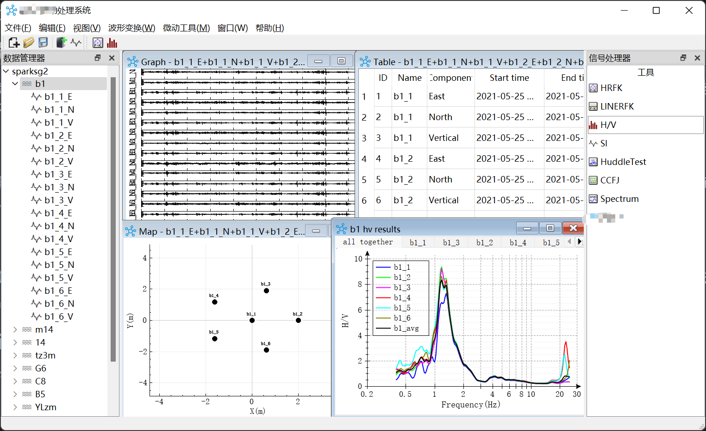

### 处理流程

****处理系统主要是对采集到的原始信号进行分析，通过一系列算法运算，分析得到地下信息

#### 1.原始信号的导入

信号的原始信号是规范格式的二进制文件，seg2或者sac，首先读取文件头信息到结构体，例如几道信号，信号的起始时间，检波器的坐标和分量信息等，然后读取数据段内存

#### 2.信号预处理

采集到的原始信号经常是存在坏点的，需要对信号进行坏点筛除和有效信号的提取，用到了sta/lta算法，和阈值百分比的方法去筛选坏点，一般的算法运算都需要转到频域，因此还需要一个按频点分窗fft的过程

#### 3.算法实现

这主要设计一些地址算法的实现过程了，hv是水平垂直的功率谱比。 fk是频率波数域求解相速度， si的计算相干系数拟合到贝塞尔曲线去求解相速度。

用到了多线程 qt::concurrent实现单个台站的线程， qt::concurrent::map实现单台站多频点的多线程实现

#### 4.结果的导出与展示

做一个结果的导出工作，然后基于qcustomplot对计算结果 做一个图像化的快速显示

## 地质剖面绘制软件

### 界面展示

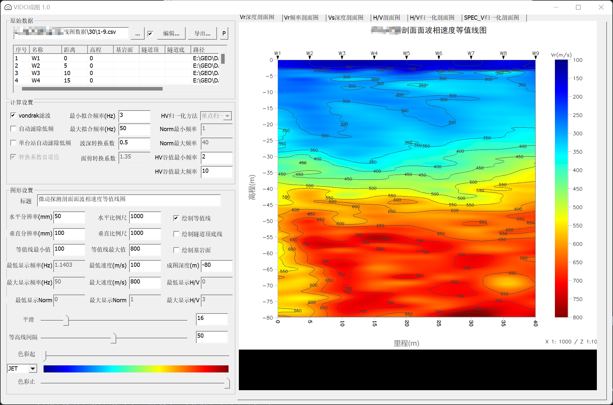

### 处理流程

主要是多台阵的计算结果（频散曲线，hv谱比或功率谱），使用opencv进行二维拉伸成图

#### 1.地质算法结果文件的导入

读取csv，主要是csv记录的位置信息（相互距离），测点高程，根据csv记录的路径将结果文件（自定义保存的结果格式 文本）导入到成图系统，存储所有数据

#### 2.预处理

多个成图过程需要预处理：例如 结果坏点检测与剔除，频散曲线根据半波长计算深度，需要进行深度的插值depth = a*fre^b^ ，剪切波速转换等

#### 3.剖面图实现

1. 多测点垂直方向的数据插值
2. 按距离对数据矩阵进行比例缩放 使用opencv进行resize和honcat
3. 色系填充：将结果整合到对应色系，使用opencv进行显示 （已有的色系包括： hsv jet gray 以及自定义色带）
4. 轮廓线绘制：opencv进行drawContours检测，依次进行所有轮廓的绘制

#### 4.结果导出

因为是工程探测，因此导出格式为bmp，保存比例信息

## 基于C++11的tiny网盘

### 界面展示

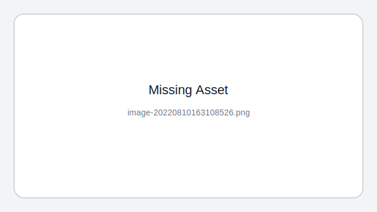

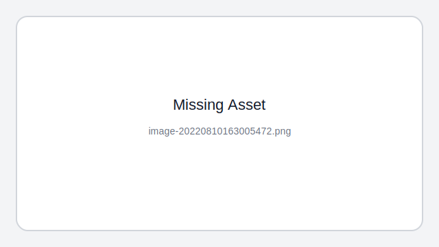

### 项目介绍

基于C++实现的WEB服务器，实现了GET、POST请求。功能上主要实现了**用户注册、登录，文件上传、下载，远程目录浏览**。

项目主要包括**reactor、线程池、HTTP、数据库连接池、日志系统、时钟系统**等模块。

1. 基于epoll IO复用技术，ET边缘触发+非阻塞+忙轮询网络模型实现高并发处理。
2. 线程池通过任务队列，多线程异步处理网络请求。 
3. HTTP模块对连接进行维护，利用主从状态机对报文进行解析，实现GET/POST请求处理。
4. RAII机制维护数据库连接池，避免重复连接/断开数据库。
5. 基于单例模式实现的日志系统，异步写入日志信息。
6. 基于双向链表实现定时器时钟系统，处理非活跃连接。

### 压力测试

测试环境为八代i5-8400机器，2核4G内存ubuntu虚拟机

# 机械设计展示

## ****主控机箱

### 1.0版本

#### 使用型材在sku机箱内部进行架构

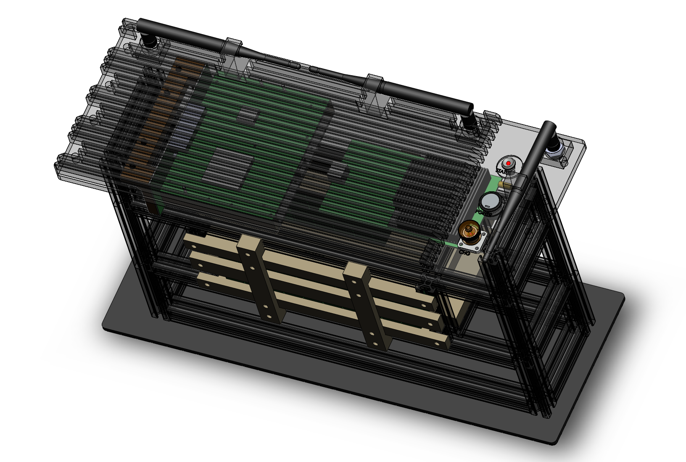

### 2.0版本

#### 人工建模注塑，提高空间利用率，减轻机箱重量

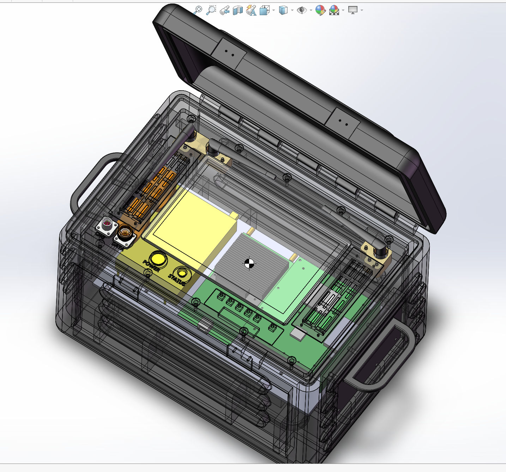

#### 面板改进设计

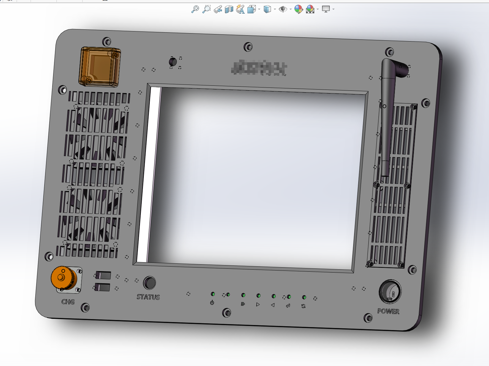

## 叶片尺寸检测系统

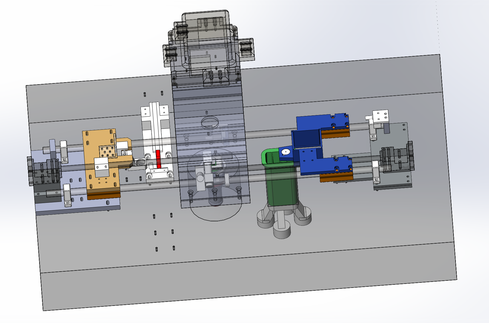

## 视觉挠度测量

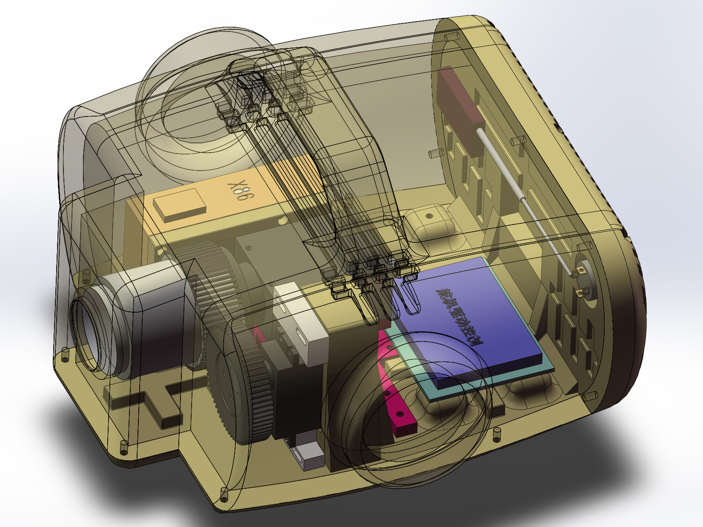

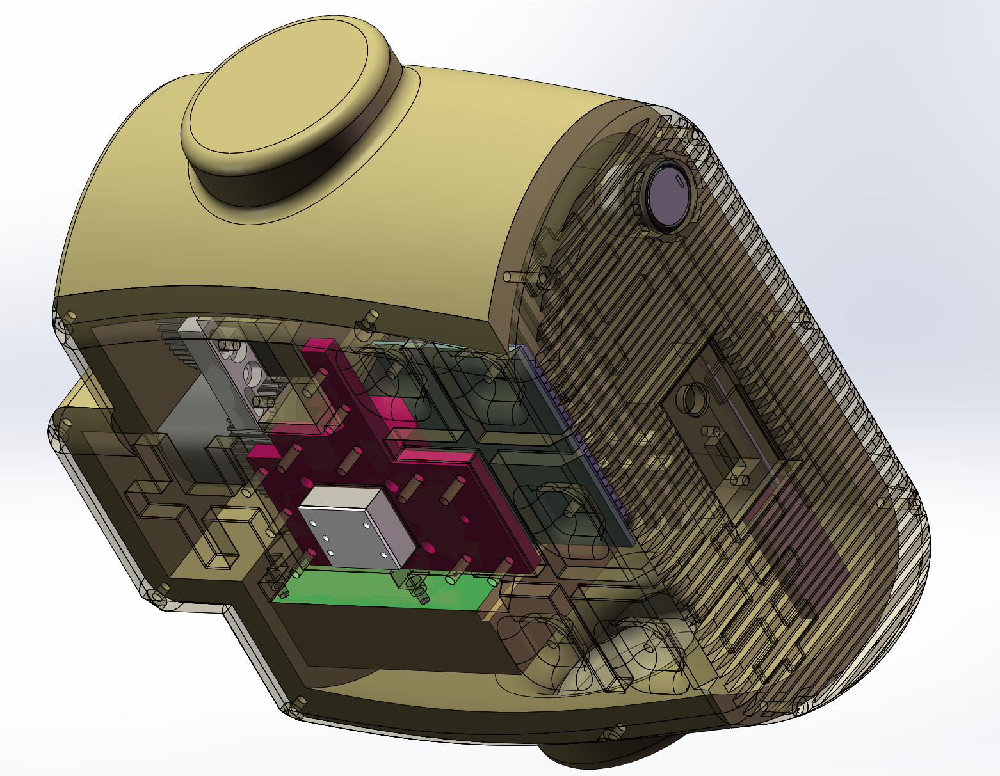

# QT小练习

## QDIR

### 介绍

一个文件搬运软件，查找目标路径下 所有文件名中包含目标字段的文件 对齐进行copy to 或者delete操作

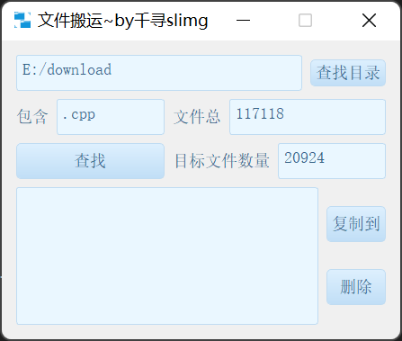

### 使用说明

1. 选择要查找的文件路径
2. 填写 目标字段
3. 点击查找
4. 选择要复制到的目标文件夹 或者删除

### 参与贡献

1. qianxunslimg
2. 无条件为小刘老师提供定制化服务
3. 看心情为福州刘教授提供定制化服务

##  llmHomeWork

### 介绍

学校网站信息不全，为了小刘老师更方便的书写假期作业批改记录，写了这个小软件

### 使用说明

1. 在作业详情页ctrl+A全选页面，再ctrl+C复制所有信息，如图

   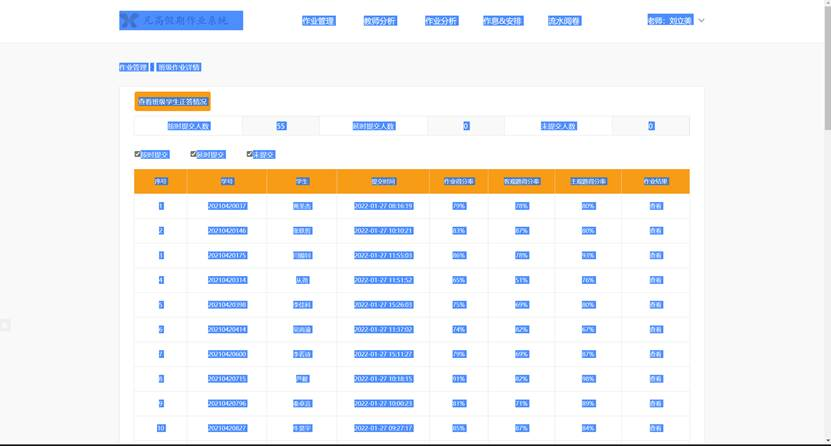

2. 新建一个txt，ctrl+V粘贴所有信息，保存并关闭，如图

3. 用软件打开保存的txt即可，如图

   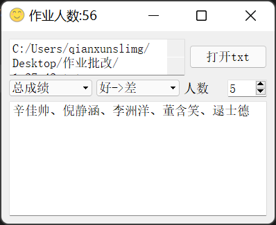

### 参与贡献

1. qianxunslimg
2. 为小刘老师提供定制化服务

## LED点阵控制

### 介绍

学长毕业 学弟帮忙 一个串口控制led点阵的小程序

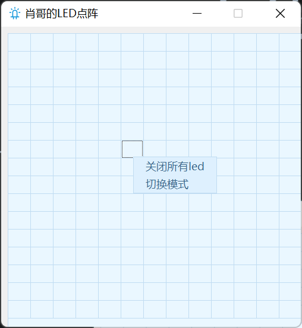

简单的通过串口发送点触位置，下位机控制灯亮灯灭

1. 单点模式：点触时 此点亮 之前灭
2. 常亮模式：点触接连亮灯

##  DrinkMoreWater

### 介绍

喝水太少，用来提醒自己和小刘老师按时喝水的小软件

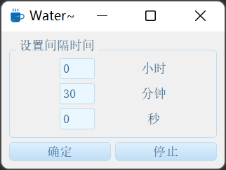

### 软件架构

1. 基于qt框架
2. window默认通知

## myWeatherReport

### 介绍

天气预报练手小项目，主要练习 api的请求（和风天气） 解析 和 样式表

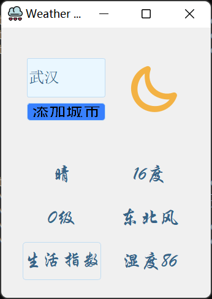

### 软件架构

- 基于qt框架
- 基于QNetworkAccessManager进行api的请求和数据接收
- 数据解析与显示
