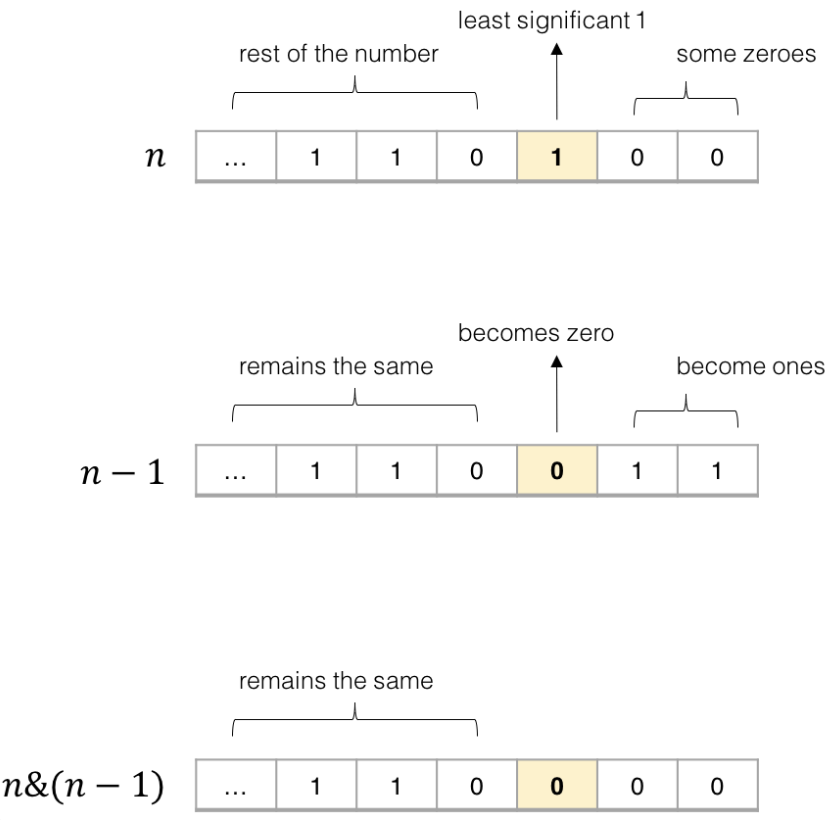
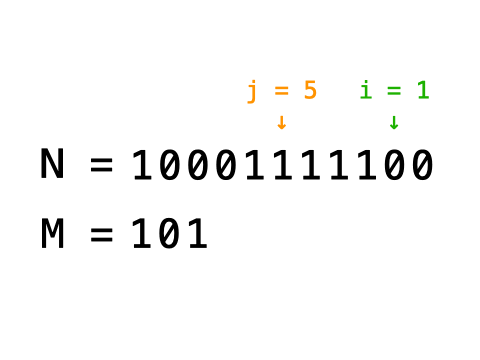

## 位操作技巧

### [位运算概览](https://www.runoob.com/w3cnote/bit-operation.html)

| 符号 | 描述 | 运算规则                                                     |
| :--- | :--- | :----------------------------------------------------------- |
| &    | 与   | 两个位都为1时，结果才为1                                     |
| \|   | 或   | 两个位都为0时，结果才为0                                     |
| ^    | 异或 | `两个位相同为0，相异为1`                                     |
| ~    | 取反 | 0变1，1变0                                                   |
| <<   | 左移 | 各二进位全部左移若干位，高位丢弃，低位补0                    |
| >>   | 右移 | 各二进位全部右移若干位，对无符号数，高位补0，有符号数，各编译器处理方法不一样，有的补符号位（算术右移），有的补0（逻辑右移） |

### 有趣的位操作

1. **利用或操作 `|` 和空格将英文字符转换为小写**

```c++
('a' | ' ') = 'a'
('A' | ' ') = 'a'
```

2. **利用与操作 `&` 和下划线将英文字符转换为大写**

```c++
('b' & '_') = 'B'
('B' & '_') = 'B'
```

3. <u>**利用异或操作 `^` 和空格进行英文字符大小写互换**</u>

```c++
('d' ^ ' ') = 'D'
('D' ^ ' ') = 'd'
```

4. <u>**判断两个数是否异号**</u>

```c++
int x = -1, y = 2;
boolean f = ((x ^ y) < 0); // true

int x = 3, y = 2;
boolean f = ((x ^ y) < 0); // false
```

5. **不用临时变量交换两个数**

```c++
int a = 1, b = 2;
a ^= b;
b ^= a;
a ^= b;
// 现在 a = 2, b = 1
```

6. **加一**

```c++
int n = 1;
n = -~n;
// 现在 n = 2
```

7. **减一**

```c++
int n = 2;
n = ~-n;
// 现在 n = 1
```

### `n & (n-1)` 的运用

**`n & (n-1)` 这个操作是算法中常见的，作用是消除数字 `n` 的二进制表示中的最后一个 1**。

看个图就很容易理解了：



其核心逻辑就是，`n - 1` 一定可以消除最后一个 1，同时把其后的 0 都变成 1，这样再和 `n` 做一次 `&` 运算，就可以仅仅把最后一个 1 变成 0 了。

### `a ^ a = 0` 的运用

<u>异或运算的性质是需要我们牢记的：</u>

<u>一个数和它本身做异或运算结果为 0，即 `a ^ a = 0`；一个数和 0 做异或运算的结果为它本身，即 `a ^ 0 = a`。</u>

### `N^=(1<<k)`

<u>将二进制的N的`第k位`置为0</u>

## 一些位运算的题目

### [191. 位1的个数](https://leetcode-cn.com/problems/number-of-1-bits/)

[labuladong 题解](https://labuladong.gitee.io/article/?qno=191) [思路](https://leetcode-cn.com/problems/number-of-1-bits/#)

编写一个函数，输入是一个无符号整数（以二进制串的形式），返回其二进制表达式中数字位数为 '1' 的个数（也被称为[汉明重量](https://baike.baidu.com/item/汉明重量)）。

 

**提示：**

- 请注意，在某些语言（如 Java）中，没有无符号整数类型。在这种情况下，输入和输出都将被指定为有符号整数类型，并且不应影响您的实现，因为无论整数是有符号的还是无符号的，其内部的二进制表示形式都是相同的。
- 在 Java 中，编译器使用[二进制补码](https://baike.baidu.com/item/二进制补码/5295284)记法来表示有符号整数。因此，在上面的 **示例 3** 中，输入表示有符号整数 `-3`。

 

**示例 1：**

```
输入：00000000000000000000000000001011
输出：3
解释：输入的二进制串 00000000000000000000000000001011 中，共有三位为 '1'。
```

#### 思路

n&(n-1)的应用

#### 代码

```c++
class Solution {
public:
    int hammingWeight(uint32_t n) {
        int ans = 0;
        while(n){
            n = n & (n-1);
            ans++;
        }
        return ans;
    }
};
```

#### [231. 2 的幂](https://leetcode-cn.com/problems/power-of-two/)

[labuladong 题解](https://labuladong.gitee.io/article/?qno=231)[思路](https://leetcode-cn.com/problems/power-of-two/#)

难度简单481收藏分享切换为英文接收动态反馈

给你一个整数 `n`，请你判断该整数是否是 2 的幂次方。如果是，返回 `true` ；否则，返回 `false` 。

如果存在一个整数 `x` 使得 `n == 2x` ，则认为 `n` 是 2 的幂次方。

 

**示例 1：**

```
输入：n = 1
输出：true
解释：20 = 1
```

**示例 2：**

```
输入：n = 16
输出：true
解释：24 = 16
```

#### 思路

2的幂表示为二进制 只有一个1

#### 代码

```c++
class Solution {
public:
    //2的幂在二进制中只有一个1
    bool isPowerOfTwo(int n) {
        if(n<=0) return 0;
        return (n&(n-1)) == 0;
    }
};
```

### [136. 只出现一次的数字](https://leetcode-cn.com/problems/single-number/)

[labuladong 题解](https://labuladong.gitee.io/article/?qno=136)[思路](https://leetcode-cn.com/problems/single-number/#)

难度简单2344英文版讨论区

给定一个**非空**整数数组，除了某个元素只出现一次以外，其余每个元素均出现两次。找出那个只出现了一次的元素。

**说明：**

你的算法应该具有线性时间复杂度。 你可以不使用额外空间来实现吗？

**示例 1:**

```
输入: [2,2,1]
输出: 1
```

#### 思路

利用异或的性质a ^ a = 0, a ^ 0 = a 全部异或即可得到唯一的值

#### 代码

```c++
class Solution {
public:
    int singleNumber(vector<int>& nums) {
      int ans = 0;
      for(int num : nums)
        ans ^= num;
      return ans;
    }
};
```

### [268. 丢失的数字](https://leetcode-cn.com/problems/missing-number/)

[labuladong 题解](https://labuladong.gitee.io/article/?qno=268)[思路](https://leetcode-cn.com/problems/missing-number/#)

难度简单584收藏分享切换为英文接收动态反馈

给定一个包含 `[0, n]` 中 `n` 个数的数组 `nums` ，找出 `[0, n]` 这个范围内没有出现在数组中的那个数。


 

**示例 1：**

```
输入：nums = [3,0,1]
输出：2
解释：n = 3，因为有 3 个数字，所以所有的数字都在范围 [0,3] 内。2 是丢失的数字，因为它没有出现在 nums 中。
```

**示例 2：**

```
输入：nums = [0,1]
输出：2
解释：n = 2，因为有 2 个数字，所以所有的数字都在范围 [0,2] 内。2 是丢失的数字，因为它没有出现在 nums 中。
```

#### 思路

异或一下即可

#### 代码

```c++
class Solution {
public:
    int missingNumber(vector<int>& nums) {
        int ans = 0;
        for(int i = 0; i<nums.size(); i++){
            ans^=i;
            ans^=nums[i];
        }
        ans^=nums.size();
        return ans;
    }
};
```

### [剑指 Offer 56 - I. 数组中数字出现的次数](https://leetcode-cn.com/problems/shu-zu-zhong-shu-zi-chu-xian-de-ci-shu-lcof/)

难度中等597收藏分享切换为英文接收动态反馈英文版讨论区

一个整型数组 `nums` 里除两个数字之外，其他数字都出现了两次。请写程序找出这两个只出现一次的数字。要求时间复杂度是O(n)，空间复杂度是O(1)。

 

**示例 1：**

```
输入：nums = [4,1,4,6]
输出：[1,6] 或 [6,1]
```

**示例 2：**

```
输入：nums = [1,2,10,4,1,4,3,3]
输出：[2,10] 或 [10,2]
```

#### 思路

[**我就知道总有人能给我讲明白，nb**](https://leetcode-cn.com/problems/shu-zu-zhong-shu-zi-chu-xian-de-ci-shu-lcof/solution/shua-bao-leetcode-yi-huo-yun-suan-xiao-b-cc5a/)

- 我们将所有的数据都异或起来，不难理解最后的结果是两个 n = n1 ^ n2(n1和n2是只出现一次的数)
- 我们对n进行分析，因为n是n1和n2异或得来的，所以n的二进制中第一次出现1的地方就是n1和n2二进制表示中第一次出现不同的情况，我们可以以此作为区分
- 将数组中的数分成第bit位为1和bit为0的两组

#### 代码

```c++
class Solution {
public:
    vector<int> singleNumbers(vector<int>& nums) {
        int find = 0;
        vector<int> ans(2);
        for(int num : nums){
            find^=num;
        }//所有异或 最终是两个不同数的异或结果
        
        int bit = 0;
        //注意这里的优先级 先1<<bit 在find&
        while((find& 1<< bit) == 0){  //找到第一个1
            bit++;
        }
        int temp = 1<<bit;  //移到两个数bit不同的位置
        for(int num:nums){
            if(num&temp) //包含第bit位为1的数
                ans[0]^=num;
            else             //包含第bit位不为1的数
                ans[1]^=num;
        }
        return ans;
    }
};
```

### [剑指 Offer 56 - II. 数组中数字出现的次数 II](https://leetcode-cn.com/problems/shu-zu-zhong-shu-zi-chu-xian-de-ci-shu-ii-lcof/)

难度中等316收藏分享切换为英文接收动态反馈英文版讨论区

在一个数组 `nums` 中除`一个数字只出现一次`之外，`其他数字都出现了三次`。请找出那个只出现一次的数字。

 

**示例 1：**

```
输入：nums = [3,4,3,3]
输出：4
```

**示例 2：**

```
输入：nums = [9,1,7,9,7,9,7]
输出：1
```

**限制：**

- `1 <= nums.length <= 10000`
- `1 <= nums[i] < 2^31`

#### 思路

题目限制32位int遍历每一位 将所有数字的该位 0/1 相加 如果目标数字该位为1，则该位相加不为3的倍数 

利用这个特征可以将数字还原

#### 代码

```c++
class Solution {
public:
    int singleNumber(vector<int>& nums) {
        int ans = 0;
        for(int i = 0; i<32; i++){
            int total = 0;
            for(int num: nums)
                //右移&1得到每一位
                total+= (num>>i)&1;
            if(total%3)
                //还原这个数 左移回相应的位数 或取回该值
                ans |= (1<<i);
        }
        return ans;
    }
};
```

### [剑指 Offer II 003. 前 n 个数字二进制中 1 的个数](https://leetcode-cn.com/problems/w3tCBm/)

难度简单54

给定一个非负整数 `n` ，请计算 `0` 到 `n` 之间的每个数字的二进制表示中 1 的个数，并输出一个数组。

 

**示例 1:**

```
输入: n = 2
输出: [0,1,1]
解释: 
0 --> 0
1 --> 1
2 --> 10
```

**示例 2:**

```
输入: n = 5
输出: [0,1,1,2,1,2]
解释:
0 --> 0
1 --> 1
2 --> 10
3 --> 11
4 --> 100
5 --> 101
```

#### 思路

1. 笨方法 遍历每个都数
2. dp 奇数是/2偶数1的个数+1 偶数是/2偶数的个数

#### 代码

笨比遍历

```c++
class Solution {
public:
    vector<int> countBits(int n) {
        vector<int> ans(n+1);
        for(int i = 0; i<=n; i++){
            ans[i] = countOne(i);
        }
        return ans;
    }

    int countOne(int num){
        int ans = 0;
        while(num){
            ans++;
            num &= (num-1);
        }
        return ans;
    }
};
```

奇偶关系dp

```c++
class Solution {
public:
    vector<int> countBits(int n) {
        vector<int> ans(n+1);
        for(int i = 1; i<=n; i++){
            if((i&1) == 1) //奇数
                ans[i] = ans[i>>1] + 1;
            else
                ans[i] = ans[i>>1];
        }
        return ans;
    }
};
```

### [`剑指 Offer II 005. 单词长度的最大乘积`](https://leetcode-cn.com/problems/aseY1I/)

难度中等58

给定一个字符串数组 `words`，请计算当两个字符串 `words[i]` 和 `words[j]` 不包含相同字符时，它们长度的乘积的最大值。假设字符串中只包含英语的小写字母。如果没有不包含相同字符的一对字符串，返回 0。

 

**示例 1:**

```
输入: words = ["abcw","baz","foo","bar","fxyz","abcdef"]
输出: 16 
解释: 这两个单词为 "abcw", "fxyz"。它们不包含相同字符，且长度的乘积最大。
```

#### 解法

用一个32位int记录一个单词中出现了哪些字母

相&为0， 说明没有重复的字母

```c++
class Solution {
public:
    int maxProduct(vector<string>& words) {
        int n = words.size();
        vector<int> masks(n);
        for(int i = 0; i<n; i++){
            for(auto ch : words[i]){
                //用二进制中的最多26位，记录每个字母是否存在
                masks[i] |= 1<<(ch - 'a');
            }
        }
        int ans = 0;
        for(int i = 0; i<n; i++){
            for(int j = i+1; j<n; j++){
                //不存在相同数字
                if((masks[i] & masks[j]) == 0){
                    ans = max(int(words[i].size()*words[j].size()), ans);
                }
            }
        }
        return ans;
    }
};
```

位运算优化，因为met 和 meet的int是相同的，所以我们只需要记录meet 及其长度 就可以了，

```c++
class Solution {
public:
    int maxProduct(vector<string>& words) {
        unordered_map<int,int> map;
        int length = words.size();
        for (int i = 0; i < length; i++) {
            int mask = 0;
            string word = words[i];
            int wordLength = word.size();
            for (int j = 0; j < wordLength; j++) {
                mask |= 1 << (word[j] - 'a');
            }
            if(map.count(mask)) {
                if (wordLength > map[mask]) {
                    map[mask] = wordLength;
                }
            } else {
                map[mask] = wordLength;
            }
            
        }
        int maxProd = 0;
        for (auto [mask1, _] : map) {
            int wordLength1 = map[mask1];
            for (auto [mask2, _] : map) {
                if ((mask1 & mask2) == 0) {
                    int wordLength2 = map[mask2];
                    maxProd = max(maxProd, wordLength1 * wordLength2);
                }
            }
        }
        return maxProd;
    }
};
```

### [面试题 05.01. 插入](https://leetcode-cn.com/problems/insert-into-bits-lcci/)

难度简单54收藏分享切换为英文接收动态反馈

给定两个整型数字 `N` 与 `M`，以及表示比特位置的 `i` 与 `j`（`i <= j`，且从 0 位开始计算）。

编写一种方法，使 `M` 对应的二进制数字插入 `N` 对应的二进制数字的第 `i ~ j` 位区域，不足之处用 `0` 补齐。具体插入过程如图所示。



题目保证从 `i` 位到 `j` 位足以容纳 `M`， 例如： `M = 10011`，则 `i～j` 区域至少可容纳 5 位。

 

**示例1:**

```
 输入：N = 1024(10000000000), M = 19(10011), i = 2, j = 6
 输出：N = 1100(10001001100)
```

**示例2:**

```
 输入： N = 0, M = 31(11111), i = 0, j = 4
 输出：N = 31(11111)
```

#### 方法

按注释的步骤

```c++
class Solution {
public:
    int insertBits(int N, int M, int i, int j) {
        // 1.把N的i到j位置为0
        for (int k = i; k <= j; k++) {
            if (N & (1 << k)) {
                N ^= (1 << k); //将N的第k位置为0
            }
        }
        // 2.把M的数值左移i位
        M <<= i;
        // 3.将N的i到j位加上M
        return N + M;
    }
};
```

### [169. 多数元素](https://leetcode.cn/problems/majority-element/)

难度简单1477收藏分享切换为英文接收动态反馈

给定一个大小为 `n` 的数组 `nums` ，返回其中的多数元素。多数元素是指在数组中出现次数 **大于** `⌊ n/2 ⌋` 的元素。

你可以假设数组是非空的，并且给定的数组总是存在多数元素。

 

**示例 1：**

```
输入：nums = [3,2,3]
输出：3
```

**示例 2：**

```
输入：nums = [2,2,1,1,1,2,2]
输出：2
```

**提示：**

- `n == nums.length`
- `1 <= n <= 5 * 104`
- `-109 <= nums[i] <= 109`


**进阶：**尝试设计时间复杂度为 O(n)、空间复杂度为 O(1) 的算法解决此问题。


#### 摩尔投票法

```c++
class Solution {
public:
    //投票算法证明：
    // 如果候选人不是maj 则 maj,会和其他非候选人一起反对 会反对候选人,所以候选人一定会下台(maj==0时发生换届选举)
    // 如果候选人是maj , 则maj 会支持自己，其他候选人会反对，同样因为maj 票数超过一半，所以maj 一定会成功当选
    int majorityElement(vector<int>& nums) {
      int cnt = 0;
      int maj = 0;
      for(int i = 0; i<nums.size(); i++){
        if(cnt == 0){
          maj = nums[i];
          cnt++;
        }else{
          nums[i] == maj ? cnt++ : cnt--;
        }
      }
      return maj;
    }
};
```
#### 随机法

```c++
class Solution {
public:
    // 随机数法 期望的随机次数是常数 平均时间复杂度On
    // 期望计算 1*0.5 + 2*0.5*0.5 + 3*0.5*0.5...收敛于2
    int majorityElement(vector<int>& nums) {
      while(1){
        int randNum = nums[rand() % nums.size()];
        int cnt = 0;
        for(int& num : nums){
          if(randNum == num)
            cnt++;
          if(cnt>nums.size() / 2)
            return randNum;
        }
      }
      return 0;
    }
};
```
#### 位运算

```c++
class Solution {
public:
    int majorityElement(vector<int>& nums) {
      //位运算法,统计每个数字每一位0，1出现的次数，如果某一位1出现的次数多则该位为1，0同理；
      //最后按为统计出来的数就是众数
      int res=0,len = nums.size();
      for(int i=0;i<32;i++){
        int ones=0,zero=0;
        for(int j=0;j < len; j++){
          if(ones>len/2 ||zero>len/2) break;
          if((nums[j]&(1<<i)) != 0) ones++;
          else zero++;   
        }
        // 还原数字
        if(ones > zero)
          res = res | (1<<i);
      }
      return res;
    }
};
```
