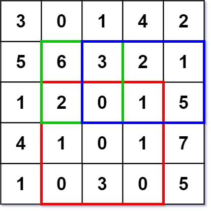
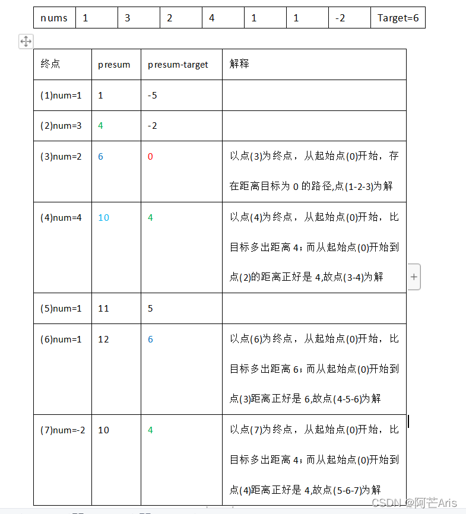
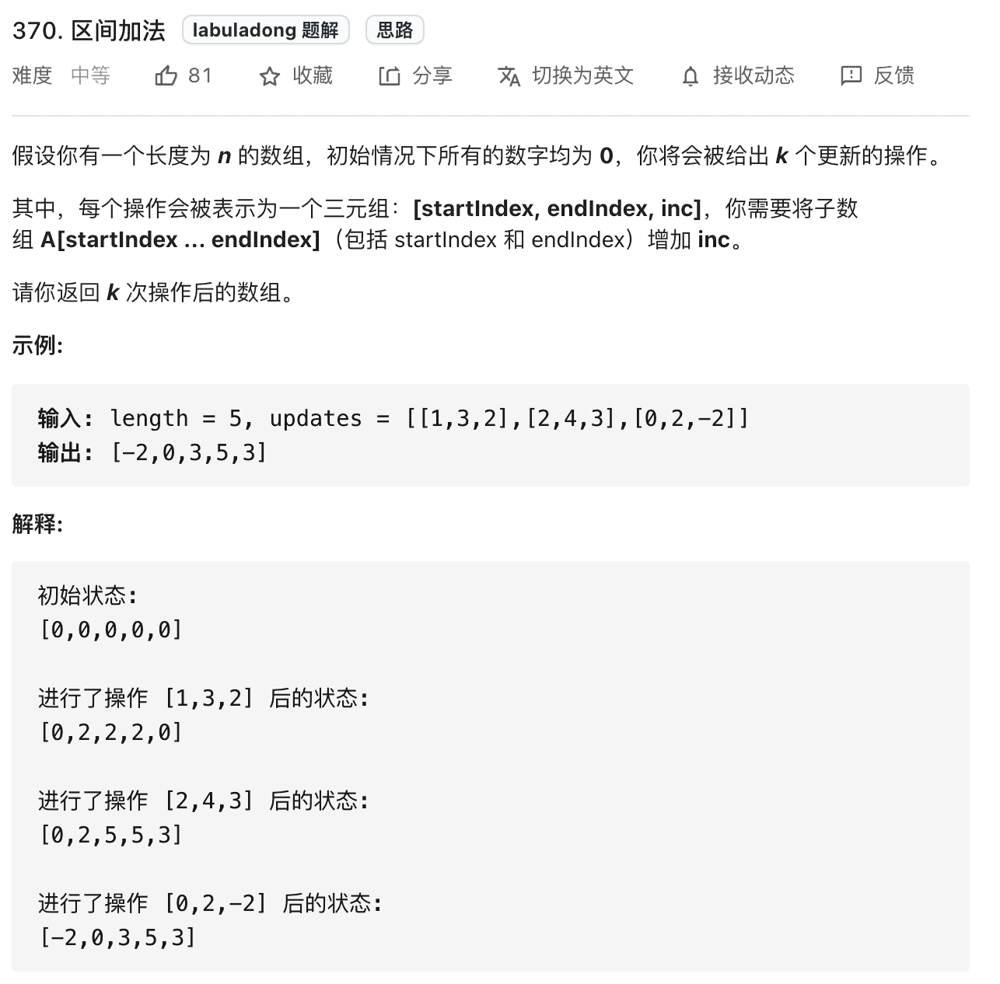

# 前缀和数组

> 注意的点 为了省去边界判断，前缀和数组`多开辟一个` `从1到n`

```c++
class PrefixSum {
private:
  // 前缀和数组
  vector<int> prefix;
  
public:
  /* 输入一个数组，构造前缀和 */
  PrefixSum(vector<int> nums) {
    int n = nums.size();
    prefix.resize(n+1);
    // 计算 nums 的累加和
    for (int i = 1; i <= n; i++) {
      prefix[i] = prefix[i - 1] + nums[i - 1];
    }
  }

  /* 查询闭区间 [i, j] 的累加和 */
  int query(int i, int j) {
    return prefix[j + 1] - prefix[i];
  }
};
```

## 一维数组中的前缀和

### [303. 区域和检索 - 数组不可变](https://leetcode-cn.com/problems/range-sum-query-immutable/)

[labuladong 题解](https://labuladong.gitee.io/plugin-v3/?qno=303&target=gitee&_=1646830143357)[思路](https://leetcode-cn.com/problems/range-sum-query-immutable/#)

给定一个整数数组  `nums`，处理以下类型的多个查询:

1. 计算索引 `left` 和 `right` （包含 `left` 和 `right`）之间的 `nums` 元素的 **和** ，其中 `left <= right`

实现 `NumArray` 类：

- `NumArray(int[] nums)` 使用数组 `nums` 初始化对象
- `int sumRange(int i, int j)` 返回数组 `nums` 中索引 `left` 和 `right` 之间的元素的 **总和** ，包含 `left` 和 `right` 两点（也就是 `nums[left] + nums[left + 1] + ... + nums[right]` )

 

**示例 1：**

```
输入：
["NumArray", "sumRange", "sumRange", "sumRange"]
[[[-2, 0, 3, -5, 2, -1]], [0, 2], [2, 5], [0, 5]]
输出：
[null, 1, -1, -3]

解释：
NumArray numArray = new NumArray([-2, 0, 3, -5, 2, -1]);
numArray.sumRange(0, 2); // return 1 ((-2) + 0 + 3)
numArray.sumRange(2, 5); // return -1 (3 + (-5) + 2 + (-1)) 
numArray.sumRange(0, 5); // return -3 ((-2) + 0 + 3 + (-5) + 2 + (-1))
```

#### 代码

```c++
class NumArray {
public:
    vector<int> preSum;
    NumArray(vector<int>& nums) {
      preSum.resize(nums.size());
      int sum = 0;
      for(int i = 0; i<nums.size(); i++){
        sum+=nums[i];
        preSum[i] = sum;
      }
    }
    
    int sumRange(int left, int right) {
      return left == 0?preSum[right]:(preSum[right] - preSum[left-1]);
    }
};

// 简单写法, 避免边界判断
class NumArray {
public:
    vector<int> preSum;
    NumArray(vector<int>& nums) {
      int n = nums.size();
      preSum.resize(n+1);
      for(int i = 1; i<n+1; i++){
        preSum[i] = preSum[i-1] + nums[i-1];
      }
    }
    
    int sumRange(int left, int right) {
      return preSum[right+1] - preSum[left];
    }
};
```

### [724. 寻找数组的中心下标](https://leetcode.cn/problems/find-pivot-index/)

[思路](https://leetcode.cn/problems/find-pivot-index/#)

难度简单403收藏分享切换为英文接收动态反馈

给你一个整数数组 `nums` ，请计算数组的 **中心下标** 。

数组 **中心下标** 是数组的一个下标，其左侧所有元素相加的和等于右侧所有元素相加的和。

如果中心下标位于数组最左端，那么左侧数之和视为 `0` ，因为在下标的左侧不存在元素。这一点对于中心下标位于数组最右端同样适用。

如果数组有多个中心下标，应该返回 **最靠近左边** 的那一个。如果数组不存在中心下标，返回 `-1` 。

 

**示例 1：**

```
输入：nums = [1, 7, 3, 6, 5, 6]
输出：3
解释：
中心下标是 3 。
左侧数之和 sum = nums[0] + nums[1] + nums[2] = 1 + 7 + 3 = 11 ，
右侧数之和 sum = nums[4] + nums[5] = 5 + 6 = 11 ，二者相等。
```

#### 暴力超时

```c++
class Solution {
public:
    int pivotIndex(vector<int>& nums) {
      if( nums.size() == 1) return 0;
      if(nums.size() == 2|| nums.size() == 0) return -1;
      for(int i = 0; i< nums.size() ; i++){
        int sum1 = 0, sum2 = 0;
        for(int j =0; j<i;j++)
          sum1+=nums[j];
        for(int j = i+1;j<nums.size();j++)
          sum2+=nums[j];
        if(sum1 == sum2) return i;
      }
      return -1;
    }
};
```

#### 前缀和

```c++
class Solution {
public:
    int pivotIndex(vector<int>& nums) {
      int n = nums.size();
      vector<int> preSum(n+1);
      int sum = accumulate(nums.begin(), nums.end(), 0);
      for(int i = 1; i<=n; i++){
        preSum[i] = preSum[i-1] + nums[i-1];
        int temp = sum - nums[i-1];
        if(temp %2 == 0 &&  temp /2 == preSum[i-1]){
          return i-1;
        }
      }
      return -1;
    }
};
```


### [1352. 最后 K 个数的乘`积`](https://leetcode.cn/problems/product-of-the-last-k-numbers/)

[思路](https://leetcode.cn/problems/product-of-the-last-k-numbers/#)

难度中等73

请你实现一个「数字乘积类」`ProductOfNumbers`，要求支持下述两种方法：

1.` add(int num)`

- 将数字 `num` 添加到当前数字列表的最后面。

2.` getProduct(int k)`

- 返回当前数字列表中，最后 `k` 个数字的乘积。
- 你可以假设当前列表中始终 **至少** 包含 `k` 个数字。

题目数据保证：任何时候，任一连续数字序列的乘积都在 32-bit 整数范围内，不会溢出。

 

**示例：**

```
输入：
["ProductOfNumbers","add","add","add","add","add","getProduct","getProduct","getProduct","add","getProduct"]
[[],[3],[0],[2],[5],[4],[2],[3],[4],[8],[2]]

输出：
[null,null,null,null,null,null,20,40,0,null,32]
```

#### 前缀积

主要是0的影响 有0的话重新开始前缀

```c++
class ProductOfNumbers {
public:
    vector<int> preMulti;
    int size;
    ProductOfNumbers() {
      preMulti.resize(40001);
      preMulti[0] = 1;
      size = 0;
    }
    
    void add(int num) {
      if(num == 0) size = 0;
      else{
        size++;
        preMulti[size] = num*preMulti[size-1];
      }
    }
    
    int getProduct(int k) {
      if(size < k) return 0;
      return preMulti[size] / preMulti[size-k];
    }
};
```

## 二维数组中的前缀和

### [304. 二维区域和检索 - 矩阵不可变](https://leetcode-cn.com/problems/range-sum-query-2d-immutable/)

[labuladong 题解](https://labuladong.gitee.io/plugin-v3/?qno=304&target=gitee&_=1646830216742)[思路](https://leetcode-cn.com/problems/range-sum-query-2d-immutable/#)

给定一个二维矩阵 `matrix`，以下类型的多个请求：

- 计算其子矩形范围内元素的总和，该子矩阵的 **左上角** 为 `(row1, col1)` ，**右下角** 为 `(row2, col2)` 。

实现 `NumMatrix` 类：

- `NumMatrix(int[][] matrix)` 给定整数矩阵 `matrix` 进行初始化
- `int sumRegion(int row1, int col1, int row2, int col2)` 返回 **左上角** `(row1, col1)` 、**右下角** `(row2, col2)` 所描述的子矩阵的元素 **总和** 。

 

**示例 1：**



```
输入: 
["NumMatrix","sumRegion","sumRegion","sumRegion"]
[[[[3,0,1,4,2],[5,6,3,2,1],[1,2,0,1,5],[4,1,0,1,7],[1,0,3,0,5]]],[2,1,4,3],[1,1,2,2],[1,2,2,4]]
输出: 
[null, 8, 11, 12]

解释:
NumMatrix numMatrix = new NumMatrix([[3,0,1,4,2],[5,6,3,2,1],[1,2,0,1,5],[4,1,0,1,7],[1,0,3,0,5]]);
numMatrix.sumRegion(2, 1, 4, 3); // return 8 (红色矩形框的元素总和)
numMatrix.sumRegion(1, 1, 2, 2); // return 11 (绿色矩形框的元素总和)
numMatrix.sumRegion(1, 2, 2, 4); // return 12 (蓝色矩形框的元素总和)
```

#### 代码

```c++
//笨比前缀和
class NumMatrix {
public:
    vector<vector<int>> preSum;
    NumMatrix(vector<vector<int>>& matrix) {
      int m = matrix.size();
      int n = matrix[0].size();
      for(int i = 0; i<m; i++){
        int sum = 0;
        vector<int> temp(n+1);
        for(int j = 1; j<n+1; j++){
          temp[j] = temp[j-1] + matrix[i][j-1];
        }
        //cout<<i<<endl;
        preSum.push_back(temp);
      }
    }
    
    int sumRegion(int row1, int col1, int row2, int col2) {
      int ans = 0;
      int minRow = min(row1, row2);
      int maxRow = max(row1, row2);
      int minCol = min(col1, col2);
      int maxCol = max(col1, col2);
      for(int i = minRow; i<= maxRow; i++){
        ans += preSum[i][maxCol+1] - preSum[i][minCol];
      }
      return ans;
    }
};

//真正的二维前缀和数组
class NumMatrix {
public:
    // 定义：preSum[i][j] 记录 matrix 中子矩阵 [0, 0, i-1, j-1] 的元素和
    vector<vector<int>> preSum;
    NumMatrix(vector<vector<int>>& matrix) {
      int m = matrix.size();
      if(m == 0) return;
      int n = matrix[0].size();
      // 构造前缀和矩阵
      preSum.resize(m+1, vector<int>(n+1));
      for(int i = 1; i<=m; i++){
        for(int j = 1; j<=n; j++){
          // 计算每个矩阵 [0, 0, i, j] 的元素和
          preSum[i][j] = preSum[i-1][j] + preSum[i][j-1] - preSum[i-1][j-1] + matrix[i-1][j-1];
        }
      }
    }
    
    //速记 前缀和做减法的时候 永远是大的那边需要+1
    int sumRegion(int row1, int col1, int row2, int col2) {
      // 计算子矩阵 [x1, y1, x2, y2] 的元素和
      return preSum[row2 + 1][col2 + 1] - preSum[row1][col2+1] -preSum[row2+1][col1]  + preSum[row1][col1];
    }
};

```

## 前缀和优化

### [560. 和为 K 的子数组](https://leetcode-cn.com/problems/subarray-sum-equals-k/)

[labuladong 题解](https://labuladong.gitee.io/plugin-v3/?qno=560&target=gitee&_=1646835188259)[思路](https://leetcode-cn.com/problems/subarray-sum-equals-k/#)

给你一个整数数组 `nums` 和一个整数 `k` ，请你统计并返回该数组中和为 `k` 的连续子数组的个数。


**示例 1：**

```
输入：nums = [1,1,1], k = 2
输出：2
```

**示例 2：**

```
输入：nums = [1,2,3], k = 3
输出：2
```

#### 思路



补充修正：最后一条正确路径应该是3-4-5-6-7

个人理解本质上还是前缀和数组presum[i]与presum[j]的差值双重遍历的优化

重点在于哈希的初始化 

> <u>比如说 从0到某个索引i的前缀和 就是k 也就是从头开始到i的连续子数组和presum[i]就是k，这个时候presum - k 就等于0了，提前把0放一个val = 1就可以统计这个情况了</u>
>
> <u>当出现前缀和等于k的时候会把这段算到答案里，不然hashmap[0]默认为0，就会少一个解</u>
>
> > `比如1 2 1 target = 2 就不会少`
> >
> > `而1 1 1 target = 2 会少一个 情况为前两个1`

#### 代码

```c++
//笨比的前缀和用法
class Solution {
public:
    int subarraySum(vector<int>& nums, int k) {
      int n = nums.size();
      vector<int> preSum(n+1);
      for(int i = 1; i<=n; i++){
        preSum[i] = preSum[i-1] + nums[i-1];
      }
      int ans = 0;
      for(int i = 0; i<=n; i++){
        for(int j = i+1; j<=n; j++){
          if(preSum[j] - preSum[i] == k){
            ans++;
          }
        }
      }
      return ans;
    }
};

//遍历
class Solution {
public:
    int subarraySum(vector<int>& nums, int k) {
        int count = 0;
        for (int start = 0; start < nums.size(); ++start) {
            int sum = 0;
            for (int end = start; end >= 0; --end) {
                sum += nums[end];
                if (sum == k) {
                    count++;
                }
            }
        }
        return count;
    }
};


//前缀和的最优解
//  3 5 2  -2 4  1    k = 5
//0 3 8 10 8 12 13  -5的个数
class Solution {
public:
    int subarraySum(vector<int>& nums, int k) {
        int count = 0;
        unordered_map<int, int> mapp;
        mapp[0] = 1; //初始化
        int sum = 0; 
        for (int i = 0; i < nums.size(); ++i) {
          sum+=nums[i];
          int cc = mapp[sum-k];
          count+=cc;
          mapp[sum]++;
        }
        return count;
    }
};
```

### [剑指 Offer II 011. 0 和 1 个数相同的子数组](https://leetcode-cn.com/problems/A1NYOS/)

难度中等54

给定一个二进制数组 `nums` , 找到含有相同数量的 `0` 和 `1` 的最长连续子数组，并返回该子数组的长度。

 

**示例 1:**

```
输入: nums = [0,1]
输出: 2
说明: [0, 1] 是具有相同数量 0 和 1 的最长连续子数组。
```

**示例 2:**

```
输入: nums = [0,1,0]
输出: 2
说明: [0, 1] (或 [1, 0]) 是具有相同数量 0 和 1 的最长连续子数组。
```

#### 思路

1. 将数组中的0换成-1， 求和为0的最长子数组 转换成前缀和问题
2. 注意！处理0位置

#### 代码

```c++
class Solution {
public:
    int findMaxLength(vector<int>& nums) {
        int n = nums.size();
	    //将数组中的0换成-1， 求和为0的最长子数组 转换成前缀和问题
        for(int& num : nums) //这样写一定要&
            if(num == 0) num = -1;
        unordered_map<int, int> mapp;
        mapp[0] = -1; //注意！处理0位置
        int sum = 0;
        int ans = 0;
        for(int i = 0; i < n; i++){
            sum += nums[i];
            if(mapp.count(sum)) //之前也有前缀和 == sum
                ans = max(ans, i - mapp[sum]);
            else mapp[sum] = i;
        }
        return ans;
    }
};
```


# 差分数组

**差分数组的主要适用场景是频繁对原始数组的某个区间的元素进行增减**。

```c++
// 差分数组工具类
class Difference {
private:
  // 差分数组
  vector<int> diff;
public:
  /* 输入一个初始数组，区间操作将在这个数组上进行 */
  Difference(vector<int> nums) {
   	int n = nums.size();
    diff.resize(n);;
    // 根据初始数组构造差分数组
    diff[0] = nums[0];
    for (int i = 1; i < n; i++) {
      diff[i] = nums[i] - nums[i - 1];
    }
  }
  
  /* 给闭区间 [i,j] 增加 val（可以是负数）*/
  void increment(int i, int j, int val) {
    diff[i] += val;
    if (j + 1 < diff.size()) {
      diff[j + 1] -= val;
    }
  }

  /* 返回结果数组 */
  vector<int> result() {
    vector<int> res(diff.size());
    // 根据差分数组构造结果数组
    res[0] = diff[0];
    for (int i = 1; i < diff.size(); i++) 
      res[i] = res[i - 1] + diff[i];
    return res;
  }
};
```

### 370. 区间加法



可以直接用刚才的套路解决

```c++
vector<int> getModifiedArray(int length, vector<vector<int>> updates) {
    // nums 初始化为全 0
    vector<int> nums(length);
    // 构造差分解法
    vector<int> diff(length);
  	//因为初始全为0 所以不需要如下初始化
  	//diff[0] = nums[0];
  	//for(int i = 1; i<length; i++){
    //  	diff[i] = nums[i] - nums[i-1];
    //}
    for (auto update : updates) {
        int i = update[0];
        int j = update[1];
        int val = update[2];
        diff[i]+=val;
      	if(j+1<length)
          diff[j+1]-=val;
    }
    vector<int> ans;
  	for(int i = 1; i<length; i++){
				ans[i] = ans[i-1] + diff[i];
    }
    return df.result();
}
```

### [1109. 航班预订统计](https://leetcode-cn.com/problems/corporate-flight-bookings/)

[labuladong 题解](https://labuladong.gitee.io/plugin-v3/?qno=1109&target=gitee&_=1646842649748)[思路](https://leetcode-cn.com/problems/corporate-flight-bookings/#)

这里有 `n` 个航班，它们分别从 `1` 到 `n` 进行编号。

有一份航班预订表 `bookings` ，表中第 `i` 条预订记录 `bookings[i] = [firsti, lasti, seatsi]` 意味着在从 `firsti` 到 `lasti` （**包含** `firsti` 和 `lasti` ）的 **每个航班** 上预订了 `seatsi` 个座位。

请你返回一个长度为 `n` 的数组 `answer`，里面的元素是每个航班预定的座位总数。

 

**示例 1：**

```
输入：bookings = [[1,2,10],[2,3,20],[2,5,25]], n = 5
输出：[10,55,45,25,25]
解释：
航班编号        1   2   3   4   5
预订记录 1 ：   10  10
预订记录 2 ：       20  20
预订记录 3 ：       25  25  25  25
总座位数：      10  55  45  25  25
因此，answer = [10,55,45,25,25]
```

```c++
class Solution {
public:
    vector<int> corpFlightBookings(vector<vector<int>>& bookings, int n) {
      vector<int> ans(n);
      vector<int> origin(n);
      vector<int> diff(n);
      //diff不需要初始化了；
      for(int i = 0; i<bookings.size(); i++){
        int left = bookings[i][0]-1; //nmd坑老子
        int right = bookings[i][1]-1;
        int val = bookings[i][2];
        //操作
        diff[left] += val;
        if(right + 1 <n){
          diff[right+1]-=val;
        } 
      }
      // for(int i = 0; i<n; i++)
      //   cout<<diff[i]<<endl;
      ans[0] = diff[0];
      for(int i = 1; i<n; i++){
        ans[i] = ans[i-1] + diff[i];
      }
      return ans;
    }
};
```

### [1094. 拼车](https://leetcode-cn.com/problems/car-pooling/)

[labuladong 题解](https://labuladong.gitee.io/plugin-v4/?qno=1094&target=gitee)[思路](https://leetcode-cn.com/problems/car-pooling/#)

假设你是一位顺风车司机，车上最初有 `capacity` 个空座位可以用来载客。由于道路的限制，车 **只能** 向一个方向行驶（也就是说，**不允许掉头或改变方向**，你可以将其想象为一个向量）。

这儿有一份乘客行程计划表 `trips[][]`，其中 `trips[i] = [num_passengers, start_location, end_location]` 包含了第 `i` 组乘客的行程信息：

- 必须接送的乘客数量；
- 乘客的上车地点；
- 以及乘客的下车地点。

这些给出的地点位置是从你的 **初始** 出发位置向前行驶到这些地点所需的距离（它们一定在你的行驶方向上）。

请你根据给出的行程计划表和车子的座位数，来判断你的车是否可以顺利完成接送所有乘客的任务（当且仅当你可以在所有给定的行程中接送所有乘客时，返回 `true`，否则请返回 `false`）。

 

**示例 1：**

```
输入：trips = [[2,1,5],[3,3,7]], capacity = 4
输出：false
```

**示例 2：**

```
输入：trips = [[2,1,5],[3,3,7]], capacity = 5
输出：true
```

```c++
class Solution {
public:
    bool carPooling(vector<vector<int>>& trips, int capacity) {
      vector<int> diff(1001);
      //diff不用初始化
      for(int i = 0; i<trips.size(); i++){
        int left = trips[i][1];
        int right = trips[i][2] - 1;
        int val = trips[i][0];
        //jiajiajia
        diff[left]+=val;
        if(right + 1<1001)
          diff[right+1] -= val;
      }
      vector<int> res(1001);
      res[0] = diff[0];
      if(res[0]>capacity) return 0;  //不要忘记
      for(int i = 1; i<1001; i++){
        res[i] = res[i-1] + diff[i];
        if(res[i]>capacity)
          return 0;
      }
      return 1;
    }
};
```
