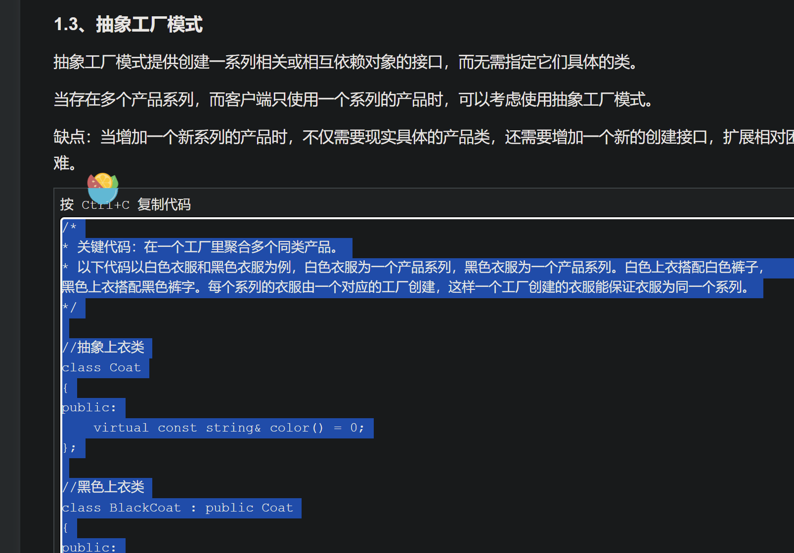
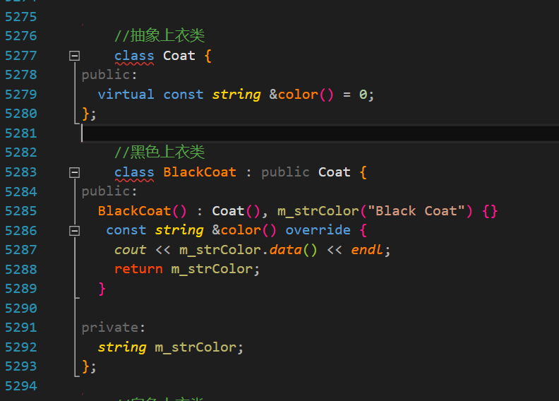
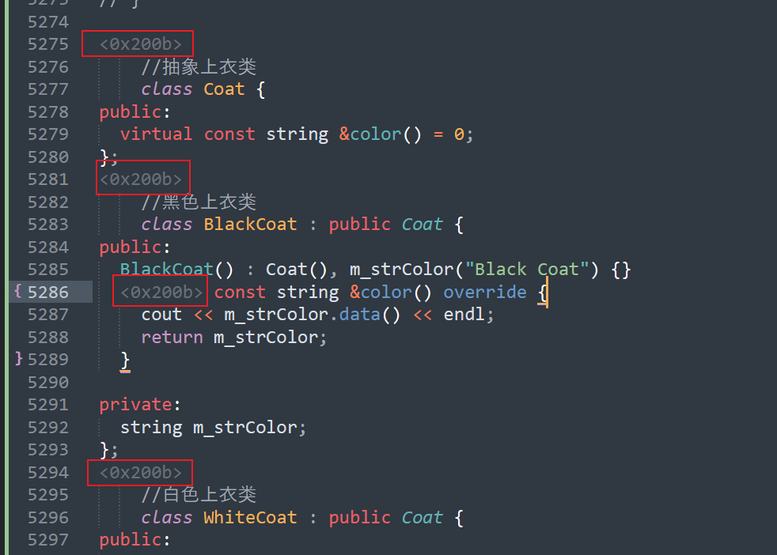

博客园拷贝代码 到 vs2015运行 竟然还能出现格式问题。。。

#### 问题如下

这样，博客园的复制 将代码拷贝到本地运行，按理说官方的推荐复制方式 应该没什么问题吧

然而拷贝过来 vs的贴心提示 ： 你该输入`;`的

好家伙 直接好家伙， 用sublime打开看看吧

删除之后 解决问题 vs是隐藏的空格 因此 只能在文本编辑器中删除

#### 总结

博客园原创多，资料好

但是 服务器崩 资源停用 md不友好也就算了 竟然还有这种乱七八糟的问题
