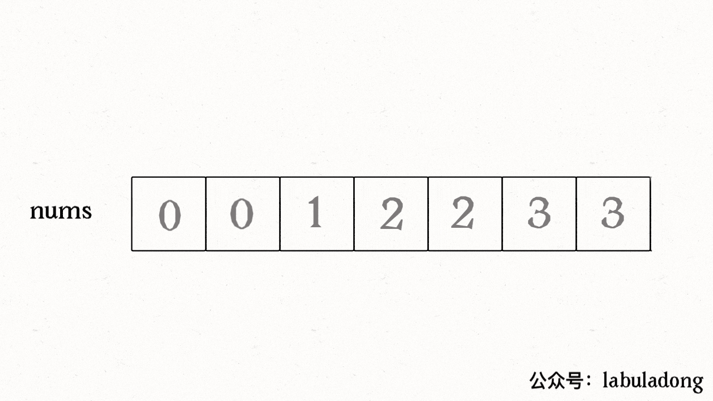
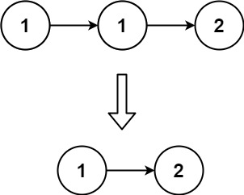
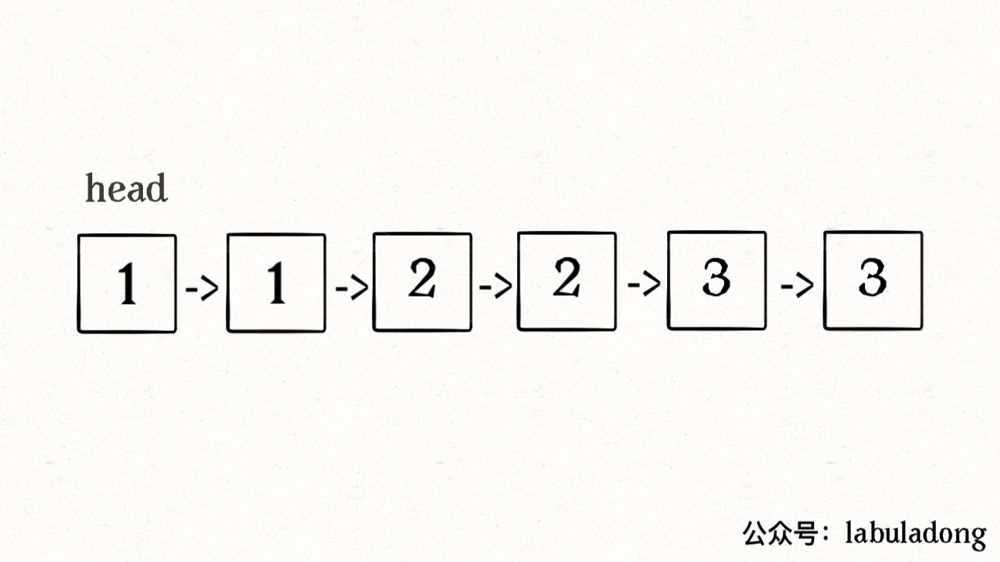
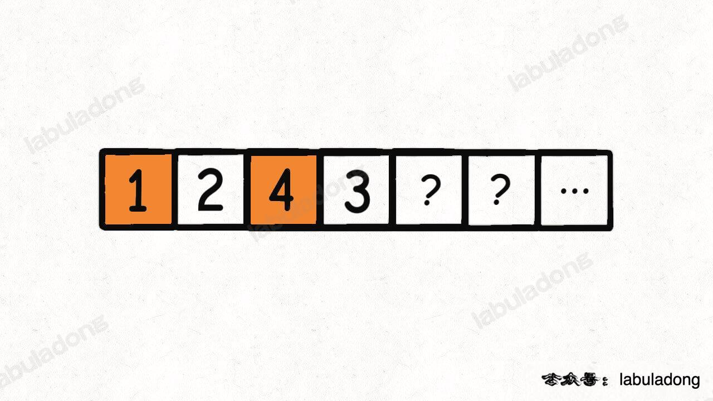

### **题目**：

- [26. 删除有序数组中的重复项 🟢](https://leetcode-cn.com/problems/remove-duplicates-from-sorted-array)
- [83. 删除排序链表中的重复元素 🟢](https://leetcode-cn.com/problems/remove-duplicates-from-sorted-list)
- [27. 移除元素 🟢](https://leetcode-cn.com/problems/remove-element)
- [283. 移动零 🟢](https://leetcode-cn.com/problems/move-zeroes)
- [167. 两数之和 II - 输入有序数组 🟢](https://leetcode-cn.com/problems/two-sum-ii-input-array-is-sorted)
- [344. 反转字符串 🟢](https://leetcode-cn.com/problems/reverse-string)

## 原地操作

##### 原地操作数组移除元素 双指针解法

注意的点是： fast每一步都要动 slow看情况动 

### [26. 删除有序数组中的重复项](https://leetcode.cn/problems/remove-duplicates-from-sorted-array/)

[labuladong 题解](https://labuladong.github.io/article/?qno=26)[思路](https://leetcode.cn/problems/remove-duplicates-from-sorted-array/#)

难度简单2662

给你一个 **升序排列** 的数组 `nums` ，请你**[ 原地](http://baike.baidu.com/item/原地算法)** 删除重复出现的元素，使每个元素 **只出现一次** ，返回删除后数组的新长度。元素的 **相对顺序** 应该保持 **一致** 。

由于在某些语言中不能改变数组的长度，所以必须将结果放在数组nums的第一部分。更规范地说，如果在删除重复项之后有 `k` 个元素，那么 `nums` 的前 `k` 个元素应该保存最终结果。

将最终结果插入 `nums` 的前 `k` 个位置后返回 `k` 。

不要使用额外的空间，你必须在 **[原地 ](https://baike.baidu.com/item/原地算法)修改输入数组** 并在使用 O(1) 额外空间的条件下完成。

**判题标准:**

系统会用下面的代码来测试你的题解:

```
int[] nums = [...]; // 输入数组
int[] expectedNums = [...]; // 长度正确的期望答案

int k = removeDuplicates(nums); // 调用

assert k == expectedNums.length;
for (int i = 0; i < k; i++) {
    assert nums[i] == expectedNums[i];
}
```

如果所有断言都通过，那么您的题解将被 **通过**。

 

**示例 1：**

```
输入：nums = [1,1,2]
输出：2, nums = [1,2,_]
解释：函数应该返回新的长度 2 ，并且原数组 nums 的前两个元素被修改为 1, 2 。不需要考虑数组中超出新长度后面的元素。
```

#### 解法



如上图

```c++
class Solution {
public:
    int removeDuplicates(vector<int>& nums) {
      int n = nums.size();
      int slow = 0, fast = 0;
      while(fast < n){
        if(nums[slow] != nums[fast]){
          slow++;
          nums[slow] = nums[fast];
        }
        fast++;
      }
      return slow+1;
    }
};
```

### [83. 删除排序链表中的重复元素](https://leetcode.cn/problems/remove-duplicates-from-sorted-list/)

[labuladong 题解](https://labuladong.github.io/article/?qno=83)[思路](https://leetcode.cn/problems/remove-duplicates-from-sorted-list/#)

难度简单797

给定一个已排序的链表的头 `head` ， *删除所有重复的元素，使每个元素只出现一次* 。返回 *已排序的链表* 。

 

**示例 1：**



```
输入：head = [1,1,2]
输出：[1,2]
```

**示例 2：**


```
输入：head = [1,1,2,3,3]
输出：[1,2,3]
```

#### 解法

如图



#### 双指针

```c++
class Solution {
public:
    ListNode* deleteDuplicates(ListNode* head) {
      if(head == nullptr) return nullptr;
      ListNode* copy = head;
      ListNode* slow = head, *fast = head;
      while(fast){
        if(slow->val != fast->val){
          slow->next = fast;
          slow = slow->next;
        }
        fast = fast->next;
      }
      slow->next = nullptr;
      return copy;
    }
};
```

#### 递归

```c++
class Solution {
public:
    ListNode* deleteDuplicates(ListNode* head) {
      //判断为空 或者单个节点 直接返回
      if(head == nullptr || head->next == nullptr)
        return head;
      //1 1 1判断与下一个与当前是否重复
      if(head->val == head->next->val){
        ListNode* temp = head->next;
        head->next = head->next->next;
        delete temp;
        head = deleteDuplicates(head);
      }else{
        head->next = deleteDuplicates(head->next);
      }
      return head;
    }
};
```


### [27. 移除元素](https://leetcode.cn/problems/remove-element/)

[labuladong 题解](https://labuladong.github.io/article/?qno=27)[思路](https://leetcode.cn/problems/remove-element/#)

难度简单1349

给你一个数组 `nums` 和一个值 `val`，你需要 **[原地](https://baike.baidu.com/item/原地算法)** 移除所有数值等于 `val` 的元素，并返回移除后数组的新长度。

不要使用额外的数组空间，你必须仅使用 `O(1)` 额外空间并 **[原地 ](https://baike.baidu.com/item/原地算法)修改输入数组**。

元素的顺序可以改变。你不需要考虑数组中超出新长度后面的元素。

**说明:**

为什么返回数值是整数，但输出的答案是数组呢?

请注意，输入数组是以**「引用」**方式传递的，这意味着在函数里修改输入数组对于调用者是可见的。

你可以想象内部操作如下:

```
// nums 是以“引用”方式传递的。也就是说，不对实参作任何拷贝
int len = removeElement(nums, val);

// 在函数里修改输入数组对于调用者是可见的。
// 根据你的函数返回的长度, 它会打印出数组中 该长度范围内 的所有元素。
for (int i = 0; i < len; i++) {
    print(nums[i]);
}
```

**示例 1：**

```
输入：nums = [3,2,2,3], val = 3
输出：2, nums = [2,2]
解释：函数应该返回新的长度 2, 并且 nums 中的前两个元素均为 2。你不需要考虑数组中超出新长度后面的元素。例如，函数返回的新长度为 2 ，而 nums = [2,2,3,3] 或 nums = [2,2,0,0]，也会被视作正确答案。
```

#### 解法

如果 `fast` 遇到需要去除的元素，则直接跳过，否则就告诉 `slow` 指针，并让 `slow` 前进一步。

```c++
class Solution {
public:
    int removeElement(vector<int>& nums, int val) {
      int n = nums.size();
      int slow = 0, fast = 0;
      while(fast < n){
        if(nums[fast] != val){
          nums[slow++] = nums[fast];
        }
        fast++;
      }
      return slow;
    }
};
```

### [283. 移动零](https://leetcode.cn/problems/move-zeroes/)

[labuladong 题解](https://labuladong.github.io/article/?qno=283)[思路](https://leetcode.cn/problems/move-zeroes/#)

难度简单1605

给定一个数组 `nums`，编写一个函数将所有 `0` 移动到数组的末尾，同时保持非零元素的相对顺序。

**请注意** ，必须在不复制数组的情况下原地对数组进行操作。

**示例 1:**

```
输入: nums = [0,1,0,3,12]
输出: [1,3,12,0,0]
```

**示例 2:**

```
输入: nums = [0]
输出: [0]
```

#### 解法

快慢指针 保证slow不为0， fast为0时交换

```c++
class Solution {
public:
    void moveZeroes(vector<int>& nums) {
      int n = nums.size();
      int slow = 0, fast = 0;
      while(fast<n){
        if(nums[fast]!=0)
          std::swap(nums[slow++], nums[fast]);
        fast++;
      }
    }
};
```

我记不住 笨比解法

```c++
class Solution {
public:
  void moveZeroes(vector<int> &nums) {
    int slow = 0, fast = 0;
    while (fast < nums.size()) {
      if (nums[slow] == 0 && nums[fast] == 0) {
        fast++;
      } else if (nums[slow] == 0 && nums[fast] != 0) {
        swap(nums[slow], nums[fast]);
        slow++;
        fast++;
      } else if (nums[slow] != 0 && nums[fast] == 0) {
        slow++;
        fast++;
      } else if (nums[slow] != 0 && nums[fast] != 0) {
        slow++;
        fast++;
      }
    }
  }
};
```


### [167. 两数之和 II - 输入有序数组](https://leetcode.cn/problems/two-sum-ii-input-array-is-sorted/)

[labuladong 题解](https://labuladong.github.io/article/?qno=167)

难度中等803

给你一个下标从 **1** 开始的整数数组 `numbers` ，该数组已按 **非递减顺序排列** ，请你从数组中找出满足相加之和等于目标数 `target` 的两个数。如果设这两个数分别是 `numbers[index1]` 和 `numbers[index2]` ，则 `1 <= index1 < index2 <= numbers.length` 。

以长度为 2 的整数数组 `[index1, index2]` 的形式返回这两个整数的下标 `index1` 和 `index2`。

你可以假设每个输入 **只对应唯一的答案** ，而且你 **不可以** 重复使用相同的元素。

你所设计的解决方案必须只使用常量级的额外空间。

**示例 1：**

```
输入：numbers = [2,7,11,15], target = 9
输出：[1,2]
解释：2 与 7 之和等于目标数 9 。因此 index1 = 1, index2 = 2 。返回 [1, 2] 。
```

**示例 2：**

```
输入：numbers = [2,3,4], target = 6
输出：[1,3]
解释：2 与 4 之和等于目标数 6 。因此 index1 = 1, index2 = 3 。返回 [1, 3] 。
```

**示例 3：**

```
输入：numbers = [-1,0], target = -1
输出：[1,2]
解释：-1 与 0 之和等于目标数 -1 。因此 index1 = 1, index2 = 2 。返回 [1, 2] 。
```

#### 代码

```c++
/*class Solution {
public:
    vector<int> twoSum(vector<int>& numbers, int target) {
        int n = numbers.size();
        vector<int> res;
        for(int i = 0; i<n; i++){
            for(int j = i+1 ; j<n; j++){
                if(numbers[i] + numbers[j] == target) 
                {
                    res.push_back(i+1);
                    res.push_back(j+1);
                    return res;
                }
            }
        }
        return res;
    }
};*/   //超时


//选定一值，二分搜索
/*class Solution{
    public:
    vector<int> twoSum(vector<int>& numbers, int target){
        int n = numbers.size();
        for(int i = 0; i< n; ++i)
        {
            int mudi = target - numbers[i];
            int low = i+1, high = n-1;
            while(low<= high){
                int mid = (high- low)/2 +low;
                if(mudi == numbers[mid])
                {
                    return {i+1, mid+1};
                }
                else if(numbers[mid]> mudi){
                    high = mid -1;
                }
                else{
                    low = mid+1;
                }
                }
            }
            return {-1, -1};
    
        
    }
};*/

class Solution{
public:
    vector<int> twoSum(vector<int> &numbers, int target){
        int i = 0, n = numbers.size()-1;
        while(i<n){
            if(numbers[i] + numbers[n]< target) i++;
            else if(numbers[i]+ numbers[n] > target) n--;
            else return {i+1, n+1};
        }
        return {-1, -1};
    }
};
```

### [344. 反转字符串](https://leetcode.cn/problems/reverse-string/)

[labuladong 题解](https://labuladong.github.io/article/?qno=344)

难度简单597

编写一个函数，其作用是将输入的字符串反转过来。输入字符串以字符数组 `s` 的形式给出。

不要给另外的数组分配额外的空间，你必须**[原地](https://baike.baidu.com/item/原地算法)修改输入数组**、使用 O(1) 的额外空间解决这一问题。

**示例 1：**

```
输入：s = ["h","e","l","l","o"]
输出：["o","l","l","e","h"]
```

**示例 2：**

```
输入：s = ["H","a","n","n","a","h"]
输出：["h","a","n","n","a","H"]
```

#### 解法

```c++
class Solution {
public:
    void reverseString(vector<char>& s) {
        int n = s.size();
        int left = 0, right = n-1;
        while(left < right){
          std::swap(s[left++], s[right--]);
        }
    }
};
```


### [1089. 复写零](https://leetcode.cn/problems/duplicate-zeros/)

难度简单126

给你一个长度固定的整数数组 `arr`，请你将该数组中出现的每个零都复写一遍，并将其余的元素向右平移。

注意：请不要在超过该数组长度的位置写入元素。

要求：请对输入的数组 **就地** 进行上述修改，不要从函数返回任何东西。

 

**示例 1：**

```
输入：[1,0,2,3,0,4,5,0]
输出：null
解释：调用函数后，输入的数组将被修改为：[1,0,0,2,3,0,0,4]
```

**示例 2：**

```
输入：[1,2,3]
输出：null
解释：调用函数后，输入的数组将被修改为：[1,2,3]
```

#### 原地

```c++
class Solution {
public:
    void duplicateZeros(vector<int>& arr) {
        int left = 0;
        int right = 0;
        for(int i = 0; i <arr.size(); i++){
            if(arr[i] ==0 ){
                for(int j = arr.size()-1; j>i; j--)
                    arr[j] = arr[j-1];
                i++;
            }
        }
    }
};

class Solution {
public:
    void duplicateZeros(vector<int>& nums) {
      int n = nums.size();
      for(int i = 0; i<n; i++){
        if(nums[i] == 0){
          nums.insert(nums.begin() + i, 0);
          i++;
        }
      }
      nums.resize(n);
    }
};
```


### [剑指 Offer 21. 调整数组顺序使奇数位于偶数前面](https://leetcode.cn/problems/diao-zheng-shu-zu-shun-xu-shi-qi-shu-wei-yu-ou-shu-qian-mian-lcof/)

[思路](https://leetcode.cn/problems/diao-zheng-shu-zu-shun-xu-shi-qi-shu-wei-yu-ou-shu-qian-mian-lcof/#)

难度简单252收藏分享切换为英文接收动态反馈

输入一个整数数组，实现一个函数来调整该数组中数字的顺序，使得所有奇数在数组的前半部分，所有偶数在数组的后半部分。

 

**示例：**

```
输入：nums = [1,2,3,4]
输出：[1,3,2,4] 
注：[3,1,2,4] 也是正确的答案之一。
```

```c++
class Solution {
public:
    vector<int> exchange(vector<int>& nums) {
      int n = nums.size();
      int slow = 0, fast = n-1;
      while(slow < fast){
        while(slow < fast && nums[slow]%2){
          slow++;
        }
        while(slow < fast && nums[fast] %2 == 0){
          fast--;
        }
        swap(nums[slow], nums[fast]);
      }
      return nums;
    }
};


class Solution {
    public int[] exchange(int[] nums) {
        // 维护 nums[0..slow) 都是奇数
        int fast = 0, slow = 0;
        while (fast < nums.length) {
            if (nums[fast] % 2 == 1) {
                // fast 遇到奇数，把 nums[fast] 换到 nums[slow]
                int temp = nums[slow];
                nums[slow] = nums[fast];
                nums[fast] = temp;
                slow++;
            }
            fast++;
        }
        return nums;
    }
}
```


## 经典双指针

### [剑指 Offer II 007. 数组中和为 0 的三个数](https://leetcode-cn.com/problems/1fGaJU/)

难度中等50收藏分享切换为英文接收动态反馈英文版讨论区

给定一个包含 `n` 个整数的数组 `nums`，判断 `nums` 中是否存在三个元素 `a` ，`b` ，`c` *，*使得 `a + b + c = 0` ？请找出所有和为 `0` 且 **不重复** 的三元组。

 

**示例 1：**

```
输入：nums = [-1,0,1,2,-1,-4]
输出：[[-1,-1,2],[-1,0,1]]
```

**示例 2：**

```
输入：nums = []
输出：[]
```

**示例 3：**

```
输入：nums = [0]
输出：[]
```

#### 思路

1. 遍历起始点 然后双指针遍历
2. 注意 去重去重 每一个数 都需要去重



#### 代码

```c++
class Solution {
public:
    vector<vector<int>> threeSum(vector<int>& nums) {
        int n = nums.size();
        if(n<3 || n == 0) return {}; //特判
        sort(nums.begin(), nums.end());
        vector<vector<int>> ans;

        //遍历 然后双指针
        for(int i = 0; i < n; i++){
            if(nums[i]>0) break; //剪枝
            if(i>0 && nums[i] == nums[i-1]) continue; //去重
            int left = i+1;
            int right = n-1;
            //注意 这里并不是二分判定 而是双指针
            while(left < right){ 
                int sum = nums[i] + nums[left] + nums[right];
                if(sum > 0){
                    right--;
                }else if(sum<0){
                    left++;
                }else{
                    ans.push_back({nums[i], nums[left], nums[right]});
                    //很重要的去重
                    while(left<right && nums[left] == nums[left+1]) left++;
                    while(left<right && nums[right] == nums[right-1]) right--;
                    left++;right--;
                }
            }
        }
        return ans;
    }
};
```

### [11. 盛最多水的容器](https://leetcode.cn/problems/container-with-most-water/)

[labuladong 题解](https://labuladong.github.io/article/?qno=11)[思路](https://leetcode.cn/problems/container-with-most-water/#)

难度中等3553

给定一个长度为 `n` 的整数数组 `height` 。有 `n` 条垂线，第 `i` 条线的两个端点是 `(i, 0)` 和 `(i, height[i])` 。

找出其中的两条线，使得它们与 `x` 轴共同构成的容器可以容纳最多的水。

返回容器可以储存的最大水量。

**说明：**你不能倾斜容器。

 

**示例 1：**


```
输入：[1,8,6,2,5,4,8,3,7]
输出：49 
解释：图中垂直线代表输入数组 [1,8,6,2,5,4,8,3,7]。在此情况下，容器能够容纳水（表示为蓝色部分）的最大值为 49。
```

#### 两侧开始的双指针

最重要的是 指针移动的逻辑 记录了当前窗口了 就移动高度小的那一方

```c++
class Solution {
public:
    int maxArea(vector<int>& nums) {
      int left = 0, right = nums.size() -1;
      int ans = 0;
      while(left <right){
        int temp = (right-left)*min(nums[left], nums[right]);
        ans = max(ans, temp);
        if(nums[left] > nums[right])
          right--;
        else left++;
      }
      return ans;
    }
};
```

### [881. 救生艇](https://leetcode.cn/problems/boats-to-save-people/)

难度中等235

给定数组 `people` 。`people[i]`表示第 `i` 个人的体重 ，**船的数量不限**，每艘船可以承载的最大重量为 `limit`。

每艘船最多可同时载两人，但条件是这些人的重量之和最多为 `limit`。

返回 *承载所有人所需的最小船数* 。

 

**示例 1：**

```
输入：people = [1,2], limit = 3
输出：1
解释：1 艘船载 (1, 2)
```

**示例 2：**

```
输入：people = [3,2,2,1], limit = 3
输出：3
解释：3 艘船分别载 (1, 2), (2) 和 (3)
```

**示例 3：**

```
输入：people = [3,5,3,4], limit = 5
输出：4
解释：4 艘船分别载 (3), (3), (4), (5)
```

#### 解法

最主要的是 贪心的理解 为什么要这样贪心

```c++
class Solution {
public:
    //当前最轻和最重的 加起来都比船的载重小，那么再怎么拼都是有载重的浪费的 
    //所以没必要凑最接近载重的组合 因为凑了之后就会出现远离载重的组合 需要的船数并没有减少
    int numRescueBoats(vector<int>& nums, int limit) {
      sort(nums.begin(), nums.end());
      int left = 0, right = nums.size() - 1;
      int ans = 0;
      while(left <= right){
        if(left == right){
          ans++; //只剩下最后一个,直接一个走,结束
          break;
        }
        int a = nums[left], b = nums[right];
        if(a+b>limit){
          right--;
          ans++;
        }else if(a+b <=limit){
          right--;
          left++;
          ans++;
        }
      }
      return ans;
    }
};
```
