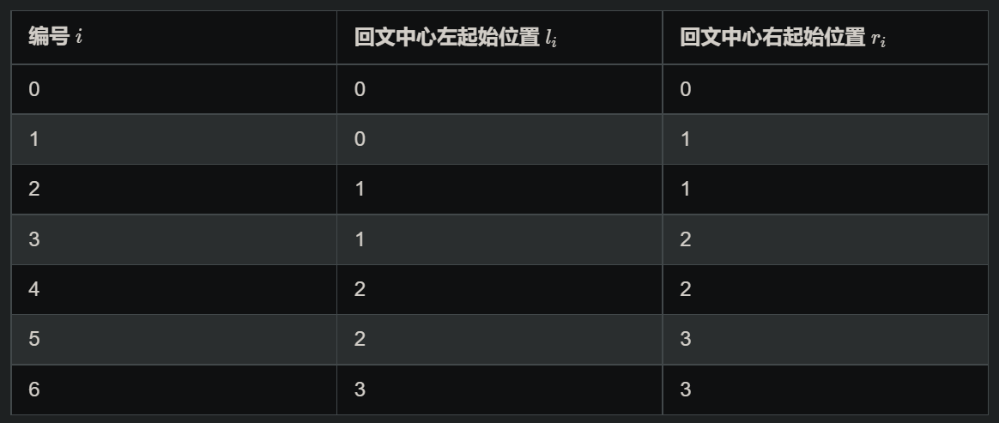
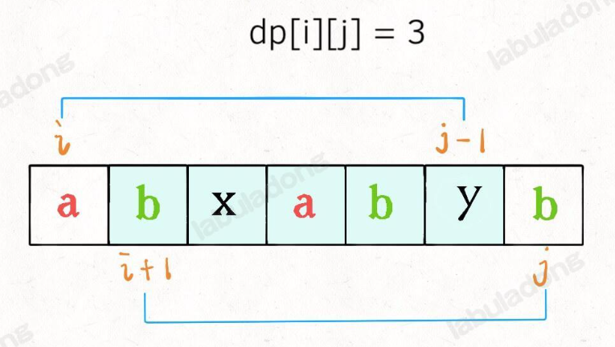

### [剑指 Offer II 018. 有效的回文](https://leetcode-cn.com/problems/XltzEq/)

难度简单18

给定一个字符串 `s` ，验证 `s` 是否是 **回文串** ，只考虑字母和数字字符，可以忽略字母的大小写。

本题中，将空字符串定义为有效的 **回文串** 。

 

**示例 1:**

```
输入: s = "A man, a plan, a canal: Panama"
输出: true
解释："amanaplanacanalpanama" 是回文串
```

**示例 2:**

```
输入: s = "race a car"
输出: false
解释："raceacar" 不是回文串
```

#### 思路

1. 开辟新string 判断是否回文
2. 原地判断 一次遍历

#### 开辟新string 判断是否回文

```c++
class Solution {
public:
    bool isPalindrome(string s) {
      if(s.size() == 0) return 1;
      string ss;
      for(auto& ch : s)
        if(isalpha(ch) || isdigit(ch))
          ss += isalpha(ch) ? tolower(ch) : ch;
      int left = 0, right = ss.size()-1;
      while(left < right){
        if(ss[left++] != ss[right--])
          return 0;
      }
      return 1;
    }
};
```

#### 原地判断 一次遍历

```c++

class Solution {
public:
    bool isPalindrome(string s) {
        int left = 0, right = s.size()-1;
        while(left<right){
            while(left<s.size() && !isValid(s[left])){
                left++;
            }
            while(right>=0 && !isValid(s[right])){
                right--;
            }
            //越界 为空 直接返回1
            if(left>=s.size()|| right<0) return 1;
            if(tolower(s[left]) != tolower(s[right]))
                return 0;
            left++;
            right--;
        }
        return 1;
    }
    bool isValid(char& ch){
        if(tolower(ch)>='a' && tolower(ch)<='z'  ||(ch>='0' &&ch<='9'))
            return 1;
        return 0;
    }
};
```

#### 官方解法

`函数 isalnum()判断是否是字母或者数字`

```c++
class Solution {
public:
    bool isPalindrome(string s) {
        int n = s.size();
        int left = 0, right = n - 1;
        while (left < right) {
            while (left < right && !isalnum(s[left])) {
                ++left;
            }
            while (left < right && !isalnum(s[right])) {
                --right;
            }
            if (left < right) {
                if (tolower(s[left]) != tolower(s[right])) {
                    return false;
                }
                ++left;
                --right;
            }
        }
        return true;
    }
};
```


### [剑指 Offer II 027. 回文链表](https://leetcode-cn.com/problems/aMhZSa/)

难度简单42

给定一个链表的 **头节点** `head` **，**请判断其是否为回文链表。

如果一个链表是回文，那么链表节点序列从前往后看和从后往前看是相同的。

 

**示例 1：**

****

```
输入: head = [1,2,3,3,2,1]
输出: true
```

**示例 2：**

****

```
输入: head = [1,2]
输出: false
```

#### 思路

1. 笨比vector
2. 快慢指针 反转一半

#### 代码

```c++
class Solution {
public:
    bool isPalindrome(ListNode* head) {
        vector<int> nums;
        while(head){
            nums.push_back(head->val);
            head = head->next;
        }
        return isPalindrome(nums);
    }

    bool isPalindrome(vector<int>& nums) {
        int left = 0, right = nums.size()-1;
        while(left<right){
            if(nums[left]!=nums[right])
                return 0;
            left++;
            right--;
        }
        return 1;
    }

};
```

快慢指针 反转一半

```c++
class Solution {
public:
    ListNode* reverseList(ListNode* head){
        if(head == nullptr || head->next == nullptr)
            return head;
        ListNode* last = reverseList(head->next);
        head->next->next = head;
        head->next = nullptr;
        return last;
    }
		//奇数中间 偶数前面最后一个
    ListNode* findMiddleOfList(ListNode* head){
        ListNode* slow = head;
        ListNode* fast = head;
        ListNode* preSlow;
        while(fast && fast->next){
            preSlow = slow;
            slow = slow->next;
            fast = fast->next->next;
        }
        return fast == nullptr?preSlow:slow;
    }

    bool isPalindrome(ListNode* head) {
        ListNode* middle = findMiddleOfList(head);
        ListNode* secondBegin = middle->next;
        middle->next = nullptr;
        secondBegin = reverseList(secondBegin);
        ListNode* firstBegin = head;

        ListNode* cpySecondBegin = secondBegin;

        bool ans = 1;
        while(firstBegin && secondBegin){
            if(firstBegin->val!= secondBegin->val){
                ans = 0;
                break;
            }
            firstBegin = firstBegin->next;
            secondBegin = secondBegin->next;
        }

        //还原链表
        secondBegin = reverseList(cpySecondBegin);
        middle->next = secondBegin;

        return ans;
    }
};
```

### [9. 回文数](https://leetcode-cn.com/problems/palindrome-number/)

难度简单1921

给你一个整数 `x` ，如果 `x` 是一个回文整数，返回 `true` ；否则，返回 `false` 。

回文数是指正序（从左向右）和倒序（从右向左）读都是一样的整数。

- 例如，`121` 是回文，而 `123` 不是。

 

**示例 1：**

```
输入：x = 121
输出：true
```

**示例 2：**

```
输入：x = -121
输出：false
解释：从左向右读, 为 -121 。 从右向左读, 为 121- 。因此它不是一个回文数。
```

**进阶：**你能不将整数转为字符串来解决这个问题吗？

#### 思路

1. 难点在于不转换为字符串或者数组
2. 反转一半 反转后的数字为大半 剩余的为小半

#### 代码

```c++
class Solution {
public:
    bool isPalindrome(int x) {
        // 特殊情况：
        // 如上所述，当 x < 0 时，x 不是回文数。
        // 同样地，如果数字的最后一位是 0，为了使该数字为回文，
        // 则其第一位数字也应该是 0
        // 只有 0 满足这一属性
        if (x < 0 || (x % 10 == 0 && x != 0)) {
            return false;
        }

        int revertedNumber = 0;
        while (x > revertedNumber) {
            revertedNumber = revertedNumber * 10 + x % 10;
            x /= 10;
        }

        // 当数字长度为奇数时，我们可以通过 revertedNumber/10 去除处于中位的数字。
        // 例如，当输入为 12321 时，在 while 循环的末尾我们可以得到 x = 12，revertedNumber = 123，
        // 由于处于中位的数字不影响回文（它总是与自己相等），所以我们可以简单地将其去除。
        return x == revertedNumber || x == revertedNumber / 10;
    }
};
```

### [面试题 01.04. 回文排列](https://leetcode-cn.com/problems/palindrome-permutation-lcci/)

难度简单78英文版讨论区

给定一个字符串，编写一个函数判定其是否为某个回文串的排列之一。

回文串是指正反两个方向都一样的单词或短语。排列是指字母的重新排列。

回文串不一定是字典当中的单词。

 

**示例1：**

```
输入："tactcoa"
输出：true（排列有"tacocat"、"atcocta"，等等）
```

#### 思路

用到回文一个性质 奇数个数的元素 只可能存在一个 或 0个

#### 代码

```c++
class Solution {
public:
    bool canPermutePalindrome(string s) {
        unordered_map<int, int> mapp;
        int oddCount = 0;
        for(char ch:s)
            mapp[ch]++;
        for(auto it = mapp.begin(); it!=mapp.end(); it++){
            if(it->second%2)
                oddCount++;
            if(oddCount>1)
                return false;
        }
        return 1;
    }
};
```

### [剑指 Offer II 019. 最多删除一个字符得到回文](https://leetcode-cn.com/problems/RQku0D/)

难度简单28英文版讨论区

给定一个非空字符串 `s`，请判断如果 **最多** 从字符串中删除一个字符能否得到一个回文字符串。

 

**示例 1:**

```
输入: s = "aba"
输出: true
```

**示例 2:**

```
输入: s = "abca"
输出: true
解释: 可以删除 "c" 字符 或者 "b" 字符
```

**示例 3:**

```
输入: s = "abc"
输出: false
```

#### 思路

不等的时候 判断两次字串

#### 代码

```c++
class Solution {
public:
    bool validPalindrome(string s) {
        bool ans = 0;
        int left = 0, right = s.size()-1;
        while(left < right){
            if(s[left] != s[right]){
                //cout<<s.substr(left + 1, right-left)<<endl;
                //cout<<s.substr(left, right-left)<<endl;
                return isPalidromee(s.substr(left + 1, right-left)) || 
                isPalidromee(s.substr(left, right-left));
                //return isPalidrome(s, left) || isPalidrome(s, right);
            }
            left++;
            right--;
        }
        return 1;
    }

    bool isPalidrome(string& s, int pos){
        int left = 0, right = s.size()-1;
        while(left<right){
            if(left == pos || right == pos){
                if(left == pos)
                    left++;
                else right--;
            }
            if(s[left] != s[right]){
                return 0;
            }
            left++;
            right--;
        }
        return 1;
    }

    bool isPalidromee(string s){
        int left = 0, right = s.size()-1;
        while(left < right){
            if(s[left] != s[right])
                return 0;
            left++;
            right--;
        }
        return 1;
    }
};
```

### [866. 回文素数](https://leetcode-cn.com/problems/prime-palindrome/) 构造回文数

难度中等77英文版讨论区

求出大于或等于 `N` 的最小回文素数。

回顾一下，如果一个数大于 1，且其因数只有 1 和它自身，那么这个数是*素数*。

例如，2，3，5，7，11 以及 13 是素数。

回顾一下，如果一个数从左往右读与从右往左读是一样的，那么这个数是*回文数。*

例如，12321 是回文数。

 

**示例 1：**

```
输入：6
输出：7
```

**示例 2：**

```
输入：8
输出：11
```

**示例 3：**

```
输入：13
输出：101
```

#### 思路

枚举所有回文数, 并判断是否为质数;
模拟回文数的方法, 计算回文根, 再生成回文数;
举例: 回文根为123, 可以构成的回文数为12321, 123321; 

>left - right 1-10 一次while生成的回文数 1-9 和11 22 33 44 55...99
>
>left - right 10-100 一次while生成的回文数 101 111 121 131...999 和 1001 1111 1221 1331...9999
>
>......

#### 代码

```c++
class Solution {
public:
    bool isPrim(int x) { /* 质数判断 */
        if (x == 1) {
            return false;
        }
        for (int i = 2; i <= sqrt(x); i++) {
            if (x % i == 0) {
                return false;
            }
        }
        return true;
    }

    //重点函数 背一下
    int primePalindrome(int n) {
        int left = 1;
        while (1) {
            int right = left * 10;
            for (int op = 0; op < 2; op++) {
                for (int i = left; i < right; i++) {
                    int sum = i;
                    int x = (op == 0) ? i / 10 : i;
                    while (x > 0) { /* 构造回文数 */
                        sum = sum * 10 + x % 10;
                        x /= 10;
                    }
                    if (sum >= n && isPrim(sum)) { /* 判断是否>=n且为质数 */
                        return sum;
                    }
                }
            }
            left = right;
        }
        return 1;
    }
};
```

### [剑指 Offer II 020. 回文子字符串的个数](https://leetcode-cn.com/problems/a7VOhD/)

难度中等40

给定一个字符串 `s` ，请计算这个字符串中有多少个回文子字符串。

具有不同开始位置或结束位置的子串，即使是由相同的字符组成，也会被视作不同的子串。

 

**示例 1：**

```
输入：s = "abc"
输出：3
解释：三个回文子串: "a", "b", "c"
```

**示例 2：**

```
输入：s = "aaa"
输出：6
解释：6个回文子串: "a", "a", "a", "aa", "aa", "aaa"
```

#### 思路

1. 假设size = 4 一个循环解决回文中心奇数 偶数两种情况



2. 马拉车算法，我选择放弃[有什么浅显易懂的Manacher Algorithm讲解？ - 知乎 (zhihu.com)](https://www.zhihu.com/question/37289584)

#### 代码

```c++
//一次
class Solution {
public:
    int countSubstrings(string s) {
        int ans = 0;
        for(int i = 0; i<s.size()*2-1; i++){
            int left = i/2, right = left + i%2;
            while(left>=0 && right<s.size()){
                if(s[left] == s[right])
                    ans++;
                else break;
                left--;
                right++;
            }
        }
        return ans;
    }
};

//两次好理解
class Solution {
public:
    int countSubstrings(string s) {
        int ans = 0;
        for(int i = 0; i<s.size(); i++){
            int left = i, right = i;
            while(left>=0 && right<s.size()){
                if(s[left] == s[right])
                    ans++;
                else break;
                left--;
                right++;
            }

            left = i, right = i+1;
            while(left>=0 && right<s.size()){
                if(s[left] == s[right])
                    ans++;
                else break;
                left--;
                right++;
            }
        }
        return ans;
    }
};

//马拉车算法
class Solution {
public:
    int countSubstrings(string s) {
        int n = s.size();
        string t = "$#";
        for (const char &c: s) {
            t += c;
            t += '#';
        }
        n = t.size();
        t += '!';

        auto f = vector <int> (n);
        int iMax = 0, rMax = 0, ans = 0;
        for (int i = 1; i < n; ++i) {
            // 初始化 f[i]
            f[i] = (i <= rMax) ? min(rMax - i + 1, f[2 * iMax - i]) : 1;
            // 中心拓展
            while (t[i + f[i]] == t[i - f[i]]) ++f[i];
            // 动态维护 iMax 和 rMax
            if (i + f[i] - 1 > rMax) {
                iMax = i;
                rMax = i + f[i] - 1;
            }
            // 统计答案, 当前贡献为 (f[i] - 1) / 2 上取整
            ans += (f[i] / 2);
        }

        return ans;
    }
};
```

### [5. 最长回文子串](https://leetcode-cn.com/problems/longest-palindromic-substring/)

[labuladong 题解](https://labuladong.github.io/article/?qno=5)[思路](https://leetcode-cn.com/problems/longest-palindromic-substring/#)

难度中等5101

给你一个字符串 `s`，找到 `s` 中最长的回文子串。

 

**示例 1：**

```
输入：s = "babad"
输出："bab"
解释："aba" 同样是符合题意的答案。
```

**示例 2：**

```
输入：s = "cbbd"
输出："bb"
```

#### 思路

中心扩展 直接返回string还好操作一点 

返回左右下标 节省空间 

#### 代码

```c++
class Solution {
public:
    string expandCenter(string& s, int left, int right){
      while(left>= 0 && right<s.size() && s[left] == s[right]){
        left--;
        right++;
      }
      return s.substr(left + 1, right - 1 - left); //right - 1 - (left + 1) - 1
    }
    string longestPalindrome(string s) {
      string ans;
      for(int i = 0; i<s.size(); i++){
        string p1 = expandCenter(s, i, i);
        string p2 = expandCenter(s, i, i+1);
        ans = ans.size()<p1.size()?p1:ans;
        ans = ans.size()<p2.size()?p2:ans;
      }
      return ans;
    }
};


class Solution {
public:
    pair<int,int> expandFromCenter(const string& s, int l, int r){
        while(l>=0 && r<s.size() && s[l] == s[r]){
            l--;
            r++;
        }
        return {l+1, r-1};
    }
    string longestPalindrome(string s) {
        int start = 0; 
        int end  = 0;
        for(int i = 0; i<s.size()-1; i++){
            auto [l1, r1] = expandFromCenter(s, i,i);
            auto [l2, r2] = expandFromCenter(s, i,i+1);
            if(r1-l1>end-start){
                end = r1;
                start = l1;
            }
            if(r2-l2>end-start){
                end = r2;
                start = l2;
            }
        }
        return s.substr(start, end-start +1);
    }
};
```

### [131. 分割回文串](https://leetcode-cn.com/problems/palindrome-partitioning/)

难度中等1089

给你一个字符串 `s`，请你将 `s` 分割成一些子串，使每个子串都是 **回文串** 。返回 `s` 所有可能的分割方案。

**回文串** 是正着读和反着读都一样的字符串。

 

**示例 1：**

```
输入：s = "aab"
输出：[["a","a","b"],["aa","b"]]
```

**示例 2：**

```
输入：s = "a"
输出：[["a"]]
```

#### 思路

回溯，检测每个字串是否是回文 回文的话压入path 否则跳过

#### 代码

```c++
class Solution {
public:
    vector<vector<string>> ans;
    vector<string> path;
    vector<vector<string>> partition(string s) {
      backtrack(s, 0);
      return ans;
    }

    void backtrack(string& s, int startIndex){
      if(startIndex>=s.size()){
        ans.push_back(path);
        return;
      }

      for(int i = startIndex; i<s.size(); i++){
        if(isP(s, startIndex, i))
          path.push_back(s.substr(startIndex, i-startIndex + 1));
        else continue;
        backtrack(s, i+1);
        path.pop_back();
      }
    }

    bool isP(string& s, int left, int right){
      while(left < right){
        if(s[left] != s[right])
          return 0;
        left++;
        right--;
      }
      return 1;
    }
};
```

优化回文的判断 存储f[ i ] [ j] = 0 表示未搜索，1 表示是回文串，-1 表示不是回文串  记忆化搜索

```c++
    vector<vector<int>> f;
		// 记忆化搜索中，f[i][j] = 0 表示未搜索，1 表示是回文串，-1 表示不是回文串
    int isP(string& s, int left, int right){
      if(f[left][right] != 0)
        return f[left][right];
      if(left >= right){
        //赋值 并返回1
        return f[left][right]  = 1;
      }
      return f[left][right] = (s[left] == s[right]? isP(s,  left+1, right-1) : -1);
    }
```


### `回文子序列问题`

回文子序列问题 涉及到 `dp` `回文`

更多的是`dp`

### [516. 最长回文子序列](https://leetcode-cn.com/problems/longest-palindromic-subsequence/)

[labuladong 题解](https://labuladong.github.io/article/?qno=516)[思路](https://leetcode-cn.com/problems/longest-palindromic-subsequence/#)

难度中等777

给你一个字符串 `s` ，找出其中最长的回文子序列，并返回该序列的长度。

子序列定义为：不改变剩余字符顺序的情况下，删除某些字符或者不删除任何字符形成的一个序列。

**示例 1：**

```
输入：s = "bbbab"
输出：4
解释：一个可能的最长回文子序列为 "bbbb" 。
```

**示例 2：**

```
输入：s = "cbbd"
输出：2
解释：一个可能的最长回文子序列为 "bb" 。
```

##### dp

dp数组含义：dpij表示 i到j下标的字串的最大回文子序列的长度

basecase：对角线位置 也就是 单个字符的dpii为1

状态转移方程：

	1. si == sj dpij由内部扩展+2
 	2. si != sj dpij取两个情况的dp最大值



```c++
class Solution {
public:
    int longestPalindromeSubseq(string s) {
      int n = s.size();
      //dpij表示 ij范围内字串的最大回文长度
      vector<vector<int>> dp(n, vector<int>(n));
      for(int i = 0; i<n; i++)
        dp[i][i] = 1;
      //注意理解一下i为什么反向
      //因为状态转移方程是i从i+1转移而来的
      for(int i = n-1; i>=0; i--){
        for(int j = i+1; j<n; j++){
          // 它俩一定在最长回文子序列中
          if(s[j] == s[i])
            dp[i][j] = dp[i+1][j-1]+2;
          else
            dp[i][j] = max(dp[i+1][j], dp[i][j-1]);
        }
      }
      return dp[0][n-1];
    }
};
```

### [730. 统计不同回文子序列 的个数](https://leetcode.cn/problems/count-different-palindromic-subsequences/)

难度困难197

给定一个字符串 s，返回 *`s` 中不同的非空「回文子序列」个数 。*

通过从 s 中删除 0 个或多个字符来获得子序列。

如果一个字符序列与它反转后的字符序列一致，那么它是「回文字符序列」。

如果有某个 `i` , 满足 `ai != bi` ，则两个序列 `a1, a2, ...` 和 `b1, b2, ...` 不同。

**注意：**

- 结果可能很大，你需要对 10^9^ + 7 取模 。

**示例 1：**

```
输入：s = 'bccb'
输出：6
解释：6 个不同的非空回文子字符序列分别为：'b', 'c', 'bb', 'cc', 'bcb', 'bccb'。
注意：'bcb' 虽然出现两次但仅计数一次。
```

**示例 2：**

```
输入：s = 'abcdabcdabcdabcdabcdabcdabcdabcddcbadcbadcbadcbadcbadcbadcbadcba'
输出：104860361
解释：共有 3104860382 个不同的非空回文子序列，104860361 对 109 + 7 取模后的值。
```

#### 暴力回溯

emmm 手写的用例可以过 提交一个都过不了

```c++
class Solution {
public:
    const int Mod = pow(10, 9) + 7;
    vector<string> ans;
    unordered_set<string> sett;
    string path;
    int countPalindromicSubsequences(string s) {
      backtrack(s, 0);
      return ans.size()%Mod;
    }

    void backtrack(string& s, int startIndex){
      if(startIndex == s.size())  return;

      for(int i = startIndex; i<s.size(); i++){
        path+=s[i];
        if(!sett.count(path) && isP(path)){
          ans.push_back(path);
          cout<<path<<endl;
          sett.insert(path);
        }
        backtrack(s, i+1);
        path.pop_back();
      }
    }

    bool isP(const string& s){
      int left = 0, right = s.size()-1;
      while(left < right){
        if(s[left++] != s[right--])
          return 0;
      }
      return 1;
    }
};
```

#### dp

```c++
class Solution {
public:
  int countPalindromicSubsequences(string S) {
    int strSize = S.size(), M = 1e9 + 7;
    // dp[i][j]表示的S[i, j]这段字符串中不同的回文子序列个数
    vector<vector<int>> dp(strSize, vector<int>(strSize, 0));
    //初始化，当个长度的字符串也是一个结果
    for (int i = 0; i < strSize; ++i) {
      dp[i][i] = 1;
    }
    //开始动态规划
    for (int i = strSize - 2; i >= 0; --i) {
      for (int j = i + 1; j < strSize; ++j) {
        //上面的两层for循环用于穷举区间[i,
        //j]，i用于确定区间的起点，j确定区间的尾端，并且区间的长度都是由2逐渐增大
        if (S[i] == S[j]) {
          // left用于寻找与S[i]相同的左端第一个下标，right用于寻找与S[i]相同的右端第一个下标
          int left = i + 1, right = j - 1;
          while (left <= right && S[left] != S[i]) {
            ++left;
          }
          while (left <= right && S[right] != S[i]) {
            --right;
          }
          if (left > right) {
            //中间没有和S[i]相同的字母，例如"aba"这种情况
            //其中dp[i + 1][j -
            //1]是中间部分的回文子序列个数，因为中间的所有子序列可以单独存在，也可以再外面包裹上字母a，所以是成对出现的，要乘2。
            //加2的原因是外层的"a"和"aa"也要统计上
            dp[i][j] = dp[i + 1][j - 1] * 2 + 2;
          } else if (left == right) {
            //中间只有一个和S[i]相同的字母，就是"aaa"这种情况，
            //其中乘2的部分跟上面的原因相同，
            //加1的原因是单个字母"a"的情况已经在中间部分算过了，外层就只能再加上个"aa"了。
            dp[i][j] = dp[i + 1][j - 1] * 2 + 1;
          } else {
            //中间至少有两个和S[i]相同的字母，就是"aabaa"这种情况，
            //其中乘2的部分跟上面的原因相同，要减去left和right中间部分的子序列个数的原因是其被计算了两遍，要将多余的减掉。
            dp[i][j] = dp[i + 1][j - 1] * 2 - dp[left + 1][right - 1];
          }
        } else {
          // dp[i][j - 1] + dp[i + 1][j]这里计算了dp[i + 1][j - 1]两遍
          dp[i][j] = dp[i][j - 1] + dp[i + 1][j] - dp[i + 1][j - 1];
        }
        dp[i][j] = (dp[i][j] < 0) ? dp[i][j] + M : dp[i][j] % M;
      }
    }
    return dp[0][strSize - 1];
  }
};
```


### [1312. 让字符串成为回文串的最少插入次数](https://leetcode.cn/problems/minimum-insertion-steps-to-make-a-string-palindrome/)

[labuladong 题解](https://labuladong.github.io/article/?qno=1312)

难度困难146

给你一个字符串 `s` ，每一次操作你都可以在字符串的任意位置插入任意字符。

请你返回让 `s` 成为回文串的 **最少操作次数** 。

「回文串」是正读和反读都相同的字符串。

**示例 1：**

```
输入：s = "zzazz"
输出：0
解释：字符串 "zzazz" 已经是回文串了，所以不需要做任何插入操作。
```

**示例 2：**

```
输入：s = "mbadm"
输出：2
解释：字符串可变为 "mbdadbm" 或者 "mdbabdm" 。
```

**示例 3：**

```
输入：s = "leetcode"
输出：5
解释：插入 5 个字符后字符串变为 "leetcodocteel" 。
```
