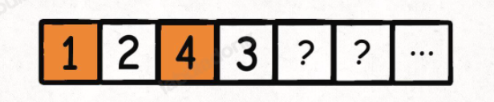
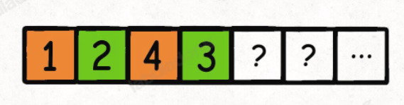
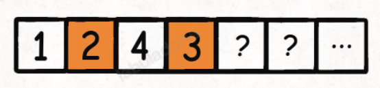
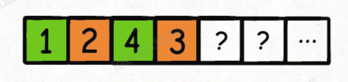
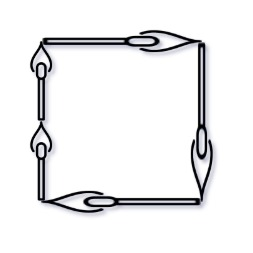

# 回溯

### 回溯模板

```c++
void backtracking(参数) {
    if (终止条件) {
        存放结果;
        return;
    }

    for (选择：本层集合中元素（树中节点孩子的数量就是集合的大小）) {
        处理节点;
        backtracking(路径，选择列表); // 递归
        回溯，撤销处理结果
    }
}
```

## 1. 组合问题

1. 组合问题 ==每次for都是从startIndex开始==
2. 每个元素 用一次和用多次体现在 ==backtrack(i+1)==用一次还是==backtrack(i)用多次==上
3. 组合问题==不需要used数组==，去重也不需要used数组那个判断

### [77. n元素下的k元素组合](https://leetcode-cn.com/problems/combinations/)

给定两个整数 `n` 和 `k`，返回范围 `[1, n]` 中所有可能的 `k` 个数的组合。

你可以按 **任何顺序** 返回答案。

**示例 1：**

```
输入：n = 4, k = 2
输出：
[
  [2,4],
  [3,4],
  [2,3],
  [1,2],
  [1,3],
  [1,4],
]
```

**示例 2：**

```
输入：n = 1, k = 1
输出：[[1]]
```

##### 思路

1. 按回溯模板 直接写 
2. 注意剪枝操作， 超过k个元素不再进入递归 24ms->8ms

##### 代码

```c++
class Solution {
public:
  int n;
  int k;
  vector<int> path;
  vector<vector<int>> all;
  
  vector<vector<int>> combine(int n, int k) {
    this->n = n;
    this->k = k;
    path.clear();
    all.clear();
    backtrack(1);
    return all;
  }
  
  void backtrack(int num){
    if(path.size() == k){
      all.push_back(path);
      return;
    }
    //进行剪枝， 超过k个元素不再进入递归 24ms->8ms
    for(int i = num; i<=n - (k-path.size()) + 1; i++){
      path.push_back(i);
      backtrack(i+1);
      path.pop_back();
    }
  }
};
```

### [39. 组合总和](https://leetcode-cn.com/problems/combination-sum/)

给你一个 **无重复元素** 的整数数组 `candidates` 和一个目标整数 `target` ，找出 `candidates` 中可以使数字和为目标数 `target` 的 *所有* **不同组合** ，并以列表形式返回。你可以按 **任意顺序** 返回这些组合。

`candidates` 中的 **同一个** 数字可以 **无限制重复被选取** 。如果至少一个数字的被选数量不同，则两种组合是不同的。 

对于给定的输入，保证和为 `target` 的不同组合数少于 `150` 个。

**示例 1：**

```
输入：candidates = [2,3,6,7], target = 7
输出：[[2,2,3],[7]]
解释：
2 和 3 可以形成一组候选，2 + 2 + 3 = 7 。注意 2 可以使用多次。
7 也是一个候选， 7 = 7 。
仅有这两种组合。
```

**示例 2：**

```
输入: candidates = [2,3,5], target = 8
输出: [[2,2,2,2],[2,3,3],[3,5]]
```

##### 思路

1. 注意这个题 `单个元素是可以重复使用的` 表现在代码上 for循环内 `backtrack是i 而不是i+1`
2. sum 和 target 的判断逻辑注意下 

##### 代码

```c++
class Solution {
public:
    vector<vector<int>> ans;
    vector<int> path;

    void backtracking(vector<int>& candidates, int index, int target, int sum){
      //这里sum和target的判断逻辑注意下
      if(sum>target) return;
      if(sum == target) {
        ans.push_back(path); 
        return;
      }
      for(int i = index; i<candidates.size(); i++){
        path.push_back(candidates[i]);
        backtracking(candidates, i, target, sum + candidates[i]); //注意 这里的i不加1 不然没有数重复的
        path.pop_back();
      }
    }
  
    vector<vector<int>> combinationSum(vector<int>& candidates, int target) {
      backtracking(candidates,0, target, 0);
      return ans;
    }
};
```

### [216. 组合总和 III](https://leetcode-cn.com/problems/combination-sum-iii/)

找出所有相加之和为 `n` 的 `k` 个数的组合，且满足下列条件：

- 只使用数字1到9
- 每个数字 **最多使用一次** 

返回 *所有可能的有效组合的列表* 。该列表不能包含相同的组合两次，组合可以以任何顺序返回。

**示例 1:**

```
输入: k = 3, n = 7
输出: [[1,2,4]]
解释:
1 + 2 + 4 = 7
没有其他符合的组合了。
```

**示例 2:**

```
输入: k = 3, n = 9
输出: [[1,2,6], [1,3,5], [2,3,4]]
解释:
1 + 2 + 6 = 9
1 + 3 + 5 = 9
2 + 3 + 4 = 9
没有其他符合的组合了。
```

##### 思路

1. 结束终止满足两个条件之一 `nowSum >= n || path.size() == k`即可  
2. 满足条件的结果  `nowSum == n && path.size() == k`

##### 代码

```c++
class Solution {
public:
    vector<vector<int>> all;
    vector<int> path;
    int k,n ;
    vector<vector<int>> combinationSum3(int k, int n) {
        this->k = k; 
        this->n = n;
        backtrack(1, 0);
        return all;
    }

    void backtrack(int cur, int nowSum){
        //if(cur>9) return;  //注意这句不能要 不然会 9 45判错 最后cur 10 直接返回掉
        if(nowSum >= n || path.size() == k){
            if(nowSum == n && path.size() == k)
                all.push_back(path);
            return;
        }

        for(int i = cur; i<=9; i++){
            path.push_back(i);
            backtrack(i+1, nowSum + i);
            path.pop_back();
        }
    }
};
```

### [40. 组合总和 II](https://leetcode-cn.com/problems/combination-sum-ii/)

给定一个候选人编号的集合 `candidates` 和一个目标数 `target` ，找出 `candidates` 中所有可以使数字和为 `target` 的组合。

`candidates` 中的每个数字在每个组合中只能使用 **一次** 。

**注意：**解集不能包含重复的组合。 

 

**示例 1:**

```
输入: candidates = [10,1,2,7,6,1,5], target = 8,
输出:
[
[1,1,6],
[1,2,5],
[1,7],
[2,6]
]
```

**示例 2:**

```
输入: candidates = [2,5,2,1,2], target = 5,
输出:
[
[1,2,2],
[5]
]
```

##### 代码

```c++
class Solution {
public:
    //去重操作 数组中包含重复元素 所以要去重
    //注意 并不需要used数组 used数组只在排列中用到?即(for(int i = 0)的时候用到)
    vector<vector<int>> all;
    vector<int> path;
    vector<vector<int>> combinationSum2(vector<int>& candidates, int target) {
        //排序让相同的元素挨着
        sort(candidates.begin(), candidates.end());
        backtrack(candidates, target, 0, 0);
        return all;
    }

    void backtrack(vector<int>& candidates, int target, int curIndex, int nowSum){
        if(nowSum>target) return;
        if(nowSum == target){
            all.push_back(path);
            return;
        }
        for(int i = curIndex; i<candidates.size(); i++){
            // 经典的去重操作 全排列中也用到了
            if(i>curIndex && candidates[i] == candidates[i-1])
                continue;
            path.push_back(candidates[i]);
            //这里是i+1，每个数字在每个组合中只能使用一次
            backtrack(candidates, target, i+1,  nowSum+candidates[i]);
            path.pop_back();
        }
    }
};
```


### [377. 组合总和 Ⅳ](https://leetcode-cn.com/problems/combination-sum-iv/)

给你一个由 **不同** 整数组成的数组 `nums` ，和一个目标整数 `target` 。请你从 `nums` 中找出并返回总和为 `target` 的元素组合的个数。

题目数据保证答案符合 32 位整数范围。

 

**示例 1：**

```
输入：nums = [1,2,3], target = 4
输出：7
解释：
所有可能的组合为：
(1, 1, 1, 1)
(1, 1, 2)
(1, 2, 1)
(1, 3)
(2, 1, 1)
(2, 2)
(3, 1)
请注意，顺序不同的序列被视作不同的组合。
```

**示例 2：**

```
输入：nums = [9], target = 3
输出：0
```

##### 思路

1. 名为组合 实为排列 解法dp
2. 回溯超时 dp解答
3. 记忆化dfs 其实就是dp了吧

##### 暴力回溯代码

```c++
class Solution {
public:
    int ans;
    int combinationSum4(vector<int>& nums, int target) {
        ans = 0;
        backtrack(nums, 0, target);
        return ans;
    }

    void backtrack(vector<int>& nums, int nowSum, int target){
        if(nowSum>target) return;
        if(nowSum == target){
            ans++;
            return;
        }
      	//可以反向 就是排列了
        for(int i = 0; i<nums.size(); i++){
            backtrack(nums, nowSum+nums[i], target);
        }
    }
};
```

##### 记忆化dfs

```c++
class Solution {
public:
    int combinationSum4(vector<int>& nums, int target) {
        return dfs(nums, target);
    }
    //备忘录，保存每层递归的计算结果，用于实现记忆化。
    unordered_map<int, int> memo;
    //dfs(target)的定义： 用nums中的元素凑成总和为target（每个元素可以使用多次），用多少中凑法。
    int dfs(vector<int>& nums, int target){
        if(target == 0)
            return 1;
        if(target < 0)
            return 0;
        if(memo.count(target) == 1)
            return memo[target];
        int res = 0;
        for(int i = 0; i < nums.size(); i++){
            res += dfs(nums, target - nums[i]);
        }
        memo[target] = res;
        return res;
    }
};
```

##### dp代码

```c++
class Solution {
public:
    int combinationSum4(vector<int>& nums, int target) {
        //使用dp数组，dp[i]代表组合数为i时使用nums中的数能组成的组合数的个数
        //dp[i]=dp[i-nums[0]]+dp[i-nums[1]]+dp[i=nums[2]]+...
        //举个例子比如nums=[1,3,4],target=7;
        //dp[7]=dp[6]+dp[4]+dp[3]
        //其实就是说7的组合数可以由三部分组成，1和dp[6]，3和dp[4],4和dp[3];
        vector<unsigned long long> dp(target+1);
        //是为了算上自己的情况，比如dp[1]可以由dp【0】和1这个数的这种情况组成。
        dp[0] = 1;
        for(int i = 1; i<=target; i++){
            for(int num : nums){
                //dp用int的话 有一个很傻逼的越界，需要 && dp[i - num] < INT_MAX - dp[i]
                if(i>=num)  
                    dp[i] += dp[i-num];
            }
        }
        return dp[target];
    }
};
```

### [93. 复原 IP 地址  虾皮字节  很难](https://leetcode-cn.com/problems/restore-ip-addresses/)

难度中等846收藏分享切换为英文接收动态反馈

**有效 IP 地址** 正好由四个整数（每个整数位于 `0` 到 `255` 之间组成，且不能含有前导 `0`），整数之间用 `'.'` 分隔。

- 例如：`"0.1.2.201"` 和` "192.168.1.1"` 是 **有效** IP 地址，但是 `"0.011.255.245"`、`"192.168.1.312"` 和 `"192.168@1.1"` 是 **无效** IP 地址。

给定一个只包含数字的字符串 `s` ，用以表示一个 IP 地址，返回所有可能的**有效 IP 地址**，这些地址可以通过在 `s` 中插入 `'.'` 来形成。你 **不能** 重新排序或删除 `s` 中的任何数字。你可以按 **任何** 顺序返回答案。

 

**示例 1：**

```
输入：s = "25525511135"
输出：["255.255.11.135","255.255.111.35"]
```

**示例 2：**

```
输入：s = "0000"
输出：["0.0.0.0"]
```

**示例 3：**

```
输入：s = "101023"
输出：["1.0.10.23","1.0.102.3","10.1.0.23","10.10.2.3","101.0.2.3"]
```

#### 思路

看代码

#### 代码

```c++
class Solution {
private:
    vector<string> result;// 记录结果
    // startIndex: 搜索的起始位置，pointNum:添加逗点的数量
    void backtracking(string& s, int startIndex, int pointNum) {
        if (pointNum == 3) { // 逗点数量为3时，分隔结束
            // 判断第四段子字符串是否合法，如果合法就放进result中
            if (isValid(s, startIndex, s.size() - 1)) {
                result.push_back(s);
            }
            return;
        }
        for (int i = startIndex; i < s.size(); i++) {
            if (isValid(s, startIndex, i)) { // 判断 [startIndex,i] 这个区间的子串是否合法
                s.insert(s.begin() + i + 1 , '.');  // 在i的后面插入一个逗点
                pointNum++;
                backtracking(s, i + 2, pointNum);   // 插入逗点之后下一个子串的起始位置为i+2
                pointNum--;                         // 回溯
                s.erase(s.begin() + i + 1);         // 回溯删掉逗点
            } else break; // 不合法，直接结束本层循环
        }
    }
    // 判断字符串s在左闭又闭区间[start, end]所组成的数字是否合法
    bool isValid(const string& s, int start, int end) {
        if (start > end) {
            return false;
        }
        if (s[start] == '0' && start != end) { // 0开头的数字不合法
                return false;
        }
        int num = 0;
        for (int i = start; i <= end; i++) {
            if (s[i] > '9' || s[i] < '0') { // 遇到非数字字符不合法
                return false;
            }
            num = num * 10 + (s[i] - '0');
            if (num > 255) { // 如果大于255了不合法
                return false;
            }
        }
        return true;
    }
public:
    vector<string> restoreIpAddresses(string s) {
        result.clear();
        if (s.size() > 12) return result; // 算是剪枝了
        backtracking(s, 0, 0);
        return result;
    }
};
```

### [78. 子集](https://leetcode-cn.com/problems/subsets/)

[labuladong 题解](https://labuladong.gitee.io/article/?qno=78)[思路](https://leetcode-cn.com/problems/subsets/#)

难度中等1556

给你一个整数数组 `nums` ，数组中的元素 **互不相同** 。返回该数组所有可能的子集（幂集）。

解集 **不能** 包含重复的子集。你可以按 **任意顺序** 返回解集。

 

**示例 1：**

```
输入：nums = [1,2,3]
输出：[[],[1],[2],[1,2],[3],[1,3],[2,3],[1,2,3]]
```

**示例 2：**

```
输入：nums = [0]
输出：[[],[0]]
```

#### 思路

简单回溯

#### 代码

```c++
class Solution {
public:
    vector<vector<int>> ans;
    vector<int> path;
    vector<vector<int>> subsets(vector<int>& nums) {
        path.clear();
        ans.clear();
        ans.push_back(path);//空的先压入
        backTrack(nums, 0);
        return ans;
    }

    void backTrack(vector<int>& nums, int startIndex){
        if(startIndex>=nums.size()) return;
        for(int i = startIndex; i<nums.size(); i++){
            path.push_back(nums[i]);
            ans.push_back(path);
            backTrack(nums, i+1);
            path.pop_back();
        }
    }
};
```

### [90. 子集 II](https://leetcode-cn.com/problems/subsets-ii/)

[labuladong 题解](https://labuladong.gitee.io/article/?qno=90)

难度中等783收藏分享切换为英文接收动态反馈

给你一个整数数组 `nums` ，其中可能包含重复元素，请你返回该数组所有可能的子集（幂集）。

解集 **不能** 包含重复的子集。返回的解集中，子集可以按 **任意顺序** 排列。

 

**示例 1：**

```
输入：nums = [1,2,2]
输出：[[],[1],[1,2],[1,2,2],[2],[2,2]]
```

**示例 2：**

```
输入：nums = [0]
输出：[[],[0]]
```

#### 思路

含重复元素的组合去重

#### 代码

```c++
class Solution {
public:
    vector<vector<int>> ans;
    vector<int> path;
    vector<vector<int>> subsetsWithDup(vector<int>& nums) {
        ans.clear();
        path.clear();
        ans.push_back(path);
        sort(nums.begin(), nums.end());
        backTrack(nums, 0);
        return ans;
    }

    void backTrack(vector<int>& nums, int startIndex){
        if(startIndex>nums.size()) return;
        for(int i = startIndex; i<nums.size(); i++){
            if(i>startIndex && nums[i] == nums[i-1])
                continue;
            path.push_back(nums[i]);
            ans.push_back(path);
            backTrack(nums, i+1);
            path.pop_back();
        }
    }
};
```

### [`491. 递增子序列  不能sort的去重`](https://leetcode-cn.com/problems/increasing-subsequences/)

难度中等412收藏分享切换为英文接收动态反馈

给你一个整数数组 `nums` ，找出并返回所有该数组中不同的递增子序列，递增子序列中 **至少有两个元素** 。你可以按 **任意顺序** 返回答案。

数组中可能含有重复元素，如出现两个整数相等，也可以视作递增序列的一种特殊情况。

 

**示例 1：**

```
输入：nums = [4,6,7,7]
输出：[[4,6],[4,6,7],[4,6,7,7],[4,7],[4,7,7],[6,7],[6,7,7],[7,7]]
```

**示例 2：**

```
输入：nums = [4,4,3,2,1]
输出：[[4,4]]
```

#### 思路

1. 去重的产生 比 4 7 6 7 数组，不去重的话 4 7 会出现两次，但是去重不能用sort因为破坏原排列的顺序
2. 应考虑用哈希 或者其他方式去重 最后去重的话 没有起到剪枝效果

#### 代码

1. 最终暴力去重 sort->unique->erase

```c++
class Solution {
public:
    vector<int> path;
    vector<vector<int>> ans;
    vector<vector<int>> findSubsequences(vector<int>& nums) {
        path.clear();
        ans.clear();
        backTrack(nums, 0);
        sort(ans.begin(), ans.end());
        ans.erase(unique(ans.begin(), ans.end()), ans.end());
        return ans;
    }

    void backTrack(vector<int>& nums, int startIndex){
        if(startIndex>nums.size()){
            return;
        }

        for(int i = startIndex; i<nums.size(); i++){
            if(path.size()>0 && nums[i]<path.back()) continue;
            path.push_back(nums[i]);
            if(path.size()>1) ans.push_back(path);
            backTrack(nums, i+1);
            path.pop_back();
        }
    }
};
```

2. 使用单层的set进行去重 注意 set定义在每一层 `作用只在定义的这一层`

```c++
class Solution {
public:
    vector<int> path;
    vector<vector<int>> ans;
    vector<vector<int>> findSubsequences(vector<int>& nums) {
        path.clear();
        ans.clear();
        backTrack(nums, 0);
        // sort(ans.begin(), ans.end());
        // ans.erase(unique(ans.begin(), ans.end()), ans.end());
        return ans;
    }

    void backTrack(vector<int>& nums, int startIndex){
        if(startIndex>nums.size()) return;
        unordered_set<int> uset; // 使用set对本层元素进行去重
        for(int i = startIndex; i<nums.size(); i++){
            if(path.size()>0 && nums[i]<path.back() || uset.count(nums[i]))
                continue;
            path.push_back(nums[i]);
            if(path.size()>1) ans.push_back(path);
            uset.insert(nums[i]);
            backTrack(nums, i+1);
            path.pop_back();
        }
    }
};
```

### [剑指 Offer 57 - II. 和为s的连续正数序列](https://leetcode-cn.com/problems/he-wei-sde-lian-xu-zheng-shu-xu-lie-lcof/)

难度简单429

输入一个正整数 `target` ，输出所有和为 `target` 的连续正整数序列（至少含有两个数）。

序列内的数字由小到大排列，不同序列按照首个数字从小到大排列。

 

**示例 1：**

```
输入：target = 9
输出：[[2,3,4],[4,5]]
```

**示例 2：**

```
输入：target = 15
输出：[[1,2,3,4,5],[4,5,6],[7,8]]
```

#### 暴力回溯

时间换空间

```c++ 
class Solution {
public:
    vector<vector<int>> ans;
    vector<int> path;
    vector<vector<int>> findContinuousSequence(int target) {
      for(int i = 1; i<target; i++){
        //path.clear();
        backtrack(i, target, 0);
      }
      return ans;
    }
    void backtrack(int startIndex, int target, int nowSum){
      if(nowSum == target){
        ans.push_back(path);
        return;
      }
      if(nowSum > target) return;

      path.push_back(startIndex);
      backtrack(startIndex + 1, target, nowSum + startIndex);
      path.pop_back();
    }
};
```


#### 滑动窗口

vector 空间换时间

```c++
class Solution {
public:
    vector<vector<int>> findContinuousSequence(int target) {
      int left = 1, right = 1;
      vector<vector<int>> ans;
      vector<int> window;
      int winSum = 0;
      while(right<target){
        winSum += right;
        window.push_back(right);
        while(winSum >= target){
          if(winSum == target)
            ans.push_back(vector<int>(window.begin() + left - 1, window.end()));
          winSum-=left;
          left++;
        }
        right++;
      }
      return ans;
    }
};
```

为啥链表效率特别低 时间长 内存占用大

```c++
class Solution {
public:
    vector<vector<int>> findContinuousSequence(int target) {
      int left = 1, right = 1;
      vector<vector<int>> ans;
      list<int> window;
      int winSum = 0;
      while(right<target){
        winSum += right;
        window.push_back(right);
        while(winSum >= target){
          if(winSum == target)
            ans.push_back(vector<int>(window.begin(), window.end()));
          winSum-=left;
          window.pop_front();
          left++;
        }
        right++;
      }
      return ans;
    }
};
```

## 2. 排列问题

1. 排列问题 ==每次for都是从0开始==
2. 因为是排列 不能限制顺序 所以不传入index
3. ==需要used数组==，去重判断重中之重

### [46. 全排列](https://leetcode-cn.com/problems/permutations/)

给定一个不含重复数字的数组 `nums` ，返回其 *所有可能的全排列* 。你可以 **按任意顺序** 返回答案。

 

**示例 1：**

```
输入：nums = [1,2,3]
输出：[[1,2,3],[1,3,2],[2,1,3],[2,3,1],[3,1,2],[3,2,1]]
```

**示例 2：**

```
输入：nums = [0,1]
输出：[[0,1],[1,0]]
```

**示例 3：**

```
输入：nums = [1]
输出：[[1]]
```

##### 思路

1. 数组不重复 最简简单单的全排列，基本回溯解法
2. 不讲五的解法 next_permutation （略）

##### 代码

```c++
class Solution {
public:    
    vector<vector<int>> ans;
    vector<int> path;
    void backtrack(vector<int>& nums, vector<bool>& used){
      if(path.size() == nums.size()){
        ans.push_back(path);
        return;
      }
      for(int i = 0; i<nums.size(); i++){
        if(used[i]) continue;  //数字不重复使用 需要used数组
        used[i] = 1;
        path.push_back(nums[i]);
        backtrack(nums, used);
        path.pop_back();
        used[i] = 0;
      }
    }

    vector<vector<int>> permute(vector<int>& nums) {
      ans.clear();
      path.clear();
      vector<bool> used(nums.size(), 0);
      backtrack(nums, used);
      return ans;
    }
};
```

### [31. 下一个排列](https://leetcode-cn.com/problems/next-permutation/)

整数数组的一个 **排列** 就是将其所有成员以序列或线性顺序排列。

- 例如，`arr = [1,2,3]` ，以下这些都可以视作 `arr` 的排列：`[1,2,3]`、`[1,3,2]`、`[3,1,2]`、`[2,3,1]` 。

整数数组的 **下一个排列** 是指其整数的下一个字典序更大的排列。更正式地，如果数组的所有排列根据其字典顺序从小到大排列在一个容器中，那么数组的 **下一个排列** 就是在这个有序容器中排在它后面的那个排列。如果不存在下一个更大的排列，那么这个数组必须重排为字典序最小的排列（即，其元素按升序排列）。

- 例如，`arr = [1,2,3]` 的下一个排列是 `[1,3,2]` 。
- 类似地，`arr = [2,3,1]` 的下一个排列是 `[3,1,2]` 。
- 而 `arr = [3,2,1]` 的下一个排列是 `[1,2,3]` ，因为 `[3,2,1]` 不存在一个字典序更大的排列。

给你一个整数数组 `nums` ，找出 `nums` 的下一个排列。

必须**[ 原地 ](https://baike.baidu.com/item/原地算法)**修改，只允许使用额外常数空间。

 

**示例 1：**

```
输入：nums = [1,2,3]
输出：[1,3,2]
```

**示例 2：**

```
输入：nums = [3,2,1]
输出：[1,2,3]
```

**示例 3：**

```
输入：nums = [1,1,5]
输出：[1,5,1]
```

##### 思路

题目要求实现 next_permutation

> 我们需要将一个左边的「较小数」与一个右边的「较大数」交换，以能够让当前排列变大，从而得到下一个排列。
>
> 同时我们要让这个「较小数」尽量靠右，而「较大数」尽可能小。当交换完成后，「较大数」右边的数需要按照升序重新排列。这样可以在保证新排列大于原来排列的情况下，使变大的幅度尽可能小。
>
> 以排列 `[4,5,2,6,3,1]`为例：
>
> 我们能找到的符合条件的一对「较小数」与「较大数」的组合为 2与 3，满足「较小数」尽量靠右，而「较大数」尽可能小。
>
> 当我们完成交换后排列变为 [4,5,3,6,2,1]，此时我们可以重排「较小数」右边的序列，序列变为 [4,5,3,1,2,6]。
>

不明白就调试调试

##### 代码

```c++
class Solution {
public:
    void nextPermutation(vector<int>& nums) {
        int i = nums.size() - 2;
        while (i >= 0 && nums[i] >= nums[i + 1]) {
            i--; //从后往前找到第一个增长的点 例子中i指向2
        }
        if (i >= 0) {
            int j = nums.size() - 1;
            while (j >= 0 && nums[i] >= nums[j]) { //从后往前找到第一个大于nums[i]的点 例子中j指向3
                j--;
            }
            //453621 //此时满足 较小的>2的3替换了2，满足了大排列，而i之后单减
            swap(nums[i], nums[j]); 
        }
        //453126
        reverse(nums.begin() + i + 1, nums.end());
    }
};
```

#### 二刷 听说字节面试考了

```c++
class Solution {
public:
    void nextPermutation(vector<int>& nums) {
      int n = nums.size();
      int pos = -1;
      //从后向前找第一个拐点
      for(int i = n-1; i>=1; i--){
        if(nums[i]>nums[i-1]){
          pos = i-1;
          break;
        }
      }
      if(pos == -1){ //没有找到
        reverse(nums.begin(), nums.end());
        return;
      }
      int pos2;  //从后向前找大于拐点数值的第一个值
      for(int i = n-1; i>=0; i--){
        if(nums[i] > nums[pos]){
          pos2 = i;
          break;
        }
      }
      swap(nums[pos], nums[pos2]);
      //后面的按从小到大排序
      sort(nums.begin() + pos + 1, nums.end());
      return;
    }
};
```

### [47. 全排列 II](https://leetcode-cn.com/problems/permutations-ii/)

给定一个可包含重复数字的序列 `nums` ，***按任意顺序*** 返回所有不重复的全排列。

 

**示例 1：**

```
输入：nums = [1,1,2]
输出：
[[1,1,2],
 [1,2,1],
 [2,1,1]]
```

**示例 2：**

```
输入：nums = [1,2,3]
输出：[[1,2,3],[1,3,2],[2,1,3],[2,3,1],[3,1,2],[3,2,1]]
```

##### 思路

1. 重点！重复元素全排列主要是去重问题

   > `(i>0 && !used[i-1] && nums[i] == nums[i-1])`

2. 

##### 代码

```c++
class Solution {
public:
    vector<vector<int>> ans;
    vector<int> path;
    vector<vector<int>> permuteUnique(vector<int>& nums) {
      sort(nums.begin(), nums.end());  //去重需要排序 使得相同的元素挨在一起
      vector<bool> used(nums.size(), 0);
      backtrack(nums, used);
      return ans;
    }

    void backtrack(vector<int>& nums, vector<bool>& used){
      if(path.size() == nums.size()){
        ans.push_back(path);
        return;
      }
      for(int i = 0; i<nums.size(); i++){
        //注意这里的去重判断是重中之重
        if(used[i] || (i>0 && !used[i-1] && nums[i] == nums[i-1]))  
          continue;
        used[i] = 1;
        path.push_back(nums[i]);
        backtrack(nums, used);
        path.pop_back();
        used[i] = 0;
      }
    }
};
```

### [784. 字母大小写全排列](https://leetcode-cn.com/problems/letter-case-permutation/)

难度中等368

给定一个字符串 `s` ，通过将字符串 `s` 中的每个字母转变大小写，我们可以获得一个新的字符串。

返回 *所有可能得到的字符串集合* 。以 **任意顺序** 返回输出。

 

**示例 1：**

```
输入：s = "a1b2"
输出：["a1b2", "a1B2", "A1b2", "A1B2"]
```

**示例 2:**

```
输入: s = "3z4"
输出: ["3z4","3Z4"]
```

##### 思路

##### 代码

```c++
class Solution {
public:
    vector<string> ans;
    string path;
    vector<string> letterCasePermutation(string s) {
      backtrack(s, 0);
      return ans;
    }

    void backtrack(string &s, int index){
      if(index == s.size()){
        ans.push_back(path);
        return;
      }
      if(!isalpha(s[index])){
        path+=s[index];
        backtrack(s, index+1);
        path.pop_back();
      }else{
        path+=(tolower(s[index]));
        backtrack(s, index+1);
        path.pop_back();
  
        path+=(toupper(s[index]));
        backtrack(s, index+1);
        path.pop_back();
      }
    }
};
```

### [`60. 排列序列`](https://leetcode-cn.com/problems/permutation-sequence/)

难度困难641

给出集合 `[1,2,3,...,n]`，其所有元素共有 `n!` 种排列。

按大小顺序列出所有排列情况，并一一标记，当 `n = 3` 时, 所有排列如下：

1. `"123"`
2. `"132"`
3. `"213"`
4. `"231"`
5. `"312"`
6. `"321"`

给定 `n` 和 `k`，返回第 `k` 个排列。

 

**示例 1：**

```
输入：n = 3, k = 3
输出："213"
```

**示例 2：**

```
输入：n = 4, k = 9
输出："2314"
```

**示例 3：**

```
输入：n = 3, k = 1
输出："123"
```

##### 思路

完全回溯无法通过 要实现==精准剪枝==

既然所有的全排列是从小到大，那么`可以对每一位的数字进行定位`。例如，假如给定题目为（5,46）。固定第一位数，后面4位的全排列数为24，math.ceil(46/24)=2,即处于第1位数的第二个循环中，即第一位数为2.同理，对于固定第二位数，math.ceil(（46-24）/6)=4,即处于第2位数的第四个循环中（此时列表移除了已确定的数字2），即第2位数为5.同理，可依次推理出最后结果为“25341”.总复杂度为O（n）.

##### 代码

```c++
class Solution {
public:
  // 普通回溯过不了，需要精准剪枝到第k个叶节点
  void dsssfs(int n, int k, unordered_set<int> &used, string &tmp,
              vector<int> &factorial) {
    if (tmp.size() == n) {
      return;
    }
    int ind =
        0; // 用来标记当前是第几次循环,直接用i的话有问题，比如说i是3，但是只是第一次循环，那就错了
    for (int i = 1; i <= n; ++i) {
      if (used.find(i) != used.end())
        continue;
      ++ind;
      // 需要看当前层切分后每个子节点包含的叶节点个数，所以要减一
      int size = factorial[n - used.size() - 1];

      if (k > (ind - 1) * size && k <= ind * size) {
        tmp.push_back(i + '0');
        used.insert(i);
        dsssfs(n, k - size * (ind - 1), used, tmp, factorial);
        // 无需回溯，因为从dfs出来后就已经是结果了
      }
    }
  }

  string getPermutation(int n, int k) {
    unordered_set<int> used;
    string tmp;
    // 提前吧阶乘算出来
    vector<int> factorial = {1, 1, 2, 6, 24, 120, 720, 5040, 40320, 362880};
    dsssfs(n, k, used, tmp, factorial);
    return tmp;
  }
};
```

```c++
class Solution {
public:
  string getPermutation(int n, int k) {
    k--;
    //题目给的k是第k个 也就是数量，我们要给他转成序列号k-1；
    vector<int> dp(n);
    dp[0] = 1;
    for (int i = 1; i < n; ++i)
      dp[i] = dp[i - 1] * i;
    //构建阶层数组dp 因为我们只需要用到n-1 阶层 所以这里dp只需要n个就行
    vector<int> nums(n);
    iota(nums.begin(), nums.end(), 1);
    //构建1-n每个数字的数组nums 。到时候我们要一个个取出来转成string
    //然后从数组里清除掉。
    string s;
    while (n--) {
      //第一次进入循环 这个n就已经是n-1了
      int ord = k / dp[n];
      s.push_back(nums[ord] + '0');
      for (int j = ord; j < n; ++j)
        nums[j] = nums[j + 1];
      //这是数组最原始的删除一个位置元素的方式。
      k %= dp[n];
    }
    return s;
  }
};
```


### [集合元素可以构成的最大数 字节](https://leetcode.cn/circle/discuss/BlvA0l/)

数组A中给定可以使用的1~9的数，返回由A数组中的元素组成的小于n的最大数。例如A={1, 2, 4, 9}，n=2533，返回2499

#### 回溯思路

可以选择全部回溯，但是没有必要

先排序 再回溯，如果当前数>target 就直接return 后面就没有回溯的必要了

```c++
  //字节面试常见的一道题
  int ans_getlargestNum;
  int getlargestNum(vector<int> &nums, int target) {
    ans_getlargestNum = 0;
    sort(nums.begin(), nums.end());
    backtrack_getlargestNum(nums, target, 0);
    return ans_getlargestNum;
  }
  void backtrack_getlargestNum(vector<int> &nums, int target, int nowNum) {
    // 如果判断在开头会多压一次栈
    // if (nowNum >= target)
    //  return;
    // ans_getlargestNum = max(ans_getlargestNum, nowNum);
    for (int i = 0; i < nums.size(); i++) {
      int backup = nowNum;
      nowNum *= 10;
      nowNum += nums[i];
      if (nowNum >= target) {
        return;
      }
      ans_getlargestNum = max(ans_getlargestNum, nowNum);
      backtrack_getlargestNum(nums, target, nowNum);
      nowNum = backup;
    }
  }
```

#### 贪心思路

对于本题而言，证明的方法是从解的性质反推，归纳。

首先，小于n的数字有什么性质？显然可以分为两类：

位数和n相同，但是字典序小

位数比n小

对于情形1，我们要找字典序小的数，那么什么条件下字典序小？

两个字符串有一段相同的前缀（可以长度为0）；

在这段前缀后的第一个字符更小。

我们只需枚举前述第一个更小的位置即可。对于这个更小的字符，我们应当让它尽可能大，但是不能等于或超过限值；对于其余字符，则没有限制，取可选的最大即可。这就得出了前面的构造方法。

对于情形2，位数小于 n 的数字中，最大的显然就是位数-1，但所有数位都最大的数字。

这样就推出了解法，同时从推理的过程中验证了解的正确性。

## 3. 分割问题

### [131. 分割回文串  比较难](https://leetcode-cn.com/problems/palindrome-partitioning/)

难度中等1062收藏分享切换为英文接收动态反馈

给你一个字符串 `s`，请你将 `s` 分割成一些子串，使每个子串都是 **回文串** 。返回 `s` 所有可能的分割方案。

**回文串** 是正着读和反着读都一样的字符串。

 

**示例 1：**

```
输入：s = "aab"
输出：[["a","a","b"],["aa","b"]]
```

**示例 2：**

```
输入：s = "a"
输出：[["a"]]
```

#### 代码

```c++
class Solution {
private:
    vector<vector<string>> result;
    vector<string> path; // 放已经回文的子串
    void backtracking (const string& s, int startIndex) {
        // 如果起始位置已经大于s的大小，说明已经找到了一组分割方案了
        if (startIndex >= s.size()) {
            result.push_back(path);
            return;
        }
        for (int i = startIndex; i < s.size(); i++) {
            if (isPalindrome(s, startIndex, i)) {   // 是回文子串
                // 获取[startIndex,i]在s中的子串
                string str = s.substr(startIndex, i - startIndex + 1);
                path.push_back(str);
            } else {                                // 不是回文，跳过
                continue;
            }
            backtracking(s, i + 1); // 寻找i+1为起始位置的子串
            path.pop_back(); // 回溯过程，弹出本次已经填在的子串
        }
    }
    bool isPalindrome(const string& s, int start, int end) {
        for (int i = start, j = end; i < j; i++, j--) {
            if (s[i] != s[j]) {
                return false;
            }
        }
        return true;
    }
public:
    vector<vector<string>> partition(string s) {
        result.clear();
        path.clear();
        backtracking(s, 0);
        return result;
    }
};
```

### [93. 复原 IP 地址](https://leetcode-cn.com/problems/restore-ip-addresses/)

难度中等892英文版讨论区

**有效 IP 地址** 正好由四个整数（每个整数位于 `0` 到 `255` 之间组成，且不能含有前导 `0`），整数之间用 `'.'` 分隔。

- 例如：`"0.1.2.201"` 和` "192.168.1.1"` 是 **有效** IP 地址，但是 `"0.011.255.245"`、`"192.168.1.312"` 和 `"192.168@1.1"` 是 **无效** IP 地址。

给定一个只包含数字的字符串 `s` ，用以表示一个 IP 地址，返回所有可能的**有效 IP 地址**，这些地址可以通过在 `s` 中插入 `'.'` 来形成。你 **不能** 重新排序或删除 `s` 中的任何数字。你可以按 **任何** 顺序返回答案。

 

**示例 1：**

```
输入：s = "25525511135"
输出：["255.255.11.135","255.255.111.35"]
```

**示例 2：**

```
输入：s = "0000"
输出：["0.0.0.0"]
```

**示例 3：**

```
输入：s = "101023"
输出：["1.0.10.23","1.0.102.3","10.1.0.23","10.10.2.3","101.0.2.3"]
```

#### 回溯 类似上述回文s串 进行有效判定

```c++
class Solution {
public:
    vector<string> ans;
    vector<string> restoreIpAddresses(string s) {
        ans.clear();
        backTrack(s, 0, 0);
        return ans;
    }

    void backTrack(string& s, int startIndex, int pointNum){
        if(pointNum == 3){
            if(isValid(s, startIndex, s.size() - 1))   
                ans.push_back(s);
            return;
        }

        for(int i = startIndex; i<s.size(); i++){
            if(isValid(s, startIndex, i)){
                s.insert(s.begin() + i + 1, '.');
                pointNum++;
                backTrack(s, i+2, pointNum);
                pointNum--;
                s.erase(s.begin() + i + 1);
            }
        }
    }

    bool isValid(string& s, int start, int end){
        if(start>end) return 0;
        if(s[start] == '0' && start != end) return 0;
        int num = 0;
        for(int i = start; i<=end; i++){
            if(s[i]>'9' || s[i]<'0')
                return 0;
            num = num * 10 + (s[i] - '0');
            if(num>255) return 0;
        }
        return 1;
    }
};
```

#### 更符合我习惯的回溯方法

枚举所有可能的dot的位置 然后在最后进行valid判断

```c++
class Solution {
public:
    vector<int> dotPos;
    vector<string> all;
    vector<string> restoreIpAddresses(string s) {
      backtrack(s, 0);
      return all;
    }

    void backtrack(string& s, int startIndex){
      if(dotPos.size() == 3){
        bool valid = 1;
        valid = isValid(s, 0, dotPos[0] - 1) && isValid(s, dotPos[0], dotPos[1] - 1) && isValid(s, dotPos[1], dotPos[2] - 1) && isValid(s, dotPos[2], s.size() - 1);
        if(valid){
          string temp = s;
          temp.insert(temp.begin() + dotPos[2], '.');
          temp.insert(temp.begin() + dotPos[1], '.');
          temp.insert(temp.begin() + dotPos[0], '.');
          all.push_back(temp);
        }
        return;
      }
      for(int i = startIndex; i<s.size(); i++){
        dotPos.push_back(i);
        backtrack(s, i+1);
        dotPos.pop_back();
      }
    }

    bool isValid(const string& s, int left, int right){
      if(left > right) return 0;
      if(left != right && s[left] == '0') return 0;
      int num = 0;
      for(int i = left; i<=right; i++){
        if(s[i] > '9' || s[i] <'0') return 0;
        num*=10;
        num+=(s[i] - '0');
        if(num>255) return 0;
      }
      return 1;
    }
};
```


## 集合划分问题

### [698. 划分为k个相等的子集](https://leetcode.cn/problems/partition-to-k-equal-sum-subsets/)

[labuladong 题解](https://labuladong.github.io/article/?qno=698)[思路](https://leetcode.cn/problems/partition-to-k-equal-sum-subsets/#)

难度中等564

给定一个整数数组 `nums` 和一个正整数 `k`，找出是否有可能把这个数组分成 `k` 个非空子集，其总和都相等。

 

**示例 1：**

```
输入： nums = [4, 3, 2, 3, 5, 2, 1], k = 4
输出： True
说明： 有可能将其分成 4 个子集（5），（1,4），（2,3），（2,3）等于总和。
```

**示例 2:**

```
输入: nums = [1,2,3,4], k = 3
输出: false
```

#### 遍历数字 然后按 数字遍历所有桶的情况 超时

遍历数字 每个数字遍历桶 `容易超时`

```c++
class Solution {
public:
    vector<int> bucket;
    bool canPartitionKSubsets(vector<int>& nums, int k) {
      int n = nums.size();
      int sum = accumulate(nums.begin(), nums.end(), 0);
      if(sum%k) return 0;
      int target = sum / k;
      bucket.resize(k, 0);
      //排序可以更多的触发剪枝操作
      sort(nums.begin(), nums.end(), [](const int& a, const int& b)->bool{return a>b;});
      return backtrack(nums, 0, target);
    }

    bool backtrack(vector<int>& nums, int index, int target){
      if(index == nums.size()){
        for(int i = 0; i<bucket.size(); i++){
          if(bucket[i] != target)
            return 0;
        }
        return 1;
      }
      // 穷举 nums[index] 可能装入的桶
      for(int i = 0; i<bucket.size(); i++){
        if(bucket[i] + nums[index] > target)
          continue;
        bucket[i] += nums[index];
        if(backtrack(nums, index+1, target))
          return 1;
        bucket[i] -= nums[index];
      }
      return 0;
    }
};
```

再优化 可以 通过[集合划分问题：回溯 - 划分为k个相等的子集 - 力扣（LeetCode）](https://leetcode.cn/problems/partition-to-k-equal-sum-subsets/solution/hua-fen-zi-ji-wen-ti-by-pedantic-mcleanb-vi1h/)

剪枝

- 将nums数组从大到小`排序`，可以尽可能多的情况命中 if (bucket[i] + nums[index] > target) 这个剪枝
- 如果 当前子集的元素和 与 前一个子集的元素和 是一样的，那就跳过。因为当前这个数字放在前一个桶和后一个桶都是一样的，对后面的数字摆放没有影响。`if(i > 0 && bucket[i] == bucket[i-1])  continue;`
- 如果数字遍历完了，其实我们是不需要检查bucket中的元素和是否都是target的。因为前面的 if(sum % k != 0) return false; 已经能保证只要所有元素都放入bucket中，那么bucket中的元素和都为target。

```c++
class Solution {
public:
    vector<int> bucket;
    bool canPartitionKSubsets(vector<int>& nums, int k) {
      int n = nums.size();
      int sum = accumulate(nums.begin(), nums.end(), 0);
      if(sum%k) return 0;
      int target = sum / k;
      bucket.resize(k, 0);
      //排序可以更多的触发剪枝操作
      sort(nums.rbegin(), nums.rend());
      return backtrack(nums, 0, target);
    }

    bool backtrack(vector<int>& nums, int index, int target){
      if(index == nums.size()){
        // 既然所有数字都放进集合中了，那么所有bucket中的元素和一定为target。所以下面这个循环是没有必要的：
        // 检查所有子集中的数字之和是否都是target
        // for(int i = 0; i<bucket.size(); i++){
        //   if(bucket[i] != target)
        //     return 0;
        // }
        return 1;
      }
      // 穷举 nums[index] 可能装入的桶
      for(int i = 0; i<bucket.size(); i++){
        // 如果这个数字放入子集i中使子集i中元素和超出target了
        if(bucket[i] + nums[index] > target)
          continue;
        // 如果 当前子集的元素和 与 前一个子集的元素和 是一样的，那就跳过
        if(i>0 && bucket[i] == bucket[i-1])
          continue;
        bucket[i] += nums[index];
        if(backtrack(nums, index+1, target))
          return 1;
        bucket[i] -= nums[index];
      }
      // 如果 nums[index] 放入哪个子集都不行
      return 0;
    }
};
```

#### 以桶的视角

**以桶的视角进行穷举，每个桶需要遍历 `nums` 中的所有数字，决定是否把当前数字装进桶中；当装满一个桶之后，还要装下一个桶，直到所有桶都装满为止**。 但是不优化的话 仍然超时

```c++
class Solution {
public:
    bool canPartitionKSubsets(vector<int>& nums, int k) {
      int n = nums.size();
      int sum = accumulate(nums.begin(), nums.end(), 0);
      if(sum%k) return 0;
      int target = sum / k;
      vector<bool> used(n, 0);
      return backtrack(k, 0, nums, 0, target, used);
    }

    bool backtrack(int k, int nowBucketSum, vector<int>& nums, int startIndex, int target, vector<bool>& used){
      if(k == 0) return 1;
      if(nowBucketSum == target)
        return backtrack(k-1, 0, nums, 0, target, used);
      
      for(int i = startIndex; i<nums.size(); i++){
        if(used[i] || nums[i] + nowBucketSum > target)
          continue;
        used[i] = 1;
        nowBucketSum += nums[i];
        if(backtrack(k, nowBucketSum, nums, i+1, target, used))
          return 1;
        used[i] = 0;
        nowBucketSum -= nums[i];
      }
      return 0;
    }
};
```

首先，在这个解法中每个桶都可以认为是没有差异的，但是我们的回溯算法却会对它们区别对待，这里就会出现重复计算的情况。

什么意思呢？我们的回溯算法，说到底就是穷举所有可能的组合，然后看是否能找出和为 `target` 的 `k` 个桶（子集）。

那么，比如下面这种情况，`target = 5`，算法会在第一个桶里面装 `1, 4`：



现在第一个桶装满了，就开始装第二个桶，算法会装入 `2, 3`：



然后以此类推，对后面的元素进行穷举，凑出若干个和为 5 的桶（子集）。

但问题是，如果最后发现无法凑出和为 `target` 的 `k` 个子集，算法会怎么做？  

回溯算法会回溯到第一个桶，重新开始穷举，现在它知道第一个桶里装 `1, 4` 是不可行的，它会尝试把 `2, 3` 装到第一个桶里：



现在第一个桶装满了，就开始装第二个桶，算法会装入 `1, 4`：



好，到这里你应该看出来问题了，这种情况其实和之前的那种情况是一样的。也就是说，到这里你其实已经知道不需要再穷举了，必然凑不出来和为 `target` 的 `k` 个子集。

但我们的算法还是会傻乎乎地继续穷举，因为在她看来，第一个桶和第二个桶里面装的元素不一样，那这就是两种不一样的情况呀。

注意这两种情况的 `used` 数组<u>肯定长得一样</u>，所以 `used` 数组可以认为是回溯过程中的「状态」。

**所以，我们可以用一个 `memo` 备忘录，在装满一个桶时记录当前 `used` 的状态，如果当前 `used` 的状态是曾经出现过的，那就不用再继续穷举，从而起到剪枝避免冗余计算的作用**。

#### 对used数组进行记录和状态压缩

```c++
class Solution {
public:
    unordered_map<int, bool> memo;
    bool canPartitionKSubsets(vector<int>& nums, int k) {
      int n = nums.size();
      int sum = accumulate(nums.begin(), nums.end(), 0);
      if(sum%k) return 0;
      int target = sum / k;
      int used = 0;
      return backtrack(k, 0, nums, 0, target, used);
    }

    bool backtrack(int k, int nowBucketSum, vector<int>& nums, int startIndex, int target, int& used){
      if(k == 0) return 1;
      if(nowBucketSum == target){
        bool res = backtrack(k-1, 0, nums, 0, target, used);
        memo[used] = res;
        return res;
      }

      if(memo.count(used))
        return memo[used];

      for(int i = startIndex; i<nums.size(); i++){
        //剪枝
        if (((used >> i) & 1) == 1 || nums[i]+nowBucketSum> target) // 判断第 i 位是否是 1  nums[i] 已经被装入别的桶中
          continue;
        used |= 1<<i; // 将第 i 位置为 1
        nowBucketSum += nums[i];
        if(backtrack(k, nowBucketSum, nums, i+1, target, used))
          return 1;
        // 撤销选择
        used ^= 1 << i; // 使用异或运算将第 i 位恢复 0
        nowBucketSum -= nums[i];
      }
      return 0;
    }
};
```

### [473. 火柴拼正方形](https://leetcode.cn/problems/matchsticks-to-square/)

难度中等316

你将得到一个整数数组 `matchsticks` ，其中 `matchsticks[i]` 是第 `i` 个火柴棒的长度。你要用 **所有的火柴棍** 拼成一个正方形。你 **不能折断** 任何一根火柴棒，但你可以把它们连在一起，而且每根火柴棒必须 **使用一次** 。

如果你能使这个正方形，则返回 `true` ，否则返回 `false` 。

 

**示例 1:**



```
输入: matchsticks = [1,1,2,2,2]
输出: true
解释: 能拼成一个边长为2的正方形，每边两根火柴。
```

**示例 2:**

```
输入: matchsticks = [3,3,3,3,4]
输出: false
解释: 不能用所有火柴拼成一个正方形。
```

#### 遍历数字遍历桶 勉强能过

```c++
class Solution {
public:
    vector<int> bucket;
    bool makesquare(vector<int>& nums) {
      int sum = accumulate(nums.begin(), nums.end(), 0);
      if(sum%4) return 0;
      int target = sum / 4;
      bucket.resize(4, 0);
      //排序可以更多的触发剪枝操作
      sort(nums.begin(), nums.end(), [](const int& a, const int& b)->bool{return a>b;});
      return backtrack(nums, 0, target);
    }

    bool backtrack(vector<int>& nums, int index, int target){
      if(index == nums.size()){
        for(int i = 0; i<4; i++){
          if(bucket[i]!=target)
            return 0;
        }
        return 1;
      }

      for(int i = 0; i<bucket.size(); i++){
        if(nums[index] + bucket[i] > target) 
          continue;
        bucket[i] += nums[index];
        if(backtrack(nums, index+1, target))
          return 1;
        bucket[i] -= nums[index];
      }
      return 0;
    }
};
```


## 特殊回溯

个人认为 特殊情况 应用的挺特殊的回溯

### [剑指 Offer II 009. 乘积小于 K 的子数组](https://leetcode-cn.com/problems/ZVAVXX/)

难度中等63

给定一个正整数数组 `nums`和整数 `k` ，请找出该数组内乘积小于 `k` 的连续的子数组的个数。


**示例 1:**

```
输入: nums = [10,5,2,6], k = 100
输出: 8
解释: 8 个乘积小于 100 的子数组分别为: [10], [5], [2], [6], [10,5], [5,2], [2,6], [5,2,6]。
需要注意的是 [10,5,2] 并不是乘积小于100的子数组。
```

**示例 2:**

```
输入: nums = [1,2,3], k = 0
输出: 0
```

#### 思路

1. 这道题 正确解法 应该是滑动窗口

   > `重点 right - left + 1`
   >
   > 比如某次遍历符合题意的子数组为 ABCX，那么在该条件下符合条件的有X，CX，BCX，ABCX共四个（可以进行多个例子，发现个数符合right-left+1）

2. 但是 做这道题的过程中 感觉这个 不跳步的回溯 挺有意思 外层循环backtrack 

   其实 好像相当于两层for循环了 卧槽 我真是垃圾

   <u>`其实 也好像有点类似n叉树 有向图的遍历吧？`</u>[图论 | qianxunslimgのblog](https://qianxunslimg.github.io/2022/03/15/tu-lun/)

#### 代码

正确的滑动窗口解法

```c++
class Solution {
public:
    int numSubarrayProductLessThanK(vector<int>& nums, int k) {
        int multi = 1;
        int n = nums.size();
        if(k <= 1) return 0;
        int left = 0, right = 0;
        int ans = 0;
        while(right < n){
            multi*=nums[right];
            while(multi>=k){
                multi/=nums[left];
                left++;
            }
            ans += (right - left + 1); //注意 每次+的是窗口的长度
            right++;  //这个写在前面也是可以的 只是right - left 不加1
        }
        return ans;
    }
};
```

回溯（假）

```c++
class Solution {
public:
    int ans;
    //vector<vector<int>> all;
    //vector<int> path;
    int numSubarrayProductLessThanK(vector<int>& nums, int k) {
        ans = 0;
        for(int i = 0; i<nums.size(); i++){
            backtrack(nums, i, 1, k);
        }
        // cout<<all.size()<<endl;
        // for(int i = 0; i<all.size(); i++){
        //     for(int j = 0; j<all[i].size(); j++){
        //         cout<<all[i][j]<<" ";
        //     }
        //     cout<<endl;
        // }
        return ans;
    }

    void backtrack(vector<int>& nums, int startIndex, int preK, int k){
        if(startIndex>=nums.size() || preK>=k) return;
        preK*=nums[startIndex];
        //path.push_back(nums[startIndex]);
        if(preK<k){
          ans++;  
          //all.push_back(path);
        }
        backtrack(nums, startIndex+1, preK, k);
        preK /= nums[startIndex];
        //path.pop_back();
    }
};
```

### [剑指 Offer II 085. 生成匹配的括号](https://leetcode-cn.com/problems/IDBivT/)

难度中等28

正整数 `n` 代表生成括号的对数，请设计一个函数，用于能够生成所有可能的并且 **有效的** 括号组合。


**示例 1：**

```
输入：n = 3
输出：["((()))","(()())","(())()","()(())","()()()"]
```

**示例 2：**

```
输入：n = 1
输出：["()"]
```

#### 解法

回溯，回溯终止条件为 左右括号次数用完 和 右括号用的次数大于左括号用的次数

```c++
class Solution {
public:
    vector<string> ans;
    string path;
    vector<string> generateParenthesis(int n) {
      backtrack(n, n);
      return ans;
    }

    void backtrack(int left, int right){
      //用完 存储结果
      if(left == 0 && right == 0){
        ans.push_back(path);
        return;
      }
      //次数超过 或者 右括号比左括号多
      if(left < 0 || right < 0 || right < left)
        return;
      path += "(";
      backtrack(left - 1, right);
      path.pop_back();
      path += ")";
      backtrack(left, right - 1);
      path.pop_back();
    }
};
```

### [679. 24 点游戏](https://leetcode.cn/problems/24-game/)

给定一个长度为4的整数数组 cards 。你有 4 张卡片，每张卡片上都包含一个范围在 [1,9] 的数字。您应该使用运算符 ['+', '-', '*', '/'] 和括号 '(' 和 ')' 将这些卡片上的数字排列成数学表达式，以获得值24。

你须遵守以下规则:

除法运算符 '/' 表示实数除法，而不是整数除法。
例如， 4 /(1 - 2 / 3)= 4 /(1 / 3)= 12 。
每个运算都在两个数字之间。特别是，不能使用 “-” 作为一元运算符。
例如，如果 cards =[1,1,1,1] ，则表达式 “-1 -1 -1 -1” 是 不允许 的。
你不能把数字串在一起
例如，如果 cards =[1,2,1,2] ，则表达式 “12 + 12” 无效。
如果可以得到这样的表达式，其计算结果为 24 ，则返回 true ，否则返回 false 。


#### 暴力回溯 枚举所有情况

```c++
class Solution {
public:
  bool judgePoint24(vector<int> &cards) {
    vector<double> nums; //转化为double，为了便于除法运算（会产生小数）
    for (int card : cards) {
      nums.push_back(double(card));
    }
    return dfs(nums);
  }
  bool dfs(vector<double> &nums) {
    if (nums.size() == 1)
      return abs(nums[0] - 24) <= 1e-6; //如果只有一个数，判断跟24的差值

    for (int i = 0; i < nums.size(); i++) {
      for (int j = 0; j < nums.size(); j++) {
        if (i == j)
          continue;         //不能重复取数
        double a = nums[i]; //第一步，取出两个数
        double b = nums[j];
        vector<double> shengyu;
        for (int k = 0; k < nums.size(); k++) {
          if (k == i || k == j)
            continue;
          shengyu.push_back(
              nums[k]); //第二步，存储下剩余的元素，等待第一步取出的两个数在四则运算之后的结果存入当前容器，再次进行dfs运算
        }
        double sum = a + b; //四则运算
        double sub = a - b;
        double mul = a * b;
        double div = a / b;
        double yunsuan[4] = {sum, sub, mul, div};
        for (int w = 0; w < 4; w++) {
          shengyu.push_back(yunsuan[w]);
          if (dfs(shengyu))
            return true;
          shengyu.pop_back(); //回溯
        }
      }
    }
    return false;
  }
};
```
