# 一些题目

### [797. 所有可能的路径](https://leetcode-cn.com/problems/all-paths-from-source-to-target/)

难度中等262收藏分享切换为英文接收动态反馈

给你一个有 `n` 个节点的 **有向无环图（DAG）**，请你找出所有从节点 `0` 到节点 `n-1` 的路径并输出（**不要求按特定顺序**）

 `graph[i]` 是一个从节点 `i` 可以访问的所有节点的列表（即从节点 `i` 到节点 `graph[i][j]`存在一条有向边）。

 

**示例 1：**

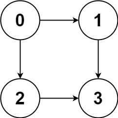

```
输入：graph = [[1,2],[3],[3],[]]
输出：[[0,1,3],[0,2,3]]
解释：有两条路径 0 -> 1 -> 3 和 0 -> 2 -> 3
```

**示例 2：**

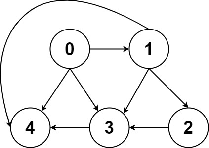

```
输入：graph = [[4,3,1],[3,2,4],[3],[4],[]]
输出：[[0,4],[0,3,4],[0,1,3,4],[0,1,2,3,4],[0,1,4]]
```

#### 思路

1. 类似多叉树的遍历
2. for内for外两种写法

#### 代码

##### 两种写法

1. ==push pop在for外 但是最后需要pop==

```c++
class Solution {
public:
    vector<vector<int>> res;
    vector<int> path;
    vector<vector<int>> allPathsSourceTarget(vector<vector<int>>& graph) {
        traverse(graph, 0);
        return res;
    }

    void traverse(vector<vector<int>>& graph, int s){
        path.push_back(s);
        
        if(s == graph.size()-1){
            res.push_back(path);
            path.pop_back(); //！
            return;
        }

        for(int v : graph[s]){
            traverse(graph, v);
        }
        path.pop_back();
    }
};
```

2. <u>==push pop在for内 但是第一个元素需要先压入==</u>

```c++
class Solution {
public:
    vector<vector<int>> res;
    vector<int> path;
    vector<vector<int>> allPathsSourceTarget(vector<vector<int>>& graph) {
        path.push_back(0);  //!
        traverse(graph, 0);
        return res;
    }

    void traverse(vector<vector<int>>& graph, int s){
        if(s == graph.size()-1){
            res.push_back(path);
            return;
        }

        for(int v : graph[s]){
            path.push_back(v);
            traverse(graph, v);
            path.pop_back();
        }
    }
};
```

### [剑指 Offer II 111. 计算除法](https://leetcode.cn/problems/vlzXQL/)

难度中等13

给定一个变量对数组 `equations` 和一个实数值数组 `values` 作为已知条件，其中 `equations[i] = [Ai, Bi]` 和 `values[i]` 共同表示等式 `Ai / Bi = values[i]` 。每个 `Ai` 或 `Bi` 是一个表示单个变量的字符串。

另有一些以数组 `queries` 表示的问题，其中 `queries[j] = [Cj, Dj]` 表示第 `j` 个问题，请你根据已知条件找出 `Cj / Dj = ?` 的结果作为答案。

返回 **所有问题的答案** 。如果存在某个无法确定的答案，则用 `-1.0` 替代这个答案。如果问题中出现了给定的已知条件中没有出现的字符串，也需要用 `-1.0` 替代这个答案。

**注意：**输入总是有效的。可以假设除法运算中不会出现除数为 0 的情况，且不存在任何矛盾的结果。

 

**示例 1：**

```
输入：equations = [["a","b"],["b","c"]], values = [2.0,3.0], queries = [["a","c"],["b","a"],["a","e"],["a","a"],["x","x"]]
输出：[6.00000,0.50000,-1.00000,1.00000,-1.00000]
解释：
条件：a / b = 2.0, b / c = 3.0
问题：a / c = ?, b / a = ?, a / e = ?, a / a = ?, x / x = ?
结果：[6.0, 0.5, -1.0, 1.0, -1.0 ]
```

**示例 2：**

```
输入：equations = [["a","b"],["b","c"],["bc","cd"]], values = [1.5,2.5,5.0], queries = [["a","c"],["c","b"],["bc","cd"],["cd","bc"]]
输出：[3.75000,0.40000,5.00000,0.20000]
```

#### 解法 建邻接表 dfs

```c++
class Solution {
    // equations中每一个equation，代表两者的相互关系已知，
    // 用有向图保存，将equation中的两者间建边，边的权重分别为两者的商/商的倒数
    // queries中，首先检查是否都出现过， 再检查是否联通
private:
    double dfs(unordered_map<string, vector<pair<string, double>>>& graph, unordered_set<string>& visted, string start, string end, double val){
        if (start == end) 
            return val;

        visted.insert(start); 
        // 遍历当前点能走到的所有点
        for (auto& node : graph[start]){
            if (!visted.count(node.first)) { 
                double res = dfs(graph, visted, node.first, end, node.second * val); 
                // res = -1代表该通路无解，如果该通路有解则返回
                if (res > 0) {
                    // 可以更新graph，方便下一次查找
                    // graph[node.first].push_back
                    return res; 
                }
            }
        }
        return -1;
    }

public:
    vector<double> calcEquation(vector<vector<string>>& equations, vector<double>& values, vector<vector<string>>& queries) {
        //快速查找的映射，key  是起点，value 是与 {该点联通的点终点, 权重}
        unordered_map<string, vector<pair<string, double>>> graph; 
        for (int i = 0; i < equations.size(); ++i) { 
            graph[equations[i][0]].push_back({equations[i][1], values[i]});
            graph[equations[i][1]].push_back({equations[i][0], 1 / values[i]}); 
        }

        vector<double> res(queries.size(), -1.0); 
        unordered_set<string> visted;
        for (int i = 0; i < queries.size(); ++i) {
            // 首先两者确认都出现过
            if (graph.count(queries[i][0]) && graph.count(queries[i][1])) { 
                // 因为是有环图，用visited来防止重复走
                visted.clear();
                res[i] = dfs(graph, visted, queries[i][0], queries[i][1], 1); //确定起点和终点，进入递归，起点终点可能相等，默认是 1
            }
        }
        return res;
    }
};
```


# [环检测和拓扑排序](https://labuladong.gitee.io/algo/2/20/48/)

一个讲的很好的bfs拓扑排序

[图文详解面试常考算法 —— 拓扑排序 - 知乎 (zhihu.com)](https://zhuanlan.zhihu.com/p/135094687)

### [207. 课程表](https://leetcode-cn.com/problems/course-schedule/)

[labuladong 题解](https://labuladong.gitee.io/plugin-v4/?qno=207&target=gitee)[思路](https://leetcode-cn.com/problems/course-schedule/#)

你这个学期必须选修 `numCourses` 门课程，记为 `0` 到 `numCourses - 1` 。

在选修某些课程之前需要一些先修课程。 先修课程按数组 `prerequisites` 给出，其中 `prerequisites[i] = [ai, bi]` ，表示如果要学习课程 `ai` 则 **必须** 先学习课程 `bi` 。

- 例如，先修课程对 `[0, 1]` 表示：想要学习课程 `0` ，你需要先完成课程 `1` 。

请你判断是否可能完成所有课程的学习？如果可以，返回 `true` ；否则，返回 `false` 。

 

**示例 1：**

```
输入：numCourses = 2, prerequisites = [[1,0]]
输出：true
解释：总共有 2 门课程。学习课程 1 之前，你需要完成课程 0 。这是可能的。
```

**示例 2：**

```
输入：numCourses = 2, prerequisites = [[1,0],[0,1]]
输出：false
解释：总共有 2 门课程。学习课程 1 之前，你需要先完成课程 0 ；并且学习课程 0 之前，你还应先完成课程 1 。这是不可能的。
```

#### 代码

#### dfs查环

```c++
class Solution {
public:
    vector<bool> visited;  //记录的是遍历过的 用于终止遍历 提高效率 不加会超时 用 visited 数组防止走回头路
    vector<bool> onPath;   //记录每次遍历过的节点，用于查环
    bool hasCycle;
    bool canFinish(int numCourses, vector<vector<int>>& prerequisites) {
        //建图
        vector<vector<int>> graph(numCourses);
        for(auto edge: prerequisites){
            int from = edge[1];
            int to = edge[0];
            graph[from].push_back(to);
        }
        visited = vector<bool>(numCourses, 0);
        onPath = vector<bool>(numCourses, 0);
        hasCycle = false;
        for(int i = 0; i<numCourses; i++){
            //遍历所有节点
            traverse(graph, i);
        }
        return !hasCycle;
    }

    void traverse(vector<vector<int>>& graph, int s){
        if(onPath[s]) //出现环
            hasCycle = 1;
        if(visited[s] || hasCycle)
            return;
        //前序代码位置
        visited[s] = 1;
        onPath[s] = 1;
        for(int t : graph[s])
            traverse(graph, t);
        //后序遍历位置
        onPath[s] = 0;
    }
};
```

#### bfs数入度为0的点的个数

```c++
class Solution {
public:
    bool canFinish(int numCourses, vector<vector<int>>& prerequisites) {
      vector<vector<int>> edge(numCourses);
      vector<int> indeg(numCourses, 0);
      for(auto& info : prerequisites){
        edge[info[1]].push_back(info[0]);
        indeg[info[0]]++;
      }
      queue<int> que;
      for(int i = 0; i<indeg.size(); i++){
        if(indeg[i] == 0)
          que.push(i);
      }

      int visited = 0; //记录的是 可以走到的 也就是入度为0的节点数
      while(!que.empty()){
        visited++;
        int node = que.front();
        que.pop();
        for(int& v : edge[node]){
          indeg[v]--;
          if(indeg[v] == 0)
            que.push(v);
        }
      }
      return visited == numCourses;
    }
};
```


### [210. 课程表 II](https://leetcode-cn.com/problems/course-schedule-ii/)

[labuladong 题解](https://labuladong.gitee.io/plugin-v4/?qno=210&target=gitee)[思路](https://leetcode-cn.com/problems/course-schedule-ii/#)

难度中等582收藏分享切换为英文接收动态反馈

现在你总共有 `numCourses` 门课需要选，记为 `0` 到 `numCourses - 1`。给你一个数组 `prerequisites` ，其中 `prerequisites[i] = [ai, bi]` ，表示在选修课程 `ai` 前 **必须** 先选修 `bi` 。

- 例如，想要学习课程 `0` ，你需要先完成课程 `1` ，我们用一个匹配来表示：`[0,1]` 。

返回你为了学完所有课程所安排的学习顺序。可能会有多个正确的顺序，你只要返回 **任意一种** 就可以了。如果不可能完成所有课程，返回 **一个空数组** 。

 

**示例 1：**

```
输入：numCourses = 2, prerequisites = [[1,0]]
输出：[0,1]
解释：总共有 2 门课程。要学习课程 1，你需要先完成课程 0。因此，正确的课程顺序为 [0,1] 。
```

**示例 2：**

```
输入：numCourses = 4, prerequisites = [[1,0],[2,0],[3,1],[3,2]]
输出：[0,2,1,3]
解释：总共有 4 门课程。要学习课程 3，你应该先完成课程 1 和课程 2。并且课程 1 和课程 2 都应该排在课程 0 之后。
因此，一个正确的课程顺序是 [0,1,2,3] 。另一个正确的排序是 [0,2,1,3] 。
```

**示例 3：**

```
输入：numCourses = 1, prerequisites = []
输出：[0]
```

#### dfs拓扑排序 代码

```c++
class Solution {
public:
    vector<bool> visited;
    vector<bool> onPath;
    bool hasCycle;
    vector<int> postOrder;

    vector<int> findOrder(int numCourses, vector<vector<int>>& prerequisites) {
        //建图
        vector<vector<int>> graph(numCourses);
        for(auto edge: prerequisites){
            int from = edge[1];
            int to = edge[0];
            graph[from].push_back(to);
        }
        visited = vector<bool>(numCourses, 0);
        onPath = vector<bool>(numCourses, 0);
        hasCycle = false;
        for(int i = 0; i<numCourses; i++){
            //遍历所有节点
            traverse(graph, i);
        }
        if(hasCycle)  return vector<int>{};
        reverse(postOrder.begin(), postOrder.end());  //拓扑排序是后序遍历的反转 注意 后序的常规理解图的后序遍历
        return postOrder;
    }


    void traverse(vector<vector<int>>& graph, int s){
        if(onPath[s]) //出现环
            hasCycle = 1;
        if(visited[s] || hasCycle)
            return;
        //前序代码位置
        visited[s] = 1;
        onPath[s] = 1;
        for(int t : graph[s])
            traverse(graph, t);
        //后序遍历位置
        onPath[s] = 0;
        postOrder.push_back(s); //记录后序遍历
    }
};
```

#### bfs拓扑排序代码

```c++
class Solution {
public:
    vector<int> findOrder(int numCourses, vector<vector<int>>& prerequisites) {
      vector<int> res(numCourses);
      vector<int> inDegree(numCourses);
      vector<vector<int>> edge(numCourses);
      for(auto& num : prerequisites){
        inDegree[num[0]]++;  //统计所有节点的入度
        edge[num[1]].push_back(num[0]); //构建邻接表
      }
      
      queue<int> que;
      for(int i = 0; i<numCourses; i++)
        if(inDegree[i] == 0)
          que.push(i);

      int i = 0;
      while(!que.empty()){
        int curr = que.front();
        que.pop();
        res[i++] = curr;
        //移除所有curr节点指向节点的1个入度，为0push
        for(auto& num : edge[curr]){
            inDegree[num]--;
            if(inDegree[num] == 0)
              que.push(num);
        }
      }
      return i == numCourses ? res : vector<int>{};
    }
};
```

### [剑指 Offer II 114. 外星文字典](https://leetcode.cn/problems/Jf1JuT/)

难度困难83

现有一种使用英语字母的外星文语言，这门语言的字母顺序与英语顺序不同。

给定一个字符串列表 `words` ，作为这门语言的词典，`words` 中的字符串已经 **按这门新语言的字母顺序进行了排序** 。

请你根据该词典还原出此语言中已知的字母顺序，并 **按字母递增顺序** 排列。若不存在合法字母顺序，返回 `""` 。若存在多种可能的合法字母顺序，返回其中 **任意一种** 顺序即可。

字符串 `s` **字典顺序小于** 字符串 `t` 有两种情况：

- 在第一个不同字母处，如果 `s` 中的字母在这门外星语言的字母顺序中位于 `t` 中字母之前，那么 `s` 的字典顺序小于 `t` 。
- 如果前面 `min(s.length, t.length)` 字母都相同，那么 `s.length < t.length` 时，`s` 的字典顺序也小于 `t` 。

 

**示例 1：**

```
输入：words = ["wrt","wrf","er","ett","rftt"]
输出："wertf"
```

**示例 2：**

```
输入：words = ["z","x"]
输出："zx"
```

**示例 3：**

```
输入：words = ["z","x","z"]
输出：""
解释：不存在合法字母顺序，因此返回 "" 。
```

#### bfs拓扑排序

```c++
class Solution {
public:
    string alienOrder(vector<string>& words) {
        vector<int> in(26, 0); // 每个节点的入度
        vector<vector<int> > g(26); // 建图
        vector<bool> st(26, false); // 字母是否出现
        int cnt = 0; // 字母出现的数量
        for (string& word: words) {
            for (char& ch: word) {
                if (st[ch - 'a'] == false) cnt ++ ;
                st[ch - 'a'] = true;
            }
        }
        int n = words.size();
        for (int i = 0; i < n - 1; i ++ ) {
            string s = words[i], p = words[i + 1];
            int lens = s.size(), lenp = p.size(), minn = min(lens, lenp);
            bool ok = false; // 是否有不同的位置
            for (int j = 0; j < minn; j ++ ) {
                if (s[j] == p[j]) continue;
                ok = true;
                in[p[j] - 'a'] ++ ;
                g[s[j] - 'a'].push_back(p[j] - 'a');
                break;
            }
            if (!ok && lens > lenp) return ""; // 后一个是前一个的前缀
        }

        queue<int> q;
        for (int i = 0; i < 26; i ++ ) {
            if (in[i] == 0 && st[i] == true)
                q.push(i);
        }

        string res = "";
        while (!q.empty()) {
            int p = q.front(); q.pop();
            res.push_back(p + 'a');
            for (int u : g[p]) 
                if ( -- in[u] == 0) 
                    q.push(u);
        }
        return res.size() == cnt ? res : ""; // 出现的单词都要在答案中
    }
};
```


# [二分图判定](https://labuladong.gitee.io/algo/2/20/40/)

### [785. 判断二分图](https://leetcode-cn.com/problems/is-graph-bipartite/)

[labuladong 题解](https://labuladong.gitee.io/plugin-v4/?qno=785&target=gitee)[思路](https://leetcode-cn.com/problems/is-graph-bipartite/#)

难度中等347收藏分享切换为英文接收动态反馈

存在一个 **无向图** ，图中有 `n` 个节点。其中每个节点都有一个介于 `0` 到 `n - 1` 之间的唯一编号。给你一个二维数组 `graph` ，其中 `graph[u]` 是一个节点数组，由节点 `u` 的邻接节点组成。形式上，对于 `graph[u]` 中的每个 `v` ，都存在一条位于节点 `u` 和节点 `v` 之间的无向边。该无向图同时具有以下属性：

- 不存在自环（`graph[u]` 不包含 `u`）。
- 不存在平行边（`graph[u]` 不包含重复值）。
- 如果 `v` 在 `graph[u]` 内，那么 `u` 也应该在 `graph[v]` 内（该图是无向图）
- 这个图可能不是连通图，也就是说两个节点 `u` 和 `v` 之间可能不存在一条连通彼此的路径。

**二分图** 定义：如果能将一个图的节点集合分割成两个独立的子集 `A` 和 `B` ，并使图中的每一条边的两个节点一个来自 `A` 集合，一个来自 `B` 集合，就将这个图称为 **二分图** 。

如果图是二分图，返回 `true` ；否则，返回 `false` 。

 

**示例 1：**

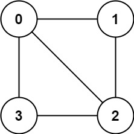

```
输入：graph = [[1,2,3],[0,2],[0,1,3],[0,2]]
输出：false
解释：不能将节点分割成两个独立的子集，以使每条边都连通一个子集中的一个节点与另一个子集中的一个节点。
```

**示例 2：**

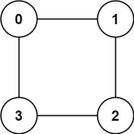

```
输入：graph = [[1,3],[0,2],[1,3],[0,2]]
输出：true
解释：可以将节点分成两组: {0, 2} 和 {1, 3} 。
```

#### 思路

对整个图进行交替染色 若可以完全染色 则为二分图

#### 代码

```c++
class Solution {
public:
    // 给图上色 如果可以完全上色 则表示为二分图
    bool isBipartite(vector<vector<int>>& graph) {
        bool ok = 1;
        int n = graph.size();
        vector<bool> used(n, 0);
        vector<bool> color(n, 0);
        for(int v = 0; v<n; v++){
            if(!used[v])
                traverse(graph, v, used, color, ok);
        }
        return ok;
    }

    void traverse(vector<vector<int>>& graph, int v, vector<bool>& used, vector<bool>& color, bool& ok){
        //如果确定不是二分图了 就不用再浪费时间遍历了
        if(!ok) return;
        used[v] = 1;
        for(int w : graph[v]){
            if(!used[w]){
                color[w] = !color[v];
                traverse(graph, w, used, color, ok);
            }else{
                if(color[w] == color[v]){
                    ok = false;
                }
            }
        }
    }
};
```

### [886. 可能的二分法](https://leetcode-cn.com/problems/possible-bipartition/)

[labuladong 题解](https://labuladong.gitee.io/plugin-v4/?qno=886&target=gitee)[思路](https://leetcode-cn.com/problems/possible-bipartition/#)

难度中等161

给定一组 `n` 人（编号为 `1, 2, ..., n`）， 我们想把每个人分进**任意**大小的两组。每个人都可能不喜欢其他人，那么他们不应该属于同一组。

给定整数 `n` 和数组 `dislikes` ，其中 `dislikes[i] = [ai, bi]` ，表示不允许将编号为 `ai` 和 `bi`的人归入同一组。当可以用这种方法将所有人分进两组时，返回 `true`；否则返回 `false`。

 


**示例 1：**

```
输入：n = 4, dislikes = [[1,2],[1,3],[2,4]]
输出：true
解释：group1 [1,4], group2 [2,3]
```

**示例 2：**

```
输入：n = 3, dislikes = [[1,2],[1,3],[2,3]]
输出：false
```

**示例 3：**

```
输入：n = 5, dislikes = [[1,2],[2,3],[3,4],[4,5],[1,5]]
输出：false
```

#### 思路

1. 首先构造邻接表（细节， 编号为1-n）
2. 上色

#### 代码

```c++
class Solution {
public:
    bool ans;
    vector<bool> color;
    vector<bool> visited;
    //注意编号 1-n
    bool possibleBipartition(int n, vector<vector<int>>& dislikes) {
        ans = 1;
        color.resize(n+1);
        visited = vector<bool>(n+1, 0);
        vector<vector<int>> dislikess = buildGraph(dislikes,n);
        for(int i = 1; i<=n; i++){
            if(!visited[i])
                traverse(dislikess, i);
        }
        return ans;
    }

    //这是一个双向图 你恨我 我恨你
    vector<vector<int>> buildGraph(vector<vector<int>>& dislikes, int n){
        vector<vector<int>> res(n+1);
        for(int i  = 0; i<dislikes.size(); i++){
            res[dislikes[i][0]].push_back(dislikes[i][1]);
            res[dislikes[i][1]].push_back(dislikes[i][0]);
        }
        return res;
    }

    //上色函数 经典 完全一致
    void traverse(vector<vector<int>>& dislikes, int index){
       ·
        visited[index] = 1;
        for(int newIndex : dislikes[index]){
            if(!visited[newIndex]){
                color[newIndex] = !color[index];
                traverse(dislikes, newIndex);
            }else{
                if(color[index] == color[newIndex])
                    ans = 0;
            }
        }
    }
};
```

# 并查集（UNION-FIND）算法

### 模板

```c++
class UF {
private:
	//连同分量的个数
	int cnt;
	// 存储每个节点的父节点
	vector<int> parent;

public:
  // n 为图中节点的个数
	UF(int n) {
		cnt = n;
		parent.resize(n);
		for (int i = 0; i < n; ++i)
			parent[i] = i;
	}

	//联通节点
	void unionn(int p, int q) {
		int rootP = find(p);
		int rootQ = find(q);
		if (rootP == rootQ)
			return;
		parent[rootQ] = rootP;
		cnt--;
	}

	// 判断节点 p 和节点 q 是否连通
	bool connected(int p, int q) {
		int rootP = find(p);
		int rootQ = find(q);
		return rootP == rootQ;
	}

	// 返回节点 x 的连通分量根节点
	int find(int x) {
		while (parent[x] != x) {
			// 进行路径压缩
			parent[x] = parent[parent[x]];
			x = parent[x];
		}
		return x;
	}

	// 返回图中的连通分量个数
	int count() { return cnt; }
};
```

### [547. 省份数量](https://leetcode-cn.com/problems/number-of-provinces/)

难度中等747

有 `n` 个城市，其中一些彼此相连，另一些没有相连。如果城市 `a` 与城市 `b` 直接相连，且城市 `b` 与城市 `c` 直接相连，那么城市 `a` 与城市 `c` 间接相连。

**省份** 是一组直接或间接相连的城市，组内不含其他没有相连的城市。

给你一个 `n x n` 的矩阵 `isConnected` ，其中 `isConnected[i][j] = 1` 表示第 `i` 个城市和第 `j` 个城市直接相连，而 `isConnected[i][j] = 0` 表示二者不直接相连。

返回矩阵中 **省份** 的数量。

 

**示例 1：**


```
输入：isConnected = [[1,1,0],[1,1,0],[0,0,1]]
输出：2
```

**示例 2：**

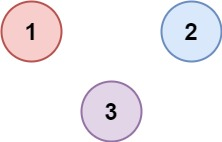

```
输入：isConnected = [[1,0,0],[0,1,0],[0,0,1]]
输出：3
```

#### 思路

1. 标准的并查集题目 模板直接使用
2. 转换成邻接表dfs
3. 邻接图 dfs 按相连的逻辑去进行dfs 最优

#### 代码

1. 标准的并查集题目 模板直接使用

```c++
class UF {
private:
	//连同分量的个数
	int cnt;
	// 存储每个节点的父节点
	vector<int> parent;

public:
    // n 为图中节点的个数
	UF(int n) {
		cnt = n;
		parent.resize(n);
		for (int i = 0; i < n; ++i)
			parent[i] = i;
	}

	//联通节点
	void unionn(int p, int q) {
		int rootP = find(p);
		int rootQ = find(q);
		if (rootP == rootQ)
			return;
		parent[rootQ] = rootP;  //注意这里是parent的合并
		cnt--;
	}

	// 判断节点 p 和节点 q 是否连通
	bool connected(int p, int q) {
		int rootP = find(p);
		int rootQ = find(q);
		return rootP == rootQ;
	}

	// 返回节点 x 的连通分量根节点
	int find(int x) {
		while (parent[x] != x) {
			// 进行路径压缩
			parent[x] = parent[parent[x]];
			x = parent[x];
		}
		return x;
	}

	// 返回图中的连通分量个数
	int count() { return cnt; }
};


class Solution {
public:
    int findCircleNum(vector<vector<int>>& isConnected) {
        UF uf(isConnected.size());
        for(int i = 0; i<isConnected.size(); i++){
            for(int j = 0; j<isConnected[i].size(); j++){
                if(isConnected[i][j])
                    uf.unionn(i, j);
            }
        }
        return uf.count();
    }
};
```

2. 转换成邻接表dfs

```c++
class Solution {
public:
    vector<bool> visited;
    int findCircleNum(vector<vector<int>>& isConnected) {
        int n = isConnected.size();
        int ans = 0;
        vector<vector<int>> graph = buildGraph(isConnected);
        visited = vector<bool>(n, 0);
        for(int i = 0; i<n; i++){
            if(!visited[i]){
                traverse(graph, i);
                ans++;
            }
        }
        return ans;
    }

    void traverse(vector<vector<int>>& graph, int index){
        visited[index] = 1;
        for(int newIndex : graph[index]){
            if(!visited[newIndex]){
                //如果使用全局ans 在此处--是不对的
                traverse(graph, newIndex); 
            }
        }
    }

    vector<vector<int>> buildGraph(vector<vector<int>>& isConnected){
        vector<vector<int>> res(isConnected.size());
        for(int i = 0; i<isConnected.size(); i++){
            for(int j = 0; j<isConnected[i].size(); j++){
                if(isConnected[i][j] == 1){
                    res[i].push_back(j);
                    res[j].push_back(i);
                }
            }
        }
        return res;
    }
};
```

3. 邻接图 dfs

```c++
class Solution {
public:
    vector<bool> visited;
    int findCircleNum(vector<vector<int>>& isConnected) {
        int n = isConnected.size();
        visited =vector<bool>(n, 0);
        int ans = 0;
        for(int i = 0; i< n; i++){
            if(!visited[i]){
                ans++;
                dfs(isConnected, i);
            }
        }
        return ans;
    }
    void dfs(vector<vector<int>>& isConnected, int nowPro){
        visited[nowPro] = 1;
        for(int i = 0; i<isConnected[nowPro].size(); i++){
            if(!visited[i] && isConnected[nowPro][i] == 1){
                dfs(isConnected, i);
            }
        }
    }   
};
```


### [130. 被围绕的区域](https://leetcode-cn.com/problems/surrounded-regions/)

[labuladong 题解](https://labuladong.gitee.io/plugin-v4/?qno=130&target=gitee)[思路](https://leetcode-cn.com/problems/surrounded-regions/#)

难度中等750收藏分享切换为英文接收动态反馈

给你一个 `m x n` 的矩阵 `board` ，由若干字符 `'X'` 和 `'O'` ，找到所有被 `'X'` 围绕的区域，并将这些区域里所有的 `'O'` 用 `'X'` 填充。

 

**示例 1：**

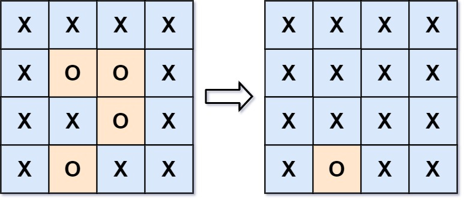

```
输入：board = [["X","X","X","X"],["X","O","O","X"],["X","X","O","X"],["X","O","X","X"]]
输出：[["X","X","X","X"],["X","X","X","X"],["X","X","X","X"],["X","O","X","X"]]
解释：被围绕的区间不会存在于边界上，换句话说，任何边界上的 'O' 都不会被填充为 'X'。 任何不在边界上，或不与边界上的 'O' 相连的 'O' 最终都会被填充为 'X'。如果两个元素在水平或垂直方向相邻，则称它们是“相连”的。
```

#### 思路

1. dfs这也是比较常规的 四周开始
2. 并查集 重点理解如何使用这种数据结构

#### 代码

##### dfs

```c++
class Solution {
public:
    void solve(vector<vector<char>>& board) {
        int m = board.size();
        if(m == 0) return;
        int n = board[0].size();
        vector<vector<bool>> isIsland(m, vector<bool>(n, 0));
        for(int i = 0; i<m; i++){
            if(board[i][0] == 'O'){
                effect(board, i, 0, isIsland);
            }
            if(board[i][n-1] == 'O'){
                effect(board, i, n-1, isIsland);
            }
        }

        for(int i = 0; i<n; i++){
            if(board[0][i] == 'O'){
                effect(board, 0, i, isIsland);
            }
            if(board[m-1][i] == 'O'){
                effect(board, m-1, i, isIsland);
            }
        }

        for(int i = 0; i<m; i++){
            for(int j = 0; j<n; j++){
                if(board[i][j] == 'O' && !isIsland[i][j])
                    board[i][j] = 'X';
            }
        }
    }

    void effect(vector<vector<char>>& board, int x, int y, vector<vector<bool>>& isIsland){
        //如果不加入island判断就会陷入死循环
        if(x < 0 || y<0 || x>= board.size() || y>=board[0].size() || board[x][y]!='O' || isIsland[x][y]){
            return;
        }
        isIsland[x][y] = 1;
        effect(board, x+1, y, isIsland);
        effect(board, x-1, y, isIsland);
        effect(board, x, y+1, isIsland);
        effect(board, x, y-1, isIsland);
    }
};
```

##### 并查集

`使用node为节点进行连接 将网格上的节点映射到数值上`

```c++
class UF{
private:
   vector<int> parent;

public:
    UF(int n){
        parent.resize(n);
        for(int i = 0; i<n; i++){
            parent[i] = i;
        }
    }

    void unionn(int p, int q){
        int rootP = find(p);
        int rootQ = find(q);
        if(rootP == rootQ) return;
        parent[rootP] = rootQ;
    }

    bool connected(int p, int q){
        int rootP = find(p);
        int rootQ = find(q);
        return rootQ == rootP;
    }

    int find(int x){
        while(parent[x]!= x){
            parent[x] = parent[parent[x]];
            x = parent[x];
        }
        return x;
    }
};


class Solution {
public:
    int m;
    int n;

    void solve(vector<vector<char>>& board) {
        m = board.size();
        n = board[0].size();
        UF uf(m*n+1);
        int dumpyNode = m*n;
        for(int i = 0; i<m; i++){
            for(int j = 0; j<n; j++){
                if(board[i][j] == 'O'){
                    if(i == 0 || j == 0 || i == m-1 || j == n-1)
                        uf.unionn(dumpyNode, node(i, j));
                    else{
                    //里面的和上下左右联通
                    if(i>0 && board[i-1][j] == 'O')
                        uf.unionn(node(i, j), node(i-1, j));
                    if(j>0 && board[i][j-1] == 'O')
                        uf.unionn(node(i, j), node(i, j-1));
                    if(i<m-1 && board[i+1][j] == 'O')
                        uf.unionn(node(i, j), node(i+1, j));
                    if(j<n-1 && board[i][j+1] == 'O')
                        uf.unionn(node(i, j), node(i, j+1));
                    }
                }
            }
        }

        for(int i = 0; i<m; i++){
            for(int j = 0; j<n; j++){
                if(uf.connected(node(i, j), dumpyNode))
                    board[i][j] = 'O';
                else board[i][j] = 'X';
            }
        }
    }

    int node(int x, int y){
        return  x*n + y;
    }
};
```

### [剑指 Offer II 118. 多余的边](https://leetcode.cn/problems/7LpjUW/)

难度中等23收藏分享切换为英文接收动态反馈

树可以看成是一个连通且 **无环** 的 **无向** 图。

给定往一棵 `n` 个节点 (节点值 `1～n`) 的树中添加一条边后的图。添加的边的两个顶点包含在 `1` 到 `n` 中间，且这条附加的边不属于树中已存在的边。图的信息记录于长度为 `n` 的二维数组 `edges` ，`edges[i] = [ai, bi]` 表示图中在 `ai` 和 `bi` 之间存在一条边。

请找出一条可以删去的边，删除后可使得剩余部分是一个有着 `n` 个节点的树。如果有多个答案，则返回数组 `edges` 中最后出现的边。

 

**示例 1：**

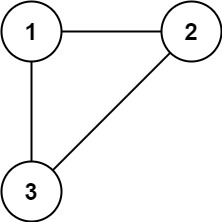

```
输入: edges = [[1,2],[1,3],[2,3]]
输出: [2,3]
```

**示例 2：**

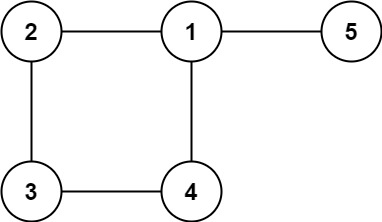

```
输入: edges = [[1,2],[2,3],[3,4],[1,4],[1,5]]
输出: [1,4]
```

#### 解法 使用并查集

重复连接的情况下 就直接返回

```c++
class UF {
private:
	//连同分量的个数
	int cnt;
	// 存储每个节点的父节点
	vector<int> parent;

public:
  // n 为图中节点的个数
	UF(int n) {
		cnt = n;
		parent.resize(n);
		for (int i = 0; i < n; ++i)
			parent[i] = i;
	}

	//联通节点
	void unionn(int p, int q) {
		int rootP = find(p);
		int rootQ = find(q);
		if (rootP == rootQ)
			return;
		parent[rootQ] = rootP;
		cnt--;
	}

	// 判断节点 p 和节点 q 是否连通
	bool connected(int p, int q) {
		int rootP = find(p);
		int rootQ = find(q);
		return rootP == rootQ;
	}

	// 返回节点 x 的连通分量根节点
	int find(int x) {
		while (parent[x] != x) {
			// 进行路径压缩
			parent[x] = parent[parent[x]];
			x = parent[x];
		}
		return x;
	}

	// 返回图中的连通分量个数
	int count() { return cnt; }
};

class Solution {
public:
    vector<int> findRedundantConnection(vector<vector<int>>& edges) {
      UF uni(edges.size() + 1);
      for(auto edge : edges){
        int node1 = edge[0], node2 = edge[1];
        if(!uni.connected(node1, node2))
          uni.unionn(node1, node2);
        else return edge;
      }
      return vector<int>{};
    }
};
```

# [Kruskal 最小生成树算法](https://mp.weixin.qq.com/s/dJ9gqR3RVoeGnATlpMG39w)

所谓最小生成树，就是图中若干边的集合（这个集合为 `mst`，最小生成树的英文缩写），你要保证这些边：

1、包含图中的所有节点。

2、形成的结构是树结构（即不存在环）。

3、权重和最小。

[最小生成树 MST （Prim算法，Kruskal算法） - VisuAlgo](https://visualgo.net/zh/mst)

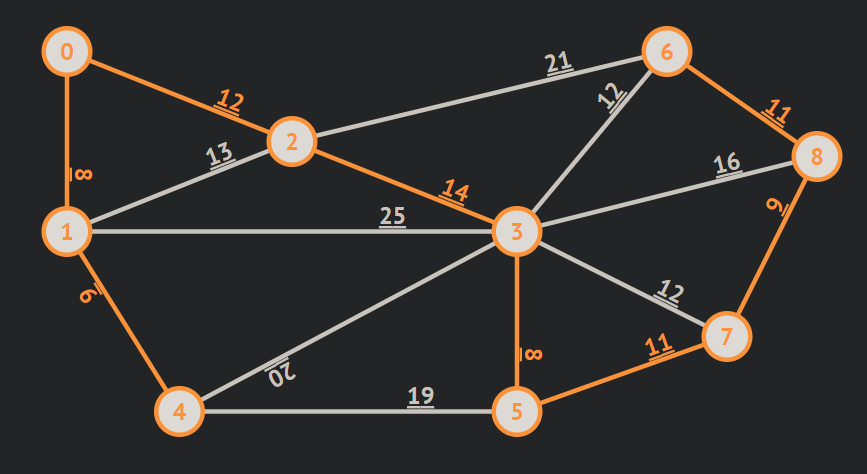

### 1135.最低成本联通所有城市

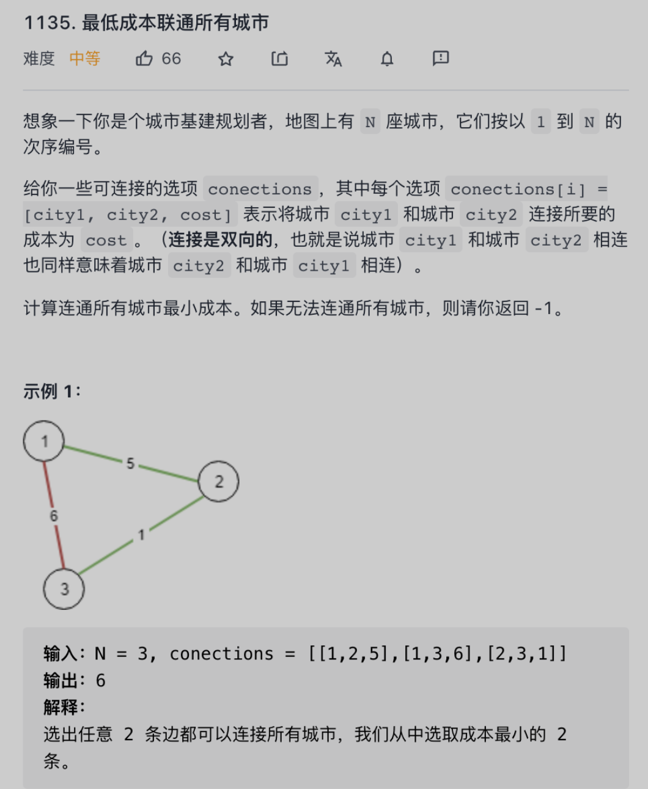

#### 思路

每座城市相当于图中的节点，连通城市的成本相当于边的权重，连通所有城市的最小成本即是最小生成树的权重之和。

树的判定算法加上按权重排序的逻辑就变成了 Kruskal 算法

#### 代码

```c++
class UF {
private:
	//连同分量的个数
	int cnt;
	// 存储每个节点的父节点
	vector<int> parent;

public:
  // n 为图中节点的个数
	UF(int n) {
		cnt = n;
		parent.resize(n);
		for (int i = 0; i < n; ++i)
			parent[i] = i;
	}

	//联通节点
	void unionn(int p, int q) {
		int rootP = find(p);
		int rootQ = find(q);
		if (rootP == rootQ)
			return;
		parent[rootQ] = rootP;
		cnt--;
	}

	// 判断节点 p 和节点 q 是否连通
	bool connected(int p, int q) {
		int rootP = find(p);
		int rootQ = find(q);
		return rootP == rootQ;
	}

	// 返回节点 x 的连通分量根节点
	int find(int x) {
		while (parent[x] != x) {
			// 进行路径压缩
			parent[x] = parent[parent[x]];
			x = parent[x];
		}
		return x;
	}

	// 返回图中的连通分量个数
	int count() { return cnt; }
};

class Solution {
public:
    int minimumCost(int n, vector<vector<int>>& connections) {
      UF uni(connections.size() + 1);
      int mst = 0;
      auto cmp = [](vector<int>& a, vector<int>& b){ return a[2] < b[2]; };
      sort(connections.begin(), connections.end(), cmp);
      for(auto edge : connections){
        int node1 = edge[0], node2 = edge[1];
        int weight = edge[2];
        //判断parent是否相同
        if(uni.connected(node1, node2))
          continue;
       	mst += weight;
        uni.unionn(node1, node2);
      }
      // 因为节点 0 没有被使用，所以 0 会额外占用一个连通分量
      return uni.count() == 2 ? mst : -1;
    }
};
```

### [1584. 连接所有点的最小费用](https://leetcode.cn/problems/min-cost-to-connect-all-points/)

[labuladong 题解](https://labuladong.github.io/article/?qno=1584)[思路](https://leetcode.cn/problems/min-cost-to-connect-all-points/#)

难度中等204

给你一个`points` 数组，表示 2D 平面上的一些点，其中 `points[i] = [xi, yi]` 。

连接点 `[xi, yi]` 和点 `[xj, yj]` 的费用为它们之间的 **曼哈顿距离** ：`|xi - xj| + |yi - yj|` ，其中 `|val|` 表示 `val` 的绝对值。

请你返回将所有点连接的最小总费用。只有任意两点之间 **有且仅有** 一条简单路径时，才认为所有点都已连接。

 

**示例 1：**


输入：points = [[0,0],[2,2],[3,10],[5,2],[7,0]]
输出：20
解释：


我们可以按照上图所示连接所有点得到最小总费用，总费用为 20 。
注意到任意两个点之间只有唯一一条路径互相到达。


#### 解法 并查集 Kruskai

```c++
class Union{
  vector<int> parent;
  int cnt;
public:
  Union(int n){
    cnt = n;
    parent.resize(n);
    for(int i = 0; i<n; i++)
      parent[i] = i;
  }

  void unionn(int node1, int node2){
    int root1 = find(node1);
    int root2 = find(node2);
    if(root1 == root2)
      return;
    parent[root1] = root2;
    cnt--;
  }

  int find(int x){
    while(parent[x] != x){
      parent[x] = parent[parent[x]];
      x = parent[x];
    }
    return x;
  }
  
  int count(){return cnt;}
};

class Solution {
public:
    int minCostConnectPoints(vector<vector<int>>& points) {
      int n = points.size();
      vector<vector<int>> all;
      for(int i = 0; i<n; i++){
        for(int j = i+1; j<n; j++){
          vector<int> temp(3);
          temp[0] = i;
          temp[1] = j;
          int diss = abs(points[i][0] - points[j][0]) + abs(points[i][1] - points[j][1]);
          temp[2] = diss;
          all.push_back(temp);
          // cout<<diss<<" ";
        }
      }
      // cout<<endl;
      auto cmp = [](vector<int>& a, vector<int>& b){ return a[2] < b[2]; };
      sort(all.begin(), all.end(), cmp);
      Union uni(n);
      int ans = 0;
      for(int i = 0; i<all.size(); i++){
        int node1 = all[i][0];
        int node2 = all[i][1];
        int weight = all[i][2];
        // cout<<weight<<" ";
        if(uni.find(node1) == uni.find(node2))
          continue;
        uni.unionn(node1, node2);
        ans += weight;
      }
      return ans;
    }
};
```

# 名流问题：邻接矩阵

图有两种存储形式，一种是邻接表，一种是邻接矩阵，邻接表的主要优势是节约存储空间；邻接矩阵的主要优势是可以迅速判断两个节点是否相邻。

对于名人问题，显然会经常需要判断两个人之间是否认识，也就是两个节点是否相邻，所以我们可以用邻接表来表示人和人之间的社交关系。

那么，把名流问题描述成算法的形式就是这样的：

给你输入一个大小为 `n x n` 的二维数组（邻接矩阵） `graph` 表示一幅有 `n` 个节点的图，每个人都是图中的一个节点，编号为 `0` 到 `n - 1`。

如果 `graph[i][j] == 1` 代表第 `i` 个人认识第 `j` 个人，如果 `graph[i][j] == 0` 代表第 `i` 个人不认识第 `j` 个人。

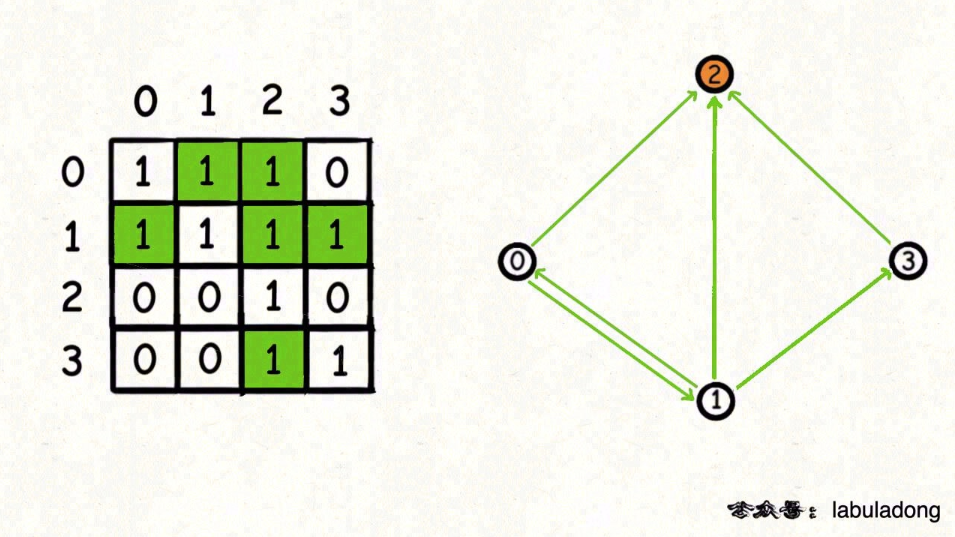

从这个邻接矩阵来看，0认识2 1认识2.。。而2只认识自己 不认识其他人，所以2是名人

### 277. [搜寻名人](https://leetcode-cn.com/problems/find-the-celebrity/)

只告诉你总人数 `n`，同时提供一个 API `knows` 来查询人和人之间的社交关系：

```c++
// 可以直接调用，能够返回 i 是否认识 j
bool knows(int i, int j);

// 请你实现：返回「名人」的编号
int findCelebrity(int n) {
    // todo
}
```

#### 暴力解法

```c++
class Solution{
public:
  int findCelebrity(int n){
    for(int cand = 0; cand < n; cand++){
      int other;
      for(other = 0; other<n; other++){
        if(cand == other) continue;
        if(knows(cand, other) || !knows(other, cand))
          break;
      }
      if(other == n) //cand下other遍历完 说明满足
        return cand;
    }
    return -1；
  }
};
```

#### 优化解法

##### 排除法

先一次遍历：如果当前认识其他 或者 其他不认识他 那么他肯定不是名人

```c++
class Solution{
public:
	int findCelebrity(int n) {
    if (n == 1) return 0;
    // 将所有候选人装进队列
    queue<int> que;
    for (int i = 0; i < n; i++) {
        que.push(i);
    }
    // 一直排除，直到只剩下一个候选人停止循环
    while (que.size() >= 2) {
        // 每次取出两个候选人，排除一个
        int cand = que.front();
      	que.pop();
        int other = que.front();
      	que.pop();
        if (knows(cand, other) || !knows(other, cand)) {
            // cand 不可能是名人，排除，让 other 归队
            que.push(other);
        } else {
            // other 不可能是名人，排除，让 cand 归队
            que.push(cand);
        }
    }

    // 现在排除得只剩一个候选人，判断他是否真的是名人
    int cand = que.front();
    que.pop();
    for (int other = 0; other < n; other++) {
        if (other == cand) {
            continue;
        }
        // 保证其他人都认识 cand，且 cand 不认识任何其他人
        if (!knows(other, cand) || knows(cand, other)) {
            return -1;
        }
    }
    // cand 是名人
    return cand;
	}
};
```

```c++
int findCelebrity(int n) {
    // 先假设 cand 是名人
    int cand = 0;
    for (int other = 1; other < n; other++) {
        if (!knows(other, cand) || knows(cand, other)) {
            // cand 不可能是名人，排除
            // 假设 other 是名人
            cand = other;
        } else {
            // other 不可能是名人，排除
            // 什么都不用做，继续假设 cand 是名人
        }
    }

    // 现在的 cand 是排除的最后结果，但不能保证一定是名人
    for (int other = 0; other < n; other++) {
        if (cand == other) continue;
        // 需要保证其他人都认识 cand，且 cand 不认识任何其他人
        if (!knows(other, cand) || knows(cand, other)) {
            return -1;
        }
    }

    return cand;
}
```

# [DIJKSTRA 算法](https://labuladong.github.io/algo/2/20/54/)

`迪杰斯特拉算法`(Dijkstra)是由荷兰计算机[科学家](https://baike.baidu.com/item/科学家/1210114)[狄克斯特拉](https://baike.baidu.com/item/狄克斯特拉/2828872)于1959年提出的，因此又叫狄克斯特拉算法。是从一个顶点到其余各顶点的[最短路径](https://baike.baidu.com/item/最短路径/6334920)算法，解决的是有权图中最短路径问题。迪杰斯特拉算法主要特点是从起始点开始，采用[贪心算法](https://baike.baidu.com/item/贪心算法/5411800)的[策略](https://baike.baidu.com/item/策略/4006)，每次遍历到始点距离最近且未访问过的顶点的邻接节点，直到扩展到终点为止。

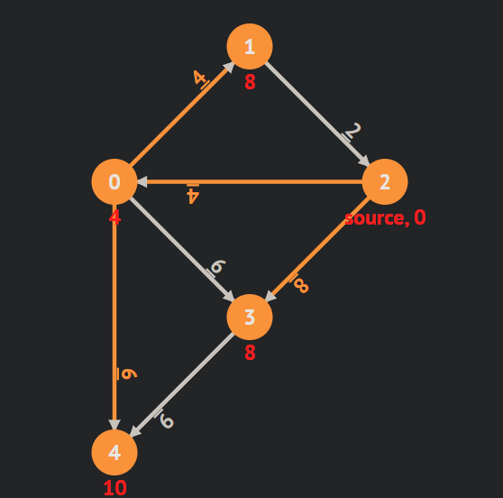

### [动态演示 DIJKSTRA](https://visualgo.net/zh/sssp)

### [743. 网络延迟时间](https://leetcode.cn/problems/network-delay-time/)

[labuladong 题解](https://labuladong.github.io/article/?qno=743)[思路](https://leetcode.cn/problems/network-delay-time/#)

难度中等550

有 `n` 个网络节点，标记为 `1` 到 `n`。

给你一个列表 `times`，表示信号经过 **有向** 边的传递时间。 `times[i] = (ui, vi, wi)`，其中 `ui` 是源节点，`vi` 是目标节点， `wi` 是一个信号从源节点传递到目标节点的时间。

现在，从某个节点 `K` 发出一个信号。需要多久才能使所有节点都收到信号？如果不能使所有节点收到信号，返回 `-1` 。

 

**示例 1：**

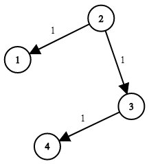

```
输入：times = [[2,1,1],[2,3,1],[3,4,1]], n = 4, k = 2
输出：2
```

**示例 2：**

```
输入：times = [[1,2,1]], n = 2, k = 1
输出：1
```

**示例 3：**

```
输入：times = [[1,2,1]], n = 2, k = 2
输出：-1
```

#### dijkstra 算法实现 贪心

```c++
class Solution {
public:
    int networkDelayTime(vector<vector<int>>& times, int N, int K){
      vector<int> dis(N+1,-1);
      dis[K]=0;
      using Pair=pair<int,int>;//first是距离，second是目标点
      priority_queue<Pair,vector<Pair>,greater<Pair>> pq;
      pq.emplace(0,K);//起点先入队
      
      while(!pq.empty()){
        auto e=pq.top();pq.pop();//e为连接visited和unvisited的最小边
        if(e.first>dis[e.second]) continue;//如果e的权比K到e.second还大，就可能缩路径了
        for(int i=0;i<times.size();i++){
          if(times[i][0]==e.second){//遍历一遍所有以e.second为起点的边，做lax，将rel之后的点入队
            int v=times[i][1];
            int w=e.first+times[i][2];
            if(dis[v]==-1||dis[v]>w){
              dis[v]=w;
              pq.emplace(w,v);
            }
          }
        }
      }
      
      int ans=0;
      for(int i=1;i<=N;i++){
        if(dis[i]==-1) return -1;
        ans=max(ans,dis[i]);
      }
      return ans;
    }
};
```

### [1514. 概率最大的路径](https://leetcode.cn/problems/path-with-maximum-probability/)

[labuladong 题解](https://labuladong.github.io/article/?qno=1514)[思路](https://leetcode.cn/problems/path-with-maximum-probability/#)

难度中等105

给你一个由 `n` 个节点（下标从 0 开始）组成的无向加权图，该图由一个描述边的列表组成，其中 `edges[i] = [a, b]` 表示连接节点 a 和 b 的一条无向边，且该边遍历成功的概率为 `succProb[i]` 。

指定两个节点分别作为起点 `start` 和终点 `end` ，请你找出从起点到终点成功概率最大的路径，并返回其成功概率。

如果不存在从 `start` 到 `end` 的路径，请 **返回 0** 。只要答案与标准答案的误差不超过 **1e-5** ，就会被视作正确答案。

 

**示例 1：**

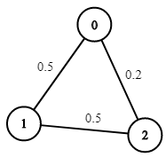

```
输入：n = 3, edges = [[0,1],[1,2],[0,2]], succProb = [0.5,0.5,0.2], start = 0, end = 2
输出：0.25000
解释：从起点到终点有两条路径，其中一条的成功概率为 0.2 ，而另一条为 0.5 * 0.5 = 0.25
```

**示例 2：**

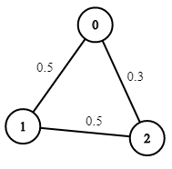

```
输入：n = 3, edges = [[0,1],[1,2],[0,2]], succProb = [0.5,0.5,0.3], start = 0, end = 2
输出：0.30000
```

**示例 3：**

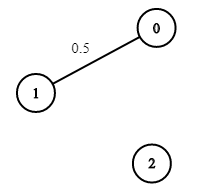

```
输入：n = 3, edges = [[0,1]], succProb = [0.5], start = 0, end = 2
输出：0.00000
解释：节点 0 和 节点 2 之间不存在路径
```

#### 代码

```c++
class Solution {
public:
    double maxProbability(int n, vector<vector<int>>& edges, vector<double>& succProb, int start, int end) {
      vector<vector<pair<double, int>>> graph(n);
      for(int i = 0; i<edges.size(); i++){
        auto& e = edges[i];
        graph[e[0]].emplace_back(succProb[i], e[1]);
        graph[e[1]].emplace_back(succProb[i], e[0]);
      }

      priority_queue<pair<double, int>> que;
      que.emplace(1, start);
      vector<double> prob(n, 0);
      prob[start] = 1;

      while(!que.empty()){
        auto [pr, node] = que.top();
        que.pop();
        if(pr < prob[node]) continue;
        for(auto& [prNext, nodeNext] : graph[node]){
          if(prob[nodeNext] < prob[node]* prNext){
            prob[nodeNext] = prob[node] * prNext;
            que.emplace(prob[nodeNext], nodeNext);
          }
        }
      }
      return prob[end];
    }
};
```
