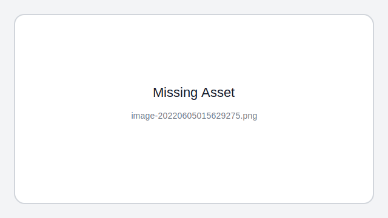

### C库函数

str`cpy`

从src逐字节拷贝到dest，直到遇到'\0'结束，因为没有指定长度，可能会导致拷贝越界，造成缓冲区溢出漏洞,`安全版本是strncpy函数`。

```c++
char* strcpy(char* destination, const char* source){
    if (destination == NULL)
        return NULL;
    char *ptr = destination;
    while (*source != '\0'){
        *destination = *source;
        destination++;
        source++;
    }
    *destination = '\0';
    return ptr;
}
```

str`ncpy`

```c++
char *mystrncpy(char *dest, const char *src, size_t count) {
  char *tmp = dest;
  while (count--) {
    if ((*tmp = *src) != 0)
      src++;
    tmp++;
  }
  return dest;
}


```

```c++
  char str[16] = {"hello,world!\n"};
  strncpy(str, "ipc", strlen("ipc"));  //ipclo,world!
  printf("%s\n", str);
  strncpy(str, "ipc\n", strlen("ipc")); ////ipclo,world!
  printf("%s\n", str);
  strncpy(str, "ipc", strlen("ipc") + 1); //ipc  此时ipc<给定大小 str补%0
  printf("%s\n", str);
```

#### memecpy

```c++
void *memcpy(void *dest, const void *src, size_t n) {
  char *dp = (char *)dest;
  char *sp = (char *)src;
  while (n--)
    *dp++ = *sp++;
  return dest;
}
```

#### memmove

```c++
void *memmove(void *dest, const void *src, size_t count) {
  assert(dest != NULL && src != NULL);
  // src在地址后面就没什么问题，从前往后一个个赋值
  if (dest < src) { // memcpy没有if判断
    char *p = (char *)dest;
    char *q = (char *)src;
    while (count--) {
      *p++ = *q++;
    }
  } else {
    char *p = (char *)dest + count;
    char *q = (char *)src + count;
    while (count--) {
      *--p = *--q;
    }
  }
  return dest;
}


char s[] = "1234567890";
char *p1 = s;
char *p2 = s + 2;
memcpy(p2, p1, 5);
//与
memmove(p2, p1, 5);
```

### `string`实现

```c++
class String {
public:
  String(const char *str = NULL);         // 普通构造函数
  String(const String &other);            // 拷贝构造函数
  ~String(void);                          // 析构函数
  String &operator=(const String &other); // 赋值函数
private:
  char *m_data; // 用于保存字符串
};
//普通构造函数
String::String(const char *str) {
  if (str == NULL) {
    m_data = new char[1];
    *m_data = '\0';
  } else {
    int length = strlen(str);
    m_data = new char[length + 1];
    strcpy(m_data, str);
  }
}
// String的析构函数
String::~String(void) { delete[] m_data; }
//拷贝构造函数
String::String(const String &other){ // 得分点：输入参数为const型
  int length = strlen(other.m_data);
  m_data = new char[length + 1];
  strcpy(m_data, other.m_data);
}
//赋值函数
String &String::operator=(const String &other){ // 得分点：输入参数为const型
  if (this == &other) {
    return *this;
  }
  delete[] m_data;
  m_data = new char[strlen(other.m_data) + 1];
  strcpy(m_data, other.m_data);
  return *this;
}
```

### `vector`实现

```c++
template <class T>
class MyVector {
 private:
  T *p;
  int _size;
  int _capcity;

 public:
  MyVector() : p(nullptr), _size(0), _capcity(0) {}

  MyVector(int n, T data) {
    _size = n;
    _capcity = n + 20;
    p = new T[n];
    for (int i = 0; i < n; i++) {
      p[i] = data;
    }
  }
  ~MyVector() {
    if (p != nullptr) {
      delete[] p;
    }
  }

  //注意必须是const& 传值不好 传&会有问题
  void push_back(const T &data) {
    if (p == nullptr) {
      _capcity = 20;
      p = new T[_capcity];
      _size = 0;
    } else if (_size == _capcity) {
      _capcity *= 2;
      T *new_p = new T[_capcity];
      memcpy(new_p, p, _size * sizeof(T));
      delete[] p;
      p = new_p;
    }
    p[_size++] = data;
  }

  void push_front(const T &data) {
    push_back(data);
    for (int i = _size - 1; i > 0; i--) {
      swap(p[i], p[i - 1]);
    }
  }

  int size() { return _size; }

  T &operator[](int index) {
    assert(index >= 0 && index < _size);
    return p[index];
  }

  T &operator[](int index) const {
    assert(index < 0 || index > _size);
    return p[index];
  }
};

int main() {
  MyVector<int> nums;
  nums.push_back(0);
  for (int i = 0; i < 10; i++) {
    nums.push_back(i);
  }
  for (int i = 0; i < nums.size(); i++) {
    cout << nums[i] << " ";
  }
  nums.push_front(0);
  for (int i = 0; i < nums.size(); i++) {
    cout << nums[i] << " ";
  }
  return 0;
}
```

### `智能指针`

```c++
#include <iostream>
#include <memory>

template <typename T> 

class SmartPointer {
private:
  T *_ptr;
  size_t *_count;

public:
  SmartPointer(T *ptr = nullptr) : _ptr(ptr) {
    if (_ptr) {
      _count = new size_t(1);  //初始化非空 设置count为1
    } else {
      _count = new size_t(0);	//初始化为空 count设为0
    }
  }

  SmartPointer(const SmartPointer &ptr) {
    if (this != &ptr) {
      this->_ptr = ptr._ptr;
      this->_count = ptr._count;
      (*this->_count)++;  //拷贝构造 count++
    }
  }

  SmartPointer &operator=(const SmartPointer &ptr) {
    if (this->_ptr == ptr._ptr) { //元素相等 直接返回
      return *this;
    }
    if (this->_ptr) { //本身非空 自己原来的计数-1
      (*this->_count)--;   //本身存在实例化对象，更换指向 因此count--
      if (*this->_count == 0) { //计数为0 释放所有
        delete this->_ptr;
        delete this->_count;
      }
    }
    this->_ptr = ptr._ptr;  //更改指向
    this->_count = ptr._count;
    (*this->_count)++;  //count++
    return *this;
  }

  T &operator*() {
    assert(this->_ptr);
    return *(this->_ptr);  //* 返回指针的解引用 实例化的对象
  }

  T *operator->() {
    assert(this->_ptr);
    return this->_ptr;  //->返回的是个指针
  }

  ~SmartPointer() {   //RAII机制, 对象离开作用域即调用析构函数
    (*this->_count)--;   //对象析构count--
    if (*this->_count == 0) { //引用计数为0，析构释放空间
      delete this->_ptr;
      delete this->_count;
    }
  }

  size_t use_count() { return *this->_count; }  //返回指向ptr堆空间的智能指针
};

int main() {
    SmartPointer<int> sp(new int(10));
    SmartPointer<int> sp2(sp);
    SmartPointer<int> sp3(new int(20));
    sp2 = sp3;
    std::cout << sp.use_count() << std::endl;
    std::cout << sp3.use_count() << std::endl;
 		// delete operator
}
```

### 顶堆

```c++
//小根堆
class Heap {
private:
  vector<int> _nums;

  //下滤
  void lower(int rootPos, int lastPos) {
    int leftPos = 2 * rootPos + 1;
    if (leftPos < lastPos) {
      int minPos = leftPos;
      int rightPos = leftPos + 1;
      if (rightPos < lastPos) {
        //大根堆应该找 maxPos 此处为 <
        minPos = _nums[leftPos] > _nums[rightPos] ? rightPos : leftPos;
      }
      if (_nums[minPos] < _nums[rootPos]) { //大根堆此处为 >
        swap(_nums[rootPos], _nums[minPos]);
        lower(minPos, lastPos);
      }
    }
  }

  //上滤
  void upper(int val) {
    _nums.push_back(val);
    int curr = _nums.size() - 1;
    while (curr > 0) {
      //注意这里要-1
      int parent = (curr - 1) / 2;
      // 大根堆此处为 > 
      if (_nums[curr] < _nums[parent]) {
        swap(_nums[curr], _nums[parent]);
        curr = parent;
      } else
        break;
    }
  }

  //建堆
  void build() {
    int n = _nums.size();
    for (int i = n / 2; i >= 0; i--) {
      lower(i, n);
    }
  }

public:
  Heap() {}
  Heap(vector<int> nums) : _nums(nums) { build(); }

  void push(int val) { upper(val); }

  void pop() {
    _nums.erase(_nums.begin());
    build();
  }

  int top() {
    assert(_nums.size());
    return _nums.front();
  }

  int size() { return _nums.size(); }
};

int main() {
  Heap que(vector<int>{1, 2, 5, 6, 10, 2, 4, 1});
  que.push(100);
  que.push(9);
  while (que.size()) {
    cout << que.top() << endl;
    que.pop();
  }
  return 0;
}
```


### `排序算法`

| **排序方法**         | **平均时间** | **最好时间** | **最坏时间** |
| -------------------- | ------------ | ------------ | ------------ |
| 桶排序(不稳定)       | O(n)         | O(n)         | O(n)         |
| 基数排序(稳定)       | O(n)         | O(n)         | O(n)         |
| 归并排序(==稳定==)   | `O(nlogn)`   | `O(nlogn)`   | `O(nlogn)`   |
| 快速排序(==不稳定==) | `O(nlogn)`   | `O(nlogn)`   | `O(n^2^)`    |
| 堆排序(不稳定)       | O(nlogn)     | O(nlogn)     | O(nlogn)     |
| 希尔排序(不稳定)     | O(n^1.25^)   |              |              |
| 冒泡排序(稳定)       | O(n^2^)      | O(n)         | O(n^2^)      |
| 选择排序(不稳定)     | O(n^2^)      | O(n^2^)      | O(n^2^)      |
| 直接插入排序(稳定)   | O(n^2^)      | O(n)         | O(n^2^)      |

> 注意的几个点
>
> 1. left 和 right比较 都是 left<right的时候继续 left>=right时 return

#### 快速排序

```c++
//分割函数
int paritition(vector<int>& A, int low, int high){
    int pivotValue = A[low];
    while(low<high){
        while(low<high && A[high] >= pivotValue)
            --high;  //从右向左查找到第一个小于pivot的坐标
        A[low] = A[high];
        while(low<high && A[low] <= pivotValue)
            ++low;   //从左向右查找到第一个大于pivot的坐标
        A[high] = A[low];
    }
    A[low] = pivotValue; //拿走的值返还 放到排序的位置
    return low;   //返回的是一个位置
    
}

//快排母函数
void quickSort(vector<int>& A, int low, int high){
    if(low<high){
        int pivotIndex = paritition(A, low, high);
        quickSort(A, low, pivotIndex-1);
        quickSort(A, pivotIndex+1, high);
    }
}

// 洗牌算法，将输入的数组随机打乱 避免极端情况
void shuffle(vector<int>& nums){
    srand(time(0)); //随机数种子是必须有的? 因为一次shuffle函数调用 多次rand
    for(int i = 0; i<nums.size(); i++){
        int r = i + rand()%(nums.size() - i)
        swap(nums[i], nums[r]);
    }
}
```

从大到小排序修改

```c++
    //分割函数
    int Paritition(vector<int>& A, int low, int high){
        int pivotValue = A[low];
        while(low<high){
            while(low<high && A[high] <= pivotValue) //<=
                --high;
            A[low] = A[high];
            while(low<high && A[low] >= pivotValue)  //>=
                ++low;
            A[high] = A[low];
        }
        A[low] = pivotValue;  //拿走的值返还 放到排序的位置
        return low;  //返回的是一个位置
    }
```

#### 堆排序

```c++
void heap_build(vector<int> &nums, int rootPos, int lastPos) {
  int leftPos = rootPos * 2 + 1;
  if (leftPos < lastPos) {
    int rightPos = leftPos + 1;
    int maxPos = leftPos;  //注意 这里必须初始化为leftPos
    if (rightPos < lastPos)
      maxPos = nums[leftPos] > nums[rightPos] ? leftPos : rightPos;
    if (nums[maxPos] > nums[rootPos]) {
      swap(nums[maxPos], nums[rootPos]);//下滤,交换位置
      heap_build(nums, maxPos, lastPos);//递归
    }
  }
}

void heap_sort(vector<int> &nums) {
  int n = nums.size();
  //从最后一个非叶子节点的父结点开始建堆 建堆复杂度为On
  //也就是说用到的是自下而上建堆法 用的是下滤操作  
  for (int i = n / 2; i >= 0; i--) {
    heap_build(nums, i, n);
  }
  for (int i = n - 1; i >= 0; i--) {
    swap(nums[0], nums[i]);
    heap_build(nums, 0, i);
  }
}
```

#### 归并排序

```c++
class Solution {
public:
    vector<int> sortArray(vector<int>& nums) {
      mergeSort(nums, 0, nums.size()-1);
      return nums;
    }
		
  	//归并排序
    void mergeSort(vector<int>& nums, int left, int right){
      if(left >= right)
        return;
      int mid = left + (right-left)/2;
      mergeSort(nums, left, mid);
      mergeSort(nums, mid+1, right);
      merge(nums, left, mid, right);
    }
		//合并两个
    void merge(vector<int>& nums, int left, int mid, int right){
      vector<int> leftNums(nums.begin()+left, nums.begin() + mid + 1);
      vector<int> rightNums(nums.begin()+mid + 1, nums.begin() + right + 1);
      int leftIndex = 0, rightIndex = 0;
      leftNums.insert(leftNums.end(), INT_MAX);
      rightNums.insert(rightNums.end(), INT_MAX);
      for(int i = left; i<=right; i++){
        if(leftNums[leftIndex] < rightNums[rightIndex])
          nums[i] = leftNums[leftIndex++];
        else nums[i] = rightNums[rightIndex++];
      }
    }
};
```

#### 选择排序

```c++
template <typename T>

void selection_sort(std::vector<T> &arr) {
  for (int i = 0; i < arr.size() - 1; i++) {
    int minIndex = i;
    for (int j = i + 1; j < arr.size(); j++)
      if (arr[j] < arr[minIndex])
        minIndex = j; //找到其他元素中的最小值对应的index
    std::swap(arr[i], arr[minIndex]); //交换
  }
}
```

#### 插入排序

```c++
void insertion_sort(int arr[],int len){
  for(int i=1;i<len;i++){
    int key=arr[i];  //拿出来比较的元素
    int j=i-1;
    while((j>=0) && (key<arr[j])){
      arr[j+1]=arr[j];
      j--;
    }
    arr[j+1]=key;
  }
}
```

### 字典树

```c++
class Trie{
private:
    vector<Trie*> next;
    bool isEnd;
    
public:
    Trie(): next(26), isEnd(0){}

    //树中插入单词
    void insert(const string& word) {
        Trie* node = this;
        for(char c : word){
            if(node->next[c - 'a'] == nullptr)
                node->next[c - 'a'] = new Trie();
            node = node->next[c - 'a'];
        }
        node->isEnd = 1;  //最后不要忘了 置为1
    }

    //查找树中是否包含单词word
    bool contianWord(const string& word) {
        Trie* node = this;
        for(char c : word){
            node = node->next[c - 'a'];
            if(node == nullptr) return 0;
        }
        return node->isEnd;
    }

    //查找树中是否包含以word为前缀的单词
    bool containWordStartsWith(const string& word) {
        Trie* node = this;
        for(char c : word){
            node = node->next[c - 'a'];
            if(node == nullptr) return 0;
        }
        return 1;
    }

    //在树中查找word的最短前缀 没有则返回为空
    string shortestPrefixOf(const string& word)  {
        Trie* node = this;
        string res = "";
        for (auto ch : word){
            if (node->isEnd || node->next[ch - 'a'] == nullptr) break;
            res += ch;
            node = node->next[ch - 'a'];
        }
        return node->isEnd ? res : "";         //有前缀返回前缀，没有则返回空字符串
    }
    
    //带通配符.的匹配 例如 a.c 匹配 abc
    bool hasKeyWithPattern(const string& word, int index){
        Trie* node = this;
        //字符串到头 检测树枝是否到头
        if(index >= word.size()) return node->isEnd == 1;

        char ch = word[index];
        //没有遇到通配符
        if(ch != '.' )
            return node->next[ch - 'a'] != nullptr && node->next[ch -  'a']->hasKeyWithPattern(word, index+1);

        //遇到通配符
        for(int i = 0; i<26; i++){
            if(node->next[i] != nullptr && node->next[i]->hasKeyWithPattern(word, index+1))
                return 1;
        }
        //没有找到
        return 0;
    }
};
```

### 线段树和树状数组

```c++
//线段树
class NumArray {
private:
	vector<int> segmentTree;
	int n;

	void build(int node, int left, int right, vector<int>& nums) {
		if (left == right) {
			segmentTree[node] = nums[left];
			return;
		}
		int mid = left + (right - left) / 2;
		build(node * 2 + 1, left, mid, nums);
		build(node * 2 + 2, mid + 1, right, nums);
		segmentTree[node] = segmentTree[node * 2 + 1] + segmentTree[node * 2 + 2];
	}

	void change(int index, int val, int node, int left, int right) {
		if (left == right) {
			segmentTree[node] = val;
			return;
		}
		int mid = left + (right - left) / 2;
		if (index <= mid)  //注意 全是小于等于
			change(index, val, node * 2 + 1, left, mid);
		else 
			change(index, val, node * 2 + 2, mid + 1, right);
		segmentTree[node] = segmentTree[node * 2 + 1] + segmentTree[node * 2 + 2];
	}

	int range(int searchLeft, int searchRight, int node, int left, int right) {
		if (searchLeft == left && searchRight == right)
			return segmentTree[node];
		int mid = left + (right - left) / 2;
		if (searchRight <= mid)
			return range(searchLeft, searchRight, node * 2 + 1, left, mid);
		else if (searchLeft > mid)
			return range(searchLeft, searchRight, node * 2 + 2, mid + 1, right);
		else //注意这里，right left 两个地方换mid
      return range(searchLeft, mid, node * 2 + 1, left, mid) + range(mid + 1, searchRight, node * 2 + 2, mid + 1, right);
	}
public:
	NumArray(vector<int>& nums) : n(nums.size()), segmentTree(nums.size() * 4) {
		build(0, 0, n - 1, nums);
	}

	void update(int index, int val) {
		change(index, val, 0, 0, n - 1);
	}

	int sumRange(int left, int right) {
		return range(left, right, 0, 0, n - 1);
	}
};

//树状数组
class NumArray {
public:
    vector<int> A;// 原数组
    vector<int> C;   // 树状数组

    int lowBit(int x) {
        return x & (-x);
    }

    NumArray(vector<int>& nums):A(nums) {
        C = vector<int> (A.size() + 1, 0);
        //构造树形数组
        for(int i = 1; i<=A.size(); i++) {
            C[i] += A[i - 1];
            //父结点要加上子结点的值
            if(i + lowBit(i) <= A.size()) 
                C[i + lowBit(i)] += C[i];
        }
    }
    
    void update(int index, int val) {
        int d = val - A[index];
        for(int i = index + 1; i < C.size(); i += lowBit(i)) 
            C[i] += d; // 更新树状数组       
        A[index] = val; // 更新原数组
    }
    
    int sumRange(int left, int right) {
        int r = 0, l = 0;
        //求right的前缀和
        for(int i = right + 1; i >= 1; i -= lowBit(i)) r += C[i];
        //求left的前缀和
        for(int i = left; i >= 1; i -= lowBit(i)) l += C[i];
        return r - l;
    }
};
```

### 前缀和数组

```c++
class PrefixSum {
private:
  // 前缀和数组
  vector<int> prefix;
  
public:
  /* 输入一个数组，构造前缀和 */
  PrefixSum(vector<int> nums) {
    int n = nums.size();
    prefix.resize(n+1);
    // 计算 nums 的累加和
    for (int i = 1; i <= n; i++) {
      prefix[i] = prefix[i - 1] + nums[i - 1];
    }
  }

  /* 查询闭区间 [i, j] 的累加和 */
  int query(int i, int j) {
    return prefix[j + 1] - prefix[i];
  }
};


```

### 差分数组

```c++
// 差分数组工具类
class Difference {
private:
  // 差分数组
  vector<int> diff;
public:
  /* 输入一个初始数组，区间操作将在这个数组上进行 */
  Difference(vector<int> nums) {
   	int n = nums.size();
    diff.resize(n);;
    // 根据初始数组构造差分数组
    diff[0] = nums[0];
    for (int i = 1; i < n; i++) {
      diff[i] = nums[i] - nums[i - 1];
    }
  }
  
  /* 给闭区间 [i,j] 增加 val（可以是负数）*/
  void increment(int i, int j, int val) {
    diff[i] += val;
    if (j + 1 < diff.size()) {
      diff[j + 1] -= val;
    }
  }

  /* 返回结果数组 */
  vector<int> result() {
    vector<int> res(diff.size());
    // 根据差分数组构造结果数组
    res[0] = diff[0];
    for (int i = 1; i < diff.size(); i++) 
      res[i] = res[i - 1] + diff[i];
    return res;
  }
};
```

### `并查集`

```c++
class UF {
private:
	//连同分量的个数
	int cnt;
	// 存储每个节点的父节点
	vector<int> parent;

public:
  // n 为图中节点的个数
	UF(int n) {
		cnt = n;
		parent.resize(n);
		for (int i = 0; i < n; ++i)
			parent[i] = i;
	}

	//联通节点
	void unionn(int p, int q) {
		int rootP = find(p);
		int rootQ = find(q);
		if (rootP == rootQ)
			return;
		parent[rootQ] = rootP;
		cnt--;
	}

	// 判断节点 p 和节点 q 是否连通
	bool connected(int p, int q) {
		int rootP = find(p);
		int rootQ = find(q);
		return rootP == rootQ;
	}

	// 返回节点 x 的连通分量根节点
	int find(int x) {
		while (parent[x] != x) {
			// 进行路径压缩
			parent[x] = parent[parent[x]];
			x = parent[x];
		}
		return x;
	}

	// 返回图中的连通分量个数
	int count() { return cnt; }
};
```

### `LRU`缓存

```c++
struct Node{
  int key, val;
  Node* pre;
  Node* next;
  Node(): pre(nullptr), next(nullptr) {}
  Node(int k, int v) : key(k), val(v), pre(nullptr), next(nullptr){}
};

class LRUCache {
    Node* head;
    Node* tail;
    int size;
    int capacity;
    unordered_map<int, Node*> mapp;
public:
    LRUCache(int capacity) {
      head = new Node;
      tail = new Node;
      head->next = tail;
      tail->pre = head;
      size = 0;
      this->capacity = capacity;
    }
    
    int get(int key) {
      if(mapp.count(key)){
        Node* temp = mapp[key];
        moveToHead(temp);
        return temp->val;
      }else 
        return -1;
    }
    
    void put(int key, int value) {
      if(mapp.count(key)){
        Node* temp = mapp[key];
        temp->val = value;
        moveToHead(temp);
      }else{ //新插入
        Node* temp = new Node(key, value);
        insertHead(temp);
        mapp[key] = temp;
        size++;
        if(size>capacity){
          Node* end = deleteEnd();
          mapp.erase(end->key);
          delete end;
        }
      }
    }
    //注意 所有的链表函数都不能在内部释放 因为hash也要删除
    //只有最后的尾部节点是需要真正删除的
    void deleteNode(Node* node){
      node->pre->next = node->next;
      node->next->pre = node->pre;
    }

    void moveToHead(Node* node){
      deleteNode(node);
      insertHead(node);
    }

    void insertHead(Node* node){
      Node* temp = head->next;
      head->next = node;
      node->pre = head;
      node->next = temp;
      temp->pre = node;
    }

    Node* deleteEnd(){
      Node* end = tail->pre;
      deleteNode(end);
      return end;
    }
};

/**
 * Your LRUCache object will be instantiated and called as such:
 * LRUCache* obj = new LRUCache(capacity);
 * int param_1 = obj->get(key);
 * obj->put(key,value);
 */
```

### `自旋锁`

1. 操作系统本来的实现: 借用cpu的 「测试并设置」的指令

   

2. ==**用C++原子量实现**==

   ```c++
   #include <atomic>
   
   class SpinLock {
   public:
     SpinLock() : flag_(false) {}
     // 加锁成功 flag置1
     void lock() {
       bool expect = false;
       //当前值flag与期望值expect相等时，修改当前值flag为设定值true，返回true 不进循环
       //当前值flag与期望值expect不等时，将期望值expect修改为当前值expect，返回false 进入循环
       while (!flag_.compare_exchange_weak(expect, true)) {
         // 如果flag为1 则expect被修改为1 返回0 进入while
         // 这里定要将expect复原， 执行失败时expect结果是未定的
         // 这样就一直while循环了
         expect = false;
       }
     }
     // 解锁 flag置0
     void unlock() { flag_.store(false); }
   
   private:
     std::atomic<bool> flag_;
   };
   
   //每个线程自增次数
   const int kIncNum = 1000000;
   //线程数
   const int kWorkerNum = 10;
   //自增计数器
   int Cnt = 0;
   //自旋锁
   SpinLock spinLock;
   //每个线程的工作函数
   void IncCounter() {
     for (int i = 0; i < kIncNum; ++i) {
       spinLock.lock();
       Cnt++;
       spinLock.unlock();
     }
   }
   
   int main() {
     std::vector<std::thread> workers;
     std::cout << "SpinLock inc MyTest start" << std::endl;
     Cnt = 0;
   
     std::cout << "start " << kWorkerNum << " workers_"
               << "every worker inc " << kIncNum << std::endl;
     std::cout << "count_: " << Cnt << std::endl;
     //创建10个工作线程进行自增操作
     for (int i = 0; i < kWorkerNum; ++i)
       workers.push_back(std::move(std::thread(IncCounter)));
   
     for (auto it = workers.begin(); it != workers.end(); it++)
       it->join();
   
     std::cout << "workers_ end" << std::endl;
     std::cout << "count_: " << Cnt << std::endl;
     //验证结果
     if (Cnt == kIncNum * kWorkerNum) {
       std::cout << "SpinLock inc MyTest passed" << std::endl;
       return true;
     } else {
       std::cout << "SpinLock inc MyTest failed" << std::endl;
       return false;
     }
     return 0;
   }
   ```

### `无等待锁`的实现

既然不想自旋，那当没获取到锁的时候，就把当前线程放入到锁的等待队列，然后执行调度程序，把 CPU 让给其他线程执行。



### `读写锁`

#### 1. 读优先  

```c++
#include <mutex>
#include <shared_mutex>

class readWriteLock {
private:
  std::shared_mutex readMtx;
  std::mutex writeMtx;
  int readCnt; //已加读锁个数
public:
  readWriteLock() : readCnt(0) {}
  void readLock() {
    readMtx.lock();
    if (++readCnt == 1) {
      writeMtx.lock(); // 存在线程读操作时，写加锁(只加一次)
    }
    readMtx.unlock();
  }

  void readUnlock() {
    readMtx.lock();
    if (--readCnt == 0) { //没有线程读操作时，释放写锁
      writeMtx.unlock();
    }
    readMtx.unlock();
  }

  void writeLock() { writeMtx.lock(); }
  void writeUnlock() { writeMtx.unlock(); }
};

//测试代码
volatile int var = 10; // 保持变量 var 对内存可见性，防止编译器过度优化
readWriteLock rwLock; // 定义全局的读写锁变量

void Write() {
  rwLock.writeLock();
  var += 10;
  std::cout << "write var : " << var << std::endl;
  rwLock.writeUnlock();
}

void Read() {
  rwLock.readLock();
  std::cout << "read var : " << var << std::endl;
  rwLock.readUnlock();
}

int main() {
  std::vector<std::thread> writers;
  std::vector<std::thread> readers;
  for (int i = 0; i < 10; i++) {           // 10 个写线程
    writers.push_back(std::thread(Write)); // std::thread t 的写法报错
  }
  for (int i = 0; i < 100; i++) { // 100 个读线程
    readers.push_back(std::thread(Read));
  }
  for (auto &t : writers) { // 写线程启动
    t.join();
  }
  for (auto &t : readers) { // 读线程启动
    t.join();
  }
  std::cin.get();
  return 0;
}
```

#### 2. 写优先

```c++
sem wMutex = 1;       //写者互斥量，控制写操作的互斥量
sem rCountMutex = 1;   //读者互斥量，控制对rCount的互斥修改
int rCount = 0;   //读者计数

void writer() {
	while (1) {
		P(wMutex);
		writeData();
		V(wMutex);
	}
}

void reader() {
	while (1) {
		P(rCountMutex);   //进入临界区
		//如果后面有写者，就阻塞写者
		if (rCount == 0) {
			P(wMutex);
		}
		rCount++;
		V(rCountMutex);  //退出临界区

		readData();

		P(rCountMutex);
		rCount--;
		if (rCount == 0) {
			V(wMutex); //最后一个读者离开，如果有写者等待写，就唤醒它
		}
		V(rCountMutex);
	}
}
```

#### 3. 公平读写锁

```c++
sem rCountMutex = 1;
sem wDataMutex = 1;
sem flag = 1;   //公平竞争互斥量
int rCount = 0; //读者计数

void write() {
  while (1) {
    P(flag);
    P(wDataMutex);
    writeData();
    V(wDataMutex);
    V(flag);
  }
}

void reader() {
  while (1) {
    P(flag);
    P(rCountMutex);
    if (rCount == 0) {
      P(wDataMutex); //如果有写者，阻塞写者
    }
    rCount++;
    V(rCountMutex);
    V(flag);

    readData();

    P(rCountMutex);
    rCount--;
    if (rCount == 0) {
      V(wDataMutex); //最后一个读者离开，唤醒写者线程
    }
    V(rCountMutex);
  }
}


class FairReadWriteLock {
  // std::mutex rCountMutex;
  // 信号量pv操作不会上锁 所以不用shared
  std::shared_mutex rCountMutex;
  std::mutex wDataMutex;
  std::mutex flag; //公平竞争互斥量
  int rCount = 0;  //读者计数
public:
  void writeLock() {
    flag.lock();
    wDataMutex.lock();
  }

  void writeUnlock() {
    wDataMutex.unlock();
    flag.unlock();
  }

  void readLock() {
    flag.lock();
    rCountMutex.lock();
    if (++rCount == 1) {
      //如果有写者，阻塞写者
      wDataMutex.lock();
    }
  }

  void readUnlock() {
    rCountMutex.unlock();
    flag.unlock();
    if (--rCount == 0) {
      wDataMutex.unlock(); //最后一个读者离开，唤醒写者线程
    }
  }
};
```

### `信号量`

操作系统内部实现 PV是原子操作


#### c++实现

```c++
#include <condition_variable>
#include <mutex>

namespace ilovers {
class semaphore {
public:
  semaphore(int value = 1) : count{value}, wakeups{0} {}

  void P() { // P操作 -1
    std::unique_lock<std::mutex> lock{mutex};
    if (--count < 0) { // count is not enough ?
      //除了需要调用其它线程调用notify_one()或者notify_all()函数外，
      //还需要wakeups > 0才会解除阻塞。
      condition.wait(
          lock, [&]() -> bool { return wakeups > 0; }); // suspend and wait ...
      --wakeups;                                        // ok, me wakeup !
    }
  }
  void V() { // V操作 +1
    std::lock_guard<std::mutex> lock{mutex};
    if (++count <= 0) { // have some thread suspended ?
      ++wakeups;
      condition.notify_one(); // notify one !
    }
  }

private:
  int count;   // 等待的线程数
  int wakeups; //要唤醒的人数 wakeup最小为0 阻塞不会让wakeup--
  std::mutex mutex;
  std::condition_variable condition;
};
}; // namespace ilovers

std::mutex m; //锁住输入输出流
ilovers::semaphore ba(0), cb(0), dc(0);

void a() {
  ba.P(); // b --> a
  std::lock_guard<std::mutex> lock{m};
  std::cout << "thread a" << '\n';
}
void b() {
  cb.P(); // c --> b
  std::lock_guard<std::mutex> lock{m};
  std::cout << "thread b" << '\n';
  ba.V(); // b --> a
}
void c() {
  dc.P(); // d --> c
  std::lock_guard<std::mutex> lock{m};
  std::cout << "thread c" << '\n';
  cb.V(); // c --> b
}
void d() {
  std::lock_guard<std::mutex> lock{m};
  std::cout << "thread d" << '\n';
  dc.V(); // d --> c
}

//效果 依次等待唤醒 dcba
int main() {
  std::thread th1{a}, th2{b}, th3{c}, th4{d};
  th1.join();
  th2.join();
  th3.join();
  th4.join();

  std::cout << "thread main" << std::endl;
  return 0;
}

```


### `function`实现多态

```c++
typedef void (*functionPtr)(void);
class Animal {
 public:
  Animal() {}
  ~Animal() {}
  void call() {
    // ptr();
    ftr();
  }

 protected:
  functionPtr ptr;
  function<void(void)> ftr;
};

class Cat : public Animal {
 public:
  Cat() {
    // this->ptr = catCall;  //绑定失败 因为形参有this, 参数不同
    // 重点是使用lamda捕获this指针 然后function绑定lamda
    ftr = [=]() { this->catCall(); };
  }
  ~Cat() {}

 private:
  void catCall() { cout << "cat call" << endl; }
};

class Dog : public Animal {
 public:
  Dog() {
    // this->ptr = catCall;  //绑定失败 因为形参有this, 参数不同
    // 重点是使用lamda捕获this指针 然后function绑定lamda
    ftr = [=]() { this->dogCall(); };
  }
  ~Dog() {}

 private:
  void dogCall() { cout << "dog call" << endl; }
};

int main() {
  Animal *animal = new Dog;
  animal->call();  // dog call
  animal = new Cat();
  animal->call();  // cat call
  return 0;
}
```

### `线程池`

```c++
#ifndef THREADPOOL_H
#define THREADPOOL_H

#include <assert.h>
#include <condition_variable>
#include <functional>
#include <mutex>
#include <queue>
#include <thread>

class ThreadPool {
public:
  explicit ThreadPool(size_t threadCount = 8)
      : pool_(std::make_shared<Pool>()) {
    assert(threadCount > 0);
    for (size_t i = 0; i < threadCount; i++) { //循环创建线程
      // lamda
      std::thread([pool = pool_] {
        std::unique_lock<std::mutex> locker(pool->mtx);
        while (true) {
          if (!pool->tasks.empty()) {
            //被唤醒, 执行队列头部的任务
            auto task = std::move(pool->tasks.front());
            pool->tasks.pop();
            locker.unlock();
            task();
            locker.lock();
          } else if (pool->isClosed)
            break;
          else
            pool->cond.wait(locker);
        }
      }).detach();
      //当前对象将不再和任何线程相关联
    }
  }

  ThreadPool() = default;
  ThreadPool(ThreadPool &&) = default;
  ~ThreadPool() {
    if (static_cast<bool>(pool_)) {
      {
        std::lock_guard<std::mutex> locker(pool_->mtx);
        pool_->isClosed = true;
      }
      //置位关闭 唤醒所有线程 进行清理
      pool_->cond.notify_all();
    }
  }

  template <class F> void AddTask(F &&task) {
    {
      std::lock_guard<std::mutex> locker(pool_->mtx);
      pool_->tasks.emplace(std::forward<F>(task));
    }
    //唤醒一个线程处理task
    pool_->cond.notify_one();
  }

private:
  struct Pool {
    std::mutex mtx;
    std::condition_variable cond;
    bool isClosed;
    std::queue<std::function<void()>> tasks;
  };

  //任务队列
  std::shared_ptr<Pool> pool_;
};

#endif

//调用
threadpool_->AddTask(std::bind(&WebServer::OnWrite_, this, client));
```

### [`http`响应报文](https://www.csdn.net/tags/MtTaMg1sMTA4OTM4LWJsb2cO0O0O.html#)

#### HTTP解析

```c++
enum HTTP_CODE {
  NO_REQUEST,    // 请求不完整，需要继续读取请求报文数据
  GET_REQUEST,   // 获得了完整的HTTP请求
  BAD_REQUEST,   // HTTP请求报文有语法错误
  INTERNAL_ERROR //服务器内部错误
};

enum LINE_STATUS {
  LINE_OK,  //	完整读取一行
  LINE_BAD, //报文语法有误
  LINE_OPEN //	读取的行不完整
};

enum CHECK_STATE_REQUESTLINE {
  CHECK_STATE_REQUESTLINE, //	解析请求行
  CHECK_STATE_HEADER,      //	解析请求头
  CHECK_STATE_CONTENT      //	解析请求体
};
// 从状态机负责读取报文的一行
http_conn::LINE_STATUS http_conn::parse_line() {
  // 将要分析的字节
  char temp;
  // m_read_idx：读缓冲区中数据的最后一个字节的下一个位置
  // m_checked_idx：指向从状态机当前正在分析的字节，最终指向读缓冲区下一行的开头
  for (; m_checked_idx < m_read_idx; ++m_checked_idx) {
    temp = m_read_buf[m_checked_idx];
    // 当前是'\r'，则有可能会读取到完整行
    if (temp == '\r') {
      // 下一个字符的位置是读缓冲区末尾
      if ((m_checked_idx + 1) == m_read_idx) {
        // 读取的行不完整，需要继续接收
        return LINE_OPEN;
      }
      // 下一个字符是'\n'
      else if (m_read_buf[m_checked_idx + 1] == '\n') {
        // 将'\r\n'改为'\0\0'
        m_read_buf[m_checked_idx++] = '\0';
        m_read_buf[m_checked_idx++] = '\0';
        // 完整读取一行
        return LINE_OK;
      }
      // 否则报文语法有误
      return LINE_BAD;
    }
    // 当前字符是'\n'，则有可能读取到完整行
    // 上次读取到'\r'就到读缓冲区末尾了，没有接收完整，再次接收时会出现这种情况
    else if (temp == '\n') {
      // 前一个字符是'\r'
      if (m_checked_idx > 1 && m_read_buf[m_checked_idx - 1] == '\r') {
        // 将'\r\n'改为'\0\0'
        m_read_buf[m_checked_idx - 1] = '\0';
        m_read_buf[m_checked_idx++] = '\0';
        // 完整读取一行
        return LINE_OK;
      }
      // 否则报文语法有误
      return LINE_BAD;
    }
  }
  // 没有找到'\r\n'，读取的行不完整
  return LINE_OPEN;
}

// 解析HTTP请求行
http_conn::HTTP_CODE http_conn::parse_request_line(char *text) {
  // 返回请求行中最先含有 空格 或 '\t'的位置
  m_url = strpbrk(text, " \t");

  // 如果没有 '\t' 或 空格
  if (!m_url) {
    // HTTP请求报文有语法错误
    return BAD_REQUEST;
  }
  // 将该位置改为'\0'，用于将请求类型取出
  *m_url++ = '\0';
  char *method = text;

  // 忽略大小写比较
  if (strcasecmp(method, "GET") == 0) {
    // GET请求
    m_method = GET;
  } else if (strcasecmp(method, "POST") == 0) {
    // POST请求
    m_method = POST;
    cgi = 1;
  } else {
    // HTTP请求报文有语法错误
    return BAD_REQUEST;
  }

  // 此时m_url跳过了第一个 空格 或 '\t'，但不知道之后是否还有
  // 将m_url向后偏移，通过查找继续跳过 空格 和 '\t'，指向请求资源的第一个字符
  m_url += strspn(m_url, " \t");

  m_version = strpbrk(m_url, " \t");
  // 如果没有 '\t' 或 空格
  if (!m_version) {
    // HTTP请求报文有语法错误
    return BAD_REQUEST;
  }
  // 将该位置改为'\0'，用于将请求资源取出
  *m_version++ = '\0';

  m_version += strspn(m_version, " \t");
  // 仅支持HTTP/1.1
  if (strcasecmp(m_version, "HTTP/1.1") != 0) {
    // HTTP请求报文有语法错误
    return BAD_REQUEST;
  }

  // 对请求资源前7/8个字符进行判断
  // 有些报文的请求资源中会带有http://，这里需要对这种情况进行单独处理
  if (strncasecmp(m_url, "http://", 7) == 0) {
    m_url += 7;
    // 返回首次出现'/'的位置的指针
    m_url = strchr(m_url, '/');
  }

  if (strncasecmp(m_url, "https://", 8) == 0) {
    m_url += 8;
    // 返回首次出现'/'的位置的指针
    m_url = strchr(m_url, '/');
  }

  if (!m_url || m_url[0] != '/') {
    // HTTP请求报文有语法错误
    return BAD_REQUEST;
  }

  // 当url为/时，显示欢迎界面
  if (strlen(m_url) == 1)
    strcat(m_url, "judge.html");

  // 请求行处理完毕，将主状态机状态转移处理请求头
  m_check_state = CHECK_STATE_HEADER;
  // 请求不完整
  return NO_REQUEST;
}

// 解析HTTP请求头与空行
http_conn::HTTP_CODE http_conn::parse_headers(char *text) {
  // 解析空行
  if (text[0] == '\0') {
    if (m_content_length != 0) {
      // POST请求，主状态机跳转到消息体处理状态
      m_check_state = CHECK_STATE_CONTENT;
      // 请求不完整
      return NO_REQUEST;
    }
    // GET请求，获得了完整的HTTP请求
    return GET_REQUEST;
  }
  // 解析HTTP请求头各字段
  // Connection
  else if (strncasecmp(text, "Connection:", 11) == 0) {
    text += 11;
    // 跳过'\t'与空格
    text += strspn(text, " \t");
    if (strcasecmp(text, "keep-alive") == 0) {
      m_linger = true;
    }
  }
  // Content-length
  else if (strncasecmp(text, "Content-length:", 15) == 0) {
    text += 15;
    // 跳过'\t'与空格
    text += strspn(text, " \t");
    m_content_length = atol(text);
  }
  // Host
  else if (strncasecmp(text, "Host:", 5) == 0) {
    text += 5;
    // 跳过'\t'与空格
    text += strspn(text, " \t");
    m_host = text;
  } else {
    LOG_INFO("Unknown Request Header Field: %s", text);
  }
  // 请求不完整
  return NO_REQUEST;
}

// 解析HTTP请求体
http_conn::HTTP_CODE http_conn::parse_content(char *text) {
  if (m_read_idx >= (m_content_length + m_checked_idx)) {
    text[m_content_length] = '\0';
    // POST请求中输入的用户名和密码
    m_string = text;
    // 获得了完整的HTTP请求
    return GET_REQUEST;
  }
  // 请求不完整
  return NO_REQUEST;
}

// 解析读缓冲区中HTTP请求报文
http_conn::HTTP_CODE http_conn::process_read() {
  // 初始化从状态机状态：完整读取一行
  LINE_STATUS line_status = LINE_OK;
  // 初始化报文解析的结果：请求不完整
  HTTP_CODE ret = NO_REQUEST;
  // 当前解析的一段报文
  char *text = 0;

  // (主状态机状态 == 解析消息体 && 从状态机状态 == 完整读取一行) ||
  // (返回的从状态机状态 == 完整读取一行)
  while ((m_check_state == CHECK_STATE_CONTENT && line_status == LINE_OK) ||
         ((line_status = parse_line()) == LINE_OK)) {
    // 将指针向后偏移，指向未处理的字符
    text = get_line();
    // m_checked_idx：指向从状态机当前正在分析的字节 -> 最终指向下一行的开头
    m_start_line = m_checked_idx;
    LOG_INFO("Currently parsing: %s", text);

    // 主状态机状态
    switch (m_check_state) {
      // 解析请求行
    case CHECK_STATE_REQUESTLINE: {
      ret = parse_request_line(text);
      if (ret == BAD_REQUEST) {
        return BAD_REQUEST;
      }
      break;
    }
    // 解析请求头
    case CHECK_STATE_HEADER: {
      ret = parse_headers(text);
      if (ret == BAD_REQUEST) {
        return BAD_REQUEST;
      }
      // 完整解析GET请求
      else if (ret == GET_REQUEST) {
        // 跳转到报文响应函数
        return do_request();
      }
      break;
    }
    // 解析消息体
    case CHECK_STATE_CONTENT: {
      // 判断读缓冲区中是否读取了消息体
      ret = parse_content(text);
      // 完整解析POST请求
      if (ret == GET_REQUEST) {
        // 跳转到报文响应函数
        return do_request();
      }
      // 解析完消息体即完成报文解析，避免再次进入循环，更新从状态机状态
      line_status = LINE_OPEN;
      break;
    }
    // 否则服务器内部错误
    default:
      return INTERNAL_ERROR;
    }
  }
  // 请求不完整
  return NO_REQUEST;
}

```

#### HTTP响应

```c++
// 组成响应报文
bool http_conn::add_response(const char *format, ...) {
  // 写缓冲区中数据的最后一个字节的下一个位置 >= 写缓冲区大小
  if (m_write_idx >= WRITE_BUFFER_SIZE) {
    return false;
  }
  // 定义可变参数列表
  va_list arg_list;
  // 将变量arg_list初始化为传入参数
  va_start(arg_list, format);
  // 将数据从可变参数列表写入写缓冲区，返回写入数据的长度
  int len = vsnprintf(m_write_buf + m_write_idx,
                      WRITE_BUFFER_SIZE - 1 - m_write_idx, format, arg_list);
  // 写入的数据长度 >= 缓冲区剩余空间
  if (len >= (WRITE_BUFFER_SIZE - 1 - m_write_idx)) {
    // 清空可变参列表
    va_end(arg_list);
    return false;
  }
  // 更新写缓冲区中数据的最后一个字节的下一个位置
  m_write_idx += len;
  // 清空可变参列表
  va_end(arg_list);

  LOG_INFO("Response: %s", m_write_buf);

  return true;
}

// 添加响应行
bool http_conn::add_status_line(int status, const char *title) {
  // HTTP协议版本号 状态码 状态消息
  return add_response("%s %d %s\r\n", "HTTP/1.1", status, title);
}

// 添加响应头
bool http_conn::add_headers(int content_len) {
  // 响应报文长度、连接状态、空行
  return add_content_length(content_len) && add_linger() && add_blank_line();
}

// 响应头添加响应报文的长度
bool http_conn::add_content_length(int content_len) {
  return add_response("Content-Length:%d\r\n", content_len);
}

// 响应头添加连接状态
bool http_conn::add_linger() {
  return add_response("Connection:%s\r\n",
                      (m_linger == true) ? "keep-alive" : "close");
}

// 添加空行
bool http_conn::add_blank_line() { return add_response("%s", "\r\n"); }

// 响应头添加文本类型
bool http_conn::add_content_type() {
  return add_response("Content-Type:%s\r\n", "text/html");
}

// 响应头添加响应正文
bool http_conn::add_content(const char *content) {
  return add_response("%s", content);
}

// 将响应报文写进写缓冲区
bool http_conn::process_write(HTTP_CODE ret) {
  switch (ret) {
    // 服务器内部错误
  case INTERNAL_ERROR: {
    // 状态行
    add_status_line(500, error_500_title);
    // 消息报头+空行
    add_headers(strlen(error_500_form));
    // 响应正文
    if (!add_content(error_500_form))
      return false;
    break;
  }
  // HTTP请求报文有语法错误
  case BAD_REQUEST: {
    // 状态行
    add_status_line(404, error_404_title);
    // 消息报头+空行
    add_headers(strlen(error_404_form));
    // 响应正文
    if (!add_content(error_404_form))
      return false;
    break;
  }
  // 请求资源禁止访问
  case FORBIDDEN_REQUEST: {
    // 状态行
    add_status_line(403, error_403_title);
    // 消息报头+空行
    add_headers(strlen(error_403_form));
    // 响应正文
    if (!add_content(error_403_form))
      return false;
    break;
  }
  // 请求资源可以正常访问
  case FILE_REQUEST: {
    // 状态行
    add_status_line(200, ok_200_title);
    if (m_file_stat.st_size != 0) {
      // 消息报头+空行
      add_headers(m_file_stat.st_size);
      // 第一个iovec指针指向响应报文缓冲区，长度为m_write_idx
      m_iv[0].iov_base = m_write_buf;
      m_iv[0].iov_len = m_write_idx;
      // 第二个iovec指针指向mmap返回的文件指针，长度为文件大小
      m_iv[1].iov_base = m_file_address;
      m_iv[1].iov_len = m_file_stat.st_size;
      m_iv_count = 2;
      // 发送的全部数据为响应报文头部信息和文件大小
      bytes_to_send = m_write_idx + m_file_stat.st_size;
      return true;
    }
    // 如果请求的资源大小为0，则返回空白html文件
    else {
      const char *ok_string = "<html><body></body></html>";
      // 消息报头+空行
      add_headers(strlen(ok_string));
      // 响应正文
      if (!add_content(ok_string))
        return false;
    }
  }
  default:
    return false;
  }
  // 除FILE_REQUEST状态外，其余状态只申请一个iovec，指向响应报文缓冲区
  m_iv[0].iov_base = m_write_buf;
  m_iv[0].iov_len = m_write_idx;
  m_iv_count = 1;
  bytes_to_send = m_write_idx;
  return true;
}
```


### `日志`系统

```c++
//.h
// 日志等级
enum LOG_LEVEL { V_INFO = 0, V_DEBUG, V_WARN, V_ERROR };

class Log {
public:
  // log初始化
  void init(const char *path = "./../log", const char *suffix = ".log");
  // 单例化模式
  static Log *Instance() {
  	// static实现简单的单例模式
  	static Log logObject;
  	return &logObject;
	}
  // 单例模式异步写日志
  static void flushLogThreadRun(){ Log::Instance()->asyncWriteLog(); }
  // 异步日志
  void asyncWriteLog(){
    while (true) {
    	unique_lock<mutex> locker(logmtx_);
    	if (logQue_.empty()) {
      	que_not_empty.wait(locker);
    	}

    	fputs(logQue_.front().c_str(), fileptr_);
    	fflush(fileptr_);
    	logQue_.pop();
  	}
  }
  // 添加日志
  void logAdd(LOG_LEVEL level, const char *format, ...); //添加一条日志
  // 添加日志级别
  void AppendLogLevelTitle_(LOG_LEVEL level);
  // 是否打开
  bool IsOpen(){
  	lock_guard<mutex> locker(logmtx_);
  	return isOpen_;
	}

private:
  Log();
  virtual ~Log();

  int lineCnt_;
  bool isAsync_;
  bool isOpen_;

  Buffer buff_;
  int today_;

  FILE *fileptr_;
  mutex logmtx_;
  condition_variable que_not_empty;

  unique_ptr<thread> workThread_;
  queue<string> logQue_;

  const char *path_;
  const char *suffix_;

  static const int LOG_NAME_LEN = 100;
  static const int MAX_LINES = 5000;
};

//添加日志
#define LOG_BASE(level, format, ...)			 \
  do {											 \
    Log *log = Log::Instance();					 \
    if (log->IsOpen()) {						 \
      log->logAdd(level, format, ##__VA_ARGS__); \
    }											 \
  } while (0);

//不同的日志级别
#define LOG_DEBUG(format, ...)					 \
  do {											 \
    LOG_BASE(V_DEBUG, format, ##__VA_ARGS__)	 \
  } while (0);
#define LOG_INFO(format, ...)					 \
  do {											 \
    LOG_BASE(V_INFO, format, ##__VA_ARGS__)		 \
  } while (0);
#define LOG_WARN(format, ...)					 \
  do {											 \
    LOG_BASE(V_WARN, format, ##__VA_ARGS__)		 \
  } while (0);
#define LOG_ERROR(format, ...)					 \
  do {											 \
    LOG_BASE(V_ERROR, format, ##__VA_ARGS__)	 \
  } while (0);

#endif
```

### `定时器`实现

#### 时间轮[时间轮定时器 - 知乎 (zhihu.com)](https://zhuanlan.zhihu.com/p/84502375)

#### 双向链表

```c++
#ifndef HEAP_TIMER_H
#define HEAP_TIMER_H

#include "../log/log.h"
#include <algorithm>
#include <arpa/inet.h>
#include <assert.h>
#include <chrono>
#include <functional>
#include <queue>
#include <time.h>
#include <unordered_map>

struct TimerNode {
  int fd_;
  timeval endTime_;          //时间戳
  std::function<void()> cb_; //超时回调函数
  TimerNode *next;
  TimerNode *pre;
  TimerNode() : fd_(-1), next(nullptr), pre(nullptr) {}
  bool operator<(const TimerNode &t) {
    return endTime_.tv_sec < t.endTime_.tv_sec;
  }
};

class HeapTimer {
public:
  HeapTimer();
  ~HeapTimer();

  void updateNode(int fd, int timeout);
  //插入时间节点 并为节点绑定回调函数
  void addNode(int fd, int timeout, const std::function<void()> cb);
  int nextNodeClock();

private:
  void removeNode(int fd);
  void removeEnding();              //清除超时结点
  void nodeToBack(TimerNode *node); //移动节点到尾部

  TimerNode *head_; //头节点
  TimerNode *back_; //尾节点
  std::unordered_map<int, TimerNode *> node_map_;
};

#endif // HEAP_TIMER_H

//.cpp
#include "heaptimer.h"

HeapTimer::HeapTimer() {
  head_ = new TimerNode();
  back_ = new TimerNode();
  head_->fd_ = -1;
  back_->fd_ = -1;
  head_->next = back_;
  back_->pre = head_;
  node_map_.clear();
}

HeapTimer::~HeapTimer() {
  unordered_map<int, TimerNode *>::iterator iter = node_map_.begin();
  while (iter != node_map_.end())
    removeNode(iter->first);
  delete head_;
  delete back_;
  head_ = nullptr;
  back_ = nullptr;
  node_map_.clear();
}

void HeapTimer::nodeToBack(TimerNode *node) {
  assert(node != nullptr);

  node->pre->next = node->next;
  node->next->pre = node->pre;

  node->pre = back_->pre;
  node->pre->next = node;
  node->next = back_;
  back_->pre = node;
}

void HeapTimer::addNode(int fd, int timeout, const std::function<void()> cb) {
  assert(fd >= 0);
  if (node_map_.find(fd) == node_map_.end()) {
    TimerNode *temp = new TimerNode();
    temp->fd_ = fd;
    gettimeofday(&temp->endTime_, nullptr);
    temp->endTime_.tv_sec += timeout;
    temp->cb_ = cb;

    temp->pre = back_->pre;
    temp->pre->next = temp;
    temp->next = back_;
    back_->pre = temp;

    node_map_[fd] = temp;
  } else
    updateNode(fd, timeout);
}

void HeapTimer::removeNode(int fd) {

  if (node_map_.find(fd) == node_map_.end())
    return;
  TimerNode *node = node_map_[fd];
  assert(node != nullptr);

  node->pre->next = node->next;
  node->next->pre = node->pre;
  node_map_.erase(node->fd_);

  node->cb_();
  delete node;
}

void HeapTimer::updateNode(int fd, int timeout) {
  assert(node_map_.find(fd) != node_map_.end());
  gettimeofday(&node_map_[fd]->endTime_, nullptr);
  node_map_[fd]->endTime_.tv_sec += timeout;
  nodeToBack(node_map_[fd]);
}

void HeapTimer::removeEnding() {
  if (node_map_.empty())
    return;
  TimerNode *node = head_->next;
  timeval tmv;
  while (node != back_) {
    gettimeofday(&tmv, nullptr);
    if (tmv.tv_sec < node->endTime_.tv_sec)
      break;
    if (node_map_.find(node->fd_) == node_map_.end()) {
      LOG_ERROR("fd : %d timer error", node->fd_);
      continue;
    }
    removeNode(node->fd_);
    node = head_->next;
  }
}

int HeapTimer::nextNodeClock() {
  removeEnding(); //清除超时节点
  if (node_map_.empty())
    return -1;
  timeval tmv;
  gettimeofday(&tmv, nullptr);
  return head_->next->endTime_.tv_sec - tmv.tv_sec;
}
```

### unique_ptr

```c++
#include <iostream>
#include <memory>

namespace ztl {

// 定义一个callable对象作为默认删除期
template <typename T> class deafult_deleter {
public:
  void operator()(T *ptr) {
    delete ptr;
    ptr = nullptr;
  }
};

template <typename T, typename deleter = deafult_deleter<T>> class unique_ptr {
public:
  unique_ptr() : m_ptr(nullptr) {}
  unique_ptr(T *ptr) : m_ptr(ptr) {}
  unique_ptr(unique_ptr &&lsh);
  ~unique_ptr() { deleter()(m_ptr); }

private:
  unique_ptr(const unique_ptr &lsh);
  unique_ptr &operator=(const unique_ptr &lsh);

public:
  T &operator*() { return *m_ptr; }
  T *operator->() { return m_ptr; }
  unique_ptr &operator=(unique_ptr &&lsh); // 移动赋值
  operator bool() const { return m_ptr != nullptr; }

  // 返回原始指针
  T *get() const { return m_ptr; }
  // 返回指针，释放所有权
  T *release();
  // 替换被管理的对象
  void reset(T *ptr);
  // 交换被管理的对象
  void swap(unique_ptr &lsh) { std::swap(m_ptr, lsh.m_ptr); }

private:
  T *m_ptr;
};

template <typename T, typename deleter>
unique_ptr<T, deleter>::unique_ptr(unique_ptr &&lsh) : m_ptr(lsh.m_ptr) {
  lsh.m_ptr = nullptr;
}

template <typename T, typename deleter>
unique_ptr<T, deleter> &unique_ptr<T, deleter>::operator=(unique_ptr &&lsh) {
  std::swap(m_ptr, lsh.m_ptr);
  return *this;
}

template <typename T, typename deleter> T *unique_ptr<T, deleter>::release() {
  T *temp = m_ptr;
  m_ptr = nullptr;
  return temp;
}

template <typename T, typename deleter>
void unique_ptr<T, deleter>::reset(T *ptr) {
  unique_ptr<T, deleter>().swap(*this);
  m_ptr = ptr;
}

} // namespace ztl
```

### [设计模式](https://qianxunslimg.xyz/2022/04/22/she-ji-mo-shi/)

#### 工厂模式 略

#### 线程安全的单例 饿汉

```c++
#include <iostream>
#include <algorithm>

using namespace std;

class SingleInstance{
public:
    static SingleInstance* GetInstance(){
        static SingleInstance ins;
        return &ins;
    }
    ~SingleInstance(){};
private:
    // 涉及到创建对象的函数都设为private
    SingleInstance() { std::cout<<"SingleInstance() 饿汉"<<std::endl; }
    SingleInstance(const SingleInstance& other) {};
    SingleInstance& operator=(const SingleInstance& other) { return *this; }
};

int main(){
    // 因为不能创建对象所以通过静态成员函数的方法返回静态成员变量
    SingleInstance* ins = SingleInstance::GetInstance();
    return 0;
}
```

#### 懒汉模式(线程安全需要加锁)

```c++
#include <pthread.h>
#include <iostream>
#include <algorithm>

using namespace std;

class SingleInstance{
public:
    static SingleInstance* GetInstance(){
        if(ins == nullptr){
            pthread_mutex_lock(&mutex);
            if(ins == nullptr){
                ins = new SingleInstance();
            }
            pthread_mutex_unlock(&mutex);
        }
        return ins;
    }
    ~SingleInstance(){};
    static pthread_mutex_t mutex;
private:
    SingleInstance() { std::cout << "SingleInstance() 懒汉" << std::endl; }
    SingleInstance(const SingleInstance* other){};
    SingleInstance& operator=(const SingleInstance& other) { return *this; }
    static SingleInstance* ins;
};

// 懒汉模式静态变量需要定义
SingleInstance* SingleInstance::ins = nullptr;
pthread_mutex_t SingleInstance::mutex;

int main(){
    SingleInstance* ins = SingleInstance::GetInstance();
    delete ins;
    return 0;
}
```

#### 观察者模式

```c++
//观察者接口
class ObserverInterface{
public:
    virtual void dosomething()=0;
    virtual ~ObserverInterface(){}
};

//被观察者接口
class SubjectInterface{
public:
    virtual void Add(ObserverInterface* obr)=0;
    virtual void Remove(ObserverInterface* obr)=0;
    virtual void Notify()=0;

    virtual ~SubjectInterface(){}
};

//我自己
class Me:public SubjectInterface{
public:
    void Add(ObserverInterface* obr) override{
        observers.push_back(obr);
    }

    void Remove(ObserverInterface* obr) override{
        auto pos=std::find(observers.begin(),observers.end(),obr);
        if(pos!=observers.end()){
            observers.erase(pos);
        }
    }

    void Notify() override{
        for(const auto& obs:observers){
            obs->dosomething();
        }
    }

private:
    std::vector<ObserverInterface*> observers;
};

//孩子妈
class Wife:public ObserverInterface{
public:
    void dosomething() override{
        std::cout<<"老公快回来了，开始做饭"<<std::endl;
    }
};

//孩子
class Son:public  ObserverInterface{
public:
    void dosomething() override {
        std::cout<<"爸爸快回来了，不能玩游戏了"<<std::endl;
    }
};

//main函数
int main(){
    Me me;
    ObserverInterface* wife=new Wife;
    ObserverInterface* son=new Son;
    me.Add(wife);
    me.Add(son);

    //下班了 发消息
    me.Notify();

    delete wife;
    delete son;
}
```

### 生产者消费者

```c++
#include <condition_variable>
#include <deque>
#include <iostream>
#include <mutex>
#include <thread>
using namespace std;

deque<int> q;
mutex mt;
condition_variable cond;

void thread_producer() {
  //预计产量
  int count = 10;
  while (count > 0) {
    unique_lock<mutex> unique(mt);
    q.push_front(count);
    unique.unlock();
    cout << "producer a value: " << count << endl;
    cond.notify_one();
    this_thread::sleep_for(chrono::seconds(1));
    count--;
  }
}

void thread_consumer() {
  int data = 0;
  while (data != 1) {
    unique_lock<mutex> unique(mt);
    while (q.empty())
      cond.wait(unique);
    data = q.back();
    q.pop_back();
    cout << this_thread::get_id() << "consumer a value : " << data << endl;
    unique.unlock();
  }
}

int main() {
  thread t1(thread_consumer);
  thread t2(thread_consumer);
  thread t3(thread_producer);
  t1.join();
  t2.join();
  t3.join();
  return 0;
}
```

### 死锁及解决

```c++
#include <mutex>
#include <iostream>
using namespace std

mutex _mutex1;
mutex _mutex2;

int cnt = 0;
void process1() {
  _mutex1.lock();

  for (int i = 0; i < 10000000; i++) {
    cnt++;
  }

  _mutex2.lock();
  // 解决多锁死锁
  // 1. 调库
  // C++ 标准库中提供了std::lock()函数，能够保证将多个互斥锁同时上锁，
  // std::lock(_mutex1, _mutex2);
  // std::lock_guard<std::mutex> guard(_mutex1, std::adopt_lock);
  // std::lock_guard<std::mutex> guard2(_mutex2, std::adopt_lock);

  // 2. 相同的顺序加锁

  for (int i = 0; i < 10000000; i++) {
    cnt++;
  }

  _mutex2.unlock();
  _mutex1.unlock();
}

void process2() {
  _mutex2.lock();

  for (int i = 0; i < 10000000; i++) {
    cnt++;
  }
  _mutex1.lock();
  for (int i = 0; i < 10000000; i++) {
    cnt++;
  }
  _mutex1.unlock();
  _mutex2.unlock();
}
int main() {

  thread t1(process1);
  thread t2(process2);
  t1.join();
  t2.join();
  return 0;
}
```
