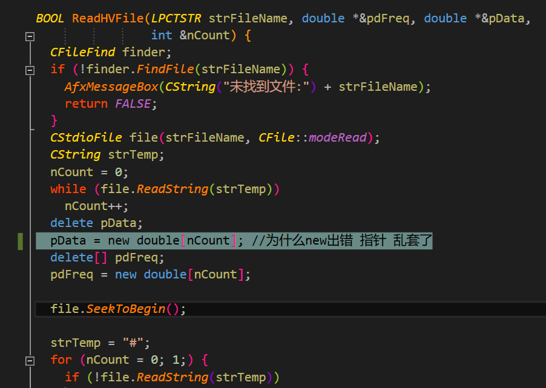

## 指针数组赋值越界引发的bug

### 问题描述

- 项目中写了这么一段代码，整段代码在while循环中循环读取数据

```c++
    if (!GetAveData(strFilePath, m_ppHVFreq[i], m_ppHV[i], m_pnHVSize[i]))  //读取hv数据
      return FALSE;

    nSize = m_pnHVSize[i];  //nSize为300
    m_ppdHVFreqLog[i] = new double[nSize];

    for (int m = 0; m < nSize; m++) {
      m_ppdHVFreqLog[i][m] = log(m_ppHVFreq[i][m]);
      allHvFreMax =
          allHvFreMax > m_ppHVFreq[i][m] ? allHvFreMax : m_ppHVFreq[i][m];
    }

    //读取spec数据
    if (!ReadSpecFile(m_arrDataFiles[i], m_ppdSpecFreq[i], m_ppdSpecV[i],
                      m_pnSpecSize[i]))
      return FALSE;

    //保存spec 的 log frequency
    int nnSize = m_pnSpecSize[i];
	//命名不规范，调试两行泪
    m_ppdSpecFreqLog[i] = new double[nSize]; // 100 hv 300 spec

    for (int m = 0; m < nnSize; m++) {
      m_ppdSpecFreqLog[i][m] = log(m_ppdSpecFreq[i][m]);
    }
```

- 在代码的第21行`m_ppdSpecFreqLog[i] = new double[nSize]; // 100 hv 300 spec`，这段代码中想着用nnSize(300)开辟，结果开辟成了nSize(100)大小，导致在后续的处理中，对数组进行了越界的赋值

```c++
    m_ppdSpecFreqLog[i] = new double[nSize]; // 100 hv 300 spec

    for (int m = 0; m < nnSize; m++) {
      m_ppdSpecFreqLog[i][m] = log(m_ppdSpecFreq[i][m]);
    }
```

- 开辟了一百的大小却赋了300的值，这样的直接后果就是后面用new开辟指针数组 ==疯狂中断== 报访问异常，难以定位，难以排查

  

### 教训

1. 命名不规范，调试两行泪
2. 认真认真认真
3. new出错，优先查找这个bug
