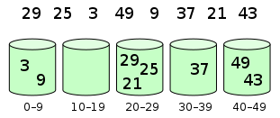
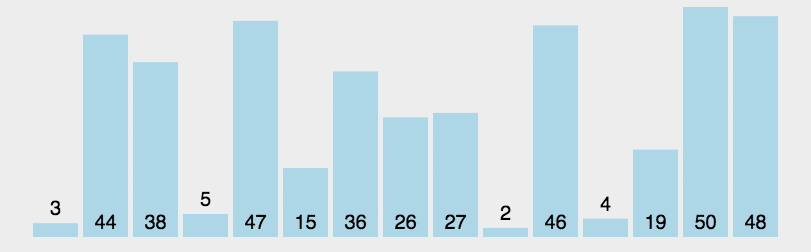
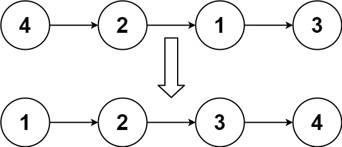
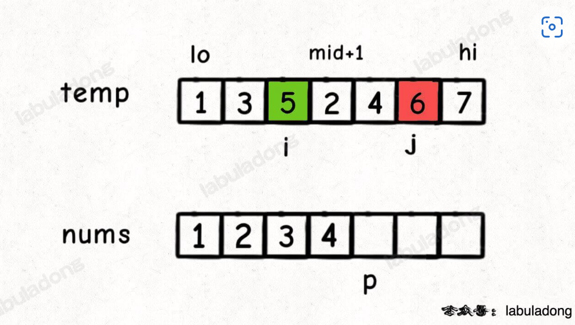
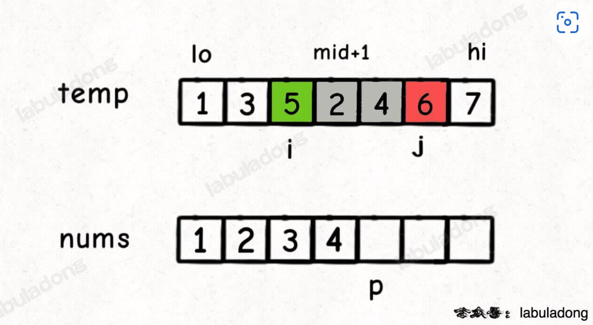
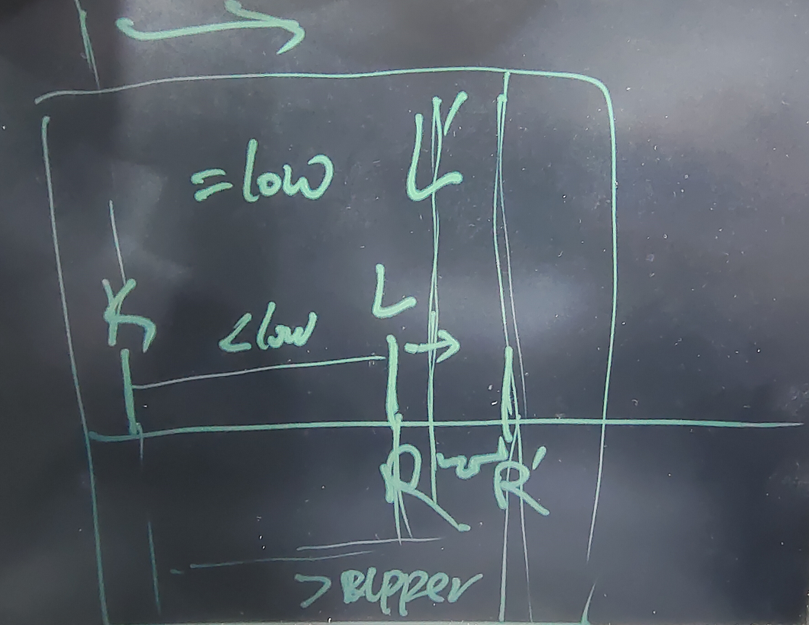
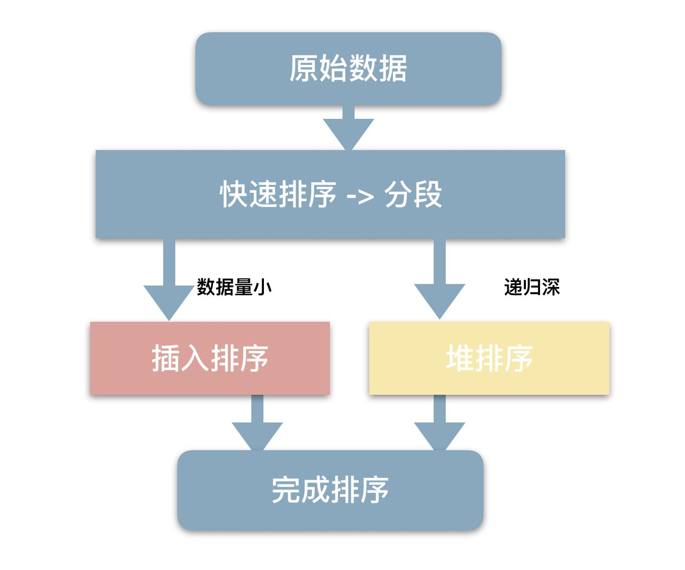
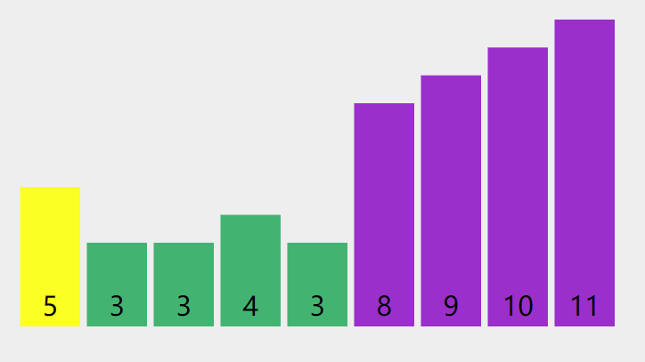
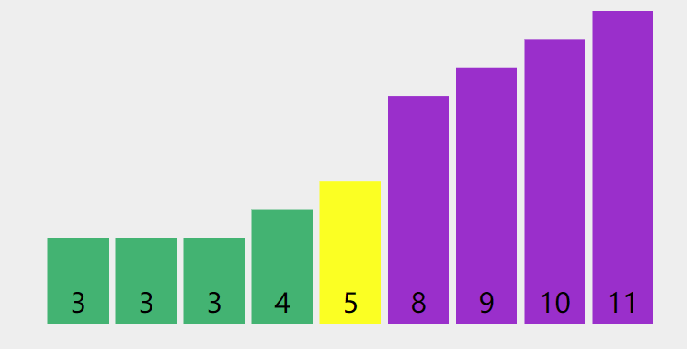

# 排序算法

| **排序方法**         | **平均时间** | **最好时间** | **最坏时间** |
| -------------------- | ------------ | ------------ | ------------ |
| 桶排序(不稳定)       | O(n)         | O(n)         | O(n)         |
| 基数排序(稳定)       | O(n)         | O(n)         | O(n)         |
| 归并排序(==稳定==)   | `O(nlogn)`   | `O(nlogn)`   | `O(nlogn)`   |
| 快速排序(==不稳定==) | `O(nlogn)`   | `O(nlogn)`   | `O(n^2^)`    |
| 堆排序(不稳定)       | O(nlogn)     | O(nlogn)     | O(nlogn)     |
| 希尔排序(不稳定)     | O(n^1.25^)   |              |              |
| 冒泡排序(稳定)       | O(n^2^)      | O(n)         | O(n^2^)      |
| 选择排序(不稳定)     | O(n^2^)      | O(n^2^)      | O(n^2^)      |
| 直接插入排序(稳定)   | O(n^2^)      | O(n)         | O(n^2^)      |

## `桶排序`

[桶排序](https://wiki.jikexueyuan.com/project/easy-learn-algorithm/bucket-sort.html)是计数排序的升级版。它利用了函数的映射关系，高效与否的关键就在于这个映射函数的确定。为了使桶排序更加高效，我们需要做到这两点：

1. 在额外空间充足的情况下，尽量增大桶的数量
2. 使用的映射函数能够将输入的 N 个数据均匀的分配到 K 个桶中

同时，对于桶中元素的排序，选择何种比较排序算法对于性能的影响至关重要。

### 1. 什么时候最快

当输入的数据可以均匀的分配到每一个桶中。

### 2. 什么时候最慢

当输入的数据被分配到了同一个桶中。

### 3. 示意图

元素分布在桶中：



然后，元素在每个桶中排序：


代码：

````c++

#include <iostream>
#include <iterator>
#include <vector>
using namespace std;
const int BUCKET_NUM = 10;

struct ListNode {
	explicit ListNode(int i = 0) : mData(i), mNext(NULL) {}
	ListNode *mNext;
	int mData;
};

//有序链表插入val
ListNode *insert(ListNode *head, int val) {
	ListNode dummyNode;
	ListNode *newNode = new ListNode(val);
	ListNode *pre, *curr;
	dummyNode.mNext = head;
	pre = &dummyNode;
	curr = head;
	while (NULL != curr && curr->mData <= val) {
		pre = curr;
		curr = curr->mNext;
	}                      // 找到第一个大于val的node curr
	newNode->mNext = curr; //插入val
	pre->mNext = newNode;  //拼接
	return dummyNode.mNext;
}

//合并两个有序链表
ListNode *Merge(ListNode *head1, ListNode *head2) {
	ListNode dummyNode;
	ListNode *dummy = &dummyNode;
	while (NULL != head1 && NULL != head2) {
		if (head1->mData <= head2->mData) {
			dummy->mNext = head1;
			head1 = head1->mNext;
		}
		else {
			dummy->mNext = head2;
			head2 = head2->mNext;
		}
		dummy = dummy->mNext;
	}
	if (NULL != head1)
		dummy->mNext = head1;
	if (NULL != head2)
		dummy->mNext = head2;

	return dummyNode.mNext;
}

void BucketSort(int n, int arr[]) {
	vector<ListNode *> buckets(BUCKET_NUM, (ListNode *)(0));
	for (int i = 0; i < n; ++i) {
		int index = arr[i] / BUCKET_NUM;
		ListNode *head = buckets.at(index);
		buckets.at(index) = insert(head, arr[i]);
	}
	ListNode *head = buckets.at(0);
	for (int i = 1; i < BUCKET_NUM; ++i) {
		head = Merge(head, buckets.at(i));
	}
	for (int i = 0; i < n; ++i) {
		arr[i] = head->mData;
		head = head->mNext;
	}
}

````

```c++
	//桶排序
	void bucketsort(int* A, int n) {
		vector<vector<int>> bucket(10);   //分配10个桶（0~9、10~19...）
		for (int i = 0; i < 10; i++) {    //每个桶初始化
			vector<int> x = { 0 };
			bucket.push_back(x);
		}
		//把待排序列放入桶中
		for (int i = 0; i < n; i++) {
			bucket[A[i] / 10].push_back(A[i]); //10 桶大小
		}
		//把每个桶内的数据填充回到原序列中
		int k = 0;
		for (int i = 0; i < 10; i++) {   
			sort(bucket[i].begin(), bucket[i].end());  //桶内排序
			for (vector<int>::iterator it = bucket[i].begin(); it != bucket[i].end(); it++)
				A[k++] = *it;	
		}
	}
```


## 冒泡排序

冒泡排序（Bubble Sort）也是一种简单直观的排序算法。它重复地走访过要排序的数列，一次比较两个元素，如果他们的顺序错误就把他们交换过来。走访数列的工作是重复地进行直到没有再需要交换，也就是说该数列已经排序完成。这个算法的名字由来是因为越小的元素会经由交换慢慢"浮"到数列的顶端。

作为最简单的排序算法之一，冒泡排序给我的感觉就像 Abandon 在单词书里出现的感觉一样，每次都在第一页第一位，所以最熟悉。冒泡排序还有一种优化算法，就是立一个 flag，当在一趟序列遍历中元素没有发生交换，则证明该序列已经有序。但这种改进对于提升性能来

说并没有什么太大作用。

### 1. 算法步骤

比较相邻的元素。如果第一个比第二个大，就交换他们两个。

对每一对相邻元素作同样的工作，从开始第一对到结尾的最后一对。这步做完后，最后的元素会是最大的数。

针对所有的元素重复以上的步骤，除了最后一个。

持续每次对越来越少的元素重复上面的步骤，直到没有任何一对数字需要比较。

### 2. 动图演示


每次遍历都会把极大值固定在最右侧，所以不需要完整的两个for

### 3. 什么时候最快

当输入的数据已经是正序时（都已经是正序了，我还要你冒泡排序有何用啊）。

### 4. 什么时候最慢

当输入的数据是反序时（写一个 for 循环反序输出数据不就行了，干嘛要用你冒泡排序呢，我是闲的吗）。

### 5. 代码

```c++
#include <iostream>
using namespace std;
template<typename T> //整数或浮点数皆可使用,若要使用类(class)或结构体(struct)时必须重载大于(>)运算符
void bubble_sort(T arr[], int len) {
        int i, j;
        for (i = 0; i < len - 1; i++)
                for (j = 0; j < len - 1 - i; j++)
                        if (arr[j] > arr[j + 1])
                                swap(arr[j], arr[j + 1]);
}
int main() {
        int arr[] = { 61, 17, 29, 22, 34, 60, 72, 21, 50, 1, 62 };
        int len = (int) sizeof(arr) / sizeof(*arr);
        bubble_sort(arr, len);
        for (int i = 0; i < len; i++)
                cout << arr[i] << ' ';
        cout << endl;
        float arrf[] = { 17.5, 19.1, 0.6, 1.9, 10.5, 12.4, 3.8, 19.7, 1.5, 25.4, 28.6, 4.4, 23.8, 5.4 };
        len = (float) sizeof(arrf) / sizeof(*arrf);
        bubble_sort(arrf, len);
        for (int i = 0; i < len; i++)
                cout << arrf[i] << ' '<<endl;
        return 0;
}
```

#### [可视化](https://visualgo.net/en/sorting)

```c++
void bubbleSort(vector<int> &nums) {
  int n = nums.size();
  bool swapped;
  do {
    swapped = 0;
    for (int i = 0; i < n - 1; i++) {
      if (nums[i] > nums[i + 1]) {
        swap(nums[i], nums[i + 1]);
        swapped = 1;
      }
    }
  } while (swapped);
}

```


## `快速排序`

### 1. 算法步骤

1. 从数列中挑出一个元素，称为 "基准"（pivot）;
2. 重新排序数列，所有元素比基准值小的摆放在基准前面，所有元素比基准值大的摆在基准的后面（相同的数可以到任一边）。在这个分区退出之后，该基准就处于数列的中间位置。这个称为分区（partition）操作；
3. 递归地（recursive）把小于基准值元素的子数列和大于基准值元素的子数列排序；

### 2. [动图演示](https://www.bilibili.com/video/BV1at411T75o)



### 3. 代码 （二叉树的前序遍历）

1. 洗牌
2. low < high
3. -1 +1
4. 先从右到左, 再从左到右

```c++
//分割函数
int paritition(vector<int>& A, int low, int high){
    int pivotValue = A[low];
    while(low<high){
        while(low<high && A[high] >= pivotValue)
            --high;  //从右向左查找到第一个小于pivot的坐标
        A[low] = A[high];
        while(low<high && A[low] <= pivotValue)
            ++low;   //从左向右查找到第一个大于pivot的坐标
        A[high] = A[low];
    }
    A[low] = pivotValue; //拿走的值返还 放到排序的位置
    return low;   //返回的是一个位置
    
}

// 洗牌算法，将输入的数组随机打乱 避免极端情况
void shuffle(vector<int>& nums){
    srand(time(0)); //随机数种子是必须有的? 因为一次shuffle函数调用 多次rand
    for(int i = 0; i<nums.size(); i++){
        int r = i + rand()%(nums.size() - i)
        swap(nums[i], nums[r]);
    }
}

//快排母函数
void quickSort(vector<int>& A, int low, int high){
    if(low<high){
        int pivotIndex = paritition(A, low, high);
        quickSort(A, low, pivotIndex-1);
        quickSort(A, pivotIndex+1, high);
    }
}
```

从大到小排序修改

```c++
    //分割函数
    int Paritition(vector<int>& A, int low, int high){
        int pivot = A[low];
        while(low<high){
            while(low<high && A[high] <= pivot) //<=
                --high;
            A[low] = A[high];
            while(low<high && A[low] >= pivot)  //>=
                ++low;
            A[high] = A[low];
        }
        A[low] = pivot;  //拿走的值返还 放到排序的位置
        return low;  //返回的是一个位置
    }
```


### [215. 数组中的第K个最大元素](https://leetcode-cn.com/problems/kth-largest-element-in-an-array/)

[labuladong 题解](https://labuladong.gitee.io/plugin-v4/?qno=215&target=gitee)[思路](https://leetcode-cn.com/problems/kth-largest-element-in-an-array/#)

难度中等1553

给定整数数组 `nums` 和整数 `k`，请返回数组中第 `**k**` 个最大的元素。

请注意，你需要找的是数组排序后的第 `k` 个最大的元素，而不是第 `k` 个不同的元素。

 

**示例 1:**

```
输入: [3,2,1,5,6,4] 和 k = 2
输出: 5
```

**示例 2:**

```
输入: [3,2,3,1,2,4,5,5,6] 和 k = 4
输出: 4
```

**提示：**

- `1 <= k <= nums.length <= 104`
- `-104 <= nums[i] <= 104`

思路： 

1. 快速排序  洗牌算法打乱原数组
2. 明确排序区间 分治 以及 及时返回

```c++
//快速排序
class Solution {
public:
    //分割函数
    int Paritition(vector<int>& A, int low, int high){
        int pivot = A[low];
        while(low<high){
            while(low<high && A[high] >= pivot)
                --high;
            A[low] = A[high];
            while(low<high && A[low] <= pivot)
                ++low;
            A[high] = A[low];
        }
        A[low] = pivot;  //拿走的值返还 放到排序的位置
        return low;  //返回的是一个位置
    }

    void quickSort(vector<int>& A, int low, int high){
        if(low<high){
            int pivot = Paritition(A, low, high);
            //注意 每一次快排都会确定一个位置，位置满足时，直接返回
            if(pivot == A.size()-k) 
                return;

            //优化排序区间 有点类似于二分查找了
            if(pivot>= A.size() - k)
                quickSort(A, low, pivot-1);
            else quickSort(A, pivot+1, high);
        }
    }
    int k;
    int findKthLargest(vector<int>& nums, int k) {
        this->k = k;
        shuffle(nums);
        quickSort(nums, 0, nums.size()-1);
        return nums[nums.size()-k];
    }

    // 洗牌算法，将输入的数组随机打乱 避免极端情况
    void shuffle(vector<int>& nums){
        srand(time(0));
        for(int i = 0; i<nums.size(); i++){
            int r = i + rand()%(nums.size() - i);
            swap(nums[i], nums[r]);
        }
    }
};
```

从大到小

```c++
class Solution {
public:
    int findKthLargest(vector<int>& nums, int k) {
      shuffel(nums);
      quickSort(nums, 0, nums.size() - 1, k);
      for(int num : nums) cout<<num<<" ";
      return nums[k - 1];
    }

    void quickSort(vector<int>& nums, int left, int right, int k){
      if(left < right){
        int pivotIndex = paritation(nums, left, right);
        if(pivotIndex > k - 1)
          quickSort(nums, left, pivotIndex - 1, k);
        else if(pivotIndex < k - 1)
          quickSort(nums, pivotIndex + 1, right, k);
        else return;
      }
    }

    int paritation(vector<int>& nums, int left, int right){
      int pivotVal = nums[left];
      while(left < right){
        while(left < right && nums[right] <= pivotVal){
          right--;
        }
        nums[left] = nums[right];

        while(left < right && nums[left] >= pivotVal){
          left++;
        }
        nums[right] = nums[left];
      }
      nums[left] = pivotVal;
      return left;
    }

    void shuffel(vector<int>& nums){
      int n = nums.size();
      for(int i = 0; i<n; i++){
        int j = i + rand()%(n - i);
        swap(nums[i], nums[j]);
      }
    }
};
```


## `归并排序`

归并排序（Merge sort）是建立在归并操作上的一种有效的排序算法。该算法是采用分治法（Divide and Conquer）的一个非常典型的应用。

作为一种典型的分而治之思想的算法应用，归并排序的实现由两种方法：

- 自上而下的递归（所有递归的方法都可以用迭代重写，所以就有了第 2 种方法）；
- 自下而上的迭代；

在《数据结构与算法 JavaScript 描述》中，作者给出了自下而上的迭代方法。但是对于递归法，作者却认为：

> However, it is not possible to do so in JavaScript, as the recursion goes too deep for the language to handle.
>
> 然而，在 JavaScript 中这种方式不太可行，因为这个算法的递归深度对它来讲太深了。

说实话，我不太理解这句话。意思是 JavaScript 编译器内存太小，递归太深容易造成内存溢出吗？还望有大神能够指教。

和选择排序一样，归并排序的性能不受输入数据的影响，但表现比选择排序好的多，因为始终都是 O(nlogn) 的时间复杂度。代价是需要额外的内存空间。

### 1. 算法步骤

1. 申请空间，使其大小为两个已经排序序列之和，该空间用来存放合并后的序列；
2. 设定两个指针，最初位置分别为两个已经排序序列的起始位置；
3. 比较两个指针所指向的元素，选择相对小的元素放入到合并空间，并移动指针到下一位置；
4. 重复步骤 3 直到某一指针达到序列尾；
5. 将另一序列剩下的所有元素直接复制到合并序列尾。

### 2. 动图演示


### 3. 代码 （二叉树的后序遍历）

迭代：

```c++
template<typename T> // 整數或浮點數皆可使用,若要使用物件(class)時必須設定"小於"(<)的運算子功能
void merge_sort(T arr[], int len) {
    T *a = arr;
    T *b = new T[len];
    for (int seg = 1; seg < len; seg += seg) {
        for (int start = 0; start < len; start += seg + seg) {
            int low = start, mid = min(start + seg, len), high = min(start + seg + seg, len);
            int k = low;
            int start1 = low, end1 = mid;
            int start2 = mid, end2 = high;
            while (start1 < end1 && start2 < end2)
                b[k++] = a[start1] < a[start2] ? a[start1++] : a[start2++];
            while (start1 < end1)
                b[k++] = a[start1++];
            while (start2 < end2)
                b[k++] = a[start2++];
        }
        T *temp = a;
        a = b;
        b = temp;
    }
    if (a != arr) {
        for (int i = 0; i < len; i++)
            b[i] = a[i];
        b = a;
    }
    delete[] b;
}
```

递归：

````c++
class Solution {
    vector<int> tmp;
    void mergeSort(vector<int>& nums, int l, int r) {
        if (l >= r) return;
        int mid = (l + r) >> 1;
        mergeSort(nums, l, mid);
        mergeSort(nums, mid + 1, r);
        
        //后序遍历的代码位置
        int i = l, j = mid + 1;
        int cnt = 0;
        while (i <= mid && j <= r) {
            if (nums[i] <= nums[j]) {
                tmp[cnt++] = nums[i++];
            }
            else {
                tmp[cnt++] = nums[j++];
            }
        }
        while (i <= mid) {
            tmp[cnt++] = nums[i++];
        }
        while (j <= r) {
            tmp[cnt++] = nums[j++];
        }
        for (int i = 0; i < r - l + 1; ++i) {
            nums[i + l] = tmp[i];
        }
    }
public:
    vector<int> sortArray(vector<int>& nums) {
        tmp.resize((int)nums.size(), 0);
        mergeSort(nums, 0, (int)nums.size() - 1);
        return nums;
    }
};
````

`更好理解的一个写法` 记这个吧 反正都是需要开辟新的空间

```c++
void merge(vector<int> &nums, int left, int mid, int right) {
	// preconditions:
	// nums[left, mid] is sorted
	// nums[mid + 1, right] is sorted
	// Copy nums[left ... mid] to LeftSubNums
	// Copy nums[mid+1 ... end] to RightSubNums
	vector<int> LeftSubNums(nums.begin() + left, nums.begin() + mid + 1);
	vector<int> RightSubNums(nums.begin() + mid + 1, nums.begin() + right + 1);
	int indexLeft = 0, indexRight = 0;
	LeftSubNums.insert(LeftSubNums.end(), INT_MAX);
	RightSubNums.insert(RightSubNums.end(), INT_MAX);
	// Pick min of LeftSubnums[idxLeft] and RightSubnums[idxRight], and put into nums[i]
	for (int i = left; i <= right; i++) {
		if (LeftSubNums[indexLeft] < RightSubNums[indexRight]) {
			nums[i] = LeftSubNums[indexLeft];
			indexLeft++;
		}
		else {
			nums[i] = RightSubNums[indexRight];
			indexRight++;
		}
	}
}

void mergeSort(vector<int> &nums, int left, int right) {
	if (left >= right)
		return;
	int mid = left + (right - left) / 2;
	mergeSort(nums, left, mid);
	mergeSort(nums, mid + 1, right);
	merge(nums, left, mid, right);
}
```

更更好理解的一个 `记这个`

```c++
void merge(int left, int right, vector<int> &nums, vector<int> &tmp) {
  // 终止条件
  if (left >= right)
    return;
  // 递归划分
  int mid = (left + right) / 2;
  merge(left, mid, nums, tmp);
  merge(mid + 1, right, nums, tmp);
  // 合并阶段
  int i = left, j = mid + 1;
  for (int k = left; k <= right; k++)
    tmp[k] = nums[k];
  for (int k = left; k <= right; k++) {
    if (i == mid + 1) //i == mid+ 1表示左侧排完 只能排右边了
      nums[k] = tmp[j++];
    //j == r+1表示右边排完 只能排左边
    else if (j == right + 1 || tmp[i] <= tmp[j])
      nums[k] = tmp[i++];
    else //都没排完，且temp[i]>temp[j]
      nums[k] = tmp[j++];
  }
}

void mergeSort(vector<int> &nums) {
  vector<int> tmp(nums.size());
  merge(0, nums.size() - 1, nums, tmp);
}

```


### [剑指 Offer II 077. 链表排序](https://leetcode-cn.com/problems/7WHec2/)

难度中等53

给定链表的头结点 `head` ，请将其按 **升序** 排列并返回 **排序后的链表** 。

**示例 1：**



```
输入：head = [4,2,1,3]
输出：[1,2,3,4]
```

**示例 2：**


```
输入：head = [-1,5,3,4,0]
输出：[-1,0,3,4,5]
```

**进阶：**你可以在 `O(n log n)` 时间复杂度和常数级空间复杂度下，对链表进行排序吗？


进阶的话就是归并排序实现了，数组的归并排序需要用到额外的空间 而链表的归并则不需要

#### 方法1

自上而下的进行归并排序

```c++
class Solution {
public:
    ListNode* mergeTwo(ListNode* head1, ListNode* head2){
      ListNode dumpyNode;
      ListNode* dumpy = &dumpyNode;
      while(head1 != nullptr && head2 != nullptr){
        if(head1->val <head2->val){
          dumpy->next = head1;
          head1 = head1->next;
        }else{
          dumpy->next = head2;
          head2 = head2->next;
        } 
        dumpy = dumpy->next;
      }
      dumpy->next = head1?head1:head2;
      return dumpyNode.next;
    }

    ListNode* sortList(ListNode* head, ListNode* tail){
      //主要是这里 两个节点的时候断开为单个节点
      //因为tail可能是nullptr 也可是下一段的第一个节点
      if(head == nullptr) return head;
      if(head->next == tail){
        head->next = nullptr;
        return head;
      }
      ListNode* slow = head, *fast = head;
      while(fast!= tail && fast->next != tail){
        fast = fast->next->next;
        slow = slow->next;
      }
      ListNode* mid = slow;
      return mergeTwo(sortList(head, mid), sortList(mid, tail));
    }

    ListNode* sortList(ListNode* head) {
      return sortList(head, nullptr);
    }
};
```

### [剑指 Offer II 078. 合并排序链表](https://leetcode-cn.com/problems/vvXgSW/)

难度困难37

给定一个链表数组，每个链表都已经按升序排列。

请将所有链表合并到一个升序链表中，返回合并后的链表。

 

**示例 1：**

```
输入：lists = [[1,4,5],[1,3,4],[2,6]]
输出：[1,1,2,3,4,4,5,6]
解释：链表数组如下：
[
  1->4->5,
  1->3->4,
  2->6
]
将它们合并到一个有序链表中得到。
1->1->2->3->4->4->5->6
```

#### 方法1

暴力merge2

```c++
class Solution {
public:
    ListNode* mergeTwo(ListNode* head1, ListNode* head2){
      ListNode dumpy;
      ListNode* dumpyNode = &dumpy;
      while(head1 && head2){
        if(head1->val <= head2->val){
          dumpyNode->next = head1;
          head1 = head1->next;
        }else{
          dumpyNode->next = head2;
          head2 = head2->next;
        }
        dumpyNode = dumpyNode->next;
      }
      dumpyNode->next = head1?head1:head2;
      return dumpy.next;
    }

    ListNode* mergeKLists(vector<ListNode*>& lists) {
      if(lists.empty()) return nullptr;
      ListNode dumpy;
      dumpy.next = lists[0];
      for(int i = 1; i<lists.size(); i++){
        dumpy.next = mergeTwo(lists[i], dumpy.next);
      }
      return dumpy.next;
    }
};
```

#### 方法2

多路归并

```c++
class Solution {
public:
    ListNode* mergeTwo(ListNode* head1, ListNode* head2){
      ListNode dumpy;
      ListNode* dumpyNode = &dumpy;
      while(head1 && head2){
        if(head1->val <= head2->val){
          dumpyNode->next = head1;
          head1 = head1->next;
        }else{
          dumpyNode->next = head2;
          head2 = head2->next;
        }
        dumpyNode = dumpyNode->next;
      }
      dumpyNode->next = head1?head1:head2;
      return dumpy.next;
    }

    ListNode* mergeKLists(vector<ListNode*>& lists) {
      if(lists.empty()) return nullptr;
      return mergeK(lists, 0, lists.size() - 1);
    }

    ListNode* mergeK(vector<ListNode*>& lists, int left, int right){
      if(left == right) return lists[left];
      if(left > right) return nullptr;
      int mid = left + (right - left)/2;
      ListNode* l1 = mergeK(lists, left, mid);
      ListNode* l2 = mergeK(lists, mid + 1, right);
      return mergeTwo(l1, l2);
    }
};
```

### [剑指 Offer 51. 数组中的逆序对](https://leetcode.cn/problems/shu-zu-zhong-de-ni-xu-dui-lcof/)

难度困难748

在数组中的两个数字，如果前面一个数字大于后面的数字，则这两个数字组成一个逆序对。输入一个数组，求出这个数组中的逆序对的总数。

 

**示例 1:**

```
输入: [7,5,6,4]
输出: 5
```

#### 归并

**我们在使用 `merge` 函数合并两个有序数组的时候，其实是可以知道一个元素 `nums[i]` 后边有多少个元素比 `nums[i]` 小的**。

具体来说，比如这个场景：



这时候我们应该把 `temp[i]` 放到 `nums[p]` 上，因为 `temp[i] < temp[j]`。

但就在这个场景下，我们还可以知道一个信息：5 后面比 5 小的元素个数就是 左闭右开区间 `[mid + 1, j)` 中的元素个数，即 2 和 4 这两个元素：



**换句话说，在对 `nuns[lo..hi]` 合并的过程中，每当执行 `nums[p] = temp[i]` 时，就可以确定 `temp[i]` 这个元素后面比它小的元素个数为 `j - mid - 1`**。

当然，`nums[lo..hi]` 本身也只是一个子数组，这个子数组之后还会被执行 `merge`，其中元素的位置还是会改变。但这是其他递归节点需要考虑的问题，我们只要在 `merge` 函数中做一些手脚，叠加每次 `merge` 时记录的结果即可。

发现了这个规律后，我们只要在 `merge` 中添加两行代码即可解决这个问题，看解法代码：

```c++
class Solution {
public:
    int reversePairs(vector<int>& nums) {
        vector<int> tmp(nums.size());
        return mergeSort(0, nums.size() - 1, nums, tmp);
    }
private:
    int mergeSort(int l, int r, vector<int>& nums, vector<int>& tmp) {
        // 终止条件
        if (l >= r) return 0;
        // 递归划分
        int m = (l + r) / 2;
        int res = mergeSort(l, m, nums, tmp) + mergeSort(m + 1, r, nums, tmp);
        // 合并阶段
        int i = l, j = m + 1;
        for (int k = l; k <= r; k++)
            tmp[k] = nums[k];
        for (int k = l; k <= r; k++) {
            if (i == m + 1)
                nums[k] = tmp[j++];
            else if (j == r + 1 || tmp[i] <= tmp[j])
                nums[k] = tmp[i++];
            else {
                nums[k] = tmp[j++];
                res += m - i + 1; // 统计逆序对
            }
        }
        return res;
    }
};
```

### [327. 区间和的个数](https://leetcode.cn/problems/count-of-range-sum/)

[labuladong 题解](https://labuladong.github.io/article/?qno=327)[思路](https://leetcode.cn/problems/count-of-range-sum/#)

难度困难440

给你一个整数数组 `nums` 以及两个整数 `lower` 和 `upper` 。求数组中，值位于范围 `[lower, upper]` （包含 `lower` 和 `upper`）之内的 **区间和的个数** 。

**区间和** `S(i, j)` 表示在 `nums` 中，位置从 `i` 到 `j` 的元素之和，包含 `i` 和 `j` (`i` ≤ `j`)。

 

**示例 1：**

```
输入：nums = [-2,5,-1], lower = -2, upper = 2
输出：3
解释：存在三个区间：[0,0]、[2,2] 和 [0,2] ，对应的区间和分别是：-2 、-1 、2 。
```

**示例 2：**

```
输入：nums = [0], lower = 0, upper = 0
输出：1
```

#### 前缀和暴力 超时

```c++
class Solution {
public:
    int countRangeSum(vector<int>& nums, int lower, int upper) {
      int n = nums.size();
      int ans = 0;
      vector<long> preSum(n + 1);
      for(int i = 1; i<=n; i++)
        preSum[i] = preSum[i-1] + nums[i-1];
      for(int i = 0; i<=nums.size(); i++){
        for(int j = i+1; j<=nums.size(); j++){
          long temp = preSum[j] - preSum[i];
          if(temp <= upper && temp >= lower)
            ans++;
        }
      }
      return ans;
    }
};
```

#### 归并

滑窗示意图



```c++
class Solution {
public:
    int upper;
    int lower;
    int ans;
    int countRangeSum(vector<int>& nums, int lower, int upper) {
      int n = nums.size();
      ans = 0;
      this->upper = upper;
      this->lower = lower;
      vector<long> preSum(n + 1);
      for(int i = 1; i<=n; i++)
        preSum[i] = preSum[i-1] + nums[i-1];
      vector<long> temp(n+1);
      merge(preSum, 0, n, temp);
      return ans;
    }

    void merge(vector<long>& nums, int left, int right, vector<long>& temp){
      if(left>=right) return;
      int mid = left + (right-left) /2;
      merge(nums, left, mid, temp);
      merge(nums, mid+1, right, temp);

      // //暴力枚举 超时？
      // for(int i = left; i<=mid; i++){
      //   for(int j = mid + 1; j<=right; j++){
      //     long delta = nums[j] - nums[i];
      //     if(delta<=upper && delta>=lower)
      //       ans++;
      //   }
      // }
			
      //类似滑窗
      int start = mid + 1, end = mid + 1;
      for(int k = left; k<=mid; k++){
        while(start <= right && nums[start] - nums[k] <lower)
          start++;
        while(end <= right && nums[end] - nums[k] <= upper)
          end++;
        ans += end -start;
      }

      //归并
      for(int k = left; k<=right; k++)
        temp[k] = nums[k];
      int i = left;
      int j = mid + 1;
      for(int k = left; k<=right; k++){
        if(i == mid+1)
          nums[k] = temp[j++];
        else if(j == right+1 || temp[i] <= temp[j])
          nums[k] = temp[i++];
        else
          nums[k] = temp[j++];
      }
    }
};
```

## `堆排序`

[这个视频很牛逼](https://www.bilibili.com/video/BV1AF411G7cA/?spm_id_from=333.788.recommend_more_video.-1&vd_source=247930c6c184032909af4f3293b42221)

堆排序应用的`数据结构`: 完全二叉树  除了最后一层每层都满, 且最后一层是从左到右

### 上下滤

上滤一般用于元素插入堆的场景, 将元素插入到最后不断于父节点交换位置, 直到满足堆序性. 插入的时间复杂度为Ologn

下滤是父节点与大于自己的最大的子节点交换位置, 以满足堆序性.

### 建堆过程

生成具有堆序性的完全二叉树 所谓的堆序性其实就是根节点比两个节点都大或者都小

怎样建堆呢 一般采用由下而上的进行建堆 也就是从倒数第二层依次进行下滤操作, 通过节点与子节点位置的交换 实现这一层的堆序性, 然后向上进行相同的操作   这样建堆的时间复杂度为On 而不断插入建堆的时间复杂度为Onlogn

### [为什么建堆的时间复杂度是O(n)](https://blog.csdn.net/LeoSha/article/details/46116959)

因为建堆的过程是自下而上的 是个非典型的递归过程, 外层是on 而==内层是一个分治策略瞎的logn的循环==

### 堆弹出

堆弹出的过程其实就是将根节点弹出, 然后将最后一个节点放于根节点的位置进行下滤操作, 直到满足堆序性

### 堆排序

把根堆内的所有元素依次弹出就是堆排序了

使用大根堆实现从小到达的排序 相反 使用小根堆实现从大到小的排序

```c++
// 下滤操作 比较父节点和叶子节点 大于父节点的最大的叶子节点与父节点交换位置
void Heap_build(int a[], int root, int length) {
  int lchild = root * 2 + 1; //根节点的左子结点下标
  if (lchild < length) {     //左子结点下标不能超出数组的长度
    int flag = lchild;       // flag保存左右节点中最大值的下标
    int rchild = lchild + 1; //根节点的右子结点下标
    if (rchild < length) { //右子结点下标不能超出数组的长度(如果有的话)
      if (a[rchild] > a[flag]) //找出左右子结点中的最大值
        flag = rchild;
    }
    if (a[root] < a[flag]) {
      //交换父结点和比父结点大的最大子节点
      swap(a[root], a[flag]);
      //从此次最大子节点的那个位置开始递归建堆
      Heap_build(a, flag, length);
    }
  }
}

void Heap_sort(int a[], int len) {
  //从最后一个非叶子节点的父结点开始建堆 建堆复杂度为On
  //也就是说用到的是自下而上建堆法 用的是下滤操作
  for (int i = len / 2; i >= 0; --i)
    Heap_build(a, i, len);
  // j表示数组此时的长度，因为len长度已经建过了，从len-1开始
  for (int j = len - 1; j > 0; --j) {
    //交换首尾元素,将最大值交换到数组的最后位置保存
    swap(a[0], a[j]);
    //去除最后位置的元素重新建堆，此处j表示数组的长度，最后一个位置下标变为len-2
    Heap_build(a, 0, j);
  }
}
```

```c++
void heap_build(vector<int> &nums, int rootPos, int lastPos) {
  int leftPos = rootPos * 2 + 1;
  if (leftPos < lastPos) {
    int rightPos = leftPos + 1;
    int maxPos = leftPos;  //注意 这里必须初始化为leftPos
    if (rightPos < lastPos)
      maxPos = nums[leftPos] > nums[rightPos] ? leftPos : rightPos;
    if (nums[maxPos] > nums[rootPos]) {
      swap(nums[maxPos], nums[rootPos]);//下滤,交换位置
      heap_build(nums, maxPos, lastPos);//递归
    }
  }
}

void heap_sort(vector<int> &nums) {
  int n = nums.size();
  //从最后一个非叶子节点的父结点开始建堆 建堆复杂度为On
  //也就是说用到的是自下而上建堆法 用的是下滤操作  
  for (int i = n / 2; i >= 0; i--) {
    heap_build(nums, i, n);
  }
  for (int i = n - 1; i >= 0; i--) {
    swap(nums[0], nums[i]);
    heap_build(nums, 0, i);
  }
}
```


## 选择排序

选择排序是一种简单直观的排序算法，<u>无论什么数据进去都是 `O(n²)` 的时间复杂度</u>。所以用到它的时候，`数据规模越小越好`。唯一的好处可能就是不占用额外的内存空间了吧。

### 1. 算法步骤

首先在未排序序列中找到最小（大）元素，存放到排序序列的起始位置。

再从剩余未排序元素中继续寻找最小（大）元素，然后放到已排序序列的末尾。

重复第二步，直到所有元素均排序完毕。

### 2. 动图演示


```c++
template<typename T> //整數或浮點數皆可使用，若要使用物件（class）時必須設定大於（>）的運算子功能
void selection_sort(std::vector<T>& arr) {
  for (int i = 0; i < arr.size() - 1; i++) {
    int minIndex = i;
    for (int j = i + 1; j < arr.size(); j++)
      if (arr[j] < arr[minIndex])
        minIndex = j;  //找到其他元素中的最小值对应的index
    std::swap(arr[i], arr[minIndex]);  //交换
  }
}
```

## 插入排序

插入排序的代码实现虽然没有冒泡排序和选择排序那么简单粗暴，但它的原理应该是最容易理解的了，因为只要打过扑克牌的人都应该能够秒懂。插入排序是一种最简单直观的排序算法，它的工作原理是通过构建有序序列，对于未排序数据，<u>在已排序序列中从后向前扫描，找到相应位置并插入</u>。

插入排序和冒泡排序一样，也有一种优化算法，叫做拆半插入。

### 1. 算法步骤

将第一待排序序列第一个元素看做一个有序序列，把第二个元素到最后一个元素当成是未排序序列。

从头到尾依次扫描未排序序列，将扫描到的每个元素插入有序序列的适当位置。（如果待插入的元素与有序序列中的某个元素相等，则将待插入元素插入到相等元素的后面。）

### 2. 动图演示


```c++
void insertion_sort(vector<int> &nums) {
  int n = nums.size();
  for (int i = 0; i < n; i++) {
    int key = nums[i]; //拿出来比较的元素
    int j = i - 1;
    //在排序好的元素中找第一个小于当前值的index
    while ((j >= 0) && (key < nums[j])) {
      nums[j + 1] = nums[j];
      j--;
    }
    nums[j + 1] = key;
  }
}
```

## 计数排序


### [1051. 高度检查器](https://leetcode.cn/problems/height-checker/)

难度简单116收藏分享切换为英文接收动态反馈

学校打算为全体学生拍一张年度纪念照。根据要求，学生需要按照 **非递减** 的高度顺序排成一行。

排序后的高度情况用整数数组 `expected` 表示，其中 `expected[i]` 是预计排在这一行中第 `i` 位的学生的高度（**下标从 0 开始**）。

给你一个整数数组 `heights` ，表示 **当前学生站位** 的高度情况。`heights[i]` 是这一行中第 `i` 位学生的高度（**下标从 0 开始**）。

返回满足 `heights[i] != expected[i]` 的 **下标数量** 。

 

**示例：**

```
输入：heights = [1,1,4,2,1,3]
输出：3 
解释：
高度：[1,1,4,2,1,3]
预期：[1,1,1,2,3,4]
下标 2 、4 、5 处的学生高度不匹配。
```

```c++
class Solution {
public:
    int heightChecker(vector<int>& nums) {
      vector<int> clone(nums);
      vector<int> cnt(101);
      int ans = 0;
      for(int& num : nums)
        cnt[num]++;
      int index = 0;
      for(int i = 0; i<101; i++){
        while(cnt[i]){
          clone[index] = i;
          cnt[i]--;
          if(clone[index] != nums[index])
            ans++;
          index++;
        }
      }
      return ans;
    }
};
```


# [STL里sort算法用的是什么排序算法？](https://zhuanlan.zhihu.com/p/36274119)

### 正确答案

**毫无疑问是用到了快速排序，但不仅仅只用了快速排序，还结合了插入排序和堆排序。**

### 并非所有容器都使用sort算法

既然问的是STL的sort算法实现，那么先确认一个问题，`哪些STL容器需要用到sort算法？`

- 首先，关系型容器拥有自动排序功能，因为底层采用RB-Tree，所以不需要用到sort算法。
- 其次，序列式容器中的stack、queue和priority-queue都有特定的出入口，不允许用户对元素排序。
- 剩下的`vector、deque`，适用sort算法。

### 实现逻辑

STL的sort算法，数据量大时采用**QuickSort快排算法**，分段归并排序。一旦分段后的数据量小于某个门槛（16），为避免QuickSort快排的递归调用带来过大的额外负荷，就改用**Insertion Sort插入排序**。如果递归层次过深，还会改用**HeapSort堆排序**。



结合`快速排序-插入排序-堆排序` 三种排序算法。

### 具体代码

源文件：`/usr/include/c++/4.2.1/bits/stl_algo.h`

```c++
template<typename _RandomAccessIterator>
    inline void
    sort(_RandomAccessIterator __first, _RandomAccessIterator __last)
    {
      typedef typename iterator_traits<_RandomAccessIterator>::value_type
        _ValueType;

      // concept requirements
      __glibcxx_function_requires(_Mutable_RandomAccessIteratorConcept<
            _RandomAccessIterator>)
      __glibcxx_function_requires(_LessThanComparableConcept<_ValueType>)
      __glibcxx_requires_valid_range(__first, __last);

      if (__first != __last)
        {
        //快速排序+插入排序
          std::__introsort_loop(__first, __last,
                                std::__lg(__last - __first) * 2);
        //插入排序
          std::__final_insertion_sort(__first, __last);
        }
    }
```

其中`__lg`函数是计算递归深度，用来控制分割恶化，当递归深度达到该值改用堆排序，因为堆排序是时间复杂度恒定为nlogn：

```c++
template<typename _Size>
    inline _Size
    __lg(_Size __n)
    {
      _Size __k;
      for (__k = 0; __n != 1; __n >>= 1)
        ++__k;
      return __k;
    }
```

先来看，`__introsort_loop` 快排实现部分：对于区间小于`16`的采用快速排序，如果递归深度恶化改用`堆排序`。

```c++
template<typename _RandomAccessIterator, typename _Size>
    void
    __introsort_loop(_RandomAccessIterator __first,
                     _RandomAccessIterator __last,
                     _Size __depth_limit)
    {
      typedef typename iterator_traits<_RandomAccessIterator>::value_type
        _ValueType;
    //_S_threshold=16，每个区间必须大于16才递归
      while (__last - __first > int(_S_threshold))
        {
        //达到指定递归深度，改用堆排序
          if (__depth_limit == 0)
            {
              std::partial_sort(__first, __last, __last);
              return;
            }
          --__depth_limit;
          _RandomAccessIterator __cut =
            std::__unguarded_partition(__first, __last,
                                       _ValueType(std::__median(*__first,
                                                                *(__first
                                                                  + (__last
                                                                     - __first)
                                                                  / 2),
                                                                *(__last
                                                                  - 1))));
          std::__introsort_loop(__cut, __last, __depth_limit);
          __last = __cut;
        }
    }
```

再来看`插入排序`部分：

```c++
template<typename _RandomAccessIterator>
    void
    __final_insertion_sort(_RandomAccessIterator __first,
                           _RandomAccessIterator __last)
    {
      if (__last - __first > int(_S_threshold))
        {
        //先排前16个
          std::__insertion_sort(__first, __first + int(_S_threshold));
        //后面元素遍历插入到前面有序的正确位置 
         std::__unguarded_insertion_sort(__first + int(_S_threshold), __last);
        }
      else
        std::__insertion_sort(__first, __last);
    }
```

为什么用插入排序？因为插入排序在面对“几近排序”的序列时，表现更好。

# [稳定排序和不稳定排序](https://www.cnblogs.com/codingmylife/archive/2012/10/21/2732980.html)

   首先，排序算法的稳定性大家应该都知道，通俗地讲就是能保证排序`前2个相等的数其在序列的前后位置顺序和排序后它们两个的前后位置顺序相同`。在简单形式化一下，如果Ai = Aj，Ai原来在位置前，排序后Ai还是要在Aj位置前。

   其次，说一下稳定性的好处。排序算法如果是稳定的，那么从一个键上排序，然后再从另一个键上排序，第一个键排序的结果可以为第二个键排序所用。基数排序就是这样，先按低位排序，逐次按高位排序，低位相同的元素其顺序再高位也相同时是不会改变的。另外，如果排序算法稳定，对基于比较的排序算法而言，元素交换的次数可能会少一些（个人感觉，没有证实）。

1. 冒泡排序

- 冒泡排序就是把小的元素往前调或者把大的元素往后调。比较是相邻的两个元素比较，交换也发生在这两个元素之间。所以，如果两个元素相等，我想你是不会再无聊地把他们俩交换一下的；如果两个相等的元素没有相邻，那么即使通过前面的两两交换把两个相邻起来，这时候也不会交换，所以相同元素的前后顺序并没有改变，所以冒泡排序是一种稳定排序算法。

2. 选择排序

- 选择排序是给每个位置选择当前元素最小的，比如给第一个位置选择最小的，在剩余元素里面给第二个元素选择第二小的，依次类推，直到第n - 1个元素，第n个元素不用选择了，因为只剩下它一个最大的元素了。那么，在一趟选择，如果当前元素比一个元素小，而该小的元素又出现在一个和当前元素相等的元素后面，那么交换后稳定性就被破坏了。比较拗口，举个例子，序列5 8 5 2 9，我们知道第一遍选择第1个元素5会和2交换，那么原序列中2个5的相对前后顺序就被破坏了，所以选择排序不是一个稳定的排序算法。

3. 插入排序

- 插入排序是在一个已经有序的小序列的基础上，一次插入一个元素。当然，刚开始这个有序的小序列只有1个元素，就是第一个元素。比较是从有序序列的末尾开始，也就是想要插入的元素和已经有序的最大者开始比起，如果比它大则直接插入在其后面，否则一直往前找直到找到它该插入的位置。如果碰见一个和插入元素相等的，那么插入元素把想插入的元素放在相等元素的后面。所以，相等元素的前后顺序没有改变，从原无序序列出去的顺序就是排好序后的顺序，所以插入排序是稳定的。

4. 快速排序

- 快速排序有两个方向，左边的i下标一直往右走，当a[i] <= a[center_index]，其中center_index是中枢元素的数组下标，一般取为数组第0个元素。而右边的j下标一直往左走，当a[j] > a[center_index]。如果i和j都走不动了，i <= j，交换a[i]和a[j],重复上面的过程，直到i > j。 交换a[j]和a[center_index]，完成一趟快速排序。在中枢元素和a[j]交换的时候，很有可能把前面的元素的稳定性打乱，比如序列为5 3 3 4 3 8 9 10 11，现在中枢元素5和3（第5个元素，下标从1开始计）交换就会把元素3的稳定性打乱，所以快速排序是一个不稳定的排序算法，不稳定发生在中枢元素和a[j] 交换的时刻。

  

  

5. 归并排序

- 归并排序是把序列递归地分成短序列，递归出口是短序列只有1个元素（认为直接有序）或者2个序列（1次比较和交换），然后把各个有序的段序列合并成一个有序的长序列，不断合并直到原序列全部排好序。可以发现，在1个或2个元素时，1个元素不会交换，2个元素如果大小相等也没有人故意交换，这不会破坏稳定性。那么，在短的有序序列合并的过程中，稳定是是否受到破坏？没有，合并过程中我们可以保证如果两个当前元素相等时，我们把处在前面的序列的元素保存在结果序列的前面，这样就保证了稳定性。所以，归并排序也是稳定的排序算法。

6. 基数排序

- 基数排序是按照低位先排序，然后收集；再按照高位排序，然后再收集；依次类推，直到最高位。有时候有些属性是有优先级顺序的，先按低优先级排序，再按高优先级排序，最后的次序就是高优先级高的在前，高优先级相同的低优先级高的在前。基数排序基于分别排序，分别收集，所以其是稳定的排序算法。

7. 希尔排序(shell)

- 希尔排序是按照不同步长对元素进行插入排序，当刚开始元素很无序的时候，步长最大，所以插入排序的元素个数很少，速度很快；当元素基本有序了，步长很小， 插入排序对于有序的序列效率很高。所以，希尔排序的时间复杂度会比O(n^2)好一些。由于多次插入排序，我们知道一次插入排序是稳定的，不会改变相同元素的相对顺序，但在不同的插入排序过程中，相同的元素可能在各自的插入排序中移动，最后其稳定性就会被打乱，所以shell排序是不稳定的。

8. 堆排序

- 我们知道堆的结构是节点i的孩子为2 * i和2 * i + 1节点，大顶堆要求父节点大于等于其2个子节点，小顶堆要求父节点小于等于其2个子节点。在一个长为n 的序列，堆排序的过程是从第n / 2开始和其子节点共3个值选择最大（大顶堆）或者最小（小顶堆），这3个元素之间的选择当然不会破坏稳定性。但当为n / 2 - 1， n / 2 - 2， ... 1这些个父节点选择元素时，就会破坏稳定性。有可能第n / 2个父节点交换把后面一个元素交换过去了，而第n / 2 - 1个父节点把后面一个相同的元素没 有交换，那么这2个相同的元素之间的稳定性就被破坏了。所以，堆排序不是稳定的排序算法。

综上，得出结论: **选择排序、快速排序、希尔排序、堆排序不是稳定的排序算法，而冒泡排序、插入排序、归并排序和基数排序是稳定的排序算法**
