### ==Linux硬件结构==

### [CPU 是如何执行程序的](https://xiaolincoding.com/os/1_hardware/how_cpu_run.html#程序执行的基本过程)

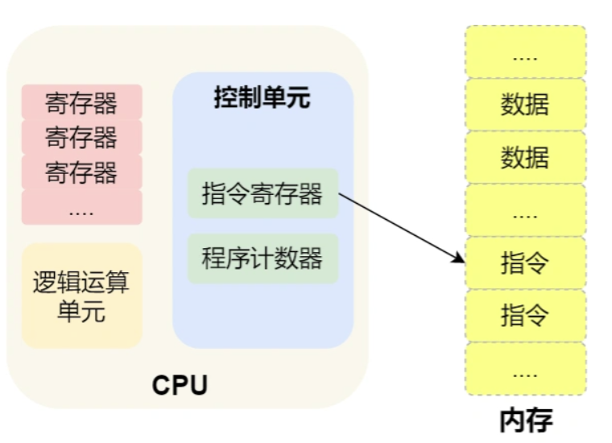

CPU 执行程序的过程如下:

- 第一步，CPU 读取「<u>程序计数器</u>」的值，这个值是指令的内存地址，然后 CPU 的「控制单元」操作「地址总线」指定需要访问的内存地址，接着通知内存设备准备数据，数据准备好后通过「数据总线」将指令数据传给 CPU，CPU 收到内存传来的数据后，将这个指令数据存入到「==指令寄存器==」。
- 第二步，CPU 分析「`指令寄存器`」中的指令，确定指令的类型和参数，如果是计算类型的指令，就把指令交给「逻辑运算单元」运算；如果是存储类型的指令，则交由「==控制单元==」执行；
- 第三步，CPU 执行完指令后，「程序计数器」的值自增，表示指向下一条指令。这个自增的大小，由 CPU 的位宽决定，比如 32 位的 CPU，指令是 4 个字节，需要 4 个内存地址存放，因此「==程序计数器==」的值会自增 4；

简单总结一下就是，一个程序执行的时候，CPU 会根据程序计数器里的内存地址，从内存里面把需要执行的指令读取到指令寄存器里面执行，然后根据指令长度自增，开始顺序读取下一条指令。

CPU 从程序计数器读取指令、到执行、再到下一条指令，这个过程会不断循环，直到程序执行结束，这个不断循环的过程被称为 **CPU 的指令周期**

#### [#](https://xiaolincoding.com/os/1_hardware/how_cpu_run.html#a-1-2-执行具体过程)a = 1 + 2 执行具体过程

#### `内存`

我们的程序和数据都是存储在内存，存储的区域是线性的。

在计算机数据存储中，存储数据的基本单位是**字节（\*byte\*）**，1 字节等于 8 位（8 bit）。每一个字节都对应一个内存地址。

内存的地址是从 0 开始编号的，然后自增排列，最后一个地址为内存总字节数 - 1，这种结构好似我们程序里的数组，所以内存的读写任何一个数据的速度都是一样的

#### `中央处理器`

中央处理器也就是 CPU，32 位和 64 位 CPU 最主要区别在于一次能计算多少字节数据：

- 32 位 CPU 一次可以计算 4 个字节；
- 64 位 CPU 一次可以计算 8 个字节；

这里的 32 位和 64 位，通常称为 CPU 的位宽。

#### `总线`

总线是用于 CPU 和内存以及其他设备之间的通信，总线可分为 3 种：

- *地址总线*，用于指定 CPU 将要操作的内存地址；
- *数据总线*，用于读写内存的数据；
- *控制总线*，用于发送和接收信号，比如中断、设备复位等信号，CPU 收到信号后自然进行响应，这时也需要控制总线；

当 CPU 要读写内存数据的时候，一般需要通过下面这三个总线：

- 首先要通过「地址总线」来指定内存的地址；
- 然后通过「控制总线」控制是读或写命令；
- 最后通过「数据总线」来传输数据

#### 输入、输出设备

输入设备向计算机输入数据，计算机经过计算后，把数据输出给输出设备。期间，如果输入设备是键盘，按下按键时是需要和 CPU 进行交互的，这时就需要用到控制总线了。


### 存储器的层次结构  

对于存储器，它的速度越快、能耗会越高、而且材料的成本也是越贵的，以至于速度快的存储器的容量都比较小。

存储器通常可以分为这么几个级别：

- 寄存器；
- CPU Cache；
  1. L1-Cache；
  2. L2-Cache；
  3. L3-Cahce；
- 内存；
- SSD/HDD 硬盘

#### `寄存器`

寄存器是最靠近 CPU 的控制单元和逻辑计算单元的存储器

- 32 位 CPU 中大多数寄存器可以存储 `4` 个字节；
- 64 位 CPU 中大多数寄存器可以存储 `8` 个字节。

访问速度非常快, 半个cpu时钟周期内完成读写

#### `CPU Cache`

CPU Cache 用的是一种叫 **SRAM（\*Static Random-Access\* Memory，静态随机存储器）** 的芯片。

数据有电保持 断电消失

CPU 的高速缓存，通常可以分为 ==L1、L2、L3== 这样的三层高速缓存，也称为一级缓存、二级缓存、三级缓存。

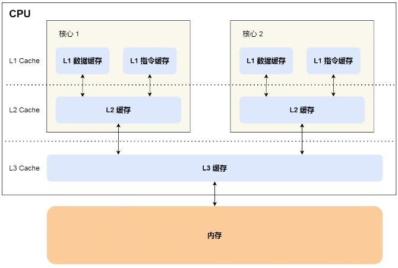

##### L1 高速缓存

L1 高速缓存的访问速度`几乎和寄存器一样快`，通常只需要 `2~4` 个时钟周期 ==每个核心都有==

1. 指令缓存
2. 数据缓存

##### L2 高速缓存

大小比 L1 高速缓存更大，CPU 型号不同大小也就不同，通常大小在几百 KB 到几 MB 不等，访问速度则更慢，速度在 `10~20` 个时钟周期。 ==每个核心都有==

##### L3 高速缓存

位置比 L2 高速缓存距离 CPU 核心 更远，大小也会更大些，通常大小在几 MB 到几十 MB 不等 

`20~60`个时钟周期。==多个 CPU 核心共用==


#### 存储器的层次关系

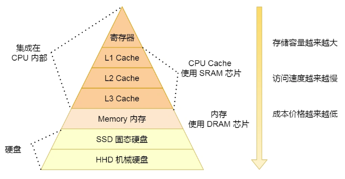

当 CPU 需要访问内存中某个数据的时候，如果==寄存器==有这个数据，CPU 就直接从寄存器取数据即可，如果寄存器没有这个数据，CPU 就会查询 ==L1== 高速缓存，如果 L1 没有，则查询 ==L2== 高速缓存，L2 还是没有的话就查询 ==L3== 高速缓存，L3 依然没有的话，才去==内存==中取数据。


### **==Linux文件系统==**

### `ELF`

ELF 的意思是**可执行文件链接格式**，它是 Linux 操作系统中可执行文件的存储格式

- 可执行与可链接格式（Executable Linkable Format, ELF），简称ELF格式
- 它是一种文件存储格式，Linux下的目标文件和可执行文件都是按照该格式存储的

==ELF文件类型==

- ELF文件可以细分为3种类型
- 
- `可重定向`文件（.o文件）
    - 这类文件中包含二进制代码和数据，可以和其他目标文件进行合并，创建一个可执行文件或者一个共享目录文件
  
- `可执行`文件（.out文件）
    - 可以被处理器加载执行的文件
  
- `共享目标`文件（.so文件）
    - 用于和其他共享目标文件或者可重定位文件一起生成ELF目标文件或者和执行文件一起创建进程映像，例如lib*.so文件

==ELF文件作用==

- 1.对于可重定向文件和共享目标文件，用于编译和链接，则编译器和链接器将把ELF文件看作是节头表描述的节的集合，程序头表可选
- 2.对于可执行文件，用于加载执行，则加载器则将把ELF文件看作是程序头表描述的段的集合，一个段可能包含多个节，节头表可选

==ELF文件格式提供两种不同的视角==

- 在汇编器和链接器看来，ELF文件是由Section Header Table描述的一系列Section的集合

- 执行时，在加载器看来，ELF文件时由Program Header Table描述的一系列Segment的集合

==段（Segment）/ 节（Section）==

- 段（Segment）
  - 可执行文件由Segment组成，例如程序代码段、数据段，每一个段由一个或多个Section组成，例如代码段由.text组成、数据段由.data，.bss等组成

- 节（Section）
  - 平时在进行代码构建时理解的.text，.bss，.data段，这些都是section，也就是节的概念，这些节是通过节表头（section header table）进行组织的


### Linux`文件权限`

linux文件权限表示长度位10bits，分为四段，主要如下：

第一段(1bit)：表示文件类型

- 文件类型包括：

  - -：表示文件

  - d：表示文件夹

  - l：表示链接文件，可以理解为windows中的快捷方式

  - b：可供存储周边设备

  - c：一次性读取装置

第二段(3bits)：表示所有者权限

- bit2 - 读权限

- bit1 - 写权限

- bit0 - 执行权限

第三段(3bits)：表示所有者所在组的权限

第四段(3bits)：表示其他用户的权限

使用ls -l命令可以看到某个文件或目录的权限


### Linux`目录存储`

在linux系统中，==目录也是一种文件==

与普通文件不同的是，普通文件的块里面存储着文件数据，而目录文件的块里面<u>存储着目录里一项一项的文件信息</u>

#### `实现方式`

- `列表`实现

  - 在目录文件的块中，最简单的保存格式就是列表，就是一项一项地将目录下的文件信息（如文件名、文件 inode、文件类型等)列在表里。（此处好像还要把上级的目录信息也要包含进来）

  - 缺点
    - 列表实现方式不利于目录较多的文件搜索

- `哈希表`实现

  - 将目录+文件进行哈希计算，把哈希值存起来，再根据哈希表去找到相应的块号，再用inode得到对应的文件

  - 缺点
    - 可能发现哈希冲突

Linux 系统的 ext 文件系统就是==采用了哈希表==，来保存目录的内容，这种方法的优点是查找非常迅速，插入和删除也较简单，不过需要一些预备措施来避免哈希冲突。


### Linux`文件存储`

文件的数据是要存储在硬盘上面的，数据在磁盘上的存放方式，就像程序在内存中存放的方式那样，有以下两种：

- ==连续空间==存放方式
  - 文件存放在磁盘「连续的」物理空间中
  - 文件头里需要指定「起始块的位置」和「长度」
  - 但是有「磁盘空间碎片」和「文件长度不易扩展」的缺陷
- ==非连续空间==存放方式
  - 链表方式
    - **离散的，不用连续的**，于是就可以**消除磁盘碎片**，可大大提高磁盘空间的利用率，同时**文件的长度可以动态扩展**。根据实现的方式的不同，链表可分为「**隐式链表**」和「**显式链接**」两种形式。
    - ==隐式链表==: 文件要以「**隐式链表**」的方式存放的话，**实现的方式是文件头要包含「第一块」和「最后一块」的位置，并且每个数据块里面留出一个指针空间，用来存放下一个数据块的位置**，这样一个数据块连着一个数据块，从链头开始就可以顺着指针找到所有的数据块，所以存放的方式可以是不连续的, 隐式链表的存放方式的**缺点在于无法直接访问数据块，只能通过指针顺序访问文件，以及数据块指针消耗了一定的存储空间**。隐式链接分配的**稳定性较差**，系统在运行过程中由于软件或者硬件错误**导致链表中的指针丢失或损坏，会导致文件数据的丢失。**
    - ==显式链接==: 如果取出每个磁盘块的指针，把它放在内存的一个表中，就可以解决上述隐式链表的两个不足。那么，这种实现方式是「**显式链接**」，它指**把用于链接文件各数据块的指针，显式地存放在内存的一张链接表中**，该表在整个磁盘仅设置一张，**每个表项中存放链接指针，指向下一个数据块号**。由于查找记录的过程是在内存中进行的，因而不仅显著地**提高了检索速度**，而且**大大减少了访问磁盘的次数**。但也正是整个表都存放在内存中的关系，它的主要的缺点是**不适用于大磁盘**。
  - 索引方式
    - 为每个文件创建一个「**索引数据块**」，里面存放的是**指向文件数据块的指针列表** 类似于书的目录
    - **文件头需要包含指向「索引数据块」的指针**
    - 优点
      - 文件的创建、增大、缩小很方便；
      - 不会有碎片的问题；
      - 支持顺序读写和随机读写；
    - **链式索引块**: **索引数据块留出一个存放下一个索引数据块的指针**
    - **多级索引块**: **通过一个索引块来存放多个索引数据块**，一层套一层索引

其中，非连续空间存放方式又

可以分为「链表方式」和「索引方式」。


### 操作系统有哪些模块

1. `处理器`管理
   
- 处理器管理最基本的功能是`处理中断事件`，配置了操作系统后，就可对各种事件进行处理。处理器管理还有一个功能就是处理器`调度`，针对不同情况采取不同的调度策略。
  
2. `存储器`管理
- 存储器管理主要是指针对内存储器的管理。主要任务是分配内存空间，保证各作业占用的存储空间不发生矛盾，并使各作业在自己所属存储区中不互相干扰。
  
3. `设备`管理
- 设备管理是指负责管理各类外围设备，包括分配、启动和故障处理等。主要任务是当用户使用外部设备时，必须提出要求，待操作系统进行统一分配后方可使用。
  
4. `文件`管理
   
- 文件管理是指操作系统对信息资源的管理。在操作系统中，将负责存取的管理信息的部分称为文件系统。文件管理支持文件的存储、检索和修改等操作以及文件的保护功能。
  
5. `作业`管理
   
   - 每个用户请求计算机系统完成的一个独立的操作称为作业。作业管理包括作业的输入和输出，作业的调度与控制，这是根据用户的需要来控制作业运行的。
   
   


### ==内存管理==

### Linux`虚拟内存`管理

1. 直接使用物理内存会有些问题
   1. 内存空间利用率的问题（内存==碎片==化）
   2. 读写内存的安全性问题（访问==权限==问题）
   3. 进程间的==安全==问题
   4. 内存读写的==效率==问题
2. `为了防止不同进程同一时刻在物理内存中运行而对物理内存的争夺和践踏`，<u>也为了让物理内存扩充成更大的逻辑内存</u>，从而`让程序获得更多的可用内存`，<u>采用了虚拟内存</u>。
3. 虚拟内存技术使得不同进程在运行过程中，<u>它所看到的是自己独自占有了当前系统的4G内存</u>。所有进程共享同一物理内存，每个进程只把自己目前需要的虚拟内存空间`映射并存储`到物理内存上。
4. <u>事实上，在每个进程创建加载时，内核`只是为进程“创建”了虚拟内存的布局`，具体就是`初始化`进程控制表中内存相关的`链表`，实际上并不立即就把虚拟内存对应位置的程序数据和代码（比如.text .data段）拷贝到物理内存中，只是建立好虚拟内存和磁盘文件之间的`映射`就好（叫做存储器映射）</u>，等到运行到对应的程序时，才会通过缺页异常，来拷贝数据。还有进程运行过程中，`要动态分配内存`，比如malloc时，也`只是分配了虚拟内存`，即为这块虚拟内存对应的页表项做相应设置，`当进程真正访问到此数据时，才引发缺页异常`。
5. 请求分页系统、请求分段系统和请求段页式系统都是针对虚拟内存的，通过请求实现内存与外存的信息置换。


### `虚拟内存的好处/代价`

#### 虚拟内存的好处

1. `扩大`地址空间；

   > 为了更好的管理内存，操作系统将内存抽象成地址空间。每个程序拥有自己的地址空间，这个地址空间被分割成多个块，每一块称为一页。这些页被映射到物理内存，但不需要映射到连续的物理内存，也不需要所有页都必须在物理内存中。当程序引用到不在物理内存中的页时，由硬件执行必要的映射，将缺失的部分装入物理内存并重新执行失败的指令。
   >
   > 从上面的描述中可以看出，<u>虚拟内存允许`程序不用将地址空间中的每一页都映射`到物理内</u>存，<u>也就是说一个`程序不需要全部调入内存`就可以运行</u>，这使得有限的内存运行大程序成为可能。例如有一台计算机可以产生 16 位地址，那么一个程序的地址空间范围是 0~64K。该计算机只有 32KB 的物理内存，虚拟内存技术允许该计算机运行一个 64K 大小的程序

2. 内存`保护`：每个进程运行在各自的虚拟内存地址空间，互相不能干扰对方。虚存还对特定的内存地址提供写保护，可以防止代码或数据被恶意篡改。 （==<u>互不干扰，防止进程互相恶意篡改</u>==）

3. `公平`内存分配。采用了虚存之后，每个进程都相当于有同样大小的虚存空间。  

4. 当进程`通信`时，可采用`虚存共享`的方式实现。  （==<u>实现共享内存</u>==）

5. 当不同的进程使用同样的代码时，比如库文件中的代码，物理内存中可以只存储一份这样的代码，不同的进程只需要把自己的虚拟内存映射过去就可以了，`节省内存`

6. 虚拟内存很适合在多道程序设计系统中使用，许多程序的片段同时保存在内存中。当一个程序等待它的一部分读入内存时，可以把CPU交给另一个进程使用。<u>在内存中可以保留多个进程</u>，系统`并发度提高`

7. 在程序需要分配连续的内存空间的时候，只需要在虚拟内存空间分配连续空间，而不需要实际物理内存的连续空间，可以`利用碎片`

#### **虚拟内存的代价：**

1. 虚存的管理需要建立很多数据结构，这些数据结构要占用额外的`内存`

2. 虚拟地址到物理地址的转换，增加了指令的`执行时间`。

3. 页面的换入换出需要`磁盘I/O`，这是很`耗时`的

4. <u>如果一页中只有一部分数据，会浪费内存。</u>


### 操作系统中的`页表寻址`

1. 首先linux采用的是段页式管理 先将程序划分为多个`有逻辑意义的段`，接着再把每个段划分为多个页，也就是对分段划分出来的连续空间，再划分固定大小的页；

2. 重点按分页机制说一些页表寻址,

3. 分页存储管理方式 将用户程序（进程）的 `逻辑地址` 空间分成若干个 `页` （4KB）并编号，同时将内存的 `物理地址` 也分成若干个 `块或页框` （4KB）并编号

4. 页表寻址的目的就是 将进程的各个页`离散`地存储在内存的任一物理块中，使得从进程的角度看，认为它有一段`连续的内存`，进程总是从0号单元开始编址, 因此需要建立一个由页到页框的一一映射的关系，这就是`页表`

5. 采用`多级页表机制`, 最起码要二级页表 不然每个进程都需要直接在进程中 存放4mb的页表 而如果使用二级页表 ==由于局部性原理== 才需要4kb+(4mb * 加载 的内存%)

6. ==地址变换过程==：

   1. 进程访问某个`逻辑地址`的数据
   2. 由逻辑地址的`页面号`，以及`页表寄存器中的始址`，找到页表并找到对应的`页表项`
   3. 由页表项上的==<u>块号</u>==，找到==<u>物理内存中的块号</u>==
   4. 由块号，加上逻辑地址的页内地址（==<u>偏移量</u>==），实现了对物理地址数据的定位
   5. 进程访问该逻辑地址对应的物理地址的数据

7. 由上可知，每存取一个数据，需`两次访问内存`，第一次访问内存中的页表，第二次访问内存中的数据，效率较低,

8. 因此增设一个具有并行查寻能力的`特殊高速缓冲寄存器`，称为“联想寄存器”或“快表”，IBM中称为==TLB==，用于存放当前访问的那些页表项  ==<u>（多了一个缓存）</u>==

9. 由于`局部性原理` 使用`快表TLB`高速缓存 加快页表寻址

   > 时间局部性：如果执行了程序中的某条指令，那么不久后这条指令很有可能再次被执行；如果某个数据被访问过，不久之后该数据很可能再次被访问
   >
   > 空间局部性：一旦程序访问了某个存储单元，在不久之后，其附近的存储单元也很有可能被访问（因为很多数据在内存中都是连续存放的）


### 多级页表

为了减少页表项在进程中的内存占用

1. 如果只是一级页表 那么32位的逻辑地址 20 + 12 前20是页表号, 后十位是块内偏移 内存中的页表项大小是2^20^*4B = 4mb
2. 因此 出现了二级页表, 10 10 12 此时内存中的页表项就是 2^10^*4B = 4k 二级页表加载到了才会加载道内存中
3. 三级页表机制 ==<u>**2 - 9 - 9 - 12**</u>==


### `分页`与`分段`的比较

- 对程序员的透明性：分页透明，但是分段需要程序员显式划分每个段。
- 地址空间的维度：分页是一维地址空间，分段是二维的。
- 大小是否可以改变：页的大小不可变，段的大小可以动态改变。
- 出现的原因：分页主要用于实现虚拟内存，从而获得更大的地址空间；分段主要是为了使程序和数据可以被划分为逻辑上独立的地址空间并且有助于共享和保护。


### 内存管理单元 `MMU`

**内存管理单元**（英语：**memory management unit**，缩写为**MMU**），有时称作**分页内存管理单元**（英语：**paged memory management unit**，缩写为**PMMU**）。它是一种负责处理[中央处理器](https://zh.m.wikipedia.org/wiki/中央处理器)（CPU）的[内存](https://zh.m.wikipedia.org/wiki/内存)访问请求的[计算机硬件](https://zh.m.wikipedia.org/wiki/计算机硬件)。它的功能包括[虚拟地址](https://zh.m.wikipedia.org/wiki/虚拟地址)到[物理地址](https://zh.m.wikipedia.org/wiki/物理地址)的转换（即[虚拟内存](https://zh.m.wikipedia.org/wiki/虚拟内存)管理）[[1\]](https://zh.m.wikipedia.org/zh-hans/内存管理单元#cite_note-1)、[内存保护](https://zh.m.wikipedia.org/wiki/内存保护)、中央处理器[高速缓存](https://zh.m.wikipedia.org/wiki/高速缓存)的控制，在较为简单的计算机体系结构中，负责[总线](https://zh.m.wikipedia.org/wiki/总线)的[仲裁](https://zh.m.wikipedia.org/w/index.php?title=仲裁_(电子器件)&action=edit&redlink=1)以及[存储体切换](https://zh.m.wikipedia.org/w/index.php?title=存储体切换&action=edit&redlink=1)（bank switching，尤其是在[8位](https://zh.m.wikipedia.org/wiki/8位)的系统上）

> 实现虚拟地址到物理地址的页表寻址过程，实现虚拟内存映射

#### mmu的功能/好处

1. 实现页表寻址
2. MMU除了做地址转换之外，还提供内存保护机制。
   1. 系统可以在页表中设置每个内存页面的访问权限，有些页面不允许访问，有些页面只有在CPU处于特权模式时才允许访问，有些页面在用户模式和特权模式都可以访问，访问权限又分为可读、可写和可执行三种。


### `缺页异常/中断`

malloc()和mmap()等内存分配函数，<u>在分配时`只是建立了进程虚拟地址空间`</u>，<u>并`没有`分配虚拟内存对应的`物理内存`</u>。<u>当进程访问这些没有建立映射关系的虚拟内存时，处理器自动触发一个缺页异常</u>。  

> ==<u>（分配了虚拟的地址空间 但没有分配映射到物理内存，访问时会缺页异常）</u>==

**缺页中断：**在请求分页系统中，可以<u>通过查询页表中的`状态位`来确定所要访问的`页面是否存在于内存`中</u>。每当所要访问的页面不在内存时，会产生一次缺页中断，此时操作系统会根据页表中的外存地址在外存中找到所缺的一页，将其调入内存。

==和一般中断的区别在于 返回该指令还是该指令的下一行执行==

> ==注意: 缺页异常并不是异常, 每次都通过缺页异常来分配物理页面==

#### 缺页中断的处理流程

> 1、保护CPU现场   `保存中断前即当前的状态`
>
> 2、分析中断原因    分析为什么中断
>
> 3、转入缺页中断处理程序进行处理   页表映射/满的话缺页置换
>
> 4、恢复CPU现场，继续执行   恢复到之前的状


1.  在 CPU ⾥访问一条 `Load M` 指令，然后 CPU 会去找 M 所对应的页表项。 ==找到页表项==
2.  如果该页表项的`状态位`是「有效的」，那 CPU 就可以直接去访问物理内存了，如果状态位是「无效的」，则 CPU 则会发送缺页中断请求。  ==判断页面是否有效==
3.  操作系统收到了`缺页中断`，则会执行缺页中断处理函数，先会查找该页面在磁盘中的页面的位置。  
4.  找到磁盘中对应的页面后，需要把该页面换入到物理内存中，但是在换入前，需要`在物理内存中找空闲页`，如果找到空闲页，就把页面`换入到物理内存`中。  ==**主要是没有空闲页的话 选择哪个换出**==
5.  页面从磁盘换入到物理内存完成后，则把页表项中的`状态位修改`为「有效的」。
6.  最后，CPU `重新执行`导致`缺页异常`的指令。

<u>第4步==找不到空闲页==的话</u>，就说明此时内存已满了，这时候，就需要「==页面置换算法==」选择一个物理页


### `页面置换算法`

1. 最佳页面置换算法
   1. 最佳页面置换算法是`已经知道页面调入顺序`的情况下 用来`衡量其他算法效率的参考算法`
   2. <u>置换在「未来」最长时间不访问的页面</u>
   3. 无法实现的 理论上的算法
2. 先进先出置换算法
   1. 选择在内存驻留时间很长的页面进行中置换
   2. 效率不好
3. 最近最久未使用 lru
   1. 发⽣缺页时，<u>`选择最长时间没有被访问`的页面进行置换，也就是说，该算法假设已经很久没有使用的页面很有可能在未来较长的一段时间内仍然不会被使用</u>。
   2. 由于`开销比较大`，实际应用中比较少使用。
   3. 只参考了时间 没有参考频率
4. 时钟页面置换算法/第二次机会
   1. 先进先出的`链表首尾相连`, 然后从最==老==的节点开始 查看访问位是不是0, 是0则置换, 不是0则置为0, 指针前进
5. 最不常用算法==LFU==
   1. 发⽣缺页中断时，选择`「访问次数」最少`的那个页面，并将其淘汰。
   2. 对每个页面设置一个「==<u>**访问计数器**</u>==」，每当一个页面被访问时，该页面的访问计数器就累加 1。在发⽣缺页中断时，淘汰计数器值最小的那个页面。
   3. 缺点 只考虑了频率 没有考虑时间, 能会误伤当前<u>刚开始频繁访问</u>，但访问次数还不高的页面。
   4. <u>当发⽣缺页中断时，把过去时间访问的页面的访问次数除以 2</u>

### 操作系统中的程序的`内存结构`


#### 一个程序本质上（没有调入内存）时都是由`BSS段`、`data段`、`text段`三个组成的。

> - `代码段 text`：存放程序执行代码的一块内存区域。<u>这部分区域的大小在程序运行前就已经确定</u>，并且内存区域属于只读。在代码段中，也有可能包含一些只读的常数变量 `（包括文本区和只读数据区）`
> - `数据段 data`：存放程序中==<u>已初始化</u>==的`全局变量`的一块内存区域。<u>数据段属于`静态内存`分配</u>
> - `未初始化数据区 bss`：通常用来存放程序中`未初始化的全局变量和静态变量`的一块内存区域。BSS段属于`静态分配`，<u>程序结束后静态变量资源由系统自动释放。</u>

text段和data段在编译时已经分配了空间，而`BSS段并不占用可执行文件的大小`，它是由`链接器来获取内存`的。

bss段（未进行初始化的数据）的内容并不存放在磁盘上的程序文件中。其原因是内核在程序开始运行前将它们设置为0。需要存放在程序文件中的只有`正文段`和`初始化数据段`。  

data段（已经初始化的数据）则为数据分配空间，数据保存到目标文件中。

数据段包含经过初始化的全局变量以及它们的值。BSS段的大小从可执行文件中得到，然后链接器得到这个大小的内存块，紧跟在数据段的后面。当这个内存<u>进入程序的地址空间后全部清零</u>。包含数据段和BSS段的整个区段此时通常称为==<u>数据区</u>==。

#### <u>可执行程序在运行时又多出两个区域</u>：<u>==栈区==和==堆区==</u>。

==栈区==：由编译器自动释放，存放函数的参数值、局部变量等。每当一个函数被调用时，该函数的返回类型和一些调用的信息被存放到栈中。然后这个被调用的函数再为他的自动变量和临时变量在栈上分配空间。每调用一个函数一个新的栈就会被使用。栈区是从高地址位向低地址位增长的，是一块`连续`的内存区域，最大容量是由系统`预先定义`好的，申请的栈空间超过这个界限时会提示溢出，用户能从栈中获取的空间较小。

==堆区==：用于动态分配内存，位于BSS和栈中间的地址区域。由程序员申请分配和释放。`堆是从低地址位向高地址位增长，采用链式存储结构`。频繁的malloc/free造成内存空间的不连续，产生碎片。当申请堆空间时库函数是按照一定的算法搜索可用的足够大的空间。因此堆的`效率`比栈要`低`的多。


### [为什么堆栈生长方向不一样](https://blog.csdn.net/unix21/article/details/8531875)

#### **历史原因**

- 在没有内存管理单元MMU的时代，`为了最大的利用内存空间`，堆和栈被设计为从`两端相向生长`。那么哪一个向上，哪一个向下呢？
  1. 人们对数据访问是习惯于向上的，比如你在堆中new一个数组，是习惯于把低元素放到低地址，把高位放到高地址，所以`堆向上生长比较符合习惯`
  2. `栈则对方向不敏感`，一般对栈的操作只有PUSH和POP，无所谓向上向下，所以就把堆放在了低端，把栈放在了高端。MMU出来后就无所谓了，只不过也没必要改了。


### 文件描述符

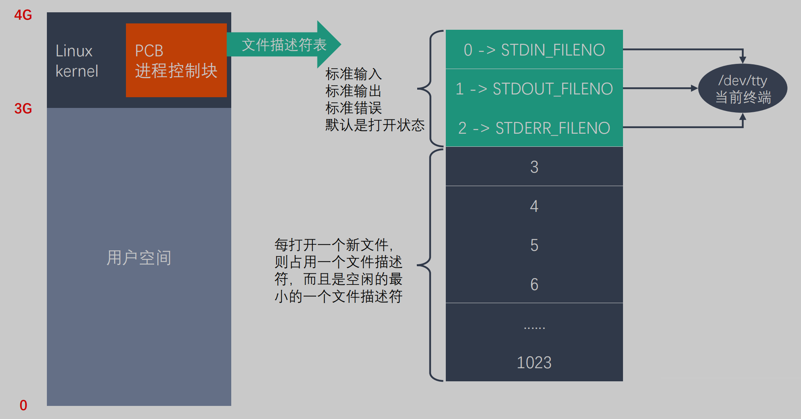

- 每一个`进程控制块pcb中包含一个 默认大小为1024的文件描述符表`（前三个指向设备终端的默认文件），所以每一个进程默认最多打开1024个文件 
- 同一个文件可以重复打开 则在文件描述符表中 占多个位置 直到调用fclose释放


### 静态变量什么时候初始化

静态变量存储在虚拟地址空间的数据段和bss段，`C语言`中其在代码执行之前初始化，属于`编译期初始化`。

而C++中由于引入对象，对象生成必须调用构造函数，因此C++规定

**全局或静态对象是有首次用到时才会进行构造，即：**

==全局变量,总是在main函数运行之前初始化==

==局部静态对象当且仅当对象首次用到时进行构造==


### 类里面有static，virtual，之类的，来说一说这个`类的内存分布`

**static修饰符**

1. static修饰成员变量

- <u>对于非静态数据成员，每个类对象都有自己的拷贝</u>。而<u>静态数据成员被当做是类的成员，无论这个类被定义了多少个，静态数据成员都只有一份拷贝</u>，`为该类型的所有对象所共享(包括其派生类)`。所以，静态数据成员的值对每个对象都是一样的，它的值可以更新。

- 因为静态数据成员在==全局数据区==分配内存，属于本类的所有对象共享，所以它不属于特定的类对象，在没有产生类对象前就可以使用。

2. static修饰成员函数

- 与普通的成员函数相比，静态成员函数由于不是与任何的对象相联系，因此==它不具有this指针==。从这个意义上来说，它无法访问属于类对象的非静态数据成员，也无法访问非静态成员函数，只能调用其他的静态成员函数。

3. static修饰的成员函数，在==代码区==分配内存。

**C++继承和虚函数**

- C++多态分为静态多态和动态多态。

  > 静态多态是通过<u>重载</u>和<u>模板</u>技术实现，在==编译==的时候确定。
  >
  > 动态多态通过虚函数和继承关系来实现，执行动态绑定，在运行的时候确定。

- 动态多态实现有几个条件：

  >  虚函数；
  >
  >  一个基类的指针或引用指向派生类的对象；

- 基类指针在调用成员函数(虚函数)时，就会去<u>查找该对象的虚函数表</u>。虚函数表的地址在每个对象的首地址。<u>查找该虚函数表中该函数的指针进行调用</u>。

- 每个对象中保存的只是一个虚函数表的指针，C++内部为每一个类维持一个虚函数表，该类的对象的都指向这同一个虚函数表。

- 虚函数表中为什么就能准确查找相应的函数指针呢？因为在类设计的时候，虚函数表直接从基类也继承过来，<u>如果覆盖了其中的某个虚函数，那么虚函数表的指针就会被替换，因此可以根据指针准确找到该调用哪个函数。</u>

**virtual修饰符**

- 如果一个类是局部变量则该类数据存储在栈区，如果一个类是通过new/malloc动态申请的，则该类数据存储在堆区。

- 如果该类是virutal继承而来的子类，则该类的`虚函数表指针`==和该类其他成员一起存储==。虚函数表指针指向只读数据段中的类虚函数表，虚函数表中存放着一个个函数指针，函数指针指向代码段中的具体函数。

- 如果类中成员是virtual属性，会隐藏父类对应的属性。


### page cache`页缓存`

**Page cache（页面缓存）**

> Page cache 也叫页缓冲或==文件缓冲==，是由好几个磁盘块构成，大小通常为4k，在64位系统上为8k，构成的几个磁盘块在物理磁盘上不一定连续，文件的组织单位为一页， 也就是一个page cache大小，文件读取是由外存上不连续的几个磁盘块，到buffer cache，然后组成page cache，然后供给应用程序。
>
> Page cache在linux读写文件时，它用于`缓存文件的逻辑内容`，从而`加快对磁盘上映像和数据的访问`。具体说是加速对文件内容的访问，buffer cache缓存文件的具体内容——物理磁盘上的磁盘块，这是加速对磁盘的访问。

- CPU如果要访问外部磁盘上的文件，需要首先将这些文件的内容拷贝到内存中，**由于硬件的限制，从磁盘到内存的数据传输速度是很慢的**，<u>如果现在物理内存有空余，干嘛不用这些空闲内存来缓存一些磁盘的文件内容呢</u>，这部分用作缓存磁盘文件的内存就叫做page cache。
- page cache中有一部分磁盘文件的缓存，`因为从磁盘中读取文件比较慢，所以读取文件先去page cache中去查找，如果命中，则不需要去磁盘中读取，大大加快读取速度。`在 Linux 内核中，文件的每个数据块最多只能对应一个 Page Cache 项，它通过两个数据结构来管理这些 Cache项，一个是radix tree（基数树），另一个是双向链表。Radix tree 是一种搜索树，Linux内核利用这个数据结构来通过文件内偏移快速定位Cache 项
- radix tree（基数树）其实就差不多是传统的二叉树，只是在寻找方式上，利用比如一个unsigned int的类型的每一个比特位作为树节点的判断。


### `逻辑地址、虚拟地址、物理地址`

- 物理地址：加载到内存地址寄存器中的地址，==内存单元的真正地址==。在前端总线上传输的内存地址都是物理内存地址，编号从0开始一直到可用物理内存的最高端。

- 逻辑地址：由程序产生的与段相关的==偏移地址部分==，`编程中使用的地址`（在非虚拟内存的情况下给一个进程分配一段内存空间）。

- 虚拟内存：虚拟[内存](https://baike.baidu.com/item/内存)是[计算机系统](https://baike.baidu.com/item/计算机系统/7210959)[内存管理](https://baike.baidu.com/item/内存管理/5633616)的一种技术。它使得==[应用程序](https://baike.baidu.com/item/应用程序/5985445)认为==它拥有==连续的可用的==[内存](https://baike.baidu.com/item/内存/103614)（一个连续完整的[地址空间](https://baike.baidu.com/item/地址空间/1423980)），而==实际==上，它通常是被分隔成==多个[物理内存](https://baike.baidu.com/item/物理内存/2502263)碎片==，还有==部分暂时存储在外部[磁盘存储器](https://baike.baidu.com/item/磁盘存储器/2386684)==上，在需要时进行[数据交换](https://baike.baidu.com/item/数据交换/1586256)。


### ==进程和线程==


### `并发`和`并行`

- 并发（concurrency）：指宏观上看起来两个程序在同时运行，比如说在单核cpu上的多任务。但是从微观上看两个程序的指令是交织着运行的，你的指令之间穿插着我的指令，我的指令之间穿插着你的，在单个周期内只运行了一个指令。这种并发并不能提高计算机的性能，只能提高效率。

  `（其实是交替运行）`

- 并行（parallelism）：指严格物理意义上的同时运行，比如多核cpu，两个程序分别运行在两个核上，两者之间互不影响，单个周期内每个程序都运行了自己的指令，也就是运行了两条指令。这样说来并行的确提高了计算机的效率。所以现在的cpu都是往多核方面发展。

  `（真正的同时运行）`


### `进程与线程`的`概念`

- ==进程:== <u>`进程是对运行时程序的封装，是系统进行资源（包括内存、打开的文件等）调度和分配的的基本单位，实现了操作系统的并发`；</u>

- ==线程:== 
  1. 线程是进程的子任务，是==CPU调度和分派的基本单位==，用于保证程序的实时性，实现进程内部的并发；
  2. 线程是操作系统可识别的==最小执行和调度单位==。每个线程都独自占用一个虚拟处理器：独自的寄存器组，指令计数器和处理器状态。每个线程完成不同的任务，但是==共享==同一`地址空间`（也就是同样的动态内存，映射文件，目标代码等等），打开的`文件队列`和其他`内核资源`。

### `为什么`要有线程

1. ==进程==可以使多个程序能并发执行，以提高资源的利用率和系统的吞吐量；但是==其具有一些缺点==：

   - 进程在同一时间只能干一件事（`一次一件事`）；
   - 进程在执行的过程中如果阻塞，整个进程就会挂起，即使进程中有些工作不依赖于等待的资源，仍然不会执行（`阻塞挂起整个`）。

2. （`为了减小并发的时空开销`）因此，操作系统引入了比进程粒度更小的线程，作为并发执行的基本单位，从而减少程序在并发执行时所付出的时空开销，提高并发性。和进程相比，线程的优势如下：

   - （相同的地址空间，所以`节省资源`）从资源上来讲，线程是一种非常"节俭"的多任务操作方式。在linux系统下，启动一个新的进程必须分配给它独立的地址空间，建立众多的数据表来维护它的代码段、堆栈段和数据段，这是一种"昂贵"的多任务工作方式。 

   - （相同的地址空间，所以`切换快`）从切换效率上来讲，运行于一个进程中的多个线程，它们之间使用相同的地址空间，而且线程间彼此切换所需时间也远远小于进程间切换所需要的时间。据统计，一个进程的开销大约是一个线程开销的30倍左右。

   - (相同的地址空间，所以`通信快捷方便`）从通信机制上来讲，线程间方便的通信机制。对不同进程来说，它们具有独立的数据空间，要进行数据的传递只能通过进程间通信的方式进行，这种方式不仅费时，而且很不方便。线程则不然，由于同一进程下的线程之间贡献数据空间，所以一个线程的数据可以直接为其他线程所用，这不仅快捷，而且方便。

   - 除以上优点外，多线程程序作为一种多任务、并发的工作方式，还有如下优点：

     1、使多CPU系统更加有效。操作系统会保证当线程数不大于CPU数目时，<u>不同的线程运行于不同的CPU上</u>。

     2、改善程序结构。一个既长又复杂的进程可以考虑分为多个线程，成为几个独立或半独立的运行部分，这样的程序才会利于理解和修改。

   > - 创建快 
   > - 终止快 
   > - 切换快 
   > - 共享内存和文件资源 通信方便


### 线程与进程的`区别`

1. （`从属关系`）一个线程只能属于一个进程，而一个进程可以有多个线程，但至少有一个线程。线程`依赖`于进程而存在。

2. （`资源区别`）进程有独立的系统资源，而同一进程内的线程共享进程的大部分系统资源,包括堆、代码段、数据段，每个线程只拥有一些在运行中必不可少的私有属性，比如tcb,线程Id,栈、寄存器。

3. （`单位`）进程是资源分配的最小单位，线程是CPU调度的最小单位；

4. `系统开销`： 由于在创建或撤销进程时，系统都要为之分配或回收资源，如内存空间、I／o设备等。因此，操作系统所付出的开销将显著地大于在创建或撤消线程时的开销。

   类似地，在进行进程切换时，涉及到整个当前进程CPU环境的保存以及新被调度运行的进程的CPU环境的设置。而线程切换只须保存和设置少量寄存器的内容，并不涉及存储器管理方面的操作。可见，进程切换的开销也远大于线程切换的开销。

5. `通信`：由于同一进程中的多个线程具有相同的地址空间，致使它们之间的同步和通信的实现，也变得比较容易。进程间通信IPC，线程间可以直接读写进程数据段（如全局变量）来进行通信——需要进程同步和互斥手段的辅助，以保证数据的一致性。在有的系统中，线程的切换、同步和通信都无须操作系统内核的干预

6. （`调试难度可靠性`）进程编程调试简单可靠性高，但是创建销毁开销大；线程正相反，开销小，切换速度快，但是编程调试相对复杂。

7. （`相互影响`）==进程间不会相互影响 ；线程一个线程挂掉将导致整个进程挂掉==


### `进程分类`

#### 根据进程的优先级

- linux进程分为两种: ==实时进程== ==普通进程==  (实时进程优先于普通进程)
  1. 实时进程执行先来先去 和 时间片轮转
  2. 普通进程执行 动态优先级策略 (抢占/非抢占?)

- unix: 多级反馈队列
- windows: 不同之处 调度的是线程  基于优先级的抢占和时间片

#### 根据进程的场景特点

1. **交互进程**：由一个Shell启动的进程，交互进程既可以在前台运行，也可以在后台运行。
2. **批处理进程**：这种进程和终端没有联系，是一个进程序列。
3. **监控进程**：也称==守护进程==，Linux系统启动是启动的进程，并在后台运行

#### 根据进程状态

1. 正常运行的各种状态的进程;
2. 孤儿进程：一个父进程退出后，它的一个或多个子进程还在运行，那么这些子进程将成为孤儿进程。孤儿进程将被init进程所收养，并由init进程对它们完成状态收集工作。
3. 僵尸进程：一个子进程结束但是没有完全释放内存（在内核中的 task_struct没有释放），该进程就成为僵尸进程。


### `线程分类`

- **用户线程（\*User Thread\*）**：在用户空间实现的线程，不是由内核管理的线程，是由用户态的线程库来完成线程的管理；
- **内核线程（\*Kernel Thread\*）**：在内核中实现的线程，是由内核管理的线程；
- **轻量级进程（\*LightWeight Process\*）**：在内核中来支持用户线程；


### 协程

1. 概念： ==**对线程的分时复用**==

   协程，又称`微线程`。协程看上去也是子程序，但执行过程中，在子程序内部可中断，然后转而执行别的子程序，在适当的时候再返回来接着执行。协程并没有增加线程数量，只是在线程的基础之上通过==分时复用==的方式运行多个协程，而且协程的切换在用户态完成，切换的代价比线程从用户态到内核态的代价小很多。

   协程运行在线程之上，当一个协程执行完成后，可以选择主动让出，让另一个协程运行在当前线程之上。**协程并没有增加线程数量，只是在线程的基础之上通过分时复用的方式运行多个协程**，而且`协程的切换在用户态完成`，`切换的代价比线程从用户态到内核态的代价小很多。`

2. 协程和线程区别

   1. 和多线程比，协程最大的优势就是协程`极高的执行效率`。因为子程序切换不是线程切换，而是由程序自身控制（用户态），因此，没有线程切换的开销，和多线程比，线程数量越多，协程的性能优势就越明显。

   2. 第二大优势就是`不需要多线程的锁机制`，因为只有一个线程，也不存在同时写变量冲突，`在协程中控制共享资源不加锁，只需要判断状态就好了`，所以执行效率比多线程高很多。

   3. 在协程调用阻塞IO操作的时候，操作系统会让线程进入阻塞状态，当前的协程和其它绑定在该线程之上的协程都会陷入阻塞而得不到调度，`协程常使用异步IO。`


### 多进程和多线程的使用场景

多进程模型的优势是==CPU==

1. 多线程模型主要优势为线程间切换代价较小，因此适用于==I/O密集型==（`读写文件`）的工作场景，因此I/O密集型的工作场景经常会由于I/O阻塞导致频繁的切换线程。同时，多线程模型也适用于单机多核分布式场景。
   - IO密集型指的是系统的CPU性能相对硬盘、内存要好很多，此时，系统运作，大部分的状况是CPU在等IO (硬盘/内存) 的`读写`操作，因此，CPU负载并不高。
2. 多进程模型，适用于==CPU密集型==（`大量计算`）。同时，多进程模型也适用于多机分布式场景中，易于多机扩展。
   - CPU密集型也叫`计算密集型`，指的是系统的硬盘、内存性能相对CPU要好很多，此时，系统运作CPU读写IO(硬盘/内存)时，IO可以在很短的时间内完成，而CPU还有许多运算要处理，因此，CPU负载很高。


### ==进程部分==

### `进程状态`

1. 进程的五种基本状态：

   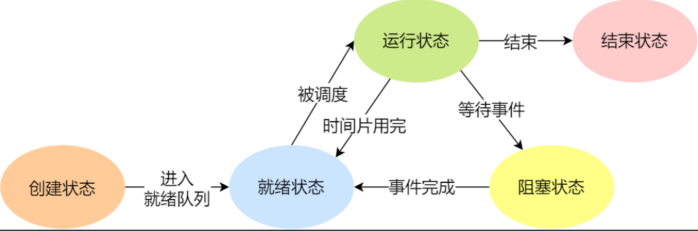

   ==<u>**状态含义**</u>==

   - `创建`状态：进程正在被创建

   - `就绪`状态：进程被加入到就绪队列中等待CPU调度运行

   - `执行`状态：进程正在被运行

   - 等待`阻塞`状态：进程因为某种原因，比如等待I/O，等待设备，而暂时不能运行。

   - `终止`状态：进程运行完毕

   ==<u>**状态变迁**</u>==

   - NULL -> 创建状态：一个新进程被创建时的第一个状态；
   - 创建状态 -> 就绪状态：当进程被创建完成并初始化后，一切就绪准备运行时，变为就绪状态，这个过程是很快的；
   - 就绪态 -> 运行状态：处于就绪状态的进程被操作系统的`进程调度器选中`后，就分配给CPU 正式运行该进程；
   - 运行状态 -> 结束状态：当进程已经运行`完成或出错`时，会被操作系统作结束状态处理； 
   - 运行状态 -> 就绪状态：处于运行状态的进程在运行过程中，由于分配给它的运行时间片用完，操作系统会把该进程变为就绪态，接着从就绪态选中另外一个进程运行；
   - 运行状态 -> 阻塞状态：当进程请求某个事件且必须等待时，例如请求 I/O 事件；
   - 阻塞状态 -> 就绪状态：当进程要等待的事件完成时，它从阻塞状态变到就绪状态；

2. `交换技术`

   - 当多个进程竞争内存资源时，会造成内存资源紧张，并且，如果此时没有就绪进程，处理就会空闲，I/0速度比处理速度慢得多，可能`出现全部进程阻塞等待I/O`。

   - 针对以上问题，提出了两种解决方法：

     1）`交换技术`：<u>换出一部分进程到外存，腾出内存空间。</u>

     - 在交换技术上，将内存暂时不能运行的进程，或者暂时不用的数据和程序，换出到外存，来腾出足够的内存空间，把已经具备运行条件的进程，或进程所需的数据和程序换入到内存。

   - 从而出现了进程的挂起状态：进程被交换到外存，进程状态就成为了挂起状态。

   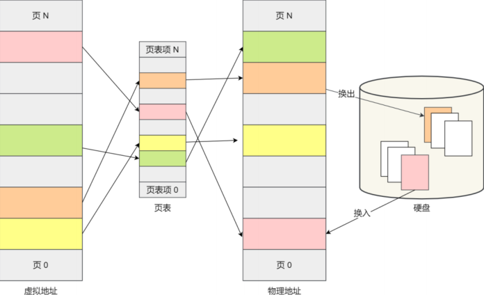

     2）`虚拟存储技术`：每个进程只能装入一部分程序和数据。

3. 活动阻塞，静止阻塞，活动就绪，静止就绪

   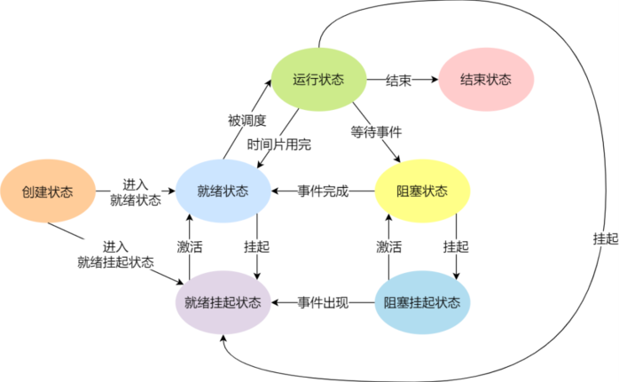

   > <u>`挂起： 指被挂起到外存`</u>

   1）活动阻塞：进程在内存，但是由于某种原因被阻塞了。

   2）静止阻塞：进程在外存，同时被某种原因阻塞了。

   > 阻塞挂起状态：进程在外存（硬盘）并等待某个事件的出现；  ==<u>**在外存并被阻塞了**</u>==

   3）活动就绪：进程在内存，处于就绪状态，只要给CPU和调度就可以直接运行。

   4）静止就绪：进程在外存，处于就绪状态，只要调度到内存，给CPU和调度就可以运行。

   > 就绪挂起状态：进程在外存（硬盘），但只要进入内存，即刻⽴刻运行； ==<u>**在外存没被阻塞**</u>==

   从而出现了：

   活动就绪 ——  静止就绪    （内存不够，调到外存）

   活动阻塞 ——  静止阻塞    （内存不够，调到外存）

   执行   ——  静止就绪     （时间片用完）


### 进程的控制结构`PCB`

PCB 是==进程存在的唯一标识==，这意味着一个进程的存在，必然会有一个 PCB，如果进程消失了，那么 PCB 也会随之消失。

#### PCB 具体包含什么信息

1. 进程描述信息：
   - 进程标识符：标识各个进程，每个进程都有一个并且唯一的标识符；  ==<u>**进程号**</u>==
   - 用户标识符：进程归属的用户，用户标识符主要为共享和保护服务；  ==<u>**用户号**</u>==
2. 进程控制和管理信息：
   - 进程当前`状态`，如 new、ready、running、waiting 或 blocked 等；  
   - 进程`优先级`：进程抢占 CPU 时的优先级；
3. `资源分配清单`：
   - 有关内存地址空间或虚拟地址空间的信息，所打开文件的列表和所使用的 I/O 设备信息。
4. CPU 相关信息：
   - `CPU 中各个寄存器的值`，当进程被切换时，CPU 的状态信息都会被保存在相应的 PCB中，以便进程重新执行时，能从断点处继续执行。

#### 每个 PCB 是如何组织的

通常是通过链表的方式进行组织，把具有相同状态的进程链在一起，组成各种队列。比如：

- 将所有处于就绪状态的进程链在一起，称为`就绪队列`；
- 把所有因等待某事件而处于等待状态的进程链在一起就组成各种`阻塞队列`；
- 另外，对于运行队列在单核 CPU 系统中则只有一个运行指针了，因为单核 CPU 在某个时间，只能运行一个程序。


### 进程的`创建` `终止` `阻塞` `唤醒`

进程的`创建、终⽌、阻塞、唤醒`的过程，这些过程也就是进程的控制

#### 创建进程

创建进程的过程如下：

1. 为新进程`分配`一个唯一的`进程标识号`，并`申请`一个空白的 `PCB`，PCB 是有限的，若申请失败则创建失败；
2. 为进程`分配资源`，此处如果资源不足，进程就会进入等待状态，以等待资源； 
3. `初始化 PCB`；
4. 如果进程的调度队列能够接纳新进程，那就将进程`插入到就绪队列`，<u>等待被调度运行</u>；

#### 终止进程

进程可以有 3 种终⽌方式：正常结束、异常结束以及外界⼲预（信号    kill 掉）。 
终⽌进程的过程如下：

1. 查找需要终止的进程的 `PCB`；
2. 如果处于执行状态，则`⽴即终⽌该进程`的执行，然后将 CPU 资源分配给其他进程； 
3. 如果其还有子进程，则应将其所有子进程终⽌； ==<u>**？linux应该是变孤儿 交给init进程**</u>==
4. 将该进程所拥有的全部`资源`都`归还`给⽗进程或操作系统； 
5. 将其从 `PCB` 所在`队列`中`删除`；

##### 1. 进程退出


主要就是exit和_exit的区别：

- exit比_exit更多一步 刷新IO缓冲区 关闭文件描述符

```c++
#include <stdio.h>
#include <stdlib.h>
#include <unistd.h>

int main() {
    printf("hello\n");
    printf("world");
    // exit(0);   // 打印 hello world 最后刷新io缓冲输出的world
    _exit(0);    //打印hello  因为printf的\n有刷新缓冲区的作用 输出hello
    return 0;
}
```

##### 2. 孤儿进程

- 父进程运行结束，但子进程还在运行（未运行结束），这样的子进程就称为孤儿进程（Orphan Process）。
- 每当出现一个孤儿进程的时候，内核就把孤儿进程的父进程设置为 init ，而 init 进程会循环地 wait() 它的已经退出的子进程。这样，当一个孤儿进程凄凉地结束了其生命周期的时候，<u>init 进程就会代表党和政府出面处理它的一切善后工作</u>。
- 因此`孤儿进程并不会有什么危害`。

##### 3. 僵尸进程

- 每个进程结束之后, 都会释放自己地址空间中的用户区数据，<u>==内核区的 PCB 没有办法自己释放掉，需要父进程去释放==</u>。
- 进程终止时，父进程尚未回收，子进程残留资源（PCB）存放于内核中，变成僵尸（Zombie）进程。
- <u>==僵尸进程不能被 kill -9 杀死==</u>，这样就会导致一个问题，如果父进程不调用 wait() 或 waitpid() 的话，那么保留的那段信息就不会释放，其进程号就会一直被占用，但是系统所能使用的`进程号是有限的`，如果大量的产生僵尸进程，将因为没有可用的进程号而导致系统不能产生新的进程，此即为僵尸进程的`危害`，应当避免。

##### 4. 进程回收

- 在每个进程退出的时候，内核释放该进程所有的资源、包括打开的文件、占用的内存等。但是仍然为其保留一定的信息，这些信息主要主要指进程控制块PCB的信息（包括进程号、退出状态、运行时间等）。

- 父进程可以通过调用`wait`或`waitpid`得到它的退出状态同时彻底清除掉这个进程。

- wait() 和 waitpid() 函数的功能一样，区别在于，`wait() 函数会阻塞`，`waitpid() 可以设置不阻塞`，waitpid() 还可以指定等待哪个子进程结束。

- 注意：一次wait或waitpid调用只能清理一个子进程，清理多个子进程应使用循环。 <u>==（一次一个）==</u>

- <u>==主进程wait阻塞等待子进程被kill掉 清楚pcb 主进程继续==</u>

  > `线程中也存在子线程资源的回收`:
  >
  > join函数（类似多进程中的wait和waitpid），不同于多进程，任何线程都可以对其他线程的资源进行回收

#### 阻塞进程

当进程需要等待某一事件完成时，它可以调用阻塞语句把自己阻塞等待。而一旦被阻塞等待，它<u>只能由`另一个进程唤醒`</u>。

阻塞进程的过程如下：

- `找到`将要被阻塞进程标识号对应的 `PCB`；
- 如果该进程为运行状态，则`保护其现场`，将其状态转为`阻塞`状态，停止运行； 
- 将该 PCB `插入`到`阻塞队列`中去；

#### 唤醒进程

进程由「运行」转变为「阻塞」状态是由于进程必须等待某一事件的完成，所以处于阻塞状态的进程是绝对不可能叫醒自⼰的。

如果某进程正在等待 I/O 事件，需由别的进程发消息给它，则只有当该进程所期待的事件出现时，才<u>由发现者进程用唤醒语句叫醒它</u>。

唤醒进程的过程如下：

- 在该事件的阻塞队列中`找到`相应进程的 `PCB`； 
- 将其从阻塞队列中`移出`，并<u>置其状态为就绪状态</u>；
- 把该 `PCB 插入到就绪队列中`，等待调度程序调度；

进程的阻塞和唤醒是一对功能相反的语句，如果某个进程调用了阻塞语句，则必有一个与之对应的唤醒语句。

> ==<u>**唤醒是需要其他进程去检测阻塞缺失的东西，然后再这个进程去唤醒阻塞的进程**</u>==


### `僵尸`进程和`孤儿`进程

- 正常进程

  1. 正常情况下，子进程是通过父进程创建的，子进程再创建新的进程。`子进程的结束和父进程的运行是一个异步过程`，即`父进程永远无法预测子进程到底什么时候结束`。 当一个进程完成它的工作终止之后，它的父进程需要调用wait()或者waitpid()系统调用取得子进程的终止状态。

  2. unix提供了一种机制可以保证只要父进程想知道子进程结束时的状态信息， 就可以得到：在每个进程退出的时候，内核释放该进程所有的资源，包括打开的文件，占用的内存等。 但是仍然为其保留一定的信息，直到父进程通过wait / waitpid来取时才释放。保存信息包括：

     >1`进程号`the process ID
     >
     >2`退出状态`the termination status of the process
     >
     >3`运行时间`the amount of CPU time taken by the process等


- ==孤儿==进程

  一个父进程退出，而它的一个或多个子进程还在运行，那么那些子进程将成为孤儿进程。`孤儿进程将被init进程(进程号为1)所收养`，并由init进程对它们完成状态收集工作。

- ==僵尸==进程

  1. 一个进程使用fork创建子进程，<u>如果子进程退出，而父进程并没有调用wait或waitpid获取子进程的状态信息，那么子进程的进程描述符仍然保存在系统中。这种进程称之为僵尸进程</u>。
  2. 僵尸进程是一个进程==必然==会经过的过程：这是每个子进程在结束时都要经过的阶段。
  3. 如果子进程在exit()之后，父进程没有来得及处理，这时用ps命令就能看到子进程的状态是“Z”。如果父进程能及时处理，可能用ps命令就来不及看到子进程的僵尸状态，但这并不等于子进程不经过僵尸状态。
  4. 如果父进程在子进程结束之前退出，则子进程将由`init`接管。init将会以父进程的身份对僵尸状态的子进程进行处理。

  - ==危害==：

    <u>如果进程不调用wait / waitpid的话， 那么保留的那段信息就不会释放，其进程号就会一直被占用，但是系统所能使用的进程号是有限的，如果大量的产生僵死进程，将因为没有可用的进程号而导致系统不能产生新的进程</u>

  - `外部消灭`：

    通过kill发送sig_term或者sig_kill信号消灭产生僵尸进程的父进程，它产生的僵尸进程就变成了孤儿进程，这些孤儿进程会被init进程接管，init进程会wait()这些孤儿进程，释放它们占用的系统进程表中的资源 （==杀死僵尸的爹，让它变成孤儿==）

  - `内部解决`：

    1. 子进程退出时向父进程发送sig_child信号，<u>父进程处理sig_child信号</u>。在信号处理函数中调用wait进行处理僵尸进程。

       （==告诉你一声我要结束了，来处理我==）

    2. fork两次，原理是将子进程成为孤儿进程，从而其的父进程变为init进程，通过init进程可以处理僵尸进程。 

       > 父->子->孙
       >
       > 子->exit 在父进程中立刻wait_pid回收子进程

       （==创建时fork两次，然后退出第一个子进程，孙子就变成了孤儿==


### `守护`进程

#####  守护进程

- 守护进程（Daemon Process），也就是通常说的 Daemon 进程（精灵进程），是`Linux 中的后台服务进程`。它是一个生存期较长的进程，<u>通常独立于控制终端并且周期性地执行某种任务或等待处理某些发生的事件</u>。一般采用以 d 结尾的名字。
- 守护进程具备下列特征：
  - `生命周期很长`，守护进程会在系统启动的时候被创建并一直运行直至系统被关闭。
  - 它`在后台运行并且不拥有控制终端`。没有控制终端确保了内核永远不会为守护进程自动生成任何控制信号以及终端相关的信号（如 SIGINT、SIGQUIT）。
- Linux 的大多数服务器就是用守护进程实现的。比如，Internet 服务器 inetd，Web 服务器 httpd 等。

#####  守护进程的创建步骤

1. 执行一个 fork()，之后父进程退出，子进程继续执行。

   > 关机 僵尸进程就不在了 因为开机时始终运行 所以僵尸无所谓

2. 子进程调用 setsid() 开启一个新会话。

   > setsid 脱离父进程的sessionid 进程组id 和打开的终端

3. 清除进程的 umask 以确保当守护进程创建文件和目录时拥有所需的权限。

   > 在类unix系统中，umask是确定掩码设置的命令，该掩码控制如何为新创建的文件设置文件权限。
   >
   > umask确定了文件创建时的初始权限,(文件或目录权限为文件目录默认权限减去umask得到初始文件权限，文件初始默认权限为0666，目录为0777,若用户umask为0002,则新创建的文件或目录在没有指定的情况下默认权限分别为0664,0775)
   >
   > 给定进程的权限掩码,用于改变创建文件的权限

4. 修改进程的当前工作目录，通常会改为根目录（/）。

5. 关闭守护进程从其父进程继承而来的所有打开着的`文件描述符`。

6. 在关闭了文件描述符0、1、2之后，守护进程通常会打开/dev/null 并使用dup2() 使所有这些描述符指向这个设备。

   > stdin stdout stderror

7. 核心业务逻辑

> 守护进程 是linux下的==后台服务进程==
>
> 例如：写一个守护进程，每隔2s获取一下系统时间，将这个时间写入到磁盘文件中。


### fork和vfork

#### fork

- fork:创建一个和当前进程映像一样的进程可以通过fork( )系统调用：
- 成功调用fork()会创建一个新的进程，它几乎与调用fork( )的进程一模一样，这两个进程都会继续运行。在子进程中，成功的fork( )调用会返回0。在父进程中fork()返回子进程的pid。如果出现错误，fork()返回一个负值。
- `最常见的fork()用法是创建一个新的进程，然后使用exec()载入二进制映像，替换当前进程的映像`。这种情况下，派生（fork）了新的进程，而这个子进程会执行一个新的二进制可执行文件的映像。这种“`派生加执行`”的方式是很常见的。
- ==写时拷贝==：当任意一个进程试图修改共享空间中的数据，操作系统就会将需要修改的数据所在的页直接拷一份出来。 
- 内核只为新生成的子进程创建虚拟空间结构，它们复制于父进程的虚拟空间结构，但是不为这些段分配物理内存，它们共享父进程的物理空间，当父子进程中有更改相应的段的行为发生时，再为子进程相应的段分配物理空间。

#### fork失败的主要原因：

1. 当前系统的进程数已经达到了系统规定的上限，这时 errno 的值被设置为 EAGAIN  ==（进程数上限）==
2. 系统内存不足，这时errno的值被设置为ENOMEM  ==（内存不足）==

#### vfork

1. 在实现写时复制之前，Unix的设计者们就一直很关注`在fork后立刻执行exec所造成的地址空间的浪费`。BSD的开发者们在3.0的BSD系统中引入了vfork( )系统调用。
2. 除了子进程必须要立刻执行一次对exec的系统调用，或者调用_exit( )退出，对vfork( )的成功调用所产生的结果和fork( )是一样的。vfork( )会挂起父进程`直到子进程终止或者运行了一个新的可执行文件的映像`。通过这样的方式，vfork( )避免了地址空间的按页复制。在这个过程中，父进程和子进程共享相同的地址空间和页表项。实际上vfork( )只完成了一件事：复制内部的内核数据结构。因此，子进程也就不能修改地址空间中的任何内存。
3. ==意思是 vfork的唯一好处就是避免了父进程映像的拷贝，要想使用仍然需要调用exec();==

#### `区别`

1.  fork()的子进程拷贝父进程的`数据段和代码段`；vfork()的子进程与父进程共享`数据段`
2.  fork()的父子进程的`执行次序不确定`；vfork()保证`子进程先运行`，在调用exec或exit之前与父进程数据是共享的，在它调用exec或exit之后父进程才可能被调度运行。
3.  vfork()保证子进程先运行，在它调用exec或exit之后父进程才可能被调度运行。如果在调用这两个函数之前子进程依赖于父进程的进一步动作，则会导致死锁。
4.  当需要改变共享数据段中变量的值，则拷贝父进程。


### `手写`一下`fork`调用示例

1. 概念：

   Fork：创建一个和当前进程映像一样的进程可以通过fork( )系统调用：

   成功调用fork( )会创建一个新的进程，它几乎与调用fork( )的进程一模一样，这两个进程都会继续运行。在子进程中，成功的fork( )调用会返回0。在父进程中fork( )返回子进程的pid。如果出现错误，fork( )返回一个负值。

   最常见的fork( )用法是创建一个新的进程，然后使用exec( )载入二进制映像，替换当前进程的映像。这种情况下，派生（fork）了新的进程，而这个子进程会执行一个新的二进制可执行文件的映像。这种“派生加执行”的方式是很常见的。

2. fork实例

```c++
#include <sys/types.h>
#include <unistd.h>
#include <stdio.h>

int main() {

    int num = 10;

    // 创建子进程
    pid_t pid = fork();

    // 判断是父进程还是子进程
    if(pid > 0) {
        // printf("pid : %d\n", pid);
        // 如果大于0，返回的是创建的子进程的进程号，当前是父进程
        printf("i am parent process, pid : %d, ppid : %d\n", getpid(), getppid());

        printf("parent num : %d\n", num);
        num += 10;
        printf("parent num += 10 : %d\n", num);


    } else if(pid == 0) {
        // 当前是子进程
        printf("i am child process, pid : %d, ppid : %d\n", getpid(),getppid());
       
        printf("child num : %d\n", num);
        num += 100;
        printf("child num += 100 : %d\n", num);
    }

    // for循环    //无pid判断 父子进程都执行
    for(int i = 0; i < 3; i++) {
        printf("i : %d , pid : %d\n", i , getpid());
        sleep(1);
    }

    return 0;
}
```

### `exec`函数族

-  exec 函数族的作用是根据指定的文件名找到可执行文件，并用它来`取代调用进程的内容`，换句话说，就是在<u>调用进程内部执行一个可执行文件</u>。
-  exec 函数族的函数执行成功后不会返回，因为调用进程的实体，包括代码段，数据段和堆栈等都已经被新的内容取代，只留下进程 ID 等一些表面上的信息仍保持原样，颇有些神似“三十六计”中的“金蝉脱壳”。看上去还是旧的躯壳，却已经注入了新的灵魂。只有调用失败了，它们才会返回 -1，从原程序的调用点接着往下执行。


### ==进程通信和调度==

### `进程`间`通信`的方式

进程间通信主要包括`管道`、`内存映射` 系统IPC（包括`消息队列`、`信号量`、`信号`、`共享内存`等）、以及套接字socket。

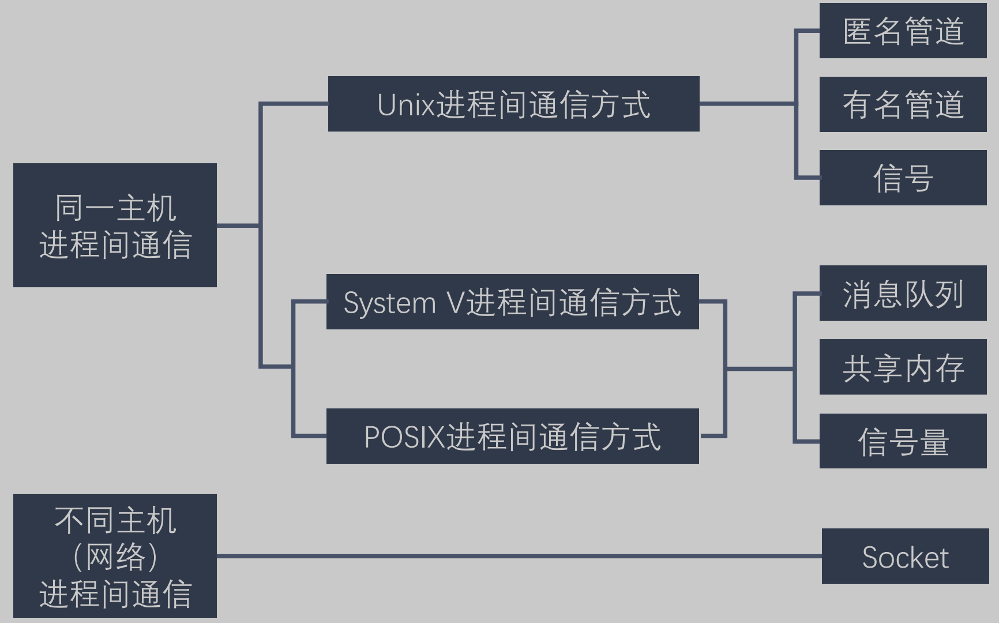

#### 管道：

- 管道主要包括无名管道和命名管道:

  > 1. 普通(匿名)管道可用于具有亲缘关系的父子进程间的通信， int pipe(int fd[2]);
  >
  > 2. 有名管道除了具有管道所具有的功能外，它还允许无亲缘关系进程间的通信 int mkfifo(const char *pathname, mode_t mode);
  >    - 有名管道是FIFO文件，`存在于文件系统中`，可以通过文件路径名来指出。
  >    - 有名管道`可以在不具有亲缘`关系的进程间进行通信。

##### 管道的特点

- 管道其实是一个在`内核内存`中维护的`缓冲器`，这个缓冲器的存储`能力是有限`的，不同的操作系统大小不一定相同。

- 管道拥有文件的特质：`读`操作、`写`操作，<u>匿名管道没有文件实体</u>，<u>有名管道有文件实体</u>，但不存储数据。可以按照操作文件的方式对管道进行操作。 ==半双工==

- 一个管道是一个`字节流`，使用管道时不存在消息或者消息边界的概念，从管道读取数据的进程可以读取任意大小的数据块，而不管写入进程写入管道的数据块的大小是多少。

- 通过管道传递的`数据是顺序`的，从管道中读取出来的字节的顺序和它们被写入管道的顺序是完全一样的。

- 在管道中的数据的传递方向是单向的，一端用于写入，一端用于读取，具有`固定的读端和写端`，管道是`半双工`的。

- 从管道读数据是`一次性操作`，数据一旦被读走，它就从管道中被抛弃，释放空间以便写更多的数据，在管道中无法使用 lseek() 来随机的访问数据。

- 匿名管道只能在`有亲缘关系的进程之间`（父进程与子进程，或者两个兄弟进程，具有亲缘）    <u>==（父亲或兄弟）==</u>


#### 内存映射

内存映射(mapped memory)：内存映射允许`任何多个进程间`通信，每一个使用该机制的进程通过`把一个共享的文件`映射到自己的`进程地址空间`来实现它，用户通过修改内存就能修改磁盘文件  （==<u>映射到`虚拟地址空间`, 可以是实现没有关系的进程间的通信</u>==） 


#### 消息队列

- 消息队列，是消息的链接表，存放在内核中。一个消息队列由一个标识符（即队列ID）来标记。 (消息队列`克服了信号传递信息少`，`管道只能承载无格式字节流`以及`缓冲区大小受限`等特点) 具有写权限得进程可以按照一定得规则向消息队列中添加新信息；对消息队列有读权限得进程则可以从消息队列中读取信息；

  特点：

  1. 消息队列是面向记录的，其中的消息具有特定的`格式`以及特定的`优先级`。
  2. 消息队列独立于发送与接收进程。进程`终止`时，消息队列及其内容并`不会被删除`。 释放或者关闭操作系统
  3. 消息队列可以实现消息的`随机查询`,<u>消息不一定要以先进先出的次序读取,也可以按消息的类型读取</u>。

- 缺点：

  - 消息这种模型，两个进程之间的通信就像平时发邮件一样，你来一封，我回一封，可以频繁沟通了。但邮件的通信方式存在不足的地方有两点，一是`通信不及时`，⼆是`附件也有大小限制`，这同样也是消息队列通信不足的点。
  - 消息队列不适合比较大数据的传输  在 Linux 内核中，会有两个宏定义MSGMAX 和 MSGMNB，它们以字节为单位，分别定义了`一条消息的最大长度`和`一个队列的最大长度`。
  - 消息队列通信过程中，存在用户态与内核态之间的数据拷贝开销。


#### 信号 (<u>kill</u>)

> 对于异常情况下的⼯作模式，就需要用「信号」的方式来通知进程
>
> 信号是进程间通信机制中唯一的异步通信机制
>
> 用户进程对信号的处理方式：
>
> - 执行默认操作：Linux 对每种信号都规定了默认操作，例如，上面列表中的 SIGTERM 信号，就是终⽌进程的意思。
> - 捕捉信号：我们可以为信号定义一个信号处理函数。当信号发⽣时，我们就执行相应的信号处理函数。
> - 忽略信号：除了SIGKILL 和 SEGSTOP，其他信号都可以忽略，不做任何处理

- 信号是 Linux 进程间通信的`最古老的方式之一`，是事件发生时对进程的通知机制，有时也称之为`软件中断`，它是在软件层次上对中断机制的一种模拟，是一种异步通信的方式。信号可以导致一个正在运行的进程被另一个正在运行的异步进程中断，转而处理某一个突发事件。
- 发往进程的诸多信号，通常都是源于内核。引发内核为进程产生信号的各类事件如下：
  - 对于前台进程，用户可以通过输入特殊的终端字符来给它发送信号。比如输入Ctrl+C `SIGINT`通常会给进程发送一个中断信号。
  - 硬件发生异常，即硬件检测到一个错误条件并通知内核，随即再由内核发送相应信号给相关进程。比如执行一条异常的机器语言指令，诸如被 0 除，或者引用了无法访问的内存区域。
  - 系统状态变化，比如 alarm 定时器到期将引起 SIGALRM 信号，进程执行的 CPU 时间超限，或者该进程的某个子进程退出。
  - 运行 kill 命令或调用 kill 函数。
- 使用信号的两个主要目的是：

  - 让进程知道已经发生了一个特定的事情。

  - 强迫进程执行它自己代码中的信号处理程序。
- 信号的特点： 
  - `简单` 
  - `不能携带大量信息`
  - `满足某个特定条件才发送`
  - `优先级比较高`
- 查看系统定义的信号列表：kill –l 
- 前 31 个信号为常规信号，其余为实时信号。


##### ==SIGCHLD信号==

**产生条件：**

1. 子进程结束
2. 子进程暂停了
3. 子进程继续运行

<u>都会给父进程发送该信号，父进程默认忽略该信号。</u>

使用SIGCHLD信号`解决僵尸进程`的问题。


接上文 但是太过重要 直接三级目录了

### `共享内存`

> - 现代操作系统，对于内存管理，采用的是`虚拟内存`技术，也就是每个进程都有自⼰独⽴的虚拟内存空间，不同进程的虚拟内存映射到不同的物理内存中。所以，<u>即使进程 A 和 进程 B 的虚拟地址是一样的，其实访问的是不同的物理内存地址，对于数据的增删查改互不影响。</u>
>
> - 共享内存的机制，就是==<u>拿出一块虚拟地址空间来，映射到相同的物理内存中</u>==。这样这个进程写入的东⻄，另外一个进程⻢上就能看到了，都不需要拷贝来拷贝去，传来传去，大大提高了进程间通信的速度。
> - 有点类似与实现线程的共享地址空间的特性 实现本质上是~~相同？~~的`逻辑地址映射到同一块物理内存` 内存映射是到同一个文件
>
> 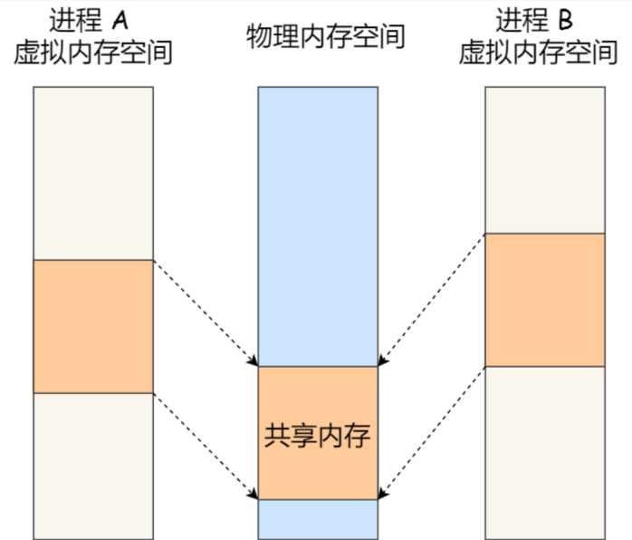

##### **01 /** 共享内存概念

- 共享内存允许两个或者多个进程共享物理内存的同一块区域（通常被称为段）。由于一个共享内存段会称为一个进程用户空间的一部分，因此这种 IPC 机制`无需内核介入`。所有需要做的就是让一个进程将数据复制进共享内存中，并且这部分数据会对其他所有共享同一个段的进程可用 是`最快的ipc`。
- 与管道等要求发送进程将数据从用户空间的缓冲区复制进内核内存和接收进程将数据从内核内存复制进用户空间的缓冲区的做法相比，这种 IPC 技术的速度更快。   `（直接操作内存 与内核内存无关 管道什么的必须拷贝到内核内存）`

##### **02 /** 共享内存使用步骤

- 调用 shmget() `创建`一个新共享内存段或取得一个既有共享内存段的标识符（即由其他进程创建的共享内存段）。这个调用将返回后续调用中需要用到的共享内存标识符。
- 使用 shmat() 来`附上`共享内存段，即使该段成为调用进程的虚拟内存的一部分。 `（共享内存与进程关联）`
- 此刻在程序中可以像对待其他可用内存那样对待这个共享内存段。为引用这块共享内存，程序需要使用由 shmat() 调用返回的 addr 值，它是一个指向进程的虚拟`地址`空间中该共享内存段的起点的指针。
- 调用 shmdt() 来`分离`共享内存段。在这个调用之后，进程就无法再引用这块共享内存了。这一步是可选的，并且在进程终止时会自动完成这一步。
- 调用 shmctl() 来`删除`共享内存段。只有当当前所有附加内存段的进程都与之分离之后内存段才会销毁。只有一个进程需要执行这一步

##### 03 / 共享内存补充（Shared Memory）  （`不是`内存映射）

- 它使得多个进程可以访问同一块内存空间，不同进程可以及时看到对方进程中对共享内存中数据得更新。这种方式需要依靠某种同步操作，如`互斥锁和信号量`等

  特点：

  1. 共享内存是==最快==的一种IPC，因为进程是直接对内存进行存取
  2. 因为多个进程可以同时操作，所以需要进行==同步==
  3. ==信号量+共享内存==通常结合在一起使用，信号量用来同步对共享内存的访问

  

同上 太过重要直接三级目录

### `信号量`   

#####   ==(**控制同步而非通信**)== 常用：信号量进行同步 共享内存进行通信

信号量其实是一个`整型的计数器`，主要用于实现进程间的互斥与同步，而不是用于缓存进程间通信的数据。

信号量表示资源的数量，控制信号量的方式有两种原子操作：p-1 v+1

操作系统在底层上实现了pv的原子操作

> 信号初始化为1，就代表着是互斥信号量，它可以保证共享内存在任何时刻只有一个进程在访问，这就很好的保护了共享内存。

> 信号初始化为0，就代表着是同步信号量，它可以保证进程A应在进程B之前执行。


### `进程调度`算法

##### **什么时候会发生 CPU 调度？**

1. 当进程从运行状态转到等待状态； （非抢占）

   > 可能是运行要求的资源不满足 `进入阻塞`

2. 当进程从运行状态转到就绪状态；   （抢占）

   > 运行进程的时间片到了就会发⽣中断，于是后面的进程就会抢占正在运行的进程，从而占用 CPU。

3. 当进程从等待状态转到就绪状态；   （抢占）

   > 假设有一个进程是处于等待状态的，但是它的优先级比较高，如果该进程等待的事件发⽣了，它就会转到就绪状态，一旦它转到就绪状态，如果我们的调度算法是以优先级来进行调度的，那么它就会⽴⻢抢占正在运行的 
   > 进程，所以这个时候就会发⽣ CPU 调度。

4. 当进程从运行状态转到终⽌状态； （非抢占）

> ==等待就是等待资源 其实是（等待）阻塞状态==

其中发生在 1 和 4 两种情况下的调度称为「非抢占式调度」，2 和 3 两种情况下发⽣的调度称为「抢占式调度」。

- 非抢占式：当进程正在运行时，它就会一直运行，直到该进程完成或发生某个事件而被阻塞时，才会把 CPU 让给其他进程。
- 抢占式调度：进程正在运行的时，可以被打断，使其把 CPU 让给其他进程。 

那抢占的原则一般有三种，分别是`时间片`原则、`优先权`原则、`短作业优先`原则。

#### **常见的调度算法：**

- ==先来先服务==调度算法 
  - 最简单 先进先出 严格排队
  - 适合长作业 不适合短作业
- ==最短进程/作业==优先调度算法 
  - 非抢占, `下一次选择预计处理时间最短的进程`
  - 对长作业不利
  - 极端现象: 一个长作业在就绪队列等待运行，而这个就绪队列有非常多的短作业，那么就会使得长作业不断的往后推，周转时间变长，致使长作业长期不会被运行
- 最短剩余时间优先:
  - 最短进程的抢占版本, 估计时间最短就不排队了, 直接抢
- 时间片轮转调度算法 
  - 适中的抢占策略, （`被抢占之前起码运行一段时间`）
  - 基于先来先服务算法
  - 时间片的长度: 
    - 如果时间片设得太短会导致`过多的进程上下文切换`，降低了 CPU 效率；  
    - 如果设得太长又可能引起对短作业进程的响应时间变长。 ==<u>？不利于短作业</u>==
- 最高优先级调度算法 
  - 进程的优先级可以分为，`静态优先级和动态优先级`：

    1. 静态优先级：`创建`进程时候，就已经`确定`了`优先级`了，然后整个运行时间优先级都不会变化；
    2. 动态优先级：根据进程的动态变化调整优先级，比如如果进程运行时间增加，则降低其优先级，如果进程等待时间（就绪队列的等待时间）增加，则升高其优先级，也就是<u>随着时间的推移增加等待进程的优先级</u>。
  - 根据优先级进行抢占
- 高响应比优先调度算法 
  - （`照顾长时间进程`）
  -  ==(等待时间 + 服务时间) / 服务时间==
  - ==(相当于等待时间越长, 响应比(优先级)越高)==
- 多级反馈队列调度算法
  - 多级反馈队列（Multilevel Feedback Queue）调度算法是「==时间片轮转算法==」和「==最高优先级算法==」的综合和发展。

    - 「多级」表示有多个队列，每个队列优先级从高到低，同时优先级越高时间片越短。 
    - 「反馈」表示如果有新的进程加入优先级高的队列时，⽴刻停⽌当前正在运行的进程，转而去运行优先级高的队列
  - 目前被公认的一种`较好`的进程调度算法
  - `优先级越高 越靠前 时间片越短 没完成扔到第二队列最后 时间片加倍 等待`
  - 对于短作业可能可以在第一级队列很快被处理完。对于长作业，如果在第一级队列处理不完，可以移入下次队列等待被执行，虽然等待的时间变长了，但是运行时间也会更长了，所以该算法很好的`兼顾了长短作业`，同时有较好的响应时间。


### Unix、Linux与Windows进程`调度策略的比较`

> - linux进程分为两种: 实时进程 普通进程  (实时进程优先于普通进程)
>   1. 实时进程执行先来先去 和 时间片轮转
>   2. 普通进程执行 动态优先级策略 (抢占/非抢占?)
>
> - unix: 多级反馈队列
> - windows: 不同之处 调度的是线程  基于优先级的抢占和时间片

无论是在批处理系统还是分时系统中，用户进程数一般都多于处理机数、这将导致它们互相争夺处理机。另外，系统进程也同样需要使用处理机。这就要求进程调度程序按一定的策略，动态地把处理机分配给处于就绪队列中的某一个进程，以使之执行。 

**进程调度的实质是资源的分配**，如何使系统能够保持较短的响应时间和较高的吞吐量，如何在**多个可运行的进程**中选取一个**最值得运行的进程投入运行**是调度器的主要任务。进程调度包括两个方面的内容：何时分配CPU 时间（调度时机）即调度器什么时候启动；如何选择进程（调度算法）即调度器该怎么做。进程调度主要可以分为**非剥夺**方式与**剥夺**方式两种。

非剥夺方式：调度程序一旦把处理机分配给某进程后便让它**一直运行下去**，直到进程完成或发生某事件而阻塞时，才把处理机分配给另一个进程。 

剥夺方式：当一个进程正在运行时，系统可以基于某种原则，剥夺已分配给它的处理机，将之分配给其它进程。**剥夺原则有：优先权原则、短进程优先原则、时间片原则**。

Linux 从整体上区分实时进程和普通进程，因为实时进程和普通进程度调度是不同的，它们两者之间，实时进程应该先于普通进程而运行，然后，对于同一类型的不同进程，采用不同的标准来选择进程。对**普通进程**的调度策略是**动态优先调度**(动态优先级抢占调度)，对于**实时进程**采用了两种调度策略，**FIFO(先来先服务调度)和RR（时间片轮转调度）**。

UNIX系统是**单纯的分时系统**，所以没有设置作业调度。UNIX系统的进程调度采用的算法是，**多级反馈队列调度法**。其核心思想是先从最高休先级就绪队列中取出排在队列最前面的进程，当进程执行完一个时间片仍未完成则剥夺它的执行，将它放入到相应的队列中，取出下一个就绪进程投入运行，对于同一个队列中的各个进程，按照时间片轮转法调度。多级反馈队列调度算法即能使高优先级的作业得到响应又能使短作业（进程）迅速完成。但是它还是存在某些方面的不足，当**不断有新进程到来时，则长进程可能饥饿**。

Windows 系统其调度方式比较复杂，它的处理器调度的**调度单位是线程而不是进程**，是基于**优先级的抢占式多处理器调度**，依据优先级和分配时间片来调度。而且Windows 2000/XP在单处理器系统和多处理器系统中的线程调度是不同的线程调度机制，Windows操作系统的调度系统总是**运行优先级最高的就绪线程**。在**同一优先级的各线程按时间片轮转算法进行调度**。如果一个高优先级的线程进入就绪状态，**当前运行的线程可能在用完它的时间片之前就被抢占处理机。**

多任务、有线程优先级、多种中断级别这是现代操作系统的共同特点。实时操作系统（Real-time operating system, RTOS）最大的特点是**对响应时间有严格的要求**，linux尚且不能称为完全的实时操作系统，USA的宇宙飞船常用的操作系统是VxWorks，这才是闻名于世的RTOS。`


### 进程的上下文切换

内核为每一个进程维持一个上下文。**上下文就是内核重新启动一个被抢占的进程所需的状态。**包括一下内容：

- 通用目的寄存器
- 浮点寄存器
- 程序计数器
- 用户栈
- 状态寄存器
- 内核栈
- 各种内核数据结构：比如描绘地址空间的页表，包含有关当前进程信息的进程表，以及包含进程已打开文件的信息的文件表。


1. 进程切换的概念: 
   - 各个进程之间是共享 CPU 资源的，在不同的时候进程之间需要切换，让不同的进程可以在CPU 执行，那么这个一个进程切换到另一个进程运行，称为进程的上下文切换。
2. 进程切换的场景:
   - 为了保证所有进程可以得到公平调度，<u>CPU 时间被划分为一段段的时间片</u>，这些时间片再被轮流分配给各个进程。这样，当某个进程的==时间片耗尽==了，进程就从<u>运行状态变为就绪状态</u>，系统从就绪队列选择另外一个进程运行；
   - 进程在==系统资源不足==（比如内存不足）时，要等到资源满足后才可以运行，这个时候进程也会被挂起，并由系统调度其他进程运行； ==阻塞==
   - 当进程通过睡眠函数 sleep 这样的方法将自己主动挂起时，自然也会重新调度； ==主动阻塞==
   - 当有优先级更高的进程运行时，为了保证高优先级进程的运行，当前进程会被挂起，由高优先级进程来运行； ==被高优先级的抢占==
   - 发生硬件中断时，CPU 上的进程会被中断挂起，转而执行内核中的中断服务程序；  ==硬件中断==
3. 需要切换的资源
   1. 用户空间的资源: `虚拟内存, 栈, 全局变量`
   2. 内核空间的资源: `内核堆栈, 寄存器`
4. 切换的过程: 
   - <u>交换的信息保存在进程的 PCB</u>，当要运行另外一个进程的时候，我们需要从这个`进程的 PCB 取出上下文`，然后恢复到 CPU 中，这使得这个进程可以继续执行


### 单核CPU是如何实现多进程的

1. 分时复用
2. 调度算法

单核cpu之所以能够实现多进程,主要是依靠于`操作系统的进程的调度算法`  ==<u>操作系统的并发</u>==

如`时间片轮转算法`,在早期,举例说明:有5个正在运行的程序(即5个进程) :  QQ  微信  有道词典   网易云音乐  chrome浏览器, 操作系统会让单核cpu轮流来运行这些进程,一个进程只运行2ms,这样看起起来就像多个进程同时在运行,从而实现多进程


### ==线程部分==

### 线程的实现

主要有三种线程的实现方式：

- `用户`线程（User Thread）：在用户空间实现的线程，不是由内核管理的线程，是由==用户态的线程库==来完成线程的管理；
- `内核`线程（Kernel Thread）：在内核中实现的线程，是由==内核管理==的线程； 
- `轻量级进程`（LightWeight Process）：在内核中来⽀持用户线程；

那么，这还需要考虑一个问题，用户线程和内核线程的对应关系。

1. 多个用户线程对应同一个内核线程
2. 一个用户线程对应一个内核线程
3. 多个用户线程对应到多个内核线程


### `用户线程和内核线程`

#### `用户线程`如何理解？存在什么优势和缺陷？

用户线程是<u>基于用户态的线程管理库</u>来实现的，那么线程控制块（\*Thread Control Block, TCB\*） 也是在库里面来实现的，对于<u>操作系统而言是看不到这个 TCB 的，它只能看到整个进程的 PCB。</u>

所以，用户线程的整个线程管理和调度，`操作系统是不直接参与`的，而是由`用户级线程库函数`来完成线程的管理，包括线程的创建、终止、同步和调度等。

==多个用户线程对应同一个内核线程==


用户线程的**优点**：

- 每个进程都需要有它私有的线程控制块（TCB）列表，用来跟踪记录它各个线程状态信息（PC、栈指针、寄存器），TCB 由用户级线程库函数来维护，可用于不支持线程技术的操作系统；
- 用户线程的切换也是由线程库函数来完成的，无需用户态与内核态的切换，所以速度特别快；

用户线程的**缺点**：

- 由于操作系统不参与线程的调度，如果一个线程发起了系统调用而阻塞，那进程所包含的用户线程都不能执行了。 ==一个阻塞影响其他==
- 当一个线程开始运行后，除非它主动地交出 CPU 的使用权，否则它所在的进程当中的其他线程无法运行，因为用户态的线程没法打断当前运行中的线程，它没有这个特权，只有操作系统才有，但是用户线程不是由操作系统管理的。
- 由于时间片分配给进程，故与其他进程比，在多线程执行时，每个线程得到的时间片较少，执行会比较慢；

#### `内核线程`如何理解？存在什么优势和缺陷？

内核线程是==由操作系统管理==的，线程对应的 TCB 自然是放在操作系统里的，这样线程的创建、终止和管理都是由操作系统负责。

一个用户线程对应一个内核线程


内核线程的**优点**：

- 在一个进程当中，如果某个内核线程发起系统调用而被阻塞，并不会影响其他内核线程的运行； ==tcb由内核管理 所以不会互相影响==
- 分配给线程，多线程的进程获得更多的 CPU 运行时间；

内核线程的**缺点**：

- 在支持内核线程的操作系统中，由==内核来维护进程和线程==的上下文信息，如 PCB 和 TCB；
- 线程的创建、终止和切换==都是通过系统调用==的方式来进行，因此对于系统来说，系统开销比较大；


### 线程的上下文切换

线程与进程最大的区别在于：线程是==调度==的基本单位，而进程则是==资源拥有==的基本单位。

所以，所谓操作系统的任务调度，实际上的调度对象是线程，而进程只是给线程提供了虚拟内存、全局变量等资源。

对于线程和进程我们可以这么理解：

- 当进程只有一个线程时，可以认为进程就等于线程；
- 当进程拥有多个线程时，这些线程会共享相同的虚拟内存和全局变量等资源，这些资源在上下文切换时是不需要修改的；

另外，线程也有自⼰的私有数据，比如`栈和寄存器`等，这些在上下文切换时也是需要保存的。

> `当前线程Id`、`线程状态`、`栈`、`寄存器状态`

##### 线程上下文切换的是什么？

这还得看线程是不是属于同一个进程：

- 当两个线程不是属于同一个进程，则切换的过程就跟进程上下文切换一样；
- 当两个线程是属于同一个进程，因为虚拟内存是共享的，所以在切换时，虚拟内存这些资源就保持不动，只需要切换线程的私有数据、寄存器等不共享的数据；

所以，<u>线程的上下文切换相比进程，开销要小很多</u>。


### `线程`需要保存哪些`上下文`，SP、PC、EAX这些寄存器是干嘛用的

线程在切换的过程中需要保存`当前线程Id`、`线程状态`、`堆栈`、`寄存器状态`等信息。其中寄存器主要包括SP PC EAX等寄存器，其主要功能如下：

- SP:**堆栈指针**，指向当前栈的栈顶地址 （`存地址`）
- PC:**程序计数器，存储下一条将要执行的指令**（`存下一条指令`）
- EAX:累加寄存器，用于加法乘法的缺省寄存器 `？`


### `上下文`切换，`进程`切换和`线程`切换之间有什么区别

#### 概念

- 上下文切换涉及存储进程或线程的上下文或状态，以便可以在需要时重新加载它，并可以执行从先前的相同点恢复。这是多任务操作系统的功能，并且允许单个CPU由多个进程共享。
- ==<u>**进程切换或进程调度**</u>==是`通过保存当前正在执行的进程的所有状态（包括其寄存器状态，关联的内核状态及其所有虚拟内存配置）来将一个进程更改为另一个进程`。
- 线程切换是指在进程中从一个线程切换到另一个线程。

### 区别

1. `进程切换与线程切换的一个最主要区别`就在于<u>进程切换涉及到`虚拟地址空间`的切换而线程切换则不会</u>。因为每个进程都有自己的虚拟地址空间，而线程是共享所在进程的虚拟地址空间的，因此同一个进程中的线程进行线程切换时不涉及虚拟地址空间的转换。
2. 导致的结果就是 TLB快表失效, 需要重新组织 程序变慢


### `线程池`相关

#### [线程池实现](https://qianxunslimg.xyz/2022/05/18/shou-si-dai-ma/#线程池)

`因为创建线程关闭线程花销是比较大的，大过了线程空转的花销`,创建和销毁线程开销大，可能需要上千个时钟周期，避免cpu花费不必要的时间在这上面。  （==创建销毁 > 空转==）

#### 原理

**为了减少创建与销毁线程所带来的时间消耗与资源消耗，因此采用线程池的策略：**

1. 程序启动后，`预先创建一定数量的线程放入空闲队列`中，这些线程都是处于阻塞状态，基本不消耗CPU，只占用较小的内存空间。

2. 接收到任务后，`任务被挂在任务队列`，`线程池选择一个空闲线程来执行此任务。`
3. 任务执行完毕后，`不销毁线程`，线程继续保持在池中等待下一次的任务。

**线程池所解决的问题：**

1. 需要频繁创建与销毁大量线程的情况下，由于线程预先就创建好了，接到任务就能马上从线程池中调用线程来处理任务，`减少了创建与销毁线程带来的时间开销和CPU资源占用`。
2. 需要并发的任务很多时候，无法为每个任务指定一个线程（`线程不够分`），使用线程池可以将提交的任务挂在任务队列上，等到池中有空闲线程时就可以为该任务指定线程。

#### ==怎么实现线程池==

1. <u>设置一个生产者消费者队列</u>，作为临界资源
2. 初始化n个线程，并让其运行起来，加锁去队列取任务运行
3. 当任务队列为空的时候，所有线程阻塞
4. 当生产者队列来了一个任务后，先对队列加锁，把任务挂在到队列上，然后使用条件变量去通知阻塞中的一个线程

#### 线程池参数设置

线程池的线程数量设置`过多`会导致线程`竞争激烈`

如果线程数量设置`过少`的话，还会导致系统`无法充分利`用计算机`资源`

- CPU 密集型任务

  这种任务消耗的主要是 CPU 资源，可以将线程数设置为 `N（CPU 核心数）+1`，比 CPU 核心数多出来的一个线程是为了防止线程偶发的缺页中断，或者其它原因导致的任务暂停而带来的影响。一旦任务暂停，CPU 就会处于空闲状态，而在这种情况下多出来的一个线程就可以充分利用 CPU 的空闲时间。

- I/O 密集型任务

  这种任务应用起来，系统会用大部分的时间来处理 I/O 交互，而线程在处理 I/O 的时间段内不会占用 CPU 来处理，这时就可以将 CPU 交出给其它线程使用。因此在 I/O 密集型任务的应用中，我们可以多配置一些线程，具体的计算方法是 `2N`。


### 线程`模型`

1. Future模型  （==QFuture 和 run==）

   - 该模型通常在使用的时候需要结合Callable接口配合使用。
   - Future是`把结果放在将来获取`，当前主线程并不急于获取处理结果。允许子线程先进行处理一段时间，处理结束之后就把结果保存下来，当主线程需要使用的时候再向子线程索取。
   - 使用Future模式便可以`省去全局变量`的使用，直接从线程中获取子线程处理结果

2. fork&join模型  （==Qt::Concurrent map那一堆==）

   - 该模型包含递归思想和回溯思想，递归用来拆分任务，回溯用合并结果。可以用来处理一些可以`进行拆分的大任务`。其主要是把一个大任务逐级拆分为多个子任务，然后分别在子线程中执行，当每个子线程执行结束之后逐级回溯，返回结果进行汇总合并，最终得出想要的结果。

   - 这里模拟一个摘苹果的场景：有100棵苹果树，每棵苹果树有10个苹果，现在要把他们摘下来。为了节约时间，规定每个线程最多只能摘10棵苹树以便于节约时间。各个线程摘完之后汇总计算总苹果树。

     

3. 生产者消费者模型   （新建线程任务放在==<u>**队列**</u>==就不管了）

   - 生产者消费者模型都比较熟悉，其核心是使用一个缓存来保存任务。`开启一个/多个线程来生产任务，然后再开启一个/多个来从缓存中取出任务进行处理。`这样的好处是任务的生成和处理分隔开，生产者不需要处理任务，只负责向生成任务然后保存到缓存。而消费者只需要从缓存中取出任务进行处理。使用的时候可以根据任务的生成情况和处理情况开启不同的线程来处理。比如，生成的任务速度较快，那么就可以灵活的多开启几个消费者线程进行处理，这样就可以避免任务的处理响应缓慢的问题。

4. master-worker模型

   - master-worker模型类似于任务分发策略，开启一个master线程接收任务，然后在master中根据任务的具体情况进行分发给其它worker子线程，然后由子线程处理任务。如需返回结果，则worker处理结束之后把处理结果返回给master。


### 怎样`确定`当前`线程`是`繁忙还是阻塞`？

==使用ps命令查看==

  `ps`命令是Process Status的缩写，用来列出系统中当前运行的进程。使用该命令可以确定有哪些进程正在运行和运行的状态、进程是否结束、进程有没有僵死、哪些进程占用了过多的资源等等。ps命令所列出的进行是当前进程的快照，也就是并不是动态的，而是执行该命令时那一时刻进行的状态。而经常和ps一起结合使用的杀死进程的是`kill`命令。
  在我们的学习中我们知道，Linux的进程状态一般分为几种：

	>`R`(TASK_RUNNING，可执行状态)，这个进程是可运行的——要么它正在运行，要么在运行队列中等待运行；
	>
	>`S`(TASK_INTERRUPTIBLE，中断状态)，这个状态的进程因为等待某事件的发生（比如等待socket连接、等待信号量等）而被挂起，然后当这些事件发生或完成后，对应的等待队列中的一个或多个进程将被唤醒。
	>
	>`D`(TASK_UNINTERRUPTIBLE，不可中断状态)，在进程接收到信号时，不会被唤醒变成可运行的。除了这一点，该状态和TASK_INTERRUPTIBLE其他部分完全一样，这个状态通常用于进程必须不间断等待或者事件发生的频率很快，并且无法用kill命令关闭处于TASK_UNINTERRUPTIBLE状态的进程。
	>
	>`T`(TASK_STOPPED或TASK_TRACED，暂停状态或跟踪状态)，该状态表示该进程已经停止执行，并且不具有再次执行的条件。向进程发送一个SIGSTOP信号，它就会因响应该信号而进入TASK_STOPPED状态（除非该进程本身处于TASK_UNINTERRUPTIBLE状态而不响应信号）。而当进程正在被跟踪时，它处于TASK_TRACED状态。
	>
	>`Z`(TASK_DEAD或EXIT_ZOMBIE，退出状态)，进程在退出的过程中，处于TASK_DEAD状态，如果它的父进程没有收到SIGCHLD信号，故未调用wait（如wait4、waitid）处理函数等待子进程结束，又没有显式忽略该信号，它就一直保持EXIT_ZOMBIE状态。只要父进程不退出，这个EXIT_ZOMBIE状态的子进程就一直存在，这也就是所谓的"僵尸"进程。
	>
	>`X`(TASK_DEAD - EXIT_DEAD，退出状态)，进程即将被销毁。EXIT_DEAD状态是非常短暂的，几乎不可能通过ps命令捕捉到。


### `GDB`多线程`调试`

- 使用 GDB 调试的时候，GDB 默认只能跟踪一个进程，可以在 fork 函数调用之前，通过指令设置 GDB 调试工具跟踪父进程或者是跟踪子进程，默认跟踪父进程。
- 设置调试父进程或者子进程：`set follow-fork-mode [parent（默认）| child]`
- 设置调试模式：set detach-on-fork [on | off]   默认为 on，表示调试当前进程的时候，其它的进程继续运行，如果为 off，调试当前进程的时候，其它进程被 GDB 挂起。
- 查看调试的进程：info inferiors
- 切换当前调试的进程：inferior id
- 使进程脱离 GDB 调试：detach inferiors id


### 如何`结束`线程

[(25条消息) 如何终止线程的运行（C/C++_SurgePing的博客-CSDN博客](https://blog.csdn.net/suxinpingtao51/article/details/27080289)

1、线程函数返回（最好使用该方法）。 
2、通过调用ExitThread函数，线程将自行撤消（最好不使用该方法）。 
3、同一个进程或另一个进程中的线程调用TerminateThread函数（应避免使用该方法）。 
4、ExitProcess和TerminateProcess函数也可以用来终止线程的运行（应避免使用该方法）。


### ==线程同步==

### `线程间同步`的方式

1. `互斥量`Synchronized/Lock：采用互斥对象机制，只有拥有互斥对象的线程才有访问公共资源的权限。因为互斥对象只有一个，所以可以保证公共资源不会被多个线程同时访问 
2. `自旋锁`: 忙等待锁 不满足条件时 原地自选 而不是进行上下文切换
3. `读写锁`：rwlock，分为读锁和写锁。处于读操作时，可以允许`多个线程同时获得读操作`。但是同一时刻只能有`一个线程可以获得写锁`。其它获取写锁失败的线程都会进入睡眠状态，直到写锁释放时被唤醒。 注意：写锁会阻塞其它读写锁。当有一个线程获得写锁在写时，读锁也不能被其它线程获取；写者优先于读者（一旦有写者，则后续读者必须等待，唤醒时优先考虑写者）。适用于读取数据的频率远远大于写数据的频率的场合。   ==(多个读 一个写)==
4. `信号量`Semphare：为控制具有有限数量的用户资源而设计的，它允许多个线程在同一时刻去访问同一个资源，但一般需要限制同一时刻访问此资源的最大线程数目。
5. `条件变量`（事件）：通过通知操作的方式来保持多线程同步，还可以方便的实现多线程优先级的比较操作

1. <u>==互斥锁==</u>

   互斥锁是最常见的线程同步方式，它是一种特殊的变量，它有 ***lock*** 和 ***unlock*** 两种状态，一旦获取，就会上锁，且只能由该线程解锁，期间，其他线程无法获取在使用同一个资源前加锁，使用后解锁，即可实现线程同步，需要注意的是，如果加锁后不解锁，会造成死锁

   - **优点：**

     使用简单；

   - **缺点：**

     1. 重复锁定和解锁，`每次都会检查共享数据结构，浪费时间和资源`；   ==（频繁检查共享数据（锁），浪费时间和资源）==
     2. 繁忙查询的效率非常低；   ==（效率低）==

2. <u>==条件变量==</u>

   条件变量的方法是，当线程在等待某些满足条件时使线程进入睡眠状态，一旦条件满足，就唤醒，这样不会占用宝贵的互斥对象锁，实现高效。

   条件变量允许线程阻塞并等待另一个线程发送信号，`一般和互斥锁一起使用`。

   <u>条件变量被用来阻塞一个线程，当条件不满足时，线程会解开互斥锁，并等待条件发生变化。一旦其他线程改变了条件变量，将通知相应的阻塞线程，这些线程重新锁定互斥锁，然后执行后续代码，最后再解开互斥锁。</u>    ==（一些锁 用条件变量替换）==

3. <u>==信号量==</u>

   **信号量** 和互斥锁的区别在于：`互斥锁只允许一个线程进入临界区，信号量允许多个线程同时进入临界区`

   可以这样理解，互斥锁使用对同一个资源的互斥的方式达到线程同步的目的，信号量可以同步多个资源以达到线程同步

   - 为什么要使用信号量？？?

     为了防止多个进程在访问共享资源为引发的问题。信号量可以协调进程对共享资源的访问，也就是用来`保护临界资源`的。任一时刻只能有一个执行线程进入临界区。  ==（生产消费）==


### `条件变量`

条件变量(cond)是在多线程程序中用来实现"等待-->唤醒"逻辑常用的方法。条件变量利用线程间共享的全局变量进行同步的一种机制，主要包括两个动作：一个线程等待"条件变量的条件成立"而挂起；另一个线程使“条件成立”。为了防止竞争，`条件变量的使用总是和一个互斥锁结合在一起`。线程在改变条件状态前必须首先锁住互斥量，函数pthread_cond_wait把自己放到等待条件的线程列表上，然后对互斥锁解锁(这两个操作是原子操作)。在函数返回时，互斥量再次被锁住。

1. 条件变量需要搭配锁来使用是因为 本身条件变量只是做条件判断 并没有保护临界区的 锁的功能 
2. 调用.wait()会自动解锁并阻塞
3. 调用.noptice_one()会自动加锁 并执行后序


### `锁`了解吗

1. ==互斥锁：mutex==，用于保证在任何时刻，都只能有一个线程访问该对象。<u>当获取锁操作失败时，线程会进入`睡眠`，等待锁释放时被唤醒</u>

2. ==读写锁==：rwlock，分为读锁和写锁。处于读操作时，可以允许`多个线程同时获得读操作`。但是同一时刻只能有`一个线程可以获得写锁`。其它获取写锁失败的线程都会进入睡眠状态，直到写锁释放时被唤醒。 注意：写锁会阻塞其它读写锁。当有一个线程获得写锁在写时，读锁也不能被其它线程获取；写者优先于读者（一旦有写者，则后续读者必须等待，唤醒时优先考虑写者）。适用于读取数据的频率远远大于写数据的频率的场合。   ==(多个读 一个写)==

3. 自旋锁：spinlock，在任何时刻同样只能有一个线程访问对象。但是当获取锁操作失败时，`不会进入睡眠`，而是会在`原地自旋`，直到锁被释放。这样<u>节省了线程从睡眠状态到被唤醒期间的消耗</u>，==在加锁时间短暂的环境下会极大的提高效率==。但如果加锁时间过长，则会非常浪费CPU资源。

   > 自旋锁尽可能的减少线程的阻塞，这`对于锁的竞争不激烈`，且`占用锁时间非常短`的代码块来说性能能大幅度的提升，因为自旋的消耗会小于线程阻塞挂起再唤醒的操作的消耗，这些操作会导致线程发生两次上下文切换！
   >
   > 但是如果锁的竞争激烈，或者持有锁的线程需要长时间占用锁执行同步块，这时候就不适合使用自旋锁了，因为自旋锁在获取锁前一直都是占用 cpu 做无用功，占着 XX 不 XX，同时有大量线程在竞争一个锁，会导致获取锁的时间很长，线程自旋的消耗大于线程阻塞挂起操作的消耗，其它需要 cpu 的线程又不能获取到 cpu，造成 cpu 的浪费。所以这种情况下我们要关闭自旋锁。

4. RCU：即read-copy-update，在修改数据时，首先需要读取数据，然后生成一个副本，对副本进行修改。修改完成后，再将老数据update成新的数据。使用RCU时，读者几乎不需要同步开销，既不需要获得锁，也不使用原子指令，不会导致锁竞争，因此就不用考虑死锁问题了。而对于写者的同步开销较大，它需要复制被修改的数据，还必须使用锁机制同步并行其它写者的修改操作。==在有大量读操作，少量写操作的情况下效率非常高。==

总体上分为乐观锁和悲观锁 

开发过程中，<u>最常见的就是互斥锁</u>了，互斥锁加锁失败时，会用「线程切换」来应对，当加锁失败的线程再次加锁成功后的这一过程，会有`两次线程上下文切换的成本，性能损耗比较大`。

如果我们明确知道被锁住的代码的执行时间很短，那我们应该选择开销比较小的自旋锁，因为<u>自旋锁</u>加锁失败时，并不会主动产⽣线程切换，而是一直忙等待，直到获取到锁，那么如果被锁住的代码执行时间很短，那这个忙等待的时间相对应也很短。

<u>如果能区分读操作和写操作的场景，那读写锁就更合适了</u>，它允许多个读线程可以同时持有读锁，提高了读的并发性。根据偏袒读方还是写方，可以分为读优先锁和写优先锁，读优先锁并发性很强，但是写线程会被饿死，而写优先锁会优先服务写线程，读线程也可能会被饿死，那为了避免饥饿的问题，于是就有了公平读写锁，它是用队列把请求锁的线程排队，并保证先入先出的原则来对线程加锁，这样便保证了某种线程不会被饿死，通用性也更好点。

互斥锁和自旋锁都是最基本的锁，读写锁可以根据场景来选择这两种锁其中的一个进行实现。

另外，互斥锁、自旋锁、读写锁都属于悲观锁，悲观锁认为并发访问共享资源时，冲突概率可能非常高，所以在访问共享资源前，都需要先加锁。相反的，如果并发访问共享资源时，冲突概率非常低的话，就可以使用乐观锁，它的⼯作方 
式是，在访问共享资源时，不用先加锁，修改完共享资源后，再验证这段时间内有没有发⽣冲突，如果没有其他线程在修改资源，那么操作完成，如果发现有其他线程已经修改过这个资源，就放弃本次操作。

但是，一旦冲突概率上升，就不适合使用乐观锁了，因为它解决冲突的重试成本非常高。 

不管使用的哪种锁，我们的加锁的代码范围应该尽可能的小，也就是加锁的粒度要小，这样执行速度会比较快。再来，使用上了合适的锁，就会快上加快了。


### `std`的线程同步机制

#### 互斥锁 mutex

1. 直接操作 mutex，即直接调用 mutex 的 `lock / unlock` 函数。
2. 使用 `lock_guard` 自动加锁、解锁。原理是 RAII，和智能指针类似。
3. 使用 `unique_lock` 自动加锁、解锁。
   `unique_lock` 与 `lock_guard` 原理相同，但是提供了更多功能（比如可以结合条件变量使用）。
   注意：`mutex::scoped_lock` 其实就是 `unique_lock<mutex>` 的 `typedef`。
4. 为输出流使用单独的 mutex。这么做是因为 IO 流并不是线程安全的！ cout<<1<<2<<endl;

#### 条件变量 condition_variable 

条件变量（Condition Variable）的一般用法是：线程 A 等待某个条件并挂起，直到线程 B 设置了这个条件，并通知条件变量，然后线程 A 被唤醒。经典的「生产者-消费者」问题就可以用条件变量来解决。

这里等待的线程可以是多个，通知线程可以选择一次通知一个（`notify_one`）或一次通知所有（`notify_all`）。

1. 与条件变量搭配使用的「锁」，必须是 `unique_lock`，不能用 `lock_guard`。
2. 等待前先加锁。等待时，如果条件不满足，`wait` 会原子性地解锁并把线程挂起。
3. 条件变量被通知后，挂起的线程就被唤醒，但是唤醒也有可能是假唤醒，或者是因为超时等异常情况，所以被唤醒的线程仍要检查条件是否满足，所以 `wait` 是放在条件循环里面。`cv.wait(lock, [] { return ready; });` 相当于：`while (!ready) { cv.wait(lock); }`。


### `自旋`锁

一个是运行条件不满足 放弃cpu使用权 自旋锁不放弃 在原地进行等待 避免了线程频繁的上下文切换

==场景==

1. 自旋锁尽可能的减少线程的阻塞，这`对于锁的竞争不激烈`，且`占用锁时间非常短`的代码块来说性能能大幅度的提升，因为自旋的消耗会小于线程阻塞挂起再唤醒的操作的消耗，这些操作会导致线程发生两次上下文切换！
2. `单核单线程的CPU不适于使用自旋锁`，因为，在同一时间只有一个线程是处在运行状态，假设运行线程A发现无法获取锁，只能等待解锁，但因为A自身不挂起，所以那个持有锁的线程B没有办法进入运行状态，只能等到操作系统分给A的时间片用完，才能有机会被调度。这种情况下使用自旋锁的代价很高。


### `互斥锁`和`读写锁`的区别

**互斥锁和读写锁区别：**

互斥锁：mutex，用于保证在任何时刻，都只能有一个线程访问该对象。当获取锁操作失败时，线程会进入睡眠，等待锁释放时被唤醒。

读写锁：rwlock，分为读锁和写锁。处于读操作时，可以允许多个线程同时获得读操作。但是同一时刻只能有一个线程可以获得写锁。其它获取写锁失败的线程都会进入睡眠状态，直到写锁释放时被唤醒。 注意：写锁会阻塞其它读写锁。当有一个线程获得写锁在写时，读锁也不能被其它线程获取；写者优先于读者（一旦有写者，则后续读者必须等待，唤醒时优先考虑写者）。适用于读取数据的频率远远大于写数据的频率的场合。

互斥锁和读写锁的区别：

1. 读写锁区分`读者`和`写者`，而互斥锁不区分

2. 互斥锁同一时间`只允许一个`线程访问该对象，无论读写；

   读写锁同一时间内`只允许一个写者`，但是`允许多个读者`同时读对象。

3. 读写锁分为读优先还有写优先

   - 写优先适用于读频繁的场景 避免读一直抢占写导致的无法写入数据
   - 读优先相反,避免一直写 影响数据的读取


### `乐观锁和悲观锁`

#### 比较

==互斥锁、自旋锁、读写锁==，都是属于悲观锁。

- 悲观锁做事比较悲观，它认为多线程同时修改共享资源的概率比较高，于是很容易出现冲突，所以访问共享资源前，先要上锁。那相反的，如果多线程同时修改共享资源的概率比较低，就可以采用乐观锁。
- 乐观锁做事比较乐观，它假定冲突的概率很低，它的工作方式是：<u>先修改完共享资源，再验证这段时间内有没有发生冲突</u>，如果没有其他线程在修改资源，那么操作完成，如果发现有其他线程已经修改过这个资源，就放弃本次操作。放弃后如何重试，这跟业务场景息息相关，虽然重试的成本很高，但是冲突的概率足够低的话，还是可以接受的。可见，<u>乐观锁的心态是，不管三七二十一，先改了资源再说。另外，你会发现乐观锁全程并没有加锁，所以它也叫`无锁编程`。</u>
- 乐观锁更适合用与`多读`, 悲观锁适合用于`多写`

#### 乐观锁

> 在线文档
>
> `实现多⼈同时编辑，实际上是用了乐观锁`，它允许多个用户打开同一个文档进行编辑，编辑完提交之后才验证修改的内容是否有冲突
>
> 常见的 `SVN 和 Git 也是用了乐观锁的思想`，先让用户编辑代码，然后提交的时候，通过版本号来判断是否产⽣了冲突，发⽣了冲突的地方，需要我们自⼰修改后，再重新提交。

总是假设==最好==的情况，<u>每次去拿数据的时候都认为别人不会修改，所以不会上锁，但是`在更新的时候会判断一下在此期间别人有没有去更新这个数据`，</u>可以使用==<u>版本号机制</u>==和==<u>CAS算法</u>==实现。**乐观锁适用于多读的应用类型，这样可以提高吞吐量**，像数据库提供的类似于**write_condition机制**，其实都是提供的乐观锁。在Java中`java.util.concurrent.atomic`包下面的原子变量类就是使用了乐观锁的一种实现方式**CAS**实现的。

##### **1. 版本号机制**

一般是在数据表中加上一个数据版本号version字段，表示数据被修改的次数，当数据被修改时，version值会加一。当线程A要更新数据值时，在读取数据的同时也会读取version值，在提交更新时，若刚才读取到的version值为当前数据库中的version值相等时才更新，否则重试更新操作，直到更新成功。

**举一个简单的例子：**

假设数据库中帐户信息表中有一个 version 字段，当前值为 1 ；而当前帐户余额字段（ balance ）为 $100 。

1. 操作员 A 此时将其读出（ version=1 ），并从其帐户余额中扣除 $ 50 ($ 100-$ 50 ）。
2. 在操作员 A 操作的过程中，操作员B 也读入此用户信息（ version=1 ），并从其帐户余额中扣除 $20  (100-$20 ）。
3. 操作员 A 完成了修改工作，将数据版本号加一（ version=2 ），连同帐户扣除后余额（ balance=$50 ），提交至数据库更新，此时由于提交数据版本大于数据库记录当前版本，数据被更新，数据库记录 version 更新为 2 。
4. 操作员 B 完成了操作，也将版本号加一（ version=2 ）试图向数据库提交数据（ balance=$80 ），但此时比对数据库记录版本时发现，操作员 B 提交的数据版本号为 2 ，数据库记录当前版本也为 2 ，不满足 “ 提交版本必须大于记录当前版本才能执行更新 “ 的乐观锁策略，因此，操作员 B 的提交被驳回。

这样，就避免了操作员 B 用基于 version=1 的旧数据修改的结果覆盖操作员A 的操作结果的可能。

##### **2. CAS算法**

即**compare and swap（比较与交换）**，是一种有名的**无锁算法**。无锁编程，即不使用锁的情况下实现多线程之间的变量同步，也就是在没有线程被阻塞的情况下实现变量的同步，所以也叫非阻塞同步（Non-blocking Synchronization）。**CAS算法**涉及到三个操作数

- 需要读写的内存值 V
- 进行比较的值 A
- 拟写入的新值 B

当且仅当 V 的值等于 A时，CAS通过原子方式用新值B来更新V的值，否则不会执行任何操作（比较和替换是一个原子操作）。一般情况下是一个**自旋操作**，即**不断的重试**。


#### **乐观锁的缺点**

> ABA 问题是乐观锁一个常见的问题

**1 ABA 问题**

如果一个变量V初次读取的时候是A值，并且在准备赋值的时候检查到它仍然是A值，那我们就能说明它的值没有被其他线程修改过了吗？很明显是不能的，因为在这段时间它的值可能被改为其他值，然后又改回A，那CAS操作就会误认为它从来没有被修改过。这个问题被称为CAS操作的 **"ABA"问题。**

JDK 1.5 以后的 `AtomicStampedReference 类`就提供了此种能力，其中的 `compareAndSet 方法`就是首先检查当前引用是否等于预期引用，并且当前标志是否等于预期标志，如果全部相等，则以原子方式将该引用和该标志的值设置为给定的更新值。

**2 循环时间长开销大**

**自旋CAS（也就是不成功就一直循环执行直到成功）如果长时间不成功，会给CPU带来非常大的执行开销。** 如果JVM能支持处理器提供的pause指令那么效率会有一定的提升，pause指 令有两个作用，第一它可以延迟流水线执行指令（de-pipeline）,使CPU不会消耗过多的执行资源，延迟的时间取决于具体实现的版本，在一些处理器上延迟时间是零。第二它可以避免在退出循环的时候因内存顺序冲突（memory order violation）而引起CPU流水线被清空（CPU pipeline flush），从而提高CPU的执行效率。

**3 只能保证一个共享变量的原子操作**

CAS 只对单个共享变量有效，当操作涉及跨多个共享变量时 CAS 无效。但是从 JDK 1.5开始，提供了`AtomicReference类`来保证引用对象之间的原子性，你可以把多个变量放在一个对象里来进行 CAS 操作.所以我们可以使用锁或者利用`AtomicReference类`把多个共享变量合并成一个共享变量来操作。

#### **CAS与synchronized的使用情景**

synchronized: java中的东西, 可以理解为普通的悲观锁

> **简单的来说CAS适用于写比较少的情况下（多读场景，冲突一般较少），synchronized适用于写比较多的情况下（多写场景，冲突一般较多）**

1. 对于资源竞争较少（线程冲突较轻）的情况，使用synchronized同步锁进行线程阻塞和唤醒切换以及用户态内核态间的切换操作额外浪费消耗cpu资源；而CAS基于硬件实现，不需要进入内核，不需要切换线程，操作自旋几率较少，因此可以获得更高的性能。
2. 对于资源竞争严重（线程冲突严重）的情况，CAS自旋的概率会比较大，从而浪费更多的CPU资源，效率低于synchronized。


### (可)`递归锁`和非递归锁

 Mutex可以分为递归锁(recursive mutex)和非递归锁(non-recursive mutex)。可递归锁也可称为可重入锁(reentrant mutex)，非递归锁又叫不可重入锁(non-reentrant mutex)。
     二者唯一的区别是，同一个线程可以多次获取同一个递归锁，不会产生死锁。而如果一个线程多次获取同一个非递归锁，则会产生死锁。   ==(递归锁指能连续上锁 连续解锁)==
     Windows下的Mutex和Critical Section是可递归的。Linux下的pthread_mutex_t锁默认是`非递归`的。可以显示的设置PTHREAD_MUTEX_RECURSIVE属性，将pthread_mutex_t设为递归锁。

> windows默认是递归的  ==Mutex==
>
> linux默认是不可递归的  ==pthread_mutex_t==


### `死锁`

死锁是指两个或两个以上进程在执行过程中，因争夺资源而造成的相互等待的现象。

#### 死锁发生的场景

1. `非递归锁在单个线程内 多次加锁`
2. 加锁`忘记释放`
3. `多线程多锁`导致的资源等待死锁

#### 死锁发生的四个必要条件

- `互斥条件`：进程对所分配到的资源不允许其他进程访问，若其他进程访问该资源，只能等待，直至占有该资源的进程使用完成后释放该资源；

  > （`互斥指的是资源的互斥 只能一个进程访问`）

- `请求和保持条件`：进程获得一定的资源后，又对其他资源发出请求，但是该资源可能被其他进程占有，此时请求阻塞，但该进程不会释放自己已经占有的资源

  > （`我阻塞 但我不放手自己的资源`）

- `不可抢占条件`：进程已获得的资源，在未完成使用之前，不可被剥夺，只能在使用后自己释放

  > （`资源只能我自己释放`）

- `循环等待条件`：进程发生死锁后，必然存在一个进程-资源之间的环形链

  > （`我需要你的 你需要他 他需要我...`）

#### 利用工具排查死锁问题 ==pstack+gdb==

在 Linux下，我们可以使用`pstack +gdb`⼯具来定位死锁问题。

- pstack 命令可以显示每个线程的栈跟踪信息（`函数调用过程`），它的使用方式也很简单，只需要pstack< pid> 就可以了。
- 那么，在定位死锁问题时，我们可以多次执行 <u>pstack 命令查看线程的函数调用过程</u>，多次对比结果，确认哪几个线程一直没有变化，且是因为在等待锁，那么大概率是由于死锁问题导致的。

#### pstack的作用, 大致可以归纳如下:

1. 查看`线程数`(比pstree, 包含了详细的堆栈信息)
2. 能简单验证是否按照预定的调用顺序调用栈执行
3. 采用高频率多次采样使用时, 能`发现程序当前的阻塞在哪里`, 以及`性能消耗点在哪里`
4. 能`反映出疑似的死锁现象`(多个线程同时在wait lock, 具体需要进一步验证

#### 解决死锁的方法

即破坏上述四个条件之一，主要方法如下：

1. 资源一次性分配，从而剥夺`请求和保持条件`
2. 可剥夺资源：即当进程新的资源未得到满足时，释放已占有的资源，从而破坏`不可剥夺的条件?请求保持`
3. ==<u>**资源有序分配法**</u>==：系统给每类资源赋予一个序号，每个进程按编号递增的请求资源，释放则相反，从而破坏环路等待的条件

最常见的并且可行的就是使用==<u>**资源有序分配法，来破环环路等待条件**</u>==。

##### 资源有序分配法

线程 A 和 线程 B 获取资源的顺序要一样，当线程 A 是先尝试获取资源 A，然后尝试获取资源B 的时候，线程 B `同样也是`先尝试获取资源 A，然后尝试获取资源B。也就是说，==线程 A 和线程 B 总是以相同的顺序申请自⼰想要的资源==。

我们使用资源有序分配法的方式来修改前面发⽣死锁的代码，我们可以不改动线程A 的代码。

我们先要清楚线程 A 获取资源的顺序，它是先获取互斥锁 A，然后获取互斥锁 B。 

所以我们只需将线程 B 改成以相同顺序的获取资源，就可以打破死锁了。

> 我需要A和B
>
> 你也需要A和B
>
> 那咱俩都按先A->B的顺序请求就不会死锁了 只会阻塞等待 
>
> 而不会产生我有A你有B,咱俩互相阻塞的情况

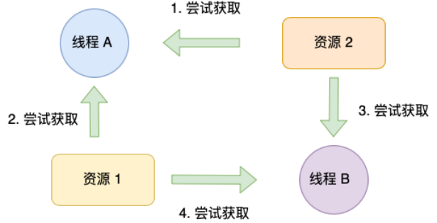

#### 处理死锁的基本方法

1. 预防死锁: 属于事前预防的策略，通过<u>设置某些限制条件</u>，去破坏产生死锁的四个必要条件或其中的几个条件。预防死锁比较容易实现，所以被泛使用，但是由于施加的限制条件过于严格可能会导致系统资源利用率和系统吞吐量降低。

2. 避免死锁: 属于事前预防的策略，但它并不需要事先采取各种限制措施去破坏产生死锁的四个必要条件，而是<u>在资源的动态分配过程中，用某种方法去防止系统进入不安全状态</u>，从而避免死锁的产生。但实现有一定的难度。目前较完善的系统中`常用此法`来避免死锁。
3. 检测死锁: 这种方法不需要事前采取任何限制措施，也不用检查是否进入不安全状态，而是`允许`系统在运行的过程中`发生死锁`。但是通过系统所设置的检测机构.及时的检测出死锁的发生，并精确的测出与死锁有关的进程和资源，然后，采取适当的措施，从系统中将已发生的死锁清楚掉。 (`及时定位给死锁并清除`)
4. 解除死锁: 这是与检测死锁相配套的一套措施。当检测到系统已经产生死锁时，须将进程从死锁中解放出来。通常用到的实施方法是撤销或挂起些进程，以便收回一些资源，再将这些资源分配给已处于阻塞状态的进程，使之转为就绪状态，以继续运行。死锁的检测和解除措施，有可能使系统获得较好的资源和吞吐量，但在现实上难度也最大。

#### 预防死锁和避免死锁的区别:

- 预防死锁和避免死锁实质上都是通过施加某种相知条件的方法，来预防发生死锁。两者的主要区别:为了预防死锁所施加的限制条件较为严格，这往往会影响到进程的并发执行，而避免死锁所施加的限制条件则较为宽松，有利于进程的并发执行。 

  ==（预防比较严格 避免比较宽松）==

####  总结

- 简单来说，死锁问题的产⽣是由两个或者以上线程并行执行的时候，争夺资源而互相等待造成的。
- 死锁只有同时满足互斥、持有并等待、不可剥夺、环路等待这四个条件的时候才会发⽣。 
- 所以要避免死锁问题，就是要破坏其中一个条件即可，最常用的方法就是使用资源有序分配法来破坏环路等待条件


### 如何采用`单线程`的方式处理`高并发`

（这里指主线程为单线程）

在单线程模型中，可以采用`I/O复用`来提高单线程处理多个请求的能力

- 采用事件驱动模型`（epoll?）`，基于异步回调来处理事件，当遇到非常耗时的IO操作时，采用非阻塞的方式，继续执行后面的代码，并且进入事件循环，当IO操作完成时，程序会被通知IO操作已经完成。

- 协程的休眠和唤醒都是发生在用户态的，也就是说应用程序开发者要自己负责协程的休眠和唤醒。即，在向客户端发送请求以后（sendResult(0)），就会主动休眠(park)，一直到客户端把数据返回到服务端，再把协程唤醒(unpark)。

- 这个程序的基础仍然是`I/O复用`，也就是说我们只在socket上有数据的时候，才会去把协程唤醒，让协程去读取数据。


### ==Linux网络系统==

### `文件IO`

**<u>==I/O 是分为两个过程的：==</u>**

1.  **<u>==数据`准备`的过程==</u>**
2.  **<u>==数据从内核空间`拷贝`到用户进程缓冲区的过程==</u>**

#### 缓冲与非缓冲 I/O

文件操作的标准库是可以实现数据的缓存

文件操作的标准库是可以实现数据的缓存，那么根据「==<u>**是否利用标准库缓冲**</u>==」，可以把文件 I/O 分为缓冲 I/O 和非缓冲 I/O：

- 缓冲 I/O，利用的是标准库的缓存实现文件的加速访问，而标准库再通过系统调用访问文件。
- 非缓冲 I/O，直接通过系统调用访问文件，不经过标准库缓存。 

#### 直接与非直接 I/O 

==<u>**是否进行页缓存**</u>==

磁盘 I/O 是非常慢的，所以 Linux 内核为了减少磁盘 I/O 次数，在系统调用后，会把用户数据拷贝到内核中缓存起来，这个内核缓存空间也就是「页缓存」，只有当缓存满足某些条件的时候，才发起磁盘 I/O 的请求。

那么，根据<u>`是否利用操作系统的缓存`</u>，可以把文件 I/O 分为直接 I/O 与非直接 I/O：

- 直接 I/O，不会发⽣内核缓存和用户程序之间数据复制，而是直接经过文件系统访问磁盘。
- 非直接 I/O，读操作时，数据从内核缓存中拷贝给用户程序，写操作时，数据从用户程序拷贝给内核缓存，再由内核决定什么时候写入数据到磁盘。

如果你在使用文件操作类的系统调用函数时，指定了`O_DIRECT` 标志，则表示使用直接I/O。如果没有设置过，<u>默认使用的是非直接 I/O</u>。

> 如果用了非直接 I/O 进行写数据操作，内核什么情况下才会把缓存数据写入到磁盘？
>
> - 在调用write 的最后，当发现`内核缓存的数据太多`的时候，内核会把数据写到磁盘上；    ==数据太多==
> - 用户`主动调用sync` ，内核缓存会刷到磁盘上；  ==主动调用==
> - 当内存⼗分紧张，`无法再分配页面时`，也会把内核缓存的数据刷到磁盘上；   ==内存紧张==
> - 内核缓存的数据的缓存时间`超过某个时间`时，也会把数据刷到磁盘上  ==缓存超时==


接上 过于重要 h3

### `阻塞`与非阻塞 I/O VS `同步`与异步 I/O

> ==数据准备== 和 ==数据拷贝==

- 阻塞 I/O: 当用户程序执行read，线程会被阻塞，一直等到内核数据准备好，并把数据从内核缓冲区拷贝到应用程序的缓冲区中，当拷贝过程完成，read 才会返回。

  > 注意，阻塞等待的是「`内核数据准备好`」和「`数据从内核态拷贝到用户态`」这两个过程。

- 非阻塞 I/O：<u>非阻塞的 read 请求在数据未准备好的情况下⽴即返回，可以继续往下执行</u>，此时应用程序不断轮询内核，直到数据准备好，内核将数据拷贝到应用程序缓冲区， read 调用才可以获取到结果。

  > 访问管道或 socket 时，如果设置了    O_NONBLOCK 标志，那么就表示使用的是非阻塞 I/O 的方式访问，而不做任何设置的话，`默认是阻塞 I/O`。

- 为了解决这种傻乎乎轮询方式，于是  I/O 多路复用技术就出来了，如 select、poll，它是通过I/O 事件分发，当内核数据准备好时，再`以事件通知应用程序进行操作`。

  > 无论是阻塞 I/O、非阻塞 I/O，还是基于非阻塞 I/O 的多路复用==都是同步调用==。因为它们在 read 调用时，==内核将数据从内核空间拷贝到应用程序空间，过程都是需要等待的==，也就是说这个过程是同步的，如果内核实现的拷贝效率不高, read 调用就会在这个同步过程中等待比较长的时间。

- 异步 I/O:「内核数据准备好」和「数据从内核态拷贝到用户态」这两个过程都不用等待。

  > 当我们发起 aio_read 之后，就⽴即返回，内核自动将数据从内核空间拷贝到应用程序空间，这个拷贝过程同样是异步的，内核自动完成的，和前面的同步操作不一样，应用程序并不需要主动发起拷贝动作。


### `PageCache`有什么作用

> 作用: 根据时间和空间的局部性原理
>
> 1. ==缓存==最近被访问的数据
> 2. ==预读==后面的一部分数据
>
> 好处:
>
> 1. 缓存最近被访问的数据, 加速数据访问
> 2. 预读减少IO次数
>
> 劣势:
>
> 1. 需要占用`额外物理内存空间`, 物理内存在比较紧俏的时候可能会导致频繁的 swap 操作，最终导致系统的磁盘 I/O 负载的上升。
> 2. 对`应用层`并没有提供很好的管理 `API`，几乎是透明管理。应用层即使想优化 Page Cache 的使用策略也很难进行。因此一些应用选择在用户空间实现自己的 page 管理，而不使用 page cache，例如 MySQL InnoDB 存储引擎以 16KB 的页进行管理。
> 3. 在某些应用场景下比 Direct I/O `多一次`磁盘读 I/O 以及磁盘写 I/O。


### 进程`写文件`时崩溃，已写入的数据会丢失吗

答案，是不会的。

> 进程对应的只是内存 而文件的读写是存储在页缓存的
>
> 系统对应的才是内核页缓存
>
> 只有系统崩溃, 页缓存才会完蛋, 数据才会丢失

因为进程在执行 write （使用缓冲 IO）系统调用的时候，实际上是将文件数据写到了内核的 page cache，它是文件系统中用于缓存文件数据的缓冲，所以即使进程崩溃了，文件数据还是保留在内核的 page cache，我们读数据的时候，也是从内核的 page cache 读取，因此还是依然读的进程崩溃前写入的数据。

==内核会找个合适的时机，将 page cache 中的数据持久化到磁盘==。但是如果 page cache 里的文件数据，在持久化到磁盘化到磁盘之前，`系统发生了崩溃`，那这部分数据就会丢失了。

当然， 我们也可以在程序里调用 fsync 函数，在写文文件的时候，立刻将文件数据持久化到磁盘，这样就可以解决系统崩溃导致的文件数据丢失的问题。


### `5种IO模型`

1. `阻塞IO`:调用者调用了某个函数，等待这个函数返回，期间什么也不做，不停的去检查这个函数有没有返回，必须等这个函数返回才能进行下一步动作  ==<u>（等待 的准备好了才能继续）</u>==
2. `非阻塞IO`:非阻塞等待，每隔一段时间就去检测IO事件是否就绪。没有就绪就<u>==可以做其他事==</u>。
3. `信号驱动IO`:linux用套接口进行信号驱动IO，安装一个信号处理函数，进程继续运行并不阻塞，当IO时间就绪，进程收到SIGIO信号。然后处理IO事件。 <u>==（不是我去循环检查你好没好，而是你好了告诉我）==</u>
4. `IO复用/多路`转接IO:linux用<u>==select/poll==</u>函数实现IO复用模型，这两个函数也会使进程阻塞，但是和阻塞IO所不同的是这两个函数可以同时阻塞多个IO操作。而且可以同时对多个读操作、写操作的IO函数进行检测。知道有数据可读或可写时，才真正调用IO操作函数 <u>==（批处理）==</u>
5. `异步IO`:linux中，可以调用aio_read函数告诉内核描述字缓冲区指针和缓冲区的大小、文件偏移及通知的方式，然后立即返回，当内核将数据拷贝到缓冲区后，再通知应用程序。   <u>==（告知你我要什么，你自己给我送过来 然后再通知我）==</u>


### Linux系统是`如何收发网络包`的

- 应用程序需要`通过系统调用`，来跟 `Socket 层`进行数据交互； 
- Socket 层的下面就是传输层、网络层和网络接⼝层；
  - 传输层，给应用数据前面增加了 TCP 头；
  - 网络层，给 TCP 数据包前面增加了 IP  头；
  - 网络接⼝层，给 IP 数据包前后分别增加了帧头和帧尾
- 最下面的一层，则是网卡驱动程序和硬件网卡设备

#### Linux `接收网络包`的流程

网卡是计算机⾥的一个硬件，专⻔负责接收和发送网络包，当网卡接收到一个网络包后，会通过 `DMA 技术`，将网络包放入到 `Ring Buffer`，这个是一个环形缓冲区。

> 数据到达 采用==NAPI机制==，不采用中断的方式读取数据
>
> 当有网络包到达时，网卡发起硬件中断，于是会执行网卡硬件中断处理函数，中断处理函数处理完需要「`暂时屏蔽中断`」，然后唤醒「软中断」来轮询处理数据，直到没有新数据时才恢复中断，这样一次中断处理多个网络包，于是就可以降低网卡中断带来的性能开销。
>
> 理解：数据到达
>
> 1. 网卡`硬件中断` ==唤醒软中断== 然后该干啥干啥
> 2. 软中断：`poll进行轮询`

- 首先，会先进入到`网络接⼝层`，在这一层会`检查报文的合法性`，如果不合法则丢弃，合法则会找出该网络包的上层协议的类型，比如是 `IPv4`，还是 `IPv6`，接着再`去掉帧头和帧尾`，然后交给网络层。
- 到了`网络层`，则取出 IP 包，判断网络包下一步的⾛向，比如是交给上层处理还是转发出去。 当确认这个网络包要发送给本机后，就会从 IP 头⾥看看上一层协议的类型是 `TCP 还是UDP`，接着去掉 IP 头，然后交给传输层。
- 传输层取出 TCP 头或 UDP 头，根据四元组「`源 IP、源端⼝、目的 IP、目的端⼝`」  作为标识，==找出对应的 Socket==，并把数据拷贝到 Socket 的接收缓冲区。
- 最后，应用层程序调用 Socket 接⼝，从内核的 Socket 接收缓冲区读取新到来的数据到应用层。

#### Linux `发送网络包`的流程

- 首先，应用程序会`调用 Socket 发送数据包的接⼝`，由于这个是系统调用，所以会从用户态陷入到内核态中的 Socket 层，`Socket 层会将应用层数据拷贝到 Socket 发送缓冲区中`。
- 接下来，`网络协议栈`从 Socket 发送缓冲区中取出数据包，并按照 TCP/IP 协议栈`从上到下逐层处理`。
- 如果使用的是 TCP 传输协议发送数据，那么会在传输层增加 `TCP 包头`，然后交给网络层，网络层会给数据包增加 `IP 包`，然后通过查询路由表确认下一跳的 IP，并按照 MTU 大小进行分片。分片后的网络包，就会`被送到网络接⼝层`，在这⾥会通过 ARP 协议获得下一跳的 MAC 地址，然后`增加帧头和帧尾`，放到`发包队列`中。
- 这一些准备好后，会触发软中断告诉网卡驱动程序，这⾥有新的网络包需要发送，最后驱动程序通过 DMA，从发包队列中读取网络包，将其放入到硬件网卡的队列中，随后物理网卡再将它发送出去。


### `DMA技术`

#### 为什么要有 DMA 技术

在没有 DMA 技术前，I/O 的过程是这样的：

- CPU 发出对应的指令给磁盘控制器，然后返回；
- 磁盘控制器收到指令后，于是就开始准备数据，会把数据放入到磁盘控制器的内部缓冲区中，然后产⽣一个中断；
- CPU 收到中断信号后，停下⼿头的⼯作，接着把磁盘控制器的缓冲区的数据一次一个字节地读进自⼰的寄存器，然后再把寄存器⾥的数据写入到内存，而在数据传输的期间 CPU 是无法执行其他任务的。


> <u>整个数据的传输过程，都要需要 CPU 亲自参与搬运数据的过程，而且这个过程，CPU 是不能做其他事情的。</u>

#### ==DMA 技术流程==

在进行 I/O 设备和内存的数据传输的时候，数据搬运的⼯作全部交给 DMA 控制器，而 CPU 不再参与任何与数据搬运相关的事情，这样 CPU 就可以去处理别的事务

> 意思就是==数据搬运工作全部交给了DMA，不直接占用CPU==

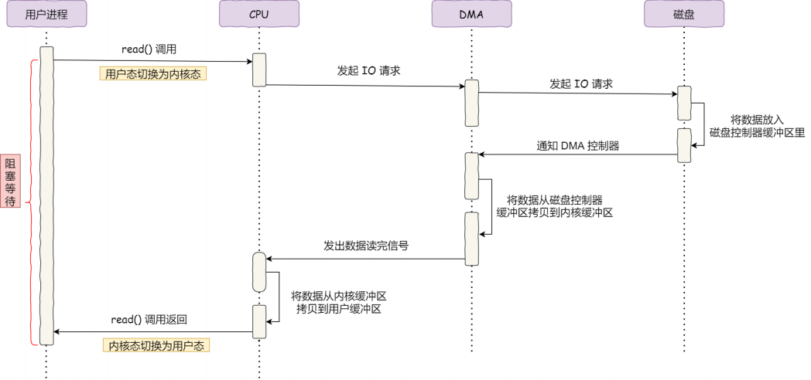

**具体过程：**

- 用户进程调用 read 方法，向操作系统发出 I/O 请求，请求读取数据到自⼰的内存缓冲区中，进程进入阻塞状态；
- 操作系统收到请求后，==<u>**进一步将 I/O 请求发送 DMA，然后让 CPU 执行其他任务**</u>==； 
- DMA 进一步将 I/O 请求发送给磁盘；
- 磁盘收到 DMA 的 I/O 请求，把数据从磁盘读取到磁盘控制器的缓冲区中，当磁盘控制器的缓冲区被读满后，向 DMA 发起中断信号，告知自⼰缓冲区已满；
- DMA 收到磁盘的信号，将磁盘控制器缓冲区中的数据拷贝到内核缓冲区中，此时不占用CPU，CPU 可以执行其他任务；
- ==<u>**当 DMA 读取了足够多的数据，就会发送中断信号给 CPU**</u>==；
- CPU 收到 DMA 的信号，知道数据已经准备好，于是将数据从内核拷贝到用户空间，系统调用返回；

整个数据传输的过程，<u>CPU 不再参与数据搬运的⼯作</u>，而是全程由 DMA 完成，<u>但是 CPU 在这个过程中也是必不可少的，因为传输什么数据，从哪⾥传输到哪⾥，都需要CPU 来`告诉` DMA 控制器。</u>


### `为什么需要零拷贝`

传统的文件发送需要 读文件写到socket

代码通常如下，一般会需要两个系统调用：

```c++
read(file, tmp_buf, len); 
write(socket, tmp_buf, len);
```

发生了什么：


- 首先，期间共发⽣了 ==4 次用户态与内核态的上下文切换==，因为发⽣了两次系统调用，一次是read() ，一次是 write() ，每次系统调用都得先从用户态切换到内核态，等内核完成任务后，再从内核态切换回用户态。
- 其次，还发⽣了 ==4 次数据拷贝==，其中两次是 DMA 的拷贝，另外两次则是通过 CPU 拷贝的

要想提高文件传输的性能，就需要减少「`用户态与内核态的上下文切换`」和「`内存拷贝`」的次数。

#### 如何优化

1. 要想减少上下文切换到次数，就要减少系统调用的次数。
2. 因为文件传输的应用场景中，在<u>用户空间我们并不会对数据「再加⼯」</u>，所以数据实际上可以不用搬运到用户空间，因此用户的缓冲区是没有必要存在的。

### `如何实现零拷贝`

> 两次无效的内存拷贝: 内核态缓冲区->用户态缓冲区->内核态缓冲区
>
> 方案: 内核态缓冲区 直接映射到 用户到缓冲区 减少一次数据拷贝

##### 1.mmap + write 也就是内存映射

```c++
buf = mmap(file, len); 
write(sockfd, buf, len);
```

mmap() 系统调用函数会直接把内核缓冲区⾥的数据==「映射」到用户空间==，这样，操作系统内核与用户空间就不需要再进行任何的数据拷贝操作。

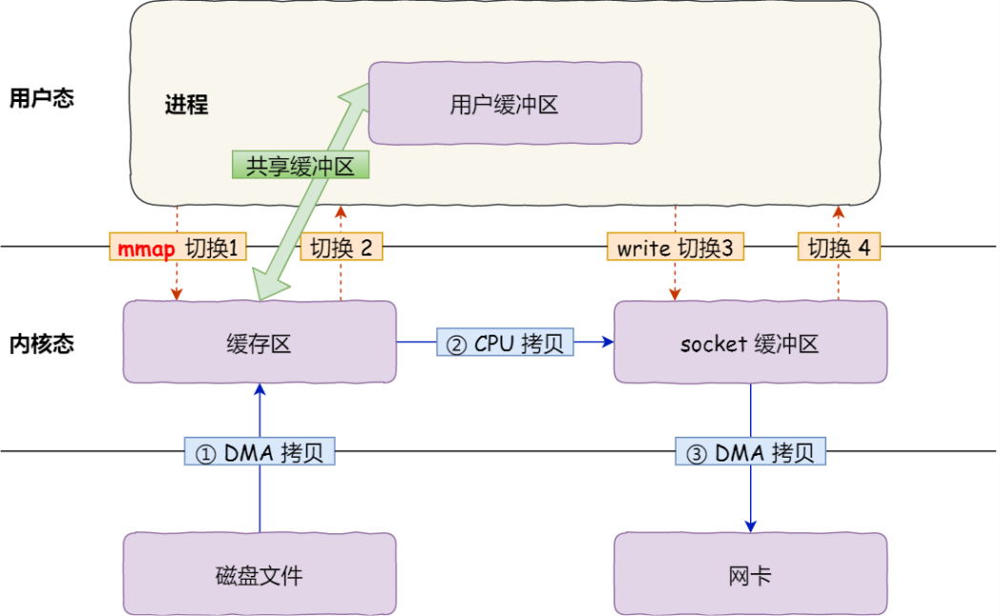

> - 应用进程调用了mmap() 后，DMA 会把磁盘的数据拷贝到内核的缓冲区⾥。接着，应用进程跟操作系统内核「共享」这个缓冲区；
> - 应用进程再调用write() ，操作系统直接将内核缓冲区的数据拷贝到 socket 缓冲区中，这一切都发⽣在内核态，由 CPU 来搬运数据；
> - 最后，把内核的 socket 缓冲区⾥的数据，拷贝到网卡的缓冲区⾥，这个过程是由 DMA搬运的

通过<u>使用mmap() 来代替read()</u>，可以==减少一次数据拷贝的过程==。

##### 2. `sendfile`

在 Linux 内核版本 2.1 中，提供了一个专⻔发送文件的系统调用函数sendfile() ，函数形式如下：

```c++
#include <sys/socket.h>
ssize_t sendfile(int out_fd, int in_fd, off_t *offset, size_t count);
```

首先，它可以替代前面的read() 和write() 这两个系统调用，这样就可以减少一次系统调用，也就减少了 2 次上下文切换的开销。

其次，该系统调用，可以直接把内核缓冲区⾥的数据拷贝到 socket 缓冲区⾥，不再拷贝到用户态，这样就只有 2 次上下文切换，和 3 次数据拷贝


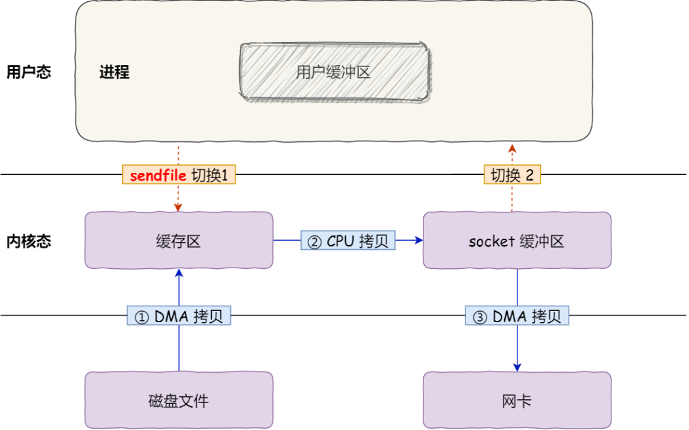

> 但是 这并不是真正的零拷贝

==**<u>SG-DMA</u>**==

从 Linux 内核2.4 版本开始起，<u>对于⽀持网卡⽀持 `SG-DMA` 技术的情况下， sendfile() 系统调用的过程发⽣了点变化</u>，具体过程如下：

- 第一步，通过 DMA 将磁盘上的数据拷贝到内核缓冲区⾥；

- 第⼆步，缓冲区描述符和数据长度传到 socket 缓冲区，这样网卡的 SG-DMA 控制器就可以直接将内核缓存中的数据拷贝到网卡的缓冲区⾥，此过程不需要将数据从操作系统内核缓冲区拷贝到 socket 缓冲区中，这样就减少了一次数据拷贝；

> 只进行了 2 次数据拷贝


这就是所谓的`零拷贝（Zero-copy）技术`，<u>因为我们没有在内存层面去拷贝数据，也就是说==全程没有通过 CPU 来搬运数据==，所有的数据都是通过 DMA 来进行传输的</u>。。

零拷贝技术的文件传输方式相比传统文件传输的方式，减少了 2 次上下文切换和数据拷贝次数，只需要 2 次上下文切换和数据拷贝次数，就可以完成文件的传输，而且 2 次的数据拷贝 
过程，都不需要通过 CPU，2 次都是由 DMA 来搬运。

<u>所以，总体来看，零拷贝技术可以把文件传输的性能提高至少一倍以上。</u>

==零拷贝技术是基于 PageCache 的==

### `大文件传输`用什么方式实现

1. 不能使用非直接io 和零拷贝 原因如下:

   1. PageCache 由于长时间	被大文件占据，其他「热点」的小文件可能就无法充分使用到PageCache，于是这样磁盘读写的性能就会下降了；
   2. PageCache 中的大文件数据，由于没有享受到缓存带来的好处，但却耗费 DMA 多拷贝到 PageCache 一次

2. 于是，在高并发的场景下，针对大文件的传输的方式，应该使用「`异步 I/O + 直接 I/O`」来替代零拷贝技术。

   所以，传输文件的时候，我们要根据文件的大小来使用不同的方式：

   1. <u>传输大文件的时候，使用「==异步== I/O + ==直接== I/O」</u>
   2. <u>传输小文件的时候，则使用「==零拷贝==技术」</u>

   在 `nginx` 中，我们可以用如下配置，来根据文件的大小来使用不同的方式：

   ```c++
   location /video/ { 
       sendfile on; 
       aio on;
       directio 1024m; 
   }
   ```

   当文件大小大于directio 值后，使用「异步 I/O + 直接 I/O」，否则使用「零拷贝技术」


### `I/O 多路复用`

#### `select/poll`

==<u>**select**</u>== 使用固定长度的 BitsMap，表示文件描述符集合，而且所⽀持的文件描述符的个数是有限制的，在 Linux 系统中，由内核中的 `FD_SETSIZE` 限制， 默认最大值为 1024 ，只能监听 0~1023 的文件描述符。

> 2 次「遍历」文件描述符集合，一次是在内核态⾥，一个次是在用户态⾥ ，而且还会发⽣ 2 次「拷贝」文件描述符集合，先从用户空间传入内核空间，由内核修改后，再传出到用户空间中。

<u>缺点: 1. 数量限制 2. 两次fd数组的拷贝 3. On的遍历开销</u>

==<u>**poll**</u>== 不再用 BitsMap 来存储所关注的文件描述符，取而代之用动态数组，以链表形式来组织，突破了 select 的文件描述符个数限制，当然还会受到系统文件描述符限制。

但是 poll 和 select `并没有太大的本质区别`，都是使用「线性结构」存储进程关注的 Socket集合，因此<u>都需要遍历文件描述符集合来找到可读或可写的 Socket，时间复杂度为 O(n)</u>，而且也需要在用户态与内核态之间拷贝文件描述符集合，这种方式随着并发数上来.

> 突然想起来 select限制为1024除了进程角度回答1024外，可能还有`On时间复杂度`的关系，还有拷贝所有文件描述符的关系，过多的话这两个会大幅度降低 整理一下:
>
> 为什么select是1024
>
> 1. 进程默认的最大描述符1024, 可以unlimit修改
> 2. 操作系统设置的是1024, 改的话需要重新编译系统
> 3. select的时间复杂度是On, 而且需要两次拷贝, 过大的话, 严重降低速度

#### ==<u>**epoll**</u>==

epoll 通过`两个方面`，很好解决了 select/poll 的问题

- 第一点，epoll 在内核⾥使用`红⿊树`来跟踪进程所有待检测的文件描述字，把需要监控的socket 通过epoll_ctl() 函数加入内核中的红⿊树⾥，红⿊树是个高效的数据结构，增删查一般时间复杂度是O(logn) ，通过对这棵⿊红树进行操作，这样就<u>不需要像 select/poll 每次操作时都`传入整个`socket 集合，只需要`传入一个`待检测的 socket</u>，减少了内核和用户空间大量的数据拷贝和内存分配。
- 第⼆点，epoll 使用<u>==**事件驱动**==</u>的机制，内核⾥维护了一个链表来记录就绪事件，<u>当某个socket 有事件发⽣时，通过回调函数内核会将其加入到这个就绪事件列表中</u>，当用户调用epoll_wait() 函数时，只会返回有事件发⽣的文件描述符的个数，不需要像 select/poll 那样轮询扫描整个 socket 集合，大大提高了检测的效率。


epoll 的方式即使监听的 Socket 数量越多的时候，效率不会大幅度降低，能够同时监听的Socket 的数目也非常的多了，<u>上限就为`系统定义的进程打开的最大文件描述符个数`</u>。因而，<u>==**epoll 被称为解决 C10K 问题的利器。**==</u>


#### ==epoll的优点：==

1. **没有最大并发连接的限制，能打开的FD的上限远大于1024（1G的内存上能监听约10万个端口）**；==（数量大）==

2. 效率提升，不是轮询的方式，不会随着FD数目的增加效率下降。只有活跃可用的FD才会`调用callback函数`；即Epoll最大的优点就在于它只管你“活跃”的连接，而跟连接总数无关，因此在实际的网络环境中，Epoll的效率就会远远高于select和poll。 ==（效率高 O1）==

3. 内存拷贝，利用mmap()文件映射内存加速与内核空间的消息传递；即epoll使用mmap`减少复制开销`。  ==（开销小）==


==要根据具体的使用场合选择==

1. 表面上看epoll的性能最好，但是在`连接数少并且连接都十分活跃`的情况下，`select和poll的性能可能比epoll好`，毕竟epoll的通知机制需要很多函数回调。
2. select低效是因为每次它都需要轮询。但`低效也是相对`的，视情况而定，也可通过良好的`设计`改善


### epoll水平触发与边沿触发

1.  LT模式

    - LT(level triggered)是`缺省的工作方式`，并且同时支持block和no-block socket.在这种做法中，内核告诉你一个文件描述符是否就绪了，然后你可以对这个就绪的fd进行IO操作。==如果你不作任何操作，内核还是会继续通知你的。==
    - 比如说我们采用epoll水平触发模式监听一个文件描述符的可读，当这个文件可读就绪时，epoll会触发一个通知，然后`我们执行一次读取操作`，但这次操作我们并`没有`把该文件描述符的数据`全部读取完`。当下一次调用epoll监听该文件描述符时，`epoll还会再次触发通知`，直到该事件被处理完。这就意味着，<u>当epoll触发通知后，我们可以不立即处理该事件，当下次调用epoll监听时，然后会再次向应用程序通告此事件，此时我们再处理也不晚。</u>

2.  ET模式
    - ET(edge-triggered)是高速工作方式，==只支持no-block socket==。在这种模式下，当描述符从未就绪变为就绪时，内核通过epoll告诉你。然后它会假设你知道文件描述符已经就绪，并且不会再为那个文件描述符发送更多的就绪通知，直到你做了某些操作导致那个文件描述符不再为就绪状态了(比如，你在发送，接收或者接收请求，或者发送接收的数据少于一定量时导致了一个EWOULDBLOCK 错误）。但是请注意，如果一直不对这个fd作IO操作(从而导致它再次变成未就绪)，内核不会发送更多的通知(only once)
    - ET模式在很大程度上<u>减少了epoll事件被重复触发的次数，因此效率要比LT模式高</u>。epoll工作在ET模式的时候，==必须使用非阻塞套接口==，以避免由于一个文件句柄的阻塞读/阻塞写操作把处理多个文件描述符的任务饿死。
    - 当文件描述符收到I/O事件通知时，通常我们并不知道要处理多少I/O（例如有多少字节可读）。如果程序采用循环来对文件描述符执行尽可能多的I/O，而文件描述符又被设置为可阻塞的，那么最终当没有更多的I/O可执行时，I/O系统调用就会阻塞。

3.  LT模式与ET模式的区别如下：
    - LT模式：当epoll_wait检测到描述符事件发生并将此事件通知应用程序，应用程序==可以不立即处理该事件==。下次调用epoll_wait时，会再次响应应用程序并通知此事件。
    - ET模式：当epoll_wait检测到描述符事件发生并将此事件通知应用程序，==应用程序必须立即处理该事件==。如果不处理，下次调用epoll_wait时，不会再次响应应用程序并通知此事件。

### ==操作系统内核==

### `内核`

计算机是由各种外部硬件设备组成的，比如内存、cpu、硬盘等，如果每个应用都要和这些硬件设备对接通信协议，那这样太累了，所以这个`中间⼈就由内核来负责`，让<u>内核作为==应用连接硬件设备的桥梁==，应用程序只需关心与内核交互，不用关心硬件的细节。</u>

#### 内核有哪些能力呢？

现代操作系统，内核一般会提供 4 个基本能力：

> ==<u>**进程调度 内存管理 硬件设备 系统调用**</u>==

1. 管理进程、线程，决定哪个进程、线程使用 CPU，也就是`进程调度`的能力； 
2. 管理内存，决定内存的分配和回收，也就是`内存管理`的能力；
3. 管理硬件设备，为进程与硬件设备之间提供通信能力，也就是`硬件通信`能力；
4. `提供系统调用`，如果应用程序要运行更高权限运行的服务，那么就需要有系统调用，它是用户程序与操作系统之间的接⼝。  （提供API）

#### 内核的架构一般有三种类型

1. 宏内核，包含多个模块，整个内核像一个完整的程序；
2. 微内核，有一个最小版本的内核，一些模块和服务则由用户态管理；
3. 混合内核，是宏内核和微内核的结合体，内核中抽象出了微内核的概念，也就是内核中会有一个小型的内核，其他模块就在这个基础上搭建，整个内核是个完整的程序；

Linux 的内核设计是采用了`宏内核`，Window 的内核设计则是采用了`混合内核`。

这两个操作系统的可执行文件格式也不一样， Linux 可执行文件格式叫作 `ELF`，Windows 可执行文件格式叫作 `PE`。


### `为什么要分内核态和用户态`

为了`安全性`。在cpu的一些指令中，有的指令如果用错，将会导致整个系统崩溃。分了内核态和用户态后，当用户需要操作这些指令时候，内核为其提供了API，可以通过系统调用陷入内核，让内核去执行这些操作。  ==<u>(为了安全别把操作系统干废了)</u>==

由于`需要限制不同的程序之间的访问能力`, 防止他们获取别的程序的内存数据, 或者获取外围设备的数据, 并发送到网络, CPU划分出两个权限等级 – 用户态和内核态。   ==<u>（程序权限过大，干扰其他）</u>==

> 假设没有这种内核态和用户态之分，程序随随便就能访问<u>硬件资源</u>，比如<u>分配内存</u>，程序能随便读写所有的内存空间，如果程序员不小心将不适当的内容写到了不该写的地方，就很可能导致系统崩溃。
> 用户程序是不可信的，不管程序员有意还是无意，都容易将系统==<u>干到崩溃</u>==。


### 用户态和内核态区别

内核态：`cpu可以访问内存的所有数据`，包括外围设备，例如硬盘，网卡，cpu也可以将自己从一个程序切换到另一个程序。

用户态：`只能受限的访问内存`，且`不允许访问外围设备`，`占用cpu的能力被剥夺`，cpu资源可以被其他程序获取。

 

内核==从本质上看是一种软件==——控制计算机的硬件资源，并提供上层应用程序运行的环境。用户态即上层应用程序的活动空间，应用程序的执行必须依托于内核提供的资源，包括CPU资源、存储资源、I/O资源等。为了使上层应用能够访问到这些资源，内核必须为上层应用提供访问的接口：即系统调用。

用户态和内核态是操作系统的两种运行级别，两者最大的区别就是==<u>特权级不同</u>==。

> 用户态拥有`最低`的特权级，内核态拥有`较高`的特权级。
>
> 运行在用户态的程序不能直接访问操作系统内核数据结构和程序。

#### 内核态和用户态之间的转换方式主要包括：`系统调用`，`异常`和`中断`。

- 系统调用

  > 这是用户态进程主动要求切换到内核态的一种方式，用户态进程通过系统调用申请使用操作系统提供的服务程序完成工作，比如fork()实际上就是执行了一个创建新进程的系统调用。而系统调用的机制其核心还是使用了操作系统为用户特别开放的一个中断来实现，例如Linux的int 80h中断。

- 中断

  > 当外围设备完成用户请求的操作后，会向CPU发出相应的中断信号，这时CPU会暂停执行下一条即将要执行的指令转而去执行与中断信号对应的处理程序，如果先前执行的指令是用户态下的程序，那么这个转换的过程自然也就发生了由用户态到内核态的切换。比如硬盘读写操作完成，系统会切换到硬盘读写的中断处理程序中执行后续操作等。

- 异常

  > 当CPU在执行运行在用户态下的程序时，发生了某些事先不可知的异常，这时会触发由当前运行进程切换到处理此异常的内核相关程序中，也就转到了内核态，比如缺页异常。

1. 当进程由于中断或系统调用从用户态转换到内核态时，进程所使用的栈也要从用户栈切换到内核栈。

2. 系统调用`实质`就是<u>通</u><u>过指令产生中断</u>，称为<u>软中断</u>。

3. 进程因为中断（软中断或硬件产生中断），使得CPU切换到特权工作模式，<u>此时进程陷入内核态</u>，进程进入内核态后，首先把用户态的堆栈地址保存在内核堆栈中，然后设置堆栈指针寄存器的地址为内核栈地址，这样就完成了用户栈向内核栈的切换。
4. 当进程从内核态切换到用户态时，最后把保存在内核栈中的用户栈地址恢复到CPU栈指针寄存器即可，这样就完成了内核栈向用户栈的切换。


### 用户态到内核态的`转化原理`

#### 用户态切换到内核态的3种方式 本质上是==**<u>中断</u>**==

- ==系统调用 api==

  > 这是用户进程==主动==要求切换到内核态的一种方式，用户进程通过系统调用申请操作系统提供的服务程序完成工作。而系统调用的机制其核心还是使用了操作系统为用户特别开放的一个中断来实现，例如Linux的int 80h中断。
  >
  > Linux 在x86上的系统调用通过 int 80h 实现，用[系统调用号](https://zh.m.wikipedia.org/w/index.php?title=系统调用号&action=edit&redlink=1)来区分入口函数。操作系统实现系统调用的基本过程是：
  >
  > 1. 应用程序调用库函数（==API==）；
  > 2. API 将系统调用号存入 EAX，然后通过`中断调用`使系统进入内核态；
  > 3. 内核中的中断处理函数根据系统调用号，调用对应的内核函数（系统调用）；
  > 4. 系统调用完成相应功能，将返回值存入 EAX，返回到中断处理函数；
  > 5. 中断处理函数返回到 API 中；
  > 6. API 将 EAX 返回给应用程序。
  >
  > 应用程序调用系统调用的过程是：
  >
  > 1. 把系统调用的编号存入 EAX；
  > 2. 把函数参数存入其它通用寄存器；
  > 3. 触发 0x80 号中断（int 0x80）。

- ==异常==

  > 当CPU在执行运行在用户态的程序时，发现了某些事件不可知的异常，这是会触发由当前运行进程切换到处理此。异常的内核相关程序中，也就到了内核态，比如缺页异常。

- 外围==设备==的==中断==

  > 当外围设备完成用户请求的操作之后，会向CPU发出相应的中断信号，这时CPU会暂停执行下一条将要执行的指令，转而去执行中断信号的处理程序，如果先执行的指令是用户态下的程序，那么这个转换的过程自然也就发生了有用户态到内核态的切换。比如硬盘读写操作完成，系统会切换到硬盘读写的中断处理程序中执行后续操作等。


### 程序是怎样`陷入内核态`的

- <u>从当前进程的描述符中`提取其内核栈的ss0及esp0`信息。</u>
- 使用ss0和esp0指向的内核栈将`当前进程的cs,eip，eflags，ss,esp信息保存起来`，这个过程也<u>完成了由用户栈到内核栈的切换过程</u>，`同时保存了被暂停执行的程序的下一条指令。`
- 将先前由中断向量检索得到的中断处理程序的<u>cs，eip</u>信息装入相应的寄存器，开始执行中断处理程序，这时就转到了内核态的程序执行了。


### `系统调用`是什么，你用过哪些系统调用

1. 概念：

   - 在计算机中，系统调用（英语：system call），又称为<u>系统呼叫</u>，指<u>运行在使用者空间的程序向操作系统内核请求需要更高权限运行的服务</u>。系统调用`提供了用户程序与操作系统之间的接口`（即==系统调用是用户程序和内核交互的接口==）。

   - 操作系统中的状态分为管态（`核心态`）和目态（`用户态`）。

     > <u>大多数系统`交互式`操作需求在`内核`态执行</u>。如设备IO操作或者进程间通信。
     >
     > 特权指令：一类==只能在核心态==下运行而不能在用户态下运行的特殊指令。不同的操作系统特权指令会有所差异，但是一般来说<u>主要是和`硬件`相关的一些指令</u>。
     >
     > 用户程序只在用户态下运行，<u>有时需要访问系统核心功能，这时通过`系统调用接口`使用系统调用</u>。

   - 应用程序<u>有时会需要一些危险的、权限很高的指令</u>，如果把这些权限放心地交给用户程序是很危险的(比如一个进程可能修改另一个进程的内存区，导致其不能运行)，但是又不能完全不给这些权限。于是有了系统调用，危险的指令被包装成系统调用，用户程序只能调用而无权自己运行那些危险的指令。另外，计算机硬件的资源是有限的，为了更好的管理这些资源，<u>所有的资源都由操作系统控制，进程只能向操作系统请求这些资源</u>。`操作系统是这些资源的唯一入口，这个入口就是系统调用`。

2. 系统调用举例：

   <u>对文件进行写操作</u>，程序向打开的文件写入字符串“hello world”，<u>open和write都是系统调用</u>。还有写数据write，创建进程<u>fork，vfork</u>等都是系统调用。**用户态想要申请一块20K大小的动态内存，就需要brk系统调用，将数据段指针向下偏移，如果用户态多处申请20K动态内存，同时又释放呢？这个内存的管理就变得非常的复杂。**


### 库函数和系统调用

- `调用库函数是为了使用系统调用`。linux几乎库函数和系统调用一一对应。windows则不然。

- 从宏观上说，`系统调用时内核层，C标准库在应用层`。

- 从细节上来说，`库函数的实现方式，一般都是对系统调用的再次封装`，<u>在linux中，C标准基本是对系统调用的包装</u>

  > 例如我们常见的printf，putc，fwrite等等，其实去看源码可以发现内部都有使用系统调用write函数，相似的例子还有很多，例如文件描述符filefd，与FILE的关系，FILE是一个struct，内部其实封装了filefd，同时包括一个buffer用于缓冲...


### 请介绍一下操作系统中的中断

断是指CPU对系统发生的某个事件做出的一种反应，CPU==暂停==正在执行的程序，==保存现场==后自动去执行相应的==处理==程序，处理完该事件后再==返回中断处==继续执行原来的程序。

#### 中断一般三类

> 1. 一种是由==CPU外部==引起的，如I/O中断、时钟中断，  ==**外部设备**==
>
> 2. `一种是来自`==CPU内部事件==或==程序执行中引起的中断==，例如程序非法操作，地址越界、浮点溢出，     ==**异常**==
>
> 3. 最后一种是在程序中使用了==系统调用==引起的。而中断处理一般分为中断响应和中断处理两个步骤，中断响应由硬件实施，中断处理主要由软件实施。   ==**系统调用**==


### Windows的`消息循环机制`

#### 消息结构体

```cpp
typedef struct tagMsg{
  HWND  hwnd;				//接受该消息的窗口句柄
  UINT  message;		//消息常量标识符，也就是我们通常所说的消息号
  WPARAM wParam;   	//32位消息的特定附加信息，确切含义依赖于消息值
  LPARAM lParam;		//32位消息的特定附加信息，确切含义依赖于消息值
  DWORD  time;			//消息创建时的时间
  POINT  pt;				//消息创建时的鼠标/光标在屏幕坐标系中的位置
}MSG;
```

#### **消息队列**

**消息队列有两种，分为系统消息队列和应用程序消息队列**。**产生的消息首先由Windows系统捕获，放在系统消息队列，再拷贝到对应的应用程序消息队列。32/64位系统为每一个应用程序维护一个消息队列**。

#### **消息循环**

系统为每个应用程序维护一个消息循环，消息循环会**不断检索自身的消息队列**。每有一个消息，就用GetMessage()取出消息。

```cpp
while(GetMessage (&msg, NULL, 0, 0))//Windows消息循环。
{
  TranslateMessage (&msg) ;//翻译消息，如按键消息，翻译为WM_CHAR
  DispatchMessage (&msg) ;//分发消息到对应窗口
}
```

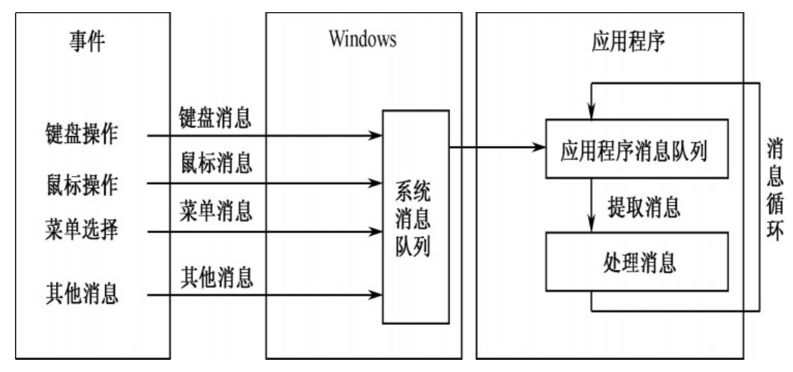

当`运行程序`->事件操作`引发消息`->消息先存在`系统消息队列`->再存入到`应用程序消息队列`->用消息循环提取消息->处理消息->再返回消息队列….

#### **消息循环过程**

1. 调用GetMessage()从消息队列中`查找消息` `GetMessage()将返回一个正值`，这表明有消息需要被处理
2. `取出消息`(在Msg变量中)并将其传递给TranslateMessage()函数
3. 将消息传递给`DispatchMessage`()函数。DispatchMessage()函数将消息`分发到消息的目标窗口`
4. 目标窗口**运行窗口过程函数 对消息做出相应的处理**
5. 处理完成 窗口过程函数返回 **继续循环**


### 系统将数据从磁盘读到内存的过程

在开始DMA传输时，主机==向内存写入DA命令块==，向DMA控制器写入该命令块的==地址==，==启动I/O==设备。然后，CPU继续其他工作，==DMA==控制器则继续下去直接==操作内存总线==，`将地址放到总线上开始传输`。当整个传输完成后，`DMA控制器中断CPU`。因此正确的执行顺序应该是

> cpu 告诉**dmaDA指令块地址** dma进行数据数据拷贝 完成后通知cpu

1. 初始化DMA控制器并启动磁盘
2. 从磁盘传输一块数据到内存缓冲区
3. DMA控制器发出中断请求
4. 执行“DMA结束”中断服务程序
