# [操作系统启动](https://www.bilibili.com/video/BV1iW411Y73K/?p=4&spm_id_from=pageDriver&vd_source=247930c6c184032909af4f3293b42221)

操作系统启动过程通常分为四个步骤：从BIOS自检、系统引导、启动内核、初始化系统。BIOS自检是计算机开机时进行的硬件自检，它会检查计算机硬件是否正常工作。系统引导是指计算机在完成硬件自检后，从硬盘或其他存储设备中读取操作系统的引导程序(`引导扇区`)。启动内核是指操作系统内核被加载到内存中并开始运行。初始化系统是指操作系统内核完成启动后，对系统进行初始化和配置，使其能够正常运行。

## setup模块:setup.s (完成os启动前的设置)

在操作系统启动过程中，BIOS会将setup.s文件从硬盘或其他存储设备中读取到内存中，然后将控制权交给setup.s文件。setup.s文件会初始化CPU、内存等硬件设备，并加载操作系统内核.

## 保护模式(虚拟内存的实现)

保护模式是一种CPU运行模式，它提供了`硬件支持的内存保护、分页系统和虚拟内存`等特性，用于增强多任务和系统稳定性。保护模式是CPU硬件原生提供的，CPU在硬件上提供地址转换部件，操作系统提供转换过程中所需要的页表等，CPU必须有这些东西才能正常运行,保护模式下，程序引用的地址、CPU执行机器指令时处理的地址都变成了虚拟地址，需要转化为物理地址后再去访问，地址转换由处理器和操作系统共同完成,保护模式最重要的特征是段描述符和全局描述符表，它们用于实现段保护机制

## 跳转到system模块执行

这里几个部分的代码 应该是依次执行 并跳转 嵌套的

### head.s

一段在保护模式下运行的代码  ==设置页表==

> setup是进入保护模式,head是进入之后的初始化

head.s是Linux内核的汇编代码文件，它包含了内核启动时的一些汇编代码，如`设置段描述符、开启分页机制`等。在Linux内核的启动过程中，head.s是最先被执行的文件之一，它的作用是为后续的操作系统启动做好准备工作

### after_page_tables

设置了页表之后,由汇编语言执行跳转到c函数(main)执行

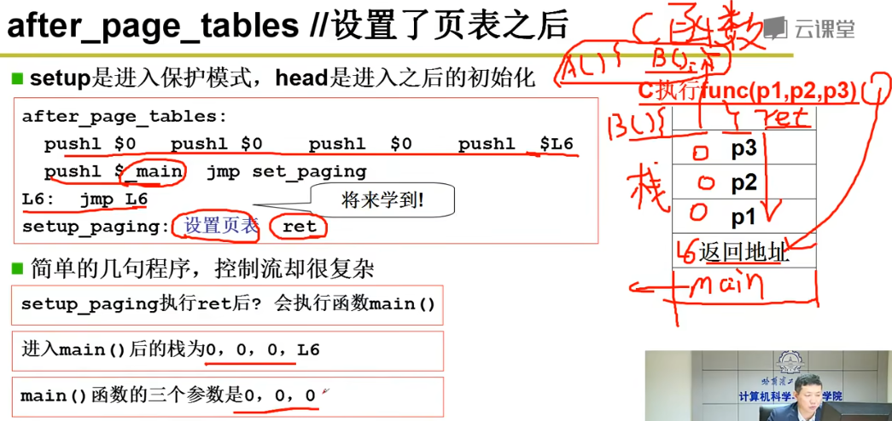

### 进入main函数

```c++
//在init/main.c中
void main(void){
  mem_init(); //内存管理模块
  trap_int(); //中断处理模块
  blk_dev_inti(); //块设备模块
  chr_dev_init(); //字符设备模块
  tty_init(); //终端模块
  time_init(); //时间模块
  sched_init(); //调度模块
  buffer_init(); //初始化缓冲区
  hd_init(); //初始化硬盘
  floppy_init(); //初始化软盘
  sti(); //开启中断
  move_to_user_mode(); //将操作系统从内核态切换到用户态
  if(!fork()) //通过fork()创建一个子进程
    init(); //在子进程中调用init()函数来启动用户空间的进程
}
```

看一看`mem_init`: mem_init函数是Linux内核中的一个函数，它是在mm_init函数中被调用的。在操作系统启动过程中，mem_init函数的作用是初始化内存管理模块，包括初始化伙伴系统、初始化内存映射、初始化内存池等。mem_init函数的具体实现因体系架构而异，但大致处理类似。

```c++
//执行内存的初始化
void mem_init(long start_mem, long end_mem){
  int i;
  for(i = 0; i<PAGING_PAGES; i++)
    mem_map[i] = USED; //初始化一个数组, 0表示没有使用
  i = MAP_NR(start_mem);
  end_mem -= start_mem;
  end_map >>= 12;  		//4k   其实就是一页
  while(end_mem-- > 0)
    mem_map[i++] = 0;
}
```

# 1. 操作系统有哪些模块

1. `处理器`管理
   - 处理器管理最基本的功能是`处理中断事件`，配置了操作系统后，就可对各种事件进行处理。处理器管理还有一个功能就是处理器`调度`，针对不同情况采取不同的调度策略。

2. `存储器`管理
   - 存储器管理主要是指针对内存储器的管理。主要任务是分配内存空间，保证各作业占用的存储空间不发生矛盾，并使各作业在自己所属存储区中不互相干扰。

3. `设备`管理
   - 设备管理是指负责管理各类外围设备，包括分配、启动和故障处理等。主要任务是当用户使用外部设备时，必须提出要求，待操作系统进行统一分配后方可使用。

4. `文件`管理
   - 文件管理是指操作系统对信息资源的管理。在操作系统中，将负责存取的管理信息的部分称为文件系统。文件管理支持文件的存储、检索和修改等操作以及文件的保护功能。

5. `作业`管理
   - 每个用户请求计算机系统完成的一个独立的操作称为作业。作业管理包括作业的输入和输出，作业的调度与控制，这是根据用户的需要来控制作业运行的。

# 2. 内存管理

## [Linux虚拟地址空间](https://zhuanlan.zhihu.com/p/96098896)


`为了防止不同进程同一时刻在物理内存中运行而对物理内存的争夺和践踏`，<u>也为了让物理内存扩充成更大的逻辑内存</u>，从而`让程序获得更多的可用内存`，<u>采用了虚拟内存</u>。

>直接使用物理内存会产生一些问题
>
>1. 内存空间利用率的问题（内存==碎片==化）
>2. 读写内存的安全性问题（访问==权限==问题）
>3. 进程间的==安全==问题
>4. 内存读写的==效率==问题

- 虚拟内存技术使得不同进程在运行过程中，<u>它所看到的是自己独自占有了当前系统的4G内存</u>。所有进程共享同一物理内存，每个进程只把自己目前需要的虚拟内存空间`映射并存储`到物理内存上。

- <u>事实上，在每个进程创建加载时，内核`只是为进程“创建”了虚拟内存的布局`，具体就是`初始化`进程控制表中内存相关的`链表`，实际上并不立即就把虚拟内存对应位置的程序数据和代码（比如.text .data段）拷贝到物理内存中，只是建立好虚拟内存和磁盘文件之间的`映射`就好（叫做存储器映射）</u>，等到运行到对应的程序时，才会通过缺页异常，来拷贝数据。还有进程运行过程中，`要动态分配内存`，比如malloc时，也`只是分配了虚拟内存`，即为这块虚拟内存对应的页表项做相应设置，`当进程真正访问到此数据时，才引发缺页异常`。

- 请求分页系统、请求分段系统和请求段页式系统都是针对虚拟内存的，通过请求实现内存与外存的信息置换。

  

### **虚拟内存的好处：**

> 更大的内存空间、内存隔离和保护、内存共享和协作以及页面置换和缓存

1. `扩大`地址空间；

   > 为了更好的管理内存，操作系统将内存抽象成地址空间。每个程序拥有自己的地址空间，这个地址空间被分割成多个块，每一块称为一页。这些页被映射到物理内存，但不需要映射到连续的物理内存，也不需要所有页都必须在物理内存中。当程序引用到不在物理内存中的页时，由硬件执行必要的映射，将缺失的部分装入物理内存并重新执行失败的指令。
   >
   > 从上面的描述中可以看出，<u>虚拟内存允许`程序不用将地址空间中的每一页都映射`到物理内</u>存，<u>也就是说一个`程序不需要全部调入内存`就可以运行</u>，这使得有限的内存运行大程序成为可能。例如有一台计算机可以产生 16 位地址，那么一个程序的地址空间范围是 0~64K。该计算机只有 32KB 的物理内存，虚拟内存技术允许该计算机运行一个 64K 大小的程序

2. 内存`保护`：每个进程运行在各自的虚拟内存地址空间，互相不能干扰对方。虚存还对特定的内存地址提供写保护，可以防止代码或数据被恶意篡改。 （==<u>互不干扰，防止进程互相恶意篡改</u>==）

3. `公平`内存分配。采用了虚存之后，每个进程都相当于有同样大小的虚存空间。  

4. 当进程`通信`时，可采用`虚存共享`的方式实现。  （==<u>实现共享内存</u>==）

5. 当不同的进程使用同样的代码时，比如库文件中的代码，物理内存中可以只存储一份这样的代码，不同的进程只需要把自己的虚拟内存映射过去就可以了，`节省内存`

6. 虚拟内存很适合在多道程序设计系统中使用，许多程序的片段同时保存在内存中。当一个程序等待它的一部分读入内存时，可以把CPU交给另一个进程使用。<u>在内存中可以保留多个进程</u>，系统`并发度提高`

7. 在程序需要分配连续的内存空间的时候，只需要在虚拟内存空间分配连续空间，而不需要实际物理内存的连续空间，可以`利用碎片`

8. **页面置换和==缓存==：** 虚拟内存系统利用磁盘作为辅助存储器，允许将不常用的页面从物理内存交换到磁盘上，以释放内存空间供其他页面使用。这种页面置换机制可以根据访问模式和优先级，动态地管理内存中的页面，使常用的页面保持在物理内存中，从而提高系统的性能和响应速度。

    

### **虚拟内存的代价：**

1. **额外的内存开销：** 虚存的管理需要建立很多数据结构，这些数据结构要占用额外的`内存`
2. **性能开销：**虚拟地址到物理地址的转换，增加了指令的`执行时间`。
3. **页面置换开销：**页面的换入换出需要`磁盘I/O`，这是很`耗时`的
4. <u>如果一页中只有一部分数据，会浪费内存。</u>
5. **复杂的管理和调优：** 虚拟内存的管理和调优是一个复杂的任务。需要合理配置虚拟内存的大小、页面大小和页面置换算法等参数，以满足应用程序的需求和系统资源的限制。这需要深入了解系统和应用程序的工作负载，并进行适当的调优。
6. **可能的资源竞争和冲突：** 虚拟内存中的页面共享和进程间通信机制可能引入资源竞争和冲突。例如，多个进程同时访问共享内存时可能需要使用`同步机制`来避免数据竞争和一致性问题。这需要开发人员仔细设计和管理共享资源，以确保正确和可靠的操作。


## 分页机制

### 分页存储管理方式：

将用户程序（进程）的 `逻辑地址` 空间分成若干个 `页` （4KB）并编号，同时将内存的 `物理地址` 也分成若干个 `块或页框` （4KB）并编号

#### 目的：

将进程的各个页`离散`地存储在内存的任一物理块中，使得从进程的角度看，认为它有一段`连续的内存`，进程总是从0号单元开始编址

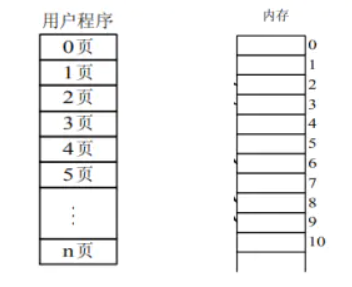

因此需要建立一个由页到页框的一一映射的关系，这就是`页表`

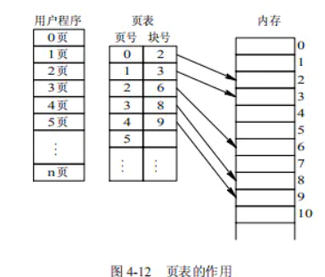

系统会`为每一个进程建立一张页表`，进程执行时，通过查找进程自己的页表，找到每页在内存中的物理块号，从而保证每个进程都能正确运行

由于页表实现了逻辑地址到物理地址的变换，执行的频率非常高，因此页表大多`驻留在内存中` ，且需要采用硬件实现。在系统中设置一个`页表寄存器（PTR）` ，在其中存放页表在内存中的`起始地址`和页表的`长度`，<u>平时页表始址和长度存放在各进程的`PCB`中</u>，当调度到某进程时，才将这两个数据装入页表寄存器中。

#### 页表项结构：

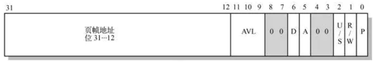

- 前20位即为块号，指示`物理内存中的块（也称页框）`
- P - `存在（Present）标志`，用于指明表项对地址转换是否有效。P=1表示有效；P=0表示无效。在页转换过程中，如果说涉及的页目录或页表的表项无效，则会导致一个异常。
- R/W - `读/写（Read/Write）标志`。如果等于1，表示页面可以被读、写或执行。如果为0，表示页面只读或可执行。

#### `理解`

> 1. 逻辑地址分页 每页4KB 物理地址分块 每块4KB
> 2. 需要实现逻辑地址到物理地址的映射关系，也就是页表 驻存在进程头部
> 3. 页表中包含很多页表项，实现逻辑页->物理块的映射
> 4. 通过`页表寄存器PTR` 存储当前进程页表的起始地址和长度，实现页表的快速定位

#### 地址变换过程：

1. 进程访问某个`逻辑地址`的数据
2. 由逻辑地址的`页面号`3，以及`页表寄存器中的始址`，找到页表并找到对应的`页表项(3)`
3. 由页表项上的==<u>块号</u>==，找到==<u>物理内存中的块号</u>==
4. 由块号，加上逻辑地址的页内地址（==<u>偏移量</u>==），实现了对物理地址数据的定位
5. 进程访问该逻辑地址对应的物理地址的数据

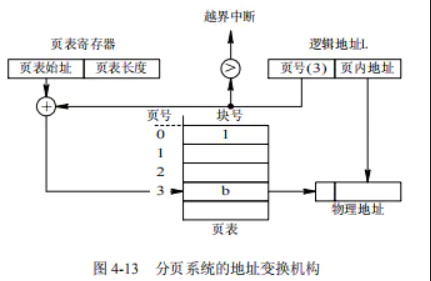

由上可知，每存取一个数据，需`两次访问内存`，第一次访问内存中的页表，第二次访问内存中的数据，效率较低

#### **改进**： TLB

增设一个具有并行查寻能力的`特殊高速缓冲寄存器`，称为“联想寄存器”或“快表”，IBM中称为TLB，用于存放当前访问的那些页表项

==<u>（多了一个缓存）</u>==

#### 改进后的地址变换过程：

1. 进程访问某个逻辑地址的数据
2. 由逻辑地址的页号(3)，先与高速缓冲寄存器中的所有页号比较，若匹配则直接读出块号，若不匹配则再由上面的2、3步骤执行
3. 找到页表项后，将此页表项存入快表中，若快表已满，则系统找出一个认为不再需要的页表项将其换出
4. 4，5步骤相同

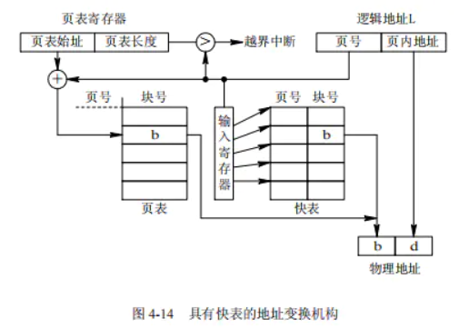

### 分级页表

#### 原因：

IA-32体系结构中，处理器为32位，可寻址=4GB的虚拟地址空间，若每页大小为4KB，则共分为4GB/4KB=220=1048576页，因此页表中应有1048576项，每个页表项为`4B`，则一个页表需要`4MB`的连续的物理内存，每个进程都需要自身的页表占4MB，将导致大量内存用于保存进程的页表    `20 - 12`

> 1. 32条地址线 ，程序可以访问2^32^*1Byte=4GByte的虚拟地址空间，虚拟地址是按页分的，每页4KByte(2^12^), 所以需要页表项数为：4GB/4KB页   (2^20^)
> 2. 一个页表有很多的页表项 一个页表项大小4Byte
> 3. 所以页表大小 = 页表项大小 * 所需要页表项数

PS:80386处理器为32位，可寻址**4GB**逻辑地址，而当时物理内存只有**4MB**，采用单级页表明显不行

**采用两级页表**：每页中存2^10^项，共分为2^10^页，并新增一个`页目录表`来记录这2^10^页表的地址与信息，因此页目录表大小为2^10^*4B=4KB放在内存中，需要具体的表再由此读入  `10 - 10 - 12`

#### 解决方法：

1、采用离散分配方式代替原来页表需要的连续物理内存

2、将当前需要的部分页表项调入内存，其余页表项仍驻留在磁盘上，需要时再调入

### 两级页表：

指向原页表项**逻辑地址**结构

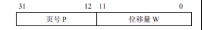

PS：位移量W也称为页内地址 页大小4k 所以页内地址需要12位（2^12^=4k）

VS

指向两级页表项**逻辑地址**结构

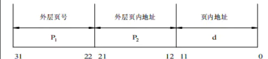

PS:外层页号也称页目录表(**Directory**)，外层页内地址也称页表地址(**Table**)

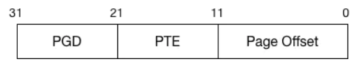

与页表寄存器(PTR)相同，增设一个外层页表寄存器(CR3)，用于存放外层页表的地址

#### 页目录项结构

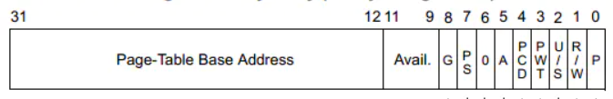

与页表项结构类似。

#### 分级后的地址变换过程：

1、进程访问某个逻辑地址的数据

2、由逻辑地址中的外层页号(Directory)，以及外层页表寄存器(CR3)中的外层页表始址，找到二级页表的始址

3、由二级页表的始址，加上逻辑地址中的外层页内地址(Table)，找到对应的二级页表中的页表项

4、由页表项中的物理块号，加上逻辑地址中的页内地址(偏移量)，实现了对物理地址数据的定位

5、进程访问该逻辑地址对应的物理地址的数据

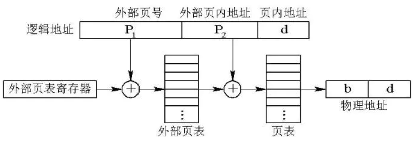

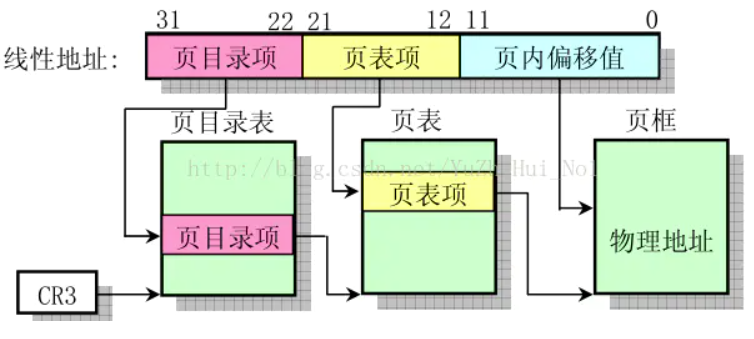

以上分级解决了原来页表需要连续物理内存空间的问题，接下来解决用较少的内存空间去存放大页表的问题

#### 解决方法：

仅把当前需要的一批页表项调入内存，以后再根据需要陆续调入。因此**页目录表**常驻内存（大小为**4KB**，地址存在CR3寄存器中），而 **进程的页表**存于磁盘中，对于页表只需调入一页或几页。由页目录项中的P标记该页表是否在内存中，若不在则产生缺页异常，产生异常中断，请求系统将该页表调入内存

> **==<u>局部性原理</u>==**
>
> 如果某个一级页表的页表项没有被用到，也就不需要创建这个页表项对应的⼆级页表了，即`可以在需要时才创建⼆级页表`。做个简单的计算，假设只有 20% 的一级页表项被用到了，那么页表占用的内存空间就只有 4KB（一级页表） + 20% * 4MB（⼆级页表）=  0.804MB

### 多级页表

对于 64 位的系统，两级分页肯定不够了，就变成了`四级目录`，分别是：

- 全局页目录项 PGD（Page Global Directory）； 
- 上层页目录项 PUD（Page Upper Directory）； 
- 中间页目录项 PMD（Page Middle Directory）； 
- 页表项 PTE（Page Table Entry）；

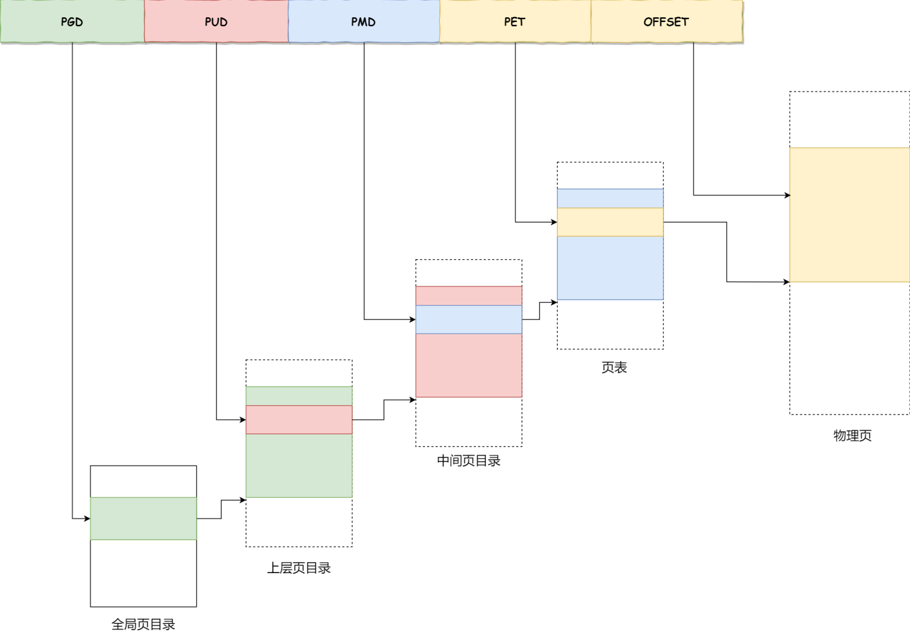


## 请你说一说操作系统中的`页表寻址`

页式内存管理，内存分成固定长度的一个个页片。<u>操作系统为每一个进程维护了一个从虚拟地址到物理地址的映射关系的数据结构，叫`页表`，</u>页表的内容就是该进程的虚拟地址到物理地址的一个映射。页表中的每一项都记录了这个页的基地址。通过页表，由逻辑地址的高位部分先找到逻辑地址对应的页基地址，再由页基地址偏移一定长度就得到最后的物理地址，偏移的长度由逻辑地址的低位部分决定。一般情况下，这个过程都可以由硬件完成，所以效率还是比较高的。页式内存管理的优点就是比较灵活，内存管理以较小的页为单位，方便内存换入换出和扩充地址空间。


### Linux最初的两级页表机制：

两级分页机制`将32位的虚拟空间分成三段`，低十二位表示页内偏移，高20分成两段分别表示两级页表的偏移。 ==<u>**10 22  ->  10 10 12**</u>== 

- PGD(Page Global Directory): 最高10位，全局页目录表索引

- PTE(Page Table Entry)：中间10位，页表入口索引

1. 当在进行地址转换时，结合在CR3寄存器中存放的页目录(page directory, PGD)的这一页的物理地址，再加上从虚拟地址中抽出高10位叫做页目录表项(内核也称这为pgd)的部分作为偏移, 即定位到可以描述该地址的pgd；
2. 从该pgd中可以获取可以描述该地址的页表的物理地址，再加上从虚拟地址中抽取中间10位作为偏移, 即定位到可以描述该地址的pte；
3. 在这个pte中即可获取该地址对应的页的物理地址, 加上从虚拟地址中抽取的最后12位，即形成该页的页内偏移, 即可最终完成从虚拟地址到物理地址的转换。

从上述过程中，可以看出，对虚拟地址的分级解析过程，实际上就是<u>不断深入页表层次</u>，<u>逐渐定位到最终地址的过程</u>，所以这一过程被叫做page talbe walk。


### Linux的三级页表机制：

当X86引入物理地址扩展(Pisycal Addrress Extension, PAE)后，可以支持大于4G的物理内存(36位），但虚拟地址依然是32位，原先的页表项不适用，它实际多4 bytes被扩充到8 bytes，这意味着，每一页现在能存放的pte数目从1024变成512了(4k/8)。相应地，页表层级发生了变化，Linus新增加了一个层级，叫做页中间目录(page middle directory, PMD), 变成：

字段      描述            位数

cr3      指向一个PDPT      crs寄存器存储

PGD    指向PDPT中4个项中的一个  位31~30

PMD    指向页目录中512项中的一个  位29~21

PTE      指向页表中512项中的一个  位20~12

page offset  4KB页中的偏移      位11~0


==<u>**2 - 9 - 9 - 12**</u>==

现在就同时存在2级页表和3级页表，在代码管理上肯定不方便。巧妙的是，Linux采取了一种抽象方法：所有架构全部使用3级页表: 即PGD -> PMD -> PTE。那只使用2级页表(如非PAE的X86)怎么办？

办法是针对使用2级页表的架构，把PMD抽象掉，即虚设一个PMD表项。这样在page table walk过程中，PGD本直接指向PTE的，现在不了，指向一个虚拟的PMD，然后再由PMD指向PTE。这种抽象保持了代码结构的统一。


### Linux的四级页表机制：

硬件在发展，3级页表很快又捉襟见肘了，原因是64位CPU出现了, 比如X86_64， 它的硬件是实实在在支持4级页表的。它支持48位的虚拟地址空间1。如下：

字段      描述            位数

PML4    指向一个PDPT      位47~39

PGD    指向PDPT中4个项中的一个  位38~30

PMD    指向页目录中512项中的一个  位29~21

PTE      指向页表中512项中的一个  位20~12

page offset  4KB页中的偏移      位11~0


Linux内核针为使用原来的3级列表(PGD->PMD->PTE)，做了折衷。即采用一个唯一的，共享的顶级层次，叫PML4。这个PML4没有编码在地址中，这样就能套用原来的3级列表方案了。不过代价就是，由于只有唯一的PML4, 寻址空间被局限在(239=)512G, 而本来PML4段有9位, 可以支持512个PML4表项的。现在为了使用3级列表方案，只能限制使用一个， 512G的空间很快就又不够用了，解决方案呼之欲出。

在2004年10月，当时的X86_64架构代码的维护者Andi Kleen提交了一个叫做4level page tables for Linux的PATCH系列，为Linux内核带来了4级页表的支持。在他的解决方案中，不出意料地，按照X86_64规范，新增了一个PML4的层级, 在这种解决方案中，X86_64拥一个有512条目的PML4, 512条目的PGD, 512条目的PMD, 512条目的PTE。对于仍使用3级目录的架构来说，它们依然拥有一个虚拟的PML4,相关的代码会在编译时被优化掉。 这样，就把Linux内核的3级列表扩充为4级列表。这系列PATCH工作得不错，不久被纳入Andrew Morton的-mm树接受测试。不出意外的话，它将在v2.6.11版本中释出。但是，另一个知名开发者Nick Piggin提出了一些看法，他认为Andi的Patch很不错，不过他认为最好还是把PGD作为第一级目录，把新增加的层次放在中间，并给出了他自己的Patch:alternate 4-level page tables patches。Andi更想保持自己的PATCH, 他认为Nick不过是玩了改名的游戏，而且他的PATCH经过测试很稳定，快被合并到主线了，不宜再折腾。不过Linus却表达了对Nick Piggin的支持，理由是Nick的做法conceptually least intrusive。毕竟作为Linux的扛把子，稳定对于Linus来说意义重大。最终，不意外地，最后Nick Piggin的PATCH在v2.6.11版本中被合并入主线。在这种方案中，4级页表分别是：PGD -> PUD -> PMD -> PTE。

## 分段

虚拟内存采用的是分页技术，也就是将地址空间划分成固定大小的页，每一页再与内存进行映射。

下图为一个编译器在编译过程中建立的多个表，有 4 个表是动态增长的，如果使用分页系统的一维地址空间，动态增长的特点会导致覆盖问题的出现。

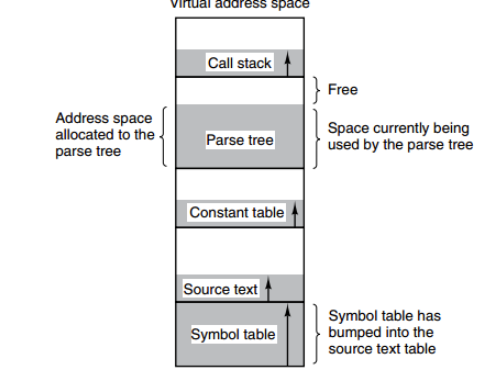


分段的做法是把每个表分成段，一个段构成一个独立的地址空间。每个段的长度可以不同，并且可以动态增长。

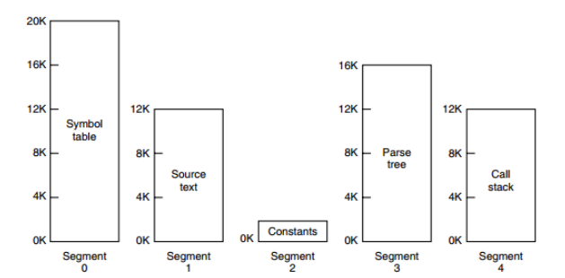


## 段页式内存管理

程序的地址空间划分成多个拥有独立地址空间的段，每个段上的地址空间划分成大小相同的页。这样既拥有分段系统的共享和保护，又拥有分页系统的虚拟内存功能。

内存分段和内存分页并不是对⽴的，它们是可以组合起来在同一个系统中使用的，那么组合起来后，通常称为`段页式内存管理`。


### 段页式内存管理实现的方式：

- 先将程序划分为多个`有逻辑意义的段`，也就是前面提到的分段机制；
- 接着再把每个段划分为多个页，也就是对分段划分出来的连续空间，再划分固定大小的页；

这样，地址结构就由`段号`、`段内页号`和`页内位移`三部分组成。
<u>用于段页式地址变换的数据结构是`每一个程序一张段表`，`每个段⼜建⽴一张页表`，段表中的地址是页表的起始地址，而页表中的地址则为某页的物理页号</u>，如图所示：

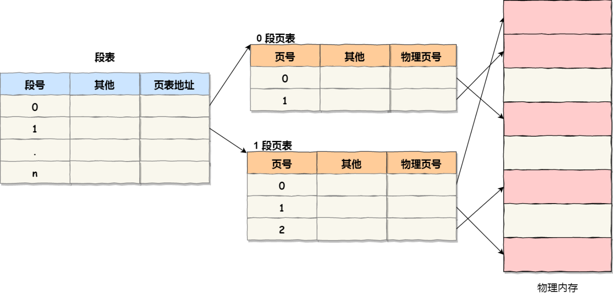

段页式地址变换中要得到物理地址须经过三次内存访问：

- 第一次访问段表，得到页表起始地址； 
- 第⼆次访问页表，得到物理页号；
- 第三次将物理页号与页内位移组合，得到物理地址。

可用软、硬件相结合的方法实现段页式地址变换，这样虽然增加了硬件成本和系统开销，但`提高了内存的利用率`。

## 分页与分段的比较

- 对程序员的透明性：分页透明，但是分段需要程序员显式划分每个段。
- 地址空间的维度：分页是一维地址空间，分段是二维的。
- 大小是否可以改变：页的大小不可变，段的大小可以动态改变。
- 出现的原因：分页主要用于实现虚拟内存，从而获得更大的地址空间；分段主要是为了使程序和数据可以被划分为逻辑上独立的地址空间并且有助于共享和保护。

## 操作系统中的程序的`内存结构`


#### 一个程序本质上（没有调入内存）时都是由`BSS段`、`data段`、`text段`三个组成的。

> - `代码段 text`：存放程序执行代码的一块内存区域。<u>这部分区域的大小在程序运行前就已经确定</u>，并且内存区域属于只读。在代码段中，也有可能包含一些只读的常数变量 `（包括文本区和只读数据区）`
> - `数据段 data`：存放程序中==<u>已初始化</u>==的`全局变量`的一块内存区域。<u>数据段属于`静态内存`分配</u>
> - `未初始化数据区 bss`：通常用来存放程序中`未初始化的全局变量和静态变量`的一块内存区域。BSS段属于`静态分配`，<u>程序结束后静态变量资源由系统自动释放。</u>

text段和data段在编译时已经分配了空间，而`BSS段并不占用可执行文件的大小`，它是由`链接器来获取内存`的。

bss段（未进行初始化的数据）的内容并不存放在磁盘上的程序文件中。其原因是内核在程序开始运行前将它们设置为0。需要存放在程序文件中的只有`正文段`和`初始化数据段`。  

data段（已经初始化的数据）则为数据分配空间，数据保存到目标文件中。

数据段包含经过初始化的全局变量以及它们的值。BSS段的大小从可执行文件中得到，然后链接器得到这个大小的内存块，紧跟在数据段的后面。当这个内存<u>进入程序的地址空间后全部清零</u>。包含数据段和BSS段的整个区段此时通常称为==<u>数据区</u>==。

#### <u>可执行程序在运行时又多出两个区域</u>：<u>==栈区==和==堆区==</u>。

==栈区==：由编译器自动释放，存放函数的参数值、局部变量等。每当一个函数被调用时，该函数的返回类型和一些调用的信息被存放到栈中。然后这个被调用的函数再为他的自动变量和临时变量在栈上分配空间。每调用一个函数一个新的栈就会被使用。栈区是从高地址位向低地址位增长的，是一块`连续`的内存区域，最大容量是由系统`预先定义`好的，申请的栈空间超过这个界限时会提示溢出，用户能从栈中获取的空间较小。

==堆区==：用于动态分配内存，位于BSS和栈中间的地址区域。由程序员申请分配和释放。`堆是从低地址位向高地址位增长，采用链式存储结构`。频繁的malloc/free造成内存空间的不连续，产生碎片。当申请堆空间时库函数是按照一定的算法搜索可用的足够大的空间。因此堆的`效率`比栈要`低`的多。

 

## [为什么堆栈生长方向不一样](https://blog.csdn.net/unix21/article/details/8531875)

### **历史原因**

- 在没有内存管理单元MMU的时代，`为了最大的利用内存空间`，堆和栈被设计为从`两端相向生长`。那么哪一个向上，哪一个向下呢？
  1. 人们对数据访问是习惯于向上的，比如你在堆中new一个数组，是习惯于把低元素放到低地址，把高位放到高地址，所以`堆向上生长比较符合习惯`
  2. `栈则对方向不敏感`，一般对栈的操作只有PUSH和POP，无所谓向上向下，所以就把堆放在了低端，把栈放在了高端。MMU出来后就无所谓了，只不过也没必要改了。

### 内存管理单元 MMU

**内存管理单元**（英语：**memory management unit**，缩写为**MMU**），有时称作**分页内存管理单元**（英语：**paged memory management unit**，缩写为**PMMU**）。它是一种负责处理[中央处理器](https://zh.m.wikipedia.org/wiki/中央处理器)（CPU）的[内存](https://zh.m.wikipedia.org/wiki/内存)访问请求的[计算机硬件](https://zh.m.wikipedia.org/wiki/计算机硬件)。它的功能包括[虚拟地址](https://zh.m.wikipedia.org/wiki/虚拟地址)到[物理地址](https://zh.m.wikipedia.org/wiki/物理地址)的转换（即[虚拟内存](https://zh.m.wikipedia.org/wiki/虚拟内存)管理）[[1\]](https://zh.m.wikipedia.org/zh-hans/内存管理单元#cite_note-1)、[内存保护](https://zh.m.wikipedia.org/wiki/内存保护)、中央处理器[高速缓存](https://zh.m.wikipedia.org/wiki/高速缓存)的控制，在较为简单的计算机体系结构中，负责[总线](https://zh.m.wikipedia.org/wiki/总线)的[仲裁](https://zh.m.wikipedia.org/w/index.php?title=仲裁_(电子器件)&action=edit&redlink=1)以及[存储体切换](https://zh.m.wikipedia.org/w/index.php?title=存储体切换&action=edit&redlink=1)（bank switching，尤其是在[8位](https://zh.m.wikipedia.org/wiki/8位)的系统上）

> 实现虚拟地址到物理地址的页表寻址过程，实现虚拟内存映射
>
> 内存管理单元（MMU）是计算机系统中的一个硬件组件，主要用于管理虚拟内存和物理内存之间的地址转换。它负责将程序中使用的虚拟地址转换为对应的物理地址，以实现内存的访问和保护。
>
> MMU的主要功能包括：
>
> 1. 地址转换：MMU根据页表或段表等数据结构，将程序使用的虚拟地址转换为物理地址。它可以根据页表项或段表项中存储的映射关系，确定对应的物理地址，并将其提供给CPU。
> 2. 内存保护：MMU可以根据页表或段表中的权限位，对内存进行保护。它可以根据访问权限位的设置，阻止非法的内存访问，从而保护系统的稳定性和安全性。
> 3. 缓存管理：MMU还可以管理硬件缓存，如TLB（Translation Lookaside Buffer），用于加速地址转换的过程。通过缓存页表项或段表项，可以减少对主存的访问次数，提高地址转换的效率。
> 4. 内存映射：MMU可以实现不连续的物理内存映射到连续的虚拟内存空间中。这样可以更灵活地管理和利用内存资源，提高内存的利用率。
>
> 举例来说，假设一个程序使用了虚拟地址空间从0x0000到0xFFFF，而物理内存中的数据被存储在0x1000到0x1FFF的范围内。MMU根据页表的映射关系，将程序中的虚拟地址转换为对应的物理地址。例如，当程序访问虚拟地址0x1234时，MMU会根据页表的映射关系，将其转换为物理地址0x2234，从而使程序能够正确地访问对应的数据。
>
> 通过MMU的地址转换和内存保护功能，操作系统可以实现虚拟内存管理和多任务的支持，为不同的程序提供隔离和保护。MMU在计算机系统中起着重要的作用，提供了高效的地址转换和内存管理机制，为程序的执行和系统的稳定性提供支持。

## 文件描述符


- 每一个`进程控制块pcb中包含一个 默认大小为1024的文件描述符表`（前三个指向设备终端的默认文件），所以每一个进程默认最多打开1024个文件 
- 同一个文件可以重复打开 则在文件描述符表中 占多个位置 直到调用fclose释放

## A* a = new A; a->i = 10;在内核中的内存分配上发生了什么？

A* a = new A; a->i = 10：

1）A *a：a是一个局部变量，类型为指针，故而操作系统在程序`栈区`开辟4/8字节的空间（0x000m），分配给指针a。==（栈区指针8字节）==

2）new A：`通过new动态的在堆区申请类A大小的空间`（0x000n）。 ==（new在堆上分配A空间）==

3）a = new A：将指针a的<u>内存区域填入栈中类A申请到的地址的地址</u>。即*（0x000m）=0x000n。 ==（指针指向A地址）==

4）==a->i==：先找到指针a的地址0x000m，通过a的值0x000n和i在类a中偏移offset，得到a->i的地址0x000n + offset，进行*(0x000n + offset) = 10的赋值操作，即内存0x000n + offset的值是10。  ==（栈->堆->偏移->赋值）==

 

## 8.6.  一个类，里面有static，virtual，之类的，来说一说这个类的内存分布

**static修饰符**

1. static修饰成员变量

- <u>对于非静态数据成员，每个类对象都有自己的拷贝</u>。而<u>静态数据成员被当做是类的成员，无论这个类被定义了多少个，静态数据成员都只有一份拷贝</u>，`为该类型的所有对象所共享(包括其派生类)`。所以，静态数据成员的值对每个对象都是一样的，它的值可以更新。

- 因为静态数据成员在==全局数据区==分配内存，属于本类的所有对象共享，所以它不属于特定的类对象，在没有产生类对象前就可以使用。

2. static修饰成员函数

- 与普通的成员函数相比，静态成员函数由于不是与任何的对象相联系，因此==它不具有this指针==。从这个意义上来说，它无法访问属于类对象的非静态数据成员，也无法访问非静态成员函数，只能调用其他的静态成员函数。

3. static修饰的成员函数，在==代码区==分配内存。

**C++继承和虚函数**

- C++多态分为静态多态和动态多态。

  > 静态多态是通过<u>重载</u>和<u>模板</u>技术实现，在==编译==的时候确定。
  >
  > 动态多态通过虚函数和继承关系来实现，执行动态绑定，在运行的时候确定。

- 动态多态实现有几个条件：

  >  虚函数；
  >
  >  一个基类的指针或引用指向派生类的对象；

- 基类指针在调用成员函数(虚函数)时，就会去<u>查找该对象的虚函数表</u>。虚函数表的地址在每个对象的首地址。<u>查找该虚函数表中该函数的指针进行调用</u>。

- 每个对象中保存的只是一个虚函数表的指针，C++内部为每一个类维持一个虚函数表，该类的对象的都指向这同一个虚函数表。

- 虚函数表中为什么就能准确查找相应的函数指针呢？因为在类设计的时候，虚函数表直接从基类也继承过来，<u>如果覆盖了其中的某个虚函数，那么虚函数表的指针就会被替换，因此可以根据指针准确找到该调用哪个函数。</u>

**virtual修饰符**

- 如果一个类是局部变量则该类数据存储在栈区，如果一个类是通过new/malloc动态申请的，则该类数据存储在堆区。

- 如果该类是virutal继承而来的子类，则该类的`虚函数表指针`==和该类其他成员一起存储==。虚函数表指针指向只读数据段中的类虚函数表，虚函数表中存放着一个个函数指针，函数指针指向代码段中的具体函数。

- 如果类中成员是virtual属性，会隐藏父类对应的属性。

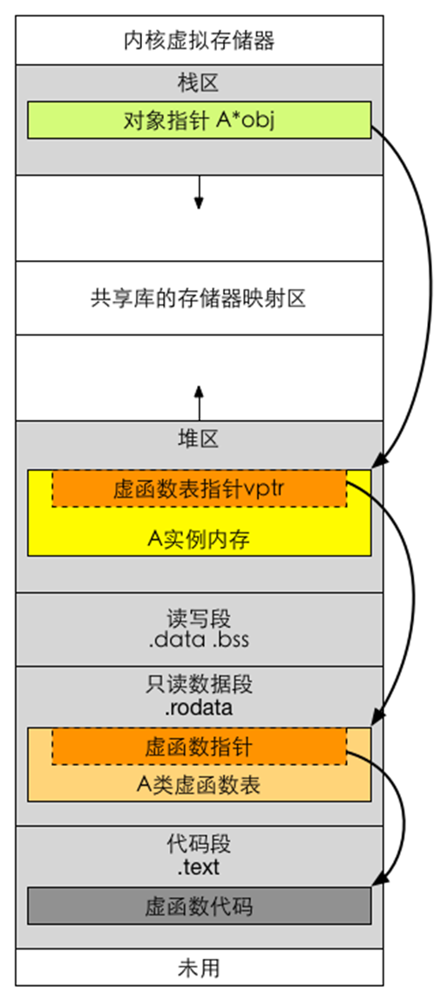

 

## 为什么要有page cache，操作系统怎么设计的page cache

**Page cache（页面缓存）**

> Page cache 也叫页缓冲或文件缓冲，是由好几个磁盘块构成，大小通常为4k，在64位系统上为8k，构成的几个磁盘块在物理磁盘上不一定连续，文件的组织单位为一页， 也就是一个page cache大小，文件读取是由外存上不连续的几个磁盘块，到buffer cache，然后组成page cache，然后供给应用程序。
>
> Page cache在linux读写文件时，它用于`缓存文件的逻辑内容`，从而`加快对磁盘上映像和数据的访问`。具体说是加速对文件内容的访问，buffer cache缓存文件的具体内容——物理磁盘上的磁盘块，这是加速对磁盘的访问。

- CPU如果要访问外部磁盘上的文件，需要首先将这些文件的内容拷贝到内存中，**由于硬件的限制，从磁盘到内存的数据传输速度是很慢的**，<u>如果现在物理内存有空余，干嘛不用这些空闲内存来缓存一些磁盘的文件内容呢</u>，这部分用作缓存磁盘文件的内存就叫做page cache。

- page cache中有一部分磁盘文件的缓存，`因为从磁盘中读取文件比较慢，所以读取文件先去page cache中去查找，如果命中，则不需要去磁盘中读取，大大加快读取速度。`在 Linux 内核中，文件的每个数据块最多只能对应一个 Page Cache 项，它通过两个数据结构来管理这些 Cache项，一个是radix tree（基数树），另一个是双向链表。Radix tree 是一种搜索树，Linux内核利用这个数据结构来通过文件内偏移快速定位Cache 项

- radix tree（基数树）其实就差不多是传统的二叉树，只是在寻找方式上，利用比如一个unsigned int的类型的每一个比特位作为树节点的判断。

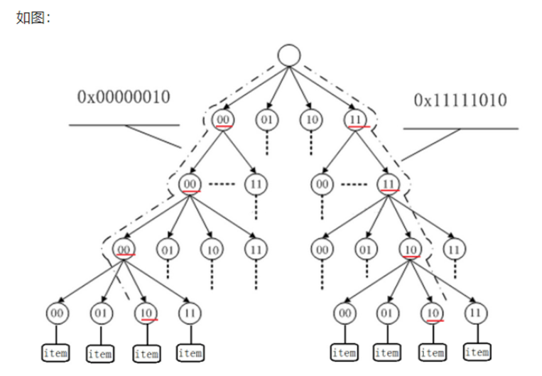

## ？逻辑地址、虚拟地址、物理地址

- 物理地址：加载到内存地址寄存器中的地址，==内存单元的真正地址==。在前端总线上传输的内存地址都是物理内存地址，编号从0开始一直到可用物理内存的最高端。

- 逻辑地址：由程序产生的与段相关的==偏移地址部分==，`编程中使用的地址`（在非虚拟内存的情况下给一个进程分配一段内存空间）。

- 虚拟内存：虚拟[内存](https://baike.baidu.com/item/内存)是[计算机系统](https://baike.baidu.com/item/计算机系统/7210959)[内存管理](https://baike.baidu.com/item/内存管理/5633616)的一种技术。它使得==[应用程序](https://baike.baidu.com/item/应用程序/5985445)认为==它拥有==连续的可用的==[内存](https://baike.baidu.com/item/内存/103614)（一个连续完整的[地址空间](https://baike.baidu.com/item/地址空间/1423980)），而==实际==上，它通常是被分隔成==多个[物理内存](https://baike.baidu.com/item/物理内存/2502263)碎片==，还有==部分暂时存储在外部[磁盘存储器](https://baike.baidu.com/item/磁盘存储器/2386684)==上，在需要时进行[数据交换](https://baike.baidu.com/item/数据交换/1586256)。

  > 虚拟内存的最大容量是由计算机的地址结构（CPU寻址范围）确定的 虚拟内存的实际容量 = min（内存和外存容量之和，CPU寻址范围）
  >
  > 如：某计算机地址结构为32位，按字节编址，内存大小位512MB，外存大小为2GB，则虚拟内存的最大容量为4GB.(2的32次方B)
  >
  > 32位CPU一般有32根地址总线，那么就一共可以寻2^32^个地址=也就是4x1024x1024x1024=4G个地址，1个地址对应1字节的存储单位，对应到内存上就是4GB（4GByte）


## [ 虚拟内存](https://zhuanlan.zhihu.com/p/96098896)和物理内存怎么对应

### 8.10.1.   页式管理

通过页号在页表中查询对应的内存块号，得到内存块起始地址，再加上偏移地址得到物理地址。

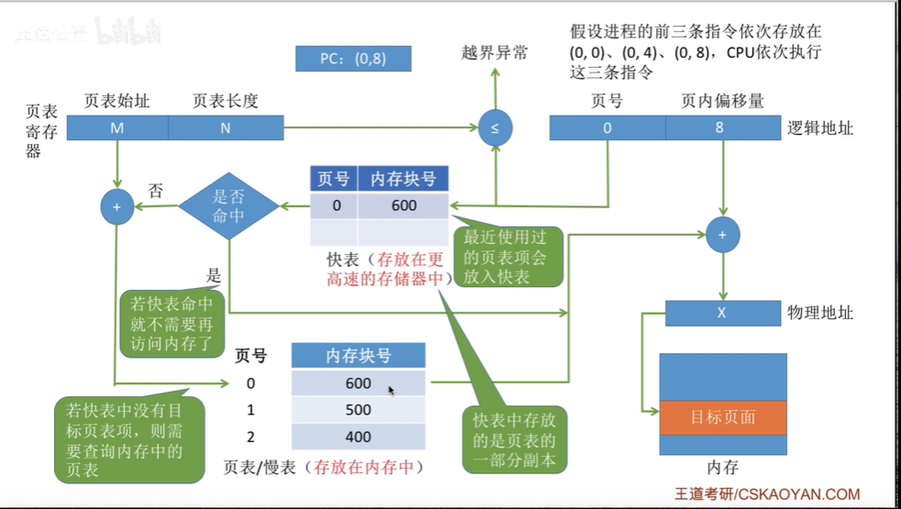

 

### 8.10.2.   段页式挂管理

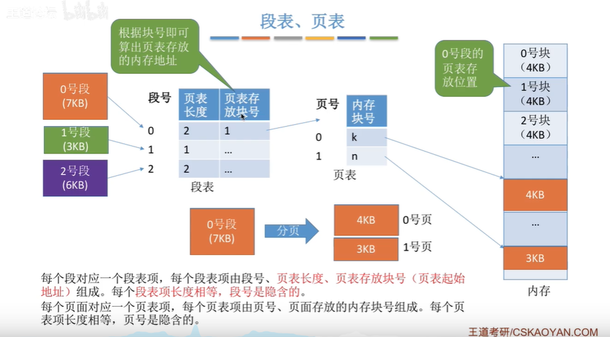

### 8.10.3.   快表的使用/高速缓存（cache）

 由于`局部性原理` 使用`快表TLB`高速缓存 加快页表寻址

> 时间局部性：如果执行了程序中的某条指令，那么不久后这条指令很有可能再次被执行；如果某个数据被访问过，不久之后该数据很可能再次被访问
>
> 空间局部性：一旦程序访问了某个存储单元，在不久之后，其附近的存储单元也很有可能被访问（因为很多数据在内存中都是连续存放的）

### 8.10.4.   请求分页式管理（虚拟内存）


## OS缺页置换算法

当访问一个内存中不存在的页，并且内存已满，则需要从内存中调出一个页或将数据送至磁盘对换区，替换一个页，这种现象叫做缺页置换。当前操作系统最常采用的缺页置换算法如下：

1. `先进先出(FIFO)算法`：置换最先调入内存的页面，即置换在内存中驻留时间最久的页面。按照进入内存的先后次序排列成队列，从队尾进入，从队首删除。  ==（那最早调入的替换掉）==

2. `最近最少使用（LRU）算法`: 置换最近一段时间以来最长时间未访问过的页面。根据程序局部性原理，刚被访问的页面，可能马上又要被访问；而较长时间内没有被访问的页面，可能最近不会被访问。  ==（替换最长时间没有使用的页面）==

3. 最佳置换算法（OPT）算法：最佳置换算法是由 **Belady** 于1966年提出的一种理论上的算法。`每次选择以后永不使用的`， 或许是在最长(未来)时间内不再被访问的页面的页面被淘汰。显然OPT算法是`最优`的，但是在实际操作往往无法预知未来，所以OPT只存在理论而`不能真的实现`，通常用于衡量其他置换算法的优劣。

4. 时钟置换（Clock/NRU）算法：也称为NRU算法（最近未使用算法）是LRU和FIFO的折中算法。

   > ##### **为什么需要 clock 算法？**
   >
   > LRU算法的性能接近于OPT,但是实现起来比较困难，且开销大；FIFO算法实现简单，但性能差。
   >
   > 所以操作系统的设计者尝试了很多算法，试图用比较小的开销接近LRU的性能，这类算法都是CLOCK算法的变体。
   >
   > 由于该算法循环地检查各页面的情况，故称为CLOCK算法，又称为最近未用(Not Recently Used, NRU)算法。
   >
   > ##### **基本思路**
   >
   > 需要用到页表项的访问位（access bit），当一个页面被装入内存时，把该位初始化为0，然后如果这个页被访问（读/写）时，硬件把它置为1. 把各个页面组织成环形链表（类似钟表面），把指针指向最老的页面（最先进来）；
   >
   > 当发生一个缺页中断，考察指针所指向的最老的页面，若它的访问为为0，则立即淘汰。若访问为1，则把该位置为0，然后指针往下移动一格。如此下去，直到找到被淘汰的页面，然后把指针移动到它的下一格。

当前最常采用的就是LRU算法。

## 页面置换算法

在程序运行过程中，如果要访问的页面不在内存中，就发生缺页中断从而将该页调入内存中。此时如果内存已无空闲空间，系统必须从内存中调出一个页面到磁盘对换区中来腾出空间。

页面置换算法和缓存淘汰策略类似，可以将内存看成磁盘的缓存。在缓存系统中，缓存的大小有限，当有新的缓存到达时，需要淘汰一部分已经存在的缓存，这样才有空间存放新的缓存数据。

页面置换算法的主要目标是使页面置换频率最低（也可以说缺页率最低）。

### 1. 最佳

> OPT, <u>Optimal replacement algorithm</u>

所选择的被换出的页面将是<u>最长时间内不再被访问</u>，通常可以保证获得最低的缺页率。

是一种`理论上`的算法，因为无法知道一个页面多长时间不再被访问。

举例：一个系统为某进程分配了三个物理块，并有如下页面引用序列：

```
7，0，1，2，0，3，0，4，2，3，0，3，2，1，2，0，1，7，0，1
```

开始运行时，先将 7, 0, 1 三个页面装入内存。当进程要访问页面 2 时，产生缺页中断，会将页面 7 换出，因为页面 7 再次被访问的时间最长。

### 2. 最近最久未使用

> LRU, <u>Least Recently Used</u>

虽然无法知道将来要使用的页面情况，但是可以知道过去使用页面的情况。LRU 将`最近最久未使用`的页面换出。

为了实现 LRU，需要在内存中维护一个所有页面的链表。当一个页面被访问时，将这个页面移到链表表头。这样就能保证链表表尾的页面是最近最久未访问的。

因为每次访问都需要更新链表，因此这种方式实现的 LRU 代价很高。

```
4，7，0，7，1，0，1，2，1，2，6
```

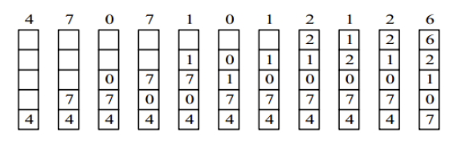

#### LRU的实现

```c++
struct DLinkedNode{
    int key, value; //k是为了溯源 hash中删除key
    DLinkedNode* prev;
    DLinkedNode* next;
    DLinkedNode():key(0), value(0), prev(nullptr), next(nullptr){}
    DLinkedNode(int _key, int _value):key(_key),value(_value),prev(nullptr),next(nullptr){}
};

class LRUCache {
private:
    unordered_map<int, DLinkedNode*> cache;
    //虚拟头 虚拟尾
    DLinkedNode* head;
    DLinkedNode* tail;
    int size;
    int capacity;

public:
    LRUCache(int _capacity):capacity(_capacity), size(0) {
        //使用虚拟头 和 虚拟尾节点
        head = new DLinkedNode();
        tail = new DLinkedNode();
        head->next = tail;
        tail->prev = head;
    }
    
    int get(int key) {
        if(!cache.count(key)){
            return -1;
        }
        //如果key存在 先通过哈希定位，再移到头部
        DLinkedNode* node = cache[key];
        moveToHead(node);
        return node->value;
    }
    
    void put(int key, int value) {
        if(!cache.count(key)){
            //如果key不存在 创建一个新节点
            DLinkedNode* node  = new DLinkedNode(key, value);
            cache[key] = node;
            addToHead(node);
            size++;
            if(size>capacity){
                //超出容量 删除尾部节点
                DLinkedNode* removed = removeTail();
                cache.erase(removed->key);
                delete removed;
                --size;
            }
        }else{
            //如果key存在 先哈希定位 再修改val 在移动头部
            DLinkedNode* node = cache[key];
            node->value = value;
            moveToHead(node);
        }
    }

    //头部插入新节点
    void addToHead(DLinkedNode* node){
        node->prev = head;
        node->next = head->next;
        head->next->prev = node;
        head->next = node;
    }
    //删除某个节点
    void removeNode(DLinkedNode* node){
        node->prev->next = node->next;
        node->next->prev = node->prev;
    }
    //移动到头部
    void moveToHead(DLinkedNode* node){
        removeNode(node);
        addToHead(node);
    }
    //删除尾部节点
    DLinkedNode* removeTail(){
        DLinkedNode* node = tail->prev;
        removeNode(node);
        return node;
    }
};
```

###  3. 最近未使用

> NRU, <u>Not Recently Used</u>

每个页面都有两个状态位：R 与 M，当页面被`访问`(使用)时设置页面的 R=1，当页面被`修改`时设置 M=1。其中 R 位会定时被清零。可以将页面分成以下四类：

- R=0，M=0
- R=0，M=1
- R=1，M=0
- R=1，M=1

当发生缺页中断时，NRU 算法随机地从类编号最小的非空类中挑选一个页面将它换出。

NRU 优先换出已经被修改的脏页面`（R=0，M=1）`，而不是被频繁使用的干净页面（R=1，M=0）。

NRU 优先换出 RM 小的页面：00 < 01 < 10 < 11；因此已经被修改的脏页面（R=0，M=1）相比被频繁使用的干净页面（R=1，M=0），更优先被换出。

### 4. 先进先出

> FIFO, First In First Out

选择换出的页面是最先进入的页面。

<u>该算法`会将那些经常被访问的页面换出`，导致缺页率升高。</u>

### 5. 第二次机会算法

FIFO 算法可能会把经常使用的页面置换出去，为了避免这一问题，对该算法做一个简单的修改：

当页面被访问 (读或写) 时设置该页面的 R 位为 1。需要替换的时候，检查最老页面的 R 位。

- 如果 R 位是 0，那么这个页面既老又没有被使用，可以立刻置换掉；

- 如果是 1，就将 R 位清 0，并把该页面放到链表的尾端（`再来一圈，再给你一次机会`），修改它的装入时间使它就像刚装入的一样，然后继续从链表的头部开始搜索。

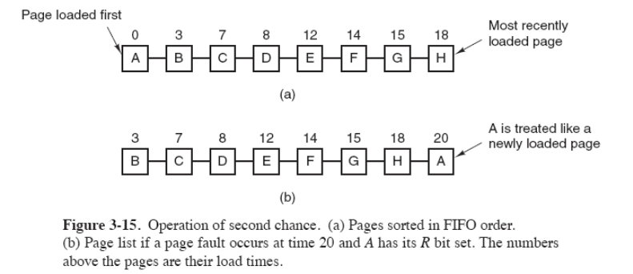


### 6. 时钟 Clock

第二次机会算法需要在链表中移动页面，降低了效率。时钟算法使用环形链表将页面连接起来，再使用一个指针指向最老的页面。

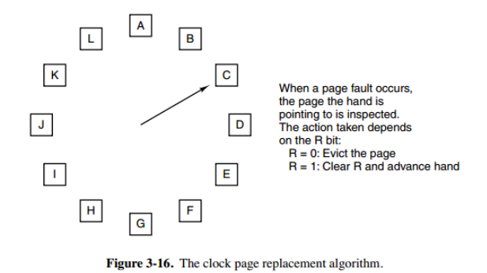


## CPU内存的寻址能力？

（CPU寻址范围是2的N次方字节，即2^N^(B)。）

- 32位CPU：32位CPU可以寻址的内存空间大小为2^32，即4GB。这意味着它可以寻址的最大内存空间为4GB。
- 64位CPU：64位CPU可以寻址的内存空间大小为2^64，即16EB（exabytes）。这意味着它可以寻址的最大内存空间非常大，远远超过目前实际可用的内存容量。

## CPU寻址了解吗?为什么需要虚拟地址空间?

现代处理器使用的是- -种称为虚拟寻址(Virtual Addressing) 的寻址方式。使用虚拟寻址，CPU 需要将虚拟地址翻译成物理地址，这样才能访问到真实的物理内存。实际上完成虚拟地址转换为物理地址

转换的硬件是CPU中含有一个被称为内存管理单元(Memory Management Unit, MMU) 的硬件。

 

**为什么要有虚拟地址空间呢？**

没有虚拟地址空间的时候， 程序都是直接访问和操作的都是物理内存 。

如果直接把物理地址暴露出来的话会带来严重问题，比如可能对操作系统造成伤害以及给同时运行多个程序造成困难。

>直接使用物理内存会产生一些问题
>
>1. 内存空间利用率的问题 （内存碎片化）
>2. 读写内存的安全性问题（访问权限问题）
>3. 进程间的安全问题
>4. 内存读写的效率问题

 `为了防止不同进程同一时刻在物理内存中运行而对物理内存的争夺和践踏`，<u>采用了虚拟内存</u>。

**通过虚拟地址访问内存有以下优势：**

- 程序可以使用一系列相邻的虚拟地址来访问物理内存中不相邻的大内存缓冲区。

- 程序可以使用一系列虚拟地址来访问大于可用物理内存的内存缓冲区。当物理内存的供应量变小时，内存管理器会将物理内存页(通常大小为4 KB) 保存到磁盘文件。数据或代码页会根据需要在物理内存与磁盘之间移动。

- 不同进程使用的虚拟地址彼此隔离。一个进程中的代码无法更改正在由另一进程或操作系统使用的物理内存。


## 总结

- 为了在多进程环境下，使得进程之间的内存地址不受影响，相互隔离，于是操作系统就为`每个进程`独⽴分配一套`虚拟地址空间`，每个程序只关心自⼰的虚拟地址就可以，<u>实际上大家的虚拟地址都是一样的</u>，但分布到物理地址内存是不一样的。作为程序，也不用关心物理地址的事情。
- 每个进程都有自⼰的虚拟空间，而物理内存只有一个，所以当启用了大量的进程，物理内存必然会很紧张，于是操作系统会通过`内存交换`技术，<u>把不常使用的内存暂时存放到硬盘（换出），在需要的时候再装载回物理内存（换入）</u>。
- 那既然有了虚拟地址空间，那必然要把虚拟地址「`映射`」到物理地址，这个事情通常由操作系统来维护。
- 那么对于虚拟地址与物理地址的映射关系，可以有`分段和分页`的方式，同时两者结合都是可以的。
- 内存分段是根据程序的逻辑⻆度，分成了`栈段`、`堆段`、`数据段`、`代码段`等，这样可以分离出不同属性的段，同时是一块连续的空间。但是每个段的大小都不是统一的，这就会导致内存碎片和内存交换效率低的问题。
- 于是，就出现了内存分页，把虚拟空间和物理空间分成大小固定的页，如在 Linux 系统中， 每一页的大小为 4KB 。由于分了页后，就不会产⽣细小的内存碎片。同时在内存交换的时候，写入硬盘也就一个页或⼏个页，这就大大提高了内存交换的效率。再来，为了解决简单分页产⽣的页表过大的问题，就有了多级页表，它解决了空间上的问题，但这就会导致 CPU 在寻址的过程中，需要有很多层表参与，加大了时间上的开销。于是根据程序的局部性原理，在 CPU 芯片中加入了  TLB，负责缓存最近常被访问的页表项，大大提高了地址的转换速度。
- Linux 系统<u>主要采用了分页管理</u>，但是由于 Intel 处理器的发展史，Linux 系统无法避免`分段`管理。于是 `Linux 就把所有段的基地址设为 0` ，也就意味着所有程序的地址空间都是线性地址空间（虚拟地址），相当于屏蔽了 CPU 逻辑地址的概念，所以段只被用于访问控制和内存保护。
- 另外，Linxu 系统中虚拟空间分布可分为用户态和内核态两部分，其中用户态的分布：代码段、全局变量、BSS、函数栈、堆内存、映射区。

## 面经上的一些问题

### A=B+C，参数在什么时候确定虚拟内存中的地址；

### 程序运行前的操作（预处理，编译，汇编，链接），编译后还是C++代码吗，汇编后是什么文件，链接时怎么确定将哪些目标文件链接到一起；

# 3. 进程和线程

## 并发(concurrency)和并行(parallelism)

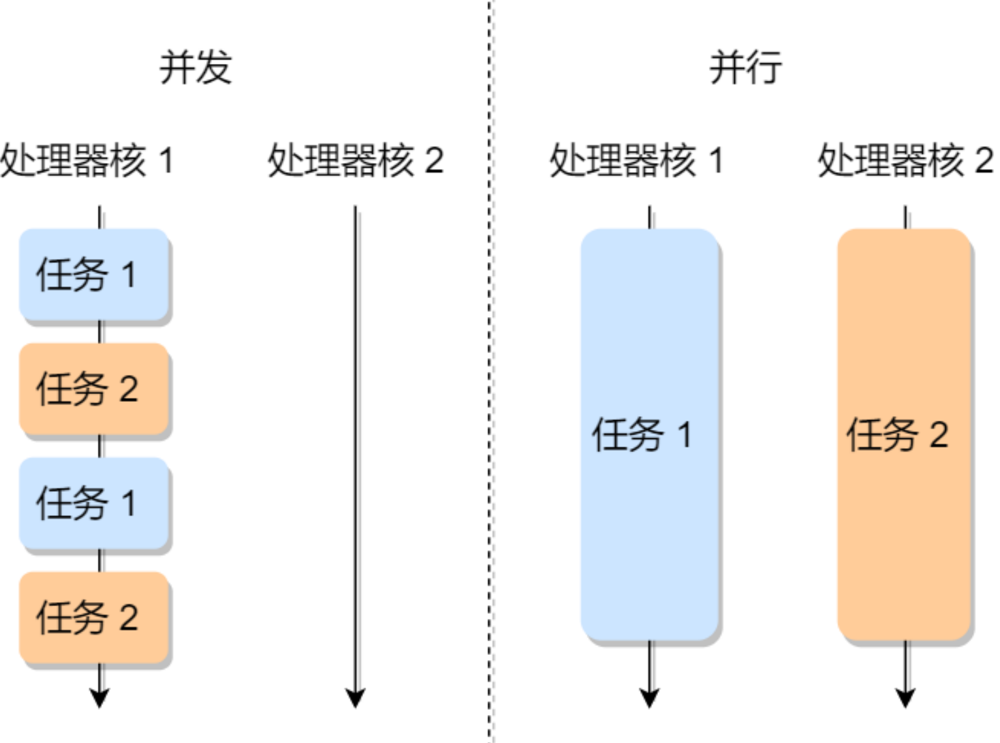

- 并发（concurrency）：指宏观上看起来两个程序在同时运行，比如说在单核cpu上的多任务。但是从微观上看两个程序的指令是交织着运行的，你的指令之间穿插着我的指令，我的指令之间穿插着你的，在单个周期内只运行了一个指令。这种并发并不能提高计算机的性能，只能提高效率。

  `（其实是交替运行）`

- 并行（parallelism）：指严格物理意义上的同时运行，比如多核cpu，两个程序分别运行在两个核上，两者之间互不影响，单个周期内每个程序都运行了自己的指令，也就是运行了两条指令。这样说来并行的确提高了计算机的效率。所以现在的cpu都是往多核方面发展。

  `（真正的同时运行）`

## 3.1 进程与线程的概念，以及为什么要有进程线程

### 基本概念：

- <u>`进程是对运行时程序的封装，是系统进行资源（包括内存、打开的文件等）调度和分配的的基本单位，实现了操作系统的并发`；</u>

- 1. 线程是进程的子任务，是==CPU调度和分派的基本单位==，用于保证程序的实时性，实现进程内部的并发；
  2. 线程是操作系统可识别的==最小执行和调度单位==。每个线程都独自占用一个虚拟处理器：独自的寄存器组，指令计数器和处理器状态。每个线程完成不同的任务，但是==共享==同一`地址空间`（也就是同样的动态内存，映射文件，目标代码等等），打开的`文件队列`和其他`内核资源`。


### 线程产生的原因：

1. 进程可以使多个程序能并发执行，以提高资源的利用率和系统的吞吐量；但是其具有一些缺点：
   - 进程在同一时间只能干一件事（`一次一件事`）；
   - 进程在执行的过程中如果阻塞，整个进程就会挂起，即使进程中有些工作不依赖于等待的资源，仍然不会执行（`阻塞挂起整个`）。

2. （`为了减小并发的时空开销`）因此，操作系统引入了比进程粒度更小的线程，作为并发执行的基本单位，从而减少程序在并发执行时所付出的时空开销，提高并发性。和进程相比，线程的优势如下：

   - （相同的地址空间，所以`节省资源`）从资源上来讲，线程是一种非常"节俭"的多任务操作方式。在linux系统下，启动一个新的进程必须分配给它独立的地址空间，建立众多的数据表来维护它的代码段、堆栈段和数据段，这是一种"昂贵"的多任务工作方式。 

   - （相同的地址空间，所以`切换快`）从切换效率上来讲，运行于一个进程中的多个线程，它们之间使用相同的地址空间，而且线程间彼此切换所需时间也远远小于进程间切换所需要的时间。据统计，一个进程的开销大约是一个线程开销的30倍左右。

   - (相同的地址空间，所以`通信快捷方便`）从通信机制上来讲，线程间方便的通信机制。对不同进程来说，它们具有独立的数据空间，要进行数据的传递只能通过进程间通信的方式进行，这种方式不仅费时，而且很不方便。线程则不然，由于同一进程下的线程之间贡献数据空间，所以一个线程的数据可以直接为其他线程所用，这不仅快捷，而且方便。

   - 除以上优点外，多线程程序作为一种多任务、并发的工作方式，还有如下优点：

     1、使多CPU系统更加有效。操作系统会保证当线程数不大于CPU数目时，<u>不同的线程运行于不同的CPU上</u>。

     2、改善程序结构。一个既长又复杂的进程可以考虑分为多个线程，成为几个独立或半独立的运行部分，这样的程序才会利于理解和修改。
   
   > - 创建快 
   > - 终止快 
   > - 切换快 
   > - 共享内存和文件资源 通信方便


## 3.2 线程与进程的区别

1. （`从属关系`）一个线程只能属于一个进程，而一个进程可以有多个线程，但至少有一个线程。线程`依赖`于进程而存在。

2. （`资源区别`）进程有独立的系统资源，而同一进程内的线程共享进程的大部分系统资源,包括堆、代码段、数据段，每个线程只拥有一些在运行中必不可少的私有属性，比如tcb,线程Id,栈、寄存器。

3. （`单位`）进程是资源分配的最小单位，线程是CPU调度的最小单位；

4. `系统开销`： 由于在创建或撤销进程时，系统都要为之分配或回收资源，如内存空间、IO设备等。因此，操作系统所付出的开销将显著地大于在创建或撤消线程时的开销。

   类似地，在进行进程切换时，涉及到整个当前进程CPU环境的保存以及新被调度运行的进程的CPU环境的设置。而线程切换只须保存和设置少量寄存器的内容，并不涉及存储器管理方面的操作。可见，进程切换的开销也远大于线程切换的开销。

5. `通信`：由于同一进程中的多个线程具有相同的地址空间，致使它们之间的同步和通信的实现，也变得比较容易。进程间通信IPC，线程间可以直接读写进程数据段（如全局变量）来进行通信——需要进程同步和互斥手段的辅助，以保证数据的一致性。在有的系统中，线程的切换、同步和通信都无须操作系统内核的干预

6. （`调试难度可靠性`）进程编程调试简单可靠性高，但是创建销毁开销大；线程正相反，开销小，切换速度快，但是编程调试相对复杂。

7. （`相互影响`）进程间不会相互影响 ；线程一个线程挂掉将导致整个进程挂掉


## 3.3 协程

1. 概念：

   协程，又称微线程，纤程，英文名Coroutine。协程看上去也是子程序，但执行过程中，在子程序内部可中断，然后转而执行别的子程序，在适当的时候再返回来接着执行。协程并没有增加线程数量，只是在线程的基础之上通过分时复用的方式运行多个协程，而且协程的切换在用户态完成，切换的代价比线程从用户态到内核态的代价小很多。

   协程运行在线程之上，当一个协程执行完成后，可以选择主动让出，让另一个协程运行在当前线程之上。**协程并没有增加线程数量，只是在线程的基础之上通过分时复用的方式运行多个协程**，而且协程的切换在用户态完成，切换的代价比线程从用户态到内核态的代价小很多。

   例如：

   ```c++
   def A() :
   print '1'
   print '2'
   print '3'
   def B() :
   print 'x'
   print 'y'
   print 'z'
   ```

   由协程运行结果可能是12x3yz。在执行A的过程中，可以随时中断，去执行B，B也可能在执行过程中中断再去执行A。但协程的特点在于是一个线程执行。

2. 协程和线程区别

   那和多线程比，协程最大的优势就是协程`极高的执行效率`。因为子程序切换不是线程切换，而是由程序自身控制（用户态），因此，没有线程切换的开销，和多线程比，线程数量越多，协程的性能优势就越明显。

   第二大优势就是不需要多线程的锁机制，因为只有一个线程，也不存在同时写变量冲突，在协程中控制共享资源不加锁，只需要判断状态就好了，所以执行效率比多线程高很多。

   在协程调用阻塞IO操作的时候，操作系统会让线程进入阻塞状态，当前的协程和其它绑定在该线程之上的协程都会陷入阻塞而得不到调度，协程常使用异步IO。


## 3.4 说一下多线程和多进程的不同

进程是资源分配的最小单位，而线程是CPU调度的最小单位。多线程之间共享同一个进程的地址空间，线程间通信简单，同步复杂，线程创建、销毁和切换简单，速度快，占用内存少，适用于多核分布式系统，但是线程间会相互影响，一个线程意外终止会导致同一个进程的其他线程也终止，程序可靠性弱。而多进程间拥有各自独立的运行地址空间，进程间不会相互影响，程序可靠性强，但是进程创建、销毁和切换复杂，速度慢，占用内存多，进程间通信复杂，但是同步简单（？？？），适用于多核、多机分布。

| 维度                                                         |                            多进程                            |                 多线程                 |   总结   |
| ------------------------------------------------------------ | :----------------------------------------------------------: | :------------------------------------: | :------: |
| 数据共享、同步                                               |          数据是分开的:共享复杂，需要用IPC;同步简单           | 多线程共享进程数据：共享简单；同步复杂 | 各有优势 |
| 内存、[CPU](https://so.csdn.net/so/search?q=CPU&spm=1001.2101.3001.7020) |              占用内存多，切换复杂，CPU利用率低               |   占用内存少，切换简单，CPU利用率高    | 线程占优 |
| 创建销毁、切换                                               |                  创建销毁、切换复杂，速度慢                  |       创建销毁、切换简单，速度快       | 线程占优 |
| 编程调试                                                     |                      编程简单，调试简单                      |           编程复杂，调试复杂           | 进程占优 |
| 可靠性                                                       |                      进程间不会相互影响                      |     一个线程挂掉将导致整个进程挂掉     | 进程占优 |
| 分布式                                                       | 适应于多核、多机分布 ；如果一台机器不够，扩展到多台机器比较简单 |             适应于多核分布             | 进程占优 |


## 3.5 多进程和多线程的使用场景

多进程模型的优势是CPU

1. 多线程模型主要优势为线程间切换代价较小，因此适用于==I/O密集型==（`读写文件`）的工作场景，因此I/O密集型的工作场景经常会由于I/O阻塞导致频繁的切换线程。同时，多线程模型也适用于单机多核分布式场景。

2. 多进程模型，适用于==CPU密集型==（`大量计算`）。同时，多进程模型也适用于多机分布式场景中，易于多机扩展。

**[一分钟明白IO密集型与CPU密集型的区别 - 掘金 (juejin.cn)](https://juejin.cn/post/7027610930431131685)**

- CPU密集型也叫`计算密集型`，指的是系统的硬盘、内存性能相对CPU要好很多，此时，系统运作CPU读写IO(硬盘/内存)时，IO可以在很短的时间内完成，而CPU还有许多运算要处理，因此，CPU负载很高。
- IO密集型指的是系统的CPU性能相对硬盘、内存要好很多，此时，系统运作，大部分的状况是CPU在等IO (硬盘/内存) 的`读写`操作，因此，CPU负载并不高。
- 一个计算为主的应用程序（CPU密集型程序），多线程或多进程跑的时候，可以充分利用起所有的 CPU 核心数，比如说16核的CPU ，开16个线程的时候，可以同时跑16个线程的运算任务，此时是最大效率。但是如果线程数/进程数远远超出 CPU 核心数量，反而会使得任务效率下降，因为**频繁的切换线程或进程**也是要消耗时间的。因此对于 CPU 密集型的任务来说，线程数/进程数等于 CPU 数是最好的了。
- 如果是一个磁盘或网络为主的应用程序（IO密集型程序），一个线程处在 IO 等待的时候，另一个线程还可以在 CPU 里面跑，有时候 CPU 闲着没事干，所有的线程都在等着 IO，这时候他们就是同时的了，而单线程的话，此时还是在一个一个等待的。我们都知道IO的速度比起 CPU 来是很慢的。此时线程数可以是CPU核心数的数倍（视情况而定）


## 3.6 线程需要保存哪些上下文，SP、PC、EAX这些寄存器是干嘛用的

线程在切换的过程中需要保存`当前线程Id`、`线程状态`、`堆栈`、`寄存器状态`等信息。其中寄存器主要包括SP PC EAX等寄存器，其主要功能如下：

- **程序计数器（PC）**：记录当前线程执行的指令地址，用于指示`下一条将要执行的指令`。
- **堆栈指针（SP）**：指向线程的`堆栈顶部`，用于保存线程执行过程中`的局部变量和函数调用的上下文`。
- **通用寄存器**：如 EAX、EBX、ECX、EDX 等，用于保存线程执行过程中的`临时数据和计算结果`。
- **标志寄存器**：如 EFLAGS，用于记录与线程状态相关的标志位，如进位标志、零标志、溢出标志等。
- **其他寄存器**：根据特定架构和操作系统的要求，可能还包括其他寄存器，如段寄存器、浮点寄存器等。


## 3.7 进程状态转换图，动态就绪，静态就绪，动态阻塞，静态阻塞

1. 进程的五种基本状态：

   

   ==<u>**状态含义**</u>==

   - `创建`状态：进程正在被创建

   - `就绪`状态：进程被加入到就绪队列中等待CPU调度运行

   - `执行`状态：进程正在被运行

   - 等待`阻塞`状态：进程因为某种原因，比如等待I/O，等待设备，而暂时不能运行。

   - `终止`状态：进程运行完毕

   ==<u>**状态变迁**</u>==

   - NULL -> 创建状态：一个新进程被创建时的第一个状态；
- 创建状态 -> 就绪状态：当进程被创建完成并初始化后，一切就绪准备运行时，变为就绪状态，这个过程是很快的；
   - 就绪态 -> 运行状态：处于就绪状态的进程被操作系统的`进程调度器选中`后，就分配给CPU 正式运行该进程；
   - 运行状态 -> 结束状态：当进程已经运行`完成或出错`时，会被操作系统作结束状态处理； 
   - 运行状态 -> 就绪状态：处于运行状态的进程在运行过程中，由于分配给它的运行时间片用完，操作系统会把该进程变为就绪态，接着从就绪态选中另外一个进程运行；
   - 运行状态 -> 阻塞状态：当进程请求某个事件且必须等待时，例如请求 I/O 事件；
   - 阻塞状态 -> 就绪状态：当进程要等待的事件完成时，它从阻塞状态变到就绪状态；
   
2. `交换技术`

   - 当多个进程竞争内存资源时，会造成内存资源紧张，并且，如果此时没有就绪进程，处理就会空闲，I/0速度比处理速度慢得多，可能`出现全部进程阻塞等待I/O`。

   - 针对以上问题，提出了两种解决方法：

     1）`交换技术`：<u>换出一部分进程到外存，腾出内存空间。</u>

     - 在交换技术上，将内存暂时不能运行的进程，或者暂时不用的数据和程序，换出到外存，来腾出足够的内存空间，把已经具备运行条件的进程，或进程所需的数据和程序换入到内存。
   - 从而出现了进程的挂起状态：进程被交换到外存，进程状态就成为了挂起状态。
     

   

     2）`虚拟存储技术`：每个进程只能装入一部分程序和数据。

3. 活动阻塞，静止阻塞，活动就绪，静止就绪

   

   > <u>`挂起： 指被挂起到外存`</u>

   1）活动阻塞：进程在内存，但是由于某种原因被阻塞了。

   2）静止阻塞：进程在外存，同时被某种原因阻塞了。

   > 阻塞挂起状态：进程在外存（硬盘）并等待某个事件的出现；  ==<u>**在外存并被阻塞了**</u>==

   3）活动就绪：进程在内存，处于就绪状态，只要给CPU和调度就可以直接运行。

   4）静止就绪：进程在外存，处于就绪状态，只要调度到内存，给CPU和调度就可以运行。

   > 就绪挂起状态：进程在外存（硬盘），但只要进入内存，即刻⽴刻运行； ==<u>**在外存没被阻塞**</u>==
   
   从而出现了：
   
   活动就绪 ——  静止就绪    （内存不够，调到外存）
   
   活动阻塞 ——  静止阻塞    （内存不够，调到外存）
   
   执行   ——  静止就绪     （时间片用完）

## 3.8 进程的控制结构PCB

PCB 是进程存在的唯一标识，这意味着一个进程的存在，必然会有一个 PCB，如果进程消失了，那么 PCB 也会随之消失。

### PCB 具体包含什么信息

1. 进程描述信息：
   - 进程标识符：标识各个进程，每个进程都有一个并且唯一的标识符；  ==<u>**进程号**</u>==
   - 用户标识符：进程归属的用户，用户标识符主要为共享和保护服务；  ==<u>**用户号**</u>==
2. 进程控制和管理信息：
   - 进程当前`状态`，如 new、ready、running、waiting 或 blocked 等；  
   - 进程`优先级`：进程抢占 CPU 时的优先级；
3. `资源分配清单`：
   - 有关内存地址空间或虚拟地址空间的信息，所打开文件的列表和所使用的 I/O 设备信息。
4. CPU 相关信息：
   - `CPU 中各个寄存器的值`，当进程被切换时，CPU 的状态信息都会被保存在相应的 PCB中，以便进程重新执行时，能从断点处继续执行。

### 每个 PCB 是如何组织的

通常是通过链表的方式进行组织，把具有相同状态的进程链在一起，组成各种队列。比如：

- 将所有处于就绪状态的进程链在一起，称为`就绪队列`；
- 把所有因等待某事件而处于等待状态的进程链在一起就组成各种`阻塞队列`；
- 另外，对于运行队列在单核 CPU 系统中则只有一个运行指针了，因为单核 CPU 在某个时间，只能运行一个程序。

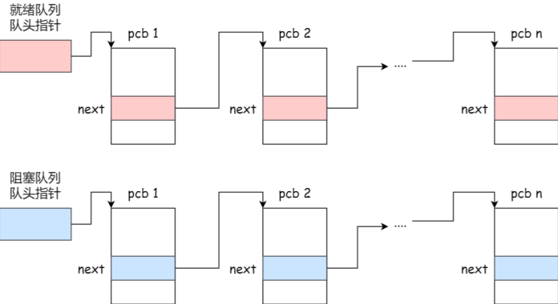

## 3.9 进程的控制

进程的`创建、终⽌、阻塞、唤醒`的过程，这些过程也就是进程的控制

### 创建进程

创建进程的过程如下：

1. 为新进程`分配`一个唯一的`进程标识号`，并`申请`一个空白的 `PCB`，PCB 是有限的，若申请失败则创建失败；
2. 为进程`分配资源`，此处如果资源不足，进程就会进入等待状态，以等待资源； 
3. `初始化 PCB`；
4. 如果进程的调度队列能够接纳新进程，那就将进程`插入到就绪队列`，<u>等待被调度运行</u>；

### 终止进程

进程可以有 3 种终⽌方式：正常结束、异常结束以及外界⼲预（信号    kill 掉）。 
终⽌进程的过程如下：

1. 查找需要终止的进程的 `PCB`；
2. 如果处于执行状态，则`⽴即终⽌该进程`的执行，然后将 CPU 资源分配给其他进程； 
3. 如果其还有子进程，则应将其所有子进程终⽌； ==<u>**？linux应该是变孤儿 交给init进程**</u>==
4. 将该进程所拥有的全部`资源`都`归还`给⽗进程或操作系统； 
5. 将其从 `PCB` 所在`队列`中`删除`；

#### 1. 进程退出

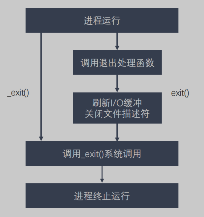

主要就是exit和_exit的区别：

- exit比_exit更多一步 刷新IO缓冲区 关闭文件描述符

```c++
#include <stdio.h>
#include <stdlib.h>
#include <unistd.h>

int main() {
    printf("hello\n");
    printf("world");
    // exit(0);   // 打印 hello world 最后刷新io缓冲输出的world
    _exit(0);    //打印hello  因为printf的\n有刷新缓冲区的作用 输出hello
    return 0;
}
```

#### 2. 孤儿进程

- 父进程运行结束，但子进程还在运行（未运行结束），这样的子进程就称为孤儿进程（Orphan Process）。
- 每当出现一个孤儿进程的时候，内核就把孤儿进程的父进程设置为 init ，而 init 进程会循环地 wait() 它的已经退出的子进程。这样，当一个孤儿进程凄凉地结束了其生命周期的时候，<u>init 进程就会代表党和政府出面处理它的一切善后工作</u>。
- 因此`孤儿进程并不会有什么危害`。

#### 3. 僵尸进程

- 每个进程结束之后, 都会释放自己地址空间中的用户区数据，<u>==内核区的 PCB 没有办法自己释放掉，需要父进程去释放==</u>。
- 进程终止时，父进程尚未回收，子进程残留资源（PCB）存放于内核中，变成僵尸（Zombie）进程。
- <u>==僵尸进程不能被 kill -9 杀死==</u>，这样就会导致一个问题，如果父进程不调用 wait() 或 waitpid() 的话，那么保留的那段信息就不会释放，其进程号就会一直被占用，但是系统所能使用的`进程号是有限的`，如果大量的产生僵尸进程，将因为没有可用的进程号而导致系统不能产生新的进程，此即为僵尸进程的`危害`，应当避免。

#### 4. 进程回收

- 在每个进程退出的时候，内核释放该进程所有的资源、包括打开的文件、占用的内存等。但是仍然为其保留一定的信息，这些信息主要主要指进程控制块PCB的信息（包括进程号、退出状态、运行时间等）。

- 父进程可以通过调用`wait`或`waitpid`得到它的退出状态同时彻底清除掉这个进程。

- wait() 和 waitpid() 函数的功能一样，区别在于，`wait() 函数会阻塞`，`waitpid() 可以设置不阻塞`，waitpid() 还可以指定等待哪个子进程结束。

- 注意：一次wait或waitpid调用只能清理一个子进程，清理多个子进程应使用循环。 <u>==（一次一个）==</u>

- <u>==主进程wait阻塞等待子进程被kill掉 清楚pcb 主进程继续==</u>

  > `线程中也存在子线程资源的回收`:
  >
  > join函数（类似多进程中的wait和waitpid），不同于多进程，任何线程都可以对其他线程的资源进行回收

### 阻塞进程

当进程需要等待某一事件完成时，它可以调用阻塞语句把自己阻塞等待。而一旦被阻塞等待，它<u>只能由`另一个进程唤醒`</u>。

阻塞进程的过程如下：

- `找到`将要被阻塞进程标识号对应的 `PCB`；
- 如果该进程为运行状态，则`保护其现场`，将其状态转为`阻塞`状态，停止运行； 
- 将该 PCB `插入`到`阻塞队列`中去；

### 唤醒进程

进程由「运行」转变为「阻塞」状态是由于进程必须等待某一事件的完成，所以处于阻塞状态的进程是绝对不可能叫醒自⼰的。

如果某进程正在等待 I/O 事件，需由别的进程发消息给它，则只有当该进程所期待的事件出现时，才<u>由发现者进程用唤醒语句叫醒它</u>。

唤醒进程的过程如下：

- 在该事件的阻塞队列中`找到`相应进程的 `PCB`； 
- 将其从阻塞队列中`移出`，并<u>置其状态为就绪状态</u>；
- 把该 `PCB 插入到就绪队列中`，等待调度程序调度；

进程的阻塞和唤醒是一对功能相反的语句，如果某个进程调用了阻塞语句，则必有一个与之对应的唤醒语句。

> ==<u>**唤醒是需要其他进程去检测阻塞缺失的东西，然后再这个进程去唤醒阻塞的进程**</u>==

## 3.10 进程的上下文切换

各个进程之间是共享 CPU 资源的，在不同的时候进程之间需要切换，让不同的进程可以在CPU 执行，那么这个一个进程切换到另一个进程运行，称为进程的上下文切换。

进程的上下文切换不仅包含了`虚拟内存`、`栈`、`全局变量`等用户空间的资源，还包括了`内核堆栈`、`寄存器`等内核空间的资源。

通常，会把交换的信息保存在进程的 PCB，当要运行另外一个进程的时候，我们需要从这个进程的 PCB 取出上下文，然后恢复到 CPU 中，这使得这个进程可以继续执行，如下图所示：


进程的上下文开销是很关键的，我们希望它的开销越小越好，这样可以使得进程可以把更多时间花费在执行程序上，而不是耗费在上下文切换。

### 发生进程上下文切换有哪些场景？

- 为了保证所有进程可以得到公平调度，<u>CPU 时间被划分为一段段的时间片</u>，这些时间片再被轮流分配给各个进程。这样，当某个进程的时间片耗尽了，进程就从<u>运行状态变为就绪状态</u>，系统从就绪队列选择另外一个进程运行；
- 进程在系统资源不足（比如内存不足）时，要等到资源满足后才可以运行，这个时候进程也会被挂起，并由系统调度其他进程运行；
- 当进程通过睡眠函数 sleep 这样的方法将自己主动挂起时，自然也会重新调度；
- 当有优先级更高的进程运行时，为了保证高优先级进程的运行，当前进程会被挂起，由高优先级进程来运行；
- 发生硬件中断时，CPU 上的进程会被中断挂起，转而执行内核中的中断服务程序；

## 3.11 单核CPU是如何实现多进程的?

单核cpu之所以能够实现多进程,主要是依靠于`操作系统的进程的调度算法`  ==<u>操作系统的并发</u>==

　　如时间片轮转算法,在早期,举例说明:有5个正在运行的程序(即5个进程) :  QQ  微信  有道词典   网易云音乐  chrome浏览器, 操作系统会让单核cpu轮流来运行这些进程,一个进程只运行2ms,这样看起起来就像多个进程同时在运行,从而实现多进程


## 3.12 线程的上下文切换

线程与进程最大的区别在于：线程是调度的基本单位，而进程则是资源拥有的基本单位。

所以，所谓操作系统的任务调度，实际上的调度对象是线程，而进程只是给线程提供了虚拟内存、全局变量等资源。

对于线程和进程我们可以这么理解：

- 当进程只有一个线程时，可以认为进程就等于线程；
- 当进程拥有多个线程时，这些线程会共享相同的虚拟内存和全局变量等资源，这些资源在上下文切换时是不需要修改的；

另外，线程也有自⼰的私有数据，比如`栈和寄存器`等，这些在上下文切换时也是需要保存的。

##### 线程上下文切换的是什么？

这还得看线程是不是属于同一个进程：

- 当两个线程不是属于同一个进程，则切换的过程就跟进程上下文切换一样；
- 当两个线程是属于同一个进程，因为虚拟内存是共享的，所以在切换时，虚拟内存这些资源就保持不动，只需要切换线程的私有数据、寄存器等不共享的数据；

所以，<u>线程的上下文切换相比进程，开销要小很多</u>。

## 3.13 线程的实现

主要有三种线程的实现方式：

- `用户`线程（User Thread）：在用户空间实现的线程，不是由内核管理的线程，是由用户态的线程库来完成线程的管理；
- `内核`线程（Kernel Thread）：在内核中实现的线程，是由内核管理的线程； 
- `轻量级进程`（LightWeight Process）：在内核中来⽀持用户线程；

那么，这还需要考虑一个问题，用户线程和内核线程的对应关系。

首先，第一种关系是多对一的关系，也就是多个用户线程对应同一个内核线程：

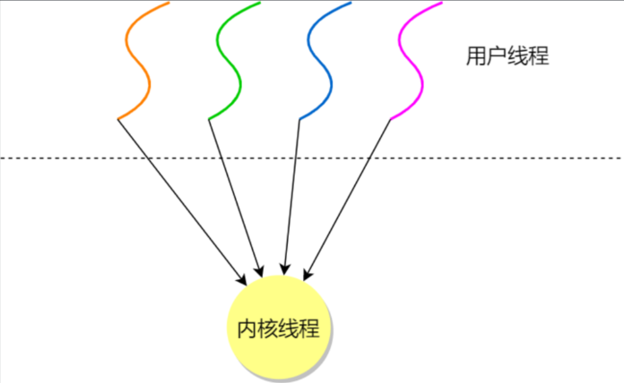

第⼆种是一对一的关系，也就是一个用户线程对应一个内核线程：

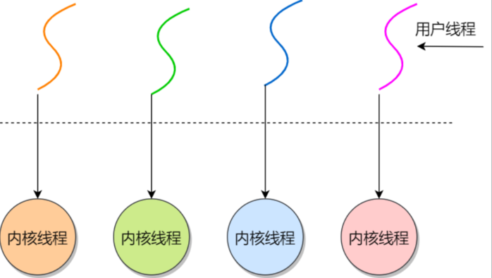

第三种是多对多的关系，也就是多个用户线程对应到多个内核线程：

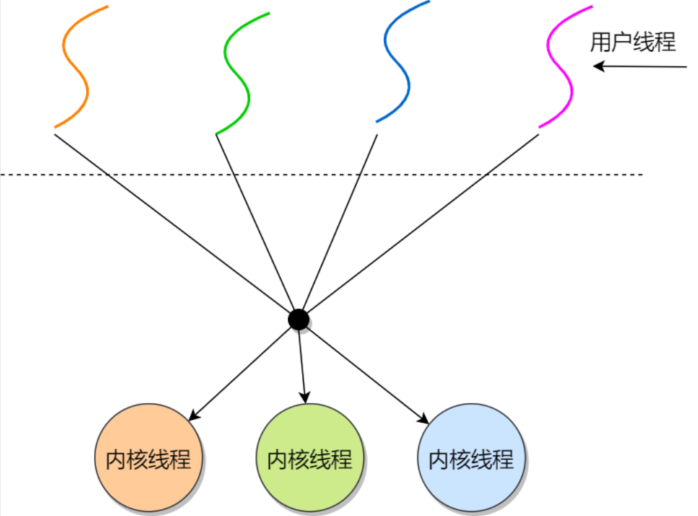

### 用户线程如何理解？存在什么优势和缺陷？

用户线程是基于用户态的线程管理库来实现的，那么线程控制块（Thread Control Block, TCB） 也是在库⾥面来实现的，对于操作系统而严是看不到这个 TCB 的，它只能看到整个进程的 PCB。

所以，用户线程的整个线程管理和调度，操作系统是不直接参与的，而是由用户级线程库函数来完成线程的管理，包括线程的创建、终⽌、同步和调度等。

用户级线程的模型，也就类似前面提到的多对一的关系，即`多个用户线程对应同一个内核线程`，如下图所示：

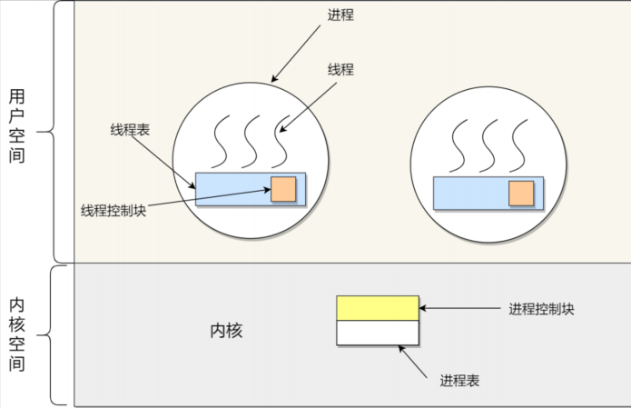

##### 用户线程的优点：

- 每个进程都需要有它私有的线程控制块（TCB）列表，用来跟踪记录它各个线程状态信息（PC、栈指针、寄存器），TCB 由用户级线程库函数来维护，可用于不⽀持线程技术的操作系统；
- 用户线程的切换也是由线程库函数来完成的，无需用户态与内核态的切换，所以速度特别 
  快；

##### 用户线程的缺点：

- 由于操作系统不参与线程的调度，如果一个线程发起了系统调用而阻塞，那进程所包含的用户线程都不能执行了。
- 当一个线程开始运行后，除非它主动地交出 CPU 的使用权，否则它所在的进程当中的其他线程无法运行，因为用户态的线程没法打断当前运行中的线程，它没有这个特权，只有操作系统才有，但是用户线程不是由操作系统管理的。
- 由于时间片分配给进程，故与其他进程比，在多线程执行时，每个线程得到的时间片较少，执行会比较慢；

### 内核线程如何理解？存在什么优势和缺陷？

内核线程是由操作系统管理的，线程对应的 TCB 自然是放在操作系统⾥的，这样线程的创建、终⽌和管理都是由操作系统负责。

内核线程的模型，也就类似前面提到的一对一的关系，即一个用户线程对应一个内核线程，

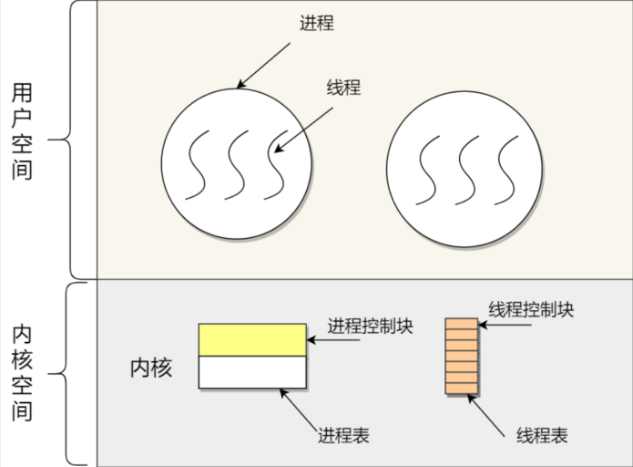

##### 内核线程的优点：

- 在一个进程当中，如果某个内核线程发起系统调用而被阻塞，并不会影响其他内核线程的运行；
- 分配给线程，多线程的进程获得更多的 CPU 运行时间； 

##### 内核线程的缺点：

- 在⽀持内核线程的操作系统中，由内核来维护进程和线程的上下文信息，如 PCB 和TCB；
- 线程的创建、终⽌和切换都是通过系统调用的方式来进行，因此对于系统来说，系统开销比较大；

### 轻量级进程如何理解

轻量级进程（Light-weight process，LWP）是内核⽀持的用户线程，一个进程可有一个或多个 LWP，每个 LWP 是跟内核线程一对一映射的，也就是 LWP 都是由一个内核线程⽀持。

另外，LWP 只能由内核管理并像普通进程一样被调度，Linux 内核是⽀持 LWP 的典型例子。 

在大多数系统中，LWP与普通进程的区别也在于它只有一个最小的执行上下文和调度程序所需的统计信息。一般来说，一个进程代表程序的一个实例，而 LWP 代表程序的执行线程，因为一个执行线程不像进程那样需要那么多状态信息，所以 LWP 也不带有这样的信息。

在 LWP 之上也是可以使用用户线程的，那么 LWP 与用户线程的对应关系就有三种：

> 1 : 1 ，即一个 LWP 对应 一个用户线程； 
> N : 1 ，即一个 LWP 对应多个用户线程； 
> M : N ，即多个 LMP 对应多个用户线程

## 3.14 常用线程模型

1. Future模型  （==QFuture 和 run==）

   - 该模型通常在使用的时候需要结合Callable接口配合使用。
   - Future是`把结果放在将来获取`，当前主线程并不急于获取处理结果。允许子线程先进行处理一段时间，处理结束之后就把结果保存下来，当主线程需要使用的时候再向子线程索取。
   - 使用Future模式便可以`省去全局变量`的使用，直接从线程中获取子线程处理结果

2. fork&join模型  （==Qt::Concurrent map那一堆==）

   - 该模型包含递归思想和回溯思想，递归用来拆分任务，回溯用合并结果。可以用来处理一些可以`进行拆分的大任务`。其主要是把一个大任务逐级拆分为多个子任务，然后分别在子线程中执行，当每个子线程执行结束之后逐级回溯，返回结果进行汇总合并，最终得出想要的结果。

   - 这里模拟一个摘苹果的场景：有100棵苹果树，每棵苹果树有10个苹果，现在要把他们摘下来。为了节约时间，规定每个线程最多只能摘10棵苹树以便于节约时间。各个线程摘完之后汇总计算总苹果树。

     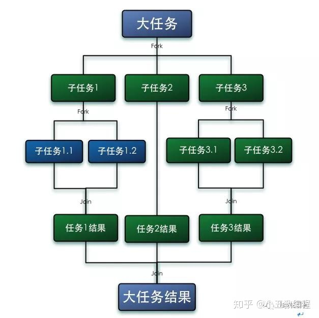

3. 生产者消费者模型   （新建线程任务放在==<u>**队列**</u>==就不管了）

   - 生产者消费者模型都比较熟悉，其核心是使用一个缓存来保存任务。`开启一个/多个线程来生产任务，然后再开启一个/多个来从缓存中取出任务进行处理。`这样的好处是任务的生成和处理分隔开，生产者不需要处理任务，只负责向生成任务然后保存到缓存。而消费者只需要从缓存中取出任务进行处理。使用的时候可以根据任务的生成情况和处理情况开启不同的线程来处理。比如，生成的任务速度较快，那么就可以灵活的多开启几个消费者线程进行处理，这样就可以避免任务的处理响应缓慢的问题。

4. master-worker模型

   - master-worker模型类似于任务分发策略，开启一个master线程接收任务，然后在master中根据任务的具体情况进行分发给其它worker子线程，然后由子线程处理任务。如需返回结果，则worker处理结束之后把处理结果返回给master。


## 3.15 [reactor模型组成](https://jishuin.proginn.com/p/763bfbd58a63)

### 线程模型1：传统阻塞 I/O 服务模型

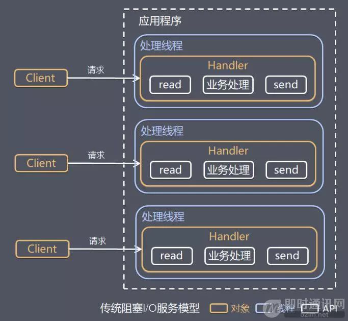

特点：

- 1）采用阻塞式 I/O 模型获取输入数据；
- 2）每个连接都需要独立的线程完成数据输入，业务处理，数据返回的完整操作。


存在问题：

- 1）当并发数较大时，需要创建大量线程来处理连接，`系统资源占用较大`；
- 2）连接建立后，如果当前线程暂时没有数据可读，则线程就阻塞在 Read 操作上，造成`线程资源浪费`。

### `线程模型2：Reactor 模式`

针对传统阻塞 I/O 服务模型的 2 个缺点，比较常见的有如下解决方案： 

- 1）基于 I/O 复用模型：多个连接共用一个阻塞对象，应用程序只需要在一个阻塞对象上等待，无需阻塞等待所有连接。当某条连接有新的数据可以处理时，操作系统通知应用程序，线程从阻塞状态返回，开始进行业务处理；
- 2）基于线程池复用线程资源：不必再为每个连接创建线程，将连接完成后的业务处理任务分配给线程进行处理，一个线程可以处理多个连接的业务。

`I/O 复用结合线程池`，这就是 Reactor 模式基本设计思想，如下图：


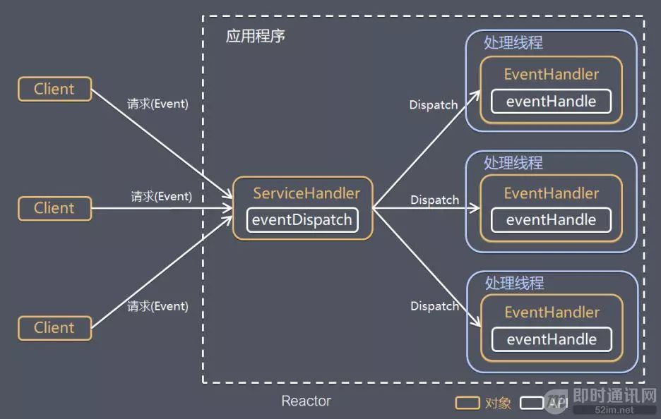	 

Reactor 模式，是指通过一个或多个输入同时传递给服务处理器的服务请求的`事件驱动处理模式`。 

服务端程序处理传入多路请求，并将它们同步分派给请求对应的处理线程，Reactor 模式也叫 `Dispatcher` 模式。

即 I/O 多了复用统一监听事件，收到事件后分发(Dispatch 给某进程)，是编写高性能网络服务器的必备技术之一。

Reactor 模式中有 2 个关键组成：

- 1）Reactor：Reactor 在一个单独的线程中运行，负责监听和分发事件，分发给适当的处理程序来对 IO 事件做出反应。它就像公司的电话接线员，它接听来自客户的电话并将线路转移到适当的联系人；	==接线员==

- 2）Handlers：处理程序执行 I/O 事件要完成的实际事件，类似于客户想要与之交谈的公司中的实际官员。Reactor 通过调度适当的处理程序来响应 I/O 事件，处理程序执行非阻塞操作。    ==事件处理程序==

  

reactor模型要求`主线程只负责监听文件描述上是否有事件发生`，有的话就立即将该事件通知工作线程，除此之外，主线程不做任何其他实质性的工作，读写数据、接受新的连接以及处理客户请求均在工作线程中完成。其模型组成如下：

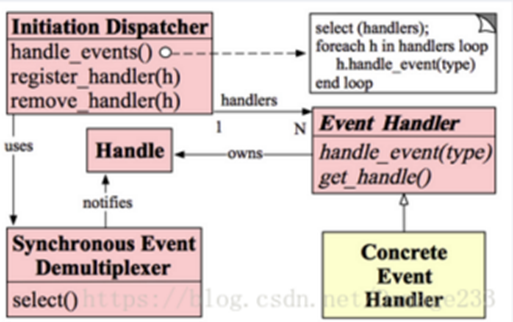

1. Handle：即操作系统中的句柄，是对资源在操作系统层面上的一种抽象，它可以是打开的文件、一个连接(Socket)、Timer等。由于Reactor模式一般使用在网络编程中，因而这里一般指Socket Handle，即一个网络连接。

2. Synchronous Event Demultiplexer（`同步事件复用器`）：阻塞等待一系列的Handle中的事件到来，如果阻塞等待返回，即表示在返回的Handle中可以不阻塞的执行返回的事件类型。这个模块一般使用操作系统的select来实现。

   >Select 是I/O 复用模型的标准网络编程 API，可以实现应用程序通过一个阻塞对象监听多路连接请求

3. Initiation Dispatcher：用于`管理Event Handler`，即EventHandler的容器，用以注册、移除EventHandler等；另外，它还作为Reactor模式的入口调用Synchronous Event Demultiplexer的select方法以阻塞等待事件返回，当阻塞等待返回时，根据事件发生的Handle将其分发给对应的Event Handler处理，即回调EventHandler中的handle_event()方法。

4. Event Handler：定义`事件处理方法`：handle_event()，以供InitiationDispatcher回调使用。

5. Concrete Event Handler：事件EventHandler接口，实现`特定事件处理逻辑`。


## 3.16 怎样确定当前线程是繁忙还是阻塞？

==使用ps命令查看==

  `ps`命令是Process Status的缩写，用来列出系统中当前运行的进程。使用该命令可以确定有哪些进程正在运行和运行的状态、进程是否结束、进程有没有僵死、哪些进程占用了过多的资源等等。ps命令所列出的进行是当前进程的快照，也就是并不是动态的，而是执行该命令时那一时刻进行的状态。而经常和ps一起结合使用的杀死进程的是`kill`命令。
  在我们的学习中我们知道，Linux的进程状态一般分为几种：

	>`R`(TASK_RUNNING，可执行状态)，这个进程是可运行的——要么它正在运行，要么在运行队列中等待运行；
	>
	>`S`(TASK_INTERRUPTIBLE，中断状态)，这个状态的进程因为等待某事件的发生（比如等待socket连接、等待信号量等）而被挂起，然后当这些事件发生或完成后，对应的等待队列中的一个或多个进程将被唤醒。
	>
	>`D`(TASK_UNINTERRUPTIBLE，不可中断状态)，在进程接收到信号时，不会被唤醒变成可运行的。除了这一点，该状态和TASK_INTERRUPTIBLE其他部分完全一样，这个状态通常用于进程必须不间断等待或者事件发生的频率很快，并且无法用kill命令关闭处于TASK_UNINTERRUPTIBLE状态的进程。
	>
	>`T`(TASK_STOPPED或TASK_TRACED，暂停状态或跟踪状态)，该状态表示该进程已经停止执行，并且不具有再次执行的条件。向进程发送一个SIGSTOP信号，它就会因响应该信号而进入TASK_STOPPED状态（除非该进程本身处于TASK_UNINTERRUPTIBLE状态而不响应信号）。而当进程正在被跟踪时，它处于TASK_TRACED状态。
	>
	>`Z`(TASK_DEAD或EXIT_ZOMBIE，退出状态)，进程在退出的过程中，处于TASK_DEAD状态，如果它的父进程没有收到SIGCHLD信号，故未调用wait（如wait4、waitid）处理函数等待子进程结束，又没有显式忽略该信号，它就一直保持EXIT_ZOMBIE状态。只要父进程不退出，这个EXIT_ZOMBIE状态的子进程就一直存在，这也就是所谓的"僵尸"进程。
	>
	>`X`(TASK_DEAD - EXIT_DEAD，退出状态)，进程即将被销毁。EXIT_DEAD状态是非常短暂的，几乎不可能通过ps命令捕捉到。


## 3.17 就绪状态的进程在等待什么？

==被调度使用cpu的运行权==

 

## 3.18 fork,wait,exec函数

父进程产生子进程使用fork拷贝出来一个父进程的副本，此时只拷贝了父进程的页表，两个进程都读同一块内存，当有进程写的时候使用写实拷贝机制分配内存，exec函数可以加载一个elf文件去替换父进程，从此父进程和子进程就可以运行不同的程序了。fork从父进程返回子进程的pid，从子进程返回0.调用了wait的父进程将会发生阻塞，直到有子进程状态改变,执行成功返回0，错误返回-1。exec执行成功则子进程从新的程序开始运行，无返回值，执行失败返回-1

 

## 3.19 fork和vfork的区别

### fork

- fork:创建一个和当前进程映像一样的进程可以通过fork( )系统调用：

```c++
#include <unistd.h>  
#include <stdio.h>
int main(){   
    pid_t fpid; //fpid表示fork函数返回的值  
    int count=0;  
    fpid=fork();   
    if (fpid < 0)   
        printf("error in fork!");   
    else if (fpid == 0) {  
        printf("i am the child process, my process id is %d/n",getpid());   
        printf("我是爹的儿子/n");//对某些人来说中文看着更直白。  
        count++;  
    }  
    else {  
        printf("i am the parent process, my process id is %d/n",getpid());   
        printf("我是孩子他爹/n");  
        count++;  
    }  
    printf("统计结果是: %d/n",count);  
    return 0;  
}  
```

- 成功调用fork()会创建一个新的进程，它几乎与调用fork( )的进程一模一样，这两个进程都会继续运行。在子进程中，成功的fork( )调用会返回0。在父进程中fork()返回子进程的pid。如果出现错误，fork()返回一个负值。
- `最常见的fork()用法是创建一个新的进程，然后使用exec()载入二进制映像，替换当前进程的映像`。这种情况下，派生（fork）了新的进程，而这个子进程会执行一个新的二进制可执行文件的映像。这种“`派生加执行`”的方式是很常见的。
- ==写时拷贝==：当任意一个进程试图修改共享空间中的数据，操作系统就会将需要修改的数据所在的页直接拷一份出来。 
- 内核只为新生成的子进程创建虚拟空间结构，它们复制于父进程的虚拟空间结构，但是不为这些段分配物理内存，它们共享父进程的物理空间，当父子进程中有更改相应的段的行为发生时，再为子进程相应的段分配物理空间。

### fork失败的主要原因：

1. 当前系统的进程数已经达到了系统规定的上限，这时 errno 的值被设置为 EAGAIN  ==（进程数上限）==
2. 系统内存不足，这时errno的值被设置为ENOMEM  ==（内存不足）==

### vfork

- 在实现写时复制之前，Unix的设计者们就一直很关注`在fork后立刻执行exec所造成的地址空间的浪费`。BSD的开发者们在3.0的BSD系统中引入了vfork( )系统调用。

```c++
#include <sys/types.h>
#include <unistd.h>

pid_t vfork(void);
```

- 除了子进程必须要立刻执行一次对exec的系统调用，或者调用_exit( )退出，对vfork( )的成功调用所产生的结果和fork( )是一样的。vfork( )会挂起父进程`直到子进程终止或者运行了一个新的可执行文件的映像`。通过这样的方式，vfork( )避免了地址空间的按页复制。在这个过程中，父进程和子进程共享相同的地址空间和页表项。实际上vfork( )只完成了一件事：复制内部的内核数据结构。因此，子进程也就不能修改地址空间中的任何内存。
- ==意思是 vfork的唯一好处就是避免了父进程映像的拷贝，要想使用仍然需要调用exec();==

### fork和vfork的区别：

1.  fork( )的子进程拷贝父进程的`数据段和代码段`；vfork( )的子进程与父进程共享`数据段`
2. fork( )的父子进程的`执行次序不确定`；vfork( )保证`子进程先运行`，在调用exec或exit之前与父进程数据是共享的，在它调用exec或exit之后父进程才可能被调度运行。
3. vfork( )保证子进程先运行，在它调用exec或exit之后父进程才可能被调度运行。如果在调用这两个函数之前子进程依赖于父进程的进一步动作，则会导致死锁。
4. 当需要改变共享数据段中变量的值，则拷贝父进程。

> 为什么会有vfork，因为以前的fork 很傻， 它创建一个子进程时，将会创建一个新的地址空间，并且==拷贝==父进程的资源，<u>而往往在子进程中会执行exec 调用，这样，前面的拷贝工作就是白费力气了</u>，这种情况下，聪明的人就想出了`vfork`，它产生的子进程`刚开始暂时与父进程共享地址空间`（其实就是线程的概念了），因为这时候子进程在父进程的地址空间中运行，所以子进程`不能进行写`操作，并且在儿子 霸占”着老子的房子时候，要委屈老子一下了,让他在外面歇着（`阻塞`），一旦儿子执行了exec 或者exit 后，相 于儿子买了自己的房子了，这时候就相 于分家了。

## 3.20 手写一下fork调用示例

1. 概念：

   Fork：创建一个和当前进程映像一样的进程可以通过fork( )系统调用：

   成功调用fork( )会创建一个新的进程，它几乎与调用fork( )的进程一模一样，这两个进程都会继续运行。在子进程中，成功的fork( )调用会返回0。在父进程中fork( )返回子进程的pid。如果出现错误，fork( )返回一个负值。

   最常见的fork( )用法是创建一个新的进程，然后使用exec( )载入二进制映像，替换当前进程的映像。这种情况下，派生（fork）了新的进程，而这个子进程会执行一个新的二进制可执行文件的映像。这种“派生加执行”的方式是很常见的。

2. fork实例

```c++
#include <sys/types.h>
#include <unistd.h>
#include <stdio.h>

int main() {

    int num = 10;

    // 创建子进程
    pid_t pid = fork();

    // 判断是父进程还是子进程
    if(pid > 0) {
        // printf("pid : %d\n", pid);
        // 如果大于0，返回的是创建的子进程的进程号，当前是父进程
        printf("i am parent process, pid : %d, ppid : %d\n", getpid(), getppid());

        printf("parent num : %d\n", num);
        num += 10;
        printf("parent num += 10 : %d\n", num);


    } else if(pid == 0) {
        // 当前是子进程
        printf("i am child process, pid : %d, ppid : %d\n", getpid(),getppid());
       
        printf("child num : %d\n", num);
        num += 100;
        printf("child num += 100 : %d\n", num);
    }

    // for循环    //无pid判断 父子进程都执行
    for(int i = 0; i < 3; i++) {
        printf("i : %d , pid : %d\n", i , getpid());
        sleep(1);
    }

    return 0;
}
```

## 3.21 GDB多线程调试

- 使用 GDB 调试的时候，GDB 默认只能跟踪一个进程，可以在 fork 函数调用之前，通过指令设置 GDB 调试工具跟踪父进程或者是跟踪子进程，默认跟踪父进程。
- 设置调试父进程或者子进程：`set follow-fork-mode [parent（默认）| child]`
- 设置调试模式：set detach-on-fork [on | off]   默认为 on，表示调试当前进程的时候，其它的进程继续运行，如果为 off，调试当前进程的时候，其它进程被 GDB 挂起。

- 查看调试的进程：info inferiors
- 切换当前调试的进程：inferior id
- 使进程脱离 GDB 调试：detach inferiors id


## 3.22 exec函数族

### exec 函数族介绍

-  exec 函数族的作用是根据指定的文件名找到可执行文件，并用它来`取代调用进程的内容`，换句话说，就是在<u>调用进程内部执行一个可执行文件</u>。

- exec 函数族的函数执行成功后不会返回，因为调用进程的实体，包括代码段，数据段和堆栈等都已经被新的内容取代，只留下进程 ID 等一些表面上的信息仍保持原样，颇有些神似“三十六计”中的“金蝉脱壳”。看上去还是旧的躯壳，却已经注入了新的灵魂。只有调用失败了，它们才会返回 -1，从原程序的调用点接着往下执行。

```c++
// hello.c  -> hello.out
#include <stdio.h>
int main() {    
    printf("hello, world\n");
    return 0;
}

// execl.c
#include <unistd.h>
#include <stdio.h>

int main() {
    // 创建一个子进程，在子进程中执行exec函数族中的函数
    pid_t pid = fork();

    if(pid > 0) {
        // 父进程
        printf("i am parent process, pid : %d\n",getpid());
        sleep(1);
    }else if(pid == 0) {
        // 子进程
        // execl("hello","hello",NULL);  //执行hello.out程序， 输出hello, world

        execl("/bin/ps", "ps", "aux", NULL);  //执行操作系统的 ps命令
      	execlp("ps", "ps", "aux", NULL); //execlp可以从环境变量中查找 不需要指定路径
        // perror("execl");  //execl路径错误会输出错误信息
        printf("i am child process, pid : %d\n", getpid());
    }
    for(int i = 0; i < 3; i++) {
        printf("i = %d, pid = %d\n", i, getpid());
    }
    return 0;
}
```

## 3.23 僵尸进程和孤儿进程

- 正常进程

  1. 正常情况下，子进程是通过父进程创建的，子进程再创建新的进程。`子进程的结束和父进程的运行是一个异步过程`，即`父进程永远无法预测子进程到底什么时候结束`。 当一个进程完成它的工作终止之后，它的父进程需要调用wait()或者waitpid()系统调用取得子进程的终止状态。

  2. unix提供了一种机制可以保证只要父进程想知道子进程结束时的状态信息， 就可以得到：在每个进程退出的时候，内核释放该进程所有的资源，包括打开的文件，占用的内存等。 但是仍然为其保留一定的信息，直到父进程通过wait / waitpid来取时才释放。保存信息包括：

     >1`进程号`the process ID
     >
     >2`退出状态`the termination status of the process
     >
     >3`运行时间`the amount of CPU time taken by the process等


- ==孤儿==进程

  一个父进程退出，而它的一个或多个子进程还在运行，那么那些子进程将成为孤儿进程。`孤儿进程将被init进程(进程号为1)所收养`，并由init进程对它们完成状态收集工作。

- ==僵尸==进程

  1. 一个进程使用fork创建子进程，<u>如果子进程退出，而父进程并没有调用wait或waitpid获取子进程的状态信息，那么子进程的进程描述符仍然保存在系统中。这种进程称之为僵尸进程</u>。
  2. 僵尸进程是一个进程==必然==会经过的过程：这是每个子进程在结束时都要经过的阶段。
  3. 如果子进程在exit()之后，父进程没有来得及处理，这时用ps命令就能看到子进程的状态是“Z”。如果父进程能及时处理，可能用ps命令就来不及看到子进程的僵尸状态，但这并不等于子进程不经过僵尸状态。
  4. 如果父进程在子进程结束之前退出，则子进程将由`init`接管。init将会以父进程的身份对僵尸状态的子进程进行处理。

  - 危害：

    <u>如果进程不调用wait / waitpid的话， 那么保留的那段信息就不会释放，其进程号就会一直被占用，但是系统所能使用的进程号是有限的，如果大量的产生僵死进程，将因为没有可用的进程号而导致系统不能产生新的进程</u>

  - `外部消灭`：

    通过kill发送sig_term或者sig_kill信号消灭产生僵尸进程的父进程，它产生的僵尸进程就变成了孤儿进程，这些孤儿进程会被init进程接管，init进程会wait()这些孤儿进程，释放它们占用的系统进程表中的资源 （==杀死僵尸的爹，让它变成孤儿==）

  - `内部解决`：

    1. 子进程退出时向父进程发送sig_child信号，<u>父进程处理sig_child信号</u>。在信号处理函数中调用wait进行处理僵尸进程。

       （==告诉你一声我要结束了，来处理我==）

    2. fork两次，原理是将子进程成为孤儿进程，从而其的父进程变为init进程，通过init进程可以处理僵尸进程。 

       > 父->子->孙
       >
       > 子->exit 在父进程中立刻wait_pid回收子进程
       
       （==创建时fork两次，然后退出第一个子进程，孙子就变成了孤儿==

## 3.24 守护进程

###  守护进程

- 守护进程（Daemon Process），也就是通常说的 Daemon 进程（精灵进程），是`Linux 中的后台服务进程`。它是一个生存期较长的进程，<u>通常独立于控制终端并且周期性地执行某种任务或等待处理某些发生的事件</u>。一般采用以 d 结尾的名字。
- 守护进程具备下列特征：
  - `生命周期很长`，守护进程会在系统启动的时候被创建并一直运行直至系统被关闭。
  - 它`在后台运行并且不拥有控制终端`。没有控制终端确保了内核永远不会为守护进程自动生成任何控制信号以及终端相关的信号（如 SIGINT、SIGQUIT）。
- Linux 的大多数服务器就是用守护进程实现的。比如，Internet 服务器 inetd，Web 服务器 httpd 等。


###  守护进程的创建步骤

1. 执行一个 fork()，之后父进程退出，子进程继续执行。

   > 关机 僵尸进程就不在了 因为开机时始终运行 所以僵尸无所谓

2. 子进程调用 setsid() 开启一个新会话。

   > setsid 脱离父进程的sessionid 进程组id 和打开的终端

3. 清除进程的 umask 以确保当守护进程创建文件和目录时拥有所需的权限。

   > 在类unix系统中，umask是确定掩码设置的命令，该掩码控制如何为新创建的文件设置文件权限。
   >
   > umask确定了文件创建时的初始权限,(文件或目录权限为文件目录默认权限减去umask得到初始文件权限，文件初始默认权限为0666，目录为0777,若用户umask为0002,则新创建的文件或目录在没有指定的情况下默认权限分别为0664,0775)
   >
   > 给定进程的权限掩码,用于改变创建文件的权限

4. 修改进程的当前工作目录，通常会改为根目录（/）。

5. 关闭守护进程从其父进程继承而来的所有打开着的`文件描述符`。

6. 在关闭了文件描述符0、1、2之后，守护进程通常会打开/dev/null 并使用dup2() 使所有这些描述符指向这个设备。

   > stdin stdout stderror

7. 核心业务逻辑

> 守护进程 是linux下的==后台服务进程==
>
> 例如：写一个守护进程，每隔2s获取一下系统时间，将这个时间写入到磁盘文件中。

# 4. 进程间通信方式 必考

## 进程间通讯概念

◼ 进程是一个独立的资源分配单元，不同进程（这里所说的进程通常指的是用户进程）之间的资源是独立的，没有关联，不能在一个进程中直接访问另一个进程的资源。

◼ 但是，进程不是孤立的，不同的进程需要进行信息的交互和状态的传递等，因此需要进程间通信( IPC：Inter Processes Communication )。 

◼ 进程间通信的目的：

- 数据传输：一个进程需要将它的数据发送给另一个进程。
- 通知事件：一个进程需要向另一个或一组进程发送消息，通知它（它们）发生了某种事件（如进程终止时要通知父进程）。
- 资源共享：多个进程之间共享同样的资源。为了做到这一点，需要内核提供互斥和同步机制。
- 进程控制：有些进程希望完全控制另一个进程的执行（如 Debug 进程），此时控制
- 进程希望能够拦截另一个进程的所有陷入和异常，并能够及时知道它的状态改变

## **进程间通信的方式：**

进程间通信主要包括`管道`、`内存映射` 系统IPC（包括`消息队列`、`信号量`、`信号`、`共享内存`等）、以及套接字socket。


### 管道：

- 管道主要包括无名管道和命名管道:

  > 普通(匿名)管道可用于具有亲缘关系的父子进程间的通信，
  >
  > 有名管道除了具有管道所具有的功能外，它还允许无亲缘关系进程间的通信

##### 管道的特点

- 管道其实是一个在`内核内存`中维护的`缓冲器`，这个缓冲器的存储`能力是有限`的，不同的操作系统大小不一定相同。

- 管道拥有文件的特质：`读`操作、`写`操作，<u>匿名管道没有文件实体</u>，<u>有名管道有文件实体</u>，但不存储数据。可以按照操作文件的方式对管道进行操作。

- 一个管道是一个`字节流`，使用管道时不存在消息或者消息边界的概念，从管道读取数据的进程可以读取任意大小的数据块，而不管写入进程写入管道的数据块的大小是多少。

- 通过管道传递的`数据是顺序`的，从管道中读取出来的字节的顺序和它们被写入管道的顺序是完全一样的。

- 在管道中的数据的传递方向是单向的，一端用于写入，一端用于读取，具有`固定的读端和写端`，管道是`半双工`的。

- 从管道读数据是`一次性操作`，数据一旦被读走，它就从管道中被抛弃，释放空间以便写更多的数据，在管道中无法使用 lseek() 来随机的访问数据。

- 匿名管道只能在`有亲缘关系的进程之间`（父进程与子进程，或者两个兄弟进程，具有亲缘）    <u>==（父亲或兄弟）==</u>

  

### 普通(匿名)管道PIPE：

###### 特点

1. 它是`半双工`的（即数据只能在一个方向上流动），具有`固定的读端和写端`    ==（指定方向的queue）==
2. 它只能用于具`有亲缘关系的进程之间`的通信（也是父子进程或者兄弟进程之间） ==（父亲或兄弟）==
3. 它可以看成是一种特殊的文件，对于它的读写也可以使用普通的read、write等函数。但是它不是普通的文件，并不属于其他任何文件系统，并且`只存在于内存，没有文件实体`中。   ==（特殊的，存在于内存中的文件）==

###### 相关接口：

- int pipe(int fd[2]);
  - fd[2]：管道两端用fd[0]和fd[1]来描述，读的一端用fd[0]表示，写的一端用fd[1]表示。通信双方的进程中写数据的一方需要把fd[0]先close掉，读的一方需要先把fd[1]给close掉。

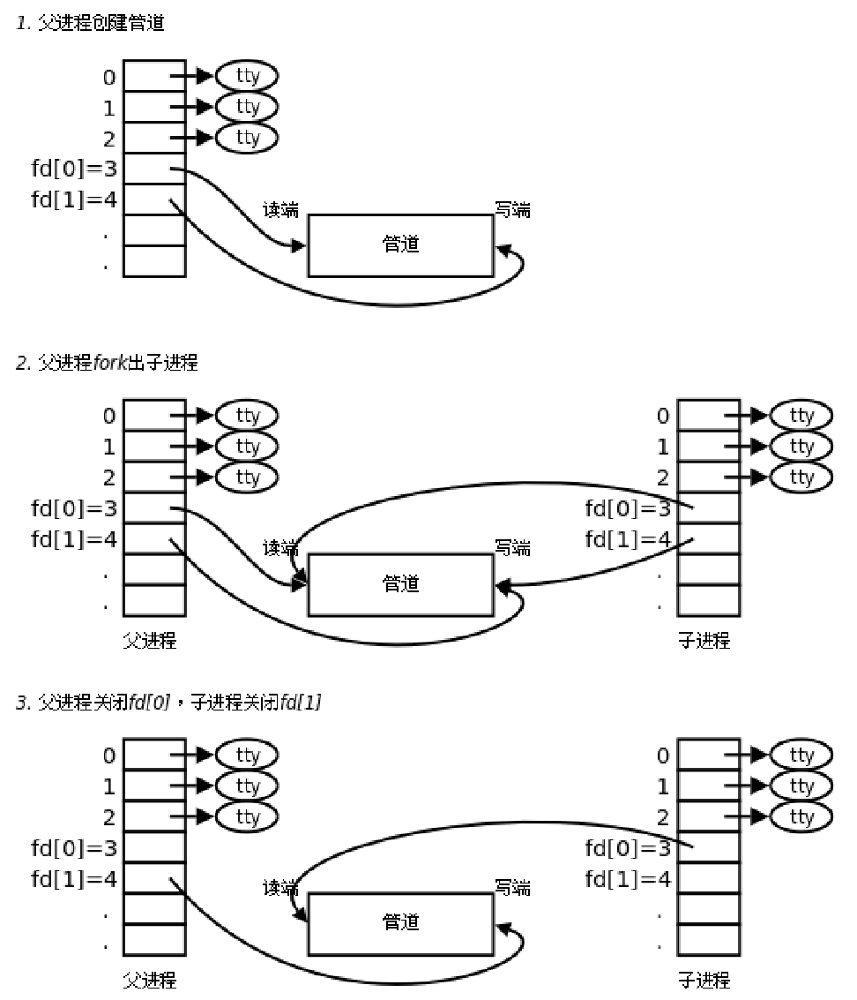

`上图可以看出亲缘关系 两个文件实现 数据的队列传输`

```c++
int main(){
    int fd[2]; // 定义文件描述符   0为读 1为写
    pid_t pid;
    char str[1024] = "hello\n";
    char buf[1024];
    if (pipe(fd) < 0) // 创建管道，成功返回0，失败返回-1
    {
        perror("pipe");
        exit(1);
    }
    pid = fork(); // 创建一个子进程
    // 功能：父写子读
    if (pid > 0) // 父进程
    {
        close(fd[0]); // 父进程关闭读端
        sleep(2);
        write(fd[1], str, strlen(str)); // 向管道里写数据
        wait(NULL); // 回收子进程
    }
    else if (pid == 0) // 子进程
    {
        close(fd[1]); // 子进程关闭写端
        int len = read(fd[0], buf, sizeof(buf)); // 从管道里读数据
        write(STDOUT_FILENO, buf, len); // 把读到的数据写到标准输出
    }
    else // 创建子进程失败
    {
        perror("fork");
        exit(1);
    }
    return 0;
}
```

### 命名管道FIFO： ==（仍然为 单向 半双工）==

###### 有名管道特点：

- 有名管道是FIFO文件，`存在于文件系统中`，可以通过文件路径名来指出。
- 有名管道`可以在不具有亲缘`关系的进程间进行通信。

###### 相关接口：

- int mkfifo(const char *pathname, mode_t mode);
  - pathname：即将创建的FIFO文件路径，如果文件存在需要先删除。
  - mode：和open()中的参数相同。

```c++
//write
    int fd;  
    int ret;      
    ret = mkfifo("my_fifo", 0666); // 创建命名管道  ret!=0创建成功
    fd = open("my_fifo", O_WRONLY); // 写  >0 open success
    char send[100] = "Hello World";  
    write(fd, send, strlen(send));  // 写数据  
    printf("write to my_fifo buf=%s\n",send);  
    while(1); // 阻塞，保证读写进程保持着通信过程
    close(fd);

//read
    int fd;  
    int ret;      
    ret = mkfifo("my_fifo", 0666); // 创建命名管道  
    fd = open("my_fifo", O_RDONLY); // 等着只写  
    while(1) {  
        char recv[100] = {0};
        read(fd, recv, sizeof(recv)); // 读数据  
        printf("read from my_fifo buf=[%s]\n", recv);  
        sleep(1);  
    }
    close(fd);
```

### 内存映射

内存映射(mapped memory)：内存映射允许`任何多个进程间`通信，每一个使用该机制的进程通过`把一个共享的文件`映射到自己的`进程地址空间`来实现它，用户通过修改内存就能修改磁盘文件  （==<u>映射到`虚拟地址空间`, 可以是实现没有关系的进程间的通信</u>==） 

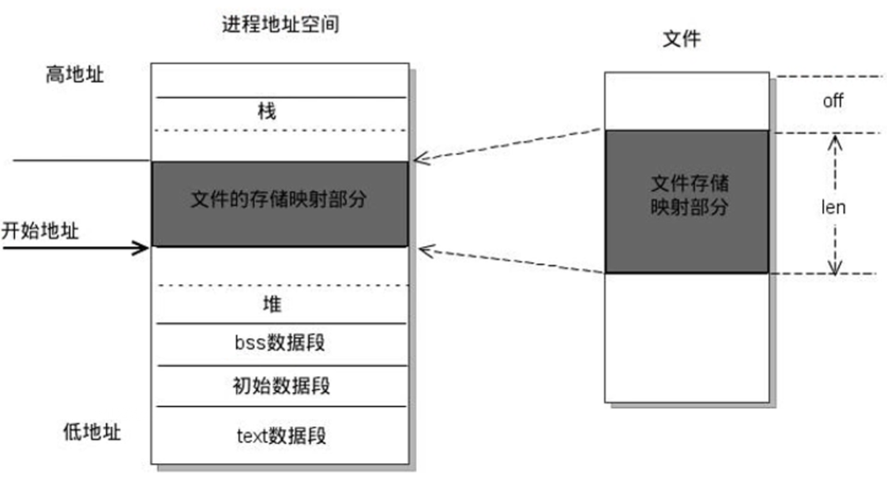

```c++
/*
    #include <sys/mman.h>
    void *mmap(void *addr, size_t length, int prot, int flags,int fd, off_t offset);
        - 功能：将一个文件或者设备的数据映射到内存中
        - 参数：
            - void *addr: NULL, 由内核指定
            - length : 要映射的数据的长度，这个值不能为0。建议使用文件的长度。
                    获取文件的长度：stat lseek
            - prot : 对申请的内存映射区的操作权限
                -PROT_EXEC ：可执行的权限
                -PROT_READ ：读权限
                -PROT_WRITE ：写权限
                -PROT_NONE ：没有权限
                要操作映射内存，必须要有读的权限。
                PROT_READ、PROT_READ|PROT_WRITE
            - flags :
                - MAP_SHARED : 映射区的数据会自动和磁盘文件进行同步，进程间通信，必须要设置这个选项
                - MAP_PRIVATE ：不同步，内存映射区的数据改变了，对原来的文件不会修改，会重新创建一个新的文件。（copy on write）
            - fd: 需要映射的那个文件的文件描述符
                - 通过open得到，open的是一个磁盘文件
                - 注意：文件的大小不能为0，open指定的权限不能和prot参数有冲突。
                    prot: PROT_READ                open:只读/读写 
                    prot: PROT_READ | PROT_WRITE   open:读写
            - offset：偏移量，一般不用。必须指定的是4k的整数倍，0表示不便宜。
        - 返回值：返回创建的内存的首地址
            失败返回MAP_FAILED，(void *) -1

    int munmap(void *addr, size_t length);
        - 功能：释放内存映射
        - 参数：
            - addr : 要释放的内存的首地址
            - length : 要释放的内存的大小，要和mmap函数中的length参数的值一样。
*/

/*
    使用内存映射实现进程间通信：
    1.有关系的进程（父子进程）
        - 还没有子进程的时候
            - 通过唯一的父进程，先创建内存映射区
        - 有了内存映射区以后，创建子进程
        - 父子进程共享创建的内存映射区
    
    2.没有关系的进程间通信
        - 准备一个大小不是0的磁盘文件
        - 进程1 通过磁盘文件创建内存映射区
            - 得到一个操作这块内存的指针
        - 进程2 通过磁盘文件创建内存映射区
            - 得到一个操作这块内存的指针
        - 使用内存映射区通信

    注意：内存映射区通信，是非阻塞。
*/

#include <stdio.h>
#include <sys/mman.h>
#include <fcntl.h>
#include <sys/types.h>
#include <unistd.h>
#include <string.h>
#include <stdlib.h>
#include <wait.h>

// 作业:使用内存映射实现没有关系的进程间的通信。
int main() {
    // 1.打开一个文件
    int fd = open("test.txt", O_RDWR);
    int size = lseek(fd, 0, SEEK_END);  // 获取文件的大小

    // 2.创建内存映射区
    void *ptr = mmap(NULL, size, PROT_READ | PROT_WRITE, MAP_SHARED, fd, 0);
    if(ptr == MAP_FAILED) {
        perror("mmap");
        exit(0);
    }

    // 3.创建子进程
    pid_t pid = fork();
    if(pid > 0) {
        wait(NULL);
        // 父进程
        char buf[64];
        strcpy(buf, (char *)ptr);
        printf("read data : %s\n", buf);
       
    }else if(pid == 0){
        // 子进程
        strcpy((char *)ptr, "nihao a, son!!!");
    }

    // 关闭内存映射区
    munmap(ptr, size);
    return 0;
}
```

### 消息队列

- 消息队列，是消息的链接表，存放在内核中。一个消息队列由一个标识符（即队列ID）来标记。 (消息队列`克服了信号传递信息少`，`管道只能承载无格式字节流`以及`缓冲区大小受限`等特点) 具有写权限得进程可以按照一定得规则向消息队列中添加新信息；对消息队列有读权限得进程则可以从消息队列中读取信息；

  特点：

  1. 消息队列是面向记录的，其中的消息具有特定的`格式`以及特定的`优先级`。
  2. 消息队列独立于发送与接收进程。进程`终止`时，消息队列及其内容并`不会被删除`。 释放或者关闭操作系统
  3. 消息队列可以实现消息的`随机查询`,<u>消息不一定要以先进先出的次序读取,也可以按消息的类型读取</u>。
  
- 缺点：

  - 消息这种模型，两个进程之间的通信就像平时发邮件一样，你来一封，我回一封，可以频繁沟通了。但邮件的通信方式存在不足的地方有两点，一是`通信不及时`，⼆是`附件也有大小限制`，这同样也是消息队列通信不足的点。
  - 消息队列不适合比较大数据的传输  在 Linux 内核中，会有两个宏定义MSGMAX 和 MSGMNB，它们以字节为单位，分别定义了`一条消息的最大长度`和`一个队列的最大长度`。
  - 消息队列通信过程中，存在用户态与内核态之间的数据拷贝开销。

### 信号 (<u>kill</u>)

> 对于异常情况下的⼯作模式，就需要用「信号」的方式来通知进程
>
> 信号是进程间通信机制中唯一的异步通信机制
>
> 用户进程对信号的处理方式：
>
> - 执行默认操作：Linux 对每种信号都规定了默认操作，例如，上面列表中的 SIGTERM 信号，就是终⽌进程的意思。
> - 捕捉信号：我们可以为信号定义一个信号处理函数。当信号发⽣时，我们就执行相应的信号处理函数。
> - 忽略信号：除了SIGKILL 和 SEGSTOP，其他信号都可以忽略，不做任何处理

- 信号是 Linux 进程间通信的`最古老的方式之一`，是事件发生时对进程的通知机制，有时也称之为`软件中断`，它是在软件层次上对中断机制的一种模拟，是一种异步通信的方式。信号可以导致一个正在运行的进程被另一个正在运行的异步进程中断，转而处理某一个突发事件。

- 发往进程的诸多信号，通常都是源于内核。引发内核为进程产生信号的各类事件如下：
  - 对于前台进程，用户可以通过输入特殊的终端字符来给它发送信号。比如输入Ctrl+C `SIGINT`通常会给进程发送一个中断信号。
  - 硬件发生异常，即硬件检测到一个错误条件并通知内核，随即再由内核发送相应信号给相关进程。比如执行一条异常的机器语言指令，诸如被 0 除，或者引用了无法访问的内存区域。
  - 系统状态变化，比如 alarm 定时器到期将引起 SIGALRM 信号，进程执行的 CPU 时间超限，或者该进程的某个子进程退出。
  - 运行 kill 命令或调用 kill 函数。

- 使用信号的两个主要目的是：

  - 让进程知道已经发生了一个特定的事情。

  - 强迫进程执行它自己代码中的信号处理程序。

- 信号的特点： 
  - `简单` 
  - `不能携带大量信息`
  - `满足某个特定条件才发送`
  - `优先级比较高`

- 查看系统定义的信号列表：kill –l 
- 前 31 个信号为常规信号，其余为实时信号。

##### 信号相关的几个函数

##### `信号发生`

```c++
/*  #include <sys/types.h>
    #include <signal.h>

    int kill(pid_t pid, int sig);
        - 功能：给任何的进程或者进程组pid, 发送任何的信号 sig
        - 参数：
            - pid ：
                > 0 : 将信号发送给指定的进程
                = 0 : 将信号发送给当前的进程组
                = -1 : 将信号发送给每一个有权限接收这个信号的进程
                < -1 : 这个pid=某个进程组的ID取反 （-12345）
            - sig : 需要发送的信号的编号或者是宏值，0表示不发送任何信号

        kill(getppid(), 9);
        kill(getpid(), 9);
        
    int raise(int sig);
        - 功能：给当前进程发送信号
        - 参数：
            - sig : 要发送的信号
        - 返回值：
            - 成功 0
            - 失败 非0
        kill(getpid(), sig);   

    void abort(void);
        - 功能： 发送SIGABRT信号给当前的进程，杀死当前进程
        kill(getpid(), SIGABRT); 
        
   	unsigned int alarm(unsigned int seconds);
        - 功能：设置定时器（闹钟）。函数调用，开始倒计时，当倒计时为0的时候，
                函数会给当前的进程发送一个信号：SIGALARM
        - 参数：
            seconds: 倒计时的时长，单位：秒。如果参数为0，定时器无效（不进行倒计时，不发信号）。
                    取消一个定时器，通过alarm(0)。
        - 返回值：
            - 之前没有定时器，返回0
            - 之前有定时器，返回之前的定时器剩余的时间

    	- SIGALARM ：默认终止当前的进程，每一个进程都有且只有唯一的一个定时器。
        	alarm(10);  -> 返回0
        	过了1秒
            alarm(5);   -> 返回9
            alarm(100) -> 该函数是不阻塞的            
    
    int setitimer(int which, const struct itimerval *new_value,
                        struct itimerval *old_value);
    
        - 功能：设置定时器（闹钟）。可以替代alarm函数。精度微妙us，可以实现周期性定时
        - 参数：
            - which : 定时器以什么时间计时
              ITIMER_REAL: 真实时间，时间到达，发送 SIGALRM   常用
              ITIMER_VIRTUAL: 用户时间，时间到达，发送 SIGVTALRM
              ITIMER_PROF: 以该进程在用户态和内核态下所消耗的时间来计算，时间到达，发送 SIGPROF

            - new_value: 设置定时器的属性
            
                struct itimerval {      // 定时器的结构体
                struct timeval it_interval;  // 每个阶段的时间，间隔时间
                struct timeval it_value;     // 延迟多长时间执行定时器
                };

                struct timeval {        // 时间的结构体
                    time_t      tv_sec;     //  秒数     
                    suseconds_t tv_usec;    //  微秒    
                };

            过10秒后，每个2秒定时一次
           
            - old_value ：记录上一次的定时的时间参数，一般不使用，指定NULL
        
        - 返回值：
            成功 0
            失败 -1 并设置错误号
*/

#include <stdio.h>
#include <sys/types.h>
#include <signal.h>
#include <unistd.h>

int main() {
    pid_t pid = fork();

    if(pid == 0) {
        // 子进程
        int i = 0;
        for(i = 0; i < 5; i++) {
            printf("child process\n");
            sleep(1);
        }

    } else if(pid > 0) {
        // 父进程
        printf("parent process\n");
        sleep(2);
        printf("kill child process now\n");
        kill(pid, SIGINT);
    }

    return 0;
}

```

##### `信号捕捉`

> ==signal(SIGALRM, myalarm);==

```c++
/*
    #include <signal.h>
    typedef void (*sighandler_t)(int);
    sighandler_t signal(int signum, sighandler_t handler);
        - 功能：设置某个信号的捕捉行为
        - 参数：
            - signum: 要捕捉的信号
            - handler: 捕捉到信号要如何处理
                - SIG_IGN ： 忽略信号
                - SIG_DFL ： 使用信号默认的行为
                - 回调函数 :  这个函数是内核调用，程序员只负责写，捕捉到信号后如何去处理信号。
                回调函数：
                    - 需要程序员实现，提前准备好的，函数的类型根据实际需求，看函数指针的定义
                    - 不是程序员调用，而是当信号产生，由内核调用
                    - 函数指针是实现回调的手段，函数实现之后，将函数名放到函数指针的位置就可以了。

        - 返回值：
            成功，返回上一次注册的信号处理函数的地址。第一次调用返回NULL
            失败，返回SIG_ERR，设置错误号
            
    SIGKILL SIGSTOP不能被捕捉，不能被忽略。
*/

#include <sys/time.h>
#include <stdio.h>
#include <stdlib.h>
#include <signal.h>

void myalarm(int num) {
    printf("捕捉到了信号的编号是：%d\n", num);
    printf("xxxxxxx\n");
}

// 过3秒以后，每隔2秒钟定时一次
int main() {

    // 注册信号捕捉
    // signal(SIGALRM, SIG_IGN);
    // signal(SIGALRM, SIG_DFL);
    // void (*sighandler_t)(int); 函数指针，int类型的参数表示捕捉到的信号的值。
    signal(SIGALRM, myalarm);

    struct itimerval new_value;

    // 设置间隔的时间
    new_value.it_interval.tv_sec = 2;
    new_value.it_interval.tv_usec = 0;

    // 设置延迟的时间,3秒之后开始第一次定时
    new_value.it_value.tv_sec = 3;
    new_value.it_value.tv_usec = 0;

    int ret = setitimer(ITIMER_REAL, &new_value, NULL); // 非阻塞的
    printf("定时器开始了...\n");

    if(ret == -1) {
        perror("setitimer");
        exit(0);
    }

    getchar();

    return 0;
}
```

##### `SIGCHLD信号`

**产生条件：**

1. 子进程结束
2. 子进程暂停了
3. 子进程继续运行

<u>都会给父进程发送该信号，父进程默认忽略该信号。</u>

使用SIGCHLD信号`解决僵尸进程`的问题。

```c++
#include <stdio.h>
#include <unistd.h>
#include <sys/types.h>
#include <sys/stat.h>
#include <signal.h>
#include <sys/wait.h>

void myFun(int num) {
    printf("捕捉到的信号 ：%d\n", num);
    // 回收子进程PCB的资源
    // while(1) {
    //     wait(NULL); 
    // }
    while(1) {
       int ret = waitpid(-1, NULL, WNOHANG);  //设置非阻塞
       if(ret > 0) {
           printf("child die , pid = %d\n", ret);
       } else if(ret == 0) {
           // 说明还有子进程或者
           break;
       } else if(ret == -1) {
           // 没有子进程
           break;
       }
    }
}

int main() {
    // 提前设置好阻塞信号集，阻塞SIGCHLD，因为有可能子进程很快结束，父进程还没有注册完信号捕捉
    sigset_t set;
    sigemptyset(&set);
    sigaddset(&set, SIGCHLD);
    sigprocmask(SIG_BLOCK, &set, NULL);

    // 创建一些子进程
    pid_t pid;
    for(int i = 0; i < 20; i++) {
        pid = fork();
        if(pid == 0) {
            break;  //子进程就不要再for循环 创建进程了
        }
    }

    if(pid > 0) {
        // 捕捉子进程死亡时发送的SIGCHLD信号
        struct sigaction act;
        act.sa_flags = 0;
        act.sa_handler = myFun;
        sigemptyset(&act.sa_mask);
        sigaction(SIGCHLD, &act, NULL);

        // 注册完信号捕捉以后，解除阻塞
        sigprocmask(SIG_UNBLOCK, &set, NULL);

        while(1) {
            printf("parent process pid : %d\n", getpid());
            sleep(2);
        }
    } else if( pid == 0) {
        // 子进程
        printf("child process pid : %d\n", getpid());
    }

    return 0;
}
```

### 共享内存

> - 现代操作系统，对于内存管理，采用的是`虚拟内存`技术，也就是每个进程都有自⼰独⽴的虚拟内存空间，不同进程的虚拟内存映射到不同的物理内存中。所以，<u>即使进程 A 和 进程 B 的虚拟地址是一样的，其实访问的是不同的物理内存地址，对于数据的增删查改互不影响。</u>
>
> - 共享内存的机制，就是<u>拿出一块虚拟地址空间来，映射到相同的物理内存中</u>。这样这个进程写入的东⻄，另外一个进程⻢上就能看到了，都不需要拷贝来拷贝去，传来传去，大大提高了进程间通信的速度。
> - 有点类似与实现线程的共享地址空间的特性 实现本质上是~~相同？~~的`逻辑地址映射到同一块物理内存`
>
> 

##### **01 /** 共享内存概念

- 共享内存允许两个或者多个进程共享物理内存的同一块区域（通常被称为段）。由于一个共享内存段会称为一个进程用户空间的一部分，因此这种 IPC 机制`无需内核介入`。所有需要做的就是让一个进程将数据复制进共享内存中，并且这部分数据会对其他所有共享同一个段的进程可用 是`最快的ipc`。
- 与管道等要求发送进程将数据从用户空间的缓冲区复制进内核内存和接收进程将数据从内核内存复制进用户空间的缓冲区的做法相比，这种 IPC 技术的速度更快。   `（直接操作内存 与内核内存无关 管道什么的必须拷贝到内核内存）`

##### **02 /** 共享内存使用步骤

- 调用 shmget() `创建`一个新共享内存段或取得一个既有共享内存段的标识符（即由其他进程创建的共享内存段）。这个调用将返回后续调用中需要用到的共享内存标识符。
- 使用 shmat() 来`附上`共享内存段，即使该段成为调用进程的虚拟内存的一部分。 `（共享内存与进程关联）`
- 此刻在程序中可以像对待其他可用内存那样对待这个共享内存段。为引用这块共享内存，程序需要使用由 shmat() 调用返回的 addr 值，它是一个指向进程的虚拟`地址`空间中该共享内存段的起点的指针。
- 调用 shmdt() 来`分离`共享内存段。在这个调用之后，进程就无法再引用这块共享内存了。这一步是可选的，并且在进程终止时会自动完成这一步。
- 调用 shmctl() 来`删除`共享内存段。只有当当前所有附加内存段的进程都与之分离之后内存段才会销毁。只有一个进程需要执行这一步

##### 03 / 共享内存补充（Shared Memory）  （`不是`内存映射）

- 它使得多个进程可以访问同一块内存空间，不同进程可以及时看到对方进程中对共享内存中数据得更新。这种方式需要依靠某种同步操作，如`互斥锁和信号量`等

  特点：

  1. 共享内存是`最快`的一种IPC，因为进程是直接对内存进行存取
  2. 因为多个进程可以同时操作，所以需要进行同步
  3. 信号量+共享内存通常结合在一起使用，信号量用来同步对共享内存的访问

read_shm.c

```c++
#include <stdio.h>
#include <sys/ipc.h>
#include <sys/shm.h>
#include <string.h>

int main() {    

    // 1.获取一个共享内存
    int shmid = shmget(100, 0, IPC_CREAT);
    printf("shmid : %d\n", shmid);

    // 2.和当前进程进行关联
    void * ptr = shmat(shmid, NULL, 0);

    // 3.读数据
    printf("%s\n", (char *)ptr);
    
    printf("按任意键继续\n");
    getchar();

    // 4.解除关联
    shmdt(ptr);

    // 5.删除共享内存
    shmctl(shmid, IPC_RMID, NULL);

    return 0;
}
```

write_shm.c

```c++
#include <stdio.h>
#include <sys/ipc.h>
#include <sys/shm.h>
#include <string.h>

int main() {    

    // 1.创建一个共享内存
    int shmid = shmget(100, 4096, IPC_CREAT|0664);
    printf("shmid : %d\n", shmid);
    
    // 2.和当前进程进行关联
    void * ptr = shmat(shmid, NULL, 0);

    char * str = "helloworld";

    // 3.写数据
    memcpy(ptr, str, strlen(str) + 1);

    printf("按任意键继续\n");
    getchar();

    // 4.解除关联
    shmdt(ptr);

    // 5.删除共享内存
    shmctl(shmid, IPC_RMID, NULL);

    return 0;
}
```

### 信号量semaphore   

#####   ==(**控制同步而非通信**)== 常用：信号量进行同步 共享内存进行通信

> - 用了共享内存通信方式，带来新的问题，那就是如果多个进程同时修改同一个共享内存，很有可能就冲突了。例如两个进程都同时写一个地址，那先写的那个进程会发现内容被别⼈覆盖了。
>
> - 为了防⽌多进程竞争共享资源，而造成的数据错乱，所以需要保护机制，使得共享的资源，在任意时刻只能被一个进程访问。正好，信号量就实现了这一保护机制。

信号量其实是一个`整型的计数器`，主要用于实现进程间的互斥与同步，而不是用于缓存进程间通信的数据。

信号量表示资源的数量，控制信号量的方式有两种原子操作：

- 一个是 P 操作，这个操作会把信号量减去 1，相减后如果信号量 < 0，则表明资源已被占用，进程需阻塞等待；相减后如果信号量 >= 0，则表明还有资源可使用，进程可正常继续执行。
- 另一个是 V 操作，这个操作会把信号量加上 1，相加后如果信号量 <= 0，则表明当前有阻塞中的进程，于是会将该进程唤醒运行；相加后如果信号量 > 0，则表明当前没有阻塞中的进程；

> P 操作是用在进入共享资源之前，V 操作是用在离开共享资源之后，这两个操作是必须成对出现的。

接下来，举个例子，如果要使得两个进程互斥访问共享内存，我们可以初始化信号量为 1 。

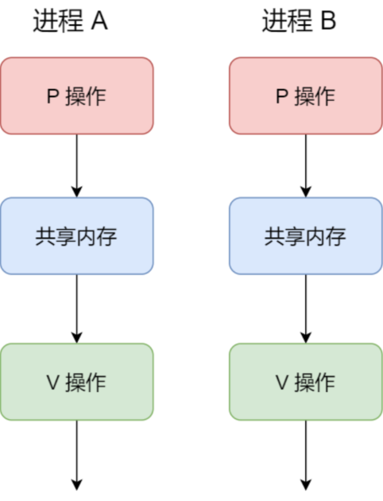

具体的过程如下：

- 进程 A 在访问共享内存前，先执行了 P 操作，由于信号量的初始值为 1，故在进程 A 执行 P 操作后信号量变为 0，表示共享资源可用，于是进程 A 就可以访问共享内存。 
- 若此时，进程 B 也想访问共享内存，执行了 P 操作，结果信号量变为了 -1，这就意味着临界资源已被占用，因此进程 B 被阻塞。
- 直到进程 A 访问完共享内存，才会执行 V 操作，使得信号量恢复为 0，接着就会唤醒阻塞中的线程 B，使得进程 B 可以访问共享内存，最后完成共享内存的访问后，执行 V 操作，使信号量恢复到初始值 1。

> 可以发现，信号初始化为1，就代表着是互斥信号量，它可以保证共享内存在任何时刻只有一个进程在访问，这就很好的保护了共享内存。

另外，在多进程⾥，每个进程并不一定是顺序执行的，它们基本是以各自独⽴的、不可预知的速度向前推进，但有时候我们⼜希望多个进程能密切合作，以实现一个共同的任务。

例如，进程 A 是负责⽣产数据，而进程 B 是负责读取数据，这两个进程是相互合作、相互依赖的，进程 A 必须先⽣产了数据，进程 B 才能读取到数据，所以执行是有前后顺序的。

那么这时候，就可以用信号量来实现多进程同步的方式，我们可以初始化信号量为0 。

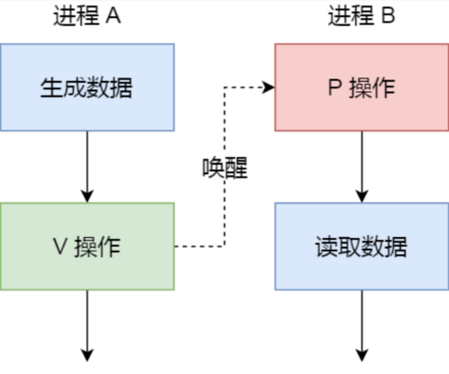

具体过程：

- 如果进程 B 比进程 A 先执行了，那么执行到 P 操作时，由于信号量初始值为 0，故信号量会变为 -1，表示进程 A 还没⽣产数据，于是进程 B 就阻塞等待；
- 接着，当进程 A ⽣产完数据后，执行了 V 操作，就会使得信号量变为 0，于是就会唤醒阻塞在 P 操作的进程 B；
- 最后，进程 B 被唤醒后，意味着进程 A 已经⽣产了数据，于是进程 B 就可以正常读取数据了。

> 可以发现，信号初始化为0，就代表着是同步信号量，它可以保证进程A应在进程B之前执行。

### 套接字SOCKET：

- socket也是一种进程间通信机制，与其他通信机制不同的是，它可用于==不同主机之间的进程==通信。

## 总结 背

由于每个进程的用户空间都是独⽴的，不能相互访问，这时就需要借助内核空间来实现进程间通信，原因很简单，每个进程都是共享一个内核空间。

Linux 内核提供了不少进程间通信的方式：

- 其中最简单的方式就是管道，管道分为「匿名管道」和「命名管道」。==<u>**匿名管道**</u>==顾名思义，它没有名字标识，匿名管道是特殊文件只存在于内存，没有存在于文件系统中，shell 命令中的「 | 」竖线就是匿名管道，通信的数据是无格式的流并且大小受限，通信的方式是单向的，数据只能在一个方向上流动，如果要双向通信，需要创建两个管道，再来匿名管道是只能用于存在⽗子关系的进程间通信，匿名管道的⽣命周期随着进程创建而建⽴，随着进程终⽌而消失。
- ==<u>**命名管道**</u>==突破了匿名管道只能在`亲缘关系`进程间的通信限制，因为使用命名管道的前提，需要在文件系统创建一个`类型为 p 的设备文件`，那么毫无关系的进程就可以通过这个设备文件进行通信。另外，不管是匿名管道还是命名管道，进程写入的数据都是`缓存在内核`中，另一个进程读取数据时候自然也是从内核中获取，同时通信数据都遵循先进先出原则，不⽀持lseek 之类的文件定位操作
- ==**消息队列**==克服了管道通信的数据是<u>无格式的字节流</u>的问题，消息队列实际上是保存在内核的「消息链表」，消息队列的消息体是可以用`户自定义的数据类型`，发送数据时，会被分成一个一个独⽴的消息体，当然接收数据时，也要与发送方发送的消息体的数据类型保持一致，这样才能保证读取的数据是正确的(==void* 的强转==)。消息队列通信的速度`不是最及时`的，毕竟每次数据的写入和读取都需要经过用户态与内核态之间的拷贝过程。 
- ==<u>**共享内存**</u>==可以解决消息队列通信中用户态与内核态之间数据拷贝过程带来的开销，它直接分配一个共享空间，每个进程都可以直接访问，就像访问进程自⼰的空间一样快捷方便，不需要陷入内核态或者系统调用，大大提高了通信的速度，享有==<u>最快的进程间通信方式</u>==之名。但是便捷高效的共享内存通信，带来新的问题，多进程竞争同个共享资源会造成数据的错乱。 
- 那么，就需要==<u>**信号量**</u>==来保护共享资源，以确保任何时刻只能有一个进程访问共享资源，这种方式就是互斥访问。信号量不仅可以实现访问的互斥性，还可以实现进程间的同步，信号量其实是一个计数器，表示的是资源个数，其值可以通过两个原子操作来控制，分别是 P 操作和 V 操作。
- 与信号量名字很相似的叫==<u>**信号**</u>==，它俩名字虽然相似，但功能一点⼉都不一样。信号是进程间通信机制中唯一的异步通信机制，信号可以在应用进程和内核之间直接交互，内核也可以利用信号来通知用户空间的进程发⽣了哪些系统事件，信号事件的来源主要有硬件来源（如键盘 Cltr+C）和软件来源（如 kill 命令），一旦有信号发⽣，进程有三种方式响应信号 1. 执行默认操作、2. 捕捉信号、3. 忽略信号。有两个信号是应用进程`无法捕捉和忽略`的，即`SIGKILL 和SEGSTOP` ，这是为了方便我们能在任何时候结束或停⽌某个进程。
- 前面说到的通信机制，都是⼯作于同一台主机，如果要与不同主机的进程间通信，那么就需要 ==<u>**Socket**</u>== 通信了。Socket 实际上不仅用于不同的主机进程间通信，还可以用于本地主机进程间通信，可根据创建 Socket 的类型不同，分为三种常见的通信方式，一个是基于 TCP 协议的通信方式，一个是基于 UDP 协议的通信方式，一个是本地进程间通信方式。

# 5. 多线程、线程同步、通信实现

## 线程的使用

- int pthread_create(pthread_t *thread, const pthread_attr_t *attr, void * (*start_routine) (void *), void *arg);
- pthread_t pthread_self(void);
- int pthread_equal(pthread_t t1, pthread_t t2);
- void pthread_exit(void *retval);
- int pthread_join(pthread_t thread, void **retval);
- int pthread_detach(pthread_t thread);
- int pthread_cancel(pthread_t thread);

### 线程的创建 pthread_create

#### 代码演示

```c++
/*
    一般情况下,main函数所在的线程我们称之为主线程（main线程），其余创建的线程
    称之为子线程。
    程序中默认只有一个进程，fork()函数调用，2进程
    程序中默认只有一个线程，pthread_create()函数调用，2个线程。

    #include <pthread.h>
    int pthread_create(pthread_t *thread, const pthread_attr_t *attr, 
    void *(*start_routine) (void *), void *arg);

        - 功能：创建一个子线程
        - 参数：
            - thread：传出参数，线程创建成功后，子线程的线程ID被写到该变量中。
            - attr : 设置线程的属性，一般使用默认值，NULL
            - start_routine : 函数指针，这个函数是子线程需要处理的逻辑代码
            - arg : 给第三个参数使用，传参
        - 返回值：
            成功：0
            失败：返回错误号。这个错误号和之前errno不太一样。
            获取错误号的信息：  char * strerror(int errnum);

*/
#include <stdio.h>
#include <pthread.h>
#include <string.h>
#include <unistd.h>

void * callback(void * arg) {
    printf("child thread...\n");
    printf("arg value: %d\n", *(int *)arg);
    return NULL;
}

int main() {
    pthread_t tid;
    int num = 10;
    
    // 创建一个子线程
    int ret = pthread_create(&tid, NULL, callback, (void *)&num);
    if(ret != 0) {
        char * errstr = strerror(ret);
        printf("error : %s\n", errstr);
    } 
    
    for(int i = 0; i < 5; i++) {
        printf("%d\n", i);
    }
    sleep(1);
    return 0;   // exit(0);
}
```

### 线程终止 pthread_exit

#### 代码演示

```c++
/*

    #include <pthread.h>
    void pthread_exit(void *retval);
        功能：终止一个线程，在哪个线程中调用，就表示终止哪个线程
        参数：
            retval:需要传递一个指针，作为一个返回值，可以在pthread_join()中获取到。

    pthread_t pthread_self(void);
        功能：获取当前的线程的线程ID

    int pthread_equal(pthread_t t1, pthread_t t2);
        功能：比较两个线程ID是否相等
        不同的操作系统，pthread_t类型的实现不一样，有的是无符号的长整型，有的
        是使用结构体去实现的。
*/
#include <stdio.h>
#include <pthread.h>
#include <string.h>

void * callback(void * arg) {
    printf("child thread id : %ld\n", pthread_self());
    return NULL;    // pthread_exit(NULL); 同一个含义
} 

int main() {
    // 创建一个子线程
    pthread_t tid;
    int ret = pthread_create(&tid, NULL, callback, NULL);

    if(ret != 0) {
        char * errstr = strerror(ret);
        printf("error : %s\n", errstr);
    }

    // 主线程
    for(int i = 0; i < 5; i++) {
        printf("%d\n", i);
    }

    printf("tid : %ld, main thread id : %ld\n", tid ,pthread_self());

    // 让主线程退出,当主线程退出时，不会影响其他正常运行的线程。
    pthread_exit(NULL);

    printf("main thread exit\n");  //不输出

    return 0;   // exit(0);
}
```

### 线程回收

线程中也存在子线程资源的回收:

`join函数`（类似多进程中的wait和waitpid），不同于多进程，`任何线程都可以对其他线程的资源进行回收`

#### 代码演示

```c++
/*
    #include <pthread.h>
    int pthread_join(pthread_t thread, void **retval);
        - 功能：和一个已经终止的线程进行连接
                回收子线程的资源
                这个函数是阻塞函数，调用一次只能回收一个子线程
                一般在主线程中使用
        - 参数：
            - thread：需要回收的子线程的ID
            - retval: 接收子线程退出时的返回值
        - 返回值：
            0 : 成功
            非0 : 失败，返回的错误号
*/

#include <stdio.h>
#include <pthread.h>
#include <string.h>
#include <unistd.h>

int value = 10;

void * callback(void * arg) {
    printf("child thread id : %ld\n", pthread_self());
    // sleep(3);
    // return NULL; 
    // int value = 10; // 局部变量
    pthread_exit((void *)&value);   // return (void *)&value;
} 

int main() {

    // 创建一个子线程
    pthread_t tid;
    int ret = pthread_create(&tid, NULL, callback, NULL);

    if(ret != 0) {
        char * errstr = strerror(ret);
        printf("error : %s\n", errstr);
    }

    // 主线程
    for(int i = 0; i < 5; i++) {
        printf("%d\n", i);
    }

    printf("tid : %ld, main thread id : %ld\n", tid ,pthread_self());

    // 主线程调用pthread_join()回收子线程的资源
    int * thread_retval;
    ret = pthread_join(tid, (void **)&thread_retval);

    if(ret != 0) {
        char * errstr = strerror(ret);
        printf("error : %s\n", errstr);
    }

    //注意不要返回局部变量
    printf("exit data : %d\n", *thread_retval);  

    printf("回收子线程资源成功！\n");

    // 让主线程退出,当主线程退出时，不会影响其他正常运行的线程。
    pthread_exit(NULL);

    return 0; 
}

```

### 线程的分离

int pthread_detach(pthread_t thread);

功能：分离一个线程。被分离的线程在终止的时候，会`自动释放资源`返回给系统。

1. <u>不能多次分离</u>，会产生不可预料的行为

2. <u>不能去连接一个已经分离的线程</u>，会报错

#### 代码演示

```c++
/*
    #include <pthread.h>
    int pthread_detach(pthread_t thread);
        - 功能：分离一个线程。被分离的线程在终止的时候，会自动释放资源返回给系统。
          1.不能多次分离，会产生不可预料的行为。
          2.不能去连接一个已经分离的线程，会报错。
        - 参数：需要分离的线程的ID
        - 返回值：
            成功：0
            失败：返回错误号
*/
#include <stdio.h>
#include <pthread.h>
#include <string.h>
#include <unistd.h>

void * callback(void * arg) {
    printf("chid thread id : %ld\n", pthread_self());
    return NULL;
}

int main() {

    // 创建一个子线程
    pthread_t tid;

    int ret = pthread_create(&tid, NULL, callback, NULL);
    if(ret != 0) {
        char * errstr = strerror(ret);
        printf("error1 : %s\n", errstr);
    }

    // 输出主线程和子线程的id
    printf("tid : %ld, main thread id : %ld\n", tid, pthread_self());

    // 设置子线程分离,子线程分离后，子线程结束时对应的资源就不需要主线程释放
    ret = pthread_detach(tid);
    if(ret != 0) {
        char * errstr = strerror(ret);
        printf("error2 : %s\n", errstr);
    }

    // 设置分离后，对分离的子线程进行连接 pthread_join()
    // ret = pthread_join(tid, NULL);
    // if(ret != 0) {
    //     char * errstr = strerror(ret);
    //     printf("error3 : %s\n", errstr);
    // }

    pthread_exit(NULL);

    return 0;
}
```

## 线程池

`因为创建线程关闭线程花销是比较大的，大过了线程空转的花销`,创建和销毁线程开销大，可能需要上千个时钟周期，避免cpu花费不必要的时间在这上面。  （==创建销毁 > 空转==）

### 原理

**为了减少创建与销毁线程所带来的时间消耗与资源消耗，因此采用线程池的策略：**

1. 程序启动后，`预先创建一定数量的线程放入空闲队列`中，这些线程都是处于阻塞状态，基本不消耗CPU，只占用较小的内存空间。

2. 接收到任务后，任务被挂在任务队列，线程池选择一个空闲线程来执行此任务。
3. 任务执行完毕后，不销毁线程，线程继续保持在池中等待下一次的任务。

**线程池所解决的问题：**

1. 需要频繁创建与销毁大量线程的情况下，由于线程预先就创建好了，接到任务就能马上从线程池中调用线程来处理任务，`减少了创建与销毁线程带来的时间开销和CPU资源占用`。
2. 需要并发的任务很多时候，无法为每个任务指定一个线程（`线程不够分`），使用线程池可以将提交的任务挂在任务队列上，等到池中有空闲线程时就可以为该任务指定线程。

### ==怎么实现线程池==

1. <u>设置一个生产者消费者队列</u>，作为临界资源
2. 初始化n个线程，并让其运行起来，加锁去队列取任务运行
3. 当任务队列为空的时候，所有线程阻塞
4. 当生产者队列来了一个任务后，先对队列加锁，把任务挂在到队列上，然后使用条件变量去通知阻塞中的一个线程

### 线程池参数设置

线程池的线程数量设置`过多`会导致线程`竞争激烈`

如果线程数量设置`过少`的话，还会导致系统`无法充分利`用计算机`资源`

- CPU 密集型任务

  这种任务消耗的主要是 CPU 资源，可以将线程数设置为 `N（CPU 核心数）+1`，比 CPU 核心数多出来的一个线程是为了防止线程偶发的缺页中断，或者其它原因导致的任务暂停而带来的影响。一旦任务暂停，CPU 就会处于空闲状态，而在这种情况下多出来的一个线程就可以充分利用 CPU 的空闲时间。

- I/O 密集型任务

  这种任务应用起来，系统会用大部分的时间来处理 I/O 交互，而线程在处理 I/O 的时间段内不会占用 CPU 来处理，这时就可以将 CPU 交出给其它线程使用。因此在 I/O 密集型任务的应用中，我们可以多配置一些线程，具体的计算方法是 `2N`。

 

## 多线程同步添加

`临界区（线程通信方式）`：通过多线程的串行化来访问公共资源或一段代码，速度快，适合控制数据访问；

> 由于共享地址空间 所以通信很方便 重点是`临界区访问的互斥与同步`

### 竞争与协作

在单核 CPU 系统⾥，为了实现多个程序同时运行的假象，操作系统通常以时间片调度的方式，让每个进程执行每次执行一个时间片，时间片用完了，就切换下一个进程运行，由于这个时间片的时间很短，于是就造成了「并发」的现象。

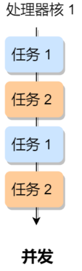

线程之间是可以共享进程的资源，比如代码段、堆空间、数据段、打开的文件等资源，但每个线程都有自⼰独⽴的栈空间。

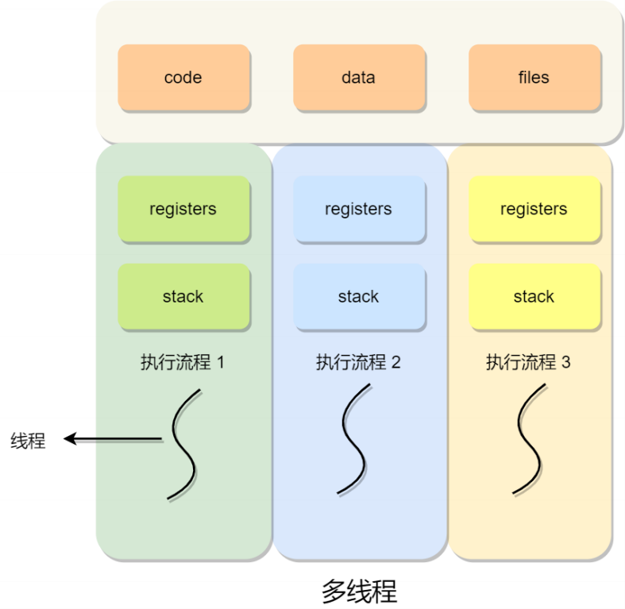

多个线程如果竞争共享资源，如果不采取有效的措施，则会造成共享数据 
的混乱。

### 互斥的概念

当多线程相互竞争操作共享变量时，由于运⽓不好，即在执行过程中发⽣了上下文切换，我们得到了错误的结果，事实上，每次运行都可能得到不同的结果，因此输出的结果存在不确定性（indeterminate）。

由于多线程执行操作共享变量的这段代码可能会导致竞争状态，因此我们将此段代码称为临界区（critical section），它是访问共享资源的代码片段，一定不能给多线程同时执行。我们希望这段代码是互斥（mutualexclusion）的，也就说保证一个线程在临界区执行时，其他线程应该被阻⽌进入临界区，说白了，就是这段代码执行过程中，最多只能出现一个线程。

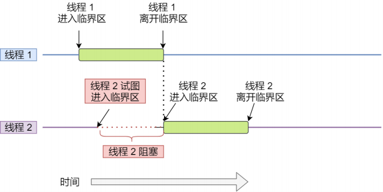

### 同步的概念

互斥解决了并发进程/线程对临界区的使用问题。这种基于临界区控制的交互作用是比较简单的，只要一个进程/线程进入了临界区，其他试图想进入临界区的进程/线程都会被阻塞着，直到第一个进程/线程离开了临界区。

我们都知道在多线程⾥，每个线程并不一定是顺序执行的，它们基本是以各自独⽴的、不可预知的速度向前推进，但有时候我们⼜希望多个线程能密切合作，以实现一个共同的任务。 

例子，线程 1 是负责读入数据的，而线程 2 是负责处理数据的，这两个线程是相互合作、相互依赖的。线程 2 在没有收到线程 1 的唤醒通知时，就会一直阻塞等待，当线程 1 读完数据需要把数据传给线程 2 时，线程 1 会唤醒线程 2，并把数据交给线程 2 处理。

<u>所谓同步，就是并发进程/线程在一些关键点上可能需要互相等待与互通消息，这种相互制约的等待与互通信息称为进程/线程同步。</u>

> ==同步与互斥是两种不同的概念==：
>
> - 同步就好比：「操作 A 应在操作 B 之前执行」，「操作 C 必须在操作 A 和操作 B 都完成之后才能执行」等；
> - 互斥就好比：「操作 A 和操作 B 不能在同一时刻执行」

### 互斥与同步的实现和使用

在进程/线程并发执行的过程中，进程/线程之间存在协作的关系，例如有互斥、同步的关系。为了实现进程/线程间正确的协作，操作系统必须提供实现进程协作的措施和方法，主要的方法有两种：

> 锁：加锁、解锁操作； 
>
> 信号量：P、V 操作；

这两个都可以方便地实现进程/线程互斥，而信号量比锁的功能更强一些，它还可以方便地实现进程/线程同步。

#### 锁

使用加锁操作和解锁操作可以解决并发线程/进程的互斥问题。

任何想进入临界区的线程，必须先执行加锁操作。若加锁操作顺利通过，则线程可进入临界区；在完成对临界资源的访问后再执行解锁操作，以释放该临界资源

根据锁的实现不同，可以分为「忙等待锁」和「无忙等待锁」。

##### 「忙等待锁」的实现

在说明「忙等待锁」的实现之前，先介绍现代 CPU 体系结构提供的==**特殊原子操作指令**==—测试和置位（Test-and-Set）指令。

> 重点是这个原子操作
>
> 原子操作是汇编实现的 保证完整执行 指定寄存器

如果用 C 代码表示 Test-and-Set 指令，形式如下


> 测试并设置指令做了下述事情:
>
> 把old_ptr 更新为new 的新值 
>
> 返回old_ptr 的旧值；

关键是这些代码是==<u>**原子执行**</u>==。因为既可以测试旧值，⼜可以设置新值，所以我们把这条指令叫作`「测试并设置」`

运用 Test-and-Set 指令来实现「忙等待锁」:

> 理解为什么这个锁能⼯作：
>
> - 第一个场景是，首先假设一个线程在运行，调用lock() ，没有其他线程持有锁，所以flag 是0。当调用TestAndSet(flag, 1) 方法，返回 0，线程会跳出 while 循环，获取锁。同时也会原子的设置 flag 为1，标志锁已经被持有。当线程离开临界区，调用unlock() 将    flag 清理为 0。
>
> - 第⼆种场景是，当某一个线程已经持有锁（即flag 为1）。本线程调用lock() ，然后调用TestAndSet(flag, 1) ，这一次返回 1。只要另一个线程一直持有锁，TestAndSet() 会重复返回 1，本线程会一直忙等。当flag 终于被改为 0，本线程会调用TestAndSet() ，返回 0 并且原子地设置为 1，从而获得锁，进入临界区。

很明显，当获取不到锁时，线程就会一直while循环，不做任何事情，所以就被称为「忙等待锁」，也被称为==<u>**自旋锁（spin lock）**</u>==。

> 自旋锁必须是抢占 不然自旋锁不会放弃调度

##### 「无等待锁」的实现

无等待锁顾明思议就是获取不到锁的时候，不用自旋。

既然不想自旋，那当没获取到锁的时候，就把当前线程放入到锁的等待队列，然后执行调度程序，把 CPU 让给其他线程执行。

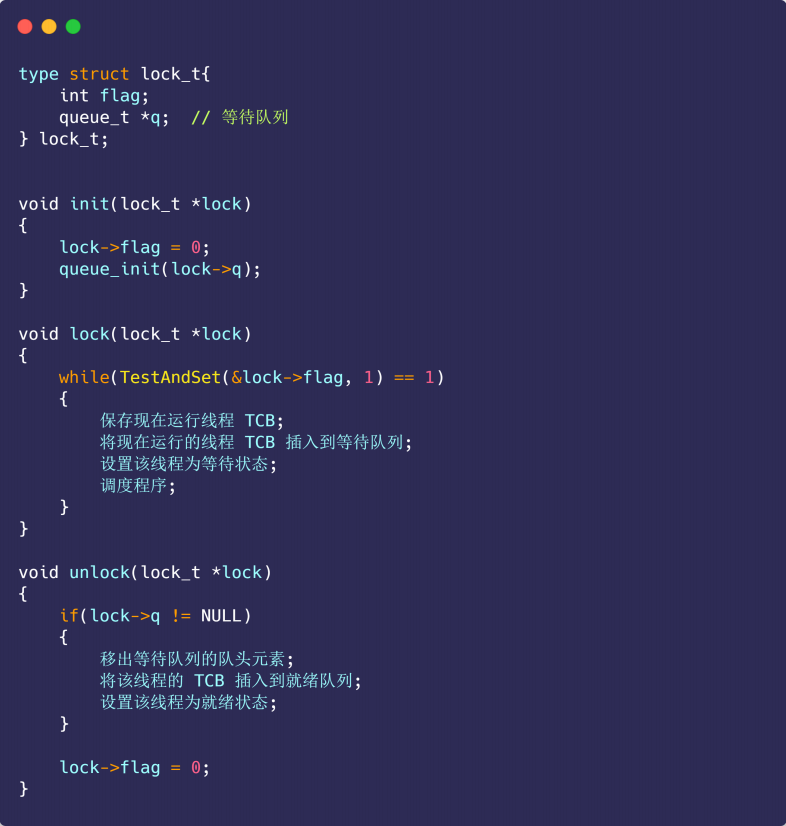

#### 信号量

信号量是操作系统提供的一种协调共享资源访问的方法。

通常信号量表示资源的数量，对应的变量是一个整型（ sem ）变量。 

另外，还有两个原子操作的系统调用函数来控制信号量的，分别是：

- P 操作：将sem 减1，相减后，如果sem < 0，则进程/线程进入阻塞等待，否则继续，表明 P 操作可能会阻塞；
- V 操作：将sem 加1，相加后，如果sem <= 0，唤醒一个等待中的进程/线程，表明V操作不会阻塞；

P 操作是用在进入临界区之前，V 操作是用在离开临界区之后，这两个操作是必须成对出现的。

##### 如何实现 PV 操作

信号量数据结构与 PV 操作的算法描述如下图：

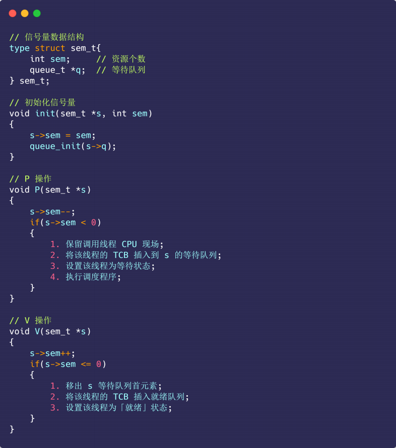

PV 操作的函数是由操作系统管理和实现的，所以操作系统已经使得执行 PV 函数时是具有==<u>**原子性**</u>==的。

##### PV 操作如何使用

信号量不仅可以实现临界区的互斥访问控制，还可以线程间的事件同步。 

**如何使用信号量实现临界区的互斥访问**

为每类共享资源设置一个信号量s ，其初值为1 ，表示该临界资源未被占用。 

只要把进入临界区的操作置于 P(s) 和 V(s) 之间，即可实现进程/线程`互斥`：

> 对于两个并发线程，`互斥信号量`的值仅取 1、0 和 -1 三个值，分别表示：
>
> - 如果互斥信号量为 1，表示没有线程进入临界区； 
> - 如果互斥信号量为 0，表示有一个线程进入临界区；
> - 如果互斥信号量为 -1，表示一个线程进入临界区，另一个线程等待进入。

**信号量实现事件同步 **

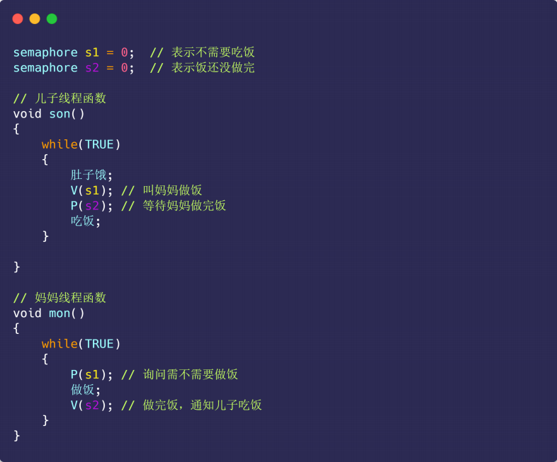

> - 妈妈一开始询问⼉子要不要做饭时，执行的是 P(s1) ，相当于询问⼉子需不需要吃饭，由于s1 初始值为 0，此时 s1 变成 -1，表明⼉子不需要吃饭，所以妈妈线程就进入等待状态。
> - 当⼉子肚子饿时，执行了V(s1) ，使得s1 信号量从 -1 变成 0，表明此时⼉子需要吃饭 了，于是就唤醒了阻塞中的妈妈线程，妈妈线程就开始做饭。
> - 接着，⼉子线程执行了P(s2) ，相当于询问妈妈饭做完了吗，由于    s2 初始值是 0，则此时s2 变成 -1，说明妈妈还没做完饭，⼉子线程就等待状态。
> - 最后，妈妈终于做完饭了，于是执行V(s2) ，s2 信号量从 -1 变回了 0，于是就唤醒等待中的⼉子线程，唤醒后，⼉子线程就可以进行吃饭了。

### ⽣产者-消费者问题


⽣产者-消费者问题描述：

- ⽣产者在⽣成数据后，放在一个缓冲区中； 
- 消费者从缓冲区取出数据处理；
- 任何时刻，只能有一个⽣产者或消费者可以访问缓冲区； 

我们对问题分析可以得出：

- 任何时刻只能有一个线程操作缓冲区，说明操作缓冲区是临界代码，需要互斥；
- 缓冲区空时，消费者必须等待⽣产者⽣成数据；缓冲区满时，⽣产者必须等待消费者取出数据。说明⽣产者和消费者需要同步。

那么我们需要三个信号量，分别是：

- 互斥信号量 mutex：用于互斥访问缓冲区，初始化值为 1；
- 资源信号量 fullBuffers：用于消费者询问缓冲区是否有数据，有数据则读取数据，初始化值为 0（表明缓冲区一开始为空）；
- 资源信号量 emptyBuffers：用于⽣产者询问缓冲区是否有空位，有空位则⽣成数据，初始化值为 n （缓冲区大小）；

具体的实现代码：

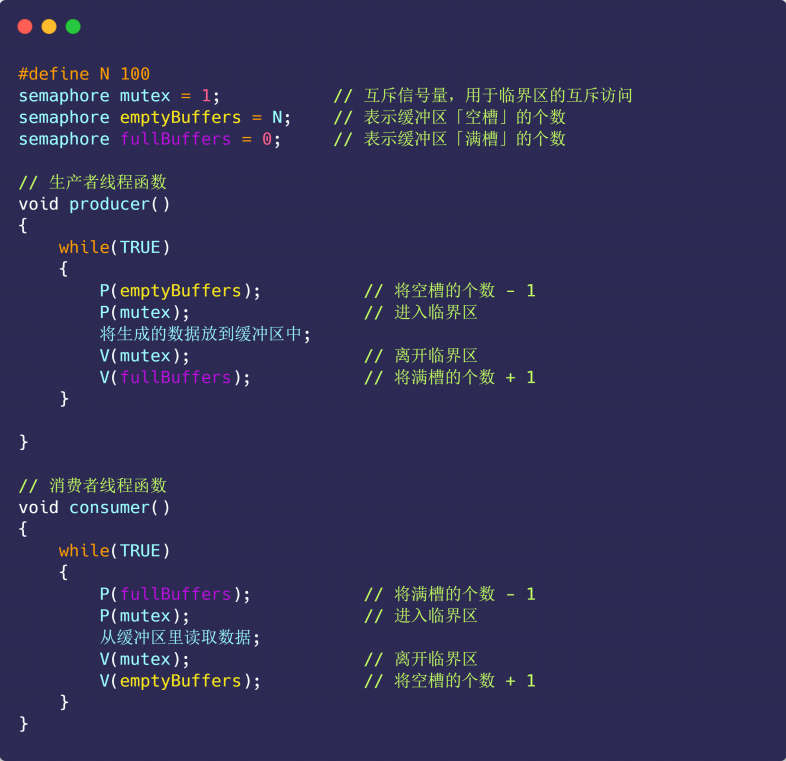

> - 如果消费者线程一开始执行P(fullBuffers) ，由于信号量    fullBuffers 初始值为 0，则此时fullBuffers 的值从 0 变为 -1，说明缓冲区⾥没有数据，消费者只能等待。
> - 接着，轮到⽣产者执行P(emptyBuffers) ，表示减少 1 个空槽，如果当前没有其他⽣产者线程在临界区执行代码，那么该⽣产者线程就可以把数据放到缓冲区，放完后，执行V(fullBuffers) ，信号量    fullBuffers 从 -1 变成 0，表明有「消费者」线程正在阻塞等待数据，于是阻塞等待的消费者线程会被唤醒。
> - 消费者线程被唤醒后，如果此时没有其他消费者线程在读数据，那么就可以直接进入临界区，从缓冲区读取数据。最后，离开临界区后，把空槽的个数 + 1。

## 原多线程同步笔记

`互斥量`Synchronized/Lock：采用互斥对象机制，只有拥有互斥对象的线程才有访问公共资源的权限。因为互斥对象只有一个，所以可以保证公共资源不会被多个线程同时访问

`信号量`Semphare：为控制具有有限数量的用户资源而设计的，它允许多个线程在同一时刻去访问同一个资源，但一般需要限制同一时刻访问此资源的最大线程数目。

`条件变量`（事件）：通过通知操作的方式来保持多线程同步，还可以方便的实现多线程优先级的比较操作

1. <u>==互斥锁==</u>

   互斥锁是最常见的线程同步方式，它是一种特殊的变量，它有 ***lock*** 和 ***unlock*** 两种状态，一旦获取，就会上锁，且只能由该线程解锁，期间，其他线程无法获取在使用同一个资源前加锁，使用后解锁，即可实现线程同步，需要注意的是，如果加锁后不解锁，会造成死锁

   - **优点：**

     使用简单；

   - **缺点：**

     1. 重复锁定和解锁，`每次都会检查共享数据结构，浪费时间和资源`；   ==（频繁检查共享数据（锁），浪费时间和资源）==
     2. 繁忙查询的效率非常低；   ==（效率低）==

2. <u>==条件变量==</u>

   条件变量的方法是，当线程在等待某些满足条件时使线程进入睡眠状态，一旦条件满足，就唤醒，这样不会占用宝贵的互斥对象锁，实现高效。

   条件变量允许线程阻塞并等待另一个线程发送信号，`一般和互斥锁一起使用`。

   <u>条件变量被用来阻塞一个线程，当条件不满足时，线程会解开互斥锁，并等待条件发生变化。一旦其他线程改变了条件变量，将通知相应的阻塞线程，这些线程重新锁定互斥锁，然后执行后续代码，最后再解开互斥锁。</u>    ==（一些锁 用条件变量替换）==

3. <u>==信号量==</u>

   **信号量** 和互斥锁的区别在于：`互斥锁只允许一个线程进入临界区，信号量允许多个线程同时进入临界区`

   可以这样理解，互斥锁使用对同一个资源的互斥的方式达到线程同步的目的，信号量可以同步多个资源以达到线程同步

   - 为什么要使用信号量？？?

     为了防止多个进程在访问共享资源为引发的问题。信号量可以协调进程对共享资源的访问，也就是用来`保护临界资源`的。任一时刻只能有一个执行线程进入临界区。  ==（生产消费）==

   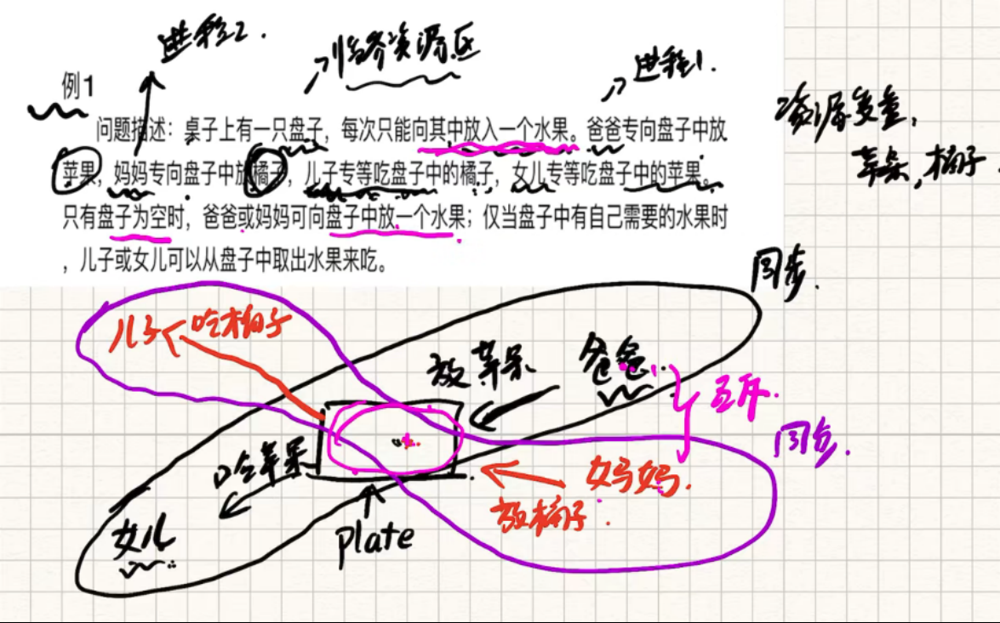

## 线程同步代码实现

### 线程之间共享和非共享资源

◼ 共享资源

- 进程 ID 和父进程 ID

- 进程组 ID 和会话 ID
- 用户 ID 和 用户组 ID
- 文件描述符表
- 信号处置
- 文件系统的相关信息：文件权限掩码（umask）、当前工作目录
- 虚拟地址空间（除栈、.text） 

◼ 非共享资源

- 线程 ID

- 信号`掩码`

  > 信号屏蔽字，它规定了当前要屏蔽或要阻塞递送到该进程的信号集 （==<u>屏蔽一些信号</u>==）
  >
  > 例如 当一个程序正在运行时，在键盘上按下Ctrl+C，内核就会向相应的进程发出一个SIGINT信号（终端中断符），对这个信号的默认操作就是通过do_exit()结束该进程的运行。但是，有些应用程序可能对Ctrl+C有自己的处理，所以就要为SIGINT另行设置一个处理程序，使它指向应用程序中的一个函数，在那个函数中对Ctrl+C这个事件做出响应。

- 线程特有数据

- error 变量

- 实时调度策略和优先级

- `栈`，本地变量和函数的调用链接信息

### 线程同步介绍

1. 线程的主要优势在于，`能够通过全局变量来共享信息`。不过，这种便捷的共享是`有代价`的：必须确保多个线程不会同时修改同一变量，或者某一线程不会读取正在由其他线程修改的变量。

2. `临界区是指`访问某一共享资源的`代码片段`，并且这段代码的执行应为原子操作，也就是同时访问同一共享资源的其他线程不应终端该片段的执行。

   > <u>原子操作是指不会被[线程调度](https://baike.baidu.com/item/线程调度/10226112)机制打断的操作</u>；这种操作一旦开始，就一直运行到结束，中间不会有任何 context switch（切换到另一个线程）。

3. 线程同步：即当有一个线程在对内存进行操作时，其他线程都不可以对这个内存地址进行操作，直到该线程完成操作，其他线程才能对该内存地址进行操作，而其他线程则处于等待状态。

### 互斥锁

- 为避免线程更新共享变量时出现问题，可以使用互斥量（mutex 是 mutual exclusion的缩写）来确保同时仅有一个线程可以访问某项共享资源。可以使用互斥量来保证对任意共享资源的原子访问。

- 互斥量有两种状态：已锁定（locked）和未锁定（unlocked）。任何时候，至多只有一个线程可以锁定该互斥量。试图对已经锁定的某一互斥量再次加锁，将可能阻塞线程或者报错失败，具体取决于加锁时使用的方法。

- 一旦线程锁定互斥量，随即成为该互斥量的所有者，只有所有者才能给互斥量解锁。一般情况下，对每一共享资源（可能由多个相关变量组成）会使用不同的互斥量，每一线程在访问

  同一资源时将采用如下协议：

  > ⚫ 针对共享资源锁定互斥量
  >
  > ⚫ 访问共享资源
  >
  > ⚫ 对互斥量解锁

- 如果多个线程试图执行这一块代码（一个临界区），事实上只有一个线程能够持有该互斥量（其他线程将遭到阻塞），即同时只有一个线程能够进入这段代码区域，如下图所示：

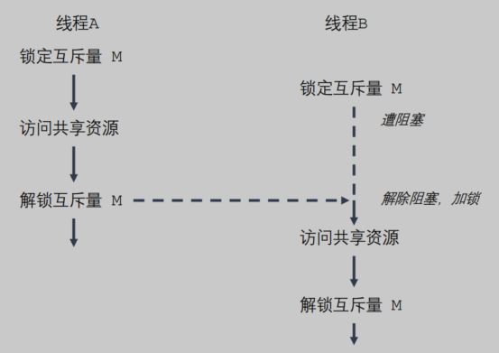

#### 代码演示

```c++
/*
    互斥量的类型 pthread_mutex_t
    int pthread_mutex_init(pthread_mutex_t *restrict mutex, const pthread_mutexattr_t *restrict attr);
        - 初始化互斥量
        - 参数 ：
            - mutex ： 需要初始化的互斥量变量
            - attr ： 互斥量相关的属性，NULL
        - restrict : C语言的修饰符，被修饰的指针，不能由另外的一个指针进行操作。
            pthread_mutex_t *restrict mutex = xxx;
            pthread_mutex_t * mutex1 = mutex;

    int pthread_mutex_destroy(pthread_mutex_t *mutex);
        - 释放互斥量的资源

    int pthread_mutex_lock(pthread_mutex_t *mutex);
        - 加锁，阻塞的，如果有一个线程加锁了，那么其他的线程只能阻塞等待

    int pthread_mutex_trylock(pthread_mutex_t *mutex);
        - 尝试加锁，如果加锁失败，不会阻塞，会直接返回。

    int pthread_mutex_unlock(pthread_mutex_t *mutex);
        - 解锁
*/
#include <stdio.h>
#include <pthread.h>
#include <unistd.h>

// 全局变量，所有的线程都共享这一份资源。
int tickets = 1000;

// 创建一个互斥量
pthread_mutex_t mutex;

void * sellticket(void * arg) {
    // 卖票
    while(1) {
        // 加锁
        pthread_mutex_lock(&mutex);
        if(tickets > 0) {
            usleep(6000);
            printf("%ld 正在卖第 %d 张门票\n", pthread_self(), tickets);
            tickets--;
        }else {
            // 解锁
            pthread_mutex_unlock(&mutex);
            break;
        }
        // 解锁
        pthread_mutex_unlock(&mutex);
    }
    return NULL;
}

int main() {
    // 初始化互斥量
    pthread_mutex_init(&mutex, NULL);
    // 创建3个子线程
    pthread_t tid1, tid2, tid3;
    pthread_create(&tid1, NULL, sellticket, NULL);
    pthread_create(&tid2, NULL, sellticket, NULL);
    pthread_create(&tid3, NULL, sellticket, NULL)
    // 回收子线程的资源,阻塞
    pthread_join(tid1, NULL);
    pthread_join(tid2, NULL);
    pthread_join(tid3, NULL);
    pthread_exit(NULL); // 退出主线程
    // 释放互斥量资源
    pthread_mutex_destroy(&mutex);

    return 0;
}
```

### 死锁

- 有时，一个线程需要同时访问两个或更多不同的共享资源，而每个资源又都由不同的互斥量管理。当超过一个线程加锁同一组互斥量时，就有可能发生死锁。

- 两个或两个以上的进程在执行过程中，因争夺共享资源而造成的一种互相等待的现象，若无外力作用，它们都将无法推进下去。此时称系统处于死锁状态或系统产生了死锁。

-  死锁的几种场景：

  > <u>忘记释放</u>
  >
  > <u>重复加锁</u>
  >
  > <u>多线程多锁，抢占锁资源</u>

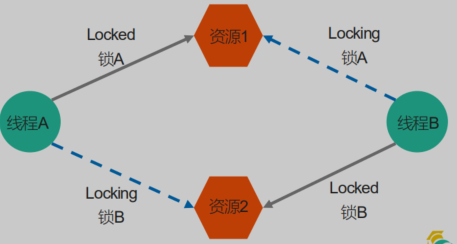


### 读写锁

- 当有一个线程已经持有互斥锁时，互斥锁将所有试图进入临界区的线程都阻塞住。<u>但是考虑一种情形，当前持有互斥锁的线程只是要`读访问`共享资源，而同时有其它几个线程也想读取这个共享资源，但是由于互斥锁的排它性，所有其它线程都无法获取锁，也就无法读访问共享资源了，但是`实际上多个线程同时读访问共享资源并不会导致问题`。</u>

- 在对数据的读写操作中，更多的是读操作，写操作较少，例如对数据库数据的读写应用。为了满足当前能够允许多个读出，但只允许一个写入的需求，线程提供了读写锁来实现。

- 读写锁的特点：

  > 如果有其它线程读数据，则允许其它线程执行读操作，但不允许写操作。  `(读锁允许其他的读 不允许写)`
  >
  
  
  
  > 写是独占的，写的优先级高。


#### 代码

```c++
/*
    读写锁的类型 pthread_rwlock_t
    int pthread_rwlock_init(pthread_rwlock_t *restrict rwlock, const pthread_rwlockattr_t *restrict attr);
    int pthread_rwlock_destroy(pthread_rwlock_t *rwlock);
    int pthread_rwlock_rdlock(pthread_rwlock_t *rwlock);
    int pthread_rwlock_tryrdlock(pthread_rwlock_t *rwlock);
    int pthread_rwlock_wrlock(pthread_rwlock_t *rwlock);
    int pthread_rwlock_trywrlock(pthread_rwlock_t *rwlock);
    int pthread_rwlock_unlock(pthread_rwlock_t *rwlock);

    案例：8个线程操作同一个全局变量。
    3个线程不定时写这个全局变量，5个线程不定时的读这个全局变量
*/

#include <stdio.h>
#include <pthread.h>
#include <unistd.h>

// 创建一个共享数据
int num = 1;
// pthread_mutex_t mutex;
pthread_rwlock_t rwlock;

void * writeNum(void * arg) {

    while(1) {
        pthread_rwlock_wrlock(&rwlock);
        num++;
        printf("++write, tid : %ld, num : %d\n", pthread_self(), num);
        pthread_rwlock_unlock(&rwlock);
        usleep(100);
    }

    return NULL;
}

void * readNum(void * arg) {

    while(1) {
        pthread_rwlock_rdlock(&rwlock);
        printf("===read, tid : %ld, num : %d\n", pthread_self(), num);
        pthread_rwlock_unlock(&rwlock);
        usleep(100);
    }

    return NULL;
}

int main() {

   pthread_rwlock_init(&rwlock, NULL);

    // 创建3个写线程，5个读线程
    pthread_t wtids[3], rtids[5];
    for(int i = 0; i < 3; i++) {
        pthread_create(&wtids[i], NULL, writeNum, NULL);
    }

    for(int i = 0; i < 5; i++) {
        pthread_create(&rtids[i], NULL, readNum, NULL);
    }

    // 设置线程分离
    for(int i = 0; i < 3; i++) {
       pthread_detach(wtids[i]);
    }

    for(int i = 0; i < 5; i++) {
         pthread_detach(rtids[i]);
    }

    pthread_exit(NULL);

    pthread_rwlock_destroy(&rwlock);

    return 0;
}
```

### 生产者消费者模型&条件变量

店家生产包子 放到桌子上 客人吃包子

三个对象：生产者 消费者 容器 

生产者和消费者需要交流：有包子了通知客人吃，客人吃完了通知店家做

<u>需要使用条件变量或者信号量实现同步 不能无限制的做包子或者无限制的等待（while(1)）吃包子</u>

#### 简单实现：

```c++
/*
    条件变量的类型 pthread_cond_t
    int pthread_cond_init(pthread_cond_t *restrict cond, const pthread_condattr_t *restrict attr);
    int pthread_cond_destroy(pthread_cond_t *cond);
    int pthread_cond_wait(pthread_cond_t *restrict cond, pthread_mutex_t *restrict mutex);
        - 等待，调用了该函数，线程会阻塞。
    int pthread_cond_timedwait(pthread_cond_t *restrict cond, pthread_mutex_t *restrict mutex, const struct timespec *restrict abstime);
        - 等待多长时间，调用了这个函数，线程会阻塞，直到指定的时间结束。
    int pthread_cond_signal(pthread_cond_t *cond);
        - 唤醒一个或者多个等待的线程
    int pthread_cond_broadcast(pthread_cond_t *cond);
        - 唤醒所有的等待的线程
*/
#include <stdio.h>
#include <pthread.h>
#include <stdlib.h>
#include <unistd.h>

// 创建一个互斥量
pthread_mutex_t mutex;
// 创建条件变量
pthread_cond_t cond;

struct Node{
    int num;
    struct Node *next;
};

// 头结点
struct Node * head = NULL;

void * producer(void * arg) {
    // 不断的创建新的节点，添加到链表中
    while(1) {
        pthread_mutex_lock(&mutex);
        struct Node * newNode = (struct Node *)malloc(sizeof(struct Node));
        newNode->next = head;
        head = newNode;
        newNode->num = rand() % 1000;
        printf("add node, num : %d, tid : %ld\n", newNode->num, pthread_self());
        
        // 只要生产了一个，就通知消费者消费
        pthread_cond_signal(&cond);

        pthread_mutex_unlock(&mutex);
        usleep(100);
    }

    return NULL;
}

void * customer(void * arg) {
    while(1) {
        pthread_mutex_lock(&mutex);
        // 保存头结点的指针
        struct Node * tmp = head;
        // 判断是否有数据
        if(head != NULL) {
            // 有数据
            head = head->next;
            printf("del node, num : %d, tid : %ld\n", tmp->num, pthread_self());
            free(tmp);
            pthread_mutex_unlock(&mutex);
            usleep(100);
        } else {
            // 没有数据，需要等待
            // 当这个函数调用阻塞的时候，会对互斥锁进行解锁，当不阻塞的，继续向下执行，会重新加锁。
            pthread_cond_wait(&cond, &mutex);
            pthread_mutex_unlock(&mutex);  //没有条件变量 会一致解锁 浪费资源
        }
    }
    return  NULL;
}

int main() {
    pthread_mutex_init(&mutex, NULL);
    pthread_cond_init(&cond, NULL);

    // 创建5个生产者线程，和5个消费者线程
    pthread_t ptids[5], ctids[5];

    for(int i = 0; i < 5; i++) {
        pthread_create(&ptids[i], NULL, producer, NULL);
        pthread_create(&ctids[i], NULL, customer, NULL);
    }

    for(int i = 0; i < 5; i++) {
        pthread_detach(ptids[i]);
        pthread_detach(ctids[i]);
    }

    while(1) {
        sleep(10);
    }

    pthread_mutex_destroy(&mutex);
    pthread_cond_destroy(&cond);

    pthread_exit(NULL);

    return 0;
}

```

### 信号量

```c++
/*
    信号量的类型 sem_t
    int sem_init(sem_t *sem, int pshared, unsigned int value);
        - 初始化信号量
        - 参数：
            - sem : 信号量变量的地址
            - pshared : 0 用在线程间 ，非0 用在进程间
            - value : 信号量中的值

    int sem_destroy(sem_t *sem);
        - 释放资源

    int sem_wait(sem_t *sem);
        - 对信号量加锁，调用一次对信号量的值-1，如果值为0，就阻塞

    int sem_trywait(sem_t *sem);

    int sem_timedwait(sem_t *sem, const struct timespec *abs_timeout);
    int sem_post(sem_t *sem);
        - 对信号量解锁，调用一次对信号量的值+1

    int sem_getvalue(sem_t *sem, int *sval);

    sem_t psem;
    sem_t csem;
    init(psem, 0, 8);
    init(csem, 0, 0);

    producer() {
        sem_wait(&psem);
        sem_post(&csem)
    }

    customer() {
        sem_wait(&csem);
        sem_post(&psem)
    }

*/

#include <stdio.h>
#include <pthread.h>
#include <stdlib.h>
#include <unistd.h>
#include <semaphore.h>

// 创建一个互斥量
pthread_mutex_t mutex;
// 创建两个信号量
sem_t psem;
sem_t csem;

struct Node{
    int num;
    struct Node *next;
};

// 头结点
struct Node * head = NULL;

void * producer(void * arg) {

    // 不断的创建新的节点，添加到链表中
    while(1) {
        sem_wait(&psem); // 8 - 1 - 1 - 1.... 
        pthread_mutex_lock(&mutex);
        struct Node * newNode = (struct Node *)malloc(sizeof(struct Node));
        newNode->next = head;
        head = newNode;
        newNode->num = rand() % 1000;
        printf("add node, num : %d, tid : %ld\n", newNode->num, pthread_self());
        pthread_mutex_unlock(&mutex);
        sem_post(&csem); // 0 + 1 + 1 + 1.....
    }

    return NULL;
}

void * customer(void * arg) {

    while(1) {
        sem_wait(&csem);  //不为0 说明有包子 进行后续代码 进行消费 - 1 - 1 -1...
        pthread_mutex_lock(&mutex);
        // 保存头结点的指针
        struct Node * tmp = head;
        head = head->next;
        printf("del node, num : %d, tid : %ld\n", tmp->num, pthread_self());
        free(tmp);
        pthread_mutex_unlock(&mutex);
        sem_post(&psem); //消费完成 通知生产则生产 + 1 + 1 + 1....
       
    }
    return  NULL;
}

int main() {

    pthread_mutex_init(&mutex, NULL);
    sem_init(&psem, 0, 8);  //初始为8
    sem_init(&csem, 0, 0);

    // 创建5个生产者线程，和5个消费者线程
    pthread_t ptids[5], ctids[5];

    for(int i = 0; i < 5; i++) {
        pthread_create(&ptids[i], NULL, producer, NULL);
        pthread_create(&ctids[i], NULL, customer, NULL);
    }

    for(int i = 0; i < 5; i++) {
        pthread_detach(ptids[i]);
        pthread_detach(ctids[i]);
    }

    while(1) {
        sleep(10);
    }

    pthread_mutex_destroy(&mutex);

    pthread_exit(NULL);

    return 0;
}

```


## 线程间的同步方式，最好说出具体的系统调用

==信号量==

信号量是一种特殊的变量，可用于线程同步。它只取自然数值，并且只支持两种操作：

P(SV):如果信号量SV大于0，将它减一；如果SV值为0，则挂起该线程。 ==消费==线程 

> 假设sv = 1, sv大于0表示有苹果 可以吃  --， 然后sv = 0还想吃 则挂起

V(SV)：如果有其他进程因为等待SV而挂起，则唤醒，然后将SV+1；否则直接将SV+1。 ==生产==线程

其系统调用为：

`sem_wait`（sem_t *sem）：以原子操作的方式将信号量减1，如果信号量值为0，则sem_wait将被阻塞，直到这个信号量具有非0值。

`sem_post`（sem_t *sem)：以原子操作将信号量值+1。当信号量大于0时，其他正在调用sem_wait等待信号量的线程将被唤醒。

 

==互斥量==

互斥量又称互斥锁，主要用于线程互斥，不能保证按序访问，可以和条件锁一起实现同步。当进入临界区时，需要获得互斥锁并且加锁；当离开临界区时，需要对互斥锁解锁，以唤醒其他等待该互斥锁的线程。其主要的系统调用如下：

`pthread_mutex_init`:初始化互斥锁

`pthread_mutex_destroy`：销毁互斥锁

`pthread_mutex_lock`：以原子操作的方式给一个互斥锁加锁，如果目标互斥锁已经被上锁，pthread_mutex_lock调用将阻塞，直到该互斥锁的占有者将其解锁。

`pthread_mutex_unlock`:以一个原子操作的方式给一个互斥锁解锁。

 

==条件变量==

条件变量，又称条件锁，用于在线程之间同步共享数据的值。条件变量提供一种线程间通信机制：当某个共享数据达到某个值时，唤醒等待这个共享数据的一个/多个线程。即，当某个共享变量等于某个值时，调用 signal/broadcast。此时操作共享变量时需要加锁。其主要的系统调用如下：

`pthread_cond_init`:初始化条件变量

`pthread_cond_destroy`：销毁条件变量

`pthread_cond_signal`：唤醒一个等待目标条件变量的线程。哪个线程被唤醒取决于调度策略和优先级。

`pthread_cond_wait`：等待目标条件变量。需要一个加锁的互斥锁确保操作的原子性。该函数中在进入wait状态前首先进行解锁，然后接收到信号后会再加锁，保证该线d对共享资源正确访问。

 

## 互斥锁和条件变量的区别

- 条件变量：可以自己决定什么时候唤醒别的线程，达到唤醒条件之后再==唤醒==某个线程。选择唤醒单个线程   

  ==（主要是唤醒特定线程）==

- 互斥锁强调的是资源的访问互斥：解锁时自动唤醒阻塞线程

###  1. 互斥锁（mutual exclusive lock variable / mutex ）

- 互斥量(mutex)从本质上说是一把锁，在访问共享资源前对互斥量进行加锁，在访问完成后释放互斥量上的锁。对互斥量进行加锁以后，任何其他试图再次对互斥锁加锁的线程将会阻塞直到当前线程释放该互斥锁。**如果释放互斥锁时有多个线程阻塞，所有在该互斥锁上的阻塞线程都会变成可运行状态，第一个变为运行状态的线程可以对互斥锁加锁，其他线程将会看到互斥锁依然被锁住，只能回去再次等待它重新变为可用。**

### 2. 条件变量

- 条件变量(cond)是在多线程程序中用来实现"等待--》唤醒"逻辑常用的方法。条件变量利用线程间共享的全局变量进行同步的一种机制，主要包括两个动作：一个线程等待"条件变量的条件成立"而挂起；另一个线程使“条件成立”。为了防止竞争，`条件变量的使用总是和一个互斥锁结合在一起`。线程在改变条件状态前必须首先锁住互斥量，函数pthread_cond_wait把自己放到等待条件的线程列表上，然后对互斥锁解锁(这两个操作是原子操作)。在函数返回时，互斥量再次被锁住。

### [3. 那为什么有互斥锁，还需要条件变量](https://www.jianshu.com/p/01ad36b91d39)

- 因为：**互斥锁和条件变量所解决的，是不同的问题，不同的场景。**

- 互斥锁解决的是在 shared memory space 模型下，多个线程对同一个全局变量的访问的竞争问题。由于写操作的非原子性（从内存中读进寄存器，修改，如果其他线程完成了对这个变量的修改，则旧的修改就被覆盖，等等问题），必须保证同一时间只有一个线程在进行写操作。这就涉及到了互斥锁，将临界区的**操作**锁起来，保证只有一个线程在进行操作。多个线程在等待同一把锁的时候，按照 FIFO 组织队列，当锁被释放时，队头线程获得锁（由操作系统管理，具体不表）。**没有获得锁的线程继续被 block，换言之，它们是因为没有获得锁而被 block**。

- 假如我们没有“条件变量”这个概念，如果一个线程要等待某个“自定义的条件”满足而继续执行，而这个条件只能由另一个线程来满足，比如 T1不断给一个全局变量 x +1， T2检测到x 大于100时，将x 置0，如果我们没有条件变量，则只通过互斥锁则可以有如下实现:

  ```c++
  /* 
   * Assume we have global variables:
   * int iCount == 0;
   * pthread_cond_t cond = PTHREAD_COND_INITIALIZER;
   */
  
  //thread 1:
  while(true){
      pthread_mutex_lock(&mutex);
      iCount++;
      pthread_mutex_unlock(&mutex);
  }
  
  //thread 2:
  while(true){
      pthread_mutex_lock(&mutex);
      if(iCount >= 100){
          iCount = 0;
      }
      pthread_mutex_unlock(&mutex);
  }
  ```

- 这种实现下，就算 lock 空闲，thread2需要不断重复<加锁，判断，解锁>这个流程，会给系统带来不必要的开销。有没有一种办法让 thread2先被 block，等条件满足的时候再唤醒 thread2？这样 thread2 就不用不断进行重复的加解锁操作了？这就要用到条件变量了：

  ````c++
  //thread1 :
  while(true){
      pthread_mutex_lock(&mutex);
      iCount++;
      pthread_mutex_unlock(&mutex);
  
      pthread_mutex_lock(&mutex);
      if(iCount >= 100){
          pthread_cond_signal(&cond);
      }
      pthread_mutex_unlock(&mutex);
  }
  
  //thread2:    啥玩意 没看懂
  while(1){
      pthread_mutex_lock(&mutex);
      while(iCount < 100)
      {
          pthread_cond_wait(&cond, &mutex);
      }
      printf("iCount >= 100\r\n");
      iCount = 0;
      pthread_mutex_unlock(&mutex);
  }
  ````

  - 需要注意的是，条件变量需要配合互斥锁来使用：
    为什么要与pthread_mutex 一起使用呢？ 这是为了应对 线程1在调用pthread_cond_wait()但线程1还没有进入wait cond的状态的时候，此时线程2调用了 cond_singal 的情况。 如果不用mutex锁的话，这个cond_singal就丢失了。加了锁的情况是，线程2必须等到 mutex 被释放（也就是 pthread_cod_wait() 释放锁并进入wait_cond状态 ，此时线程2上锁） 的时候才能调用cond_singal.

  - 简而言之就是，在thread 1 call pthread_cond_wait() 的时刻到 thread 1真正进入 wait 状态时，是存在着时间差的。如果在这段时间差内 thread2 调用了 pthread_cond_signal() 那这个 signal 信号就丢失了。给 wait 加锁可以防止同时有另一个线程在 signal。

## 互斥锁/互斥量

1. 为避免线程更新共享变量时出现问题，可以使用互斥量（mutex 是 mutual exclusion的缩写）来确保同时仅有一个线程可以访问某项共享资源。可以使用互斥量来保证对任意共享资源的原子访问。

2. 互斥量有两种状态：已锁定（locked）和未锁定（unlocked）。任何时候，至多只有一个线程可以锁定该互斥量。试图对已经锁定的某一互斥量再次加锁，将可能阻塞线程或者报错失败，具体取决于加锁时使用的方法。

3.  一旦线程锁定互斥量，随即成为该互斥量的所有者，只有所有者才能给互斥量解锁。一般情况下，对每一共享资源（可能由多个相关变量组成）会使用不同的互斥量，每一线程在访问

4. 如果多个线程试图执行这一块代码（一个临界区），事实上只有一个线程能够持有该互斥量（其他线程将遭到阻塞），即同时只有一个线程能够进入这段代码区域

5. 同一资源时将采用如下协议：

   > ⚫ 针对共享资源锁定互斥量
   >
   > ⚫ 访问共享资源
   >
   > ⚫ 对互斥量解锁

````c++
#include <mutex>

mutex mut;
mut.lock();
val++;
mut.unlock();
// lock_guard自动解锁
void proc2(int a) {
  lock_guard<mutex> g2(m); //自动锁定
  cout << "proc2函数正在改写a" << endl;
} //自动解锁

// unique_lock自动解锁，且可在中途解锁

void proc1(int a) {
  unique_lock<mutex> g1(m, defer_lock); //始化了一个没有加锁的mutex
  g1.lock(); //手动加锁，注意，不是m.lock();注意，不是m.lock(),m已经被g1接管了;
  cout << "proc1函数正在改写a" << endl;
  g1.unlock(); //临时解锁
  cout << "xxxxx" << endl;
  g1.lock();
  cout << "xxxxxx" << endl;
} //自动解锁

void proc2(int a) {
  unique_lock<mutex> g2(
      m,
      try_to_lock); //尝试加锁一次，但如果没有锁定成功，会立即返回，不会阻塞在那里，且不会再次尝试锁操作。
  if (g2.owns_lock) { //锁成功
    cout << "proc2函数正在改写a" << endl;
    cout << "原始a为" << a << endl;
    cout << "现在a为" << a + 1 << endl;
  } else { //锁失败则执行这段语句
    cout << "" << endl;
  }
} //自动解锁
````

## 条件变量

条件变量一般和互斥锁搭配使用，互斥锁用于上锁，条件变量用于在多线程环境中等待特定事件发生。

```c++
#include <condition_variable>
condition_variable cv;
int k = 0;

//线程1
k = 1; 
cv.notify_all(); // 通知其他所有在等待唤醒队列中的线程


//线程2
cv.wait(lock, [this](){ return k == 1; }); 
// unlock mtx，并阻塞等待唤醒通知，需要满足 k == 1 才能继续运行

k = 2;
cv.notify_one();  // 随机通知一个（unspecified）在等待唤醒队列中的线程
```


## 信号量

信号量是用来实现对共享资源的同步访问的机制，其使用方法和条件变量类似，都是通过`主动等待和主动唤醒`来实现的。

````c++
#include <semaphore.h>
sem_init(&sem_1, 0, 0);
void first(function<void()> printFirst) {
  printFirst();
  sem_post(&sem_1);
}

void second(function<void()> printSecond) {
  sem_wait(&sem_1);
  printSecond();
}
````

## 异步操作

刚实例化的future是没有储存值的，但在调用std::future对象的get()成员函数时，主线程会被阻塞直到异步线程执行结束，并把返回结果传递给std::future

````c++
#include<future>
future<double> fu = async(t1, a, b);//创建异步线程，并将线程的执行结果用fu占位；
cout << "正在进行计算" << endl;
cout << "计算结果马上就准备好，请您耐心等待" << endl;
cout << "计算结果：" << fu.get() << endl;//阻塞主线程，直至异步线程return
````

## 原子操作

每次操作这个对象时，就不用lock与unlock，这个对象自身就具有原子性（==相当于加锁解锁操作不用你写代码实现，能自动加锁解锁了==

```c++
std::atomic<bool> b(true);
b=false;
```

# 6. 锁

## 6.1.  Linux的4种锁机制：

### 四种锁介绍

1. ==互斥锁：mutex==，用于保证在任何时刻，都只能有一个线程访问该对象。<u>当获取锁操作失败时，线程会进入`睡眠`，等待锁释放时被唤醒</u>

2. 读写锁：rwlock，分为读锁和写锁。处于读操作时，可以允许`多个线程同时获得读操作`。但是同一时刻只能有`一个线程可以获得写锁`。其它获取写锁失败的线程都会进入睡眠状态，直到写锁释放时被唤醒。 注意：写锁会阻塞其它读写锁。当有一个线程获得写锁在写时，读锁也不能被其它线程获取；写者优先于读者（一旦有写者，则后续读者必须等待，唤醒时优先考虑写者）。适用于读取数据的频率远远大于写数据的频率的场合。   ==(多个读 一个写)==

3. 自旋锁：spinlock，在任何时刻同样只能有一个线程访问对象。但是当获取锁操作失败时，`不会进入睡眠`，而是会在`原地自旋`，直到锁被释放。这样<u>节省了线程从睡眠状态到被唤醒期间的消耗</u>，==在加锁时间短暂的环境下会极大的提高效率==。但如果加锁时间过长，则会非常浪费CPU资源。

   > 自旋锁尽可能的减少线程的阻塞，这`对于锁的竞争不激烈`，且`占用锁时间非常短`的代码块来说性能能大幅度的提升，因为自旋的消耗会小于线程阻塞挂起再唤醒的操作的消耗，这些操作会导致线程发生两次上下文切换！
   >
   > 但是如果锁的竞争激烈，或者持有锁的线程需要长时间占用锁执行同步块，这时候就不适合使用自旋锁了，因为自旋锁在获取锁前一直都是占用 cpu 做无用功，占着 XX 不 XX，同时有大量线程在竞争一个锁，会导致获取锁的时间很长，线程自旋的消耗大于线程阻塞挂起操作的消耗，其它需要 cpu 的线程又不能获取到 cpu，造成 cpu 的浪费。所以这种情况下我们要关闭自旋锁。

4. RCU：即read-copy-update，在修改数据时，首先需要读取数据，然后生成一个副本，对副本进行修改。修改完成后，再将老数据update成新的数据。使用RCU时，读者几乎不需要同步开销，既不需要获得锁，也不使用原子指令，不会导致锁竞争，因此就不用考虑死锁问题了。而对于写者的同步开销较大，它需要复制被修改的数据，还必须使用锁机制同步并行其它写者的修改操作。==在有大量读操作，少量写操作的情况下效率非常高。==

### 互斥锁和读写锁的区别：

1. 读写锁`区分读者和写者`，而互斥锁不区分

2. 互斥锁同一时间只允许一个线程访问该对象，无论读写；读写锁同一时间内只允许一个写者，但是允许`多个读者`同时读对象。

## 6.2.  乐观锁和悲观锁

### 比较

前面提到的==互斥锁、自旋锁、读写锁==，都是属于悲观锁。

- 悲观锁做事比较悲观，它认为多线程同时修改共享资源的概率比较高，于是很容易出现冲突，所以访问共享资源前，先要上锁。那相反的，如果多线程同时修改共享资源的概率比较低，就可以采用乐观锁。
- 乐观锁做事比较乐观，它假定冲突的概率很低，它的工作方式是：<u>先修改完共享资源，再验证这段时间内有没有发生冲突</u>，如果没有其他线程在修改资源，那么操作完成，如果发现有其他线程已经修改过这个资源，就放弃本次操作。放弃后如何重试，这跟业务场景息息相关，虽然重试的成本很高，但是冲突的概率足够低的话，还是可以接受的。可见，<u>乐观锁的心态是，不管三七二十一，先改了资源再说。另外，你会发现乐观锁全程并没有加锁，所以它也叫`无锁编程`。</u>
- 乐观锁更适合用与多读, 悲观锁适合用于多写

### 乐观锁

> 在线文档
>
> `实现多⼈同时编辑，实际上是用了乐观锁`，它允许多个用户打开同一个文档进行编辑，编辑完提交之后才验证修改的内容是否有冲突
>
> 常见的 `SVN 和 Git 也是用了乐观锁的思想`，先让用户编辑代码，然后提交的时候，通过版本号来判断是否产⽣了冲突，发⽣了冲突的地方，需要我们自⼰修改后，再重新提交。

总是假设==最好==的情况，<u>每次去拿数据的时候都认为别人不会修改，所以不会上锁，但是`在更新的时候会判断一下在此期间别人有没有去更新这个数据`，</u>可以使用==<u>版本号机制</u>==和==<u>CAS算法</u>==实现。**乐观锁适用于多读的应用类型，这样可以提高吞吐量**，像数据库提供的类似于**write_condition机制**，其实都是提供的乐观锁。在Java中`java.util.concurrent.atomic`包下面的原子变量类就是使用了乐观锁的一种实现方式**CAS**实现的。

#### **1. 版本号机制**

一般是在数据表中加上一个数据版本号version字段，表示数据被修改的次数，当数据被修改时，version值会加一。当线程A要更新数据值时，在读取数据的同时也会读取version值，在提交更新时，若刚才读取到的version值为当前数据库中的version值相等时才更新，否则重试更新操作，直到更新成功。

**举一个简单的例子：**
假设数据库中帐户信息表中有一个 version 字段，当前值为 1 ；而当前帐户余额字段（ balance ）为 $100 。

1. 操作员 A 此时将其读出（ version=1 ），并从其帐户余额中扣除 $ 50 ($ 100-$ 50 ）。
2. 在操作员 A 操作的过程中，操作员B 也读入此用户信息（ version=1 ），并从其帐户余额中扣除 $20  (100-$20 ）。
3. 操作员 A 完成了修改工作，将数据版本号加一（ version=2 ），连同帐户扣除后余额（ balance=$50 ），提交至数据库更新，此时由于提交数据版本大于数据库记录当前版本，数据被更新，数据库记录 version 更新为 2 。
4. 操作员 B 完成了操作，也将版本号加一（ version=2 ）试图向数据库提交数据（ balance=$80 ），但此时比对数据库记录版本时发现，操作员 B 提交的数据版本号为 2 ，数据库记录当前版本也为 2 ，不满足 “ 提交版本必须大于记录当前版本才能执行更新 “ 的乐观锁策略，因此，操作员 B 的提交被驳回。

这样，就避免了操作员 B 用基于 version=1 的旧数据修改的结果覆盖操作员A 的操作结果的可能。

#### **2. CAS算法**

即**compare and swap（比较与交换）**，是一种有名的**无锁算法**。无锁编程，即不使用锁的情况下实现多线程之间的变量同步，也就是在没有线程被阻塞的情况下实现变量的同步，所以也叫非阻塞同步（Non-blocking Synchronization）。**CAS算法**涉及到三个操作数

- 需要读写的内存值 V
- 进行比较的值 A
- 拟写入的新值 B

当且仅当 V 的值等于 A时，CAS通过原子方式用新值B来更新V的值，否则不会执行任何操作（比较和替换是一个原子操作）。一般情况下是一个**自旋操作**，即**不断的重试**。


### **乐观锁的缺点**

> ABA 问题是乐观锁一个常见的问题

**1 ABA 问题**

如果一个变量V初次读取的时候是A值，并且在准备赋值的时候检查到它仍然是A值，那我们就能说明它的值没有被其他线程修改过了吗？很明显是不能的，因为在这段时间它的值可能被改为其他值，然后又改回A，那CAS操作就会误认为它从来没有被修改过。这个问题被称为CAS操作的 **"ABA"问题。**

JDK 1.5 以后的 `AtomicStampedReference 类`就提供了此种能力，其中的 `compareAndSet 方法`就是首先检查当前引用是否等于预期引用，并且当前标志是否等于预期标志，如果全部相等，则以原子方式将该引用和该标志的值设置为给定的更新值。

**2 循环时间长开销大**

**自旋CAS（也就是不成功就一直循环执行直到成功）如果长时间不成功，会给CPU带来非常大的执行开销。** 如果JVM能支持处理器提供的pause指令那么效率会有一定的提升，pause指 令有两个作用，第一它可以延迟流水线执行指令（de-pipeline）,使CPU不会消耗过多的执行资源，延迟的时间取决于具体实现的版本，在一些处理器上延迟时间是零。第二它可以避免在退出循环的时候因内存顺序冲突（memory order violation）而引起CPU流水线被清空（CPU pipeline flush），从而提高CPU的执行效率。

**3 只能保证一个共享变量的原子操作**

CAS 只对单个共享变量有效，当操作涉及跨多个共享变量时 CAS 无效。但是从 JDK 1.5开始，提供了`AtomicReference类`来保证引用对象之间的原子性，你可以把多个变量放在一个对象里来进行 CAS 操作.所以我们可以使用锁或者利用`AtomicReference类`把多个共享变量合并成一个共享变量来操作。

#### **CAS与synchronized的使用情景**

synchronized: java中的东西, 可以理解为普通的悲观锁

> **简单的来说CAS适用于写比较少的情况下（多读场景，冲突一般较少），synchronized适用于写比较多的情况下（多写场景，冲突一般较多）**

1. 对于资源竞争较少（线程冲突较轻）的情况，使用synchronized同步锁进行线程阻塞和唤醒切换以及用户态内核态间的切换操作额外浪费消耗cpu资源；而CAS基于硬件实现，不需要进入内核，不需要切换线程，操作自旋几率较少，因此可以获得更高的性能。
2. 对于资源竞争严重（线程冲突严重）的情况，CAS自旋的概率会比较大，从而浪费更多的CPU资源，效率低于synchronized。

## 6.3.  (可)递归锁和非递归锁

 Mutex可以分为递归锁(recursive mutex)和非递归锁(non-recursive mutex)。可递归锁也可称为可重入锁(reentrant mutex)，非递归锁又叫不可重入锁(non-reentrant mutex)。
     二者唯一的区别是，同一个线程可以多次获取同一个递归锁，不会产生死锁。而如果一个线程多次获取同一个非递归锁，则会产生死锁。   ==(递归锁指能连续上锁 连续解锁)==
     Windows下的Mutex和Critical Section是可递归的。Linux下的pthread_mutex_t锁默认是`非递归`的。可以显示的设置PTHREAD_MUTEX_RECURSIVE属性，将pthread_mutex_t设为递归锁。

> windows默认是递归的  ==Mutex==
>
> linux默认是不可递归的  ==pthread_mutex_t==

## 6.4.  两个进程访问临界区资源，会不会出现都获得自旋锁的情况？

`单核cpu，并且开了抢占可以造成这种情况。`

> 不懂, 网上明明说`自旋锁在单处理器环境下无效`
>
> 单核cpu的情况下 多进程只是虚假的==并发==, 并不支持一个cpu执行临界区任务, 另一个cpu自旋检测锁的状态, 这样不就卡死了吗 (而且有可能自旋锁会把时间片轮询干废)

 

## 6.5.  互斥锁（mutex）机制，以及互斥锁和读写锁的区别

**互斥锁和读写锁区别：**

互斥锁：mutex，用于保证在任何时刻，都只能有一个线程访问该对象。当获取锁操作失败时，线程会进入睡眠，等待锁释放时被唤醒。

读写锁：rwlock，分为读锁和写锁。处于读操作时，可以允许多个线程同时获得读操作。但是同一时刻只能有一个线程可以获得写锁。其它获取写锁失败的线程都会进入睡眠状态，直到写锁释放时被唤醒。 注意：写锁会阻塞其它读写锁。当有一个线程获得写锁在写时，读锁也不能被其它线程获取；写者优先于读者（一旦有写者，则后续读者必须等待，唤醒时优先考虑写者）。适用于读取数据的频率远远大于写数据的频率的场合。

互斥锁和读写锁的区别：

1. 读写锁区分`读者`和`写者`，而互斥锁不区分

2. 互斥锁同一时间`只允许一个`线程访问该对象，无论读写；

   读写锁同一时间内`只允许一个写者`，但是`允许多个读者`同时读对象。
   
3. 读写锁分为读优先还有写优先

   - 写优先适用于读频繁的场景 避免读一直抢占写导致的无法写入数据
   - 读优先相反,避免一直写 影响数据的读取

 

 

## 死锁

死锁是指两个或两个以上进程在执行过程中，因争夺资源而造成的相互等待的现象。

### 死锁发生的场景

1. `非递归锁在单个线程内 多次加锁`
2. 加锁`忘记释放`
3. `多线程多锁`导致的资源等待死锁

### 死锁发生的四个必要条件

- `互斥条件`：进程对所分配到的资源不允许其他进程访问，若其他进程访问该资源，只能等待，直至占有该资源的进程使用完成后释放该资源；

  > （`互斥指的是资源的互斥 只能一个进程访问`）

- `请求和保持条件`：进程获得一定的资源后，又对其他资源发出请求，但是该资源可能被其他进程占有，此时请求阻塞，但该进程不会释放自己已经占有的资源

  > （`我阻塞 但我不放手自己的资源`）

- `不可抢占条件`：进程已获得的资源，在未完成使用之前，不可被剥夺，只能在使用后自己释放

  > （`资源只能我自己释放`）

- `循环等待条件`：进程发生死锁后，必然存在一个进程-资源之间的环形链

  > （`我需要你的 你需要他 他需要我...`）

### 利用工具排查死锁问题 ==pstack+gdb==

在 Linux下，我们可以使用`pstack +gdb`⼯具来定位死锁问题。

- pstack 命令可以显示每个线程的栈跟踪信息（`函数调用过程`），它的使用方式也很简单，只需要pstack< pid> 就可以了。
- 那么，在定位死锁问题时，我们可以多次执行 <u>pstack 命令查看线程的函数调用过程</u>，多次对比结果，确认哪几个线程一直没有变化，且是因为在等待锁，那么大概率是由于死锁问题导致的。

#### pstack的作用, 大致可以归纳如下:

1. 查看`线程数`(比pstree, 包含了详细的堆栈信息)
2. 能简单验证是否按照预定的调用顺序调用栈执行
3. 采用高频率多次采样使用时, 能`发现程序当前的阻塞在哪里`, 以及`性能消耗点在哪里`
4. 能`反映出疑似的死锁现象`(多个线程同时在wait lock, 具体需要进一步验证

### 解决死锁的方法

即破坏上述四个条件之一，主要方法如下：

1. 资源一次性分配，从而剥夺`请求和保持条件`
2. 可剥夺资源：即当进程新的资源未得到满足时，释放已占有的资源，从而破坏`不可剥夺的条件?请求保持`
3. ==<u>**资源有序分配法**</u>==：系统给每类资源赋予一个序号，每个进程按编号递增的请求资源，释放则相反，从而破坏环路等待的条件

最常见的并且可行的就是使用==<u>**资源有序分配法，来破环环路等待条件**</u>==。

#### 资源有序分配法

线程 A 和 线程 B 获取资源的顺序要一样，当线程 A 是先尝试获取资源 A，然后尝试获取资源B 的时候，线程 B `同样也是`先尝试获取资源 A，然后尝试获取资源B。也就是说，==线程 A 和线程 B 总是以相同的顺序申请自⼰想要的资源==。

我们使用资源有序分配法的方式来修改前面发⽣死锁的代码，我们可以不改动线程A 的代码。

我们先要清楚线程 A 获取资源的顺序，它是先获取互斥锁 A，然后获取互斥锁 B。 

所以我们只需将线程 B 改成以相同顺序的获取资源，就可以打破死锁了。

> 我需要A和B
>
> 你也需要A和B
>
> 那咱俩都按先A->B的顺序请求就不会死锁了 只会阻塞等待 
>
> 而不会产生我有A你有B,咱俩互相阻塞的情况
>


### 处理死锁的基本方法

1. 预防死锁: 属于事前预防的策略，通过<u>设置某些限制条件</u>，去破坏产生死锁的四个必要条件或其中的几个条件。预防死锁比较容易实现，所以被泛使用，但是由于施加的限制条件过于严格可能会导致系统资源利用率和系统吞吐量降低。

2. 避免死锁: 属于事前预防的策略，但它并不需要事先采取各种限制措施去破坏产生死锁的四个必要条件，而是<u>在资源的动态分配过程中，用某种方法去防止系统进入不安全状态</u>，从而避免死锁的产生。但实现有一定的难度。目前较完善的系统中`常用此法`来避免死锁。
3. 检测死锁: 这种方法不需要事前采取任何限制措施，也不用检查是否进入不安全状态，而是`允许`系统在运行的过程中`发生死锁`。但是通过系统所设置的检测机构.及时的检测出死锁的发生，并精确的测出与死锁有关的进程和资源，然后，采取适当的措施，从系统中将已发生的死锁清楚掉。 (`及时定位给死锁并清除`)
4. 解除死锁: 这是与检测死锁相配套的一套措施。当检测到系统已经产生死锁时，须将进程从死锁中解放出来。通常用到的实施方法是撤销或挂起些进程，以便收回一些资源，再将这些资源分配给已处于阻塞状态的进程，使之转为就绪状态，以继续运行。死锁的检测和解除措施，有可能使系统获得较好的资源和吞吐量，但在现实上难度也最大。

### 预防死锁和避免死锁的区别:

- 预防死锁和避免死锁实质上都是通过施加某种相知条件的方法，来预防发生死锁。两者的主要区别:为了预防死锁所施加的限制条件较为严格，这往往会影响到进程的并发执行，而避免死锁所施加的限制条件则较为宽松，有利于进程的并发执行。 

  ==（预防比较严格 避免比较宽松）==

###  总结

- 简单来说，死锁问题的产⽣是由两个或者以上线程并行执行的时候，争夺资源而互相等待造成的。
- 死锁只有同时满足互斥、持有并等待、不可剥夺、环路等待这四个条件的时候才会发⽣。 
- 所以要避免死锁问题，就是要破坏其中一个条件即可，最常用的方法就是使用资源有序分配法来破坏环路等待条件

## 6.7.  `银行家算法`（避免死锁）

- 银行家算法是一种最有代表性的避免死锁的算法。在避免死锁方法中`允许进程动态地申请资源`，但系统在进行资源分配之前，应`先计算此次分配资源的安全性`，若分配不会导致系统进入不安全状态，则分配，否则等待。为实现银行家算法，系统必须设置若干数据结构。要解释银行家算法，必须先解释操作系统安全状态和不安全状态。

- 安全序列是指一个进程序列{P1，…，Pn}是安全的，即对于每一个进程Pi(1≤i≤n），它以后尚需要的资源量不超过系统当前剩余资源量与所有进程Pj (j < i )当前占有资源量之和。

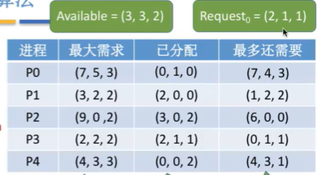

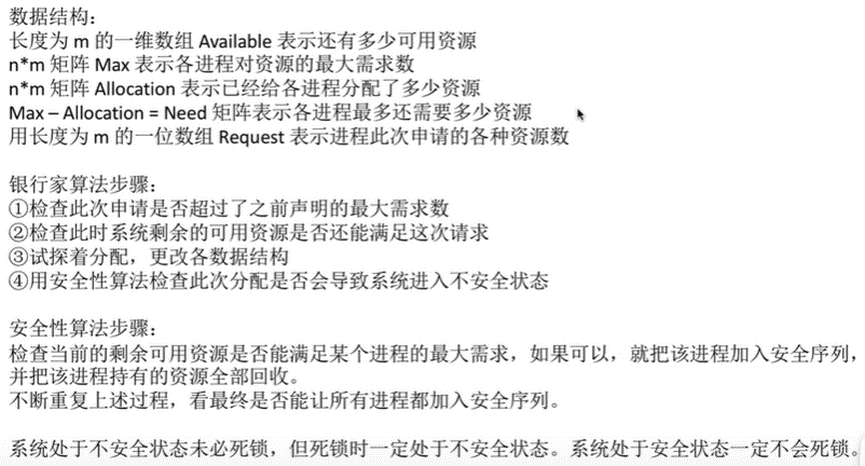

## 6.8.  单核机器上写多线程程序，是否需要考虑加锁，为什么？

- 在单核机器上写多线程程序，`仍然需要`线程锁。因为线程锁通常用来实现线程的`同步和通信`。在单核机器上的多线程程序，仍然存在线程同步的问题。因为在抢占式操作系统中，通常为每个线程分配一个时间片，当某个线程时间片耗尽时，操作系统会将其挂起，然后运行另一个线程。<u>如果这两个线程共享某些数据，不使用线程锁的前提下，可能会导致共享数据修改引起冲突。</u>


## 如何采用单线程的方式处理高并发

（这里指主线程为单线程）

在单线程模型中，可以采用`I/O复用`来提高单线程处理多个请求的能力

- 采用事件驱动模型`（epoll?）`，基于异步回调来处理事件，当遇到非常耗时的IO操作时，采用非阻塞的方式，继续执行后面的代码，并且进入事件循环，当IO操作完成时，程序会被通知IO操作已经完成。

- 协程的休眠和唤醒都是发生在用户态的，也就是说应用程序开发者要自己负责协程的休眠和唤醒。即，在向客户端发送请求以后（sendResult(0)），就会主动休眠(park)，一直到客户端把数据返回到服务端，再把协程唤醒(unpark)。

- 这个程序的基础仍然是`I/O复用`，也就是说我们只在socket上有数据的时候，才会去把协程唤醒，让协程去读取数据。

## 总结

开发过程中，<u>最常见的就是互斥锁</u>了，互斥锁加锁失败时，会用「线程切换」来应对，当加锁失败的线程再次加锁成功后的这一过程，会有`两次线程上下文切换的成本，性能损耗比较大`。

如果我们明确知道被锁住的代码的执行时间很短，那我们应该选择开销比较小的自旋锁，因为<u>自旋锁</u>加锁失败时，并不会主动产⽣线程切换，而是一直忙等待，直到获取到锁，那么如果被锁住的代码执行时间很短，那这个忙等待的时间相对应也很短。

<u>如果能区分读操作和写操作的场景，那读写锁就更合适了</u>，它允许多个读线程可以同时持有读锁，提高了读的并发性。根据偏袒读方还是写方，可以分为读优先锁和写优先锁，读优先锁并发性很强，但是写线程会被饿死，而写优先锁会优先服务写线程，读线程也可能会被饿死，那为了避免饥饿的问题，于是就有了公平读写锁，它是用队列把请求锁的线程排队，并保证先入先出的原则来对线程加锁，这样便保证了某种线程不会被饿死，通用性也更好点。

互斥锁和自旋锁都是最基本的锁，读写锁可以根据场景来选择这两种锁其中的一个进行实现。

另外，互斥锁、自旋锁、读写锁都属于悲观锁，悲观锁认为并发访问共享资源时，冲突概率可能非常高，所以在访问共享资源前，都需要先加锁。相反的，如果并发访问共享资源时，冲突概率非常低的话，就可以使用乐观锁，它的⼯作方 
式是，在访问共享资源时，不用先加锁，修改完共享资源后，再验证这段时间内有没有发⽣冲突，如果没有其他线程在修改资源，那么操作完成，如果发现有其他线程已经修改过这个资源，就放弃本次操作。

但是，一旦冲突概率上升，就不适合使用乐观锁了，因为它解决冲突的重试成本非常高。 

不管使用的哪种锁，我们的加锁的代码范围应该尽可能的小，也就是加锁的粒度要小，这样执行速度会比较快。再来，使用上了合适的锁，就会快上加快了。

# 7. 调度算法

## 进程调度算法


进程调度算法也称 `CPU 调度算法`，毕竟进程是由 CPU 调度的。

当 CPU 空闲时，操作系统就选择内存中的某个「就绪状态」的进程，并给其分配 CPU。

> 在进程的⽣命周期中，当进程从一个运行状态到另外一状态变化的时候，其实会触发一次调度。
>
> 比如，以下状态的变化都会触发操作系统的调度：
>
> - 从就绪态 -> 运行态：当进程被创建时，会进入到就绪队列，操作系统会从就绪队列选择一个进程运行；
> - 从运行态 -> 阻塞态：当进程发⽣ I/O 事件而阻塞时，<u>操作系统必须另外一个进程运行</u>； 
> - 从运行态 -> 结束态：当进程退出结束后，操作系统得从就绪队列选择另外一个进程运行；
>
> 有进程创建/就绪 有进程阻塞 有进程退出 

##### **什么时候会发生 CPU 调度？**

1. 当进程从运行状态转到等待状态； （非抢占）

   > 可能是运行要求的资源不满足 `进入阻塞`

2. 当进程从运行状态转到就绪状态；   （抢占）

   > 运行进程的时间片到了就会发⽣中断，于是后面的进程就会抢占正在运行的进程，从而占用 CPU。

3. 当进程从等待状态转到就绪状态；   （抢占）

   > 假设有一个进程是处于等待状态的，但是它的优先级比较高，如果该进程等待的事件发⽣了，它就会转到就绪状态，一旦它转到就绪状态，如果我们的调度算法是以优先级来进行调度的，那么它就会⽴⻢抢占正在运行的 
   > 进程，所以这个时候就会发⽣ CPU 调度。

4. 当进程从运行状态转到终⽌状态； （非抢占）

> ==等待就是等待资源 其实是（等待）阻塞状态==

其中发生在 1 和 4 两种情况下的调度称为「非抢占式调度」，2 和 3 两种情况下发⽣的调度称为「抢占式调度」。

- 非抢占式：当进程正在运行时，它就会一直运行，直到该进程完成或发生某个事件而被阻塞时，才会把 CPU 让给其他进程。
- 抢占式调度：进程正在运行的时，可以被打断，使其把 CPU 让给其他进程。 

那抢占的原则一般有三种，分别是`时间片`原则、`优先权`原则、`短作业优先`原则。

##### **常见的调度算法：**

- 先来先服务调度算法 
- 最短作业优先调度算法 
- 高响应比优先调度算法 
- 时间片轮转调度算法 
- 最高优先级调度算法 
- 多级反馈队列调度算法

### 1.1 先来先去服务 FCFS

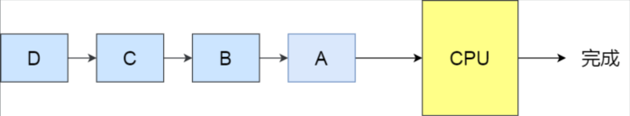

> 每次从就绪队列选择最先进入队列的进程，然后一直运行，直到进程退出或被阻塞，才会继续从队列中选择第一个进程接着运行

先来先去服务调度算法是一种最简单的调度算法，也称为`先进先出`或`严格排队`方案。当每个进程就绪后，它加入就绪队列。当前正运行的进程停止执行，<u>选择在就绪队列中存在时间最长的进程运行</u>。该算法既可以用于作业调度，也可以用于进程调度。先来先去服务比较`适合于长作业`（进程），而`不利于短作业`（进程）。

### 1.2 最短进程/作业优先

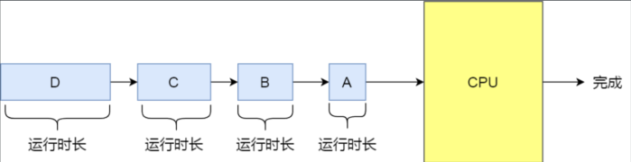

> 最短作业优先（Shortest Job First, SJF）调度算法同样也是顾名思义，它会优先选择运行时间最短的进程来运行，这有助于提高系统的吞吐量。

最短进程优先是一个`非抢占策略`，他的原则是`下一次选择预计处理时间最短的进程`，因此短进程将会越过长作业，跳至队列头。该算法即可用于作业调度，也可用于进程调度。但是<u>他对长作业不利，不能保证紧迫性作业（进程）被及时处理，作业的长短只是被估算出来的。</u>

==<u>**极端现象**</u>==：一个长作业在就绪队列等待运行，而这个就绪队列有非常多的短作业，那么就会使得长作业不断的往后推，周转时间变长，致使长作业长期不会被运行

### 1.3 最短剩余时间优先 

（==<u>**估计时间最短就不排队了 直接抢**</u>==）最短剩余时间是针对最短进程优先==**增加了抢占机制**==的版本。在这种情况下，进程调度总是选择预期剩余时间最短的进程。当一个进程加入到就绪队列时，他可能比当前运行的进程具有更短的剩余时间，因此只要新进程就绪，调度程序就能可能抢占当前正在运行的进程。像最短进程优先一样，调度程序正在执行选择函数是必须有关于处理时间的估计，并且存在长进程饥饿的危险。


### 1.4 ==<u>**时间片**</u>==轮转法

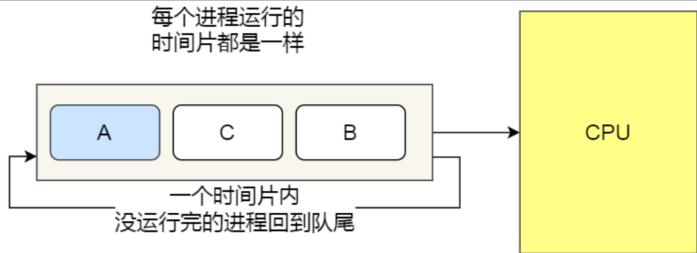

（`被抢占之前起码运行一段时间`）轮转法是基于适中的抢占策略的，以一个周期性间隔产生时钟中断，当中断发生后，当前正在运行的进程被置于就绪队列中，然后基于==**<u>先来先去</u>**==服务策略选择下一个就绪作业的运行。这种技术也称为时间片，因为每个进程再被抢占之前都给定一片时间。

> ==<u>**时间片的长度**</u>==就是一个很关键的点：
>
> - 如果时间片设得太短会导致`过多的进程上下文切换`，降低了 CPU 效率；  
> - 如果设得太长又可能引起对短作业进程的响应时间变长。 ==<u>？不利于短作业</u>==

### 1.5 最高优先权调度算法

> 进程的优先级可以分为，`静态优先级和动态优先级`：
>
> 1. 静态优先级：`创建`进程时候，就已经`确定`了`优先级`了，然后整个运行时间优先级都不会变化；
> 2. 动态优先级：根据进程的动态变化调整优先级，比如如果进程运行时间增加，则降低其优先级，如果进程等待时间（就绪队列的等待时间）增加，则升高其优先级，也就是<u>随着时间的推移增加等待进程的优先级</u>。

此算法常被用于批处理系统中，作为作业调度算法，也作为多种[**操作系统**](http://www.wypblog.com/archives/category/操作系统)中的进程调度算法，还可用于实时系统中。当把该算法用于作业调度时，系统将从后备队列中选择若干个优先权最高的作业装入内存。当用于进程调度时，该算法是把处理机分配给就绪队列中优先权最高的进程，这时，又可进一步把该算法分成如下两种。

1) 非抢占式优先权算法

在这种方式下，系统一旦把处理机分配给就绪队列中优先权最高的进程后，该`进程便一直执行下去，直至完成`；或因发生某事件使`该进程放弃处理机`时（==<u>完成或自己放弃</u>==），系统方可再将处理机重新分配给另一优先权`最高`的进程。这种调度算法主要用于批处理系统中；也可用于某些对实时性要求不严的实时系统中。

2) 抢占式优先权调度算法

在这种方式下，系统同样是把处理机分配给优先权最高的进程，使之执行。但在其执行期间，只要又出现了另一个其优先权更高的进程，进程调度程序就`立即停止`当前进程(原优先权最高的进程)的执行，`重新将处理机分配`给新到的优先权最高的进程。因此，在采用这种调度算法时，是每当系统中出现一个新的就绪进程i时，就将其优先权Pi与正在执行的进程j 的优先权Pj进行比较。如果Pi≤Pj，原进程Pj便继续执行；但如果是Pi>Pj，则立即停止Pj的执行，做进程切换，使i 进程投入执行。显然，这种抢占式的优先权调度算法能更好地满足紧迫作业的要求，故而常用于要求比较严格的实时系统中，以及对性能要求较高的批处理和分时系统中。

> 依然有缺点，<u>可能会导致低优先级的进程永远不会运行</u>。

### 1.6 最高响应比优先

（`照顾长时间进程`）根据比率：R=(w+s)/s （R为响应比，w为<u>等待处理的时间</u>，s为<u>预计的服务时间</u>）  ==(等待时间 + 服务时间) / 服务时间==

如果该进程被立即调用，则R值等于归一化周转时间（周转时间和服务时间的比率）。R最小值为1.0，只有第一个进入系统的进程才能达到该值。调度规则为：当前进程完成或被阻塞时，选择R值最大的就绪进程，它说明了进程的年龄。当偏向短作业时，长进程由于得不到服务，等待时间不断增加，从而增加比值，最终在竞争中赢了短进程。

和最短进程优先、最短剩余时间优先一样，使用最高响应比策略需要估计预计服务时间。  ==(相当于等待时间越长, 响应比(优先级)越高)==

> 如果两个进程的「==<u>**等待时间**</u>==」相同时，「==<u>**要求的服务时间**</u>==」越短，「响应比」就越高，这样短作业的进程容易被选中运行；
>
> 如果两个进程「要求的服务时间」相同时，「等待时间」越长，「响应比」就越高，这就兼顾到了长作业进程，因为进程的响应比可以随时间等待的增加而提高，当其等待时间足够长时，其响应比便可以升到很高，从而获得运行的机会

### 1.7 ==<u>**多级反馈队列调度算法**</u>==

多级反馈队列（Multilevel Feedback Queue）调度算法是「时间片轮转算法」和「最高优先级算法」的综合和发展。

- 「多级」表示有多个队列，每个队列优先级从高到低，同时优先级越高时间片越短。 
- 「反馈」表示如果有新的进程加入优先级高的队列时，⽴刻停⽌当前正在运行的进程，转而去运行优先级高的队列

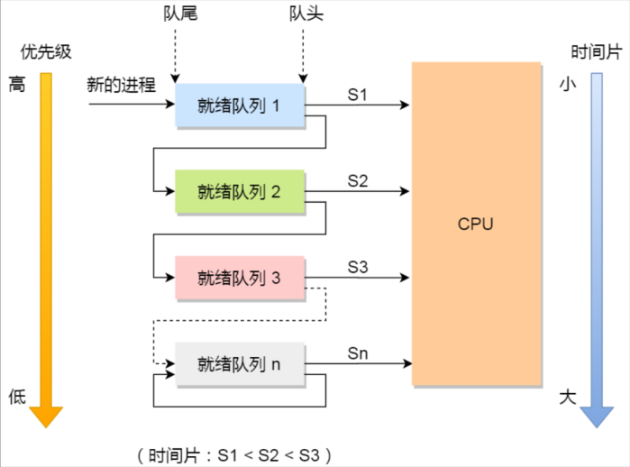

前面介绍的各种用作进程调度的算法都有一定的局限性。如短进程优先的调度算法，仅照顾了短进程而忽略了长进程，而且如果并未指明进程的长度，则短进程优先和基于进程长度的抢占式调度算法都将无法使用。而多级反馈队列调度算法则`不必事先知道各种进程所需的执行时间`，而且还可以满足各种类型进程的需要，因而它是目前被公认的一种`较好`的进程调度算法。在采用多级反馈队列调度算法的系统中，调度算法的实施过程如下所述。

`优先级越高 越靠前 时间越短 没完成扔到第二队列最后 时间变长 等待`

(1) 应设置多个就绪队列，并为各个队列赋予不同的优先级。第一个队列的优先级最高，第二个队列次之，其余各队列的优先权逐个降低。该算法赋予各个队列中进程执行时间片的大小也各不相同，在优先权愈高的队列中，为每个进程所规定的执行时间片就愈小。例如，第二个队列的时间片要比第一个队列的时间片长一倍，……，第i+1个队列的时间片要比第i个队列的时间片长一倍。

(2) 当一个新进程进入内存后，<u>首先将它放入`第一队列的末尾`</u>，按FCFS原则排队等待调度。当轮到该进程执行时，如它能在该时间片内完成，便可准备撤离系统；如果它在一个时间片结束时尚未完成，调度程序便将该进程转入第二队列的末尾，再同样地按FCFS原则等待调度执行；如果它在第二队列中运行一个时间片后仍未完成，再依次将它放入第三队列，……，如此下去，当一个长作业(进程)从第一队列依次降到第n队列后，在第n 队列便采取按时间片轮转的方式运行。

> 新来的放到第一个队列的末尾, 没运行完的话, 队列下降一级, 同时也保证了时间片翻倍, 然后再执行此步骤 直到运行完成

(3) 仅当第一队列空闲时，调度程序才调度第二队列中的进程运行；仅当第1～(i-1)队列均空时，才会调度第i队列中的进程运行。如果处理机正在第i队列中为某进程服务时，又有新进程进入优先权较高的队列(第1～(i-1)中的任何一个队列)，则此时新进程将抢占正在运行进程的处理机，即由调度程序把正在运行的进程放回到第i队列的末尾，把处理机分配给新到的高优先权进程。

#### 如何工作

- 设置了多个队列，赋予每个队列不同的优先级，每个队列`优先级从高到低`，同时`优先级越高时间片越短`；
- 新的进程会被放入到第一级队列的末尾，按先来先服务的原则排队等待被调度，如果在第一级队列规定的时间片没运行完成，则将其转入到第⼆级队列的末尾，以此类推，直至完成；
- 当较高优先级的队列为空，才调度较低优先级的队列中的进程运行。如果进程运行时，有新进程进入较高优先级的队列，则停⽌当前运行的进程并将其移入到原队列末尾，接着让较高优先级的进程运行；

> <u>对于短作业可能可以在第一级队列很快被处理完。对于长作业，如果在第一级队列处理不完，可以移入下次队列等待被执行，虽然等待的时间变长了，但是运行时间也会更长了，所以该算法很好的`兼顾了长短作业`，同时有较好的响应时间。</u>

## Unix、Linux与Windows进程调度策略的比较

> - linux进程分为两种: 实时进程 普通进程  (实时进程优先于普通进程)
>   1. 实时进程执行先来先去 和 时间片轮转
>   2. 普通进程执行 动态优先级策略 (抢占/非抢占?)
>
> - unix: 多级反馈队列
> - windows: 不同之处 调度的是线程  基于优先级的抢占和时间片

无论是在批处理系统还是分时系统中，用户进程数一般都多于处理机数、这将导致它们互相争夺处理机。另外，系统进程也同样需要使用处理机。这就要求进程调度程序按一定的策略，动态地把处理机分配给处于就绪队列中的某一个进程，以使之执行。 

**进程调度的实质是资源的分配**，如何使系统能够保持较短的响应时间和较高的吞吐量，如何在**多个可运行的进程**中选取一个**最值得运行的进程投入运行**是调度器的主要任务。进程调度包括两个方面的内容：何时分配CPU 时间（调度时机）即调度器什么时候启动；如何选择进程（调度算法）即调度器该怎么做。进程调度主要可以分为**非剥夺**方式与**剥夺**方式两种。

非剥夺方式：调度程序一旦把处理机分配给某进程后便让它**一直运行下去**，直到进程完成或发生某事件而阻塞时，才把处理机分配给另一个进程。 

剥夺方式：当一个进程正在运行时，系统可以基于某种原则，剥夺已分配给它的处理机，将之分配给其它进程。**剥夺原则有：优先权原则、短进程优先原则、时间片原则**。

Linux 从整体上区分实时进程和普通进程，因为实时进程和普通进程度调度是不同的，它们两者之间，实时进程应该先于普通进程而运行，然后，对于同一类型的不同进程，采用不同的标准来选择进程。对**普通进程**的调度策略是**动态优先调度**(动态优先级抢占调度)，对于**实时进程**采用了两种调度策略，**FIFO(先来先服务调度)和RR（时间片轮转调度）**。

UNIX系统是**单纯的分时系统**，所以没有设置作业调度。UNIX系统的进程调度采用的算法是，**多级反馈队列调度法**。其核心思想是先从最高休先级就绪队列中取出排在队列最前面的进程，当进程执行完一个时间片仍未完成则剥夺它的执行，将它放入到相应的队列中，取出下一个就绪进程投入运行，对于同一个队列中的各个进程，按照时间片轮转法调度。多级反馈队列调度算法即能使高优先级的作业得到响应又能使短作业（进程）迅速完成。但是它还是存在某些方面的不足，当**不断有新进程到来时，则长进程可能饥饿**。

Windows 系统其调度方式比较复杂，它的处理器调度的**调度单位是线程而不是进程**，是基于**优先级的抢占式多处理器调度**，依据优先级和分配时间片来调度。而且Windows 2000/XP在单处理器系统和多处理器系统中的线程调度是不同的线程调度机制，Windows操作系统的调度系统总是**运行优先级最高的就绪线程**。在**同一优先级的各线程按时间片轮转算法进行调度**。如果一个高优先级的线程进入就绪状态，**当前运行的线程可能在用完它的时间片之前就被抢占处理机。**

多任务、有线程优先级、多种中断级别这是现代操作系统的共同特点。实时操作系统（Real-time operating system, RTOS）最大的特点是**对响应时间有严格的要求**，linux尚且不能称为完全的实时操作系统，USA的宇宙飞船常用的操作系统是VxWorks，这才是闻名于世的RTOS。

## 内存页面置换算法

### 缺页异常（缺页中断）

当 CPU 访问的页面不在物理内存时，便会产⽣一个缺页中断，请求操作系统将所缺页调入到物理内存。那它与一般中断的主要区别在于：

- 缺页中断在指令执行「期间」产⽣和处理中断信号，而一般中断在一条指令执行「完成」后检查和处理中断信号。
- 缺页中断返回到该指令的开始重新执行「该指令」，而一般中断返回回到该指令的「下一个指令」执行。

> ==注意: 缺页异常并不是异常, 每次都通过缺页异常来分配物理页面==

### 缺页中断的处理流程

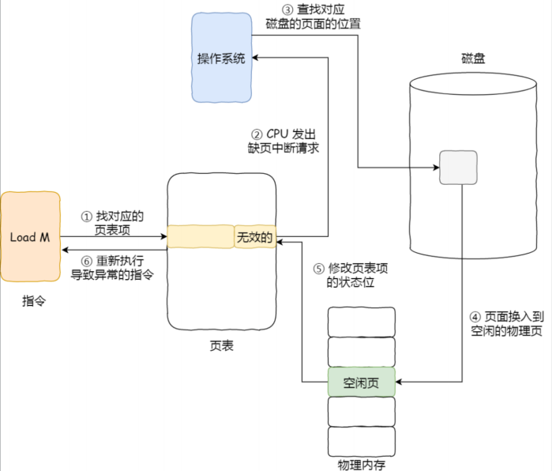

1.  在 CPU ⾥访问一条 `Load M` 指令，然后 CPU 会去找 M 所对应的页表项。
2.  如果该页表项的`状态位`是「有效的」，那 CPU 就可以直接去访问物理内存了，如果状态位是「无效的」，则 CPU 则会发送缺页中断请求。
3.  操作系统收到了`缺页中断`，则会执行缺页中断处理函数，先会查找该页面在磁盘中的页面的位置。
4.  找到磁盘中对应的页面后，需要把该页面换入到物理内存中，但是在换入前，需要`在物理内存中找空闲页`，如果找到空闲页，就把页面`换入到物理内存`中。  ==**主要是没有空闲页的话 选择哪个换出**==
5.  页面从磁盘换入到物理内存完成后，则把页表项中的`状态位修改`为「有效的」。
6.  最后，CPU `重新执行`导致`缺页异常`的指令。

第4步找不到空闲页的话，就说明此时内存已满了，这时候，就需要「页面置换算法」选择一个物理页，如果该物理页有被修改过（脏页），则把它换出到磁盘，然后把该被置换出去的页表项的状态改成「无效的」，最后把正在访问的页面装入到这个物理页中

> 注意这里是物理页 也就是那个4kb的块  而不是页表项

页表：


- 状态位：用于表示该页`是否有效`，也就是说是否在物理内存中，供程序访问时参考。 
- 访问字段：用于<u>记录该页在一段时间被访问的次数</u>，供页面置换算法选择出页面时参考。 
- 修改位：表示该页在调入内存后是否有被修改过，由于内存中的每一页都在磁盘上保留一份副本，因此，如果没有修改，在置换该页时就不需要将该页写回到磁盘上，以减少系统的开销；如果已经被修改，则将该页重写到磁盘上，以保证磁盘中所保留的始终是最新的副本。
- 硬盘地址：用于指出该页在硬盘上的地址，通常是`物理块号`，供调入该页时使用

页面置换算法的功能是，当出现缺页异常，需调入新页面而内存已满时，选择被置换的物理页面，也就是说选择一个物理页面换出到磁盘，然后把需要访问的页面换入到物理页。

那其算法目标则是，<u>尽可能减少页面的换入换出的次数</u>

常见的页面置换算法有如下⼏种：

- 最佳页面置换算法（OPT） 
- 先进先出置换算法（FIFO）
- 最近最久未使用的置换算法（LRU） 
- 时钟页面置换算法（Lock） 
- 最不常用置换算法（LFU）

### 最佳页面置换算法

最佳页面置换算法基本思路是，<u>置换在「未来」最长时间不访问的页面</u>。所以，该算法实现需要计算内存中每个逻辑页面的「下一次」访问时间，然后比较，选择未来最长时间不访问的页面。

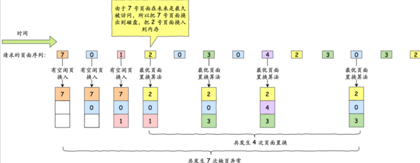

在这个请求的页面序列中，缺页共发⽣了7 次（空闲页换入 3 次 + 最优页面置换 4 次），页面置换共发⽣了4 次。

这很理想，但是实际系统中无法实现，因为程序访问页面时是动态的，我们是无法预知每个页面在「下一次」访问前的等待时间。

所以，最佳页面置换算法作用是为了衡量你的算法的效率，你的算法效率越接近该算法的效率，那么说明你的算法是高效的。

> 最佳页面置换算法是`已经知道页面调入顺序`的情况下 用来`衡量其他算法效率的参考算法`

### 先进先出置换算法

既然我们无法预知页面在下一次访问前所需的等待时间，那我们可以选择在内存驻留时间很长的页面进行中置换，这个就是「先进先出置换」算法的思想。

还是以前面的请求的页面序列作为例子，假设使用先进先出置换算法，则过程如下图：

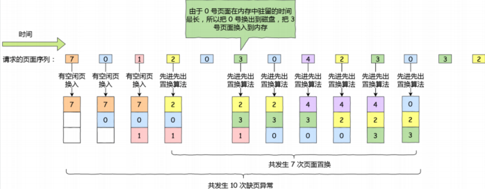

在这个请求的页面序列中，缺页共发⽣了10 次，页面置换共发⽣了7 次，跟最佳页面置换算法比较起来，性能明显差了很多。

### `最近最久未使用`的置换算法 LRU

最近最久未使用（`LRU`）的置换算法的基本思路是，发⽣缺页时，<u>选择最长时间没有被访问的页面进行置换，也就是说，该算法假设已经很久没有使用的页面很有可能在未来较长的一段时间内仍然不会被使用</u>。

这种算法近似最优置换算法，最优置换算法是通过「未来」的使用情况来推测要淘汰的页面，而 LRU 则是通过「历史」的使用情况来推测要淘汰的页面。

还是以前面的请求的页面序列作为例子，假设使用最近最久未使用的置换算法，则过程如下图：

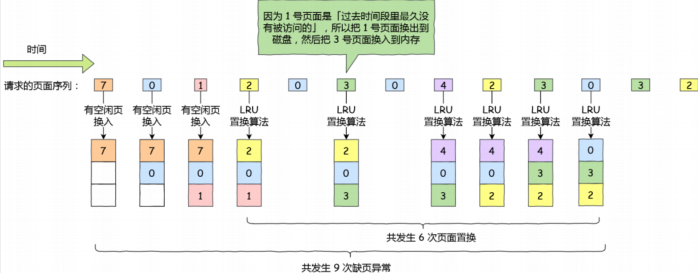

在这个请求的页面序列中，缺页共发⽣了9 次，页面置换共发⽣了6 次，跟先进先出置换算法比较起来，性能提高了一些。

虽然 LRU 在理论上是可以实现的，但代价很高。为了完全实现 LRU，需要在内存中维护一个所有页面的链表，最近最多使用的页面在表头，最近最少使用的页面在表尾。

困难的是，在每次访问内存时都必须要更新「整个链表」。在链表中找到一个页面，删除它，然后把它移动到表头是一个非常费时的操作。

所以，LRU 虽然看上去不错，但是由于<u>`开销比较大`，实际应用中比较少使用</u>。

### 时钟页面置换算法

> ==先进先出的链表首尾相连, 然后从最老的节点开始 查看访问位是不是0, 是0则置换, 不是0则置为0, 指针前进==

那有没有一种即能优化置换的次数，也能方便实现的算法呢？

时钟页面置换算法就可以两者兼得，<u>它跟 LRU 近似，⼜是对 FIFO 的一种改进</u>。

该算法的思路是，把所有的页面都保存在一个类似钟面的「环形链表」中，一个表针指向最老的页面。

当发⽣缺页中断时，算法首先检查表针指向的页面：

- <u>如果它的访问位是 0 就淘汰该页面，并把新的页面插入这个位置，然后把表针前移一个位置</u>；
- <u>如果访问位是 1 就清除访问位，并把表针前移一个位置，重复这个过程直到找到了一个访问位为 0 的页面为⽌</u>；

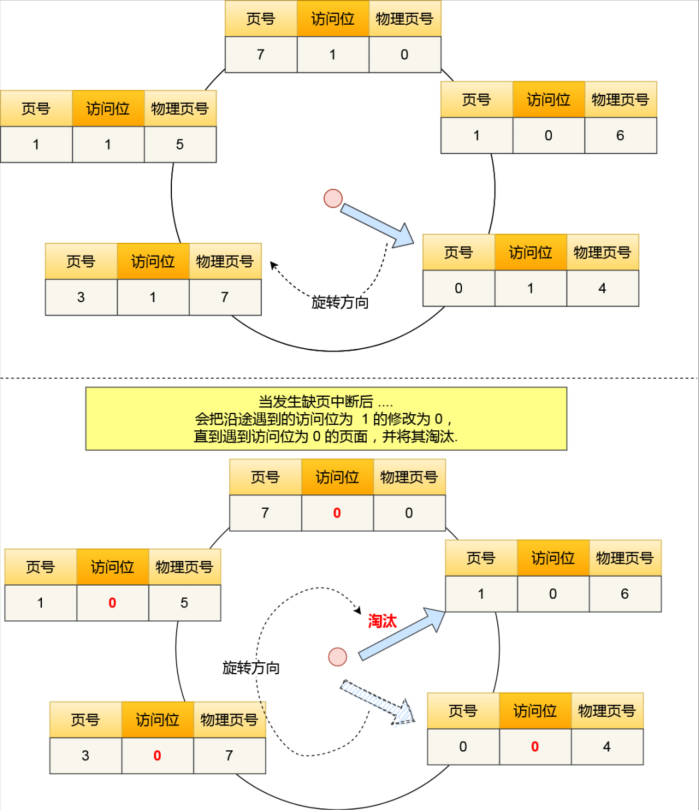

### 最不常用算法==LFU==

发⽣缺页中断时，选择`「访问次数」最少`的那个页面，并将其淘汰。

它的实现方式是，对每个页面设置一个「==<u>**访问计数器**</u>==」，每当一个页面被访问时，该页面的访问计数器就累加 1。在发⽣缺页中断时，淘汰计数器值最小的那个页面。

看起来很简单，每个页面加一个计数器就可以实现了，但是在操作系统中实现的时候，我们需要考虑效率和硬件成本的。

要增加一个计数器来实现，这个硬件成本是比较高的，另外如果要对这个计数器查找哪个页面访问次数最小，查找链表本身，如果链表长度很大，是非常耗时的，效率不高。

但还有个问题，LFU 算法只考虑了频率问题，<u>`没考虑时间的问题`</u>，比如有些页面在过去时间⾥访问的频率很高，但是现在已经没有访问了，而当前频繁访问的页面由于没有这些页面访问的次数高，在发⽣缺页中断时，就会可能会误伤当前<u>刚开始频繁访问</u>，但访问次数还不高的页面。

那这个问题的解决的办法还是有的，可以定期减少访问的次数，比如<u>当发⽣缺页中断时，把过去时间访问的页面的访问次数除以 2</u>，也就说，随着时间的流失，以前的高访问次数的页面会慢慢减少，相当于加大了被置换的概率。

## 磁盘调度算法


# 8. IO操作/网络系统

## 文件IO

> **I/O**（英语：**I**nput/**O**utput），即**输入／输出**，通常指[数据](https://zh.wikipedia.org/wiki/数据)在[存储器](https://zh.wikipedia.org/wiki/存储器)（内部和外部）或其他周边设备之间的输入和输出

文件的读写方式各有千秋，对于文件的 I/O 分类也非常多，常见的有

- 缓冲与非缓冲 I/O 
- 直接与非直接 I/O
- 阻塞与非阻塞 I/O VS 同步与异步 I/O 

**<u>==I/O 是分为两个过程的：==</u>**

1.  **<u>==数据`准备`的过程==</u>**
2.  **<u>==数据从内核空间`拷贝`到用户进程缓冲区的过程==</u>**

### 缓冲与非缓冲 I/O

文件操作的标准库是可以实现数据的缓存，那么根据「==<u>**是否利用标准库缓冲**</u>==」，可以把文件 I/O 分为缓冲 I/O 和非缓冲 I/O：

- 缓冲 I/O，利用的是标准库的缓存实现文件的加速访问，而标准库再通过系统调用访问文件。
- 非缓冲 I/O，直接通过系统调用访问文件，不经过标准库缓存。 

> 这⾥所说的「缓冲」`特指标准库内部实现的缓冲`。
>
> 比方说，很多程序遇到换行时才真正输出，而换行前的内容，其实就是被标准库暂时缓存了起来，这样做的目的是，减少系统调用的次数，毕竟系统调用是有 CPU 上下文切换的开销的。

### 直接与非直接 I/O  

==<u>**是否进行页缓存**</u>==

磁盘 I/O 是非常慢的，所以 Linux 内核为了减少磁盘 I/O 次数，在系统调用后，会把用户数据拷贝到内核中缓存起来，这个内核缓存空间也就是「页缓存」，只有当缓存满足某些条件的时候，才发起磁盘 I/O 的请求。

那么，根据<u>`是否利用操作系统的缓存`</u>，可以把文件 I/O 分为直接 I/O 与非直接 I/O：

- 直接 I/O，不会发⽣内核缓存和用户程序之间数据复制，而是直接经过文件系统访问磁盘。
- 非直接 I/O，读操作时，数据从内核缓存中拷贝给用户程序，写操作时，数据从用户程序拷贝给内核缓存，再由内核决定什么时候写入数据到磁盘。

如果你在使用文件操作类的系统调用函数时，指定了`O_DIRECT` 标志，则表示使用直接I/O。如果没有设置过，<u>默认使用的是非直接 I/O</u>。

> 如果用了非直接 I/O 进行写数据操作，内核什么情况下才会把缓存数据写入到磁盘？
>
> - 在调用write 的最后，当发现`内核缓存的数据太多`的时候，内核会把数据写到磁盘上；    ==数据太多==
> - 用户`主动调用sync` ，内核缓存会刷到磁盘上；  ==主动调用==
> - 当内存⼗分紧张，`无法再分配页面时`，也会把内核缓存的数据刷到磁盘上；   ==内存紧张==
> - 内核缓存的数据的缓存时间`超过某个时间`时，也会把数据刷到磁盘上  ==缓存超时==


### 阻塞与非阻塞 I/O VS 同步与异步 I/O

> ==数据准备== 和 ==数据拷贝==

- 阻塞 I/O: 当用户程序执行read，线程会被阻塞，一直等到内核数据准备好，并把数据从内核缓冲区拷贝到应用程序的缓冲区中，当拷贝过程完成，read 才会返回。

  > 注意，阻塞等待的是「`内核数据准备好`」和「`数据从内核态拷贝到用户态`」这两个过程。

- 非阻塞 I/O：<u>非阻塞的 read 请求在数据未准备好的情况下⽴即返回，可以继续往下执行</u>，此时应用程序不断轮询内核，直到数据准备好，内核将数据拷贝到应用程序缓冲区， read 调用才可以获取到结果。

  > 访问管道或 socket 时，如果设置了    O_NONBLOCK 标志，那么就表示使用的是非阻塞 I/O 的方式访问，而不做任何设置的话，`默认是阻塞 I/O`。

- 为了解决这种傻乎乎轮询方式，于是  I/O 多路复用技术就出来了，如 select、poll，它是通过I/O 事件分发，当内核数据准备好时，再`以事件通知应用程序进行操作`。

  > 无论是阻塞 I/O、非阻塞 I/O，还是基于非阻塞 I/O 的多路复用==都是同步调用==。因为它们在 read 调用时，==内核将数据从内核空间拷贝到应用程序空间，过程都是需要等待的==，也就是说这个过程是同步的，如果内核实现的拷贝效率不高, read 调用就会在这个同步过程中等待比较长的时间。

- 异步 I/O:「内核数据准备好」和「数据从内核态拷贝到用户态」这两个过程都不用等待。

  > 当我们发起 aio_read 之后，就⽴即返回，内核自动将数据从内核空间拷贝到应用程序空间，这个拷贝过程同样是异步的，内核自动完成的，和前面的同步操作不一样，应用程序并不需要主动发起拷贝动作。


## [介绍一下5种IO模型](https://www.jianshu.com/p/486b0965c296)

1. `阻塞IO`:调用者调用了某个函数，等待这个函数返回，期间什么也不做，不停的去检查这个函数有没有返回，必须等这个函数返回才能进行下一步动作  ==<u>（等待 的准备好了才能继续）</u>==
2. `非阻塞IO`:非阻塞等待，每隔一段时间就去检测IO事件是否就绪。没有就绪就<u>==可以做其他事==</u>。
3. `信号驱动IO`:linux用套接口进行信号驱动IO，安装一个信号处理函数，进程继续运行并不阻塞，当IO时间就绪，进程收到SIGIO信号。然后处理IO事件。 <u>==（不是我去循环检查你好没好，而是你好了告诉我）==</u>
4. `IO复用/多路`转接IO:linux用<u>==select/poll==</u>函数实现IO复用模型，这两个函数也会使进程阻塞，但是和阻塞IO所不同的是这两个函数可以同时阻塞多个IO操作。而且可以同时对多个读操作、写操作的IO函数进行检测。知道有数据可读或可写时，才真正调用IO操作函数 <u>==（批处理）==</u>
5. `异步IO`:linux中，可以调用aio_read函数告诉内核描述字缓冲区指针和缓冲区的大小、文件偏移及通知的方式，然后立即返回，当内核将数据拷贝到缓冲区后，再通知应用程序。   <u>==（告知你我要什么，你自己给我送过来 然后再通知我）==</u>


## Linux系统是如何收发网络包的

### 网络模型

七层osi/四层tcp/ip

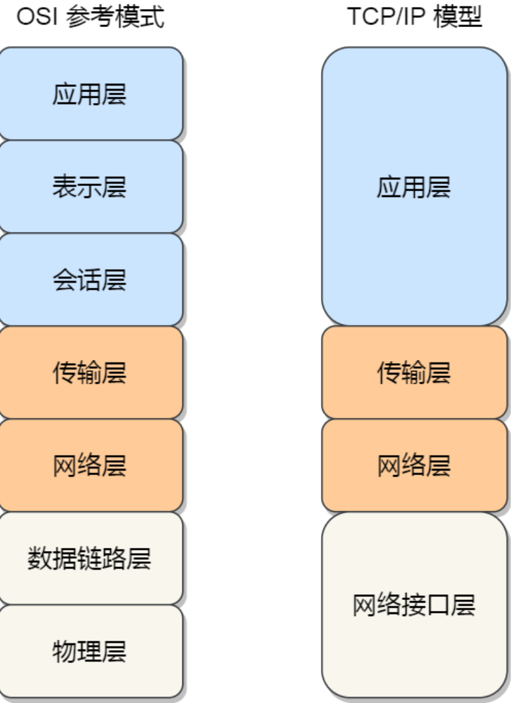

### Linux 网络协议栈

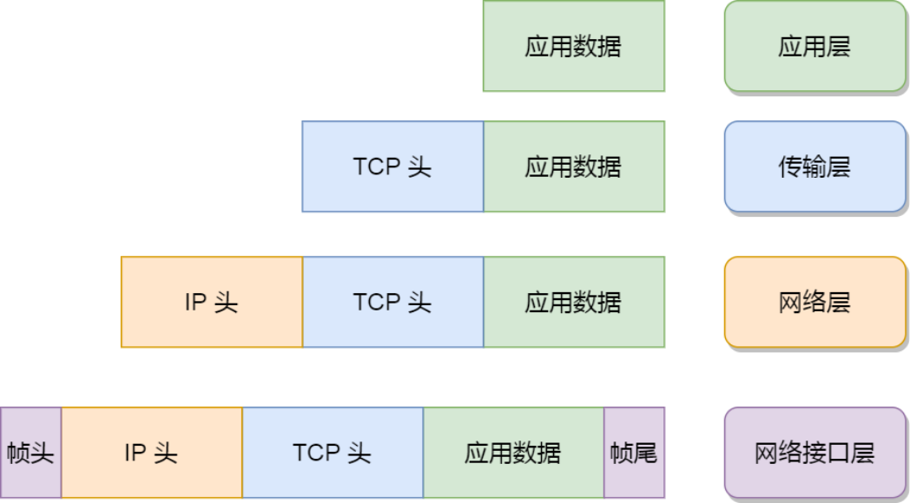

> - 传输层，给应用数据前面增加了 TCP 头；
> - 网络层，给 TCP 数据包前面增加了 IP  头；
> - 网络接⼝层，给 IP 数据包前后分别增加了帧头和帧尾

这些新增和头部和尾部，都有各自的作用，也都是按照特定的协议格式填充，这每一层都增加了各自的协议头，那自然网络包的大小就增大了，但物理链路并不能传输任意大小的数据 包，所以在以太网中，**规定了最大传输单元（MTU）是 1500 字节**，也就是规定了单次传输的最大 IP 包大小。当网络包超过 MTU 的大小，就会在网络层分片，以确保分片后的 IP 包不会超过 MTU 大小，如果 MTU 越小，需要的分包就越多，那么网络吞吐能力就越差，相反的，如果 MTU 越大，需要的分包就越小，那么网络吞吐能力就越好。

知道了 TCP/IP 网络模型，以及网络包的封装原理后，那么 Linux 网络协议栈的样子，你想必猜到了大概，它其实就类似于 TCP/IP 的四层结构：

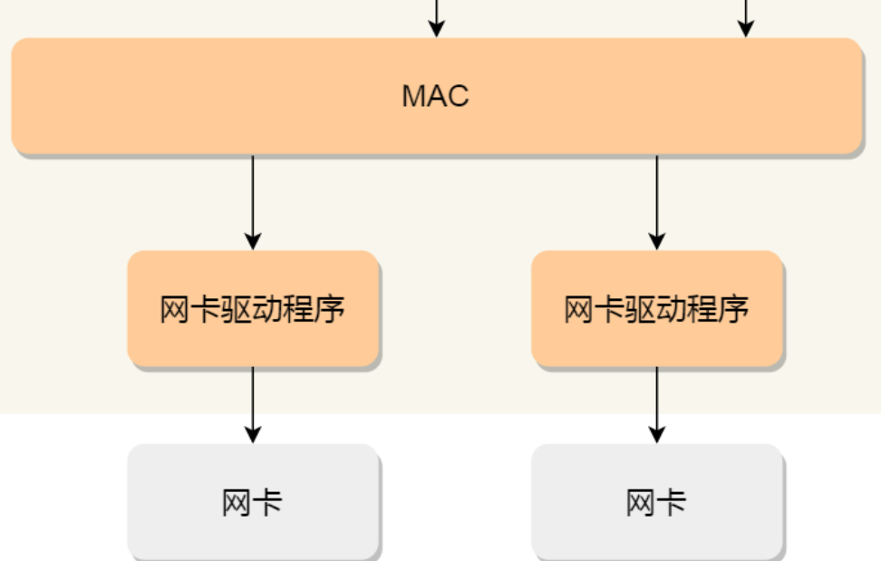

> - 应用程序需要通过系统调用，来跟 Socket 层进行数据交互； 
> - Socket 层的下面就是传输层、网络层和网络接⼝层；
> - 最下面的一层，则是网卡驱动程序和硬件网卡设备

### Linux 接收网络包的流程

网卡是计算机⾥的一个硬件，专⻔负责接收和发送网络包，当网卡接收到一个网络包后，会通过 `DMA 技术`，将网络包放入到 `Ring Buffer`，这个是一个环形缓冲区。

> 数据到达 采用==NAPI机制==，不采用中断的方式读取数据
>
> 当有网络包到达时，网卡发起硬件中断，于是会执行网卡硬件中断处理函数，中断处理函数处理完需要「`暂时屏蔽中断`」，然后唤醒「软中断」来轮询处理数据，直到没有新数据时才恢复中断，这样一次中断处理多个网络包，于是就可以降低网卡中断带来的性能开销。
>
> 理解：数据到达
>
> 1. 网卡`硬件中断` ==唤醒软中断== 然后该干啥干啥
> 2. 软中断：`poll进行轮询`

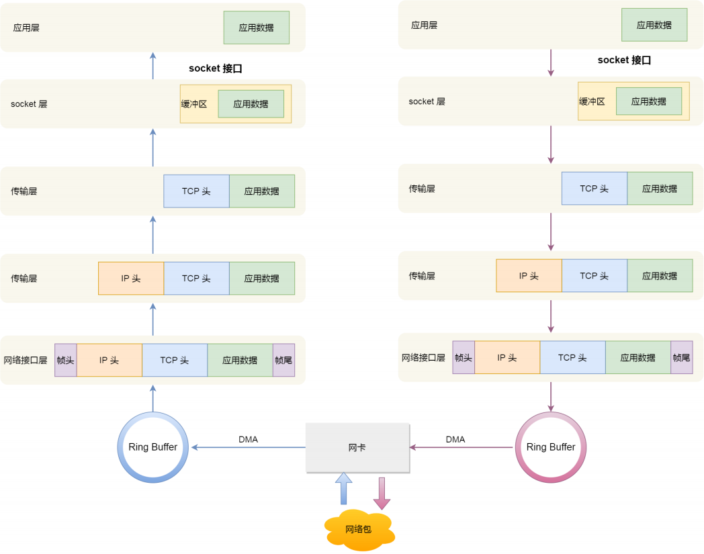

> - 首先，会先进入到网络接⼝层，在这一层会检查报文的合法性，如果不合法则丢弃，合法则会找出该网络包的上层协议的类型，比如是 IPv4，还是 IPv6，接着再去掉帧头和帧尾，然后交给网络层。
> - 到了网络层，则取出 IP 包，判断网络包下一步的⾛向，比如是交给上层处理还是转发出去。 当确认这个网络包要发送给本机后，就会从 IP 头⾥看看上一层协议的类型是 TCP 还是UDP，接着去掉 IP 头，然后交给传输层。
> - 传输层取出 TCP 头或 UDP 头，根据四元组「源 IP、源端⼝、目的 IP、目的端⼝」  作为标识，找出对应的 Socket，并把数据拷贝到 Socket 的接收缓冲区。
> - 最后，应用层程序调用 Socket 接⼝，从内核的 Socket 接收缓冲区读取新到来的数据到应用层。
> - 至此，一个网络包的接收过程就已经结束了，你也可以从下图左边部分看到网络包接收的流程，右边部分刚好反过来，它是网络包发送的流程。

### Linux 发送网络包的流程

如上图的有半部分，发送网络包的流程正好和接收流程相反。

- 首先，应用程序会调用 Socket 发送数据包的接⼝，由于这个是系统调用，所以会从用户态陷入到内核态中的 Socket 层，Socket 层会将应用层数据拷贝到 Socket 发送缓冲区中。
- 接下来，网络协议栈从 Socket 发送缓冲区中取出数据包，并按照 TCP/IP 协议栈从上到下逐层处理。
- 如果使用的是 TCP 传输协议发送数据，那么会在传输层增加 TCP 包头，然后交给网络层，网络层会给数据包增加 IP 包，然后通过查询路由表确认下一跳的 IP，并按照 MTU 大小进行分片。分片后的网络包，就会被送到网络接⼝层，在这⾥会通过 ARP 协议获得下一跳的 MAC 地址，然后增加帧头和帧尾，放到发包队列中。
- 这一些准备好后，会触发软中断告诉网卡驱动程序，这⾥有新的网络包需要发送，最后驱动程序通过 DMA，从发包队列中读取网络包，将其放入到硬件网卡的队列中，随后物理网卡再将它发送出去。

### 总结

电脑与电脑之间通常都是通话<u>网卡、交换机、路由器</u>等网络设备连接到一起，那由于网络设备的异构性，国际标准化组织定义了一个七层的 OSI 网络模型，但是这个模型由于比较复杂，实际应用中并没有采用，而是采用了更为简化的 `TCP/IP 模型`，Linux 网络协议栈就是按照了该模型来实现的。

TCP/IP 模型主要分为`应用层、传输层、网络层、网络接⼝层`四层，每一层负责的职责都不同，这也是 Linux 网络协议栈主要构成部分。

当应用程序通过 Socket 接⼝发送数据包，数据包会被网络协议栈从上到下进行逐层处理后，才会`被送到网卡队列`中，随后由网卡将网络包发送出去。

而在接收网络包时，同样也要先经过网络协议栈从下到上的逐层处理，最后才会被送到应用程序

## 零拷贝

磁盘可以说是计算机系统最慢的硬件之一，读写速度相差内存 10 倍以上，所以针对优化磁盘的技术非常的多，比如零拷贝、直接 I/O、异步 I/O 等等，这些优化的目的就是为了提高系统 的吞吐量，另外操作系统内核中的磁盘高速缓存区，可以有效的减少磁盘的访问次数。

这次，我们就以「文件传输」作为切入点，来分析 I/O ⼯作方式，以及如何优化传输文件的性能。

### 为什么要有 DMA 技术

> （Direct Memory Access）直接内存访问

在没有 DMA 技术前，I/O 的过程是这样的：

- CPU 发出对应的指令给磁盘控制器，然后返回；
- 磁盘控制器收到指令后，于是就开始准备数据，会把数据放入到磁盘控制器的内部缓冲区中，然后产⽣一个中断；
- CPU 收到中断信号后，停下⼿头的⼯作，接着把磁盘控制器的缓冲区的数据一次一个字节地读进自⼰的寄存器，然后再把寄存器⾥的数据写入到内存，而在数据传输的期间 CPU 是无法执行其他任务的。

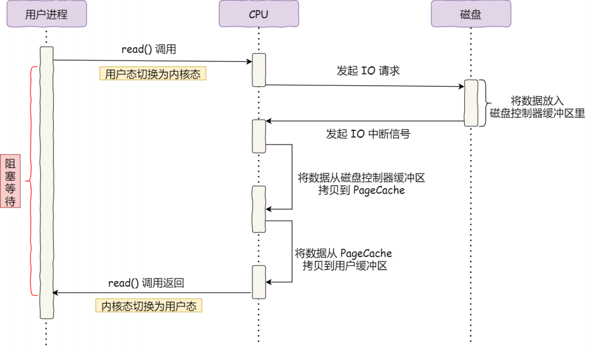

> <u>整个数据的传输过程，都要需要 CPU 亲自参与搬运数据的过程，而且这个过程，CPU 是不能做其他事情的。</u>

### DMA 技术

在进行 I/O 设备和内存的数据传输的时候，数据搬运的⼯作全部交给 DMA 控制器，而 CPU 不再参与任何与数据搬运相关的事情，这样 CPU 就可以去处理别的事务

> 意思就是==数据搬运工作全部交给了DMA，不直接占用CPU==


**具体过程：**

- 用户进程调用 read 方法，向操作系统发出 I/O 请求，请求读取数据到自⼰的内存缓冲区中，进程进入阻塞状态；
- 操作系统收到请求后，==<u>**进一步将 I/O 请求发送 DMA，然后让 CPU 执行其他任务**</u>==； 
- DMA 进一步将 I/O 请求发送给磁盘；
- 磁盘收到 DMA 的 I/O 请求，把数据从磁盘读取到磁盘控制器的缓冲区中，当磁盘控制器的缓冲区被读满后，向 DMA 发起中断信号，告知自⼰缓冲区已满；
- DMA 收到磁盘的信号，将磁盘控制器缓冲区中的数据拷贝到内核缓冲区中，此时不占用CPU，CPU 可以执行其他任务；
- ==<u>**当 DMA 读取了足够多的数据，就会发送中断信号给 CPU**</u>==；
- CPU 收到 DMA 的信号，知道数据已经准备好，于是将数据从内核拷贝到用户空间，系统调用返回；

整个数据传输的过程，<u>CPU 不再参与数据搬运的⼯作</u>，而是全程由 DMA 完成，<u>但是 CPU 在这个过程中也是必不可少的，因为传输什么数据，从哪⾥传输到哪⾥，都需要CPU 来`告诉` DMA 控制器。</u>

### 文件传输性能

#### 传统的问题

如果服务端要提供文件传输的功能，我们能想到的最简单的方式是：将磁盘上的文件读取出来，然后通过网络协议发送给客户端。

传统 I/O 的⼯作方式是，数据读取和写入是从用户空间到内核空间来回复制，而内核空间的数据是通过操作系统层面的 I/O 接⼝从磁盘读取或写入。

代码通常如下，一般会需要两个系统调用：

```c++
read(file, tmp_buf, len); 
write(socket, tmp_buf, len);
```

发生了什么：

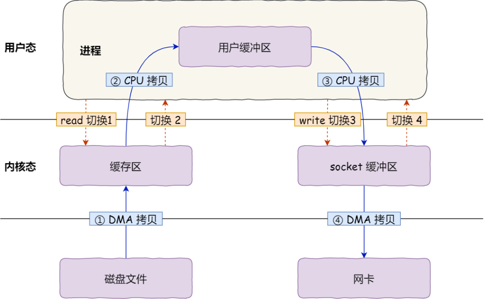

- 首先，期间共发⽣了 4 次用户态与内核态的上下文切换，因为发⽣了两次系统调用，一次是read() ，一次是 write() ，每次系统调用都得先从用户态切换到内核态，等内核完成任务后，再从内核态切换回用户态。
- 其次，还发⽣了 4 次数据拷贝，其中两次是 DMA 的拷贝，另外两次则是通过 CPU 拷贝的

要想提高文件传输的性能，就需要减少「`用户态与内核态的上下文切换`」和「`内存拷贝`」的次数。

#### 如何优化

1. 要想减少上下文切换到次数，就要减少系统调用的次数。
2. 因为文件传输的应用场景中，在<u>用户空间我们并不会对数据「再加⼯」</u>，所以数据实际上可以不用搬运到用户空间，因此用户的缓冲区是没有必要存在的。

### 如何实现零拷贝

> 两次无效的内存拷贝: 内核态缓冲区->用户态缓冲区->内核态缓冲区
>
> 方案: 内核态缓冲区 直接映射到 用户到缓冲区 减少一次数据拷贝

##### 1.mmap + write 也就是内存映射

```c++
buf = mmap(file, len); 
write(sockfd, buf, len);
```

mmap() 系统调用函数会直接把内核缓冲区⾥的数据「映射」到用户空间，这样，操作系统内核与用户空间就不需要再进行任何的数据拷贝操作。


> - 应用进程调用了mmap() 后，DMA 会把磁盘的数据拷贝到内核的缓冲区⾥。接着，应用进程跟操作系统内核「共享」这个缓冲区；
> - 应用进程再调用write() ，操作系统直接将内核缓冲区的数据拷贝到 socket 缓冲区中，这一切都发⽣在内核态，由 CPU 来搬运数据；
> - 最后，把内核的 socket 缓冲区⾥的数据，拷贝到网卡的缓冲区⾥，这个过程是由 DMA搬运的

通过<u>使用mmap() 来代替read()</u>，可以减少一次数据拷贝的过程。

##### 2. sendfile

在 Linux 内核版本 2.1 中，提供了一个专⻔发送文件的系统调用函数sendfile() ，函数形式如下：

```c++
#include <sys/socket.h>
ssize_t sendfile(int out_fd, int in_fd, off_t *offset, size_t count);
```

首先，它可以替代前面的read() 和write() 这两个系统调用，这样就可以减少一次系统调用，也就减少了 2 次上下文切换的开销。

其次，该系统调用，可以直接把内核缓冲区⾥的数据拷贝到 socket 缓冲区⾥，不再拷贝到用户态，这样就只有 2 次上下文切换，和 3 次数据拷贝


> 但是 这并不是真正的零拷贝

==**<u>SG-DMA</u>**==

从 Linux 内核2.4 版本开始起，对于⽀持网卡⽀持 `SG-DMA` 技术的情况下， sendfile() 系统调用的过程发⽣了点变化，具体过程如下：

- 第一步，通过 DMA 将磁盘上的数据拷贝到内核缓冲区⾥；

- 第⼆步，缓冲区描述符和数据长度传到 socket 缓冲区，这样网卡的 SG-DMA 控制器就可以直接将内核缓存中的数据拷贝到网卡的缓冲区⾥，此过程不需要将数据从操作系统内核缓冲区拷贝到 socket 缓冲区中，这样就减少了一次数据拷贝；
  
> 只进行了 2 次数据拷贝

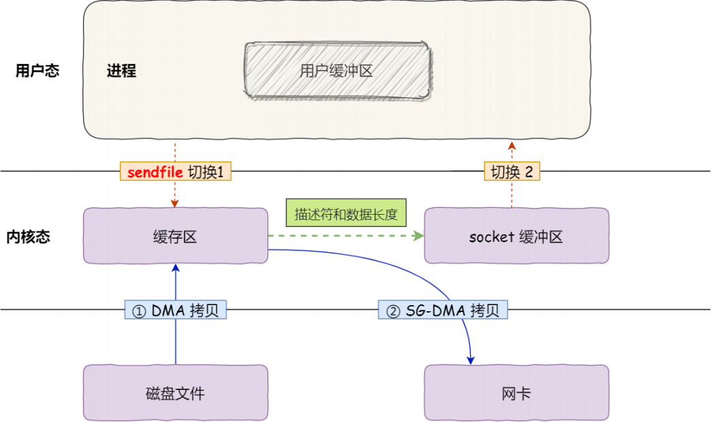

这就是所谓的`零拷贝（Zero-copy）技术`，<u>因为我们没有在内存层面去拷贝数据，也就是说==全程没有通过 CPU 来搬运数据==，所有的数据都是通过 DMA 来进行传输的</u>。。

零拷贝技术的文件传输方式相比传统文件传输的方式，减少了 2 次上下文切换和数据拷贝次数，只需要 2 次上下文切换和数据拷贝次数，就可以完成文件的传输，而且 2 次的数据拷贝 
过程，都不需要通过 CPU，2 次都是由 DMA 来搬运。

<u>所以，总体来看，零拷贝技术可以把文件传输的性能提高至少一倍以上。</u>

### PageCache 有什么作用？  缓存 + 预读

> 作用:
>
> 1. ==缓存==最近被访问的数据
> 2. ==预读==后面的一部分数据
>
> 好处:
>
> 1. 缓存加速数据访问
> 2. 预读减少IO次数
>
> 劣势:
>
> 1. 需要占用`额外物理内存空间`, 物理内存在比较紧俏的时候可能会导致频繁的 swap 操作，最终导致系统的磁盘 I/O 负载的上升。
> 2. 对`应用层`并没有提供很好的管理 `API`，几乎是透明管理。应用层即使想优化 Page Cache 的使用策略也很难进行。因此一些应用选择在用户空间实现自己的 page 管理，而不使用 page cache，例如 MySQL InnoDB 存储引擎以 16KB 的页进行管理。
> 3. 在某些应用场景下比 Direct I/O `多一次`磁盘读 I/O 以及磁盘写 I/O。

「内核缓冲区」实际上是磁盘高速缓存（PageCache）

读写磁盘相比读写内存的速度慢太多了，所以我们应该想办法把「读写磁盘」替换成「读写内存」。于是，我们会通过 DMA 把磁盘⾥的数据搬运到内存⾥，这样就可以用读内存替换读磁盘。

程序运行的时候，具有「局部性」，所以通常，刚被访问的数据在短时间内再次被访问的概率很高，于是我们可以用 PageCache 来缓存最近被访问的数据，当空间不足时淘汰最久未被访问的缓存。

> PageCache 使用了「==<u>**预读功能**</u>==」:
>
> 比如，假设 read 方法每次只会读 32 KB 的字节，虽然 read 刚开始只会读 0 ～ 32 KB 的字节，但内核会把其后面的 32～64 KB 也读取到 PageCache，这样后面读取 32～64 KB 的成本就很低，如果在 32～64 KB 淘汰出 PageCache 前，进程读取到它了，收益就非常大

PageCache 的优点主要是两个：

1. 缓存最近被访问的数据； 
2. 预读功能；

但是，<u>在传输大文件（GB 级别的文件）的时候，PageCache 会不起作用</u>，那就白白浪费DMA 多做的一次数据拷贝，造成性能的降低，即使使用了 PageCache 的零拷贝也会损失性能

> 1. PageCache 由于长时间	被大文件占据，其他「热点」的小文件可能就无法充分使用到PageCache，于是这样磁盘读写的性能就会下降了；
> 2. PageCache 中的大文件数据，由于没有享受到缓存带来的好处，但却耗费 DMA 多拷贝到 PageCache 一次

### 大文件传输用什么方式实现？

前面也提到，大文件的传输不应该使用 PageCache，因为可能由于 PageCache 被大文件占据，而导致「热点」小文件无法利用到 PageCache。

> 不使用缓存 即==直接IO==

于是，在高并发的场景下，针对大文件的传输的方式，应该使用「`异步 I/O + 直接 I/O`」来替代零拷贝技术。

所以，传输文件的时候，我们要根据文件的大小来使用不同的方式：

1. <u>传输大文件的时候，使用「==异步== I/O + ==直接== I/O」</u>
2. <u>传输小文件的时候，则使用「==零拷贝==技术」</u>

在 `nginx` 中，我们可以用如下配置，来根据文件的大小来使用不同的方式：

```c++
location /video/ { 
    sendfile on; 
    aio on;
    directio 1024m; 
}
```

当文件大小大于directio 值后，使用「异步 I/O + 直接 I/O」，否则使用「零拷贝技术」

### 进程写文件时，进程发生了崩溃，已写入的数据会丢失吗

答案，是不会的。

> 进程对应的只是内存 而文件的读写是存储在页缓存的
>
> 系统对应的才是内核页缓存
>
> 只有系统崩溃, 页缓存才会完蛋, 数据才会丢失

因为进程在执行 write （使用缓冲 IO）系统调用的时候，实际上是将文件数据写到了内核的 page cache，它是文件系统中用于缓存文件数据的缓冲，所以即使进程崩溃了，文件数据还是保留在内核的 page cache，我们读数据的时候，也是从内核的 page cache 读取，因此还是依然读的进程崩溃前写入的数据。

==内核会找个合适的时机，将 page cache 中的数据持久化到磁盘==。但是如果 page cache 里的文件数据，在持久化到磁盘化到磁盘之前，`系统发生了崩溃`，那这部分数据就会丢失了。

当然， 我们也可以在程序里调用 fsync 函数，在写文文件的时候，立刻将文件数据持久化到磁盘，这样就可以解决系统崩溃导致的文件数据丢失的问题。

### 总结

早期 I/O 操作，内存与磁盘的数据传输的⼯作都是由 CPU 完成的，而此时 CPU 不能执行其他任务，会特别浪费 CPU 资源。

于是，为了解决这一问题，DMA 技术就出现了，<u>每个 I/O 设备都有自⼰的 DMA 控制器，通过这个 DMA 控制器，`CPU 只需要告诉 DMA 控制器`，我们要传输什么数据，从哪⾥来，到哪⾥去，就可以放心离开了</u>。后续的实际数据传输⼯作，都会由 DMA 控制器来完成，CPU不需要参与数据传输的⼯作。

传统 IO 的⼯作方式，从硬盘读取数据，然后再通过网卡向外发送，我们需要进行 4 次上下文切换，和 4 次数据拷贝，其中 2 次数据拷贝发⽣在内存⾥的缓冲区和对应的硬件设备之间，这 
个是由 DMA 完成，另外 2 次则发⽣在内核态和用户态之间，这个数据搬移⼯作是由 `CPU` 完成的。

为了提高文件传输的性能，于是就出现了零拷贝技术，它通过一次系统调用（`sendfile方法`）合并了磁盘读取与网络发送两个操作，降低了上下文切换次数。另外，拷贝数据都是发⽣在内核中的，天然就降低了数据拷贝的次数。

Kafka 和 Nginx 都有实现零拷贝技术，这将大大提高文件传输的性能。

零拷贝技术是基于 PageCache 的，PageCache 会缓存最近访问的数据，提升了访问缓存数据的性能，同时，为了解决机械硬盘寻址慢的问题，它还协助 I/O 调度算法实现了 IO 合并与 
预读，这也是顺序读比随机读性能好的原因。这些优势，进一步提升了零拷贝的性能。

需要注意的是，零拷贝技术是不允许进程对文件内容作进一步的加⼯的，比如压缩数据再发送。

另外，当传输大文件时，不能使用零拷贝，因为可能由于 PageCache 被大文件占据，而导致「热点」小文件无法利用到 PageCache，并且大文件的缓存命中率不高，这时就需要使用 「异步 IO + 直接 IO 」的方式。

在 Nginx ⾥，可以通过配置，设定一个文件大小阈值，针对大文件使用异步 IO 和直接 IO，而对小文件使用零拷贝。

## I/O 多路复用：select/poll/epoll

### 最基本的 Socket 模型

创建 Socket 的时候，可以`指定`网络层使用的是 IPv4 还是 IPv6`协议`，传输层使用的是 `TCP 还是UDP`。

UDP 的 Socket 编程相对简单些，这⾥我们只介绍基于 TCP 的 Socket 编程。

#### `server`

==**服务器**==的程序要先跑起来，然后等待客户端的连接和数据，我们先来看看服务端的 Socket 编程过程是怎样的。

服务端首先调用socket() 函数，创建网络协议为 IPv4，以及传输协议为 TCP 的 Socket ， 接着调用bind() 函数，给这个 Socket `绑定一个IP 地址和端⼝`，绑定这两个的目的是什么？

- 绑定端⼝的目的：当内核收到 TCP 报文，通过 TCP 头⾥面的端⼝号，来找到我们的应用程序，然后把数据传递给我们。

  > 端口对应上层的应用程序

- 绑定 IP 地址的目的：一台机器是可以有多个网卡的，每个网卡都有对应的 IP 地址，当绑定一个网卡时，内核在收到该网卡上的包，才会发给我们；

  > 绑定自己网卡对应的ip

绑定完IP地址和端⼝后，就可以调用 listen() 函数进行监听，此时对应 TCP 状态图中的listen ，如果我们要判定服务器中一个网络程序有没有启动，可以通过 ==netstat== 命令查看对应的端⼝号是否有被监听。

服务端进入了监听状态后，通过<u>调用accept() 函数</u>，来从内核获取客户端的连接，如果没有客户端连接，则会<u>阻塞等待客户端连接的到来</u>。

#### `client`

那==**客户端**==是怎么发起连接的呢？客户端在创建好 Socket 后，调用 connect() 函数发起连接，该函数的参数要指明服务端的 IP 地址和端⼝号，然后万众期待的 TCP 三次握⼿就开始了。

> 在  TCP 连接的过程中，服务器的`内核`实际上为每个 Socket `维护了两个队列`：
>
> - 一个是还没完全建⽴连接的队列，称为==<u>**TCP 半连接队列**</u>==，这个队列都是没有完成三次握⼿的连接，此时服务端处于    `syn_rcvd` 的状态；
> - 一个是已经建⽴连接的队列，称为==<u>**TCP全连接队列**</u>==，这个队列都是完成了三次握⼿的连接，此时服务端处于    `established` 状态；

当 TCP 全连接队列不为空后，服务端的accept() 函数，就会从内核中的 TCP 全连接队列⾥拿出一个已经完成连接的Socket 返回应用程序，后续数据传输都用这个Socket。

> 注意，监听的 Socket 和真正用来传数据的 Socket 是两个：
>
> - 一个叫作`监听 Socket`
> - 一个叫作`已连接 Socket`

连接建⽴后，客户端和服务端就开始相互传输数据了，双方都可以通过read() 和write() 函数来读写数据。

> 传递文件sendfile, 合并了read和write
>
> 加上特定版本之后linux支持==**<u>SG-DMA</u>**==, 实现了真正的零拷贝

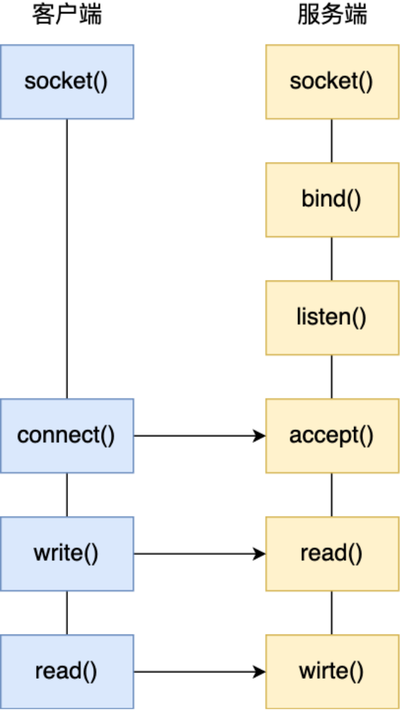

### 如何服务更多的用户

服务器的连接数，主要会受两个方面的限制：

- ==<u>**文件描述符**</u>==，Socket 实际上是一个文件，也就会对应一个文件描述符。在 Linux 下，`单个进程打开的文件描述符数是有限制的，没有经过修改的值一般都是 1024`，不过我们可以通过 ulimit 增大文件描述符的数目；
- ==<u>**系统内存**</u>==，每个 TCP 连接在内核中都有对应的数据结构，意味着`每个连接都是会占用一定内存`的；

> 那如果服务器的内存只有 2 GB，网卡是千兆的，能支持并发 1 万请求吗？
>
> 并发 1 万请求，也就是经典的 C10K 问题 ，C 是 Client 单词首字母缩写，C10K 就是单机同时处理 1 万个请求的问题。
>
> 从硬件资源角度看，对于 2GB 内存千兆网卡的服务器，如果每个请求处理占用不到 ==200KB== 的内存和 ==100Kbit== 的网络带宽就可以满足并发 1 万个请求。
>
> 不过，要想真正实现 C10K 的服务器，要考虑的地方在于服务器的网络 I/O 模型，效率低的模型，会加重系统开销，从而会离 C10K 的目标越来越远。

#### 多进程模型

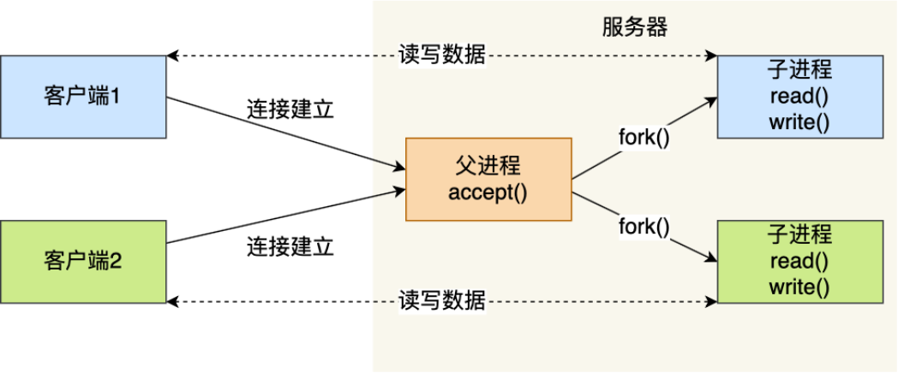

#### 多线程模型

使用线程池的方式来避免线程的频繁创建和销毁

> 所谓的线程池，就是<u>提前创建若⼲个线程</u>，这样当由新连接建⽴时，将这个已连接的 Socket 放入到一个队列⾥，然后线程池⾥的线程负责从队列中取出已连接 Socket 进程处理。
>
> 这个队列是全局的，每个线程都会操作，为了避免多线程竞争，线程在操作这个队列前要加锁。

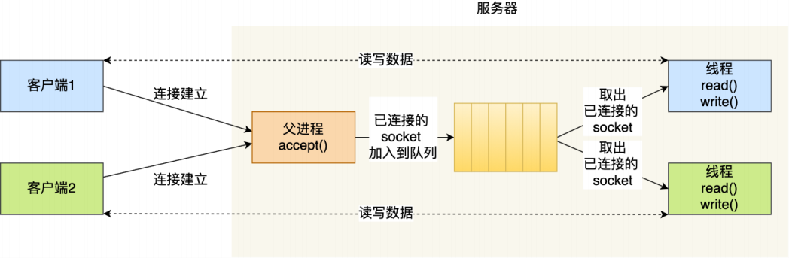

上面基于进程或者线程模型的，其实还是有问题的。新到来一个 TCP 连接，就需要分配一个进程或者线程，那么如果要达到 ==<u>**C10K**</u>==，意味着要一台机器维护 1 万个连接，相当于要维护 1 万个进程/线程，操作系统就算死扛也是扛不住的

### I/O 多路复用

#### select/poll

==<u>**select**</u>== 使用固定长度的 BitsMap，表示文件描述符集合，而且所⽀持的文件描述符的个数是有限制的，在 Linux 系统中，由内核中的 `FD_SETSIZE` 限制， 默认最大值为 1024 ，只能监听 0~1023 的文件描述符。

https://vdn6.vzuu.com/SD/349279b4-9119-11eb-85d0-1278b449b310.mp4?pkey=AAUNWsRCxsIICkjzk9ReIlJc_uhIGlwbWepL_H4eGaSO1jeJ1NNBGpSGr586K8g_s5FR4cI_oij4NzJpuOLE6UIg&c=avc.0.0&f=mp4&pu=078babd7&bu=078babd7&expiration=1658556390&v=ks6

> 2 次「遍历」文件描述符集合，一次是在内核态⾥，一个次是在用户态⾥ ，而且还会发⽣ 2 次「拷贝」文件描述符集合，先从用户空间传入内核空间，由内核修改后，再传出到用户空间中。

<u>缺点: 1. 数量限制 2. 两次fd数组的拷贝 3. On的遍历开销</u>

==<u>**poll**</u>== 不再用 BitsMap 来存储所关注的文件描述符，取而代之用动态数组，以链表形式来组织，突破了 select 的文件描述符个数限制，当然还会受到系统文件描述符限制。

但是 poll 和 select `并没有太大的本质区别`，都是使用「线性结构」存储进程关注的 Socket集合，因此<u>都需要遍历文件描述符集合来找到可读或可写的 Socket，时间复杂度为 O(n)</u>，而且也需要在用户态与内核态之间拷贝文件描述符集合，这种方式随着并发数上来，==<u>压根就没有使用共享内存这个玩意</u>==。

> 突然想起来 select限制为1024除了进程角度回答1024外，可能还有`On时间复杂度`的关系，还有拷贝所有文件描述符的关系，过多的话这两个会大幅度降低 整理一下:
>
> 为什么select是1024
>
> 1. 进程默认的最大描述符1024, 可以unlimit修改
> 2. 操作系统设置的是1024, 改的话需要重新编译系统
> 3. select的时间复杂度是On, 而且需要两次拷贝, 过大的话, 严重降低速度

#### ==<u>**epoll**</u>==

epoll 通过`两个方面`，很好解决了 select/poll 的问题

- 第一点，epoll 在内核⾥使用`红⿊树`来跟踪进程所有待检测的文件描述字，把需要监控的socket 通过epoll_ctl() 函数加入内核中的红⿊树⾥，红⿊树是个高效的数据结构，增删查一般时间复杂度是O(logn) ，通过对这棵⿊红树进行操作，这样就<u>不需要像 select/poll 每次操作时都`传入整个`socket 集合，只需要`传入一个`待检测的 socket</u>，减少了内核和用户空间大量的数据拷贝和内存分配。
- 第⼆点，epoll 使用<u>==**事件驱动**==</u>的机制，内核⾥维护了一个链表来记录就绪事件，<u>当某个socket 有事件发⽣时，通过回调函数内核会将其加入到这个就绪事件列表中</u>，当用户调用epoll_wait() 函数时，只会返回有事件发⽣的文件描述符的个数，不需要像 select/poll 那样轮询扫描整个 socket 集合，大大提高了检测的效率。

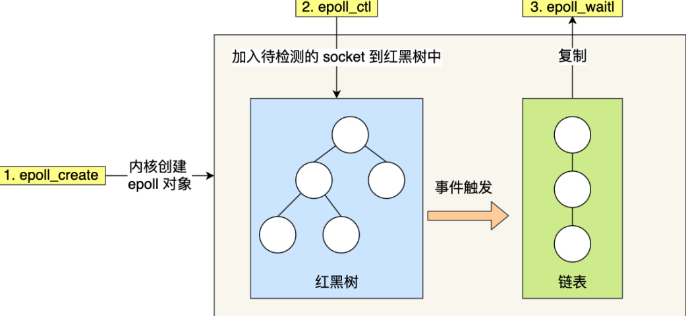

epoll 的方式即使监听的 Socket 数量越多的时候，效率不会大幅度降低，能够同时监听的Socket 的数目也非常的多了，<u>上限就为`系统定义的进程打开的最大文件描述符个数`</u>。因而，<u>==**epoll 被称为解决 C10K 问题的利器。**==</u>

## `高性能网络模式：Reactor 和 Proactor`

> ==对IO多路复用的封装==

 ==<u>**Reactor**</u>== 模式： 市面上常见的开源软件很多都采用了这个方案，比如 `Redis`、Nginx、Netty 等等

### 当下开源软件能做到网络高性能的原因就是 I/O 多路复用吗？

是的，基本是基于 I/O 多路复用，用过 I/O 多路复用接⼝写网络程序的同学，肯定知道是`面向过程的方式`写代码的，这样的开发的效率不高。于是，大佬们<u>基于面向对象的思想，对 I/O 多路复用作了一层`封装`</u>，让使用者不用考虑底层网络 API 的细节，只需要关注应用代码的编写。  ==<u>**Reactor 模式**</u>==

### Reactor基本介绍

Reactor 翻译过来的意思是「反应堆」，可能大家会联想到物理学⾥的核反应堆，实际上并不是的这个意思。

这⾥的反应指的是「`对事件反应`」，也就是`来了一个事件，Reactor 就有相对应的反应/响应`

> Reactor 模式也叫 `Dispatcher` 模式，即 
> I/O 多路复用监听事件，收到事件后，根据事件类型分配（Dispatch）给某个进程 / 线程

Reactor 模式主要由 `Reactor` 和`处理资源池`这两个核心部分组成，它俩负责的事情如下：

- Reactor 负责`监听和分发事件`，事件类型包含连接事件、读写事件； 
- 处理资源池负责`处理事件`，如 read -> 业务逻辑 -> send；

Reactor 模式是灵活多变的，可以应对不同的业务场景，灵活在于：

- Reactor 的数量可以只有一个，也可以有多个；
- 处理资源池可以是单个进程 / 线程，也可以是多个进程 /线程； 

将上面的两个因素排列组设一下，理论上就可以有 4 种方案选择：

- 单 Reactor 单进程 / 线程； 
- 单 Reactor 多进程 / 线程； 
- 多 Reactor 单进程 / 线程； 
- 多 Reactor 多进程 / 线程；

> 其中，「多 Reactor 单进程 / 线程」实现方案相比「单 Reactor 单进程 / 线程」方案，不仅复杂而且也没有性能优势，因此实际中并没有应用。

剩下的 3 个方案都是比较经典的，且都有应用在实际的项目中：

- 单 Reactor 单进程 / 线程；
- 单 Reactor 多线程 / 进程；
- 多 Reactor 多进程 / 线程；

方案具体使用进程还是线程，要看使用的<u>编程语言以及平台</u>有关：

- Java 语言一般使用线程，比如 Netty;
- C 语严使用进程和线程都可以，例如 Nginx 使用的是进程，Memcache 使用的是线程。

### Reactor具体方案

#### 单 Reactor 单进程 / 线程

一般来说，C 语言实现的是「`单 Reactor 单进程`」的方案，因为 C 语编写完的程序，运行后就是一个独⽴的进程，不需要在进程中再创建线程。

而 Java 语严实现的是「单 Reactor 单线程」的方案，因为 Java 程序是跑在 Java 虚拟机这个进程上面的，虚拟机中有很多线程，我们写的 Java 程序只是其中的一个线程而已。

我们来看看「单 Reactor 单进程」的方案示意图：

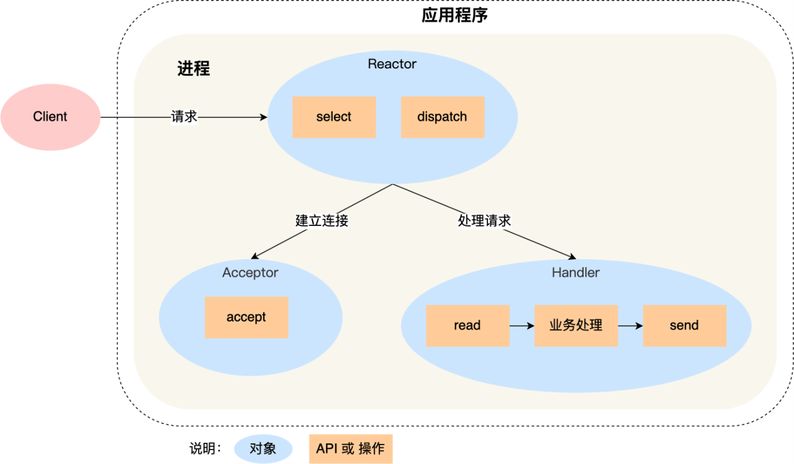

可以看到进程⾥有  Reactor、Acceptor、Handler 这三个对象：

- Reactor 对象的作用是监听和分发事件；
- Acceptor 对象的作用是获取连接；
- Handler 对象的作用是处理业务；

对象⾥的 select、accept、read、send 是系统调用函数，<u>dispatch 和  「业务处理」是需要完成的操作</u>，其中 dispatch 是分发事件操作。

**单 Reactor ==单进程==方案：**

- Reactor 对象通过 `select` （IO 多路复用接⼝）监听事件，收到事件后通过 `dispatch` 进行分发，<u>具体分发给 Acceptor 对象还是 Handler 对象，还要看收到的事件类型</u>；
- 如果是连接建⽴的事件，则交由 Acceptor 对象进行处理，Acceptor 对象会通过 <u>accept方法  获取连接，并创建一个 Handler 对象来处理后续的响应事件</u>；
- 如果不是连接建⽴事件， 则<u>交由当前连接对应的 Handler 对象来进行响应</u>； 
- Handler 对象通过 read -> 业务处理 -> send 的流程来完成完整的业务流程。

优点：实现简单，不需考虑进程间的通信和竞争

缺点：

1. 因为只有一个进程，无法充分利用  多核 CPU 的性能；
2. Handler 对象`在业务处理`时，<u>整个进程是无法处理其他连接的事件的</u>，如果 
   业务处理耗时比较长，那么就造成响应的延迟；

单 Reactor 单进程的方案==<u>**不适用计算机密集型 CPU**</u>==的场景，只适用于业务处理非常快速的场景   `不算处理速度慢的场景`

> `Redis` 是由 C 语言实现的，它采用的正是「`单 Reactor 单进程`」的方案，<u>因为 `Redis 业务处理主要是在内存中完成`，操作的速度是很快的，性能瓶颈不在 CPU 上</u>，所以 Redis 对于命令的处理是单进程的方案。

#### 单 Reactor 多线程 / 多进程

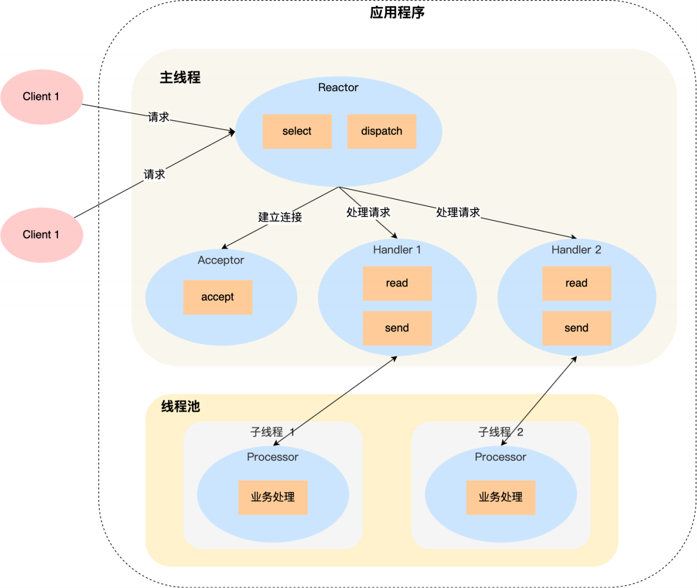

**单 Reactor 多线程 / 多进程方案**

- Reactor 对象通过 `select` （IO 多路复用接⼝）  监听事件，收到事件后通过 `dispatch` 进行分发，具体分发给 Acceptor 对象还是 Handler 对象，还要看收到的事件类型；
- 如果是连接建⽴的事件，则交由 Acceptor 对象进行处理，Acceptor 对象会通过 `accept`方法  获取连接，并<u>创建一个 Handler 对象</u>来处理后续的响应事件；
- 如果不是连接建⽴事件，则<u>`交由`当前连接对应的 Handler 对象来进行响应</u>；
- Handler 对象`不再负责业务处理，只负责数据的接收和发送`，Handler 对象通过 read 读取到数据后，会将数据发给子线程⾥的 Processor 对象进行业务处理；
- `子线程`⾥的 Processor 对象就进行`业务处理`，处理完后，将结果发给主线程中的 `Handler`对象，接着由 Handler 通过 `send` 方法将响应结果发送给 client；

优点：单 Reator 多线程的方案优势在于能够<u>充分利用多核 CPU 的能力</u>，那既然引入多线程，那么自然就带来了多线程竞争资源的问题。

> 单 Reactor 多进程相比单 Reactor 多线程实现起来很麻烦，主要因为要考虑子进程<-> ⽗进程的双向通信，并且⽗进程还得知道子进程要将数据发送给哪个客户端。 <u>因此实际应用中也看不到单 Reactor 多进程的模式</u>
>
> 原因总的来说 就是 进程相比线程的劣势

缺点：「单 Reactor」的模式`还有个问题`，因为一个 Reactor 对象承担所有事件的监听和响应，而且只在主线程中运行，在<u>面对瞬间高并发的场景时，容易成为性能的瓶颈的地方</u>。

#### 多 Reactor 多进程 / 线程

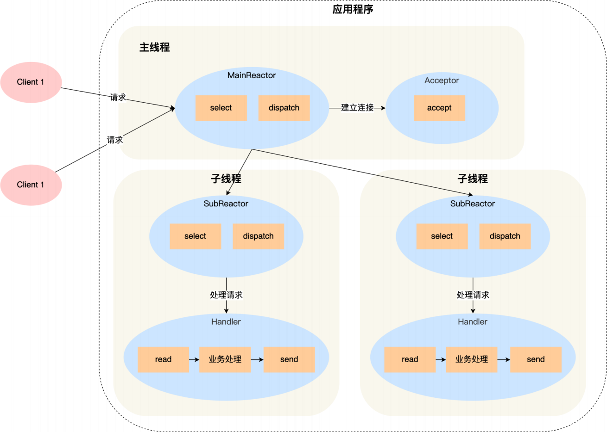

- 主线程中的 `MainReactor` 对象通过 select `监控连接建⽴事件`，收到事件后通过 Acceptor对象中的 accept 获取连接，<u>将新的连接分配给某个子线程</u>；
- 子线程中的 `SubReactor` 对象将 MainReactor 对象分配的连接加入 `select 继续`进行监听，并`创建一个 Handler` 用于处理连接的响应事件。
- 如果有新的事件发⽣时，SubReactor 对象会调用当前连接对应的 Handler 对象来进行响应。
- Handler 对象通过 read -> 业务处理 -> send 的流程来完成完整的业务流程

> <u>==**主线程只负责监听连接建立事件**==</u>

多 Reactor 多线程的方案虽然看起来复杂的，但是实际实现时比单 Reactor 多线程的方案要简单的多，原因如下：

- 主线程和子线程分⼯明确，<u>主线程只负责接收新连接</u>，子线程负责完成后续的业务处理。 
- 主线程和子线程的交互很简单，主线程只需要把新连接传给子线程，<u>子线程无须返回数据</u>，直接就可以在子线程将处理结果发送给客户端。

> 大名鼎鼎的两个开源软件 Netty 和 Memcache 都采用了「多 Reactor 多线程」的方案。 
>
> 采用了「多 Reactor 多进程」方案的开源软件是 `Nginx`，不过方案与标准的多 Reactor 多进程有些差异。
>
> 具体差异表现在主进程中仅仅用来初始化 socket，并没有创建 mainReactor 来 accept 连接，而是由子进程的 Reactor 来 accept 连接，通过锁来控制一次只有一个子进程进行accept（防⽌出现惊群现象），子进程 accept 新连接后就放到自⼰的 Reactor 进行处理，不会再分配给其他子进程。

### Proactor

Proactor `采用了异步 I/O 技术`，所以被称为`异步网络`模型

**Reactor 和 Proactor 的区别：**

- Reactor 是非阻塞同步网络模式，感知的是就绪可读写事件。在每次感知到有事件发⽣（比如可读就绪事件）后，就需要应用进程主动调用 read 方法来完成数据的读取，也就是要应用进程主动将 socket 接收缓存中的数据读到应用进程内存中，这个过程是同步的，读取完数据后应用进程才能处理数据。
- Proactor 是异步网络模式， 感知的是`已完成的读写事件`。在发起异步读写请求时，需要<u>传入数据缓冲区的地址（用来存放结果数据）等信息，这样系统内核才可以自动帮我们把数据的读写⼯作完成，这⾥的读写⼯作全程由`操作系统`来做</u>，并不需要像 Reactor 那样还需要应用进程主动发起 read/write 来读写数据，操作系统完成读写⼯作后，就会通知应用进程直接处理数据。

Reactor 可以理解为「来了事件<u>操作系统通知应用进程，让应用进程来处理</u>」

Proactor 可以理解为「来了事件`操作系统来处理`，<u>处理完再通知应用进程</u>」

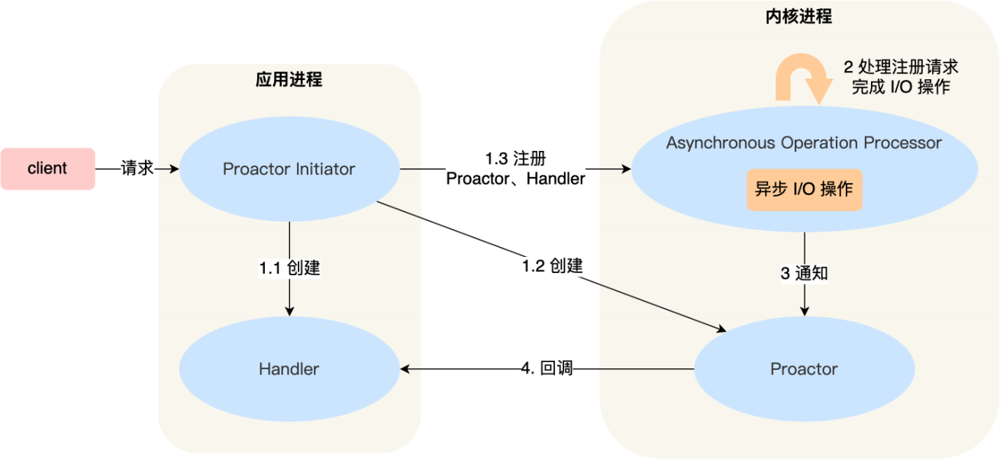

- <u>Proactor Initiator 负责创建 `Proactor` 和 `Handler` 对象</u>，并将 Proactor 和 Handler 都通过Asynchronous Operation Processor 注册到内核；
- Asynchronous Operation Processor 负责处理注册请求，并处理 I/O 操作；
- Asynchronous Operation Processor 完成 I/O 操作后通知 Proactor； 
- Proactor 根据不同的事件类型回调不同的 Handler 进行业务处理； 
- Handler 完成业务处理；

> 可惜的是，在 Linux 下的异步 I/O 是不完善的，aio 系列函数是由 POSIX 定义的异步操作接⼝，不是真正的操作系统级别⽀持的，而是在用户空间模拟出来的异步，并且<u>仅仅⽀持基于本地文件的 aio 异步操作</u>，网络编程中的socket 是不⽀持的，这也使得==<u>**基于 Linux 的高性能网络程序都是使用 Reactor 方案**</u>==。
>
> 而 Windows ⾥实现了一套完整的⽀持 socket 的异步编程接⼝，这套接⼝就是 IOCP ，是由操作系统级别实现的异步 I/O，真正意义上异步 I/O，因此==<u>**在 Windows ⾥实现高性能网络程序可以使用效率更高的 Proactor 方案**</u>==。

### 总结

常见的 Reactor 实现方案有三种。

第一种方案单 Reactor 单进程 / 线程，不用考虑进程间通信以及数据同步的问题，因此实现起来比较简单，这种方案的缺陷在于无法充分利用多核 CPU，而且处理业务逻辑的时间不能太长，否则会延迟响应，所以不适用于计算密集型的场景 (==适合IO密集型==)，适用于业务处理快速的场景，比如 <u>Redis 采用的是单 Reactor 单进程的方案</u>。

第⼆种方案单 Reactor 多线程，通过多线程的方式解决了方案一的缺陷，但它离高并发还差一点距离，差在只有一个 Reactor 对象来承担所有事件的监听和响应，而且只在主线程中运行，在面对瞬间高并发的场景时，容易成为性能的瓶颈的地方。

第三种方案多 Reactor 多进程 / 线程，通过多个 Reactor 来解决了方案⼆的缺陷，主 Reactor只负责监听事件，响应事件的⼯作交给了从 Reactor，Netty 和 Memcache 都采用了「多Reactor 多线程」的方案，Nginx 则采用了类似于  「多 Reactor 多进程」的方案。

Reactor可以理解为「来了事件操作系统通知应用进程，让应用进程来处理」，而 Proactor可以理解为「来了事件操作系统来处理，处理完再通知应用进程」。

因此，真正的大杀器还是 Proactor，它是采用异步 I/O 实现的异步网络模型，感知的是已完成的读写事件，而不需要像 Reactor 感知到事件后，还需要调用 read 来从内核中获取数据。

不过，无论是 Reactor，还是 Proactor，都是一种基于「事件分发」的网络编程模式，区别在于 Reactor 模式是基于「待完成」的 I/O 事件，而 Proactor 模式则是基于「已完成」的I/O 事件。

## 5.3.  死循环+来连接时新建线程的方法效率有点低，怎么改进？


==<u>改进死循环</u>==：使用`select epoll`这样的技术

> 还可以使用reactor模型 单reactor多线程
>
> 主线程负责处理连接请求, 并为之生成hander进行read和write操作
>
> 后续socket接收到业务请求, 则派发给对应的线程进行业务处理, 处理完成后数据由handler调用write

==<u>新建线程效率低</u>==：提前创建好一个==线程池==，用`生产者消费者模型`，创建一个任务队列，队列作为临界资源，有了新连接，就挂在到任务队列上，队列为空所有线程睡眠。


## 5.5.  [select，poll，epoll的区别，原理，性能，限制都说一说](https://www.zhihu.com/collection/786678607)

### 5.5.1. IO多路复用

IO复用模型在阻塞IO模型上多了一个select函数，select函数有一个参数是文件描述符集合，意思就是对这些的文件描述符进行循环监听，当某个文件描述符就绪的时候，就对这个文件描述符进行处理。

这种IO模型是属于阻塞的IO。但是由于它可以对多个文件描述符进行阻塞监听，所以它的效率比阻塞IO模型高效。

 

IO多路复用就是我们说的select，poll，epoll。select/epoll的好处就在于单个process就可以同时处理多个网络连接的IO。它的基本原理就是select，poll，epoll这个function会不断的轮询所负责的所有socket，当某个socket有数据到达了，就通知用户进程。

<u>当用户进程调用了select，那么`整个进程会被block`，而同时，kernel会“`监视`”所有select负责的socket，当任何一个socket中的`数据准备好了`，select就会`返回`。这个时候用户进程再调用`read操作`，`将数据从kernel拷贝到用户进程`。</u>

所以，I/O 多路复用的特点是通过一种机制一个进程能同时等待多个文件描述符，而这些文件描述符（套接字描述符）其中的任意一个进入读就绪状态，select()函数就可以返回。

I/O多路复用和阻塞I/O其实并没有太大的不同，事实上，还更差一些。因为这里需要使用两个system call (select 和 recvfrom)，而blocking IO只调用了一个system call (recvfrom)。但是，用select的优势在于它可以同时处理多个connection。

所以，如果处理的连接数不是很高的话，使用select/epoll的web server不一定比使用multi-threading + blocking IO的web server性能更好，可能延迟还更大。select/epoll的优势并不是对于单个连接能处理得更快，而是在于能处理更多的连接。）

在IO multiplexing Model中，实际中，对于每一个socket，一般都设置成为non-blocking，但是，如上图所示，整个用户的process其实是一直被block的。只不过process是被select这个函数block，而不是被socket IO给block。


### select poll epoll大体介绍及对比

**(1)、select==>时间复杂度O(n)**

- 它仅仅知道了，有I/O事件发生了，却并不知道是哪那几个流（可能有一个，多个，甚至全部），我们只能无差别轮询所有流，找出能读出数据，或者写入数据的流，对他们进行操作。所以**select具有O(n)的无差别轮询复杂度**，同时处理的流越多，无差别轮询时间就越长。

  ==（知道有io事件了 再遍历所有）==

**(2)、poll==>时间复杂度O(n)**

- poll本质上和select没有区别，它将用户传入的数组拷贝到内核空间，然后查询每个fd对应的设备状态， **但是它没有最大连接数的限制**，原因是它是基于链表来存储的.  ==(链表存储 没有大小限制)==

**(3)、epoll==>时间复杂度O(1)**

- **epoll可以理解为event poll**，不同于忙轮询和无差别轮询，epoll会把哪个流发生了怎样的I/O事件通知我们。所以我们说epoll实际上是**事件驱动（==每个事件关联上fd==）**的，此时我们对这些流的操作都是有意义的。==**（复杂度降低到了O(1)）**==、

  

- select，poll，epoll都是IO多路复用的机制。I/O多路复用就通过一种机制，可以监视多个描述符，一旦某个描述符就绪（一般是读就绪或者写就绪），能够通知程序进行相应的读写操作。**但select，poll，epoll本质上`都是同步I/O`，因为他们都需要在读写事件就绪后自己负责进行读写，也就是说这个读写过程是阻塞的**，而异步I/O则无需自己负责进行读写，异步I/O的实现会负责把数据从内核拷贝到用户空间。

- epoll跟select都能提供多路I/O复用的解决方案。在现在的Linux内核里有都能够支持，其中epoll是Linux所特有，而select则应该是POSIX所规定，一般操作系统均有实现

### select

select本质上是通过设置或者检查存放fd标志位的数据结构(`检查描述符集`)来进行下一步处理。这样所带来的缺点是：

1. 单个进程可监视的fd数量被限制，即能监听端口的大小有限。默认是1024  ==（数量受限）==

   一般来说这个数目和系统内存关系很大，具体数目可以cat /proc/sys/fs/file-max察看。32位机默认是1024个。64位机默认是2048.

2. 对socket进行扫描时是线性扫描，即采用轮询的方法，效率较低： ==（效率低）==

   当套接字比较多的时候，每次select()都要通过遍历FD_SETSIZE个Socket来完成调度,不管哪个Socket是活跃的,都遍历一遍。这会浪费很多CPU时间。如果能`给套接字注册某个回调函数`，当他们活跃时，自动完成相关操作，那就避免了轮询，这正是epoll与kqueue做的。

3. 需要维护一个用来存放大量fd的数据结构，这样会使得用户空间和内核空间在传递该结构时复制开销大  ==（维护的数据结构开销大）==

   **每次调用select，都需要把fd集合从用户态拷贝到内核态，这个开销在fd很多时会很大**

4. 每次调用select 都要重新初始化fd集合

### poll

poll本质上和select没有区别，它将用户传入的数组拷贝到内核空间，然后查询每个fd对应的设备状态，如果设备就绪则在设备等待队列中加入一项并继续遍历，如果遍历完所有fd后没有发现就绪设备，则挂起当前进程，直到设备就绪或者主动超时，被唤醒后它又要再次遍历fd。这个过程经历了多次无谓的遍历。

**它没有最大连接数的限制**，原因是它是基于链表来存储的，但是同样有一个缺点：   ==(链表存储 数量不限)==

1. 大量的fd的数组被整体复制于用户态和内核地址空间之间，而不管这样的复制是不是有意义。 （大量数据复制）

2. poll还有一个特点是“水平触发”，如果报告了fd后，没有被处理，那么下次poll时会再次报告该fd。 

### **epoll:**

- epoll有EPOLLLT和EPOLLET两种触发模式，LT是默认的模式，ET是“高速”模式。
- LT模式下，只要这个fd还有数据可读，每次 epoll_wait都会返回它的事件，提醒用户程序去操作  ==（没读完数据可以重复提醒）==
- 在ET（边缘触发）模式中，它只会提示一次，直到下次再有数据流入之前都不会再提示了，无 论fd中是否还有数据可读。==（====我只说一次）==
- 所以在ET模式下，read一个fd的时候一定要把它的buffer读光，也就是说一直读到read的返回值小于请求值，或者 遇到EAGAIN错误。
- 还有一个特点是，epoll使用“事件”的就绪通知方式，通过epoll_ctl注册fd，一旦该fd就绪，内核就会采用类似callback的`回调机制`来激活该fd，epoll_wait便可以收到通知。

### **epoll为什么要有EPOLLET触发模式？**

- 如果采用EPOLLLT模式的话，系统中一旦有大量你不需要读写的就绪文件描述符，它们每次调用epoll_wait都会返回，这样会大大降低处理程序检索自己关心的就绪文件描述符的效率.。而采用EPOLLET这种边沿触发模式的话，当被监控的文件描述符上有可读写事件发生时，epoll_wait()会通知处理程序去读写。如果这次没有把数据全部读写完(如读写缓冲区太小)，那么下次调用epoll_wait()时，它不会通知你，也就是它只会通知你一次，直到该文件描述符上出现第二次可读写事件才会通知你！！！==**这种模式比水平触发效率高，系统不会充斥大量你不关心的就绪文件描述符**==

### **epoll的优点：**

1. **没有最大并发连接的限制，能打开的FD的上限远大于1024（1G的内存上能监听约10万个端口）**；==（数量大）==

2. 效率提升，不是轮询的方式，不会随着FD数目的增加效率下降。只有活跃可用的FD才会调用callback函数；即Epoll最大的优点就在于它只管你“活跃”的连接，而跟连接总数无关，因此在实际的网络环境中，Epoll的效率就会远远高于select和poll。 ==（效率高）==

3.  内存拷贝，利用mmap()文件映射内存加速与内核空间的消息传递；即epoll使用mmap`减少复制开销`。  ==（开销小）==

   

### **select、poll、epoll 区别总结**

**1、支持一个进程所能打开的最大连接数**

> select	单个进程所能打开的最大连接数有FD_SETSIZE宏定义，其大小是32个整数的大小（在32位的机器上，大小就是32* 32，同理64位机器上FD_SETSIZE为32*64），当然我们可以对进行修改，然后重新编译内核，但是性能可能会受到影响，这需要进一步的测试。
>
> poll	poll本质上和select没有区别，但是它`没有`最大连接数的`限制`，原因是它是基于链表来存储的
>
> epoll	虽然连接数有上限，但是很大，1G内存的机器上可以打开10万左右的连接，2G内存的机器可以打开20万左右的连接  ==(1G10W)==

**2、FD剧增后带来的IO效率问题**

> select	因为每次调用时都会对连接进行`线性遍历`，所以随着FD的增加会造成遍历速度慢的“`线性下降性能问题`”。
>
> poll	同上
>
> epoll	因为epoll内核中实现是根据每个fd上的`callback函数`来实现的，只有活跃的socket才会主动调用callback，所以在活跃socket较少的情况下，使用epoll没有前面两者的线性下降的性能问题，但是所有socket都很活跃的情况下，可能会有性能问题。

**3、 消息传递方式**

> select内核需要将消息传递到用户空间，都需要`内核拷贝`动作
>
> poll同上
>
> ~~epoll通过内核和用户空间`共享一块内存`来实现的。~~
>
> epoll也有内存拷贝 epoll_wait 实现的内核代码中调用了 __put_user 函数 `压根就没有使用共享内存这个玩意`

==**总结：**==

> **综上，在选择select，poll，epoll时要根据具体的使用场合以及这三种方式的自身特点。**
>
> **1、表面上看epoll的性能最好，但是在`连接数少并且连接都十分活跃`的情况下，`select和poll的性能可能比epoll好`，毕竟epoll的通知机制需要很多函数回调。**
>
> **2、select低效是因为每次它都需要轮询。但`低效也是相对`的，视情况而定，也可通过良好的`设计`改善**

## epoll水平触发与边沿触发

1.  LT模式

    - LT(level triggered)是缺省的工作方式，并且同时支持block和no-block socket.在这种做法中，内核告诉你一个文件描述符是否就绪了，然后你可以对这个就绪的fd进行IO操作。如果你不作任何操作，内核还是会继续通知你的。

    - 比如说我们采用epoll水平触发模式监听一个文件描述符的可读，当这个文件可读就绪时，epoll会触发一个通知，然后我们执行一次读取操作，但这次操作我们并没有把该文件描述符的数据全部读取完。当下一次调用epoll监听该文件描述符时，epoll还会再次触发通知，直到该事件被处理完。这就意味着，当epoll触发通知后，我们可以不立即处理该事件，当下次调用epoll监听时，然后会再次向应用程序通告此事件，此时我们再处理也不晚。

2.  ET模式
    - ET(edge-triggered)是高速工作方式，只支持no-block socket。在这种模式下，当描述符从未就绪变为就绪时，内核通过epoll告诉你。然后它会假设你知道文件描述符已经就绪，并且不会再为那个文件描述符发送更多的就绪通知，直到你做了某些操作导致那个文件描述符不再为就绪状态了(比如，你在发送，接收或者接收请求，或者发送接收的数据少于一定量时导致了一个EWOULDBLOCK 错误）。但是请注意，如果一直不对这个fd作IO操作(从而导致它再次变成未就绪)，内核不会发送更多的通知(only once)
    - ET模式在很大程度上减少了epoll事件被重复触发的次数，因此效率要比LT模式高。epoll工作在ET模式的时候，必须使用非阻塞套接口，以避免由于一个文件句柄的阻塞读/阻塞写操作把处理多个文件描述符的任务饿死。
    - 当文件描述符收到I/O事件通知时，通常我们并不知道要处理多少I/O（例如有多少字节可读）。如果程序采用循环来对文件描述符执行尽可能多的I/O，而文件描述符又被设置为可阻塞的，那么最终当没有更多的I/O可执行时，I/O系统调用就会阻塞。

3.  LT模式与ET模式的区别如下：
    - LT模式：当epoll_wait检测到描述符事件发生并将此事件通知应用程序，应用程序可以不立即处理该事件。下次调用epoll_wait时，会再次响应应用程序并通知此事件。
    - ET模式：当epoll_wait检测到描述符事件发生并将此事件通知应用程序，应用程序必须立即处理该事件。如果不处理，下次调用epoll_wait时，不会再次响应应用程序并通知此事件。


# 9.    用户态和内核态

## 内核

计算机是由各种外部硬件设备组成的，比如内存、cpu、硬盘等，如果每个应用都要和这些硬件设备对接通信协议，那这样太累了，所以这个`中间⼈就由内核来负责`，让`内核作为应用连接硬件设备的桥梁，应用程序只需关心与内核交互，不用关心硬件的细节`。

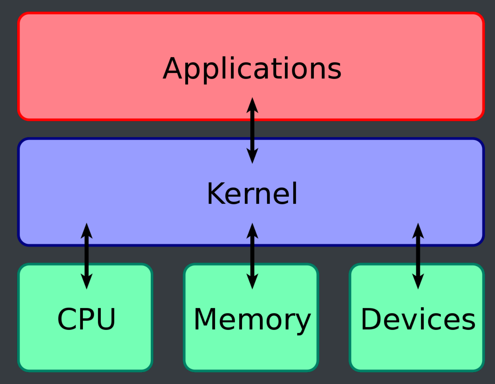

### 内核有哪些能力呢？

现代操作系统，内核一般会提供 4 个基本能力：

> ==<u>**进程调度 内存管理 硬件设备 系统调用**</u>==

1. 管理进程、线程，决定哪个进程、线程使用 CPU，也就是`进程调度`的能力； 
2. 管理内存，决定内存的分配和回收，也就是`内存管理`的能力；
3. 管理硬件设备，为进程与硬件设备之间提供通信能力，也就是`硬件通信`能力；
4. `提供系统调用`，如果应用程序要运行更高权限运行的服务，那么就需要有系统调用，它是用户程序与操作系统之间的接⼝。  （提供API）

### 对于内核的架构一般有这三种类型：

1. 宏内核，包含多个模块，整个内核像一个完整的程序；
2. 微内核，有一个最小版本的内核，一些模块和服务则由用户态管理；
3. 混合内核，是宏内核和微内核的结合体，内核中抽象出了微内核的概念，也就是内核中会有一个小型的内核，其他模块就在这个基础上搭建，整个内核是个完整的程序；

Linux 的内核设计是采用了`宏内核`，Window 的内核设计则是采用了`混合内核`。

这两个操作系统的可执行文件格式也不一样， Linux 可执行文件格式叫作 `ELF`，Windows 可执行文件格式叫作 `PE`。

## 9.1.  用户态和内核态区别

内核态：`cpu可以访问内存的所有数据`，包括外围设备，例如硬盘，网卡，cpu也可以将自己从一个程序切换到另一个程序。

用户态：`只能受限的访问内存`，且`不允许访问外围设备`，`占用cpu的能力被剥夺`，cpu资源可以被其他程序获取。

 

内核==从本质上看是一种软件==——控制计算机的硬件资源，并提供上层应用程序运行的环境。用户态即上层应用程序的活动空间，应用程序的执行必须依托于内核提供的资源，包括CPU资源、存储资源、I/O资源等。为了使上层应用能够访问到这些资源，内核必须为上层应用提供访问的接口：即系统调用。

用户态和内核态是操作系统的两种运行级别，两者最大的区别就是==<u>特权级不同</u>==。

> 用户态拥有`最低`的特权级，内核态拥有`较高`的特权级。
>
> 运行在用户态的程序不能直接访问操作系统内核数据结构和程序。

#### 内核态和用户态之间的转换方式主要包括：`系统调用`，`异常`和`中断`。

- 系统调用

  > 这是用户态进程主动要求切换到内核态的一种方式，用户态进程通过系统调用申请使用操作系统提供的服务程序完成工作，比如fork()实际上就是执行了一个创建新进程的系统调用。而系统调用的机制其核心还是使用了操作系统为用户特别开放的一个中断来实现，例如Linux的int 80h中断。

- 中断

  > 当外围设备完成用户请求的操作后，会向CPU发出相应的中断信号，这时CPU会暂停执行下一条即将要执行的指令转而去执行与中断信号对应的处理程序，如果先前执行的指令是用户态下的程序，那么这个转换的过程自然也就发生了由用户态到内核态的切换。比如硬盘读写操作完成，系统会切换到硬盘读写的中断处理程序中执行后续操作等。

- 异常

  > 当CPU在执行运行在用户态下的程序时，发生了某些事先不可知的异常，这时会触发由当前运行进程切换到处理此异常的内核相关程序中，也就转到了内核态，比如缺页异常。

1. 当进程由于中断或系统调用从用户态转换到内核态时，进程所使用的栈也要从用户栈切换到内核栈。

2. 系统调用`实质`就是<u>通</u><u>过指令产生中断</u>，称为<u>软中断</u>。

3. 进程因为中断（软中断或硬件产生中断），使得CPU切换到特权工作模式，<u>此时进程陷入内核态</u>，进程进入内核态后，首先把用户态的堆栈地址保存在内核堆栈中，然后设置堆栈指针寄存器的地址为内核栈地址，这样就完成了用户栈向内核栈的切换。
4. 当进程从内核态切换到用户态时，最后把保存在内核栈中的用户栈地址恢复到CPU栈指针寄存器即可，这样就完成了内核栈向用户栈的切换。

## 9.2.  操作系统为什么要分内核态和用户态

为了`安全性`。在cpu的一些指令中，有的指令如果用错，将会导致整个系统崩溃。分了内核态和用户态后，当用户需要操作这些指令时候，内核为其提供了API，可以通过系统调用陷入内核，让内核去执行这些操作。  ==<u>(为了安全别把操作系统干废了)</u>==

由于`需要限制不同的程序之间的访问能力`, 防止他们获取别的程序的内存数据, 或者获取外围设备的数据, 并发送到网络, CPU划分出两个权限等级 – 用户态和内核态。   ==<u>（程序权限过大，干扰其他）</u>==

> 假设没有这种内核态和用户态之分，程序随随便就能访问<u>硬件资源</u>，比如<u>分配内存</u>，程序能随便读写所有的内存空间，如果程序员不小心将不适当的内容写到了不该写的地方，就很可能导致系统崩溃。
> 用户程序是不可信的，不管程序员有意还是无意，都容易将系统==<u>干到崩溃</u>==。

## 9.3. 用户态到内核态的转化原理

### 用户态到内核态的转化原理

#### 1. 用户态切换到内核态的3种方式 本质上是==**<u>中断</u>**==

- ==系统调用 api==

  > 这是用户进程==主动==要求切换到内核态的一种方式，用户进程通过系统调用申请操作系统提供的服务程序完成工作。而系统调用的机制其核心还是使用了操作系统为用户特别开放的一个中断来实现，例如Linux的int 80h中断。
  >
  > Linux 在x86上的系统调用通过 int 80h 实现，用[系统调用号](https://zh.m.wikipedia.org/w/index.php?title=系统调用号&action=edit&redlink=1)来区分入口函数。操作系统实现系统调用的基本过程是：
  >
  > 1. 应用程序调用库函数（==API==）；
  > 2. API 将系统调用号存入 EAX，然后通过中断调用使系统进入内核态；
  > 3. 内核中的中断处理函数根据系统调用号，调用对应的内核函数（系统调用）；
  > 4. 系统调用完成相应功能，将返回值存入 EAX，返回到中断处理函数；
  > 5. 中断处理函数返回到 API 中；
  > 6. API 将 EAX 返回给应用程序。
  >
  > 应用程序调用系统调用的过程是：
  >
  > 1. 把系统调用的编号存入 EAX；
  > 2. 把函数参数存入其它通用寄存器；
  > 3. 触发 0x80 号中断（int 0x80）。

- ==异常==

  > 当CPU在执行运行在用户态的程序时，发现了某些事件不可知的异常，这是会触发由当前运行进程切换到处理此。异常的内核相关程序中，也就到了内核态，比如缺页异常。

- 外围==设备==的==中断==

  > 当外围设备完成用户请求的操作之后，会向CPU发出相应的中断信号，这时CPU会暂停执行下一条将要执行的指令，转而去执行中断信号的处理程序，如果先执行的指令是用户态下的程序，那么这个转换的过程自然也就发生了有用户态到内核态的切换。比如硬盘读写操作完成，系统会切换到硬盘读写的中断处理程序中执行后续操作等。

#### 2. 切换操作

线程切换只能在内核态完成，如果当前用户处于用户态，则必然引起用户态与内核态的切换。（**“用户态与内核态的切换”具体带来什么成本？？？**）

从出发方式看，可以在认为存在前述3种不同的类型，但是从最终实际完成由用户态到内核态的`切换操作上来说，涉及的关键步骤是完全一样的`，没有任何区别，都相当于执行了一个中断响应的过程，因为<u>系统调用实际上最终是`中断机制`实现的</u>，而异常和中断处理机制基本上是一样的，用户态切换到内核态的步骤主要包括：

- <u>从当前进程的描述符中`提取其内核栈的ss0及esp0`信息。</u>
- 使用ss0和esp0指向的内核栈将当前进程的cs,eip，eflags，ss,esp信息保存起来，这个过程也完成了由用户栈到内核栈的切换过程，同时保存了被暂停执行的程序的下一条指令。
- 将先前由中断向量检索得到的中断处理程序的cs，eip信息装入相应的寄存器，开始执行中断处理程序，这时就转到了内核态的程序执行了。

#### 3. 在Linux中，上下文切换，进程切换和线程切换之间有什么区别？

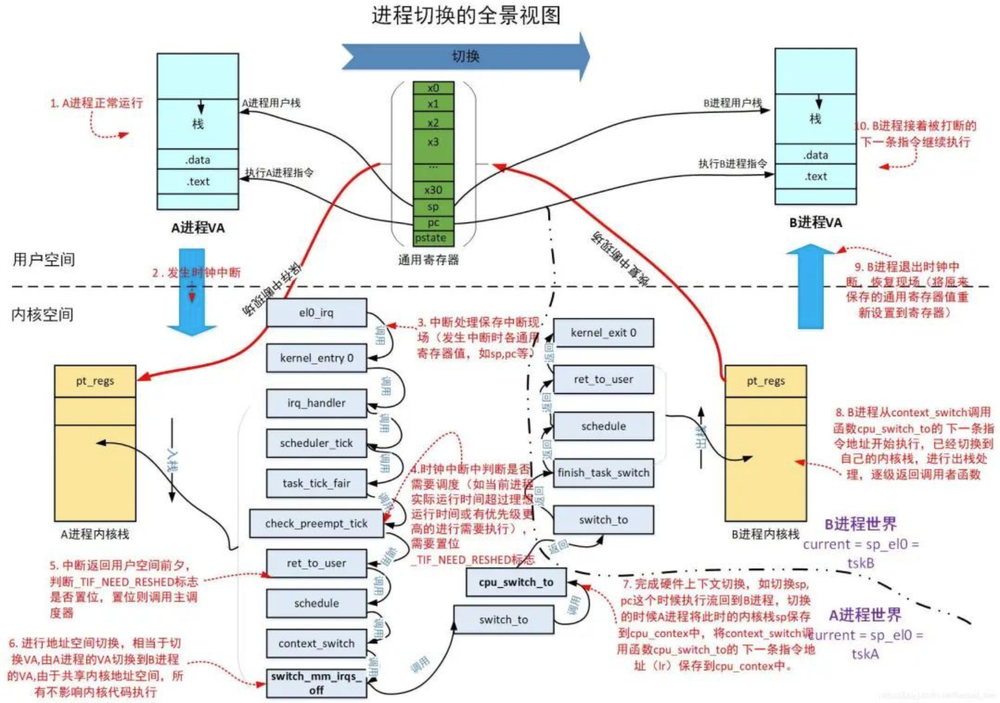

- 上下文切换涉及存储进程或线程的上下文或状态，以便可以在需要时重新加载它，并可以执行从先前的相同点恢复。这是多任务操作系统的功能，并且允许单个CPU由多个进程共享。

- ==<u>**进程切换或进程调度**</u>==是`通过保存当前正在执行的进程的所有状态（包括其寄存器状态，关联的内核状态及其所有虚拟内存配置）来将一个进程更改为另一个进程`。

- 线程切换是指在进程中从一个线程切换到另一个线程。

`进程切换与线程切换的一个最主要区别`就在于<u>进程切换涉及到`虚拟地址空间`的切换而线程切换则不会</u>。因为每个进程都有自己的虚拟地址空间，而线程是共享所在进程的虚拟地址空间的，因此同一个进程中的线程进行线程切换时不涉及虚拟地址空间的转换。

因此，在进程之间进行切换的成本比在线程之间进行切换的成本高得多。

> 举一个不太恰当的例子，<u>线程切换就好比你从`主卧走到次卧`，反正主卧和次卧都在同一个房子中(`虚拟地址空间`)，因此你无需换鞋子、换衣服等等。</u>但是<u>进程切换就不一样了，进程切换就好比从`你家到别人家`，这是两个不同的房子`(不同的虚拟地址空间`)，出发时要换好衣服、鞋子等等，到别人家后还要再换鞋子等等。</u>
>
> 因此我们可以形象的认为线程是处在同一个屋檐下的，这里的屋檐就是虚拟地址空间，因此线程间切换无需虚拟地址空间的切换；而进程则不同，两个不同进程位于不同的屋檐下，即进程位于不同的虚拟地址空间，因此进程切换涉及到虚拟地址空间的切换，这也是为什么进程切换要比线程切换慢的原因。

#### 4. 为什么虚拟地址切换很慢

现在我们已经知道了进程都有自己的虚拟地址空间，把==虚拟地址转换为物理地址需要查找页表==，`页表查找是一个很慢的过程`，因此通常使用Cache来缓存常用的地址映射，这样可以加速页表查找，这个cache就是==TLB==，Translation Lookaside Buffer，我们不需要关心这个名字只需要知道TLB本质上就是一个cache，是用来加速页表查找的。由于每个进程都有自己的虚拟地址空间，那么显然每个进程都有自己的页表，那么当进程切换后页表也要进行切换，==页表切换后TLB就失效==了，cache失效导致命中率降低，那么虚拟地址转换为物理地址就会变慢，表现出来的就是程序运行会变慢，而==线程切换则不会导致TLB失效==，因为线程无需切换地址空间，因此我们通常说线程切换要比较进程切换块，原因就在这里。

> ==因为进程切换涉及到虚拟地址空间的切换, 而逻辑地址到物理地址的寻址操作是通过以各TLB缓存进行加速的, 切换之后缓存失效, 因此程序变慢==

 

## 9.4.  系统调用

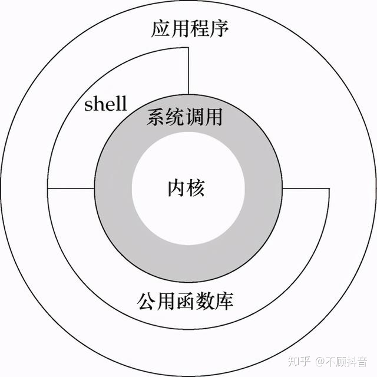

1. 概念：

   - 在计算机中，系统调用（英语：system call），又称为<u>系统呼叫</u>，指<u>运行在使用者空间的程序向操作系统内核请求需要更高权限运行的服务</u>。系统调用`提供了用户程序与操作系统之间的接口`（即==系统调用是用户程序和内核交互的接口==）。

   - 操作系统中的状态分为管态（`核心态`）和目态（`用户态`）。

     > <u>大多数系统`交互式`操作需求在`内核`态执行</u>。如设备IO操作或者进程间通信。
     >
     > 特权指令：一类==只能在核心态==下运行而不能在用户态下运行的特殊指令。不同的操作系统特权指令会有所差异，但是一般来说<u>主要是和`硬件`相关的一些指令</u>。
     >
     > 用户程序只在用户态下运行，<u>有时需要访问系统核心功能，这时通过`系统调用接口`使用系统调用</u>。

   - 应用程序<u>有时会需要一些危险的、权限很高的指令</u>，如果把这些权限放心地交给用户程序是很危险的(比如一个进程可能修改另一个进程的内存区，导致其不能运行)，但是又不能完全不给这些权限。于是有了系统调用，危险的指令被包装成系统调用，用户程序只能调用而无权自己运行那些危险的指令。另外，计算机硬件的资源是有限的，为了更好的管理这些资源，<u>所有的资源都由操作系统控制，进程只能向操作系统请求这些资源</u>。`操作系统是这些资源的唯一入口，这个入口就是系统调用`。

2. 系统调用举例：

   <u>对文件进行写操作</u>，程序向打开的文件写入字符串“hello world”，<u>open和write都是系统调用</u>。还有写数据write，创建进程<u>fork，vfork</u>等都是系统调用。**用户态想要申请一块20K大小的动态内存，就需要brk系统调用，将数据段指针向下偏移，如果用户态多处申请20K动态内存，同时又释放呢？这个内存的管理就变得非常的复杂。**

   ### 库函数

- `调用库函数是为了使用系统调用`。linux几乎库函数和系统调用一一对应。windows则不然。

- 从宏观上说，`系统调用时内核层，C标准库在应用层`。

- 从细节上来说，`库函数的实现方式，一般都是对系统调用的再次封装`，<u>在linux中，C标准基本是对系统调用的包装</u>

  > 例如我们常见的printf，putc，fwrite等等，其实去看源码可以发现内部都有使用系统调用write函数，相似的例子还有很多，例如文件描述符filefd，与FILE的关系，FILE是一个struct，内部其实封装了filefd，同时包括一个buffer用于缓冲...

### ==中断是进入操作系统内核的唯一方法==

对于×86，就是中断指令int

- int指令将使cs中的==cpl改成0==(内核态优先级), "进入内核"

- 系统调用的核心

  > 1. 用户程序中包含一段包含int指令的代码(库函数实现的)
  > 2. 操作系统写中断处理, 获取想调程序的编号
  > 3. 操作系统根据编号执行相应的代码

### 用户调用printf的全过程

主要问题: 无法直接进入内核态  cpl = 3 dpl = 0 优先级低

解决思想: 通过中段int80将dpl置为3, 进入内核再将cpl置为0, 可以进入内核

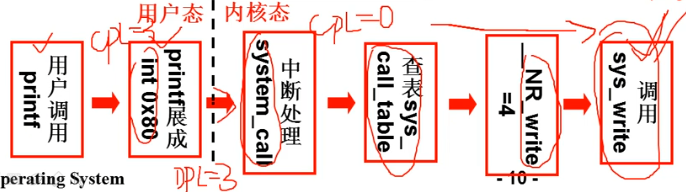

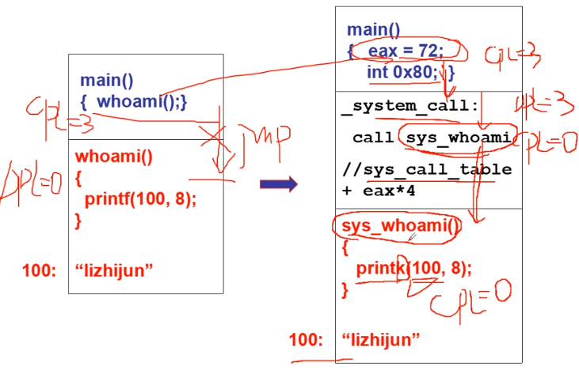

## 9.5.  操作系统的中断

中断是指CPU对系统发生的某个事件做出的一种反应，CPU==暂停==正在执行的程序，==保存现场==后自动去执行相应的==处理==程序，处理完该事件后再==返回中断处==继续执行原来的程序。

### 中断一般三类。

> 1. 一种是由==CPU外部==引起的，如I/O中断、时钟中断，  ==**外部设备**==
>
> 2. 一种是来自==CPU内部事件==或==程序执行中引起的中断==，例如程序非法操作，地址越界、浮点溢出，     ==**异常**==
>
> 3. 最后一种是在程序中使用了==系统调用==引起的。而中断处理一般分为中断响应和中断处理两个步骤，中断响应由硬件实施，中断处理主要由软件实施。   ==**系统调用**==

## 9.6.  操作系统中的缺页中断

malloc()和mmap()等内存分配函数，<u>在分配时`只是建立了进程虚拟地址空间`</u>，<u>并`没有`分配虚拟内存对应的`物理内存`</u>。<u>当进程访问这些没有建立映射关系的虚拟内存时，处理器自动触发一个缺页异常</u>。  

> ==<u>（分配了虚拟的地址空间 但没有分配映射到物理内存，访问时会缺页异常）</u>==

**缺页中断：**在请求分页系统中，可以<u>通过查询页表中的`状态位`来确定所要访问的`页面是否存在于内存`中</u>。每当所要访问的页面不在内存时，会产生一次缺页中断，此时操作系统会根据页表中的外存地址在外存中找到所缺的一页，将其调入内存。

### [内存页面置换算法](#内存页面置换算法)

缺页本身是一种中断，与一般的中断一样，需要经过4个处理步骤：

> 1、保护CPU现场   `保存中断前即当前的状态`
>
> 2、分析中断原因    分析为什么中断
>
> 3、转入缺页中断处理程序进行处理   页表映射/满的话缺页置换
>
> 4、恢复CPU现场，继续执行   恢复到之前的状态

但是缺页中断是由于所要访问的页面不存在于内存时，由硬件所产生的一种特殊的中断，因此，与一般的中断存在区别：

> 1、<u>在指令执行期间产生和处理缺页中断信号</u>
>
> 2、<u>一条指令在执行期间，可能产生多次缺页中断</u>
>
> 3、<u>缺页中断返回时，执行产生中断的一条指令，而一般的中断返回时，执行下一条指令</u>。 

# 10.  其他

## 10.1. windows消息机制知道吗，请说一说

当用户有操作(鼠标，键盘等)时，系统会将这些事件转化为消息。每个打开的进程系统都为其维护了一个消息队列，系统会将这些消息放到进程的消息队列中，而应用程序会循环从消息队列中取出来消息，完成对应的操作。

####  一、那么消息究竟是What 嘞？

消息系统对于一个win32程序来说十分重要，它是一个程序运行的动力源泉。一个消息，是系统定义的一个32位的值，他唯一的定义了一个事件，向 Windows发出一个通知，告诉应用程序某个事情发生了。例如，单击鼠标、改变窗口尺寸、按下键盘上的一个键都会使Windows发送一个消息给应用程序的消息队列（下面会讲到）中，然后应用程序再从消息队列中取出消息并进行相应的响应。在这个处理的过程中，操作系统也会给应用程序“发送消息”，而所谓的发送消息--------实际上就是操作系统调用程序中的一个专门负责处理消息的函数，这个函数称为窗口过程。

​    **消息本身是作为一个记录传递给应用程序的，这个记录中包含了消息的类型以及其他信息**。例如，对于单击鼠标所产生的消息来说，这个记录中包含了单击鼠标时的坐标。这个记录类型叫做MSG，MSG含有来自windows应用程序消息队列的消息信息，在Windows中MSG结构体定义如下：

```c++
typedef struct tagMsg{
  HWND  hwnd;				//接受该消息的窗口句柄
  UINT  message;		//消息常量标识符，也就是我们通常所说的消息号
  WPARAM wParam;   	//32位消息的特定附加信息，确切含义依赖于消息值
  LPARAM lParam;		//32位消息的特定附加信息，确切含义依赖于消息值
  DWORD  time;			//消息创建时的时间
  POINT  pt;				//消息创建时的鼠标/光标在屏幕坐标系中的位置
}MSG;
```

#### **二、What  is消息队列？**

在Windows编程中，每一个Windows应用程序开始执行后，<u>系统都会为该程序创建一个消息队列</u>，这个消息队列<u>用来存放该应用程序所创建的窗口的信息</u>。例如，当我们按下鼠标右键的时候，这时会产生一个WM_RBUTTONDOWN消息，系统会自动将这个消息放进当前窗口所属的应用程序的消息队列中，等待应用程序的结束。Windows将产生的消息以此放进消息队列中，<u>应用程序则通过一个消息循环不断的从该消息队列中读取消息，并做出响应</u>（后面会详细讲述消息处理过程。。。。）

 

#### **三、消息中的家庭成员？**

​    通过前面所罗列的MSG结构体，我们是不是会对消息结构里边含有的东东有了一个比较清楚的认识呢？如果还没有，没关系！！呵呵，那么我再次对那些咋一看就会泪奔的变量做出详细的解释：

​    hwnd - - - 一个32位的窗口句柄（我的PC是32 位的^_^），它表示的是消息所属的窗口。我们通常开发的程序都是窗口应用程序，一般一个消息都是和某个窗口相关联的。比如我们在某个活动窗口按下鼠标右键，此时产生的消息就是发送给该活动窗口的。窗口可以是任何类型的屏幕对象，因为Win32能够维护大多数可视对象的句柄(窗口、对话框、按钮、编辑框等)。

（补充一下：“句柄”---在Windows程序中，有各种各样的资源，系统在创建这些资源的时候，都会为他们分配内存，并返回标识这些资源的标识号，这个标识号就是句柄）

​    message- - - -一个消息的标识符，用于区别其他消息的常量值，这些常量可以是Windows单元中预定义的常量，也可以是自定义的常量。在Windows中消息是由一个数值表示的，不同的消息对应不同的数值。但由于当这些消息种类多到足以挑战我们的IQ，所以聪明的程序开发者便想到将这些数值定义为WM_XXX宏的形式。例如，鼠标左键按下的消息--WM_LBUTTONDOWN，键盘按下消息--WM_KEYDOWN，字符消息--WM_CHAR，等等。。。。消息标识符以常量命名的方式指出消息的含义。当窗口过程接收到消息之后，他就会使用消息标识符来决定如何处理消息。例如、WM_PAINT告诉窗口过程窗体客户区被改变了需要重绘。符号常量指定系统消息属于的类别，其前缀指明了处理解释消息的窗体的类型。

​    wParam和lParam- - - 用于指定消息的附加信息。例如，当我们收到一个键盘按下消息的时候，message成员变量的值就是WM_KEYDOWN，但是用户到底按下的是哪一个按键，我们就得拜托这二位，由他们来告知我们具体的信息。

time和pt- - -这俩兄弟分别被用来表示消息投递到消息队列中的时间和鼠标当前的位置，一般情况下不怎么使用（但不代表没用）

 

#### **四、see see 消息标识符**

系统保留消息标识符的值在0x0000在0x03ff(WM_USER-1)范围。这些值被系统定义消息使用。应用程序不能使用这些值给自己的消息。应用程序消息从WM_USER（0X0400）到0X7FFF，或0XC000到0XFFFF；WM_USER到 0X7FFF范围的消息由应用程序自己使用；0XC000到0XFFFF范围的消息用来和其他应用程序通信，在此只是罗列一些具有标志性的消息值：

> WM_NULL---0x0000  空消息	0x0001----0x0087  主要是窗口消息。
>
> 0x00A0----0x00A9  非客户区消息	0x0100----0x0108  键盘消息
>
> 0x0111----0x0126  菜单消息	0x0132----0x0138  颜色控制消息
>
> 0x0200----0x020A  鼠标消息	0x0211----0x0213  菜单循环消息
>
> 0x0220----0x0230  多文档消息	0x03E0----0x03E8  DDE消息
>
> 0x0400       WM_USER	0x8000       WM_APP
>
> 0x0400----0x7FFF  应用程序自定义私有消息

 

#### **五、原来消息也有分类啊**

windows中的消息虽然很多，但是种类并不繁杂，大体上有3种： `窗口`消息、 `命令`消息、 `控件通知`消息。

> 1. 窗口消息- - - -大概是系统中最为常见的消息，它是指由操作系统和控制其他窗口的窗口所使用的消息。例如CreateWindow、DestroyWindow和MoveWindow等都会激发窗口消息，还有我们在上面谈到的单击鼠标所产生的消息也是一种窗口消息。
>
> 2. 命令消息- - - - 这是一种特殊的窗口消息，他用来处理从一个窗口发送到另一个窗口的用户请求，例如按下一个按钮，他就会向主窗口发送一个命令消息。
>
> 3. 控件通知消息- - - 其实它是这样滴，当一个窗口内的子控件发生了一些事情，而这些是需要通知父窗口的，此刻它就上场啦。通知消息只适用于标准的窗口控件如按钮、列表框、组合框、编辑框，以及Windows公共控件如树状视图、列表视图等。

例如，单击或双击一个控件、在控件中选择部分文本、操作控件的滚动条都会产生通知消息-------她类似于命令消息，那么控件通知消息就会从控件窗口发送到它的主窗口。但是这种消息的存在并不是为了处理用户命令，而是为了让主窗口能够改变控件，例如加载、显示数据。

再例如，按下一个按钮，他向父窗口发送的消息也可以看作是一个控件通知消息；单击鼠标所产生的消息可以由主窗口直接处理，然后交给控件窗口处理。其中窗口消息及控件通知消息主要由窗口类即直接或间接由CWND类派生类处理。相对窗口消息及控件通知消息而言，命令消息的处理对象范围就广得多，它不仅可以由窗口类处理，还可以由文挡类，文档模板类及应用类所处理。

#### **六、队列消息和非队列消息**

1. 队列消息送到系统消息队列，然后到线程消息队列；

2. 非队列消息直接送给目的窗口过程。

 

## Windows的消息循环机制

消息结构体

```cpp
typedef struct tagMsg{
  HWND  hwnd;				//接受该消息的窗口句柄
  UINT  message;		//消息常量标识符，也就是我们通常所说的消息号
  WPARAM wParam;   	//32位消息的特定附加信息，确切含义依赖于消息值
  LPARAM lParam;		//32位消息的特定附加信息，确切含义依赖于消息值
  DWORD  time;			//消息创建时的时间
  POINT  pt;				//消息创建时的鼠标/光标在屏幕坐标系中的位置
}MSG;
```

### **消息队列**

**消息队列有两种，分为系统消息队列和应用程序消息队列**。**产生的消息首先由Windows系统捕获，放在系统消息队列，再拷贝到对应的应用程序消息队列。32/64位系统为每一个应用程序维护一个消息队列**。

### **消息循环**

系统为每个应用程序维护一个消息循环，消息循环会不断检索自身的消息队列。每有一个消息，就用GetMessage()取出消息。

```cpp
while(GetMessage (&msg, NULL, 0, 0))//Windows消息循环。
{
  TranslateMessage (&msg) ;//翻译消息，如按键消息，翻译为WM_CHAR
  DispatchMessage (&msg) ;//分发消息到对应窗口
}
```

GetMessage具有阻塞机制。当消息队列中没有消息时，程序非忙等，而是让权等待。当收到WM_QUIT时，GetMessage返回false，循环停止，同时应用程序终止。

消息处理：DispatchMessage()把取出来的消息分配给相应的窗口或线程，由窗口过程处理函数DefWindowProc()处理。

Windows的应用程序靠`消息驱动`来实现功能。而消息驱动靠消息机制来处理。消息机制就是由消息队列，消息循环，消息处理构成的。

那么，消息机制是如何运作的呢？

当用户运行一个应用程序，通过对鼠标的点击或键盘按键，产生一些特定事件。由于Windows一直监控着I/O设备，该事件首先会被翻译成消息，由系统捕获，存放于系统消息队列**。经分析，Windows知道该消息应由那个应用程序处理，则拷贝到相应的应用程序消息队列。由于消息循环不断检索自身的消息队列，当发现应用程序消息队列里有消息，就用GetMessage()取出消息，封装成Msg()结构。如果该消息是由键盘按键产生的，用TranslateMessage()翻译为WM_CHAR消息，否则，用DisPatchMessage()将取出的消息分发到相应的应用程序窗口，交由窗口处理程序处理。Windows为每个窗体预留了过程窗口函数，该函数是一个回掉函数，由系统调用，应用程序不能调用**。程序员可以通过重载该函数处理我们”感兴趣”的消息。对于不感兴趣的消息，则由系统默认的窗口过程处理程序做出处理。

下面看这么一张图：

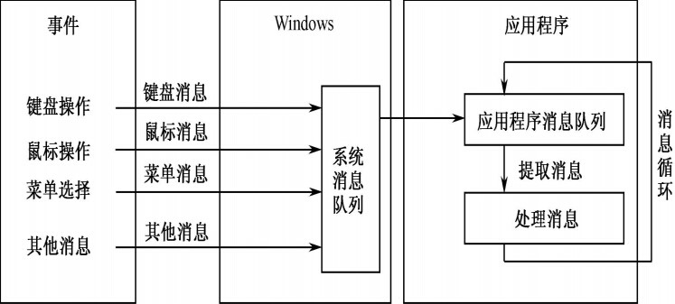

这张图很好地解释了消息机制的运行原理。 

当`运行程序`->事件操作`引发消息`->消息先存在`系统消息队列`->再存入到`应用程序消息队列`->用消息循环提取消息->处理消息->再返回消息队列....

### 消息循环过程

1. 消息循环调用GetMessage()从消息队列中`查找消息`进行处理，如果消息队列为空，程序将停止执行并等待(程序阻塞)。
2. 事件发生时导致一个消息加入到消息队列(例如系统注册了一个鼠标点击事件)，`GetMessage()将返回一个正值`，这表明有消息需要被处理，并且消息已经填充到传入的MSG参数中；当传入WM_QUIT消息时返回0；如果返回值为负表明发生了错误。
3. `取出消息`(在Msg变量中)并将其传递给TranslateMessage()函数，这个函数做一些额外的处理：将虚拟键值信息转换为字符信息。这一步实际上是可选的，但有些地方需要用到这一步。
4. 上面的步骤执行完后，将消息传递给`DispatchMessage`()函数。DispatchMessage()函数将消息`分发到消息的目标窗口`，并且查找目标窗口过程函数，<u>给窗口过程函数传递窗口句柄、消息、wParam、lParam等参数然后调用该函数</u>。
5. 在窗口过程函数中，检查消息和其他参数，你可以用它来实现你想要的操作。如果不想处理某些特殊的消息，你应该总是调用DefWindowProc()函数，系统将按按默认的方式处理这些消息(通常认为是不做任何操作)。
6. 一旦一个消息处理完成，窗口过程函数返回，DispatchMessage()函数返回，继续循环处理下一个消息。

## 10.2. 微内核与宏内核

> 1. 宏内核，包含多个模块，整个内核像一个完整的程序；
> 2. 微内核，有一个最小版本的内核，一些模块和服务则由用户态管理；
> 3. 混合内核，是宏内核和微内核的==结合==体，内核中抽象出了微内核的概念，也就是<u>内核中会有一个小型的内核</u>，<u>其他模块就在这个基础上搭建，整个内核是个完整的程序；</u>
>
> Linux 的内核设计是采用了`宏内核`，Window 的内核设计则是采用了`混合内核`。
>
> 这两个操作系统的可执行文件格式也不一样， Linux 可执行文件格式叫作 `ELF`，Windows 可执行文件格式叫作 `PE`。

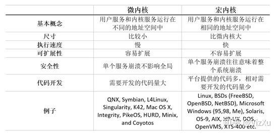

微内核相当于一个信息交换中心，自身可以实现的功能较少，他的主要职责是传递一个请求，一个A模块对其他模块功能的请求；而宏内核相当于一个是一个中央集权控制中心，把内存管理，文件管理等功能全部管理。

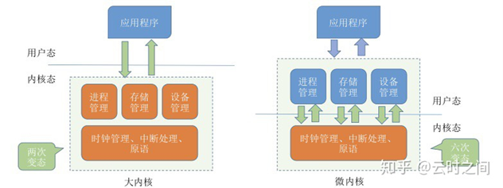

**微内核定义：**

内核管理着所有的系统资源，在微内核中用户服务和内核服务在不同的地址空间中实现。在应用程序和硬件的通信中，客户端程序和运行在用户空间的服务通过消息的传递来建立通信，它们之间不会有直接的交互，这样一来，微内核中的执行速度相对就比较慢了，这是微内核架构的一个缺点。

在内核架构中，用户服务是独立于内核服务的，因此任何用户服务崩溃都不会影响到内核服务，这就加强了操作系统的健壮性，这是微内核的优势所在。另一点，微内核的扩展性强，添加一个功能，只需要建立一个新的服务到用户空间当中，而内核空间不需要任何的修改。因此，微内核可移植性强、安全并且易于扩展。

**宏内核定义：**

宏内核同样管理着用户程序和硬件之间的系统资源，但是和微内核不一样的是，在宏内核架构中，用户服务和内核服务在同一空间中实现。具体一点，就是内核可以代表内核进程运行代码，就是通常的内核进程；当用户进程经过系统调用或者中断进入到内核态时，内核也可以代表它运行代码。这样一来，宏内核需要管理的资源多于微内核，其大小就相对大一些了。

在宏内核架构当中，内核管理着CPU调度，内存管理，文件管理和系统调用等各模块的的工作，由于用户服务和内核服务被实现在同一空间中，这样在执行速度上要比微内核快。然而，宏内核的劣势也是显而易见的，那就是当内核中的某个服务崩溃了，整个内核也会崩溃。另一点，想要在内核中添加新的功能就意味着内核中的各个模块需要做相应的修改，因此其扩展性很弱。

 

## 10.3. 什么是大端小端以及如何判断大端小端

大端：将表示一个对象的字节在内存中按照从最高有效字节到最低有效字节的顺序存储，即最高有效字节在内存地址最前面的方式，称为大端法

> 高地址 低字节 是大端
>
> 低地址 低字节 是小端  windows 和linux都是小端

小端：将表示一个对象的字节在内存中按照从最低有效字节到最高有效字节的顺序存储，即最低有效字节在内存地址最前面的方式，称为小端法

我们可以根据联合体来判断该系统是大端还是小端。因为联合体变量总是从低地址存储。

```c++
//根据联合体来判断该系统是大端还是小端。因为联合体变量总是从低地址存储
string funl(){
    union test{
        int i;
        char c;
    };
    
    test t;
    t.i = 1;
    //int i存储四个字节 0x00 0x00 0x00 0x01
    //联合体变量总是从低地址存储 取c取的是低地址一个字节
    //如果是大端，则t.c为0x00, 是小端 则t.c为0x01
    return t.c == 1 ? "little endian!" : "big endian!";
}
```

````c++
int main(){
  int x = 0x01234567;
  for (int i = 0; i < sizeof(int); i++)
    printf("%.2x ", ((char *)&x)[i]);
  printf("\n");
  
  if (((char *)&x)[0] == 0x67){
    printf("little endian!\n");
  }
 else if (((char *)&x)[0] == 0x01){
   printf("big endian\n");
 }
}
````


## 10.4. [说操作系统中的结构体对齐，字节对齐](https://zhuanlan.zhihu.com/p/30007037)

1. 原因：

   - 平台原因（移植原因）：不是所有的硬件平台都能访问任意地址上的任意数据的；某些硬件平台只能在某些地址处取某些特定类型的数据，否则抛出硬件异常。    <u>==内存存取粒度.==</u>

     > 因为大多数处理器有内存存取粒度的限制，比如说32位系统是4字节的存取粒度，只能从地址为4的倍数的内存开始读取数据，所以需要内存对齐，

   - 性能原因：数据结构（尤其是栈）应该尽可能地在自然边界上对齐。原因在于，为了访问未对齐的内存，处理器需要作两次内存访问；而对齐的内存访问仅需要一次访问。

     > 数据在内存的存放没有规则的话，会给数据的读取增添很大的工作量，所以需要按照对齐规则存放数据，进行内存对齐
     >
     > ==需要考虑成员变量定义的先后顺序，可以优化数据存储大小==

2. 规则
   - 数据成员对齐规则：结构(struct)(或联合(union))的数据成员，第一个数据成员放在offset为0的地方，以后每个数据成员的对齐按照#pragma pack指定的数值和这个数据成员自身长度中，比较小的那个进行。
   - 结构(或联合)的整体对齐规则：在数据成员完成各自对齐之后，结构(或联合)本身也要进行对齐，对齐将按照#pragma pack指定的数值和结构(或联合)最大数据成员长度中，比较小的那个进行。
   - 结构体作为成员：如果一个结构里有某些结构体成员，则结构体成员要从其内部最大元素大小的整数倍地址开始存储。

3. 定义结构体对齐

   可以通过预编译命令#pragma pack(n)，n=1,2,4,8,16来改变这一系数，其中的n就是指定的“对齐系数”。

4. 举例

   ```c++
   #pragma pack(2)
   
   struct AA {
       int a;    //长度4 > 2 按2对齐；偏移量为0；存放位置区间[0,3]
       char b;  //长度1 < 2 按1对齐；偏移量为4；存放位置区间[4]
       short c;   //长度2 = 2 按2对齐；偏移量要提升到2的倍数6；存放位置区间[6,7]
       char d;  //长度1 < 2 按1对齐；偏移量为7；存放位置区间[8]；共九个字节
   };
   ```

   总共10字节，（如果b和d在一起则只占8字节）

#### 字节对齐有什么作用？

字节对齐的作用不仅是==便于cpu快速访问==，同时合理的利用字节对齐可以有效地==节省存储空间==。

对于32位机来说，4字节对齐能够使cpu访问速度提高，比如说一个long类型的变量，如果跨越了4字节边界存储，那么cpu要读取两次，这样效率就低了。但是在32位机中使用1字节或者2字节对齐，反而会使变量访问速度降低。所以这要考虑处理器类型，另外还得考虑编译器的类型。在vc中默认是4字节对齐的，GNU gcc 也是默认4字节对齐。

## 10.5. 系统将数据从磁盘读到内存的过程

<u>在开始DMA传输时，主机==向内存写入DA命令块==，向DMA控制器写入该命令块的==地址==，==启动I/O==设备。然后，CPU继续其他工作，==DMA==控制器则继续下去直接==操作内存总线==，`将地址放到总线上开始传输`。当整个传输完成后，`DMA控制器中断CPU`。</u>因此正确的执行顺序应该是

> cpu 告诉dma地址  dmp进行数据数据拷贝  完成后通知cpu

1. 初始化DMA控制器并启动磁盘

2. 从磁盘传输一块数据到内存缓冲区

3. DMA控制器发出中断请求

4. 执行“DMA结束”中断服务程序


## 10.6.Linux 内核和 Windows 内核有什么区别

Windows 有两个内核，最新的是 `NT 内核` (New Technology)，目前主流的 Windows 产品都是 NT 内核。NT 内核和 Linux 内核非常相似，`没有太大的结构化差异`。

从整体设计上来看，Linux 是==宏内核==，NT 内核属于==混合型内核==。和微内核不同，宏内核和混合类型内核从实现上来看是一个完整的程序。只不过<u>混合类型内核内部也抽象出了微内核的概念</u>，从内核内部看混合型内核的架构更像微内核。

另外 NT 内核和 Linux 内核还存在着许多其他的差异，比如：

- Linux 内核是一个==开源==的内核；
- 它们支持的==可执行文件格式==不同； EIF  PE
- 它们用到的==虚拟化技术==不同。

[操作系统内核：Linux 内核和 Windows 内核有什么区别](http://learn.lianglianglee.com/专栏/重学操作系统-完/13  操作系统内核：Linux 内核和 Windows 内核有什么区别？.md)

## 64和32位

### 64 位相比 32 位 CPU 的优势在哪吗？64 位 CPU 的计算性能一定比 32 位 CPU 高 很多吗？

64 位相比 32 位 CPU 的优势主要体现在两个方面：

- 64 位 CPU 可以一次计算超过 32 位的数字，而 32 位 CPU 如果要计算超过 32 位的数字，要分多步骤进行计算，效率就没那么高，但是大部分应用程序很少会计算那么大的数字，所以`只有运算大数字的时候`，64 位 CPU 的优势才能体现出来，否则和 32 位 CPU的计算性能相差不大。

- 64 位 CPU 可以寻址更大的内存空间，32 位 CPU 最大的寻址地址是 4G，即使你加了8G 大小的内存，也还是只能寻址到 4G，而 64 位 CPU 最大寻址地址是    2^64^   128T，远超于32 位 CPU 最大寻址地址的2^32^ 。

- > 它的实际地址空间大小是2^48^ 还有 16 比特暂时没有用。不过，这样的话虚拟地址空间也有 256 TB 了。内核空间占一半（同样是高地址区域），普通进程使用另外一半，也就是 128 TB。

### 你知道软件的 32 位和 64 位之间的区别吗？再来 32 位的操作系统可以运行在 64 位 的电脑上吗？64 位的操作系统可以运行在 32 位的电脑上吗？如果不行，原因是什么？

64 位和 32 位软件，实际上代表==指令是 64 位还是 32 位==的：

- 如果 32 位指令在 64 位机器上执行，需要一套兼容机制，就可以做到兼容运行了。但是如果 64 位指令在 32 位机器上执行，就比较困难了，因为 32 位的寄存器存不下 64 位的指令；
- 操作系统其实也是一种程序，我们也会看到操作系统会分成 32 位操作系统、64 位操作系统，其代表意义就是操作系统中程序的指令是多少位，比如 64 位操作系统，指令也就是 64 位，因此不能装在 32 位机器上。

#### 总之，硬件的 64 位和 32 位指的是 CPU 的位宽，软件的 64 位和 32 位指的是指令的位宽。

## 数据的存储 补码

### 为什么负数要用补码表示？

负数之所以用补码的方式来表示，主要是为了统一和正数的加减法操作一样，毕竟数字的加减法是很常用的一个操作，就不要搞特殊化，尽量以统一的方式来运算。

### ⼗进制小数怎么转成⼆进制？

⼗进制整数转⼆进制使用的是「除 2 取余法」，⼗进制小数使用的是「乘 2 取整法」。

### 计算机是怎么存小数的？

计算机是以`浮点数的形式`存储小数的，大多数计算机都是 IEEE 754 标准定义的浮点数格式， 
包含三个部分：

- 符号位：表示数字是正数还是负数，为 0 表示正数，为 1 表示负数；
- 指数位：指定了小数点在数据中的位置，指数可以是负数，也可以是正数，指数位的长度越长则数值的表达范围就越大；
- 尾数位：小数点右侧的数字，也就是小数部分，比如⼆进制 1.0011 x 2^(-2)，尾数部分就是 0011，而且尾数的长度决定了这个数的精度，因此如果要表示精度更高的小数，则就要提高尾数位的长度；用 32 位来表示的浮点数，则称为单精度浮点数，也就是我们编程语严中的 float 变量，而用64 位来表示的浮点数，称为双精度浮点数，也就是 double 变量。

### 0.1 + 0.2 == 0.3 吗？

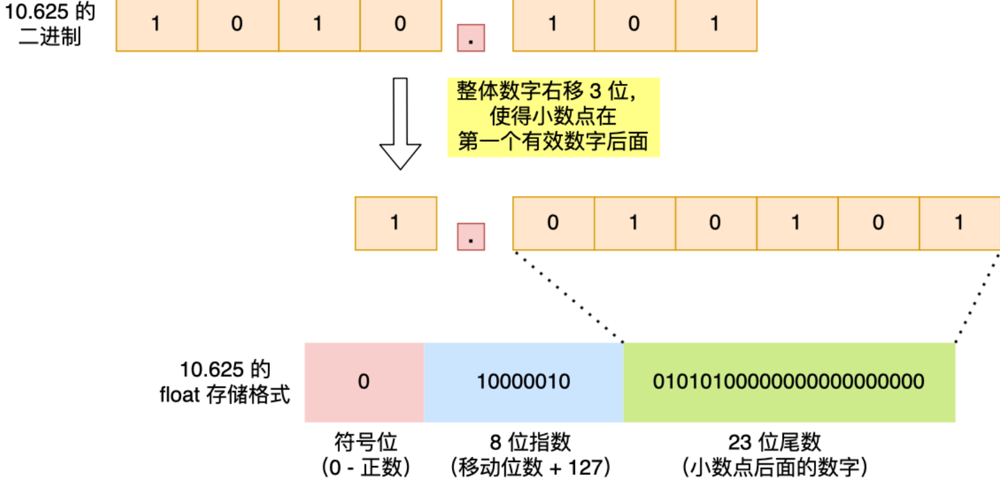

不是的，0.1 和 0.2 这两个数字用⼆进制表达会是一个一直循环的⼆进制数，比如 0.1 的⼆进制表示为 0.0 0011 0011 0011… （0011 无限循环)，对于计算机而严，0.1 无法精确表达，这是浮点数计算造成精度损失的根源。

因此，IEEE 754 标准定义的浮点数只能根据精度舍入，然后用「近似值」来表示该⼆进制，那么意味着计算机存放的小数可能不是一个真实值。

 0.1 + 0.2 并不等于完整的 0.3，这主要是因为这两个小数无法用「完整」的⼆进制来表示，只能根据精度舍入，所以计算机⾥只能采用近似数的方式来保存，那两个近似数相加，得到的必然也是一个近似数

## 虚拟内存映射的时候操作系统会做哪些操作

1. cpu将逻辑地址传入内存管理单元mmu
2. mmu根据逻辑地址的段号查找所在的段, 然后根据
