> 参考多方大佬资料
>
> 小林图解：[图解MySQL介绍 | 小林coding (xiaolincoding.com)](https://xiaolincoding.com/mysql/)
>
> 阿布的八股 自己存着看 方便自己做笔记补充
>
> 原文地址：[MySQL阿秀的学习笔记 (interviewguide.cn)](https://interviewguide.cn/notes/03-hunting_job/02-interview/04-01-01-MySQL.html#_1、关系型和非关系型数据库的区别你了解多少)

# 基础

## **执行一条 select 查询语句，在 MySQL 中期间发生了什么？**

### MySQL 执行流程是怎样的？

先来一个上帝视角图，下面就是 MySQL 执行一条 SQL 查询语句的流程，也从图中可以看到 MySQL 内部架构里的各个功能模块。

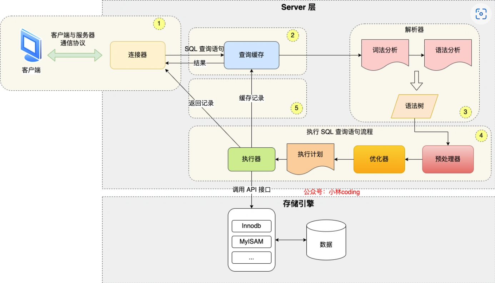

可以看到， MySQL 的架构共分为两层：**Server 层和存储引擎层**，

- `Server 层负责建立连接、分析和执行 SQL`。MySQL 大多数的核心功能模块都在这实现，主要包括连接器，查询缓存、解析器、预处理器、优化器、执行器等。另外，所有的内置函数（如日期、时间、数学和加密函数等）和所有跨存储引擎的功能（如存储过程、触发器、视图等。）都在 Server 层实现。
- `存储引擎层负责数据的存储和提取`。支持 <u>InnoDB、MyISAM、Memory 等多个存储引擎</u>，不同的存储引擎共用一个 Server 层。现在最常用的存储引擎是 InnoDB，从 MySQL 5.5 版本开始， InnoDB 成为了 MySQL 的默认存储引擎。我们常说的索引数据结构，就是由存储引擎层实现的，不同的存储引擎支持的索引类型也不相同，比如 InnoDB 支持索引类型是 B+树 ，且是默认使用，也就是说在数据表中创建的主键索引和二级索引默认使用的是 B+ 树索引。

#### [#](https://xiaolincoding.com/mysql/base/how_select.html#第一步-连接器)第一步：连接器

如果你在 Linux 操作系统里要使用 MySQL，那你第一步肯定是要先连接 MySQL 服务，然后才能执行 SQL 语句，普遍我们都是使用下面这条命令进行连接：

```shell
# -h 指定 MySQL 服务得 IP 地址，如果是连接本地的 MySQL服务，可以不用这个参数；
# -u 指定用户名，管理员角色名为 root；
# -p 指定密码，如果命令行中不填写密码（为了密码安全，建议不要在命令行写密码），就需要在交互对话里面输入密码
mysql -h$ip -u$user -p
```

`连接的过程需要先经过 TCP 三次握手`，因为 MySQL 是基于 TCP 协议进行传输的。

如果 MySQL 服务正常运行，完成 TCP 连接的建立后，连接器就要开始`验证你的用户名和密码`，如果用户名或密码不对，就收到一个"Access denied for user"的错误，然后客户端程序结束执行。

如果用户密码都没有问题，连接器就会`获取该用户的权限`，然后保存起来，后续该用户在此连接里的任何操作，都会基于连接开始时读到的权限进行权限逻辑的判断。

所以，如果一个用户已经建立了连接，即使管理员中途修改了该用户的权限，也不会影响已经存在连接的权限。修改完成后，只有再新建的连接才会使用新的权限设置。

> <u>**==如何查看 MySQL 服务被多少个客户端连接了？==**</u>
>
> 如果你想知道当前 MySQL 服务被多少个客户端连接了，你可以执行 `show processlist` 命令进行查看。

> <u>**==空闲连接会一直占用着吗？==**</u>
>
> 当然不是了，MySQL 定义了空闲连接的最大空闲时长，由 `wait_timeout` 参数控制的，默认值是 8 小时（28880秒），如果空闲连接超过了这个时间，连接器就会自动将它断开。
>
> ```sql
> mysql> show variables like 'wait_timeout';
> +---------------+-------+
> | Variable_name | Value |
> +---------------+-------+
> | wait_timeout  | 28800 |
> +---------------+-------+
> 1 row in set (0.00 sec)
> ```
>
> 当然，我们自己也可以手动断开空闲的连接，使用的是 kill connection + id 的命令。
>
> ```sql
> mysql> kill connection +6;
> Query OK, 0 rows affected (0.00 sec)
> ```
>
> 一个处于空闲状态的连接被服务端主动断开后，这个客户端并不会马上知道，等到客户端在发起下一个请求的时候，才会收到这样的报错“ERROR 2013 (HY000): Lost connection to MySQL server during query”。

> ==<u>**MySQL 的连接数有限制吗？**</u>==
>
> MySQL 服务支持的最大连接数由 `max_connections` 参数控制，比如我的 MySQL 服务默认是 151 个,超过这个值，系统就会拒绝接下来的连接请求，并报错提示“Too many connections”。

MySQL 的连接也跟 HTTP 一样，有短连接和长连接的概念，它们的区别如下：

```c
// 短连接
连接 mysql 服务（TCP 三次握手）
执行sql
断开 mysql 服务（TCP 四次挥手）

// 长连接
连接 mysql 服务（TCP 三次握手）
执行sql
执行sql
执行sql
....
断开 mysql 服务（TCP 四次挥手）
```

可以看到，<u>使用长连接的好处就是可以减少建立连接和断开连接的过程，所以一般是`推荐使用长连接`。</u>

但是，<u>使用长连接后可能会`占用内存增多`</u>，因为 MySQL 在执行查询过程中临时使用内存管理连接对象，这些连接对象资源只有在连接断开时才会释放。如果长连接累计很多，将导致 MySQL 服务占用内存太大，有可能会被系统强制杀掉，这样会发生 MySQL 服务异常重启的现象。

> ==<u>**怎么解决长连接占用内存的问题？**</u>==
>
> 有两种解决方式。
>
> 第一种，**定期断开长连接**。既然断开连接后就会释放连接占用的内存资源，那么我们可以定期断开长连接。
>
> 第二种，**客户端主动重置连接**。MySQL 5.7 版本实现了 `mysql_reset_connection()` 函数的接口，注意这是接口函数不是命令，那么当客户端执行了一个很大的操作后，在代码里调用 mysql_reset_connection 函数来重置连接，达到释放内存的效果。这个过程不需要重连和重新做权限验证，但是会将连接恢复到刚刚创建完时的状态。
>
> 

**至此，连接器的工作做完了，简单总结一下：**

- 与客户端进行 `TCP 三次握手`建立连接；
- `校验客户端的用户名和密码`，如果用户名或密码不对，则会报错；
- 如果用户名和密码都对了，会`读取该用户的权限`，然后后面的权限逻辑判断都基于此时读取到的权限；

#### [#](https://xiaolincoding.com/mysql/base/how_select.html#第二步-查询缓存)第二步：查询缓存

连接器得工作完成后，客户端就可以向 MySQL 服务发送 SQL 语句了，MySQL 服务收到 SQL 语句后，就会<u>解析出 SQL 语句的第一个字段，看看是什么`类型`的语句</u>。

如果 SQL 是==查询语句==（select 语句），MySQL 就会先去`查询缓存`（ Query Cache ）里查找缓存数据，看看之前有没有执行过这一条命令，这个查询缓存是以 key-value 形式保存在内存中的，key 为 SQL 查询语句，value 为 SQL 语句查询的结果。

如果查询的语句命中查询缓存，那么就会直接返回 value 给客户端。如果查询的语句没有命中查询缓存中，那么就要往下继续执行，等执行完后，查询的结果就会被存入查询缓存中。

> 这么看，查询缓存还挺有用，但是其实`查询缓存挺鸡肋`的。
>
> 对于更新比较频繁的表，查询缓存的命中率很低的，因为只要一个表有更新操作，那么这个表的查询缓存就会被清空。如果刚缓存了一个查询结果很大的数据，还没被使用的时候，刚好这个表有更新操作，查询缓冲就被清空了，相当于缓存了个寂寞。
>
> 所以，`MySQL 8.0 版本直接将查询缓存删掉`了，也就是说 MySQL 8.0 开始，执行一条 SQL 查询语句，不会再走到查询缓存这个阶段了。
>
> 对于 MySQL 8.0 之前的版本，如果想关闭查询缓存，我们可以通过将参数 query_cache_type 设置成 DEMAND。

#### [#](https://xiaolincoding.com/mysql/base/how_select.html#第三步-解析-sql)第三步：解析 SQL

在正式执行 SQL 查询语句之前， `MySQL 会先对 SQL 语句做解析`，这个工作交由由「解析器」来完成。

##### [#](https://xiaolincoding.com/mysql/base/how_select.html#解析器)解析器

解析器会做如下两件事情。

第一件事情，`词法分析`。MySQL 会根据你输入的字符串识别出关键字出来，构建出 SQL 语法树，这样方面后面模块获取 SQL 类型、表名、字段名、 where 条件等等。

第二件事情，`语法分析`。根据词法分析的结果，语法解析器会根据语法规则，判断你输入的这个 SQL 语句是否满足 MySQL 语法。

<u>如果输入的 SQL 语句语法不对，就会在解析器这个阶段报错</u>。

但是注意，表不存在或者字段不存在，并不是在解析器里做的，《MySQL 45 讲》说是在解析器做的，但是经过我和朋友看 MySQL 源码（5.7和8.0）得出结论是`解析器只负责构建语法树和检查语法`，但是不会去查表或者字段存不存在。

#### [#](https://xiaolincoding.com/mysql/base/how_select.html#第四步-执行-sql)第四步：执行 SQL

经过解析器后，接着就要进入执行 SQL 查询语句的流程了，每条`SELECT` 查询语句流程主要可以分为下面这三个阶段：

- prepare 阶段，也就是`预处理`阶段；
- optimize 阶段，也就是`优化`阶段；
- execute 阶段，也就是`执行`阶段；

##### [#](https://xiaolincoding.com/mysql/base/how_select.html#预处理器)预处理器

我们先来说说预处理阶段做了什么事情。

- 检查 SQL 查询语句中的`表或者字段`是否`存在`；
- 将 `select *` 中的 `*` 符号，扩展为表上的所有列；

我下面这条查询语句，test 这张表是不存在的，这时 MySQL 就会在执行 SQL 查询语句的 prepare 阶段中报错。

```sql
mysql> select * from test;
ERROR 1146 (42S02): Table 'mysql.test' doesn't exist
```

##### [#](https://xiaolincoding.com/mysql/base/how_select.html#优化器)优化器

经过预处理阶段后，还需要为 SQL 查询语句先制定一个执行计划，这个工作交由「优化器」来完成的。

`优化器主要负责将 SQL 查询语句的执行方案确定下来`，比如在表里面有多个索引的时候，优化器会基于查询成本的考虑，来决定选择使用哪个索引。

当然，我们本次的查询语句（select * from product where id = 1）很简单，就是选择使用主键索引。

要想知道优化器选择了哪个索引，我们可以在查询语句最前面加个 `explain` 命令，这样就会输出这条 SQL 语句的执行计划，然后执行计划中的 key 就表示执行过程中使用了哪个索引

如果查询语句的执行计划里的 <u>key 为 null 说明没有使用索引</u>，那就会`全表扫描`（type = ALL），这种查询扫描的方式是效率最低档次的

这张 product 表只有一个索引就是主键，现在我在表中将 name 设置为普通索引（二级索引）。 

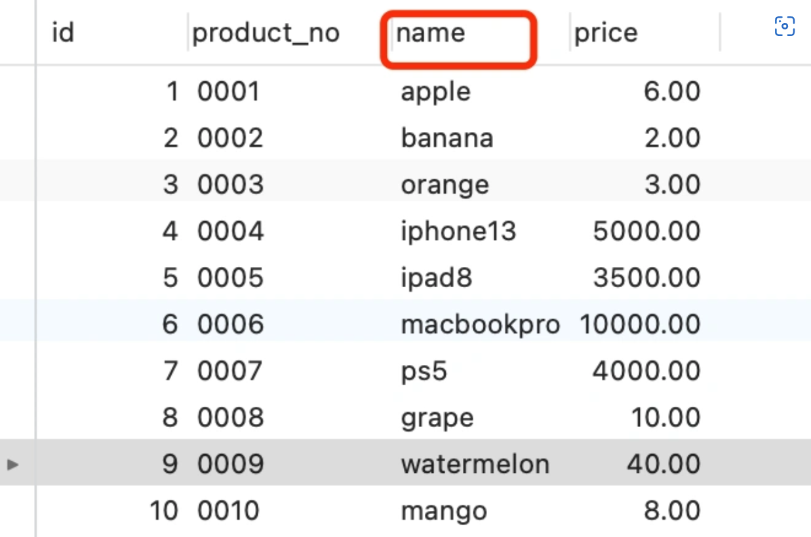

这时 product 表就有主键索引（id）和普通索引（name）。假设执行了这条查询语句：

```sql
select id from product where id > 1  and name like 'i%';
```

这条查询语句的结果既可以使用主键索引，也可以使用普通索引，但是执行的效率会不同。这时，就需要优化器来决定使用哪个索引了。

很显然这条查询语句是**覆盖索引**，直接在二级索引就能查找到结果（因为二级索引的 B+ 树的叶子节点的数据存储的是主键值），就没必要在主键索引查找了，因为查询主键索引的 B+ 树的成本会比查询二级索引的 B+ 的成本大，优化器基于查询成本的考虑，会选择查询代价小的普通索引。

在下图中执行计划，我们可以看到，执行过程中使用了普通索引（name），Exta 为 Using index，这就是表明使用了覆盖索引优化。

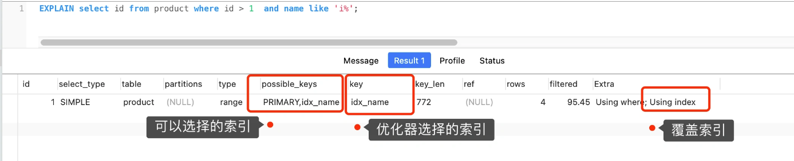

##### [#](https://xiaolincoding.com/mysql/base/how_select.html#执行器)执行器

经历完优化器后，就确定了执行方案，接下来 MySQL 就`真正开始执行语句`了，这个工作是由「执行器」完成的。在执行的过程中，执行器就会`和存储引擎交互`了，交互是以记录为单位的。

接下来，用三种方式执行过程，跟大家说一下`执行器和存储引擎的交互过程`（PS ：为了写好这一部分，特地去看 MySQL 源码，也是第一次看哈哈）。

- 主键索引查询
- 全表扫描
- 索引下推

###### [#](https://xiaolincoding.com/mysql/base/how_select.html#主键索引查询)主键索引查询

以本文开头查询语句为例，看看执行器是怎么工作的。

```sql
select * from product where id = 1;
```

这条查询语句的查询条件用到了主键索引，而且是等值查询，同时主键 id 是唯一，不会有 id 相同的记录，所以优化器决定选用访问类型为const 进行查询，也就是使用主键索引查询一条记录，那么执行器与存储引擎的执行流程是这样的：

- 执行器第一次查询，会调用 read_first_record 函数指针指向的函数，因为优化器选择的访问类型为 const，这个函数指针被指向为 InnoDB 引擎索引查询的接口，把条件 `id = 1` 交给存储引擎，**让存储引擎定位符合条件的第一条记录**。
- 存储引擎通过主键索引的 B+ 树结构定位到 id = 1的第一条记录，如果记录是不存在的，就会向执行器上报记录找不到的错误，然后查询结束。如果记录是存在的，就会将记录返回给执行器；
- 执行器从存储引擎读到记录后，接着判断记录是否符合查询条件，如果符合则发送给客户端，如果不符合则跳过该记录。
- 执行器查询的过程是一个 while 循环，所以还会再查一次，但是这次因为不是第一次查询了，所以会调用 read_record 函数指针指向的函数，因为优化器选择的访问类型为 const，这个函数指针被指向为一个永远返回 - 1 的函数，所以当调用该函数的时候，执行器就退出循环，也就是结束查询了。

至此，这个语句就执行完成了。

###### [#](https://xiaolincoding.com/mysql/base/how_select.html#全表扫描)全表扫描

举个全表扫描的例子：

```text
select * from product where name = 'iphone';
```

这条查询语句的查询条件没有用到索引，所以优化器决定选用访问类型为 ALL 进行查询，也就是全表扫描的方式查询，那么这时执行器与存储引擎的执行流程是这样的：

- 执行器第一次查询，会调用 read_first_record 函数指针指向的函数，因为优化器选择的访问类型为 all，这个函数指针被指向为 InnoDB 引擎全扫描的接口，**让存储引擎读取表中的第一条记录**；
- 执行器会判断读到的这条记录的 name 是不是 iphone，如果不是则跳过；如果是则将记录发给客户的（是的没错，Server 层每从存储引擎读到一条记录就会发送给客户端，之所以客户端显示的时候是直接显示所有记录的，是因为客户端是等查询语句查询完成后，才会显示出所有的记录）。
- 执行器查询的过程是一个 while 循环，所以还会再查一次，会调用 read_record 函数指针指向的函数，因为优化器选择的访问类型为 all，read_record 函数指针指向的还是 InnoDB 引擎全扫描的接口，所以接着向存储引擎层要求继续读刚才那条记录的下一条记录，存储引擎把下一条记录取出后就将其返回给执行器（Server层），执行器继续判断条件，不符合查询条件即跳过该记录，否则发送到客户端；
- 一直重复上述过程，直到存储引擎把表中的所有记录读完，然后向执行器（Server层） 返回了读取完毕的信息；
- 执行器收到存储引擎报告的查询完毕的信息，退出循环，停止查询。

至此，这个语句就执行完成了。

###### [#](https://xiaolincoding.com/mysql/base/how_select.html#索引下推)索引下推

> `为了减少二级索引查询时的回表操作，在引擎层负责一些server层的事情，减少回表，提高查询效率`

在这部分非常适合讲索引下推（MySQL 5.7 推出的查询优化策略），这样大家能清楚的知道，「下推」这个动作，下推到了哪里。

索引下推能够减少**二级索引**在查询时的回表操作，提高查询的效率，因为它将 Server 层部分负责的事情，交给存储引擎层去处理了。

举一个具体的例子，方便大家理解，这里一张用户表如下，我对 age 和 reword 字段建立了联合索引（age，reword）：

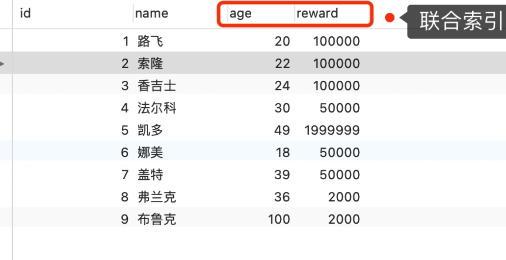

现在有下面这条查询语句：

```sql
select * from t_user  where age > 20 and reward = 100000;
```

联合索引当遇到范围查询 (>、<、between、like) 就会停止匹配，也就是 **a 字段能用到联合索引，但是 reward 字段则无法利用到索引**。具体原因这里可以看这篇：[索引常见面试题(opens new window)](https://xiaolincoding.com/mysql/index/index_interview.html#按字段个数分类)

那么，不使用索引下推（MySQL 5.7 之前的版本）时，执行器与存储引擎的执行流程是这样的：

- Server 层首先调用存储引擎的接口定位到满足查询条件的第一条二级索引记录，也就是定位到 age > 20 的第一条记录；
- 存储引起根据二级索引的 B+ 树快速定位到这条记录后，获取主键值，然后**`进行回表操作`**，将完整的记录返回给 Server 层；
- Server 层在判断该记录的 reward 是否等于 100000，如果成立则将其发送给客户端；否则跳过该记录；
- 接着，继续向存储引擎索要下一条记录，存储引擎在二级索引定位到记录后，获取主键值，然后回表操作，将完整的记录返回给 Server 层；
- 如此往复，直到存储引擎把表中的所有记录读完。

可以看到，没有索引下推的时候，每查询到一条二级索引记录，都要进行回表操作，然后将记录返回给 Server，接着 Server 再判断该记录的 reward 是否等于 100000。

而使用索引下推后，判断记录的 reward 是否等于 100000 的工作交给了存储引擎层，过程如下 ：

- Server 层首先调用存储引擎的接口定位到满足查询条件的第一条二级索引记录，也就是定位到 age > 20 的第一条记录；
- 存储引擎定位到二级索引后，<u>**先不执行回表**操作，而是先判断一下该索引中包含的列（reward列）的条件（reward 是否等于 100000）是否成立。如果**条件不成立**，则直接**跳过该二级索引**。如果**成立**，则**执行回表**操作，将完成记录返回给 Server 层。</u>
- Server 层在判断其他的查询条件（本次查询没有其他条件）是否成立，如果成立则将其发送给客户端；否则跳过该记录，然后向存储引擎索要下一条记录。
- 如此往复，直到存储引擎把表中的所有记录读完。

> 所谓的回表查询，先定位主键值，再定位行记录，它的性能较扫一遍索引树更低。

可以看到，使用了索引下推后，虽然 reward 列无法使用到联合索引，但是因为它包含在联合索引（age，reward）里，所以直接在存储引擎过滤出满足 reward = 100000 的记录后，才去执行回表操作获取整个记录。相比于没有使用索引下推，`节省了很多回表操作`。

当你发现执行计划里的 Extr 部分显示了 “Using index condition”，说明使用了索引下推。

------

### [#](https://xiaolincoding.com/mysql/base/how_select.html#总结)总结

执行一条 SQL 查询语句，期间发生了什么？

- 连接器：`建立连接，管理连接、校验用户身份`；
- `查询缓存`：查询语句如果命中查询缓存则直接返回，否则继续往下执行。MySQL 8.0 已删除该模块；
- `解析 SQL`，通过解析器对 SQL 查询语句进行词法分析、语法分析，然后构建语法树，方便后续模块读取表名、字段、语句类型；
- `执行 SQL`：执行 SQL 共有三个阶段：
  - `预处理`阶段：检查表或字段是否存在；将 `select *` 中的 `*` 符号扩展为表上的所有列。
  - `优化`阶段：基于查询成本的考虑， 选择查询成本最小的执行计划；
  - `执行`阶段：根据执行计划执行 SQL 查询语句，从存储引擎读取记录，返回给客户端；

怎么样？现在再看这张图，是不是很清晰了。


# 索引

**索引是数据的目录**。

## 索引的分类

- 按「数据结构」分类：**B+tree索引、Hash索引、Full-text索引**。
- 按「物理存储」分类：**聚簇索引（主键索引）、二级索引（辅助索引）**。
- 按「字段特性」分类：**主键索引、唯一索引、普通索引、前缀索引**。
- 按「字段个数」分类：**单列索引、联合索引**。

### 按数据结构分类

从数据结构的角度来看，MySQL 常见索引有 B+Tree 索引、HASH 索引、Full-Text 索引。

每一种存储引擎支持的索引类型不一定相同，我在表中总结了 MySQL 常见的存储引擎 InnoDB、MyISAM 和 Memory 分别支持的索引类型。

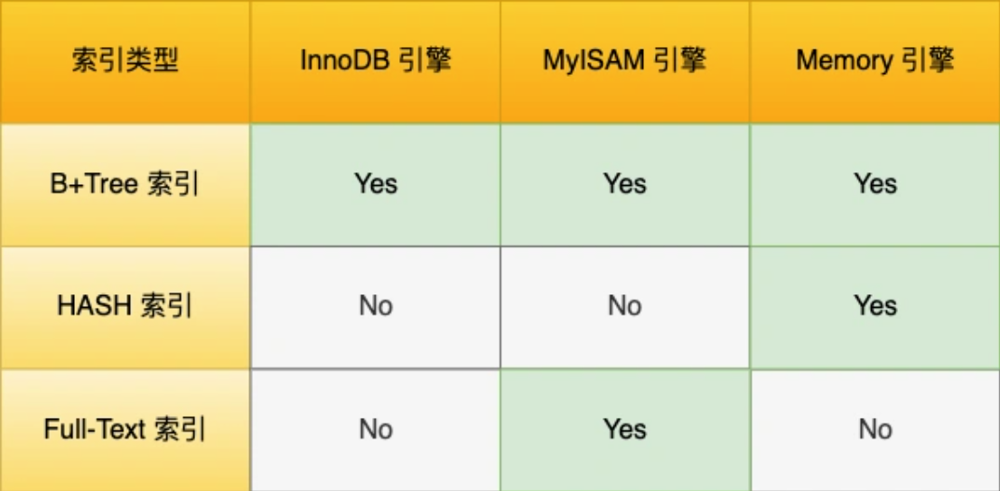

`InnoDB` yin no db 是在 MySQL 5.5 之后成为`默认`的 MySQL 存储引擎，==B+Tree== 索引类型也是 MySQL 存储引擎采用最多的索引类型。

在创建表时，InnoDB 存储引擎会根据不同的场景选择不同的列作为索引： 所以 默认的就是==聚簇索引==

- 如果有主键，`默认会使用主键作为聚簇索引的索引键（key）`；
- 如果`没有主键`，就选择`第一个不包含 NULL 值的唯一列`作为聚簇索引的索引键（key）；
- 在上面两个都没有的情况下，InnoDB 将`自动生成一个隐式自增 id列` 作为聚簇索引的索引键（key）；

<u>其它索引</u>都属于`辅助索引`（Secondary Index），也被称为二级索引或非聚簇索引。**创建的主键索引和二级索引默认使用的是 B+Tree 索引**。

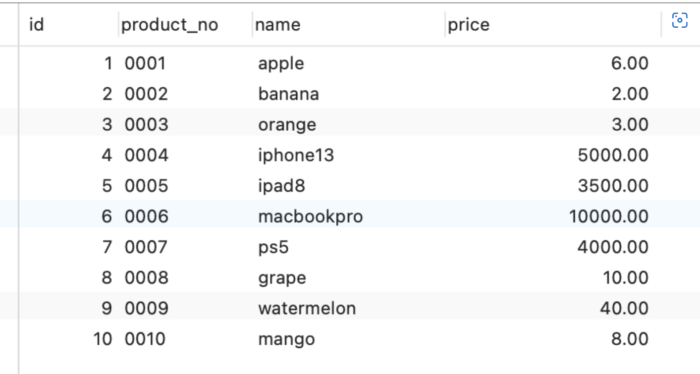

B+Tree 是一种多叉树，`叶子节点才存放数据`，`非叶子节点只存放索引`，而且每个节点里的数据是**按主键顺序存放**的。每一层父节点的索引值都会出现在下层子节点的索引值中，因此在叶子节点中，包括了所有的索引值信息，并且每一个叶子节点都指向下一个叶子节点，形成一个链表。

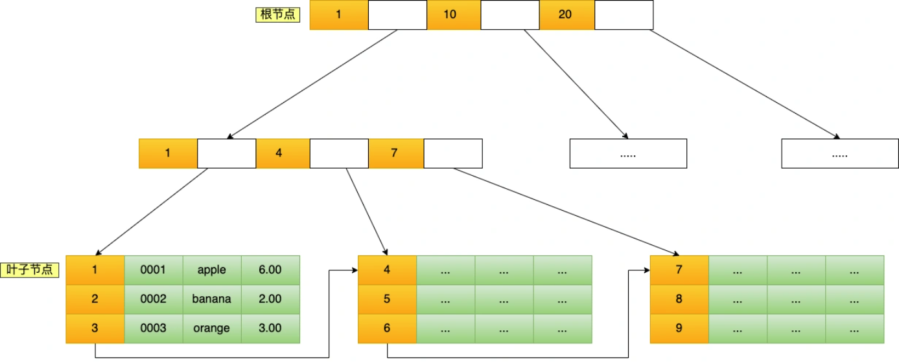

#### [#](https://xiaolincoding.com/mysql/index/index_interview.html#通过主键查询商品数据的过程)通过`主键`查询商品数据的过程  ==聚簇索引==

比如，我们执行了下面这条查询语句，这条语句使用了主键索引查询 id 号为 `5` 的商品。查询过程是这样的，B+Tree 会自顶向下逐层进行查找：

- 将 5 与根节点的索引数据 (1，10，20) 比较，5 在 1 和 10 之间，所以根据 B+Tree的搜索逻辑，找到第二层的索引数据 (1，4，7)；
- 在第二层的索引数据 (1，4，7)中进行查找，因为 5 在 4 和 7 之间，所以找到第三层的索引数据（4，5，6）；
- 在叶子节点的索引数据（4，5，6）中进行查找，然后我们找到了索引值为 5 的行数据。

数据库的索引和数据都是存储在硬盘的，我们可以把读取一个节点当作一次磁盘 I/O 操作。那么上面的整个查询过程一共经历了 3 个节点，也就是进行了 `3 次 I/O` 操作。

<u>B+Tree 存储千万级的数据只需要 3-4 层高度就可以满足</u>，这意味着从千万级的表查询目标数据最多需要 3-4 次磁盘 I/O，所以**B+Tree 相比于 B 树和二叉树来说，`最大的优势在于查询效率很高`，因为<u>即使在数据量很大的情况，查询一个数据的磁盘 I/O 依然维持在 3-4次</u>。**

#### 通过==二级索引==查询商品数据的过程

主键索引的 B+Tree 和二级索引的 B+Tree 区别如下：

- 主键索引的 B+Tree 的叶子节点存放的是实际数据，所有完整的用户记录都存放在主键索引的 B+Tree 的叶子节点里；
- 二级索引的 B+Tree 的叶子节点存放的是主键值，而不是实际数据。

我这里将前面的商品表中的 product_no （商品编码）字段设置为二级索引，那么二级索引的 B+Tree 如下图，其中非叶子的 key 值是 product_no（图中橙色部分），叶子节点存储的数据是主键值（图中绿色部分）

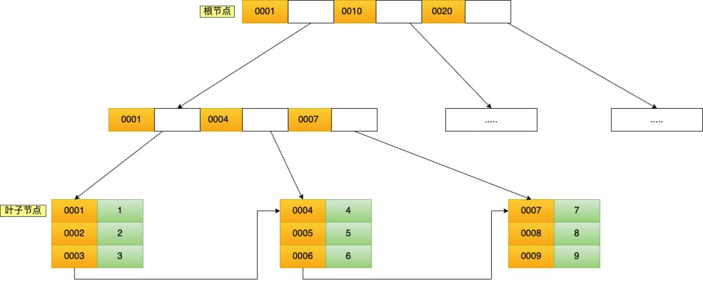

如果我用 product_no 二级索引查询商品，如下查询语句：

```sql
select * from product where product_no = '0002';
```

会先检`二级索引中的 B+Tree 的索引值`（商品编码，product_no），找到对应的叶子节点，然后`获取主键值`，然后再通过主键索引中的 B+Tree 树查询到对应的叶子节点，然后获取整行数据。**这个过程叫「`回表`」，也就是说要`查两个 B+Tree 才能查到数据`**。如下图：

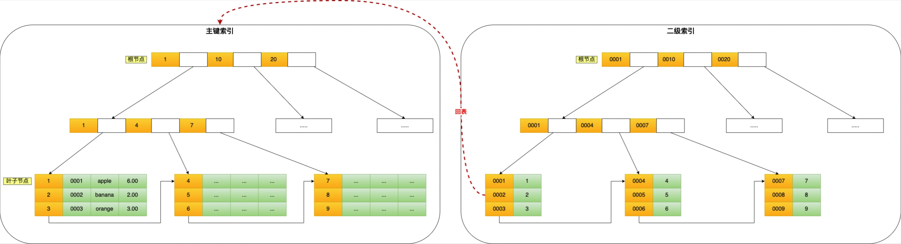

不过，`当查询的数据是能在二级索引的 B+Tree 的叶子节点里查询到，这时就不用再查主键索引`，比如下面这条查询语句：

> 也就是说 `根据二级索引查找的就是主键`时 叫==覆盖索引== 不需要回表

```sql
select id from product where product_no = '0002';
```

**这种在二级索引的 B+Tree 就能查询到结果的过程就叫作「`覆盖索引`」，也就是只需要查一个 B+Tree 就能找到数据**。

#### 为什么 MySQL InnoDB 选择 B+tree 作为索引的数据结构？

**1、B+Tree vs B Tree**

B+Tree 只在叶子节点存储数据，而 B 树 的非叶子节点也要存储数据，所以 B+Tree 的单个节点的数据量更小，在相同的磁盘 I/O 次数下，就能查询更多的节点。

另外，B+Tree 叶子节点采用的是`双链表`连接，适合 MySQL 中常见的基于`范围`的顺序查找，而 B 树无法做到这一点。

> 1. `非叶子不存储数据 所以层数更少，IO次数少`
> 2. `叶子节点双链表 能够实现范围查询`

**2、B+Tree vs 二叉树**

对于有 N 个叶子节点的 B+Tree，其搜索复杂度为`O(logdN)`，其中 d 表示节点允许的最大子节点个数为 d 个。

在实际的应用当中， d 值是大于100的，这样就保证了，即使数据达到千万级别时，B+Tree 的高度依然维持在 3~4 层左右，也就是说一次数据查询操作只需要做 3~4 次的磁盘 I/O 操作就能查询到目标数据。

而二叉树的每个父节点的儿子节点个数只能是 2 个，意味着其搜索复杂度为 `O(logN)`，这已经比 B+Tree 高出不少，因此二叉树检索到目标数据所经历的磁盘 I/O 次数要更多。

> 1. `层数更少`
> 2. `时间复杂度更低 不止两个节点`

**3、B+Tree vs Hash**

Hash 在做等值查询的时候效率贼快，搜索复杂度为 O(1)。

但是 `Hash 表不适合做范围查询`，它更适合做等值的查询，这也是 B+Tree 索引要比 Hash 表索引有着更广泛的适用场景的原因。

### 按物理存储分类

从物理存储的角度来看，索引分为`聚簇索引（主键索引）`、`二级索引`（辅助索引）。

这两个区别在前面也提到了：

- 主键索引的 B+Tree 的叶子节点存放的是实际数据，所有完整的用户记录都存放在主键索引的 B+Tree 的叶子节点里；
- 二级索引的 B+Tree 的叶子节点存放的是主键值，而不是实际数据。

所以，在查询时使用了二级索引，如果查询的数据能在二级索引里查询的到，那么就不需要回表，这个过程就是覆盖索引。如果查询的数据不在二级索引里，就会先检索二级索引，找到对应的叶子节点，获取到主键值后，然后再检索主键索引，就能查询到数据了，这个过程就是回表。

### 按字段特性分类

从字段特性的角度来看，索引分为主键索引、唯一索引、普通索引、前缀索引。

#### [#](https://xiaolincoding.com/mysql/index/index_interview.html#主键索引)主键索引

主键索引就是建立在主键字段上的索引，通常在创建表的时候一起创建，一张表最多只有一个主键索引，索引列的值不允许有空值。

在创建表时，创建主键索引的方式如下：

```sql
CREATE TABLE table_name  (
  ....
  PRIMARY KEY (index_column_1) USING BTREE
);
```

#### [#](https://xiaolincoding.com/mysql/index/index_interview.html#唯一索引)唯一索引

唯一索引建立在 UNIQUE 字段上的索引，一张表可以有多个唯一索引，索引列的值必须唯一，但是允许有空值。

在创建表时，创建唯一索引的方式如下：

```sql
CREATE TABLE table_name  (
  ....
  UNIQUE KEY(index_column_1,index_column_2,...) 
);
```

建表后，如果要创建唯一索引，可以使用这面这条命令：

```sql
CREATE UNIQUE INDEX index_name
ON table_name(index_column_1,index_column_2,...); 
```

#### [#](https://xiaolincoding.com/mysql/index/index_interview.html#普通索引)普通索引

普通索引就是建立在普通字段上的索引，既不要求字段为主键，也不要求字段为 UNIQUE。

在创建表时，创建普通索引的方式如下：

```sql
CREATE TABLE table_name  (
  ....
  INDEX(index_column_1,index_column_2,...) 
);
```

建表后，如果要创建普通索引，可以使用这面这条命令：

```sql
CREATE INDEX index_name
ON table_name(index_column_1,index_column_2,...); 
```

#### [#](https://xiaolincoding.com/mysql/index/index_interview.html#前缀索引)前缀索引

前缀索引是指对字符类型字段的前几个字符建立的索引，而不是在整个字段上建立的索引，前缀索引可以建立在字段类型为 char、 varchar、binary、varbinary 的列上。

使用前缀索引的目的是为了减少索引占用的存储空间，提升查询效率。

在创建表时，创建前缀索引的方式如下：

```sql
CREATE TABLE table_name(
    column_list,
    INDEX(column_name(length))
); 
```

建表后，如果要创建前缀索引，可以使用这面这条命令：

```sql
CREATE INDEX index_name
ON table_name(column_name(length)); 
```

### [#](https://xiaolincoding.com/mysql/index/index_interview.html#按字段个数分类)按`字段个数`分类

从字段个数的角度来看，索引分为单列索引、联合索引（复合索引）。

- 建立在单列上的索引称为单列索引，比如主键索引；
- 建立在多列上的索引称为联合索引；

#### [#](https://xiaolincoding.com/mysql/index/index_interview.html#联合索引)==联合索引==

通过`将多个字段组合成一个索引`，该索引就被称为联合索引。比如将商品表中的 product_no 和 name 字段组合成联合索引`(product_no, name)`，创建联合索引的方式如下：

```sql
CREATE INDEX index_product_no_name ON product(product_no, name);
```

联合索引`(product_no, name)` 的 B+Tree 示意图如下：

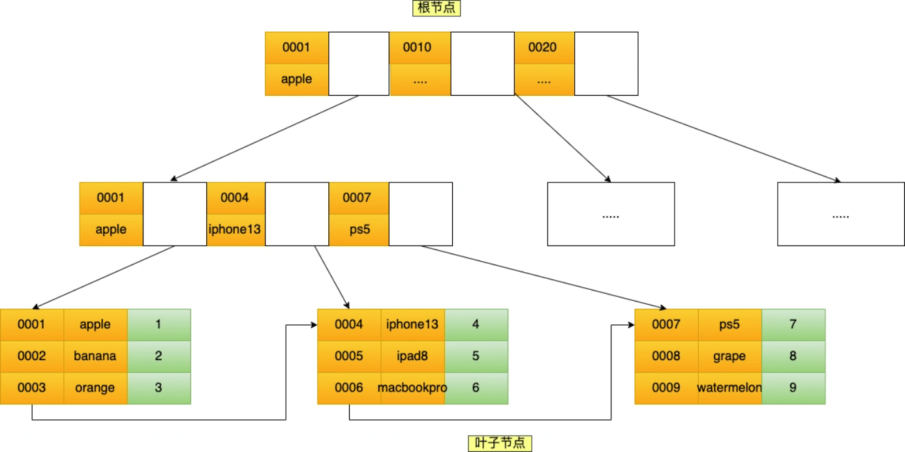

可以看到，联合索引的非叶子节点用两个字段的值作为 B+Tree 的 key 值。当在联合索引查询数据时，先按 product_no 字段比较，在 product_no 相同的情况下再按 name 字段比较。

也就是说，联合索引查询的 B+Tree 是先按 product_no 进行排序，然后再 product_no 相同的情况再按 name 字段排序。因此，使用联合索引时，存在**`最左匹配原则`**，也就是按照最左优先的方式进行索引的匹配。

我这里举联合索引（a，b）的例子，该联合索引的 B+ Tree 如下：

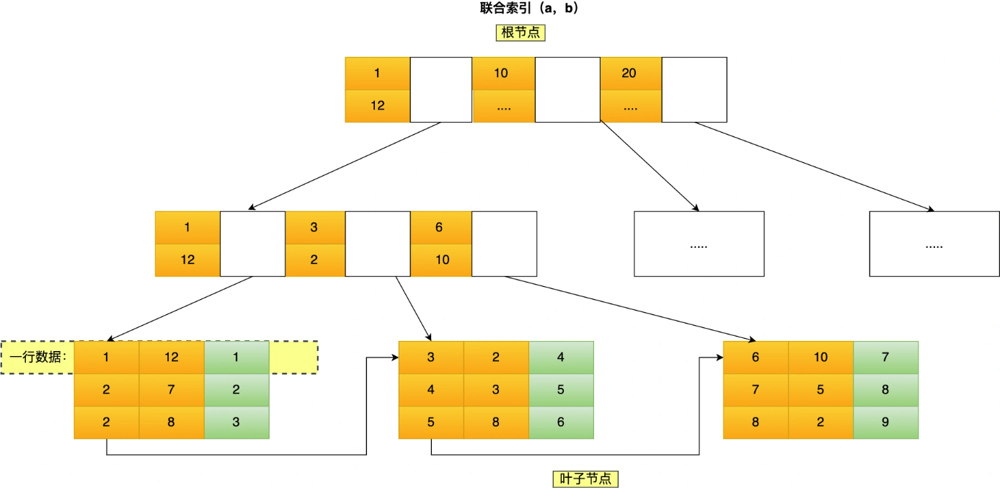

可以看到，`a 是全局有序的`（1, 2, 2, 3, 4, 5, 6, 7 ,8），而 `b 是全局是无序的`（12，7，8，2，3，8，10，5，2）。因此，直接执行where b = 2这种查询条件没有办法利用联合索引的，**`利用索引的前提是索引里的 key 是有序的`**。

只有在 a 相同的情况才，b 才是有序的，比如 a 等于 2 的时候，b 的值为（7，8），这时就是有序的，这个有序状态是局部的，因此，执行`where a = 2 and b = 7`是 a 和 b 字段能用到联合索引的，也就是联合索引生效了。

==<u>**但是**</u>==，如果执行`where a > 1 and b = 2`时，a 字段能用到联合索引，而 b 字段用不到联合索引。**因为 a 的值此时是一个范围，不是固定的，在这个范围内 b 值不是有序的，因此 b 字段用不上联合索引**。

综上所示，**联合索引的最左匹配原则，在遇到范围查询（>、<、between、like 包括like '林%'这种）的时候，就会停止匹配，也就是范围列可以用到联合索引，但是范围列后面的列无法用到联合索引**。

现在我们知道，对于联合索引（a, b），在执行 select * from table where a > 1 and b = 2 语句的时候，`只有 a 字段能用到索引`，那在联合索引的 B+Tree 找到第一个满足条件的主键值（ID 为 2）后，还需要判断其他条件是否满足（看 b 是否等于 2），那是在联合索引里判断？还是回主键索引去判断呢？

- `在 MySQL 5.6 之前`，只能从 ID2 （主键值）开始一个个==回表==，到「主键索引」上找出数据行，再对比 b 字段值。
- 而 MySQL 5.6 引入的==索引下推优化==（index condition pushdown)， **可以`在联合索引遍历过程中`，对联合索引中包含的字段`先做判断`，直接过滤掉不满足条件的记录，`减少回表次数`**。

当你的查询语句的执行计划里，出现了 Extra 为 Using index condition，那么说明使用了索引下推的优化。

另外，建立联合索引时的字段顺序，对索引效率也有很大影响。越靠前的字段被用于索引过滤的概率越高，实际开发工作中**建立联合索引时，要把`区分度大的字段排在前面`，这样区分度大的字段越有可能被更多的 SQL 使用到**。

## 什么时候`需要/不需要创建索引`？

索引最大的好处是`提高查询速度`，但是索引也是有==<u>**缺点**</u>==的，比如：

- 需要`占用物理空间`，数量越大，占用空间越大；
- 创建索引和维护索引要`耗费时间`，这种时间随着数据量的增加而增大；
- 会降低表的增删改的效率，因为每次增删改索引，B+ 树为了维护索引有序性，都需要进行`动态维护`。

所以，索引不是万能钥匙，它也是根据场景来使用的。

#### [#](https://xiaolincoding.com/mysql/index/index_interview.html#什么时候适用索引)什么时候适用索引？

- 字段有`唯一性限制`的，比如商品编码；
- 经常用于 `WHERE` 查询条件的字段，这样能够提高整个表的查询速度，如果查询条件不是一个字段，可以建立联合索引。
- 经常用于 `GROUP BY` 和 `ORDER BY` 的字段，这样在查询的时候就不需要再去做一次排序了，因为我们都已经知道了建立索引之后在 B+Tree 中的记录都是排序好的。

#### [#](https://xiaolincoding.com/mysql/index/index_interview.html#什么时候不需要创建索引)什么时候不需要创建索引？

- `WHERE` 条件，`GROUP BY`，`ORDER BY` 里`用不到的字段`，索引的价值是快速定位，如果起不到定位的字段通常是不需要创建索引的，因为索引是会占用物理空间的。
- 字段中`存在大量重复数据`，不需要创建索引，比如==<u>**性别**</u>==字段，只有男女，如果数据库表中，男女的记录分布均匀，那么无论搜索哪个值都可能得到一半的数据。在这些情况下，还不如不要索引，<u>因为 MySQL 还有一个查询优化器，查询优化器发现某个值出现在表的数据行中的百分比很高的时候，它一般会忽略索引，进行全表扫描。</u>
- `表数据太少`的时候，不需要创建索引；
- `经常更新的字段`不用创建索引，比如不要对电商项目的用户余额建立索引，因为索引字段频繁修改，由于要`维护 B+Tree的有序性`，那么就需要频繁的重建索引，这个过程是会影响数据库性能的。

## 有什么`优化索引`的方法？

这里说一下几种常见优化索引的方法：

- 前缀索引优化；
- 覆盖索引优化；
- 主键索引最好是自增的；
- 防止索引失效；

### [#](https://xiaolincoding.com/mysql/index/index_interview.html#前缀索引优化)前缀索引优化

前缀索引顾名思义就是使用某个字段中字符串的`前几个字符建立索引`，那我们为什么需要使用前缀来建立索引呢？

使用前缀索引是为了`减小索引字段大小`，可以增加一个索引页中存储的索引值，有效提高索引的查询速度。在一些大字符串的字段作为索引时，使用前缀索引可以帮助我们减小索引项的大小。

不过，前缀索引有一定的局限性，例如：

- order by 就无法使用前缀索引；
- 无法把前缀索引用作覆盖索引；

### [#](https://xiaolincoding.com/mysql/index/index_interview.html#覆盖索引优化)覆盖索引优化

覆盖索引是指 SQL 中 query 的所有字段，在索引 B+Tree 的叶子节点上都能找得到的那些索引，从二级索引中查询得到记录，而不需要通过聚簇索引查询获得，可以避免回表的操作。

假设我们只需要查询商品的名称、价格，有什么方式可以避免回表呢？

我们可以建立一个联合索引，即「商品ID、名称、价格」作为一个联合索引。如果索引中存在这些数据，查询将不会再次检索主键索引，从而避免回表。

所以，使用覆盖索引的好处就是，不需要查询出包含整行记录的所有信息，也就减少了大量的 I/O 操作。

### [#](https://xiaolincoding.com/mysql/index/index_interview.html#主键索引最好是自增的)主键索引最好是自增的

我们在建表的时候，都会默认将主键索引设置为自增的，具体为什么要这样做呢？又什么好处？

InnoDB 创建主键索引默认为聚簇索引，数据被存放在了 B+Tree 的叶子节点上。也就是说，同一个叶子节点内的各个数据是按主键顺序存放的，因此，每当有一条新的数据插入时，数据库会根据主键将其插入到对应的叶子节点中。

**如果我们使用自增主键**，那么每次插入的新数据就会按顺序添加到当前索引节点的位置，`不需要移动已有的数据`，当页面写满，就会自动开辟一个新页面。因为每次**插入一条新记录，都是追加操作，不需要重新移动数据**，因此这种插入数据的方法效率非常高。

**如果我们使用非自增主键**，由于每次插入主键的索引值都是随机的，因此每次插入新的数据时，就可能会插入到现有数据页中间的某个位置，这将不得不移动其它数据来满足新数据的插入，甚至需要从一个页面复制数据到另外一个页面，我们通常将这种情况称为**`页分裂`**。**页分裂还有可能会造成大量的内存碎片，导致索引结构不紧凑，从而影响查询效率**。

在使用 InnoDB 存储引擎时，如果没有特别的业务需求，建议使用自增字段作为主键。

另外，<u>主键字段的长度不要太大</u>，因为**主键字段长度越小，意味着二级索引的叶子节点越小（二级索引的叶子节点存放的数据是主键值），这样二级索引占用的空间也就越小**。

### 索引最好设置为 NOT NULL

为了更好的利用索引，索引列要设置为 NOT NULL 约束。有两个原因：

- 第一原因：索引列存在 NULL 就会导致优化器在做索引选择的时候更加复杂，更加`难以优化`，因为可为 NULL 的列会使索引、索引统计和值比较都更复杂，比如进行索引统计时，count 会省略值为NULL 的行。
- 第二个原因：`NULL 值是一个没意义的值，但是它会占用物理空间`，所以会带来的存储空间的问题，会导致更多的存储空间占用，因为 InnoDB 默认行存储格式COMPACT，会用 1 字节空间存储 NULL 值列表，如下图的黄色部分：


### 防止索引失效

用上了索引并不意味着查询的时候会使用到索引，所以我们心里要清楚有哪些情况会导致索引失效，从而避免写出索引失效的查询语句，否则这样的查询效率是很低的。

[谁还没碰过索引失效呢?(opens new window)](https://mp.weixin.qq.com/s/lEx6iRRP3MbwJ82Xwp675w)

这里简单说一下，发生索引失效的情况：

- 当我们使用`左或者左右模糊匹配`的时候，也就是 like %xx 或者 like %xx%这两种方式都会造成索引失效；
- 当我们在查询条件中`对索引列做了计算、函数、类型转换操作`，这些情况下都会造成索引失效；
- `联合索引`要能正确使用`需要遵循最左匹配原则`，也就是按照最左优先的方式进行索引的匹配，否则就会导致索引失效。
- 在 WHERE 子句中，如果在 OR 前的条件列是索引列，而在 OR 后的条件列不是索引列，那么索引会失效。

上面说的是常见的索引失效场景，实际过程中，可能会出现其他的索引失效场景，这时我们就需要查看执行计划，通过执行计划显示的数据判断查询语句是否使用了索引。

## [#](https://xiaolincoding.com/mysql/index/index_interview.html#总结)`总结`

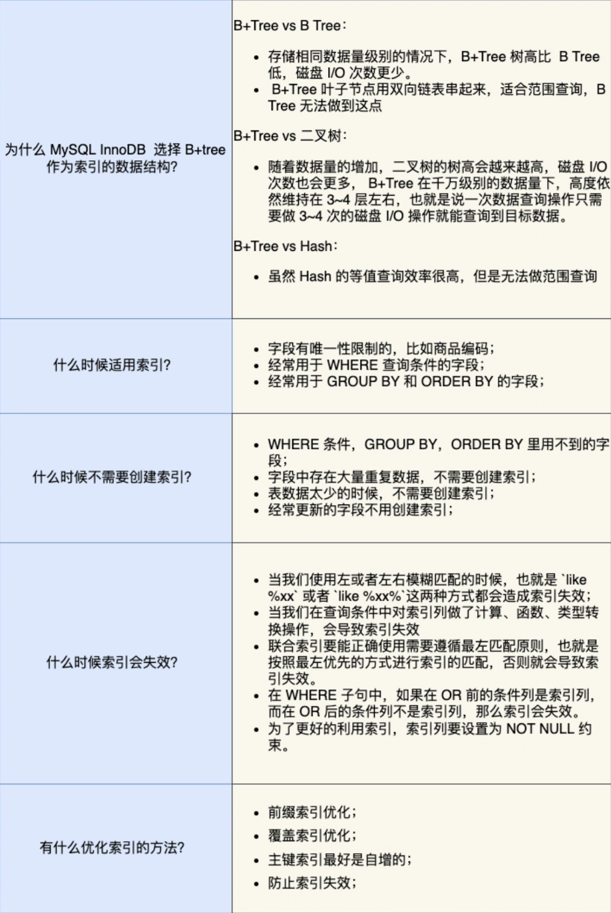

## InnoDB 是如何存储数据的？

MySQL 支持多种存储引擎，不同的存储引擎，存储数据的方式也是不同的，我们最常使用的是 InnoDB 存储引擎，所以就跟大家图解下InnoDB 是如何存储数据的。

记录是按照行来存储的，但是数据库的读取并不以「行」为单位，否则一次读取（也就是一次 I/O 操作）只能处理一行数据，效率会非常低。

因此，**InnoDB 的数据是按「数据页」为单位来读写的**，也就是说，当需要读一条记录的时候，并不是将这个记录本身从磁盘读出来，而是以页为单位，将其整体读入内存。

数据库的 I/O 操作的最小单位是页，**InnoDB 数据页的默认大小是 16KB**，意味着数据库每次读写都是以 16KB 为单位的，一次最少从磁盘中读取 16K 的内容到内存中，一次最少把内存中的 16K 内容刷新到磁盘中。

数据页包括七个部分，结构如下图：

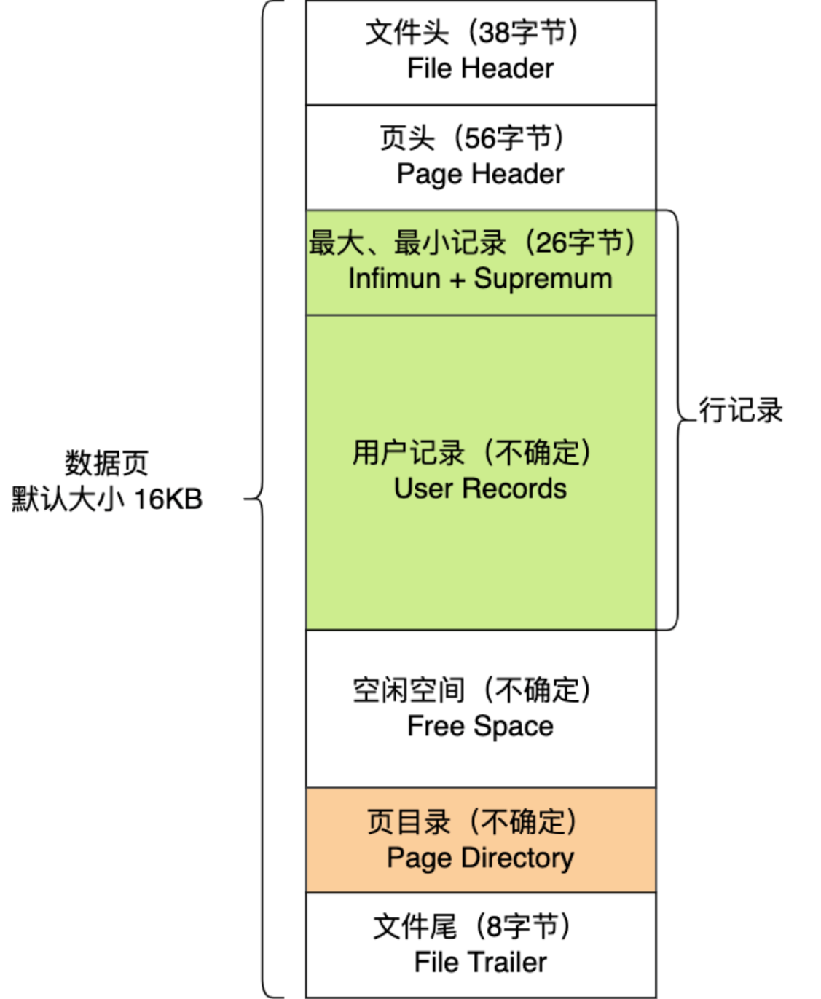

这 7 个部分的作用如下图：

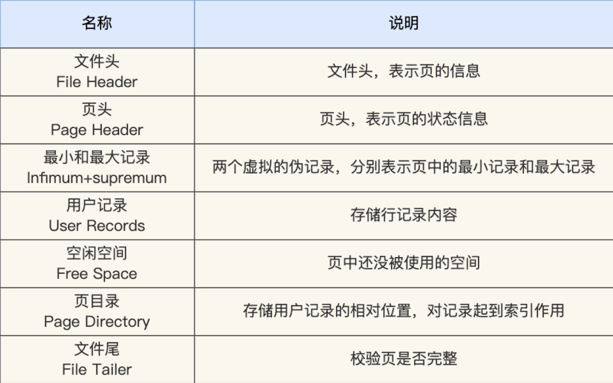

采用链表的结构是让数据页之间不需要是物理上的连续的，而是逻辑上的连续。

数据页的主要作用是存储记录，也就是数据库的数据，所以重点说一下数据页中的 User Records 是怎么组织数据的。

**`数据页中的记录按照「主键」顺序组成单向链表`**，单向链表的特点就是插入、删除非常方便，但是检索效率不高，最差的情况下需要遍历链表上的所有节点才能完成检索。

因此，数据页中有一个**页目录**，起到记录的索引作用，就像我们书那样，针对书中内容的每个章节设立了一个目录，想看某个章节的时候，可以查看目录，快速找到对应的章节的页数，而数据页中的页目录就是为了能快速找到记录。

那 InnoDB 是如何给记录创建页目录的呢？页目录与记录的关系如下图：

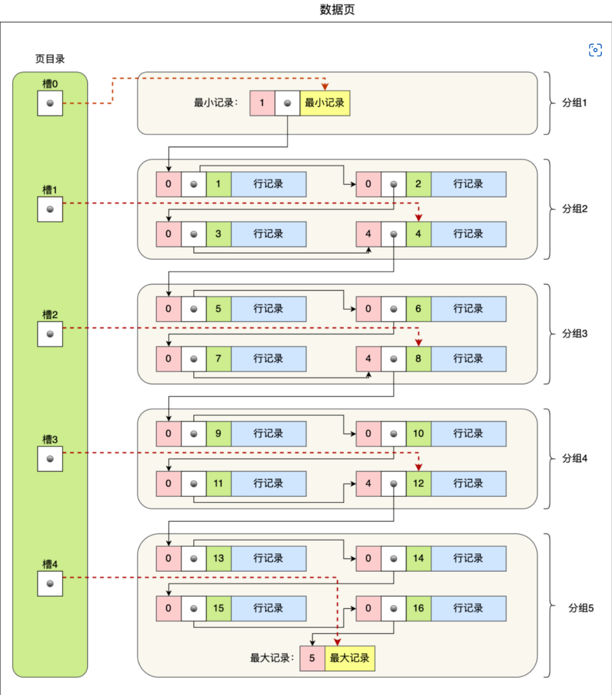

页目录创建的过程如下：

1. 将所有的记录划分成几个组，这些记录包括最小记录和最大记录，但不包括标记为“已删除”的记录；
2. 每个记录组的最后一条记录就是组内最大的那条记录，并且最后一条记录的头信息中会存储该组一共有多少条记录，作为 n_owned 字段（上图中粉红色字段）
3. 页目录用来存储每组最后一条记录的地址偏移量，这些地址偏移量会按照先后顺序存储起来，每组的地址偏移量也被称之为槽（slot），**每个槽相当于指针指向了不同组的最后一个记录**。

从图可以看到，**页目录就是由多个槽组成的，槽相当于分组记录的索引**。然后，因为记录是按照「主键值」从小到大排序的，所以**我们通过槽查找记录时，可以使用二分法快速定位要查询的记录在哪个槽（哪个记录分组），定位到槽后，再遍历槽内的所有记录，找到对应的记录**，无需从最小记录开始遍历整个页中的记录链表。

以上面那张图举个例子，5 个槽的编号分别为 0，1，2，3，4，我想查找主键为 11 的用户记录：

- 先二分得出槽中间位是 (0+4)/2=2 ，2号槽里最大的记录为 8。因为 11 > 8，所以需要从 2 号槽后继续搜索记录；
- 再使用二分搜索出 2 号和 4 槽的中间位是 (2+4)/2= 3，3 号槽里最大的记录为 12。因为 11 < 12，所以主键为 11 的记录在 3 号槽里；
- 这里有个问题，**「槽对应的值都是这个组的主键最大的记录，如何找到组里最小的记录」**？比如槽 3 对应最大主键是 12 的记录，那如何找到最小记录 9。解决办法是：通过槽 3 找到 槽 2 对应的记录，也就是主键为 8 的记录。主键为 8 的记录的下一条记录就是槽 3 当中主键最小的 9 记录，然后开始向下搜索 2 次，定位到主键为 11 的记录，取出该条记录的信息即为我们想要查找的内容。

看到第三步的时候，可能有的同学会疑问，如果某个槽内的记录很多，然后因为记录都是单向链表串起来的，那这样在槽内查找某个记录的时间复杂度不就是 O(n) 了吗？

这点不用担心，InnoDB 对每个分组中的记录条数都是有规定的，槽内的记录就只有几条：

- 第一个分组中的记录只能有 1 条记录；
- 最后一个分组中的记录条数范围只能在 1-8 条之间；
- 剩下的分组中记录条数范围只能在 4-8 条之间。

## B+ 树是如何进行查询的？

上面我们都是在说一个数据页中的记录检索，因为一个数据页中的记录是有限的，且主键值是有序的，所以通过对所有记录进行分组，然后将组号（槽号）存储到页目录，使其起到索引作用，通过二分查找的方法快速检索到记录在哪个分组，来降低检索的时间复杂度。

但是，当我们需要存储大量的记录时，就需要多个数据页，这时我们就需要考虑如何建立合适的索引，才能方便定位记录所在的页。

为了解决这个问题，**InnoDB 采用了 B+ 树作为索引**。磁盘的 I/O 操作次数对索引的使用效率至关重要，因此在构造索引的时候，我们更倾向于采用“矮胖”的 B+ 树数据结构，这样所需要进行的磁盘 I/O 次数更少，而且 B+ 树 更适合进行关键字的范围查询。

InnoDB 里的 B+ 树中的**每个节点都是一个数据页**，结构示意图如下：

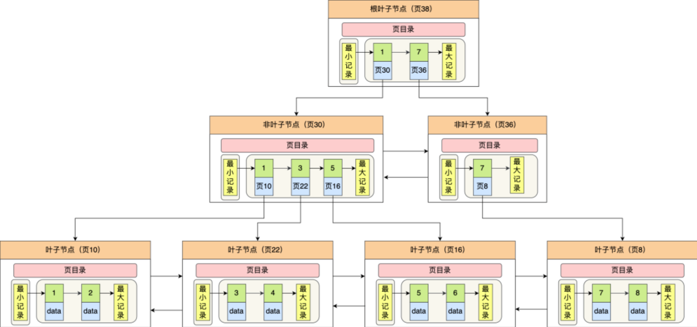

通过上图，我们看出 B+ 树的特点：

- 只有叶子节点（最底层的节点）才存放了数据，非叶子节点（其他上层节）仅用来存放目录项作为索引。
- 非叶子节点分为不同层次，通过分层来降低每一层的搜索量；
- 所有节点按照索引键大小排序，构成一个双向链表，便于范围查询；

我们再看看 B+ 树如何实现快速查找主键为 6 的记录，以上图为例子：

- 从根节点开始，通过二分法快速定位到符合页内范围包含查询值的页，因为查询的主键值为 6，在[1, 7)范围之间，所以到页 30 中查找更详细的目录项；
- 在非叶子节点（页30）中，继续通过二分法快速定位到符合页内范围包含查询值的页，主键值大于 5，所以就到叶子节点（页16）查找记录；
- 接着，在叶子节点（页16）中，通过槽查找记录时，使用二分法快速定位要查询的记录在哪个槽（哪个记录分组），定位到槽后，再遍历槽内的所有记录，找到主键为 6 的记录。

可以看到，在定位记录所在哪一个页时，也是通过二分法快速定位到包含该记录的页。定位到该页后，又会在该页内进行二分法快速定位记录所在的分组（槽号），最后在分组内进行遍历查找。

## [#](https://xiaolincoding.com/mysql/index/page.html#聚簇索引和二级索引)聚簇索引和二级索引

另外，索引又可以分成聚簇索引和非聚簇索引（二级索引），它们区别就在于叶子节点存放的是什么数据：

- 聚簇索引的叶子节点存放的是实际数据，所有完整的用户记录都存放在聚簇索引的叶子节点；
- 二级索引的叶子节点存放的是主键值，而不是实际数据。

因为表的数据都是存放在聚簇索引的叶子节点里，所以 InnoDB 存储引擎一定会为表创建一个聚簇索引，且由于数据在物理上只会保存一份，所以聚簇索引只能有一个。

InnoDB 在创建聚簇索引时，会根据不同的场景选择不同的列作为索引：

- 如果有主键，默认会使用主键作为聚簇索引的索引键；
- 如果没有主键，就选择第一个不包含 NULL 值的唯一列作为聚簇索引的索引键；
- 在上面两个都没有的情况下，InnoDB 将自动生成一个隐式自增 id 列作为聚簇索引的索引键；

一张表只能有一个聚簇索引，那为了实现非主键字段的快速搜索，就引出了二级索引（非聚簇索引/辅助索引），它也是利用了 B+ 树的数据结构，但是二级索引的叶子节点存放的是主键值，不是实际数据。

二级索引的 B+ 树如下图，数据部分为主键值：

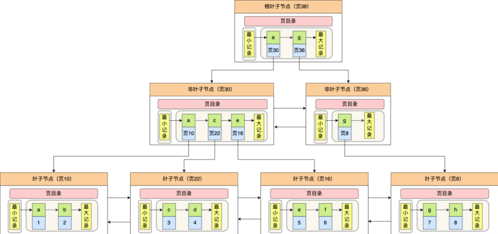

因此，**如果某个查询语句使用了二级索引，但是查询的数据不是主键值，这时在二级索引找到主键值后，需要去聚簇索引中获得数据行，这个过程就叫作「回表」，也就是说要查两个 B+ 树才能查到数据。不过，当查询的数据是主键值时，因为只在二级索引就能查询到，不用再去聚簇索引查，这个过程就叫作「索引覆盖」，也就是只需要查一个 B+ 树就能找到数据。**

## [#](https://xiaolincoding.com/mysql/index/page.html#总结)`总结`

InnoDB 的数据是按「`数据页`」为单位来读写的，默认数据页大小为 `16 KB`。每个数据页之间通过`双向链表`的形式组织起来，==<u>物理上不连续，但是逻辑上连续</u>==。

数据页内包含用户记录，每个记录之间用单向链表的方式组织起来，<u>为了加快在数据页内高效查询记录，`设计了一个页目录`，页目录存储各个槽（分组），且主键值是有序的，于是可以通过`二分查找法`的方式进行检索从而提高效率。</u>

为了高效查询记录所在的数据页，InnoDB 采用 `b+树作为索引`，每个节点都是一个数据页。

如果叶子节点存储的是实际数据的就是`聚簇索引`，一个表只能有一个聚簇索引；如果叶子节点存储的不是实际数据，而是主键值则就是`二级索引，一个表中可以有多个二级索引`。

在使用二级索引进行查找数据时，如果查询的数据能在二级索引找到，那么就是「索引覆盖」操作，如果查询的数据不在二级索引里，就需要先在二级索引找到主键值，需要去聚簇索引中获得数据行，这个过程就叫作「`回表`」。

## 发生`索引失效`的情况

今天给大家介绍了 6 种会发生索引失效的情况：

- 当我们使用==左或者左右模糊匹配==的时候，也就是 ==like %==xx 或者 like %xx%这两种方式都会造成索引失效；

  - 比如下面的 like 语句，查询 name 后缀为「林」的用户，执行计划中的 type=ALL 就代表了全表扫描，而没有走索引。

    ```text
    // name 字段为二级索引
    select * from t_user where name like '%林';
    ```

- 当我们在查询条件中对==索引列使用函数==，就会导致索引失效。

  - 因为索引保存的是`索引字段的原始值`，而不是经过函数计算后的值，自然就没办法走索引了。

- 当我们在查询条件中对==索引列进行表达式计算==，也是无法走索引的。

- MySQL 在遇到==字符串和数字比较==的时候，会自动把字符串转为数字，然后再进行比较。如果字符串是索引列，而条件语句中的输入参数是数字的话，那么索引列会发生==隐式类型转换==，由于隐式类型转换是通过 CAST 函数实现的，<u>等同于对索引列使用了函数</u>，所以就会导致索引失效。

- 联合索引要能正确使用需要遵循`最左匹配原则`，也就是按照最左优先的方式进行索引的匹配，否则就会导致索引失效。

- 在 WHERE 子句中，如果在 <u>OR 前的条件列是索引列，而在 OR 后的条件列不是索引列，那么索引会失效</u>。

##  哪种 count 性能最好？

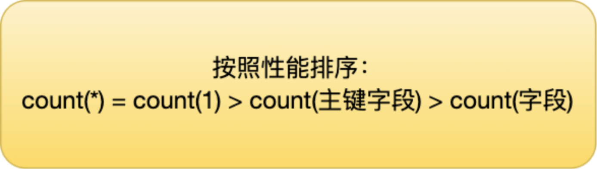

# 事务

## 事务有哪些特性？

事务是由 MySQL 的引擎来实现的，我们常见的 InnoDB 引擎它是支持事务的。

不过并不是所有的引擎都能支持事务，比如 MySQL 原生的 `MyISAM 引擎就不支持事务`，也正是这样，所以大多数 MySQL 的引擎都是用 InnoDB。

事务看起来感觉简单，但是要实现事务必须要遵守 4 个特性，分别如下：

- **`原子`性（Atomicity）**：一个事务中的所有操作，要么全部完成，要么全部不完成，不会结束在中间某个环节，而且事务在执行过程中发生错误，会被回滚到事务开始前的状态，就像这个事务从来没有执行过一样，就好比买一件商品，购买成功时，则给商家付了钱，商品到手；购买失败时，则商品在商家手中，消费者的钱也没花出去。
- **`一致`性（Consistency）**：是指事务操作前和操作后，数据满足完整性约束，数据库保持一致性状态。比如，用户 A 和用户 B 在银行分别有 800 元和 600 元，总共 1400 元，用户 A 给用户 B 转账 200 元，分为两个步骤，从 A 的账户扣除 200 元和对 B 的账户增加 200 元。一致性就是要求上述步骤操作后，最后的结果是用户 A 还有 600 元，用户 B 有 800 元，总共 1400 元，而不会出现用户 A 扣除了 200 元，但用户 B 未增加的情况（该情况，用户 A 和 B 均为 600 元，总共 1200 元）。
- **`隔离`性（Isolation）**：数据库允许多个并发事务同时对其数据进行读写和修改的能力，隔离性可以防止多个事务并发执行时由于交叉执行而导致数据的不一致，因为多个事务同时使用相同的数据时，不会相互干扰，每个事务都有一个完整的数据空间，对其他并发事务是隔离的。也就是说，消费者购买商品这个事务，是不影响其他消费者购买的。
- **`持久`性（Durability）**：事务处理结束后，对数据的修改就是永久的，即便系统故障也不会丢失。

I==<u>**nnoDB 引擎通过什么技术来保证事务的这四个特性的呢？**</u>==

- 持久性是通过 redo log （重做日志）来保证的；
- 原子性是通过 undo log（回滚日志） 来保证的；
- 隔离性是通过 MVCC（多版本并发控制） 或锁机制来保证的；
- 一致性则是通过持久性+原子性+隔离性来保证；

## 并行事务会引发什么问题？

MySQL 服务端是允许多个客户端连接的，这意味着 MySQL 会出现同时处理多个事务的情况。

那么**在同时处理多个事务的时候，就可能出现脏读（dirty read）、不可重复读（non-repeatable read）、幻读（phantom read）的问题**。

接下来，通过举例子给大家说明，这些问题是如何发生的。

### [#](https://xiaolincoding.com/mysql/transaction/mvcc.html#脏读)脏读

**如果一个事务「读到」了另一个「未提交事务修改过的数据」，就意味着发生了「脏读」现象。**

举个栗子。

假设有 A 和 B 这两个事务同时在处理，事务 A 先开始从数据库中读取小林的余额数据，然后再执行更新操作，如果此时事务 A 还没有提交事务，而此时正好事务 B 也从数据库中读取小林的余额数据，那么事务 B 读取到的余额数据是刚才事务 A 更新后的数据，即使没有提交事务。

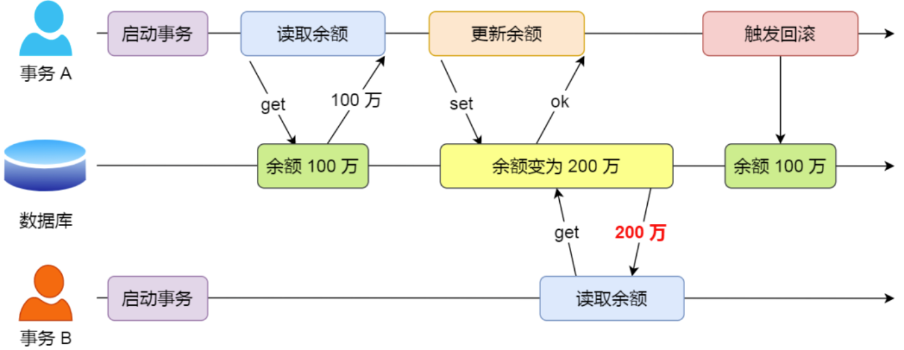

### 不可重复读

**在一个事务内多次读取同一个数据，如果出现前后两次读到的数据不一样的情况，就意味着发生了「不可重复读」现象。**

举个栗子。

假设有 A 和 B 这两个事务同时在处理，事务 A 先开始从数据库中读取小林的余额数据，然后`继续执行代码逻辑处理`，**在这过程中如果`事务 B 更新了这条数据`，并提交了事务，那么当事务 A 再次读取该数据时，就会发现前后两次读到的数据是不一致的，这种现象就被称为不可重复读。**

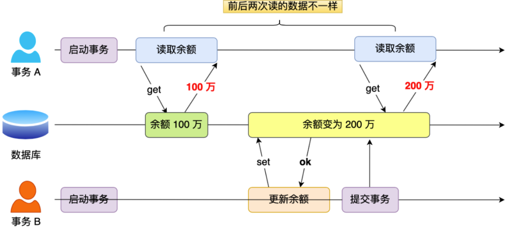

### 幻读

**在一个事务内多次查询某个符合查询条件的「记录数量」，如果出现前后两次查询到的记录数量不一样的情况，就意味着发生了「幻读」现象。**

举个栗子。

假设有 A 和 B 这两个事务同时在处理，事务 A 先开始从数据库查询账户余额大于 100 万的记录，发现共有 5 条，然后事务 B 也按相同的搜索条件也是查询出了 5 条记录。

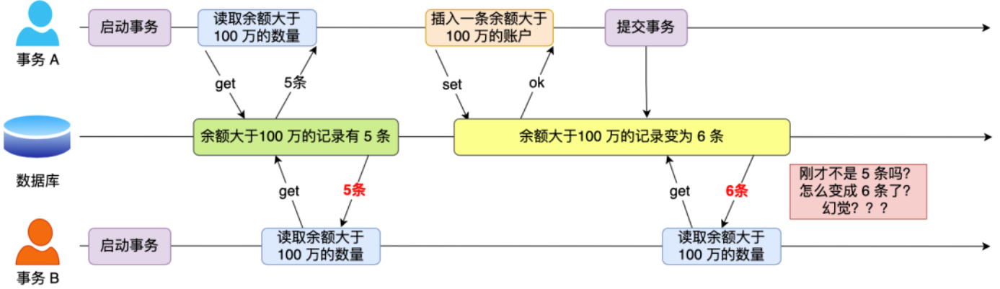

## 事务的隔离级别有哪些？

前面我们提到，当多个事务并发执行时可能会遇到「脏读、不可重复读、幻读」的现象，这些现象会对事务的一致性产生不同程序的影响。

- 脏读：读到其他事务未提交的数据；
- 不可重复读：前后读取的数据不一致；
- 幻读：前后读取的记录数量不一致。

这三个现象的严重性排序如下：


针对不同的隔离级别，并发事务时可能发生的现象也会不同。

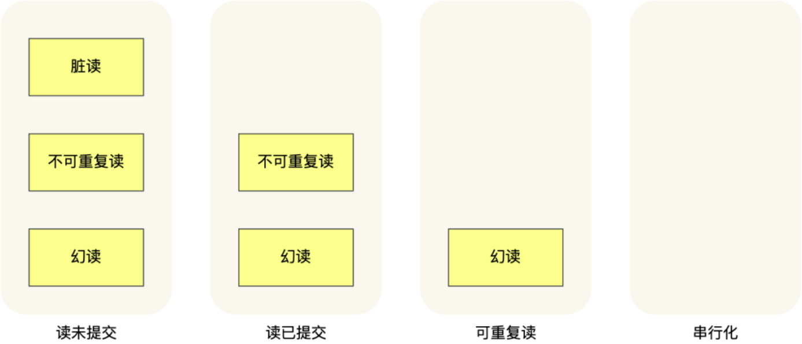

也就是说：

- 在「读未提交」隔离级别下，可能发生脏读、不可重复读和幻读现象；
- 在「读提交」隔离级别下，可能发生不可重复读和幻读现象，但是不可能发生脏读现象；
- 在「可重复读」隔离级别下，可能发生幻读现象，但是不可能脏读和不可重复读现象；
- 在「串行化」隔离级别下，脏读、不可重复读和幻读现象都不可能会发生。

所以，**要解决脏读现象，就要升级到「读提交」以上的隔离级别；要解决不可重复读现象，就要升级到「可重复读」的隔离级别**。

不过，要解决幻读现象不建议将隔离级别升级到「串行化」，因为这样会导致数据库在并发事务时性能很差。

**InnoDB 引擎的默认隔离级别虽然是「可重复读」，但是它通过next-key lock 锁（行锁和间隙锁的组合）来锁住记录之间的“间隙”和记录本身，防止其他事务在这个记录之间插入新的记录，这样就避免了幻读现象。**

## Read View 在 MVCC 里如何工作的？

我们需要了解两个知识：

- Read View 中四个字段作用；
- 聚簇索引记录中两个跟事务有关的隐藏列；

那 Read View 到底是个什么东西？

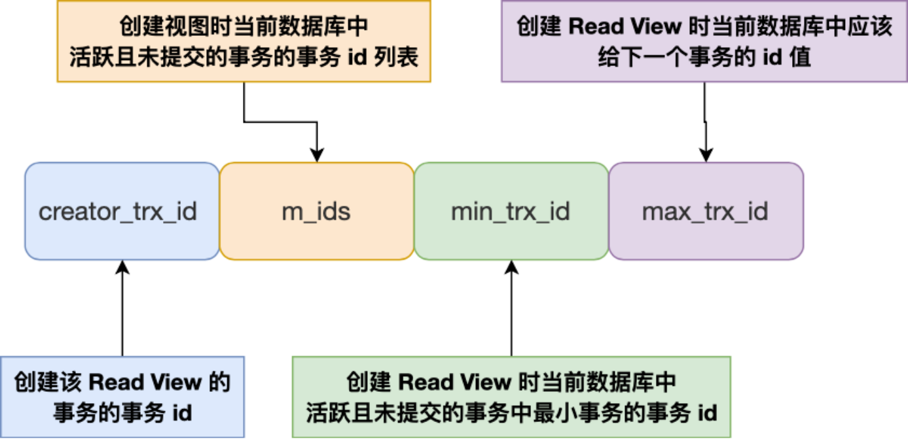

Read View 有四个重要的字段：

- m_ids ：指的是在创建 Read View 时，当前数据库中**「活跃事务」的事务 id 列表**，注意是一个列表，**“活跃事务”指的就是，启动了但还没提交的事务**。
- min_trx_id ：指的是在创建 Read View 时，当前数据库中**「活跃事务」中事务 id 最小的事务**，也就是 m_ids 的最小值。
- max_trx_id ：这个并不是 m_ids 的最大值，而是**创建 Read View 时当前数据库中应该给下一个事务的 id 值**，也就是全局事务中最大的事务 id 值 + 1；
- creator_trx_id ：指的是**创建该 Read View 的事务的事务 id**。

知道了 Read View 的字段，我们还需要了解聚簇索引记录中的两个隐藏列。

假设在账户余额表插入一条小林余额为 100 万的记录，然后我把这两个隐藏列也画出来，该记录的整个示意图如下：

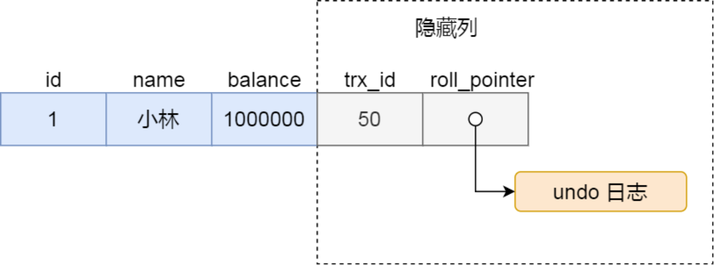

对于使用 InnoDB 存储引擎的数据库表，它的聚簇索引记录中都包含下面两个隐藏列：

- trx_id，当一个事务对某条聚簇索引记录进行改动时，就会**把该事务的事务 id 记录在 trx_id 隐藏列里**；
- roll_pointer，每次对某条聚簇索引记录进行改动时，都会把旧版本的记录写入到 undo 日志中，然后**这个隐藏列是个指针，指向每一个旧版本记录**，于是就可以通过它找到修改前的记录。

在创建 Read View 后，我们可以将记录中的 trx_id 划分这三种情况：

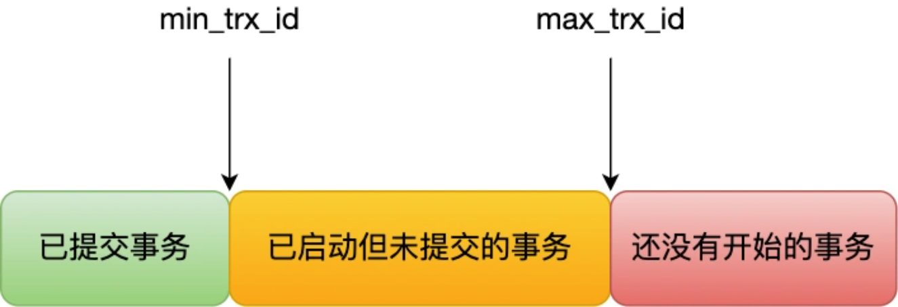

一个事务去访问记录的时候，除了自己的更新记录总是可见之外，还有这几种情况：

- 如果记录的 trx_id 值小于 Read View 中的 `min_trx_id` 值，表示这个版本的记录是在创建 Read View **前**已经提交的事务生成的，所以该版本的记录对当前事务**可见**。
- 如果记录的 trx_id 值大于等于 Read View 中的 `max_trx_id` 值，表示这个版本的记录是在创建 Read View **后**才启动的事务生成的，所以该版本的记录对当前事务**不可见**。
- 如果记录的 trx_id 值在 Read View 的min_trx_id和max_trx_id之间，需要判断 trx_id 是否在 m_ids 列表中：
  - 如果记录的 trx_id **在** `m_ids` 列表中，表示生成该版本记录的活跃事务依然活跃着（还没提交事务），所以该版本的记录对当前事务**不可见**。
  - 如果记录的 trx_id **不在** `m_ids`列表中，表示生成该版本记录的活跃事务已经被提交，所以该版本的记录对当前事务**可见**。

**这种通过「版本链」来控制并发事务访问同一个记录时的行为就叫 MVCC（多版本并发控制）。**

## [#](https://xiaolincoding.com/mysql/transaction/mvcc.html#可重复读是如何工作的)可重复读是如何工作的？

**可重复读隔离级别是启动事务时生成一个 Read View，然后整个事务期间都在用这个 Read View**。

##  读提交是如何工作的？

**读提交隔离级别是在每次读取数据时，都会生成一个新的 Read View**。

也意味着，事务期间的多次读取同一条数据，前后两次读的数据可能会出现不一致，因为可能这期间另外一个事务修改了该记录，并提交了事务。

那读提交隔离级别是怎么工作呢？我们还是以前面的例子来聊聊。

假设事务 A （事务 id 为51）启动后，紧接着事务 B （事务 id 为52）也启动了，接着按顺序执行了以下操作：

- 事务 B 读取数据（创建 Read View），小林的账户余额为 100 万；
- 事务 A 修改数据（还没提交事务），将小林的账户余额从 100 万修改成了 200 万；
- 事务 B 读取数据（创建 Read View），小林的账户余额为 100 万；
- 事务 A 提交事务；
- 事务 B 读取数据（创建 Read View），小林的账户余额为 200 万

## 幻读是怎么被解决的？

在`可重复读隔离级别`下，**`普通的查询是快照读`，是`不会看到别的事务`插入的数据的**。

可重复读隔离级是由 MVCC（多版本并发控制）实现的，实现的方式是启动事务后，在执行第一个查询语句后，会创建一个视图，然后后续的查询语句都用这个视图，「快照读」读的就是这个视图的数据，<u>视图你可以理解为版本数据，这样就使得每次查询的数据都是一样的</u>。

==MySQL 里除了普通查询是快照度，其他都是**当前读==**，比如update、insert、delete，这些语句执行前都会查询最新版本的数据，然后再做进一步的操作。

这很好理解，假设你要 update 一个记录，另一个事务已经 delete 这条记录并且 提交事务了，这样不是会产生冲突吗，所以 update 的时候肯定要知道最新的数据。

另外，`select ... for update` 这种查询语句是当前读，每次执行的时候都是读取最新的数据。

**因此，要讨论「可重复读」隔离级别的幻读现象，是要建立在「当前读」的情况下。**

Innodb 引擎为了解决「可重复读」隔离级别使用「当前读」而造成的幻读问题，就引出了 `next-key 锁`，就是记录锁和间隙锁的组合。

- 记录锁，锁的是记录本身；
- 间隙锁，锁的就是两个值之间的空隙，以防止其他事务在这个空隙间插入新的数据，从而避免幻读现象。

需要注意的是，next-key lock 锁的是索引，而不是数据本身，所以如果 update 语句的 where 条件没有用到索引列，那么就会全表扫描，在一行行扫描的过程中，不仅给行加上了行锁，还给行两边的空隙也加上了间隙锁，相当于锁住整个表，然后直到事务结束才会释放锁。


# 前期笔记

## 索引

索引（index）是帮助MySQL高效获取数据的数据结构(有序)。在数据之外，数据库系统还维护着满足`特定查找算法的数据结构`，这些数据结构以某种方式<u>引用（指向）数据</u>， 这样就可以在这些数据结构上实现高级查找算法，这种数据结构就是索引。

假如我们要执行的SQL语句为：select * from user where age = 45;

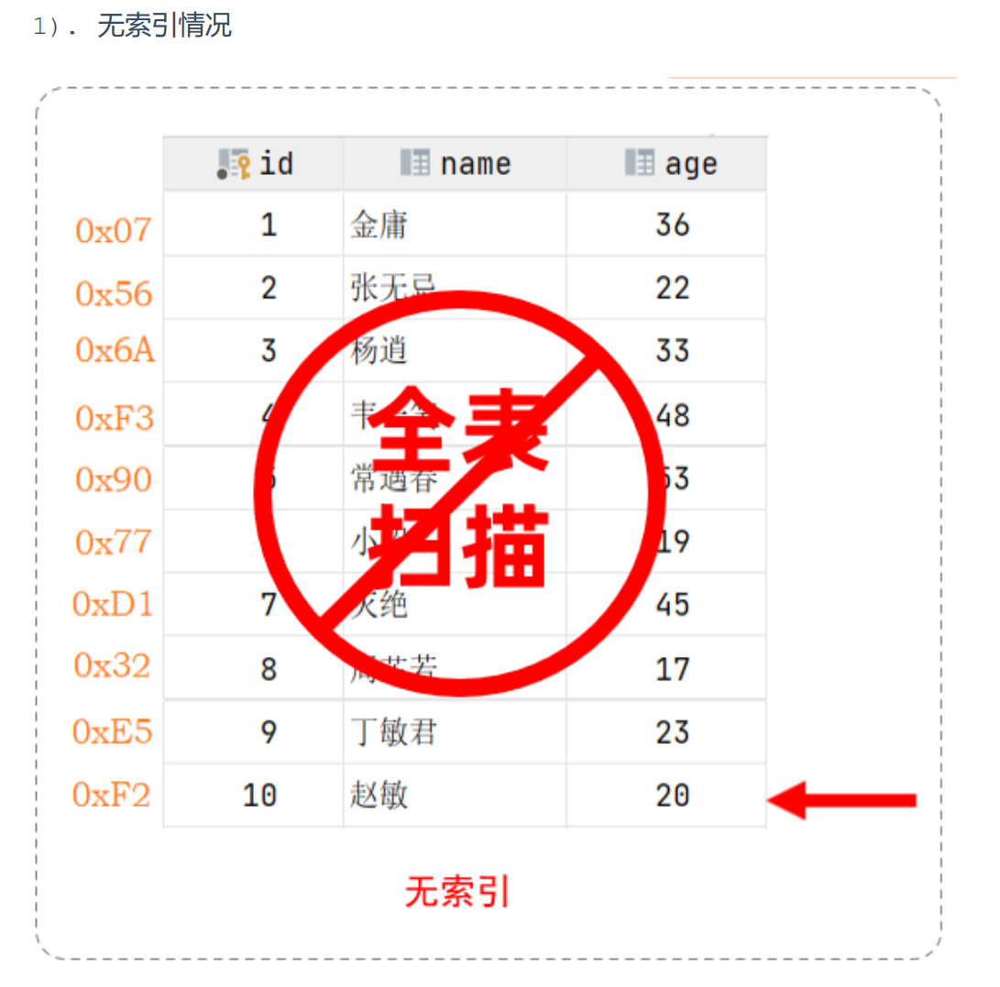

如果我们针对于这张表`建立了索引`，假设索引结构就是二叉树，那么也就意味着，会对age这个字段建立一个二叉树的索引结构。

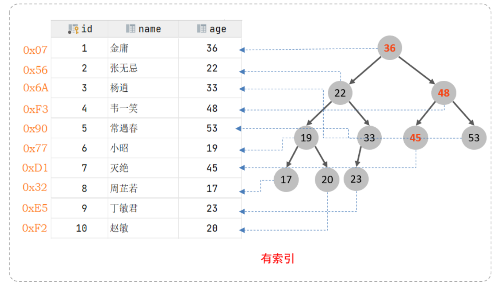

此时我们在进行查询时，只需要扫描三次就可以找到数据了，极大的提高的查询的效率。

##### 索引的特点

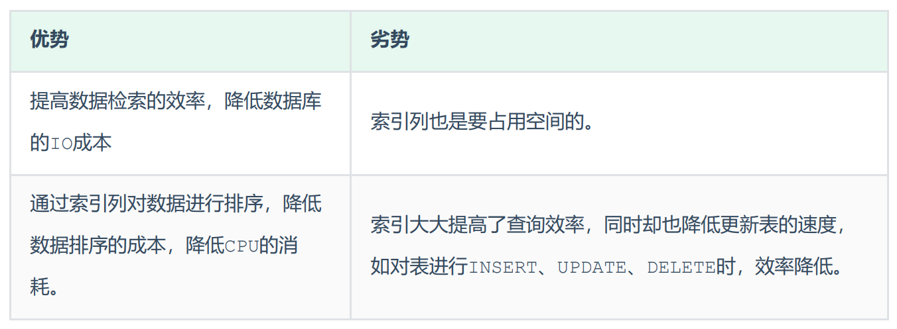


### 索引的结构

MySQL的索引是在存储引擎层实现的，不同的存储引擎有不同的索引结构，主要包含以下几种：

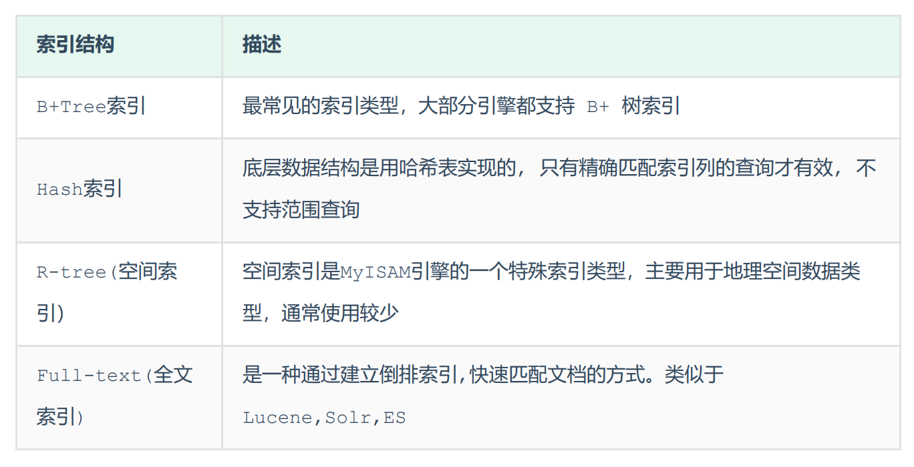

上述是MySQL中所支持的所有的索引结构，接下来，我们再来看看<u>不同的存储引擎对于索引结构的支持情况</u>。

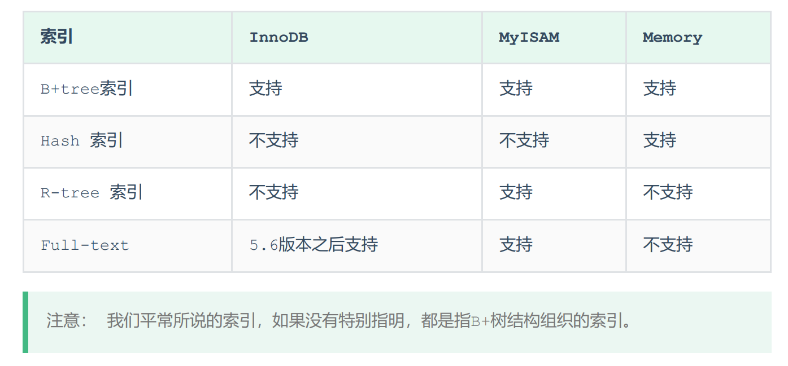


### **索引的数据结构选择**

#### 二叉树 

如果选择二叉树作为索引结构，会存在以下缺点：

1. 顺序插入时，会形成一个`链表`，`查询性能大大降低`。 
2. 大数据量情况下，层级较深，检索速度慢。

由于红黑树也是一颗二叉树，所以也会存在一个缺点：

- <u>大数据量情况下，层级较深，检索速度慢</u>。

> 红黑树是一颗自平衡二叉树，那这样即使是顺序插入数据，最终形成的数据结构也是一颗平衡的二叉树

所以，在MySQL的索引结构中，并没有选择二叉树或者红黑树，而选择的是B+Tree

#### **B-Tree** 和 ==<u>**B+Tree**</u>==

B-Tree，B树是一种多叉路衡查找树，相对于二叉树，B树每个节点可以有多个分支，即多叉。
以一颗最大度数（max-degree）为5(5阶)的b-tree为例，那这个B树每个节点最多存储4个key，5 个指针：

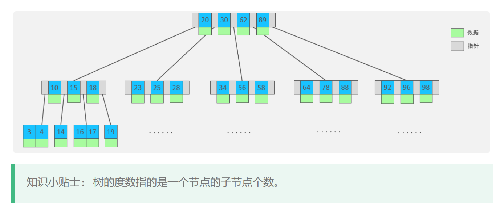


特点：

1. 5阶的B树，每一个节点最多存储4个key，对应5个指针。
2. 一旦节点存储的key数量到达5，就会裂变，中间元素向上分裂。 
3. 在B树中，非叶子节点和叶子节点都会存放数据。


B+Tree是B-Tree的变种，我们以一颗最大度数（max-degree）为4（4阶）的b+tree为例，来看一下其结构示意图

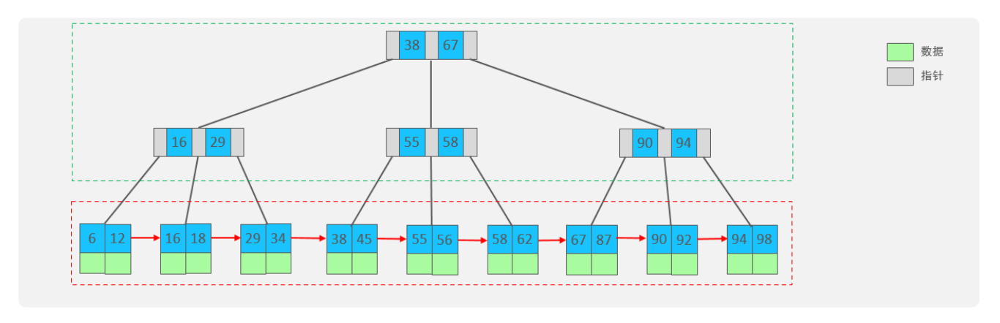

我们可以看到，两部分：

- 绿色框框起来的部分，是索引部分，仅仅起到索引数据的作用，不存储数据。 
- 红色框框起来的部分，是数据存储部分，在其叶子节点中要存储具体的数据

最终我们看到，B+Tree 与   B-Tree相比，主要有以下三点区别：

1. 所有的数据都会出现在叶子节点。 
2. 叶子节点形成一个单向链表。
3. 非叶子节点仅仅起到索引数据作用，具体的数据都是在叶子节点存放的

上述我们所看到的结构是标准的B+Tree的数据结构，接下来，我们再来看看MySQL中优化之后的 B+Tree。
MySQL索引数据结构对经典的B+Tree进行了优化。在原B+Tree的基础上，增加一个指向相邻叶子节点的链表指针，就形成了带有顺序指针的B+Tree，提高区间访问的性能，利于排序。

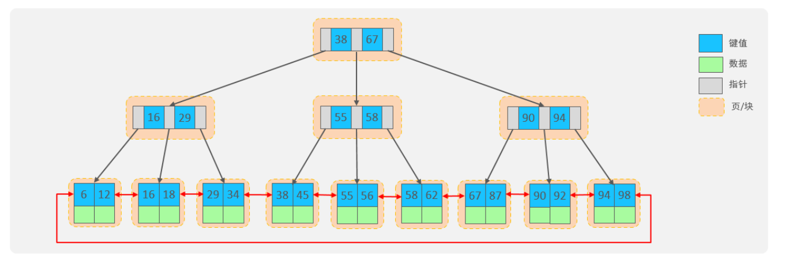

#### Hash

MySQL中除了支持B+Tree索引，还支持一种索引类型---Hash索引

哈希索引就是采用一定的hash算法，将键值换算成新的hash值，映射到对应的槽位上，然后存储在hash表中。

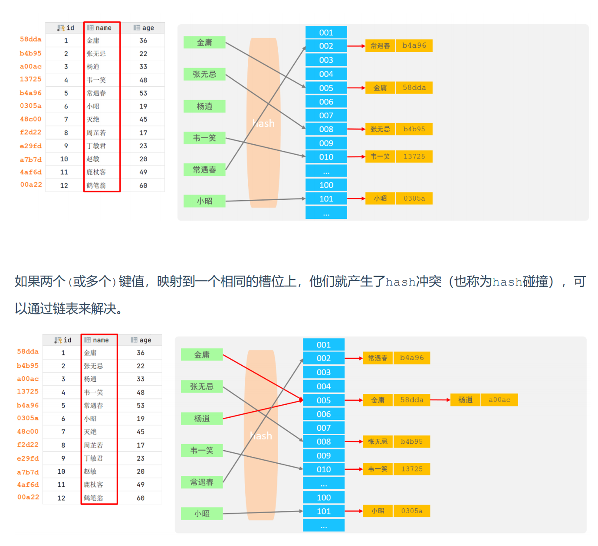

 **特点**

- Hash索引只能用于对等比较(=，in)，`不支持范围查询`（between，>，< ，...）
- `无法`利用索引完成`排序`操作
- `查询效率高`，通常(不存在hash冲突的情况)只需要一次检索就可以了，效率通常要高于B+tree索引

**存储引擎支持**
在MySQL中，支持hash索引的是Memory存储引擎。 而InnoDB中具有自适应hash功能，hash索引是InnoDB存储引擎根据B+Tree索引在指定条件下自动构建的。

### 为什么InnoDB存储引擎选择使用B+tree索引结构?

1. 相对于二叉树，`层级更少`，搜索`效率高`；
2. 对于B-tree，无论是叶子节点还是非叶子节点，都会保存数据，这样`导致一页中存储的键值减少，指针跟着减少`，要同样保存大量数据，只能增加树的`高度`，导致性能降低；
3. 相对Hash索引，B+tree支持`范围匹配及排序`操作；


### 索引分类

在MySQL数据库，将索引的具体类型主要分为以下几类：`主键`索引、`唯一`索引、`常规`索引、`全文`索引。


#### 聚集索引&二级索引

而在在InnoDB存储引擎中，根据索引的存储形式，又可以分为以下两种：

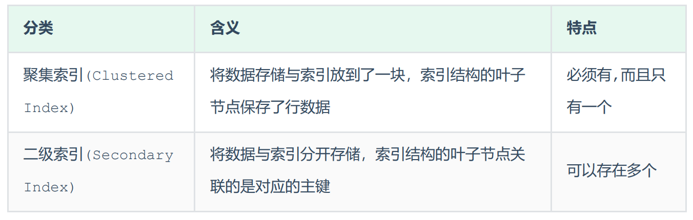

聚集索引选取规则:

1. 如果存在主键，主键索引就是聚集索引。
2. 如果不存在主键，将使用`第一个`唯一（UNIQUE）索引作为聚集索引。
3. 如果表没有主键，或没有合适的唯一索引，则InnoDB会自动生成一个rowid作为隐藏的聚集索 引。

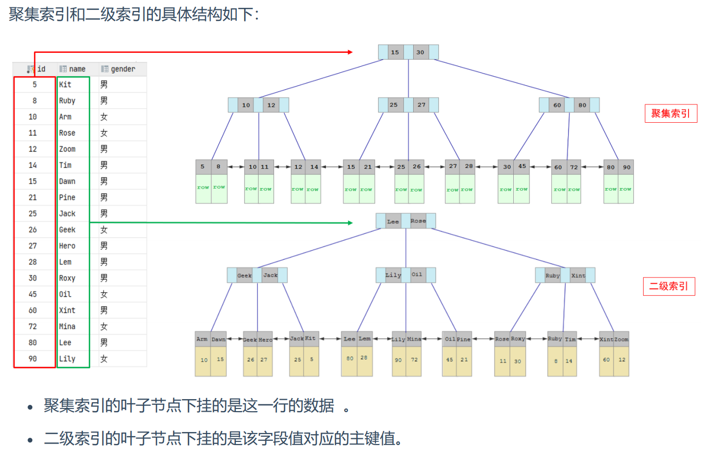

接下来，我们来分析一下，当我们执行如下的SQL语句时，具体的查找过程是什么样子的。

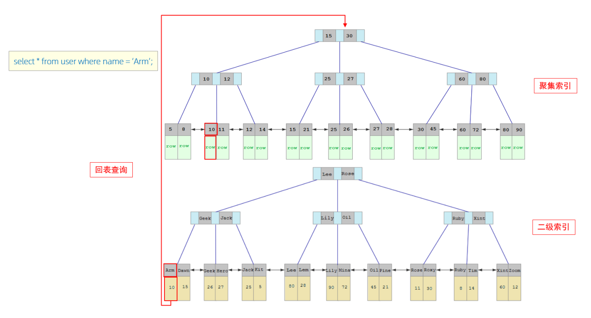

具体过程如下:

1. 由于是根据name字段进行查询，所以先根据name='Arm'到name字段的二级索引中进行匹配查 找。但是在二级索引中只能查找到     Arm 对应的主键值10。
2. 由于查询返回的数据是*，所以此时，还需要根据主键值10，到聚集索引中查找10对应的记录，最终找到10对应的行row。
3. 最终拿到这一行的数据，直接返回即可。

> 回表查询：这种先到二级索引中查找数据，找到主键值，然后再到聚集索引中根据主键值，获取数据的方式，就称之为回表查询。

> **思考题：以下两条SQL语句，那个执行效率高? 为什么?**
> A. select * from user where id = 10 ;
> B. select * from user where name = 'Arm' ;
> 备注: id为主键，name字段创建的有索引； 
> 解答：
> A 语句的执行性能要高于B 语句。
>
> 因为A语句直接走聚集索引，直接返回数据
>
> 而B语句需要先查询name字段的二级索引，然后再查询聚集索引，也就是需要进行回表查询。

> **思考题：InnoDB主键索引的B+tree高度为多高呢?**
>
> 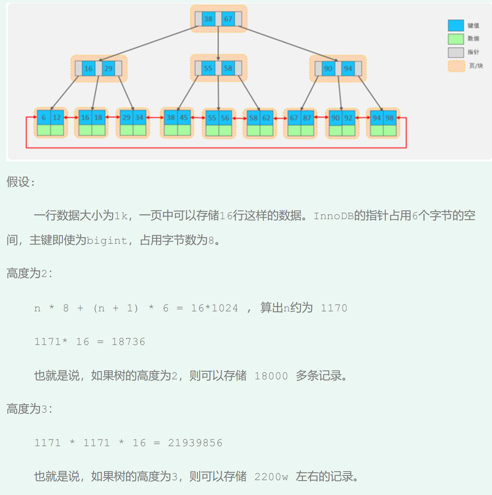

## 事务和日志

### 事务基础

#### 事务

事务是一组操作的集合，它是一个不可分割的工作单位，事务会把所有的操作作为一个整体一起向系统提交或撤销操作请求，即这些操作要么同时成功，要么同时失败。

#### 特性

- `原子`性（Atomicity）：事务是不可分割的最小操作单元，要么全部成功，要么全部失败。
- `一致性`（Consistency）：事务完成时，必须使所有的数据都保持一致状态。
- `隔离`性（Isolation）：数据库系统提供的隔离机制，保证事务在不受外部并发操作影响的独立环
  境下运行。
- `持久性`（Durability）：事务一旦提交或回滚，它对数据库中的数据的改变就是永久的。
  那实际上，我们研究事务的原理，就是研究MySQL的InnoDB引擎是如何保证事务的这四大特性的。

那实际上，我们研究事务的原理，就是研究MySQL的InnoDB引擎是如何保证事务的这四大特性的。

而对于这四大特性，实际上分为两个部分。 其中的==<u>**原子性、一致性、持久化**</u>==，实际上是由InnoDB中的两份日志来保证的，一份是redo log日志，一份是undo log日志。 而<u>**==隔离性==**</u>是通过数据库的锁，加上MVCC来保证的。

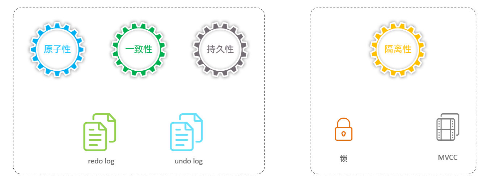

我们在讲解事务原理的时候，主要就是来研究一下redolog，undolog以及MVCC。

### redo log

重做日志，记录的是`事务提交时数据页的物理修改`，是用来实现事务的`持久性`。
该日志文件由两部分组成：重做日志`缓冲`（redo log buffer）以及重做日志`文件`（redo log file）,前者是在内存中，后者在磁盘中。当事务提交之后会把所有修改信息都存到该日志文件中, 用于在刷新脏页到磁盘,发生错误时, 进行数据恢复使用。
<u>如果没有redolog，可能会存在什么问题的</u>？我们一起来分析一下。我们知道，在InnoDB引擎中的内存结构中，主要的<u>内存区域就是缓冲池</u>，在缓冲池中缓存了很多的数据页。当我们在一个事务中，执行多个增删改的操作时，InnoDB引擎会先操作缓冲池中的数据，如果缓冲区没有对应的数据，会通过后台线程将磁盘中的数据加载出来，存放在缓冲区中，然后将缓冲池中的数据修改，<u>修改后的数据页我们称为`脏页`</u>。     而脏页则会在一定的时机，通过后台线程刷新到磁盘中，从而保证缓冲区与磁盘的数据一致。而缓冲区的脏页数据并不是实时刷新的，而是一段时间之后将缓冲区的数据刷新到磁盘中，<u>假如刷新到磁盘的过程出错了，而提示给用户事务提交成功，而数据却没有持久化下来，这就出现问题了，没有保证事务的持久性。</u>

> 内存中修改成功了 但是刷到磁盘的时候出故障 例如宕机了

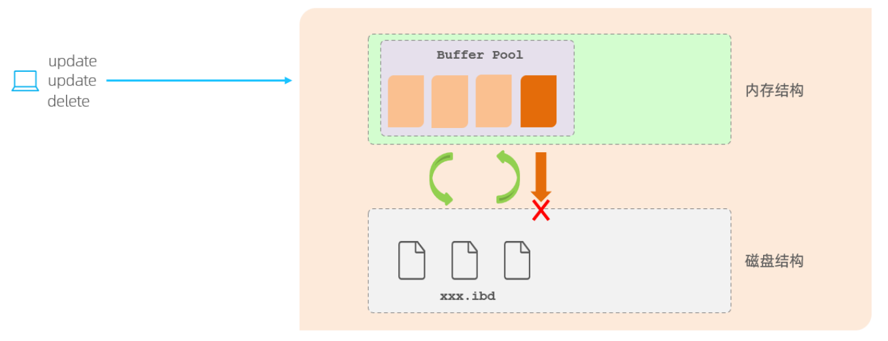


那么，如何解决上述的问题呢？<u>在InnoDB中提供了一份日志redo log</u>，接下来我们再来分析一 下，通过redolog如何解决这个问题。

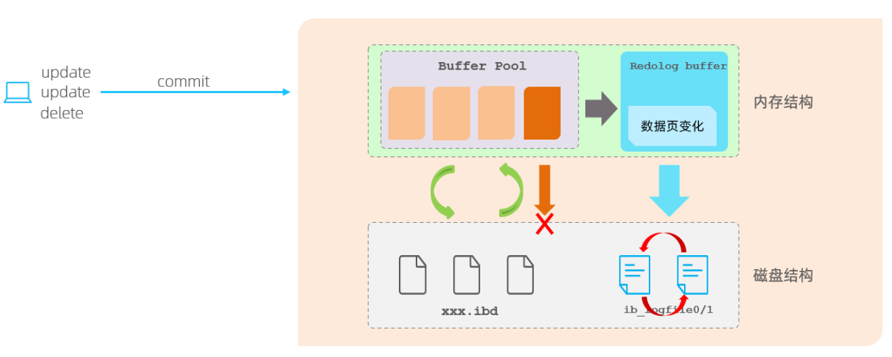

有了redolog之后，当对缓冲区的数据进行`增删改`之后，会首先将操作的数据页的变化，记录在redo log buffer中。在事务提交时，会将redo log buffer中的数据刷新到redo log磁盘文件中。过一段时间之后，如果刷新缓冲区的脏页到磁盘时，发生错误，此时就可以借助于redo log进行数据恢复，这样就保证了事务的持久性。而如果脏页成功刷新到磁盘或或者涉及到的数据已经落盘，此时redolog就没有作用了，就可以删除了，所以存在的两个redo log文件是循环写的。

<u>那为什么每一次提交事务，要刷新redo log 到磁盘中呢，而不是直接将buffer pool中的脏页刷新</u> 
<u>到磁盘呢?</u>

因为在业务操作中，我们操作数据一般都是随机读写磁盘的，而不是顺序读写磁盘。 而redo log在 
往磁盘文件中写入数据，由于是日志文件，所以都是顺序写的。顺序写的效率，要远大于随机写。 这 
种先写日志的方式，称之为 WAL（Write-Ahead Logging）

> 理解 整体的实现就是利用的redo buffer写入redo log是顺序写，效率远大于操作数据的读写磁盘， 也就是 ==<u>**实现一个快速的中间读写 进行备份**</u>==

###  undo log

回滚日志，用于`记录数据被修改前的信息`, 作用包含两个 `提供回滚`(保证事务的原子性) 和 `MVCC`(多版本并发控制) 。

undo log和redo log记录物理日志不一样，它是`逻辑日志`。可以认为当delete一条记录时，undo log中记录一条对应的insert记录，反之亦然，当update一条记录时，它记录一条对应相反的update记录。当执行rollback时，就可以从undo log中的逻辑记录读取到相应的内容并进行回滚。

`Undo log销毁`：undo log在<u>事务执行时产生</u>，事务提交时，并不会立即删除undo log，因为这些日志可能还用于MVCC。

`Undo log存储`：undo log采用段的方式进行管理和记录，存放在前面介绍的rollback segment回滚段中，内部包含1024个undo log segment。

> 回滚日志，在insert、update、delete的时候产生的便于数据回滚的日志。
>
> 当insert的时候，产生的undo log日志只在回滚时需要，在事务提交后，可被立即删除。
>
> 而update、delete的时候，产生的undo log日志不仅在回滚时需要<u>，在快照读时也需要，不会立即</u> 
> <u>被删除。</u>

### MVCC

#### 当前读

读取的是记录的`最新版本`，读取时还要<u>保证其他并发事务不能修改当前记录</u>，会对读取的记录进行加 
`锁`。对于我们日常的操作，如：select ... lock in share mode(共享锁)，select ... for update、update、insert、delete(排他锁)都是一种当前读。

#### 快照读 `普通的select`

简单的select（不加锁）就是快照读，快照读，读取的是记录数据的可见版本，<u>`有可能是历史数据`</u>， 
不加锁，是非阻塞读。

- Read Committed：每次select，都生成一个快照读。
- Repeatable Read：开启事务后第一个select语句才是快照读的地方。
- Serializable：快照读会退化为当前读。

#### MVCC

全称 Multi-Version Concurrency Control，`多版本并发控制`。指维护一个数据的多个版本，使得读写操作没有冲突，快照读为MySQL实现MVCC提供了一个非阻塞读功能。MVCC的具体实现，还需要依赖于数据库记录中的==<u>**三个隐式字段、undo log日志、readView**</u>==。

#### 隐藏字段

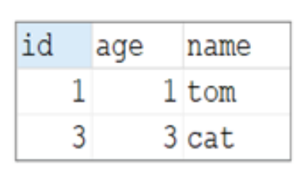

当我们创建了上面的这张表，我们在查看表结构的时候，就可以显式的看到这三个字段。实际上除了 这三个字段以外，InnoDB还会自动的给我们添加三个隐藏字段及其含义分别是：

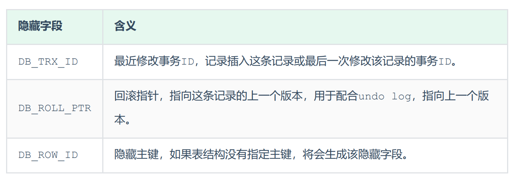

而上述的`前两个字段是肯定会添加`的，是否添加`最后一个字段`DB_ROW_ID，得看当前表`有没有主键`，如果有主键，则不会添加该隐藏字段。

#### undolog

回滚日志，在insert、update、delete的时候产生的便于数据回滚的日志。

当insert的时候，产生的undo log日志只在回滚时需要，在事务提交后，可被立即删除。

而update、delete的时候，产生的undo log日志不仅在回滚时需要，在`快照读`时也需要，不会立即 
被删除。

#### 版本链

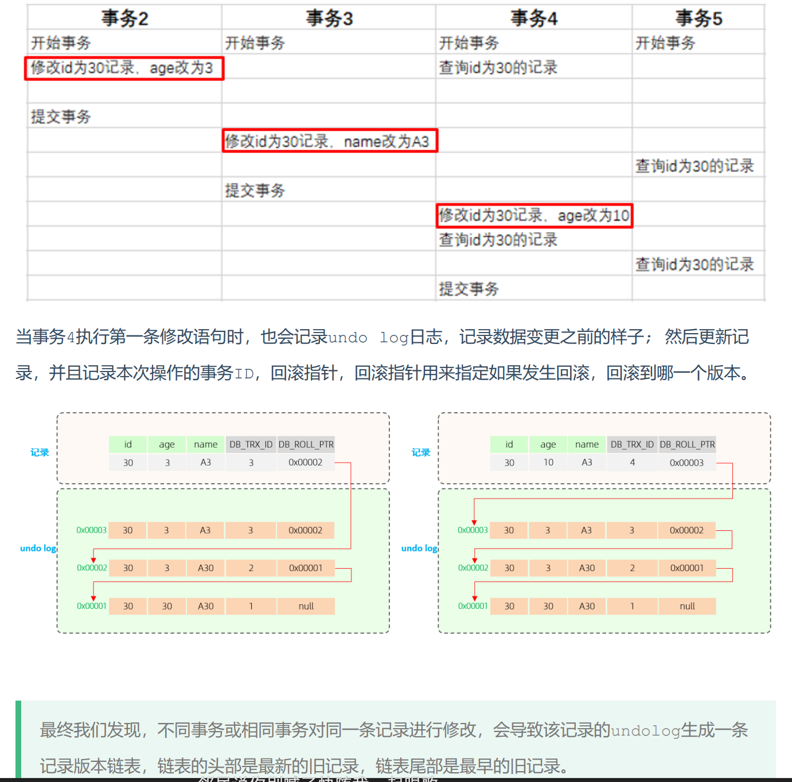

> 理解 隐藏字段记录 最近操作的事务的 id 和 在undo指针的位置

#### readview

ReadView（读视图）是 `快照读` SQL执行时MVCC提取数据的依据，<u>记录并维护系统当前活跃的事务</u>
<u>（未提交的）id</u>。

ReadView中包含了四个核心字段：

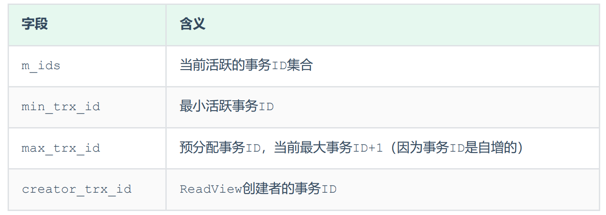

而在readview中就规定了版本链数据的访问规则： 
trx_id 代表当前undolog版本链对应事务ID

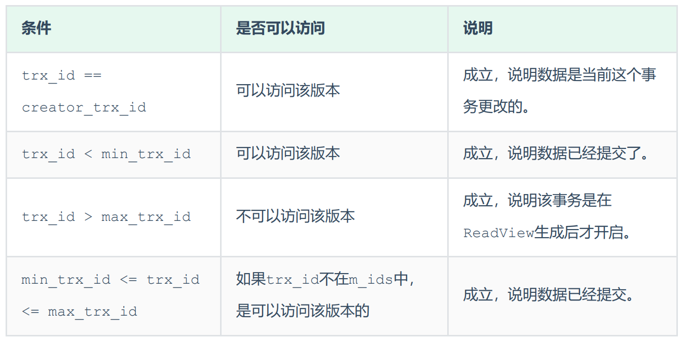

不同的隔离级别，生成ReadView的时机不同：

- READ COMMITTED ：在事务中每一次执行快照读时生成ReadView。
- REPEATABLE READ：仅在事务中第一次执行快照读时生成ReadView，后续复用该ReadView


# 一些面试问题


## 执行一条 ==select 查询语句==，在 MySQL 中期间发生了什么？

MySQL 的架构共分为两层：==Server== 层和==存储引擎==层

1. **Server 层负责建立连接、分析和执行 SQL**。
2. **存储引擎层负责数据的存储和提取**

简洁版: 

==执行一条 SQL 查询语句，期间发生了什么？==

- 连接器：建立连接，管理连接、校验用户身份；
- 查询缓存：查询语句如果命中查询缓存则直接返回，否则继续往下执行。MySQL 8.0 已删除该模块；
- 解析 SQL，通过解析器对 SQL 查询语句进行词法分析、语法分析，然后构建语法树，方便后续模块读取表名、字段、语句类型；
- 执行 SQL：执行 SQL 共有三个阶段：
  - 预处理阶段：检查表或字段是否存在；将 `select *` 中的 `*` 符号扩展为表上的所有列。
  - 优化阶段：基于查询成本的考虑， 选择查询成本最小的执行计划；
  - 执行阶段：根据执行计划执行 SQL 查询语句，从存储引擎读取记录，返回给客户端；

==后面是正式的执行流程==

1. ==连接器==: 先连接 MySQL 服务 期间需要经过tcp三次握手, 然后验证用户名和密码, 如果用户密码都没有问题，连接器就会获取该用户的权限，然后保存起来(后续用户的所有权限都是基于此)
   1. show processlist: 查看有多少个客户端连接了
   2. 默认八小时无响应断开连接, 也可以kill connection + id手动断开连接
   3. max_connections  默认是151
   4. mysql也有长短连接的概念, 如果长连接占用内存过多, 可以 定时断开长连接或者 客户端主动重置连接
2. ==查询缓存==: 客户端可以向服务器发送sql语句了, 后面会解析语句, 对于select查询语句, mysql会先去查询缓存, 命中的话直接返回value给客户, 没命中的话 就继续执行 并把结果存入缓存中
   1. 查询缓存很鸡肋, 命中率比较低, 8.0版本直接把查询缓存关掉了
3. 解析器: 解析sql语句
   1. 词法分析, 识别关键字构建sql语法树
   2. 语法分析, 根据语法规则, 判断sql语句是否满足sql语法
4. 执行sql
   1. 预处理: 
      1. 检查 SQL 查询语句中的表或者字段是否存在；
      2. 将 `select *` 中的 `*` 符号，扩展为表上的所有列；
   2. 优化器: **优化器主要负责将 SQL 查询语句的执行方案确定下来**，比如在表里面有多个索引的时候，优化器会基于查询成本的考虑，来决定选择使用哪个索引。
   3. 执行器: 
      1. 主键索引查询
      2. 全表扫描
      3. 索引下推: 索引下推能够减少**二级索引**在查询时的回表操作，提高查询的效率，因为它将 Server 层部分负责的事情，交给存储引擎层去处理了。

## [#](https://interviewguide.cn/notes/03-hunting_job/02-interview/04-01-01-MySQL.html#_1、关系型和非关系型数据库的区别你了解多少)1、`关系型`和`非关系型`数据库的区别你了解多少？

- 关系型数据库的优点
  - 容易理解。因为它采用了关系模型来组织数据。
  - 可以保持数据的一致性。
  - 数据更新的开销比较小。
  - 支持复杂查询（带where子句的查询）
- 非关系型数据库的优点
  - 不需要经过SQL层的解析，读写效率高。
  - 基于键值对，数据的扩展性很好。
  - 可以支持多种类型数据的存储，如图片，文档等等。


## [#](https://interviewguide.cn/notes/03-hunting_job/02-interview/04-01-01-MySQL.html#_2、什么是非关系型数据库)2、什么是`非关系型`数据库？

非关系型数据库也叫NOSQL，采用键值对的形式进行存储。

它的读写性能很高，易于扩展，可分为内存性数据库以及文档型数据库，比如 `Redis`，Mongodb，HBase等等。

适合使用非关系型数据库的场景：

- 日志系统
- 地理位置存储
- 数据量巨大
- 高可用


## [#](https://interviewguide.cn/notes/03-hunting_job/02-interview/04-01-01-MySQL.html#_3、为什么使用索引)3、`为什么使用索引`？

- 通过创建唯一性索引，可以保证数据库表中每一行数据的唯一性。
- 可以大大`加快`数据的`检索速度`，这也是创建索引的最主要的原因。
- 帮助服务器避免排序和临时表
- 将`随机`IO变为`顺序`IO。
- 可以加速表和表之间的连接，特别是在实现数据的参考完整性方面特别有意义。


## [#](https://interviewguide.cn/notes/03-hunting_job/02-interview/04-01-01-MySQL.html#_4、innodb为什么要用自增id作为主键)4、Innodb为什么要用`自增id`作为主键？

如果表使用自增主键，那么每次插入新的记录，记录就会顺序添加到当前索引节点的后续位置，当一页写满，就会自动开辟一个新的页。 如果使用非自增主键（如果身份证号或学号等），由于每次插入主键的值近似于随机，因此每次新纪录都要被插到现有索引页得中间某个位置， 频繁的移动、分页操作造成了大量的碎片，得到了不够紧凑的索引结构，后续不得不通过OPTIMIZE TABLE（optimize table）来重建表并优化填充页面。

1. 方便插入新的数据 找到要插入数据的位置
2. 方便页写满时 开辟新的页
3. 随机值的主键会产生大量的内存碎片


## [#](https://interviewguide.cn/notes/03-hunting_job/02-interview/04-01-01-MySQL.html#_5、myisam和innodb实现b树索引方式的区别是什么)5、`MyISAM`和`InnoDB`实现B树索引方式的区别是什么？

- MyISAM，`B+Tree`叶节点的data域存放的是数据记录的地址，在索引检索的时候，首先按照B+Tree搜索算法搜索索引，如果指定的key存在，则取出其data域的值，然后以data域的值为地址读取相应的数据记录，这被称为“非聚簇索引”

- `InnoDB`，其数据文件本身就是索引文件，相比MyISAM，索引文件和数据文件是分离的，其表数据文件本身就是按B+Tree组织的一个索引结构，树的节点data域保存了完整的数据记录，这个索引的key是数据表的主键，因此InnoDB表数据文件本身就是主索引，这被称为“聚簇索引”或者聚集索引，而其余的索引都作为辅助索引，辅助索引的data域存储相应记录主键的值而不是地址，这也是和MyISAM不同的地方。

  在根据主索引搜索时，直接找到key所在的节点即可取出数据；在根据辅助索引查找时，则需要先取出主键的值，再走一遍主索引。因此，在设计表的时候，不建议使用过长的字段为主键，也不建议使用非单调的字段作为主键，这样会造成主索引频繁分裂。


## 7、你了解MySQL的`内部构造`吗？一般可以分为哪两个部分？

可以分为==服务层和存储引擎层==两部分，其中：

**服务层包括连接器、查询缓存、分析器、优化器、执行器等**，涵盖MySQL的大多数核心服务功能，以及所有的内置函数（如日期、时间、数学和加密函数等），所有跨存储引擎的功能都在这一层实现，比如存储过程、触发器、视图等。

**存储引擎层负责数据的存储和提取**。其架构模式是插件式的，支持InnoDB、MyISAM、Memory等多个存储引擎。现在最常用的存储引擎是InnoDB，它从MySQL 5.5.5版本开始成为了默认的存储引擎。


## 8、说一说Drop、Delete与Truncate的共同点和区别

### [#](https://interviewguide.cn/notes/03-hunting_job/02-interview/04-01-01-MySQL.html#第一种回答)**第一种回答**

Drop、Delete、Truncate都表示删除，但是三者有一些差别： 

1. **Delete**用来删除表的全部或者一部分数据行，执行delete之后，`用户需要提交(commmit)或者回滚(rollback)`来执行删除或者撤销删除，会触发这个表上所有的delete触发器。

   > 缓慢 可选 谨慎的删除一些

2. **Truncate**删除表中的所有数据，这个操作不能回滚，也不会触发这个表上的触发器，TRUNCATE比delete更快，占用的空间更小。

   > 快速删除

3. **Drop**命令从数据库中删除表，所有的数据行，索引和权限也会被删除，所有的DML触发器也不会被触发，这个命令也不能回滚。

   > 彻底删除

<u>因此，在不再需要一张表的时候，用Drop；在想删除部分数据行时候，用Delete；在保留表而删除所有数据的时候用Truncate。</u>

### [#](https://interviewguide.cn/notes/03-hunting_job/02-interview/04-01-01-MySQL.html#第二种回答)**第二种回答**

- Drop直接删掉表; 

  > 或者说是 直接删除数据库？

- Truncate删除表中数据，再插入时自增长id又从1开始 ;

- Delete删除表中数据，可以加where字句。

### [#](https://interviewguide.cn/notes/03-hunting_job/02-interview/04-01-01-MySQL.html#具体解析)**具体解析**

1. DELETE语句执行删除的过程是每次从表中删除一行，并且同时将该行的删除操作作为事务记录在日志中保存以便进行进行回滚操作。TRUNCATE TABLE 则一次性地从表中删除所有的数据并不把单独的删除操作记录记入日志保存，删除行是不能恢复的。并且在删除的过程中不会激活与表有关的删除触发器。执行速度快。
2. 表和索引所占空间。当表被TRUNCATE 后，这个表和索引所占用的空间会恢复到初始大小，而DELETE操作不会减少表或索引所占用的空间。drop语句将表所占用的空间全释放掉。
3. 一般而言，drop > truncate > delete
4. 应用范围。TRUNCATE 只能对TABLE；DELETE可以是table和view
5. TRUNCATE 和DELETE只删除数据，而DROP则删除整个表（结构和数据）。
6. truncate与不带where的delete ：只删除数据，而不删除表的结构（定义）drop语句将删除表的结构被依赖的约束（constrain),触发器（trigger)索引（index);依赖于该表的存储过程/函数将被保留，但其状态会变为：invalid。
7. delete语句为DML（Data Manipulation Language),这个操作会被放到 rollback segment中,事务提交后才生效。如果有相应的 tigger,执行的时候将被触发。
8. truncate、drop是DDL（Data Define Language),操作立即生效，原数据不放到 rollback segment中，不能回滚
9. 在没有备份情况下，谨慎使用 drop 与 truncate。要删除部分数据行采用delete且注意结合where来约束影响范围。回滚段要足够大。要删除表用drop;若想保留表而将表中数据删除，如果与事务无关，用truncate即可实现。如果和事务有关，或老是想触发trigger,还是用delete。
10. Truncate table 表名 速度快,而且效率高,因为: truncate table 在功能上与不带 WHERE 子句的 DELETE 语句相同：二者均删除表中的全部行。但 TRUNCATE TABLE 比 DELETE 速度快，且使用的系统和事务日志资源少。DELETE 语句每次删除一行，并在事务日志中为所删除的每行记录一项。TRUNCATE TABLE 通过释放存储表数据所用的数据页来删除数据，并且只在事务日志中记录页的释放。
11. TRUNCATE TABLE 删除表中的所有行，但表结构及其列、约束、索引等保持不变。新行标识所用的计数值重置为该列的种子。如果想保留标识计数值，请改用 DELETE。如果要删除表定义及其数据，请使用 DROP TABLE 语句。
12. 对于由 FOREIGN KEY 约束引用的表，不能使用 TRUNCATE TABLE，而应使用不带 WHERE 子句的 DELETE 语句。由于 TRUNCATE TABLE 不记录在日志中，所以它不能激活触发器。


## `MySQL优化`了解吗？说一下从哪些方面可以做到性能优化？

- 为搜索字段创建索引
- 避免使用 Select *，列出需要查询的字段
- 垂直分割分表
- 选择正确的存储引擎


## `数据表拆分`

拆分其实又分**垂直拆分**和**水平拆分**

案例： 简单购物系统暂设涉及如下表：

1.产品表（数据量10w，稳定）

2.订单表（数据量200w，且有增长趋势）

3.用户表 （数据量100w，且有增长趋势）

以 MySQL 为例讲述下水平拆分和垂直拆分，MySQL能容忍的数量级在百万静态数据可以到千万

**垂直拆分**

解决问题：表与表之间的io竞争

不解决问题：单表中数据量增长出现的压力

方案： 把产品表和用户表放到一个server上 订单表单独放到一个server上

**水平拆分**

解决问题：单表中数据量增长出现的压力

不解决问题：表与表之间的io争夺

方案：**用户表** 通过性别拆分为男用户表和女用户表，**订单表** 通过已完成和完成中拆分为已完成订单和未完成订单，**产品表** 未完成订单放一个server上，已完成订单表盒男用户表放一个server上，女用户表放一个server上(女的爱购物 哈哈)。


## `存储引擎`选择

在选择存储引擎时，应该根据应用系统的特点选择合适的存储引擎。对于复杂的应用系统，还可以根据 实际情况选择多种存储引擎进行组合。

- InnoDB: 是==Mysql的默认存储引擎==，支持事务、外键。如果应用对事务的完整性有比较高的要求，在并发条件下要求数据的一致性，数据操作除了插入和查询之外，还包含很多的更新、删除操作，那么InnoDB存储引擎是比较合适的选择。

- MyISAM: 如果应用是以`读操作和插入操作`为主，只有`很少的更新和删除`操作，并且<u>对事务的完整性、并发性要求不是很高</u>，那么选择这个存储引擎是非常合适的。

- MEMORY：将所有数据保存在内存中，访问速度快，通常用于临时表及缓存。MEMORY的缺陷就是 对表的大小有限制，太大的表无法缓存在内存中，而且无法保障数据的安全性。


## MySQL==索引==主要使用的两种数据结构是什么？

- **哈希索引**，对于哈希索引来说，底层的数据结构肯定是哈希表，因此**在绝大多数需求为单条记录查询**的时候，可以选择哈希索引，查询性能最快；其余大部分场景，建议选择BTree索引

- **BTree索引**，Mysql的BTree索引使用的是B树中的B+Tree，BTREE索引就是一种将索引值按一定的算法，存入一个树形的数据结构中（二叉树），每次查询都是从树的入口root开始，依次遍历node，获取leaf。

  但对于主要的两种存储引擎（MyISAM和InnoDB）的实现方式是不同的。


## MySQL中有`四种索引类型`

- **FULLTEXT** ：即为==全文索引==，目前只有MyISAM引擎支持。其可以在CREATE TABLE ，ALTER TABLE ，CREATE INDEX 使用，不过目前只有 CHAR、VARCHAR ，TEXT 列上可以创建全文索引，需要注意的是MySQL5.6以后支持全文索引了，5.6之前是不支持的。
- **HASH** ：由于==HASH==的唯一（几乎100%的唯一）及类似键值对的形式，很适合作为索引。 HASH索引可以一次定位，不需要像树形索引那样逐层查找,因此具有极高的效率。但是，这种高效是有条件的，即==只在“=”和“in”条件下高效==，对于范围查询、排序及组合索引仍然效率不高。
- **BTREE** ：BTREE索引就是一种将索引值按一定的算法，存入一个树形的数据结构中（二叉树），每次查询都是从树的入口root开始，依次遍历node，获取leaf。这是MySQL里默认和最常用的索引类型。
- **RTREE** ：RTREE在MySQL很少使用，仅支持geometry数据类型，支持该类型的存储引擎只有MyISAM、BDb、InnoDb、NDb、Archive几种。 相对于BTREE，RTREE的优势在于范围查找。


## 为什么采用==B+==树而不是==B==树

主要原因：B+树`只要遍历叶子节点`就可以实现整棵树的遍历，而且在数据库中基于范围的查询是非常频繁的，而B树只能中序遍历所有节点，效率太低。

1、B+**树的层级更少**：相较于B树B+每个**非叶子**节点存储的关键字数更多，树的层级更少所以查询数据更快；

2、B+**树查询速度更稳定**：B+所有关键字数据地址都存在**叶子**节点上，所以每次查找的次数都相同所以查询速度要比B树更稳定;

3、B+**树天然具备排序功能：**B+树所有的**叶子**节点数据构成了一个有序链表，在查询大小区间的数据时候更方便，数据紧密性很高，缓存的命中率也会比B树高。

4、B+**树全节点遍历更快：**B+树遍历整棵树只需要遍历所有的**叶子**节点即可，，而不需要像B树一样需要对每一层进行遍历，这有利于数据库做全表扫描。

**B树**相对于**B+树**的优点是，如果经常访问的数据离根节点很近，而**B树**的**非叶子**节点本身存有关键字其数据的地址，所以这种数据检索的时候会要比**B+树**快。


## [#](https://interviewguide.cn/notes/03-hunting_job/02-interview/04-01-01-MySQL.html#_12、文件索引和数据库索引为什么使用b-树-第9个问题的详细回答)12、文件索引和数据库索引为什么使用==B+树==?

文件与数据库都是需要较大的存储，也就是说，它们都不可能全部存储在内存中，故需要存储到磁盘上。而所谓索引，则为了数据的快速定位与查找，那么索引的结构组织要尽量减少查找过程中磁盘I/O的存取次数，因此B+树相比B树更为合适。数据库系统巧妙利用了局部性原理与磁盘预读原理，将一个节点的大小设为等于一个页，这样每个节点只需要一次I/O就可以完全载入，而红黑树这种结构，高度明显要深的多，并且由于逻辑上很近的节点(父子)物理上可能很远，无法利用局部性。

1. 最重要的是，B+树还有一个最大的好处：==方便扫库==。
   1. B树必须用中序遍历的方法按序扫库，而B+树直接从叶子结点挨个扫一遍就完了，B+树支持range-query非常方便，而B树不支持，这是数据库选用B+树的最主要原因。

2. B+树查找效率更加稳定，B树有可能在中间节点找到数据，稳定性不够。
   1. B+tree的查询效率更加稳定：由于内部结点并不是最终指向文件内容的结点，而只是叶子结点中关键字的索引，所以，任何关键字的查找必须走一条从根结点到叶子结点的路。所有关键字查询的路径长度相同，导致每一个数据的查询效率相当；
3. B+tree的磁盘读写代价更低：B+tree的内部结点并没有指向关键字具体信息的指针(红色部分)，因此其内部结点相对B 树更小。如果把所有同一内部结点的关键字存放在同一块盘中，那么盘块所能容纳的关键字数量也越多。一次性读入内存中的需要查找的关键字也就越多，相对来说IO读写次数也就降低了；


## `什么时候需要建立数据库索引`

在`最频繁使用`的、`用以缩小查询范围的字段`,需要排序的字段上建立索引。

 不宜：

1. 对于`查询中很少`涉及的列或者`重复值比较多`的列 
2. 对于一些`特殊的数据类型`，不宜建立索引，比如`文本字段`（text）等。


## `覆盖索引`是什么？

如果一个索引==包含==（或者说覆盖）所有==需要查询的字段的值==，我们就称 之为“覆盖索引”。

我们知道在InnoDB存储引 擎中，如果不是主键索引，叶子节点存储的是主键+列值。最终还是要“回表”，也就是要通过主键再查找一次,这样就 会比较慢。覆盖索引就是把要查询出的列和索引是对应的，不做回表操作！

> 覆盖索引解决的问题：避免`回表`操作导致的性能降低 避免二次索引

### 什么是覆盖索引？

覆盖索引（covering index ，或称为索引覆盖）即从非主键索引中就能查到的记录，而不需要查询主键索引中的记录，避免了回表的产生减少了树的搜索次数，显著提升性能。

### 如何使用是覆盖索引？

之前我们已经建立了表student，那么现在出现的业务需求中要求根据名称获取学生的年龄，并且该搜索场景非常频繁，那么先在我们删除掉之前以字段name建立的普通索引，以name和age两个字段建立==<u>**联合索引**</u>==，sql命令与建立后的索引树结构如下

```
ALTER TABLE student DROP INDEX I_name;
ALTER TABLE student ADD INDEX I_name_age(name, age);
```

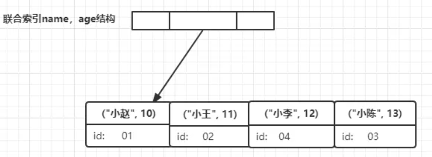

那在我们再次执行如下sql后

```
SELECT age FROM student WHERE name = '小李'；
```

流程为：

1. 在name,age联合索引树上找到名称为小李的节点
2. 此时节点<u>`索引里包含信息age`</u> 直接返回 12


## 什么是聚集索引 ？

聚集索引就是按照拼音查询，非聚集索引就是按照偏旁等来进行查询。

其实，我们的汉语字典的正文本身就是一个聚集索引。比如，我们要查"安"字，就会很自然地翻开字典的前几页，因为"安"的拼音是"an"，而按照拼音排序 汉字的字典是以英文字母"a"开头并以"z"结尾的，那么"安"字就自然地排在字典的前部。

如果您翻完了所有以"a"开头的部分仍然找不到这个字，那么就 说明您的字典中没有这个字；

同样的，如果查"张"字，那您也会将您的字典翻到最后部分，因为"张"的拼音是"zhang"。

也就是说，字典的正文部分本身 就是一个目录，您不需要再去查其他目录来找到您需要找的内容。

我们把这种**正文内容本身就是一种按照一定规则排列的目录称为"聚集索引"**


## 什么是非聚合索引?

如果您认识某个字，您可以快速地从自动中查到这个字。但您也可能会遇到您不认识的字，不知道它的发音，这时候，您就不能按照刚才的方法找到您要查的字，而 需要去根据"偏旁部首"查到您要找的字，然后根据这个字后的页码直接翻到某页来找到您要找的字。但您结合"部首目录"和"检字表"而查到的字的排序并不是 真正的正文的排序方法，比如您查"张"字，我们可以看到在查部首之后的检字表中"张"的页码是672页，检字表中"张"的上面是"驰"字，但页码却是63 页，"张"的下面是"弩"字，页面是390页。很显然，这些字并不是真正的分别位于"张"字的上下方，现在您看到的连续的"驰、张、弩"三字实际上就是他 们在非聚集索引中的排序，是字典正文中的字在非聚集索引中的映射。我们可以通过这种方式来找到您所需要的字，但它需要两个过程，先找到目录中的结果，然后 再翻到您所需要的页码。

我们把**这种目录纯粹是目录，正文纯粹是正文的排序方式称为"非聚集索引"。**


## 聚集索引与非聚集索引的区别是什么?

聚集索引和非聚集索引的区别在于， 通过聚集索引可以查到需要查找的数据， 而通过非聚集索引可以查到记录对应的主键值 ， 再使用主键的值通过聚集索引查找到需要的数据。 聚集索引和非聚集索引的根本区别是表记录的排列顺序和与索引的排列顺序是否一致。

聚集索引（Innodb）的叶节点就是数据节点，而非聚集索引(MyisAM)的叶节点仍然是索引节点，只不过其包含一个指向对应数据块的指针。


## 创建索引时需要注意什么？

非空字段：应该指定列为NOT NULL，除非你想存储NULL。在 MySQL 中，含有空值的列很难进行查询优化，因为它们使得索引、索引的统计信息以及比较运算更加复杂。你应该用0、一个特殊的值或者一个空串代替空值；

取值离散大的字段：（变量各个取值之间的差异程度）的列放到联合索引的前面，可以通过count()函数查看字段的差异值，返回值越大说明字段的唯一值越多字段的离散程度高；

索引字段越小越好：数据库的数据存储以页为单位一页存储的数据越多一次IO操作获取的数据越大效率越高。 唯一、不为空、经常被查询的字段 的字段适合建索引


## MySQL中`CHAR`和`VARCHAR`的区别有哪些？

- char的长度是不可变的，用空格填充到指定长度大小，而varchar的长度是可变的。
- char的存取数度还是要比varchar要快得多
- char的存储方式是：对英文字符（ASCII）占用1个字节，对一个汉字占用两个字节。varchar的存储方式是：对每个英文字符占用2个字节，汉字也占用2个字节。


## MySQL中有哪些索引？有什么特点？

- **普通索引**：仅加速查询
- **唯一索引**：加速查询 + 列值唯一（可以有null）
- **主键索引**：加速查询 + 列值唯一（不可以有null）+ 表中只有一个
- **组合索引**：多列值组成一个索引，专门用于组合搜索，其效率大于索引合并
- **全文索引**：对文本的内容进行分词，进行搜索
- **索引合并**：使用多个单列索引组合搜索
- **覆盖索引**：select的数据列只用从索引中就能够取得，不必读取数据行，换句话说查询列要被所建的索引覆盖
- **聚簇索引**：表数据是和主键一起存储的，主键索引的叶结点存储行数据(包含了主键值)，二级索引的叶结点存储行的主键值。使用的是B+树作为索引的存储结构，非叶子节点都是索引关键字，但非叶子节点中的关键字中不存储对应记录的具体内容或内容地址。叶子节点上的数据是主键与具体记录(数据内容)


## 为什么不对表的每一列创建一个索引呢？

- 当对表中的数据进行增加、删除和修改的时候，**索引也要动态的维护**，这样就降低了数据的维护速度。
- **索引需要占物理空间**，除了数据表占数据空间之外，每一个索引还要占一定的物理空间，如果要建立簇索引，那么需要的空间就会更大。
- **创建索引和维护索引要耗费时间**，这种时间随着数据量的增加而增加

## 索引如何提高查询速度的

将无序的数据变成相对有序的数据（就像查有目的一样）


## 使用索引的注意事项

- 在经常需要搜索的列上，可以加快搜索的速度；
- 在经常使用在where子句中的列上面创建索引，加快条件的判断速度。
- **将打算加索引的列设置为NOT NULL，否则将导致引擎放弃使用索引而进行全表扫描**
- 在经常需要排序的列上创建索引，因为索引已经排序，这样查询可以利用索引的排序，加快排序查询时间
- 避免where子句中对字段施加函数，这会造成无法命中索引
- 在中到大型表索引都是非常有效的，但是特大型表的维护开销会很大，不适合建索引，建立用逻辑索引
- 在经常用到连续的列上，这些列主要是由一些外键，可以加快连接的速度
- 与业务无关时多使用逻辑主键，也就是自增主键在使用InnoDB时使用与业务无关的自增主键作为主键，即使用逻辑主键，而不要使用业务主键。
- 删除长期未使用的索引，不用的索引的存在会造成不必要的性能损耗
- 在使用limit offset查询缓存时，可以借助索引来提高性能。


## 可不可以无限增加B+树的路数是不是可以有最优的查找效率？

不可以。因为这样会形成一个有序数组，<u>文件系统和数据库的索引都是存在硬盘上的，并且`如果数据量大`的话，`不一定能一次性加载到内存中`。有序数组没法一次性加载进内存</u>，这时候B+树的多路存储威力就出来了，可以每次加载B+树的一个结点，然后一步步往下找，

<u>因为b+树的一个优势就在于 多路存储(类似局部的 动态的加载数据), 如果每一路太多会导致内存加载困难</u>


## 听说过视图吗？那游标呢？

视图是一种虚拟的表，通常是有一个表或者多个表的行或列的子集，具有和物理表相同的功能 

游标是对查询出来的结果集作为一个单元来有效的处理。一般不使用游标，但是需要逐条处理数据的时候，游标显得十分重要。


## [#](https://interviewguide.cn/notes/03-hunting_job/02-interview/04-01-01-MySQL.html#_14、mysql中为什么要有事务回滚机制)14、MySQL中为什么要有事务回滚机制？

而在 MySQL 中，恢复机制是通过回滚日志（undo log）实现的，所有事务进行的修改都会先记录到这个回滚日志中，然后在对数据库中的对应行进行写入。 当事务已经被提交之后，就无法再次回滚了。

回滚日志作用： 1)能够在发生错误或者用户执行 ROLLBACK 时提供回滚相关的信息 2) 在整个系统发生崩溃、数据库进程直接被杀死后，当用户再次启动数据库进程时，还能够立刻通过查询回滚日志将之前未完成的事务进行回滚，这也就需要回滚日志必须先于数据持久化到磁盘上，是我们需要先写日志后写数据库的主要原因。


## [#](https://interviewguide.cn/notes/03-hunting_job/02-interview/04-01-01-MySQL.html#_15、数据库引擎innodb与myisam的区别)15、数据库引擎`InnoDB`与`MyISAM`的区别

### [#](https://interviewguide.cn/notes/03-hunting_job/02-interview/04-01-01-MySQL.html#innodb)**InnoDB**

- 是 MySQL 默认的事务型存储引擎，只有在需要它不支持的特性时，才考虑使用其它存储引擎。
- 实现了四个标准的隔离级别，默认级别是可重复读(REPEATABLE READ)。在可重复读隔离级别下，通过多版本并发控制(MVCC)+ 间隙锁(Next-Key Locking)防止幻影读。
- 主索引是聚簇索引，在索引中保存了数据，从而避免直接读取磁盘，因此对查询性能有很大的提升。
- 内部做了很多优化，包括从磁盘读取数据时采用的可预测性读、能够加快读操作并且自动创建的自适应哈希索引、能够加速插入操作的插入缓冲区等。
- 支持真正的在线热备份。其它存储引擎不支持在线热备份，要获取一致性视图需要停止对所有表的写入，而在读写混合场景中，停止写入可能也意味着停止读取。

> InnoDB是一种兼顾高可靠性和高性能的通用存储引擎，在MySQL 5.5 之后，InnoDB是默认的 MySQL 存储引擎。
>
> - DML操作遵循`ACID`模型，支持`事务`； 
> - `行级锁`，提高<u>并发访问性能</u>；  ()
> - 支持`外键`FOREIGN KEY约束，保证数据的完整性和正确性

### [#](https://interviewguide.cn/notes/03-hunting_job/02-interview/04-01-01-MySQL.html#myisam)**MyISAM**

- 设计简单，数据以紧密格式存储。对于只读数据，或者表比较小、可以容忍修复操作，则依然可以使用它。
- 提供了大量的特性，包括压缩表、空间数据索引等。
- 不支持事务。
- 不支持行级锁，只能对整张表加锁，读取时会对需要读到的所有表加共享锁，写入时则对表加排它锁。但在表有读取操作的同时，也可以往表中插入新的记录，这被称为并发插入(CONCURRENT INSERT)。

> MyISAM是MySQL早期的默认存储引擎。
>
> - 不支持`事务`，不支持`外键` 
> - 支持`表锁`，不支持`行锁` 
> - 访问速度`快`

### [#](https://interviewguide.cn/notes/03-hunting_job/02-interview/04-01-01-MySQL.html#总结)**总结**

- 事务: InnoDB 是事务型的，可以使用 `Commit` 和 `Rollback` 语句。
- 并发: MyISAM 只支持表级锁，而 InnoDB 还支持行级锁。
- 外键: InnoDB 支持外键。
- 备份: InnoDB 支持在线热备份。
- 崩溃恢复: MyISAM 崩溃后发生损坏的概率比 InnoDB 高很多，而且恢复的速度也更慢。
- 其它特性: MyISAM 支持压缩表和空间数据索引。

> `面试题:`
> InnoDB引擎与MyISAM引擎的区别?
> ①. InnoDB引擎, 支持`事务`, 而MyISAM不支持。
> ②. InnoDB引擎, 支持`行锁和表锁`, 而MyISAM仅支持`表锁`, 不支持行锁。
> ③. InnoDB引擎, 支持`外键,` 而MyISAM是不支持的。

#### 补充 memory引擎


## ==事务==有哪些特性？

- **原子性（Atomicity）**：一个事务中的所有操作，要么==全部完成==，要么==全部不完成==，不会结束在中间某个环节，而且事务在执行过程中发生错误，会被==回滚==到事务开始前的状态，就像这个事务从来没有执行过一样，就好比买一件商品，购买成功时，则给商家付了钱，商品到手；购买失败时，则商品在商家手中，消费者的钱也没花出去。
  - ==要么全部完成 要么全部完成 中间出错会回滚==
  - 原子性是通过 ==undo log==（回滚日志） 来保证的；
- **一致性（Consistency）**：是指事务操作前和操作后，数据满足完整性约束，`数据库保持一致性状态`。比如，用户 A 和用户 B 在银行分别有 800 元和 600 元，总共 1400 元，用户 A 给用户 B 转账 200 元，分为两个步骤，从 A 的账户扣除 200 元和对 B 的账户增加 200 元。一致性就是要求上述步骤操作后，最后的结果是用户 A 还有 600 元，用户 B 有 800 元，总共 1400 元，而不会出现用户 A 扣除了 200 元，但用户 B 未增加的情况（该情况，用户 A 和 B 均为 600 元，总共 1200 元）。  
  - ==转账钱不会多也不会消失 总和是一致的==
  - 一致性则是通过==持久性+原子性+隔离性==来保证；
- **隔离性（Isolation）**：数据库允许==多个并发事务==同时对其数据进行读写和修改的能力，隔离性可以防止多个事务并发执行时由于交叉执行而导致数据的不一致，因为多个事务同时使用相同的数据时，不会相互干扰，每个事务都有一个完整的数据空间，对其他并发事务是隔离的。也就是说，消费者购买商品这个事务，是不影响其他消费者购买的。   
  - ==可以并发且不会相互干扰==
  - 隔离性是通过 ==MVCC（多版本并发控制）== 或锁机制来保证的；
- **持久性（Durability）**：事务处理结束后，对数据的修改就是永久的，即便系统故障也不会丢失。
  - ==永久修改==
  - 持久性是通过 ==redo log== （重做日志）来保证的；


## [#](https://xiaolincoding.com/mysql/transaction/mvcc.html#并行事务会引发什么问题)`并行事务`会引发什么问题？==脏读、幻读、不可重复读==

数据库并发会带来脏读、幻读、丢弃更改、不可重复读这四个常见问题，其中：

1. 脏读：在第一个修改事务和读取事务进行的时候，读取事务读到的数据为100，这是修改之后的数据，但是之后该事务满足一致性等特性而做了回滚操作，那么读取事务得到的结果就是脏数据了。

   1. 如果一个事务「读到」了另一个「==未提交事务修改过的数据==」，就意味着发生了「脏读」现象。
   2. 简单来说就是另一个人 读到了==修改后== ==回滚前==的数据
   3. 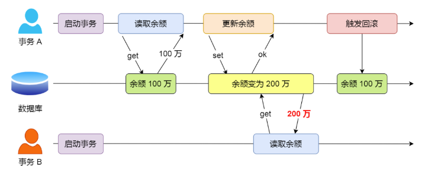

2. 幻读：一般是T1在某个==范围==内进行修改操作（增加或者删除），而T2读取该范围导致读到的数据是修改之间的了，强调`范围`。

   1. 一个事务中, 因为另一个事务的修改操作 导致==读取的范围==前后两次不一致

   2. 强调的是==范围==

   3. 重点是==新增或者删除==

   4. > 例2（同样的条件, 第1次和第2次读出来的记录数不一样 ）：假某工资单表中工资大于3000的有4人，事务1读取了所有工资大于3000的人，共查到4条记录，这时事务2 又插入了一条工资大于3000的记录，事务1再次读取时查到的记 录就变为了5条，这样就导致了幻读。

3. ~~丢弃修改：两个写事务T1 T2同时对A=0进行递增操作，结果T2覆盖T1，导致最终结果是1 而不是2，事务被覆盖~~

   1. ~~两个同时修改数据 其中一个事务的修改被覆盖~~

4. 不可重复读：在一个事务内多次读取同一个数据，如果出现前后两次读到的数据不一样的情况

   1. 重点是==修改==

   2. 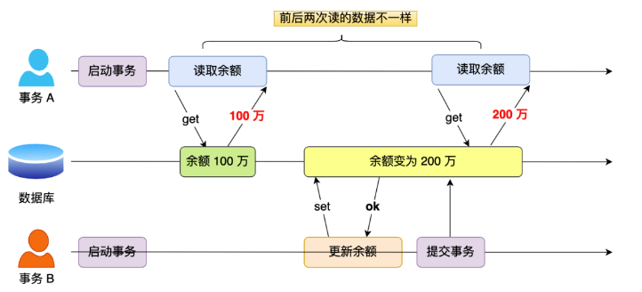

   3. > 例1（同样的条件, 你读取过的数据, 再次读取出来发现值不一样了 ）：事务1中的A先生<u>读取自己的工资为 1000的操作还没完成</u>，事务2中的B先生就修改了A的工资为2000，导致A再读自己的工资时工资变为 2000；这就是不可重复读。


## 事务的`隔离级别`有哪些？


严重性排序: ==脏读== > ==不可重复==读 > ==幻读==

SQL 标准提出了四种隔离级别来规避这些现象，隔离级别越高，性能效率就越低，这四个隔离级别如下：

- 读未提交（\*read uncommitted\*），指一个事务还没提交时，它做的变更就能被其他事务看到；
  - `最弱`的隔离级别
  - 三个问题`都可能`发生
  - ==实现==: 不加任何操作 直接读取数据
- 读提交（\*read committed\*），指一个事务提交之后，它做的变更才能被其他事务看到；
  - 还是可能发生幻读和不可重复读
  - ==实现==: **「读提交」隔离级别是在「每个语句执行前」都会重新生成一个 Read View**
- 可重复读（\*repeatable read\*），指一个事务执行过程中看到的数据，一直跟这个事务启动时看到的数据是一致的，MySQL InnoDB 引擎的==默认隔离级别==；
  - 还是会发生`幻读`现象
  - ==实现==: **「可重复读」隔离级别是「启动事务时」生成一个 Read View，然后整个事务期间都在用这个 Read View**。
- 串行化（\*serializable\* ）；会对记录加上读写锁，在多个事务对这条记录进行读写操作时，如果发生了读写冲突的时候，后访问的事务必须等前一个事务执行完成，才能继续执行；
  - 完全解决所有问题 但是==性能会很差==
  - ==实现:== 加读写锁的方式来避免并行访问


### 读提交和可重复读是如何实现的

对于「读提交」和「可重复读」隔离级别的事务来说，它们是通过 `Read View` 来实现的，它们的区别在于创建 Read View 的时机不同：

- 「读提交」隔离级别是在每个 select 都会生成一个新的 Read View，也意味着，事务期间的多次读取同一条数据，前后两次读的数据可能会出现不一致，因为可能这期间另外一个事务修改了该记录，并提交了事务。
- 「可重复读」隔离级别是启动事务时生成一个 Read View，然后整个事务期间都在用这个 Read View，这样就保证了在事务期间读到的数据都是事务启动前的记录。

这两个隔离级别实现是通过「事务的 Read View 里的字段」和「记录中的两个隐藏列」的比对，来控制并发事务访问同一个记录时的行为，这就叫 MVCC（多版本并发控制）。

在可重复读隔离级别中，普通的 select 语句就是基于 MVCC 实现的快照读，也就是不会加锁的。而 select .. for update 语句就不是快照读了，而是当前读了，也就是每次读都是拿到最新版本的数据，但是它会对读到的记录加上 next-key lock 锁。


### ==<u>幻读</u>==如何解决

> 普通的查询是==快照读==，是不会看到别的事务插入的数据的。
>
> MySQL 里除了普通查询是快照读，其他都是==当前读==，比如update、insert、delete，这些语句执行前都会查询最新版本的数据，然后再做进一步的操作。 

**Innodb 引擎为了解决「可重复读」隔离级别使用「当前读」而造成的幻读问题，就引出了 next-key 锁**，就是记录锁和间隙锁的组合。

- 记录锁，锁的是记录本身；
- 间隙锁，锁的就是两个值之间的空隙，以防止其他事务在这个空隙间插入新的数据，从而避免幻读现象。

执行这条语句的时候，会锁住，然后期间如果有其他事务在这个锁住的范围插入数据就会被阻塞。


## mysql有==哪些锁==

### `全局锁`

```sql
flush tables with read lock
```

执行后，**整个数据库就处于==只读==状态了**，这时其他线程执行以下操作，都会被阻塞：

- 对数据的增删改操作，比如 insert、delete、update等语句；
- 对表结构的更改操作，比如 alter table、drop table 等语句。

如果要释放全局锁，则要执行这条命令：

```sql
unlock tables
```

当会话断开了，全局锁会被自动释放。

1. 应用场景

   1. 全局锁<u>主要应用于做**全库逻辑备份**</u>，这样在备份数据库期间，不会因为数据或表结构的更新，而出现备份文件的数据与预期的不一样。

   2. > 1. 先备份了用户表的数据；
      > 2. 然后有用户发起了购买商品的操作；
      > 3. 接着再备份商品表的数据。
      >
      > 用户买了东西但是用户的余额没有减少

2. 缺点
   1. 加上全局锁，意味着整个数据库都是`只读`状态
   2. 那么如果数据库里有很多数据，备份就会花费很多的时间，关键是备份期间，业务只能读数据，而不能更新数据，这样会造成`业务停滞`。
3. 如何避免对业务的影响
   1. 如果数据库的引擎支持的事务支持**可重复读的隔离级别**，那么在备份数据库之前先开启事务，会先创建 Read View，然后整个事务执行期间都在用这个 Read View，而且由于 MVCC 的支持，备份期间业务依然可以对数据进行更新操作
   2. 因为在可重复读的隔离级别下，即使其他事务更新了表的数据，也不会影响备份数据库时的 Read View，这就是事务四大特性中的隔离性，这样备份期间备份的数据一直是在开启事务时的数据。
   3. 备份数据库的工具是 mysqldump，在使用 mysqldump 时加上 `–single-transaction` 参数的时候，就会在备份数据库之前先开启事务。这种方法只适用于支持「可重复读隔离级别的事务」的存储引擎。
   4. InnoDB 存储引擎默认的事务隔离级别正是可重复读，因此可以采用这种方式来备份数据库。
   5. 但是，对于 MyISAM 这种不支持事务的引擎，在备份数据库时就要使用全局锁的方法。


### 表级锁

MySQL 里面表级别的锁有这几种：

- 表锁；

  - 如果我们想对学生表（t_student）加表锁，可以使用下面的命令：

    ```sql
    //表级别的共享锁，也就是读锁；
    lock tables t_student read;
    
    //表级别的独占锁，也就是写锁；
    lock tables t_stuent write;
    ```

    表锁除了会限制`别的线程`的读写外，也会限制`本线程`接下来的读写操作。

    要释放表锁，可以使用下面这条命令，会释放当前会话的所有表锁：

    ```sql
    unlock tables
    ```

    当会话退出后，也会释放所有表锁。

    不过`尽量避免`在使用 InnoDB 引擎的表使用表锁，因为表锁的颗粒度太大，会影响并发性能，**InnoDB 牛逼的地方在于实现了颗粒度更细的行级锁**。

- 元数据锁（MDL）;

  - <u>默认调用, 事务执行期间 一直开启, 事务提交后释放</u>
  - 对一张表进行 CRUD 操作时，加的是 **MDL 读锁**；
  - 对一张表做结构变更操作的时候，加的是 **MDL 写锁**；
  - 申请 MDL 锁的操作会形成一个队列，队列中**写锁获取优先级高于读锁**，一旦出现 MDL 写锁等待，会阻塞后续该表的所有 CRUD 操作。

- 意向锁；

  - 目的: 为了快速判断表里是否有记录被加锁

  - > 如果没有「意向锁」，那么加「独占表锁」时，就需要遍历表里所有记录，查看是否有记录存在独占锁，这样效率会很慢。
    >
    > 那么有了「意向锁」，由于在对记录加独占锁前，先会加上表级别的意向独占锁，那么在加「独占表锁」时，直接查该表是否有意向独占锁，如果有就意味着表里已经有记录被加了独占锁，这样就不用去遍历表里的记录。

  - **意向共享锁和意向独占锁是表级锁，不会和行级的共享锁和独占锁发生冲突，而且意向锁之间也不会发生冲突，只会和共享表锁（\*lock tables ... read\*）和独占表锁（\*lock tables ... write\*）发生冲突。**

- AUTO-INC 锁；

  - 在为某个字段声明 `AUTO_INCREMENT` 属性时，之后可以在插入数据时，可以不指定该字段的值，数据库会自动给该字段赋值递增的值，这主要是通过 AUTO-INC 锁实现的。


### ==行级锁==

`InnoDB 引擎是支持行级锁的`，而 MyISAM 引擎并不支持行级锁。

行级锁的类型主要有三类：

- Record Lock，记录锁，也就是仅仅把一条记录锁上；
- Gap Lock，间隙锁，锁定一个范围，但是不包含记录本身；
- Next-Key Lock：Record Lock + Gap Lock 的组合，锁定一个范围，并且锁定记录本身。

前面也提到，普通的 select 语句是不会对记录加锁的，如果要在查询时对记录加行锁，可以使用下面这两个方式：

```sql
//对读取的记录加共享锁
select ... lock in share mode;

//对读取的记录加独占锁
select ... for update;
```

上面这两条语句必须在一个事务中，**因为当事务提交了，锁就会被释放**，所以在使用这两条语句的时候，要加上 begin、start transaction 或者 set autocommit = 0。

## 数据库`悲观锁`和`乐观锁`的原理和应用场景分别有什么？

悲观锁，先获取锁，再进行业务操作，一般就是利用类似 SELECT … FOR UPDATE 这样的语句，对数据加锁，避免其他事务意外修改数据。 当数据库执行SELECT … `FOR UPDATE`时<u>会获取被select中的数据行的行锁</u>，select for update获取的行锁会在当前事务结束时自动释放，因此必须在事务中使用。

乐观锁，先进行业务操作，只在最后实际更新数据时进行检查数据是否被更新过。Java 并发包中的 AtomicFieldUpdater 类似，也是利用 CAS 机制，并不会对数据加锁，而是通过对比数据的时间戳或者版本号，来实现乐观锁需要的版本判断。

> 1. **版本号机制**
>
>    一般是在数据表中加上一个数据版本号version字段，表示数据被修改的次数，当数据被修改时，version值会加一。当线程A要更新数据值时，在读取数据的同时也会读取version值，在提交更新时，若刚才读取到的version值为当前数据库中的version值相等时才更新，否则重试更新操作，直到更新成功。
>
> 2. **CAS算法**
>
>    即**compare and swap（比较与交换）**，是一种有名的**无锁算法**。无锁编程，即不使用锁的情况下实现多线程之间的变量同步，也就是在没有线程被阻塞的情况下实现变量的同步，所以也叫非阻塞同步（Non-blocking Synchronization）。**CAS算法**涉及到三个操作数
>
>    - 需要读写的内存值 V
>    - 进行比较的值 A
>    - 拟写入的新值 B


## mysql的==日志==了解吗

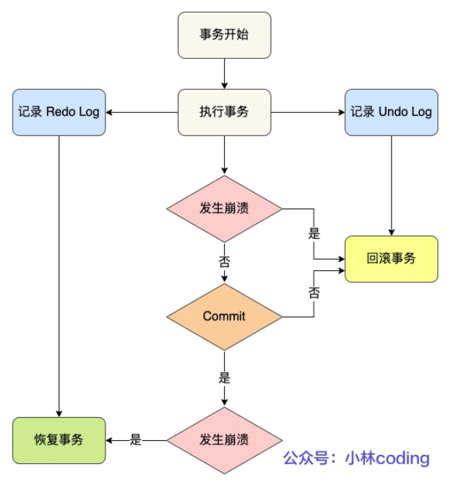

- **undo log（回滚日志）**：是 Innodb 存储引擎层生成的日志，实现了事务中的**原子性**，主要**用于事务回滚和 MVCC**。

  - **实现事务回滚，保障事务的原子性**。事务处理过程中，如果出现了错误或者用户执 行了 `ROLLBACK` 语句，MySQL 可以利用 undo log 中的历史数据将数据恢复到事务开始之前的状态。
  - **实现 MVCC（多版本并发控制）关键因素之一**。MVCC 是通过 ReadView + undo log 实现的。undo log 为每条记录保存多份历史数据，MySQL 在执行快照读（普通 select 语句）的时候，会根据事务的 Read View 里的信息，顺着 undo log 的版本链找到满足其可见性的记录

- **redo log（重做日志）**：是 Innodb 存储引擎层生成的日志，实现了事务中的**持久性**，主要**用于掉电等故障恢复**；

  - 还要提前写redo log 不会有多于的==开销==吗

    - > 写入 redo log 的方式使用了追加操作， 所以磁盘操作是**顺序写**，而写入数据需要先找到写入位置，然后才写到磁盘，所以磁盘操作是**随机写**。
      >
      > 磁盘的「顺序写 」比「随机写」 高效的多，因此 ==redo log 写入磁盘的开销更小==。

  - 为什么需要redo log

    - 实现事务的持久性，让 MySQL 有 ==crash-safe== 的能力，能够保证 MySQL 在任何时间段突然崩溃，重启后之前已提交的记录都不会丢失；
    - **将写操作从「随机写」变成了「顺序写」**，==提升 MySQL 写入磁盘的性能==
      - 怎么改变的? : 先记录 在合适的时间(真正写入磁盘的数据连续时) 写入磁盘

- **binlog （归档日志）**：是 `Server` 层生成的日志，主要**用于数据备份和主从复制**

  - 注意 这个时server层生成的日志 前面两个是由==引擎==生成的
  - MySQL 在完成一条`更新`操作后，Server 层还会生成一条 binlog，等之后事务提交的时候，会将该事物执行过程中产生的所有 binlog 统一写 入 binlog 文件。binlog 文件是记录了<u>所有数据库表结构变更和表数据修改的日志</u>，`不会记录查询`类的操作，比如 SELECT 和 SHOW 操作。
  - ==redo log 和 binlog 有什么区别==
    1. 适用对象不同
       - binlog 是 MySQL 的 Server 层实现的日志，所有存储引擎都可以使用；
       - redo log 是 Innodb 存储引擎实现的日志；
    2. 文件格式不同
       - binlog 有 3 种格式类型，分别是 STATEMENT（默认格式）、ROW、 MIXED
       - redo log 是`物理`日志，记录的是在某个数据页做了什么修改，比如对 XXX 表空间中的 YYY 数据页 ZZZ 偏移量的地方做了AAA 更新；
    3. 写入方式不同
       - binlog 是追加写，写满一个文件，就创建一个新的文件继续写，不会覆盖以前的日志，保存的是全量的日志。
       - redo log 是循环写，日志空间大小是固定，全部写满就从头开始，保存未被刷入磁盘的脏页日志。
    4. 用途不同
       - binlog 用于备份恢复、主从复制；
       - redo log 用于掉电等故障恢复。

## 主从复制是怎么实现

MySQL 集群的主从复制过程梳理成 3 个阶段：

- 写入 Binlog：主库写 binlog 日志，提交事务，并更新本地存储数据。
- 同步 Binlog：把 binlog 复制到所有从库上，每个从库把 binlog 写到暂存日志中。
- 回放 Binlog：回放 binlog，并更新存储引擎中的数据。

## 为什么要分库和分表呢

分库与分表的目的在于，减小数据库的单库单表负担，提高查询性能，缩短查询时间。

**通过分表**，可以==减少数据库的单表负担==，将压力分散到不同的表上，同时因为不同的表上的数据量少了，起到提高查询性能，缩短查询时间的作用，此外，可以很大的缓解表锁的问题。 分表策略可以归纳为垂直拆分和水平拆分： **水平分表**：取模分表就属于随机分表，而时间维度分表则属于连续分表。 如何设计好垂直拆分，我的建议：将不常用的字段单独拆分到另外一张扩展表. 将大文本的字段单独拆分到另外一张扩展表, 将不经常修改的字段放在同一张表中，将经常改变的字段放在另一张表中。 对于海量用户场景，可以考虑取模分表，数据相对比较均匀，不容易出现热点和并发访问的瓶颈。

**库内分表**，仅仅是解决了单表数据过大的问题，但并没有把单表的数据分散到不同的物理机上，因此并不能减轻 MySQL 服务器的压力，仍然存在同一个物理机上的资源竞争和瓶颈，包括 CPU、内存、磁盘 IO、网络带宽等。

**分库与分表带来的分布式困境与应对之策** 数据迁移与扩容问题----一般做法是通过程序先读出数据，然后按照指定的分表策略再将数据写入到各个分表中。 分页与排序问题----需要在不同的分表中将数据进行排序并返回，并将不同分表返回的结果集进行汇总和再次排序，最后再返回给用户。


## [#](https://interviewguide.cn/notes/03-hunting_job/02-interview/04-01-02-MySQL.html#_22、视图的作用是什么-可以更改吗)22、视图的作用是什么？可以更改吗？

视图是虚拟的表，与包含数据的表不一样，视图只包含使用时动态检索数据的查询；不包含任何列或数据。使用视图可以简化复杂的 sql 操作，隐藏具体的细节，保护数据；视图创建后，可以使用与表相同的方式利用它们。

视图不能被索引，也不能有关联的触发器或默认值，如果视图本身内有order by 则对视图再次order by将被覆盖。

创建视图：create view xxx as xxxx

对于某些视图比如未使用联结子查询分组聚集函数Distinct Union等，是可以对其更新的，对视图的更新将对基表进行更新；但是视图主要用于简化检索，保护数据，并不用于更新，而且大部分视图都不可以更新。


## [#](https://interviewguide.cn/notes/03-hunting_job/02-interview/04-01-02-MySQL.html#_23、为什么说b-tree比b-树更适合实际应用中操作系统的文件索引和数据库索引)23、为什么说B+tree比B 树更适合实际应用中操作系统的文件索引和数据库索引？

B+tree的磁盘读写代价更低，B+tree的查询效率更加稳定 数据库索引采用B+树而不是B树的主要原因：B+树只要遍历叶子节点就可以实现整棵树的遍历，而且在数据库中基于范围的查询是非常频繁的，而B树只能中序遍历所有节点，效率太低。

**B+树的特点**

- 所有关键字都出现在叶子结点的链表中(稠密索引)，且链表中的关键字恰好是有序的;
- 不可能在非叶子结点命中;
- 非叶子结点相当于是叶子结点的索引(稀疏索引)，叶子结点相当于是存储(关键字)数据的数据层;


## 假如你所在的公司选择MySQL数据库作数据存储，一天五万条以上的增量，预计运维三年，你有哪些优化手段？

- 设计良好的数据库结构，允许部分数据冗余，尽量避免join查询，提高效率。

  [规范上说避免使用JOIN - 掘金 (juejin.cn)](https://juejin.cn/post/7021414389810987022)

- 选择合适的表字段数据类型和存储引擎，`适当的添加索引`。

- MySQL库`主从读写分离`。

- `找规律分表`，减少单表中的数据量提高查询速度。

- 添加`缓存机制`，比如Memcached，Apc等。

- 不经常改动的页面，生成静态页面。

- 书写高效率的SQL。比如 SELECT * FROM TABEL 改为 SELECT field_1, field_2, field_3 FROM TABLE。


2. 

## 27、数据库中的主键、超键、候选键、外键是什么？（很棒）

- **超键**：在关系中能唯一标识**元组的属性集**称为关系模式的超键
- **候选键**：不含有**多余属性的超键**称为候选键。也就是在候选键中，若再删除属性，就不是键了！
- **主键**：**用户选作元组标识的一个候选键程序主键**
- **外键**：如果关系模式**R中属性K是其它模式的主键**，那么**k在模式R中称为外键**。

**举例**：

| 学号     | 姓名   | 性别 | 年龄 | 系别   | 专业     |
| -------- | ------ | ---- | ---- | ------ | -------- |
| 20020612 | 李辉   | 男   | 20   | 计算机 | 软件开发 |
| 20060613 | 张明   | 男   | 18   | 计算机 | 软件开发 |
| 20060614 | 王小玉 | 女   | 19   | 物理   | 力学     |
| 20060615 | 李淑华 | 女   | 17   | 生物   | 动物学   |
| 20060616 | 赵静   | 男   | 21   | 化学   | 食品化学 |
| 20060617 | 赵静   | 女   | 20   | 生物   | 植物学   |

1. 超键：于是我们从例子中可以发现 学号是标识学生实体的唯一标识。那么该元组的超键就为学号。除此之外我们还可以把它跟其他属性组合起来，比如：(`学号`，`性别`)，(`学号`，`年龄`)
2. 候选键：根据例子可知，学号是一个可以唯一标识元组的唯一标识，因此学号是一个候选键，实际上，候选键是超键的子集，比如 （学号，年龄）是超键，但是它不是候选键。因为它还有了额外的属性。
3. 主键：简单的说，例子中的元组的候选键为学号，但是我们选定他作为该元组的唯一标识，那么学号就为主键。
4. 外键是相对于主键的，比如在学生记录里，主键为学号，在成绩单表中也有学号字段，因此学号为成绩单表的外键，为学生表的主键。

**主键为候选键的子集，候选键为超键的子集，而外键的确定是相对于主键的。**


## 28、数据库`三大范式`精讲

### [#](https://interviewguide.cn/notes/03-hunting_job/02-interview/04-01-02-MySQL.html#第一范式)**第一范式**

在任何一个关系数据库中，第一范式（1NF）是对关系模式的基本要求，不满足第一范式（1NF）的数据库就不是关系数据库。 所谓第一范式（1NF）是指数据库表的每一列都是不可分割的基本数据项，同一列中不能有多个值，即实体中的某个属性不能有多个值或者不能有重复的属性。

如果出现重复的属性，就可能需要定义一个新的实体，新的实体由重复的属性构成，新实体与原实体之间为一对多关系。在第一范式（1NF）中表的每一行只包含一个实例的信息。

简而言之，**==第一范式就是无重复的列==**。

### [#](https://interviewguide.cn/notes/03-hunting_job/02-interview/04-01-02-MySQL.html#第二范式)**第二范式**

第二范式（2NF）是在第一范式（1NF）的基础上建立起来的，即满足第二范式（2NF）必须先满足第一范式（1NF）。第二范式（2NF）要求数据库表中的每个实例或行必须可以被惟一地区分。

为实现区分通常需要为表加上一个列，以存储各个实例的惟一标识。这个惟一属性列被称为主关键字或主键、主码。 第二范式（2NF）要求实体的属性完全依赖于主关键字。

所谓完全依赖是指不能存在仅依赖主关键字一部分的属性，如果存在，那么这个属性和主关键字的这一部分应该分离出来形成一个新的实体，新实体与原实体之间是一对多的关系。为实现区分通常需要为表加上一个列，以存储各个实例的惟一标识。

简而言之，**第二范式就是非主属性非部分依赖于主关键字**。

### [#](https://interviewguide.cn/notes/03-hunting_job/02-interview/04-01-02-MySQL.html#第三范式)**第三范式**

满足第三范式（3NF）必须先满足第二范式（2NF）。简而言之，第三范式（3NF）要求一个数据库表中不包含已在其它表中已包含的非主关键字信息。

例如，**存在一个部门信息表，其中每个部门有部门编号（dept_id）、部门名称、部门简介等信息。那么在员工信息表中列出部门编号后就不能再将部门名称、部门简介等与部门有关的信息再加入员工信息表中。如果不存在部门信息表，则根据第三范式（3NF）也应该构建它，否则就会有大量的数据冗余。**

简而言之，第三范式就是属性不依赖于其它非主属性。


## [#](https://interviewguide.cn/notes/03-hunting_job/02-interview/04-01-02-MySQL.html#_30、mysql常见的存储引擎innodb、myisam的区别-适用场景分别是)30、MySQL常见的存储引擎InnoDB、MyISAM的区别？适用场景分别是？

1）事务：MyISAM不支持，InnoDB支持 2）锁级别： MyISAM 表级锁，InnoDB 行级锁及外键约束 3）MyISAM存储表的总行数；InnoDB不存储总行数； 4）MyISAM采用非聚集索引，B+树叶子存储指向数据文件的指针。InnoDB主键索引采用聚集索引，B+树叶子存储数据

**适用场景**： MyISAM适合： 插入不频繁，查询非常频繁，如果执行大量的SELECT，MyISAM是更好的选择， 没有事务。 InnoDB适合： 可靠性要求比较高，或者要求事务； 表更新和查询都相当的频繁， 大量的INSERT或UPDATE


## [#](https://interviewguide.cn/notes/03-hunting_job/02-interview/04-01-02-MySQL.html#_32、sql中的now-和current-date-两个函数有什么区别)32、SQL中的NOW()和CURRENT_DATE()两个函数有什么区别？

NOW（）命令用于显示当前年份，月份，日期，小时，分钟和秒。 CURRENT_DATE（）仅显示当前年份，月份和日期。


## [#](https://interviewguide.cn/notes/03-hunting_job/02-interview/04-01-03-MySQL.html#_44、说一下数据库表锁和行锁吧)44、说一下数据库`表锁`和`行锁`吧

**表锁**

不会出现死锁，发生锁冲突几率高，并发低。

MyISAM在执行查询语句（select）前，会自动给涉及的所有表加读锁，在执行增删改操作前，会自动给涉及的表加写锁。

MySQL的表级锁有两种模式：表共享读锁和表独占写锁。

读锁会阻塞写，写锁会阻塞读和写

- 对MyISAM表的读操作，不会阻塞其它进程对同一表的读请求，但会阻塞对同一表的写请求。只有当读锁释放后，才会执行其它进程的写操作。
- 对MyISAM表的写操作，会阻塞其它进程对同一表的读和写操作，只有当写锁释放后，才会执行其它进程的读写操作。

MyISAM不适合做写为主表的引擎，因为写锁后，其它线程不能做任何操作，大量的更新会使查询很难得到锁，从而造成永远阻塞。

**行锁**

会出现死锁，发生锁冲突几率低，并发高。

在MySQL的InnoDB引擎支持行锁，与Oracle不同，MySQL的行锁是通过索引加载的，也就是说，行锁是加在索引响应的行上的，要是对应的SQL语句没有走索引，则会全表扫描，行锁则无法实现，取而代之的是表锁，此时其它事务无法对当前表进行更新或插入操作。

**行锁的实现需要注意：**

- 行锁必须有索引才能实现，否则会自动锁全表，那么就不是行锁了。
- 如果是共享锁，两个事务可以锁同一个索引，排它锁则不能。
- insert，delete，update在事务中都会自动默认加上排它锁。

**行锁的适用场景：**

A用户消费，service层先查询该用户的账户余额，若余额足够，则进行后续的扣款操作；这种情况查询的时候应该对该记录进行加锁。

否则，B用户在A用户查询后消费前先一步将A用户账号上的钱转走，而此时A用户已经进行了用户余额是否足够的判断，则可能会出现余额已经不足但却扣款成功的情况。

为了避免此情况，需要在A用户操作该记录的时候进行for update加锁


## SQL语法中内`连接`、自连接、外连接（左、右、全）、交叉连接的区别分别是什么？

1. 内连接：只有两个元素表相匹配的才能在结果集中显示。 
2. 外连接： 
   1. 左外连接: 左边为驱动表，驱动表的数据全部显示，匹配表的不匹配的不会显示。 
   2. 右外连接: 右边为驱动表，驱动表的数据全部显示，匹配表的不匹配的不会显示。 
3. 全外连接：连接的表中不匹配的数据全部会显示出来。 
4. 交叉连接： 笛卡尔效应，显示的结果是链接表数的乘积。


## [#](https://interviewguide.cn/notes/03-hunting_job/02-interview/04-01-03-MySQL.html#_46、你知道哪些数据库结构优化的手段)46、你知道哪些数据库结构优化的手段？

- **范式优化**： 比如消除冗余（节省空间。。）
- **反范式优化**：比如适当加冗余等（减少join）
- **限定数据的范围**： 务必禁止不带任何限制数据范围条件的查询语句。比如：我们当用户在查询订单历史的时候，我们可以控制在一个月的范围内。
- **读/写分离**： 经典的数据库拆分方案，主库负责写，从库负责读；
- **拆分表**：分区将数据在物理上分隔开，不同分区的数据可以制定保存在处于不同磁盘上的数据文件里。这样，当对这个表进行查询时，只需要在表分区中进行扫描，而不必进行全表扫描，明显缩短了查询时间，另外处于不同磁盘的分区也将对这个表的数据传输分散在不同的磁盘I/O，一个精心设置的分区可以将数据传输对磁盘I/O竞争均匀地分散开。对数据量大的时时表可采取此方法。可按月自动建表分区。


## 数据库`高并发` 好的解决方案

- 在web服务框架中加入`缓存`。在服务器与数据库层之间加入缓存层，将高频访问的数据存入缓存中，减少数据库的读取负担。
- `增加数据库索引`，进而提高查询速度。（不过索引太多会导致速度变慢，并且数据库的写入会导致索引的更新，也会导致速度变慢）
- 主从`读写分离`，让主服务器负责写，从服务器负责读。
- 将数据库进行拆分，使得数据库的`表尽可能小`，提高查询的速度。
- 使用`分布式架构`，分散计算压力。
