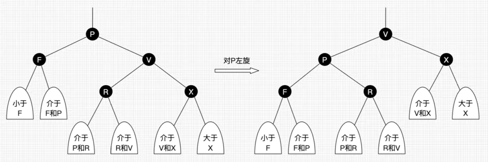
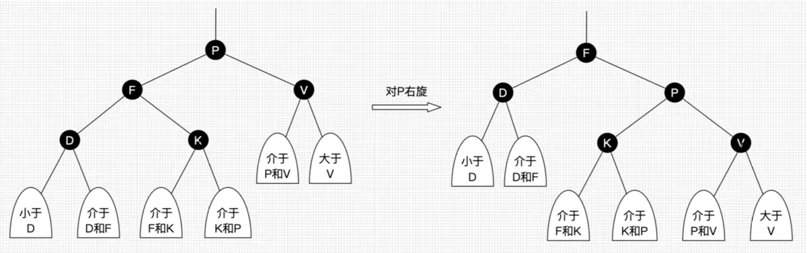
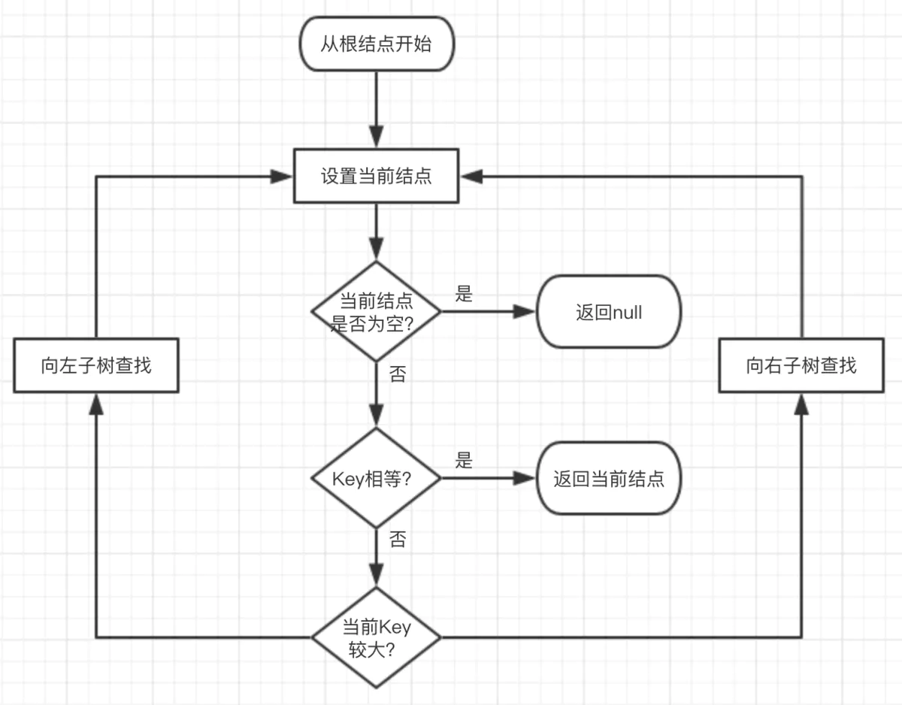
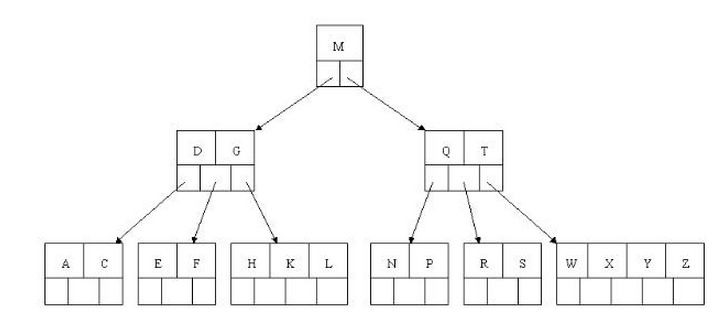
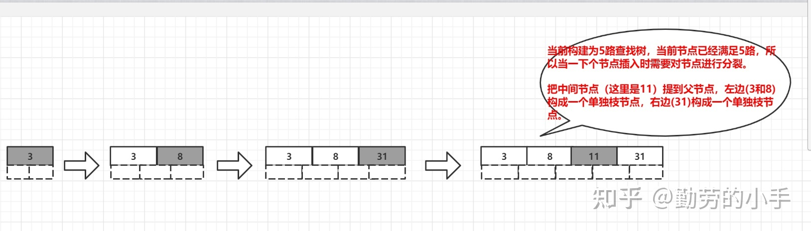
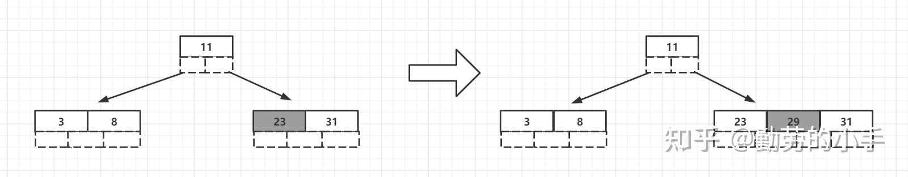
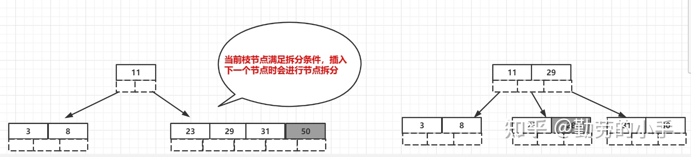
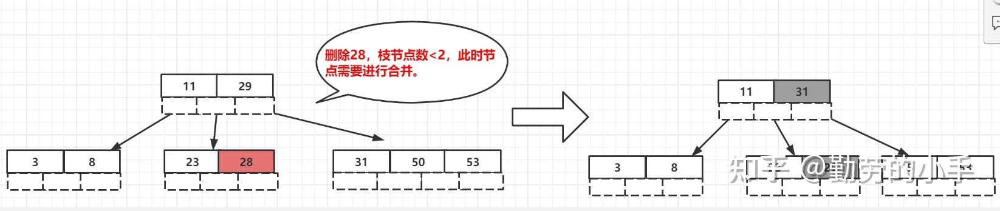
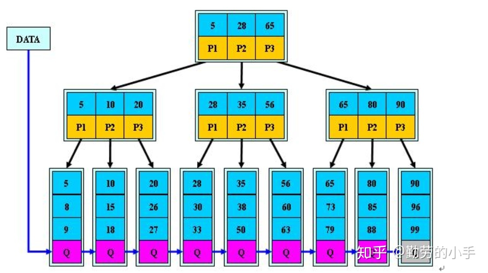
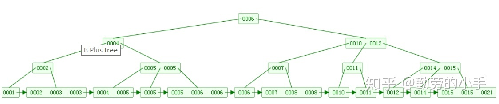

### `数组和链表`的区别

1. **逻辑结构**都是线性表 但是在**内存**中 数组是连续的内存 而链表是分散的
2. 因为链表要存储下一个节点的指针 所以**消耗的资源更多**
3. 在**访问**上 数组优于链表 O1 On
4. **增删**上 链表优于数组 不会导致迭代器失效 On O1

### `RB-Tree 红黑树`

#### 二叉搜索树（二叉查找树） BST

二叉查找树是一种特殊的**二叉树**，因此其也有递归定义：

- 二叉搜索树是一颗空树
- 二叉搜索树由根结点、左子树、右子树组成，其中左子树、右子树都是二叉查找树，且左子树上**所有结点的数据域均小于或等于根结点的数据域**，右子树上**所有结点的数据域均大于根结点的数据域**。

#### 平衡二叉树(AVL)

本质：仍是一棵`二叉搜索树`，只不过增加了平衡的要求

特点：使树的高度在每次插入元素后仍能保持O(logn)级别

平衡：对于树中任意结点，其**左子树与右子树的高度之差的绝对值**不大于1

平衡因子：**结点的左子树与右子树的高度之差**

#### 红黑树 RB-Tree

<u>红黑树是一种含有红黑结点并能`自平衡的二叉查找树`。</u>

- 性质1：每个节点要么是黑色，要么是红色。
- 性质2：根节点是黑色。
- 性质3：每个叶子节点（NIL）是黑色。
- 性质4：每个红色结点的两个子结点一定都是黑色。
- **性质5：任意一结点到每个叶子结点的路径都包含数量相同的黑结点。**
- 性质5.1：如果一个结点存在黑子结点，那么该结点肯定有两个子结点

> 主要的还是效率 因为红黑树 增删查的效率都是ologn 效率较高,
>
> **黑是真正的节点**，而**红只不过是用来表示两个键是属于一个3-节点**。
>
> 红黑树能自平衡，它靠的是什么？三种操作：左旋、右旋和变色。

<u>==黑是真正的节点==，而==红只不过是用来表示两个键是属于一个3-节点==。</u>

红黑树能自平衡，它靠的是什么？三种操作：左旋、右旋和变色。

- **左旋**：以某个结点作为支点(旋转结点)，其右子结点变为旋转结点的父结点，右子结点的左子结点变为旋转结点的右子结点，左子结点保持不变。（`右子节点的左岔连自己 右子节点当爹`）

  

- **右旋**：以某个结点作为支点(旋转结点)，其左子结点变为旋转结点的父结点，左子结点的右子结点变为旋转结点的左子结点，右子结点保持不变。（`左子节点的右岔连自己 左子节点当爹`）

  

- **变色**：结点的颜色由红变黑或由黑变红。

==红黑树的维护==可以简要地概括为三句话：

1. 如果右子节点是红色的，而左子节点是黑色的，进行左旋转。
2. 如果左子节点是红色的，且它的左子节点也是红色的，进行右旋转。
3. 如果左右子节点均为红色,进行颜色转换

#### 红黑树查找

因为红黑树是一颗二叉平衡树，并且查找不会破坏树的平衡，所以查找跟二叉平衡树的查找无异：

1. 从根结点开始查找，把根结点设置为当前结点；
2. 若当前结点为空，返回null；
3. 若当前结点不为空，用当前结点的key跟查找key作比较；
4. 若当前结点key等于查找key，那么该key就是查找目标，返回当前结点；
5. 若当前结点key大于查找key，把当前结点的左子结点设置为当前结点，重复步骤2；
6. 若当前结点key小于查找key，把当前结点的右子结点设置为当前结点，重复步骤2；

### `b树和b+树`

#### B树(B-tree)

注意:之前有看到有很多文章把B树和B-tree理解成了两种不同类别的树，其实这两个是同一种树;

#### 概念

B树和平衡二叉树稍有不同的是B树属于多叉树又名平衡多路查找树（查找路径不只两个），`数据库索引技术`里大量使用者B树和B+树的数据结构，让我们来看看他有什么特点;

#### 规则

（1）排序方式：所有节点关键字是按递增次序排列，并遵循左小右大原则；

（2）子节点数：非叶节点的子节点数>1，且<=M ，且M>=2，空树除外（注：M阶代表一个树节点最多有多少个查找路径，M=M路,当M=2则是2叉树,M=3则是3叉）；

（3）关键字数：枝节点的关键字数量大于等于ceil(m/2)-1个且小于等于M-1个（注：ceil()是个朝正无穷方向取整的函数 如ceil(1.1)结果为2);

（4）所有叶子节点均在同一层、叶子节点除了包含了关键字和关键字记录的指针外也有指向其子节点的指针只不过其指针地址都为null对应下图最后一层节点的空格子;

最后我们用一个图和一个实际的例子来理解B树（这里为了理解方便我就直接用实际字母的大小来排列C>B>A）

#### B树的查询流程

如上图我要从上图中找到E字母，查找流程如下

（1）获取根节点的关键字进行比较，当前根节点关键字为M，E<M（26个字母顺序），所以往找到指向左边的子节点（二分法规则，左小右大，左边放小于当前节点值的子节点、右边放大于当前节点值的子节点）；

（2）拿到关键字D和G，D<E<G 所以直接找到D和G中间的节点；

（3）拿到E和F，因为E=E 所以直接返回关键字和指针信息（如果树结构里面没有包含所要查找的节点则返回null）；

#### B树的插入节点流程

定义一个5阶树（平衡5路查找树;），现在我们要把3、8、31、11、23、29、50、28、53 这些数字构建出一个5阶树出来;

遵循规则：

（1）节点拆分规则：当前是要组成一个5路查找树，那么此时m=5,关键字数必须<=5-1（这里关键字数>4就要进行节点拆分）；

（2）排序规则：满足节点本身比左边节点大，比右边节点小的排序规则;

先插入 3、8、31、11

再插入23、29

再插入50、28、53

#### B树节点的删除

##### **规则：**

（1）节点合并规则：当前是要组成一个5路查找树，那么此时m=5,关键字数必须大于等于 ceil(m/2)-1（所以这里关键字数<2就要进行节点合并）；

（2）满足节点本身比左边节点大，比右边节点小的排序规则;

（3）关键字数小于二时先从子节点取，子节点没有符合条件时就向向父节点取，取中间值往父节点放；

##### **特点：**

B树相对于平衡二叉树的不同是，每个节点包含的关键字增多了，特别是在B树应用到数据库中的时候，数据库充分利用了磁盘块的原理（磁盘数据存储是采用块的形式存储的，每个块的大小为4K，每次IO进行数据读取时，同一个磁盘块的数据可以一次性读取出来）把节点大小限制和充分使用在磁盘快大小范围；把树的节点关键字增多后树的层级比原来的二叉树少了，减少数据查找的次数和复杂度;

#### B+树

#### 概念

`B+树是B树的一个升级版`，相对于B树来说B+树`更充分的利用了节点的空间`，`让查询速度更加稳定`，`其速度完全接近于二分法查找`。为什么说B+树查找的效率要比B树更高、更稳定；我们先看看两者的区别

#### 规则

（1）B+跟B树不同B+树的**非叶子**节点不保存关键字记录的指针，只进行数据索引，这样使得B+树每个**非叶子**节点所能保存的关键字大大增加；

（2）B+树**叶子**节点保存了父节点的所有关键字记录的指针，所有数据地址必须要到叶子节点才能获取到。所以每次数据查询的次数都一样；

（3）B+树叶子节点的关键字从小到大有序排列，左边结尾数据都会保存右边节点开始数据的指针。

（4）非叶子节点的子节点数=关键字数（来源百度百科）（根据各种资料 这里有两种算法的实现方式，另一种为非叶节点的关键字数=子节点数-1（来源维基百科)，虽然他们数据排列结构不一样，但其原理还是一样的Mysql 的B+树是用第一种方式实现）;

#### 特点

1、B+**树的层级更少**：相较于B树B+每个**非叶子**节点存储的关键字数更多，树的层级更少所以查询数据更快；

2、B+**树查询速度更稳定**：B+所有关键字数据地址都存在**叶子**节点上，所以每次查找的次数都相同所以查询速度要比B树更稳定;

3、B+**树天然具备排序功能：**B+树所有的**叶子**节点数据构成了一个有序链表，在查询大小区间的数据时候更方便，数据紧密性很高，缓存的命中率也会比B树高。

4、B+**树全节点遍历更快：**B+树遍历整棵树只需要遍历所有的**叶子**节点即可，，而不需要像B树一样需要对每一层进行遍历，这有利于数据库做全表扫描。

**B树**相对于**B+树**的优点是，如果经常访问的数据离根节点很近，而**B树**的**非叶子**节点本身存有关键字其数据的地址，所以这种数据检索的时候会要比**B+树**快。

### `哈希冲突`解决方法

**哈希冲突**：通过哈希算法，多个数据得到的结果相同。

- 链式地址法：相同值使用链表连接起来，哈希表保存链表的头节点；
- 开放地址法：
  - 线性探测：如果某数据的值已经存在，则在原来的基础上往后加一个单位，直至不发生哈希冲突；
  - 平方探测：按顺序决定值时，如果某数据的值已经存在，则在原来值的基础上先加1的平方个单位，若仍然存在则减1的平方个单位。随之是2的平方……；
  - 伪随即探测：按顺序决定值时，如果某数据已经存在，通过随机函数产生一个数，在原来值的基础上加上随机数，直至不产生哈希冲突；
- 再哈希：多准备一个哈希函数，如果一个有冲突，再用第二个算；
- 建立公共溢出区：建立公共溢出区存储所有哈希冲突的数据。

### 红黑树和平衡二叉查找树的区别

1. 红黑数牺牲了严格的平衡性来加快插入和删除的效率
2. avl保证严格的平衡性所以查找到效率高于红黑树, 但是插入删除旋转的操作多
3. 查找多, 插入删除少选择avl, 查找少, 插入删除多选择红黑树
