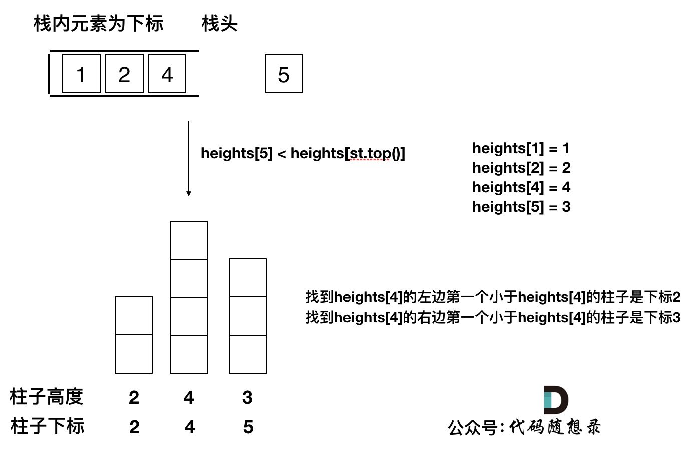
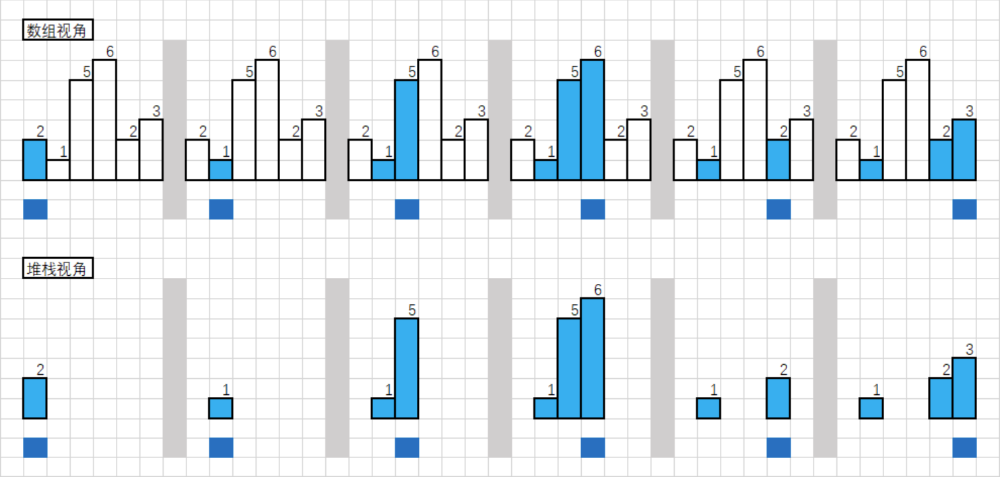

# 普通栈

### [剑指 Offer II 037. 小行星碰撞](https://leetcode-cn.com/problems/XagZNi/)

难度中等24收藏分享切换为英文接收动态反馈英文版讨论区

给定一个整数数组 `asteroids`，表示在同一行的小行星。

对于数组中的每一个元素，其绝对值表示小行星的大小，正负表示小行星的移动方向（正表示向右移动，负表示向左移动）。每一颗小行星以相同的速度移动。

找出碰撞后剩下的所有小行星。碰撞规则：两个行星相互碰撞，较小的行星会爆炸。如果两颗行星大小相同，则两颗行星都会爆炸。两颗移动方向相同的行星，永远不会发生碰撞。

 

**示例 1：**

```
输入：asteroids = [5,10,-5]
输出：[5,10]
解释：10 和 -5 碰撞后只剩下 10 。 5 和 10 永远不会发生碰撞。
```

**示例 2：**

```
输入：asteroids = [8,-8]
输出：[]
解释：8 和 -8 碰撞后，两者都发生爆炸。
```

#### 解题思路
情况讨论如下：

直接压入栈的情况：

     a. 栈空；
     b. 栈顶是负数（向左运动的行星）；
     c. 栈顶与asteroids[i]符号相同（当前行星运动方向一致）
栈顶是正数

     a.如果asteroids[i]的绝对值小于栈顶，++i；
     b.如果相等，则弹出栈顶元素并 ++i；
     c.如果大于，则弹出栈顶元素，asteroids[i]继续进行一轮判断
         （因为每次循环都有++i操作，故进行--i操作）
最初开始用栈实现，其实用vector就可以实现

#### 代码
```c++
class Solution {
public:
    vector<int> asteroidCollision(vector<int>& nums) {
        vector<int> ans;
        for(int i = 0; i<nums.size(); i++){
            if(ans.empty() || ans.back()<0 || ans.back()*nums[i]>0)
                ans.push_back(nums[i]);
            else if(ans.back() + nums[i] <= 0){
                if(ans.back() + nums[i] < 0) --i;
                ans.pop_back();
            }
        }
        return ans;
    }
};

//我的笨比解法
class Solution {
public:
	vector<int> asteroidCollision(vector<int> &nums) {
		vector<int> ans;
		stack<int> stk;
		int n = nums.size();
		for (int i = 0; i < n; i++) {
			if (stk.empty()) {
				stk.push(nums[i]);
				continue;
			}
			//判断是否需要跳过当前for
			//撞出0 跳过当前
			bool jump = 0;
			//之前向右 当前向左 会撞
			if (stk.top() > 0 && nums[i] < 0) {
				int temp = nums[i];
				while (!stk.empty() && stk.top() > 0 && temp < 0) {
					int flag = temp + stk.top();
					//撞出0 出栈并跳过当前
					if (flag == 0) {
						stk.pop();
						jump = 1;
						break;
					}
					//更新未进栈的行星 并出栈top
					temp = max(abs(stk.top()), abs(temp)) * flag / abs(flag);
					stk.pop();
				}
				if (jump) {
					continue;
				}
				//撞剩下的行星入栈
				stk.push(temp);
			}
			else {
				stk.push(nums[i]);
			}
		}
		while (!stk.empty()) {
			ans.push_back(stk.top());
			stk.pop();
		}
		return{ ans.rbegin(), ans.rend() };
	}
};
```

### `括号题目`

### [22. 括号生成](https://leetcode.cn/problems/generate-parentheses/)

[labuladong 题解](https://labuladong.github.io/article/?qno=22)[思路](https://leetcode.cn/problems/generate-parentheses/#)

难度中等2723

数字 `n` 代表生成括号的对数，请你设计一个函数，用于能够生成所有可能的并且 **有效的** 括号组合。

 

**示例 1：**

```
输入：n = 3
输出：["((()))","(()())","(())()","()(())","()()()"]
```

**示例 2：**

```
输入：n = 1
输出：["()"]
```

#### 回溯

记录剩余的 左右括号的数目

```c++
class Solution {
public:
    vector<string> ans;
    string path;
    vector<string> generateParenthesis(int n) {
      backtrack(n, n);
      return ans;
    }

    void backtrack(int left, int right){
      if(left<0 || right<0 || left>right)
        return;
      if(left == 0 && right == 0){
        ans.push_back(path);
        return;
      }
      path+='(';
      backtrack(left-1, right);
      path.pop_back();
      path+=")";
      backtrack(left, right-1);
      path.pop_back();
    }
};
```

### [20. 有效的括号](https://leetcode.cn/problems/valid-parentheses/)

[labuladong 题解](https://labuladong.github.io/article/?qno=20)[思路](https://leetcode.cn/problems/valid-parentheses/#)

难度简单3349

给定一个只包括 `'('`，`')'`，`'{'`，`'}'`，`'['`，`']'` 的字符串 `s` ，判断字符串是否有效。

有效字符串需满足：

1. 左括号必须用相同类型的右括号闭合。
2. 左括号必须以正确的顺序闭合。

 

**示例 1：**

```
输入：s = "()"
输出：true
```

**示例 2：**

```
输入：s = "()[]{}"
输出：true
```

**示例 3：**

```
输入：s = "(]"
输出：false
```

**示例 4：**

```
输入：s = "([)]"
输出：false
```

```c++
class Solution {
public:
    bool isValid(string s) {
      int n = s.size();
      if(n%2) return 0;
      stack<char> stk;
      unordered_map<char, char> mapp{{'(',')'},{'{','}'},{'[',']'}};
      for(int i = 0; i<s.size(); i++){
        if(stk.empty()){
          if(s[i] == '}' || s[i] == ']' || s[i] == ')')
            return 0;
          stk.push(s[i]);
          continue;
        }

        if(mapp[stk.top()] == s[i]){
          stk.pop();
        }else stk.push(s[i]);
      }
      return stk.empty();
    }
};
```

### [921. 使括号有效的最少添加](https://leetcode.cn/problems/minimum-add-to-make-parentheses-valid/)

[labuladong 题解](https://labuladong.github.io/article/?qno=921)[思路](https://leetcode.cn/problems/minimum-add-to-make-parentheses-valid/#)

难度中等140

只有满足下面几点之一，括号字符串才是有效的：

- 它是一个空字符串，或者
- 它可以被写成 `AB` （`A` 与 `B` 连接）, 其中 `A` 和 `B` 都是有效字符串，或者
- 它可以被写作 `(A)`，其中 `A` 是有效字符串。

给定一个括号字符串 `s` ，移动N次，你就可以在字符串的任何位置插入一个括号。

- 例如，如果 `s = "()))"` ，你可以插入一个开始括号为 `"(()))"` 或结束括号为 `"())))"` 。

返回 *为使结果字符串 `s` 有效而必须添加的最少括号数*。

**示例 1：**

```
输入：s = "())"
输出：1
```

**示例 2：**

```
输入：s = "((("
输出：3
```

**提示：**

- `1 <= s.length <= 1000`
- `s` 只包含 `'('` 和 `')'` 字符。

#### 栈解法

```c++
class Solution {
public:
    int minAddToMakeValid(string s) {
      stack<char> stk;
      int ans = 0;
      //其实for循环里面的ans 记录的需要的左括号的个数
      for(int i = 0; i<s.size(); i++){
        if(stk.empty()){
          if(s[i] == '(')
            stk.push(')');
          else ans++;
        }else { 
          if(stk.top() == s[i]){
            stk.pop();
          }else {
            if(s[i] == ')')
              stk.push('(');
            else stk.push(')');
          }
        }
      }
      //最后剩下的size是需要的右括号的个数
      ans += stk.size();
      return ans;
    }
};
```

#### 计数

```c++
class Solution {
public:
    int minAddToMakeValid(string s) {
      //need 需要括号的个数
      int needL = 0, needR = 0;
      for(int i = 0; i<s.size(); i++){
        if(s[i] == '(')
          needR++;
        else{
          needR--;
          if(needR == -1){
            needR = 0;
            needL++;
          }
        }
      }
      return needL + needR;
    }
};
```

### [1541. 平衡括号字符串的最少插入次数](https://leetcode.cn/problems/minimum-insertions-to-balance-a-parentheses-string/)

[labuladong 题解](https://labuladong.github.io/article/?qno=1541)[思路](https://leetcode.cn/problems/minimum-insertions-to-balance-a-parentheses-string/#)

难度中等48

给你一个括号字符串 `s` ，它只包含字符 `'('` 和 `')'` 。一个括号字符串被称为平衡的当它满足：

- 任何左括号 `'('` 必须对应两个连续的右括号 `'))'` 。
- 左括号 `'('` 必须在对应的连续两个右括号 `'))'` 之前。

比方说 `"())"`， `"())(())))"` 和 `"(())())))"` 都是平衡的， `")()"`， `"()))"` 和 `"(()))"` 都是不平衡的。

你可以在任意位置插入字符 '(' 和 ')' 使字符串平衡。

请你返回让 `s` 平衡的最少插入次数。

 

**示例 1：**

```
输入：s = "(()))"
输出：1
解释：第二个左括号有与之匹配的两个右括号，但是第一个左括号只有一个右括号。我们需要在字符串结尾额外增加一个 ')' 使字符串变成平衡字符串 "(())))" 。
```

**示例 2：**

```
输入：s = "())"
输出：0
解释：字符串已经平衡了。
```

**示例 3：**

```
输入：s = "))())("
输出：3
解释：添加 '(' 去匹配最开头的 '))' ，然后添加 '))' 去匹配最后一个 '(' 。
```

**示例 4：**

```
输入：s = "(((((("
输出：12
解释：添加 12 个 ')' 得到平衡字符串。
```

**示例 5：**

```
输入：s = ")))))))"
输出：5
解释：在字符串开头添加 4 个 '(' 并在结尾添加 1 个 ')' ，字符串变成平衡字符串 "(((())))))))" 。
```

**提示：**

- `1 <= s.length <= 10^5`
- `s` 只包含 `'('` 和 `')'` 。


### [32. 最长有效括号](https://leetcode.cn/problems/longest-valid-parentheses/)

[思路](https://leetcode.cn/problems/longest-valid-parentheses/#)

难度困难1880

给你一个只包含 `'('` 和 `')'` 的字符串，找出最长有效（格式正确且连续）括号子串的长度。

 

**示例 1：**

```
输入：s = "(()"
输出：2
解释：最长有效括号子串是 "()"
```

**示例 2：**

```
输入：s = ")()())"
输出：4
解释：最长有效括号子串是 "()()"
```

**示例 3：**

```
输入：s = ""
输出：0
```

 

**提示：**

- `0 <= s.length <= 3 * 104`
- `s[i]` 为 `'('` 或 `')'`


### `解码/波兰/四则运算`

### [394. 字符串解码](https://leetcode.cn/problems/decode-string/)

难度中等1202

给定一个经过编码的字符串，返回它解码后的字符串。

编码规则为: `k[encoded_string]`，表示其中方括号内部的 `encoded_string` 正好重复 `k` 次。注意 `k` 保证为正整数。

你可以认为输入字符串总是有效的；输入字符串中没有额外的空格，且输入的方括号总是符合格式要求的。

此外，你可以认为原始数据不包含数字，所有的数字只表示重复的次数 `k` ，例如不会出现像 `3a` 或 `2[4]` 的输入。

 

**示例 1：**

```
输入：s = "3[a]2[bc]"
输出："aaabcbc"
```

**示例 2：**

```
输入：s = "3[a2[c]]"
输出："accaccacc"
```

**示例 3：**

```
输入：s = "2[abc]3[cd]ef"
输出："abcabccdcdcdef"
```

**示例 4：**

```
输入：s = "abc3[cd]xyz"
输出："abccdcdcdxyz"
```

#### 双栈

```c++
class Solution {
public:
    string decodeString(string s) {
      stack<int> num_stk;     //数字栈
      stack<string> str_stk;  //字符串栈
      string str;             //当前正在累积的字符串
      for (int i = 0; i < s.size(); i++) {
        if (isdigit(s[i])) {  //遇到数字
          int n = s[i] - '0';
          //数字可能有多位
          while (isdigit(s[++i])) n = 10 * n + s[i] - '0';
          num_stk.push(n);  //加入数字栈
          --i;
        } else if (s[i] == '[') {
          str_stk.push(str);  //将当前累积的字符串入栈
          str = "";           //开始记录新的一段字符串
        } else if (s[i] == ']') {
          string tmp;
          //将当前字符串按数字栈栈顶元素为倍数进行扩展
          for (int i = 0; i < num_stk.top(); i++) {
            tmp += str;
          }
          str = tmp;
          num_stk.pop();  //数字栈栈顶元素弹出
          //字符串栈栈顶元素弹出来并与当前字符串拼接，作为新的当前正在累积的字符串
          str = str_stk.top() + str;
          str_stk.pop();
        } else
          str += s[i];  //当前字符串继续累积
      }
      return str;
    }
};
```


### [224. 基本计算器](https://leetcode.cn/problems/basic-calculator/)

[labuladong 题解](https://labuladong.github.io/article/?qno=224)

难度困难782

给你一个字符串表达式 `s` ，请你实现一个基本计算器来计算并返回它的值。

注意:不允许使用任何将字符串作为数学表达式计算的内置函数，比如 `eval()` 。

 

**示例 1：**

```
输入：s = "1 + 1"
输出：2
```

**示例 2：**

```
输入：s = " 2-1 + 2 "
输出：3
```

**示例 3：**

```
输入：s = "(1+(4+5+2)-3)+(6+8)"
输出：23
```

**提示：**

- `1 <= s.length <= 3 * 105`
- `s` 由数字、`'+'`、`'-'`、`'('`、`')'`、和 `' '` 组成
- `s` 表示一个有效的表达式
- '+' 不能用作一元运算(例如， "+1" 和 `"+(2 + 3)"` 无效)
- '-' 可以用作一元运算(即 "-1" 和 `"-(2 + 3)"` 是有效的)
- 输入中不存在两个连续的操作符
- 每个数字和运行的计算将适合于一个有符号的 32位 整数

### `带括号的四则运算 字节`

```c++
class Solution {
public:
    unordered_map<char, int> pr{{'+', 1}, {'-', 1}, {'*', 2}, {'/', 2}};
    stack<int> nums;
    stack<char> op;

    void eval(){
        int b = nums.top(); nums.pop();
        int a = nums.top(); nums.pop();
        int c = op.top(); op.pop();
        int res;
        if (c == '+') res = a + b;
        else if (c == '-') res = a - b;
        else if (c == '*') res = a * b;
        else res = a / b;
        nums.push(res);
    }

    void replace(string &s, string a, string b) {
        int pos = s.find(a), m = a.size();
        while (pos != -1) {
            s.replace(pos, m, b);
            pos = s.find(a);
        }
    }

    int calculate(string s) {
        // 处理 s 使之合法
        // 去空格
        replace(s, " ", "");
        // (- 替换为 (0-
        replace(s, "(-", "(0-");
        // (+ 替换为 (0+
        replace(s, "(+", "(0+");
        // 在 nums 中先放个 0 预防开始的符号
        nums.push(0);

        for (int i = 0; i < s.size(); ++ i) {
            char c = s[i];
            if (isdigit(c)) {
                int j = i; int num = 0;
                while (j < s.size() && isdigit(s[j]))
                    num = num * 10 + (s[j++] - '0');
                i = j - 1;
                nums.push(num);
            } else if (c == '(') {
                op.push('(');
            }
            else if (c == ')') {
                while (op.top() != '(') eval();
                op.pop();
            } else { 
                while (op.size() && op.top() != '(' && pr[op.top()] >= pr[c]) eval();
                op.push(c);
            }
        }
        while (op.size()) eval();
        return nums.top();
    }
};
```


### [227. 基本计算器 II](https://leetcode.cn/problems/basic-calculator-ii/)

[labuladong 题解](https://labuladong.github.io/article/?qno=227)

难度中等585

给你一个字符串表达式 `s` ，请你实现一个基本计算器来计算并返回它的值。

整数除法仅保留整数部分。

你可以假设给定的表达式总是有效的。所有中间结果将在 `[-231, 231 - 1]` 的范围内。

**注意：**不允许使用任何将字符串作为数学表达式计算的内置函数，比如 `eval()` 。

**示例 1：**

```
输入：s = "3+2*2"
输出：7
```

**示例 2：**

```
输入：s = " 3/2 "
输出：1
```

**示例 3：**

```
输入：s = " 3+5 / 2 "
输出：5
```

**提示：**

- `1 <= s.length <= 3 * 105`
- `s` 由整数和算符 `('+', '-', '*', '/')` 组成，中间由一些空格隔开
- `s` 表示一个 **有效表达式**
- 表达式中的所有整数都是非负整数，且在范围 `[0, 231 - 1]` 内
- 题目数据保证答案是一个 **32-bit 整数**

```c++
class Solution {
 public:
  int calculate(string s) {
    int n = s.size();
    char sign = '+';
    int ans = 0, d = 0;
    stack<int> stk;
    for (int i = 0; i < n; i++) {
      if (isdigit(s[i])) d = d * 10 - '0' + s[i];  //先做减法 避免傻逼溢出
      if ((!isdigit(s[i]) && s[i] != ' ') || i == n - 1) {
        if (sign == '+')
          stk.push(d);
        else if (sign == '-')
          stk.push(-d);
        else if (sign == '*' || sign == '/') {
          int tmp = sign == '*' ? stk.top() * d : stk.top() / d;
          stk.pop();
          stk.push(tmp);
        }
        sign = s[i];  //保存当前符号
        d = 0;
      }
    }
    while (!stk.empty()) {
      ans += stk.top();
      stk.pop();
    }
    return ans;
  }
};
```


### [150. 逆波兰表达式求值](https://leetcode.cn/problems/evaluate-reverse-polish-notation/)

[思路](https://leetcode.cn/problems/evaluate-reverse-polish-notation/#)

难度中等559

根据[ 逆波兰表示法](https://baike.baidu.com/item/逆波兰式/128437)，求表达式的值。

有效的算符包括 `+`、`-`、`*`、`/` 。每个运算对象可以是整数，也可以是另一个逆波兰表达式。

**注意** 两个整数之间的除法只保留整数部分。

可以保证给定的逆波兰表达式总是有效的。换句话说，表达式总会得出有效数值且不存在除数为 0 的情况。

 

**示例 1：**

```
输入：tokens = ["2","1","+","3","*"]
输出：9
解释：该算式转化为常见的中缀算术表达式为：((2 + 1) * 3) = 9
```

**示例 2：**

```
输入：tokens = ["4","13","5","/","+"]
输出：6
解释：该算式转化为常见的中缀算术表达式为：(4 + (13 / 5)) = 6
```

**示例 3：**

```
输入：tokens = ["10","6","9","3","+","-11","*","/","*","17","+","5","+"]
输出：22
解释：该算式转化为常见的中缀算术表达式为：
  ((10 * (6 / ((9 + 3) * -11))) + 17) + 5
= ((10 * (6 / (12 * -11))) + 17) + 5
= ((10 * (6 / -132)) + 17) + 5
= ((10 * 0) + 17) + 5
= (0 + 17) + 5
= 17 + 5
= 22
```

 

**提示：**

- `1 <= tokens.length <= 104`
- `tokens[i]` 是一个算符（`"+"`、`"-"`、`"*"` 或 `"/"`），或是在范围 `[-200, 200]` 内的一个整数

 

**逆波兰表达式：**

逆波兰表达式是一种后缀表达式，所谓后缀就是指算符写在后面。

- 平常使用的算式则是一种中缀表达式，如 `( 1 + 2 ) * ( 3 + 4 )` 。
- 该算式的逆波兰表达式写法为 `( ( 1 2 + ) ( 3 4 + ) * )` 。

逆波兰表达式主要有以下两个优点：

- 去掉括号后表达式无歧义，上式即便写成 `1 2 + 3 4 + * `也可以依据次序计算出正确结果。
- 适合用栈操作运算：遇到数字则入栈；遇到算符则取出栈顶两个数字进行计算，并将结果压入栈中

背

```c++
class Solution {
public:
    int evalRPN(vector<string>& tokens) {
      int n = tokens.size();
      stack<int> stk;
      int secondVal;
      int firstVal;
      int nowVal;
      for(int i = 0; i<n; i++){
        if(tokens[i] == "*" || tokens[i] == "/" || tokens[i] == "+" || tokens[i] == "-"){
          secondVal = stk.top();
          stk.pop();
          firstVal = stk.top();
          stk.pop();  
          if(tokens[i] == "*")
            nowVal = firstVal * secondVal;
          if(tokens[i] == "/")
            nowVal = firstVal / secondVal;
          if(tokens[i] == "+")
            nowVal = firstVal + secondVal;
          if(tokens[i] == "-")
            nowVal = firstVal - secondVal;    
          stk.push(nowVal);  
        }
        else stk.push(stoi(tokens[i]));
      }
      return stk.top();
    }
};
```


# 单调栈

**通常是一维数组，要寻找任一个元素的右边或者左边第一个比自己大或者小的元素的位置，此时我们就要想到可以用单调栈了**。

时间复杂度为$O(n)$。

例如本题其实就是找找到一个元素右边第一个比自己大的元素。

此时就应该想到用单调栈了。

那么单调栈的原理是什么呢？为什么时间复杂度是$O(n)$就可以找到每一个元素的右边第一个比它大的元素位置呢？

单调栈的本质是空间换时间，因为在遍历的过程中需要用一个栈来记录右边第一个比当前元素的元素，优点是只需要遍历一次。

在使用单调栈的时候首先要明确如下几点：

1. 单调栈里存放的元素是什么？

单调栈里只需要存放元素的`下标i`就可以了，如果需要使用对应的元素，直接T[i]就可以获取。

2. 单调栈里元素是递增呢？ 还是递减呢？

**注意一下顺序为 从栈头到栈底的顺序**，因为单纯的说从左到右或者从前到后，不说栈头朝哪个方向的话，大家一定会越看越懵。

这里我们要使用递增循序（再强调一下是指从栈头到栈底的顺序），因为只有递增的时候，加入一个元素i，才知道栈顶元素在数组中右面第一个比栈顶元素大的元素是i。

使用单调栈主要有三个判断条件。

- 当前遍历的元素T[i]小于栈顶元素T[st.top()]的情况
- 当前遍历的元素T[i]等于栈顶元素T[st.top()]的情况
- 当前遍历的元素T[i]大于栈顶元素T[st.top()]的情况

==<u>约定： 递增栈为头到底递增</u>==

### [739. 每日温度](https://leetcode-cn.com/problems/daily-temperatures/)

[labuladong 题解](https://labuladong.gitee.io/article/?qno=739)

难度中等1081收藏分享切换为英文接收动态反馈

给定一个整数数组 `temperatures` ，表示每天的温度，返回一个数组 `answer` ，其中 `answer[i]` 是指在第 `i` 天之后，才会有更高的温度。如果气温在这之后都不会升高，请在该位置用 `0` 来代替。

 

**示例 1:**

```
输入: temperatures = [73,74,75,71,69,72,76,73]
输出: [1,1,4,2,1,1,0,0]
```

**示例 2:**

```
输入: temperatures = [30,40,50,60]
输出: [1,1,1,0]
```

**示例 3:**

```
输入: temperatures = [30,60,90]
输出: [1,1,0]
```

#### [思路](https://programmercarl.com/0739.每日温度.html#思路)

递增单调栈  （元素<=栈顶元素时 入栈）

#### 代码

```c++
class Solution {
public:
    vector<int> dailyTemperatures(vector<int>& nums) {
        stack<int> stk;
        int n = nums.size();
        vector<int> ans(n);
        for(int i = 0; i<n; i++){
            //0特判
            if(stk.empty()){
                stk.push(i);
                continue;
            }
            //元素<=栈顶元素时 入栈
            if(nums[i]<=nums[stk.top()]){
                stk.push(i);
            }else{
                while(!stk.empty() && nums[stk.top()]<nums[i]){
                    int now = stk.top();
                    stk.pop();
                    ans[now] = (i - now);                    
                }
                stk.push(i); // 不要忘了入栈
            }
        }
        return ans;
    }
};
```

### [496. 下一个更大元素 I](https://leetcode-cn.com/problems/next-greater-element-i/)

[labuladong 题解](https://labuladong.gitee.io/article/?qno=496)

难度简单676英文版讨论区

`nums1` 中数字 `x` 的 **下一个更大元素** 是指 `x` 在 `nums2` 中对应位置 **右侧** 的 **第一个** 比 `x` 大的元素。

给你两个 **没有重复元素** 的数组 `nums1` 和 `nums2` ，下标从 **0** 开始计数，其中`nums1` 是 `nums2` 的子集。

对于每个 `0 <= i < nums1.length` ，找出满足 `nums1[i] == nums2[j]` 的下标 `j` ，并且在 `nums2` 确定 `nums2[j]` 的 **下一个更大元素** 。如果不存在下一个更大元素，那么本次查询的答案是 `-1` 。

返回一个长度为 `nums1.length` 的数组 `ans` 作为答案，满足 `ans[i]` 是如上所述的 **下一个更大元素** 。

 

**示例 1：**

```
输入：nums1 = [4,1,2], nums2 = [1,3,4,2].
输出：[-1,3,-1]
解释：nums1 中每个值的下一个更大元素如下所述：
- 4 ，用加粗斜体标识，nums2 = [1,3,4,2]。不存在下一个更大元素，所以答案是 -1 。
- 1 ，用加粗斜体标识，nums2 = [1,3,4,2]。下一个更大元素是 3 。
- 2 ，用加粗斜体标识，nums2 = [1,3,4,2]。不存在下一个更大元素，所以答案是 -1 。
```

**示例 2：**

```
输入：nums1 = [2,4], nums2 = [1,2,3,4].
输出：[3,-1]
解释：nums1 中每个值的下一个更大元素如下所述：
- 2 ，用加粗斜体标识，nums2 = [1,2,3,4]。下一个更大元素是 3 。
- 4 ，用加粗斜体标识，nums2 = [1,2,3,4]。不存在下一个更大元素，所以答案是 -1 。
```

#### 思路

1. 这道题虽然是简单题 但是难度比每日温度大
2. 用一个哈希记录nums1，再对nums2使用单调栈

#### 代码

```c++
class Solution {
public:
    vector<int> nextGreaterElement(vector<int>& nums1, vector<int>& nums2) {
        int m = nums1.size();
        vector<int> ans(m, -1);
        stack<int> stk;
        unordered_map<int, int> mapp;
        for(int i = 0; i<m; i++)
            mapp[nums1[i]] = i;
        int n = nums2.size();
        for(int i = 0; i<n; i++){
            if(stk.empty()){
                stk.push(i);
                continue;
            }
            if(nums2[stk.top()]>= nums2[i])
                stk.push(i);
            else{
                while(!stk.empty() && nums2[stk.top()] < nums2[i]){
                    int nowI = stk.top();
                    //判断是否是nums1中的元素
                    if(mapp.count(nums2[nowI])){
                        int index = mapp[nums2[nowI]];
                        ans[index] = nums2[i];
                    }
                    stk.pop();
                }
                stk.push(i);
            }
        }
        return ans;
    }
};
```

### [503. 下一个更大元素 II](https://leetcode-cn.com/problems/next-greater-element-ii/)

[labuladong 题解](https://labuladong.gitee.io/article/?qno=503)

难度中等586英文版讨论区

给定一个循环数组 `nums` （ `nums[nums.length - 1]` 的下一个元素是 `nums[0]` ），返回 *`nums` 中每个元素的 **下一个更大元素*** 。

数字 `x` 的 **下一个更大的元素** 是按数组遍历顺序，这个数字之后的第一个比它更大的数，这意味着你应该循环地搜索它的下一个更大的数。如果不存在，则输出 `-1` 。

 

**示例 1:**

```
输入: nums = [1,2,1]
输出: [2,-1,2]
解释: 第一个 1 的下一个更大的数是 2；
数字 2 找不到下一个更大的数； 
第二个 1 的下一个最大的数需要循环搜索，结果也是 2。
```

**示例 2:**

```
输入: nums = [1,2,3,4,3]
输出: [2,3,4,-1,4]
```

#### 思路

1. 再拼接一个数组 对二倍长度的数组进行统计 最后将结果resize为原大小
2. 循环起来，遍历的时候遍历二倍大小 用%n来进行循环

#### 代码

##### 二倍数组拼接

```c++
class Solution {
public:
    vector<int> nextGreaterElements(vector<int>& nums) {
        int n = nums.size();
        n*=2;
        vector<int> nums1(nums.begin(), nums.end());
        nums.insert(nums.end(), nums1.begin(), nums1.end());
        stack<int> stk;
        vector<int> ans(n, -1);
        for(int i = 0; i<n; i++){
            if(stk.empty()){
                stk.push(i);
                continue;
            }

            if(nums[stk.top()]>=nums[i]){
                stk.push(i);
            }else{
                while(!stk.empty() && nums[stk.top()]<nums[i]){
                    ans[stk.top()] = nums[i];
                    stk.pop();
                }
                stk.push(i);
            }
        }
        ans.resize(n/2);
        return ans;
    }
};
```

##### 二倍循环%n

```c++
class Solution {
public:
    vector<int> nextGreaterElements(vector<int>& nums) {
        int n = nums.size();
        stack<int> stk;
        vector<int> ans(n, -1);
        for(int i = 0; i<n*2; i++){
            if(stk.empty()){
                stk.push(i);
                continue;
            }
            while(!stk.empty() && nums[stk.top()]<nums[i%n]){
                ans[stk.top()] = nums[i%n];
                stk.pop();
            }
            stk.push(i%n);
        }
        return ans;
    }
};
```

### [42. 接雨水](https://leetcode-cn.com/problems/trapping-rain-water/)

[labuladong 题解](https://labuladong.gitee.io/article/?qno=42)[思路](https://leetcode-cn.com/problems/trapping-rain-water/#)

难度困难3289英文版讨论区

给定 `n` 个非负整数表示每个宽度为 `1` 的柱子的高度图，计算按此排列的柱子，下雨之后能接多少雨水。

 

**示例 1：**


```
输入：height = [0,1,0,2,1,0,1,3,2,1,2,1]
输出：6
解释：上面是由数组 [0,1,0,2,1,0,1,3,2,1,2,1] 表示的高度图，在这种情况下，可以接 6 个单位的雨水（蓝色部分表示雨水）。 
```

**示例 2：**

```
输入：height = [4,2,0,3,2,5]
输出：9
```

#### 思路

1. On2暴力 
2. dp 多次遍历 保存最值
3. 最小栈

#### 代码

##### On2暴力

```c++
//暴力超时
class Solution {
public:
    int trap(vector<int>& height) {
        int n = height.size();
        int sum = 0;
        for(int i = 0; i<n; i++){
            if(i == 0 || i == n-1) continue;
            int rHeight = height[i];
            int lHeight = height[i];
            for(int r = i+1; r<n; r++){
                if(height[r]>rHeight) rHeight = height[r];
            }
            for(int l = i-1; l>=0; l--){
                if(height[l]>lHeight) lHeight = height[l];
            }
            int h = min(lHeight, rHeight) - height[i];
            if(h>0) sum+=h;
        }
        return sum;
    }
};
```

##### dp 多次遍历 保存最值

```c++
// dp解法
class Solution {
public:
    int trap(vector<int>& height) {
        int n = height.size();
        int sum = 0;
        vector<int> leftH(n, 0);
        vector<int> rightH(n, 0);
        leftH[0] = height[0];
        rightH[n-1] = height[n-1];
        for(int i = 1; i<n; i++){
            leftH[i] = max(height[i], leftH[i-1]);
        }
        for(int i = n-2; i>=0; i--){
            rightH[i] = max(height[i], rightH[i+1]);
        }
        for(int i = 0; i<n; i++){
            int h = min(leftH[i], rightH[i]) - height[i];
            if(h>0) sum+=h;
        }
        return sum;
    }
};
```

##### 最小栈

```c++
//最小栈
class Solution {
public:
    int trap(vector<int>& height) {
        int n = height.size();
        int sum = 0;
        stack<int> stk;
        stk.push(0);
        for(int i = 1; i<n; i++){
            if(height[i]<height[stk.top()])
                stk.push(i);
            else if(height[i] == height[stk.top()]){
                stk.pop();
                stk.push(i);
            }else{
                //每个坑坑洼洼的地方计算一次
                while(!stk.empty() && height[i]>height[stk.top()]){
                    int mid = stk.top();
                    stk.pop();
                    if(!stk.empty()){
                        int h = min(height[stk.top()], height[i]) - height[mid];
                        int w = i - stk.top() - 1;
                        sum += h*w;
                    }
                }
                stk.push(i);
            }
        }
        return sum;
    }
};
```

### [84. 柱状图中最大的矩形](https://leetcode-cn.com/problems/largest-rectangle-in-histogram/)

难度困难1849

给定 n 个非负整数，用来表示柱状图中各个柱子的高度。每个柱子彼此相邻，且宽度为 1 。

求在该柱状图中，能够勾勒出来的矩形的最大面积。

 

**示例 1:**


```
输入：heights = [2,1,5,6,2,3]
输出：10
解释：最大的矩形为图中红色区域，面积为 10
```

**示例 2：**


```
输入： heights = [2,4]
输出： 4
```

#### 思路

1. 动态规划

   本题动态规划的写法整体思路和[42. 接雨水 (opens new window)](https://programmercarl.com/0042.接雨水.html)是一致的，但要比[42. 接雨水 (opens new window)](https://programmercarl.com/0042.接雨水.html)难一些。难就难在本题要记录记录每个柱子 左边第一个小于该柱子的下标，而不是左边第一个小于该柱子的高度。所以需要循环查找，也就是下面在寻找的过程中使用了while

2. 单调栈

   本地单调栈的解法和接雨水的题目是遥相呼应的。

   为什么这么说呢，[42. 接雨水 (opens new window)](https://programmercarl.com/0042.接雨水.html)是找每个柱子左右两边第一个大于该柱子高度的柱子，而本题是找每个柱子左右两边第一个小于该柱子的柱子。

   **这里就涉及到了单调栈很重要的性质，就是单调栈里的顺序，是从小到大还是从大到小**。

   在题解[42. 接雨水 (opens new window)](https://programmercarl.com/0042.接雨水.html)中我讲解了接雨水的单调栈从栈头（元素从栈头弹出）到栈底的顺序应该是从小到大的顺序。

   那么因为本题是要找每个柱子左右两边第一个小于该柱子的柱子，所以从栈头（元素从栈头弹出）到栈底的顺序应该是从大到小的顺序！

   我来举一个例子，如图：

   

   只有栈里从大到小的顺序，才能保证栈顶元素找到左右两边第一个小于栈顶元素的柱子。

   所以本题单调栈的顺序正好与接雨水反过来。

   此时大家应该可以发现其实就是**栈顶和栈顶的下一个元素以及要入栈的三个元素组成了我们要求最大面积的高度和宽度**

   理解这一点，对单调栈就掌握的比较到位了。

   除了栈内元素顺序和接雨水不同，剩下的逻辑就都差不多了，在题解[42. 接雨水 (opens new window)](https://programmercarl.com/0042.接雨水.html)我已经对单调栈的各个方面做了详细讲解，这里就不赘述了。

   剩下就是分析清楚如下三种情况：

   - 情况一：当前遍历的元素heights[i]小于栈顶元素heights[st.top()]的情况
   - 情况二：当前遍历的元素heights[i]等于栈顶元素heights[st.top()]的情况
   - 情况三：当前遍历的元素heights[i]大于栈顶元素heights[st.top()]的情况



#### 代码

##### 动态规划

```cpp
class Solution {
public:
    int largestRectangleArea(vector<int>& heights) {
        vector<int> minLeftIndex(heights.size());
        vector<int> minRightIndex(heights.size());
        int size = heights.size();

        // 记录每个柱子 左边第一个小于该柱子的下标
        minLeftIndex[0] = -1; // 注意这里初始化，防止下面while死循环
        for (int i = 1; i < size; i++) {
            int t = i - 1;
            // 这里不是用if，而是不断向左寻找的过程
            while (t >= 0 && heights[t] >= heights[i]) t = minLeftIndex[t];
            minLeftIndex[i] = t;
        }
        // 记录每个柱子 右边第一个小于该柱子的下标
        minRightIndex[size - 1] = size; // 注意这里初始化，防止下面while死循环
        for (int i = size - 2; i >= 0; i--) {
            int t = i + 1;
            // 这里不是用if，而是不断向右寻找的过程
            while (t < size && heights[t] >= heights[i]) t = minRightIndex[t];
            minRightIndex[i] = t;
        }
        // 求和
        int result = 0;
        for (int i = 0; i < size; i++) {
            int sum = heights[i] * (minRightIndex[i] - minLeftIndex[i] - 1);
            result = max(sum, result);
        }
        return result;
    }
};
```

##### 单调栈  略微背一下吧

```c++
class Solution {
public:
    int largestRectangleArea(vector<int>& heights) {
        stack<int> stk;
        heights.insert(heights.begin(), 0);
        heights.push_back(0);
        stk.push(0);
        int ans = 0;
        for(int i = 1; i<heights.size(); i++){
            if(heights[i]>heights[stk.top()])
                stk.push(i);
            else if(heights[i] == heights[stk.top()]){
                stk.pop();
                stk.push(i);
            }else{
                while(heights[i] < heights[stk.top()]){
                    int mid = stk.top(); //当前矩形高的位置
                    stk.pop();
                    int left = stk.top();
                    int right = i;  //记录当前值以计算宽
                    int w = right - 1 - left;
                    int h = heights[mid];
                    //right - 1为右边界 i-1
                    //left为左边界 当前栈顶index
                    ans = max(ans, w*h);
                }
                stk.push(i);
            }
        }
        return ans;
    }
};
```
