# 二叉树

## ACM模式构建二叉树

```c++
#include <iostream>
#include <vector>
#include <queue>
using namespace std;

struct TreeNode {
    int val;
    TreeNode *left;
    TreeNode *right;
    TreeNode(int x) : val(x), left(NULL), right(NULL) {}
};

// 根据数组构造二叉树
TreeNode* construct_binary_tree(const vector<int>& vec) {
    vector<TreeNode*> vecTree (vec.size(), nullptr);
    TreeNode* root = NULL;
  	// 把输入数值数组，先转化为二叉树节点数组
    for (int i = 0; i < vec.size(); i++) {
        TreeNode* node = NULL;
        if (vec[i] != -1) node = new TreeNode(vec[i]);
        vecTree[i] = node;
        if (i == 0) root = node;
    }
    // 遍历一遍，根据规则左右孩子赋值就可以了
    // 注意这里 结束规则是 i * 2 + 2 < vec.size()，避免空指针
    for (int i = 0; i * 2 + 2 < vec.size(); i++) {
        if (vecTree[i] != NULL) {
            vecTree[i]->left = vecTree[i * 2 + 1];
            vecTree[i]->right = vecTree[i * 2 + 2];
        }
    }
    return root;
}

// 层序打印打印二叉树
void print_binary_tree(TreeNode* root) {
    queue<TreeNode*> que;
    if (root != NULL) que.push(root);
    vector<vector<int>> result;
    while (!que.empty()) {
        int size = que.size();
        vector<int> vec;
        for (int i = 0; i < size; i++) {
            TreeNode* node = que.front();
            que.pop();
            if (node != NULL) {
                vec.push_back(node->val);
                que.push(node->left);
                que.push(node->right);
            }
            // 这里的处理逻辑是为了把null节点打印出来，用-1 表示null
            else vec.push_back(-1);
        }
        result.push_back(vec);
    }
    for (int i = 0; i < result.size(); i++) {
        for (int j = 0; j < result[i].size(); j++) {
            cout << result[i][j] << " ";
        }
        cout << endl;
    }
}

int main() {
    // 注意本代码没有考虑输入异常数据的情况
    // 用 -1 来表示null
    vector<int> vec = {4,1,6,0,2,5,7,-1,-1,-1,3,-1,-1,-1,8};
    TreeNode* root = construct_binary_tree(vec);
    print_binary_tree(root);
}
```


## 二叉树的遍历

### 1. 概念

树是连通的无环图，最常利用的有二叉树，`即一个节点最多只有两个子节点`，称为左子树和右子树。但是树都是相通的，无论是二叉树或者多个节点的树都能一般能用递归方法进行求解。二叉树节点之间的顺序一般不可调换，在数据结构定义时，左是左，右是右，不会说节点1，节点2。

#### 二叉排序树又叫二叉查找树或者二叉搜索树：

1）若左子树不空，则左子树上所有结点的值均小于它的根节点的值；

2）若右子树不空，则右子树上所有结点的值均大于它的根结点的值；

3）左、右子树也分别为二叉排序树；4）没有键值相等的节点

### 2. 树的各种DFS遍历

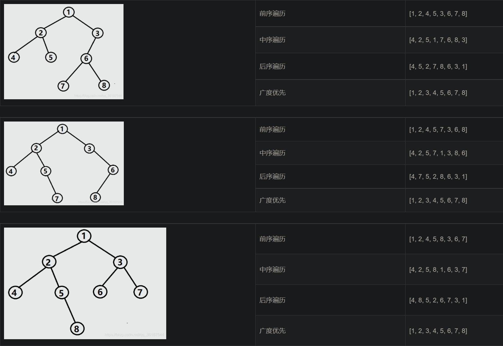

前序遍历，根-->左子树-->右子树

中序遍历，左子树-->根-->右子树

后序遍历，左子树-->右子树-->根

前序/后序+中序能够确定一个完整的树结构，因为前序/后序的根在第一位/最后一位，这样在中序中找到对应的根节点，以此递归，具体的题见leetCode105、106

#### 深度优先遍历（Depth First Search，DFS，主要有三种子方法，前中后序遍历）

前中后序遍历的递归写法

```c++
class Solution {
public:
    //前序遍历：
    void traversal(TreeNode* cur, vector<int>& vec) {
        if (cur == NULL) return;
        vec.push_back(cur->val);    // 中
        traversal(cur->left, vec);  // 左
        traversal(cur->right, vec); // 右
    }
    vector<int> preorderTraversal(TreeNode* root) {
        vector<int> result;
        traversal(root, result);
        return result;
    }
};
//中序遍历：
void traversal(TreeNode* cur, vector<int>& vec) {
    if (cur == NULL) return;
    traversal(cur->left, vec);  // 左
    vec.push_back(cur->val);    // 中
    traversal(cur->right, vec); // 右
}
//后序遍历：
void traversal(TreeNode* cur, vector<int>& vec) {
    if (cur == NULL) return;
    traversal(cur->left, vec);  // 左
    traversal(cur->right, vec); // 右
    vec.push_back(cur->val);    // 中
}
```

### 3.树的广度优先遍历

#### 广度优先遍历（Breadth FirstSearch，BFS,实际上就是逐层查找，又叫层次遍历，宽度优先搜索或横向优先搜索）

```c++
class Solution {
public:
    vector<vector<int>> levelOrder(TreeNode* root) {
        queue<TreeNode*> que;
        if (root != NULL) que.push(root);
        vector<vector<int>> result;
        while (!que.empty()) {
            int size = que.size();
            vector<int> vec;
            // 这里一定要使用固定大小size，不要使用que.size()，因为que.size是不断变化的
            for (int i = 0; i < size; i++) {
                TreeNode* node = que.front();
                que.pop();
                vec.push_back(node->val);
                if (node->left) que.push(node->left);
                if (node->right) que.push(node->right);
            }
            result.push_back(vec);
        }
        return result;
    }
};
```


## 二叉树的前序遍历

前中后序 不再赘述

有道题感觉挺有意思

### [剑指 Offer II 049. 从根节点到叶节点的路径数字之和](https://leetcode-cn.com/problems/3Etpl5/)

难度中等21

给定一个二叉树的根节点 `root` ，树中每个节点都存放有一个 `0` 到 `9` 之间的数字。

每条从根节点到叶节点的路径都代表一个数字：

- 例如，从根节点到叶节点的路径 `1 -> 2 -> 3` 表示数字 `123` 。

计算从根节点到叶节点生成的 **所有数字之和** 。

**叶节点** 是指没有子节点的节点。

 

**示例 1：**

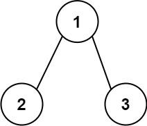

```
输入：root = [1,2,3]
输出：25
解释：
从根到叶子节点路径 1->2 代表数字 12
从根到叶子节点路径 1->3 代表数字 13
因此，数字总和 = 12 + 13 = 25
```

**示例 2：**

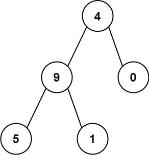

```
输入：root = [4,9,0,5,1]
输出：1026
解释：
从根到叶子节点路径 4->9->5 代表数字 495
从根到叶子节点路径 4->9->1 代表数字 491
从根到叶子节点路径 4->0 代表数字 40
因此，数字总和 = 495 + 491 + 40 = 1026
```

#### 思路

1. 保存在每一个节点状态的 preSum 当最后左右子为空时 加到ans中
2. 注意 不是node == nullptr时加 因为可能一个叶子节点为空 重复加了

#### 代码

```c++
class Solution {
public:
    int ans;
    int sumNumbers(TreeNode* root) {
        ans = 0; 
        preOrder(root, 0);
        return ans;
    }

    void preOrder(TreeNode* node, int preSum){
        if(node == nullptr) return;

        int total = preSum*10 + node->val;
        if(node->left == nullptr && node->right == nullptr){
            ans += total;
            return;
        }
        preOrder(node->left, total);
        preOrder(node->right, total);
    }
};
```

#### `思考`

前序遍历可以按 根左右的顺序保存每个节点的值， 那么怎么才能输入 这道题中的每道数组成的数组序列呢？或者说 回溯在哪里？

如上的要求可以 不优雅的通过`传值`实现

```c++
class Solution {
public:
    vector<vector<int>> all;
    void getAllPaths(TreeNode* root) {
        all.clear();
        vector<int> path;
        preOrder(root, path);

        for(int i = 0; i<all.size(); i++){
            for(int j = 0; j<all[i].size(); j++){
                cout<<all[i][j]<<" ";
            }
            cout<<endl;
        }
    }//示例二输出为 4 9 5 /n   4 9 1 /n   4 0 /n 完全正确

    void preOrder(TreeNode* node, vector<int> path){
        if(node == nullptr) return;
        path.push_back(node->val); //压入
        if(node->left == nullptr && node->right == nullptr){
            all.push_back(path);
            return;
        }

        preOrder(node->left, path);
        preOrder(node->right, path);
    }
};
```

但是 主要的问题是 回溯（一个path 进行pop）的话 在什么位置进行回溯呢

经过可视化观察 和 思考

##### 得出如下结论：

1. 在每道的最底部 的 节点 需要进行回溯 即path.pop_back();
2. 在前序遍历程序的结尾 也就是 遍历完右叶子节点后 需要进行回溯

###### 代码实现如下

```c++
class Solution {
public:
    vector<vector<int>> all;
    vector<int> path;
    int sumNumbers(TreeNode* root) {
        all.clear();
        preOrder(root); //经测试 输出正确 每道叶子路径完整的存储在all中
    }

    void preOrder(TreeNode* node){
        if(node == nullptr)
            return;

        path.push_back(node->val);
        //每道 最底部的 节点
        if(node->left == nullptr && node->right == nullptr){
            all.push_back(path);
            path.pop_back();
            return;
        }
        preOrder(node->left);
        preOrder(node->right);
        path.pop_back();  //右节点后的 回溯
    }
};
```

本体改进的代码

```c++
class Solution {
public:
    int ans;
    int path;
    int sumNumbers(TreeNode* root) {
      path = 0;
      dfs(root);
      return ans;
    }

    void dfs(TreeNode* node){
      if(node == nullptr) return;
      path *= 10;
      path += node->val;

      if(node->left == nullptr && node->right == nullptr){
        ans += path;
        path /= 10;       
        return; 
      }
      dfs(node->left);
      dfs(node->right);
      path /= 10;
    }
};
```


### [剑指 Offer 34. 二叉树中和为某一值的路径](https://leetcode.cn/problems/er-cha-shu-zhong-he-wei-mou-yi-zhi-de-lu-jing-lcof/)

难度中等341收藏分享切换为英文接收动态反馈

给你二叉树的根节点 `root` 和一个整数目标和 `targetSum` ，找出所有 **从根节点到叶子节点** 路径总和等于给定目标和的路径。

**叶子节点** 是指没有子节点的节点。

**示例 1：**

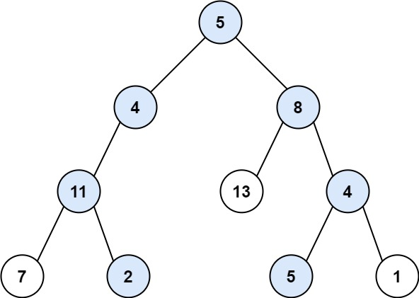

```
输入：root = [5,4,8,11,null,13,4,7,2,null,null,5,1], targetSum = 22
输出：[[5,4,11,2],[5,8,4,5]]
```

#### 前序 回溯

```c++
class Solution {
public:
    vector<vector<int>> ans;
    vector<int> path;
    int sumVal;
    vector<vector<int>> pathSum(TreeNode* root, int target) {
      sumVal = 0;
      dfs(root, target);
      return ans;
    }

    void dfs(TreeNode* node, const int& target){
      if(node == nullptr) return;
      path.push_back(node->val);
      sumVal += node->val;
      //结果检查
      if(node->left == nullptr && node->right == nullptr){
        if(sumVal == target){
          ans.push_back(path);
          sumVal -= node->val;
          path.pop_back();
          return;
        }
      }
      dfs(node->left, target);
      dfs(node->right, target);
      path.pop_back();
      sumVal -= node->val;
    }
};
```


### [剑指 Offer II 050. 向下的路径节点之和](https://leetcode-cn.com/problems/6eUYwP/)

难度中等32

给定一个二叉树的根节点 `root` ，和一个整数 `targetSum` ，求该二叉树里节点值之和等于 `targetSum` 的 **路径** 的数目。

**路径** 不需要从根节点开始，也不需要在叶子节点结束，但是路径方向必须是向下的（只能从父节点到子节点）。

 

**示例 1：**

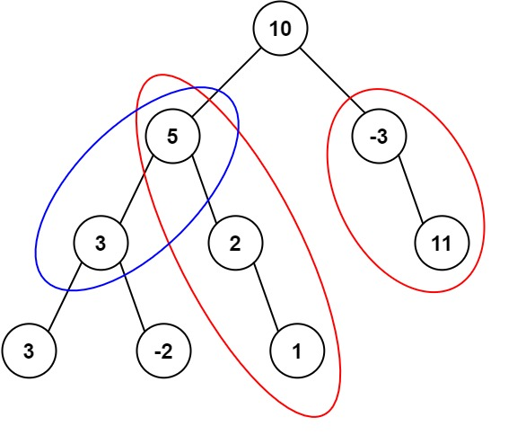

```
输入：root = [10,5,-3,3,2,null,11,3,-2,null,1], targetSum = 8
输出：3
解释：和等于 8 的路径有 3 条，如图所示。
```

#### 思路

##### 首先实现一个dfs回溯求和函数 这个函数有如下要求

1. 前序遍历求和

2. 回溯减去退出节点的值

此时需要从两个位置进行回溯 一个是`遍历完右节点后回溯` 也就是在dfs函数尾部 还有一个位置是`最底部的节点` 表现出来就是左右子树均为空

##### 然后 究极暴力

前序套前序，以每个节点为根节点求和为targetSum的个数 累加起来

#### 代码

```c++
class Solution {
public:
    int bigAns;
    int ans;
    int pathSum(TreeNode* root, int targetSum) {
      bigAns = 0;
      bigDfs(root, targetSum);
      return bigAns;
    }

    //每个节点都当作根节点 查找此节点下的路径和 == targetSum的个数
    void bigDfs(TreeNode* node, int targetSum){
      if(node == nullptr) return;
      int temAns = pathSumBeginWithThisRoot(node, targetSum);
      bigAns+=temAns;
      //cout<<temAns<<endl;
      bigDfs(node->left, targetSum);
      bigDfs(node->right, targetSum);
    }

    //深搜根节点起始的路径，直到sum == targetSum
    int pathSumBeginWithThisRoot(TreeNode* root, int targetSum){
      ans = 0;
      int sum = 0;
      dfs(root, sum, targetSum);
      return ans;
    }

    void dfs(TreeNode* node, int& sum, int targetSum){
      if(node == nullptr) return;
      
      sum+=node->val;
      if(sum == targetSum) ans++;
      if(node->left == nullptr && node->right == nullptr){
        sum-=node->val;
        return;  //这里必须提前return 不然回溯了两遍
      }

      dfs(node->left, sum, targetSum);
      dfs(node->right, sum, targetSum);
      sum-=node->val;
    }
};
```

#### 官方的优雅写法

```c++
class Solution {
public:
  	//以节点 p 为起点向下且满足路径总和为 val 的路径数目
    int rootSum(TreeNode* root, int targetSum) {
        if (!root) 
            return 0;

        int ret = 0;
        if (root->val == targetSum) 
            ret++;

        ret += rootSum(root->left, targetSum - root->val);
        ret += rootSum(root->right, targetSum - root->val);
        return ret;
    }

    int pathSum(TreeNode* root, int targetSum) {
        if (!root)
            return 0;
        
        int ret = rootSum(root, targetSum);
        ret += pathSum(root->left, targetSum);
        ret += pathSum(root->right, targetSum);
        return ret;
    }
};
```

#### `前缀和`

### [297. 二叉树的序列化与反序列化](https://leetcode-cn.com/problems/serialize-and-deserialize-binary-tree/)

[labuladong 题解](https://labuladong.github.io/article/?qno=297)[思路](https://leetcode-cn.com/problems/serialize-and-deserialize-binary-tree/#)

难度困难837

序列化是将一个数据结构或者对象转换为连续的比特位的操作，进而可以将转换后的数据存储在一个文件或者内存中，同时也可以通过网络传输到另一个计算机环境，采取相反方式重构得到原数据。

请设计一个算法来实现二叉树的序列化与反序列化。这里不限定你的序列 / 反序列化算法执行逻辑，你只需要保证一个二叉树可以被序列化为一个字符串并且将这个字符串反序列化为原始的树结构。

**提示:** 输入输出格式与 LeetCode 目前使用的方式一致，详情请参阅 [LeetCode 序列化二叉树的格式](https://leetcode-cn.com/faq/#binary-tree)。你并非必须采取这种方式，你也可以采用其他的方法解决这个问题。

 

**示例 1：**

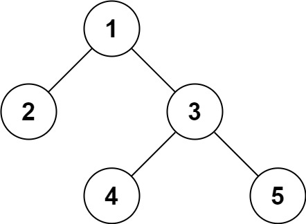

```
输入：root = [1,2,3,null,null,4,5]
输出：[1,2,3,null,null,4,5]
```

```c++
class Codec {
public:
    // Encodes a tree to a single string.
    string serialize(TreeNode* root) {
        if(root==nullptr){
            return "#";
        }
      	//前序遍历
        return to_string(root->val) + ' ' + serialize(root->left) + ' ' + serialize(root->right);
    }

    TreeNode* mydeserialize(istringstream &ss){
        string tmp;
        ss>>tmp;
        if(tmp=="#"){
            return nullptr;
        }
        TreeNode* node = new TreeNode(stoi(tmp));
        node->left = mydeserialize(ss);
        node->right = mydeserialize(ss);
        return node;
    }

    // Decodes your encoded data to tree.
    TreeNode* deserialize(string data) {
        istringstream ss(data);
        return mydeserialize(ss);
    }
};
```

### [1026. 节点与其祖先之间的最大差值](https://leetcode.cn/problems/maximum-difference-between-node-and-ancestor/)

[思路](https://leetcode.cn/problems/maximum-difference-between-node-and-ancestor/#)

难度中等120

给定二叉树的根节点 `root`，找出存在于 **不同** 节点 `A` 和 `B` 之间的最大值 `V`，其中 `V = |A.val - B.val|`，且 `A` 是 `B` 的祖先。

（如果 A 的任何子节点之一为 B，或者 A 的任何子节点是 B 的祖先，那么我们认为 A 是 B 的祖先）

 

**示例 1：**

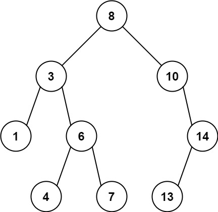

```
输入：root = [8,3,10,1,6,null,14,null,null,4,7,13]
输出：7
解释： 
我们有大量的节点与其祖先的差值，其中一些如下：
|8 - 3| = 5
|3 - 7| = 4
|8 - 1| = 7
|10 - 13| = 3
在所有可能的差值中，最大值 7 由 |8 - 1| = 7 得出
```

#### 我的笨解法 前序套前序

```c++
class Solution {
public:
    int ans = INT_MIN;
    int maxAncestorDiff(TreeNode* root) {
      if(root == nullptr) return 0;
      bigDfs(root);
      return ans == INT_MIN? 0: ans;
    }

    void bigDfs(TreeNode* node){
      if(node == nullptr) return;
      int temp = node->val;
      dfs(node, temp);
      bigDfs(node->left);
      bigDfs(node->right);
    }

    void dfs(TreeNode* node, int temp){
      if(node == nullptr) return;
      ans = max(ans, abs(node->val - temp));
      dfs(node->left, temp);
      dfs(node->right, temp);
    }
};
`
```

#### 大佬的记忆化前序

```c++
//就一个节点来说所谓最大差值，就是祖先的最大值或者最小值和自己的val的差值。
//只需要知道所有祖先可能的最大值和最小值，在遍历时携带传递即可。
class Solution {
public:
    int ans = 0;
    int maxAncestorDiff(TreeNode* root) {
      if(root == nullptr) return 0;
      dfs(root, root->val, root->val);
      return ans;
    }

    void dfs(TreeNode* node, int minn, int maxx){
      if(node == nullptr) return;
      ans =max(ans, max(abs(node->val - minn), abs(node->val - maxx)));
      minn = min(node->val, minn);
      maxx = max(node->val, maxx);
      dfs(node->left, minn, maxx);
      dfs(node->right, minn, maxx);
    }
};
```


## 二叉树 中序遍历

### [剑指 Offer II 053. 二叉搜索树中的中序后继](https://leetcode.cn/problems/P5rCT8/)

难度中等35

给定一棵二叉搜索树和其中的一个节点 `p` ，找到该节点在树中的中序后继。如果节点没有中序后继，请返回 `null` 。

节点 `p` 的后继是值比 `p.val` 大的节点中键值最小的节点，即按中序遍历的顺序节点 `p` 的下一个节点。

 

**示例 1：**

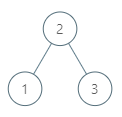

```
输入：root = [2,1,3], p = 1
输出：2
解释：这里 1 的中序后继是 2。请注意 p 和返回值都应是 TreeNode 类型。
```

**示例 2：**

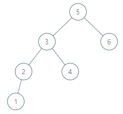

```
输入：root = [5,3,6,2,4,null,null,1], p = 6
输出：null
解释：因为给出的节点没有中序后继，所以答案就返回 null 了。
```

#### 解法1 中序dfs

二叉搜索树的中序遍历是递增的 所以搜索到该节点的 后一个就是结果

但是 需要记录当前节点状态

记给定节点及其之前的节点find为0，在找到给定节点时find置1，下一个节点find置2，之后直接返回 停止递归

```c++
class Solution {
public:
    TreeNode* inorderSuccessor(TreeNode* root, TreeNode* p) {
      TreeNode* res = nullptr;
      int find = 0;
      dfs(root, p, find, res);
      return res;
    }

    void dfs(TreeNode* node, TreeNode* target, int& find, TreeNode*& res){
      if(node == nullptr || find == 2) return;
      dfs(node->left, target, find, res);

      if(find == 1){
        find = 2;
        res = node;
      }
      if(target == node || target->val == node->val){
        find = 1;
      }
      dfs(node->right, target, find, res);
    }
};
```

#### 解法2 二叉搜索树性质

```c++
class Solution {
public:
    TreeNode* inorderSuccessor(TreeNode* root, TreeNode* p) {
      TreeNode* res = nullptr;
      int val = p->val;
      while(root){
        if(root->val > val){
          // 当root->val > val时，会走到左节点，所以走得越深越接近val
          // 保证了每次root->val都小于res->val
          res = root;
          root = root->left;
        }else{
          root = root->right;
        }
      }
      return res;
    }
};
```

### [剑指 Offer 54. 二叉搜索树的第k大节点](https://leetcode.cn/problems/er-cha-sou-suo-shu-de-di-kda-jie-dian-lcof/)

难度简单309收藏分享切换为英文接收动态反馈

给定一棵二叉搜索树，请找出其中第 `k` 大的节点的值。

#### 右中左的中序

二叉搜索树的右中左中序就是从大到小排列的了

注意的点是 计数的index应该是全局的（或者说 引用的）

```c++
class Solution {
public:
    int ans;
    int kthLargest(TreeNode* root, int k) {
      ans = 0;
      int index = 0;
      dfs(root, index, k);
      return ans;
    }

    //注意index必须是引用或者类的数据成员
    void dfs(TreeNode* node, int& index, const int& k){
      if(node == nullptr || index>k) return;
      dfs(node->right, index, k);
      if(++index == k){
        ans = node->val;
        return;
      }
      dfs(node->left, index, k);
    }
};
```

### [538. 把二叉搜索树转换为累加树](https://leetcode.cn/problems/convert-bst-to-greater-tree/)

[labuladong 题解](https://labuladong.github.io/article/?qno=538)[思路](https://leetcode.cn/problems/convert-bst-to-greater-tree/#)

难度中等729

给出二叉 **搜索** 树的根节点，该树的节点值各不相同，请你将其转换为累加树（Greater Sum Tree），使每个节点 `node` 的新值等于原树中大于或等于 `node.val` 的值之和。

提醒一下，二叉搜索树满足下列约束条件：

- 节点的左子树仅包含键 **小于** 节点键的节点。
- 节点的右子树仅包含键 **大于** 节点键的节点。
- 左右子树也必须是二叉搜索树。

**注意：**本题和 1038: https://leetcode-cn.com/problems/binary-search-tree-to-greater-sum-tree/ 相同

**示例 1：**

**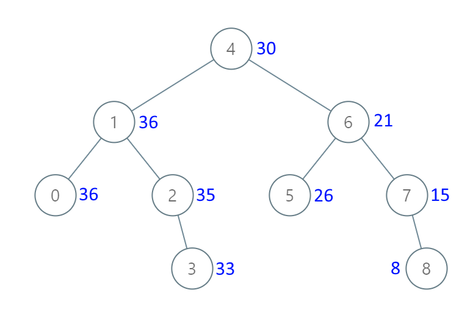**

```
输入：[4,1,6,0,2,5,7,null,null,null,3,null,null,null,8]
输出：[30,36,21,36,35,26,15,null,null,null,33,null,null,null,8]
```

#### 中序

```c++
class Solution {
public:
    int sum;
    TreeNode* convertBST(TreeNode* root) {
      sum = 0;
      dfs(root);
      return root;
    }

    void dfs(TreeNode* node){
      if(node == nullptr) return;
      dfs(node->right);
      sum+=node->val;
      node->val = sum;
      dfs(node->left);
    }
};
```


## 二叉树 后序遍历

### [543. 二叉树的直径 后序遍历的使用](https://leetcode-cn.com/problems/diameter-of-binary-tree/)

[labuladong 题解](https://labuladong.github.io/article/?qno=543)[思路](https://leetcode-cn.com/problems/diameter-of-binary-tree/#)

难度简单995

给定一棵二叉树，你需要计算它的直径长度。一棵二叉树的直径长度是任意两个结点路径长度中的最大值。这条路径可能穿过也可能不穿过根结点。

 

**示例 :**
给定二叉树

```
          1
         / \
        2   3
       / \     
      4   5    
```

返回 **3**, 它的长度是路径 [4,2,1,3] 或者 [5,2,1,3]。


```c++
class Solution {
public:
    int res;
    int diameterOfBinaryTree(TreeNode* root) {
      res = 0;
      dfs(root);
      return res;
    }
    //记录
    int dfs(TreeNode* curr){
      if(!curr) return 0;
      int l = dfs(curr->left);// 左儿子为根的子树的深度
      int r = dfs(curr->right);// 右儿子为根的子树的深度
      res = max(res,l+r); //更新结果
      return max(l,r)+1;// 返回该节点为根的子树的深度
    }
};
```

### [124. 二叉树中的最大路径和](https://leetcode-cn.com/problems/binary-tree-maximum-path-sum/)

[思路](https://leetcode-cn.com/problems/binary-tree-maximum-path-sum/#)

难度困难1533英文版讨论区

**路径** 被定义为一条从树中任意节点出发，沿父节点-子节点连接，达到任意节点的序列。同一个节点在一条路径序列中 **至多出现一次** 。该路径 **至少包含一个** 节点，且不一定经过根节点。

**路径和** 是路径中各节点值的总和。

给你一个二叉树的根节点 `root` ，返回其 **最大路径和** 。

 

**示例 1：**


```
输入：root = [1,2,3]
输出：6
解释：最优路径是 2 -> 1 -> 3 ，路径和为 2 + 1 + 3 = 6
```

**示例 2：**


```
输入：root = [-10,9,20,null,null,15,7]
输出：42
解释：最优路径是 15 -> 20 -> 7 ，路径和为 15 + 20 + 7 = 42
```

#### 思路

1. 后序遍历实现 和的累积 分别得到每个节点下的最大路径 其左右子节点的最大路径max 当前val相加即为其父节点的最大路径
2. 当前节点下的最大路径和即为左右子节点的最大路径和  + 自己的val 但不一定是全局最大
3. 更新全局的一个最大值 为 ans

```c++
class Solution {
public:
    int res = INT_MIN;
    int maxPathSum(TreeNode* root) {
      dfs(root);
      return res;
    }
	//返回当前节点下的值最大的一条路径的路径和
    int dfs(TreeNode* curr){
      if(!curr) return 0;
      // 如果子树路径和为负则应当置0表示最大路径不包含子树
      int leftMax = max(0, dfs(curr->left));
      int rightMax = max(0, dfs(curr->right));
      // 判断在该节点包含左右子树的路径和是否大于当前最大路径和
      res = max(res, leftMax+rightMax+curr->val);
      return max(leftMax, rightMax) + curr->val; 
    }
};
```

### [剑指 Offer 33. 二叉搜索树的后序遍历序列](https://leetcode.cn/problems/er-cha-sou-suo-shu-de-hou-xu-bian-li-xu-lie-lcof/)

难度中等525收藏分享切换为英文接收动态反馈

输入一个整数数组，判断该数组是不是某二叉搜索树的后序遍历结果。如果是则返回 `true`，否则返回 `false`。假设输入的数组的任意两个数字都互不相同。

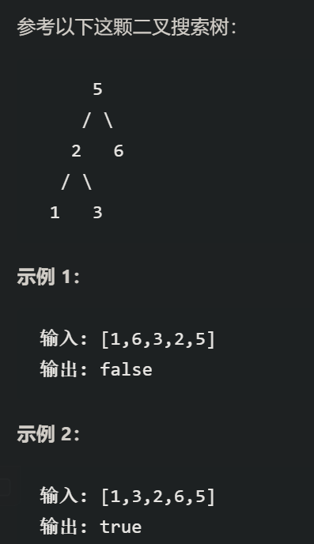

#### 代码

根据后序遍历和二叉搜索树的性质进行递归检查

```c++
class Solution {
public:
    bool verifyPostorder(vector<int>& nums) {
      if(nums.size() < 2) return 1;
      return helper(nums, 0, nums.size() - 1);
    }

    bool helper(vector<int>& nums, int left, int right){
      if(left >= right) return 1;
      int rootVal = nums[right];
      int leftIndex = left;
      //细节 leftindex每次都需要赋值 而不是在brk中赋值
      //不然可能整个数组都是left 但是没更新leftIndex
      for(int i = left; i<right; i++){
        leftIndex = i;
        if(nums[i] >= rootVal){
          leftIndex--;
          break;
        }
      }
      for(int i = leftIndex+1; i<right; i++){
        if(nums[i] < rootVal)
          return 0;
      }
      return helper(nums, left, leftIndex) && helper(nums, leftIndex+1, right-1);
    }
};
```

#### [543. 二叉树的直径](https://leetcode.cn/problems/diameter-of-binary-tree/) 英文版讨论区

[labuladong 题解](https://labuladong.github.io/article/?qno=543)[思路](https://leetcode.cn/problems/diameter-of-binary-tree/#)

难度简单1070

给定一棵二叉树，你需要计算它的直径长度。一棵二叉树的直径长度是任意两个结点路径长度中的最大值。这条路径可能穿过也可能不穿过根结点。

 

**示例 :**
给定二叉树

```
          1
         / \
        2   3
       / \     
      4   5    
```

返回 **3**, 它的长度是路径 [4,2,1,3] 或者 [5,2,1,3]。

#### 简单 但粗暴垃圾

```c++
class Solution {
public:
    int ans = 0;
    //过当前节点的最大直径的 是当前节点的左子树最大深度 + 右子树最大深度
    int diameterOfBinaryTree(TreeNode* root) {
      dfs(root);
      return ans;
    }
    
    void dfs(TreeNode* node){
      if(node == nullptr) return;
      ans = max(ans, maxDepth(node->left) + maxDepth(node->right));
      dfs(node->left);
      dfs(node->right);
    }

    int maxDepth(TreeNode* node){
      if(node == nullptr) return 0;
      return max(maxDepth(node->left), maxDepth(node->right))+1;
    }
};
```

#### 后序

```c++
class Solution {
public:
    int res;
    int diameterOfBinaryTree(TreeNode* root) {
      res = 0;
      dfs(root);
      return res;
    }
    int dfs(TreeNode* curr){
      if(!curr) return 0;
      int l = dfs(curr->left);
      int r = dfs(curr->right);
      res = max(res,l+r); 
      return max(l,r)+1;
    }
};
```


## 二叉树抽象递归

### [剑指 Offer 27. 二叉树的镜像](https://leetcode.cn/problems/er-cha-shu-de-jing-xiang-lcof/)

难度简单263收藏分享切换为英文接收动态反馈

请完成一个函数，输入一个二叉树，该函数输出它的镜像。

**示例 1：**

```
输入：root = [4,2,7,1,3,6,9]
输出：[4,7,2,9,6,3,1]
```

```c++
class Solution {
public:
    TreeNode* mirrorTree(TreeNode* root) {
      if(root == nullptr) return root;
      TreeNode* left = mirrorTree(root->left);
      TreeNode* right = mirrorTree(root->right);
      root->left = right;
      root->right = left;
      return root;
    }
};
```

### [剑指 Offer 28. 对称的二叉树](https://leetcode.cn/problems/dui-cheng-de-er-cha-shu-lcof/)

难度简单349收藏分享切换为英文接收动态反馈

请实现一个函数，用来判断一棵二叉树是不是对称的。如果一棵二叉树和它的镜像一样，那么它是对称的。

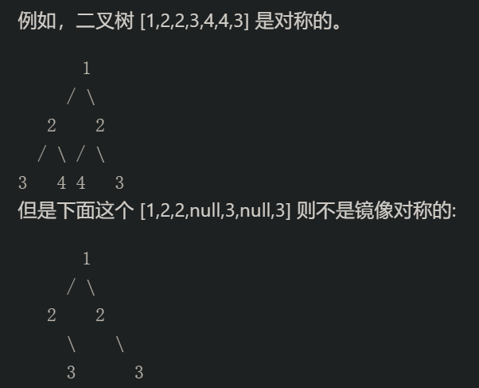

#### helper递归

```c++
class Solution {
public:
    bool isSymmetric(TreeNode* root) {
      if(root == nullptr) return 1;
      return helper(root->left, root->right);
    }
    bool helper(TreeNode* left, TreeNode* right){
      if(left == nullptr && right == nullptr) return 1;
      if(left == nullptr || right == nullptr) return 0;
      if(left->val != right->val) return 0;
      return helper(left->left, right->right) && helper(left->right, right->left);
    }
};
```

### [剑指 Offer 26. 树的子结构](https://leetcode.cn/problems/shu-de-zi-jie-gou-lcof/)

难度中等567收藏分享切换为英文接收动态反馈

输入两棵二叉树A和B，判断B是不是A的子结构。(约定空树不是任意一个树的子结构)

B是A的子结构， 即 A中有出现和B相同的结构和节点值。

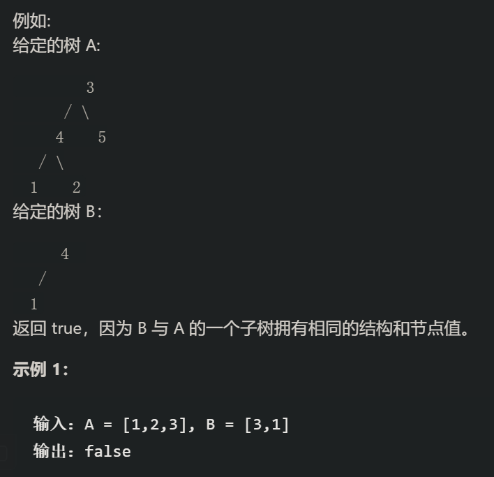

#### 大佬解法

```c++
class Solution {
public:
    bool hasSubStructure(TreeNode*A, TreeNode*B){
      if (!B)
        //递归结束条件1：递归到B为空了，肯定是A的子结构
        return true;     
      if (!A || A->val != B->val)  
        //递归结束条件2：B的一个节点A的对应位置没有 / A,B对应位置节点值不同，此时必然不可是子构
        return false;
      //返回值：继续在对应位置递归判断
      return hasSubStructure(A->left, B->left) && hasSubStructure(A->right, B->right); 
    }
    bool isSubStructure(TreeNode* A, TreeNode* B) {
      if (!A || !B)
        //特殊判断
        return false;  
      // 根节点相同的话直接进入比较，根节点不相同看B是不是A的左/右子树的子结构
      return hasSubStructure(A, B) || isSubStructure(A->left, B) || isSubStructure(A->right, B);
    }
};

```

#### 我的解 好理解 耗时稍高

```c++
class Solution {
public:
    bool res;
    bool isSubStructure(TreeNode* A, TreeNode* B) {
      if(B == nullptr) return 0;
      res = 0;
      dfs(A, B);
      return res;
    }
    //前序比较每个节点
    void dfs(TreeNode* node, TreeNode* B){
      if(res) return;
      if(node == nullptr) return;
      if(helper(node, B)){
        res = 1;
        return;
      }
      dfs(node->left, B);
      dfs(node->right, B);
    }
    //节点比较
    bool helper(TreeNode* A, TreeNode* B){
      if(A == nullptr && B == nullptr)
        return 1;
      if(A != nullptr && B == nullptr)
        return 1;
      if(A == nullptr && B != nullptr) 
        return 0;
      if(A->val != B->val)
        return 0;
      return helper(A->left, B->left) && helper(A->right, B->right);
    }
};
```

### [剑指 Offer 55 - II. 平衡二叉树](https://leetcode.cn/problems/ping-heng-er-cha-shu-lcof/)

[思路](https://leetcode.cn/problems/balanced-binary-tree/#)

难度简单1031收藏分享切换为英文接收动态反馈

给定一个二叉树，判断它是否是高度平衡的二叉树。

本题中，一棵高度平衡二叉树定义为：

> 一个二叉树*每个节点* 的左右两个子树的高度差的绝对值不超过 1 。

 

**示例 1：**


```
输入：root = [3,9,20,null,null,15,7]
输出：true
```

**示例 2：**


```
输入：root = [1,2,2,3,3,null,null,4,4]
输出：false
```

#### 我的解法

```c++
class Solution {
public:
    bool isBalanced(TreeNode* root) {
      if(root == nullptr) return 1;
      int dep1 = getDepth(root->left);
      int dep2 = getDepth(root->right);
      if(abs(dep1 - dep2)>1) return 0;
      return isBalanced(root->left) && isBalanced(root->right);
    }
private:
    int maxDepth;
    int getDepth(TreeNode* node){
      maxDepth = 0;
      dfs(node, 0);
      return maxDepth;
    }

    void dfs(TreeNode* node, int depth){
      if(node == nullptr) return;
      depth++;
      maxDepth = max(depth, maxDepth);
      dfs(node->left, depth);
      dfs(node->right, depth);
      depth--;
    }
};
```

#### 官方 更抽象的

```c++
class Solution {
public:
    bool isBalanced(TreeNode* root) {
      if(root == nullptr) return 1;
      int l = maxDepth(root->left);
      int r = maxDepth(root->right);
      if(abs(l-r)>1){
        return 0;
      }
      return isBalanced(root->left)&& isBalanced(root->right);
    }
		//二叉树深度的简单解法
    int maxDepth(TreeNode* node){
      if(node == nullptr) return 0;
      return max(maxDepth(node->left), maxDepth(node->right)) + 1;
    }
};
```

### [655. 输出二叉树](https://leetcode.cn/problems/print-binary-tree/)

难度中等126

在一个 m*n 的二维字符串数组中输出二叉树，并遵守以下规则：

1. 行数 `m` 应当等于给定二叉树的高度。
2. 列数 `n` 应当总是奇数。
3. 根节点的值（以字符串格式给出）应当放在可放置的第一行正中间。根节点所在的行与列会将剩余空间划分为两部分（**左下部分和右下部分**）。你应该将左子树输出在左下部分，右子树输出在右下部分。左下和右下部分应当有相同的大小。即使一个子树为空而另一个非空，你不需要为空的子树输出任何东西，但仍需要为另一个子树留出足够的空间。然而，如果两个子树都为空则不需要为它们留出任何空间。
4. 每个未使用的空间应包含一个空的字符串`""`。
5. 使用相同的规则输出子树。

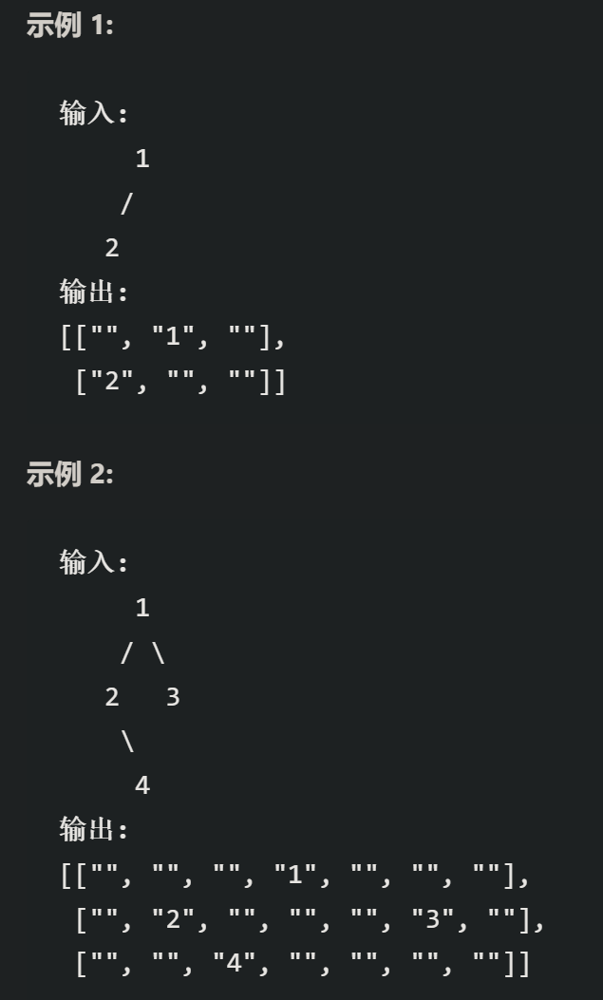

#### dfs + 分治

```c++
//DFS+分治
class Solution {
public:
    //DFS求树的高度
    int maxDepth(TreeNode* root){
        if(!root) return 0;
        return 1+max(maxDepth(root->left), maxDepth(root->right));
    }
    //分治
    //low为每一行的边界下限,high为每一行的边界上限，row为行的索引
    void print(TreeNode* root, int low, int high, int row, vector<vector<string>> &res){
        if(!root) return;
        int mid = (low+high)/2; //中间元素的索引
        res[row][mid] = to_string(root->val); //将int型转为字符串，输出在mid位置
        print(root->left, low, mid-1, row+1, res); //左孩子递归输出
        print(root->right, mid+1, high, row+1, res); //右孩子递归输出
    }

    vector<vector<string>> printTree(TreeNode* root) {
        int high = maxDepth(root); //获取树的高度
        int width = pow(2,high)-1; //宽度
        vector<vector<string>> res(high, vector<string>(width,"")); //保存输出结果,初始化为high个,并且长度为width个空字符串""
        print(root, 0, width-1, 0, res); //传入width-1是因为数组里面索引最大为width-1
        return res;
    }
};
```


## 层序遍历

### [919. 完全二叉树插入器](https://leetcode-cn.com/problems/complete-binary-tree-inserter/)

[思路](https://leetcode-cn.com/problems/complete-binary-tree-inserter/#)

难度中等66

**完全二叉树** 是每一层（除最后一层外）都是完全填充（即，节点数达到最大）的，并且所有的节点都尽可能地集中在左侧。

设计一种算法，将一个新节点插入到一个完整的二叉树中，并在插入后保持其完整。

实现 `CBTInserter` 类:

- `CBTInserter(TreeNode root)` 使用头节点为 `root` 的给定树初始化该数据结构；
- `CBTInserter.insert(int v)` 向树中插入一个值为 `Node.val == val`的新节点 `TreeNode`。使树保持完全二叉树的状态，**并返回插入节点** `TreeNode` **的父节点的值**；
- `CBTInserter.get_root()` 将返回树的头节点。


**示例 1：**

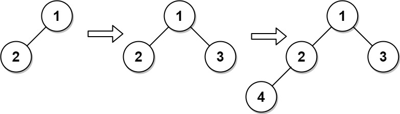

```
输入
["CBTInserter", "insert", "insert", "get_root"]
[[[1, 2]], [3], [4], []]
输出
[null, 1, 2, [1, 2, 3, 4]]

解释
CBTInserter cBTInserter = new CBTInserter([1, 2]);
cBTInserter.insert(3);  // 返回 1
cBTInserter.insert(4);  // 返回 2
cBTInserter.get_root(); // 返回 [1, 2, 3, 4]
```

#### 方法

使用层序遍历 从左右子树不满的节点开始存 后续在push的子节点就是左右子树都不存在的了

```c++
class CBTInserter {
public:
    TreeNode*mRoot;
    queue<TreeNode*>que;
    TreeNode*cur;
    CBTInserter(TreeNode* root) {
        mRoot=root;
        que.push(root);
        while(que.empty()==false){
            TreeNode*node=que.front();que.pop();
            if(node->left)que.push(node->left);
            if(node->right)que.push(node->right);
            if(node->left==nullptr||node->right==nullptr){
                cur=node; //存储当前头节点 后面插入需要插入到他上
                break;
            }
        }
    }
    int insert(int val) {
        if(cur->left==nullptr){
            cur->left=new TreeNode(val);
            que.push(cur->left);
        }else if(cur->right==nullptr){
            cur->right=new TreeNode(val);
            que.push(cur->right);
        }
        int ans=cur->val;
        //如果当前节点是满的 那么更新当前节点为队列的后一个
        if(cur->right){ 
            cur=que.front();que.pop();
        }
        return ans;
    }
    TreeNode* get_root() {
        return mRoot;
    }
};
```


### [662. 二叉树最大宽度](https://leetcode.cn/problems/maximum-width-of-binary-tree/)

[思路](https://leetcode.cn/problems/maximum-width-of-binary-tree/#)

难度中等370

给定一个二叉树，编写一个函数来获取这个树的最大宽度。树的宽度是所有层中的最大宽度。这个二叉树与**满二叉树（full binary tree）**结构相同，但一些节点为空。

每一层的宽度被定义为两个端点（该层最左和最右的非空节点，两端点间的`null`节点也计入长度）之间的长度。

#### 解法 层序遍历

用unordered_map记录每个节点在这一行的位置

从0开始 当前节点左节点就是当前位置*2  右节点就是 *2+1

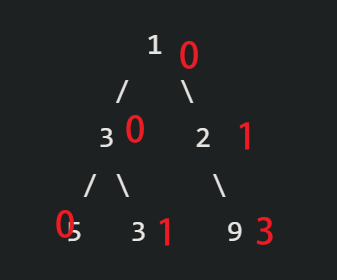

````c++
class Solution {
public:
    int widthOfBinaryTree(TreeNode* root) {
        unordered_map<TreeNode*, long> umap;
        if(root == nullptr){
            return 0;
        }
        queue<TreeNode*> q;
        umap[root] = 0;//利用散列表umap来存储每个节点对应的坐标pos
        q.push(root);
        //相对坐标: parent.pos*2(left); parent.pos*2+1(right)
        long maxSize = 0;
        while(!q.empty()){
            maxSize = max(maxSize, umap[q.back()] - umap[q.front()] + 1);
            int size = q.size();
            //cout << size<<" ";
            long offset = umap[q.front()];
            //cout<<offset<<" ";
            //遍历该层的所有的node
            while(size--){
                TreeNode* n = q.front();
                q.pop();//将上层残余的Node全部pop出去
                umap[n] -= offset;
                
                if(n->left){
                    umap[n->left] = umap[n]*2;
                    q.push(n->left);
                }
                if(n->right){
                    umap[n->right] = umap[n]*2 + 1;
                    q.push(n->right);
                }
            }
        }
        return maxSize;
    }
};
````

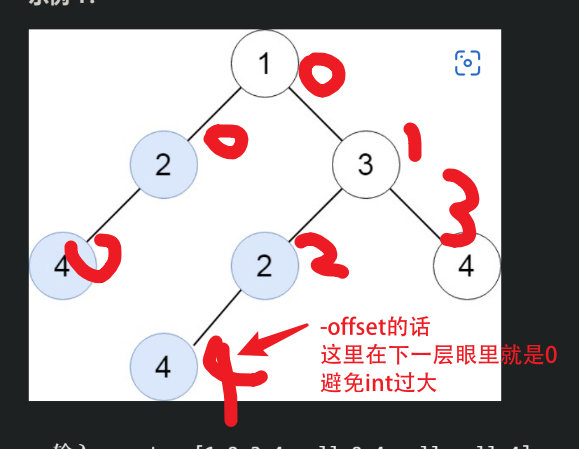

## 二叉搜索树

### [剑指 Offer II 053. 二叉搜索树中的中序后继](https://leetcode.cn/problems/P5rCT8/)

难度中等40

给定一棵二叉搜索树和其中的一个节点 `p` ，找到该节点在树中的中序后继。如果节点没有中序后继，请返回 `null` 。

节点 `p` 的后继是值比 `p.val` 大的节点中键值最小的节点，即按中序遍历的顺序节点 `p` 的下一个节点。

 

**示例 1：**


```
输入：root = [2,1,3], p = 1
输出：2
解释：这里 1 的中序后继是 2。请注意 p 和返回值都应是 TreeNode 类型。
```

**示例 2：**


```
输入：root = [5,3,6,2,4,null,null,1], p = 6
输出：null
解释：因为给出的节点没有中序后继，所以答案就返回 null 了。
```

#### 解法 二叉树的性质

```c++
class Solution {
public:
    TreeNode* inorderSuccessor(TreeNode* root, TreeNode* p) {
      TreeNode* res = nullptr;
      int val = p->val;
      while(root){
        if(root->val > val){
          // 当root->val > val时，会走到左节点，所以走得越深越接近val
          // 保证了每次root->val都小于res->val
          res = root;
          root = root->left;
        }else
          root = root->right;
      }
      return res;
    }
};
```

## 完全二叉树

### [958. 二叉树的完全性检验](https://leetcode.cn/problems/check-completeness-of-a-binary-tree/)

[思路](https://leetcode.cn/problems/check-completeness-of-a-binary-tree/#)

难度中等215

给定一个二叉树的 `root` ，确定它是否是一个 *完全二叉树* 。

在一个 **[完全二叉树](https://baike.baidu.com/item/完全二叉树/7773232?fr=aladdin)** 中，除了最后一个关卡外，所有关卡都是完全被填满的，并且最后一个关卡中的所有节点都是尽可能靠左的。它可以包含 `1` 到 `2h` 节点之间的最后一级 `h` 。

 

**示例 1：**

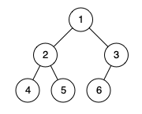

```
输入：root = [1,2,3,4,5,6]
输出：true
解释：最后一层前的每一层都是满的（即，结点值为 {1} 和 {2,3} 的两层），且最后一层中的所有结点（{4,5,6}）都尽可能地向左。
```

**示例 2：**

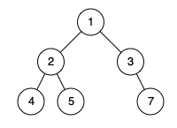

```
输入：root = [1,2,3,4,5,null,7]
输出：false
解释：值为 7 的结点没有尽可能靠向左侧。
```

#### 修修补补

> 哎 现场手撕能不能调出来呢?

```c++
class Solution {
public:
    bool isCompleteTree(TreeNode* root) {
      queue<TreeNode*> que;
      que.push(root);
      int index = 0;
      bool flag = 0;
      while(!que.empty()){
        int n = que.size();
        int nodeNum = 1<<index++;
        if(n != nodeNum){
          flag = 1; //最后一行
        }
        bool pre = 1;  //pre记录同一层之前有没有节点
        while(n--){
          TreeNode* node = que.front();
          que.pop();
          if(node->left) {
            if(pre){
              que.push(node->left);
            }else return 0;
          }else pre = 0;

          if(node->right) {
            if(pre){
              que.push(node->right);
            }else return 0;
          }else pre = 0;
        }
        //是也不是最后一行 说明错误
        if(flag && !que.empty()) return 0;
      }
      return 1;
    }
};
```

### [222. 完全二叉树的节点个数](https://leetcode.cn/problems/count-complete-tree-nodes/)

[labuladong 题解](https://labuladong.github.io/article/?qno=222)[思路](https://leetcode.cn/problems/count-complete-tree-nodes/#)

难度中等748

给你一棵 **完全二叉树** 的根节点 `root` ，求出该树的节点个数。

[完全二叉树](https://baike.baidu.com/item/完全二叉树/7773232?fr=aladdin) 的定义如下：在完全二叉树中，除了最底层节点可能没填满外，其余每层节点数都达到最大值，并且最下面一层的节点都集中在该层最左边的若干位置。若最底层为第 `h` 层，则该层包含 `1~ 2h` 个节点。

#### 最优解: 完全用到题目的信息

```c++
//最优解
class Solution {
public:
    //用到题目所给的信息
    int countNodes(TreeNode* root) {
      if(root == nullptr) return 0;
      TreeNode* l = root;
      TreeNode* r = root;
      int h1 = 0, h2 = 0;
      while(l){
        l = l->left;
        h1++;
      }
      while(r){
        r = r->right;
        h2++;
      }
      // 如果左右子树的高度相同，则是一棵满二叉树
      if(h1 == h2)
        return pow(2, h1)-1;
      // 如果左右高度不同，则按照普通二叉树的逻辑计算
      return countNodes(root->left) + countNodes(root->right)+1;
    }
};
```


## 公共祖先

### [剑指 Offer 68 - I. 二叉搜索树的最近公共祖先](https://leetcode.cn/problems/er-cha-sou-suo-shu-de-zui-jin-gong-gong-zu-xian-lcof/)

难度简单232收藏分享切换为英文接收动态反馈

给定一个二叉搜索树, 找到该树中两个指定节点的最近公共祖先。

[百度百科](https://baike.baidu.com/item/最近公共祖先/8918834?fr=aladdin)中最近公共祖先的定义为：“对于有根树 T 的两个结点 p、q，最近公共祖先表示为一个结点 x，满足 x 是 p、q 的祖先且 x 的深度尽可能大（**一个节点也可以是它自己的祖先**）。”

例如，给定如下二叉搜索树: root = [6,2,8,0,4,7,9,null,null,3,5]


**示例 1:**

```
输入: root = [6,2,8,0,4,7,9,null,null,3,5], p = 2, q = 8
输出: 6 
解释: 节点 2 和节点 8 的最近公共祖先是 6。
```

#### 利用二叉搜索树的性质 分叉

```c++
class Solution {
public:
    TreeNode* lowestCommonAncestor(TreeNode* root, TreeNode* p, TreeNode* q) {
      TreeNode* ancestor = root;
      while(1){
        if(ancestor->val<p->val && ancestor->val<q->val){
          ancestor = ancestor->right;
        }else if(ancestor->val>p->val && ancestor->val>q->val){
          ancestor = ancestor->left;
        }else
            break;
      }
      return ancestor;
    }

    TreeNode* lowestCommonAncestor(TreeNode* root, TreeNode* p, TreeNode* q) {
      if(root == nullptr) return nullptr;
      if(root->val>p->val && root->val>q->val)
          return lowestCommonAncestor(root->left, p, q);
      if(root->val<p->val && root->val<q->val)
          return lowestCommonAncestor(root->right, p, q);
      return root;
    }
};
```

### [剑指 Offer 68 - II. 二叉树的最近公共祖先](https://leetcode.cn/problems/er-cha-shu-de-zui-jin-gong-gong-zu-xian-lcof/)

难度简单448收藏分享切换为英文接收动态反馈

给定一个二叉树, 找到该树中两个指定节点的最近公共祖先。

[百度百科](https://baike.baidu.com/item/最近公共祖先/8918834?fr=aladdin)中最近公共祖先的定义为：“对于有根树 T 的两个结点 p、q，最近公共祖先表示为一个结点 x，满足 x 是 p、q 的祖先且 x 的深度尽可能大（**一个节点也可以是它自己的祖先**）。”

例如，给定如下二叉树: root = [3,5,1,6,2,0,8,null,null,7,4]


 

**示例 1:**

```
输入: root = [3,5,1,6,2,0,8,null,null,7,4], p = 5, q = 1
输出: 3
解释: 节点 5 和节点 1 的最近公共祖先是节点 3。
```

#### 通用解法

在当前节点下查找是否存在 两个节点

1. p q 一个在左子树 一个在右子树 那么当前节点即是最近公共祖先
2. p q 都在左子树 
3. p q 都在右子树

```c++
class Solution {
public:
    TreeNode* lowestCommonAncestor(TreeNode* root, TreeNode* p, TreeNode* q) {
      return find(root, p, q);
    }

    TreeNode* find(TreeNode* root, TreeNode* p, TreeNode* q){
      if(root == nullptr) return nullptr;
      //找到目标
      if(root == p || root == q)
        return root;
      TreeNode* left = find(root->left, p, q);
      TreeNode* right = find(root->right, p, q);
      // p q 一个在左，一个在右
      if(left != nullptr && right != nullptr)
        return root;
      return left != nullptr ? left : right;
    }
};
```

### 1676 题「二叉树的最近公共祖先 IV」

依然给你输入一棵不含重复值的二叉树，但这次不是给你输入`p`和`q`两个节点了，而是给你输入一个包含若干节点的列表`nodes`（<u>这些节点都存在于二叉树中</u>），让你算这些节点的最近公共祖先。

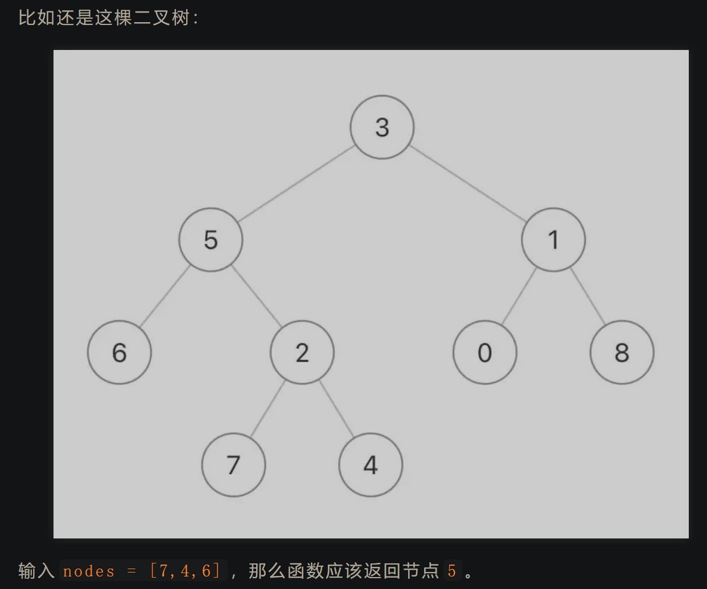

#### 代码

和两个节点的公共祖先是一样的 只是存在判定需要用到unordered_set;

```c++
class Solution {
public:
    TreeNode* lowestCommonAncestor(TreeNode* root, vector<TreeNode*> &nodes) {
      unordered_set<TreeNode*> sett;
      for(auto& node: nodes)
        sett.insert(node);
      return find(root, nodes);
    }

    TreeNode* find(TreeNode* root, unordered_set<TreeNode*>& nodes){
      if(root == nullptr) return nullptr;
      //找到目标
      if(nodes.count(root)) //主要是这里
        return root;
      TreeNode* left = find(root->left, nodes);
      TreeNode* right = find(root->right, nodes);
      // p q 一个在左，一个在右
      if(left != nullptr && right != nullptr)
        return root;
      return left != nullptr ? left : right;
    }
};
```

### 1644 题「二叉树的最近公共祖先 II」

给你输入一棵**不含重复值**的二叉树的，以及两个节点`p`和`q`，如果`p`或`q`不存在于树中，则返回空指针，否则的话返回`p`和`q`的最近公共祖先节点。

```c++
class Solution {
public:
  	bool findP, findQ;
    TreeNode* lowestCommonAncestor(TreeNode* root, TreeNode* p, TreeNode* q) {
      findP = 0;
      findQ = 0;
      TreeNode* res = find(root, p, q);
      if(!findP || !findQ)
        return nullptr;
      return res;
    }

    TreeNode* find(TreeNode* root, TreeNode* p, TreeNode* q){
      if(root == nullptr) return nullptr;

      TreeNode* left = find(root->left, p, q);
      TreeNode* right = find(root->right, p, q);
      // p q 一个在左，一个在右
      if(left != nullptr && right != nullptr)
        return root;
      //找到目标 调整到后序的位置 这样总会遍历整个树
      if(root == p || root == q){
        if(root == p) findP = 1;
        if(root == q) findQ = 1;
      }
      return left != nullptr ? left : right;
    }
};
```

### 1650 题「二叉树的最近公共祖先 III」

```c++
struct Node {
    int val;
    Node* left;
    Node* right;
    Node* parent;
};
```

给你输入一棵存在于二叉树中的两个节点`p`和`q`，请你返回它们的最近公共祖先，函数签名如下：

```c++
Node* lowestCommonAncestor(Node* p, Node* q);
```

**这道题其实不是公共祖先的问题，而是单链表相交的问题**，你把`parent`指针想象成单链表的`next`指针，题目就变成了：

给你输入两个单链表的头结点`p`和`q`，这两个单链表必然会相交，请你返回相交点。

```c++
Node* lowestCommonAncestor(Node* p, Node* q) {
    // 施展链表双指针技巧
    Node* a = p, *b = q;
    while (a != b) {
        // a 走一步，如果走到根节点，转到 q 节点
        if (a == null) a = q;
        else	a = a.parent;
        // b 走一步，如果走到根节点，转到 p 节点
        if (b == null) b = p;
        else	b = b->parent;
    }
    return a;
}
```


## 枚举构建二叉树

### [894. 所有可能的满二叉树](https://leetcode-cn.com/problems/all-possible-full-binary-trees/)

[思路](https://leetcode-cn.com/problems/all-possible-full-binary-trees/#)

难度中等255

*满二叉树*是一类二叉树，其中每个结点恰好有 0 或 2 个子结点。

返回包含 `N` 个结点的所有可能满二叉树的列表。 答案的每个元素都是一个可能树的根结点。

答案中每个树的每个`结点`都**必须**有 `node.val=0`。

你可以按任何顺序返回树的最终列表。

 

**示例：**

```
输入：7
输出：[[0,0,0,null,null,0,0,null,null,0,0],[0,0,0,null,null,0,0,0,0],[0,0,0,0,0,0,0],[0,0,0,0,0,null,null,null,null,0,0],[0,0,0,0,0,null,null,0,0]]
解释：
```

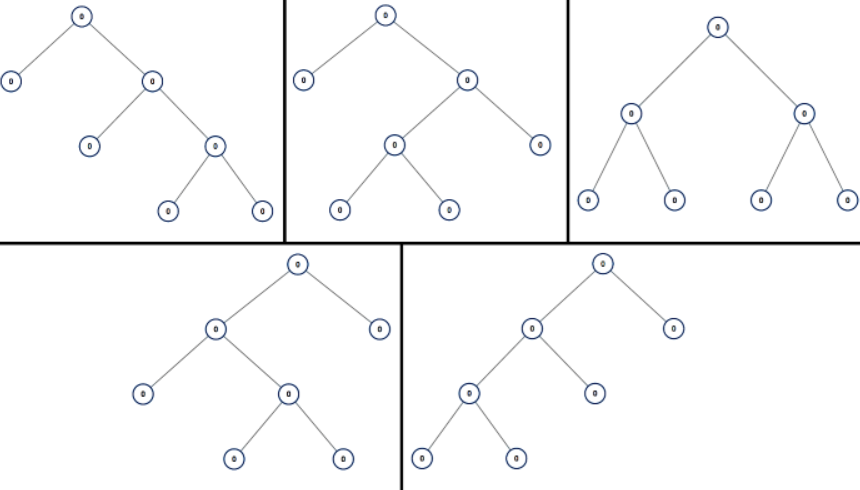

#### 思路

首先`偶数是不能构成满二叉树`的。 思路是把总node数分别左边，根，右边进行递归，如7个node可以分成1,1,5；3,1,5；5,1,1（左,根,右）。 5个node又可以分为1,1,3和3,1,1。 3个node又可以分为1,1,1。 1个node直接返回。

#### 代码

```c++
class Solution {
public:
    unordered_map<int, vector<TreeNode*>> memo;
    vector<TreeNode*> allPossibleFBT(int n) {
        vector<TreeNode*> ans;
        if(memo.count(n)) return memo[n];
        if(n == 1) ans.push_back(new TreeNode(0));
        else{
            for(int i = 1; i<n; i+=2){
                // 获得所有可行的左子树集合
                vector<TreeNode*> left = allPossibleFBT(i);
                // 获得所有可行的右子树集合
                vector<TreeNode*> right = allPossibleFBT(n - i - 1);
                // 相当于 左右子树随机组合 从而得到多种情况 
                // 从左子树集合中选出一棵左子树，从右子树集合中选出一棵右子树，拼接到根节点上
                for(auto l : left){
                    for(auto r : right){
                        TreeNode* root = new TreeNode(0);
                        root->left = l;
                        root->right = r;
                        ans.push_back(root);
                    }
                }
            }
        }
        memo[n] = ans;
        //cout<<ans.size()<<" ";
        return ans;
    }
};
```

### [96. 不同的二叉搜索树](https://leetcode-cn.com/problems/unique-binary-search-trees/)

[labuladong 题解](https://labuladong.github.io/article/?qno=96)[思路](https://leetcode-cn.com/problems/unique-binary-search-trees/#)

难度中等1703

给你一个整数 `n` ，求恰由 `n` 个节点组成且节点值从 `1` 到 `n` 互不相同的 **二叉搜索树** 有多少种？返回满足题意的二叉搜索树的种数。

 

**示例 1：**

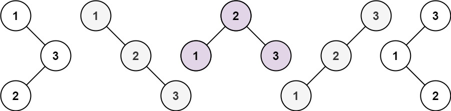

```
输入：n = 3
输出：5
```

#### 思路

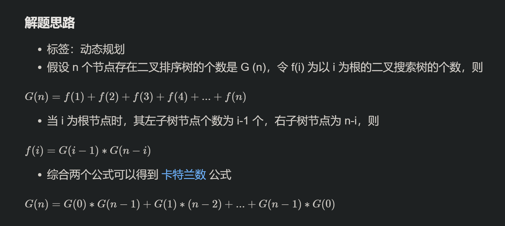

#### 代码

```c++
class Solution {
public:
    int numTrees(int n) {
      vector<int> dp(n+1);
      dp[0] = 1;
      for(int i = 1; i<=n; i++){
        for(int j = 1; j<=i; j++)
          dp[i]+=dp[j-1]*dp[i-j];
      }
      return dp[n];
    }
};
```


### [95. 不同的二叉搜索树 II](https://leetcode-cn.com/problems/unique-binary-search-trees-ii/)

[labuladong 题解](https://labuladong.github.io/article/?qno=95)[思路](https://leetcode-cn.com/problems/unique-binary-search-trees-ii/#)

难度中等1187

给你一个整数 `n` ，请你生成并返回所有由 `n` 个节点组成且节点值从 `1` 到 `n` 互不相同的不同 **二叉搜索树** 。可以按 **任意顺序** 返回答案。

 

**示例 1：**


```
输入：n = 3
输出：[[1,null,2,null,3],[1,null,3,2],[2,1,3],[3,1,null,null,2],[3,2,null,1]]
```

#### 思路

对于连续整数序列`[left, right]`中的一点`i`，若要生成以`i`为根节点的BST，则有如下规律：

- `i`左边的序列可以作为左子树结点，且左儿子可能有多个，所以有`vector<TreeNode *> left_nodes = generate(left, i - 1);`；
- `i`右边的序列可以作为右子树结点，同上所以有`vector<TreeNode *> right_nodes = generate(i + 1, right);`；
- 产生的以当前`i`为根结点的BST（子）树有`left_nodes.size() * right_nodes.size()`个，遍历每种情况，即可生成以`i`为根节点的BST序列；
- 然后以`for`循环使得`[left, right]`中每个结点都能生成子树序列。

#### 代码

```c++
class Solution {
public:
    vector<TreeNode*> generateTrees(int start, int end) {
        if (start > end) {
            return { nullptr };
        }
        vector<TreeNode*> allTrees;
        // 枚举可行根节点
        for (int i = start; i <= end; i++) {
            // 获得所有可行的左子树集合
            vector<TreeNode*> leftTrees = generateTrees(start, i - 1);

            // 获得所有可行的右子树集合
            vector<TreeNode*> rightTrees = generateTrees(i + 1, end);

            // 从左子树集合中选出一棵左子树，从右子树集合中选出一棵右子树，拼接到根节点上
            for (auto& left : leftTrees) {
                for (auto& right : rightTrees) {
                    TreeNode* currTree = new TreeNode(i);
                    currTree->left = left;
                    currTree->right = right;
                    allTrees.emplace_back(currTree);
                }
            }
        }
        return allTrees;
    }

    vector<TreeNode*> generateTrees(int n) {
        if (!n) {
            return {};
        }
        return generateTrees(1, n);
    }
};
```


## 从遍历数据重建二叉树

- 重建方式 递归

- 三种遍历的数组分布

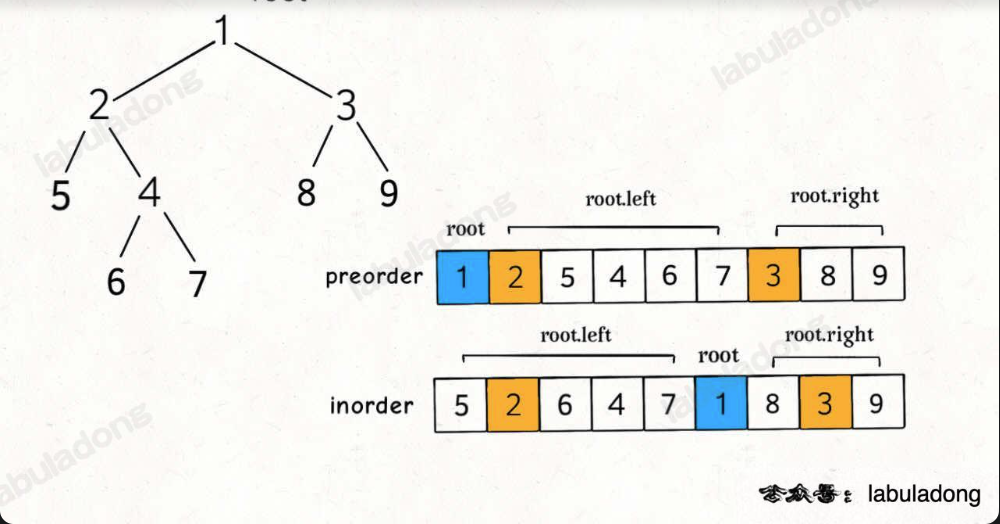

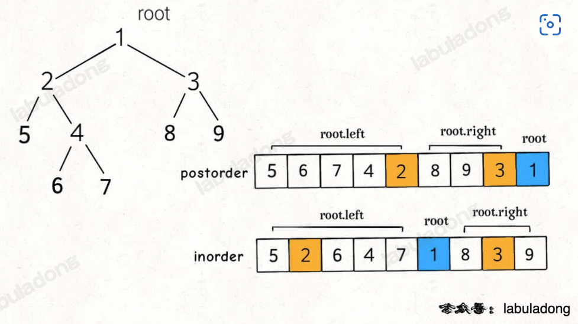

### [105. 从前序与中序遍历序列构造二叉树](https://leetcode-cn.com/problems/construct-binary-tree-from-preorder-and-inorder-traversal/)

```c++
class Solution {
public:
  	// 又臭又长的就 不看了
    // TreeNode* buildTree(vector<int>& preorder, vector<int>& inorder) {
    //   if(preorder.size() == 0) return nullptr;
    //   int rootVal = preorder[0];
    //   int inorder_rootPos = find(inorder.begin(), inorder.end(), rootVal) - inorder.begin();

    //   //前序左右子树
    //   vector<int> preorderL = vector<int>(preorder.begin()+1, preorder.begin()+1+inorder_rootPos);
    //   vector<int> preorderR =vector<int>(preorder.begin()+1+inorder_rootPos, preorder.end());
    //   //中序左右子树
    //   vector<int> inorderL = vector<int>(inorder.begin(), inorder.begin()+inorder_rootPos);
    //   vector<int> inorderR = vector<int>(inorder.begin() + inorder_rootPos + 1, inorder.end());
    //   //cout<<inorder_rootPos;

    //   TreeNode* root = new TreeNode(rootVal);
    //   root->left = buildTree(preorderL, inorderL);
    //   root->right = buildTree(preorderR, inorderR);
      
    //   return root;
    // }

    TreeNode* buildTree(vector<int>& preorder, vector<int>& inorder) {
      return build(preorder, 0 ,preorder.size()-1, inorder, 0, inorder.size()-1);
    }

    TreeNode* build(vector<int>& preorder, int preS, int preE, vector<int>& inorder, int inS, int inE){
      if(preS>preE) return nullptr;
      int rootVal = preorder[preS];
      int index;
      for(int i = inS; i<=inE; i++){   //注意这里是小于等于
        if(inorder[i] == rootVal){
          index = i;
          break;
        }
      }
      int leftSize = index - inS;
      TreeNode* root = new TreeNode(rootVal);
      root->left = build(preorder,preS + 1, preS + leftSize, inorder, inS, index-1);
      root->right = build(preorder, preS + 1 + leftSize, preE, inorder, index+ 1, inE);
      return root;
    }
};

//改进 用哈希记录val2index 快速查找对应的下标
class Solution {
public:
    unordered_map<int, int> val2index;
    TreeNode* buildTree(vector<int>& preorder, vector<int>& inorder) {
      for(int i = 0; i<inorder.size(); i++){
        val2index[inorder[i]] = i;
      }
      return build(preorder, 0, preorder.size()-1, inorder, 0, inorder.size()-1);
    }

    TreeNode* build(vector<int>& preorder, int preL, int preR, vector<int>& inorder, int inL, int inR){
      if(preL>preR || inL>inR)
        return nullptr;
      int rootVal = preorder[preL];
      int leftSize = val2index[rootVal] - inL;
      TreeNode* root = new TreeNode(rootVal);
      root->left = build(preorder, preL+1, preL+leftSize, inorder, inL, inL+leftSize-1);
      root->right = build(preorder, preL+leftSize+1, preR, inorder, inL +leftSize+1, inR);
      return root;
    }
};
```

### [106. 从中序与后序遍历序列构造二叉树](https://leetcode-cn.com/problems/construct-binary-tree-from-inorder-and-postorder-traversal/)

```c++
class Solution {
public:
    TreeNode* buildTree(vector<int>& inorder, vector<int>& postorder) {
      return build(inorder, 0, inorder.size()-1, postorder, 0, postorder.size()-1);
    }

    TreeNode* build(vector<int>& inorder, int inS, int inE, vector<int>& postorder, int posS, int posE){
      if(inS>inE) return nullptr;
      int rootVal = postorder[posE];
      int index = 0;
      for(int i = inS; i<=inE; i++){  //注意这里是<= 需要全部遍历
        if(inorder[i] == rootVal){
          index = i;
          break;
        }
      }
      int leftSize = index - inS;
      TreeNode* root = new TreeNode(rootVal);
      root->left = build(inorder, inS, index-1, postorder, posS, posS + leftSize-1);
      root->right = build(inorder, index+1, inE, postorder, posS + leftSize, posE-1);
      return root;
    }
};
```

### [889. 根据前序和后序遍历构造二叉树](https://leetcode-cn.com/problems/construct-binary-tree-from-preorder-and-postorder-traversal/)

```c++
/**
 * Definition for a binary tree node.
 * struct TreeNode {
 *     int val;
 *     TreeNode *left;
 *     TreeNode *right;
 *     TreeNode() : val(0), left(nullptr), right(nullptr) {}
 *     TreeNode(int x) : val(x), left(nullptr), right(nullptr) {}
 *     TreeNode(int x, TreeNode *left, TreeNode *right) : val(x), left(left), right(right) {}
 * };
 */
class Solution {
public:
    TreeNode* constructFromPrePost(vector<int>& preorder, vector<int>& postorder) {
      return build(preorder, 0, preorder.size()-1, postorder, 0, postorder.size()-1);
    }

    TreeNode* build(vector<int>& preorder, int preS, int preE, vector<int>& postorder, int posS, int posE){
      if(preS>preE) return nullptr;
      if(preS == preE) return new TreeNode(preorder[preS]);
      int rootVal = preorder[preS];
      int secVal = preorder[preS + 1];
      int index = 0;
      for(int i = posS; i<posE; i++){
        if(postorder[i] == secVal){
          index = i;
          break;
        }
      }
      int leftSize = index-posS;
      TreeNode* node = new TreeNode(rootVal);
      node->left = build(preorder, preS+1, preS+1+leftSize, postorder, posS, posS + leftSize);
      node->right = build(preorder, preS+1+leftSize+ 1, preE, postorder, posS + leftSize+1, posE -1);
      return node;
    }
};
```


## [递归改迭代](https://labuladong.gitee.io/algo/2/19/34/)

简单说就是这样一个流程：

**1、拿到一个节点，就一路向左遍历（因为 `traverse(root.left)` 排在前面），把路上的节点都压到栈里**。

**2、往左走到头之后就开始退栈，看看栈顶节点的右指针，非空的话就重复第 1 步**。

写成迭代代码就是这样：

````c++
private:
	Stack<TreeNode*> stk;

public:
	vector<int> traverse(TreeNode* root) {
    pushLeftBranch(root);
    
    while (!stk.isEmpty()) {
        TreeNode p = stk.pop();
        pushLeftBranch(p.right);
    }
}

// 左侧树枝一撸到底，都放入栈中
private:
	void pushLeftBranch(TreeNode* p) {
    while (p != null) {
        stk.push(p);
        p = p.left;
    }
}

````

### 迭代代码框架

想在迭代代码中体现前中后序遍历，关键点在哪里？

**当我从栈中拿出一个节点 `p`，我应该想办法搞清楚这个节点 `p` 左右子树的遍历情况**。

如果 `p` 的左右子树都没有被遍历，那么现在对 `p` 进行操作就属于前序遍历代码。

如果 `p` 的左子树被遍历过了，而右子树没有被遍历过，那么现在对 `p` 进行操作就属于中序遍历代码。

如果 `p` 的左右子树都被遍历过了，那么现在对 `p` 进行操作就属于后序遍历代码。

上述逻辑写成伪码如下：

```c++
// 模拟函数调用栈
private :
	stack<TreeNode*> stk;

// 左侧树枝一撸到底
private:
	void pushLeftBranch(TreeNode* p) {
    while (p != nullptr) {
        /*******************/
        /** 前序遍历代码位置 **/
        /*******************/
        stk.push(p);
        p = p->left;
    }
}

public:
	vector<int> traverse(TreeNode* root) {
    // 指向上一次遍历完的子树根节点
    TreeNode* visited = new TreeNode(-1);
    // 开始遍历整棵树
    pushLeftBranch(root);
    
    while (!stk.isEmpty()) {
        TreeNode* p = stk.top();
        
        // p 的左子树被遍历完了，且右子树没有被遍历过
        if ((p->left == nullptr || p.left == visited) 
          && p->right != visited) {
            /*******************/
            /** 中序遍历代码位置 **/
            /*******************/
            // 去遍历 p 的右子树
            pushLeftBranch(p->right);
        }
        // p 的右子树被遍历完了
        if (p->right == nullptr || p->right == visited) {
            /*******************/
            /** 后序遍历代码位置 **/
            /*******************/
            // 以 p 为根的子树被遍历完了，出栈
            // visited 指针指向 p
            visited = stk.pop();
        }
    }
}
```

# [字典树 (Trie)](https://oi-wiki.org/string/trie/)

## 简介


`Trie 树又叫字典树、前缀树、单词查找树，是一种二叉树衍生出来的高级数据结构，主要应用场景是处理字符串前缀相关的操作。`

为什么说非典型呢？因为它和一般的多叉树不一样，尤其在结点的数据结构设计上，比如一般的多叉树的结点是这样的：

```C++
struct TreeNode {
    VALUETYPE value;    //结点值
    vector<TreeNode*> children;    //指向孩子结点
};
```


而 Trie 的结点是这样的(假设只包含'a'~'z'中的字符)：

```C++
struct TrieNode {
    bool isEnd; //该结点是否是一个串的结束
    vector<TrieNode*> next; //字母映射表 26 or 其他
};
```

#### 包含三个单词 "sea","sells","she" 的 Trie

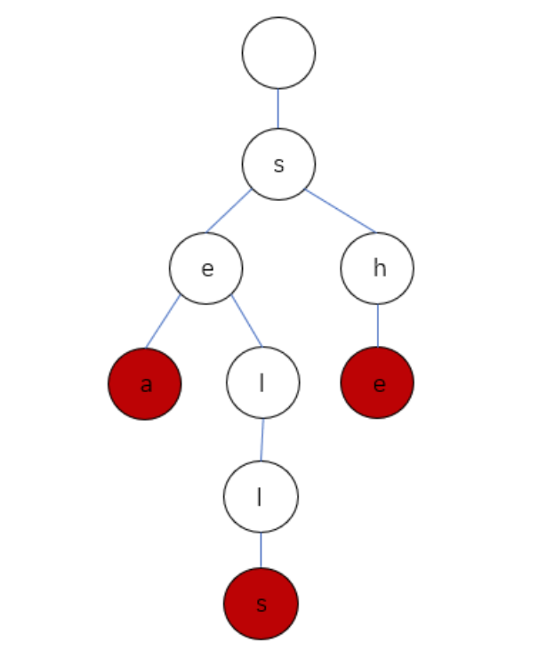

## 模板

```c++
class Trie{
private:
    vector<Trie*> next;
    bool isEnd;
    
public:
    Trie(): next(26), isEnd(0){}

    //树中插入单词
    void insert(const string& word) {
        Trie* node = this;
        for(char c : word){
            if(node->next[c - 'a'] == nullptr)
                node->next[c - 'a'] = new Trie();
            node = node->next[c - 'a'];
        }
        node->isEnd = 1;  //最后不要忘了 置为1
    }

    //查找树中是否包含单词word
    bool contianWord(const string& word) {
        Trie* node = this;
        for(char c : word){
            node = node->next[c - 'a'];
            if(node == nullptr) return 0;
        }
        return node->isEnd;
    }

    //查找树中是否包含以word为前缀的单词
    bool containWordStartsWith(const string& word) {
        Trie* node = this;
        for(char c : word){
            node = node->next[c - 'a'];
            if(node == nullptr) return 0;
        }
        return 1;
    }

    //在树中查找word的最短前缀 没有则返回为空
    string shortestPrefixOf(const string& word)  {
        Trie* node = this;
        string res = "";
        for (auto ch : word){
            if (node->isEnd || node->next[ch - 'a'] == nullptr) break;
            res += ch;
            node = node->next[ch - 'a'];
        }
        return node->isEnd ? res : "";         //有前缀返回前缀，没有则返回空字符串
    }
    
    //带通配符.的匹配 例如 a.c 匹配 abc
    bool hasKeyWithPattern(const string& word, int index){
        Trie* node = this;
        //字符串到头 检测树枝是否到头
        if(index >= word.size()) return node->isEnd == 1;

        char ch = word[index];
        //没有遇到通配符
        if(ch != '.' )
            return node->next[ch - 'a'] != nullptr && node->next[ch -  'a']->hasKeyWithPattern(word, index+1);

        //遇到通配符
        for(int i = 0; i<26; i++){
            if(node->next[i] != nullptr && node->next[i]->hasKeyWithPattern(word, index+1))
                return 1;
        }
        //没有找到
        return 0;
    }
};
```

### [前缀树算法模板秒杀 5 道算法题 (qq.com)](https://mp.weixin.qq.com/s/hGrTUmM1zusPZZ0nA9aaNw)

#### 插入

描述：向 Trie 中插入一个单词 word

实现：这个操作和构建链表很像。首先从根结点的子结点开始与 word 第一个字符进行匹配，一直匹配到前缀链上没有对应的字符，这时开始不断开辟新的结点，直到插入完 word 的最后一个字符，同时还要将最后一个结点isEnd = true;，表示它是一个单词的末尾。

```c++
    void insert(const string& word) {
        Trie* node = this;
        for(char c : word){
            if(node->next[c - 'a'] == nullptr)
                node->next[c - 'a'] = new Trie();
            node = node->next[c - 'a'];
        }
        node->isEnd = 1;  //最后不要忘了 置为1
    }
```

#### 查找

描述：查找 Trie 中是否存在单词 word

实现：从根结点的子结点开始，一直向下匹配即可，如果出现结点值为空就返回 false，如果匹配到了最后一个字符，那我们只需判断 node->isEnd即可。

```c++
    bool contianWord(const string& word) {
        Trie* node = this;
        for(char c : word){
            node = node->next[c - 'a'];
            if(node == nullptr) return 0;
        }
        return node->isEnd;
    }
```

#### 前缀匹配

描述：判断 Trie 中是或有以 word为前缀的单词

实现：和 search 操作类似，只是不需要判断最后一个字符结点的isEnd，因为既然能匹配到最后一个字符，那后面一定有单词是以它为前缀的。

```c++
    bool containWordStartsWith(const string& word) {
        Trie* node = this;
        for(char c : word){
            node = node->next[c - 'a'];
            if(node == nullptr) return 0;
        }
        return 1;
    }
```

#### 最短词根

描述：判断 string str在Trie 中的最短词根 （满足 isEnd）

实现：在前缀树上遍历单词，如果当前isEnd（表示找到了一个词根）或者 遍历到树尖，停止遍历

```c++
    //查找并返回前缀
    string shortestPrefixOf(const string& word)  {
        Trie* node = this;
        string res = "";
        for (auto ch : word){
            if (node->isEnd || node->next[ch - 'a'] == nullptr) break;
            res += ch;
            node = node->next[ch - 'a'];
        }
        return node->isEnd ? res : "";         //有前缀返回前缀，没有则返回空字符串
    }
```

#### 带通配符的查找

描述：使用通配符来匹配多个键，其关键就在于通配符`.`可以匹配所有字符。

实现：见代码

```c++
    //带通配符.的匹配 例如 a.c 匹配 abc
    bool hasKeyWithPattern(const string& word, int index){
        Trie* node = this;
        //字符串到头 检测树枝是否到头
        if(index >= word.size()) return node->isEnd == 1;

        char ch = word[index];
        //没有遇到通配符
        if(ch != '.' )
            return node->next[ch - 'a'] != nullptr && node->next[ch -  'a']->hasKeyWithPattern(word, index+1);

        //遇到通配符
        for(int i = 0; i<26; i++){
            if(node->next[i] != nullptr && node->next[i]->hasKeyWithPattern(word, index+1))
                return 1;
        }
        //没有找到
        return 0;
    }
```

## 模板题目

### [208. 实现 Trie (前缀树)](https://leetcode-cn.com/problems/implement-trie-prefix-tree/)

[labuladong 题解](https://labuladong.gitee.io/article/?qno=208)

难度中等1135收藏分享切换为英文接收动态反馈

**[Trie](https://baike.baidu.com/item/字典树/9825209?fr=aladdin)**（发音类似 "try"）或者说 **前缀树** 是一种树形数据结构，用于高效地存储和检索字符串数据集中的键。这一数据结构有相当多的应用情景，例如自动补完和拼写检查。

请你实现 Trie 类：

- `Trie()` 初始化前缀树对象。
- `void insert(String word)` 向前缀树中插入字符串 `word` 。
- `boolean search(String word)` 如果字符串 `word` 在前缀树中，返回 `true`（即，在检索之前已经插入）；否则，返回 `false` 。
- `boolean startsWith(String prefix)` 如果之前已经插入的字符串 `word` 的前缀之一为 `prefix` ，返回 `true` ；否则，返回 `false` 。

 

**示例：**

```
输入
["Trie", "insert", "search", "search", "startsWith", "insert", "search"]
[[], ["apple"], ["apple"], ["app"], ["app"], ["app"], ["app"]]
输出
[null, null, true, false, true, null, true]

解释
Trie trie = new Trie();
trie.insert("apple");
trie.search("apple");   // 返回 True
trie.search("app");     // 返回 False
trie.startsWith("app"); // 返回 True
trie.insert("app");
trie.search("app");     // 返回 True
```

#### 思路

构建前缀树

#### 代码

```c++
class Trie {
private:
    vector<Trie*> next;
    bool isEnd;
public:
    Trie() : isEnd(0), next(26){}
    
    void insert(const string& word) {
        Trie* node = this;
        for(char c : word){
            if(node->next[c - 'a'] == nullptr)
                node->next[c - 'a'] = new Trie();
            node = node->next[c - 'a'];
        }
        node->isEnd = 1;  //最后不要忘了 置为1
    }
    
    bool search(string word) {
        Trie* node = this;
        for(char c : word){
            node = node->next[c - 'a'];
            if(node == nullptr) return 0;
        }
        return node->isEnd;
    }
    
    bool startsWith(string prefix) {
        Trie* node = this;
        for(char c : prefix){
            node = node->next[c - 'a'];
            if(node == nullptr) return 0;
        }
        return 1;
    }
};
```

### [648. 单词替换 查找最短前缀](https://leetcode-cn.com/problems/replace-words/)

[labuladong 题解](https://labuladong.gitee.io/article/?qno=648)

难度中等163收藏分享切换为英文接收动态反馈

在英语中，我们有一个叫做 `词根`(root) 的概念，可以词根**后面**添加其他一些词组成另一个较长的单词——我们称这个词为 `继承词`(successor)。例如，词根`an`，跟随着单词 `other`(其他)，可以形成新的单词 `another`(另一个)。

现在，给定一个由许多**词根**组成的词典 `dictionary` 和一个用空格分隔单词形成的句子 `sentence`。你需要将句子中的所有**继承词**用**词根**替换掉。如果**继承词**有许多可以形成它的**词根**，则用**最短**的词根替换它。

你需要输出替换之后的句子。

 

**示例 1：**

```
输入：dictionary = ["cat","bat","rat"], sentence = "the cattle was rattled by the battery"
输出："the cat was rat by the bat"
```

**示例 2：**

```
输入：dictionary = ["a","b","c"], sentence = "aadsfasf absbs bbab cadsfafs"
输出："a a b c"
```

#### 代码

```c++
class Trie{
private:
    vector<Trie*> next;
    bool isEnd;
    
public:
    Trie(): next(26), isEnd(0){}

    //树中插入单词
    void insert(const string& word) {
        Trie* node = this;
        for(char c : word){
            if(node->next[c - 'a'] == nullptr)
                node->next[c - 'a'] = new Trie();
            node = node->next[c - 'a'];
        }
        node->isEnd = 1;  //最后不要忘了 置为1
    }

    //查找树中是否包含单词word
    bool contianWord(const string& word) {
        Trie* node = this;
        for(char c : word){
            node = node->next[c - 'a'];
            if(node == nullptr) return 0;
        }
        return node->isEnd;
    }

    //查找树中是否包含以word为前缀的单词
    bool containWordStartsWith(const string& word) {
        Trie* node = this;
        for(char c : word){
            node = node->next[c - 'a'];
            if(node == nullptr) return 0;
        }
        return 1;
    }

    //在树中查找word的最短前缀 没有则返回为空
    string shortestPrefixOf(const string& word)  {
        Trie* node = this;
        string res = "";
        for (auto ch : word){
            if (node->isEnd || node->next[ch - 'a'] == nullptr) break;
            res += ch;
            node = node->next[ch - 'a'];
        }
        return node->isEnd ? res : "";         //有前缀返回前缀，没有则返回空字符串
    }
};

class Solution {
public:
    string replaceWords(vector<string>& dictionary, string sentence) {
        Trie* trie = new Trie;
        stringstream ss(sentence);
        string s;
        sort(dictionary.begin(), dictionary.end());

        //词根存入字典树
        for(string str : dictionary)
            trie->insert(str);

        string ans = "";
        vector<string> all;
        while(ss >> s)
            all.push_back(s);

        for(string word : all){
            string prefix = trie->shortestPrefixOf(word);
            if(prefix.size() != 0){
                ans += prefix;
            }else{
                ans += word;
            }
            ans += " ";
        }
        
        ans.pop_back();
        return ans;
    }
};
```

### [211. 添加与搜索单词 - 数据结构设计 带通配符的查找](https://leetcode-cn.com/problems/design-add-and-search-words-data-structure/)

[labuladong 题解](https://labuladong.gitee.io/article/?qno=211)

难度中等416英文版讨论区

请你设计一个数据结构，支持 添加新单词 和 查找字符串是否与任何先前添加的字符串匹配 。

实现词典类 `WordDictionary` ：

- `WordDictionary()` 初始化词典对象
- `void addWord(word)` 将 `word` 添加到数据结构中，之后可以对它进行匹配
- `bool search(word)` 如果数据结构中存在字符串与 `word` 匹配，则返回 `true` ；否则，返回 `false` 。`word` 中可能包含一些 `'.'` ，每个 `.` 都可以表示任何一个字母。

 

**示例：**

```
输入：
["WordDictionary","addWord","addWord","addWord","search","search","search","search"]
[[],["bad"],["dad"],["mad"],["pad"],["bad"],[".ad"],["b.."]]
输出：
[null,null,null,null,false,true,true,true]

解释：
WordDictionary wordDictionary = new WordDictionary();
wordDictionary.addWord("bad");
wordDictionary.addWord("dad");
wordDictionary.addWord("mad");
wordDictionary.search("pad"); // 返回 False
wordDictionary.search("bad"); // 返回 True
wordDictionary.search(".ad"); // 返回 True
wordDictionary.search("b.."); // 返回 True
```

#### 思路

前缀树带通配符的匹配 加入startIndex进行递归

#### 代码

```c++
class Trie{
private:
    vector<Trie*> next;
    bool isEnd;
public:
    Trie(): next(26), isEnd(0) {}

    void insert(const string& word){
        Trie* node = this;
        for(char ch : word){
            if(node->next[ch - 'a'] == nullptr)
                node->next[ch - 'a'] = new Trie;
            node = node->next[ch - 'a'];
        }
        node->isEnd = 1;
    }

    bool hasKeyWithPattern(const string& word, int index){
        Trie* node = this;
        //字符串到头 检测树枝是否到头
        if(index >= word.size()) return node->isEnd == 1;

        char ch = word[index];
        //没有遇到通配符
        if(ch != '.' )
            return node->next[ch - 'a'] != nullptr && node->next[ch -  'a']->hasKeyWithPattern(word, index+1);

        //遇到通配符
        for(int i = 0; i<26; i++){
            if(node->next[i] != nullptr && node->next[i]->hasKeyWithPattern(word, index+1))
                return 1;
        }
        //没有找到
        return 0;
    }
};

class WordDictionary {
public:
    Trie* trie;
    WordDictionary() {
        trie = new Trie;
    }
    
    void addWord(string word) {
        trie->insert(word);
    }
    
    bool search(string word) {
        return trie->hasKeyWithPattern(word, 0);
    }
};
```

### [720. 词典中最长的单词 经典](https://leetcode-cn.com/problems/longest-word-in-dictionary/)

难度简单301

给出一个字符串数组 `words` 组成的一本英语词典。返回 `words` 中最长的一个单词，该单词是由 `words` 词典中其他单词逐步添加一个字母组成。

若其中有多个可行的答案，则返回答案中字典序最小的单词。若无答案，则返回空字符串。

 

**示例 1：**

```
输入：words = ["w","wo","wor","worl", "world"]
输出："world"
解释： 单词"world"可由"w", "wo", "wor", 和 "worl"逐步添加一个字母组成。
```

**示例 2：**

```
输入：words = ["a", "banana", "app", "appl", "ap", "apply", "apple"]
输出："apple"
解释："apply" 和 "apple" 都能由词典中的单词组成。但是 "apple" 的字典序小于 "apply" 
```

#### 思路

1. 哈希解法 sort后 依次substr检查是否存在 存在则压入
2. 字典树  需要自己构建函数 isGoodWord查找单词路径上每个节点 是否都是isEnd

#### 代码

```c++
class Trie{
private:
    vector<Trie*> next;
    bool isEnd;
    
public:
    Trie(): next(26), isEnd(0){}

    //树中插入单词
    void insert(const string& word) {
        Trie* node = this;
        for(char c : word){
            if(node->next[c - 'a'] == nullptr)
                node->next[c - 'a'] = new Trie();
            node = node->next[c - 'a'];
        }
        node->isEnd = 1;  //最后不要忘了 置为1
    }

    //查找树中是否包含单词word
    bool isGoodWord(const string& word) {
        Trie* node = this;
        for(char c : word){
            node = node->next[c - 'a'];
            if(node == nullptr || node->isEnd == 0) return 0;
        }
        return node->isEnd;
    }
};

class Solution {
public:
    string longestWord(vector<string>& words) {
        Trie trie;
        for(string word : words)  trie.insert(word);
        string ans = "";
        for(string word : words){
            if(trie.isGoodWord(word)){
                if(word.size()>ans.size() || (word.size() == ans.size() && word<ans))
                    ans = word;
            }
        }
        return ans;
    }
};


//哈希解法
class Solution {
public:
    string longestWord(vector<string>& words) {
        sort(words.begin(), words.end());
        unordered_set<string> sett;
        string ans = "";
        sett.insert(ans);
        for(int i = 0; i<words.size(); i++){
            if(sett.count(words[i].substr(0, words[i].size() -1))){
                if(words[i].size()>ans.size())
                    ans = words[i];
                sett.insert(words[i]); //满足条件才会insert
            }
        }
        return ans;
    }
};
```

### [剑指 Offer II 064. 神奇的字典](https://leetcode-cn.com/problems/US1pGT/)

难度中等19

设计一个使用单词列表进行初始化的数据结构，单词列表中的单词 **互不相同** 。 如果给出一个单词，请判定能否只将这个单词中**一个**字母换成另一个字母，使得所形成的新单词存在于已构建的神奇字典中。

实现 `MagicDictionary` 类：

- `MagicDictionary()` 初始化对象
- `void buildDict(String[] dictionary)` 使用字符串数组 `dictionary` 设定该数据结构，`dictionary` 中的字符串互不相同
- `bool search(String searchWord)` 给定一个字符串 `searchWord` ，判定能否只将字符串中 **一个** 字母换成另一个字母，使得所形成的新字符串能够与字典中的任一字符串匹配。如果可以，返回 `true` ；否则，返回 `false` 。

 

**示例：**

```
输入
inputs = ["MagicDictionary", "buildDict", "search", "search", "search", "search"]
inputs = [[], [["hello", "leetcode"]], ["hello"], ["hhllo"], ["hell"], ["leetcoded"]]
输出
[null, null, false, true, false, false]

解释
MagicDictionary magicDictionary = new MagicDictionary();
magicDictionary.buildDict(["hello", "leetcode"]);
magicDictionary.search("hello"); // 返回 False
magicDictionary.search("hhllo"); // 将第二个 'h' 替换为 'e' 可以匹配 "hello" ，所以返回 True
magicDictionary.search("hell"); // 返回 False
magicDictionary.search("leetcoded"); // 返回 False
```

#### 思路

用字典树的解法 其实没有那么麻烦 不要想的太复杂

每一位都用其他的25个字母替换一下就行了

#### 代码

```c++
class MagicDictionary {
private:
    vector<MagicDictionary*> next;
    bool isEnd;

    void insert(const string& str){
      MagicDictionary* node = this;
      for(auto ch : str){
        if(node ->next[ch - 'a'] == nullptr)
          node->next[ch - 'a'] = new MagicDictionary;
        node = node->next[ch - 'a'];
      }
      node->isEnd = 1;
    }

    bool find(const string& searchWord) {
      MagicDictionary* node = this;
      for(auto ch : searchWord){
        if(node->next[ch - 'a'] == nullptr)
          return 0;
        node = node->next[ch - 'a'];
      }
      return node->isEnd;
    }

public:
    /** Initialize your data structure here. */
    MagicDictionary() : next(26), isEnd(0){
    }
    
    void buildDict(vector<string> dictionary) {
      for(auto str : dictionary)
        this->insert(str);
    }
    
    //替换每一位的字母 简单暴力
    bool search(string searchWord) {
      for(int i = 0; i<searchWord.size(); i++){
        string temp = searchWord;
        for(int j = 0; j<26; j++){
          char ch = 'a' + j;
          if(ch != searchWord[i]){
            temp[i] = ch;
            if(this->find(temp))
              return 1;
          }
        }
      }
      return 0;
    }
};
```

大佬的解法 击败高得多

```c++
//前缀树的程序表示
class TrieNode {
public:
    bool isWord;//当前节点为结尾是否是字符串
    vector<TrieNode*> children;
    TrieNode() : isWord(false), children(26, nullptr) {}
    ~TrieNode() {
        for (TrieNode* child : children)
            if (child) delete child;
    }
};

class MagicDictionary {
private:
    TrieNode *trieRoot;//构建的单词后缀树
    //在树中插入一个单词的方法实现
    void addWord(string &word) {
        TrieNode *ptr = trieRoot;//扫描这棵树，将word插入
        //将word的字符逐个插入
        for (auto ch : word) {
            if (ptr->children[ch - 'a'] == NULL) {
                ptr->children[ch - 'a'] = new TrieNode();
            }
            ptr = ptr->children[ch - 'a'];
        }
        ptr->isWord = true;//标记为单词
    }
    //在nowTreePtr中搜索word[index]，isMod代表的是是否使用了替换一个字母的机会
    bool myFindWord(TrieNode *nowTreePtr, string &word, int index, bool isMod){
        if (nowTreePtr == NULL){
            return false;
        }
        if (word.size() == index){
            //此时搜索完毕，必须保证nowTreePtr也到达了一个单词的尾端，并且替换一个字母的机会也使用了
            return isMod && nowTreePtr->isWord;
        }
        else{
            //搜索nowTreePtr的26个节点
            for (int i = 0; i < 26; ++i){
                if (nowTreePtr->children[i] != NULL){
                    if ('a' + i == word[index]){
                        //成功匹配，继续搜索下一个字母
                        if (myFindWord(nowTreePtr->children[i], word, index + 1, isMod)){
                            return true;
                        }
                    }
                    else if (isMod == false && myFindWord(nowTreePtr->children[i], word, index + 1, true)){
                        //如果'a' + i ！= word[index]，则使用替换字母的机会（在此之前替换字母的机会是没有使用的，因为只能使用一次）
                        return true;
                    }
                }
            }
            return false;
        }
    }
public:
    /** Initialize your data structure here. */
    MagicDictionary() {
        trieRoot = new TrieNode();
    }

    /** Build a dictionary through a list of words */
    void buildDict(vector<string> dict) {
        //构建字典树
        for (auto &word : dict){
            addWord(word);
        }
    }

    /** Returns if there is any word in the trie that equals to the given word after modifying exactly one character */
    bool search(string word) {
        return myFindWord(trieRoot, word, 0, false);
    }
};

```

### [剑指 Offer II 065. 最短的单词编码](https://leetcode-cn.com/problems/iSwD2y/)

难度中等16

单词数组 `words` 的 **有效编码** 由任意助记字符串 `s` 和下标数组 `indices` 组成，且满足：

- `words.length == indices.length`
- 助记字符串 `s` 以 `'#'` 字符结尾
- 对于每个下标 `indices[i]` ，`s` 的一个从 `indices[i]` 开始、到下一个 `'#'` 字符结束（但不包括 `'#'`）的 **子字符串** 恰好与 `words[i]` 相等

给定一个单词数组 `words` ，返回成功对 `words` 进行编码的最小助记字符串 `s` 的长度 。

 

**示例 1：**

```
输入：words = ["time", "me", "bell"]
输出：10
解释：一组有效编码为 s = "time#bell#" 和 indices = [0, 2, 5] 。
words[0] = "time" ，s 开始于 indices[0] = 0 到下一个 '#' 结束的子字符串，如加粗部分所示 "time#bell#"
words[1] = "me" ，s 开始于 indices[1] = 2 到下一个 '#' 结束的子字符串，如加粗部分所示 "time#bell#"
words[2] = "bell" ，s 开始于 indices[2] = 5 到下一个 '#' 结束的子字符串，如加粗部分所示 "time#bell#"
```

**示例 2：**

```
输入：words = ["t"]
输出：2
解释：一组有效编码为 s = "t#" 和 indices = [0] 。
```

#### 解法1

单词倒序插入字典树

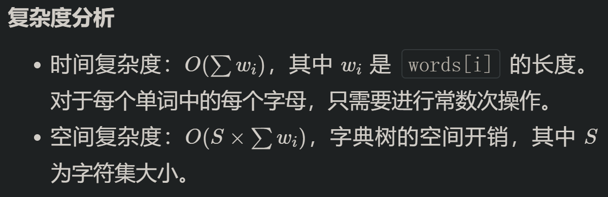

```c++
class Trie { //创建前缀树
public:
  vector<Trie *> next;
  Trie() : next(26) {}

  void insertReverse(const string &word) { //向树中倒序插入字符串
    Trie *node = this;
    for (int i = word.size() - 1; i >= 0; i--) {
      if (node->next[word[i] - 'a'] == nullptr)
        node->next[word[i] - 'a'] = new Trie();
      node = node->next[word[i] - 'a'];
    }
  }

  bool containWordStartsWithReverse(const string word) { //判断字符串倒序后是否为字典树的前缀
    Trie *node = this;
    for (int i = word.size() - 1; i >= 0; i--) {
      node = node->next[word[i] - 'a'];
      if (node == nullptr)
        return 0;
    }
    return 1;
  }
};

class Solution {
public:
  int minimumLengthEncoding(vector<string> &words) {
    int res = 0; //结果
    Trie *node = new Trie();
    sort(words.begin(), words.end(), [](string& str1, string& str2) {
      return str1.size() > str2.size();
    }); //将字符串按长度从大到小排序
    for (string str : words) {
      if (!node->containWordStartsWithReverse(str)){
        res += (str.size() + 1); //若其不是前缀树的前缀，则结果+=字符串长度+1
      	node->insertReverse(str); //并将字符串插入到前缀树中     
      }
    }
    return res;
  }
};
```

#### 解法2

哈希 检查互为后缀

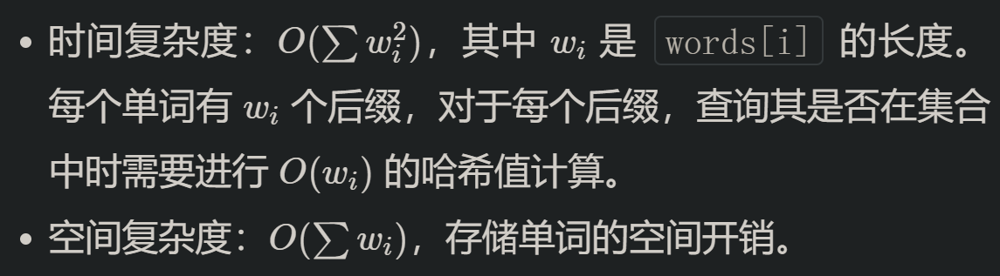

```c++
class Solution {
public:
    int minimumLengthEncoding(vector<string>& words) {
      unordered_set<string> sett(words.begin(), words.end());
      for(auto word : words){
        for(int i = 1; i<word.size(); i++){
          if(sett.find(word.substr(i)) != sett.end())
            sett.erase(word.substr(i));
        }
      }

      int ans = 0;
      for(auto word : sett)
        ans += word.size() + 1;
      return ans;
    }
};
```

### [剑指 Offer II 066. 单词之和](https://leetcode-cn.com/problems/z1R5dt/)

难度中等15

实现一个 `MapSum` 类，支持两个方法，`insert` 和 `sum`：

- `MapSum()` 初始化 `MapSum` 对象
- `void insert(String key, int val)` 插入 `key-val` 键值对，字符串表示键 `key` ，整数表示值 `val` 。如果键 `key` 已经存在，那么原来的键值对将被替代成新的键值对。
- `int sum(string prefix)` 返回所有以该前缀 `prefix` 开头的键 `key` 的值的总和。

 

**示例：**

```
输入：
inputs = ["MapSum", "insert", "sum", "insert", "sum"]
inputs = [[], ["apple", 3], ["ap"], ["app", 2], ["ap"]]
输出：
[null, null, 3, null, 5]

解释：
MapSum mapSum = new MapSum();
mapSum.insert("apple", 3);  
mapSum.sum("ap");           // return 3 (apple = 3)
mapSum.insert("app", 2);    
mapSum.sum("ap");           // return 5 (apple + app = 3 + 2 = 5)
```

#### 解法1

前缀树 在最后一个字母存储节点的值

注意前缀树的dfs 求节点下 所有节点的值的和

```c++
class MapSum {
    struct Trie{
      int val;
      vector<shared_ptr<Trie>> next;
      Trie() : val(0), next(26){}
    };

    shared_ptr<Trie> root = make_shared<Trie>();
public:
    /** Initialize your data structure here. */
    MapSum() {}
    
    void insert(string key, int val) {
      auto node = root;
      for(char& ch : key){
        if(node->next[ch - 'a'] == nullptr)
          node->next[ch - 'a'] = make_shared<Trie>();
        node = node->next[ch -'a'];
      }
      node->val = val;
    }
    //累加这个树节点代表的整个子树
    int dfs(shared_ptr<Trie> node){
      if(node == nullptr) return 0;
      
      int res = node->val;
      for(auto& nxt : node->next){
        res += dfs(nxt);
      }
      return res;
    }

    int sum(string prefix) {
      auto node = root;
      for(char& ch : prefix){
        if(node->next[ch - 'a'] == nullptr)
          return 0;
        node = node->next[ch - 'a'];
      }
      return dfs(node);
    }
};
```

#### 解法2

哈希

```c++
class MapSum {
    unordered_map<string, int> mapp;
public:
    /** Initialize your data structure here. */
    MapSum() {}
    
    void insert(string key, int val) {
      mapp[key] = val;
    }
    
    int sum(string prefix) {
      int ans = 0;
      for(auto& [word, val] : mapp){
        if(word.size() >= prefix.size() && word.find(prefix) == 0){
          ans += val;
        }
      }
      return ans;
    }
};

//判断的写法比价糙 其实可以
if(word.substr(0, prefix.size()) == prefix)
	...
//也就是说
	string s = "123";
	string ss = s.subsre(0, 100) //还是"123"
```


## 其他字典树题目

### [440. 字典序的第K小数字](https://leetcode-cn.com/problems/k-th-smallest-in-lexicographical-order/)

难度困难450

给定整数 `n` 和 `k`，返回 `[1, n]` 中字典序第 `k` 小的数字。

 

**示例 1:**

```
输入: n = 13, k = 2
输出: 10
解释: 字典序的排列是 [1, 10, 11, 12, 13, 2, 3, 4, 5, 6, 7, 8, 9]，所以第二小的数字是 10。
```

**示例 2:**

```
输入: n = 1, k = 1
输出: 1
```

**提示:**

- `1 <= k <= n <= 10e9`

思路：

1. 主要到此题数据量较大 不然可以直接使用sort   (对string)

2. 字典树 统计节点个数 判断向下还是向右

   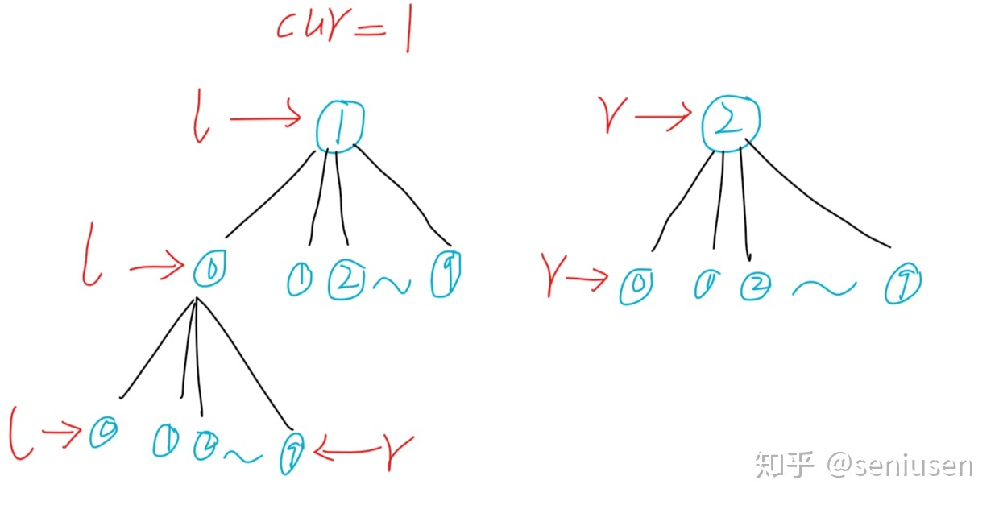

   

   - 首先我们初始化 cur = 1
   - 然后我们让 left = cur，right = cur + 1，此时 right-left 就是第一棵树第一层的节点个数
   - 接下来 left *= 10, right *= 10，这样就进入到了第二层，此时 right-left 就是第二层的节点个数，以此类推直到 left > n
   - 但如果我们是统计 109 以内的字典序，进入第三层时，right 不能指向 200 而只能指向 109 (此时`right`也就是题目给定的范围个`n`)，**此时 right-left+1 才是当前层的节点个数**

   假设我们统计完第一棵树的节点数为 node_num

   - 如果 K >= node_num，我们需要继续向后查找，在后面的树中查找第 K-node_num 小的数字，也即更新 cur += 1
   - 如果 K < node_num，说明第 K 小的数字在子树中，我们需要进入子树继续向下查找，也即更新 cur *= 10

代码

```c++
class Solution {
public:
    int findKthNumber(int n, int k) {
        int curr = 1;
        k--;
        while(k>0){
            //这里的left和right很巧妙的统计了下层节点的个数
            long long left = curr;
            long long right = curr + 1;
            int node_num = 0;
            // 统计树中每一层的节点个数
            while(left<=n){
                node_num += min(right, (long long)(n+1)) - left;
                left*=10;
                right*=10; 
            }
            if(node_num<=k){// 向右查找
                curr++;
                k-=node_num;
            }else{ // 进入子树查找
                curr*=10;
                k--;
            }
        }
        return curr;
    }
};
```


# [线段树](https://oi-wiki.org/ds/seg/)和树状数组

### 线段树

线段树是算法竞赛中常用的用来维护 **区间信息** 的数据结构。

线段树可以在Ologn 的时间复杂度内实现单点修改、区间修改、区间查询（区间求和，求区间最大值，求区间最小值）等操作。

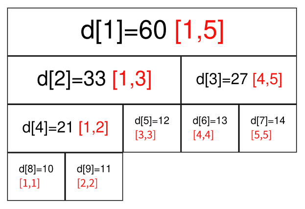

### 树状数组

树状数组和线段树具有相似的功能，但他俩毕竟还有一些区别：树状数组能有的操作，线段树一定有；线段树有的操作，树状数组不一定有。但是树状数组的代码要比线段树短，思维更清晰，速度也更快，在解决一些单点修改的问题时，树状数组是不二之选。

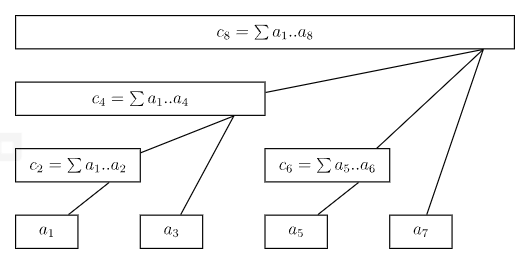


### <u>[307. 区域和检索 - 数组可修改](https://leetcode-cn.com/problems/range-sum-query-mutable/)</u>

难度中等470英文版讨论区

给你一个数组 `nums` ，请你完成两类查询。

1. 其中一类查询要求 **更新** 数组 `nums` 下标对应的值
2. 另一类查询要求返回数组 `nums` 中索引 `left` 和索引 `right` 之间（ **包含** ）的nums元素的 **和** ，其中 `left <= right`

实现 `NumArray` 类：

- `NumArray(int[] nums)` 用整数数组 `nums` 初始化对象
- `void update(int index, int val)` 将 `nums[index]` 的值 **更新** 为 `val`
- `int sumRange(int left, int right)` 返回数组 `nums` 中索引 `left` 和索引 `right` 之间（ **包含** ）的nums元素的 **和** （即，`nums[left] + nums[left + 1], ..., nums[right]`）

 

**示例 1：**

```
输入：
["NumArray", "sumRange", "update", "sumRange"]
[[[1, 3, 5]], [0, 2], [1, 2], [0, 2]]
输出：
[null, 9, null, 8]

解释：
NumArray numArray = new NumArray([1, 3, 5]);
numArray.sumRange(0, 2); // 返回 1 + 3 + 5 = 9
numArray.update(1, 2);   // nums = [1,2,5]
numArray.sumRange(0, 2); // 返回 1 + 2 + 5 = 8
```

```c++
//线段树
class NumArray {
private:
	vector<int> segmentTree;
	int n;

	void build(int node, int left, int right, vector<int>& nums) {
		if (left == right) {
			segmentTree[node] = nums[left];
			return;
		}
		int mid = left + (right - left) / 2;
		build(node * 2 + 1, left, mid, nums);
		build(node * 2 + 2, mid + 1, right, nums);
		segmentTree[node] = segmentTree[node * 2 + 1] + segmentTree[node * 2 + 2];
	}

	void change(int index, int val, int node, int left, int right) {
		if (left == right) {
			segmentTree[node] = val;
			return;
		}
		int mid = left + (right - left) / 2;
		if (index <= mid)  //注意 全是小于等于
			change(index, val, node * 2 + 1, left, mid);
		else 
			change(index, val, node * 2 + 2, mid + 1, right);
		segmentTree[node] = segmentTree[node * 2 + 1] + segmentTree[node * 2 + 2];
	}

	int range(int searchLeft, int searchRight, int node, int left, int right) {
		if (searchLeft == left && searchRight == right)
			return segmentTree[node];
		int mid = left + (right - left) / 2;
		if (searchRight <= mid)
			return range(searchLeft, searchRight, node * 2 + 1, left, mid);
		else if (searchLeft > mid)
			return range(searchLeft, searchRight, node * 2 + 2, mid + 1, right);
		else //注意这里，right left 两个地方换mid
      return range(searchLeft, mid, node * 2 + 1, left, mid) + range(mid + 1, searchRight, node * 2 + 2, mid + 1, right);
	}
public:
	NumArray(vector<int>& nums) : n(nums.size()), segmentTree(nums.size() * 4) {
		build(0, 0, n - 1, nums);
	}

	void update(int index, int val) {
		change(index, val, 0, 0, n - 1);
	}

	int sumRange(int left, int right) {
		return range(left, right, 0, 0, n - 1);
	}
};

//树状数组
class NumArray {
public:
    vector<int> A;// 原数组
    vector<int> C;   // 树状数组

    int lowBit(int x) {
        return x & (-x);
    }

    NumArray(vector<int>& nums):A(nums) {
        C = vector<int> (A.size() + 1, 0);
        //构造树形数组
        for(int i = 1; i<=A.size(); i++) {
            C[i] += A[i - 1];
            //父结点要加上子结点的值
            if(i + lowBit(i) <= A.size()) 
                C[i + lowBit(i)] += C[i];
        }
    }
    
    void update(int index, int val) {
        int d = val - A[index];
        for(int i = index + 1; i < C.size(); i += lowBit(i)) 
            C[i] += d; // 更新树状数组       
        A[index] = val; // 更新原数组
    }
    
    int sumRange(int left, int right) {
        int r = 0, l = 0;
        //求right的前缀和
        for(int i = right + 1; i >= 1; i -= lowBit(i)) r += C[i];
        //求left的前缀和
        for(int i = left; i >= 1; i -= lowBit(i)) l += C[i];
        return r - l;
    }
};
```

### 最高分是多少

老师想知道从某某同学当中，分数最高的是多少，现在请你编程模拟老师的询问。当然，老师有时候需要更新某位同学的成绩.

##### **输入描述:**

```
每组输入第一行是两个正整数N和M（0 < N <= 30000,0 < M < 5000）,分别代表学生的数目和操作的数目。
学生ID编号从1编到N。
第二行包含N个整数，代表这N个学生的初始成绩，其中第i个数代表ID为i的学生的成绩
接下来又M行，每一行有一个字符C（只取‘Q’或‘U’），和两个正整数A,B,当C为'Q'的时候, 表示这是一条询问操作，假设A<B，他询问ID从A到B（包括A,B）的学生当中，成绩最高的是多少
当C为‘U’的时候，表示这是一条更新操作，要求把ID为A的学生的成绩更改为B。

注意：输入包括多组测试数据。
```

##### **输出描述:**

```
对于每一次询问操作，在一行里面输出最高成绩.
```

##### **输入例子1:**

```
5 7
1 2 3 4 5
Q 1 5
U 3 6
Q 3 4
Q 4 5
U 4 5
U 2 9
Q 1 5
```

##### **输出例子1:**

```
5
6
5
9
```

##### **输入例子2:**

```
3 2
1 2 3
U 2 8
Q 3 1
```

##### **输出例子2:**

```
8
```

#### ACM模式

```c++
#include<iostream>
#include<vector>
using namespace std;

//线段树
class NumArray {
private:
	vector<int> segmentTree;
	int n;

	void build(int node, int s, int e, vector<int> &nums) {
		if (s == e) {
			segmentTree[node] = nums[s];
			return;
		}
		int m = s + (e - s) / 2;
		build(node * 2 + 1, s, m, nums);
		build(node * 2 + 2, m + 1, e, nums);
		segmentTree[node] = max(segmentTree[node * 2 + 1], segmentTree[node * 2 + 2]);
	}

	void change(int index, int val, int node, int s, int e) {
		if (s == e) {
			segmentTree[node] = val;
			return;
		}
		int m = s + (e - s) / 2;
		if (index <= m) {
			change(index, val, node * 2 + 1, s, m);
		}
		else {
			change(index, val, node * 2 + 2, m + 1, e);
		}
		segmentTree[node] = max(segmentTree[node * 2 + 1], segmentTree[node * 2 + 2]);
	}

	int range(int left, int right, int node, int s, int e) {
		if (left == s && right == e) {
			return segmentTree[node];
		}
		int m = s + (e - s) / 2;
		if (right <= m) {
			return range(left, right, node * 2 + 1, s, m);
		}
		else if (left > m) {
			return range(left, right, node * 2 + 2, m + 1, e);
		}
		else {
			return max(range(left, m, node * 2 + 1, s, m), range(m + 1, right, node * 2 + 2, m + 1, e));
		}
	}

public:
	NumArray(vector<int>& nums) : n(nums.size()), segmentTree(nums.size() * 4) {
		build(0, 0, n - 1, nums);
	}

	void update(int index, int val) {
		change(index, val, 0, 0, n - 1);
	}

	int rangeMax(int left, int right) {
		return range(left, right, 0, 0, n - 1);
	}
};

int getMax(vector<int>& nums, int left, int right) {
	int ans = 0;
	for (int i = left; i <= right; i++) {
		ans = max(ans, nums[i]);
	}
	return ans;
}

//线段树
int main() {
	while (cin) {
		vector<int> scores;
		int size;
		cin >> size;
		int steps;
		cin >> steps;
		scores.resize(size);
		for (int i = 0; i < size; i++) {
			cin >> scores[i];
			//cout<<scores[i]<<" ";
		}
		NumArray nArray(scores);
		while (steps) {
			steps--;
			char ch;
			cin >> ch;
			if (ch == 'Q') {
				int left;
				cin >> left;
				int right;
				cin >> right;
				left--;
				right--;
				if (left > right) {
					swap(left, right);
				}
				if (right >= size) right = size - 1;
				int ans = nArray.rangeMax(left, right);
				//int ans = getMax(scores, left, right);
				cout << ans << endl;
			}
			else {
				int pos, val;
				cin >> pos;
				pos--;
				cin >> val;
				//scores[pos] = val;
				nArray.update(pos, val);
			}
		}
	}
	return 0;
}
```


### [LCP 52. 二叉搜索树染色](https://leetcode.cn/problems/QO5KpG/)

难度中等16

欢迎各位勇者来到力扣城，本次试炼主题为「二叉搜索树染色」。

每位勇士面前设有一个**二叉搜索树**的模型，模型的根节点为 `root`，树上的各个节点值均不重复。初始时，所有节点均为蓝色。现在按顺序对这棵二叉树进行若干次操作， `ops[i] = [type, x, y]` 表示第 `i` 次操作为：

- `type` 等于 0 时，将节点值范围在 `[x, y]` 的节点均染蓝
- `type` 等于 1 时，将节点值范围在 `[x, y]` 的节点均染红

请返回完成所有染色后，该二叉树中红色节点的数量。

**注意：**

- 题目保证对于每个操作的 `x`、`y` 值定出现在二叉搜索树节点中

**示例 1：**

> 输入：`root = [1,null,2,null,3,null,4,null,5], ops = [[1,2,4],[1,1,3],[0,3,5]]`
>
> 输出：`2`
>
> 解释：
> 第 0 次操作，将值为 2、3、4 的节点染红；
> 第 1 次操作，将值为 1、2、3 的节点染红；
> 第 2 次操作，将值为 3、4、5 的节点染蓝；
> 因此，最终值为 1、2 的节点为红色节点，返回数量 2
> 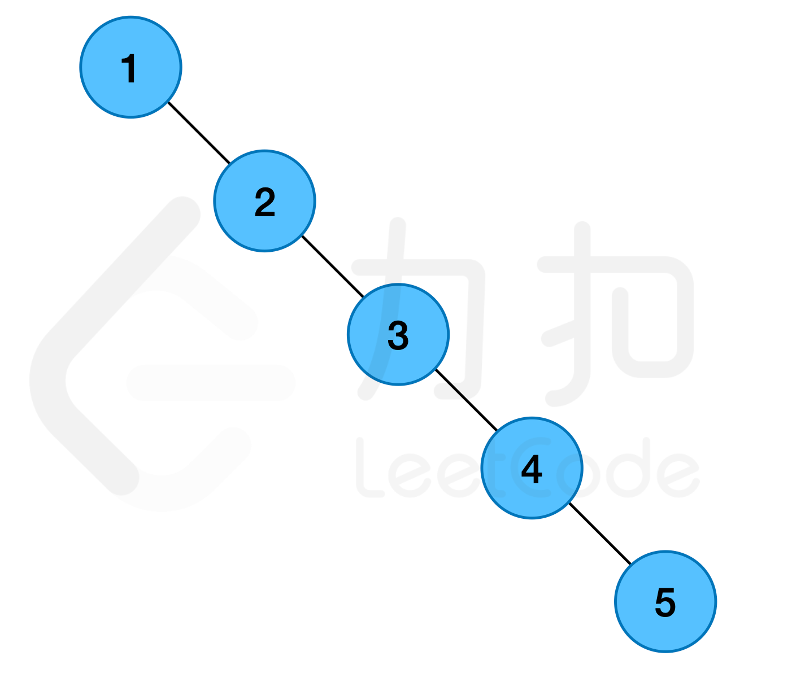

**示例 2：**

> 输入：`root = [4,2,7,1,null,5,null,null,null,null,6]`
> `ops = [[0,2,2],[1,1,5],[0,4,5],[1,5,7]]`
>
> 输出：`5`
>
> 解释：
> 第 0 次操作，将值为 2 的节点染蓝；
> 第 1 次操作，将值为 1、2、4、5 的节点染红；
> 第 2 次操作，将值为 4、5 的节点染蓝；
> 第 3 次操作，将值为 5、6、7 的节点染红；
> 因此，最终值为 1、2、5、6、7 的节点为红色节点，返回数量 5
> 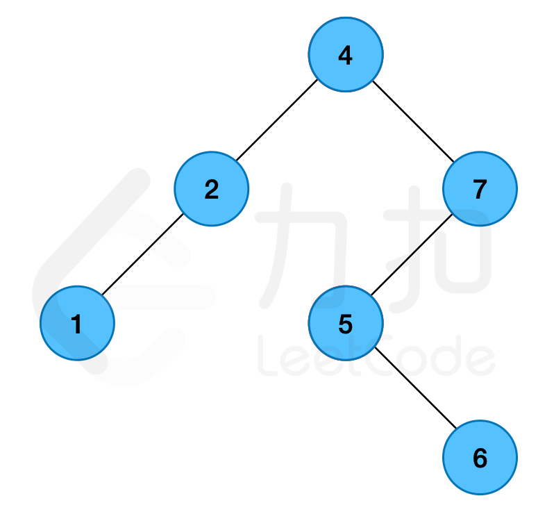

#### 解法 暴力

```c++
class Solution {
public:
    int ans = 0;
    int getNumber(TreeNode* root, vector<vector<int>>& ops) {
      unordered_map<int, int> mapp;
      for(int i = 0; i<ops.size(); i++){
        int val = ops[i][0];
        int begin = ops[i][1];
        int end = ops[i][2];
        while(begin <= end){
          mapp[begin++] = val;
          //cout<<val<<" ";
        }
      }
      ans = 0;
      dfs(root, mapp);
      return ans;
    }
    void dfs(TreeNode* node, unordered_map<int,int>& mapp){
        if(!node) return;
        node->val = mapp[node->val];
        ans+=node->val;
        dfs(node->left, mapp);
        dfs(node->right, mapp);
    }
};
```

#### set二分

```c++
class Solution {
public:
    set<int> sett;
    void dfs(TreeNode* node){
      if(!node) return;
      sett.insert(node->val);
      dfs(node->left);
      dfs(node->right);
    }
    int getNumber(TreeNode* root, vector<vector<int>>& ops) {
      dfs(root);
      int ans = 0;
      for(int i = ops.size() - 1; i>=0; i--){
        while(1){
          auto it = sett.lower_bound(ops[i][1]);
          if(it == sett.end() || (*it) > ops[i][2])
            break;
          sett.erase(it);
          if(ops[i][0]) ans++;
        }
      }
      return ans;
    }
};
```
