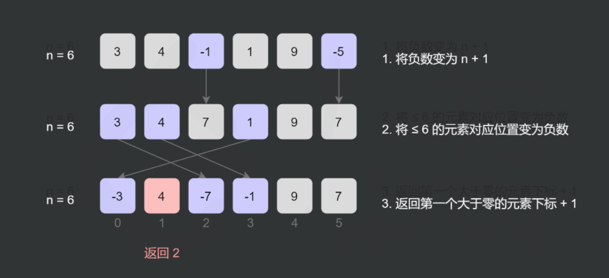
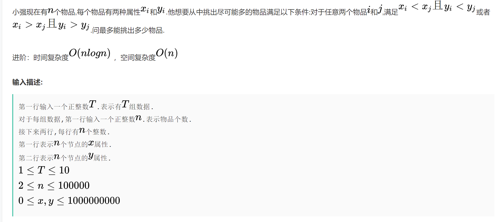
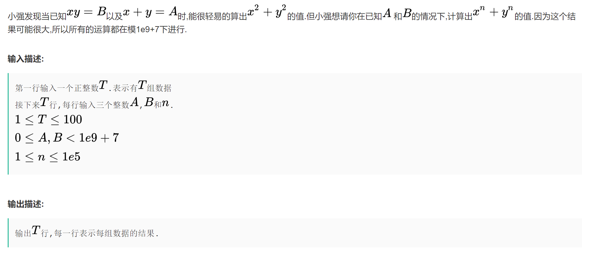

### LeetCode 1152. 用户网站访问行为分析

#### 1. 题目

为了评估某网站的用户转化率，我们需要对用户的访问行为进行分析，并建立用户行为模型。

日志文件中已经记录了用户名、访问时间 以及 页面路径。

为了方便分析，日志文件中的 N 条记录已经被解析成三个长度相同且长度都为 N 的数组，分别是：用户名 username，访问时间 timestamp 和 页面路径 website。

第 i 条记录意味着用户名是 username[i] 的用户在 timestamp[i] 的时候访问了路径为 website[i] 的页面。

我们需要找到用户访问网站时的 『共性行为路径』，也就是有最多的用户都 至少按某种次序访问过一次 的三个页面路径。需要注意的是，用户 可能不是连续访问 这三个路径的。

『共性行为路径』是一个 长度为 3 的页面路径列表，列表中的路径 不必不同，并且按照访问时间的先后升序排列。

如果有多个满足要求的答案，那么就请返回按字典序排列最小的那个。（页面路径列表 X 按字典序小于 Y 的前提条件是：X[0] < Y[0] 或 X[0] == Y[0] 且 (X[1] < Y[1] 或 X[1] == Y[1] 且 X[2] < Y[2])）

题目保证一个用户会至少访问 3 个路径一致的页面，并且一个用户不会在同一时间访问两个路径不同的页面。

```c++
示例：
输入：
username = ["joe","joe","joe","james","james","james","james","mary","mary","mary"], 
timestamp = [1,2,3,4,5,6,7,8,9,10], 
website = ["home","about","career","home","cart","maps","home","home","about","career"]
输出：["home","about","career"]
解释：
由示例输入得到的记录如下：
["joe", 1, "home"]
["joe", 2, "about"]
["joe", 3, "career"]
["james", 4, "home"]
["james", 5, "cart"]
["james", 6, "maps"]
["james", 7, "home"]
["mary", 8, "home"]
["mary", 9, "about"]
["mary", 10, "career"]
有 2 个用户至少访问过一次 ("home", "about", "career")。
有 1 个用户至少访问过一次 ("home", "cart", "maps")。
有 1 个用户至少访问过一次 ("home", "cart", "home")。
有 1 个用户至少访问过一次 ("home", "maps", "home")。
有 1 个用户至少访问过一次 ("cart", "maps", "home")。
 
提示：
3 <= N = username.length = timestamp.length = website.length <= 50
1 <= username[i].length <= 10
0 <= timestamp[i] <= 10^9
1 <= website[i].length <= 10
username[i] 和 website[i] 都只含小写字符
```

> 这道题主要是解题思路 数据结构的使用 没什么难点 主要是要想明白问题 明确流程

#### 2. 解题

```c++
class Solution {
	map<vector<string>,unordered_set<string>> count;//网站路径，用户集合
	unordered_map<string, vector<pair<int,string>>> m;//用户名，《用户访问时间,网站》
public:
    vector<string> mostVisitedPattern(vector<string>& username, vector<int>& timestamp, vector<string>& website) {
    	int i, n = username.size();
    	for(i = 0; i < n; i++){  //存取每个用户 浏览的网站及对应的时间
    		m[username[i]].push_back({timestamp[i],website[i]});
    	}
    	for(auto it = m.begin(); it != m.end(); ++it){
    		sort(it->second.begin(), it->second.end(),[&](auto a, auto b){
    			return a.first < b.first;//某用户访问的网站按时间排序
    		});
    	}
    	vector<string> path;
    	for(auto it = m.begin(); it != m.end(); ++it){
    		dfs(it->second, path, 0, it->first);//回溯生成所有的三元组
    	}
    	int maxcount = 0;
    	vector<vector<string>> result;
    	for(auto it = count.begin(); it != count.end(); ++it){	//选出人数最多的最大的路径
    		if(it->second.size() > maxcount){ //人数多
    			result.clear();
    			result.push_back(it->first);
    			maxcount = it->second.size();
    		}
    		else if(it->second.size() == maxcount)//人数相等
    			result.push_back(it->first);
    	}
    	sort(result.begin(), result.end());//取字典序最小的
    	return result[0];
    }

  	//回溯全组合
    void dfs(vector<pair<int,string>>& web, vector<string>& path, int idx, string username){
    	if(path.size()==3){
    		count[path].insert(username);
    		return;
    	}
    	for(int i = idx; i < web.size(); ++i) {
    		path.push_back(web[i].second);
    		dfs(web, path, i+1, username);
    		path.pop_back();
    	}
    }
};

```

### [705. 设计哈希集合](https://leetcode-cn.com/problems/design-hashset/)

难度简单221英文版讨论区

不使用任何内建的哈希表库设计一个哈希集合（HashSet）。

实现 `MyHashSet` 类：

- `void add(key)` 向哈希集合中插入值 `key` 。
- `bool contains(key)` 返回哈希集合中是否存在这个值 `key` 。
- `void remove(key)` 将给定值 `key` 从哈希集合中删除。如果哈希集合中没有这个值，什么也不做。

**示例：**

```
输入：
["MyHashSet", "add", "add", "contains", "contains", "add", "contains", "remove", "contains"]
[[], [1], [2], [1], [3], [2], [2], [2], [2]]
输出：
[null, null, null, true, false, null, true, null, false]

解释：
MyHashSet myHashSet = new MyHashSet();
myHashSet.add(1);      // set = [1]
myHashSet.add(2);      // set = [1, 2]
myHashSet.contains(1); // 返回 True
myHashSet.contains(3); // 返回 False ，（未找到）
myHashSet.add(2);      // set = [1, 2]
myHashSet.contains(2); // 返回 True
myHashSet.remove(2);   // set = [1]
myHashSet.contains(2); // 返回 False ，（已移除）
```

**提示：**

- `0 <= key <= 106`
- 最多调用 `104` 次 `add`、`remove` 和 `contains`

#### 思路

1. 找合适的质数

   | lwr    | upr    | % err     |   prime    |
   | :----- | :----- | :-------- | :--------: |
   | 2525   | 2626   | 10.416667 |     53     |
   | 2626   | 2727   | 1.041667  |     97     |
   | 2727   | 2828   | 0.520833  |    193     |
   | 2828   | 2929   | 1.302083  |    389     |
   | 2929   | 210210 | 0.130208  |    769     |
   | 210210 | 211211 | 0.455729  |    1543    |
   | 211211 | 212212 | 0.227865  |    3079    |
   | 212212 | 213213 | 0.113932  |    6151    |
   | 213213 | 214214 | 0.008138  |   12289    |
   | 214214 | 215215 | 0.069173  |   24593    |
   | 215215 | 216216 | 0.010173  |   49157    |
   | 216216 | 217217 | 0.013224  |   98317    |
   | 217217 | 218218 | 0.002543  |   196613   |
   | 218218 | 219219 | 0.006358  |   393241   |
   | 219219 | 220220 | 0.000127  |   786433   |
   | 220220 | 221221 | 0.000318  |  1572869   |
   | 221221 | 222222 | 0.000350  |  3145739   |
   | 222222 | 223223 | 0.000207  |  6291469   |
   | 223223 | 224224 | 0.000040  |  12582917  |
   | 224224 | 225225 | 0.000075  |  25165843  |
   | 225225 | 226226 | 0.000010  |  50331653  |
   | 226226 | 227227 | 0.000023  | 100663319  |
   | 227227 | 228228 | 0.000009  | 201326611  |
   | 228228 | 229229 | 0.000001  | 402653189  |
   | 229229 | 230230 | 0.000011  | 805306457  |
   | 230230 | 231231 | 0.000000  | 1610612741 |

2. mod 得到bucket 然后存入链表（如果链表当前不存在这个数的话）

#### 代码

```c++
class MyHashSet {
private:
    vector<list<int>> data;
    static const int base = 769;
    static int hash(int key){
        return key % base;
    }
public:
    MyHashSet() :data(base){}
    
    //函数基本都是一样的 计算bucket的值 遍历list
    void add(int key) {
        int h = hash(key);
        for(auto it = data[h].begin(); it!=data[h].end(); it++){
            if(*(it) == key)  //存在这个数
                return;
        }
        data[h].push_back(key);
    }
    
    void remove(int key) {
        int h = hash(key);
        for(auto it = data[h].begin(); it!=data[h].end(); it++){
            if(*(it) == key){
                data[h].erase(it);
                return;
            }
        }
        return;
    }
    
    bool contains(int key) {
        int h = hash(key);
        for(auto it = data[h].begin(); it!=data[h].end(); it++){
            if(*(it) == key){
                return 1;
            }
        }
        return 0;        
    }
};
```

### [706. 设计哈希映射](https://leetcode-cn.com/problems/design-hashmap/)

难度简单285

不使用任何内建的哈希表库设计一个哈希映射（HashMap）。

实现 `MyHashMap` 类：

- `MyHashMap()` 用空映射初始化对象
- `void put(int key, int value)` 向 HashMap 插入一个键值对 `(key, value)` 。如果 `key` 已经存在于映射中，则更新其对应的值 `value` 。
- `int get(int key)` 返回特定的 `key` 所映射的 `value` ；如果映射中不包含 `key` 的映射，返回 `-1` 。
- `void remove(key)` 如果映射中存在 `key` 的映射，则移除 `key` 和它所对应的 `value` 。

#### 思路

没有什么不同 只是存储的值变为了pair

#### 代码

```c++
class MyHashMap {
private:
    static const int base = 769;
    vector<list<pair<int, int>>> data;
    static int hash(int key){
        return key % base;
    }
public:
    MyHashMap() : data(base){}
    
    void put(int key, int value) {
        int h = hash(key);
        for(auto it = data[h].begin(); it!=data[h].end(); it++){
            if(it->first == key){
                it->second = value;
                return;
            }
        }
        data[h].push_back(pair<int, int>(key, value));
    }
    
    int get(int key) {
        int h = hash(key);
        for(auto it = data[h].begin(); it!= data[h].end(); it++){
            if(it->first == key)
                return it->second;
        }
        return -1;
    }
    
    void remove(int key) {
        int h = hash(key);
        for(auto it = data[h].begin(); it!= data[h].end(); it++){
            if(it->first == key){
                data[h].erase(it);
                return;
            }
        }  
    }
};
```


### [146. LRU 缓存](https://leetcode-cn.com/problems/lru-cache/)

难度中等2046

请你设计并实现一个满足 [LRU (最近最少使用) 缓存](https://baike.baidu.com/item/LRU) 约束的数据结构。

实现 `LRUCache` 类：

- `LRUCache(int capacity)` 以 **正整数** 作为容量 `capacity` 初始化 LRU 缓存
- `int get(int key)` 如果关键字 `key` 存在于缓存中，则返回关键字的值，否则返回 `-1` 。
- `void put(int key, int value)` 如果关键字 `key` 已经存在，则变更其数据值 `value` ；如果不存在，则向缓存中插入该组 `key-value` 。如果插入操作导致关键字数量超过 `capacity` ，则应该 **逐出** 最久未使用的关键字。

函数 `get` 和 `put` 必须以 `O(1)` 的平均时间复杂度运行。

 

**示例：**

```
输入
["LRUCache", "put", "put", "get", "put", "get", "put", "get", "get", "get"]
[[2], [1, 1], [2, 2], [1], [3, 3], [2], [4, 4], [1], [3], [4]]
输出
[null, null, null, 1, null, -1, null, -1, 3, 4]

解释
LRUCache lRUCache = new LRUCache(2);
lRUCache.put(1, 1); // 缓存是 {1=1}
lRUCache.put(2, 2); // 缓存是 {1=1, 2=2}
lRUCache.get(1);    // 返回 1
lRUCache.put(3, 3); // 该操作会使得关键字 2 作废，缓存是 {1=1, 3=3}
lRUCache.get(2);    // 返回 -1 (未找到)
lRUCache.put(4, 4); // 该操作会使得关键字 1 作废，缓存是 {4=4, 3=3}
lRUCache.get(1);    // 返回 -1 (未找到)
lRUCache.get(3);    // 返回 3
lRUCache.get(4);    // 返回 4
```

#### 思路

主要是双向链表需要实现几个函数

1. 头部插入函数
2. 删除节点函数（其实是断开连接，节点并不删除）
3. 尾部删除函数 （依靠`删除节点`函数，需要删除key 所以返回节点）
4. 移动到头部函数 （依靠`删除节点`函数和`头部插入`函数）

```c++
struct DLinkedNode{
    int key, value; //k是为了溯源 hash中删除key
    DLinkedNode* prev;
    DLinkedNode* next;
    DLinkedNode():key(0), value(0), prev(nullptr), next(nullptr){}
    DLinkedNode(int _key, int _value):key(_key),value(_value),prev(nullptr),next(nullptr){}
};

class LRUCache {
private:
    unordered_map<int, DLinkedNode*> cache;
    //虚拟头 虚拟尾
    DLinkedNode* head;
    DLinkedNode* tail;
    int size;
    int capacity;

public:
    LRUCache(int _capacity):capacity(_capacity), size(0) {
        //使用虚拟头 和 虚拟尾节点
        head = new DLinkedNode();
        tail = new DLinkedNode();
        head->next = tail;
        tail->prev = head;
    }
    
    int get(int key) {
        if(!cache.count(key)){
            return -1;
        }
        //如果key存在 先通过哈希定位，再移到头部
        DLinkedNode* node = cache[key];
        moveToHead(node);
        return node->value;
    }
    
    void put(int key, int value) {
        if(!cache.count(key)){
            //如果key不存在 创建一个新节点
            DLinkedNode* node  = new DLinkedNode(key, value);
            cache[key] = node;
            addToHead(node);
            size++;
            if(size>capacity){
                //超出容量 删除尾部节点
                DLinkedNode* removed = removeTail();
                cache.erase(removed->key);
                delete removed;
                --size;
            }
        }else{
            //如果key存在 先哈希定位 再修改val 在移动头部
            DLinkedNode* node = cache[key];
            node->value = value;
            moveToHead(node);
        }
    }

    //头部插入新节点
    void addToHead(DLinkedNode* node){
        node->prev = head;
        node->next = head->next;
        head->next->prev = node;
        head->next = node;
    }
    //删除某个节点
    void removeNode(DLinkedNode* node){
        node->prev->next = node->next;
        node->next->prev = node->prev;
    }
    //移动到头部
    void moveToHead(DLinkedNode* node){
        removeNode(node);
        addToHead(node);
    }
    //删除尾部节点
    DLinkedNode* removeTail(){
        DLinkedNode* node = tail->prev;
        removeNode(node);
        return node;
    }
};
```

### [剑指 Offer II 030. 插入、删除和随机访问都是 O(1) 的容器](https://leetcode-cn.com/problems/FortPu/)

难度中等28英文版讨论区

设计一个支持在*平均* 时间复杂度 **O(1)** 下，执行以下操作的数据结构：

- `insert(val)`：当元素 `val` 不存在时返回 `true` ，并向集合中插入该项，否则返回 `false` 。
- `remove(val)`：当元素 `val` 存在时返回 `true` ，并从集合中移除该项，否则返回 `false` 。
- `getRandom`：随机返回现有集合中的一项。每个元素应该有 **相同的概率** 被返回。

 

**示例 :**

```
输入: inputs = ["RandomizedSet", "insert", "remove", "insert", "getRandom", "remove", "insert", "getRandom"]
[[], [1], [2], [2], [], [1], [2], []]
输出: [null, true, false, true, 2, true, false, 2]
解释:
RandomizedSet randomSet = new RandomizedSet();  // 初始化一个空的集合
randomSet.insert(1); // 向集合中插入 1 ， 返回 true 表示 1 被成功地插入

randomSet.remove(2); // 返回 false，表示集合中不存在 2 

randomSet.insert(2); // 向集合中插入 2 返回 true ，集合现在包含 [1,2] 

randomSet.getRandom(); // getRandom 应随机返回 1 或 2 
  
randomSet.remove(1); // 从集合中移除 1 返回 true 。集合现在包含 [2] 

randomSet.insert(2); // 2 已在集合中，所以返回 false 

randomSet.getRandom(); // 由于 2 是集合中唯一的数字，getRandom 总是返回 2 
```

#### 思路

典型的用空间换时间

哈希存储数组下标，提高访问速度

#### 代码

```c++
class RandomizedSet {
private:
    unordered_map<int, int> mapp;
    vector<int> nums;
public:
    /** Initialize your data structure here. */
    RandomizedSet() {}
    
    /** Inserts a value to the set. Returns true if the set did not already contain the specified element. */
    bool insert(int val) {
        if(!mapp.count(val)){
            int n = nums.size();
            mapp[val] = n;
            nums.push_back(val);
            return 1;
        }else return 0;
    }
    
    /** Removes a value from the set. Returns true if the set contained the specified element. */
    bool remove(int val) {
        if(mapp.count(val)){
            int pos = mapp[val];
            //注意这里要移位
            mapp[nums.back()] = pos;
            swap(nums[pos], nums.back());
            nums.pop_back();
            mapp.erase(val);
            return 1;
        }else return 0;
    }
    
    /** Get a random element from the set. */
    int getRandom() {
        //srand(time(0));
        return nums[rand()%nums.size()];
    }
};
```

#### 关于srand(time(0)) rand() 的理解

- 计算机没有办法产生真正的随机数的，是用算法模拟，所以你只调用rand，每次出来的东西是一样的。设置一个种子后，根据种子的不同，就可以产生不同的数了。而怎么保证种子的不同呢？最简单的办法当然是用永远在向前的时间。

- Srand是种下随机种子数，你每回种下的种子不一样，用Rand得到的随机数就不一样。为了每回种下一个不一样的种子，所以就选用Time(0)，Time(0)是得到当前时时间值（因为每时每刻时间是不一样的了）。

> 我理解的是 一次函数调用内 多次用到rand才需要srand(time(0))，一次函数调用一次是不需要种子的

### 最高分是多少

老师想知道从某某同学当中，分数最高的是多少，现在请你编程模拟老师的询问。当然，老师有时候需要更新某位同学的成绩.

##### **输入描述:**

```
每组输入第一行是两个正整数N和M（0 < N <= 30000,0 < M < 5000）,分别代表学生的数目和操作的数目。
学生ID编号从1编到N。
第二行包含N个整数，代表这N个学生的初始成绩，其中第i个数代表ID为i的学生的成绩
接下来又M行，每一行有一个字符C（只取‘Q’或‘U’），和两个正整数A,B,当C为'Q'的时候, 表示这是一条询问操作，假设A<B，他询问ID从A到B（包括A,B）的学生当中，成绩最高的是多少
当C为‘U’的时候，表示这是一条更新操作，要求把ID为A的学生的成绩更改为B。

注意：输入包括多组测试数据。
```

##### **输出描述:**

```
对于每一次询问操作，在一行里面输出最高成绩.
```

##### **输入例子1:**

```
5 7
1 2 3 4 5
Q 1 5
U 3 6
Q 3 4
Q 4 5
U 4 5
U 2 9
Q 1 5
```

##### **输出例子1:**

```
5
6
5
9
```


##### **输入例子2:**

```
3 2
1 2 3
U 2 8
Q 3 1
```

##### **输出例子2:**

```
8
```

#### ACM模式

```c++
#include<iostream>
#include<vector>
using namespace std;

//线段树
class NumArray {
private:
	vector<int> segmentTree;
	int n;

	void build(int node, int s, int e, vector<int> &nums) {
		if (s == e) {
			segmentTree[node] = nums[s];
			return;
		}
		int m = s + (e - s) / 2;
		build(node * 2 + 1, s, m, nums);
		build(node * 2 + 2, m + 1, e, nums);
		segmentTree[node] = max(segmentTree[node * 2 + 1], segmentTree[node * 2 + 2]);
	}

	void change(int index, int val, int node, int s, int e) {
		if (s == e) {
			segmentTree[node] = val;
			return;
		}
		int m = s + (e - s) / 2;
		if (index <= m) {
			change(index, val, node * 2 + 1, s, m);
		}
		else {
			change(index, val, node * 2 + 2, m + 1, e);
		}
		segmentTree[node] = max(segmentTree[node * 2 + 1], segmentTree[node * 2 + 2]);
	}

	int range(int left, int right, int node, int s, int e) {
		if (left == s && right == e) {
			return segmentTree[node];
		}
		int m = s + (e - s) / 2;
		if (right <= m) {
			return range(left, right, node * 2 + 1, s, m);
		}
		else if (left > m) {
			return range(left, right, node * 2 + 2, m + 1, e);
		}
		else {
			return max(range(left, m, node * 2 + 1, s, m), range(m + 1, right, node * 2 + 2, m + 1, e));
		}
	}

public:
	NumArray(vector<int>& nums) : n(nums.size()), segmentTree(nums.size() * 4) {
		build(0, 0, n - 1, nums);
	}

	void update(int index, int val) {
		change(index, val, 0, 0, n - 1);
	}

	int rangeMax(int left, int right) {
		return range(left, right, 0, 0, n - 1);
	}
};

int getMax(vector<int>& nums, int left, int right) {
	int ans = 0;
	for (int i = left; i <= right; i++) {
		ans = max(ans, nums[i]);
	}
	return ans;
}

//线段树
int main() {
	while (cin) {
		vector<int> scores;
		int size;
		cin >> size;
		int steps;
		cin >> steps;
		scores.resize(size);
		for (int i = 0; i < size; i++) {
			cin >> scores[i];
			//cout<<scores[i]<<" ";
		}
		NumArray nArray(scores);
		while (steps) {
			steps--;
			char ch;
			cin >> ch;
			if (ch == 'Q') {
				int left;
				cin >> left;
				int right;
				cin >> right;
				left--;
				right--;
				if (left > right) {
					swap(left, right);
				}
				if (right >= size) right = size - 1;
				int ans = nArray.rangeMax(left, right);
				//int ans = getMax(scores, left, right);
				cout << ans << endl;
			}
			else {
				int pos, val;
				cin >> pos;
				pos--;
				cin >> val;
				//scores[pos] = val;
				nArray.update(pos, val);
			}
		}
	}
	return 0;
}
```

### [41. 缺失的第一个正数](https://leetcode-cn.com/problems/first-missing-positive/) 字节

难度困难1450

给你一个未排序的整数数组 `nums` ，请你找出其中没有出现的最小的正整数。

请你实现时间复杂度为 `O(n)` 并且只使用常数级别额外空间的解决方案。

 

**示例 1：**

```
输入：nums = [1,2,0]
输出：3
```

**示例 2：**

```
输入：nums = [3,4,-1,1]
输出：2
```

**示例 3：**

```
输入：nums = [7,8,9,11,12]
输出：1
```

#### 解法1

原地构建哈希



```c++
class Solution {
public:
    int firstMissingPositive(vector<int>& nums) {
      int n = nums.size();
      for(int& num : nums){
        if(num <= 0)
          num = INT_MAX;
      }
      for(int i = 0; i<n; i++){
        int num = abs(nums[i]);
        if(num <= n){
          //注意不能修改为任意值 因为后面还会用到他的绝对值 记录的位置
          nums[num - 1] = -abs(nums[num - 1]);
        }
      }
      for(int i = 0; i<n; i++){
        if(nums[i] > 0)
          return i+1;
      }
      return n+1;
    }
};
```

#### 解法2

```c++
class Solution {
public:
    int firstMissingPositive(vector<int>& nums) {
        int n = nums.size();
        for (int i = 0; i < n; ++i) {
            while (nums[i] > 0 && nums[i] <= n && nums[nums[i] - 1] != nums[i]) {
                swap(nums[nums[i] - 1], nums[i]);
            }
        }
        for (int i = 0; i < n; ++i) {
            if (nums[i] != i + 1) {
                return i + 1;
            }
        }
        return n + 1;
    }
};
```

### [1419. 数青蛙/大雁](https://leetcode.cn/problems/minimum-number-of-frogs-croaking/)

难度中等79

给你一个字符串 `croakOfFrogs`，它表示不同青蛙发出的蛙鸣声（字符串 `"croak"` ）的组合。由于同一时间可以有多只青蛙呱呱作响，所以 `croakOfFrogs` 中会混合多个 `“croak”` *。*

请你返回模拟字符串中所有蛙鸣所需不同青蛙的最少数目。

要想发出蛙鸣 "croak"，青蛙必须 **依序** 输出 `‘c’, ’r’, ’o’, ’a’, ’k’` 这 5 个字母。如果没有输出全部五个字母，那么它就不会发出声音。如果字符串 `croakOfFrogs` 不是由若干有效的 "croak" 字符混合而成，请返回 `-1` 。

 

**示例 1：**

```
输入：croakOfFrogs = "croakcroak"
输出：1 
解释：一只青蛙 “呱呱” 两次
```

**示例 2：**

```
输入：croakOfFrogs = "crcoakroak"
输出：2 
解释：最少需要两只青蛙，“呱呱” 声用黑体标注
第一只青蛙 "crcoakroak"
第二只青蛙 "crcoakroak"
```

**示例 3：**

```
输入：croakOfFrogs = "croakcrook"
输出：-1
解释：给出的字符串不是 "croak" 的有效组合。
```

```c++
class Solution {
public:
    // 俄罗斯方块，而且必须是从左到右不断变矮的俄罗斯方块
    // 满一行消一行。青蛙数目就是最左边的最大高度
    int minNumberOfFrogs(string s) {
      int c = 0, r = 0, o = 0, a = 0, k = 0;
      int ans = 0;
      for(char& ch : s){
        switch (ch){
          case 'c':
            c++;
            break;
          case 'r':
            r++;
            break;
          case 'o':
            o++;
            break;
          case 'a':
            a++;
            break;
          case 'k':
            k++;
            break;
        }
        ans = max(ans, c - k);
        if(c >= r && r>=o && o>=a && a>=k)
          continue;
        else return -1;
      }
      return (c==r&&r==o&&o==a&&a==k)?ans:-1;
    }
};
```


### [395. 至少有 K 个重复字符的最长子串](https://leetcode.cn/problems/longest-substring-with-at-least-k-repeating-characters/) 字节

难度中等687

给你一个字符串 `s` 和一个整数 `k` ，请你找出 `s` 中的最长子串， 要求该子串中的每一字符出现次数都不少于 `k` 。返回这一子串的长度。

 

**示例 1：**

```
输入：s = "aaabb", k = 3
输出：3
解释：最长子串为 "aaa" ，其中 'a' 重复了 3 次。
```

**示例 2：**

```
输入：s = "ababbc", k = 2
输出：5
解释：最长子串为 "ababb" ，其中 'a' 重复了 2 次， 'b' 重复了 3 次。
```

#### 递归

例如"aacbbaddeffe" 2

1. 对string每个字符进行计数 得到次数<k的字符ch， 按ch分割字符串
2. 分割得到的字符串循环1

首先aacbbaddeffe 按c分为aa bbaddeffe

aa全部满足 条件 更新最大长度为2  bbaddeffe按a分割bb和ddeffe 更新最大长度为6

```c++
class Solution {
public:
    int longestSubstring(string s, int k) {
      if (s.size() < k) return 0;
      unordered_set<char> chars(s.begin(), s.end());
      unordered_map<char, int> counter;
      for (char c : s) 
        counter[c] ++;
      for (char c : chars) {
        vector<string> t; 
        if (counter[c] < k) {
          split(s, t, c);
          int res = 0;
          for (string tn : t) {
            res = max(res, longestSubstring(tn, k));
          }
          return res;
        }
      }
      return s.size();
    }
    // 按char分割string
    void split(const string& s, vector<string>& sv,const char flag = ' ') {
      sv.clear();
      istringstream iss(s);
      string temp;
  
      while (getline(iss, temp, flag)) {
        sv.push_back(temp);
        //cout<<temp<<" ";
      }
      //cout<<endl;
  }
};
```

### 滴滴实习

计算下载时间 给定两个数组 第一个数组为每个任务的下载速度, 第二个数组为每个任务的当前剩余下载时间, 一个任务下载完成后, 下载速度回均匀的分给其他的任务 问整体的剩余下载时间

```c++
void getTime(vector<double> &speed, vector<double> &lastTime, double totalSpeed,
             double &ans) {
  int n = speed.size();
  if (n == 0)
    return;
  double minTime = INT_MAX;
  int minIndex = 0;
  vector<double> totalToDown(n);
  for (int i = 0; i < n; i++) {
    totalToDown[i] = 1.0 * speed[i] * lastTime[i];
    if (lastTime[i] < minTime) {
      minTime = lastTime[i];
      minIndex = i;
    }
  }
  double vAdd = speed[minIndex] * 1.0 / (n - 1);
  speed.erase(speed.begin() + minIndex);
  lastTime.erase(lastTime.begin() + minIndex);
  totalToDown.erase(totalToDown.begin() + minIndex);
  for (int i = 0; i < n - 1; i++) {
    double newLast =
        1.0 * (totalToDown[i] - speed[i] * minTime) / (speed[i] + vAdd);
    lastTime[i] = newLast;
    speed[i] += vAdd;
  }
  ans += minTime;
  getTime(speed, lastTime, totalSpeed, ans);
  return;
}
int main(int argc, char **argv) {
  vector<double> speed{1, 1, 2};
  vector<double> lastTIme{10, 3, 1};
  double totalSpeed = 0;
  double ans = 0;
  for (double &s : speed) {
    totalSpeed += s;
  }
  getTime(speed, lastTIme, totalSpeed, ans);
  cout << ans;
  return 0;
}
```


## 华为4.13笔试

### 1. 硬件资源分配

有M台服务器，每台服务器有以下属性：编号、CPU核数（1~100）、内存、CPU架构（0~8）、是否支持NP加速的标识（0,1）。然后有一个资源分配要求，要求分配N台满足要求的服务器。具体如下：CPU核数>=cpuCount、内存>=memSize、CPU架构=cpuArch、是否支持NP加速=supportNP。其中，cpuCount、memSize、cpuArch、supportNP为这个要求输入的分配参数。
分配时会指定优先级策略，策略如下：
策略1：CPU优先，优先选择CPU核数满足分配要求并且最接近分配要求的cpuCount。如果CPU核数相同，在按内存满足要求并选择最接近memSize的服务器分配。
策略2：内存优先，优先选择内存满足分配要求并且最接近分配要求的memSize。如果内存相同，在按cpu核数满足要求并选择最接近cpuCount的服务器分配
如果两台服务器属性都相同，则按服务器编号从小到大选择（编号不会重复）

输入：
第一行：服务器数量M
接下来M行为M台服务器属性的数组
下一行为分配要求：最大分配数量N，分配策略strategy，cupCount，memSize，cpuArch，supportNP
其中：
1<=M<=1000
1<=N<=1000
strategy：1表示策略1,2表示策略2
1<=cpuCount<=100
10<=memSize<=1000
0<=cpuArch<=8，另外，cpuArch使用9表示所有服务器架构都满足分配要求
0<=supportNP<=1，另外，为2时表示无论是否支持NP加速都满足分配要求

输出
先输出实际分配数量，后按照分配的服务器编号从小到大依次输出，以空格分开

#### 样例1

> 输入
> 4
> 0,2,200,0,1
> 1,3,400,0,1
> 2,3,400,1,0
> 3,3,300,0,1
> 3 1 3 200 0 1
> 输出
> 2 1 3
> 解释：只有1和3满足要求，要求分配2台服务器，所以结果为2 1 3

#### 样例2

> 输入
> 6
> 0,2,200,0,1
> 1,4,330,2,1
> 2,3,400,3,1
> 3,3,310,1,1
> 4,3,320,8,1
> 5,3,330,0,1
> 3 2 3 300 9 2
> （这里注意一下输入的格式，最后一行是空格分开）
> 输出
> 3 3 4 5
> 解释：编号1~5都满足分配要求，按策略2分配即内存优先，内存>=300并且最接近300的服务器编号是3 4 1 5 2。
> 其中1和5内存相同，然后会比较CPU，即CPU>=3且最接近的，所以5优先于1.因此最后分配的三台服务器是3 4 5。
> 输出时先输出数量3，再按编号排序输出3 4 5

#### 思路

建立结构体 先按照策略规则排序， 在按照id排序  `自定义排序规则`

#### 知识点

1. 分割字符串的函数 背一下

   ```c++
   vector<string> splitStr(string str, char target) {
   	vector<string> ans;
   	stringstream ss(str);
   	while (getline(ss, str, target)) {
   		ans.push_back(str);
   	}
   	return ans;
   }
   ```

2. cin>> 和 getline

    cin 按 `回车 tab 空格` 分割 但是<u>没有在缓冲区清除 回车 tab 空格</u>，连续cin没有什么影响 

   但是后面如果用getline就有影响了 getline不会忽略前面的 回车 tab 空格

```c++
struct serverInfo {
	int id;
	int cupCount;
	int memSize;
	int cpuArch;
	int supportNP;
};

vector<string> splitStr(string str, char target) {
	vector<string> ans;
	stringstream ss(str);
	while (getline(ss, str, target)) {
		ans.push_back(str);
	}
	return ans;
}

void huaWei413_1() {
	int size;
	cin >> size;
	cin.ignore(); //好像cin 到 geline需要清空缓冲区？
	string temp;
	vector<serverInfo> allServer;
	while (size) {
		getline(cin, temp);
		string num;
		serverInfo tmpServer;
		vector<string> oneServer = splitStr(temp, ',');
		allServer.push_back(serverInfo{ stoi(oneServer[0]), stoi(oneServer[1]),
									   stoi(oneServer[2]), stoi(oneServer[3]),
									   stoi(oneServer[4]) });
		size--;
	}

	serverInfo need;
	string ne;
	getline(cin, ne); // cin 在空格/tab/回车终止 getline在回车终止
	vector<string> needed = splitStr(ne, ' ');

	int N = stoi(needed[0]);
	int strategy = stoi(needed[1]);
	int minCupCount = stoi(needed[2]);
	int minMemSize = stoi(needed[3]);
	int certainCpuArch = stoi(needed[4]);
	int certainSuportNP = stoi(needed[5]);

	vector<serverInfo> goodServer;
	for (auto &server : allServer) {
		if (server.cupCount >= minCupCount && server.memSize > minMemSize &&
			(server.supportNP == certainSuportNP || certainSuportNP == 2) &&
			(server.cpuArch == certainCpuArch || certainCpuArch == 9)) {
			goodServer.push_back(server);
		}
	}

	sort(goodServer.begin(), goodServer.end(),
		[&](const serverInfo &a, const serverInfo &b) -> bool {
		if (strategy == 1) {
			if (a.cupCount != b.cupCount) {
				return a.cupCount < b.cupCount;
			}
			else {
                  //可能是有必要的 goodserver远远大于N
				if (a.memSize == b.memSize)
		 			return a.id < b.id;
				return a.memSize < b.memSize;
			}
		}
		else if (strategy == 2) {
			if (a.memSize != b.memSize) {
				return a.memSize < b.memSize;
			}
			else {
				if (a.cupCount == b.cupCount)
					return a.id < b.id;
				return a.cupCount < b.cupCount;
			}
		}
	});

	goodServer.resize(min(N, goodServer.size()));
	sort(goodServer.begin(), goodServer.end(),
		[](const serverInfo &a, const serverInfo &b) -> bool {
		return a.id < b.id;
	});
	cout << goodServer.size() << " ";
	for (int i = 0; i < goodServer.size(); i++) {
		cout << goodServer[i].id << " ";
	}
}
```

### 2. 工单调度策略

当小区通信设备上报警时，系统会自动生成待处理的工单，工单调度系统需要根据不同的策略，调度外线工程师（FME）上站去修复工单对应的问题。
根据与运营商签订的合同，不同严重程度的工单被处理并修复的时长要求不同，这个要求被修复的时长我们称之为SLA时间。假设华为与运营商A签订了运维合同，部署了一套调度系统，只有1个外线工程师（FME），每个工单根据问题严重程度会给一个评分，在SLA时间内完成修复的工单，华为员工获得工单对应的积分，超过SLA完成的工单不获得积分，但必须完成该工单，运营商最终会根据积分付款。
请设计一种调度策略，根据现状得到调度结果完成所有工单，让这个外线工程师处理的工单处理的工单获得的总积分最多。
假设从某个调度时刻开始，当前工单数量N，不会产生新的工单，每个工单处理修复耗时为1小时。请设计你的调度策略，完成业务目标。不考虑外线工程师在小区之间行驶的耗时。

输入
第一行为一个整数N，表示工单的数量。
接下来N行，每行包括两个整数，第一个整数表示工单的SLA时间（小时），第二个数表示工单的积分。

输出
输入一个整数表示可以获得的最大积分

```
输入
7
1 6
1 7
3 2
3 1
2 4
2 5
6 1
输出 
15
提示：
工单数量N ≤106
SLA时间 ≤ 7×105
答案的最大积分不会超过2147483647
```

#### 思路

1. 直接使用一个顶堆是不对的 因为会有如下的情况

   ```
   3
   1 2
   2 8
   2 8
   最大应该是16，却输出10
   ```

2. 正确思路应该是 先进行自定义排序 先按截止时间sla从小到大排序 sla相同则按积分从大到小排序

   优先级的队列的size + 1 即为当前的时间，比较堆顶和当前，动态维护队列

#### 代码

```c++
void huaWei413_2() {
	int cnt;
	cin >> cnt;
	vector<vector<int>> allTimeAndScore(cnt, vector<int>(2));
	int i = 0;
	while (cnt) {
		cnt--;
		int last_time, score;
		cin >> last_time >> score;
		allTimeAndScore[i][0] = last_time;
		allTimeAndScore[i][1] = score;
		i++;
	}
	sort(allTimeAndScore.begin(), allTimeAndScore.end(),
		[](vector<int> a, vector<int> b) -> bool {
		return a[0] == b[0] ? a[1] > b[1] : a[0] < b[0];
	});
	int ans = 0;
	priority_queue<int, vector<int>, greater<int>> que;
	que.push(allTimeAndScore[0][1]);
	ans += allTimeAndScore[0][1];
	for (int i = 1; i < allTimeAndScore.size(); i++) {
		int k = que.size() + 1;
		if (allTimeAndScore[i][0] >= k) {
			que.push(allTimeAndScore[i][1]);
			ans += allTimeAndScore[i][1];
		}
		else {
			if (!que.empty() && allTimeAndScore[i][1] > que.top() && allTimeAndScore[i][0] == k - 1) {
				ans -= que.top();
				que.pop();
				que.push(allTimeAndScore[i][1]);
				ans += allTimeAndScore[i][1];
			}
		}
	}
	cout << ans;
}
```

## 【2021】阿里巴巴编程题

### [编程题]1. 子集



##### **输出描述:**

```
输出行,每一行对应每组数据的输出.
```

##### **输入例子1:**

```
2
3
1 3 2
0 2 3
4
1 5 4 2 
10 32 19 21
```

##### **输出例子1:**

```
2
3
```

#### 思路

1. 排序 最长递增子序列dp  超时

   还是要注意一下dp的含义， 用到当前元素的 子序列的 最大长度

2. 二分 妈的 不看还不行了

   二分的思路是这样的[动态规划设计：最长递增子序列 :: labuladong的算法小抄](https://labuladong.github.io/algo/3/24/77/)

   大佬的文章中提到了扑克牌的思路，其中有几个点

   

   1. 每一堆扑克牌的最上方纸牌 是单调递增的

   2. 结论：扑克牌的堆数 就是LIS的大小

   3. 思路：因为每次放一张扑克牌，堆顶都是单调递增的

      所以可以每次去`二分查找`放在哪一堆（即找到`最接近的` 大于当前的 牌的 index），如果没有找到（即index == 堆的size）

      `开辟新的一堆`

   4. 因此，使用的左边界的二分查找！

3. 注意点

   lower_bound查找超范围的判断

   ```c++
     vector<int> v{0, 1, 2, 3, 4};
     auto it = lower_bound(v.begin(), v.end(), 6);
     int pos = it - v.begin(); // pos = 5 返回的就是查找区间的大小
     if (pos == v.size())
       cout << "超范围了。。。查找的元素比所有元素都大" << endl;
   ```

#### 代码

1. dp

```c++
#include <bits/stdc++.h>
using namespace std;

void ali12() {
  int bigSize;
  cin >> bigSize;
  while (bigSize) {
    bigSize--;
    int cnt;
    cin >> cnt;
    vector<pair<int, int>> all(cnt);
    for (int i = 0; i < cnt; i++) {
      cin >> all[i].first;
    }
    for (int i = 0; i < cnt; i++) {
      cin >> all[i].second;
    }
    sort(all.begin(), all.end(),
         [](pair<int, int> a, pair<int, int> b) -> bool {
           return a.second == b.second?a.first>b.first:a.second < b.second;
         });
    vector<int> dp(all.size(), 1);
      
    int ans = 1;
    for (int i = 0; i < all.size(); i++) {
      for (int j = 0; j < i; j++) {
        if (all[i].first > all[j].first) {
          dp[i] = max(dp[i], dp[j] + 1);
        }
      }
      ans = max(ans, dp[i]);
    }
    cout << ans << endl;
  }
}

int main() {
  // huaWei413_1();
  ali12();
  return 0;
}
```

二分

```c++
#include <bits/stdc++.h>
using namespace std;

void ali12() {
	int bigSize;
	cin >> bigSize;
	while (bigSize) {
		bigSize--;
		int cnt;
		cin >> cnt;
		vector<pair<int, int>> all(cnt);
		for (int i = 0; i < cnt; i++) {
			cin >> all[i].first;
		}
		for (int i = 0; i < cnt; i++) {
			cin >> all[i].second;
		}
		sort(all.begin(), all.end(),
			[](pair<int, int> a, pair<int, int> b) -> bool {
			return a.second == b.second ? a.first > b.first:a.second < b.second;
		});
		vector<int> top(all.size()); //最大堆数
		int piles = 0; //也就是ans
		for (int i = 0; i < all.size(); i++) {
			int nowCard = all[i].first;
			int pos = lower_bound(top.begin(), top.begin() + piles, nowCard) - top.begin();
			if (pos == piles)
				piles++;
			top[pos] = nowCard;
		}
		cout << piles << endl;
	}
}

int main() {
	// huaWei413_1();
	ali12();
	return 0;
}
```

### [编程题]2. 小强爱数学



##### **输入例子1:**

```
3
4 4 3
2 3 4
5 2 6
```

##### **输出例子1:**

```
16
999999993
9009
```

#### 思路

数学问题
记 Rn = x^n + y^n, a = x + y, b = x * y

递推公式：Rn = a * Rn-1 - b * Rn-2

#### 代码

```c++
#include<bits/stdc++.h>
using namespace std;

#define ll 1000000007
// X+Y = A;
// XY = B

void ali2() {
	int bigSize;
	cin >> bigSize;
	while (bigSize--) {
		int A, B, n;
		long long ANS = 0;
		cin >> A >> B >> n;

		vector<long> dp(n + 1);
		dp[0] = 2;
		dp[1] = A;
		for (int i = 2; i <= n; i++) {
			dp[i] = ((A * dp[i - 1] % ll) - (B * dp[i - 2] % ll) + ll) % ll;
		}
		cout << dp[n] << endl;
	}
}

int main() {
	ali2();
	return 0;
}

```
