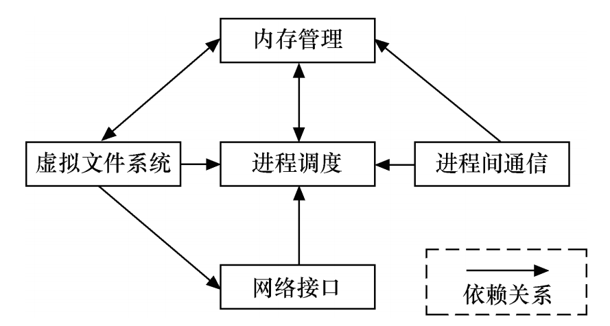
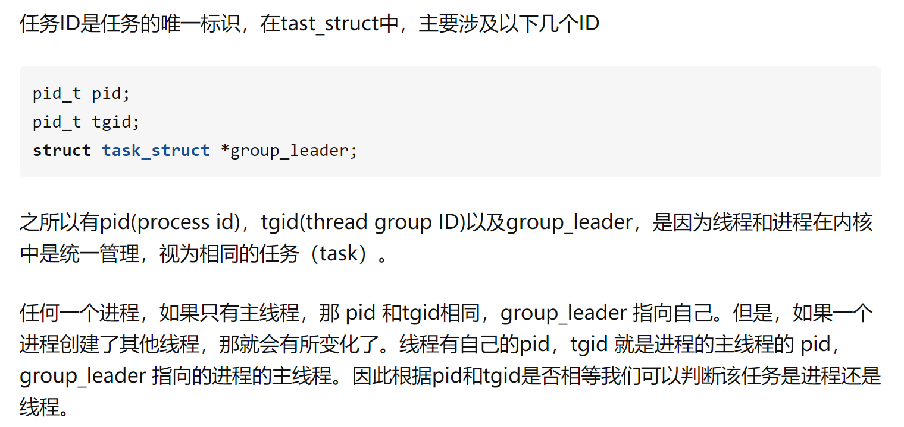
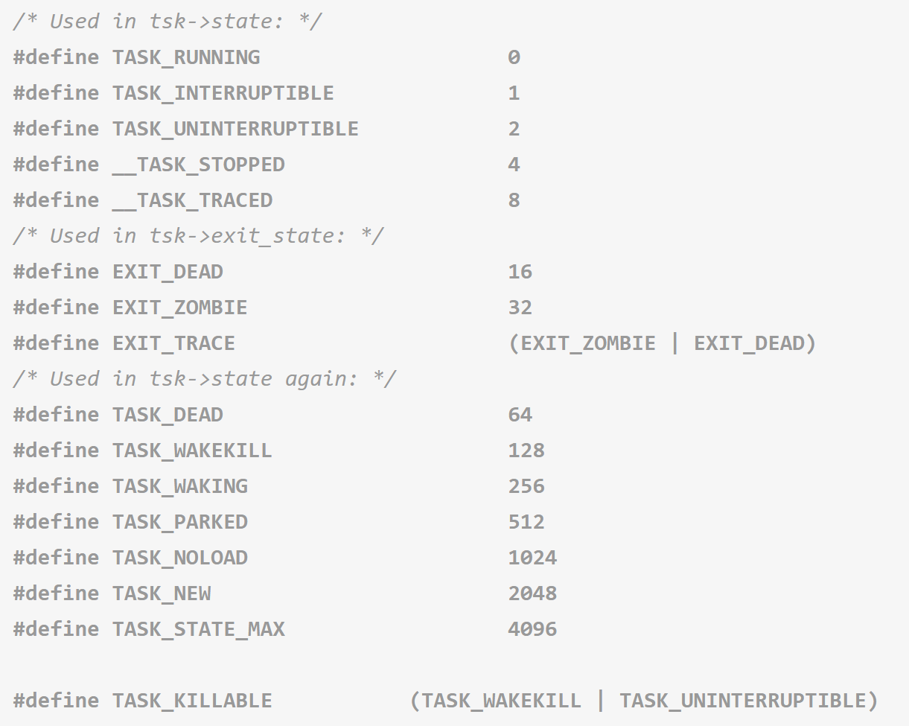
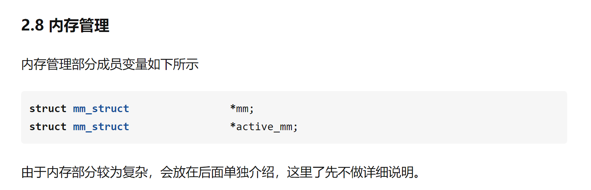
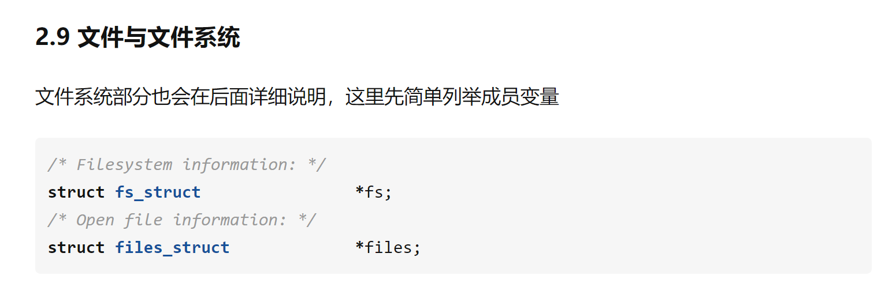
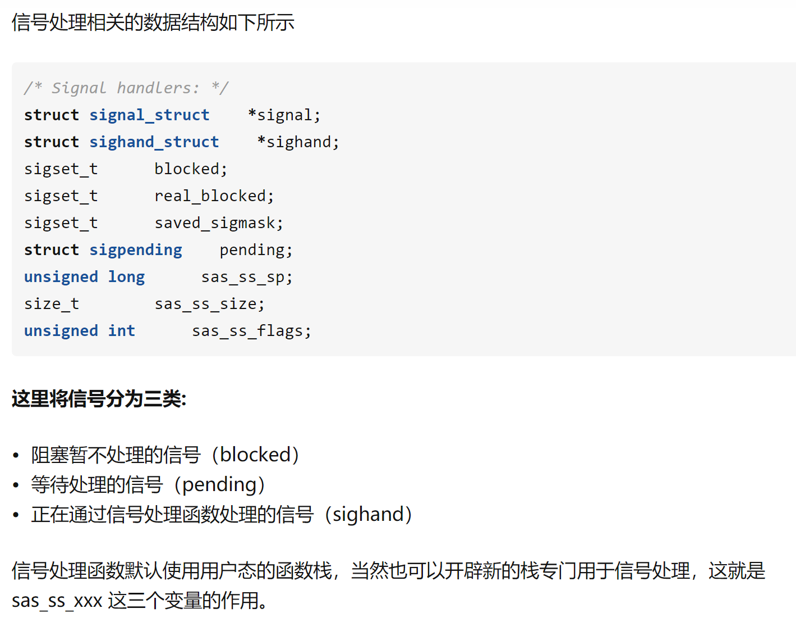
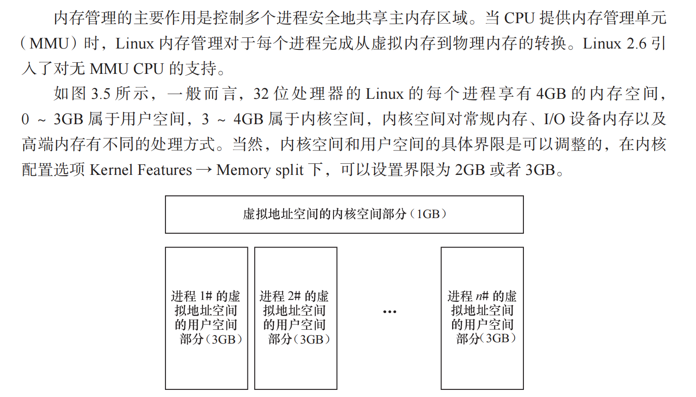
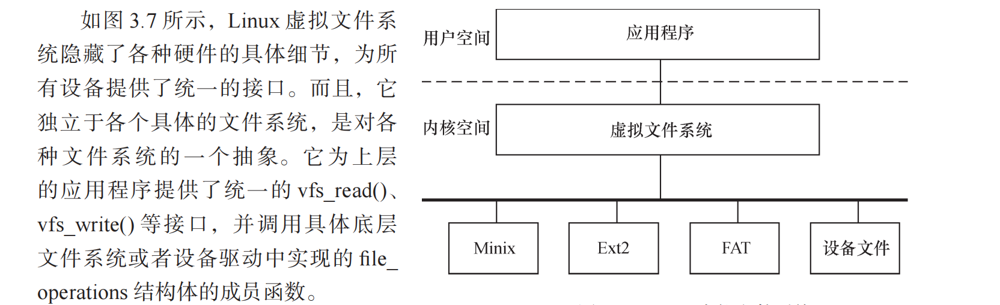
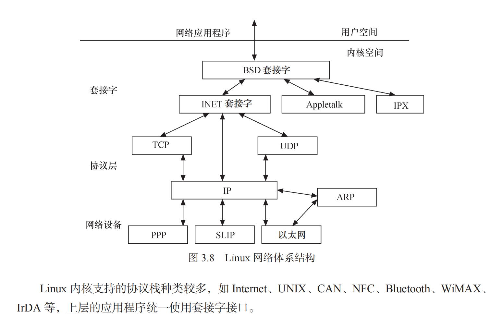
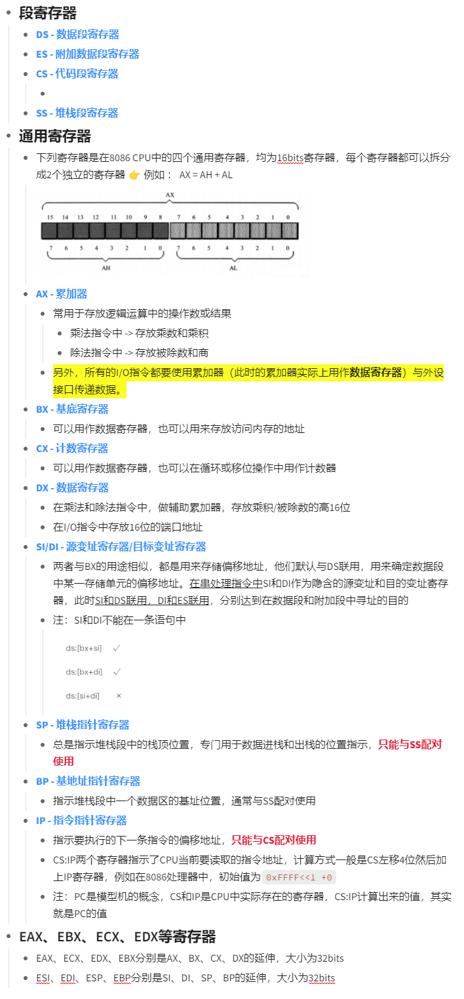

## Linux内核

主要由5部分组成：

- 进程调度（SCHED）

  > 进程调度负责控制系统中的多个进程对 CPU 的访问，实现多进程并发（分时复用）地执行
  >
  > - 进程的描述
  >
  >   - 在Linux内核中，使用进程描述符task_struct来描述进程，该结构体描述的主要包括：
  >
  >     - 任务ID
  >
  >       
  >
  >     - 任务状态
  >
  >       其中状态state通过设置比特位的方式来赋值，具体值在include/linux/sched.h中定义
  >
  >       
  >
  >     - 内存资源
  >
  >       
  >
  >     - 文件与文件系统资源
  >
  >       
  >
  >     - tty资源
  >
  >     - 信号处理相关的数据结构
  >
  >       

- 内存管理（MM）

  > - 虚拟内存与页表（内存分页）
  >
  >   

- 虚拟文件系统（VFS）

  > 

- 网络接口（NET）

  > 
  >
  > 网络接口提供了对各种网络标准的存取和各种网络硬件的支持。如上所示，在Linux中网络接口可分为网络协议和网络驱动程序，网络协议部分负责实现每一种可能的网络传输协议，网络设备驱动程序负责与硬件设备通信，每一种可能的硬件设备都有相应的设备驱动程序。

- 进程间通信（IPC）

## 常用的寄存器

