### OSI七层模型及其包含的协议

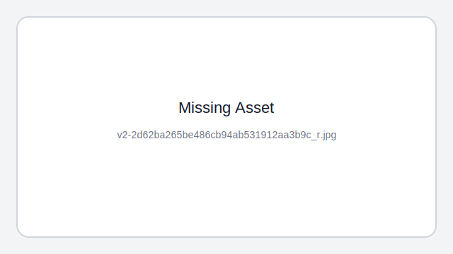

1. 物理层: `底层数据传输`，如网线；网卡标准，通过媒介传输比特,确定机械及电气规范,传输单位为`bit`，<u>01模数和数模转换 物理设备的标准和比特流的收发</u>      ==<u>比特流传输</u>==

   主要包括的协议为：IEE802.3 CLOCK RJ45

2. 数据链路层: `定义数据的基本格式，如何传输，如何标识`；如网卡MAC地址提供介质访问和链路管理，使用链路层地址 (以太网使用MAC地址)来访问介质,并进行差错检测，将比特组装成帧和点到点的传递,传输单位为`帧`,     ==<u>控制物理层和网络成之间通信</u>==

   主要包括的协议为MAC VLAN PPP

3. 网络层：`定义IP编址，定义路由功能；如不同设备的数据转发`，IP选址和路由选择，负责数据包从源到宿的传递和网际互连，传输单位为包或分组（`IP数据报`）,         ==<u>IP寻址和路由选择</u>==

   > `进行逻辑地址寻址，在位于不同地理位置的网络中的两个主机系统之间提供连接和路径选择`

   主要包括的协议为IP ARP ICMP

4. 传输层：端到端传输数据的基本功能；提供端到端的可靠报文传递和错误恢复，传输单位为报文段（TCP）或用户数据报（UDP）  `段`，         ==<u>建立维护管理 端到端连接</u>==

   > `建立 管理和维护 端到端的连接`          端口

   主要包括的协议为TCP UDP

5. 会话层：`控制应用程序之间会话能力；如不同软件数据分发给不同软件`，建立、管理和终止会话，传输单位为SPDU，  ==<u>建立维护管理 会话连接</u>==

   主要包括的协议为RPC NFS

6. 表示层:  `数据格式标识，基本压缩加密功能`；对数据进行翻译、加密和压缩,传输单位为PPDU，  ==<u>数据格式化 加解密</u>==

   主要包括的协议为HTML ASCII

7. 应用层:  `各种应用软件，包括 Web 应用，`为计算机用户提供应用接口，也为用户直接提供各种网络服务,   ==<u>为应用程序提供网络服务</u>==

   传输单位为APDU，主要包括的协议为FTP HTTP DNS

说明：

- 在四层，既传输层数据被称作**段**（Segments）；
- 三层网络层数据被称做**包**（Packages）；
- 二层数据链路层时数据被称为**帧**（Frames）；
- 一层物理层时数据被称为**比特流**（Bits）。

##### [总结](https://interviewguide.cn/#/Doc/Knowledge/计算机网络/计算机网络?id=总结)

- 网络七层模型是一个标准，而非实现。
- 网络四层模型是一个实现的应用模型。
- 网络四层模型由七层模型简化合并而来。


### ==TCP==/IP 4层模型

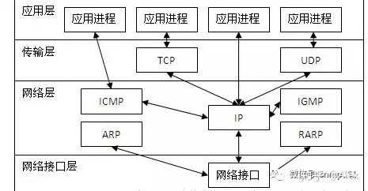

1. 网络接口层 - 网络接口层（或链路层）负责将TCP / IP`数据包放在网络介质`上，并从网络介质上接收TCP / IP数据包。 TCP / IP被设计为独立于网络访问方法，帧格式和介质。换句话说，它独立于任何特定的网络技术。这样，TCP / IP可以用于连接不同的网络类型，例如以太网，令牌环，X.25，帧中继和异步传输模式（ATM）。　 ==<u>以太网协议</u>==

   > （这里只写了数据链路层）
   >
   > 将源自网络层来的数据可靠地传输到相邻节点的目标机网络层
   >
   > 该层的作用包括：<u>`物理地址寻址`、数据的`成帧`、`流量控制`、数据的`检错`、`重发`等</u>。

   有关数据链路层的重要知识点：

   1. 数据链路层为网络层提供可靠的数据传输；
   2. 基本数据单位为帧；
   3. 主要的协议：`以太网协议`；
   4. 两个重要设备名称：网桥和交换机。

2. 网络层:<u>==IP  ICMP IGMP==</u>  ==<u>ARP RARP</u>== 

   网络层 - <u>网络层负责主机寻址，打包和路由功能</u>。 网络层的核心协议是==IP==，地址解析协议（==ARP==），Internet控制消息协议（==ICMP==）和Internet组管理协议（==IGMP==）。 

   > IP是可路由协议，负责`IP寻址`，`路由`以及`数据包的分段和重组`。 
   >
   > ARP负责`发现网络访问层地址`，例如与给定Internet层访问关联的`硬件地址`。
   >
   > 由于IP数据包传递失败，ICMP负责`提供诊断功能并报告错误`。 
   >
   > IGMP负责`IP多播组的管理`。 IP在此层中将标头添加到数据包中，称为IP地址。现在既有IPv4（32位）地址又有IPv6（128位）地址。

   <u>网络层的`目的`是实现两个`主机`系统之间的`数据`透明`传送`，具体功能包括`寻址`和`路由选择`、`连接的建立、保持和终止`等。</u>

   1. 网络层负责对子网间的数据包进行路由选择。此外，网络层还可以实现拥塞控制、网际互连等功能；
   2. 传输单位为包或分组（IP数据报）
   3. 重要的设备：路由器。

3. 传输层:==TCP UDP==

   向两台主机中`进程之间`的通信提供通用的`数据传输`服务。

   网络层只是根据网络地址将源结点发出的数据包传送到目的结点，而传输层则负责将数据可靠地传送到相应的端口。

   有关传输层的重点：

   1. 传输层负责将上层数据分段并提供端到端的、可靠的或不可靠的传输以及端到端的差错控制和流量控制问题；
   2. 包含的主要协议：TCP协议（Transmission Control Protocol，传输控制协议）、UDP协议（User Datagram Protocol，用户数据报协议）；

   3. 重要设备：网关。

4. 应用层:HTTP DNS SMTP

   通过应用进程间的交互来完成特定的网络应用。应用层协议是`应用`进程间`通信和交互的规则`。是最靠近用户的OSI层，为用户的应用程序提供网络服务的接口。将用户的操作通过应用程序转换成为服务，并匹配一个相应的服务协议发送给传输层。传输单位为报文。


### 端口有效范围是多少到多少

`0-1023为知名端口号`，比如其中HTTP是80，FTP是20（数据端口）、21（控制端口）

`UDP和TCP报头使用两个字节存放端口号，所以端口号的有效范围是从0到65535`。<u>动态端口的范围是从1024到65535</u> (2^16^-1)

端口号用来`标识进程的唯一性`，一个进程不能占用多个端口号 

其实端口就是一段缓冲区(读写缓冲区)，端口号就是唯一标识。

#### 是否可以修改？如果想要用的端口超过这个限制怎么办？

对于服务器来说，可以开的端口号与65536无关，其实是受限于Linux可以打开的文件数量，并且可以通过`MaxUserPort`来进行配置


### 为何需要把 TCP/IP 协议栈分成 5 层（或7层）

ARPANET 的研制经验表明，对于复杂的计算机网络协议，其结构应该是层次式的。

`分层的好处：`

> ①隔层之间是`独立`的
>
> ②`灵活`性好
>
> ③`结构`上可以`分隔`开
>
> ④易于`实现和维护`
>
> ⑤能促进`标准化`工作。


### web为什么不直接用tcp协议

1. 大概就是tcp协议可以让两个进程通过三次握手建立稳定的通信信道，发送字节流，而http协议建立在tcp协议之上，也就是说<u>tcp协议可以让两个程序说话，而http协议定义了说话的规则</u>。HTTP定义了请求对象和响应对象，各种头字段，发送方和接收方才能相互明白。

2. 浏览器需要提供一个`安全沙箱`,在使用网络协议上就需要加入一些诸如**跨域**等限制.

   如果浏览器提供建立裸TCP链接的能力,那么当你打开网页的时候,该网页的脚本就可以利用TCP协议访问内网的资源.


### TCP`报文头`

TCP报文头是TCP协议在数据传输过程中每个TCP数据包（Segment）中的头部信息，它包含了TCP协议所需的控制信息和元数据。TCP报文头的格式如下：

```mathematica
0                   1                   2                   3
0 1 2 3 4 5 6 7 8 9 0 1 2 3 4 5 6 7 8 9 0 1 2 3 4 5 6 7 8 9 0 1
+-+-+-+-+-+-+-+-+-+-+-+-+-+-+-+-+-+-+-+-+-+-+-+-+-+-+-+-+-+-+-+-+
|          Source Port          |       Destination Port        |
+-+-+-+-+-+-+-+-+-+-+-+-+-+-+-+-+-+-+-+-+-+-+-+-+-+-+-+-+-+-+-+-+
|                        Sequence Number                        |
+-+-+-+-+-+-+-+-+-+-+-+-+-+-+-+-+-+-+-+-+-+-+-+-+-+-+-+-+-+-+-+-+
|                    Acknowledgment Number                      |
+-+-+-+-+-+-+-+-+-+-+-+-+-+-+-+-+-+-+-+-+-+-+-+-+-+-+-+-+-+-+-+-+
|  Data |           |U|A|P|R|S|F|                               |
| Offset| Reserved  |R|C|S|S|Y|I|            Window             |
|       |           |G|K|H|T|N|N|                               |
+-+-+-+-+-+-+-+-+-+-+-+-+-+-+-+-+-+-+-+-+-+-+-+-+-+-+-+-+-+-+-+-+
|           Checksum            |         Urgent Pointer        |
+-+-+-+-+-+-+-+-+-+-+-+-+-+-+-+-+-+-+-+-+-+-+-+-+-+-+-+-+-+-+-+-+
|                    Options                    |    Padding    |
+-+-+-+-+-+-+-+-+-+-+-+-+-+-+-+-+-+-+-+-+-+-+-+-+-+-+-+-+-+-+-+-+
```

其中，各字段的含义如下：

- Source Port和Destination Port：源端口和目标端口，标识发送方和接收方的应用程序或服务。
- Sequence Number：序列号，用于按序传输数据和处理乱序到达的数据包。
- Acknowledgment Number：确认号，表示期望接收到的下一个字节的序列号。
- Data Offset：数据偏移，指示TCP报文头的长度。
- Reserved：保留字段，保留供将来使用。
- Control Flags：标志位，包括以下几个控制标志：
  - URG：表示Urgent指针是否有效。
  - ACK：表示Acknowledgment字段是否有效。
  - PSH：表示接收方是否应该尽快将数据传递给应用层。
  - RST：重置连接标志，用于中断连接。
  - SYN：同步连接标志，用于建立连接。
  - FIN：结束连接标志，用于关闭连接。
- Window：窗口大小，表示接收方的接收缓冲区大小。
- Checksum：校验和，用于检测TCP报文的传输错误。
- Urgent Pointer：紧急指针，指示紧急数据的边界。
- Options：选项字段，包含可选的附加信息，如最大报文段长度、时间戳等。
- Padding：填充字段，用于使TCP报文头的长度为4字节的倍数。

TCP报文头中的这些字段提供了TCP协议在数据传输过程中的控制和管理功能，确保数据的可靠传输和有效处理。


### TCP`可靠性保证`

1. **序列号、确认应答、超时重传**

   数据到达接收方，接收方需要发出一个确认应答，表示已经收到该数据段，并且确认序号会说明了它下一次需要接收的数据序列号。如果发送发迟迟未收到确认应答，那么可能是发送的数据丢失，也可能是确认应答丢失，这时发送方在等待一定时间后会进行重传。

   这个时间一般是2*RTT(报文段往返时间）+一个偏差值。 ？

   > - 当超时时间 **RTO 较大**时，重发就`慢`，丢了老半天才重发，没有效率，性能差；
   > - 当超时时间 **RTO 较小**时，会导致`可能并没有丢就重发`，于是重发的就快，会增加网络拥塞，导致更多的超时，更多的超时导致更多的重发。
   >
   > 根据上述的两种情况，我们可以得知，`超时重传时间 RTO 的值应该略大于报文往返 RTT 的值`。
   >
   > **每当遇到一次超时重传的时候，都会将下一次超时时间间隔设为先前值的两倍。两次超时，就说明网络环境差，不宜频繁反复发送。**   由此引出快重传来解决超时时间可能过长的问题

2. **窗口控制与高速重发控制/快速重传（重复确认应答）**

   TCP会利用窗口控制来提高传输速度，意思是在一个窗口大小内，不用一定要等到应答才能发送下一段数据，窗口大小就是无需等待确认而可以继续发送数据的最大值<u>==（一次发送多个段）==</u>。如果不使用窗口控制，每一个没收到确认应答的数据都要重发。

   使用窗口控制，如果数据段1001-2000丢失，后面数据每次传输，确认应答都会不停地发送序号为1001的应答，表示我要接收1001开始的数据，发送端如果收到3次相同应答，就会立刻进行重发；但还有种情况有可能是数据都收到了，但是有的应答丢失了，这种情况不会进行重发，因为发送端知道，如果是数据段丢失，接收端不会放过它的，会疯狂向它提醒......

3. **拥塞控制**

   如果把窗口定的很大，发送端连续发送大量的数据，可能会造成网络的拥堵（大家都在用网，你在这狂发，吞吐量就那么大，当然会堵），甚至造成网络的瘫痪。所以TCP在为了防止这种情况而进行了拥塞控制。

   （这里的窗口大小为了方便以报文为单位，实际窗口是以字节为单位）

   > **慢启动**：定义拥塞窗口，一开始将该窗口大小设为1，之后每经过一个传输轮次（经过一个rtt），将拥塞窗口大小*2。（每收到一个确认窗口加1）  <u>==（指数增长）==</u>
   >
   > **拥塞避免**：设置慢启动阈值，一般开始都设为65536。拥塞避免是指当拥塞窗口大小达到这个阈值，拥塞窗口的值不再指数上升，而是加法增加（每经过一个传输轮次/每个rtt，拥塞窗口大小<u>==+1==</u>），以此来避免拥塞。
   >
   > 将报文段的超时重传看做拥塞，则<u>一旦发生超时重传</u>，我们需要<u>先将阈值设为当前窗口大小的一半</u>，并且<u>将窗口大小设为初值1</u>，然后重新进入慢启动过程。
   >
   > **快速重传**：在遇到3次重复确认应答（高速重发控制）时，代表收到了3个报文段，但是这之前的1个段丢失了，便对它进行立即重传。
   >
   > 然后，先将阈值设为当前窗口大小的一半，然后将拥塞窗口大小设为慢启动阈值+3（3次重复确认应答，代表有3个报文结束传输）的大小。（可以+3可以不加）
   >
   > 这样可以达到：在TCP通信时，网络吞吐量呈现逐渐的上升，并且随着拥堵来降低吞吐量，再进入慢慢上升的过程，网络不会轻易的发生瘫痪。


### 重传机制 超时重传和快重传

#### **重传机制**

TCP 实现可靠传输的方式之一，是通过`序列号`与`确认应答`。

TCP 针对数据包丢失的情况，会用**重传机制**解决。

> 常见的重传机制：
>
> - 超时重传
> - 快速重传
> - SACK
> - D-SACK

#### 超时重传 时间驱动

TCP 会在以下两种情况发生`超时重传`：

> - 数据包丢失
> - 确认应答丢失

`RTT`（Round-Trip Time 往返时延）：就是**数据从网络一端传送到另一端所需的时间**，也就是==<u>**包的往返时间**</u>==。

超时重传时间是以 `RTO` （Retransmission Timeout 超时重传时间）表示


> - 当超时时间 **RTO 较大**时，`重发就慢`，丢了老半天才重发，没有效率，性能差；
> - 当超时时间 **RTO 较小**时，会导致`可能并没有丢就重发`，于是重发的就快，会增加网络拥塞，导致更多的超时，更多的超时导致更多的重发。

超时重传时间 `RTO `的值应该`略大于`报文往返 2*`RTT` 的值。

如果超时重发的数据，再次超时的时候，又需要重传的时候，TCP 的策略是**超时间隔加倍。**

也就是**每当遇到一次超时重传的时候，都会将下一次超时时间间隔设为先前值的两倍。两次超时，就说明网络环境差，不宜频繁反复发送。**超时触发重传存在的问题是，超时周期可能相对较长。于是就可以用「快速重传」机制来解决超时重发的时间等待。

#### **快速重传** 数据驱动

**不以时间为驱动，而是以数据驱动重传**。

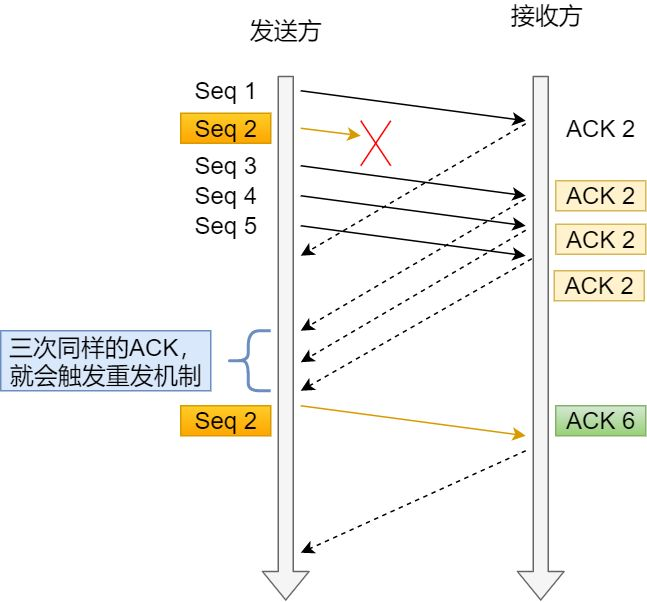

> - 第一份 Seq1 先送到了，于是就 Ack 回 2；
> - 结果 Seq2 因为某些原因没收到，Seq3 到达了，于是还是 Ack 回 2；
> - 后面的 Seq4 和 Seq5 都到了，但还是 Ack 回 2，因为 Seq2 还是没有收到；
> - **发送端收到了三个 Ack = 2 的确认，知道了 Seq2 还没有收到，就会在定时器过期之前，重传丢失的 Seq2。**
> - 最后，收到了 Seq2，此时因为 Seq3，Seq4，Seq5 都收到了，于是 Ack 回 6 。

所以，快速重传的工作方式是当收到三个相同的 ACK 报文时，会在定时器过期之前，重传丢失的报文段。

快速重传机制只解决了一个问题，就是超时时间的问题，但是它依然面临着另外一个问题。就是**重传的时候，是重传之前的一个，还是重传所有的问题。**

比如对于上面的例子，是重传 Seq2 呢？还是重传 Seq2、Seq3、Seq4、Seq5 呢？因为发送端并不清楚这连续的三个 Ack 2 是谁传回来的。

> 就是没法偷懒 只重传Seq2  因为不知道后面的是 3 4 5 6 7 8 9中的那几个回复的，这几个是不是也有丢失，这几个是不是也需要重传

#### **SACK 方法**

在 TCP 头部「选项」字段里加一个 `SACK` 的东西，它**可以将缓存的地图发送给发送方**，这样发送方就可以知道哪些数据收到了，哪些数据没收到，知道了这些信息，就可以**只重传丢失的数据**。

#### **Duplicate SACK**

Duplicate SACK 又称 `D-SACK`，其主要**使用了 SACK 来告诉「发送方」有哪些数据被重复接收了。**


### `滑动窗口`

1. 如果不使用滑动窗口就是上述情况 我发给你 你回复我 我收到你的ack之后 才能继续发送下一个

   缺点：数据包的`往返时间越长`，`通信的效率就越低`

2. ==<u>窗口</u>==：有了窗口，就可以指定窗口大小，窗口大小就是指`无需等待确认应答`，而可以`继续发送数据的最大值`。
3. 假设<u>窗口大小为多个 TCP 段</u>，那么发送方就可以「连续发送」 多 个 TCP 段，并且中途若有 ACK 丢失，可以通过「下一个确认应答进行确认」。 实现**累计确认**或者**累计应答**。
4. 窗口大小由接收端确定  由于时延, 窗口大小是约等于的关系


### `流量控制`

1. ==目的:== 如果发送者发送数据过快，接收者来不及接收，那么就会有分组丢失。为了避免分组丢失，控制发送者的发送速度，使得接收者来得及接收，这就是流量控制。流量控制根本目的是防止分组丢失，它是构成TCP可靠性的一方面。

2. ==实现==: 由`滑动窗口协议`（连续ARQ协议）实现。滑动窗口协议既保证了分组无差错、有序接收，也实现了流量控制。主要的方式就是接收方返回的 ACK 中会包含自己的接收窗口的大小，并且利用大小来控制发送方的数据发送。

3. ==注意==: 如果发生了先减少缓存，再收缩窗口，就会出现丢包的现象。  （`发送方数据发多了 但是接收方没有足够的缓冲区接收 导致数据丢丢失`）

   **为了防止这种情况发生，TCP 规定是不允许同时减少缓存又收缩窗口的，而是采用先收缩窗口，过段时间再减少缓存，这样就可以避免了丢包情况。**

4. ==窗口关闭的问题==: 接收方将自己的窗口设置为0, 就是窗口关闭, 但是, 存在`潜在的危险`, 就是接收方处理完数据后，会向发送方通告一个窗口非 0 的 ACK 报文，<u>如果这个通告窗口的 ACK 报文在网络中丢失了，那麻烦就大了。</u> 这会导致`发送方`一直`等待`接收方的`非 0 窗口通知`，`接收方`也一直`等待发送方的数据`，如不采取措施，这种相互等待的过程，会造成了`死锁`的现象

5. ==窗口关闭问题的解决:==:  TCP 为每个连接设有一个持续定时器，`只要` TCP 连接一方收`到对方的零窗口通知`，就`启动持续计时器`。 如果持续计时器超时，就会发送**窗口探测 ( Window probe ) 报文**，而对方在确认这个探测报文时，给出自己现在的接收窗口大小, 探测三次, 无反应的话rst中断连接


### `糊涂窗口`综合症

1. 如果接收方太忙了，来不及取走接收窗口里的数据，那么就会导致发送方的发送窗口越来越小。 到最后，**如果接收方腾出几个字节并告诉发送方现在有几个字节的窗口，而发送方会义无反顾地发送这几个字节，这就是糊涂窗口综合症**。

2. ==问题原因:== 糊涂窗口综合症的现象是可以发生在发送方和接收方：

   - `接收方可以通告一个小的窗口`
   - `发送方可以发送小数据`

3. 解决方法: 

   - `让接收方不通告小窗口给发送方`

     > 当「窗口大小」小于 `min( MSS，缓存空间/2 )` ，也就是小于 MSS 与 1/2 缓存大小中的最小值时，就会向发送方通告窗口为 `0`，也就阻止了发送方再发数据过来。
     >
     > 等到接收方处理了一些数据后，窗口大小 >= MSS，或者`接收方缓存空间有一半可以使用`，就可以把窗口打开让发送方发送数据过来。

   - ``让发送方避免发送小数据`

     > 使用 `Nagle 算法`(默认打开)，该算法的思路是延时处理，它满足以下两个条件中的一条才可以发送数据：
     >
     > - 要等到窗口大小 >= `MSS` 或是 数据大小 >= `MSS`
     > - 收到之前发送数据的 `ack` 回包 
     >
     > 关闭方法: 在 Socket 设置 `TCP_NODELAY`


### `拥塞控制`

发送方维持一个叫做拥塞窗口cwnd（congestion window）的状态变量。拥塞窗口的大小取决于网络的拥塞程度，并且动态地在变化。发送方让自己的发送窗口等于拥塞窗口，另外考虑到接受方的接收能力，发送窗口可能小于拥塞窗口。

#### `整体流程`

1. 执行慢开始算法 直到到达门限值ssh 
2. 执行拥塞避免算法 直到网络拥塞（接收者收到失序报文段）
3. - 执行快重传算法 接受方立刻发送确认报文段 发送方收到三个确认 立刻重发丢失报文段
   - 执行快恢复算法 拥塞值减半赋值给ssh 网络流量调整至门限值 执行拥塞避免算法

#### 慢开始算法：

1. 慢开始算法的==思路==就是，不要一开始就发送大量的数据，先`探测`一下网络的拥塞程度，也就是说由小到大逐渐增加拥塞窗口的大小。
2. 每经过一个传输轮次（transmission round），拥塞窗口cwnd就加倍。
3. 为了防止cwnd增长过大引起网络拥塞，还需设置一个慢开始门限ssthresh状态变量。ssthresh的用法如下：
   - 当cwnd<ssthresh时，使用慢开始算法。
   - 当cwnd>ssthresh时，改用拥塞避免算法。
   - 当cwnd=ssthresh时，慢开始与拥塞避免算法任意

4. 注意，这里的“`慢`”并不是指cwnd的增长速率慢，而是`指在TCP开始发送报文段时先设置cwnd=1`，然后逐渐增大，这当然比按照大的cwnd一下子把许多报文段突然注入到网络中要“慢得多”。

#### 拥塞避免算法

1. 拥塞避免算法让拥塞窗口缓慢增长，`加法增大,` 即每经过一个往返时间RTT就把发送方的拥塞窗口<u>cwnd加`1`</u>，而不是加倍。这样拥塞窗口按线性规律缓慢增长。
2. 出现拥塞: 执行`乘法减小`, 就是将ssthresh阈值设为拥塞值的1/2

#### 快重传算法

快重传突出一个快 由原来的超时重传的 时间驱动改为数据驱动

1. 快重传要求接收方在<u>收到一个失序的报文段后就`立即`发出重复确认</u>（为的是使发送方及早知道有报文段没有到达对方，可提高网络吞吐量约20%）而==<u>不要等到自己发送数据时捎带确认</u>==。
2. 发送方`只要一连收到三个重复确认`就应当`立即重传对方尚未收到的报文段`，而不必继续等待设置的重传计时器时间到期。

#### 快恢复算法

1. 当发送方连续<u>收到三个重复确认时，就执行“`乘法减小`”算法</u>，把ssthresh门限减半（为了预防网络发生拥塞）。但是接下去并不执行慢开始算法
2. 考虑到如果网络出现拥塞的话就不会收到好几个重复的确认，所以发送方现在认为网络可能没有出现拥塞。所以此时不执行慢开始算法，而是将cwnd设置为ssthresh减半后的值，然后执行拥塞避免算法，使cwnd缓慢增大。如下图：TCP Reno版本是目前使用最广泛的版本。

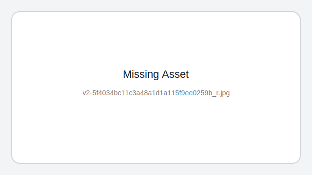


### ==三次握手==


1. Client将`标志位SYN置为1`，`随机产生一个值seq`=J，并将该`数据包发送给Serve`r，Client进入`SYN_SENT`状态，等待Server确认。

2. Server收到数据包后由标志位SYN=1知道Client请求建立连接，`Server将标志位SYN和ACK都置为1`，`ack=J+1`，`随机产生一个值seq`=K，并将该数据包发送给Client以确认连接请求，Server进入`SYN_RCVD`状态。

3. Client收到确认后，`检查ack是否为J+1`，`ACK是否为1`，如果正确则将`标志位ACK置为1`，`ack=K+1`，并`将该数据包发送给Server`，`Server检查ack是否为K+1`，`ACK是否为1`，如果正确则连接建立成功，Client和Server进入`ESTABLISHED`状态，完成三次握手，随后Client与Server之间可以开始传输数据了。

   > ACK: 一个是==<u>标志位</u>==确认值(Acknowledgement)，为1便是确认连接。
   > ack: 另一个是==<u>确认编号</u>==(Acknowledgement Number)，即接收到的上一次远端主机传来的seq然后+1，再发送给远端主机。提示远端主机已经成功接收上一次所有数据。
   >
   > `seq（Sequence Number）：` `32bits`，表示这个`tcp`包的序列号。`tcp`协议拼凑接收到的数据包时，根据`seq`来确定顺序，并且能够确定是否有数据包丢失。

<u>第三次握手时，[客户端](https://www.nowcoder.com/jump/super-jump/word?word=客户端)`可以携带正式数据`，</u>如果不携带，那么连接后客户端第一次的seq跟第三次握手的seq一样


### `为什么`是`三次`握手？不是两次、四次？

- #### 三次握手才可以`阻止重复历史连接的初始化`（主要原因）

  > 客户端连续发送多次 SYN 建立连接的报文，在**网络拥堵**情况下：
  >
  > - 一个「旧 SYN 报文」比「最新的 SYN 」 报文早到达了服务端；
  > - 那么此时服务端就会回一个 `SYN + ACK` 报文给客户端；
  > - 客户端收到后可以根据`自身的上下文`，`判断这是一个历史连接（序列号过期或超时）`，那么客户端就会发送 `RST` 报文给服务端，表示`中止`这一次连接。
  >
  > **如果是两次握手连接，就无法阻止历史连接**
  >
  > 主要是因为**在两次握手的情况下，「被动发起方」没有中间状态给「主动发起方」来阻止历史连接，导致「被动发起方」可能建立一个历史连接，造成资源浪费**。
  >
  > > 两次握手的情况下，「被动发起方」在收到 SYN 报文后，就进入 ESTABLISHED 状态，意味着这时可以给对方发送数据给，但是「主动发」起方此时还没有进入 ESTABLISHED 状态，假设这次是历史连接，主动发起方判断到此次连接为历史连接，那么就会回 RST 报文来断开连接，而「被动发起方」在第一次握手的时候就进入 ESTABLISHED 状态，所以它可以发送数据的，但是它并不知道这个是历史连接，它只有在收到 RST 报文后，才会断开连接。
  > >
  > > 可以看到，上面这种场景下，「被动发起方」在向「主动发起方」发送数据前，并没有阻止掉历史连接，导致「被动发起方」建立了一个历史连接，又白白发送了数据，妥妥地浪费了「被动发起方」的资源。
  >
  > 因此，**要解决这种现象，最好就是在「`被动发起方`」发送数据前，也就是`建立连接之前，要阻止掉历史连接`，这样就不会造成资源浪费，而要实现这个功能，就需要三次握手**。
  >
  > 所以，**TCP 使用三次握手建立连接的最主要原因是防止「历史连接」初始化了连接。**
  >
  > ==两次连接没办法在被动连接放发送数据前阻止无效的连接==

- #### 三次握手才可以`同步`双方的`初始序列号`

  > TCP 协议的通信双方， 都必须维护一个「`序列号`」， 序列号是可靠传输的一个关键因素，它的作用：
  >
  > - 接收方可以去除重复的数据；
  > - 接收方可以根据数据包的序列号按序接收；
  > - 可以标识发送出去的数据包中， 哪些是已经被对方收到的（通过 ACK 报文中的序列号知道）；
  >
  > 可见，序列号在 TCP 连接中占据着非常重要的作用，所以当客户端发送携带「初始序列号」的 SYN 报文的时候，需要服务端回一个 ACK 应答报文，表示客户端的 SYN 报文已被服务端成功接收，==那当服务端发送「初始序列号」给客户端的时候，依然也要得到客户端的应答回应==，**这样一来一回，才能确保双方的初始序列号能被可靠的同步。**
  >
  > 四次握手其实也能够可靠的同步双方的初始化序号，但由于**第二步和第三步可以优化成一步**，所以就成了「三次握手」。
  >
  > 而两次握手只保证了一方的初始序列号能被对方成功接收，没办法保证双方的初始序列号都能被确认接收。

- #### 三次握手才可以`避免资源浪费`

  > 如果只有「两次握手」，当客户端的 SYN 请求连接在网络中阻塞，客户端没有接收到 ACK 报文，就会重新发送 SYN ，由于没有第三次握手，服务器不清楚客户端是否收到了自己发送的建立连接的 ACK 确认信号，所以每收到一个 SYN 就只能先主动建立一个连接，这会造成什么情况呢？
  >
  > 如果客户端的 SYN 阻塞了，重复发送多次 SYN 报文，那么服务器在收到请求后就会**建立多个冗余的无效链接，造成不必要的资源浪费。**
  >
  > 即两次握手会造成消息滞留情况下，服务器重复接受无用的连接请求 SYN 报文，而造成重复分配资源。
  >
  > ==第一点提到的 建立连接造成的资源浪费==

####  小结

TCP 建立连接时，通过三次握手**能防止历史连接的建立，能减少双方不必要的资源开销，能帮助双方同步初始化序列号**。序列号能够保证数据包不重复、不丢弃和按序传输。

不使用「两次握手」和「四次握手」的原因：

- 「两次握手」：<u>无法防止历史连接的建立，会造成双方资源的浪费，也无法可靠的同步双方序列号；</u>
- 「四次握手」：三次握手就已经理论上最少可靠连接建立，所以`不需要`使用更多的通信次数。


### `TCP 连接`时，初始化`序列号`

#### 为什么每次都要初始化序列号

主要原因有两个方面：

- 为了`防止历史报文被下一个相同四元组的连接接收`（主要方面）；
- 为了`安全`性，防止黑客伪造的相同序列号的 TCP 报文被对方接收；

#### 初始序列号 ISN 是`如何随机`产生的？

起始 `ISN` 是基于时钟的，每 4 微秒 + 1，转一圈要 4.55 个小时。

RFC793 提到初始化序列号 ISN 随机生成算法：ISN = M + F(localhost, localport, remotehost, remoteport)。

- `M` 是一个计时器，这个计时器每隔 4 微秒加 1。
- `F` 是一个 Hash 算法，根据源 IP、目的 IP、源端口、目的端口生成一个随机数值。要保证 Hash 算法不能被外部轻易推算得出，用 MD5 算法是一个比较好的选择。

可以看到，随机数是会基于时钟计时器递增的，基本不可能会随机成一样的初始化序列号。

==计时器+根据多个信息hash出来的一个随机值==

#### 是不是可以完全避免相同的序列号？

==不能完全== 因为序列号是unsigned int 会发生==回绕==

1. 因为序列号是一个32位无符号int ，**因此在到达 4G 之后再循环回到 0**。
2. **初始化序列号可被视为一个 32 位的计数器，该计数器的数值每 4 微秒加 1，循环一次需要 4.55 小时**。

#### 怎样避免序列号回绕导致的历史报文混乱

==开启tcp时间戳== tcp时间戳是默认开启的

tcp_timestamps 参数是默认开启的，开启了 tcp_timestamps 参数，TCP 头部就会使用时间戳选项，它有两个好处，**一个是便于精确计算 RTT ，另一个是能防止序列号回绕（PAWS）**。

防回绕序列号算法要求连接双方维护最近一次收到的数据包的时间戳（Recent TSval），每收到一个新数据包都会读取数据包中的时间戳值跟 Recent TSval 值做比较，**如果发现收到的数据包中时间戳`不是递增`的，则表示该数据包是过期的，就会直接丢弃这个数据包**。

> 客户端和服务端的初始化序列号都是随机生成，能很大程度上避免历史报文被下一个相同四元组的连接接收，然后又引入时间戳的机制，从而==完全避免==了历史报文被接收的问题。
>
> > 时间戳也可能回绕


### 既然IP会分片，为什么 `TCP还要分段`

1. 这是因为 tcp分段是为了避免被ip分片 分片可能会破坏包的完整性 并且 ip层没有超时重传
2. IP分片存在着 丢失一个 重传整个的缺点 而TCP有超时重传机制 基本可以保证mss的最大范围内 不需要IP层的分片 可以保证传输效率
3. **总结：\*UDP不会分段，就由IP来分片\*。  \*TCP会分段，当然就不用IP来分片了\***


### `SYN攻击`是什么

**服务器端的资源分配是在二次握手时分配的，而客户端的资源是在完成三次握手时分配的**，所以服务器容易受到SYN洪泛攻击。SYN攻击就是Client在短时间内==伪造大量不存在的IP地址==，并==向Server不断地发送SYN包==，Server则回复确认包，并等待Client确认，由于源地址不存在，因此Server需要不断重发直至超时，这些伪造的SYN包将长时间占用未连接队列，导致正常的SYN请求因为队列满而被丢弃，从而引起网络拥塞甚至系统瘫痪。`SYN 攻击是一种典型的 DoS/DDoS 攻击`。

检测 SYN 攻击非常的方便，当你在服务器上看到大量的半连接状态时，特别是源IP地址是随机的，基本上可以断定这是一次SYN攻击。在 Linux/Unix 上可以使用系统自带的 `netstats` 命令来检测 SYN 攻击。

```
netstat -n -p TCP | grep SYN_RECV
```

常见的防御 SYN 攻击的方法有如下几种：

- 缩短超时（SYN Timeout）时间
- 增加最大半连接数
- 过滤网关防护
- SYN cookies技术

##### SYN cookies 算法

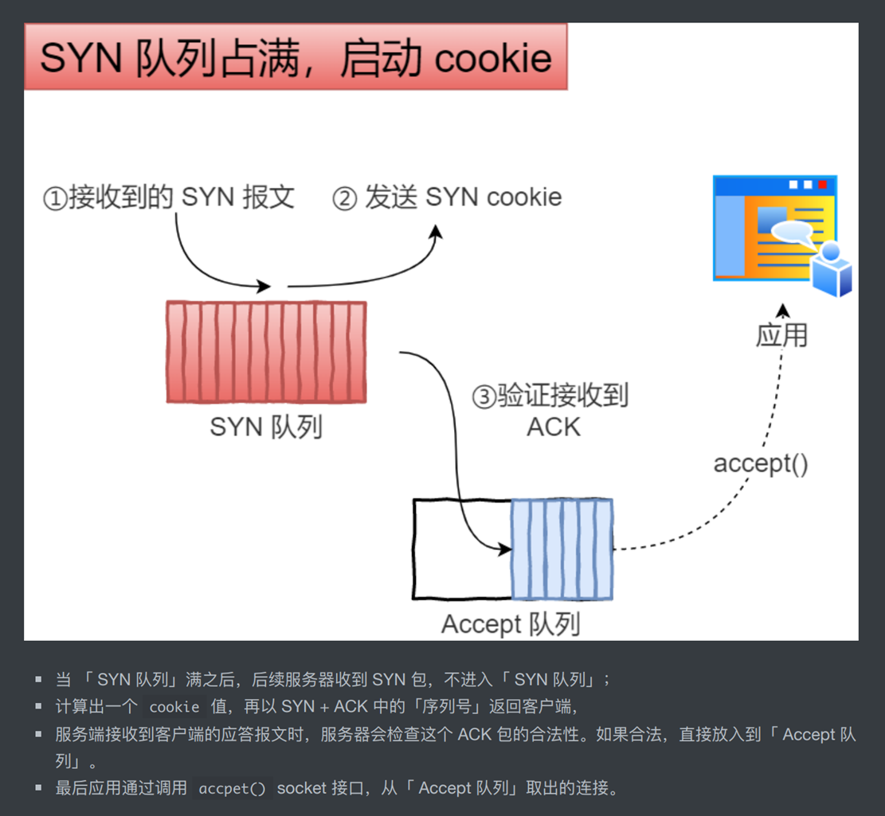

`Syn-Flood`攻击成立的关键在于服务器资源是有限的，而服务器收到请求会分配资源。通常来说，服务器用这些资源保存此次请求的关键信息，包括请求的来源和目(五元组)，以及`TCP`选项，如最大报文段长度`MSS`、时间戳`timestamp`、选择应答使能`Sack`、窗口缩放因子`Wscale`等等。当后续的`ACK`报文到达，三次握手完成，新的连接创建，这些信息可以会被复制到连接结构中，用来指导后续的报文收发。

> 那么现在的问题就是服务器如何在**不分配**`资源`的情况下
>
> 1. 验证之后可能到达的`ACK`的有效性，保证这是一次完整的握手
> 2. 获得`SYN`报文中携带的`TCP`选项信息

`SYN Cookies`算法[wiki](https://link.segmentfault.com/?enc=QCwGO1zqg1sf01yv3Mnr8A%3D%3D.eVpDZWt6plVrSOgyVHvCzaTIL%2BZ%2FVZHzggalBHzNeMkqmxCKo8otKwGGIXUSZZTh)可以解决上面的第`1`个问题以及第`2`个问题的一部分

我们知道，`TCP`连接建立时，双方的起始报文序号是可以**任意**的。`SYN cookies`利用这一点，按照以下规则构造初始序列号：

- 设`t`为一个缓慢增长的时间戳(典型实现是每64s递增一次)
- 设`m`为客户端发送的`SYN`报文中的`MSS`选项值
- 设`s`是连接的元组信息(源IP,目的IP,源端口，目的端口)和`t`经过密码学运算后的`Hash`值，即`s = hash(sip,dip,sport,dport,t)`，`s`的结果取低 **24** 位

则初始序列号`n`为：

- 高 **5** 位为`t mod 32`
- 接下来**3**位为`m`的编码值
- 低 **24** 位为`s`

当客户端收到此`SYN+ACK`报文后，根据`TCP`标准，它会回复`ACK`报文，且报文中`ack = n + 1`，那么在服务器收到它时，将`ack - 1`就可以拿回当初发送的`SYN+ACK`报文中的序号了！服务器巧妙地通过这种方式间接保存了一部分`SYN`报文的信息。

接下来，服务器需要对`ack - 1`这个序号进行检查：

- 将高 **5** 位表示的`t`与当前之间比较，看其到达地时间是否能接受。
- 根据`t`和连接元组重新计算`s`，看是否和低 **24** 一致，若不一致，说明这个报文是被伪造的。
- 解码序号中隐藏的`mss`信息

到此，连接就可以顺利建立了。

##### SYN Cookies 缺点

既然`SYN Cookies`可以减小资源分配环节，那为什么没有被纳入`TCP`标准呢？原因是`SYN Cookies`也是有代价的：

1. `MSS`的编码只有**3**位，因此最多只能使用 **8** 种`MSS`值
2. 服务器必须拒绝客户端`SYN`报文中的其他只在`SYN`和`SYN+ACK`中协商的选项，原因是服务器没有地方可以保存这些选项，比如`Wscale`和`SACK`
3. 增加了密码学运算


### SYN 报文什么时候情况下会被丢弃

YN 报文被丢弃的两种场景：

- 开启 `tcp_tw_recycle` 参数，并且在 NAT 环境下，造成 SYN 报文被丢弃

  > - PAWS `时间戳`机制 时间戳不递增的话 会丢弃数据包    ==开启时间戳==
  > - net.ipv4.tcp_tw_recycle，如果开启该选项的话，允许处于 `TIME_WAIT 状态`的连接被快速回收；  ==时间戳续上==
  >
  > - 如果客户端网络环境是用了 NAT 网关，那么客户端环境的每一台机器通过 NAT 网关后，都会是相同的 IP 地址，在服务端看来，就好像只是在`跟一个客户端`打交道一样，无法区分出来     ==同一个ip相当于同一个客户端==
  >
  > 当客户端 A 通过 NAT 网关和服务器建立 TCP 连接，然后服务器主动关闭并且快速回收 TIME-WAIT 状态的连接后，**客户端 B 也通过 NAT 网关和服务器建立 TCP 连接，注意客户端 A 和 客户端 B 因为经过相同的 NAT 网关，所以是用相同的 IP 地址与服务端建立 TCP 连接，如果客户端 B 的 timestamp 比 客户端 A 的 timestamp 小，那么由于服务端的 per-host 的 PAWS 机制的作用，服务端就会丢弃客户端主机 B 发来的 SYN 包**。  
  >
  > <u>tcp _tw _recycle 在 Linux 4.12 版本后，直接`取消`了这一参数。</u>

- TCP `两个队列满`了（半连接队列和全连接队列），造成 SYN 报文被丢弃

  > 半连接队列的解决办法：
  >
  > 1. *方式一：增大半连接队列*
  > 2. *方式二：开启 tcp_syncookies 功能*
  > 3. *方式三：减少 SYN+ACK 重传次数*
  >
  > 全连接队列的解决办法：
  >
  > - 调大 accpet 队列的最大长度，调大的方式是通过**调大 backlog 以及 somaxconn 参数。**
  > - 检查系统或者代码为什么调用 accept() 不及时；


### ==四次挥手==

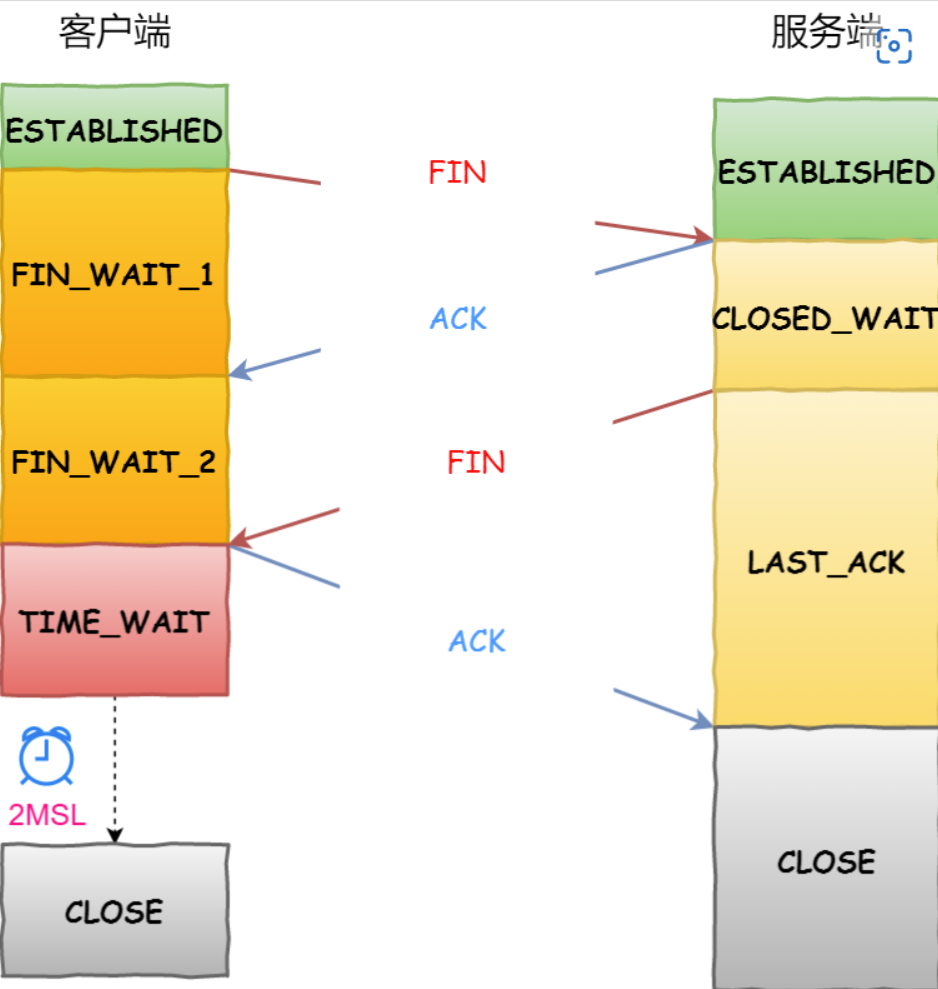

`由于TCP连接是全双工的`，因此，每个方向都必须要单独进行关闭，这一原则是当一方完成数据发送任务后，发送一个FIN来终止这一方向的连接，收到一个FIN只是意味着这一方向上没有数据流动了，即不会再收到数据了，但是在这个TCP连接上仍然能够发送数据，直到这一方向也发送了FIN。首先进行关闭的一方将执行主动关闭，而另一方则执行被动关闭。

1. 数据传输结束后，客户端的应用进程发出连接释放报文段，并停止发送数据，客户端进入FIN_WAIT_1状态，此时客户端依然可以接收服务器发送来的数据。 `FIN 1 ACK 1`

2. 服务器接收到FIN后，发送一个ACK给客户端，确认序号为收到的序号+1，服务器进入CLOSE_WAIT状态。客户端收到后进入FIN_WAIT_2状态。 `FIN 0 ACK 1`
3. 当服务器没有数据要发送时，服务器发送一个FIN报文，此时服务器进入LAST_ACK状态，等待客户端的确认  `FIN 1 ACK 1`
4. 客户端收到服务器的FIN报文后，给服务器发送一个ACK报文，确认序列号为收到的序号+1。此时客户端进入TIME_WAIT状态，等待2MSL（MSL：报文段最大生存时间），然后关闭连接  `FIN 0 ACK 1`


### 四次挥手的`原因`

因为TCP是`全双工通信`的

- 关闭连接时，客户端向服务端发送 `FIN` 时，仅仅表示客户端不再发送数据了但是还能接收数据。 `shut_down 阶段`
- 服务器收到客户端的 `FIN` 报文时，先回一个 `ACK` 应答报文，而服务端可能还有数据需要处理和发送，等服务端不再发送数据时，才发送 `FIN` 报文给客户端来表示同意现在关闭连接。

从上面过程可知，服务端通常需要等待完成数据的发送和处理，所以服务端的 `ACK` 和 `FIN` 一般都会分开发送，从而比三次握手导致多了一次。


### 为什么 TIME_WAIT 等待的时间是 2MSL

1. 首先调用close()发起`主动关闭的一方`，`在发送最后一个ACK之后会进入time_wait的状态` (1-4分钟)

2. MSL**报文最大生存时间**,  网络中可能存在来自发送方的数据包，当这些发送方的数据包被接收方处理后又会向对方发送响应，所以**一来一回需要等待 2 倍的时间**。 **2MSL时长** 这其实是相当于**至少允许报文丢失一次**

3. ==目的1==: 为实现TCP连接的可靠释放，防止断开连接最后一次ACK报文丢失了。

   > `（确保被动方 接受到最后一次ACK 不然被动方会重发FIN，关闭了就收不到被动方的重发了）`

4. ==目的2:== `为使旧的重复数据包在网络中因过期而消失`


### `TIME_WAIT`问题和优化

#### 过多的危害

1. 产生这种结果使得这个TCP连接在2MSL连接等待期间，定义这个连接的`四元组`（客户端IP地址和端口，服务端IP地址和端口号）`不能被使用`。`文件描述符`的使用是有上限的，`如果持续高并发，会导致一些连接失败`。  ==内存资源和端口资源的占用==
2. 服务器，因为一些原因，服务器进程挂掉了，退出了，由于是服务器主动关闭连接，因此会有TIME_WAIT状态存在，也就意味着服务器进程想立即重启，如果TIME_WAIT状态维持60秒，60秒服务器都起不来。 ==（timewait时间内 服务器挂掉 服务器重启时间已过）==

#### 优化 TIME_WAIT

可设置套接字选项为`SO_REUSEADDR`，该选项的意思是，告诉操作系统，如果端口忙，但占用该端口TCP连接处于TIME_WAIT状态，并且套接字选项为SO_REUSEADDR，则该端口可被重用。如果TCP连接处于其他状态，依然返回端口被占用。该选项对服务程序重启非常有用。

1. 越过time_wait
   - 打开 net.ipv4.tcp_tw_reuse 和 net.ipv4.tcp_timestamps 选项；
   - net.ipv4.tcp_max_tw_buckets
   - 程序中使用 SO_LINGER ，应用强制使用 RST 关闭。

2. 更好的解决方法不是越过这个状态，而是**让客户端去断开，由分布在各处的客户端去承受 TIME_WAIT**。


### 如何`优化 TCP`

#### 三次握手的性能提升

1. 客户端的优化

   当客户端发起 SYN 包时，可以通过 `tcp_syn_retries` 控制其==重传的次数==。

2. 服务端的优化
   - 当服务端 SYN 半连接队列溢出后，会导致后续连接被丢弃，可以通过 `netstat -s` 观察半连接队列溢出的情况，如果 SYN 半连接队列溢出情况比较严重，可以通过 `tcp_max_syn_backlog、somaxconn、backlog` 参数来==调整 SYN 半连接队列的大小==。
   - 服务端回复 ==SYN+ACK 的重传次数==由 `tcp_synack_retries` 参数控制。如果遭受 SYN 攻击，应把 `tcp_syncookies` 参数设置为 1，表示仅在 SYN 队列满后开启 syncookie 功能，可以保证正常的连接成功建立。
   - 如果 ==accpet 队列==溢出严重，可以通过 listen 函数的 `backlog` 参数和 `somaxconn` 系统参数提高队列大小，accept 队列长度取决于 min(backlog, somaxconn)。

3. 绕过三次握手

   ==TCP Fast Open 功能==可以绕过三次握手，使得 HTTP 请求减少了 1 个 RTT 的时间，Linux 下可以通过 `tcp_fastopen` 开启该功能，同时必须保证服务端和客户端同时支持。

#### 四次挥手的性能提升

1. 主动方的优化
   - 选择合适的重传次数
   - time_wait过多时，设置合适的`tcp_tw_reuse` 和 `tcp_timestamps`

2. 被动方的优化
   - 解决close_wait异常
   - 选择合适的重传次数

#### 传输数据的性能提升 有效配置参数

1. ==滑动窗口==定义了网络中飞行报文的最大字节数，当它超过带宽时延积时，网络过载，就会发生丢包。而当它小于带宽时延积时，就无法充分利用网络带宽。因此，`滑动窗口的设置，必须参考带宽时延积`。
2. ==内核缓冲区==决定了滑动窗口的上限


### TCP的连接状态

- CLOSED：初始状态。
- LISTEN：服务器处于监听状态。
- SYN_SEND：客户端socket执行CONNECT连接，发送SYN包，进入此状态。
- SYN_RECV：服务端收到SYN包并发送服务端SYN包，进入此状态。
- ESTABLISH：表示连接建立。客户端发送了最后一个ACK包后进入此状态，服务端接收到ACK包后进入此状态。
- FIN_WAIT_1：终止连接的一方（通常是客户机）发送了FIN报文后进入。等待对方FIN。
- CLOSE_WAIT：（假设服务器）接收到客户机FIN包之后等待关闭的阶段。在接收到对方的FIN包之后，自然是需要立即回复ACK包的，表示已经知道断开请求。但是本方是否立即断开连接（发送FIN包）取决于是否还有数据需要发送给客户端，若有，则在发送FIN包之前均为此状态。
- FIN_WAIT_2：此时是半连接状态，即有一方要求关闭连接，等待另一方关闭。客户端接收到服务器的ACK包，但并没有立即接收到服务端的FIN包，进入FIN_WAIT_2状态。
- LAST_ACK：服务端发动最后的FIN包，等待最后的客户端ACK响应，进入此状态。
- TIME_WAIT：客户端收到服务端的FIN包，并立即发出ACK包做最后的确认，在此之后的2MSL时间称为TIME_WAIT状态。


### `FIN_WAIT_2`，`CLOSE_WAIT`状态和`TIME_WAIT`状态 你知道多少

#### `FIN_WAIT_2`：

- ==<u>半关闭状态</u>==。

  > 一、半连接
  >
  > 1.1 定义
  >
  > - 发生在TCP3次握手中。
  > - 如果A向B发起TCP请求，B也按照正常情况进行响应了，但是A不进行第3次握手，这就是半连接
  >
  > 1.2 半连接攻击 `(SYN攻击)`
  >
  > - <u>半连接，会造成B分配的内存资源就一直这么耗着，直到资源耗尽</u>。
  >
  >
  > 二、半打开（Half-Open）
  >
  > 2.1 定义
  >
  > - <u>如果一方已经关闭或异常终止连接，而另一方却不知道。 我们将这样的TCP连接称为半打开（Half-Open</u>）。
  >
  >
  > 三、半关闭
  >
  > 3.1 定义
  >
  > - TCP提供了连接的一端在结束它的发送后还能接收来自另一端数据的能力，这就是TCP的半关闭。
  > - 当一方关闭发送通道后，仍可接受另一方发送过来的数据，这样的情况叫“半关闭”。（拆除TCP连接是：你关闭你的发送通道，我关闭我的发送通道）。
  >
  > 3.2 半关闭的产生
  >
  > - 客户端发送FIN，另一端发送对这个FIN的ACK报文段。 此时客户端就处于半关闭。
  > - 调用shutdown，shutdown的第二个参数为SHUT_WR时，为半关闭。

- 发送断开请求一方还有接收数据能力，但已经没有发送数据能力（或者说只能发送FIN）。

- 不能长久的处于FIN_WAIT2状态 超时后会默默消失

#### `CLOSE_WAIT`状态：

- 被动关闭连接一方接收到FIN包会立即回应ACK包表示已接收到断开请求。
- 被动关闭连接一方如果还有剩余数据要发送就会进入CLOSE_WAIT状态。

> 第二次 第三次挥手之间的间隔

#### `TIME_WAIT`状态：

- 又叫2MSL等待状态。
- 如果客户端直接进入CLOSED状态，如果服务端没有接收到最后一次ACK包会在超时之后重新再发FIN包，此时因为客户端已经CLOSED，所以服务端就不会收到ACK而是收到RST。所以TIME_WAIT状态目的是防止最后一次握手数据没有到达对方而触发重传FIN准备的。
- 在2MSL时间内，同一个socket不能再被使用，否则有可能会和旧连接数据混淆（如果新连接和旧连接的socket相同的话）。


### 大量的`CLOSE_WAIT`状态

通常，CLOSE_WAIT 状态在服务器停留时间很短，如果你发现大量的 CLOSE_WAIT 状态，那么就意味着被动关闭的一方没有及时发出 FIN 包，一般有如下几种可能：

- **程序问题**：如果代码层面忘记了 close 相应的 socket 连接，那么自然不会发出 FIN 包，从而导致 CLOSE_WAIT 累积；或者代码不严谨，出现死循环之类的问题，导致即便后面写了 close 也永远执行不到。
- `响应太慢或者超时设置过小`：如果连接双方不和谐，一方不耐烦直接 timeout，另一方却还在忙于耗时逻辑，就会导致 close 被延后。响应太慢是首要问题，不过换个角度看，也可能是 timeout 设置过小。
- BACKLOG 太大：此处的 backlog 不是 syn backlog，而是 `accept 的 backlog`，如果 backlog 太大的话，设想突然遭遇大访问量的话，即便响应速度不慢，也可能出现来不及消费的情况，导致多余的请求还在[队列](http://jaseywang.me/2014/07/20/tcp-queue-的一些问题/)里就被对方关闭了。


### 如何解决`TCP粘包`

粘包的问题出现是因为不知道一个用户消息的边界在哪，如果知道了边界在哪，接收方就可以通过边界来划分出有效的用户消息。

一般有三种方式分包的方式：

- 固定长度的消息；
- 特殊字符作为边界；
- 自定义消息结构。

#### `固定长度`的消息

这种是最简单方法，即每个用户消息都是固定长度的，比如规定一个消息的长度是 64 个字节，当接收方接满 64 个字节，就认为这个内容是一个完整且有效的消息。

但是这种方式灵活性不高，实际中很少用。

#### `特殊字符`作为边界

我们可以在两个用户消息之间插入一个特殊的字符串，这样接收方在接收数据时，读到了这个特殊字符，就把认为已经读完一个完整的消息。

HTTP 是一个非常好的例子。


HTTP 通过设置回车符、换行符作为 HTTP 报文协议的边界。

有一点要注意，这个作为边界点的特殊字符，如果刚好消息内容里有这个特殊字符，我们要对这个字符转义，避免被接收方当作消息的边界点而解析到无效的数据。

#### `自定义消息结构`

我们可以自定义一个消息结构，由包头和数据组成，其中包头包是固定大小的，而且包头里有一个字段来说明紧随其后的数据有多大。

比如这个消息结构体，首先 4 个字节大小的变量来表示数据长度，真正的数据则在后面。

```c
struct { 
    u_int32_t message_length; 
    char message_data[]; 
} message;
```

当接收方接收到包头的大小（比如 4 个字节）后，就解析包头的内容，于是就可以知道数据的长度，然后接下来就继续读取数据，直到读满数据的长度，就可以组装成一个完整到用户消息来处理了。


### close与shutdownSIGPIPE

#### **二者的区别**

1. close-----关闭`本进程`的socket id，但链接还是开着的，用这个socket id的其它进程还能用这个链接，能读或写这个socket id。
2. shutdown--破坏了socket 链接，读的时候可能侦探到EOF结束符，写的时候可能会收到一个SIGPIPE信号，这个信号可能直到socket buffer被填充了才收到，shutdown有一个关闭方式的参数，0 不能再读，1不能再写，2 读写都不能。

#### **socket 多进程中的 shutdown、close 的使用**

- 当所有的数据操作结束以后，你可以调用close()函数来释放该socket，从而停止在该socket上的任何数据操作：close(sockfd);使用close中止一个连接，但<u>它只是减少描述符的参考数</u>，并不直接关闭连接，只有当描述符的参考数为0时才关闭连接。所以在多进程/线程程序中，close只是确保了对于某个特定的进程或线程来说，该连接是关闭的。使用 client_fd = accept() 后 fork() 以在子进程中处理请求，此时在父进程中使用 close() 关闭该连接，子进程仍可以继续使用该连接。

- 也可以调用shutdown()函数来关闭该socket。该函数<u>允许你只停止在某个方向上的数据传输</u>，而一个方向上的数据传输继续进行。如你可以关闭某socket的写操作而允许继续在该socket上接受数据，直至读入所有数据。int shutdown(int sockfd,int how);shutdown可直接关闭描述符，不考虑描述符的参考数，可选择中止一个方向的连接。

#### SIGPIPE信号

1. 假设 A B, A调用shutdown_write, A再write就会触发SIGPIPE

2. 看上面的意思是：对端调用close后，我再发送数据就会触发SIGPIPE?

   > 疑问，对端调用close，此时应该是半连接状态，A->B不能发送数据， 但是B->A是可以发送数据的，意思是，FIN_WAIT2状态下 不可以接受数据了吗？ 是的 close状态下 进入 FINWAIT只是在等待对端的FIN

**解决方法：**signal(SIGPIPE, SIG_IGN);


### TCP 协议有什么缺陷

- `升级` TCP 的工作很困难;
  - 只能升级内核 
  - 并且普及有难度
- TCP 建立连接的`延迟`；
  - 三次握手的延迟
  - TCP Fast Open （快速打开）解决了
- TCP 存在`队头阻塞`问题；
  - 当 TCP `丢包`时，整个 TCP 都要`等待重传`，那么就会阻塞该 TCP 连接中的所有请求，所以 HTTP/2 队头阻塞问题就是因为 TCP 协议导致的。
- 网络迁移需要重新建立 TCP 连接；
  - 4g->wifi 需要重新建立连接 会突然卡顿一下
  - udp没有这个问题


### ==TCP和UDP的区别==和各自适用的场景

1. 连接

   > TCP是面向连接的传输层协议，即传输数据之前必须先建立好连接。
   >
   > UDP无连接。

2. 服务对象

   > TCP是点对点的两点间服务，即一条TCP连接只能有两个端点；
   >
   > UDP支持一对一，一对多，多对一，多对多的交互通信。

3. 可靠性

   > TCP是可靠交付：无差错，不丢失，不重复，按序到达。
   >
   > UDP`是尽最大努力`交付，不保证可靠交付。

4. 拥塞控制，流量控制

   > TCP有拥塞控制和流量控制保证数据传输的安全性。
   >
   > `UDP没有拥塞控制，网络拥塞不会影响源主机的发送效率。`

5. 报文长度

   > TCP是动态报文长度，即TCP报文长度是根据接收方的窗口大小和当前网络拥塞情况决定的。
   >
   > UDP面向报文，`不合并，不拆分`，保留上面传下来报文的边界。

6. 首部开销

   > TCP首部开销大，首部20个字节。
   >
   > UDP首部开销小，8字节。（源端口，目的端口，数据长度，校验和）

#### TCP和UDP适用场景

从特点上我们已经知道，TCP 是可靠的但传输速度慢，UDP 是不可靠的但传输速度快。因此在选用具体协议通信时，应该根据通信数据的要求而决定。

若通信数据完整性需让位与通信实时性，则应该选用TCP 协议（如`文件传输、重要状态的更新`等）；反之，则使用 UDP 协议（如`视频传输、实时通信`等）。


### 为什么 TCP 叫`数据流`模式？ UDP 叫`数据报`模式？

- 所谓的“流模式”，是指`TCP发送端发送几次数据和接收端接收几次数据是没有必然联系`的，比如你通过 TCP连接给另一端发送数据，你只调用了一次 write，发送了100个字节，但是对方可以分10次收完，每次10个字节；你也可以调用10次write，每次10个字节，但是对方可以一次就收完。

- 原因：这是因为TCP是面向连接的，一个 socket 中收到的数据都是由同一台主机发出，且有序地到达，所以每次读取多少数据都可以。


> <u>==流 的意思是数据时连续有序的，我接收方可以自己选择怎么读 都多少==</u>

- 所谓的“数据报模式”，是指UDP发送端`调用了几次 write`，接收端必须用`相同次数的 read` 读完。`UDP是基于报文的`，在接收的时候，每次`最多只能读取一个报文`，报文和报文是不会合并的，如果缓冲区小于报文长度，则多出的部分会被丢弃。

- 原因：这是因为UDP是无连接的，只要知道接收端的 IP 和端口，任何主机都可以向接收端发送数据。 这时候，如果一次能读取超过一个报文的数据， 则会乱套。

> ==<u>报 的意思是数据时无序的，因此必须保证每次都读完 再读下一个，不然会乱套</u>==


### 游戏用tcp还是udp

1. 在实时性方面，tcp协议的网络抗性欠佳，对MOBA类或其他`实时性要求较高的游戏`，一般是不建议使用tcp作为协议载体。事实上，王者荣耀的PVP通信协议也确实是基于`udp`封装的；同样，最近大家喜闻乐见的《绝地求生》，也是基于udp的。

2. 一般游戏中TCP和UDP会同时用的，如果对于数据传输速度要求非常高的场景，比如FPS，MOBA等游戏过程中，用户对战时候的数据肯定是要用UDP来传输的，并且在程序层面保证传输的可靠性，包括自己做校验等；但其它模块，比如大厅里啊，买东西啊，创建房间啊等等，都是可以TCP实现的。==（操作时udp，抽奖时tcp）==

3. 如果客户端和服务器都可以独立发包，但是偶尔发生延迟可以容忍（比如：在线的纸牌游戏，许多MMO类的游戏），那么使用TCP长连接吧。
4. 如果客户端和服务器都可以独立发包，而且无法忍受延迟（比如：大多数的多人动作类游戏，一些MMO类游戏），那么使用UDP吧。


### 为什么QQ用的是UDP协议而不是TCP协议

1. qq既有udp 也有 tcp

2. <u>登陆过程，客户端client 采用TCP协议向服务器server发送信息，HTTP协议下载信息。登陆之后，会有一个`TCP连接来保持在线状态`。</u>

3. `和好友发消息，客户端client采用UDP协议`，但是需要通过服务器转发。腾讯为了确保传输消息的可靠，采用上层协议来保证可靠传输。如果消息发送失败，客户端会提示消息发送失败，并可重新发送。

4. ==udp的原因:== QQ采用的通信协议以UDP为主，辅以TCP协议。

   1. 由于QQ的服务器设计容量是`海量级的应用`，一台服务器要同时容纳十几万的并发连接，因此服务器端只有采用UDP协议与客户端进行通讯才能保证这种超大规模的服务。 ==（UDP保证海量级，大规模服务）==
   2. 因为国内的网络环境非常复杂, UDP包能够穿透大部分的代理服务器，因此QQ选择了UDP作为客户之间的主要通信协议。  ==（UDP穿透复杂的代理服务器）==

5. `腾讯采用了上层协议来保证可靠传输` ==（使用UDP做了确认应答）==

   


### 如何用`UDP实现可靠传输`

现在市面上已经有基于 UDP 协议实现的可靠传输协议的成熟方案了，那就是 QUIC 协议，**QUIC 协议 TCP 的缺点都给解决了**，而且已经应用在了 HTTP/3。

- UDP要想可靠，就要接收方收到UDP之后回复个确认包，发送方有个机制，收不到确认包就要重新发送，

  > <u>==确认重传机制==</u>

- 每个包有递增的序号，接收方发现中间丢了包就要发重传请求，

  > <u>==序号机制==</u>

- 当网络太差时候频繁丢包，防止越丢包越重传的恶性循环，要有个发送窗口的限制，发送窗口的大小根据网络传输情况调整，调整算法要有一定自适应性。

  > ==<u>窗口机制</u>==


### `应用层`常见`协议`知道多少

| 协议   | 名称                       | 默认端口       | 底层协议                                                    |
| :----- | :------------------------- | :------------- | :---------------------------------------------------------- |
| HTTP   | 超文本传输协议             | 80             | TCP                                                         |
| HTTPS  | 超文本传输安全协议         | 443            | TCP                                                         |
| Telnet | 远程登录服务的标准协议     | 23             | TCP                                                         |
| FTP    | 文件传输协议               | 20传输和21连接 | TCP                                                         |
| `TFTP` | 简单文件传输协议           | 69             | UDP                                                         |
| SMTP   | 简单邮件传输协议（发送用） | 25             | TCP                                                         |
| POP    | 邮局协议（接收用）         | 110            | TCP                                                         |
| `DNS`  | 域名解析服务               | 53             | 服务器间进行`域传输`的时候用TCP 客户端查询DNS服务器时用 UDP |


### 请你来说一说==http协议==

#### HTTP协议是啥

是一个`基于tcp实现的超文本传输协议` 用于`从万维网服务器`传输超文本到`本地浏览器`的传送协议。

> HTTP协议是Hyper Text Transfer Protocol（超`（超越文本，不止文本）`文本传输协议）的缩写，是用于从万维网（WWW:World Wide Web）服务器传输超文本到本地浏览器的传送协议。
>
> HTTP是一个`基于TCP/IP`通信协议来传递-数据（HTML 文件，图片文件，查询结果等）。
>
> HTTP协议工作于客户端-服务端架构为上。浏览器作为HTTP客户端通过URL向HTTP服务端即WEB服务器发送所有请求。Web服务器根据接收到的请求后，向客户端发送响应信息。

#### HTTP协议特点

1. <u>==简单快速==</u>：

   - 客户向服务器请求服务时，<u>只需传送`请求方法`和`路径`。</u>请求方法常用的有GET、HEAD、POST。每种方法规定了客户与服务器联系的类型不同。由于HTTP协议简单，使得HTTP服务器的程序规模小，因而通信速度很快。

2. <u>==灵活==</u>：

   - <u>HTTP允许传输`任意类型`的数据对象</u>。正在传输的类型由Content-Type加以标记。

3. <u>==无连接==</u>：

   - 无连接的含义是<u>限制每次连接只处理一个请求</u>。服务器处理完客户的请求，并收到客户的应答后，即断开连接。采用这种方式可以节省传输时间。

4. <u>==无状态==</u>：

   - HTTP协议是无状态协议。无状态是指协议<u>对于事务处理没有记忆能力</u>。

   > 缺少状态意味着如果后续处理需要前面的信息，则它`必须重传`，这样可能导致每次连接传送的数据量增大。
   >
   > 另一方面，在服务器不需要先前信息时它的`应答就较快`。

5. 支持B/S（Browser/Server）及C/S（Client/Server）模式。

6. 默认端口80

7. 基于TCP协议

#### HTTP过程概述

HTTP协议定义Web客户端如何从Web服务器请求Web页面，以及服务器如何把Web页面传送给客户端。

HTTP协议采用了`请求/响应模型`。

> 客户端向服务器发送一个请求报文，请求报文包含请求的方法、URL、协议版本、请求头部和请求数据。
>
> 服务器以一个状态行作为响应，响应的内容包括协议的版本、成功或者错误代码、服务器信息、响应头部和响应数据。


### HTTP`报文头`

#### HTTP请求报文：

一个HTTP请求报文由`请求行`（request line）、`请求头部`（header）、`空行`和`请求数据`4个部分组成，下图给出了请求报文的一般格式。

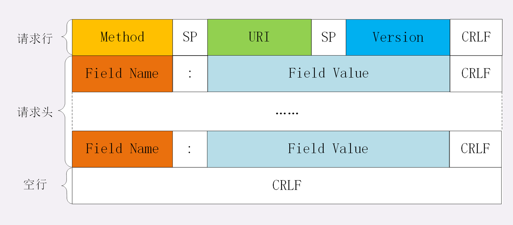

```c++
//www.baidu.com的请求报文
GET / HTTP/1.1 Host: www.baidu.com  //请求行  后面是请求头
  
User-Agent: Mozilla/5.0 (Windows NT 10.0; Win64; x64; rv:86.0) Gecko/20100101 Firefox/86.0
Accept: text/html,application/xhtml+xml,application/xml;q=0.9,image/webp,/;q=0.8
Accept-Language: zh-CN,zh;q=0.8,zh-TW;q=0.7,zh-HK;q=0.5,en-US;q=0.3,en;q=0.2
Accept-Encoding: gzip, deflate, br   //允许的压缩编码格式
Connection: keep-alive   //连接状态
Cookie: BAIDUID=6729CB682DADC2CF738F533E35162D98:FG=1; //本地缓存的用户信息
BIDUPSID=6729CB682DADC2CFE015A8099199557E; PSTM=1614320692; BD_UPN=13314752;
BDORZ=FFFB88E999055A3F8A630C64834BD6D0;
__yjs_duid=1_d05d52b14af4a339210722080a668ec21614320694782; BD_HOME=1;
H_PS_PSSID=33514_33257_33273_31660_33570_26350;
BA_HECTOR=8h2001alag0lag85nk1g3hcm60q
Upgrade-Insecure-Requests: 1
Cache-Control: max-age=0
    					//空行
    正文
```

1. 请求行：请求行分为三个部分：`请求方法`、`请求地址`和`协议版本`。

   > - 请求方法：HTTP/1.1 定义的请求方法有8种：GET、POST、PUT、DELETE、PATCH、HEAD、OPTIONS、TRACE。
   >
   >   ​	最常的两种GET和POST，如果是RESTful接口的话一般会用到GET、POST、DELETE、PUT。
   >
   > - 请求地址：URL:统一资源定位符，是一种自愿位置的抽象唯一识别方法。
   >
   >   ​	组成：<协议>：//<主机>：<端口>/<路径>
   >
   >   ​	端口和路径有时可以省略（HTTP默认端口号是80）
   >
   > - 协议版本的格式为：HTTP/主版本号.次版本号，常用的有HTTP/1.0和HTTP/1.1

2. 请求头部：请求头部由关键字/值对组成，每行一对，关键字和值用英文冒号“:”分隔。

   请求头部`通知服务器有关于客户端请求的信息`，典型的请求头有：

   > User-Agent：产生请求的`浏览器类型`。
   >
   > Accept：客户端可识别的`内容类型列表`。
   >
   > Host：请求的`主机名`，允许多个域名同处一个IP地址，即虚拟主机。
   >
   > <u>Connection：是否保持长连接</u>
   >
   > Cookie：HTTP请求发送时，会把保存在该请求域名下的所有cookie值一起发送给web服务器。
   >
   > Content-Length：请求的`内容长度`
   >
   > Range:实现`断点续传`

3. 实体主体：实体主体即请求数据，不在GET方法中使用，而是在POST方法中使用。 （`例如账号密码`）

   POST方法适用于需要客户填写表单的场合。与请求数据相关的最常使用的请求头是Content-Type和Content-Length。

#### HTTP响应报文

HTTP响应也由4个部分组成，分别是：`状态行`、`响应头部`、空行，`响应正文`（实体主体）。


```c++
HTTP/1.1 200 OK
Bdpagetype: 1
Bdqid: 0xf3c9743300024ee4
Cache-Control: private
Connection: keep-alive
Content-Encoding: gzip   //压缩编码格式
Content-Type: text/html;charset=utf-8
Date: Fri, 26 Feb 2021 08:44:35 GMT
Expires: Fri, 26 Feb 2021 08:44:35 GMT
Server: BWS/1.1
Set-Cookie: BDSVRTM=13; path=/
Set-Cookie: BD_HOME=1; path=/
Set-Cookie: H_PS_PSSID=33514_33257_33273_31660_33570_26350; path=/; domain=.baidu.com
Strict-Transport-Security: max-age=172800
Traceid: 1614329075128412289017566699583927635684
X-Ua-Compatible: IE=Edge,chrome=1
Transfer-Encoding: chunked
    						//空行
    响应正文
```

其中，版本（HTTP-Version）表示服务器HTTP协议的版本；状态码（Status-Code）表示服务器发回的响应状态代码；短语（Reason-Phrase）表示状态代码的文本描述。状态代码由三位数字组成，第一个数字定义了响应的类别，且有五种可能取值。

- #### [状态码对应的含义：](https://www.jianshu.com/p/b58025e61b2d)

  > 1xx：指示信息--表示请求已接收，`请继续`处理。 
  >
  > 2xx：`成功`--表示请求已被成功接收、理解、接受。
  >
  > 3xx：`重定向`--要完成请求必须进行更进一步的操作。
  >
  > 4xx：`客户端错`误--请求有语法错误或请求无法实现。    ==404 Not Found==
  >
  > 5xx：`服务器端错`误--服务器未能实现合法的请求。

响应头部与相应正文则与请求头部及请求数据向对应。


### HTTP`状态码`

| 状态码 | 类别                                     | 含义                                                         |
| :----- | :--------------------------------------- | :----------------------------------------------------------- |
| 1XX    | Informational（信息性状态码） `提示信息` | **提示信息**，是协议处理中的一种中间状态，实际用到的比较少   |
| 2XX    | Success（`成功`状态码）                  | 服务器**成功**处理了客户端的请求，也是我们最愿意看到的状态。 |
| 3XX    | Redirection（`重定向`状态码）            | 客户端请求的资源发生了变动，需要客户端用新的 URL 重新发送请求获取资源，也就是**重定向** |
| 4XX    | Client Error（`客户端错误`状态码）       | 客户端发送的**报文有误**，服务器无法处理，也就是错误码的含义。 |
| 5XX    | Server Error（`服务器错误`状态码）       | 客户端请求报文正确，但是**服务器处理时内部发生了错误**，属于服务器端的错误码。 |

##### [1xx 信息](https://interviewguide.cn/#/Doc/Knowledge/计算机网络/计算机网络?id=1xx-信息)  ==过程中正常的提示信息==

- **100 Continue** ：表明到目前为止都很正常，客户端可以继续发送请求或者忽略这个响应。

##### [2xx 成功](https://interviewguide.cn/#/Doc/Knowledge/计算机网络/计算机网络?id=2xx-成功)  提醒你已经完成了响应,可以解析报文了

- **200 OK**    ==ok==
- **204 No Content** ：请求已经成功处理，但是返回的响应报文不包含实体的主体部分。一般在只需要从客户端往服务器发送信息，而不需要返回数据时使用。 ==<u>（你没有请求数据，所有我的回复没有数据段）</u>==
- **206 Partial Content** ：表示客户端进行了范围请求，响应报文包含由 Content-Range 指定范围的实体内容。<u>==（范围回复）==</u>

##### [3xx 重定向](https://interviewguide.cn/#/Doc/Knowledge/计算机网络/计算机网络?id=3xx-重定向)  需要后续的URL转发操作

> URL 重定向，也称为 `URL 转发`，是一种当实际资源，如单个页面、表单或者整个 Web 应用被迁移到新的 URL 下的时候，保持（原有）链接可用的技术。HTTP 协议提供了一种特殊形式的响应—— HTTP 重定向（HTTP redirects）来执行此类操作。
>
> 重定向可实现许多目标：
>
> - 站点维护或停机期间的临时重定向。
> - 永久重定向将在更改站点的URL，上传文件时的进度页等之后保留现有的链接/书签。
> - 上传文件时的表示进度的页面。

- **301 Moved Permanently** ：永久性重定向
- **302 Found** ：临时性重定向
- **303 See Other** ：和 302 有着相同的功能，但是 303 明确要求客户端应该采用 GET 方法获取资源。
- **304 Not Modified** ：如果请求报文首部包含一些条件，例如：If-Match，If-Modified-Since，If-None-Match，If-Range，If-Unmodified-Since，如果不满足条件，则服务器会返回 304 状态码。
- **307 Temporary Redirect** ：临时重定向，与 302 的含义类似，但是 307 要求浏览器不会把重定向请求的 POST 方法改成 GET 方法。

##### [4xx 客户端错误](https://interviewguide.cn/#/Doc/Knowledge/计算机网络/计算机网络?id=4xx-客户端错误)  客户端不行

- **400 Bad Request** ：请求报文中存在语法错误。   ==我不理解==
- **401 Unauthorized** ：该状态码表示发送的请求需要有认证信息（BASIC 认证、DIGEST 认证）。如果之前已进行过一次请求，则表示用户认证失败。 ``
- **403 Forbidden** ：请求被拒绝。  ==403 Forbidden==
- **404 Not Found**           `==404` not found==  dns污染
- **405 Not Allowed**             ==达咩==
- **406 无法接受**         ==无法接受==

##### [5xx 服务器错误](https://interviewguide.cn/#/Doc/Knowledge/计算机网络/计算机网络?id=5xx-服务器错误)  服务器不行

- 「**500 Internal Server Error**」与 400 类型，是个笼统通用的错误码，服务器发生了什么错误，我们并不知道。

  > 只知道是服务器发生了错误

- 「**501 Not Implemented**」表示客户端请求的功能还不支持，类似“即将开业，敬请期待”的意思。

- 「**502 Bad Gateway**」通常是服务器作为网关或代理时返回的错误码，表示服务器自身工作正常，访问后端服务器发生了错误。

- 「**503 Service Unavailable**」表示服务器当前很忙，暂时无法响应客户端，类似“网络服务正忙，请稍后重试”的意思。


### http协议`请求类型`有哪几种

- <u>GET：向特定的资源发出请求。</u>

- <u>POST：向指定资源提交数据进行处理请求（例如提交表单或者上传文件）</u>。数据被包含在请求体中。POST请求可能会导致新的资源的创建和/或已有资源的修改。

- <u>PUT：向指定资源位置上传其最新内容。</u>

- DELETE：请求服务器删除Request-URI所标识的资源。

- TRACE：回显服务器收到的请求，主要用于测试或诊断。

- OPTIONS：返回服务器针对特定资源所支持的HTTP请求方法。也可以利用向Web服务器发送’*'的请求来测试服务器的功能性。

- HEAD：向服务器索要与GET请求相一致的响应，只不过响应体将不会被返回。这一方法可以在不必传输整个响应内容的情况下，就可以获取包含在响应消息头中的元信息。

- CONNECT：HTTP/1.1协议中预留给能够将连接改为管道方式的代理服务器。


### `GET 和 POST有什么区别`

1. ==功能==不同

   > get是从服务器上`获取`数据。post是向服务器`传送`数据。

2. ==请求方式==不同

   > 对于GET方式的请求，浏览器会把http header和data一并发送出去，服务器响应200（返回数据）；
   >
   > 而对于POST，浏览器先发送header，服务器响应100 continue，浏览器再发送data，服务器响应200 ok（返回数据）
   >
   > GET产生`一个`TCP数据包；POST产生`两个`TCP数据包。

3. ==安全性==不同 get是幂等的，post不是幂等的。

   > POST安全性相对较高。 
   >
   > <u>GET请求参数会被完整保留在浏览器历史记录里</u>，而POST中的`参数不会被保留`。  
   >
   > GET 是把参数数据队列加到提交表单的ACTION属性所指的URL中，值和表单内各个字段一一对应，在URL中可以看到。POST是通过HTTP POST机制，将表单内各个字段与其内容放置在HTML HEADER内一起传送到ACTION属性所指的URL地址。用户看不到这个过程。
   >
   > GET参数直接暴露在URL上
   >
   > <u>Ex: 如果使用get 提交用户名和密码 用户名和密码会暴露在url中 `很不安全</u>`

4. 传送`数据量`不同  ==存储位置和数据量==

   > get参数通过url传递，post放在request body中。
   >
   > get传送的`数据量`较小，不能大于2KB （这主要是因为受URL长度限制）。post传送的数据量较大，一般被默认为不受限制。但理论上，IIS4中最大量为80KB，IIS5中为100KB。 

5. 数据`包数量`不同

   >  get是一个TCP数据包，浏览器会把http header和data一并发送出去，服务器响应200。post产生两个TCP数据包，浏览器会先发送header，服务器响应100 continue；浏览器再发送data，服务器响应200 ok。

6. 获取`值`不同

   > 对于get方式，服务器端用Request.QueryString获取变量的值。对于post方式，服务器端用Request.Form获取提交的数据

7. 方式、类型不同  ==存储位置和编码==

   > GET请求只能进行`url编码`，而POST支持多种编码方式。
   >
   > 对参数的数据类型，GET只接受ASCII字符，而POST没有限制。

   

### 在==浏览器地址栏输入一个URL==后回车，背后会进行哪些技术步骤

1. 查`浏览器缓存`，看看有没有已经缓存好的`域名IP映射`，如果没有查找`系统缓存` 如果还没

2. 检查本机host文件

   > - Hosts是一个没有扩展名的系统文件，<u>其作用就是将一些常用的网址域名与其对应的IP地址建立一个关联“数据库”。</u>
   > - hosts文件能<u>加快域名解析</u>，对于要经常访问的网站，我们可以通过在Hosts中配置域名和IP的映射关系，提高域名解析速度。
   > - hosts文件可以方便局域网用户在很多单位的局域网中，可以分别给这些服务器取个容易记住的名字，然后在Hosts中建立IP映射，这样以后访问的时候，只要输入这个服务器的名字就行了。
   > - hosts文件可以<u>屏蔽一些网站</u>，对于自己想屏蔽的一些网站我们可以利用Hosts把该网站的域名映射到一个错误的IP或本地计算机的IP，这样就不用访问了。

3. 调用API，Linux下Scoket函数 gethostbyname

   > `如果`gethostbyname`没有这个域名的缓存记录，也没有在`hosts` 里找到，它将会向 DNS 服务器发送一条 DNS 查询请求。DNS 服务器是由网络通信栈提供的，通常是本地路由器或者 ISP 的缓存 DNS 服务器。

4. 向DNS服务器发送DNS请求，查询`本地DNS服务器`，这其中用的是UDP的协议 ==（用udp发送dns请求）==

5. 如果在一个`子网内`采用ARP地址解析协议进行`ARP查询`，如果`不在一个子网`那就需要`对默认网关进行DNS查询`，如果还找不到会一直向上找根DNS服务器，直到最终拿到IP地址（全球400多个根DNS服务器，由13个不同的组织管理）

6. 这个时候我们就有了服务器的IP地址 以及默认的端口号了，http默认是80 https是 443 端口号，会，<u>首先尝试`http`然后调用Socket建立`TCP`连接</u>，

7. 经过三次握手成功建立连接后，开始传送数据，如果正是http协议的话，就返回就完事了，

8. 如果不是http协议，服务器会返回一个`5开头的的重定向消息`，告诉我们用的是`https`，那就是说IP没变，但是端口号从80变成443了，好了，再四次`挥手`，完事，

9. 再来一遍，这次除了上述的端口号从80变成443之外，还会采用`SSL的加密技术`来保证传输数据的安全性，保证数据传输过程中不被修改或者替换之类的， 

10. 这次依然是三次握手，沟通好双方使用的`认证算法，加密和检验算法`，在此过程中也会检验对方的CA安全证书。 ==SSL handshake==

11. 确认无误后，开始通信，然后服务器就会返回你所要访问的网址的一些数据，在此过程中会将界面进行渲染，牵涉到ajax技术之类的，直到最后我们看到色彩斑斓的网页


### `HTTP缓存`技术

#### HTTP 缓存有哪些实现方式？

对于一些具有`重复性的 HTTP 请求`，比如每次请求得到的`数据都一样`的，我们可以把这对「请求-响应」的数据都**`缓存在本地`**，那么下次就直接读取本地的数据，不必在通过网络获取服务器的响应了，这样的话 HTTP/1.1 的性能肯定肉眼可见的提升。

所以，避免发送 HTTP 请求的方法就是通过**缓存技术**，HTTP 设计者早在之前就考虑到了这点，因此 HTTP 协议的头部有不少是针对缓存的字段。

HTTP 缓存有两种实现方式，分别是**`强制缓存`和`协商缓存`**。

#### 什么是强制缓存？

> ==浏览器根据数据的缓存时间 确定是否使用缓存==

强制缓存指的是<u>只要浏览器判断缓存没有过期，则直接使用浏览器的本地缓存</u>，决定是否使用缓存的主动性在于浏览器这边。

如下图中，返回的是 200 状态码，但在 <u>size 项中标识的是 from disk cache</u>，就是使用了强制缓存。

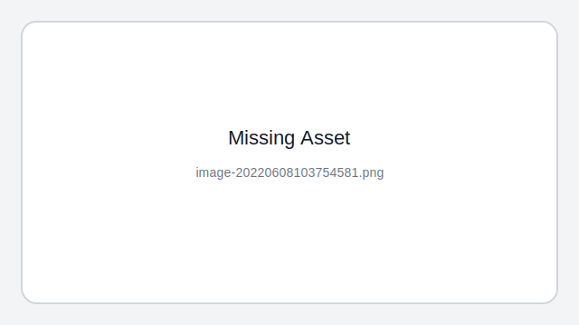

强制缓存是利用下面这两个 HTTP 响应头部（Response Header）字段实现的，它们都用来表示资源在客户端缓存的有效期：

- `Cache-Control`， 是一个`相对`时间；
- `Expires`，是一个`绝对`时间；

如果 HTTP 响应头部同时有 Cache-Control 和 Expires 字段的话，**`Cache-Control的优先级高于 Expires`** 。

Cache-control 选项更多一些，设置更加精细，所以建议使用 Cache-Control 来实现强缓存。具体的实现流程如下：

- 当浏览器第一次请求访问服务器资源时，服务器会在返回这个资源的同时，在 Response 头部加上 Cache-Control，Cache-Control 中设置了过期时间大小；  `请求资源 缓存他并得到过期的相对时间`
- 浏览器再次请求访问服务器中的该资源时，会先**通过请求资源的时间与 Cache-Control 中设置的过期时间大小，来计算出该资源是否过期**，如果没有，则使用该缓存，否则重新请求服务器； `比较时间 确认是否用缓存`
- 服务器再次收到请求后，会再次`更新` Response 头部的 Cache-Control。

#### [#](https://xiaolincoding.com/network/2_http/http_interview.html#什么是协商缓存)什么是协商缓存？

> 虽然数据过期了 但是服务器304告诉你, 还可以实用之前的数据

当我们在浏览器使用开发者工具的时候，你可能会看到过某些请求的响应码是 `304`，这个是告诉浏览器可以使用本地缓存的资源，`通常这种通过服务端告知客户端是否可以使用缓存的方式被称为协商缓存。`

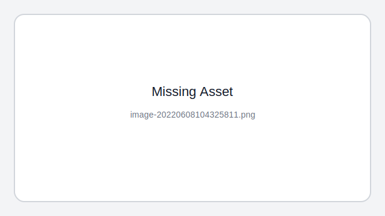

上图就是一个协商缓存的过程，所以**`协商缓存就是与服务端协商之后，通过协商结果来判断是否使用本地缓存`**。

协商缓存可以基于两种头部来实现。

第一种：请求头部中的 `If-Modified-Since` 字段与响应头部中的 `Last-Modified` 字段实现，这两个字段的意思是：

- 响应头部中的 `Last-Modified`：<u>标示这个响应资源的最后修改时间</u>；
- 请求头部中的 `If-Modified-Since`：当资源过期了，发现响应头中具有 Last-Modified 声明，则再次发起请求的时候带上 Last-Modified 的时间，服务器收到请求后发现有 If-Modified-Since 则与被请求资源的最后修改时间进行对比（Last-Modified），如果最后修改时间较新（大），说明资源又被改过，则返回最新资源，HTTP 200 OK；如果最后修改时间较旧（小），说明资源无新修改，响应 HTTP 304 走缓存。

第二种：请求头部中的 `If-None-Match` 字段与响应头部中的 `ETag` 字段，这两个字段的意思是：

- 响应头部中 `Etag`：唯一标识响应资源；
- 请求头部中的 `If-None-Match`：当资源过期时，浏览器发现响应头里有 Etag，则再次向服务器发起请求时，会将请求头If-None-Match 值设置为 Etag 的值。服务器收到请求后进行比对，如果资源没有变化返回 304，如果资源变化了返回 200。

第一种实现方式是==基于时间==实现的，第二种实现方式是==基于一个唯一标识==实现的，相对来说<u>后者可以更加准确地判断文件内容是否被修改，避免由于时间篡改导致的不可靠问题</u>。

如果 HTTP 响应头部同时有 Etag 和 Last-Modified 字段的时候， ==**Etag 的优先级更高**==，也就是先会判断 Etag 是否变化了，如果 Etag 没有变化，然后再看 Last-Modified。

注意，**==协商缓存这两个字段都需要配合强制缓存中 Cache-control 字段来使用，只有在未能命中强制缓存的时候，才能发起带有协商缓存字段的请求==**。


### `HTTP1.1`缺点

HTTP 最凸出的优点是「==简单、灵活和易于扩展、应用广泛和跨平台==」。

#### HTTP（1.1） 的缺点有哪些？

HTTP 协议里有优缺点一体的**双刃剑**，分别是「==无状态==、==明文传输==」，同时还有一大缺点「==不安全==」。

##### 1. 无状态双刃剑 

1. 无状态的**好处**，因为服务器不会去记忆 HTTP 的状态，所以不需要额外的资源来记录状态信息，这能`减轻服务器的负担`，能够把更多的 CPU 和内存用来对外提供服务。

2. 无状态的**坏处**，既然服务器没有记忆能力，它在`完成有关联性的操作时会非常麻烦`。

3. 对于无状态的问题，解法方案有很多种，其中比较简单的方式用 **`Cookie`** 技术。

   `Cookie` 通过在请求和响应报文中写入 Cookie 信息来控制客户端的状态。

   相当于，**在客户端第一次请求后，服务器会下发一个装有客户信息的「小贴纸」，后续客户端请求服务器的时候，带上「小贴纸」，服务器就能认得了了**，

##### 2. 明文传输双刃剑

1. `抓包直接可读 方便调试`
2. `重要信息被别人抓包 很不安全`

##### 3. 不安全

- 通信使用`明文`（不加密），内容可能会被窃听。比如，**账号信息容易泄漏，那你号没了。**
- `不验证通信方的身份`，因此有可能遭遇伪装。比如，**访问假的淘宝、拼多多，那你钱没了。**
- `无法证明报文的完整性`，所以有可能已遭篡改。比如，**网页上植入垃圾广告，视觉污染，眼没了。**


### `HTTP/1.1 的性能`如何

HTTP 协议是基于 **TCP/IP**，并且使用了「**请求 - 应答**」的通信模式，所以性能的关键就在这**两点**里。

#### 1. 长连接

早期 HTTP/1.0 性能上的一个很大的问题，<u>那就是每发起一个请求，都要新建一次 TCP 连接（三次握手），而且是串行请求，做了无谓的 TCP 连接建立和断开，增加了通信开销。</u>

为了解决上述 TCP 连接问题，HTTP/1.1 提出了**长连接**的通信方式，也叫持久连接。这种方式的好处在于减少了 TCP 连接的重复建立和断开所造成的额外开销，减轻了服务器端的负载。

`持久连接的特点是，只要任意一端没有明确提出断开连接，则保持 TCP 连接状态。`

当然，如果某个 HTTP 长连接`超过一定时间`没有任何数据交互，服务端就会`主动断开`这个连接。

#### 2. 管道网络传输

HTTP/1.1 采用了长连接的方式，这使得管道（pipeline）网络传输成为了可能。

即可在同一个 TCP 连接里面，客户端可以发起多个请求，只要第一个请求发出去了，不必等其回来，就可以发第二个请求出去，可以**减少整体的响应时间。**

> 类似tcp的滑动窗口机制  或者就是基于滑动窗口实现的？

但是**`服务器必须按照接收请求的顺序发送对这些管道化请求的响应`**。

如果服务端在处理 A 请求时耗时比较长，那么后续的请求的处理都会被阻塞住，这称为「队头堵塞」。

所以，**HTTP/1.1 管道解决了请求的队头阻塞，但是没有解决响应的队头阻塞**。

注意：实际上 HTTP/1.1 管道化技术`不是默认开启`，而且浏览器基本都没有支持，所以后面讨论HTTP/1.1 都是建立在没有使用管道化的前提。

#### 3. 队头阻塞

主要是响应端的队头阻塞, 你发给我中间我少一个数据, 我的响应还是会被你这个缺少的包阻塞

总之 HTTP/1.1 的`性能一般般`，后续的 HTTP/2 和 HTTP/3 就是在优化 HTTP 的性能。


### HTTP`1.1和1.0`的区别

> 长连接 range头域 host域 更多状态码

1. HTTP 1.1支持`长连接`（PersistentConnection）和请求的`流水线`（Pipelining）处理   (==<u>长连接 半双工</u>==)

2. 宽带和网络连接优化: `100(Continue) Status`   (==<u>1. range 2. 只发送header</u>==)

3. `HOST`域 ==(ip地址下更细分)==

4. `错误通知`的管理  （<u>==更多的错误通知==</u>）


### http`2.0和1.x`的区别

1. ==<u>二进制</u>==分帧

   > 在应用层(HTTP/2)和传输层(TCP or UDP)之间`增加一个二进制分帧层`。
   >
   > HTTP2使用的是`二进制传送`，HTTP1.X是`文本（字符串）传送`。二进制传送的单位是帧和流。帧组成了流，同时流还有流ID标示
   >
   > 在HTTP1.1的协议中，我们传输的request和response都是基本于文本的，这样就会引发一个问题：所有的数据必须按顺序传输，比如需要传输：hello world，只能从h到d一个一个的传输，不能并行传输，因为接收端并不知道这些字符的顺序，所以并行传输在HTTP1.1是不能实现的。  **(基于文本则数据必须按顺序传送)**

2. `多路复用`  （==<u>减少tcp</u>==）

   > 在HTTP1.x中，并发多个请求需要多个TCP连接，浏览器为了控制资源会有6-8个TCP连接都限制。 `（多个tcp浪费资源）`
   >
   > HTTP2中同域名下所有通信都在单个连接上完成，消除了因多个 TCP 连接而带来的延时和内存消耗。单个连接上可以并行交错的请求和响应，之间互不干扰。  `（tcp并行复用 节省资源）`         ==<u>TCP复用到底是是2.0新增的</u>==
   >
   > TCP 慢启动原本就具有突发性和短时性的 HTTP 连接变的十分低效。  `（tcp比http慢很多 所以要少用tcp,进行tcp单连接复用）`
   >
   > HTTP/2 通过让所有数据流共用同一个连接，可以更有效地使用 TCP 连接，让高带宽也能真正的服务于 HTTP 的性能提升。

3. `首部压缩`   

   > 在 HTTP/1 中，HTTP 请求和响应都是由「状态行、请求 / 响应头部、消息主体」三部分组成。一般而言，消息主体都会经过 gzip 压缩，或者本身传输的就是压缩过后的二进制文件（例如图片、音频），但状态行和头部却没有经过任何压缩，直接以==纯文本==传输。   `（http1压缩消息主体，但是不对状态行和头部进行压缩）`
   >
   > 头部压缩需要在支持 HTTP/2 的浏览器和服务端之间：
   >
   > 1. 维护一份相同的`静态字典`（Static Table），包含常见的头部名称，以及特别常见的头部名称与值的组合；
   >
   > 2. 维护一份相同的`动态字典`（Dynamic Table），可以动态的添加内容；
   >
   > 3. 支持基于静态哈夫曼码表的`哈夫曼编码`（Huffman Coding）；

4. HTTP2支持`服务器推送`

   > 服务端推送是一种在客户端请求之前发送数据的机制。当代网页使用了许多资源:HTML、样式表、脚本、图片等等。在HTTP/1.x中这些资源每一个都必须明确地请求。这可能是一个很慢的过程。浏览器从获取HTML开始，然后在它解析和评估页面的时候，增量地获取更多的资源。因为服务器必须等待浏览器做每一个请求，`网络经常是空闲的和未充分使用的`。
   >
   > 为了改善延迟，HTTP/2引入了server push，它允许服务端推送资源给浏览器，在浏览器明确地请求之前。一个服务器经常知道一个页面需要很多附加资源，在它响应浏览器第一个请求的时候，可以开始推送这些资源。这允许服务端去完全充分地利用一个可能空闲的网络。    `（为了充分利用网络空闲，主动推送附加资源）`


### `HTTP3`做了哪些优化

 `QUIC 是一个在 UDP 之上的==伪== TCP + TLS + HTTP/2 的多路复用的协议`。

1. 下层协议改为了udp 彻底解决了队头阻塞的问题
2. 基于udp 的quic协议基本实现了类似tcp的可靠传输
   1. 没有队头阻塞 http2中一个数据流丢失 其他的流也受影响 而quic不会
   2. 建立连接更快 将 tcp3次 + tls三次握手 修改为了quic三次握手
   3. 没有连接迁移的问题 没有用四元组而是使用连接id进行标记通信的两个端点


### `长连接和多路复用`有什么区别

> 相当于你们家跟你叔叔家打电话：
>
> 一个是你把跟你叔叔聊完后，不挂电话，你妈和你婶婶聊，你跟你堂兄弟姐妹聊。 （==<u>长连接 半双工 串行</u>==）
>
> 一个是你们家3口人和你叔叔家三口人同时一对一聊天。  （==<u>多路复用</u>==）

- 所谓持久连接，就是重用下之前的连接，`明显连接一次只能一个请求/应答消息`。
- 多路复用（multiple access），就是`多个http请求/应答使用一个链接`。


### tcp的`keepalive`和http的keep-alive

#### Tcp的keepalive

keepalive是指tcp自动断开失效连接。

<u>如果在一段时间（保活时间：tcp_ keepalive_time）内此连接都不活跃，开启保活功能的一端会向对端发送一个==保活探测报文==。</u>

若对端正常存活，且连接有效，对端必然能收到探测报文并进行响应。此时，发送端收到响应报文则证明TCP连接正常，重置保活时间计数器即可。

若由于网络原因或其他原因导致，发送端无法正常收到保活探测报文的响应。那么在一定**探测时间间隔（tcp_keepalive_intvl）后，将继续发送保活探测报文。==直到收到对端的响应==，或者达到配置的==探测循环次数上限==（tcp_keepalive_probes）**==都没有收到对端响应，这时对端会被认为不可达，TCP连接随存在但已失效，需要将连接做中断处理。==

#### http的keepalive

我们知道HTTP协议采用“请求-应答”模式*

- 当使用`普通模式`，即非KeepAlive模式时，每个请求/应答客户和服务器都要新建一个连接，完成之后立即断开连接（HTTP协议为无连接的协议）；
- 当使用`Keep-Alive模式`（又称持久连接、`连接重用`）时，Keep-Alive功能使客户端到服务器端的连接持续有效，当出现对服务器的后继请求时，Keep-Alive功能避免了建立或者重新建立连接。


### tcp对http的`影响`

当网站服务器并发连接达到一定程度时，你可能需要考虑服务器系统中tcp协议设置对http服务器的影响。

tcp相关延时主要包括：

1. tcp连接时建立握手；
2. tcp慢启动拥塞控制；
3. 数据聚集的Nagle算法；
4. 用于捎带确认的tcp延迟确认算法；
5. TIME_WAIT时延和端口耗尽。

对上面的延时影响，相应的优化方法有：

1. http使用“持久化连接”，http 1.0中使用connection:keep-alive， http 1.1默认使用持久化连接；
2. 调整或禁止延迟确认算法（HTTP协议具有双峰特征的请求-应答行为降低了捎带确认的可能）；
3. 设置TCP_NODELAY禁止Nagle算法，提高性能；
4. TIME_WAIT设置为一个较小的值。


### ==cookie==和==session==的`区别`

1. session保存在<u>`服务器`</u>，客户端不知道其中的信息；cookie保存在`客户端`，服务器能够知道其中的信息。  ==<u>保存位置</u>==
2. 都是key-value，session中保存的是`对象object`，cookie中保存的是`字符串`。  ==<u>数据类型</u>==
3. session 的运行依赖 session id，而 session id 是存在 cookie 中的，也就是说，如果浏览器禁用了 cookie ，同时 session 也会失效（但是可以通过其它方式实现，比如在 url 中传递 session_id）    ==<u>联系 禁用</u>==
4. <u>session在用户会话结束后就会关闭了，但cookie因为保存在客户端，可以长期保存</u>   ==<u>长期保存</u>==
5. cookie不是很安全，别人可以分析存放在本地的cookie并进行cookie欺骗，`考虑到安全应当使用session`。 ==<u>安全</u>==
6. session会在一定时间内保存在服务器上。当访问增多，会比较占用你服务器的性能，`考虑到减轻服务器性能方面，应当使用COOKIE`。    （<u>==性能==</u>）
7. 单个cookie保存的数据不能超过`4K`，很多浏览器都限制一个站点最多保存20个cookie。session：理论上受当前内存的限制  ==<u>大小限制</u>==


### `cookie`和`session`的`联系`

==session id可能保存在cookie里 禁用cookie可能导致session失效==

当程序需要为某个客户端的请求创建一个session时，服务器首先检查这个客户端的请求里是否已包含了一个session标识（称为session id），如果已包含则说明以前已经为此客户端创建过session，服务器就按照session id把这个session检索出来使用（检索不到，会新建一个），如果客户端请求不包含session id，则为此客户端创建一个session并且生成一个与此session相关联的session id，session id的值应该是一个既不会重复，又不容易被找到规律以仿造的字符串，这个session id将被在本次响应中返回给客户端保存。**保存这个session id的方式可以采用cookie**，这样在交互过程中浏览器可以自动的按照规则把这个标识发送给服务器。一般这个cookie的名字都是类似于SEEESIONID。

　　**cookie可以被人为的禁止，同时 session 可能会失效**，则必须有其他机制以便在cookie被禁止时仍然能够把session id传递回服务器。经常被使用的一种技术叫做**URL重写，就是把session id直接附加在URL路径的后面**。还有一种技术叫做**表单隐藏字段**。就是服务器会自动修改表单，添加一个隐藏字段，以便在表单提交时能够把session id传递回服务器


### `session`存在`数据库`里有问题吗？怎么解决`性能`问题？

1. 首先你要明白session的用途，如果你是用于用户状态的保持，存数据库并不合适，因为session的量可能会非常大，你每次都去数据库查询不是一个好办法，而且session也是有过期时间的，你用数据库存储的话，这块并不合适。
2. 存内存的话，量小可以，但是也有个问题，现在一般的程序都是分布式部署，也就是说会有多太服务器类似负载均衡的作用，你得有办法让同一个session的请求都请求到相同的服务器上才行，当然nginx做负载均衡可以有办法。  **内存可能会崩**
3. 综上所述，所以session无论存内存还是数据库都不是最好的解决方案，而存一个高效统一的第三方才是最好的，现在一般都推荐redis，不光是因为redis性能高，而且redis是单线程的，不存在线程安全问题，所以可以放心使用 **存放特定的session服务器上**


###  [HTTP客户端如何`判断服务器的数据已经发生完成`](https://www.cnblogs.com/skynet/archive/2010/12/11/1903347.html#!comments)

1. 当使用普通模式，也就是http1.0没有keepalive模式时，HTTP协议中客户端发送一个小请求，服务器响应以所期望的信息（例如一个html文件或一副gif图像）。`服务器通常会在发送完请求的数据之后就关闭连接`。这样客户端读数据时会返回`EOF`（-1），就知道数据已经接收完全了

2. ##### 使用消息首部字段==Content-Length==

   故名思意，`Conent-Length表示实体内容长度`，客户端（服务器）可以根据这个值来判断数据是否接收完成。但是如果消息中没有Conent-Length，那该如何来判断呢？又在什么情况下会没有Content-Length呢？ （==<u>静态页面的请求</u>==）

   ##### 使用消息首部字段==Transfer-Encoding==

   当客户端向服务器请求一个静态页面或者一张图片时，服务器可以很清楚的知道内容大小，然后通过Content-length消息首部字段告诉客户端需要接收多少数据。但是如果是动态页面等时，服务器是不可能预先知道内容大小，这时就可以使用Transfer-Encoding：chunk模式来传输数据了。即如果要一边产生数据，一边发给客户端，服务器就需要使用"Transfer-Encoding: chunked"这样的方式来代替Content-Length。

   chunk编码将数据分成一块一块的发生。Chunked编码将使用若干个Chunk串连而成，由一个标明**长度为0**的chunk标示结束。每个Chunk分为头部和正文两部分，头部内容指定正文的字符总数（**十六进制的数字**）和数量单位（一般不写），正文部分就是指定长度的实际内容，两部分之间用**回车换行(CRLF)**隔开。在最后一个长度为0的Chunk中的内容是称为footer的内容，是一些附加的Header信息（通常可以直接忽略）。


### `CSRF`()攻击以及如何防御

==<u>Cross-site request forgery</u>==`跨站点请求伪造，指攻击者通过跨站请求，以合法的用户的身份进行非法操作`。可以这么理解CSRF攻击：<u>攻击者`盗用你的身份`，以你的名义向第三方网站发送恶意请求。CRSF能做的事情包括利用你的身份`发邮件`，发`短信`，进行`交易转账`，甚至`盗取账号信息`。</u>

1. **安全框架**，例如Spring Security。

2. **token机制**。在HTTP请求中进行token验证，如果请求中没有token或者token内容不正确，则认为CSRF攻击而拒绝该请求。 

   > 用mac地址或者sessioonid作为token 类似浏览器session的使用 客户端每次通信附带token 服务器进行验证

3. **验证码**。通常情况下，验证码能够很好的遏制CSRF攻击，但是很多情况下，<u>出于`用户体验`考虑，验证码只能作为一种辅助手段</u>，而不是最主要的解决方案。

4. **referer识别**。在HTTP Header中有一个`字段Referer`，<u>它记录了HTTP请求的来源地址</u>。如果Referer是其他网站，就有可能是CSRF攻击，则拒绝该请求。但是，`服务器并非都能取到Referer`。很多用户出于`隐私保护`的考虑，限制了Referer的发送。在某些情况下，浏览器也不会发送Referer，例如HTTPS跳转到HTTP。

   > - 使用==<u>安全框架</u>==
   > - 在请求地址添加 ==`token`== 并验证。
   > - 关键操作添加==<u>验证码</u>==； 
   > - 验证请求来源地址 ==<u>referer</u>==；


### `DNS获取ip的个数`是一个还是多个

可能。
例如，对域名[www.yaboo.com](http://www.yaboo.com)进行解析就会出现这样的结果。产生这样的结果是为了使Yahoo这个万维网服务器的负载得到平衡(因为每天访问这个站点的次数非常多)。因此这个网站就设有好几个计算机，每一个计算机都运行同样的服务器软件。这些计算机的IP地址当然都是不一样的，但它们的域名却是相同的。这样，第一个访问该网址的就得到第一个计算机的IP地址，而第二个访问者就得到第二个计算机的IP地址等等。这样可使每一个计算机的负荷不会太大。


### DNS劫持

==解析域名的时候，DNS服务器返回了一个错误的地址==

#### DNS劫持分类

1. 本地dns劫持: 主要是`修改本地dns配置`达到欺骗效果

2. DNS解析路径劫持: ==<u>转发</u>== <u>==复制==</u> 和 ==<u>代答</u>==

   ###### • DNS`请求转发`

   通过技术手段(中间盒子，软件等)将DNS流量==`重定向`==到其他DNS服务器

   ###### • DNS`请求复制`

   利用分光等设备将`DNS查询复制到网络设备，并先于正常应答返回DNS劫持的结果`。

   案例：一个DNS查询抓包返回两个不同的应答。

   ###### • DNS`请求代答`

   网络设备或者软件直接代替DNS服务器对DNS查询进行应答。

   案例：一些DNS服务器实现了SERVFAIL重写和NXDOMAIN重写的功能。

3. 篡改DNS权威记录

   黑客`非法入侵DNS权威记录管理账号`，直接修改DNS记录的行为。 （==<u>暴力</u>==）


### DNS攻击相关

- `DDOS攻击`：在知道攻击目标的IP地址后，攻击者以这个地址为源地址去向DNS服务器发送请求，然后==攻击目标就会收到很多DNS返回的请求==

- 缓存污染：攻击者使用DNS请求，`将数据放入一个具有漏洞的DNS服务器的缓存当中`。这些缓存信息会在客户进行DNS访问时返回给用户，从而把用户客户对正常域名的访问引导到入侵者所设置挂马、钓鱼等页面上，或者通过伪造的邮件和其他的server服务获取用户口令信息，导致客户遭遇进一步的侵害。

- 中间人攻击：通过截获主机与DNS服务器之间的通信，`伪装成DNS服务器`向主机返回错误的ip。

- ==如何防止DNS劫持==

  > 1、互联网公司准备两个以上的域名，一旦黑客进行DNS攻击，用户还可以访问另一个域名。
  >
  > 2、手动修改DNS：
  >
  > ##### DNS劫持防范
  >
  > > • 安装杀毒软件，防御木马病毒和恶意软件；定期修改路由器管理账号密码和更新固件。
  > > • 选择安全技术实力过硬的域名注册商，并且给自己的域名权威数据上锁，防止域名权威数据被篡改。
  > > • 选择支持DNSSEC的域名解析服务商，并且给自己的域名实施DNSSEC。DNSSEC能够保证递归DNS服务器和权威DNS服 	务器之间的通信不被篡改。阿里云DNS作为一家专业的DNS解析服务厂商，一直在不断完善打磨产品功能，DNSSEC功能已经在开发中，不日就会上线发布。
  > > • 在客户端和递归DNS服务器通信的最后一英里使用DNS加密技术，如DNS-over-TLS，DNS-over-HTTPS等。


### HTTP和HTTPS`区别`

1. HTTP 是超文本传输协议，信息是`明文传输`，存在`安全风险`的问题。HTTPS 则解决 HTTP 不安全的缺陷，在 TCP 和 HTTP 网络层之间加入了 SSL/TLS `安全协议`，使得报文能够`加密传输`。
2. HTTP 连接建立相对`简单`， TCP 三次握手之后便可进行 HTTP 的报文传输。而 HTTPS 在 TCP 三次握手之后，还需进行 SSL/TLS 的`握手`过程，才可进入加密报文传输。
3. HTTP 的`端口`号是 80，HTTPS 的端口号是 443。
4. HTTPS 协议需要向 CA（证书权威机构）申请`数字证书`，来保证服务器的身份是可信的。

[HTTPS 之 SSL/TLS 握手协议（Handshake Protocol）全过程解析 - 简书 (jianshu.com)](https://www.jianshu.com/p/07a1e362e1ba)


### `HTTPS优点`

HTTPS传输数据过程中`使用密钥进行加密，所以安全性更高`

HTTPS协议可以`认证用户和服务器`，`确保数据发送到正确`的用户和服务器

> 1. 使用HTTPS协议可==认证用户和服务器==，确保数据发送到正确的客户机和服务器；
> 2. HTTPS协议是由SSL+HTTP协议构建的可进行加密传输、身份认证的网络协议，要比http协议安全，可`防止数据在传输过程中不被窃取、改变，确保数据的完整性`。
> 3. HTTPS是`现行架构下最安全`的解决方案，虽然`不是绝对安全`，但它大幅`增加了中间人攻击的成本`。
> 4. 谷歌曾在2014年8月份调整搜索引擎算法，并称“比起同等HTTP网站，采用HTTPS加密的网站在搜索结果中的排名将会更高”。


### `HTTPS缺点`

HTTPS<u>==握手阶段延时较高==</u>：由于在进行HTTP会话之前还需要进行`SSL握手`，因此HTTPS协议握手阶段`延时增加`

HTTPS<u>==部署成本高==</u>：一方面HTTPS协议需要使用`证书来验证`自身的安全性，所以需要`购买CA证书`；另一方面由于采用HTTPS协议需要进行加`解密`的计算，`占用CPU资源`较多，需要的服务器配置或数目高

> 1. HTTPS协议握手阶段比较费时，会使页面的加载时间延长近`50%`，增加10%到20%的耗电；
> 2. HTTPS连接缓存不如HTTP高效，会增加数据开销和功耗，甚至已有的安全措施也会因此而受到影响；
> 3. SSL证书需要钱，功能越强大的证书费用越高，个人网站、小网站没有必要一般不会用。
> 4. SSL证书通常需要绑定IP，不能在同一IP上绑定多个域名，IPv4资源不可能支撑这个消耗。
> 5. HTTPS协议的加密范围也比较有限，在黑客攻击、拒绝服务攻击、服务器劫持等方面几乎起不到什么作用。最关键的，SSL证书的信用链体系并不安全，特别是在某些国家可以控制CA根证书的情况下，中间人攻击一样可行。


### `SSL`握手/加密过程

https使用的是对称加密和非对称加密的结合方式。我们的证书验证部分采用的是非对称加密，信息传输部分采用的是对称加密 

#### **加密过程**


1. 客户端A发出请求 给出 支持的SSL版本+一个随机数+自己支持的加密方式

2. 服务端B接收到这些信息后确认加密方式（比如TLS 1.0版本）+自己的安全证书（包含自己的公钥，为了保证公钥的安全性，上级CA用自己的私钥对数字证书进行签名）+一个随机数发给A

3. 客户端A确认数字证书有效性（内置CA证书），然后生成一个随机数，并将这个随机数用B的数字证书公钥加密后发送给A。

4. 服务端B使用自己的私钥解密这个随机数

5. A和B通过第二步确定的加密方法将前三个随机数生成一个对话密钥 用来接下来的通信（个人感觉不需要三个随机数，只用最后一个就够了，这样做可能是为了更安全）

#### 安全性保证：

1. 双方通信内容的安全性是靠<u>公钥加密、私钥解密</u>来保证的，这一安全性由非对称加密的特性，即由公钥加密的信息只能使用对应的私钥才能解开来保证。由于私钥不会传递，只有拥有者知道，所以安全性就由公钥的正确性来保证。

2. 公钥由对方在通信初始所提供，但是这时很容易被中间人替换掉，**为了保证公钥的正确性，所以在发送公钥的时候也会提供对应的数字证书**，用于验证这个公钥是对方的而不是中间人的。那么安全性就是由数字证书的正确性来保证了。

3. 数字证书是由上级 CA 签发给个人 / 组织的，**上级** **CA** **用自己的私钥给个人证书进行签名，保证证书中的公钥不被篡改，而接受者需要用上级 CA** **证书中的公钥来解密个人数字证书中的数字签名来验证证书中的公钥是否是正确的。**那么安全性就是由上级 CA 证书的正确性保证的了。

4. 但是，上级 CA 证书也是由其上级 CA 签发的，这种信任关系一直到根证书。根证书没有上级 CA 为其签名，而是自签名的，也就是说，它自身为自身签名，保证正确性。所以<u>根证书就是这个信任链最重要的部分</u>。如果根证书泄露的话，其签名的所有证书及使用其签名的证书所签名的证书的安全性将不复存在。现在，安全性就是靠系统根证书的私钥不被泄露或者其公钥不被篡改来保证的了。

5. 根证书不应该通过网络分发，因为通过网络分发的话，可能会被中间人攻击。一般根证书都通过操作系统或者浏览器分发，在操作系统中会内置很多根证书，但是最初的操作系统也不能通过网络分发，因为中间人可以修改操作系统中的根证书。所以要保证安全只能靠最原始的方法，当面交流。硬件厂商会和证书签发机构合作，在电脑、手机等设备出厂的时候在其操作系统中内置签发机构的根证书，再将这些设备分发出去，这样，这些设备的用户就可以安全地进行信息交换了。所以，安全性就依赖于这些设备在分发到消费者手中之前不会被恶意修改来保证了。


### HTTPS如何优化

- 分析性能损耗：TLS协议握手过程、握手后的对称加密报文传输；
- 硬件优化：选择支持AES-NI特性的CPU(HTTPS是计算密集型)；
- 软件优化：升级Linux内核、升级OpenSSL；
- 会话服用
- 协议优化：密钥交换算法优化-使用ECDHE、TLS升级；
- 证书优化：证书传输优化-使用ECDSA证书、证书验证优化；


### [网络层常见协议](https://interviewguide.cn/#/Doc/Knowledge/计算机网络/计算机网络?id=78、网络层常见协议？可以说一下吗？)

| 协议 | 名称                 | 作用                                                         |
| :--- | :------------------- | :----------------------------------------------------------- |
| IP   | 网际协议             | IP协议不但定义了数据传输时的基本单元和格式，还定义了数据报的递交方法和路由选择 |
| ICMP | Internet控制报文协议 | ICMP就是一个“错误侦测与回报机制”，其目的就是让我们能够检测网路的连线状况﹐也能确保连线的准确性，是ping和traceroute的工作协议 |
| RIP  | 路由信息协议         | 使用“跳数”(即metric)来衡量到达目标地址的路由距离             |
| IGMP | Internet组管理协议   | 用于实现组播、广播等通信                                     |


### `路由器`和`交换机`对比

#### 路由器

- 路由工作在OSI模型的第三层——即<u>==**网络层**==</u>，例如==<u>**IP协议**</u>==。
- 路由器的一个作用是`连通不同的网络`，另一个作用是`选择信息传送的线路`。

#### 交换机

- 交换机工作于OSI参考模型的第二层，即==数据链路层==。
- 交换机内部的CPU会在每个端口成功连接时，通过==ARP协议==学习它的MAC地址，保存成一张ARP表。在今后的通讯中，发往该MAC地址的数据包将仅送往其对应的端口，而不是所有的端口。
- 交换机可用于划分数据链路层广播，即冲突域；但它不能划分网络层广播，即广播域。

#### 路由器和交换机对比：

> `交换机寻找物理地址，路由器寻找软件地址`。

**1、外形上**
交换机通常端口比较多看起来比较笨重，而路由器的端口就少得多体积也小得多。
**2、工作层次不同**
普通的交换机一般工作在OSI七层模型的第二层·==数据链路层==，负责==局域网之间==的连接，而路由器工作在OSI的第三层·==网络层==，负责==广域网之间==的连接。
**3、数据的转发对象不同**
交换机都是<u>根据MAC地址转发数据帧</u>，而路由器是<u>基于路由表转发数据包</u>。
**4、分工不同**
交换机主要是负责`局域网`的搭建，而路由器在中小型网络架构中，负责的是`连接外网`，与公网通信。
**5、冲突域和广播域**
默认状态下，==交换机分割冲突域，共享同一广播域==。
而路由器并不会转发广播数据，也就是说广播数据到达路由器，是会被丢弃的，从一定程度上来说，路由器本身就有一定的安全性。


### ==IP地址的作用==

IP地址有两个主要的功能：

1. 标识主机：标识网络接口，并且提供主机在网络中的位置。
2. 网络寻址：使得数据包从一个网络模块发送到目的地。


### `IP`地址`分类`

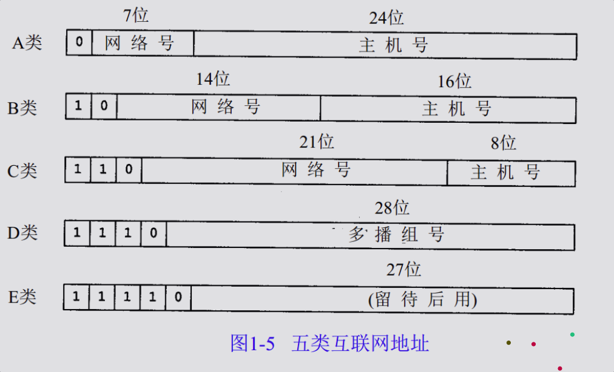

| 分类 | 地址范围                  | 可用地址范围              | 适用范围   |
| ---- | ------------------------- | ------------------------- | ---------- |
| A类  | 1.0.0.0~126.0.0.0         | 1.0.0.1~127.255.255.254   | 大型网络   |
| B类  | 128.0.0.0~191.255.0.0     | 128.0.0.1~191.255.255.254 | 中等网络   |
| C类  | 192.0.0.0~223.255.255.0   | 192.0.0.1~223.255.255.254 | 小型局域网 |
| D类  | 224.0.0.0~239.255.255.255 |                           | 组播地址   |
| E类  | 240.0.0.0~247.255.255.255 |                           | 保留地址   |


### `IP数据包的结构`


IP数据包头长度：20-60字节（一般为20字节）可选项一般不用（IPSecVPN、TTL值、对首部字段加密时用到）

IP数据包长度：mtu=1500（China）

 

- `版本`（4）：0100（ipv4）、0110（ipv6）

- `首部长度`（4）：0000~1111(0~15 x4字节 = 0~60字节)，IP包头的长度

- 优先级与服务类型（8）：前4个bit代表优先级，中间3个bit代表服务类型，最后1个bit未启用（保留，运营商可能会用到）优先级最高为5，用于语音流量

  > 优先级应用：大公司的专线，
  >
  > 服务类型：低延迟、多通道

- `总长度`（16）: 3+4+5（<u>未分片时的长度</u>，不是IP数据包长度）   

- `标识符`（16）：相当于id，是发送方随机生成的，`同一数据包的分片id相同`，不同数据包的分片标识符不同   （==<u>**标识同一组数组**</u>==）

- `标志`（3）：第1个bit保留；第2个bit若为0代表数据包进行了分片，为1未分片；第3bit代表是否为最后一个分片（0是，1不是）

- `段偏移量`（13）：0，1480,2960,···`1480`*n，`决定ip分片的先后顺序`，用于还原IP包   （<u>==**用于重组**==</u>）

  > 泪滴攻击TearDrop：
  >
  > - 构造一个段偏移量不为1480*n的分片，<u>让受害者重组数据包失败,然后一直重组直到死机</u>，也`是ddos攻击的一种`。
  >
  > 防御方法：
  >
  > - `防火墙拦截`—>最有效的方法就是在服务器前端加防火墙，过滤不安全的包。比如我利用HillStone防火墙保护后端安全，在防火墙中开启TearDrop攻击防护。
  >
  > 检测方法：
  >
  > - 对接收到的分片数据包进行分析，计算数据包的片偏移量（Offset）是否有误。

- ==<u>**TTL存活时间**</u>==（8）: Time To Live 0~255单位不是秒，是跳。`经过一个路由器-1`，默认255，主要用于`防环`。

  > TTL应用：tracert跟踪，跳了多少跳。
  >
  > Ping 返回的TTL值是初始TTL值，处理的TTL值在可选项
  >
  > ping 回显的TTL值大于100一般是window，小于100一般是Liunx；

- 协议号（8）：`表示上层所用的协议`，为上层提供服务TCP:6、UDP:17、ICMP:1、IGMP：88还有很多（网关选择协议，被路由器的hsrp技术替代了，vrrp）

- <u>首部校验和（</u>16）：校验IP包头部


### `IP地址作用`，以及`MAC地址作用`

- MAC地址是一个硬件地址，用来定义网络设备的位置，主要由数据链路层负责。

- P地址是IP协议提供的一种统一的地址格式，为互联网上的每一个网络和每一台主机分配一个逻辑地址，以此来屏蔽物理地址的差异。

> IP地址决定了网络中数据包如何通过路由器的转发到达目的地，而MAC地址则唯一标识了接受这个数据包的主机。
>
> ”IP地址是快递地址，MAC是收件人“

> ==<u>IP 如何转发</u>==
>
> ==<u>MAC 目的地</u>==

1. ==数据包的传输过程 源ip和目的ip是一直不变的 注意==
2. ==数据包进入网络层 在路由器之间路由转发 查询路由器表查得下一跳的ip地址 然后arp查询得到下一跳的mac==


### 传递到IP层怎么知道报文该给`哪个应用程序`，它怎么`区分`UDP`报文`还是TCP报文

根据上层协议tcp/udp 头部的端口标识，根据端口区分；

看ip头中的协议标识字段，17是udp，6是tcp


### IP协议切片

#### 一、什么是IP分片？

<u>IP协议在传输数据包时会将数据报文分成若干片进行传输，并在目标系统中进行重组。这一过程就成为分片</u>。

#### 二、为什么要进行IP分片

因为有`最大传输单元`（英語：Maximum Transmission Unit，缩写MTU）的限制。`1500个字节`

如果IP数据报加上数据帧头部后大于MTU（最大传输单元1500字节），数据报文就会分成若干片进行传输。

> 那么什么是MTU呢？
>
> 每一种物理网络都会规定链路层数据帧的最大长度，称为链路层MTU。在以太网的环境中可传输的最大IP报文为1500字节。
>
> 如果要传输的数据帧的大小超过1500字节，即IP数据报的长度大于1472(1500-20-8=1472，普通数据报)字节，需要分片之后进行传输。
>
> MTU标准对IP是1500   以太网帧最小-最大 64-1518 （以太网帧头18字节）

#### 三、IP分片是如何组装的？

在IP头里面有`16bit的识别号`唯一记录了一个IP包的ID,<u>以确定这几个分片是否属于同一个包</u>，具有同一个ID的IP分片将会从新组装。`13bit的片偏移`记录了一个IP分片相对于整个包的位置。`3bit的标志位`记录了该分片后面是否还有新的分片。这三个分片组成了IP分片的所有的信息。

> ==16bit的ip包识别号==
>
> ==13bit的片偏移==
>
> ==3bit的新分片标志位==

#### IP分片原理及分析

- 分片和重新组装的过程`对传输层是透明`的，其原因是当IP数据报进行分片之后，只有当它到达目的站时，才可进行重新组装，且它是由目的端的IP层来完成的。分片之后的数据报根据需要也可以再次进行分片

  > 只有起始网络层可见 目的ip层组装

- IP分片和完整IP报文差不多拥有相同的IP头，ID域对于每个分片都是一致的，这样才能在重新组装的时候识别出来自同一个IP报文的分片。在IP头里面，16位`识别号唯一记录`了一个IP包的ID，具有同一个ID的IP分片将会重新组装；而13位`片偏移`则记录了某IP片相对整个包的`位置`。 同时还有3bit的新分片标志位记录之后还有没有新的分片

  > 识别号识别同一个ip 片偏移记录当前分片的位置 新分片标志位记录之后还有没有新的分片

- 尽管IP分片过程看起来是透明的，但有一点让人不想使用它：<u>即使只丢失一片数据也要重传整个数据报</u>。因为IP层本身没有超时重传的机制——由更高层来负责超时和重传（TCP有超时和重传机制，但UDP没有。一些UDP应用程序本身也执行超时和重传）。当来自TCP报文段的某一片丢失后，TCP在超时后会重发整个TCP报文段，该报文段对应于一份IP数据报。没有办法只重传数据报中的一个数据报片。事实上，如果对数据报分片的是中间路由器，而不是起始端系统，那么起始端系统就无法知道数据报是如何被分片的。就这个原因，经常需要避免分片。

  > ==<u>**分片缺点：一个也不能丢失，不然整体重传**</u>==

>所以 TCP 引入了 `MSS` 也就是在 `TCP 层进行分片不由 IP 层分片`，那么对于 UDP 我们尽量不要发送一个大于 `MTU` 的数据报文。

  


### 为什么`MTU`限定为`1500字节`的数据包

1. 目的: 为了保证尽量大的传输效率

2. 首先 mtu除却了1500字节的最大长度外, 其实是以太网帧的长度范围被限制在了 64 - 1518

3. 64字节是为了保证在早期的以太网工作方式：==<u>**载波多路复用/冲突检测中，为了让最极端小的碰撞能够被检测到，所以将时间间隙内传输的bit位数设定在最小64字节**</u>==

4. 而最大被限制在1518是为了 <u>==**避免网络拥挤的同时保证足够大的有效传输速率**==</u>

5. IP头total length为两个byte，理论上IP packet可以有65535 byte，加上Ethernet Frame头和尾，可以有65535 +14 + 4 = 65553 byte。如果在10Mbps以太网上，将会占用共享链路长达50ms,这将<u>严重影响其它主机的通信</u>，特别是对延迟敏感的应用是无法接受的。

   由于线路质量差而引起的丢包，发生在大包的概率也比小包概率大得多，所以大包在丢包率较高的线路上不是一个好的选择。

   但是如果选择一个比较小的长度，传输效率又不高，拿TCP应用来说，如果选择以太网长度为218byte，TCP payload = 218 - Ethernet Header -IP Header - TCP Header=[218-18 - 20](tel:218-18 - 20) -20= 160 byte

   那有效传输效率=160/218= **73%**

   而如果以太网长度为1518，那有效传输效率=1460/1518=**96%**

   通过比较，选择较大的帧长度，有效传输效率更高，而更大的帧长度同时也会造成上述的问题，于是最终选择一个折衷的长度：1518 byte ! 对应的IP packet 就是 1500 byte，这就是最大传输单元MTU的由来。

6. 存在更大mtu, wifi的mtu是2304字节, 光纤的mtu是4352字节, 其实以太网中 最大可以设置为9000字节 
7. 受限于两个方面: 硬件设备 也就是网卡交换机路由器的支持情况 还有就是屈服于主流 避免被分片


### [`IP协议相关技术/协议`](https://xiaolincoding.com/network/4_ip/ip_base.html#点心-ip-协议相关技术)

#### [DNS](#DNS)

我们在上网的时候，通常使用的方式是域名，而不是 IP 地址，因为域名方便人类记忆。

那么实现这一技术的就是 **DNS 域名解析**，DNS 可以将域名网址自动转换为具体的 IP 地址。

#### ARP

在传输一个 IP 数据报的时候，确定了源 IP 地址和目标 IP 地址后，就会通过主机「路由表」确定 IP 数据包下一跳。然而，网络层的下一层是数据链路层，所以我们还要知道「下一跳」的 MAC 地址。

由于主机的路由表中可以找到下一跳的 IP 地址，所以可以通过 **ARP 协议**，求得==下一跳的 MAC 地址==。

#### RARP

ARP 协议是已知 IP 地址求 MAC 地址，那 RARP 协议正好相反，它是**已知 MAC 地址求 IP 地址**。例如==将打印机服务器等小型嵌入式设备接入到网络时就经常会用得到==。

通常这需要架设一台 `RARP` 服务器，在这个服务器上注册设备的 MAC 地址及其 IP 地址。然后再将这个设备接入到网络，接着：

- 该设备会发送一条「我的 MAC 地址是XXXX，请告诉我，我的IP地址应该是什么」的请求信息。
- RARP 服务器接到这个消息后返回「MAC地址为 XXXX 的设备，IP地址为 XXXX」的信息给这个设备。

最后，设备就根据从 RARP 服务器所收到的应答信息设置自己的 IP 地址。

#### [DHCP](https://xiaolincoding.com/network/4_ip/ip_base.html#dhcp)

DHCP 在生活中我们是很常见的了，我们的电脑通常都是通过 DHCP ==动态获取 IP 地址==，大大省去了配 IP 信息繁琐的过程。

 4 个步骤：

- 客户端首先发起 **DHCP 发现报文（DHCP DISCOVER）** 的 IP 数据报，由于客户端没有 IP 地址，也不知道 DHCP 服务器的地址，所以使用的是 ==UDP== **广播**通信，其使用的广播目的地址是 255.255.255.255（端口 67） 并且使用 0.0.0.0（端口 68） 作为源 IP 地址。DHCP 客户端将该 IP 数据报传递给链路层，链路层然后将帧广播到所有的网络中设备。
- DHCP 服务器收到 DHCP 发现报文时，用 **DHCP 提供报文（DHCP OFFER）** 向客户端做出响应。该报文仍然使用 IP 广播地址 255.255.255.255，该报文信息携带服务器提供可租约的 IP 地址、子网掩码、默认网关、DNS 服务器以及 **IP 地址租用期**。
- 客户端收到一个或多个服务器的 DHCP 提供报文后，从中选择一个服务器，并向选中的服务器发送 **DHCP 请求报文（DHCP REQUEST**进行响应，回显配置的参数。
- 最后，服务端用 **DHCP ACK 报文**对 DHCP 请求报文进行响应，应答所要求的参数。

一旦客户端收到 DHCP ACK 后，交互便完成了，并且客户端能够在租用期内使用 DHCP 服务器分配的 IP 地址。

如果租约的 DHCP IP 地址快期后，客户端会向服务器发送 DHCP 请求报文：

- 服务器如果同意继续租用，则用 DHCP ACK 报文进行应答，客户端就会延长租期。
- 服务器如果不同意继续租用，则用 DHCP NACK 报文，客户端就要停止使用租约的 IP 地址。

可以发现，DHCP 交互中，==全程都是使用 UDP 广播通信==。

> 但是有一个问题是 用到是==UDP广播== 所以路由器不会转发广播包
>
> 所以，为了解决这一问题，就出现了 **DHCP 中继代理**。有了 DHCP 中继代理以后，**对不同网段的 IP 地址分配也可以由一个 DHCP 服务器统一进行管理。**
>
> - DHCP 客户端会`向 DHCP 中继代理`发送 DHCP 请求包，而 DHCP 中继代理在收到这个广播包以后，再以==**单播**==的形式发给 DHCP 服务器。
> - 服务器端收到该包以后再向 DHCP 中继代理返回应答，并由 DHCP 中继代理将此包广播给 DHCP 客户端 。
>
> 因此，DHCP 服务器即使不在同一个链路上也可以实现统一分配和管理IP地址。

#### [NAT](https://xiaolincoding.com/network/4_ip/ip_base.html#nat)

#### [ICMP](https://xiaolincoding.com/network/4_ip/ip_base.html#icmp)

ICMP 全称是 **Internet Control Message Protocol**，也就是==互联网控制报文协议==。

> 网络包在复杂的网络传输环境里，常常会遇到各种问题。
>
> 当遇到问题的时候，总不能死个不明不白，没头没脑的作风不是计算机网络的风格。所以需要传出消息，==报告遇到了什么问题==，这样才可以调整传输策略，以此来控制整个局面。

##### ICMP 功能都有啥？

`ICMP` 主要的功能包括：**确认 IP 包是否成功送达目标地址、报告发送过程中 IP 包被废弃的原因和改善网络设置等。**

在 `IP` 通信中如果某个 `IP` 包因为某种原因未能达到目标地址，那么这个具体的原因将**由 ICMP 负责通知**。

##### ICMP 大致可以分为两大类：

- 一类是用于诊断的查询消息，也就是「**查询报文类型**」
- 另一类是通知出错原因的错误消息，也就是「**差错报文类型**」

#### [IGMP](https://xiaolincoding.com/network/4_ip/ip_base.html#igmp)


###  `ICMP`协议

| 协议 | 名称                 | 作用                                                         |
| :--- | :------------------- | :----------------------------------------------------------- |
| ICMP | Internet控制报文协议 | ICMP就是一个“==错误侦测与回报机制”==，其目的就是让我们能够检测网路的连线状况﹐也能确保连线的准确性，是ping和traceroute的工作协议 |

#### **ICMP**协议是一个`网络层`协议。

一个新搭建好的网络，往往需要先`进行一个简单的测试，来验证网络是否畅通`；<u>但是IP协议并不提供可靠传输。如果丢包了，IP协议并不能通知传输层是否丢包以及丢包的原因。</u>

所以我们就需要一种协议来完成这样的功能–ICMP协议。

#### **ICMP**协议的功能

> 1. `确认IP包是否成功到达目标地址`
>
> 2. `通知`在发送过程中IP包`被丢弃的原因`

#### **ICMP**的报文格式

==ICMP报文包含在IP数据报中==，IP报头在ICMP报文的最前面。一个ICMP报文包括IP报头（至少20字节）、ICMP报头（至少八字节）和ICMP报文（属于ICMP报文的数据部分）。当IP报头中的协议字段值为1时，就说明这是一个ICMP报文。

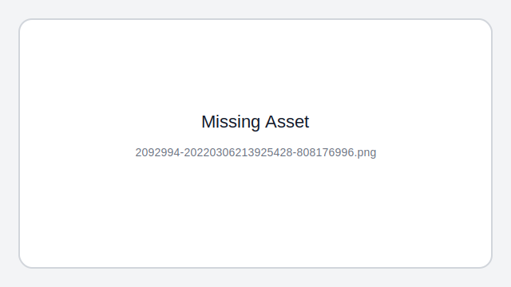

##### 类型    

- 占一字节，标识ICMP报文的类型，从类型值来看ICMP报文可以分为两大类。
- 第一类是取值为1~127的`差错`报文，第2类是取值128以上的`信息`报文

##### 代码    

- 占一字节，标识对应ICMP报文的代码。它与类型字段一起共同标识了ICMP报文的`详细类型`

##### 校验和  

- 这是对包括ICMP报文数据部分在内的整个ICMP数据报的校验和，以检验报文在传输过程中是否出现了差错（其计算方法与在我们介绍IP报头中的校验和计算方法是一样的）


### [`ping` 的工作原理](https://xiaolincoding.com/network/4_ip/ping.html#_5-2-ping-的工作原理)

#### **ping**命令的功能

1. 用来检测网络的连通情况和分析网络速度；

2. 根据域名得到服务器IP； //dns哦

3. 会统计响应时间和TTL(IP包中的Time To Live，生存周期)

   > 根据ping返回的TTL值来判断对方所使用的操作系统及数据包经过路由器数量。

==Ping 的原理是 ICMP 协议.==

#### **那么如何验证的呢？**

（1）ping命令会先发送一个 `ICMP Echo Request`给对端   echo(回响 音：爱扣)

（2）对端接收到之后, 会返回一个`ICMP Echo Reply`

（3）若没有返回，就是超时了，会认为指定的网络地址不存在。


### `IPv4`和`IPv6`的区别

#### `扩展了路由和寻址的能力`

- IPv6把IP地址由<u>32位增加到128位</u>，从而能够==<u>**支持更大的地址空间**</u>==，估计在地球表面每平米有4*10^18个IPv6地址，使IP地址在可预见的将来不会用完。

- IPv6地址的编码采用类似于CIDR的`分层分级结构`，如同电话号码。<u>简化了路由，加快了路由速度</u>。

- 在多点传播地址中增加了一个“范围”域，从而使多点传播不仅仅局限在子网内，可以横跨不同的子网，不同的局域网。

#### `报头格式的简化`

IPv4报头格式中一些冗余的域或被丢弃或被列为扩展报头，从而降低了包处理和报头带宽的开销。虽然IPv6的地址大小是IPv4地址的4倍。但报头只有它的2倍大。

#### 对`可选项`更大的支持

IPv6的<u>可选项不放入报头，而是放在一个个独立的扩展头部</u>。如果不指定路由器不会打开处理扩展头部.这大大改变了路由性能。IPv6放宽了对可选项长度的严格要求(IPv4的可选项总长最多为40字节)，并可根据需要随时引入新选项。IPV6的很多新的特点就是由选项来提供的，如对IP层安全(IPSEC)的支持，对巨报(jumbogram)的支持以及对IP层漫游(Mobile-IP)的支持等。

#### `QoS`的功能

> ##### 什么是服务质量？
>
> 服务质量 (QoS) 是`对流量的操纵`，使得路由器或交换机等网络设备采取与生成该流量的应用程序所需行为一致的方式转发流量。换言之，QoS 使网络设备能够区分流量，然后向流量应用不同的行为。
>
> ##### QoS 解决的问题
>
> 过去，使用独立的物理网络来分别承载语音和数据流量。每个网络承载特定类型的流量，并提供该流量所需的内在质量水平。如今，这些相同的应用程序在基于数据包的融合网络上运行，流量在此共享通用基础架构和网络资源。这些基于数据包的网络旨在尽最大努力提供流量，它们没有固有的 QoS。
>
> 然而，语音和视频服务用户要求这些服务始终达到可接受的质量水平。基于数据包的网络将大量流量从 A 点传递到 B 点，并遵循生成该流量的所有应用程序的服务合同和性能需求，QoS 正是实现此目的的途径。
>
> ##### QoS 有何作用？
>
> QoS 对于管理当今基于数据包的网络中的流量至关重要，其包括以下功能：
>
> - 根据协议、地址和端口号区分流量优先顺序。
> - 过滤入口和出口流量。
> - 控制允许在设备上传输或接收的带宽。
> - 在数据包标头中读写 QoS 行为要求。
> - 控制拥塞，以便设备基于计划程序优先级发送优先级最高的流量。
> - 使用随机早期检测 (RED) 算法控制丢包，以便设备知道要丢弃或处理的数据包。

因特网不仅可以提供各种信息，缩短人们的距离.还可以进行网上娱乐。网上VOD现正被商家炒得热火朝天，而大多还只是准VOD的水平，且只能在局域网上实现，因特网上的VOD都很不理想.问题在于IPv4的报头虽然有服务类型的字段，实际上现在的路由器实现中都忽略了这一字段。在IPv6的头部，有两个相应的优先权和流标识字段，允许把数据报指定为某一信息流的组成部分，并可对这些数据报进行流量控制。如对于实时通信即使所有分组都丢失也要保持恒速，所以优先权最高，而一个新闻分组延迟几秒钟也没什么感觉，所以其优先权较低。IPv6指定这两字段是每一IPv6节点都必须实现的。

#### 安全

> ##### 身份验证和保密
>
> - `在IPv6中加入了关于身份验证、数据一致性和保密性的内容`。
>
> ##### `安全机制`IPSec是必选的
>
> - IPv4的是可选的或者是需要付费支持的。

#### 加强了对`移动设备的支持`

- IPv6在设计之初有有着支持移动设备的思想，允许移动终端在切换接入点时保留相同的IP地址。

#### 支持`无状态自动地址`配置

> 无状态地址自动配置会自动执行某些网络管理员的任务。
>
> 无状态地址自动配置是 IPv6 节点（主机或路由器）用于为接口自动配置 IPv6 地址的过程。节点通过将地址前缀与节点的 MAC 地址派生的标识或用户指定的接口标识组合来构建各种 IPv6 地址。这些前缀包括本地链路前缀（fe80::/10）和本地 IPv6 路由器（如果存在）所通告的长度为 64 的前缀。
>
> 将地址分配给某个接口之前，节点执行重复地址检测以验证其唯一性。节点对新地址发送邻居请求查询并等待响应。如果节点没有接收到响应，那么假设该地址是唯一的。如果节点接收到一个邻居广告格式的响应，那么该地址已在使用。如果节点确定其尝试的 IPv6 地址不是唯一的，那么自动配置将停止并要求手工配置该接口。

#### 简化了`地址配置`过程

无需DNS服务器也可完成地址的配置，路由广播地址前缀，各主机根据自己MAC地址和收到的地址前缀生成可聚合全球单播地址。这也方便了某一区域内的主机同时更换IP地址前缀。

> 理解 无需rarp协议 自己进行ip的配置
>
> 使用无状态自动配置，无需手动干预就能够改变网络中所有主机的IP地址。例如，当企业更换了联入Internet的ISP时，将从新ISP处得到一个新的可聚集全局地址前缀。ISP把这个地址前缀从它的路由器上传送到企业路由器上。由于企业路由器将周期性地向本地链接中的所有主机多点广播路由器公告，因此企业网络中所有主机都将通过路由器公告收到新的地址前缀，此后，它们就会自动产生新的IP地址并覆盖旧的IP地址。
