# 1. OSI模型和协议

### 1.1 OSI七层模型及其包含的协议如下:

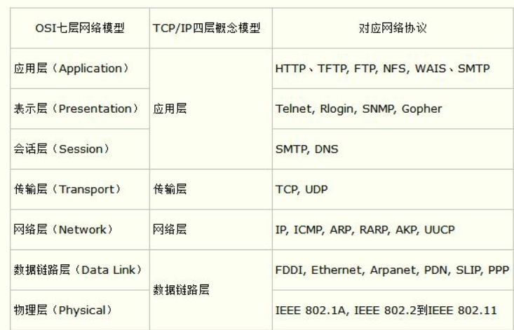

1.  物理层: `底层数据传输`，如网线；网卡标准，通过媒介传输比特,确定机械及电气规范,传输单位为`bit`，<u>01模数和数模转换 物理设备的标准和比特流的收发</u>      ==<u>比特流传输</u>==

   主要包括的协议为：IEE802.3 CLOCK RJ45

2. 数据链路层: `定义数据的基本格式，如何传输，如何标识`；如网卡MAC地址提供介质访问和链路管理，使用链路层地址 (以太网使用MAC地址)来访问介质,并进行差错检测，将比特组装成帧和点到点的传递,传输单位为`帧`,     ==<u>控制物理层和网络成之间通信</u>==

   主要包括的协议为MAC VLAN PPP

3. 网络层：`定义IP编址，定义路由功能；如不同设备的数据转发`，IP选址和路由选择，负责数据包从源到宿的传递和网际互连，传输单位为包或分组（`IP数据报`）,         ==<u>IP寻址和路由选择</u>==

   > `进行逻辑地址寻址，在位于不同地理位置的网络中的两个主机系统之间提供连接和路径选择`

   主要包括的协议为IP ARP ICMP

4. 传输层：端到端传输数据的基本功能；提供端到端的可靠报文传递和错误恢复，传输单位为报文段（TCP）或用户数据报（UDP）  `段`，         ==<u>建立维护管理 端到端连接</u>==

   > `建立 管理和维护 端到端的连接`          端口

   主要包括的协议为TCP UDP

5. 会话层：`控制应用程序之间会话能力；如不同软件数据分发给不同软件`，建立、管理和终止会话，传输单位为SPDU，  ==<u>建立维护管理 会话连接</u>==

   主要包括的协议为RPC NFS

6. 表示层:  `数据格式标识，基本压缩加密功能`；对数据进行翻译、加密和压缩,传输单位为PPDU，  ==<u>数据格式化 加解密</u>==

   主要包括的协议为HTML ASCII

7. 应用层:  `各种应用软件，包括 Web 应用，`为计算机用户提供应用接口，也为用户直接提供各种网络服务,   ==<u>为应用程序提供网络服务</u>==

   传输单位为APDU，主要包括的协议为FTP HTTP DNS

说明：

- 在四层，既传输层数据被称作**段**（Segments）；
- 三层网络层数据被称做**包**（Packages）；
- 二层数据链路层时数据被称为**帧**（Frames）；
- 一层物理层时数据被称为**比特流**（Bits）。

##### [总结](https://interviewguide.cn/#/Doc/Knowledge/计算机网络/计算机网络?id=总结)

- 网络七层模型是一个标准，而非实现。
- 网络四层模型是一个实现的应用模型。
- 网络四层模型由七层模型简化合并而来。

 

### TCP/IP 4层模型包括：


1. 网络接口层 - 网络接口层（或链路层）负责将TCP / IP`数据包放在网络介质`上，并从网络介质上接收TCP / IP数据包。 TCP / IP被设计为独立于网络访问方法，帧格式和介质。换句话说，它独立于任何特定的网络技术。这样，TCP / IP可以用于连接不同的网络类型，例如以太网，令牌环，X.25，帧中继和异步传输模式（ATM）。　 ==<u>以太网协议</u>==

   > （这里只写了数据链路层）
   >
   > 将源自网络层来的数据可靠地传输到相邻节点的目标机网络层
   >
   > 该层的作用包括：<u>`物理地址寻址`、数据的`成帧`、`流量控制`、数据的`检错`、`重发`等</u>。

   有关数据链路层的重要知识点：

   1. 数据链路层为网络层提供可靠的数据传输；
   2. 基本数据单位为帧；
   3.  主要的协议：`以太网协议`；
   4.  两个重要设备名称：网桥和交换机。

2. 网络层:<u>==IP  ICMP IGMP==</u>  ==<u>ARP RARP</u>== 

   网络层 - <u>网络层负责主机寻址，打包和路由功能</u>。 网络层的核心协议是==IP==，地址解析协议（==ARP==），Internet控制消息协议（==ICMP==）和Internet组管理协议（==IGMP==）。 

   > IP是可路由协议，负责`IP寻址`，`路由`以及`数据包的分段和重组`。 
   >
   > ARP负责`发现网络访问层地址`，例如与给定Internet层访问关联的`硬件地址`。
   >
   > 由于IP数据包传递失败，ICMP负责`提供诊断功能并报告错误`。 
   >
   > IGMP负责`IP多播组的管理`。 IP在此层中将标头添加到数据包中，称为IP地址。现在既有IPv4（32位）地址又有IPv6（128位）地址。

   <u>网络层的`目的`是实现两个`主机`系统之间的`数据`透明`传送`，具体功能包括`寻址`和`路由选择`、`连接的建立、保持和终止`等。</u>

   1. 网络层负责对子网间的数据包进行路由选择。此外，网络层还可以实现拥塞控制、网际互连等功能；
   2. 传输单位为包或分组（IP数据报）
   3. 重要的设备：路由器。

3. 传输层:==TCP UDP==

   向两台主机中`进程之间`的通信提供通用的`数据传输`服务。

   网络层只是根据网络地址将源结点发出的数据包传送到目的结点，而传输层则负责将数据可靠地传送到相应的端口。

   有关传输层的重点：

   1. 传输层负责将上层数据分段并提供端到端的、可靠的或不可靠的传输以及端到端的差错控制和流量控制问题；
   2. 包含的主要协议：TCP协议（Transmission Control Protocol，传输控制协议）、UDP协议（User Datagram Protocol，用户数据报协议）；

   3. 重要设备：网关。

4. 应用层:HTTP DNS SMTP

   通过应用进程间的交互来完成特定的网络应用。应用层协议是`应用`进程间`通信和交互的规则`。是最靠近用户的OSI层，为用户的应用程序提供网络服务的接口。将用户的操作通过应用程序转换成为服务，并匹配一个相应的服务协议发送给传输层。传输单位为报文。

   > rtt：报文段往返时间
   >
   > msl:报文段最大生存时间
   >
   > TTL：(IP包中的Time To Live，生存周期)

### 1.2 网络通信的过程 `封装和分用`

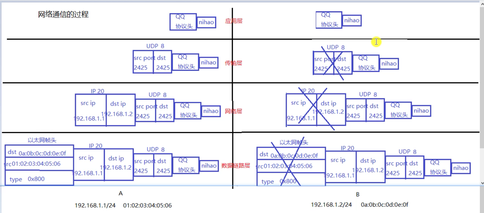

# 2. 键入网址到网页显示

## HTTP

### 解析 URL

首先浏览器做的第一步工作就是要对 `URL` 进行解析，从而生成发送给 `Web` 服务器的请求信息。

### 生产 HTTP 请求信息

对 `URL` 进行解析之后，浏览器确定了 Web 服务器和文件名，接下来就是根据这些信息来生成 HTTP 请求消息了。

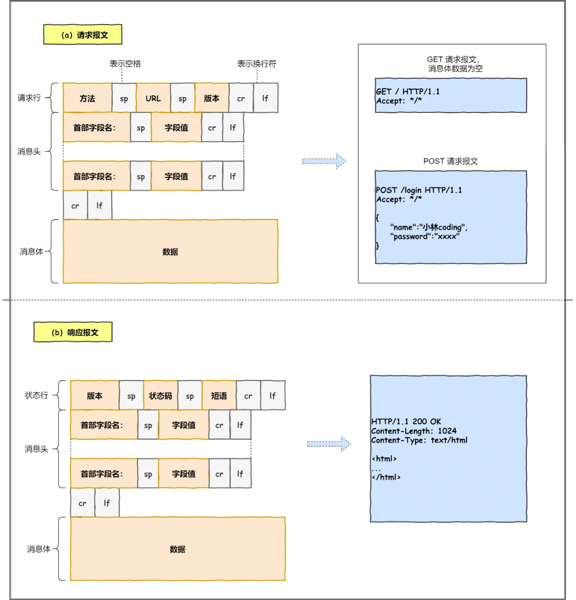

## DNS

通过浏览器解析 URL 并生成 HTTP 消息后，需要委托操作系统将消息发送给 `Web` 服务器。

但在发送之前，还有一项工作需要完成，那就是**`查询服务器域名对应的 IP 地址`**，因为委托操作系统发送消息时，必须提供通信对象的 IP 地址。

所以，有一种服务器就专门保存了 `Web` 服务器域名与 `IP` 的对应关系，它就是 ==`DNS` 服务器==。

### 域名的层级关系

域名的层级关系类似一个树状结构：

- 根 DNS 服务器（.）
- 顶级域 DNS 服务器（.com）
- 权威 DNS 服务器（server.com）

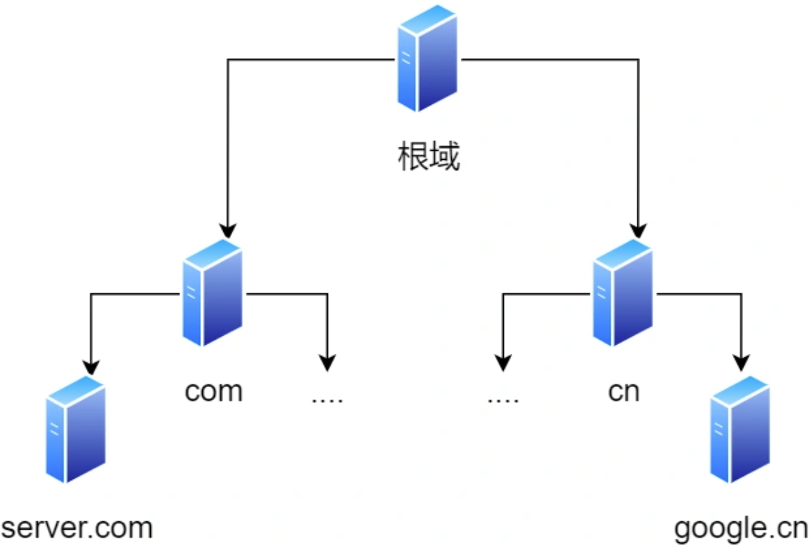

### `域名解析的工作流程`

> ==<u>**查询缓存**</u>==
>
> `浏览器`会先看自身有没有对这个域名的`缓存`，如果有，就直接返回，如果没有，就去问操作系统，`操作系统`也会去看自己的`缓存`，如果有，就直接返回，如果没有，再去 `hosts 文件`看，也没有，才会去问「本地 DNS 服务器」。
>
> 所有步骤之前有个查询缓存的操作
>
> 1. 浏览器缓存
> 2. 操作系统缓存
> 3. hosts文件

1. 客户端首先会`发出一个 DNS 请求`，问 www.server.com 的 IP 是啥，并发给本地 DNS 服务器（也就是客户端的 TCP/IP 设置中填写的 DNS 服务器地址）。
2. 本地域名服务器收到客户端的请求后，如果缓存里的表格能找到 www.server.com，则它直接返回 IP 地址。如果没有，本地 DNS 会去问它的根域名服务器：“老大， 能告诉我 www.server.com 的 IP 地址吗？” `根域名`服务器是最高层次的，它不直接用于域名解析，但能`指明一条道路`。
3. 根 DNS 收到来自本地 DNS 的请求后，发现后置是 .com，说：“www.server.com 这个域名归 .com 区域管理”，我给你 .com `顶级域名`服务器`地址`给你，你去问问它吧。”
4. 本地 DNS 收到顶级域名服务器的地址后，发起请求问“老二， 你能告诉我 www.server.com 的 IP 地址吗？”
5. 顶级域名服务器说：“我给你负责 www.server.com 区域的`权威 DNS` 服务器的`地址`，你去问它应该能问到”。
6. 本地 DNS 于是转向`问权威 DNS 服务器`：“老三，www.server.com对应的IP是啥呀？” server.com 的权威 DNS 服务器，它是域名解析结果的原出处。为啥叫权威呢？就是我的域名我做主。
7. 权威 DNS 服务器查询后将对应的 IP 地址 X.X.X.X 告诉本地 DNS。
8. `本地 DNS 再将 IP 地址返回客户端`，客户端和目标建立连接。

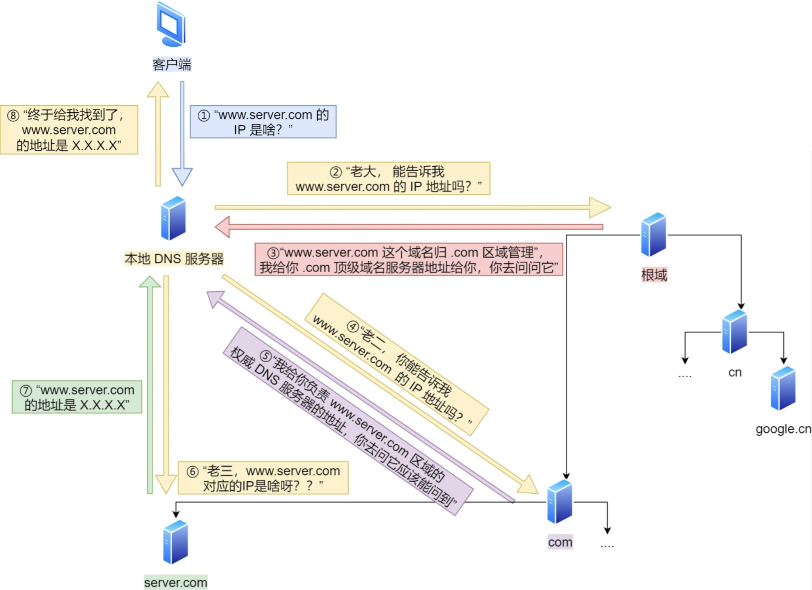

## 协议栈

通过 DNS 获取到 IP 后，就可以把 HTTP 的传输工作交给操作系统中的**协议栈**。

协议栈的内部分为几个部分，分别承担不同的工作。上下关系是有一定的规则的，上面的部分会向下面的部分委托工作，下面的部分收到委托的工作并执行。

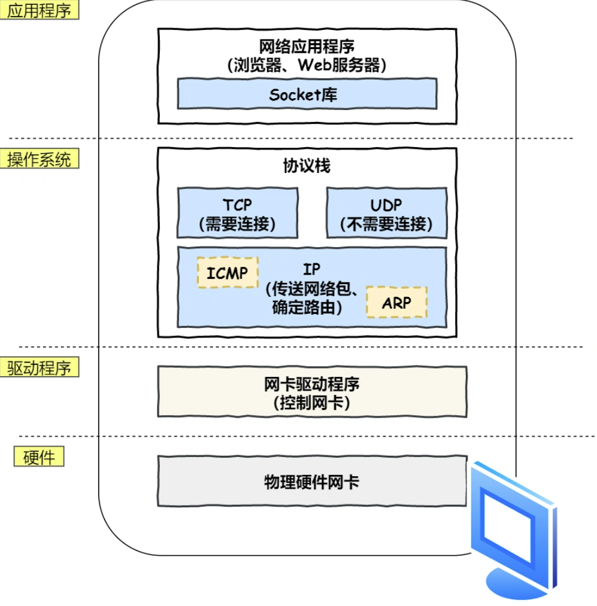

应用程序（浏览器）<u>通过`调用 Socket 库`，来委托协议栈工作</u>。协议栈的上半部分有两块，分别是负责收发数据的 TCP 和 UDP 协议，这两个传输协议会接受应用层的委托执行收发数据的操作。

协议栈的下面一半是用 IP 协议控制网络包收发操作，在互联网上传数据时，数据会被切分成一块块的网络包，而将网络包发送给对方的操作就是由 IP 负责的。

此外 IP 中还包括 `ICMP` 协议和 `ARP` 协议。

- `ICMP` 用于告知网络包传送过程中产生的错误以及各种控制信息。
- `ARP` 用于根据 IP 地址查询相应的以太网 MAC 地址。

IP 下面的网卡驱动程序负责控制网卡硬件，而最下面的网卡则负责完成实际的收发操作，也就是对网线中的信号执行发送和接收操作。

## TCP

HTTP 是基于 TCP 协议传输的

### TCP 包头格式

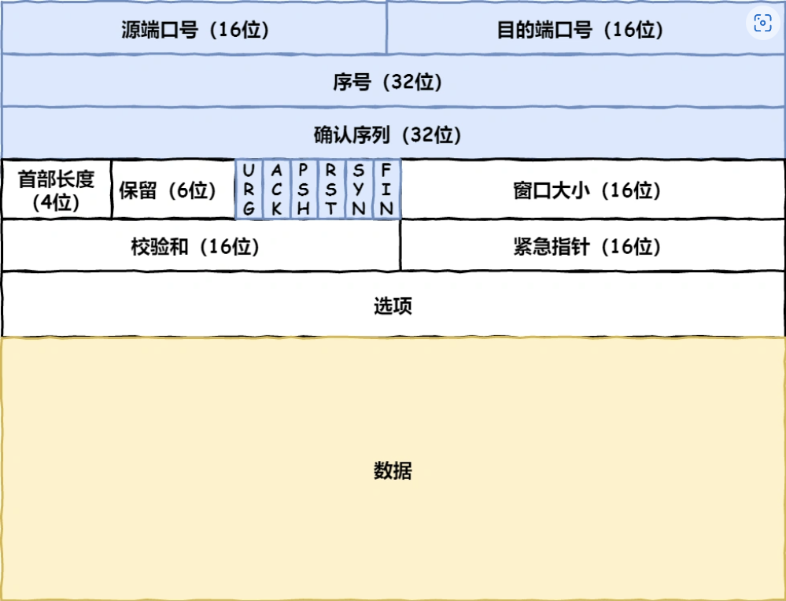

首先，`源端口号和目标端口号`是不可少的，如果没有这两个端口号，数据就不知道应该发给哪个应用。 

接下来有包的**`序`**号，这个是为了解决包乱序的问题。

还有应该有的是**`确认号`**，目的是确认发出去对方是否有收到。如果没有收到就应该重新发送，直到送达，这个是为了解决不丢包的问题。

接下来还有一些**`状态位`**。例如 `SYN` 是发起一个连接，`ACK` 是回复，`RST` 是重新连接，`FIN` 是结束连接等。TCP 是面向连接的，因而双方要维护连接的状态，这些带状态位的包的发送，会引起双方的状态变更。

还有一个重要的就是**`窗口大小`**。TCP 要做**`流量控制`**，通信双方各声明一个窗口（缓存大小），标识自己当前能够的处理能力，别发送的太快，撑死我，也别发的太慢，饿死我。

除了做流量控制以外，TCP还会做**`拥塞控制`**，对于真正的通路堵车不堵车，它无能为力，唯一能做的就是控制自己，也即控制发送的速度。不能改变世界，就改变自己嘛。

### TCP 传输数据之前，要先三次握手建立连接

在 HTTP 传输数据之前，首先需要 TCP 建立连接，TCP 连接的建立，通常称为**三次握手**。

这个所谓的「连接」，只是双方计算机里维护一个状态机，在连接建立的过程中，双方的状态变化时序图就像这样。

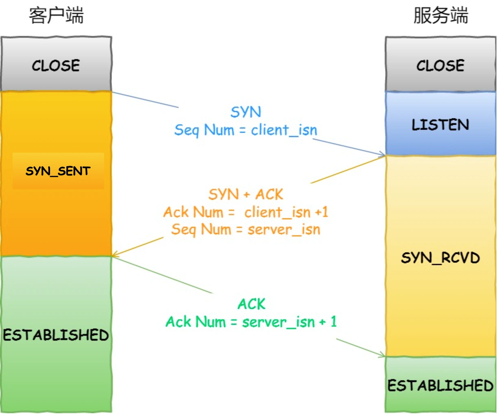

- 一开始，客户端和服务端都处于 `CLOSED` 状态。先是服务端主动监听某个端口，处于 `LISTEN` 状态。
- 然后客户端主动发起连接 `SYN`，之后处于 `SYN-SENT` 状态。
- 服务端收到发起的连接，返回 `SYN`，并且 `ACK` 客户端的 `SYN`，之后处于 `SYN-RCVD` 状态。
- 客户端收到服务端发送的 `SYN` 和 `ACK` 之后，发送对 `SYN` 确认的 `ACK`，之后处于 `ESTABLISHED` 状态，因为它一发一收成功了。
- 服务端收到 `ACK` 的 `ACK` 之后，处于 `ESTABLISHED` 状态，因为它也一发一收了。

所以三次握手目的是**保证双方都有发送和接收的能力**。

### 如何查看 TCP 的连接状态？

TCP 的连接状态查看，在 Linux 可以通过 `netstat -napt` 命令查看。

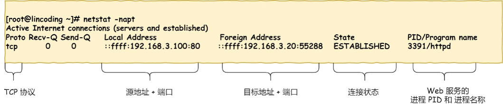

### TCP 分割数据

如果 HTTP 请求消息比较长，超过了 `MSS` 的长度，这时 TCP 就需要把 HTTP 的数据拆解成一块块的数据发送，而不是一次性发送所有数据


- `MTU`：一个网络包的最大长度，以太网中一般为 `1500` 字节。
- `MSS`：除去 IP 和 TCP 头部之后，一个网络包所能容纳的 TCP 数据的最大长度。

数据会被以 `MSS` 的长度为单位进行拆分，拆分出来的每一块数据都会被放进单独的网络包中。也就是在每个被拆分的数据加上 TCP 头信息，然后交给 IP 模块来发送数据。

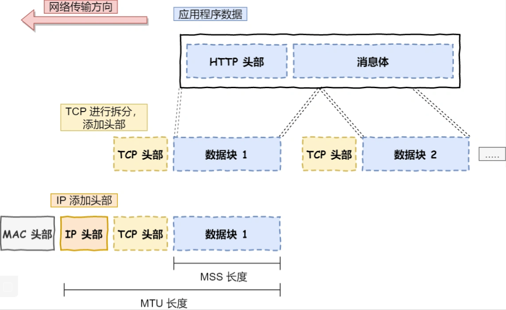

### TCP 报文生成

TCP 协议里面会有两个端口，一个是浏览器监听的端口（通常是随机生成的），一个是 Web 服务器监听的端口（HTTP 默认端口号是 `80`， HTTPS 默认端口号是 `443`）。

在双方建立了连接后，TCP 报文中的数据部分就是存放 HTTP 头部 + 数据，组装好 TCP 报文之后，就需交给下面的网络层处理。

至此，网络包的报文如下图

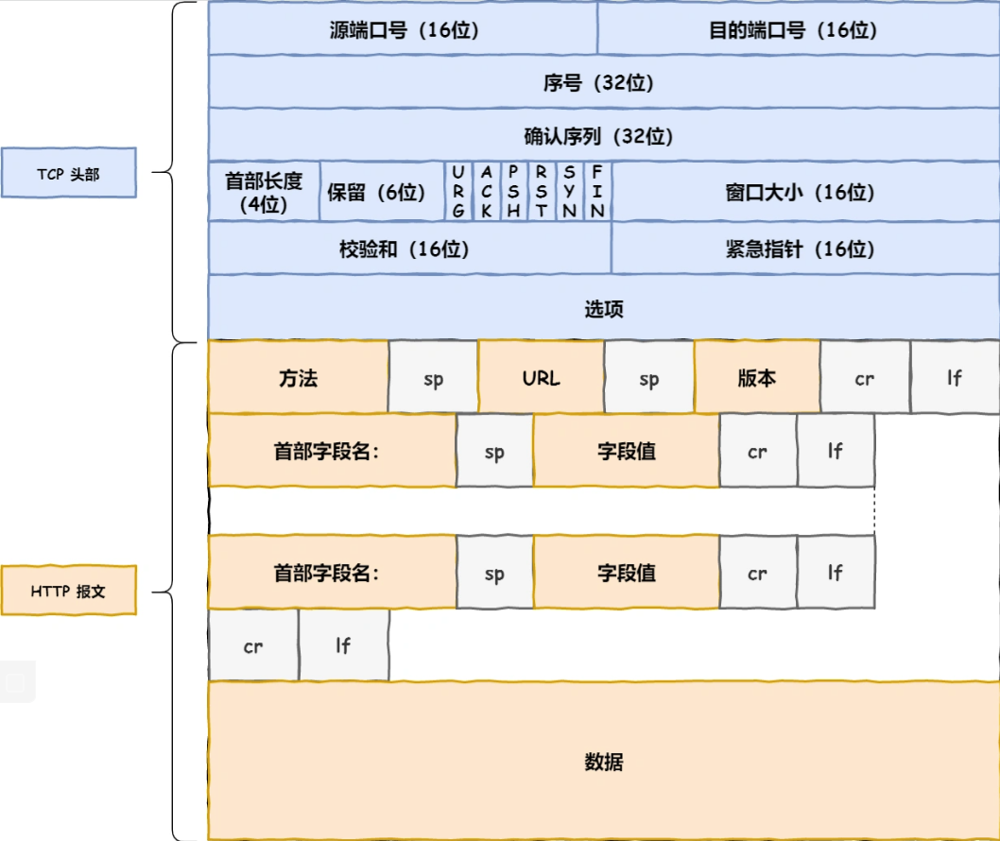

## IP

TCP 模块在执行连接、收发、断开等各阶段操作时，都需要委托 IP 模块将数据封装成**网络包**发送给通信对象。

### IP 包头格式

TCP 模块在执行连接、收发、断开等各阶段操作时，都需要委托 IP 模块将数据封装成**网络包**发送给通信对象。

我们先看看 IP 报文头部的格式：

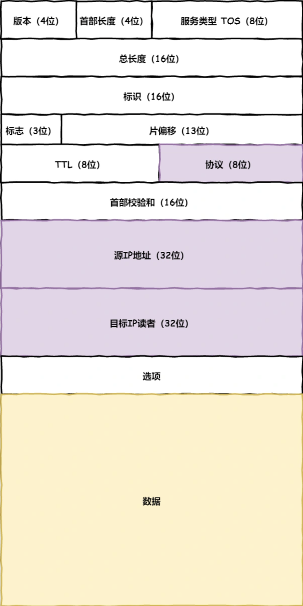

在 IP 协议里面需要有**源地址 IP** 和 **目标地址 IP**：

- 源地址IP，即是客户端输出的 IP 地址；
- 目标地址，即通过 DNS 域名解析得到的 Web 服务器 IP。

因为 HTTP 是经过 TCP 传输的，所以在 IP 包头的**协议号**，要填写为 `06`（十六进制），表示协议为 TCP。

### 假设客户端有多个网卡，就会有多个 IP 地址，那 IP 头部的源地址应该选择哪个 IP 呢？

当存在多个网卡时，在填写源地址 IP 时，就需要判断到底应该填写哪个地址。这个判断相当于在多块网卡中判断应该使用哪个一块网卡来发送包。

这个时候就需要根据**路由表**规则，来判断哪一个网卡作为源地址 IP。

在 Linux 操作系统，我们可以使用 `route -n` 命令查看当前系统的路由表。

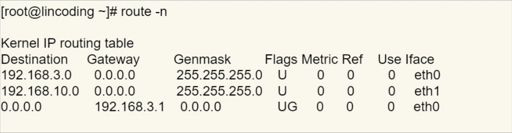

举个例子，根据上面的路由表，我们假设 Web 服务器的目标地址是 `192.168.10.200`。

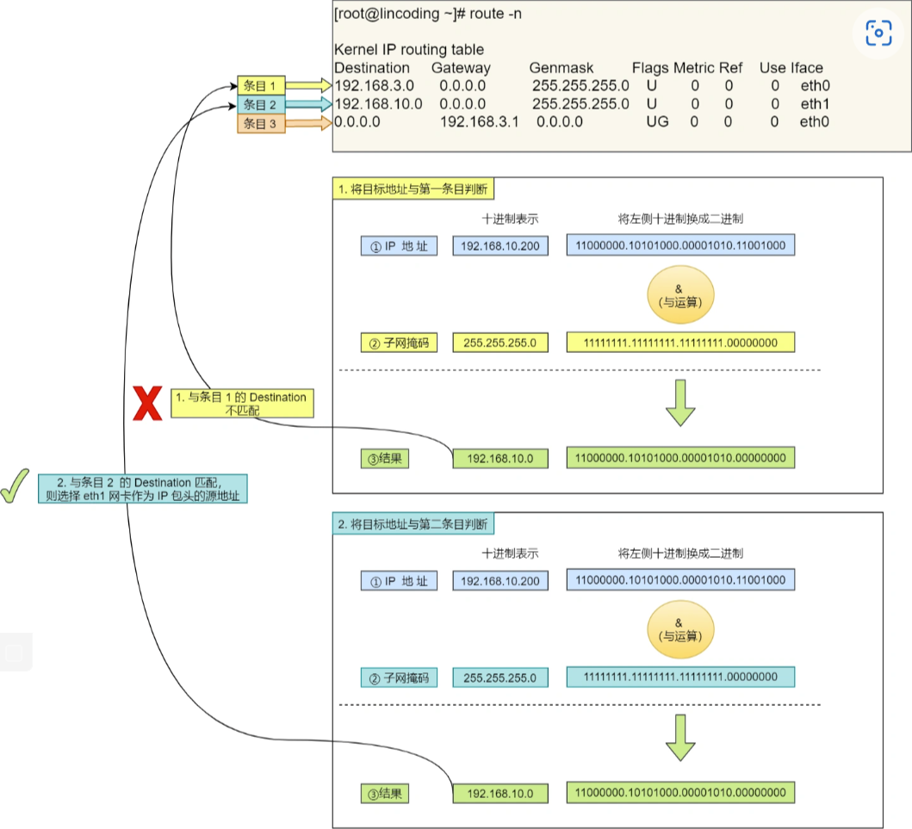

1. 首先先和第一条目的子网掩码（`Genmask`）进行 **与运算**，得到结果为 `192.168.10.0`，但是第一个条目的 `Destination` 是 `192.168.3.0`，两者不一致所以匹配失败。
2. 再与第二条目的子网掩码进行 **与运算**，得到的结果为 `192.168.10.0`，与第二条目的 `Destination 192.168.10.0` 匹配成功，所以将使用 `eth1` 网卡的 IP 地址作为 IP 包头的源地址。

那么假设 Web 服务器的目标地址是 `10.100.20.100`，那么依然依照上面的路由表规则判断，判断后的结果是和第三条目匹配。

第三条目比较特殊，它目标地址和子网掩码都是 `0.0.0.0`，这表示**默认网关**，如果其他所有条目都无法匹配，就会自动匹配这一行。并且后续就把包发给路由器，`Gateway` 即是路由器的 IP 地址。

### IP 报文生成

至此，网络包的报文如下图。

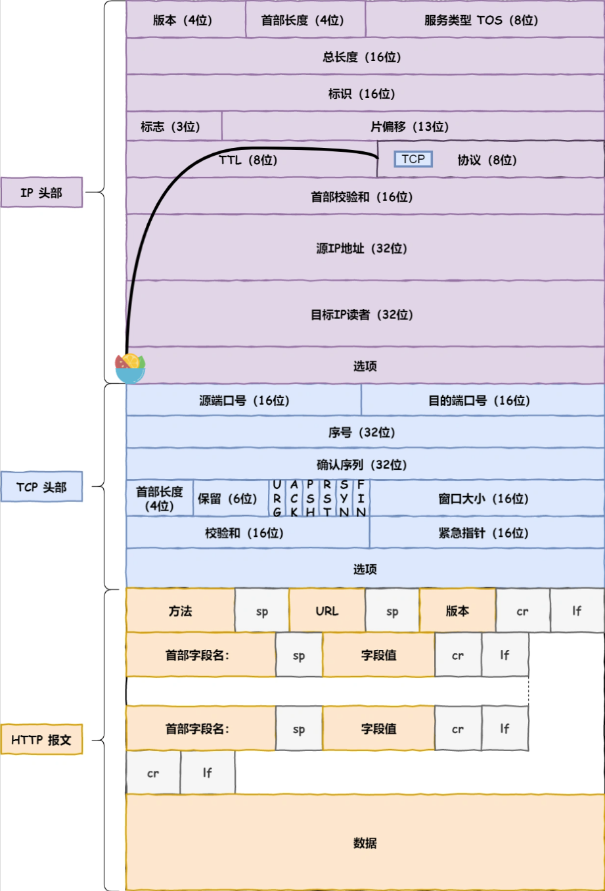

> 此时，加上了 IP 头部的数据包表示 ：“有 IP 大佬给我指路了，感谢 IP 层给我加上了 IP 包头，让我有了远程定位的能力！不会害怕在浩瀚的互联网迷茫了！可是目的地好远啊，我下一站应该去哪呢？”

## MAC

生成了 IP 头部之后，接下来网络包还需要在 IP 头部的前面加上 **MAC 头部**。

### MAC 包头格式

MAC 头部是以太网使用的头部，它包含了接收方和发送方的 MAC 地址等信息。

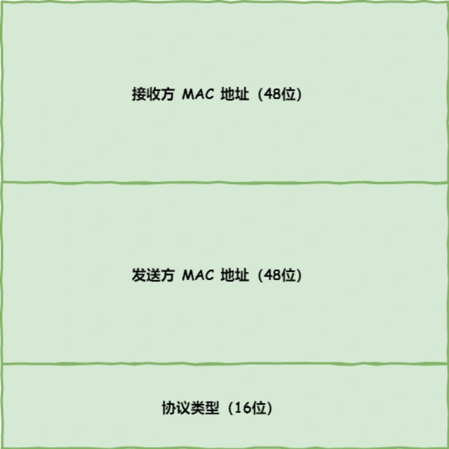

在 MAC 包头里需要**发送方 MAC 地址**和**接收方目标 MAC 地址**，用于**两点之间的传输**。

一般在 TCP/IP 通信里，MAC 包头的**协议类型**只使用：

- `0800` ： IP 协议
- `0806` ： ARP 协议

### MAC 发送方和接收方如何确认?

**发送方**的 MAC 地址获取就比较简单了，MAC 地址是在网卡生产时写入到 ROM 里的，只要将这个值读取出来写入到 MAC 头部就可以了。

**接收方**的 MAC 地址就有点复杂了，只要告诉以太网对方的 MAC 的地址，以太网就会帮我们把包发送过去，那么很显然这里应该填写对方的 MAC 地址。

所以先得搞清楚应该把包发给谁，这个只要查一下**路由表**就知道了。在路由表中找到相匹配的条目，然后把包发给 `Gateway` 列中的 IP 地址就可以了。

### 既然知道要发给谁，按如何获取对方的 MAC 地址呢？

不知道对方 MAC 地址？不知道就喊呗。

此时就需要 ==`ARP`== 协议帮我们找到路由器的 MAC 地址。


ARP 协议会在以太网中以**广播**的形式，对以太网所有的设备喊出：“这个 IP 地址是谁的？请把你的 MAC 地址告诉我”。

然后就会有人回答：“这个 IP 地址是我的，我的 MAC 地址是 XXXX”。

如果对方和自己处于同一个子网中，那么通过上面的操作就可以得到对方的 MAC 地址。然后，我们将这个 MAC 地址写入 MAC 头部，MAC 头部就完成了。

### 好像每次都要广播获取，这不是很麻烦吗？

放心，在后续操作系统会把本次查询结果放到一块叫做 **`ARP 缓存`**的内存空间留着以后用，不过缓存的时间就几分钟。

也就是说，在发包时：

- 先查询 ARP 缓存，如果其中已经保存了对方的 MAC 地址，就不需要发送 ARP 查询，直接使用 ARP 缓存中的地址。
- 而当 ARP 缓存中不存在对方 MAC 地址时，则发送 ARP 广播查询。

### 查看 ARP 缓存内容

在 Linux 系统中，我们可以使用 `arp -a` 命令来查看 ARP 缓存的内容。

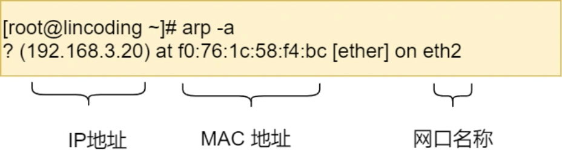

### MAC 报文生成

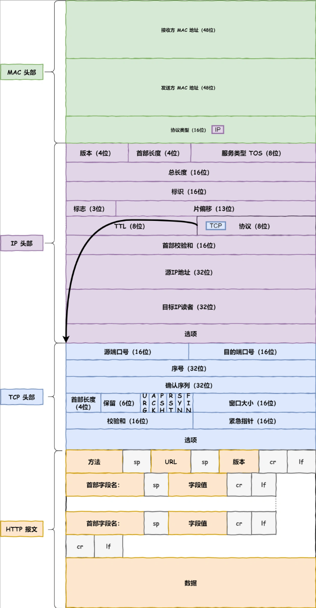


## 网卡

网络包只是存放在内存中的一串二进制数字信息，没有办法直接发送给对方。因此，我们需要将==<u>**数字信息转换为电信号**</u>==，才能在网线上传输，也就是说，这才是真正的数据发送过程。

负责执行这一操作的是**网卡**，要控制网卡还需要靠**网卡驱动程序**。

网卡驱动获取网络包之后，会将其**复制**到网卡内的缓存区中，接着会在其**开头加上报头和起始帧分界符，在末尾加上用于检测错误的帧校验序列**。

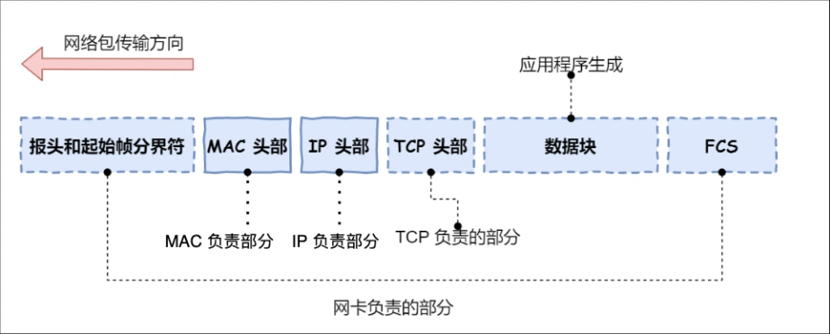

- 起始帧分界符是一个用来表示包起始位置的标记
- 末尾的 `FCS`（帧校验序列）用来检查包传输过程是否有损坏

最后网卡会将包转为电信号，通过网线发送出去。

## 交换机

> ==<u>**根据目标mac地址确认数据转发端口**</u>==

下面来看一下包是如何通过交换机的。交换机的设计是将网络包**原样**转发到目的地。交换机工作在 MAC 层，也称为**`二层网络设备`**。

### 交换机的包接收操作

首先，电信号到达网线接口，交换机里的模块进行接收，接下来交换机里的模块将电信号转换为数字信号。

然后通过包末尾的 `FCS` 校验错误，如果没问题则放到缓冲区。这部分操作基本和计算机的网卡相同，但交换机的工作方式和网卡不同。

计算机的网卡本身具有 MAC 地址，并通过核对收到的包的接收方 MAC 地址判断是不是发给自己的，如果不是发给自己的则丢弃；相对地，交换机的端口不核对接收方 MAC 地址，而是直接接收所有的包并存放到缓冲区中。因此，和网卡不同，**`交换机的端口不具有 MAC 地址`**。

将包存入缓冲区后，接下来需要查询一下这个包的接收方 MAC 地址是否已经在 MAC 地址表中有记录了。

交换机的 MAC 地址表主要包含两个信息：

- 一个是`设备的 MAC 地址`，
- 另一个是该设备连接`在`交换机的`哪个端口`上。

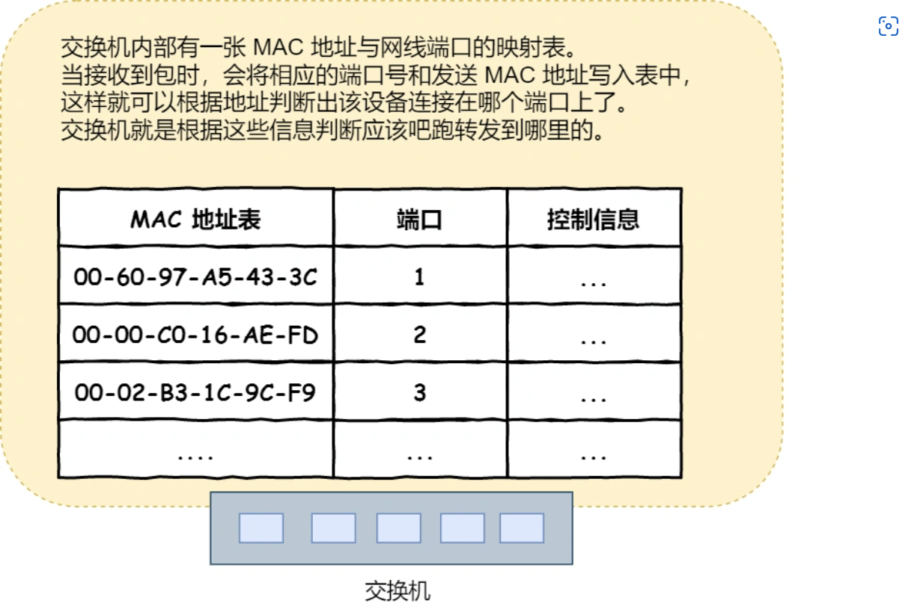

举个例子，如果收到的包的接收方 MAC 地址为 00-02-B3-1C-9C-F9，则与图中表中的第 3 行匹配，根据端口列的信息，可知这个地址位于 `3` 号端口上，然后就可以通过交换电路将包发送到相应的端口了。

所以，**交换机根据 MAC 地址表`查找 MAC 地址`，然后将信号`发送到`相应的`端口`**。

### 当 MAC 地址表找不到指定的 MAC 地址会怎么样？

> `MAC地址表记录的是MAC地址和端口的对应关系`

地址表中找不到指定的 MAC 地址。这可能是因为具有该地址的设备还没有向交换机发送过包，或者这个设备一段时间没有工作导致地址被从地址表中删除了。

这种情况下，交换机无法判断应该把包转发到哪个端口，只能将包`转发到除了源端口之外的所有端口`上，无论该设备连接在哪个端口上都能收到这个包。

这样做不会产生什么问题，因为以太网的设计本来就是将包发送到整个网络的，然后**只有相应的接收者才接收包，而其他设备则会忽略这个包**。

有人会说：“这样做会发送多余的包，会不会造成网络拥塞呢？”

其实完全不用过于担心，因为发送了包之后目标设备会作出响应，只要返回了响应包，交换机就可以将它的地址写入 MAC 地址表，下次也就不需要把包发到所有端口了。

局域网中每秒可以传输上千个包，多出一两个包并无大碍。

此外，如果接收方 MAC 地址是一个**广播地址**，那么交换机会将包发送到除源端口之外的所有端口。

以下两个属于广播地址：

- MAC 地址中的 FF:FF:FF:FF:FF:FF
- IP 地址中的 255.255.255.255

## 路由器

> 寻址 路由 最佳线路 （路由表）
>
> 1. 查找路由表 确认下一跳ip
> 2. arp协议 缓存或查询下一跳mac
> 3. 数据转发到mac对应的端口

### 路由器与交换机的区别

网络包经过交换机之后，现在到达了**`路由器`**，并在此被转发到`下一个路由器`或`目标设备`。

这一步转发的工作原理和交换机类似，也是通过查表判断包转发的目标。

不过在具体的操作过程上，路由器和交换机是有区别的。

- 因为**路由器**是基于 IP 设计的，俗称**三层**网络设备，路由器的各个端口都具有 MAC 地址和 IP 地址；
- 而**交换机**是基于以太网设计的，俗称**二层**网络设备，交换机的端口不具有 MAC 地址。

### 路由器基本原理

路由器的端口具有 `MAC 地址`，因此它就<u>能够成为以太网的==发送方==和==接收方==</u>；同时还具有 `IP 地址`，从这个意义上来说，它和计算机的网卡是一样的。

当`转发包`时，首先路由器端口会接收发给自己的以太网包，然后**`路由表`**查询转发目标，再由相应的端口作为发送方将以太网包发送出去。

### 路由器的包接收操作

首先，电信号到达网线接口部分，路由器中的模块会将`电信号`转成`数字信号`，然后通过包末尾的 FCS 进行`错误校验`。

如果没问题则检查 MAC 头部中的**==接收方 MAC 地址==**，看看是不是发给自己的包，如果是就放到接收缓冲区中，否则就丢弃这个包。

总的来说，路由器的端口都具有 MAC 地址，只接收与自身地址匹配的包，遇到不匹配的包则直接丢弃。

> `根据mac地址确认是不是发给自己的包`

### `查询路由表确定输出端口`

完成包接收操作之后，路由器就会**`去掉`**包开头的 MAC 头部。

**<u>MAC 头部的作用就是将包送达路由器</u>**，其中的接收方 MAC 地址就是路由器端口的 MAC 地址。因此，当包到达路由器之后，MAC 头部的任务就完成了，于是 MAC 头部就会**被丢弃**。

接下来，路由器会根据 MAC 头部后方的 `IP` 头部中的内容进行包的转发操作。

转发操作分为几个阶段，首先是查询**`路由表`**判断转发目标。

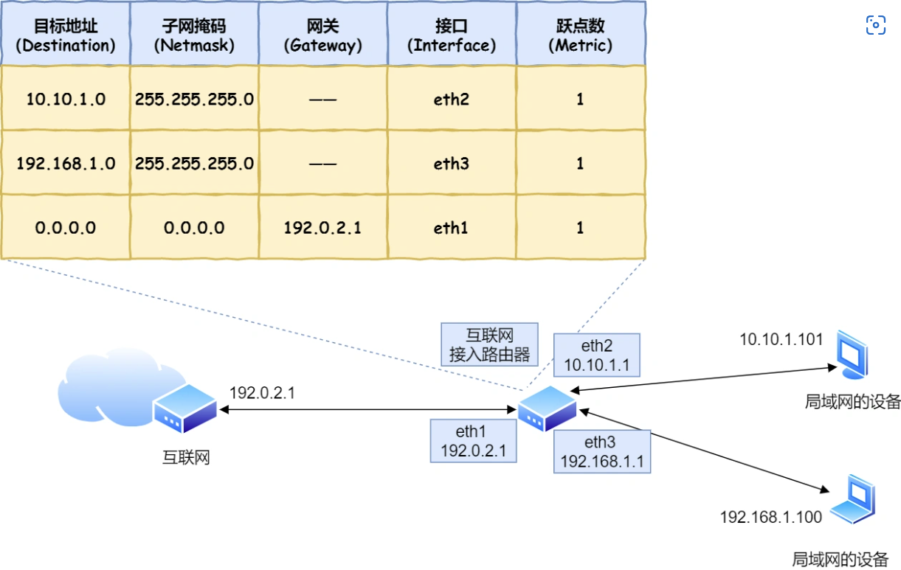

具体的工作流程根据上图，举个例子。

假设地址为 `10.10.1.101` 的计算机要向地址为 `192.168.1.100` 的服务器发送一个包，这个包先到达图中的路由器。

判断转发目标的第一步，就是根据包的接收方 IP 地址查询路由表中的目标地址栏，以找到相匹配的记录。

路由匹配和前面讲的一样，每个条目的子网掩码和 `192.168.1.100` IP 做 **& 与运算**后，得到的结果与对应条目的目标地址进行匹配，如果匹配就会作为候选转发目标，如果不匹配就继续与下个条目进行路由匹配。

如第二条目的子网掩码 `255.255.255.0` 与 `192.168.1.100` IP 做 **& 与运算**后，得到结果是 `192.168.1.0` ，这与第二条目的目标地址 `192.168.1.0` 匹配，该第二条目记录就会被作为转发目标。

实在找不到匹配路由时，就会选择**默认路由**，路由表中子网掩码为 `0.0.0.0` 的记录表示「默认路由」。

### ==<u>**路由器的发送操作**</u>==

首先，我们需要根据**`路由表的网关列表`**判断对方的地址。

- 如果网关是一个 `IP 地址`，则这个IP 地址就是我们要转发到的目标地址，**还未抵达终点**，还需`继续`需要路由器`转发`。
- 如果网关为`空`，则 IP 头部中的接收方 IP 地址就是要转发到的目标地址，也是就终于找到 IP 包头里的目标地址了，说明**`已抵达终点`**。

知道对方的 IP 地址之后，接下来需要通过 `ARP` 协议根据 IP 地址查询 MAC 地址，并将查询的结果作为接收方 MAC 地址。

路由器也有 `ARP 缓存`，因此首先会在 ARP 缓存中查询，如果找不到则发送 `ARP 查询请求`。

> 广播局域网 ip是...的mac是啥 

接下来是发送方 MAC 地址字段，这里填写输出端口的 MAC 地址。还有一个以太类型字段，填写 0800 （十六进制）表示 IP 协议。

网络包完成后，接下来会将其转换成电信号并通过端口发送出去。这一步的工作过程和计算机也是相同的。

发送出去的网络包会通过**交换机**到达下一个路由器。由于接收方 MAC 地址就是下一个路由器的地址，所以交换机会根据这一地址将包传输到下一个路由器。

接下来，下一个路由器会将包转发给再下一个路由器，经过层层转发之后，网络包就到达了最终的目的地。

不知你发现了没有，在网络包传输的过程中，**`源 IP 和目标 IP 始终是不会变的，一直变化的是 MAC 地址`**，因为需要 <u>MAC 地址在以太网内进行**`两个设备`**之间的包传输</u>。

## 服务器 与 客户端

数据包抵达了服务器，服务器肯定高兴呀，正所谓有朋自远方来，不亦乐乎？

服务器高兴的不得了，于是开始扒数据包的皮！就好像你收到快递，能不兴奋吗？

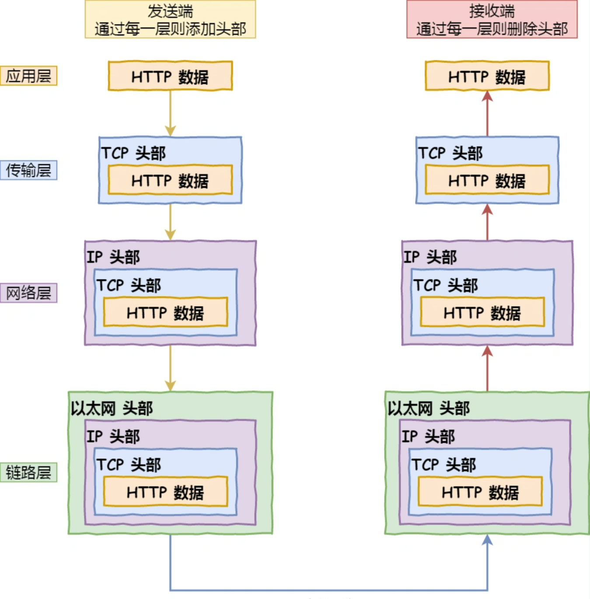

数据包抵达服务器后，服务器会先扒开数据包的 MAC 头部，查看是否和服务器自己的 MAC 地址符合，符合就将包收起来。

接着继续扒开数据包的 IP 头，发现 IP 地址符合，根据 IP 头中协议项，知道自己上层是 TCP 协议。

于是，扒开 TCP 的头，里面有序列号，需要看一看这个序列包是不是我想要的，如果是就放入缓存中然后返回一个 ACK，如果不是就丢弃。TCP头部里面还有端口号， HTTP 的服务器正在监听这个端口号。

于是，服务器自然就知道是 HTTP 进程想要这个包，于是就将包发给 HTTP 进程。

服务器的 HTTP 进程看到，原来这个请求是要访问一个页面，于是就把这个网页封装在 HTTP 响应报文里。

HTTP 响应报文也需要穿上 TCP、IP、MAC 头部，不过这次是源地址是服务器 IP 地址，目的地址是客户端 IP 地址。

穿好头部衣服后，从网卡出去，交由交换机转发到出城的路由器，路由器就把响应数据包发到了下一个路由器，就这样跳啊跳。

最后跳到了客户端的城门把守的路由器，路由器扒开 IP 头部发现是要找城内的人，于是又把包发给了城内的交换机，再由交换机转发到客户端。

客户端收到了服务器的响应数据包后，同样也非常的高兴，客户能拆快递了！

于是，客户端开始扒皮，把收到的数据包的皮扒剩 HTTP 响应报文后，交给浏览器去渲染页面，一份特别的数据包快递，就这样显示出来了！

最后，客户端要离开了，向服务器发起了 TCP 四次挥手，至此双方的连接就断开了。

# 3. 传输层

## [3.1 端口有效范围是多少到多少？](https://interviewguide.cn/#/Doc/Knowledge/计算机网络/计算机网络?id=32、端口有效范围是多少到多少？)

`0-1023为知名端口号`，比如其中HTTP是80，FTP是20（数据端口）、21（控制端口）

`UDP和TCP报头使用两个字节存放端口号，所以端口号的有效范围是从0到65535`。<u>动态端口的范围是从1024到65535</u> (2^16^-1)

端口号用来`标识进程的唯一性`，一个进程不能占用多个端口号 

其实端口就是一段缓冲区(读写缓冲区)，端口号就是唯一标识。

#### 是否可以修改？如果想要用的端口超过这个限制怎么办？

对于服务器来说，可以开的端口号与65536无关，其实是受限于Linux可以打开的文件数量，并且可以通过`MaxUserPort`来进行配置

## [3.2 为何需要把 TCP/IP 协议栈分成 5 层（或7层）？开放式回答。](https://interviewguide.cn/#/Doc/Knowledge/计算机网络/计算机网络?id=33、为何需要把-tcpip-协议栈分成-5-层（或7层）？开放式回答。)

答：ARPANET 的研制经验表明，对于复杂的计算机网络协议，其结构应该是层次式的。

`分层的好处：`

> ①隔层之间是`独立`的
>
> ②`灵活`性好
>
> ③`结构`上可以`分隔`开
>
> ④易于`实现和维护`
>
> ⑤能促进`标准化`工作。

## 3.3 web为什么不直接用tcp协议？

大概就是tcp协议可以让两个进程通过三次握手建立稳定的通信信道，发送字节流，而http协议建立在tcp协议之上，也就是说<u>tcp协议可以让两个程序说话，而http协议定义了说话的规则</u>。HTTP定义了请求对象和响应对象，各种头字段，发送方和接收方才能相互明白。

浏览器需要提供一个`安全沙箱`,在使用网络协议上就需要加入一些诸如**跨域**等限制.

如果浏览器提供建立裸TCP链接的能力,那么当你打开网页的时候,该网页的脚本就可以利用TCP协议访问内网的资源.

## 3.4 TCP可靠性保证

序列号、确认应答、超时重传、拥塞控制 滑动窗口？

### TCP保证可靠性：

1. **序列号、确认应答、超时重传**

   数据到达接收方，接收方需要发出一个确认应答，表示已经收到该数据段，并且确认序号会说明了它下一次需要接收的数据序列号。如果发送发迟迟未收到确认应答，那么可能是发送的数据丢失，也可能是确认应答丢失，这时发送方在等待一定时间后会进行重传。

   这个时间一般是2*RTT(报文段往返时间）+一个偏差值。 ？

   > - 当超时时间 **RTO 较大**时，重发就`慢`，丢了老半天才重发，没有效率，性能差；
   > - 当超时时间 **RTO 较小**时，会导致`可能并没有丢就重发`，于是重发的就快，会增加网络拥塞，导致更多的超时，更多的超时导致更多的重发。
   >
   > 根据上述的两种情况，我们可以得知，`超时重传时间 RTO 的值应该略大于报文往返 RTT 的值`。
   >
   > **每当遇到一次超时重传的时候，都会将下一次超时时间间隔设为先前值的两倍。两次超时，就说明网络环境差，不宜频繁反复发送。**   由此引出快重传来解决超时时间可能过长的问题

2. **窗口控制与高速重发控制/快速重传（重复确认应答）**

   TCP会利用窗口控制来提高传输速度，意思是在一个窗口大小内，不用一定要等到应答才能发送下一段数据，窗口大小就是无需等待确认而可以继续发送数据的最大值<u>==（一次发送多个段）==</u>。如果不使用窗口控制，每一个没收到确认应答的数据都要重发。

   使用窗口控制，如果数据段1001-2000丢失，后面数据每次传输，确认应答都会不停地发送序号为1001的应答，表示我要接收1001开始的数据，发送端如果收到3次相同应答，就会立刻进行重发；但还有种情况有可能是数据都收到了，但是有的应答丢失了，这种情况不会进行重发，因为发送端知道，如果是数据段丢失，接收端不会放过它的，会疯狂向它提醒......

3. **拥塞控制**

   如果把窗口定的很大，发送端连续发送大量的数据，可能会造成网络的拥堵（大家都在用网，你在这狂发，吞吐量就那么大，当然会堵），甚至造成网络的瘫痪。所以TCP在为了防止这种情况而进行了拥塞控制。

   （这里的窗口大小为了方便以报文为单位，实际窗口是以字节为单位）

   > **慢启动**：定义拥塞窗口，一开始将该窗口大小设为1，之后每经过一个传输轮次（经过一个rtt），将拥塞窗口大小*2。（每收到一个确认窗口加1）  <u>==（指数增长）==</u>
   >
   > **拥塞避免**：设置慢启动阈值，一般开始都设为65536。拥塞避免是指当拥塞窗口大小达到这个阈值，拥塞窗口的值不再指数上升，而是加法增加（每经过一个传输轮次/每个rtt，拥塞窗口大小<u>==+1==</u>），以此来避免拥塞。
   >
   > 将报文段的超时重传看做拥塞，则<u>一旦发生超时重传</u>，我们需要<u>先将阈值设为当前窗口大小的一半</u>，并且<u>将窗口大小设为初值1</u>，然后重新进入慢启动过程。
   >
   > **快速重传**：在遇到3次重复确认应答（高速重发控制）时，代表收到了3个报文段，但是这之前的1个段丢失了，便对它进行立即重传。
   >
   > 然后，先将阈值设为当前窗口大小的一半，然后将拥塞窗口大小设为慢启动阈值+3（3次重复确认应答，代表有3个报文结束传输）的大小。（可以+3可以不加）
   >
   > 这样可以达到：在TCP通信时，网络吞吐量呈现逐渐的上升，并且随着拥堵来降低吞吐量，再进入慢慢上升的过程，网络不会轻易的发生瘫痪。

## [`3.5 👍TCP 重传，滑动窗口，流量控制`](https://zhuanlan.zhihu.com/p/133307545)

### **重传机制**

TCP 实现可靠传输的方式之一，是通过`序列号`与`确认应答`。

TCP 针对数据包丢失的情况，会用**重传机制**解决。

> 常见的重传机制：
>
> - 超时重传
> - 快速重传
> - SACK
> - D-SACK

### 超时重传 时间驱动

TCP 会在以下两种情况发生`超时重传`：

> - 数据包丢失
> - 确认应答丢失

`RTT`（Round-Trip Time 往返时延）：就是**数据从网络一端传送到另一端所需的时间**，也就是==<u>**包的往返时间**</u>==。

超时重传时间是以 `RTO` （Retransmission Timeout 超时重传时间）表示

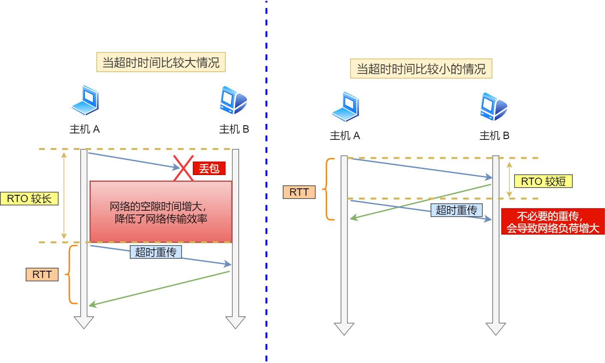

> - 当超时时间 **RTO 较大**时，`重发就慢`，丢了老半天才重发，没有效率，性能差；
> - 当超时时间 **RTO 较小**时，会导致`可能并没有丢就重发`，于是重发的就快，会增加网络拥塞，导致更多的超时，更多的超时导致更多的重发。

超时重传时间 `RTO `的值应该`略大于`报文往返 2*`RTT` 的值。

如果超时重发的数据，再次超时的时候，又需要重传的时候，TCP 的策略是**超时间隔加倍。**

也就是**每当遇到一次超时重传的时候，都会将下一次超时时间间隔设为先前值的两倍。两次超时，就说明网络环境差，不宜频繁反复发送。**超时触发重传存在的问题是，超时周期可能相对较长。于是就可以用「快速重传」机制来解决超时重发的时间等待。

### **快速重传** 数据驱动

**不以时间为驱动，而是以数据驱动重传**。


> - 第一份 Seq1 先送到了，于是就 Ack 回 2；
> - 结果 Seq2 因为某些原因没收到，Seq3 到达了，于是还是 Ack 回 2；
> - 后面的 Seq4 和 Seq5 都到了，但还是 Ack 回 2，因为 Seq2 还是没有收到；
> - **发送端收到了三个 Ack = 2 的确认，知道了 Seq2 还没有收到，就会在定时器过期之前，重传丢失的 Seq2。**
> - 最后，收到了 Seq2，此时因为 Seq3，Seq4，Seq5 都收到了，于是 Ack 回 6 。

所以，快速重传的工作方式是当收到三个相同的 ACK 报文时，会在定时器过期之前，重传丢失的报文段。

快速重传机制只解决了一个问题，就是超时时间的问题，但是它依然面临着另外一个问题。就是**重传的时候，是重传之前的一个，还是重传所有的问题。**

比如对于上面的例子，是重传 Seq2 呢？还是重传 Seq2、Seq3、Seq4、Seq5 呢？因为发送端并不清楚这连续的三个 Ack 2 是谁传回来的。

> 就是没法偷懒 只重传Seq2  因为不知道后面的是 3 4 5 6 7 8 9中的那几个回复的，这几个是不是也有丢失，这几个是不是也需要重传

### **SACK 方法**

在 TCP 头部「选项」字段里加一个 `SACK` 的东西，它**可以将缓存的地图发送给发送方**，这样发送方就可以知道哪些数据收到了，哪些数据没收到，知道了这些信息，就可以**只重传丢失的数据**。

### **Duplicate SACK**

Duplicate SACK 又称 `D-SACK`，其主要**使用了 SACK 来告诉「发送方」有哪些数据被重复接收了。**

### `滑动窗口`

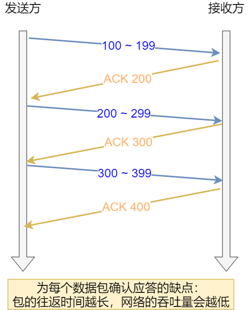

如果不使用滑动窗口就是上述情况 我发给你 你回复我 我收到你的ack之后 才能继续发送下一个

缺点：数据包的`往返时间越长`，`通信的效率就越低`

==<u>窗口</u>==：有了窗口，就可以指定窗口大小，窗口大小就是指`无需等待确认应答`，而可以`继续发送数据的最大值`。

假设<u>窗口大小为 `3` 个 TCP 段</u>，那么发送方就可以「连续发送」 `3` 个 TCP 段，并且中途若有 ACK 丢失，可以通过「下一个确认应答进行确认」。如下图：

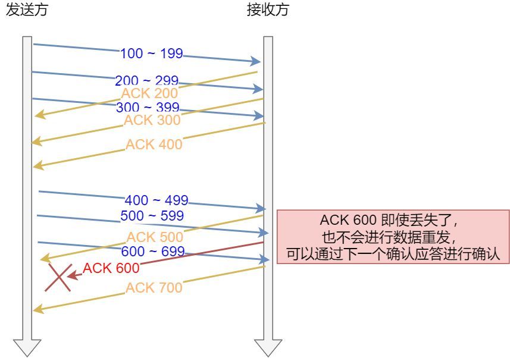

图中的 ACK 600 确认应答报文丢失，也没关系，因为可以通过下一个确认应答进行确认，只要发送方收到了 ACK 700 确认应答，就意味着 700 之前的所有数据「接收方」都收到了。这个模式就叫**累计确认**或者**累计应答**。

#### 窗口大小由哪一方决定？

TCP 头里有一个字段叫 `Window`，也就是窗口大小。

这个字段是==接收端==`告诉发送端自己还有多少缓冲区可以接收数据`。于是发送端就可以`根据这个接收端的处理能力来发送数据`，而不会导致接收端处理不过来。

所以，通常窗口的大小是由==接收方的窗口大小==来决定的。

发送方发送的数据大小不能超过接收方的窗口大小，否则接收方就无法正常接收到数据。

####  发送方的滑动窗口

我们先来看看发送方的窗口，下图就是发送方缓存的数据，根据处理的情况分成四个部分，其中深蓝色方框是发送窗口，紫色方框是可用窗口：

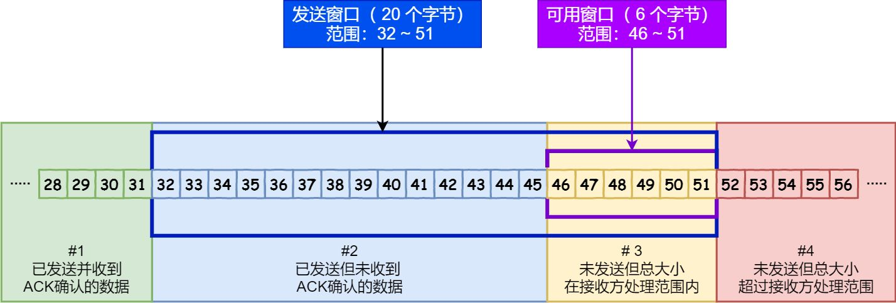

- \#1 是已发送并收到 ACK确认的数据：1~31 字节
- \#2 是已发送但未收到 ACK确认的数据：32~45 字节
- \#3 是未发送但总大小在接收方处理范围内（接收方还有空间）：46~51字节
- \#4 是未发送但总大小超过接收方处理范围（接收方没有空间）：52字节以后

在下图，当发送方把数据「全部」都一下发送出去后，可用窗口的大小就为 0 了，表明可用窗口耗尽，在没收到 ACK 确认之前是无法继续发送数据了。

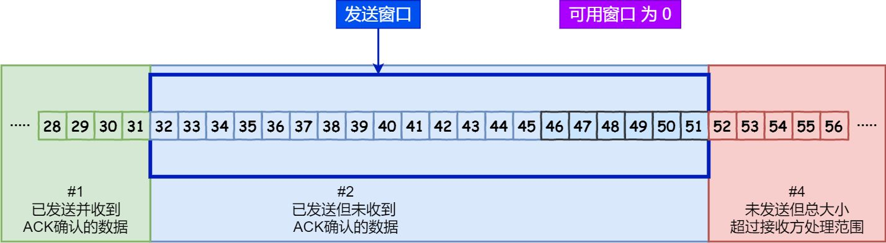

在下图，当收到之前发送的数据 `32~36` 字节的 ACK 确认应答后，如果发送窗口的大小没有变化，则**滑动窗口往右边移动 5 个字节，因为有 5 个字节的数据被应答确认**，接下来 `52~56` 字节又变成了可用窗口，那么后续也就可以发送 `52~56` 这 5 个字节的数据了。

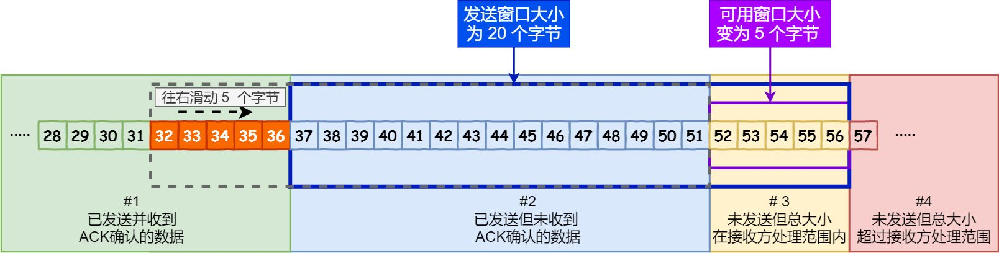

#### 接收方的滑动窗口

接收窗口相对简单一些，根据处理的情况划分成三个部分：

- \#1 + #2 是已成功接收并确认的数据（等待应用进程读取）；
- \#3 是未收到数据但可以接收的数据；
- \#4 未收到数据并不可以接收的数据；

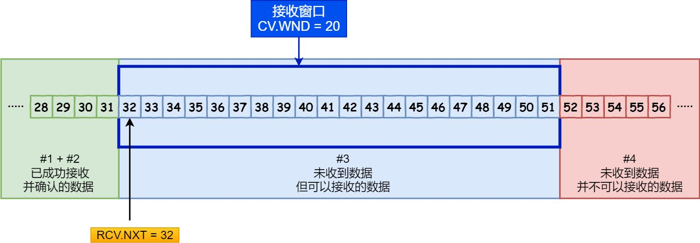

#### 接收窗口和发送窗口的大小是相等的吗？

并不是完全相等，接收窗口的大小是**约等于**发送窗口的大小的。

因为滑动窗口并不是一成不变的。比如，当接收方的应用进程读取数据的速度非常快的话，这样的话接收窗口可以很快的就空缺出来。那么新的接收窗口大小，是通过 TCP 报文中的 Windows 字段来告诉发送方。那么这个传输过程是存在时延的，所以接收窗口和发送窗口是约等于的关系。

### **流量控制**

#### 什么是流量控制？流量控制的目的？

如果发送者发送数据过快，接收者来不及接收，那么就会有分组丢失。为了避免分组丢失，控制发送者的发送速度，使得接收者来得及接收，这就是流量控制。流量控制根本目的是防止分组丢失，它是构成TCP可靠性的一方面。

#### 如何实现流量控制？

由`滑动窗口协议`（连续ARQ协议）实现。滑动窗口协议既保证了分组无差错、有序接收，也实现了流量控制。主要的方式就是接收方返回的 ACK 中会包含自己的接收窗口的大小，并且利用大小来控制发送方的数据发送。

#### 注意的点

如果发生了先减少缓存，再收缩窗口，就会出现丢包的现象。  （`发送方数据发多了 但是接收方没有足够的缓冲区接收 导致数据丢丢失`）

**为了防止这种情况发生，TCP 规定是不允许同时减少缓存又收缩窗口的，而是采用先收缩窗口，过段时间再减少缓存，这样就可以避免了丢包情况。**

### **窗口关闭**

TCP 通过让接收方指明希望从发送方接收的数据大小（窗口大小）来进行流量控制。

**如果窗口大小为 0 时，就会阻止发送方给接收方传递数据，直到窗口变为非 0 为止，这就是窗口关闭。**

> 窗口为0是因为 数据处理过慢，缓冲区满了

####  窗口关闭潜在的危险

接收方向发送方通告窗口大小时，是通过 `ACK` 报文来通告的。

那么，当发生窗口关闭时，接收方处理完数据后，会向发送方通告一个窗口非 0 的 ACK 报文，如果这个通告窗口的 ACK 报文在网络中丢失了，那麻烦就大了。

> 风险在于 我缓冲区有空闲了，想要发送方发送数据 `但是窗口非0的报文丢失了 造成了死锁`

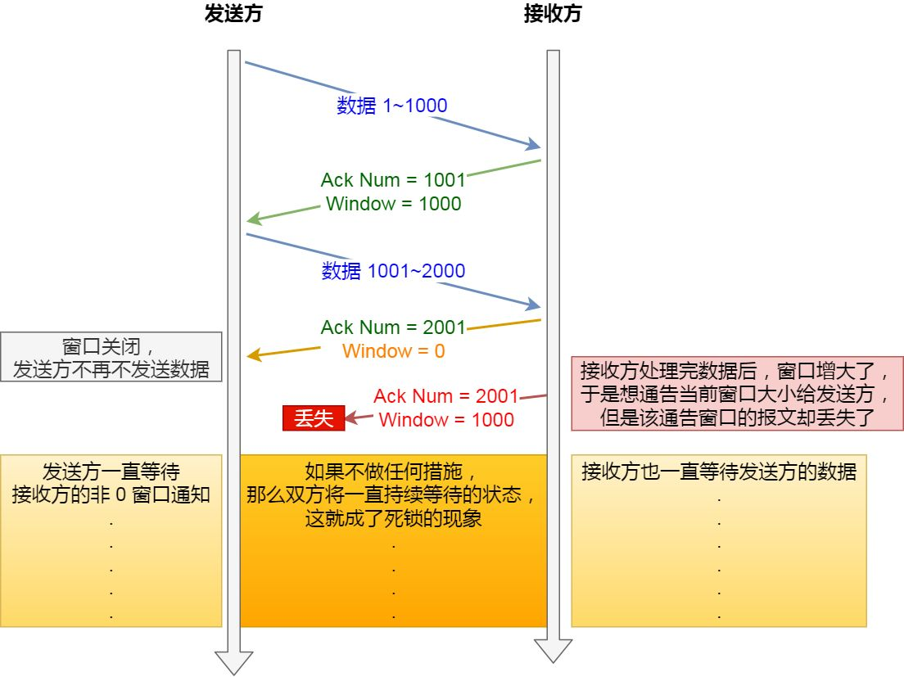

这会导致`发送方`一直`等待`接收方的`非 0 窗口通知`，`接收方`也一直`等待发送方的数据`，如不采取措施，这种相互等待的过程，会造成了`死锁`的现象。

#### TCP 是如何解决窗口关闭时，潜在的死锁现象呢？

TCP 为每个连接设有一个持续定时器，`只要` TCP 连接一方收`到对方的零窗口通知`，就`启动持续计时器`。

如果持续计时器超时，就会发送**窗口探测 ( Window probe ) 报文**，而对方在确认这个探测报文时，给出自己现在的接收窗口大小。

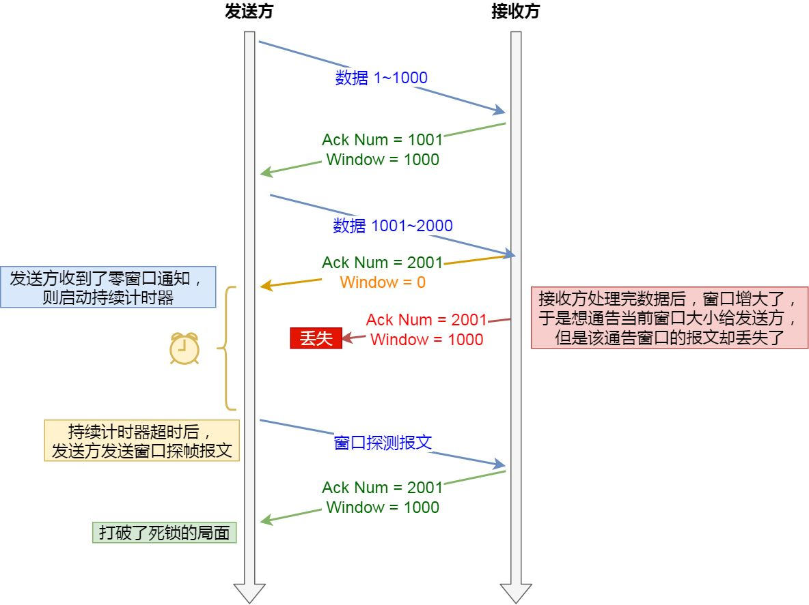

- 如果接收窗口仍然为 0，那么收到这个报文的一方就会`重新启动`持续计时器；
- 如果接收窗口不是 0，那么死锁的局面就可以被打破了。

窗口探测的`次数一般为 3 次`，每次大约 30-60 秒（不同的实现可能会不一样）。<u>如果 3 次过后接收窗口还是 0 的话，有的 TCP 实现就会发 `RST` 报文来中断连接。</u>


### **糊涂窗口综合症**

如果接收方太忙了，来不及取走接收窗口里的数据，那么就会导致发送方的发送窗口越来越小。

到最后，**如果接收方腾出几个字节并告诉发送方现在有几个字节的窗口，而发送方会义无反顾地发送这几个字节，这就是糊涂窗口综合症**。

要知道，<u>我们的 `TCP + IP` 头有 `40` 个字节，为了传输那几个字节的数据，要达上这么大的开销，这太不经济了。</u>

就好像一个可以承载 50 人的大巴车，每次来了一两个人，就直接发车。除非家里有矿的大巴司机，才敢这样玩，不然迟早破产。要解决这个问题也不难，大巴司机等乘客数量超过了 25 个，才认定可以发车。

糊涂窗口综合症的现象是可以发生在发送方和接收方：

- `接收方可以通告一个小的窗口`
- 而`发送方可以发送小数据`

于是，要解决糊涂窗口综合症，就==<u>解决上面两个问题</u>==就可以了

- `让接收方不通告小窗口给发送方`
- `让发送方避免发送小数据`

#### 怎么让接收方不通告小窗口呢？

接收方通常的策略如下:

当「窗口大小」小于 `min( MSS，缓存空间/2 )` ，也就是小于 MSS 与 1/2 缓存大小中的最小值时，就会向发送方通告窗口为 `0`，也就阻止了发送方再发数据过来。

等到接收方处理了一些数据后，窗口大小 >= MSS，或者`接收方缓存空间有一半可以使用`，就可以把窗口打开让发送方发送数据过来。

#### 怎么让发送方避免发送小数据呢？

发送方通常的策略:

使用 `Nagle 算法`，该算法的思路是延时处理，它满足以下两个条件中的一条才可以发送数据：

- 要等到窗口大小 >= `MSS` 或是 数据大小 >= `MSS`
- 收到之前发送数据的 `ack` 回包     <u>？那岂不是滑动窗口没意义了 又变回了`发->收到ack->发`？</u>

只要没满足上面条件中的一条，发送方一直在囤积数据，直到满足上面的发送条件。

另外，Nagle 算法默认是打开的，如果对于一些需要小数据包交互的场景的程序，比如，telnet 或 ssh 这样的交互性比较强的程序，则需要关闭 Nagle 算法。

可以在 Socket 设置 `TCP_NODELAY` 选项来关闭这个算法（关闭 Nagle 算法没有全局参数，需要根据每个应用自己的特点来关闭）

```text
setsockopt(sock_fd, IPPROTO_TCP, TCP_NODELAY, (char *)&value, sizeof(int));
```

### **拥塞控制** 略

### **慢启动** 略

### **拥塞避免算法** 略

### **快速恢复** 略

## [3.6 TCP中的流量控制和拥塞控制](https://zhuanlan.zhihu.com/p/37379780)

**拥塞控制：**防止过多的数据注入到网络中，这样可以使网络中的路由器或链路不致过载。拥塞控制所要做的都有一个前提：网络能够承受现有的网络负荷。<u>拥塞控制是一个全局性的过程，涉及到所有的主机、路由器，以及与降低网络传输性能有关的所有因素</u>。

**流量控制：**指`点对点`通信量，是`端到端`中的问题。流量控制所要做的就是抑制发送端发送数据的速率，以便使接收端来得及接收 

发送窗口的大小等于Min[拥塞窗口，接收窗口]，因此是两种控制共同作用。

### 流量控制

#### 什么是流量控制？流量控制的目的？

如果发送者发送数据过快，接收者来不及接收，那么就会有分组丢失。为了避免分组丢失，控制发送者的发送速度，使得接收者来得及接收，这就是流量控制。流量控制根本目的是防止分组丢失，它是构成TCP可靠性的一方面。

#### 如何实现流量控制？

由滑动窗口协议（连续ARQ协议）实现。滑动窗口协议既保证了分组无差错、有序接收，也实现了流量控制。主要的方式就是接收方返回的 `ACK 中会包含自己的接收窗口的大小`，并且利用大小来`控制发送方的数据发送`。

#### 流量控制引发的死锁？怎么避免死锁的发生？

- 当发送者收到了一个==窗口为0的应答==，发送者便停止发送，等待接收者的下一个应答。但是如果这个窗口不为0的应答在传输过程丢失，发送者一直等待下去，而接收者以为发送者已经收到该应答，等待接收新数据，这样双方就相互等待，从而产生死锁。
- <u>为了避免流量控制引发的死锁，TCP使用了`持续计时器`。</u>每当发送者收到一个零窗口的应答后就启动该计时器。时间一到便主动发送报文询问接收者的窗口大小。若接收者仍然返回零窗口，则重置该计时器继续等待；若窗口不为0，则表示应答报文丢失了，此时重置发送窗口后开始发送，这样就避免了死锁的产生。

### 拥塞控制和流量控制的区别 

拥塞控制：拥塞控制是作用于`网络`的，<u>它是防止过多的数据注入到网络中，避免出现网络负载过大的情况</u>；

常用的方法就是：（ 1 ）<u>慢开始、拥塞避免</u>（ 2 ）<u>快重传、快恢复</u>。

流量控制：流量控制是作用于`接收者`的，<u>它是控制发送者的发送速度从而使接收者来得及接收，防止分组丢失的</u>。

> 作用者不同 所以目的不同
>
> 拥塞：作用在==<u>整个网络</u>==，目的是==<u>防止网络拥塞</u>==
>
> 流量：作用在==<u>接收者</u>==，目的是保证接收者能够接收的过来，<u>==防止分组丢失==</u>

### `拥塞控制`

我们在开始假定：1、数据是单方向传递，另一个窗口只发送确认；2、接收方的缓存足够大，因此发送方的大小的大小由网络的拥塞程度来决定。

#### （一）慢开始算法：

发送方维持一个叫做拥塞窗口cwnd（congestion window）的状态变量。拥塞窗口的大小取决于网络的拥塞程度，并且动态地在变化。发送方让自己的发送窗口等于拥塞窗口，另外考虑到接受方的接收能力，发送窗口可能小于拥塞窗口。

慢开始算法的思路就是，不要一开始就发送大量的数据，先`探测`一下网络的拥塞程度，也就是说由小到大逐渐增加拥塞窗口的大小。

这里用报文段的个数作为拥塞窗口的大小举例说明慢开始算法，实际的拥塞窗口大小是以字节为单位的。如下图：

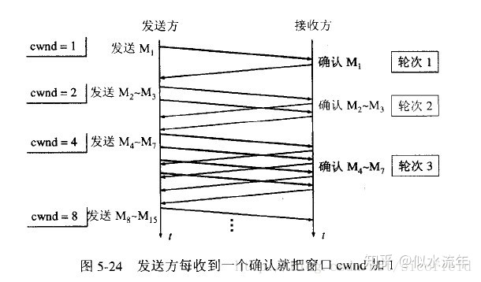


从上图可以看到，一个传输轮次所经历的时间其实就是往返时间RTT，而且没经过一个传输轮次（transmission round），拥塞窗口cwnd就加倍。

为了防止cwnd增长过大引起网络拥塞，还需设置一个慢开始门限ssthresh状态变量。ssthresh的用法如下：

- 当cwnd<ssthresh时，使用慢开始算法。
- 当cwnd>ssthresh时，改用拥塞避免算法。
- 当cwnd=ssthresh时，慢开始与拥塞避免算法任意

注意，这里的“`慢`”并不是指cwnd的增长速率慢，而是`指在TCP开始发送报文段时先设置cwnd=1`，然后逐渐增大，这当然比按照大的cwnd一下子把许多报文段突然注入到网络中要“慢得多”。

#### （二）拥塞避免算法：

拥塞避免算法让拥塞窗口缓慢增长，即每经过一个往返时间RTT就把发送方的拥塞窗口<u>cwnd加`1`</u>，而不是加倍。这样拥塞窗口按线性规律缓慢增长。

无论是在慢开始阶段还是在拥塞避免阶段，只要发送方判断网络出现拥塞（其根据就是没有按时收到确认，虽然没有收到确认可能是其他原因的分组丢失，但是因为无法判定，所以都当做拥塞来处理），就把慢开始门限ssthresh设置为出现拥塞时的发送窗口大小的一半（但不能小于2）。然后把拥塞窗口cwnd重新设置为1，执行慢开始算法。这样做的`目的`就是要<u>迅速减少主机发送到网络中的分组数，使得发生拥塞的路由器有足够时间把队列中积压的分组处理完毕</u>。

整个拥塞控制的流程如下图：

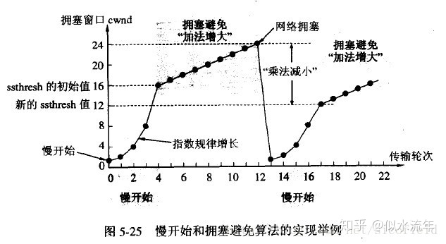


1. 拥塞窗口cwnd初始化为1个报文段，慢开始门限初始值为16
2. 执行慢开始算法，指数规律增长到第4轮，即cwnd=16=ssthresh，改为执行拥塞避免算法，拥塞窗口按线性规律增长
3. 假定cwnd=24时，网络出现超时（拥塞），则更新后的ssthresh=12，cwnd重新设置为1，并执行慢开始算法。当cwnd=12=ssthresh时，改为执行拥塞避免算法

关于 `乘法减小`（Multiplicative Decrease）和`加法增大`（Additive Increase）：

- “乘法减小”指的是无论是在慢开始阶段还是在拥塞避免阶段，只要发送方判断网络出现拥塞，就把慢开始门限ssthresh设置为出现拥塞时的发送窗口大小的一半，并执行慢开始算法，所以当网络频繁出现拥塞时，ssthresh下降的很快，以大大减少注入到网络中的分组数。

- “加法增大”是指执行拥塞避免算法后，使拥塞窗口缓慢增大，以防止过早出现拥塞。常合起来成为AIMD算法。

注意：“拥塞避免”`并非完全能够避免`了阻塞，而是使网络`比较不容易出现`拥塞。

#### （三）快重传算法：

快重传要求接收方在<u>收到一个失序的报文段后就`立即`发出重复确认</u>（为的是使发送方及早知道有报文段没有到达对方，可提高网络吞吐量约20%）而==<u>不要等到自己发送数据时捎带确认</u>==。

快重传算法规定，发送方`只要一连收到三个重复确认`就应当`立即重传对方尚未收到的报文段`，而不必继续等待设置的重传计时器时间到期。如下图：


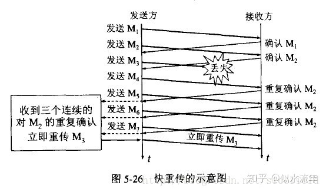


#### （四）快恢复算法：

快重传配合使用的还有快恢复算法，有以下两个要点：

当发送方连续收到三个重复确认时，就执行“乘法减小”算法，把ssthresh门限减半（为了预防网络发生拥塞）。但是接下去并不执行慢开始算法
考虑到如果网络出现拥塞的话就不会收到好几个重复的确认，所以发送方现在认为网络可能没有出现拥塞。所以此时不执行慢开始算法，而是将cwnd设置为ssthresh减半后的值，然后执行拥塞避免算法，使cwnd缓慢增大。如下图：TCP Reno版本是目前使用最广泛的版本。


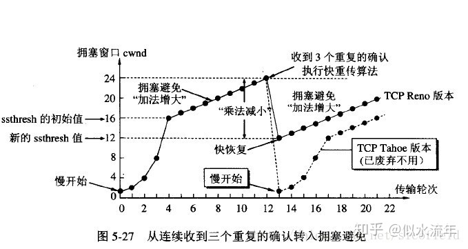


注意：在采用快恢复算法时，<u>慢开始算法只是在TCP`连接建立时`和`网络出现超时`时才使用</u>

### `整体流程`

1. 执行慢开始算法 直到到达门限值ssh 
2. 执行拥塞避免算法 直到网络拥塞（接收者收到失序报文段）
3. - 执行快重传算法 接受方立刻发送确认报文段 发送方收到三个确认 立刻重发丢失报文段
   - 执行快恢复算法 拥塞值减半赋值给ssh 网络流量调整至门限值 执行拥塞避免算法

### `流量控制`滑动窗口

滑动窗口协议是传输层进行流控的一种措施，接收方通过通告发送方自己的可以接受缓冲区大小（`这个字段越大说明网络吞吐量越高`），从而控制发送方的发送速度，不过如果接收端的缓冲区一旦面临数据溢出，窗口大小值也会随之被设置一个更小的值通知给发送端，从而控制数据发送量（发送端会根据接收端指示，进行流量控制）。

<u>==对ack的再认识==</u>，ack通常被理解为收到数据后给出的一个确认，ack包含两个非常重要的信息：

- 一是`期望接收到的下一字节的序号n`，该n代表接收方已经接收到了前n-1字节数据，此时如果接收方收到第n+1字节数据而不是第n字节数据，接收方是不会发送序号为n+2的ACK的（接收方不会不对每一个字节进行确认，而是对多个字节进行累计确认）。举个例子，假如接收端收到1-1024字节，它会发送一个确认号为1025的ACK,但是接下来收到的是 2049-3072，它是不会发送确认号为3072的ACK,而依旧发送1025的ACK。 `(累计确认 序号没跟上 表示丢包)`

- 二是`当前的窗口大小m`，如此发送方在接收到ACK包含的这两个数据后就可以计算出还可以发送多少字节的数据给对方，假定当前发送方已发送到第x字节 b n  ，则可以发送的字节数就是y=m-(x-n).这就是滑动窗口控制流量的基本原理.

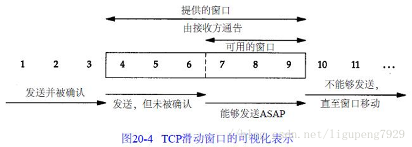

发送窗口后延不能向后移动（左），前延一般情况不允许向后移动。

 

<u>**传递效率**</u>
    一个显而易见的问题是：单个发送字节单个确认，和窗口有一个空余即通知发送方发送一个字节，无疑增加了网络中的许多不必要的报文（请想想为了一个字节数据而添加的40字节头部吧！），所以我们的原则是尽可能一次多发送几个字节，或者窗口空余较多的时候通知发送方一次发送多个字节。对于前者我们广泛使用`Nagle算法`，即：

1. 若发送应用进程要把发送的数据逐个字节地送到TCP的发送缓存，则发送方就把第一个数据字节先发送出去，把后面的字节先缓存起来；
2. 当发送方收到第一个字节的确认后（也得到了网络情况和对方的接收窗口大小），再把缓冲区的剩余字节组成合适大小的报文发送出去；
3. 当到达的数据已达到发送窗口大小的一半或以达到报文段的最大长度时，就立即发送一个报文段；.

TCP传送的是字节流，其中字节流是信息比特；但是为了可以差错控制，TCP协议还在信息比特前面加入了一些额外比特及其他，这样就构成了一个报文段。所以虽然他每次只能传一个字节，但是却是以报文段的形式传送的。

<u>**当接收方窗口为0时，发送方应该怎么做**</u>        ==？？？？==

- 假设A主机向B主机发送数据，当B的窗口为0，则A不能再向B发送数据。只能等到B的应用进程将缓存中的数据清空，才能有新的rwnd的值。
- 但是这里有一个问题，当B的应用进程清空缓存后，~~并不会主动告知A~~ ?  <u>应该是继续发送窗口不为0的消息，但是可能丢失吧</u>。 ==（阻塞）==
- ==解决==：TCP规范中规定，当主机B的接受窗口为0时，主机A`继续发送只有一个字节数据的报文段`。这个报文段会被接收方确认。最终缓存将开始清空，并且确认报文段将包含一个非0的rwnd的值。

 

## 3.7 TCP建立连接和断开连接的过程

位码即tcp标志位，有6种标示：

> ① `SYN`(synchronous 同步，建立联机)；
>
> ② ACK(acknowledgement 确认)
>
> ③ PSH(push传送)
>
> ④ `FIN`(finish结束)
>
> ⑤ RST(reset重置)
>
> ⑥ URG(urgent紧急)

TCP建立连接和断开连接的过程：

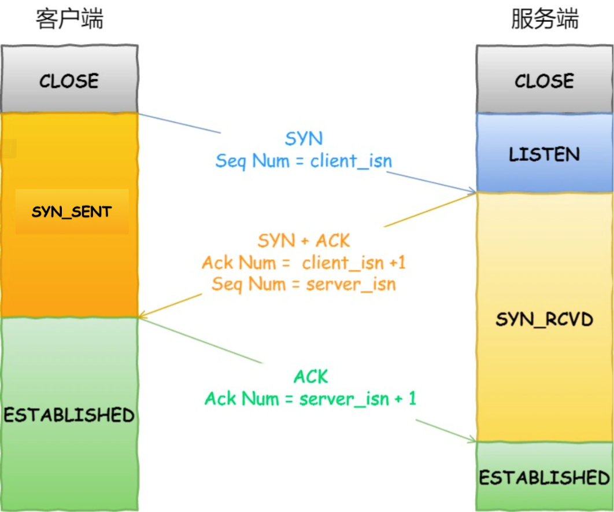


### 三次握手：


1. Client将`标志位SYN置为1`，`随机产生一个值seq`=J，并将该`数据包发送给Serve`r，Client进入`SYN_SENT`状态，等待Server确认。

2. Server收到数据包后由标志位SYN=1知道Client请求建立连接，`Server将标志位SYN和ACK都置为1`，`ack=J+1`，`随机产生一个值seq`=K，并将该数据包发送给Client以确认连接请求，Server进入`SYN_RCVD`状态。

3. Client收到确认后，`检查ack是否为J+1`，`ACK是否为1`，如果正确则将`标志位ACK置为1`，`ack=K+1`，并`将该数据包发送给Server`，`Server检查ack是否为K+1`，`ACK是否为1`，如果正确则连接建立成功，Client和Server进入`ESTABLISHED`状态，完成三次握手，随后Client与Server之间可以开始传输数据了。

   > ACK: 一个是==<u>标志位</u>==确认值(Acknowledgement)，为1便是确认连接。
   > ack: 另一个是==<u>确认编号</u>==(Acknowledgement Number)，即接收到的上一次远端主机传来的seq然后+1，再发送给远端主机。提示远端主机已经成功接收上一次所有数据。
   >
   > `seq（Sequence Number）：` `32bits`，表示这个`tcp`包的序列号。`tcp`协议拼凑接收到的数据包时，根据`seq`来确定顺序，并且能够确定是否有数据包丢失。

<u>第三次握手时，[客户端](https://www.nowcoder.com/jump/super-jump/word?word=客户端)`可以携带正式数据`，</u>如果不携带，那么连接后客户端第一次的seq跟第三次握手的seq一样

| 握手阶段： |      |       |               |      |      |
| ---------- | ---- | ----- | ------------- | ---- | ---- |
| 序号       | 方向 | seq   | ack           | SYN  | ACK  |
| 1          | A->B | 10000 | 0             | 1    | 0    |
| 2          | B->A | 20000 | 10000+1=10001 | 1    | 1    |
| 3          | A->B | 10001 | 20000+1=20001 | 0    | 1    |

### 四次挥手：


`由于TCP连接是全双工的`，因此，每个方向都必须要单独进行关闭，这一原则是当一方完成数据发送任务后，发送一个FIN来终止这一方向的连接，收到一个FIN只是意味着这一方向上没有数据流动了，即不会再收到数据了，但是在这个TCP连接上仍然能够发送数据，直到这一方向也发送了FIN。首先进行关闭的一方将执行主动关闭，而另一方则执行被动关闭。

1. 数据传输结束后，客户端的应用进程发出连接释放报文段，并停止发送数据，客户端进入FIN_WAIT_1状态，此时客户端依然可以接收服务器发送来的数据。

2. 服务器接收到FIN后，发送一个ACK给客户端，确认序号为收到的序号+1，服务器进入CLOSE_WAIT状态。客户端收到后进入FIN_WAIT_2状态。
3. 当服务器没有数据要发送时，服务器发送一个FIN报文，此时服务器进入LAST_ACK状态，等待客户端的确认
4. 客户端收到服务器的FIN报文后，给服务器发送一个ACK报文，确认序列号为收到的序号+1。此时客户端进入TIME_WAIT状态，等待2MSL（MSL：报文段最大生存时间），然后关闭连接

> `ACK: 好的 同意 收到`

| 挥手阶段： |      |       |               |      |      |
| ---------- | ---- | ----- | ------------- | ---- | ---- |
| 序号       | 方向 | seq   | ack           | FIN  | ACK  |
| 1          | A->B | 80000 | 90000         | 1    | 1    |
| 2          | B->A | 90000 | 80000+1=80001 | 0    | 1    |
| 3          | B->A | 95000 | 80001         | 1    | 1    |
| 4          | A->B | 80001 | 95000+1=95001 | 0    | 1    |

### `为什么是三次握手？不是两次、四次？`

- #### 三次握手才可以`阻止重复历史连接的初始化`（主要原因）

  > 客户端连续发送多次 SYN 建立连接的报文，在**网络拥堵**情况下：
  >
  > - 一个「旧 SYN 报文」比「最新的 SYN 」 报文早到达了服务端；
  > - 那么此时服务端就会回一个 `SYN + ACK` 报文给客户端；
  > - 客户端收到后可以根据`自身的上下文`，`判断这是一个历史连接（序列号过期或超时）`，那么客户端就会发送 `RST` 报文给服务端，表示`中止`这一次连接。
  >
  > **如果是两次握手连接，就无法阻止历史连接**
  >
  > 主要是因为**在两次握手的情况下，「被动发起方」没有中间状态给「主动发起方」来阻止历史连接，导致「被动发起方」可能建立一个历史连接，造成资源浪费**。
  >
  > > 两次握手的情况下，「被动发起方」在收到 SYN 报文后，就进入 ESTABLISHED 状态，意味着这时可以给对方发送数据给，但是「主动发」起方此时还没有进入 ESTABLISHED 状态，假设这次是历史连接，主动发起方判断到此次连接为历史连接，那么就会回 RST 报文来断开连接，而「被动发起方」在第一次握手的时候就进入 ESTABLISHED 状态，所以它可以发送数据的，但是它并不知道这个是历史连接，它只有在收到 RST 报文后，才会断开连接。
  > >
  > > 可以看到，上面这种场景下，「被动发起方」在向「主动发起方」发送数据前，并没有阻止掉历史连接，导致「被动发起方」建立了一个历史连接，又白白发送了数据，妥妥地浪费了「被动发起方」的资源。
  >
  > 因此，**要解决这种现象，最好就是在「`被动发起方`」发送数据前，也就是`建立连接之前，要阻止掉历史连接`，这样就不会造成资源浪费，而要实现这个功能，就需要三次握手**。
  >
  > 所以，**TCP 使用三次握手建立连接的最主要原因是防止「历史连接」初始化了连接。**
  >
  > ==两次连接没办法在被动连接放发送数据前阻止无效的连接==

- #### 三次握手才可以`同步`双方的`初始序列号`

  > TCP 协议的通信双方， 都必须维护一个「`序列号`」， 序列号是可靠传输的一个关键因素，它的作用：
  >
  > - 接收方可以去除重复的数据；
  > - 接收方可以根据数据包的序列号按序接收；
  > - 可以标识发送出去的数据包中， 哪些是已经被对方收到的（通过 ACK 报文中的序列号知道）；
  >
  > 可见，序列号在 TCP 连接中占据着非常重要的作用，所以当客户端发送携带「初始序列号」的 SYN 报文的时候，需要服务端回一个 ACK 应答报文，表示客户端的 SYN 报文已被服务端成功接收，==那当服务端发送「初始序列号」给客户端的时候，依然也要得到客户端的应答回应==，**这样一来一回，才能确保双方的初始序列号能被可靠的同步。**
  >
  > 四次握手其实也能够可靠的同步双方的初始化序号，但由于**第二步和第三步可以优化成一步**，所以就成了「三次握手」。
  >
  > 而两次握手只保证了一方的初始序列号能被对方成功接收，没办法保证双方的初始序列号都能被确认接收。

- #### 三次握手才可以`避免资源浪费`

  > 如果只有「两次握手」，当客户端的 SYN 请求连接在网络中阻塞，客户端没有接收到 ACK 报文，就会重新发送 SYN ，由于没有第三次握手，服务器不清楚客户端是否收到了自己发送的建立连接的 ACK 确认信号，所以每收到一个 SYN 就只能先主动建立一个连接，这会造成什么情况呢？
  >
  > 如果客户端的 SYN 阻塞了，重复发送多次 SYN 报文，那么服务器在收到请求后就会**建立多个冗余的无效链接，造成不必要的资源浪费。**
  >
  > 即两次握手会造成消息滞留情况下，服务器重复接受无用的连接请求 SYN 报文，而造成重复分配资源。
  >
  > ==第一点提到的 建立连接造成的资源浪费==

####  *小结*

TCP 建立连接时，通过三次握手**能防止历史连接的建立，能减少双方不必要的资源开销，能帮助双方同步初始化序列号**。序列号能够保证数据包不重复、不丢弃和按序传输。

不使用「两次握手」和「四次握手」的原因：

- 「两次握手」：<u>无法防止历史连接的建立，会造成双方资源的浪费，也无法可靠的同步双方序列号；</u>
- 「四次握手」：三次握手就已经理论上最少可靠连接建立，所以`不需要`使用更多的通信次数。

### TCP连接建立的一些问题

#### <u>为什么每次建立 TCP 连接时，初始化的序列号都要求不一样呢？</u>

主要原因有两个方面：

- 为了`防止历史报文被下一个相同四元组的连接接收`（主要方面）；
- 为了`安全`性，防止黑客伪造的相同序列号的 TCP 报文被对方接收；


#### <u>初始序列号 ISN 是如何随机产生的？</u>

起始 `ISN` 是基于时钟的，每 4 微秒 + 1，转一圈要 4.55 个小时。

RFC793 提到初始化序列号 ISN 随机生成算法：ISN = M + F(localhost, localport, remotehost, remoteport)。

- `M` 是一个计时器，这个计时器每隔 4 微秒加 1。
- `F` 是一个 Hash 算法，根据源 IP、目的 IP、源端口、目的端口生成一个随机数值。要保证 Hash 算法不能被外部轻易推算得出，用 MD5 算法是一个比较好的选择。

可以看到，随机数是会基于时钟计时器递增的，基本不可能会随机成一样的初始化序列号。

==计时器+根据多个信息hash出来的一个随机值==


#### 既然 IP 层会分片，为什么 TCP 层还需要 MSS 呢？

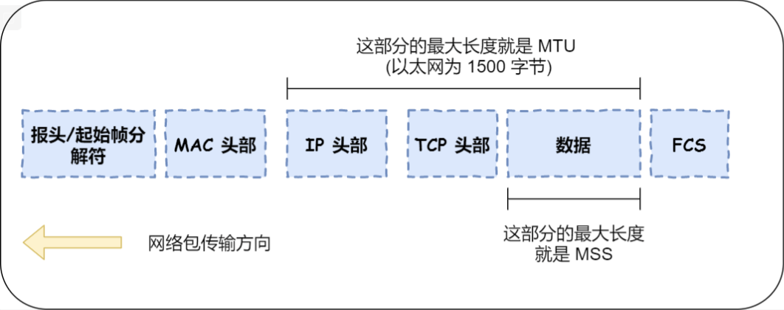


- `MTU`：一个网络包的最大长度，以太网中一般为 `1500` 字节；
- `MSS`：除去 IP 和 TCP 头部之后，一个网络包所能容纳的 TCP 数据的最大长度；

如果在 TCP 的整个报文（头部 + 数据）交给 IP 层进行分片，会有什么异常呢？

当 IP 层有一个超过 `MTU` 大小的数据（TCP 头部 + TCP 数据）要发送，那么 IP 层就要进行分片，把数据分片成若干片，保证每一个分片都小于 MTU。把一份 IP 数据报进行分片以后，由目标主机的 IP 层来进行重新组装后，再交给上一层 TCP 传输层。

这看起来井然有序，但这存在隐患的，**那么当如果一个 IP 分片丢失，整个 IP 报文的所有分片都得重传**。

因为 IP 层本身没有超时重传机制，它由传输层的 TCP 来负责超时和重传。

当接收方发现 TCP 报文（头部 + 数据）的某一片丢失后，则==<u>**不会响应 ACK 给对方**</u>==，那么发送方的 TCP 在超时后，就会重发「整个 TCP 报文（头部 + 数据）」。

因此，可以得知由 IP 层进行分片传输，是非常没有效率的。

所以，为了达到最佳的传输效能 TCP 协议在**建立连接的时候通常要协商双方的 MSS 值**，当 TCP 层发现数据超过 MSS 时，则就先会进行分片，当然由它形成的 IP 包的长度也就不会大于 MTU ，自然也就不用 IP 分片了。TCP的三次握手和四次挥手的原因

经过 TCP 层分片后，如果一个 TCP 分片丢失后，**进行重发时也是以 `MSS` 为单位**，而不用重传所有的分片，大大增加了重传的效率。

> IP分片存在着 丢失一个 重传整个的缺点 而TCP有超时重传机制 基本可以保证mss的最大范围内 不需要IP层的分片 可以保证传输效率
>
>   **总结：\*UDP不会分段，就由IP来分片\*。  \*TCP会分段，当然就不用IP来分片了\***


#### 第一次握手丢失了，会发生什么？

`触发「超时重传」机制，重传 SYN 报文`

> 通常，第一次超时重传是在 1 秒后，第二次超时重传是在 2 秒，第三次超时重传是在 4 秒后，第四次超时重传是在 8 秒后，第五次是在超时重传 16 秒后。没错，**每次超时的时间是上一次的 2 倍**。
>
> 当`第五次`超时重传后，会继续等待 32 秒，如果服务端仍然没有回应 ACK，客户端就不再发送 SYN 包，然后断开 TCP 连接。
>
> 所以，总耗时是 1+2+4+8+16+32=63 秒，大约 1 分钟左右。


#### 第二次握手丢失了，会发生什么？

第二次握手的 `SYN-ACK` 报文其实有两个目的 ：

- 第二次握手里的 ACK， 是对第一次握手的确认报文；
- 第二次握手里的 SYN，是服务端发起建立 TCP 连接的报文；

因此，当第二次握手丢失了，客户端和服务端都会重传： 都默认是5

- 客户端会重传 `SYN` 报文，也就是第一次握手，最大重传次数由 `tcp_syn_retries`内核参数决定；
- 服务端会重传 `SYN-ACK` 报文，也就是第二次握手，最大重传次数由 `tcp_synack_retries` 内核参数决定。


#### 第三次握手丢失了，会发生什么？

当第三次握手丢失了，如果服务端那一方迟迟收不到这个确认报文，就会触发超时重传机制，`重传 SYN-ACK 报文`，直到收到第三次握手，或者达到最大重传次数。


#### [三次握手过程中可以携带数据吗？](https://interviewguide.cn/#/Doc/Knowledge/计算机网络/计算机网络?id=59、-三次握手过程中可以携带数据吗？)

其实==第三次握手的时候，是可以携带数据的==。但是，**第一次、第二次握手不可以携带数据**

为什么这样呢?大家可以想一个问题，<u>假如第一次握手可以携带数据的话，如果有人要恶意攻击服务器，那他每次都在第一次握手中的 SYN 报文中放入大量的数据。因为攻击者根本就不理服务器的接收、发送能力是否正常，然后疯狂着重复发 SYN 报文的话，这会让服务器花费很多时间、内存空间来接收这些报文。</u>

也就是说，**第一次握手不可以放数据，其中一个简单的原因就是会`让服务器更加容易受到攻击`了。而对于第三次的话，此时客户端已经处于 ESTABLISHED 状态。对于客户端来说，他已经建立起连接了，并且也已经知道服务器的接收、发送能力是正常的了，所以能携带数据也没啥毛病。**


#### [SYN攻击是什么？](https://interviewguide.cn/#/Doc/Knowledge/计算机网络/计算机网络?id=60、syn攻击是什么？)

**服务器端的资源分配是在二次握手时分配的，而客户端的资源是在完成三次握手时分配的**，所以服务器容易受到SYN洪泛攻击。SYN攻击就是Client在短时间内==伪造大量不存在的IP地址==，并==向Server不断地发送SYN包==，Server则回复确认包，并等待Client确认，由于源地址不存在，因此Server需要不断重发直至超时，这些伪造的SYN包将长时间占用未连接队列，导致正常的SYN请求因为队列满而被丢弃，从而引起网络拥塞甚至系统瘫痪。`SYN 攻击是一种典型的 DoS/DDoS 攻击`。

检测 SYN 攻击非常的方便，当你在服务器上看到大量的半连接状态时，特别是源IP地址是随机的，基本上可以断定这是一次SYN攻击。在 Linux/Unix 上可以使用系统自带的 `netstats` 命令来检测 SYN 攻击。

```
netstat -n -p TCP | grep SYN_RECV
```

常见的防御 SYN 攻击的方法有如下几种：

- 缩短超时（SYN Timeout）时间
- 增加最大半连接数
- 过滤网关防护
- SYN cookies技术

##### SYN cookies 算法


`Syn-Flood`攻击成立的关键在于服务器资源是有限的，而服务器收到请求会分配资源。通常来说，服务器用这些资源保存此次请求的关键信息，包括请求的来源和目(五元组)，以及`TCP`选项，如最大报文段长度`MSS`、时间戳`timestamp`、选择应答使能`Sack`、窗口缩放因子`Wscale`等等。当后续的`ACK`报文到达，三次握手完成，新的连接创建，这些信息可以会被复制到连接结构中，用来指导后续的报文收发。

> 那么现在的问题就是服务器如何在**不分配**`资源`的情况下
>
> 1. 验证之后可能到达的`ACK`的有效性，保证这是一次完整的握手
> 2. 获得`SYN`报文中携带的`TCP`选项信息

`SYN Cookies`算法[wiki](https://link.segmentfault.com/?enc=QCwGO1zqg1sf01yv3Mnr8A%3D%3D.eVpDZWt6plVrSOgyVHvCzaTIL%2BZ%2FVZHzggalBHzNeMkqmxCKo8otKwGGIXUSZZTh)可以解决上面的第`1`个问题以及第`2`个问题的一部分

我们知道，`TCP`连接建立时，双方的起始报文序号是可以**任意**的。`SYN cookies`利用这一点，按照以下规则构造初始序列号：

- 设`t`为一个缓慢增长的时间戳(典型实现是每64s递增一次)
- 设`m`为客户端发送的`SYN`报文中的`MSS`选项值
- 设`s`是连接的元组信息(源IP,目的IP,源端口，目的端口)和`t`经过密码学运算后的`Hash`值，即`s = hash(sip,dip,sport,dport,t)`，`s`的结果取低 **24** 位

则初始序列号`n`为：

- 高 **5** 位为`t mod 32`
- 接下来**3**位为`m`的编码值
- 低 **24** 位为`s`

当客户端收到此`SYN+ACK`报文后，根据`TCP`标准，它会回复`ACK`报文，且报文中`ack = n + 1`，那么在服务器收到它时，将`ack - 1`就可以拿回当初发送的`SYN+ACK`报文中的序号了！服务器巧妙地通过这种方式间接保存了一部分`SYN`报文的信息。

接下来，服务器需要对`ack - 1`这个序号进行检查：

- 将高 **5** 位表示的`t`与当前之间比较，看其到达地时间是否能接受。
- 根据`t`和连接元组重新计算`s`，看是否和低 **24** 一致，若不一致，说明这个报文是被伪造的。
- 解码序号中隐藏的`mss`信息

到此，连接就可以顺利建立了。

##### SYN Cookies 缺点

既然`SYN Cookies`可以减小资源分配环节，那为什么没有被纳入`TCP`标准呢？原因是`SYN Cookies`也是有代价的：

1. `MSS`的编码只有**3**位，因此最多只能使用 **8** 种`MSS`值
2. 服务器必须拒绝客户端`SYN`报文中的其他只在`SYN`和`SYN+ACK`中协商的选项，原因是服务器没有地方可以保存这些选项，比如`Wscale`和`SACK`
3. 增加了密码学运算


### `四次挥手的原因`：

由于连接的关闭控制权在应用层，所以被动关闭的一方在接收到FIN包时，TCP协议栈会直接发送一个ACK确认包，优先关闭一端的通信。然后通知应用层，由应用层决定什么时候发送FIN包。应用层可以使用系统调用函数read==0来判断对端是否关闭连接。

因为TCP是全双工通信的

> 1. 第一次挥手
>
>    因此当主动方发送断开连接的请求（即FIN报文）给被动方时，仅仅代表主动方不会再发送数据报文了，但主动方仍可以接收数据报文。
>
> 2. 第二次挥手
>
>    被动方此时有可能还有相应的数据报文需要发送，因此需要先发送ACK报文，告知主动方“我知道你想断开连接的请求了”。这样主动方便不会因为没有收到应答而继续发送断开连接的请求（即FIN报文）。
>
> 3. 第三次挥手
>
>    被动方在处理完数据报文后，便发送给主动方FIN报文；`这样可以保证数据通信正常可靠地完成`。发送完FIN报文后，被动方进入`LAST_ACK`阶段（超时等待）。
>
> 4. 第四挥手
>
>    如果主动方及时发送ACK报文进行连接中断的确认，这时被动方就直接释放连接，进入可用状态。

- 关闭连接时，客户端向服务端发送 `FIN` 时，仅仅表示客户端不再发送数据了但是还能接收数据。
- 服务器收到客户端的 `FIN` 报文时，先回一个 `ACK` 应答报文，而服务端可能还有数据需要处理和发送，等服务端不再发送数据时，才发送 `FIN` 报文给客户端来表示同意现在关闭连接。

从上面过程可知，服务端通常需要等待完成数据的发送和处理，所以服务端的 `ACK` 和 `FIN` 一般都会分开发送，从而比三次握手导致多了一次。


### TCP连接断开的一些问题

#### 第一次挥手丢失了，会发生什么？

 当客户端（主动关闭方）调用 close 函数后，就会向服务端发送 FIN 报文，试图与服务端断开连接，此时客户端的连接进入到 `FIN_WAIT_1` 状态。

正常情况下，如果能及时收到服务端（被动关闭方）的 ACK，则会很快变为 `FIN_WAIT2`状态。

如果第一次挥手丢失了，那么客户端迟迟收不到被动方的 ACK 的话，也就会==触发超时重传机制，重传 FIN 报文==，重发次数由 `tcp_orphan_retries` 参数控制。

当客户端重传 FIN 报文的次数超过 `tcp_orphan_retries` 后，就不再发送 FIN 报文，直接进入到 `close` 状态。


#### 第二次挥手丢失了，会发生什么？

当服务端收到客户端的第一次挥手后，就会先回一个 ACK 确认报文，此时服务端的连接进入到 `CLOSE_WAIT` 状态。

`ACK 报文是不会重传的`

所以如果服务端的第二次挥手丢失了，客户端就会`触发超时重传机制，重传 FIN 报文`，直到收到服务端的第二次挥手，或者达到最大的重传次数。

这里提一下，当客户端收到第二次挥手，也就是收到服务端发送的 ACK 报文后，客户端就会处于 `FIN_WAIT2` 状态，在这个状态需要等服务端发送第三次挥手，也就是服务端的 FIN 报文。

对于 close 函数关闭的连接，由于无法再发送和接收数据，所以`FIN_WAIT2` 状态不可以持续太久，而 `tcp_fin_timeout` 控制了这个状态下连接的持续时长，默认值是 60 秒。

这意味着==对于调用 close 关闭的连接==，==如果在 60 秒后还没有收到 FIN 报文==，客户端（主动关闭方）的连接就会==直接关闭==。

但是注意，如果主动关闭方使用 shutdown 函数关闭连接且指定只关闭发送方向，而接收方向并没有关闭，那么意味着主动关闭方还是可以接收数据的。如果主动关闭方一直没收到第三次挥手，那么主动关闭方的连接将会一直处于 `FIN_WAIT2` 状态（`tcp_fin_timeout` 无法控制 shutdown 关闭的连接）。


#### 第三次挥手丢失了，会发生什么？

当服务端（被动关闭方）收到客户端（主动关闭方）的 FIN 报文后，内核会自动回复 ACK，同时连接处于 `CLOSE_WAIT` 状态，顾名思义，它表示等待应用进程调用 close 函数关闭连接。

此时，内核是没有权利替代进程关闭连接，必须由进程主动调用 close 函数来触发服务端发送 FIN 报文。

服务端处于 CLOSE_WAIT 状态时，调用了 close 函数，内核就会发出 FIN 报文，同时连接进入 LAST_ACK 状态，等待客户端返回 ACK 来确认连接关闭。

如果迟迟收不到这个 ACK，服务端就会`重发 FIN 报文`，重发次数仍然由 `tcp_orphan_retrie`s 参数控制，这与客户端重发 FIN 报文的重传次数控制方式是一样的。


#### 第四次挥手丢失了，会发生什么？

当客户端收到服务端的第三次挥手的 FIN 报文后，就会回 ACK 报文，也就是第四次挥手，此时客户端连接进入 `TIME_WAIT` 状态。

在 Linux 系统，TIME_WAIT 状态会持续 2MSL 后才会进入关闭状态。

然后，服务端（被动关闭方）没有收到 ACK 报文前，还是处于 LAST_ACK 状态。

如果第四次挥手的 ACK 报文没有到达服务端，服务端就会`重发 FIN 报文`，重发次数仍然由前面介绍过的 `tcp_orphan_retries` 参数控制。


#### 为什么 TIME_WAIT 等待的时间是 2MSL？

MSL**报文最大生存时间**

> MSL 与 TTL 的区别： MSL 的单位是时间，而 TTL 是经过路由跳数。所以 **MSL 应该要大于等于 TTL 消耗为 0 的时间**，以确保报文已被自然消亡。

**TTL 的值一般是 64，Linux 将 MSL 设置为 30 秒，意味着 Linux 认为数据报文经过 64 个路由器的时间不会超过 30 秒，如果超过了，就认为报文已经消失在网络中了**。

TIME_WAIT 等待 2 倍的 MSL，比较合理的解释是： 网络中可能存在来自发送方的数据包，当这些发送方的数据包被接收方处理后又会向对方发送响应，所以**一来一回需要等待 2 倍的时间**。

比如，如果被动关闭方没有收到断开连接的最后的 ACK 报文，就会触发超时重发 `FIN` 报文，另一方接收到 FIN 后，会重发 ACK 给被动关闭方， 一来一去正好 2 个 MSL。

可以看到 **2MSL时长** 这其实是相当于**至少允许报文丢失一次**。比如，若 ACK 在一个 MSL 内丢失，这样被动方重发的 FIN 会在第 2 个 MSL 内到达，TIME_WAIT 状态的连接可以应对。

为什么不是 4 或者 8 MSL 的时长呢？你可以想象一个丢包率达到百分之一的糟糕网络，连续两次丢包的概率只有万分之一，这个概率实在是太小了，`忽略它比解决它更具性价比`。

`2MSL` 的时间是从**客户端接收到 FIN 后发送 ACK 开始计时的**。如果在 TIME-WAIT 时间内，因为客户端的 ACK 没有传输到服务端，客户端又接收到了服务端重发的 FIN 报文，那么 **2MSL 时间将重新计时**。

在 Linux 系统里 `2MSL` 默认是 `60` 秒，那么一个 `MSL` 也就是 `30` 秒。**Linux 系统停留在 TIME_WAIT 的时间为固定的 60 秒**。


#### 为什么需要 TIME_WAIT 状态？

首先调用close()发起`主动关闭的一方`，`在发送最后一个ACK之后会进入time_wait的状态`，也就说该发送方会保持2MSL时间之后才会回到初始状态。MSL值得是数据包在网络中的最大生存时间。 （timewait时间 1-4分钟）

1. 为实现TCP连接的可靠释放，防止断开连接最后一次ACK报文丢失了。

   > `（确保被动方 接受到最后一次ACK 不然被动方会重发FIN，关闭了就收不到被动方的重发了）`

2. `为使旧的重复数据包在网络中因过期而消失`

可能存在一些数据包在传输过程中出现异常而导致严重推迟，而在它到来之前发送方已经重发了该报文，并完成其任务。如果在被推迟的报文未抵达前接收方断开了连接，随后又建立了一个与之前相同IP、Port的连接，而之前被推迟的报文在这时恰好到达，而此时此新连接非彼连接，从而会发生数据错乱，进而导致无法预知的情况。因此必须维持一段等待时间，使迟到的报文在网络中完全消失，并且在等待时间内，因为连接并未关闭，所以不能建立相同四元组的新连接，就不会出现数据错乱。


#### TIME_WAIT 过多有什么危害？

1. 产生这种结果使得这个TCP连接在2MSL连接等待期间，定义这个连接的`四元组`（客户端IP地址和端口，服务端IP地址和端口号）`不能被使用`。`文件描述符`的使用是有上限的，`如果持续高并发，会导致一些连接失败`。  ==内存资源和端口资源的占用==
2. 服务器，因为一些原因，服务器进程挂掉了，退出了，由于是服务器主动关闭连接，因此会有TIME_WAIT状态存在，也就意味着服务器进程想立即重启，如果TIME_WAIT状态维持60秒，60秒服务器都起不来。 ==（timewait时间内 服务器挂掉 服务器重启时间已过）==


#### 如何优化 TIME_WAIT？

可设置套接字选项为SO_REUSEADDR，该选项的意思是，告诉操作系统，如果端口忙，但占用该端口TCP连接处于TIME_WAIT状态，并且套接字选项为SO_REUSEADDR，则该端口可被重用。如果TCP连接处于其他状态，依然返回端口被占用。该选项对服务程序重启非常有用。

1. 越过time_wait
   - 打开 net.ipv4.tcp_tw_reuse 和 net.ipv4.tcp_timestamps 选项；
   - net.ipv4.tcp_max_tw_buckets
   - 程序中使用 SO_LINGER ，应用强制使用 RST 关闭。

2. 更好的解决方法不是越过这个状态，而是**让客户端去断开，由分布在各处的客户端去承受 TIME_WAIT**。


#### 如果已经建立了连接，但是客户端突然出现故障了怎么办？

TCP 有一个机制是**保活机制**。这个机制的原理是这样的：

定义一个时间段，在这个时间段内，如果没有任何连接相关的活动，TCP 保活机制会开始作用，每隔一个时间间隔，发送一个`探测报文`，该探测报文包含的数据非常少，如果`连续几个探测报文都没有得到响应`，则认为当前的 TCP 连接已经死亡，系统内核将错误信息通知给上层应用程序。

在 Linux 内核可以有对应的参数可以设置`保活时间`、`保活探测的次数`、`保活探测的时间间隔`，以下都为默认值：

```shell
net.ipv4.tcp_keepalive_time=7200
net.ipv4.tcp_keepalive_intvl=75  
net.ipv4.tcp_keepalive_probes=9
```

- tcp_keepalive_time=7200：表示保活时间是 7200 秒（2小时），也就 2 小时内如果没有任何连接相关的活动，则会启动保活机制
- tcp_keepalive_intvl=75：表示每次检测间隔 75 秒；
- tcp_keepalive_probes=9：表示检测 9 次无响应，认为对方是不可达的，从而中断本次的连接。

也就是说在 Linux 系统中，最少需要经过 2 小时 11 分 15 秒才可以发现一个「死亡」连接。

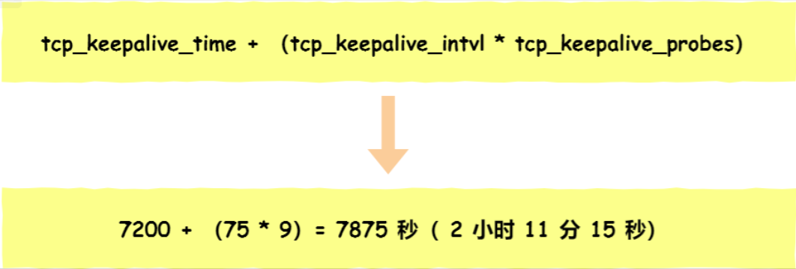

注意，应用程序若想使用 TCP 保活机制需要通过 socket 接口设置 `SO_KEEPALIVE` 选项才能够生效，如果没有设置，那么就无法使用 TCP 保活机制。

如果开启了 TCP 保活，需要考虑以下几种情况：

- 第一种，对端程序是正常工作的。当 TCP 保活的探测报文发送给对端, 对端会正常响应，这样 **TCP 保活时间会被重置**，等待下一个 TCP 保活时间的到来。
- 第二种，对端程序崩溃并重启。当 TCP 保活的探测报文发送给对端后，对端是可以响应的，但由于没有该连接的有效信息，**会产生一个 RST 报文**，这样很快就会发现 TCP 连接已经被重置。
- 第三种，是对端程序崩溃，或对端由于其他原因导致报文不可达。当 TCP 保活的探测报文发送给对端后，石沉大海，没有响应，连续几次，达到保活探测次数后，**TCP 会报告该 TCP 连接已经死亡**。

TCP 保活的这个机制检测的==时间是有点长==，我们可以自己在应用层实现一个心跳机制。

比如，web 服务软件一般都会提供 `keepalive_timeout` 参数，用来指定 HTTP 长连接的超时时间。如果设置了 HTTP 长连接的超时时间是 60 秒，web 服务软件就会**启动一个定时器**，如果客户端在完后一个 HTTP 请求后，在 60 秒内都没有再发起新的请求，**定时器的时间一到，就会触发回调函数来释放该连接。**

5

#### 如果已经建立了连接，但是服务端的进程崩溃会发生什么？

使用 kill -9 来模拟进程崩溃的情况，发现**在 kill 掉进程后，服务端会发送 FIN 报文，与客户端进行四次挥手**。


## 3.8 如何优化 TCP?

### TCP 三次握手的性能提升

#### 客户端优化

三次握手建立连接的首要目的是「同步序列号」。

只有同步了序列号才有可靠传输，TCP 许多特性都依赖于序列号实现，比如流量控制、丢包重传等，这也是三次握手中的报文称为 SYN 的原因，SYN 的全称就叫 *Synchronize Sequence Numbers*（同步序列号）。

**重发的次数由 tcp_syn_retries 参数控制**   **每次超时的时间是上一次的 2 倍**  默认第一次1s 重复5次 总耗时就是`一分钟`

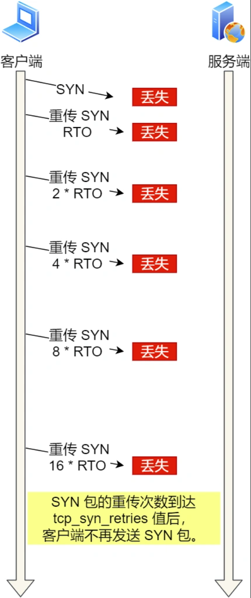

<u>可以根据网络的稳定性和目标服务器的繁忙程度`修改 SYN 的重传次数`</u>，调整客户端的三次握手时间上限。比如内网中通讯时，就可以适当调低重试次数，尽快把错误暴露给应用程序。


#### 服务端优化

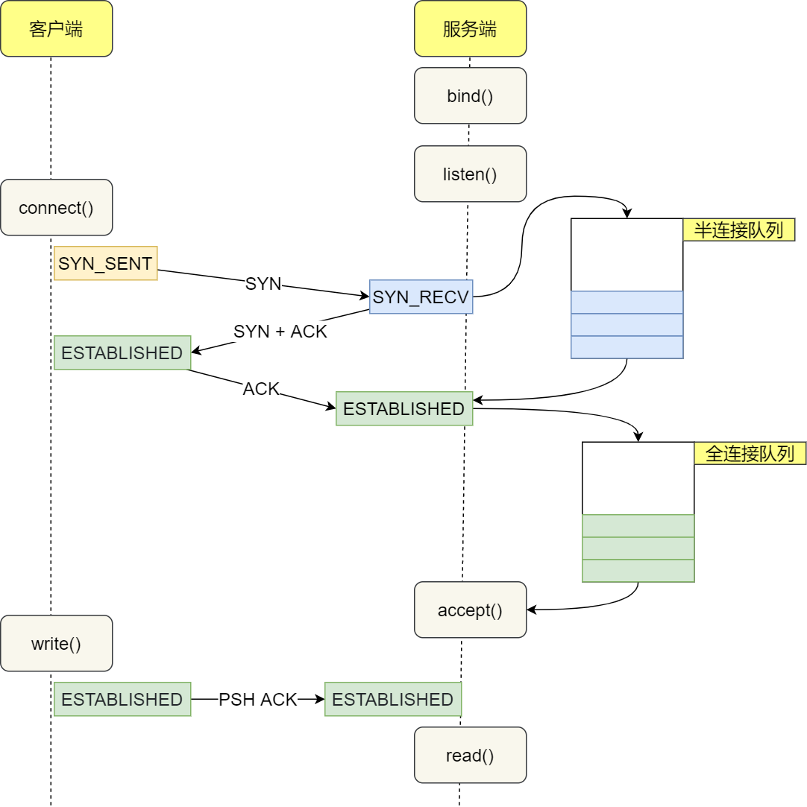

##### 如何查看由于 SYN 半连接队列已满，而被丢弃连接的情况？

我们可以通过该 `netstat -s` 命令给出的统计结果中， 可以得到由于半连接队列已满，引发的失败次数：

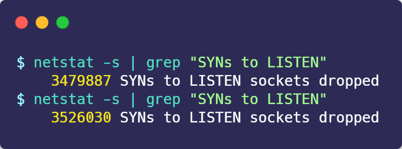

上面输出的数值是**累计值**，表示共有多少个 TCP 连接因为半连接队列溢出而被丢弃。**隔几秒执行几次，如果有上升的趋势，说明当前存在半连接队列溢出的现象**。


##### 如何调整 SYN 半连接队列大小？

要想增大半连接队列，**不能只单纯增大 `tcp_max_syn_backlog` 的值，还需一同增大 `somaxconn` 和 `backlog`，也就是增大 accept 队列。否则，只单纯增大 tcp_max_syn_backlog 是无效的。**

增大 tcp_max_syn_backlog 和 somaxconn 的方法是修改 Linux 内核参数：

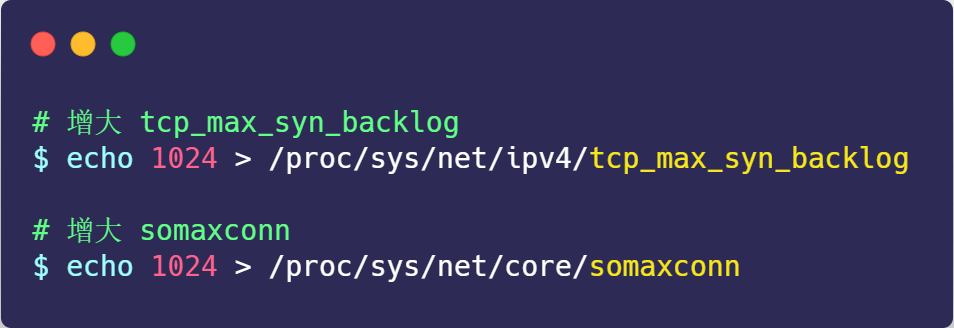

增大 backlog 的方式，每个 Web 服务都不同，比如 Nginx 增大 backlog 的方法如下：

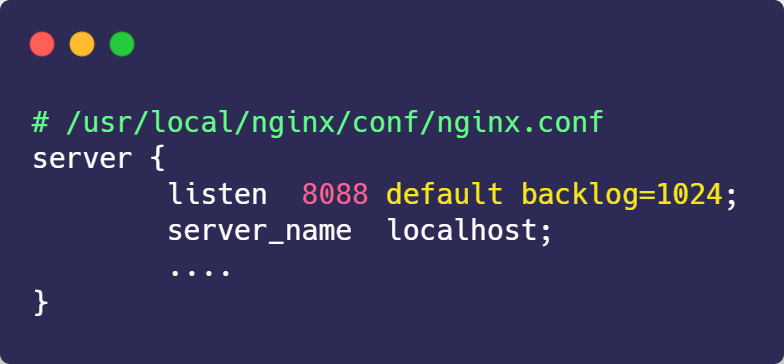

最后，改变了如上这些参数后，要重启 Nginx 服务，因为 SYN 半连接队列和 accept 队列都是在 `listen()` 初始化的。


##### 如果 SYN 半连接队列已满，只能丢弃连接吗？

**开启 syncookies 功能就可以在不使用 SYN 半连接队列的情况下成功建立连接**。


##### `SYN_RCV 状态的优化`

当客户端接收到服务器发来的 SYN+ACK 报文后，就会回复 ACK 给服务器，同时客户端连接状态从 SYN_SENT 转换为 ESTABLISHED，表示连接建立成功。

服务器端连接成功建立的时间还要再往后，等到服务端收到客户端的 ACK 后，服务端的连接状态才变为 ESTABLISHED。

如果服务器没有收到 ACK，就会重发 SYN+ACK 报文，同时一直处于 SYN_RCV 状态。

==当网络繁忙、不稳定时，报文丢失就会变严重，此时应该调大重发次数。反之则可以调小重发次数==。**修改重发次数的方法是，调整 tcp_synack_retries 参数**：


#### 如何绕过三次握手

三次握手建立连接造成的后果就是，HTTP 请求必须在一个 RTT（从客户端到服务器一个往返的时间）后才能发送。

在 Linux 3.7 内核版本之后，提供了 ==TCP Fast Open== 功能，这个功能可以减少 TCP 连接建立的时延。

##### TCP Fast Open 功能的工作方式  ==TFO==

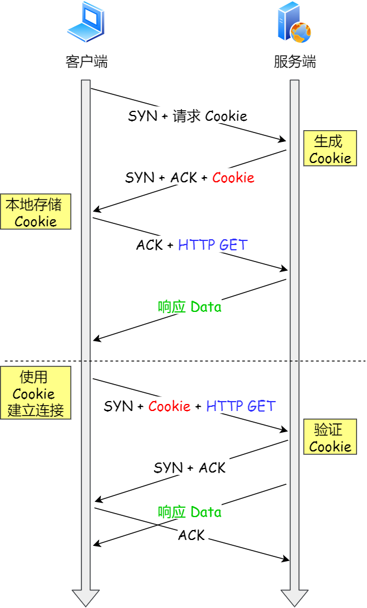

第一次发起 HTTP GET 请求的时候，还是需要正常的三次握手流程。

之后，如果客户端再次向服务器建立连接时:

1. 客户端发送 SYN 报文，该报文包含「数据」（对于非 TFO 的普通 TCP 握手过程，SYN 报文中不包含「数据」）以及此前记录的 Cookie；
2. 支持 TCP Fast Open 的服务器会对收到 Cookie 进行校验：如果 Cookie 有效，服务器将在 SYN-ACK 报文中对 SYN 和「数据」进行确认，服务器随后将「数据」递送至相应的应用程序；如果 Cookie 无效，服务器将丢弃 SYN 报文中包含的「数据」，且其随后发出的 SYN-ACK 报文将只确认 SYN 的对应序列号；
3. 如果服务器接受了 SYN 报文中的「数据」，服务器可在握手完成之前发送「数据」，**这就减少了握手带来的 1 个 RTT 的时间消耗**；
4. 客户端将发送 ACK 确认服务器发回的 SYN 以及「数据」，但如果客户端在初始的 SYN 报文中发送的「数据」没有被确认，则客户端将重新发送「数据」；
5. 此后的 TCP 连接的数据传输过程和非 TFO 的正常情况一致。

所以，之后发起 HTTP GET 请求的时候，可以绕过三次握手，这就减少了握手带来的 1 个 RTT 的时间消耗。

> Linux 下怎么打开 TCP Fast Open 功能呢？
>
> 在 Linux 系统中，可以通过**设置 tcp_fastopn 内核参数，来打开 Fast Open 功能**：
>
> tcp_fastopn 各个值的意义:
>
> - 0 关闭
> - 1 作为客户端使用 Fast Open 功能
> - 2 作为服务端使用 Fast Open 功能
> - 3 无论作为客户端还是服务器，都可以使用 Fast Open 功能
>
> **TCP Fast Open 功能需要客户端和服务端同时支持，才有效果。**


####  小结

> 客户端的优化

当客户端发起 SYN 包时，可以通过 `tcp_syn_retries` 控制其==重传的次数==。

> 服务端的优化

当服务端 SYN 半连接队列溢出后，会导致后续连接被丢弃，可以通过 `netstat -s` 观察半连接队列溢出的情况，如果 SYN 半连接队列溢出情况比较严重，可以通过 `tcp_max_syn_backlog、somaxconn、backlog` 参数来==调整 SYN 半连接队列的大小==。

服务端回复 ==SYN+ACK 的重传次数==由 `tcp_synack_retries` 参数控制。如果遭受 SYN 攻击，应把 `tcp_syncookies` 参数设置为 1，表示仅在 SYN 队列满后开启 syncookie 功能，可以保证正常的连接成功建立。

服务端收到客户端返回的 ACK，会把连接移入 accpet 队列，等待进行调用 accpet() 函数取出连接。

可以通过 `ss -lnt` 查看服务端进程的 accept 队列长度，如果 accept 队列溢出，系统默认丢弃 ACK，如果可以把 `tcp_abort_on_overflow` 设置为 1 ，表示用 RST 通知客户端连接建立失败。

如果 ==accpet 队列==溢出严重，可以通过 listen 函数的 `backlog` 参数和 `somaxconn` 系统参数提高队列大小，accept 队列长度取决于 min(backlog, somaxconn)。

> 绕过三次握手

==TCP Fast Open 功能==可以绕过三次握手，使得 HTTP 请求减少了 1 个 RTT 的时间，Linux 下可以通过 `tcp_fastopen` 开启该功能，同时必须保证服务端和客户端同时支持。


### [TCP 四次挥手的性能提升](https://xiaolincoding.com/network/3_tcp/tcp_optimize.html#tcp-四次挥手的性能提升)

针对 TCP 四次挥手的优化，我们需要根据主动方和被动方四次挥手状态变化来调整系统 TCP 内核参数。

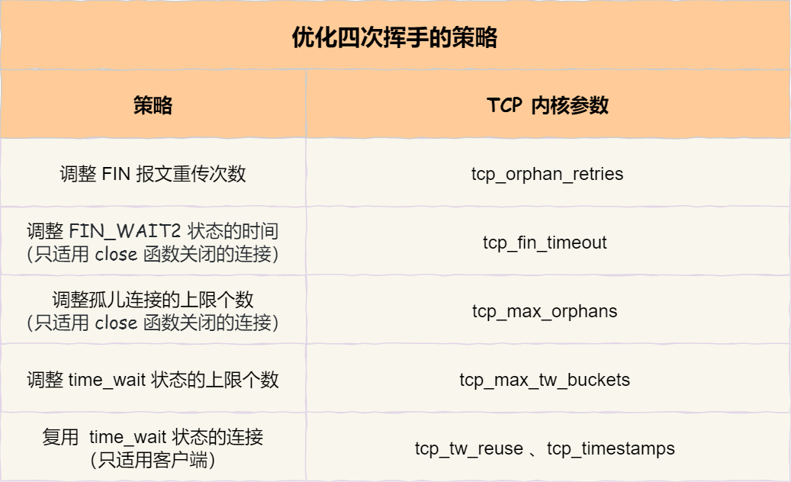

#### 主动方的优化

> 1. 选择合适的重传次数
> 2. time_wait过多时，设置合适的`tcp_tw_reuse` 和 `tcp_timestamps`

主动发起 FIN 报文断开连接的一方，如果迟迟没收到对方的 ACK 回复，则会重传 FIN 报文，重传的次数由 `tcp_orphan_retries` 参数决定。

当主动方收到 ACK 报文后，连接就进入 FIN_WAIT2 状态，根据关闭的方式不同，优化的方式也不同：

- 如果这是 close 函数关闭的连接，那么它就是孤儿连接。如果 `tcp_fin_timeout` 秒内没有收到对方的 FIN 报文，连接就直接关闭。同时，为了应对孤儿连接占用太多的资源，`tcp_max_orphans` 定义了最大孤儿连接的数量，超过时连接就会直接释放。
- 反之是 shutdown 函数关闭的连接，则不受此参数限制；

当主动方接收到 FIN 报文，并返回 ACK 后，主动方的连接进入 TIME_WAIT 状态。这一状态会持续 1 分钟，为了防止 TIME_WAIT 状态占用太多的资源，`tcp_max_tw_buckets` 定义了最大数量，超过时连接也会直接释放。

当 TIME_WAIT 状态过多时，还可以通过设置 `tcp_tw_reuse` 和 `tcp_timestamps` 为 1 ，将 TIME_WAIT 状态的端口复用于作为客户端的新连接，注意该参数只适用于客户端。

#### 被动方的优化

> 1. 解决close_wait异常
> 2. 选择合适的重传次数

被动关闭的连接方应对非常简单，它在回复 ACK 后就进入了 CLOSE_WAIT 状态，等待进程调用 close 函数关闭连接。<u>因此，出现大量 CLOSE_WAIT 状态的连接时，应当从应用程序中找问题。</u>

当被动方发送 FIN 报文后，连接就进入 LAST_ACK 状态，在未等到 ACK 时，会在 `tcp_orphan_retries` 参数的控制下重发 FIN 报文。


### [TCP 传输数据的性能提升](https://xiaolincoding.com/network/3_tcp/tcp_optimize.html#tcp-传输数据的性能提升)

本节针对 TCP 优化数据传输的方式，做了一些介绍。

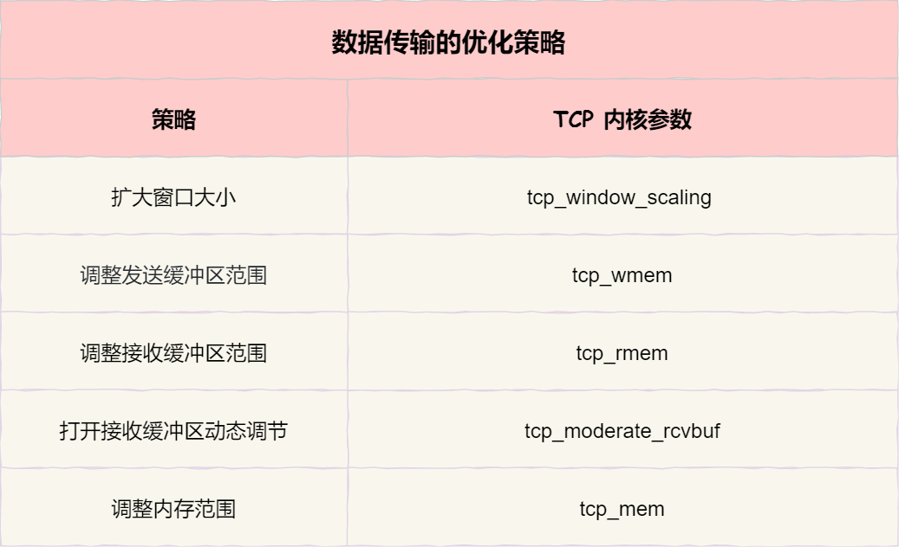

TCP 可靠性是通过 ACK 确认报文实现的，又依赖滑动窗口提升了发送速度也兼顾了接收方的处理能力。

可是，默认的滑动窗口最大值只有 64 KB，不满足当今的高速网络的要求，要想提升发送速度必须提升滑动窗口的上限，在 Linux 下是通过设置 `tcp_window_scaling` 为 1 做到的，此时最大值可高达 1GB。

==滑动窗口==定义了网络中飞行报文的最大字节数，当它超过带宽时延积时，网络过载，就会发生丢包。而当它小于带宽时延积时，就无法充分利用网络带宽。因此，滑动窗口的设置，必须参考带宽时延积。

==内核缓冲区==决定了滑动窗口的上限，缓冲区可分为：发送缓冲区 tcp_wmem 和接收缓冲区 tcp_rmem。

Linux 会对缓冲区动态调节，我们应该把缓冲区的上限设置为带宽时延积。发送缓冲区的调节功能是自动打开的，而接收缓冲区需要把 tcp_moderate_rcvbuf 设置为 1 来开启。其中，调节的依据是 TCP 内存范围 tcp_mem。

但需要注意的是，如果程序中的 socket 设置 SO_SNDBUF 和 SO_RCVBUF，则会关闭缓冲区的动态整功能，所以不建议在程序设置它俩，而是<u>交给内核自动调整比较好</u>。

有效配置这些参数后，既能够最大程度地 保持并发性，也能让资源充裕时连接传输速度达到最大值。

## [3.9 TCP的连接状态](https://interviewguide.cn/#/Doc/Knowledge/计算机网络/计算机网络?id=48、常见tcp的连接状态有哪些？)

- CLOSED：初始状态。
- LISTEN：服务器处于监听状态。
- SYN_SEND：客户端socket执行CONNECT连接，发送SYN包，进入此状态。
- SYN_RECV：服务端收到SYN包并发送服务端SYN包，进入此状态。
- ESTABLISH：表示连接建立。客户端发送了最后一个ACK包后进入此状态，服务端接收到ACK包后进入此状态。
- FIN_WAIT_1：终止连接的一方（通常是客户机）发送了FIN报文后进入。等待对方FIN。
- CLOSE_WAIT：（假设服务器）接收到客户机FIN包之后等待关闭的阶段。在接收到对方的FIN包之后，自然是需要立即回复ACK包的，表示已经知道断开请求。但是本方是否立即断开连接（发送FIN包）取决于是否还有数据需要发送给客户端，若有，则在发送FIN包之前均为此状态。
- FIN_WAIT_2：此时是半连接状态，即有一方要求关闭连接，等待另一方关闭。客户端接收到服务器的ACK包，但并没有立即接收到服务端的FIN包，进入FIN_WAIT_2状态。
- LAST_ACK：服务端发动最后的FIN包，等待最后的客户端ACK响应，进入此状态。
- TIME_WAIT：客户端收到服务端的FIN包，并立即发出ACK包做最后的确认，在此之后的2MSL时间称为TIME_WAIT状态。


## [3.10 对于FIN_WAIT_2，CLOSE_WAIT状态和TIME_WAIT状态？你知道多少?](https://interviewguide.cn/#/Doc/Knowledge/计算机网络/计算机网络?id=81、对于fin_wait_2，close_wait状态和time_wait状态？你知道多少)

- FIN_WAIT_2：

  - ==<u>半关闭状态</u>==。

    > 一、半连接
    >
    > 1.1 定义
    >
    > - 发生在TCP3次握手中。
    > - 如果A向B发起TCP请求，B也按照正常情况进行响应了，但是A不进行第3次握手，这就是半连接
    >
    > 1.2 半连接攻击 `(SYN攻击)`
    >
    > - <u>半连接，会造成B分配的内存资源就一直这么耗着，直到资源耗尽</u>。
    >
    >
    > 二、半打开（Half-Open）
    >
    > 2.1 定义
    >
    > - <u>如果一方已经关闭或异常终止连接，而另一方却不知道。 我们将这样的TCP连接称为半打开（Half-Open</u>）。
    >
    >
    > 三、半关闭
    >
    > 3.1 定义
    >
    > - TCP提供了连接的一端在结束它的发送后还能接收来自另一端数据的能力，这就是TCP的半关闭。
    > - 当一方关闭发送通道后，仍可接受另一方发送过来的数据，这样的情况叫“半关闭”。（拆除TCP连接是：你关闭你的发送通道，我关闭我的发送通道）。
    >
    > 3.2 半关闭的产生
    >
    > - 客户端发送FIN，另一端发送对这个FIN的ACK报文段。 此时客户端就处于半关闭。
    > - 调用shutdown，shutdown的第二个参数为SHUT_WR时，为半关闭。

  - 发送断开请求一方还有接收数据能力，但已经没有发送数据能力（或者说只能发送FIN）。

  - 不能长久的处于FIN_WAIT2状态 超时后会默默消失

- CLOSE_WAIT状态：

  - 被动关闭连接一方接收到FIN包会立即回应ACK包表示已接收到断开请求。
  - 被动关闭连接一方如果还有剩余数据要发送就会进入CLOSE_WAIT状态。

  > 第二次 第三次挥手之间的间隔

- TIME_WAIT状态：

  - 又叫2MSL等待状态。
  - 如果客户端直接进入CLOSED状态，如果服务端没有接收到最后一次ACK包会在超时之后重新再发FIN包，此时因为客户端已经CLOSED，所以服务端就不会收到ACK而是收到RST。所以TIME_WAIT状态目的是防止最后一次握手数据没有到达对方而触发重传FIN准备的。
  - 在2MSL时间内，同一个socket不能再被使用，否则有可能会和旧连接数据混淆（如果新连接和旧连接的socket相同的话）。

## 3.11 为什么 TCP 叫数据流模式？ UDP 叫数据报模式？

- 所谓的“流模式”，是指`TCP发送端发送几次数据和接收端接收几次数据是没有必然联系`的，比如你通过 TCP连接给另一端发送数据，你只调用了一次 write，发送了100个字节，但是对方可以分10次收完，每次10个字节；你也可以调用10次write，每次10个字节，但是对方可以一次就收完。

- 原因：这是因为TCP是面向连接的，一个 socket 中收到的数据都是由同一台主机发出，且有序地到达，所以每次读取多少数据都可以。


> <u>==流 的意思是数据时连续有序的，我接收方可以自己选择怎么读 都多少==</u>

- 所谓的“数据报模式”，是指UDP发送端`调用了几次 write`，接收端必须用`相同次数的 read` 读完。`UDP是基于报文的`，在接收的时候，每次`最多只能读取一个报文`，报文和报文是不会合并的，如果缓冲区小于报文长度，则多出的部分会被丢弃。

- 原因：这是因为UDP是无连接的，只要知道接收端的 IP 和端口，任何主机都可以向接收端发送数据。 这时候，如果一次能读取超过一个报文的数据， 则会乱套。

> ==<u>报 的意思是数据时无序的，因此必须保证每次都读完 再读下一个，不然会乱套</u>==

### [如何理解是 TCP 面向字节流协议](https://xiaolincoding.com/network/3_tcp/tcp_stream.html)

> TCP 是面向`字节流`的协议，UDP 是面向`报文`的协议？这里的「面向字节流」和「面向报文」该如何理解。

###  如何理解字节流？

之所以会说 TCP 是面向字节流的协议，UDP 是面向报文的协议，是因为操作系统对 TCP 和 UDP 协议的**发送方的机制不同**，也就是问题原因在发送方。

#### **为什么 UDP 是面向报文的协议？**

当用户消息通过 UDP 协议传输时，**操作系统不会对消息进行拆分**，在组装好 UDP 头部后就交给网络层来处理，所以发出去的 UDP 报文中的数据部分就是完整的用户消息，也就是**每个 UDP 报文就是一个用户消息的边界**，这样接收方在接收到 UDP 报文后，读一个 UDP 报文就能读取到完整的用户消息。

你可能会问，如果收到了两个 UDP 报文，操作系统是怎么区分开的？

操作系统在收到 UDP 报文后，会将其插入到队列里，**队列里的每一个元素就是一个 UDP 报文**，这样当用户调用 recvfrom() 系统调用读数据的时候，就会从队列里取出一个数据，然后从内核里拷贝给用户缓冲区。

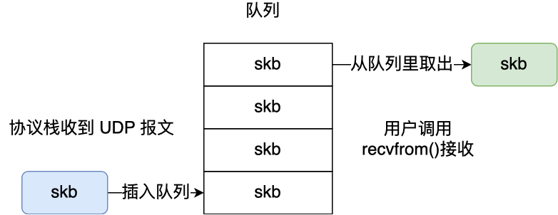

#### **为什么 TCP 是面向字节流的协议？**

当用户消息通过 TCP 协议传输时，**消息可能会被操作系统分组成多个的 TCP 报文**，也就是一个完整的用户消息被拆分成多个 TCP 报文进行传输。

这时，接收方的程序如果不知道发送方发送的消息的长度，也就是不知道消息的边界时，是无法读出一个有效的用户消息的，因为用户消息被拆分成多个 TCP 报文后，并不能像 UDP 那样，一个 UDP 报文就能代表一个完整的用户消息。

第一种情况，这两个消息被分到同一个 TCP 报文，像这样：

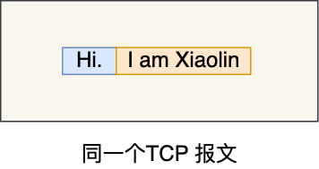

第二种情况，「I am Xiaolin」的部分随 「Hi」 在一个 TCP 报文中发送出去，像这样：

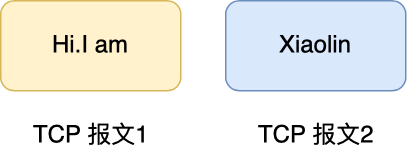

第三种情况，「Hi.」 的一部分随 TCP 报文被发送出去，另一部分和 「I am Xiaolin」 一起随另一个 TCP 报文发送出去，像这样。

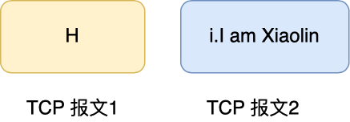

**我们`不能认为一个用户消息对应一个 TCP 报文`，正因为这样，所以 TCP 是面向字节流的协议**。

当两个消息的某个部分内容被分到同一个 TCP 报文时，就是我们常说的 ==TCP 粘包问题==，这时接收方不知道消息的边界的话，是无法读出有效的消息。

要解决这个问题，要交给**`应用程序`**。


### 如何解决粘包？

粘包的问题出现是因为不知道一个用户消息的边界在哪，如果知道了边界在哪，接收方就可以通过边界来划分出有效的用户消息。

一般有三种方式分包的方式：

- 固定长度的消息；
- 特殊字符作为边界；
- 自定义消息结构。

#### `固定长度`的消息

这种是最简单方法，即每个用户消息都是固定长度的，比如规定一个消息的长度是 64 个字节，当接收方接满 64 个字节，就认为这个内容是一个完整且有效的消息。

但是这种方式灵活性不高，实际中很少用。

#### `特殊字符`作为边界

我们可以在两个用户消息之间插入一个特殊的字符串，这样接收方在接收数据时，读到了这个特殊字符，就把认为已经读完一个完整的消息。

HTTP 是一个非常好的例子。

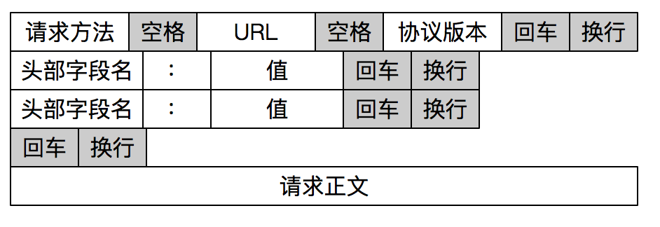

HTTP 通过设置回车符、换行符作为 HTTP 报文协议的边界。

有一点要注意，这个作为边界点的特殊字符，如果刚好消息内容里有这个特殊字符，我们要对这个字符转义，避免被接收方当作消息的边界点而解析到无效的数据。

#### `自定义消息结构`

我们可以自定义一个消息结构，由包头和数据组成，其中包头包是固定大小的，而且包头里有一个字段来说明紧随其后的数据有多大。

比如这个消息结构体，首先 4 个字节大小的变量来表示数据长度，真正的数据则在后面。

```c
struct { 
    u_int32_t message_length; 
    char message_data[]; 
} message;
```

当接收方接收到包头的大小（比如 4 个字节）后，就解析包头的内容，于是就可以知道数据的长度，然后接下来就继续读取数据，直到读满数据的长度，就可以组装成一个完整到用户消息来处理了。


## 3.12 TCP连接`异常`的问题

### [1. 三次握手和四次挥手的异常处理](https://zhuanlan.zhihu.com/p/398890723)

#### **TCP 三次握手期间的异常**

##### **第一次握手丢失了，会发生什么？**

当客户端想和服务端建立 TCP 连接的时候，首先第一个发的就是 SYN 报文，然后进入到 `SYN_SENT` 状态。

在这之后，如果客户端迟迟收不到服务端的 SYN-ACK 报文（第二次握手），就会触发超时重传机制。

不同版本的操作系统可能超时时间不同，有的 1 秒的，也有 3 秒的，这个超时时间是写死在内核里的，如果想要更改则需要重新编译内核，比较麻烦。

当客户端在 1 秒后没收到服务端的 SYN-ACK 报文后，客户端就会重发 SYN 报文，那到底重发几次呢？

在 Linux 里，客户端的 SYN 报文最大重传次数由 `tcp_syn_retries`内核参数控制，这个参数是可以自定义的，默认值一般是 5。

通常，第一次超时重传是在 1 秒后，第二次超时重传是在 2 秒，第三次超时重传是在 4 秒后，第四次超时重传是在 8 秒后，第五次是在超时重传 16 秒后。没错，**每次超时的时间是上一次的 2 倍**。

<u>当第五次超时重传后，会继续等待 32 秒，如果`服务端仍然没有回应 ACK`，客户端就不再发送 SYN 包，然后`断开 TCP 连接`。</u>

所以，总耗时是 1+2+4+8+16+32=63 秒，大约 1 分钟左右。

> ==<u>重传客户端的SYN 直到收到ACK 或者得到上限次数</u>==

##### **第二次握手丢失了，会发生什么？**

当服务端收到客户端的第一次握手后，就会回 SYN-ACK 报文给客户端，这个就是第二次握手，此时服务端会进入 `SYN_RCVD` 状态。

第二次握手的 `SYN-ACK` 报文其实有两个目的 ：

- 第二次握手里的 ACK， 是对第一次握手的确认报文；
- 第二次握手里的 SYN，是服务端发起建立 TCP 连接的报文；

所以，如果第二次握手丢了，就会发送比较有意思的事情，具体会怎么样呢？

因为第二次握手报文里是包含对客户端的第一次握手的 ACK 确认报文，所以，如果客户端迟迟没有收到第二次握手，那么客户端就觉得可能自己的 SYN 报文（第一次握手）丢失了，于是**客户端就会触发超时重传机制，重传 SYN 报文**。

然后，因为第二次握手中包含服务端的 SYN 报文，所以当客户端收到后，需要给服务端发送 ACK 确认报文（第三次握手），服务端才会认为该 SYN 报文被客户端收到了。

那么，如果第二次握手丢失了，服务端就收不到第三次握手，于是**服务端这边会触发超时重传机制，重传 SYN-ACK 报文**。

在 Linux 下，SYN-ACK 报文的最大重传次数由 `tcp_synack_retries`内核参数决定，默认值是 5。

因此，当第二次握手丢失了，客户端和服务端都会重传：

- ==<u>客户端会重传 SYN 报文</u>==，也就是第一次握手，最大重传次数由 `tcp_syn_retries`内核参数决定。；
- ==<u>服务端会重传 SYN-ACK 报文</u>==，也就是第二次握手，最大重传次数由 `tcp_synack_retries` 内核参数决定。

##### **第三次握手丢失了，会发生什么？**

客户端收到服务端的 SYN-ACK 报文后，就会给服务端回一个 ACK 报文，也就是第三次握手，此时客户端状态进入到 `ESTABLISH` 状态。

因为这个第三次握手的 ACK 是对第二次握手的 SYN 的确认报文，所以当第三次握手丢失了，如果服务端那一方迟迟收不到这个确认报文，就会触发超时重传机制，重传 SYN-ACK 报文，直到收到第三次握手，或者达到最大重传次数。

注意，**ACK 报文是不会有重传的，当 ACK 丢失了，就由对方重传对应的报文 然后再按逻辑发送ACK**。

> ==<u>服务端重传SYN-ACK，然后客户端继续按逻辑ACK</u>==

#### **TCP 四次挥手期间的异常**

##### **第一次挥手丢失了，会发生什么？**

当客户端（主动关闭方）调用 close 函数后，就会向服务端发送 FIN 报文，试图与服务端断开连接，此时客户端的连接进入到 `FIN_WAIT_1` 状态。

正常情况下，如果能及时收到服务端（被动关闭方）的 ACK，则会很快变为 `FIN_WAIT2` 状态。

如果第一次挥手丢失了，那么客户端迟迟收不到被动方的 ACK 的话，也就会触发超时重传机制，重传 FIN 报文，重发次数由 `tcp_orphan_retries` 参数控制。

当客户端重传 FIN 报文的次数超过 `tcp_orphan_retries` 后，就不再发送 FIN 报文，直接进入到 `close` 状态。

> ==<u>主动关闭方重传FIN，直到收到ACK 或者得到上限次数</u>==

##### **第二次挥手丢失了，会发生什么？**

当服务端收到客户端的第一次挥手后，就会先回一个 ACK 确认报文，此时服务端的连接进入到 `CLOSE_WAIT` 状态。

在前面我们也提了，<u>ACK 报文是不会重传的</u>，所以如果服务端的第二次挥手丢失了，客户端就会触发超时重传机制，重传 FIN 报文，直到收到服务端的第二次挥手，或者达到最大的重传次数。

这里提一下，当客户端收到第二次挥手，也就是收到服务端发送的 ACK 报文后，客户端就会处于 `FIN_WAIT2` 状态，在这个状态需要等服务端发送第三次挥手，也就是服务端的 FIN 报文。

对于 close 函数关闭的连接，由于无法再发送和接收数据，所以`FIN_WAIT2` 状态不可以持续太久，而 `tcp_fin_timeout` 控制了这个状态下连接的持续时长，默认值是 60 秒。

这意味着对于调用 close 关闭的连接，`如果在 60 秒后还没有收到 FIN 报文`，<u>==客户端（主动关闭方）的连接就会直接关闭==</u>。

> 1. ==<u>主动方重新进行第一次挥手，直到收到第二次挥手的ACK</u>==
> 2. 注意 和之前不同，第二次挥手不需要也没有ACK确认，所以不会单独重复第二次挥手

##### **第三次挥手丢失了，会发生什么？**

当服务端（被动关闭方）收到客户端（主动关闭方）的 FIN 报文后，内核会自动回复 ACK，同时连接处于 `CLOSE_WAIT` 状态，顾名思义，它表示等待应用进程调用 close 函数关闭连接。

此时，内核是没有权利替代进程关闭连接，必须由进程主动调用 close 函数来触发服务端发送 FIN 报文。

服务端处于 CLOSE_WAIT 状态时，调用了 close 函数，内核就会发出 FIN 报文，同时连接进入 LAST_ACK 状态，等待客户端返回 ACK 来确认连接关闭。

如果迟迟收不到这个 ACK，服务端就会重发 FIN 报文，重发次数仍然由 `tcp_orphan_retries` 参数控制，这与客户端重发 FIN 报文的重传次数控制方式是一样的。

> ==<u>重发第三次挥手 直到收到ACK 或者次数达到上限</u>==

##### **第四次挥手丢失了，会发生什么？**

当客户端收到服务端的第三次挥手的 FIN 报文后，就会回 ACK 报文，也就是第四次挥手，此时客户端连接进入 `TIME_WAIT` 状态。

在 Linux 系统，<u>TIME_WAIT 状态会`持续 60 秒后才会进入关闭`状态</u>。

然后，服务端（被动关闭方）没有收到 ACK 报文前，还是处于 LAST_ACK 状态。

如果第四次挥手的 ACK 报文没有到达服务端，服务端就会重发 FIN 报文，重发次数仍然由前面介绍过的 `tcp_orphan_retries` 参数控制。

> ==<u>重发第三次挥手 直到收到ACK 或者次数达到上限</u>==


### [2. 拔掉网线后， 原本的 TCP 连接还存在吗？](https://zhuanlan.zhihu.com/p/467241401)

**拔掉网线几秒，再插回去，原本的 TCP 连接还存在吗？**

#### 有数据传输 按==重传机制==回答

- 在客户端拔掉网线后，如果服务端发送了数据报文，那么在服务端重传次数没有达到最大值（默认值为15次）之前，客户端就插回了网线，那么双方原本的 TCP 连接还是能正常存在，就好像什么事情都没有发生。
- 在客户端拔掉网线后，如果服务端发送了数据报文，在客户端插回网线之前，服务端重传次数达到了最大值时，服务端就会断开 TCP 连接。等到客户端插回网线后，向服务端发送了数据，因为服务端已经断开了与客户端相同四元组的 TCP 连接，所以就会回 `RST 报文`，客户端收到后就会断开 TCP 连接。至此， 双方的 TCP 连接都断开了。

#### 无数据传输 按keepalive==保活机制==回答

- 如果双方`都没有`开启 TCP keepalive 机制，那么在客户端拔掉网线后，如果客户端一直不插回网线，那么客户端和服务端的 TCP 连接状态将`会一直保持存在`。
- 如果双方都开启了 TCP keepalive 机制，那么在客户端拔掉网线后，如果客户端一直不插回网线，TCP keepalive 机制会`探测`到对方的 TCP 连接没有存活，于是就会`断开 TCP 连接`。而如果在 TCP 探测期间，客户端插回了网线，那么双方原本的 TCP 连接还是能正常存在。

#### 其他场景

除了客户端拔掉网线的场景，还有客户端「==<u>宕机和杀死进程</u>==」的两种场景。

第一个场景，客户端宕机这件事跟拔掉网线是一样无法被服务端的感知的，所以如果在没有数据传输，并且没有开启 TCP keepalive 机制时，，**服务端的 TCP 连接将会一直处于 ESTABLISHED 连接状态**，直到服务端重启进程。

所以，我们可以得知一个点。在没有使用 TCP 保活机制，且双方不传输数据的情况下，一方的 TCP 连接处在 ESTABLISHED 状态时，并不代表另一方的 TCP 连接还一定是正常的。

> <u>宕机和拔网线是一样的效果</u>

第二个场景，杀死客户端的进程后，客户端的内核就会向服务端发送 FIN 报文，**与客户端进行四次挥手**。

所以，即使没有开启 TCP keepalive，且双方也没有数据交互的情况下，如果其中一方的进程发生了崩溃，这个过程操作系统是可以感知的到的，于是就会发送 FIN 报文给对方，然后与对方进行 TCP 四次挥手。

> 杀死进程 `内核会接替`完成挥手工作


### 3. 一个tcp连接，`没有的打开keepalive`选项，`没有数据交互`，现在一端突然`掉电`和一段的`进程突然crash`，这两个有什么区别？

> 分情况 `是否开启了 tcp保活机制`：
>
> 如果两端的 TCP 连接一直没有数据交互，达到了触发 TCP 保活机制的条件，那么内核里的 TCP 协议栈就会发送探测报文。
>
> - 如果对端程序是正常工作的。当 TCP 保活的探测报文发送给对端, 对端会正常响应，这样 **TCP 保活时间会被重置**，等待下一个 TCP 保活时间的到来。
> - 如果对端主机崩溃，或对端由于其他原因导致报文不可达。当 TCP 保活的探测报文发送给对端后，石沉大海，没有响应，连续几次，达到保活探测次数后，**TCP 会报告该 TCP 连接已经死亡**。

#### 在没有开启 TCP keepalive，且双方==<u>一直没有数据交互</u>==的情况下，如果客户端的==<u>「主机崩溃」（或者掉电 拔网线</u>==）了，会发生什么。  （==<u>不交互就不知道出错了</u>==）

如果客户端主机崩溃了，服务端是**无法感知到的**，在加上服务端没有开启 TCP keepalive，又没有数据交互的情况下，**服务端的 TCP 连接将会一直处于 ESTABLISHED 连接状态**，直到服务端重启进程。

所以，我们可以得知一个点。

在没有使用 TCP 保活机制，且双方不传输数据的情况下，一方的 TCP 连接处在 ESTABLISHED 状态时，并不代表另一方的 TCP 连接还一定是正常的。

#### 那题目中的==<u>「进程崩溃」</u>==的情况呢？

我自己做了个实验，使用 kill -9 来模拟进程崩溃的情况，发现**在 kill 掉进程后，服务端会发送 FIN 报文，与客户端进行四次挥手**。

所以，即使没有开启 TCP keepalive，且双方也没有数据交互的情况下，如果其中一方的进程发生了崩溃，这个过程操作系统是可以感知的到的，于是就会发送 FIN 报文给对方，然后与对方进行 TCP 四次挥手。

> 内核感知 帮你体面


### 4. FIN_WAIT2为什么有计时？

> 计时问题前面提到过，主动端FIN然后收到ACK后进入FIN_WAIT2状态，`FIN_WAIT2` 状态不可以持续太久，而 `tcp_fin_timeout` 控制了这个状态下连接的持续时长，默认值是 60 秒。<u>==为什么呢？==</u>
>
> 注意的点：FIN_WAIT2状态无法接收数据 只能接受第三次挥手的FIN

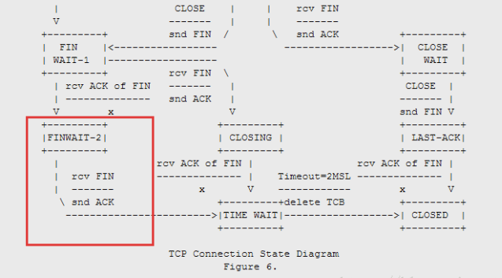

断开本端连接，进入FIN_WAIT2状态后，如果对端`故意不发送FIN`，`且也不传输数据`，那么意味着本端始终处在FINWAIT-2状态而资源无法释放，这不正是一个DDoS的典型场景吗？但是如果不这么做，也不符合TCP双向全双工独立控制的规范啊！

可能的答案

- **收到对端的FIN之前，本端会一直保持FINWAIT-2状态**(标准的要求)
- **收到对端的FIN之前，本端会保持FINWAIT-2状态一段足够的时间，超过此时间，连接即释放**(现实的要求)

我们看到，历史选择了现实而摒弃了理想。Linux任意使用2.2内核以上的发行版，看tcp的manual，其中的：

> tcp_fin_timeout (integer; default: 60; since Linux 2.2)  This specifies how many seconds to wait for a final FIN packet before the socket is forcibly closed. **This is  strictly a violation of the TCP specification**, but required to prevent denial-of-service attacks. In Linux 2.2,  the default value was 180.

现在FINWAIT-2为什么会有个超时时间的问题已经解释清楚了，接下来的问题是，如果FINWAIT-2的timer超时了，这个TCP连接将何去何从？

#### **连接在FINWAIT-2超时后并不会进入TIMEWAIT状态，也不会发送reset，而是直接默默消失。**


### [5. 处于 TIME_WAIT 状态的 TCP 连接，收到同四元组SYN 后会发生什么？](https://zhuanlan.zhihu.com/p/474634990)

**在 TCP 正常挥手过程中，处于 TIME_WAIT 状态的连接，收到相同四元组的 SYN 后会发生什么？**

如果双方开启了时间戳机制：

- 如果客户端的 SYN 的「序列号」比服务端「期望下一个收到的序列号」要**大**，**并且**SYN 的「==时间戳==」比服务端「最后收到的报文的时间戳」要**大**（==<u>有效SYN</u>==）。那么就会重用该四元组连接，跳过 2MSL 而转变为 SYN_RECV 状态，接着就能进行建立连接过程。
- 如果客户端的 SYN 的「序列号」比服务端「期望下一个收到的序列号」要**小**，**或者**SYN 的「时间戳」比服务端「最后收到的报文的时间戳」要**小**（<u>==无效SYN==</u>）。那么就会**再回复一个第四次挥手的 ACK 报文，客户端收到后，发现并不是自己期望收到确认号，就回 RST 报文给服务端**。

在 TIME_WAIT 状态，收到 RST 会断开连接吗？

- 如果 `net.ipv4.tcp_rfc1337` 参数为 0，则提前结束 TIME_WAIT 状态，释放连接。
- 如果 `net.ipv4.tcp_rfc1337` 参数为 1，则会丢掉该 RST 报文。


### [6. 服务器出现大量close_wait的连接的原因是什么？有什么解决方法？](https://interviewguide.cn/#/Doc/Knowledge/计算机网络/计算机网络?id=103、服务器出现大量close_wait的连接的原因是什么？有什么解决方法？)

close_wait状态是在TCP四次挥手的时候收到FIN但是没有发送自己的FIN时出现的，服务器出现大量close_wait状态的原因有两种：

- `服务器内部业务处理占用了过多时间`，都没能处理完业务；或者`还有数据需要发送`；或者`服务器的业务逻辑有问题，没有执行close()方法`

  > 1. 没有出错 只是服务器太忙 还是数据发送 所以不能主动断开
  > 2. 逻辑错误 没有调用close

- 服务器的`父进程派生出子进程`，子进程继承了socket，收到FIN的时候子进程处理但父进程没有处理该信号，导致socket的引用不为0`无法回收`

处理方法：

- 停止应用程序
- 修改程序里的bug


### [7. 已建立连接的TCP，收到SYN会发生什么](https://xiaolincoding.com/network/3_tcp/challenge_ack.html#rfc-文档解释)

> 大概意思是，一个已经建立的 TCP 连接，客户端中途宕机了，而服务端此时也没有数据要发送，一直处于 establish 状态，客户端恢复后，向服务端建立连接，此时服务端会怎么处理？

**1. 客户端的 SYN 报文里的端口号与历史连接不相同**  ==会新建连接==

如果客户端恢复后发送的 SYN 报文中的源端口号跟上一次连接的源端口号不一样，此时服务端会认为是新的连接要建立，于是就会通过三次握手来建立新的连接。

那旧连接里处于 establish 状态的服务端最后会怎么样呢？

如果服务端`发送`了`数据包`给客户端，由于客户端的连接已经被关闭了，此时`客户的内核就会回 RST 报文`，服务端收到后就会释放连接。

如果服务端一直没有发送数据包给客户端，在超过一段时间后， `TCP 保活机制`就会启动，检测到客户端没有存活后，接着服务端就会释放掉该连接。

**2. 客户端的 SYN 报文里的端口号与历史连接相同**  ==会断开连接==

如果客户端恢复后，发送的 SYN 报文中的源端口号跟上一次连接的源端口号一样，也就是处于 establish 状态的服务端收到了这个 SYN 报文。

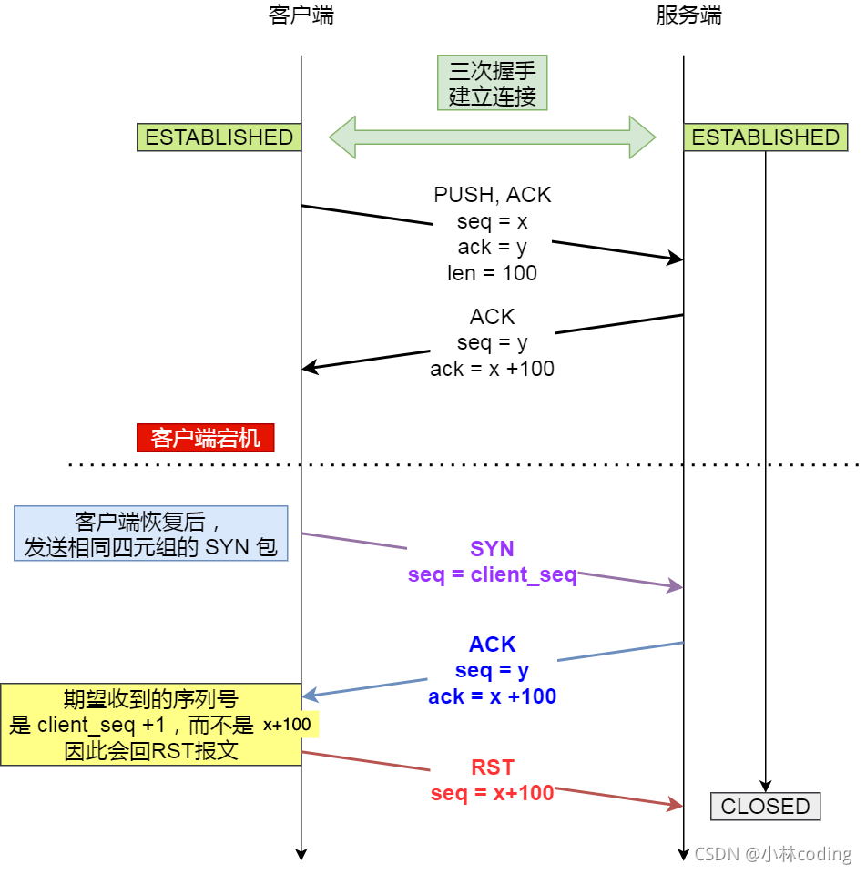

处于 `establish` 状态的服务端如果收到了`客户端的 SYN 报文`（注意此时的 `SYN 报文其实是乱序`的，因为 SYN 报文的初始化序列号其实是一个随机数），会回复一个携带了`正确序列号和确认号`的 ACK 报文，这个 ACK 被称之为 Challenge ACK。

接着，客户端收到这个 Challenge ACK，发现序列号`并不是自己期望收到`的，于是就会回 `RST` 报文，服务端收到后，就会释放掉该连接。

#### 如何关闭一个 TCP 连接？

要伪造一个能关闭 TCP 连接的 RST 报文，必须同时满足「`四元组相同`」和「`序列号正好落在对方的滑动窗口`内」这两个条件。

我们可以伪造一个四元组相同的 SYN 报文，来拿到“合法”的序列号！

如果处于 establish 状态的服务端，收到四元组相同的 SYN 报文后，**会回复一个 Challenge ACK，这个 ACK 报文里的「确认号」，正好是服务端下一次想要接收的序列号，说白了，就是可以通过这一步拿到服务端下一次预期接收的序列号。**

**然后用这个确认号作为 RST 报文的序列号，发送给服务端，此时服务端会认为这个 RST 报文里的序列号是合法的，于是就会释放连接！**


### [8. 四次挥手中收到乱序的 FIN 包会如何处理](https://xiaolincoding.com/network/3_tcp/out_of_order_fin.html#tcp-源码分析)

> 第三次挥手前 发送了数据包 然后发出FIN，如果数据包因为网络延迟

如果 FIN 报文比数据包先抵达客户端，此时 FIN 报文其实是一个乱序的报文，此时客户端的 TCP 连接并不会从 FIN_WAIT_2 状态转换到 TIME_WAIT 状态。

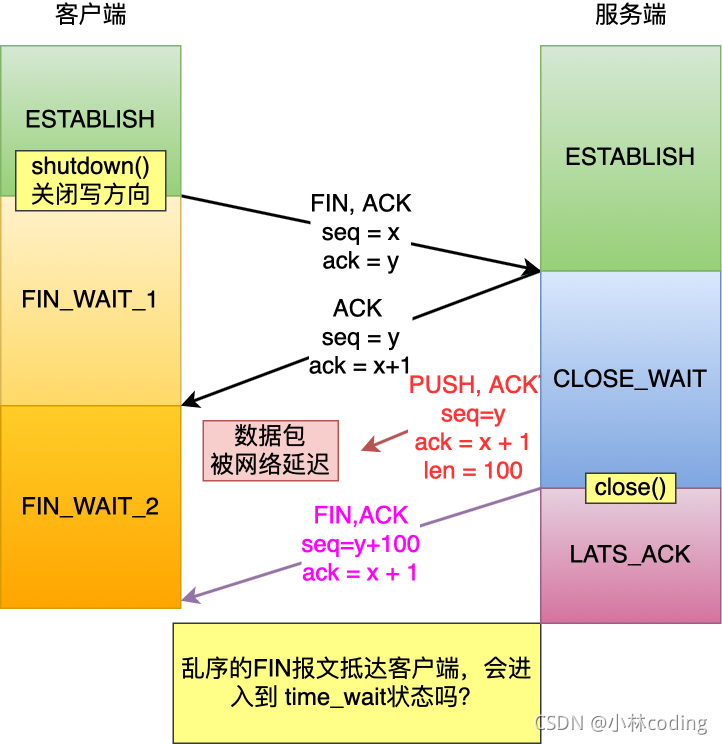

因此，我们要关注到点是看「==在 FIN_WAIT_2 状态下，是如何处理收到的乱序到 FIN 报文，然后 TCP 连接又是什么时候才进入到 TIME_WAIT 状态?==」。

我这里先直接说结论：

<u>在 `FIN_ WAIT _ 2` 状态时，如果收到`乱序的 FIN 报文`，那么就被会加入到「`乱序队列`」，`并不会进入到 TIME_WAIT 状态`。</u>

等再次收到前面被网络延迟的数据包时，会判断乱序队列有没有数据，然后会检测乱序队列中是否有可用的数据，如果能在乱序队列中找到与当前报文的序列号保持的顺序的报文，就会看该报文是否有 FIN 标志，如果发现有 FIN 标志，这时才会进入 `TIME_WAIT` 状态。

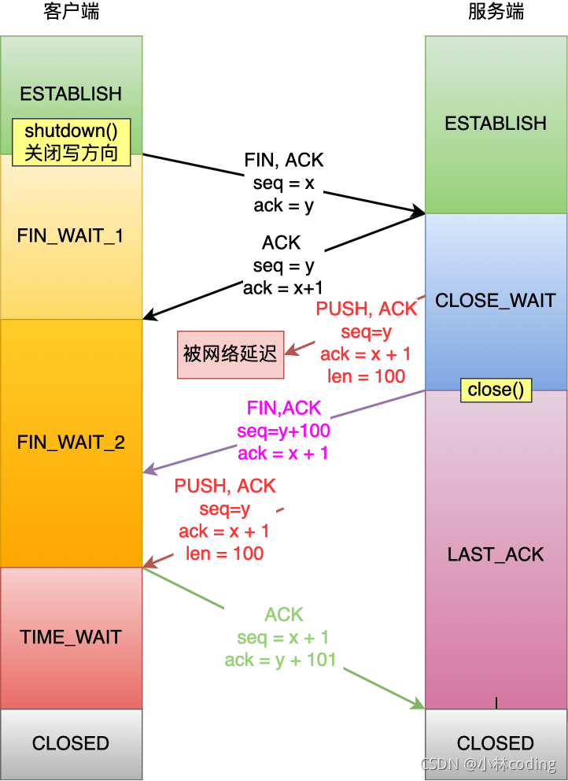

### 9. 在 TIME_WAIT 状态的 TCP 连接，收到 SYN 后会发生什么

「**在 TCP 正常挥手过程中，处于 TIME_WAIT 状态的连接，收到相同四元组的 SYN 后会发生什么？**」

关键是要看 ==SYN 的「序列号和时间戳」==是否合法

#### **关键是要看 SYN 的「序列号和时间戳」是否合法**

 什么是「合法」的 SYN？

- **合法 SYN**：客户端的 SYN 的「`序列`号」比服务端「期望下一个收到的序列号」要**大**，**并且** SYN 的「`时间`戳」比服务端「最后收到的报文的时间戳」要**大**。
- **非法 SYN**：客户端的 SYN 的「`序列`号」比服务端「期望下一个收到的序列号」要**小**，**或者** SYN 的「`时间`戳」比服务端「最后收到的报文的时间戳」要**小**。

上面 SYN 合法判断是基于双方都开启了 TCP 时间戳机制的场景，如果双方都没有开启 TCP 时间戳机制，则 SYN 合法判断如下：

- **合法 SYN**：客户端的 SYN 的「序列号」比服务端「期望下一个收到的序列号」要**大**。
- **非法 SYN**：客户端的 SYN 的「序列号」比服务端「期望下一个收到的序列号」要**小**。

#### 收到合法 SYN

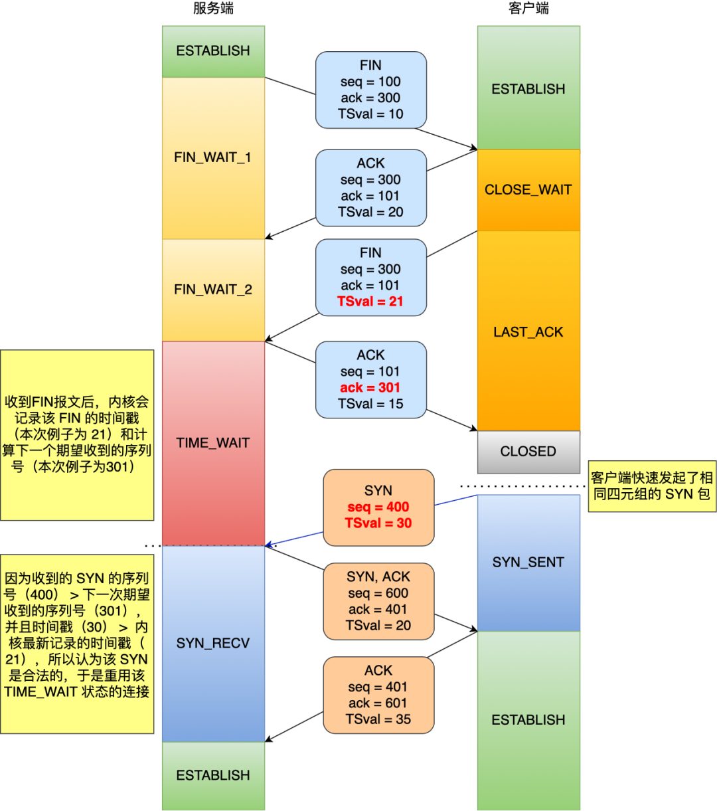

如果`处于 TIME_WAIT 状态`的连接`收到「合法的 SYN 」`后，就会重用此四元组连接，`跳过 2MSL 而转变为 SYN_RECV 状态`，接着就能进行建立连接过程。

#### 收到非法的 SYN

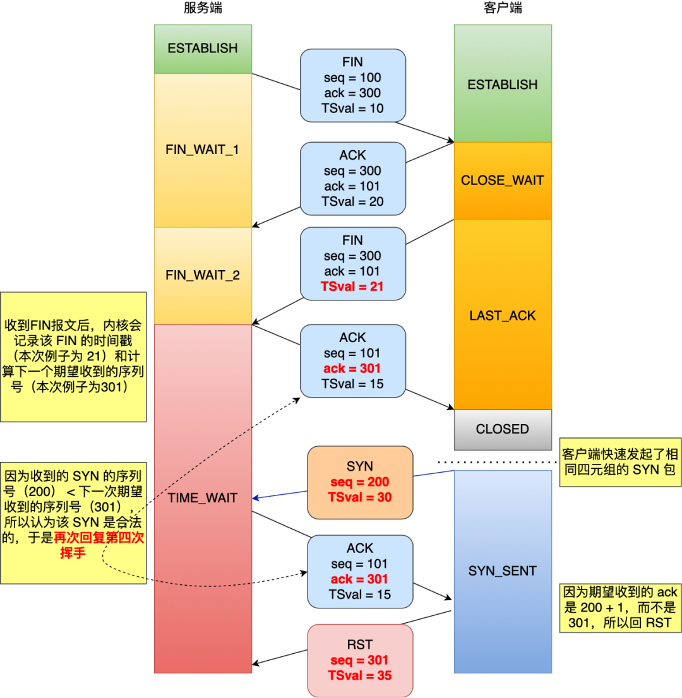

如果`处于 TIME_WAIT 状态`的连接`收到「非法的 SYN 」`后，就会==<u>再回复</u>==一个`第四次挥手的 ACK 报文`，客户端收到后，发现并不是自己期望收到确认号（ack num），就回 `RST` 报文给服务端。

## [3.13 TCP重置报文段及RST常见场景分析](https://juejin.cn/post/6844903879688060942)

`RST`表示连接重置，用于关闭那些已经没有必要继续存在的连接。一般情况下表示异常关闭连接，区别与四次分手正常关闭连接。

**产生`RST`的三个条件是：**

1. 目的地为某端口的`SYN`到达，然而在该端口上并没有正在监听的服务器；
2. TCP想取消一个已有连接；
3. TCP接收到一个根本不存在的连接上的分节。

下面的几种场景，都会产生`RST`，以此来说明重置报文段的用途

### 一、针对不存在端口的连接请求

客户端向服务端某端口发起连接请求`SYN`，但是目的服务端主机不存在该端口，此时向客户端回应`RST`，中断连接请求。

> 目的主机向本地主机回复`ACK、RST`

### 二、终止一条连接

终止一条连接的正常方法是由通信一方发送一个`FIN`。这种方法也被称为有序释放。因为`FIN`是在之前所有排队数据都已发送后才被发送出去，通常不会出现丢失数据的情况。然而在任何时刻，我们都可以通过发送一个重置报文段`RST`替代`FIN`来终止一条连接。这种方式也被称为终止释放。

终止一条连接可以为应用程序提供两大特性：

- 任何排队的数据都将被抛弃，一个重置报文段会被立即发送出去；
- 重置报文段的接收方会说明通信的另一端采用了终止的方式而不是一次正常关闭。API必须提供一种实现上述终止行为的方式来取代正常的关闭操作。

套接字API可通过套接字选项`SO_LINGER`的数值设置为`0`来实现上述功能。

```c++
struct linger{
  int l_onoff;		/* Nonzero to linger on close.  */
  int l_linger;		/* Time to linger.  */
};
```

`SO_LINGER`的不同值的含义如下：

1. `l_onoff`为`0`，`l_linger`的值被忽略，内核缺省情况，`close()`调用会立即返回给调用者，TCP模块负责尝试发送残留的缓存区数据。
2. `l_onoff`为非零值，`l_linger`为`0`，则连接立即终止，TCP将丢弃残留在发送缓冲区中的数据并发送`RST`给对方，而不是发送`FIN`，这样避免了`TIME_WAIT`状态，对方`read（）`时将收到`Connection reset by peer`的错误。
3. `l_onoff`为非零值，`l_linger`大于零：如果`l_linger`时间范围，TCP模块成功发送完残留的缓冲区数据，则正常关闭，如果超时，则向对方发送`RST`，丢弃残留在发送缓冲区的数据。

> 先3次握手，后客户端向服务度发送了5个字节数据，服务端在接收完5字节数据向客户端`ACK`后，表示想中断连接，此时因设置了`SO_LINGER`选项值为`0`，`close()`时，直接向对方发送`RST`而不是正常的发送`FIN`，连接立即终止，并且不会有`TIME_WAIT`状态，TCP将丢弃残留在发送缓冲区中的数据，对方`read（）`时将收到`Connection reset by peer`的错误。

### 三、半开连接

如果在未告知另一端的情况下通信的一端关闭或终止连接，那么就认为该条TCP连接处于半开状态。

举个例子，服务器主机被切断电源后重启（切断电源前可将网线断开，重启后再接上），此时的客户端是一个半开的连接。当客户端再次向服务端发送数据时，服务端对此连接一无所知，会回复一个重置报文段`RST`后，中断连接。

再或者如果程序开启了TCP保活机制，则当监测到对方主机不可达时，发送`RST`中断连接。详细可参考[TCP保活机制](https://link.juejin.cn?target=https%3A%2F%2Fblog.csdn.net%2Fs_lisheng%2Farticle%2Fdetails%2F87288445)。

TCP连接如果长时间没有数据收发，会使TCP发送保活探测报文，以维持连接或者探测连接是否存在。

如果认为连接不存在了，就会发送`RST`中断连接。

### 四、提前关闭连接

TCP应用程序接收数据是从操作系统中接收的TCP数据，如果数据到达了操作系统但是我应用数据不想继续接收数据了，此时`RST`中断连接。

### 五、在一个已关闭的TCP连接上收到数据

如果一个已关闭的TCP连接又收到数据，显然是异常的，此时应`RST`中断连接。

> 先3次握手；后客户端向服务端发送了5字节数据，服务端接收到5字节数据回复`ACK`；之后向客户端发送`FIN`，关闭连接，但此时客户端还有数据要发送，没有向服务端发起`FIN`，此时只进行了2次挥手；之后客户端又向服务端发送了5个字节数据，但此时服务端该连接已经调用`close()`  (==<u>**shutdown**</u>==就没有问题)关闭，此时再次收到该连接的数据属于异常，回复`RST`中断连接。

## 3.14 close 与 shutdown

### [Linux-socket的close和shutdown区别及应用场景](https://www.cnblogs.com/JohnABC/p/7238241.html)

#### **二者的区别**

1. close-----关闭`本进程`的socket id，但链接还是开着的，用这个socket id的其它进程还能用这个链接，能读或写这个socket id。
2. shutdown--破坏了socket 链接，读的时候可能侦探到EOF结束符，写的时候可能会收到一个SIGPIPE信号，这个信号可能直到socket buffer被填充了才收到，shutdown有一个关闭方式的参数，0 不能再读，1不能再写，2 读写都不能。

#### **socket 多进程中的 shutdown、close 的使用**

- 当所有的数据操作结束以后，你可以调用close()函数来释放该socket，从而停止在该socket上的任何数据操作：close(sockfd);使用close中止一个连接，但<u>它只是减少描述符的参考数</u>，并不直接关闭连接，只有当描述符的参考数为0时才关闭连接。所以在多进程/线程程序中，close只是确保了对于某个特定的进程或线程来说，该连接是关闭的。使用 client_fd = accept() 后 fork() 以在子进程中处理请求，此时在父进程中使用 close() 关闭该连接，子进程仍可以继续使用该连接。

- 也可以调用shutdown()函数来关闭该socket。该函数<u>允许你只停止在某个方向上的数据传输</u>，而一个方向上的数据传输继续进行。如你可以关闭某socket的写操作而允许继续在该socket上接受数据，直至读入所有数据。int shutdown(int sockfd,int how);shutdown可直接关闭描述符，不考虑描述符的参考数，可选择中止一个方向的连接。

#### **注意**

1. 如果有多个进程共享一个套接字，close每被调用一次，计数减1，直到`计数为0`时，也就是所用进程都调用了close，套接字将被释放。

1. 在多进程中如果一个进程中shutdown(sfd, SHUT_RDWR)后其它的进程将无法进行通信。如果一个进程close(sfd)将不会影响到其它进程，得自己理解引用计数的用法了。有Kernel编程知识的更好理解了.

#### **更多关于close和shutdown的说明**

1. **只要TCP栈的读缓冲里还有未读取（read）数据，则调用close时会直接向对端发送RST**。

2. **shutdown与socket描述符没有关系，即使调用shutdown(fd, SHUT_RDWR)也不会关闭fd，最终还需close(fd)**。

3. 可以认为shutdown(fd, SHUT_RD)是空操作，因为shutdown后还可以继续从该socket读取数据，这点也许还需要进一步证实。在已发送FIN包后write该socket描述符会引发EPIPE/SIGPIPE。

   > 所以 关闭我这段的 写 意思是 发送fin进入半关闭状态 我可以接收数据 但是我不可以发送数据 不然sigpipe
   >
   > 关闭读 同理

4. 当有多个socket描述符指向同一socket对象时，调用close时首先会递减该对象的引用计数，计数为0时才会发送FIN包结束TCP连接。shutdown不同，只要以SHUT_WR/SHUT_RDWR方式调用即发送FIN包。

5. SO_LINGER与close，当SO_LINGER选项开启但超时值为0时，调用close直接发送RST（这样可以避免进入TIME_WAIT状态，但破坏了TCP协议的正常工作方式），SO_LINGER对shutdown无影响。

6. TCP连接上出现RST与随后可能的TIME_WAIT状态没有直接关系，主动发FIN包方必然会进入TIME_WAIT状态，**除非不发送FIN而直接以发送RST结束连接**。

#### **应用场景** 

- 通常来说，socket是双向的，即数据是双向通信的。但有些时候，你会想在socket上实现单向的socket，即数据往一个方向传输。单向的socket便称为半开放Socket。要实现`半开放式`，需要用到shutdown()函数。

- 一般来说，半开放socket适用于以下场合:

  1. 当你想要确保所有写好的数据已经发送成功时。如果在发送数据的过程中，网络意外断开或者出现异常，系统不一定会返回异常，这是你可能以为对端已经接收到数据了。这时需要用shutdown()来确定数据是否发送成功，因为调用shutdown()时只有在缓存中的数据全部发送成功后才会返回。

  1. 想用一种方法来捕获程序潜在的错误，这错误可能是因为往一个不能写的socket上写数据，也有可能是在一个不该读操作的socket上读数据。当程序尝试这样做时，将会捕获到一个异常，捕获异常对于程序排错来说是相对简单和省劲的。

  1. 当您的程序使用了fork()或者使用多线程时，你想防止其他线程或进程访问到该资源，又或者你想立刻关闭这个socket，那么可以用shutdown()来实现。

### SIGPIPE信号

TCP是全双工的信道, 可以看作两条单工信道, TCP连接两端的两个端点各负责一条. 当对端调用close时, 虽然本意是关闭整个两条信道, 但本端只是收到FIN包. 按照TCP协议的语义, 表示对端只是关闭了其所负责的那一条单工信道, 仍然可以继续接收数据. 也就是说, 因为TCP协议的限制, 一个端点无法获知对端的socket是调用了`close`还是`shutdown`.

对一个已经收到FIN包的socket调用read方法, 如果接收缓冲已空, 则返回0, 这就是常说的表示连接关闭. 但第一次对其调用write方法时, 如果发送缓冲没问题, 会返回正确写入(发送). 但发送的报文会导致对端发送RST报文, 因为对端的socket已经调用了close, 完全关闭, 既不发送, 也不接收数据. 所以, 第二次调用write方法(假设在收到RST之后), 会生成SIGPIPE信号, 导致进程退出.？？？？？？

迷迷糊糊

#### 我的理解

1. 假设 A B, A调用shutdown_write, A再write就会触发SIGPIPE

2. 看上面的意思是：对端调用close后，我再发送数据就会触发SIGPIPE?

   > 疑问，对端调用close，此时应该是半连接状态，A->B不能发送数据， 但是B->A是可以发送数据的，意思是，FIN_WAIT2状态下 不可以接受数据了吗？ 是的 close状态下 进入 FINWAIT只是在等待对端的FIN

**解决方法：**signal(SIGPIPE, SIG_IGN);


## 3.15 为什么 TCP 每次建立连接时，初始化序列号都要不一样呢

#### 为什么 TCP 每次建立连接时，初始化序列号都要不一样呢？

主要原因是为了防止历史报文被下一个相同四元组的连接接收。

#### TCP 四次挥手中的 TIME_WAIT 状态不是会持续 2 MSL 时长，历史报文不是早就在网络中消失了吗？

是的，如果能正常四次挥手，由于 TIME_WAIT 状态会持续 2 MSL 时长，历史报文会在下一个连接之前就会自然消失。

但是来了，我们并不能保证每次连接都能通过四次挥手来正常关闭连接。

假设每次建立连接，客户端和服务端的初始化序列号都是从 0 开始：

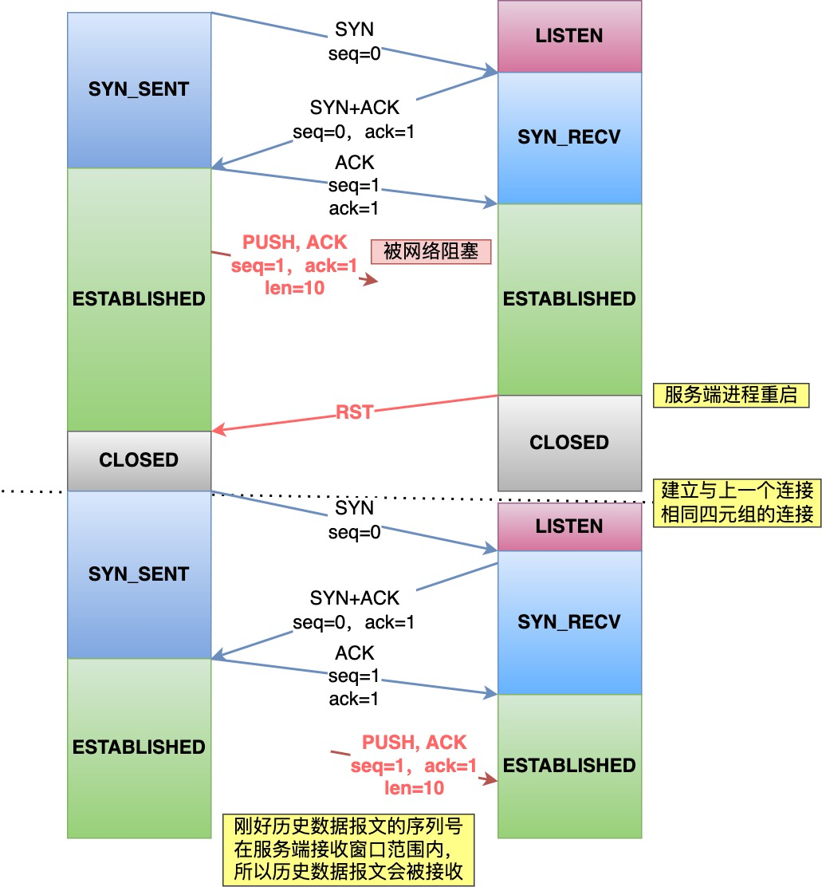

过程如下：

- 客户端和服务端建立一个 TCP 连接，在客户端发送数据包被网络阻塞了，而此时服务端的进程重启了，于是就会发送 RST 报文来断开连接。
- 紧接着，客户端又与服务端建立了与上一个连接相同四元组的连接；
- 在新连接建立完成后，上一个连接中被网络阻塞的数据包正好抵达了服务端，刚好该数据包的序列号正好是在服务端的接收窗口内，所以该数据包会被服务端正常接收，就会造成数据错乱。

可以看到，如果每次建立连接，客户端和服务端的初始化序列号都是一样的话，很容易出现历史报文被下一个相同四元组的连接接收的问题。

#### 客户端和服务端的初始化序列号不一样不是也会发生这样的事情吗？

可能会发生 但是因为接收方有接收窗口的限制 发生的可能性就很小了

#### 那客户端和服务端的初始化序列号都是随机的，那还是有可能随机成一样的呀？、

RFC793 提到初始化序列号 `ISN` 随机生成算法：ISN = M + F(localhost, localport, remotehost, remoteport)。

- M是一个`计时器`，这个计时器每隔 4 微秒加1。
- F 是一个 `Hash` 算法，根据`源IP、目的IP、源端口、目的端口`生成一个随机数值，要保证 hash 算法不能被外部轻易推算得出。

可以看到，随机数是会基于时钟计时器递增的，==基本不可能==会随机成一样的初始化序列号。

#### 是不是可以完全避免相同的序列号？

==不能完全== 因为序列号是unsigned int 会发生==回绕==

1. 因为序列号是一个32位无符号int ，**因此在到达 4G 之后再循环回到 0**。
2. **初始化序列号可被视为一个 32 位的计数器，该计数器的数值每 4 微秒加 1，循环一次需要 4.55 小时**。

#### 怎样避免序列号回绕导致的历史报文混乱

==开启tcp时间戳== tcp时间戳是默认开启的

tcp_timestamps 参数是默认开启的，开启了 tcp_timestamps 参数，TCP 头部就会使用时间戳选项，它有两个好处，**一个是便于精确计算 RTT ，另一个是能防止序列号回绕（PAWS）**。

防回绕序列号算法要求连接双方维护最近一次收到的数据包的时间戳（Recent TSval），每收到一个新数据包都会读取数据包中的时间戳值跟 Recent TSval 值做比较，**如果发现收到的数据包中时间戳`不是递增`的，则表示该数据包是过期的，就会直接丢弃这个数据包**。

> 客户端和服务端的初始化序列号都是随机生成，能很大程度上避免历史报文被下一个相同四元组的连接接收，然后又引入时间戳的机制，从而==完全避免==了历史报文被接收的问题。
>
> > 时间戳也可能回绕


## [3.16 SYN 报文什么时候情况下会被丢弃](https://xiaolincoding.com/network/3_tcp/syn_drop.html#坑爹的-tcp-tw-recycle)

SYN 报文被丢弃的两种场景：

- 开启 `tcp_tw_recycle` 参数，并且在 NAT 环境下，造成 SYN 报文被丢弃

  > - PAWS `时间戳`机制 时间戳不递增的话 会丢弃数据包    ==开启时间戳==
  > - net.ipv4.tcp_tw_recycle，如果开启该选项的话，允许处于 `TIME_WAIT 状态`的连接被快速回收；  ==时间戳续上==
  >
  > - 如果客户端网络环境是用了 NAT 网关，那么客户端环境的每一台机器通过 NAT 网关后，都会是相同的 IP 地址，在服务端看来，就好像只是在`跟一个客户端`打交道一样，无法区分出来     ==同一个ip相当于同一个客户端==
  >
  > 当客户端 A 通过 NAT 网关和服务器建立 TCP 连接，然后服务器主动关闭并且快速回收 TIME-WAIT 状态的连接后，**客户端 B 也通过 NAT 网关和服务器建立 TCP 连接，注意客户端 A 和 客户端 B 因为经过相同的 NAT 网关，所以是用相同的 IP 地址与服务端建立 TCP 连接，如果客户端 B 的 timestamp 比 客户端 A 的 timestamp 小，那么由于服务端的 per-host 的 PAWS 机制的作用，服务端就会丢弃客户端主机 B 发来的 SYN 包**。  
  >
  > <u>tcp _tw _recycle 在 Linux 4.12 版本后，直接`取消`了这一参数。</u>

- TCP 两个队列满了（半连接队列和全连接队列），造成 SYN 报文被丢弃

  > 半连接队列的解决办法：
  >
  > 1. *方式一：增大半连接队列*
  > 2. *方式二：开启 tcp_syncookies 功能*
  > 3. *方式三：减少 SYN+ACK 重传次数*
  >
  > 全连接队列的解决办法：
  >
  > - 调大 accpet 队列的最大长度，调大的方式是通过**调大 backlog 以及 somaxconn 参数。**
  > - 检查系统或者代码为什么调用 accept() 不及时；

  

## [tcp_tw_reuse 为什么默认是关闭的？](https://xiaolincoding.com/network/3_tcp/tcp_tw_reuse_close.html#_4-14-tcp-tw-reuse-为什么默认是关闭的)

## [HTTPS 中 TLS 和 TCP 能同时握手吗？](https://xiaolincoding.com/network/3_tcp/tcp_tls.html#tcp-fast-open)

## [TCP Keepalive 和 HTTP Keep-Alive 是一个东西吗？](https://xiaolincoding.com/network/3_tcp/tcp_http_keepalive.html#_4-15-tcp-keepalive-和-http-keep-alive-是一个东西吗)

## [TCP 协议有什么缺陷？](https://xiaolincoding.com/network/3_tcp/tcp_problem.html#升级-tcp-的工作很困难)

- 升级 TCP 的工作很困难；
- TCP 建立连接的延迟；
- TCP 存在队头阻塞问题；
- 网络迁移需要重新建立 TCP 连接；

1. `升级` TCP 的工作很`困难`

   如果要想升级 TCP 协议，那么只能升级内核。

   很多 TCP 协议的新特性，都是需要客户端和服务端同时支持才能生效的，比如 TCP Fast Open 这个特性，虽然在2013 年就被提出了，但是 Windows 很多系统版本依然不支持它，这是因为 PC 端的系统升级滞后很严重，W indows Xp 现在还有大量用户在使用，尽管它已经存在快 20 年。

2. TCP 建立`连接的延迟`

   > TCP 三次握手的延迟被 TCP Fast Open （快速打开）这个特性解决了，这个特性可以在「第二次建立连接」时减少 TCP 连接建立的时延。
   >
   > 可能的改进 很多防止回滚操作 ：如果 TCP 的序列号也能被加密，或许真的不需要三次握手了，客户端和服务端的初始序列号都从 0 开始，也就不用做同步序列号的工作了，但是要实现这个要改造整个协议栈，太过于麻烦，即使实现出来了，很多老的网络设备未必能兼容。

3. TCP 存在`队头阻塞`问题

   > TCP 是字节流协议，**TCP 层必须保证收到的字节数据是完整且有序的**，如果序列号较低的 TCP 段在网络传输中丢失了，即使序列号较高的 TCP 段已经被接收了，应用层也无法从内核中读取到这部分数据。
   >
   > 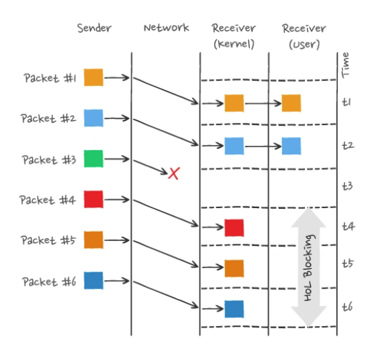
   >
   > HTTP/2 多个请求是跑在一个 TCP 连接中的，那么当 TCP 丢包时，整个 TCP 都要等待重传，那么就会阻塞该 TCP 连接中的所有请求，所以 HTTP/2 队头阻塞问题就是因为 TCP 协议导致的。

4. `网络迁移`需要重新建立 TCP 连接

   > 基于 TCP 传输协议的 HTTP 协议，由于是通过四元组（源 IP、源端口、目的 IP、目的端口）确定一条 TCP 连接。
   >
   > 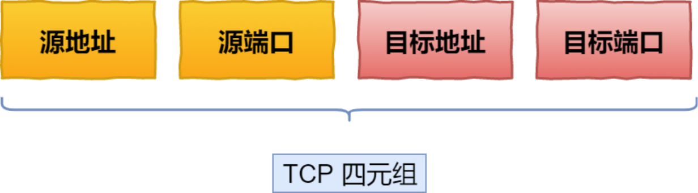
   >
   > 那么**当移动设备的网络从 4G 切换到 WIFI 时，意味着 IP 地址变化了，那么就必须要断开连接，然后重新建立 TCP 连接**。
   >
   > 而建立连接的过程包含 TCP 三次握手和 TLS 四次握手的时延，以及 TCP 慢启动的减速过程，给用户的感觉就是网络突然卡顿了一下，因此连接的迁移成本是很高的。
   >
   > `而UDP就没有这个问题`

   

## 3.21 TCP和UDP的区别和各自适用的场景


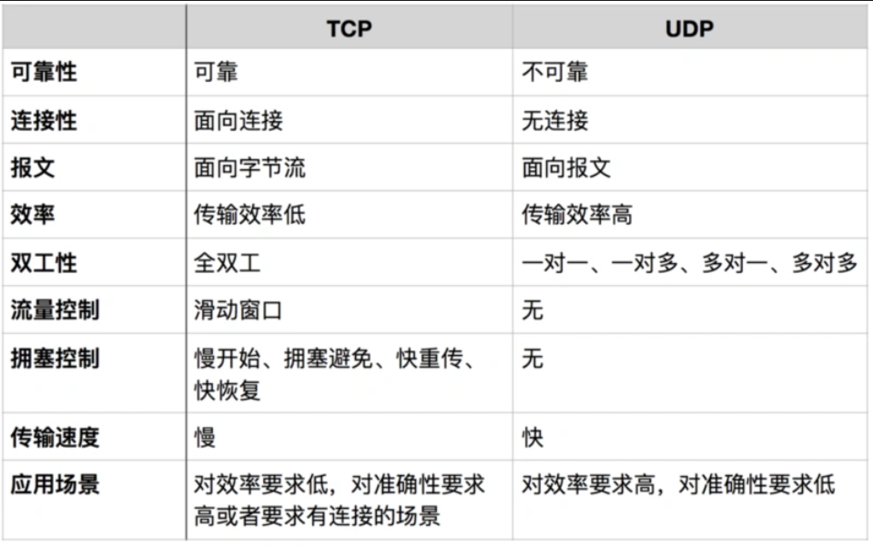

1. 连接

   > TCP是面向连接的传输层协议，即传输数据之前必须先建立好连接。
   >
   > UDP无连接。

2. 服务对象

   > TCP是点对点的两点间服务，即一条TCP连接只能有两个端点；
   >
   > UDP支持一对一，一对多，多对一，多对多的交互通信。

3. 可靠性

   > TCP是可靠交付：无差错，不丢失，不重复，按序到达。
   >
   > UDP是尽最大努力交付，不保证可靠交付。

4. 拥塞控制，流量控制

   > TCP有拥塞控制和流量控制保证数据传输的安全性。
   >
   > UDP没有拥塞控制，网络拥塞不会影响源主机的发送效率。

5. 报文长度

   > TCP是动态报文长度，即TCP报文长度是根据接收方的窗口大小和当前网络拥塞情况决定的。
   >
   > UDP面向报文，不合并，不拆分，保留上面传下来报文的边界。

6. 首部开销

   > TCP首部开销大，首部20个字节。
   >
   > UDP首部开销小，8字节。（源端口，目的端口，数据长度，校验和）

### TCP和UDP适用场景

从特点上我们已经知道，TCP 是可靠的但传输速度慢，UDP 是不可靠的但传输速度快。因此在选用具体协议通信时，应该根据通信数据的要求而决定。

若通信数据完整性需让位与通信实时性，则应该选用TCP 协议（如`文件传输、重要状态的更新`等）；反之，则使用 UDP 协议（如`视频传输、实时通信`等）。

## 3.22 Tcp和Udp报文头

### TCP报头结构

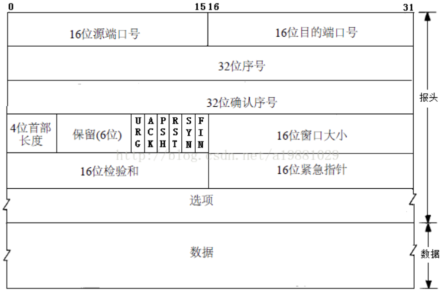

- 16位端口号，告知主机该报文段来自哪里（`源端口号`）以及传给哪个上层协议或应用程序（`目的端口`）的。TCP通信时，客户端通常使用系统自动选择的临时端口号，而服务器使用知名端口号。  

- 32位序号：一次TCP通信过程中某个传输方向上的字节流的`每个字节的编号`。

  第一个报文段中序号值被系统`初始化为某个随机值ISN`，那么该传输方向上后续的TCP报文段中序号值将被系统设置为ISN加上该报文段所携带的第一个字节在整个字节流的`偏移`。   `seq?`

- 32位确认号：用作对另一方发送的TCP报文段的响应。其值是收到的TCP报文段的序号值加1.假如主机A和主机B进行TCP通信，那么A发送的TCP报文段不仅携带自己的序号，还有对B发送来的TCP报文段的确认号。`ack?`

- 4位头部长度：标识该TCP头部有多少个32bit字（4字节），因为4位最大表示15所以TCP头部最长是60字节。   

- 6位标志位：

  > a）URG：表示紧急指针是否有效；
  >
  > b）ACK：表示确认号是否有效，携带ACK标志的数据报文段为确认报文段；
  >
  > c）PSH：提示接收端的应用程序应该立即从TCP接受缓冲区中读走数据，为接受后数据腾出空间；
  >
  > d）RST：表示要求对方重新建立连接，携带RST标志位的TCP报文段称为复位报文段；
  >
  > e）SYN： 表示请求建立一个连接，携带SYN标志的TCP报文段称为同步报文段；
  >
  > f）FIN：通知对方本端要关闭了，带FIN标志的TCP报文段称为结束报文段；

- 16位窗口大小：指的是接受通告窗口。它告诉接受端自己接受缓冲区还能容纳多少字节的数据。  ==滑动窗口控制==

- 16位校验和：由发送端填充，接收端对TCP报文段执行CRC算法检验报文段在传输中是否损坏，检验TCP头部和数据部分。这是TCP可靠传输的一个重要保障。  ==可靠性校验==

- 16位紧急指针：

  > 已经建立连接的C/S两端中,当某一端发生了比较重要且紧急的事情时,需要在不建立新连接,即在当前连接的基础上将该信息迅速通知到对端,但是在TCP数据传输中肯定要遵循先写入缓冲区的数据先被发送的规则。
  >
  > 对于紧急数据的发送,要在TCP数据包首部设置URG标记和紧急指针,以上是可以找到相应的位置,URG 标记是用来让TCP检查紧急指针紧急偏移的,没有的话,是不会检查的,要是有的话,就通过检查紧急指针偏移量来定位紧急数据在TCP 数据部分所处的位置
  >
  > 紧急数据字节号(urgSeq)=TCP报文序号(seq)+紧急指针(urgpoint)−1
  >
  > 一次只能设置一个字节的紧急数据

- 头部选项

  还有最后一个选项字段是可变长的可选信息，最多40字节。。。

### UDP首部

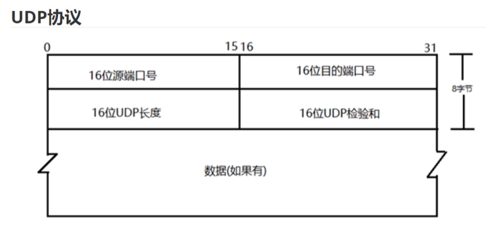

8字节。

源端口，目的端口，数据长度，校验和

每个占2字节

## 3.23 如何解决tcp通信中的粘包问题？

短链接tcp不会粘包

发送端为了将多个发往接收端的包，更加高效的的发给接收端，于是采用了优化算法（Nagle算法），将多次间隔较小、数据量较小的数据，合并成一个数据量大的数据块，然后进行封包。那么这样一来，接收端就必须使用高效科学的拆包机制来分辨这些数据。

TCP粘包就是指发送方发送的若干包数据到达接收方时粘成了一包，从接收缓冲区来看，后一包数据的头紧接着前一包数据的尾，出现粘包的原因是多方面的，可能是来自发送方，也可能是来自接收方。  ==（极端情况，不同格式的信息的一起发送，可能是发送方封到了一个包，也可能是接收方一起接收）==

#### **造成TCP粘包的原因**

1. 发送方原因

   > TCP默认使用Nagle算法（主要作用：减少网络中报文段的数量），而Nagle算法主要做两件事：
   >
   > 只有上一个分组得到确认，才会发送下一个分组
   >
   > 收集多个小分组，在一个确认到来时一起发送
   >
   > Nagle算法造成了发送方可能会出现粘包问题

2. 接收方原因

   > TCP接收到数据包时，并不会马上交到应用层进行处理，或者说应用层并不会立即处理。实际上，TCP将接收到的数据包保存在接收缓存里，然后应用程序主动从缓存读取收到的分组。这样一来，如果TCP接收数据包到缓存的速度大于应用程序从缓存中读取数据包的速度，多个包就会被缓存，应用程序就有可能读取到多个首尾相接粘到一起的包。

#### **什么时候需要处理粘包现象？**

1. 如果发送方发送的多组数据本来就是同一块数据的不同部分，比如说一个文件被分成多个部分发送，这时当然不需要处理粘包现象

2. 如果多个分组毫不相干，甚至是并列关系，那么这个时候就一定要处理粘包现象了

#### **处理粘包**

1. 发送方

   对于发送方造成的粘包问题，可以通过`关闭Nagle算法`来解决，使用TCP_NODELAY选项来关闭算法。

2. 接收方

   ==接收方没有办法==来处理粘包现象，只能将问题交给应用层来处理。

3. ==应用层==

   应用层的解决办法简单可行，不仅能解决接收方的粘包问题，还可以解决发送方的粘包问题。

   > 解决办法：循环处理，应用程序从接收缓存中读取分组时，读完一条数据，就应该循环读取下一条数据，直到所有数据都被处理完成，但是如何判断每条数据的长度呢？
   >
   > `格式化数据`：每条数据有固定的格式（开始符，结束符），这种方法简单易行，但是选择开始符和结束符时一定要确保每条数据的内部不包含开始符和结束符。（或者加包头）
   >
   > ==发送长度==：发送每条数据时，将数据的长度一并发送，例如规定数据的前4位是数据的长度，应用层在处理时可以根据长度来判断每个分组的开始和结束位置。 （可能是最优方案了）
   >
   > 还有，定长发送，尾部标记序列（不好，难以设计，而且需要每次检测是否为标记）等~

 

UDP则是面向消息传输的，是`有保护消息边界`的，接收方一次只接受一条独立的信息，所以不存在粘包问题。

## 3.24  如何用UDP实现可靠传输？

> 把 TCP 可靠传输的特性（序列号、确认应答、超时重传、流量控制、拥塞控制）在应用层实现一遍。
>
> <u>既然 TCP 天然支持可靠传输，为什么还需要基于 UDP 实现可靠传输呢？这不是重复造轮子吗？</u>
>
> 所以，我们要先弄清楚 TCP 协议有哪些痛点？而这些痛点是否可以在基于 UDP 协议实现的可靠传输协议中得到改进？
>
> > - 升级 TCP 的工作很困难；
> > - TCP 建立连接的延迟；
> > - TCP 存在队头阻塞问题；
> > - 网络迁移需要重新建立 TCP 连接；
>
> 现在市面上已经有基于 UDP 协议实现的可靠传输协议的成熟方案了，那就是 QUIC 协议，**QUIC 协议 TCP 的缺点都给解决了**，而且已经应用在了 HTTP/3。
>
> 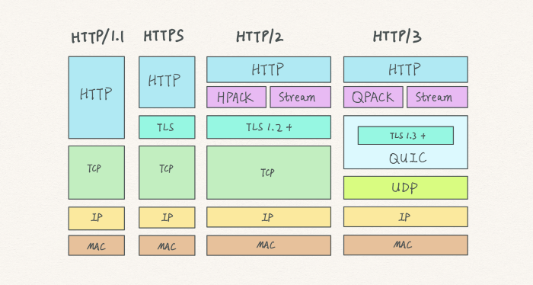

- UDP要想可靠，就要接收方收到UDP之后回复个确认包，发送方有个机制，收不到确认包就要重新发送，

  > <u>==确认重传机制==</u>

- 每个包有递增的序号，接收方发现中间丢了包就要发重传请求，

  > <u>==序号机制==</u>

- 当网络太差时候频繁丢包，防止越丢包越重传的恶性循环，要有个发送窗口的限制，发送窗口的大小根据网络传输情况调整，调整算法要有一定自适应性。

  > ==<u>窗口机制</u>==

- 恭喜你， 你在`应用层`重新实现了TCP！

## [如何基于 UDP 协议实现可靠传输？](https://xiaolincoding.com/network/3_tcp/quic.html#quic-是如何实现可靠传输的)

## 3.17 Tcp代码实现

### Socket

#### 字节序

本次可能采用大端或者小端字节序

网络字节序采用大端排序方式， BSDsocket提供了封装好的字节序转换接口

```c++
/*
    网络通信时，需要将主机字节序转换成网络字节序（大端），
    另外一段获取到数据以后根据情况将网络字节序转换成主机字节序。

    // 转换端口
    //short 16位 端口两个字节
    uint16_t htons(uint16_t hostshort);		// 主机字节序 - 网络字节序
    uint16_t ntohs(uint16_t netshort);		// 主机字节序 - 网络字节序

    // 转IP
    //long 32位 ip4个字节
    uint32_t htonl(uint32_t hostlong);		// 主机字节序 - 网络字节序
    uint32_t ntohl(uint32_t netlong);		// 主机字节序 - 网络字节序
*/

#include <stdio.h>
#include <arpa/inet.h>

int main() {
    // htons 转换端口
    unsigned short a = 0x0102;
    printf("a : %x\n", a);		//a : 102
    unsigned short b = htons(a); //b : 201
    printf("b : %x\n", b);

    printf("=======================\n");

    // htonl  转换IP
    char buf[4] = {192, 168, 1, 100};
    int num = *(int *)buf;
    int sum = htonl(num);
    unsigned char *p = (char *)&sum;

    printf("%d %d %d %d\n", *p, *(p+1), *(p+2), *(p+3));

    printf("=======================\n");

    // ntohl
    unsigned char buf1[4] = {1, 1, 168, 192};
    int num1 = *(int *)buf1;
    int sum1 = ntohl(num1);
    unsigned char *p1 = (unsigned char *)&sum1;
    printf("%d %d %d %d\n", *p1, *(p1+1), *(p1+2), *(p1+3));
    
     // ntohs


    return 0;
}
```


### [建立TCP 服务器的各个系统调用过程是怎样的？](https://interviewguide.cn/#/Doc/Knowledge/计算机网络/计算机网络?id=83、建立tcp服务器的各个系统调用过程是怎样的？)

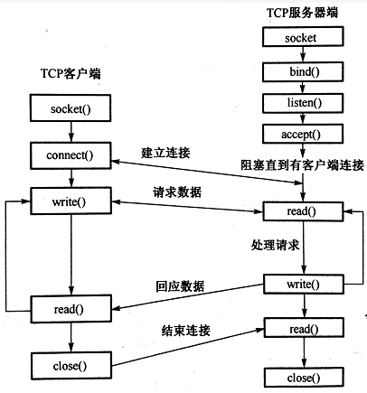

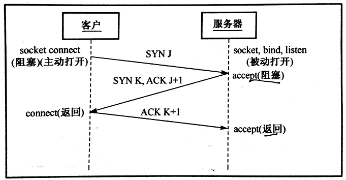

- `服务器`：

  - 创建socket -> int socket(int domain, int type, int protocol);  

    > `创建一个用于监听的套接字`
    >
    > - 监听：监听有客户端的连接
    >
    > - 套接字：这个套接字实际上就是一个`文件描述符`

    - domain：协议域，决定了socket的地址类型，IPv4为AF_INET。
    - type：指定socket类型，SOCK_STREAM为TCP连接。
    - protocol：指定协议。IPPROTO_TCP表示TCP协议，为0时自动选择type默认协议。

  - 绑定socket和端口号 -> int bind(int sockfd, const struct sockaddr *addr, socklen_t addrlen);

    > 将这个监听文件描述符和本地的ip和端口绑定（ip和端口就是服务器的地址信息）
    >
    > - 客户端连接服务器的时候使用的就是这个ip和端口

    - sockfd：socket返回的套接字描述符，类似于文件描述符fd。
    - addr：有个sockaddr类型数据的指针，指向的是被绑定结构变量。 （传出参数，记录连接成功后客户端的地址信息 ip 和端口）
    - addrlen：地址长度。
    - 返回值int: 用于通信的文件描述符

    ```C++
        // IPv4的sockaddr地址结构
        struct sockaddr_in {
            sa_family_t sin_family;    	// 协议类型，AF_INET
            in_port_t sin_port;    	    // 端口号
            struct in_addr sin_addr;    // IP地址
        };
        struct in_addr {
            uint32_t s_addr;
        }
    ```

  - 监听端口号 -> int listen(int sockfd, int backlog);

    > 设置监听，监听的fd开始工作

    - sockfd：要监听的sock描述字。
    - backlog：socket可以排队的最大连接数。

  - 接收用户请求 -> int accept(int sockfd, struct sockaddr *addr, socklen_t *addrlen);

    > 阻塞等待 当有客户端发起连接 接触阻塞 接受客户端的连接 会得到一个和客户端通信的套接字
    >
    > - `新的文件描述符 原来的套接字只负责监听`

    - sockfd：服务器socket描述字。
    - addr：指向地址结构指针。
    - addrlen：协议地址长度。
    - 注：一旦accept某个客户机请求成功将返回一个全新的描述符用于标识具体客户的TCP连接。

  - 从socket中读取字符 -> ssize_t read(int fd, void *buf, size_t count);

    > 通信
    >
    > - 接受数据
    > - 发送数据

    - fd：连接描述字。
    - buf：缓冲区buf。
    - count：缓冲区长度。
    - 注：大于0表示读取的字节数，返回0表示文件读取结束，小于0表示发生错误。

  - 关闭socket -> int close(int fd);

    > 通信结束 断开连接

    - fd：accept返回的连接描述字，每个连接有一个，生命周期为连接周期。
    - 注：sockfd是监听描述字，一个服务器只有一个，用于监听是否有连接；fd是连接描述字，用于每个连接的操作。

- `客户机`：

  - 创建socket -> int socket(int domain, int type, int protocol);

    > 创建一个用于通信的套接字（fd）

  - 连接指定计算机 -> int connect(int sockfd, struct sockaddr* addr, socklen_t addrlen);

    > 连接服务器 需要指定连接的服务器的ip和端口

    - sockfd客户端的sock描述字。
    - addr：服务器的地址。
    - addrlen：socket地址长度。

  - 向socket写入信息 -> ssize_t write(int fd, const void *buf, size_t count);

    > 通信
    >
    > - 接受数据
    > - 发送数据

    - fd、buf、count：同read中意义。
    - 大于0表示写了部分或全部数据，小于0表示出错。

  - 关闭oscket -> int close(int fd);

    > 通信结束 断开连接

    - fd：同服务器端fd。
  
  ```c++
  // TCP 通信的服务器端
  #include <stdio.h>
  #include <arpa/inet.h>
  #include <unistd.h>
  #include <string.h>
  #include <stdlib.h>
  
  int main() {
  
      // 1.创建socket(用于监听的套接字)
      //p1:协议域，决定了socket的地址类型，IPv4为AF_INET。
      //p2:指定socket类型，SOCK_STREAM为TCP连接。
      //p3:指定协议。IPPROTO_TCP表示TCP协议，为0时自动选择type默认协议。
      int lfd = socket(AF_INET, SOCK_STREAM, 0);
  
      if(lfd == -1) {
          perror("socket");
          exit(-1);
      }
  
      // 2.绑定
      struct sockaddr_in saddr; //IPv4的sockaddr地址结构
      saddr.sin_family = AF_INET;  // 协议类型，AF_INET
      // inet_pton(AF_INET, "192.168.193.128", saddr.sin_addr.s_addr);
      saddr.sin_addr.s_addr = INADDR_ANY;  // 0.0.0.0 ip地址
      saddr.sin_port = htons(9999);		//端口号
      int ret = bind(lfd, (struct sockaddr *)&saddr, sizeof(saddr));
      if(ret == -1) {
          perror("bind");
          exit(-1);
      }
  
      // 3.监听
      ret = listen(lfd, 8); //最大连接数为8
      if(ret == -1) {
          perror("listen");
          exit(-1);
      }
  
      // 4.接收客户端连接
      struct sockaddr_in clientaddr;
      int len = sizeof(clientaddr);
      int cfd = accept(lfd, (struct sockaddr *)&clientaddr, &len);
      
      if(cfd == -1) {  //client 文件描述符 client_fd
          perror("accept");
          exit(-1);
      }
  
      // 输出客户端的信息
      char clientIP[16];
      inet_ntop(AF_INET, &clientaddr.sin_addr.s_addr, clientIP, sizeof(clientIP));
      unsigned short clientPort = ntohs(clientaddr.sin_port);
      printf("client ip is %s, port is %d\n", clientIP, clientPort);
  
      // 5.通信
      char recvBuf[1024] = {0};
      while(1) {    
          // 获取客户端的数据
          int num = read(cfd, recvBuf, sizeof(recvBuf));
          if(num == -1) {
              perror("read");
              exit(-1);
          } else if(num > 0) {
              printf("recv client data : %s\n", recvBuf);
          } else if(num == 0) {
              // 表示客户端断开连接
              printf("clinet closed...");
              break;
          }
  
          char * data = "hello,i am server";
          // 给客户端发送数据
          write(cfd, data, strlen(data));
      }
     
      // 关闭文件描述符
      close(cfd);
      close(lfd);
  
      return 0;
  }
  
  // TCP通信的客户端
  #include <stdio.h>
  #include <arpa/inet.h>
  #include <unistd.h>
  #include <string.h>
  #include <stdlib.h>
  
  int main() {
      // 1.创建套接字
      int fd = socket(AF_INET, SOCK_STREAM, 0);
      if(fd == -1) {
          perror("socket");
          exit(-1);
      }
      
      // 2.连接服务器端
      struct sockaddr_in serveraddr;
      serveraddr.sin_family = AF_INET;
      inet_pton(AF_INET, "192.168.33.134", &serveraddr.sin_addr.s_addr);
      serveraddr.sin_port = htons(9999);
      int ret = connect(fd, (struct sockaddr *)&serveraddr, sizeof(serveraddr));
  
      if(ret == -1) {
          perror("connect");
          exit(-1);
      }
  
      // 3. 通信
      char recvBuf[1024] = {0};
      while(1) {
          char * data = "hello,i am client";
          // 给客户端发送数据
          write(fd, data , strlen(data));
  
          sleep(1);
          
          int len = read(fd, recvBuf, sizeof(recvBuf));
          if(len == -1) {
              perror("read");
              exit(-1);
          } else if(len > 0) {
              printf("recv server data : %s\n", recvBuf);
          } else if(len == 0) {
              // 表示服务器端断开连接
              printf("server closed...");
              break;
          }
      }
  
      // 关闭连接
      close(fd);
      return 0;
  }
  ```

### TCP通信并发

要实现tcp通信服务器处理并发的任务，使用多线程或者多进程来解决

思路：

1. 一个父进程 多个子进程
2. `父进程负责等待并接受客户端的连接`
3. 子进程：完成通信 `接受一个客户端连接 就创建一个子进程用于通信`

#### client.c

```c++
// TCP通信的客户端
#include <stdio.h>
#include <arpa/inet.h>
#include <unistd.h>
#include <string.h>
#include <stdlib.h>

int main() {
    // 1.创建套接字
    int fd = socket(AF_INET, SOCK_STREAM, 0);
    if(fd == -1) {
        perror("socket");
        exit(-1);
    }

    // 2.连接服务器端
    struct sockaddr_in serveraddr;
    serveraddr.sin_family = AF_INET;
    inet_pton(AF_INET, "192.168.193.128", &serveraddr.sin_addr.s_addr);
    serveraddr.sin_port = htons(9999);
    int ret = connect(fd, (struct sockaddr *)&serveraddr, sizeof(serveraddr));

    if(ret == -1) {
        perror("connect");
        exit(-1);
    }
    
    // 3. 通信
    char recvBuf[1024];
    int i = 0;
    while(1) {
        sprintf(recvBuf, "data : %d\n", i++);  
        // 给服务器端发送数据
        write(fd, recvBuf, strlen(recvBuf)+1);

        int len = read(fd, recvBuf, sizeof(recvBuf));
        if(len == -1) {
            perror("read");
            exit(-1);
        } else if(len > 0) {
            printf("recv server : %s\n", recvBuf);
        } else if(len == 0) {
            // 表示服务器端断开连接
            printf("server closed...");
            break;
        }
        sleep(1);
    }
    // 关闭连接
    close(fd);

    return 0;
}
```

#### server_process.c

```c++
#include <stdio.h>
#include <arpa/inet.h>
#include <unistd.h>
#include <stdlib.h>
#include <string.h>
#include <signal.h>
#include <wait.h>
#include <errno.h>

void recyleChild(int arg) {
    while(1) {
        int ret = waitpid(-1, NULL, WNOHANG);  //设置不阻塞
        if(ret == -1) {
            // 所有的子进程都回收了
            break;
        }else if(ret == 0) {
            // 还有子进程活着
            break;
        } else if(ret > 0){
            // 被回收了
            printf("子进程 %d 被回收了\n", ret);
        }
    }
}

int main() {
    struct sigaction act;
    act.sa_flags = 0;
    sigemptyset(&act.sa_mask);
    act.sa_handler = recyleChild;
    // 注册信号捕捉
    sigaction(SIGCHLD, &act, NULL);
    // 创建socket
    int lfd = socket(PF_INET, SOCK_STREAM, 0);
    if(lfd == -1){
        perror("socket");
        exit(-1);
    }

    struct sockaddr_in saddr;
    saddr.sin_family = AF_INET;
    saddr.sin_port = htons(9999);
    saddr.sin_addr.s_addr = INADDR_ANY;

    // 绑定
    int ret = bind(lfd,(struct sockaddr *)&saddr, sizeof(saddr));
    if(ret == -1) {
        perror("bind");
        exit(-1);
    }
    // 监听
    ret = listen(lfd, 128);
    if(ret == -1) {
        perror("listen");
        exit(-1);
    }

    // 不断循环等待客户端连接
    while(1) {
        struct sockaddr_in cliaddr;
        int len = sizeof(cliaddr);
        // 接受连接
        int cfd = accept(lfd, (struct sockaddr*)&cliaddr, &len);
        if(cfd == -1) {
            if(errno == EINTR) {
                continue;    //没有接入 while 跳过 继续循环
            }
            perror("accept");
            exit(-1);
        }

        // 每一个连接进来，创建一个子进程跟客户端通信
        pid_t pid = fork();
        if(pid == 0) {
            // 子进程
            // 获取客户端的信息
            char cliIp[16];
            inet_ntop(AF_INET, &cliaddr.sin_addr.s_addr, cliIp, sizeof(cliIp));
            unsigned short cliPort = ntohs(cliaddr.sin_port);
            printf("client ip is : %s, prot is %d\n", cliIp, cliPort);

            // 接收客户端发来的数据
            char recvBuf[1024];
            while(1) {
                int len = read(cfd, &recvBuf, sizeof(recvBuf));

                if(len == -1) {
                    perror("read");
                    exit(-1);
                }else if(len > 0) {
                    printf("recv client : %s\n", recvBuf);
                } else if(len == 0) {
                    printf("client closed....\n");
                    break;
                }
                write(cfd, recvBuf, strlen(recvBuf) + 1);
            }
            close(cfd);
            exit(0);    // 退出当前子进程
        }

    }
    close(lfd);
    return 0;
}
```

#### server_thread.c

```c++
#include <stdio.h>
#include <arpa/inet.h>
#include <unistd.h>
#include <stdlib.h>
#include <string.h>
#include <pthread.h>

struct sockInfo {
    int fd; // 通信的文件描述符
    struct sockaddr_in addr;
    pthread_t tid;  // 线程号
};

struct sockInfo sockinfos[128];

void * working(void * arg) {
    // 子线程和客户端通信   cfd 客户端的信息 线程号
    // 获取客户端的信息
    struct sockInfo * pinfo = (struct sockInfo *)arg;

    char cliIp[16];
    inet_ntop(AF_INET, &pinfo->addr.sin_addr.s_addr, cliIp, sizeof(cliIp));
    unsigned short cliPort = ntohs(pinfo->addr.sin_port);
    printf("client ip is : %s, prot is %d\n", cliIp, cliPort);

    // 接收客户端发来的数据
    char recvBuf[1024];
    while(1) {
        int len = read(pinfo->fd, &recvBuf, sizeof(recvBuf));

        if(len == -1) {
            perror("read");
            exit(-1);
        }else if(len > 0) {
            printf("recv client : %s\n", recvBuf);
        } else if(len == 0) {
            printf("client closed....\n");
            break;
        }
        write(pinfo->fd, recvBuf, strlen(recvBuf) + 1);
    }
    close(pinfo->fd);
    return NULL;
}

int main() {
    // 创建socket
    int lfd = socket(PF_INET, SOCK_STREAM, 0);
    if(lfd == -1){
        perror("socket");
        exit(-1);
    }

    struct sockaddr_in saddr;
    saddr.sin_family = AF_INET;
    saddr.sin_port = htons(9999);
    saddr.sin_addr.s_addr = INADDR_ANY;

    // 绑定
    int ret = bind(lfd,(struct sockaddr *)&saddr, sizeof(saddr));
    if(ret == -1) {
        perror("bind");
        exit(-1);
    }

    // 监听
    ret = listen(lfd, 128);
    if(ret == -1) {
        perror("listen");
        exit(-1);
    }

    // 初始化数据
    int max = sizeof(sockinfos) / sizeof(sockinfos[0]);
    for(int i = 0; i < max; i++) {
        bzero(&sockinfos[i], sizeof(sockinfos[i]));
        sockinfos[i].fd = -1;
        sockinfos[i].tid = -1;
    }

    // 循环等待客户端连接，一旦一个客户端连接进来，就创建一个子线程进行通信
    while(1) {
        struct sockaddr_in cliaddr;
        int len = sizeof(cliaddr);
        // 接受连接
        int cfd = accept(lfd, (struct sockaddr*)&cliaddr, &len);

        struct sockInfo * pinfo;
        for(int i = 0; i < max; i++) {
            // 从这个数组中找到一个可以用的sockInfo元素
            if(sockinfos[i].fd == -1) {
                pinfo = &sockinfos[i];
                break;
            }
            if(i == max - 1) {
                sleep(1);
                i--;
            }
        }

        pinfo->fd = cfd;
        memcpy(&pinfo->addr, &cliaddr, len);

        // 创建子线程
        pthread_create(&pinfo->tid, NULL, working, pinfo);
        pthread_detach(pinfo->tid);  //join是阻塞的 感觉很少用
    }

    close(lfd);
    return 0;
}

```

## 3.18 IO多路复用

### 1. I/O多路复用（I/O多路转接）

<u>I/O 多路复用使得程序能同时监听多个文件描述符，能够提高程序的性能，</u>

Linux 下实现 I/O 多路复用的系统调用主要有 `select、poll 和 epoll`。

### 2. select

> 主旨思想：
>
> 1. 首先要构造一个关于文件描述符的列表，将要监听的文件描述符添加到该列表中。
>
> 2. 调用一个系统函数，监听该列表中的文件描述符，直到这些描述符中的一个或者多个进行I/O操作时，该函数才返回。
>
>    a.这个函数是阻塞
>
>    b.函数对文件描述符的检测的操作是由内核完成的
>
> 3. 在返回时，它会告诉进程有多少（哪些）描述符要进行I/O操作。

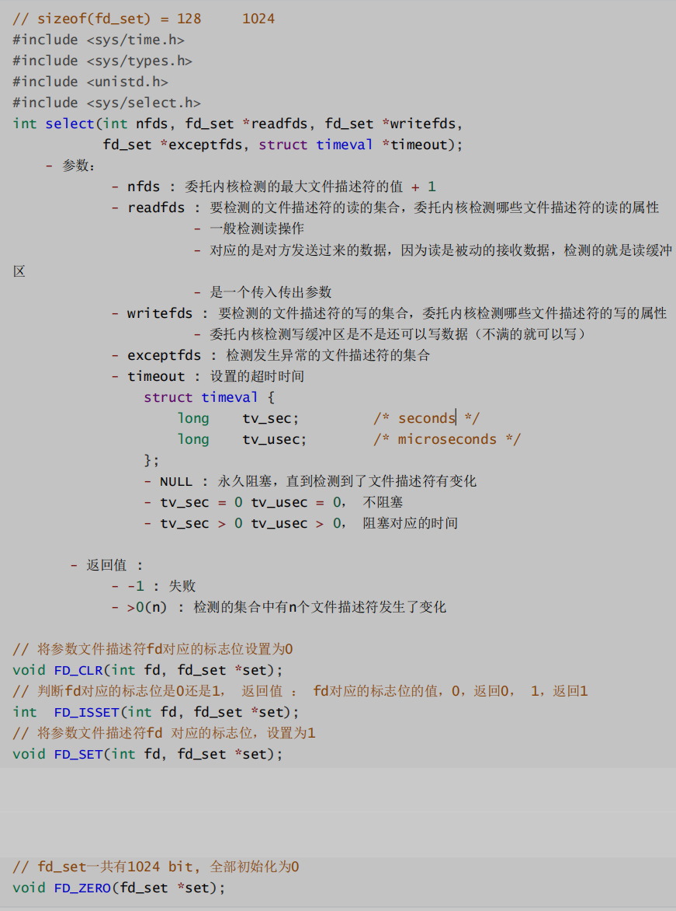

#### select工作过程分析

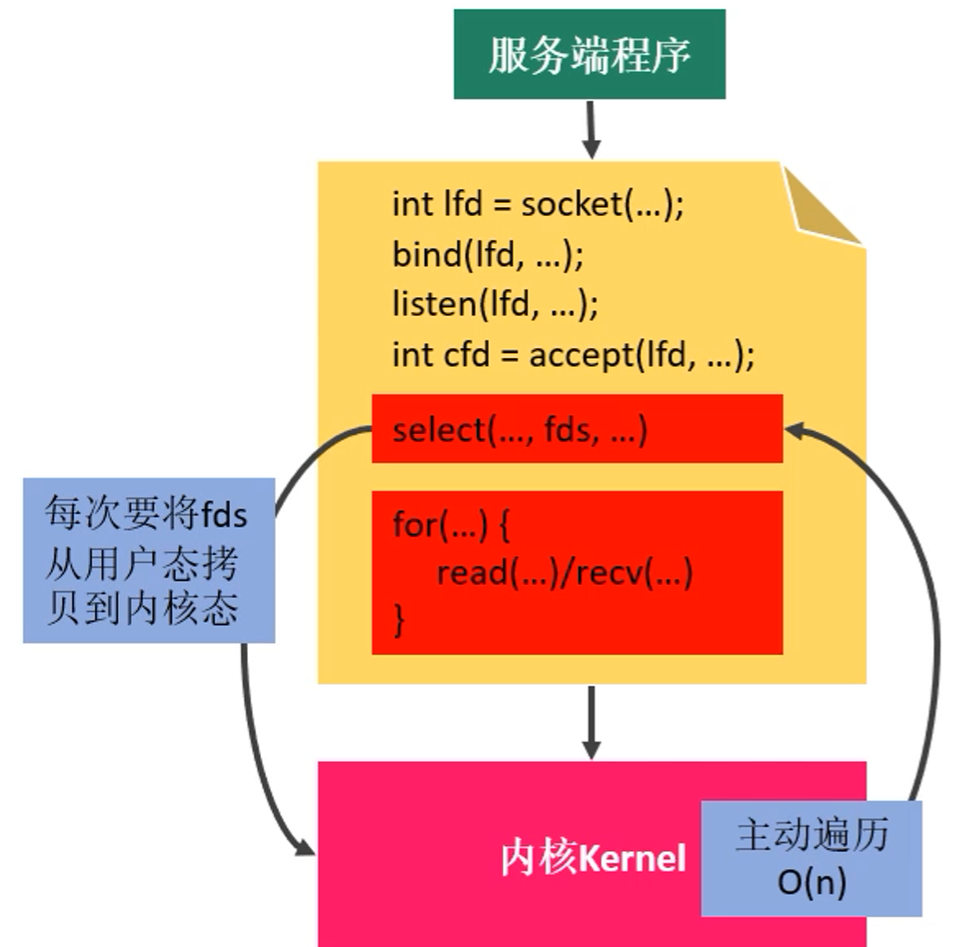

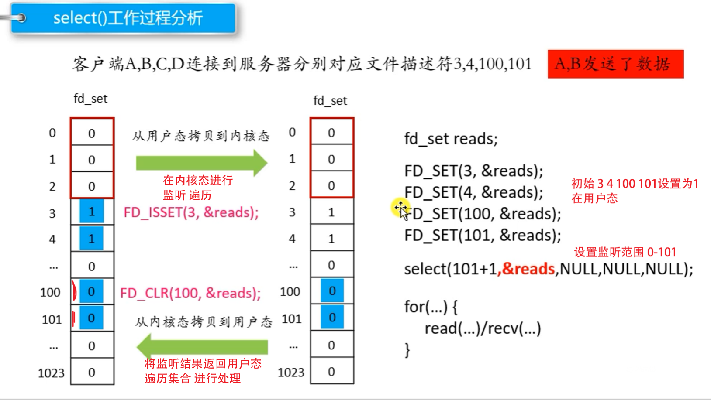

#### select缺点

> 1. 每次调用select，都需要把fd集合从用户态拷贝到内核态，这个开销在fd很多时会很大
> 2. 同时每次调用select都需要在内核遍历传递进来的所有fd，这个开销在fd很多的时候也会很大
> 3. select支持的文件描述符数量太少了，默认是1024
> 4. fds集合不能重用，每次都需要重置


#### 简要应用代码

```c++
#include <stdio.h>
#include <arpa/inet.h>
#include <unistd.h>
#include <stdlib.h>
#include <string.h>
#include <sys/select.h>

int main() {

    // 创建socket
    int lfd = socket(PF_INET, SOCK_STREAM, 0);
    struct sockaddr_in saddr;
    saddr.sin_port = htons(9999);
    saddr.sin_family = AF_INET;
    saddr.sin_addr.s_addr = INADDR_ANY;

    // 绑定
    bind(lfd, (struct sockaddr *)&saddr, sizeof(saddr));

    // 监听
    listen(lfd, 8);

    // 创建一个fd_set的集合，存放的是需要检测的文件描述符
    fd_set rdset, tmp;
    FD_ZERO(&rdset);  //全部初始化 置为0
    FD_SET(lfd, &rdset); //监听的文件描述符也用select监听
    int maxfd = lfd;  //监听文件描述符的最大长度

    while(1) {
        tmp = rdset;
        // 调用select系统函数，让内核帮检测哪些文件描述符有数据
        int ret = select(maxfd + 1, &tmp, NULL, NULL, NULL);
        if(ret == -1) {
            perror("select");
            exit(-1);
        } else if(ret == 0) { //这时 没有检测到
            continue;
        } else if(ret > 0) {
            // 说明检测到了有文件描述符的对应的缓冲区的数据发生了改变
            if(FD_ISSET(lfd, &tmp)) {
                // 表示有新的客户端连接进来了
                struct sockaddr_in cliaddr;
                int len = sizeof(cliaddr);
                int cfd = accept(lfd, (struct sockaddr *)&cliaddr, &len);

                // 将新的文件描述符加入到集合中
                FD_SET(cfd, &rdset);

                // 更新最大的文件描述符
                maxfd = maxfd > cfd ? maxfd : cfd;
            }
            for(int i = lfd + 1; i <= maxfd; i++) {  //遍历所有 长度范围内的fd lfd监听在最前
                if(FD_ISSET(i, &tmp)) {
                    // 说明这个文件描述符对应的客户端发来了数据
                    char buf[1024] = {0};
                    int len = read(i, buf, sizeof(buf));
                    if(len == -1) {
                        perror("read");
                        exit(-1);
                    } else if(len == 0) {
                        printf("client closed...\n");
                        close(i);
                        FD_CLR(i, &rdset);
                    } else if(len > 0) {
                        printf("read buf = %s\n", buf);
                        write(i, buf, strlen(buf) + 1);
                    }
                }
            }

        }
    }
    close(lfd);
    return 0;
}
```


### **3. poll**

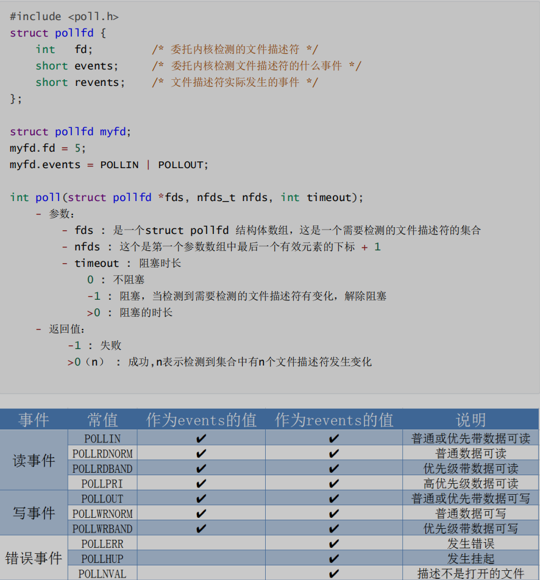

### **4. epoll**

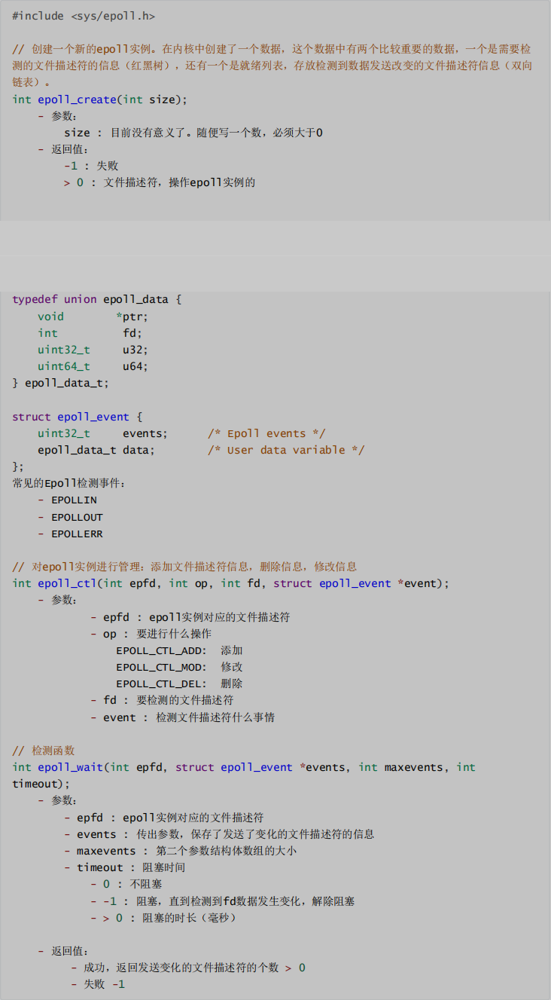

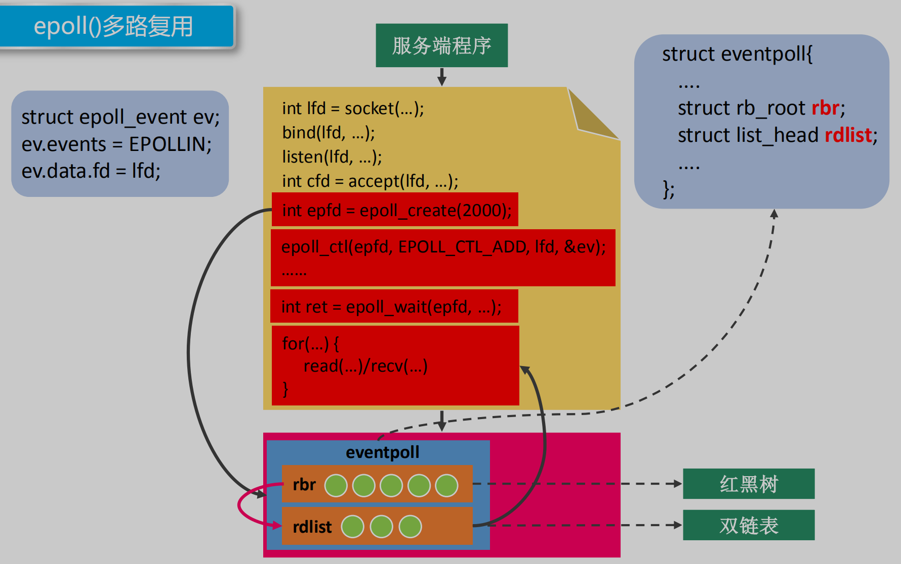

<u>rbr：存储所有文件描述符 红黑树的遍历和添加很快</u>

<u>rdlist：存储有数据到达，响应了的文件描述符</u>

#### Epoll 的工作模式：

> 理解：缓冲区的读写可以理解为数据的转移？读完 读缓冲区的数据就没了

- LT 模式 （水平触发）

  假设委托内核检测读事件 -> 检测fd的读缓冲区

  读缓冲区有数据 - > epoll检测到了会给用户通知

  ​	a.用户不读数据，数据一直在缓冲区，epoll 会一直通知

  ​	b.用户只读了一部分数据，epoll会通知

  ​	c.缓冲区的数据读完了，不通知

  > LT（level - triggered）是缺省的工作方式，并且同时支持 block 和 no-block socket。在这
  >
  > 种做法中，内核告诉你一个文件描述符是否就绪了，然后你可以对这个就绪的 fd 进行 IO 操
  >
  > 作。如果你不作任何操作，内核还是会继续通知你的。

- ET 模式（边沿触发）

  > 边沿的含义：状态的变化
>
  > `socket的接收缓冲区状态变化时触发读事件`
> `socket的发送缓冲区状态变化时触发写事件`
  >
> 1. 从不可读变为可读：从接收缓冲区为空，到接收到数据后触发一次
  >
> 2. 从可读变为不可读：断开连接，从可读变为不可读触发一次
  >
> 3. 从不可写变为可写：从accept建立连接触发一次
  >
  > 4. 从可写变为不可写：断开连接，从可写变为不可写触发一次

  假设委托内核检测读事件 -> 检测fd的读缓冲区

  读缓冲区有数据 - > epoll检测到了会给用户通知

  ​	a.用户不读数据，数据一致在缓冲区中，epoll下次检测的时候就不通知了

  ​	b.用户只读了一部分数据，epoll不通知

  ​	c.缓冲区的数据读完了，不通知

  > ET（edge - triggered）是高速工作方式，只支持 no-block socket。在这种模式下，当描述符从未就绪变为就绪时，内核通过epoll告诉你。然后它会假设你知道文件描述符已经就绪，并且不会再为那个文件描述符发送更多的就绪通知，直到你做了某些操作导致那个文件描述符不再为就绪状态了。但是请注意，如果一直不对这个 fd 作 IO 操作（从而导致它再次变成未就绪），内核不会发送更多的通知<u>（`only once`）</u>。
  >
  > ET 模式在很大程度上减少了 epoll 事件被重复触发的次数，因此效率要比 LT 模式高。epoll工作在 ET 模式的时候，必须使用非阻塞套接口，<u>以避免由于一个文件句柄的阻塞读/阻塞写操作把处理多个文件描述符的任务饿死。</u>
  >
  > > 理解一下：当消息到达 比如8个字节 如果我只读取了两个字节 并没有读完 但是有新消息到达时 epoll不会再进行通知 因此et的应用场景应该是 消息达到 一次读完数据 但是read读取数据 读完的话 后续没有数据又会阻塞在那里 因此 需要设置为非阻塞模式

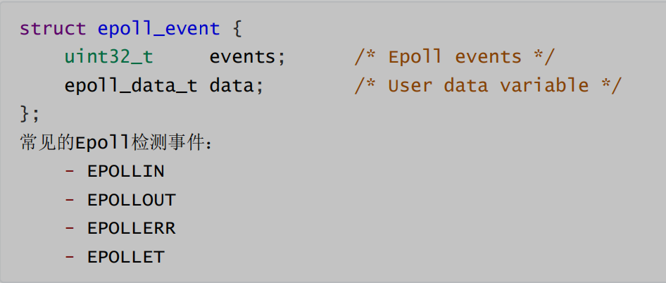

#### 简要应用代码

```c++
#include <stdio.h>
#include <arpa/inet.h>
#include <unistd.h>
#include <stdlib.h>
#include <string.h>
#include <sys/epoll.h>

int main() {
    // 创建socket
    int lfd = socket(PF_INET, SOCK_STREAM, 0);
    struct sockaddr_in saddr;
    saddr.sin_port = htons(9999);
    saddr.sin_family = AF_INET;
    saddr.sin_addr.s_addr = INADDR_ANY;
    // 绑定
    bind(lfd, (struct sockaddr *)&saddr, sizeof(saddr));
    // 监听
    listen(lfd, 8);
    // 调用epoll_create()创建一个epoll实例
    int epfd = epoll_create(100);
    // 将监听的文件描述符相关的检测信息添加到epoll实例中
    struct epoll_event epev;
    epev.events = EPOLLIN; //监听读
    epev.data.fd = lfd;  
    epoll_ctl(epfd, EPOLL_CTL_ADD, lfd, &epev);
    
    //用于接受检测到的数据
    struct epoll_event epevs[1024];
    while(1) {
        int ret = epoll_wait(epfd, epevs, 1024, -1); // -1阻塞
        if(ret == -1) {
            perror("epoll_wait");
            exit(-1);
        }
        printf("ret = %d\n", ret); //发生改变的个数
        for(int i = 0; i < ret; i++) {
            int curfd = epevs[i].data.fd;
            if(curfd == lfd) {
                // 监听的文件描述符有数据达到，有客户端连接
                struct sockaddr_in cliaddr;
                int len = sizeof(cliaddr);
                int cfd = accept(lfd, (struct sockaddr *)&cliaddr, &len);
                epev.events = EPOLLIN;
                epev.data.fd = cfd;
                epoll_ctl(epfd, EPOLL_CTL_ADD, cfd, &epev);  //将客户端加入监听
            } else {
                if(epevs[i].events & EPOLLOUT) {
                    continue;
                }   
                // 有数据到达，需要通信
                char buf[1024] = {0};
                int len = read(curfd, buf, sizeof(buf));
                if(len == -1) {
                    perror("read");
                    exit(-1);
                } else if(len == 0) {
                    printf("client closed...\n");
                    epoll_ctl(epfd, EPOLL_CTL_DEL, curfd, NULL);
                    close(curfd);
                } else if(len > 0) {
                    printf("read buf = %s\n", buf);
                    write(curfd, buf, strlen(buf) + 1);
                }
            }
        }
    }
    close(lfd);
    close(epfd);
    return 0;
}
```

## 3.19 UDP代码实现

### UDP通信

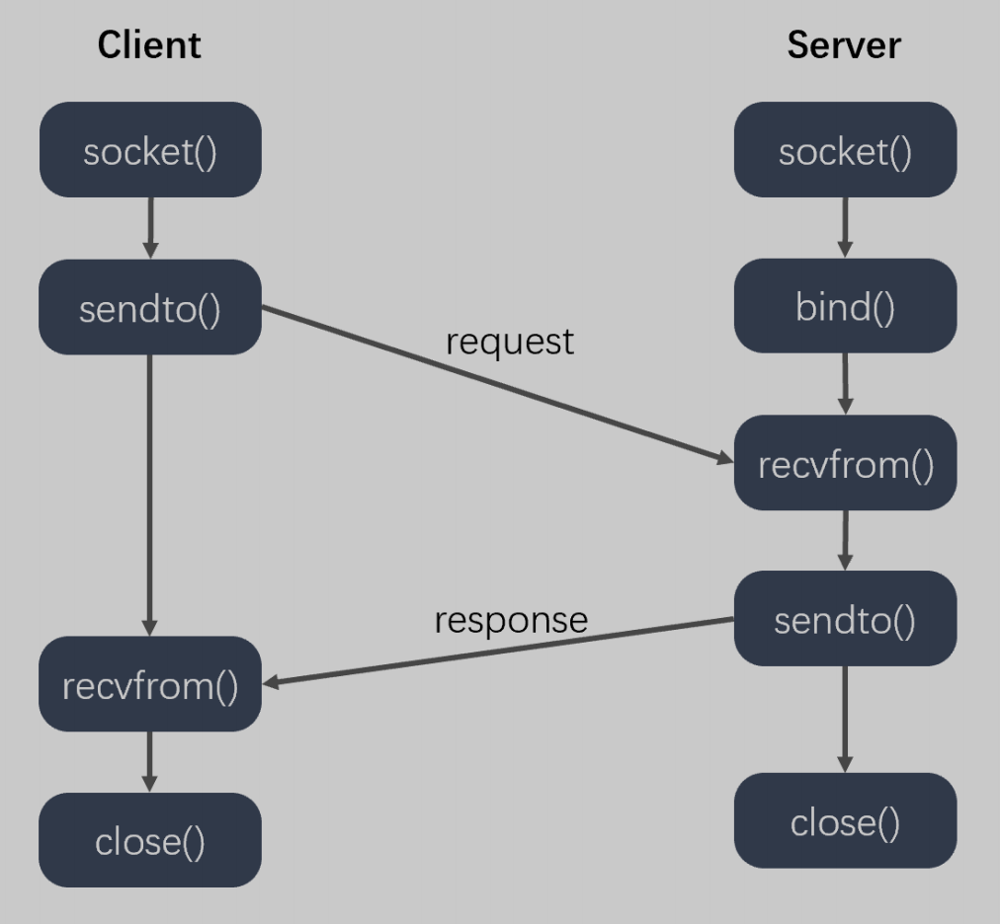

```c++
#include <sys/types.h> 
#include <sys/socket.h> 
ssize_t sendto(int sockfd, const void *buf, size_t len, int flags,
               const struct sockaddr *dest_addr, socklen_t addrlen); 
    - 参数：
    - sockfd : 通信的fd 
    - buf : 要发送的数据 
    - len : 发送数据的长度 
    - flags : 0 
    - dest_addr : 通信的另外一端的地址信息 
    - addrlen : 地址的内存大小 
    
ssize_t recvfrom(int sockfd, void *buf, size_t len, int flags, 
                 struct sockaddr *src_addr, socklen_t *addrlen); 
    - 参数：
    - sockfd : 通信的fd 
    - buf : 接收数据的数组 
    - len : 数组的大小
    - flags : 0 
    - src_addr : 用来保存另外一端的地址信息，不需要可以指定为NULL 
    - addrlen : 地址的内存大小
```

### 广播

向子网中多台计算机发送消息，并且子网中所有的计算机都可以接收到发送方发送的消息，每个广播消息都包含一个特殊的IP地址，这个IP中子网内主机标志部分的二进制全部为1。

​	a. 只能在`局域网`中使用。

​	b. <u>客户端需要绑定服务器广播使用的端口，才可以接收到广播消息</u>。

```c++
// 设置广播属性的函数 
int setsockopt(int sockfd, int level, int optname,const void *optval, socklen_t optlen); 
    - sockfd : 文件描述符 
    - level : SOL_SOCKET 
    - optname : SO_BROADCAST 
    - optval : int类型的值，为1表示允许广播 
    - optlen : optval的大小
```

### 组播(多播)

单播地址标识单个 IP 接口，广播地址标识某个子网的所有 IP 接口，多播地址标识一组 IP 接口。

单播和广播是寻址方案的两个极端（要么单个要么全部），多播则意在两者之间提供一种折中方案。多播数据报只应该由对它感兴趣的接口接收，也就是说由运行相应多播会话应用系统的主机上的接口接收。另外，广播一般局限于局域网内使用，而多播则既可以用于局域网，也可以跨广域网使用。

​	a.组播既可以用于局域网，也`可以用于广域网`

​	b.<u>客户端需要加入多播组，才能接收到多播的数据</u>

#### 组播地址

IP 多播通信必须依赖于 IP 多播地址，在 IPv4 中它的范围从 224.0.0.0 到 239.255.255.255 ，并被划分为局部链接多播地址、预留多播地址和管理权限多播地址三类。

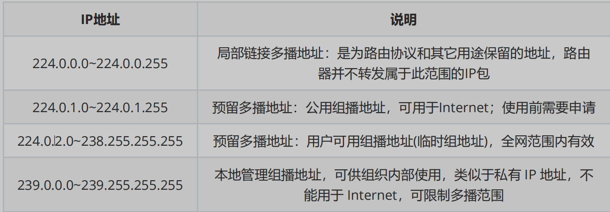

#### 设置组播

```c++
int setsockopt(int sockfd, int level, int optname,const void *optval, socklen_t optlen); 
    // 服务器设置多播的信息，外出接口\- level : IPPROTO_IP 
    - optname : IP_MULTICAST_IF 
    - optval : struct in_addr 
    
    // 客户端加入到多播组： 
    - level : IPPROTO_IP 
    - optname : IP_ADD_MEMBERSHIP 
    - optval : struct ip_mreq 

struct ip_mreq { 
    /* IP multicast address of group. */ 
	struct in_addr imr_multiaddr; // 组播的IP地址 
    /* Local IP address of interface. */ 
	struct in_addr imr_interface; // 本地的IP地址 
};

typedef uint32_t in_addr_t; 
struct in_addr { 
    in_addr_t s_addr; 
};
```

## **3.20 本地套接字**


本地套接字的作用：<u>本地的`进程`间通信</u>

> 有关系的进程间的通信
>
> 没有关系的进程间的通信

本地套接字实现流程和网络套接字类似，<u>一般采用`TCP`的通信流程。</u>

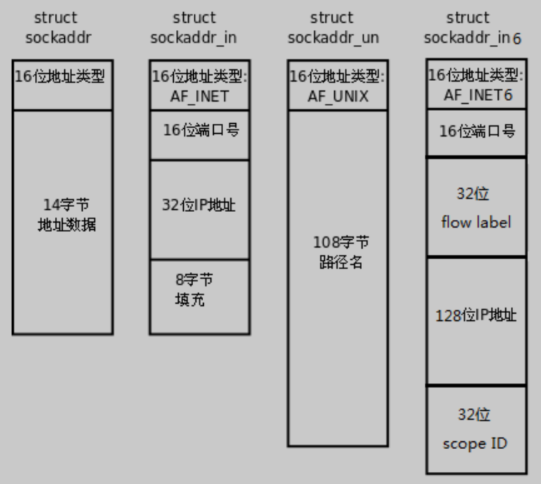

```c++
// 本地套接字通信的流程 - tcp 
// 服务器端 
1. 创建监听的套接字 
    int lfd = socket(AF_UNIX/AF_LOCAL, SOCK_STREAM, 0); 

2. 监听的套接字绑定本地的套接字文件 -> server端 
    struct sockaddr_un addr; 
    // 绑定成功之后，指定的sun_path中的套接字文件会自动生成。 
    bind(lfd, addr, len); 

3. 监听
    listen(lfd, 100); 

4. 等待并接受连接请求 
    struct sockaddr_un cliaddr; 
    int cfd = accept(lfd, &cliaddr, len); 

5. 通信
    接收数据：read/recv 
    发送数据：write/send 

6. 关闭连接 
    close(); 

// 客户端的流程 
1. 创建通信的套接字 
    int fd = socket(AF_UNIX/AF_LOCAL, SOCK_STREAM, 0); 

2. 监听的套接字绑定本地的IP 端口 
    struct sockaddr_un addr; 
    // 绑定成功之后，指定的sun_path中的套接字文件会自动生成。 
    bind(lfd, addr, len); 

3. 连接服务器 
    struct sockaddr_un serveraddr; 
    connect(fd, &serveraddr, sizeof(serveraddr)); 

4. 通信
    接收数据：read/recv 
    发送数据：write/send 

5. 关闭连接 
	close(); 

// 头文件: sys/un.h 
#define UNIX_PATH_MAX 108 
struct sockaddr_un { 
	sa_family_t sun_family; // 地址族协议 af_local 
	char sun_path[UNIX_PATH_MAX]; // 套接字文件的路径, 这是一个伪文件, 大小永远=0 
};
```

# 4. 应用层

## [应用层常见协议知道多少？了解几个？](https://interviewguide.cn/#/Doc/Knowledge/计算机网络/计算机网络?id=53、应用层常见协议知道多少？了解几个？)

| 协议   | 名称                       | 默认端口       | 底层协议                                                    |
| :----- | :------------------------- | :------------- | :---------------------------------------------------------- |
| HTTP   | 超文本传输协议             | 80             | TCP                                                         |
| HTTPS  | 超文本传输安全协议         | 443            | TCP                                                         |
| Telnet | 远程登录服务的标准协议     | 23             | TCP                                                         |
| FTP    | 文件传输协议               | 20传输和21连接 | TCP                                                         |
| `TFTP` | 简单文件传输协议           | 69             | UDP                                                         |
| SMTP   | 简单邮件传输协议（发送用） | 25             | TCP                                                         |
| POP    | 邮局协议（接收用）         | 110            | TCP                                                         |
| `DNS`  | 域名解析服务               | 53             | 服务器间进行`域传输`的时候用TCP 客户端查询DNS服务器时用 UDP |

## 3.1.   请你来说一说http协议

### HTTP协议是啥

> HTTP协议是Hyper Text Transfer Protocol（超`（超越文本，不止文本）`文本传输协议）的缩写，是用于从万维网（WWW:World Wide Web）服务器传输超文本到本地浏览器的传送协议。
>
> HTTP是一个`基于TCP/IP`通信协议来传递-数据（HTML 文件，图片文件，查询结果等）。
>
> HTTP协议工作于客户端-服务端架构为上。浏览器作为HTTP客户端通过URL向HTTP服务端即WEB服务器发送所有请求。Web服务器根据接收到的请求后，向客户端发送响应信息。
>

### HTTP协议特点

1. <u>==简单快速==</u>：

   - 客户向服务器请求服务时，<u>只需传送`请求方法`和`路径`。</u>请求方法常用的有GET、HEAD、POST。每种方法规定了客户与服务器联系的类型不同。由于HTTP协议简单，使得HTTP服务器的程序规模小，因而通信速度很快。

2. <u>==灵活==</u>：

   - <u>HTTP允许传输`任意类型`的数据对象</u>。正在传输的类型由Content-Type加以标记。
3. <u>==无连接==</u>：

   - 无连接的含义是<u>限制每次连接只处理一个请求</u>。服务器处理完客户的请求，并收到客户的应答后，即断开连接。采用这种方式可以节省传输时间。

4. <u>==无状态==</u>：

   - HTTP协议是无状态协议。无状态是指协议<u>对于事务处理没有记忆能力</u>。

   > 缺少状态意味着如果后续处理需要前面的信息，则它`必须重传`，这样可能导致每次连接传送的数据量增大。
   >
   > 另一方面，在服务器不需要先前信息时它的`应答就较快`。

5. 支持B/S（Browser/Server）及C/S（Client/Server）模式。

6. 默认端口80

7. 基于TCP协议

### HTTP过程概述

HTTP协议定义Web客户端如何从Web服务器请求Web页面，以及服务器如何把Web页面传送给客户端。

HTTP协议采用了`请求/响应模型`。

> 客户端向服务器发送一个请求报文，请求报文包含请求的方法、URL、协议版本、请求头部和请求数据。
>
> 服务器以一个状态行作为响应，响应的内容包括协议的版本、成功或者错误代码、服务器信息、响应头部和响应数据。

#### HTTP 请求/响应的步骤

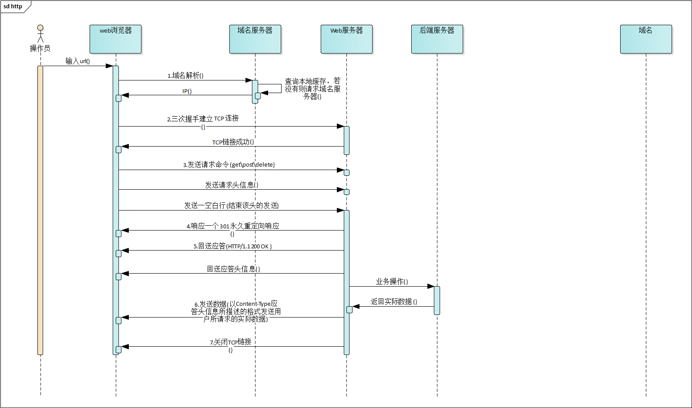

1. ==<u>客户端连接到Web服务器</u>==

   一个HTTP客户端，通常是浏览器，与Web服务器的HTTP端口（默认为80）`建立一个TCP套接字连接`。

2. `发送HTTP`请求

   `通过TCP`套接字，客户端向Web服务器发送一个文本的`请求报文`，一个请求报文由`请求行、请求头部、空行和请求数据`4部分组成。

3. 服务器接受请求并返回HTTP响应

   Web服务器`解析请求`，`定位请求资源`。服务器将资源复本`写到TCP`套接字，`由客户端读取`。一个响应由`状态行、响应头部、空行和响应数据`4部分组成。

4. 释放连接TCP连接

   若connection 模式为==close==，则服务器主动关闭TCP连接，客户端被动关闭连接，释放TCP连接;

   若connection 模式为==keep-alive==，则该连接会保持一段时间，在该时间内可以继续接收请求;

5. 客户端浏览器解析HTML内容

   客户端浏览器首先`解析状态行`，查看表明请求`是否成功`的状态代码。然后`解析每一个响应头`，响应头告知以下为若干字节的HTML文档和文档的字符集。客户端浏览器`读取响应数据HTML`，根据HTML的语法对其进行`格式化`，并在浏览器窗口中显示。

## 3.2.   [HTTP 报文格式](https://www.cnblogs.com/huansky/p/14007810.html)

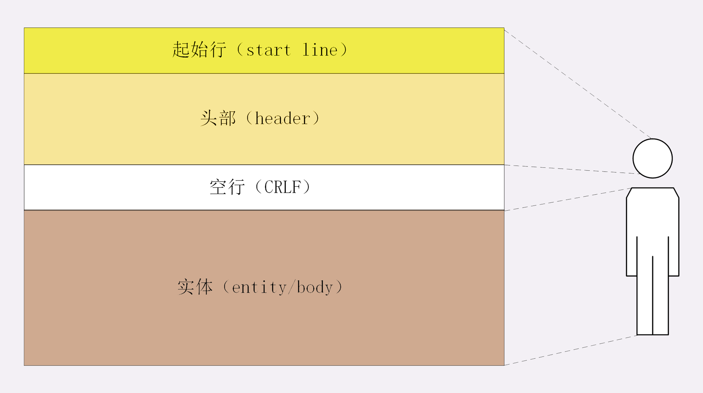

### HTTP请求报文：

一个HTTP请求报文由`请求行`（request line）、`请求头部`（header）、`空行`和`请求数据`4个部分组成，下图给出了请求报文的一般格式。


```c++
//www.baidu.com的请求报文
GET / HTTP/1.1 Host: www.baidu.com  //请求行  后面是请求头
  
User-Agent: Mozilla/5.0 (Windows NT 10.0; Win64; x64; rv:86.0) Gecko/20100101 Firefox/86.0
Accept: text/html,application/xhtml+xml,application/xml;q=0.9,image/webp,/;q=0.8
Accept-Language: zh-CN,zh;q=0.8,zh-TW;q=0.7,zh-HK;q=0.5,en-US;q=0.3,en;q=0.2
Accept-Encoding: gzip, deflate, br   //允许的压缩编码格式
Connection: keep-alive   //连接状态
Cookie: BAIDUID=6729CB682DADC2CF738F533E35162D98:FG=1; //本地缓存的用户信息
BIDUPSID=6729CB682DADC2CFE015A8099199557E; PSTM=1614320692; BD_UPN=13314752;
BDORZ=FFFB88E999055A3F8A630C64834BD6D0;
__yjs_duid=1_d05d52b14af4a339210722080a668ec21614320694782; BD_HOME=1;
H_PS_PSSID=33514_33257_33273_31660_33570_26350;
BA_HECTOR=8h2001alag0lag85nk1g3hcm60q
Upgrade-Insecure-Requests: 1
Cache-Control: max-age=0
    					//空行
    正文
```

1. 请求行：请求行分为三个部分：`请求方法`、`请求地址`和`协议版本`。

   > - 请求方法：HTTP/1.1 定义的请求方法有8种：GET、POST、PUT、DELETE、PATCH、HEAD、OPTIONS、TRACE。
   >
   >   ​	最常的两种GET和POST，如果是RESTful接口的话一般会用到GET、POST、DELETE、PUT。
   >
   > - 请求地址：URL:统一资源定位符，是一种自愿位置的抽象唯一识别方法。
   >
   >   ​	组成：<协议>：//<主机>：<端口>/<路径>
   >
   >   ​	端口和路径有时可以省略（HTTP默认端口号是80）
   >
   > - 协议版本的格式为：HTTP/主版本号.次版本号，常用的有HTTP/1.0和HTTP/1.1

2. 请求头部：请求头部由关键字/值对组成，每行一对，关键字和值用英文冒号“:”分隔。

   请求头部`通知服务器有关于客户端请求的信息`，典型的请求头有：

   > User-Agent：产生请求的`浏览器类型`。
   >
   > Accept：客户端可识别的`内容类型列表`。
   >
   > Host：请求的`主机名`，允许多个域名同处一个IP地址，即虚拟主机。
   >
   > <u>Connection：是否保持长连接</u>
   >
   > Cookie：HTTP请求发送时，会把保存在该请求域名下的所有cookie值一起发送给web服务器。
   >
   > Content-Length：请求的`内容长度`
   >
   > Range:实现`断点续传`

3. 实体主体：实体主体即请求数据，不在GET方法中使用，而是在POST方法中使用。 （`例如账号密码`）

   POST方法适用于需要客户填写表单的场合。与请求数据相关的最常使用的请求头是Content-Type和Content-Length。

### HTTP响应报文

HTTP响应也由4个部分组成，分别是：`状态行`、`响应头部`、空行，`响应正文`（实体主体）。

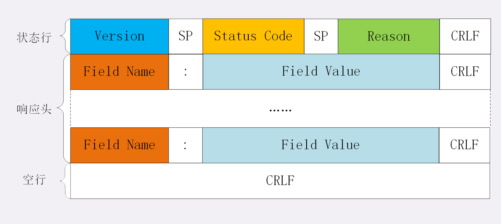

```c++
HTTP/1.1 200 OK
Bdpagetype: 1
Bdqid: 0xf3c9743300024ee4
Cache-Control: private
Connection: keep-alive
Content-Encoding: gzip   //压缩编码格式
Content-Type: text/html;charset=utf-8
Date: Fri, 26 Feb 2021 08:44:35 GMT
Expires: Fri, 26 Feb 2021 08:44:35 GMT
Server: BWS/1.1
Set-Cookie: BDSVRTM=13; path=/
Set-Cookie: BD_HOME=1; path=/
Set-Cookie: H_PS_PSSID=33514_33257_33273_31660_33570_26350; path=/; domain=.baidu.com
Strict-Transport-Security: max-age=172800
Traceid: 1614329075128412289017566699583927635684
X-Ua-Compatible: IE=Edge,chrome=1
Transfer-Encoding: chunked
    						//空行
    响应正文
```

其中，版本（HTTP-Version）表示服务器HTTP协议的版本；状态码（Status-Code）表示服务器发回的响应状态代码；短语（Reason-Phrase）表示状态代码的文本描述。状态代码由三位数字组成，第一个数字定义了响应的类别，且有五种可能取值。

- #### [状态码对应的含义：](https://www.jianshu.com/p/b58025e61b2d)

  > 1xx：指示信息--表示请求已接收，`请继续`处理。 
  >
  > 2xx：`成功`--表示请求已被成功接收、理解、接受。
  >
  > 3xx：`重定向`--要完成请求必须进行更进一步的操作。
  >
  > 4xx：`客户端错`误--请求有语法错误或请求无法实现。    ==404 Not Found==
  >
  > 5xx：`服务器端错`误--服务器未能实现合法的请求。

响应头部与相应正文则与请求头部及请求数据向对应。

 

## 3.3.   HTTP状态码

| 状态码 | 类别                                     | 含义                                                         |
| :----- | :--------------------------------------- | :----------------------------------------------------------- |
| 1XX    | Informational（信息性状态码） `提示信息` | **提示信息**，是协议处理中的一种中间状态，实际用到的比较少   |
| 2XX    | Success（`成功`状态码）                  | 服务器**成功**处理了客户端的请求，也是我们最愿意看到的状态。 |
| 3XX    | Redirection（`重定向`状态码）            | 客户端请求的资源发生了变动，需要客户端用新的 URL 重新发送请求获取资源，也就是**重定向** |
| 4XX    | Client Error（`客户端错误`状态码）       | 客户端发送的**报文有误**，服务器无法处理，也就是错误码的含义。 |
| 5XX    | Server Error（`服务器错误`状态码）       | 客户端请求报文正确，但是**服务器处理时内部发生了错误**，属于服务器端的错误码。 |

##### [1xx 信息](https://interviewguide.cn/#/Doc/Knowledge/计算机网络/计算机网络?id=1xx-信息)  ==过程中正常的提示信息==

- **100 Continue** ：表明到目前为止都很正常，客户端可以继续发送请求或者忽略这个响应。

##### [2xx 成功](https://interviewguide.cn/#/Doc/Knowledge/计算机网络/计算机网络?id=2xx-成功)  提醒你已经完成了响应,可以解析报文了

- **200 OK**    ==ok==
- **204 No Content** ：请求已经成功处理，但是返回的响应报文不包含实体的主体部分。一般在只需要从客户端往服务器发送信息，而不需要返回数据时使用。 ==<u>（你没有请求数据，所有我的回复没有数据段）</u>==
- **206 Partial Content** ：表示客户端进行了范围请求，响应报文包含由 Content-Range 指定范围的实体内容。<u>==（范围回复）==</u>

##### [3xx 重定向](https://interviewguide.cn/#/Doc/Knowledge/计算机网络/计算机网络?id=3xx-重定向)  需要后续的URL转发操作

> URL 重定向，也称为 `URL 转发`，是一种当实际资源，如单个页面、表单或者整个 Web 应用被迁移到新的 URL 下的时候，保持（原有）链接可用的技术。HTTP 协议提供了一种特殊形式的响应—— HTTP 重定向（HTTP redirects）来执行此类操作。
>
> 重定向可实现许多目标：
>
> - 站点维护或停机期间的临时重定向。
> - 永久重定向将在更改站点的URL，上传文件时的进度页等之后保留现有的链接/书签。
> - 上传文件时的表示进度的页面。

- **301 Moved Permanently** ：永久性重定向
- **302 Found** ：临时性重定向
- **303 See Other** ：和 302 有着相同的功能，但是 303 明确要求客户端应该采用 GET 方法获取资源。
- **304 Not Modified** ：如果请求报文首部包含一些条件，例如：If-Match，If-Modified-Since，If-None-Match，If-Range，If-Unmodified-Since，如果不满足条件，则服务器会返回 304 状态码。
- **307 Temporary Redirect** ：临时重定向，与 302 的含义类似，但是 307 要求浏览器不会把重定向请求的 POST 方法改成 GET 方法。

##### [4xx 客户端错误](https://interviewguide.cn/#/Doc/Knowledge/计算机网络/计算机网络?id=4xx-客户端错误)  客户端不行

- **400 Bad Request** ：请求报文中存在语法错误。   ==我不理解==
- **401 Unauthorized** ：该状态码表示发送的请求需要有认证信息（BASIC 认证、DIGEST 认证）。如果之前已进行过一次请求，则表示用户认证失败。 ``
- **403 Forbidden** ：请求被拒绝。  ==403 Forbidden==
- **404 Not Found**           `==404` not found==  dns污染
- **405 Not Allowed**             ==达咩==
- **406 无法接受**         ==无法接受==

##### [5xx 服务器错误](https://interviewguide.cn/#/Doc/Knowledge/计算机网络/计算机网络?id=5xx-服务器错误)  服务器不行

- 「**500 Internal Server Error**」与 400 类型，是个笼统通用的错误码，服务器发生了什么错误，我们并不知道。

  > 只知道是服务器发生了错误

- 「**501 Not Implemented**」表示客户端请求的功能还不支持，类似“即将开业，敬请期待”的意思。

- 「**502 Bad Gateway**」通常是服务器作为网关或代理时返回的错误码，表示服务器自身工作正常，访问后端服务器发生了错误。

- 「**503 Service Unavailable**」表示服务器当前很忙，暂时无法响应客户端，类似“网络服务正忙，请稍后重试”的意思。

## GET 和 POST

> 1. 实现的功能不一样 请求/提交
> 2. 内容放的位置不一样 url/body  简单编码/复杂编码 内容长度
> 3. 安全幂等可被缓存  

### GET 和 POST 有什么区别？

#### **GET 的语义是从服务器获取指定的资源**

这个资源可以是静态的文本、页面、图片视频等。`GET 请求的参数位置一般是写在 URL 中`，URL 规定只能支持 ASCII，所以 GET 请求的参数只允许 ASCII 字符 ，而且`浏览器会对 URL 的长度有限制`（<u>HTTP协议本身对 URL长度并没有做任何规定</u>）。

比如，你打开我的文章，浏览器就会发送 GET 请求给服务器，服务器就会返回文章的所有文字及资源。

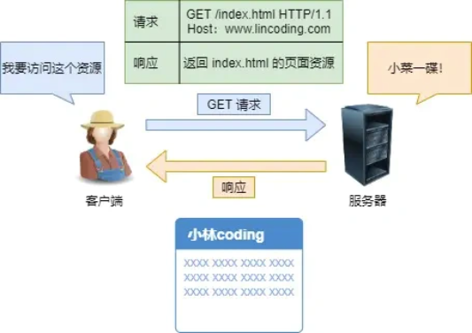

#### **POST 的语义是根据请求负荷（报文body）对指定的资源做出处理**

具体的处理方式视资源类型而不同。POST 请求携带数据的位置一般是`写在报文 body` 中， body 中的数据可以是`任意格式`的数据，只要客户端与服务端协商好即可，而且浏览器`不会对 body 大小做限制`。

比如，你在我文章底部，敲入了留言后点击「提交」（**暗示你们留言**），浏览器就会执行一次 POST 请求，把你的留言文字放进了报文 body 里，然后拼接好 POST 请求头，通过 TCP 协议发送给服务器。

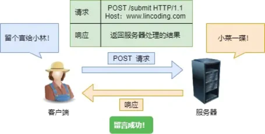

### GET 和 POST 方法都是安全(破化服务器资源)和幂等(多次相同)的吗?

> get因为只是获取，只读  所以安全和幂等
>
> post因为是提交数据 可能修改服务器数据 所以是不安全 不幂等的

`安全`和`幂等`的概念：

- 在 HTTP 协议里，所谓的「安全」是指<u>请求方法</u>不会「破坏」服务器上的资源。
- 所谓的「幂等」，意思是<u>多次执行相同的操作</u>，<u>结果都是「相同」的</u>。

如果从 RFC 规范定义的语义来看：

- **`GET 方法就是安全且幂等的`**，因为它是「`只读`」操作，无论操作多少次，服务器上的数据都是安全的，且每次的结果都是相同的。所以，**`可以对 GET 请求的数据做缓存，这个缓存可以做到浏览器本身上（彻底避免浏览器发请求），也可以做到代理上（如nginx），而且在浏览器中 GET 请求可以保存为书签`**。
- **`POST`** 因为是「`新增或提交数据`」的操作，会修改服务器上的资源，所以是**`不安全`**的，且多次提交数据就会创建多个资源，所以**`不是幂等`**的。所以，**`浏览器一般不会缓存 POST 请求，也不能把 POST 请求保存为书签`**。

#### ==<u>**简要的小结**</u>==

GET 的语义是`请求获取`指定的资源。GET 方法是`安全`、`幂等`、`可被缓存`的。

POST 的语义是根据请求负荷（报文主体）对指定的资源做出处理，具体的处理方式视资源类型而不同。POST `不安全`，`不幂等`，（大部分实现）`不可缓存`。      `新增或提交数据`

<u>注意， 上面是从 RFC 规范定义的语义来分析的。</u>

但是实际过程中，开发者不一定会按照 RFC 规范定义的语义来实现 GET 和 POST 方法。比如：

- 可以用 GET 方法实现新增或删除数据的请求，这样实现的 GET 方法自然就不是安全和幂等。
- 可以用 POST 方法实现查询数据的请求，这样实现的 POST 方法自然就是安全和幂等。

曾经有个笑话，有人写了个博客，删除博客用的是GET请求，他觉得没人访问就连鉴权都没做。然后Google服务器爬虫爬了一遍，他所有博文就没了。。。

如果「安全」放入概念是指信息是否会被泄漏的话，虽然 POST 用 body 传输数据，而 GET 用 URL 传输，这样数据会在浏览器地址拦容易看到，但是`并不能说 GET 不如 POST 安全的`。

因为 HTTP 传输的内容都是明文的，虽然在浏览器地址拦看不到 POST 提交的 body 数据，但是只要`抓个包`就都能看到了。

所以，要避免传输过程中数据被窃取，就要使用 `HTTPS` 协议，这样所有 HTTP 的数据都会被加密传输。

#### GET 请求可以带 body 吗？

RFC 规范并没有规定 GET 请求不能带 body 的。<u>理论上，任何请求都可以带 body 的。只是因为 RFC 规范定义的 GET 请求是获取资源，所以根据这个语义不需要用到 body。</u>

另外，URL 中的查询参数也不是 GET 所独有的，POST 请求的 URL 中也可以有参数的。

## HTTP`缓存`技术

### HTTP 缓存有哪些实现方式？

对于一些具有`重复性的 HTTP 请求`，比如每次请求得到的`数据都一样`的，我们可以把这对「请求-响应」的数据都**`缓存在本地`**，那么下次就直接读取本地的数据，不必在通过网络获取服务器的响应了，这样的话 HTTP/1.1 的性能肯定肉眼可见的提升。

所以，避免发送 HTTP 请求的方法就是通过**缓存技术**，HTTP 设计者早在之前就考虑到了这点，因此 HTTP 协议的头部有不少是针对缓存的字段。

HTTP 缓存有两种实现方式，分别是**`强制缓存`和`协商缓存`**。

### 什么是强制缓存？

> 浏览器根据数据的缓存时间 确定是否使用缓存

强制缓存指的是<u>只要浏览器判断缓存没有过期，则直接使用浏览器的本地缓存</u>，决定是否使用缓存的主动性在于浏览器这边。

如下图中，返回的是 200 状态码，但在 <u>size 项中标识的是 from disk cache</u>，就是使用了强制缓存。

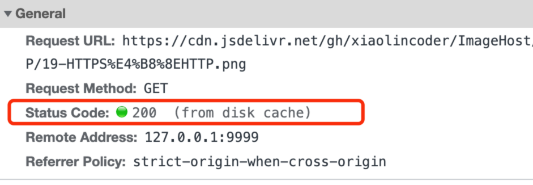

强制缓存是利用下面这两个 HTTP 响应头部（Response Header）字段实现的，它们都用来表示资源在客户端缓存的有效期：

- `Cache-Control`， 是一个`相对`时间；
- `Expires`，是一个`绝对`时间；

如果 HTTP 响应头部同时有 Cache-Control 和 Expires 字段的话，**`Cache-Control的优先级高于 Expires`** 。

Cache-control 选项更多一些，设置更加精细，所以建议使用 Cache-Control 来实现强缓存。具体的实现流程如下：

- 当浏览器第一次请求访问服务器资源时，服务器会在返回这个资源的同时，在 Response 头部加上 Cache-Control，Cache-Control 中设置了过期时间大小；  `请求资源 缓存他并得到过期的相对时间`
- 浏览器再次请求访问服务器中的该资源时，会先**通过请求资源的时间与 Cache-Control 中设置的过期时间大小，来计算出该资源是否过期**，如果没有，则使用该缓存，否则重新请求服务器； `比较时间 确认是否用缓存`
- 服务器再次收到请求后，会再次`更新` Response 头部的 Cache-Control。

### [#](https://xiaolincoding.com/network/2_http/http_interview.html#什么是协商缓存)什么是协商缓存？

> 虽然数据过期了 但是服务器304告诉你, 还可以实用之前的数据

当我们在浏览器使用开发者工具的时候，你可能会看到过某些请求的响应码是 `304`，这个是告诉浏览器可以使用本地缓存的资源，`通常这种通过服务端告知客户端是否可以使用缓存的方式被称为协商缓存。`

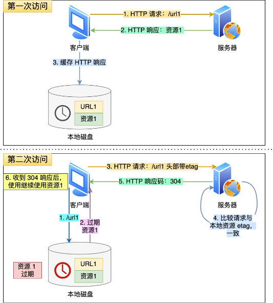

上图就是一个协商缓存的过程，所以**`协商缓存就是与服务端协商之后，通过协商结果来判断是否使用本地缓存`**。

协商缓存可以基于两种头部来实现。

第一种：请求头部中的 `If-Modified-Since` 字段与响应头部中的 `Last-Modified` 字段实现，这两个字段的意思是：

- 响应头部中的 `Last-Modified`：<u>标示这个响应资源的最后修改时间</u>；
- 请求头部中的 `If-Modified-Since`：当资源过期了，发现响应头中具有 Last-Modified 声明，则再次发起请求的时候带上 Last-Modified 的时间，服务器收到请求后发现有 If-Modified-Since 则与被请求资源的最后修改时间进行对比（Last-Modified），如果最后修改时间较新（大），说明资源又被改过，则返回最新资源，HTTP 200 OK；如果最后修改时间较旧（小），说明资源无新修改，响应 HTTP 304 走缓存。

第二种：请求头部中的 `If-None-Match` 字段与响应头部中的 `ETag` 字段，这两个字段的意思是：

- 响应头部中 `Etag`：唯一标识响应资源；
- 请求头部中的 `If-None-Match`：当资源过期时，浏览器发现响应头里有 Etag，则再次向服务器发起请求时，会将请求头If-None-Match 值设置为 Etag 的值。服务器收到请求后进行比对，如果资源没有变化返回 304，如果资源变化了返回 200。

第一种实现方式是==基于时间==实现的，第二种实现方式是==基于一个唯一标识==实现的，相对来说<u>后者可以更加准确地判断文件内容是否被修改，避免由于时间篡改导致的不可靠问题</u>。

如果 HTTP 响应头部同时有 Etag 和 Last-Modified 字段的时候， ==**Etag 的优先级更高**==，也就是先会判断 Etag 是否变化了，如果 Etag 没有变化，然后再看 Last-Modified。

注意，**==协商缓存这两个字段都需要配合强制缓存中 Cache-control 字段来使用，只有在未能命中强制缓存的时候，才能发起带有协商缓存字段的请求==**。

## HTTP 特性

### HTTP（1.1） 的优点有哪些？

HTTP 最凸出的优点是「==简单、灵活和易于扩展、应用广泛和跨平台==」。

#### 1. 简单

HTTP 基本的报文格式就是 `header + body`，头部信息也是 `key-value` 简单文本的形式，**易于理解**，降低了学习和使用的门槛。

#### 2. 灵活和易于扩展

HTTP协议里的各类请求方法、URI/URL、状态码、头字段等每个组成要求`都没有被固定死`，都允许开发人员**自定义和扩充**。

同时 HTTP 由于是工作在应用层（ OSI 第七层），则它**`下层可以随意变化`**。

HTTPS 也就是在 HTTP 与 TCP 层之间增加了 SSL/TLS 安全传输层，HTTP/3 甚至把 TCP 层换成了基于 UDP 的 QUIC。

#### 3. 应用广泛和跨平台

互联网发展至今，HTTP 的应用范围非常的广泛，从台式机的浏览器到手机上的各种 APP，从看新闻、刷贴吧到购物、理财、吃鸡，HTTP 的应用遍地开花，同时天然具有**`跨平台`**的优越性。

### HTTP（1.1） 的缺点有哪些？

HTTP 协议里有优缺点一体的**双刃剑**，分别是「==无状态==、==明文传输==」，同时还有一大缺点「==不安全==」。

#### 1. 无状态双刃剑 

无状态的**好处**，因为服务器不会去记忆 HTTP 的状态，所以不需要额外的资源来记录状态信息，这能`减轻服务器的负担`，能够把更多的 CPU 和内存用来对外提供服务。

无状态的**坏处**，既然服务器没有记忆能力，它在`完成有关联性的操作时会非常麻烦`。

例如登录->添加购物车->下单->结算->支付，这系列操作都要知道用户的身份才行。但服务器不知道这些请求是有关联的，每次都要问一遍身份信息。

这样每操作一次，都要验证信息，这样的购物体验还能愉快吗？别问，问就是**酸爽**！

对于无状态的问题，解法方案有很多种，其中比较简单的方式用 **`Cookie`** 技术。

`Cookie` 通过在请求和响应报文中写入 Cookie 信息来控制客户端的状态。

相当于，**在客户端第一次请求后，服务器会下发一个装有客户信息的「小贴纸」，后续客户端请求服务器的时候，带上「小贴纸」，服务器就能认得了了**，

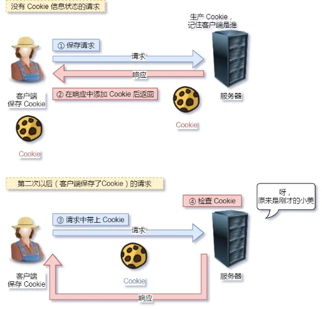

#### 2. 明文传输双刃剑

明文意味着在传输过程中的信息，是可方便阅读的，通过浏览器的 F12 控制台或 Wireshark 抓包都可以直接肉眼查看，为我们调试工作带了极大的便利性。

> `抓包直接可读 方便调试`

但是这正是这样，HTTP 的所有信息都暴露在了光天化日下，相当于**信息裸奔**。在传输的漫长的过程中，信息的内容都毫无隐私可言，很容易就能被窃取，如果里面有你的账号密码信息，那**你号没了**。

> `重要信息被别人抓包 很不安全`

#### 3. 不安全

HTTP 比较严重的缺点就是不安全：

- 通信使用`明文`（不加密），内容可能会被窃听。比如，**账号信息容易泄漏，那你号没了。**
- `不验证通信方的身份`，因此有可能遭遇伪装。比如，**访问假的淘宝、拼多多，那你钱没了。**
- `无法证明报文的完整性`，所以有可能已遭篡改。比如，**网页上植入垃圾广告，视觉污染，眼没了。**

HTTP 的安全问题，可以用 HTTPS 的方式解决，也就是通过引入 SSL/TLS 层，使得在安全上达到了极致。

### HTTP/1.1 的性能如何？

HTTP 协议是基于 **TCP/IP**，并且使用了「**请求 - 应答**」的通信模式，所以性能的关键就在这**两点**里。

#### 1. 长连接

早期 HTTP/1.0 性能上的一个很大的问题，<u>那就是每发起一个请求，都要新建一次 TCP 连接（三次握手），而且是串行请求，做了无谓的 TCP 连接建立和断开，增加了通信开销。</u>

为了解决上述 TCP 连接问题，HTTP/1.1 提出了**长连接**的通信方式，也叫持久连接。这种方式的好处在于减少了 TCP 连接的重复建立和断开所造成的额外开销，减轻了服务器端的负载。

`持久连接的特点是，只要任意一端没有明确提出断开连接，则保持 TCP 连接状态。`

当然，如果某个 HTTP 长连接`超过一定时间`没有任何数据交互，服务端就会`主动断开`这个连接。

#### 2. 管道网络传输

HTTP/1.1 采用了长连接的方式，这使得管道（pipeline）网络传输成为了可能。

即可在同一个 TCP 连接里面，客户端可以发起多个请求，只要第一个请求发出去了，不必等其回来，就可以发第二个请求出去，可以**减少整体的响应时间。**

> 类似tcp的滑动窗口机制  或者就是基于滑动窗口实现的？

举例来说，客户端需要请求两个资源。以前的做法是，在同一个 TCP 连接里面，先发送 A 请求，然后等待服务器做出回应，收到后再发出 B 请求。那么，管道机制则是允许浏览器同时发出 A 请求和 B 请求，如下图：

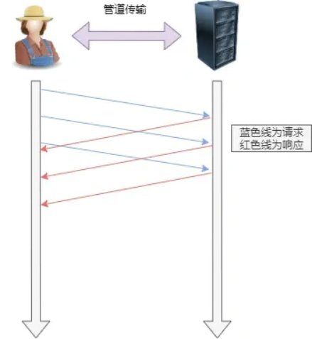

但是**`服务器必须按照接收请求的顺序发送对这些管道化请求的响应`**。

如果服务端在处理 A 请求时耗时比较长，那么后续的请求的处理都会被阻塞住，这称为「队头堵塞」。

所以，**HTTP/1.1 管道解决了请求的队头阻塞，但是没有解决响应的队头阻塞**。

注意：实际上 HTTP/1.1 管道化技术`不是默认开启`，而且浏览器基本都没有支持，所以后面讨论HTTP/1.1 都是建立在没有使用管道化的前提。

#### 3. 队头阻塞

「请求 - 应答」的模式加剧了 HTTP 的性能问题。

因为当顺序发送的请求序列中的一个请求因为某种原因被阻塞时，在后面排队的所有请求也一同被阻塞了，会招致客户端一直请求不到数据，这也就是「**队头阻塞**」，好比上班的路上塞车。

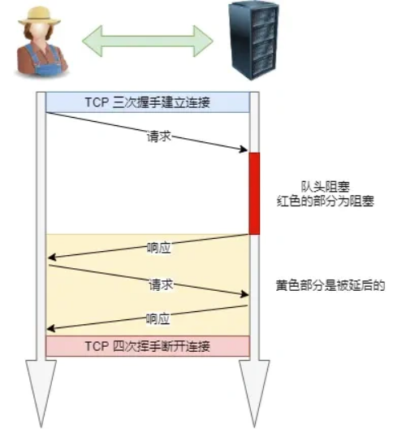

总之 HTTP/1.1 的`性能一般般`，后续的 HTTP/2 和 HTTP/3 就是在优化 HTTP 的性能。

## 3.4.   http工作模式？？

单工： 数据传输只允许在一个方向上的传输，只能一方来发送数据，另一方来接收数据并发送。例如：广播

半双工：数据传输允许两个方向上的传输，但是同一时间内，只可以有一方发送或接受消息。例如：对讲机

全双工：同时可进行双向传输。例如：websocket

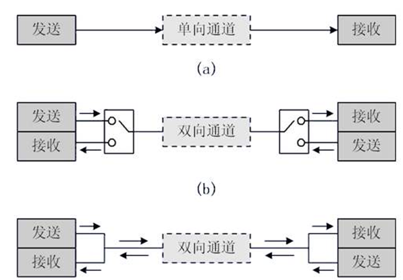

> `http1.0：单工`。因为是短连接，客户端发起请求之后，服务端处理完请求并收到客户端的响应后即断开连接。
>
> `http1.1：半双工`。默认开启长连接keep-alive，开启一个连接可发送多个请求。
>
> `http2.0：全双工`，允许服务端主动向客户端发送数据。


## 3.5.   HTTP1.1和1.0的区别

> 长连接 range头域 host域 更多状态码

1. HTTP 1.1支持`长连接`（PersistentConnection）和请求的`流水线`（Pipelining）处理   (==<u>长连接 半双工</u>==)

   > HTTP 1.0规定浏览器与服务器只保持`短暂的连接`，浏览器的每次请求都需要与服务器建立一个TCP连接，服务器完成请求处理后立即断开TCP连接，服务器不跟踪每个客户也不记录过去的请求。
   >
   > HTTP 1.1则`支持持久连接`Persistent Connection, 并且默认使用persistent connection. <u>在同一个tcp的连接中可以传送多个HTTP请求和响应. 多个请求和响应可以重叠，多个请求和响应可以同时进行. 更加多的请求头和响应头(比如HTTP1.0没有host的字段)。</u>HTTP 1.1还<u>允许客户端不用等待上一次请求结果返回，就可以发出下一次请求</u>，但服务器端必须按照接收到客户端请求的<u>先后顺序依次回送响应结果，</u>以保证客户端能够区分出每次请求的响应内容。

2. 宽带和网络连接优化: `100(Continue) Status`   (==<u>1. range 2. 只发送header</u>==)

   > - <u>http1.0中会存在一些性能浪费</u>,比如我们的只需要对象中的一部分,但是每次请求返回的却是`整个对象`,这无疑造成了性能的损害
   >
   >   http1.1则不然,它可以通过在请求头处`设置range头域`,就可以`返回请求资源的某一部分`,也就是返回码为206(Partial Content)的时候,这对于性能优化很有必要. 这里所谓的请求资源的一部分,也就是大家常说的断点续传
   >
   > - HTTP1.1支持`只发送header信息`（不带任何body信息），如果服务器认为客户端有权限请求服务器，则返回100，客户端接收到100才开始把请求body发送到服务器；如果返回401，客户端就可以不用发送请求body了`节约了带宽`。

3. `HOST`域

   > 在HTTP1.0中认为每台服务器都绑定一个唯一的IP地址，因此，请求消息中的URL并没有传递主机名（hostname），HTTP1.0没有host域。随着虚拟主机技术的发展，在一台物理服务器上可以存在多个虚拟主机（Multi-homed Web Servers），并且它们共享一个IP地址。HTTP1.1的请求消息和响应消息都支持host域，且请求消息中如果没有host域会报告一个错误（400 Bad Request）。
   >
   > ==(ip地址下更细分)==

4. `错误通知`的管理  （<u>==更多的错误通知==</u>）

   > 在HTTP1.1中`新增`了24个`错误状态响应码`，如409（Conflict）表示请求的资源与资源的当前状态发生冲突；410（Gone）表示服务器上的某个资源被永久性的删除。

### 断点续传是怎么实现的  

**可使用HTTP报文首部字段==Range==实现范围请求**

- 对一份10000字节大小的资源，如果使用范围请求，可只请求5001~10000字节内的资源。

- 执行范围请求时，会用到HTTP首部字段Range来指定资源的byte范围。形式如下：

  5001~10000字节

  > Range:bytes=5001-10000

  从5001字节之后全部的

  > Range:bytes=5001-

  从1开始到3000字节和从5000开始到7000字节的多重范围

  > Range:bytes=-3000,5000-7000

- 针对范围请求，响应会返回状态码为<u>==206==</u> Partial Content 的响应报文。另外，对于多重范围的范围请求，响应会在首部字段Content-Type标明multipart/byteranges后返回响应报文。
- <u>如果服务器无法响应范围请求</u>，则会返回状态码<u>==200 OK和完整的实体内容==</u>。

因此，在进行断点续传时，只需使用范围请求，通过指定HTTP请求报文首部字段Range来请求尚未收到的资源。

##  [HTTP采用keepalive模式，当客户端向服务器发生请求之后，客户端如何判断服务器的数据已经发生完成？](https://www.cnblogs.com/skynet/archive/2010/12/11/1903347.html#!comments)

1. 当使用普通模式，也就是http1.0没有keepalive模式时，HTTP协议中客户端发送一个小请求，服务器响应以所期望的信息（例如一个html文件或一副gif图像）。`服务器通常会在发送完请求的数据之后就关闭连接`。这样客户端读数据时会返回`EOF`（-1），就知道数据已经接收完全了

2. ##### 使用消息首部字段==Content-Length==

   故名思意，`Conent-Length表示实体内容长度`，客户端（服务器）可以根据这个值来判断数据是否接收完成。但是如果消息中没有Conent-Length，那该如何来判断呢？又在什么情况下会没有Content-Length呢？ （==<u>静态页面的请求</u>==）

   ##### 使用消息首部字段==Transfer-Encoding==

   当客户端向服务器请求一个静态页面或者一张图片时，服务器可以很清楚的知道内容大小，然后通过Content-length消息首部字段告诉客户端需要接收多少数据。但是如果是动态页面等时，服务器是不可能预先知道内容大小，这时就可以使用Transfer-Encoding：chunk模式来传输数据了。即如果要一边产生数据，一边发给客户端，服务器就需要使用"Transfer-Encoding: chunked"这样的方式来代替Content-Length。

   chunk编码将数据分成一块一块的发生。Chunked编码将使用若干个Chunk串连而成，由一个标明**长度为0**的chunk标示结束。每个Chunk分为头部和正文两部分，头部内容指定正文的字符总数（**十六进制的数字**）和数量单位（一般不写），正文部分就是指定长度的实际内容，两部分之间用**回车换行(CRLF)**隔开。在最后一个长度为0的Chunk中的内容是称为footer的内容，是一些附加的Header信息（通常可以直接忽略）。

## http协议请求类型有哪几种

- <u>GET：向特定的资源发出请求。</u>

- <u>POST：向指定资源提交数据进行处理请求（例如提交表单或者上传文件）</u>。数据被包含在请求体中。POST请求可能会导致新的资源的创建和/或已有资源的修改。

- <u>PUT：向指定资源位置上传其最新内容。</u>

- DELETE：请求服务器删除Request-URI所标识的资源。

- TRACE：回显服务器收到的请求，主要用于测试或诊断。

- OPTIONS：返回服务器针对特定资源所支持的HTTP请求方法。也可以利用向Web服务器发送’*'的请求来测试服务器的功能性。

- HEAD：向服务器索要与GET请求相一致的响应，只不过响应体将不会被返回。这一方法可以在不必传输整个响应内容的情况下，就可以获取包含在响应消息头中的元信息。

- CONNECT：HTTP/1.1协议中预留给能够将连接改为管道方式的代理服务器。

## 请你来说一下GET和POST的区别

1. ==功能==不同

   > get是从服务器上`获取`数据。post是向服务器`传送`数据。

2. ==请求方式==不同

   > 对于GET方式的请求，浏览器会把http header和data一并发送出去，服务器响应200（返回数据）；
   >
   > 而对于POST，浏览器先发送header，服务器响应100 continue，浏览器再发送data，服务器响应200 ok（返回数据）
   >
   > GET产生`一个`TCP数据包；POST产生`两个`TCP数据包。

3. ==安全性==不同

   > POST安全性相对较高。 
   >
   > <u>GET请求参数会被完整保留在浏览器历史记录里</u>，而POST中的`参数不会被保留`。  
   >
   > GET 是把参数数据队列加到提交表单的ACTION属性所指的URL中，值和表单内各个字段一一对应，在URL中可以看到。POST是通过HTTP POST机制，将表单内各个字段与其内容放置在HTML HEADER内一起传送到ACTION属性所指的URL地址。用户看不到这个过程。
   >
   > GET参数直接暴露在URL上
   >
   > <u>Ex: 如果使用get 提交用户名和密码 用户名和密码会暴露在url中 `很不安全</u>`

4. 传送`数据量`不同  ==存储位置和数据量==

   > get参数通过url传递，post放在request body中。
   >
   > get传送的`数据量`较小，不能大于2KB （这主要是因为受URL长度限制）。post传送的数据量较大，一般被默认为不受限制。但理论上，IIS4中最大量为80KB，IIS5中为100KB。 

5. 获取`值`不同

   > 对于get方式，服务器端用Request.QueryString获取变量的值。对于post方式，服务器端用Request.Form获取提交的数据

6. 方式、类型不同  ==存储位置和编码==

   > GET请求只能进行`url编码`，而POST支持多种编码方式。
   >
   > 对参数的数据类型，GET只接受ASCII字符，而POST没有限制。

## 3.6.   http2.0和1.x的区别

1. ==<u>二进制</u>==分帧

   > 在应用层(HTTP/2)和传输层(TCP or UDP)之间`增加一个二进制分帧层`。
   >
   > HTTP2使用的是`二进制传送`，HTTP1.X是`文本（字符串）传送`。二进制传送的单位是帧和流。帧组成了流，同时流还有流ID标示
   >
   > 在HTTP1.1的协议中，我们传输的request和response都是基本于文本的，这样就会引发一个问题：所有的数据必须按顺序传输，比如需要传输：hello world，只能从h到d一个一个的传输，不能并行传输，因为接收端并不知道这些字符的顺序，所以并行传输在HTTP1.1是不能实现的。  **(基于文本则数据必须按顺序传送)**

2. `多路复用`  （==<u>减少tcp</u>==）

   > 在HTTP1.x中，并发多个请求需要多个TCP连接，浏览器为了控制资源会有6-8个TCP连接都限制。 `（多个tcp浪费资源）`
   >
   > HTTP2中同域名下所有通信都在单个连接上完成，消除了因多个 TCP 连接而带来的延时和内存消耗。单个连接上可以并行交错的请求和响应，之间互不干扰。  `（tcp并行复用 节省资源）`         ==<u>TCP复用到底是是2.0新增的</u>==
   >
   > TCP 慢启动原本就具有突发性和短时性的 HTTP 连接变的十分低效。  `（tcp比http慢很多 所以要少用tcp,进行tcp单连接复用）`
   >
   > HTTP/2 通过让所有数据流共用同一个连接，可以更有效地使用 TCP 连接，让高带宽也能真正的服务于 HTTP 的性能提升。

3. `首部压缩`   

   > 在 HTTP/1 中，HTTP 请求和响应都是由「状态行、请求 / 响应头部、消息主体」三部分组成。一般而言，消息主体都会经过 gzip 压缩，或者本身传输的就是压缩过后的二进制文件（例如图片、音频），但状态行和头部却没有经过任何压缩，直接以纯文本传输。   `（http1压缩消息主体，但是不对状态行和头部进行压缩）`
   >
   > 头部压缩需要在支持 HTTP/2 的浏览器和服务端之间：
   >
   > 1. 维护一份相同的`静态字典`（Static Table），包含常见的头部名称，以及特别常见的头部名称与值的组合；
   >
   > 2. 维护一份相同的`动态字典`（Dynamic Table），可以动态的添加内容；
   >
   > 3. 支持基于静态哈夫曼码表的`哈夫曼编码`（Huffman Coding）；

4. HTTP2支持`服务器推送`

   > 服务端推送是一种在客户端请求之前发送数据的机制。当代网页使用了许多资源:HTML、样式表、脚本、图片等等。在HTTP/1.x中这些资源每一个都必须明确地请求。这可能是一个很慢的过程。浏览器从获取HTML开始，然后在它解析和评估页面的时候，增量地获取更多的资源。因为服务器必须等待浏览器做每一个请求，`网络经常是空闲的和未充分使用的`。
   >
   > 为了改善延迟，HTTP/2引入了server push，它允许服务端推送资源给浏览器，在浏览器明确地请求之前。一个服务器经常知道一个页面需要很多附加资源，在它响应浏览器第一个请求的时候，可以开始推送这些资源。这允许服务端去完全充分地利用一个可能空闲的网络。    `（为了充分利用网络空闲，主动推送附加资源）`

## HTTP1.1协议中的长连接和HTTP2.0协议中的多路复用有什么区别？

> 相当于你们家跟你叔叔家打电话：
>
> 一个是你把跟你叔叔聊完后，不挂电话，你妈和你婶婶聊，你跟你堂兄弟姐妹聊。 （==<u>长连接 半双工 串行</u>==）
>
> 一个是你们家3口人和你叔叔家三口人同时一对一聊天。  （==<u>多路复用</u>==）

- 所谓持久连接，就是重用下之前的连接，`明显连接一次只能一个请求/应答消息`。
- 多路复用（multiple access），就是`多个http请求/应答使用一个链接`。

## 3.7.   websocket

## **HTTP 特性**

### **HTTP（1.1） 的优点有哪些？**

 HTTP 最凸出的优点是「简单、灵活和易于扩展、应用广泛和跨平台」。

1. 简单

   HTTP 基本的报文格式就是 `header + body`，头部信息也是 `key-value` 简单文本的形式，**易于理解**，降低了学习和使用的门槛。

2. 灵活和易于扩展

   HTTP协议里的各类请求方法、URI/URL、状态码、头字段等每个组成要求都没有被固定死，都允许开发人员**自定义和扩充**。

   同时 HTTP 由于是工作在应用层（ `OSI` 第七层），则它**下层可以随意变化**。

   HTTPS 也就是在 HTTP 与 TCP 层之间增加了 SSL/TLS 安全传输层，HTTP/3 甚至把 TCP 层换成了基于 UDP 的 QUIC。

3. 应用广泛和跨平台

   互联网发展至今，HTTP 的应用范围非常的广泛，从台式机的浏览器到手机上的各种 APP，从看新闻、刷贴吧到购物、理财、吃鸡，HTTP 的应用遍地开花，同时天然具有**跨平台**的优越性。

### **HTTP（1.1） 的缺点有哪些？**

HTTP 协议里有优缺点一体的**双刃剑**，分别是「无状态、明文传输」，同时还有一大缺点「不安全」。

1. ==<u>无状态</u>==双刃剑

   无状态的**好处**，因为服务器不会去记忆 HTTP 的状态，所以不需要额外的资源来记录状态信息，这能减轻服务器的负担，能够把更多的 CPU 和内存用来对外提供服务

   无状态的**坏处**，既然服务器没有记忆能力，它在完成有关联性的操作时会非常麻烦。

   例如登录->添加购物车->下单->结算->支付，这系列操作都要知道用户的身份才行。但服务器不知道这些请求是有关联的，每次都要问一遍身份信息。

   这样每操作一次，都要验证信息，这样的购物体验还能愉快吗？别问，问就是**酸爽**！

   对于无状态的问题，解法方案有很多种，其中比较简单的方式用 **Cookie** 技术。

   `Cookie` 通过在请求和响应报文中写入 Cookie 信息来控制客户端的状态。

   相当于，**在客户端第一次请求后，服务器会下发一个装有客户信息的「小贴纸」，后续客户端请求服务器的时候，带上「小贴纸」，服务器就能认得了了**，

2. ==<u>明文传输</u>==双刃剑

   明文意味着在传输过程中的信息，是可方便阅读的，通过浏览器的 F12 控制台或 Wireshark 抓包都可以直接肉眼查看，为我们调试工作带了极大的便利性。

   但是这正是这样，HTTP 的所有信息都暴露在了光天化日下，相当于**信息裸奔**。在传输的漫长的过程中，信息的内容都毫无隐私可言，很容易就能被窃取，如果里面有你的账号密码信息，那**你号没了**。

3. ==<u>不安全</u>==

   HTTP 比较严重的缺点就是不安全：

   - `通信使用明文`（不加密），内容可能会被窃听。比如，**账号信息容易泄漏，那你号没了。**
   - `不验`证通信方的`身份`，因此有可能遭遇伪装。比如，**访问假的淘宝、拼多多，那你钱没了。**
   - 无法证明报文的`完整性`，所以有可能已遭篡改。比如，**网页上植入垃圾广告，视觉污染，眼没了。**

### **HTTP/1.1 的性能如何？**

HTTP 协议是基于 **TCP/IP**，并且使用了「**请求 - 应答**」的通信模式，所以性能的关键就在这**两点**里。

1. ==<u>长连接</u>==

   早期 HTTP/1.0 性能上的一个很大的问题，那就是每发起一个请求，都要新建一次 TCP 连接（三次握手），而且是串行请求，做了无谓的 TCP 连接建立和断开，增加了通信开销。

   为了解决上述 TCP 连接问题，HTTP/1.1 提出了**长连接**的通信方式，也叫持久连接。这种方式的好处在于减少了 TCP 连接的重复建立和断开所造成的额外开销，减轻了服务器端的负载。

   持久连接的特点是，<u>只要任意一端没有明确提出断开连接，则保持 TCP 连接状态</u>。

   当然，如果某个 HTTP 长<u>连接超过一定时间没有任何数据交互，服务端就会主动断开这个连接</u>。

   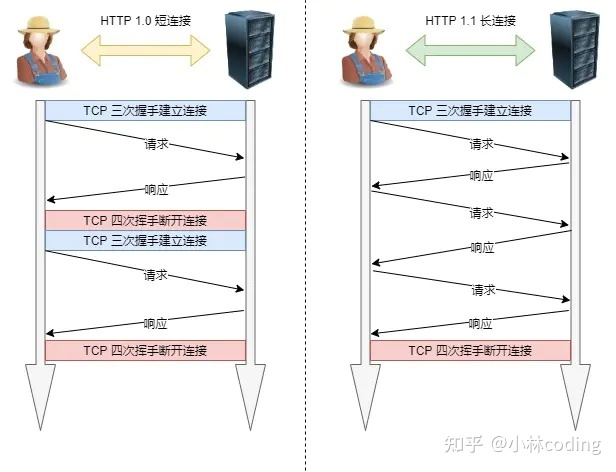

2. ==<u>管道网络传输</u>==

   HTTP/1.1 采用了长连接的方式，这使得管道（pipeline）网络传输成为了可能。

   即可在同一个 TCP 连接里面，客户端可以发起多个请求，只要第一个请求发出去了，不必等其回来，就可以发第二个请求出去，可以**减少整体的响应时间。**

   举例来说，客户端需要请求两个资源。以前的做法是，在同一个 TCP 连接里面，先发送 A 请求，然后等待服务器做出回应，收到后再发出 B 请求。那么，管道机制则是允许浏览器同时发出 A 请求和 B 请求，如下图：

   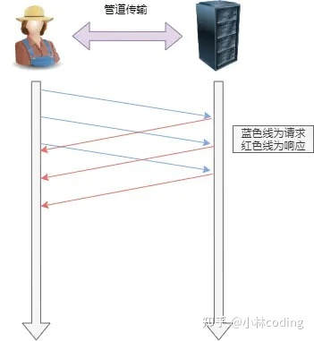

   但是**服务器必须按照接收请求的顺序发送对这些管道化请求的响应**。

   注意，是<u>按照服务端收到的请求顺序响应</u>   （<u>==既然二进制了 是不是可以给请求按顺序编号？==</u>），并不管哪个请求是先发送的，假设客户端先发送 A 请求，后发送 B 请求，如果服务端先收到 B 请求，就先响应 B 请求，然后再响应 A 请求，但是假设处理 B 请求的时候，耗时比较长，那么请求 A 的响应就会被阻塞，这称为「队头堵塞」。

   所以，**HTTP/1.1 管道解决了请求的队头阻塞？，但是没有解决响应的队头阻塞**

3. <u>==队头阻塞==</u>

   「请求 - 应答」的模式加剧了 HTTP 的性能问题。

   因为当顺序发送的请求序列中的一个请求因为某种原因被阻塞时，在后面排队的所有请求也一同被阻塞了，会招致客户端一直请求不到数据，这也就是「**队头阻塞**」，好比上班的路上塞车。

   

   总之 HTTP/1.1 的性能一般般，后续的 HTTP/2 和 HTTP/3 就是在优化 HTTP 的性能。

## 3.8.   HTTP和HTTPS的区别，以及HTTPS有什么缺点？

>HTTP：是互联网上应用最为广泛的一种网络协议，是一个客户端和服务器端请求和应答的标准（TCP），用于从WWW服务器传输超文本到本地浏览器的传输协议，它可以使浏览器更加`高效`，使`网络传输减少`。
>
>HTTPS：是以安全为目标的HTTP通道，简单讲是HTTP的安全版，即HTTP下加入SSL层，HTTPS的安全基础是SSL，因此加密的详细内容就需要SSL。
>
>HTTPS协议的主要作用可以分为两种：一种是<u>建立一个`信息安全通道`，来保证数据传输的安全</u>；另一种就是<u>`确认网站的真实性`</u>。

### [HTTPS](https://segmentfault.com/a/1190000021494676)：1. ssl握手 2. 证书

> 应用tls协议 进行 ssl层握手     （==<u>信息安全通道</u>==）
>
> 根据证书 验证网站的安全合法存在  （==<u>确认网站的真实性</u>==）

<u>**T**ransport **L**ayer **S**ecurity **传输层安全性协议**</u>

<u>**S**ecure **S**ockets **L**ayer **安全套接层**</u>

### HTTP协议和HTTPS协议`区别`如下：

1. HTTP协议是以`明文`的方式在网络中传输数据，而HTTPS协议传输的数据则是经过`TLS加密`后的，==HTTPS具有更高的安全性==
2. HTTPS在TCP三次握手阶段之后，还需要进行`SSL 的handshake`，协商加密使用的`对称加密密钥`
3. HTTPS协议需要服务端申请证书，浏览器端安装对应的根==证书==
4. HTTP协议端口是80，HTTPS协议端口是443

[HTTPS 之 SSL/TLS 握手协议（Handshake Protocol）全过程解析 - 简书 (jianshu.com)](https://www.jianshu.com/p/07a1e362e1ba)

### HTTPS优点：

HTTPS传输数据过程中`使用密钥进行加密，所以安全性更高`

HTTPS协议可以`认证用户和服务器`，`确保数据发送到正确`的用户和服务器

> 1. 使用HTTPS协议可认证用户和服务器，确保数据发送到正确的客户机和服务器；
> 2. HTTPS协议是由SSL+HTTP协议构建的可进行加密传输、身份认证的网络协议，要比http协议安全，可防止数据在传输过程中不被窃取、改变，确保数据的完整性。
> 3. HTTPS是`现行架构下最安全`的解决方案，虽然`不是绝对安全`，但它大幅`增加了中间人攻击的成本`。
> 4. 谷歌曾在2014年8月份调整搜索引擎算法，并称“比起同等HTTP网站，采用HTTPS加密的网站在搜索结果中的排名将会更高”。

### HTTPS缺点：

HTTPS<u>==握手阶段延时较高==</u>：由于在进行HTTP会话之前还需要进行`SSL握手`，因此HTTPS协议握手阶段`延时增加`

HTTPS<u>==部署成本高==</u>：一方面HTTPS协议需要使用`证书来验证`自身的安全性，所以需要`购买CA证书`；另一方面由于采用HTTPS协议需要进行加`解密`的计算，`占用CPU资源`较多，需要的服务器配置或数目高

> 1. HTTPS协议握手阶段比较费时，会使页面的加载时间延长近`50%`，增加10%到20%的耗电；
> 2. HTTPS连接缓存不如HTTP高效，会增加数据开销和功耗，甚至已有的安全措施也会因此而受到影响；
> 3. SSL证书需要钱，功能越强大的证书费用越高，个人网站、小网站没有必要一般不会用。
> 4. SSL证书通常需要绑定IP，不能在同一IP上绑定多个域名，IPv4资源不可能支撑这个消耗。
> 5. HTTPS协议的加密范围也比较有限，在黑客攻击、拒绝服务攻击、服务器劫持等方面几乎起不到什么作用。最关键的，SSL证书的信用链体系并不安全，特别是在某些国家可以控制CA根证书的情况下，中间人攻击一样可行。

 

数字证书，可以自己制作，也可以向组织申请。区别就是自己颁发的证书需要客户端验证通过，才可以继续访问，而使用受信任的公司申请的证书则不会弹出提示页面。

**CA**证书（可以防止中间人攻击）：

CA证书是一种权威的电子文档,用于证明某一主体(如组织机构)的身份合法性,又称为网络的身份证。证书是由权威公正的第三方机构签发的，以确保网上传递信息的机密性、完整性，以及交易实体身份的真实性,信息的不可否认性,从而保障网络应用的可靠性。

## **HTTP 与 HTTPS**

### **HTTP 与 HTTPS 有哪些区别？**

1. HTTP 是超文本传输协议，信息是`明文传输`，存在`安全风险`的问题。HTTPS 则解决 HTTP 不安全的缺陷，在 TCP 和 HTTP 网络层之间加入了 SSL/TLS `安全协议`，使得报文能够`加密传输`。
2. HTTP 连接建立相对`简单`， TCP 三次握手之后便可进行 HTTP 的报文传输。而 HTTPS 在 TCP 三次握手之后，还需进行 SSL/TLS 的`握手`过程，才可进入加密报文传输。
3. HTTP 的`端口`号是 80，HTTPS 的端口号是 443。
4. HTTPS 协议需要向 CA（证书权威机构）申请`数字证书`，来保证服务器的身份是可信的。

### **HTTPS 解决了 HTTP 的哪些问题？**

HTTP 由于是明文传输，所以安全上存在以下三个风险：

- **窃听风险**，比如通信链路上可以获取`通信内容`，用户号容易没。   ==<u>（信息容易被窃取）</u>==
- **篡改风险**，比如`强制植入`垃圾广告，视觉污染，用户眼容易瞎。  ==<u>（缺少数据的完整校验）</u>==
- **冒充风险**，比如`冒充`淘宝网站，用户钱容易没。     ==<u>（缺少网站的真实校验）</u>==

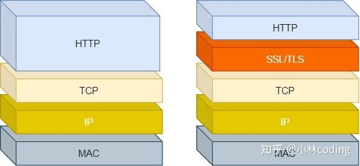

HTTP**S** 在 HTTP 与 TCP 层之间加入了 `SSL/TLS` 协议，可以很好的解决了上述的风险：

- **信息加密**：交互信息无法被窃取，但你的号会因为「自身忘记」账号而没。     ==<u>（混合加密）</u>==
- **校验机制**：无法篡改通信内容，篡改了就不能正常显示，但百度「竞价排名」依然可以搜索垃圾广告。  <u>==（完整内容的唯一hash）==</u>
- **身份证书**：证明淘宝是真的淘宝网，但你的钱还是会因为「剁手」而没。     ==<u>（证书校验机制）</u>==

可见，只要自身不做「恶」，SSL/TLS 协议是能保证通信是安全的。

#### HTTPS 是如何解决上面的三个风险的？

- **==混合加密==**的方式实现信息的**机密性**，解决了窃听的风险。
- **==摘要算法==**的方式来实现**完整性**，它能够为数据生成独一无二的「指纹」，指纹用于校验数据的完整性，解决了篡改的风险。
- 将服务器公钥放入到**==数字证书==**中，解决了冒充的风险。

##### *1. 混合加密*

通过**混合加密**的方式可以保证信息的**机密性**，解决了窃听的风险。

HTTPS 采用的是**对称加密**和**非对称加密**结合的「`混合加密`」方式：

- 在通信建立前采用**非对称加密**的方式交换「会话秘钥」，后续就不再使用非对称加密。
- 在通信过程中全部使用**对称加密**的「会话秘钥」的方式加密明文数据。

采用「混合加密」的方式的原因：

- 只使用一个密钥，`运算速度快`，密钥必须保密，无法做到安全的密钥交换</u>
- <u>**非对称加密**使用两个密钥：公钥和私钥，公钥可以任意分发而私钥保密，`解决了密钥交换问题但速度慢`。</u>

##### *2. 摘要算法 + 数字签名*

为了`保证传输的内容不被篡改`，我们需要对内容计算出一个「指纹」，然后同内容一起传输给对方。

对方收到后，先是对内容也计算出一个「指纹」，然后跟发送方发送的「指纹」做一个比较，如果「指纹」相同，说明内容没有被篡改，否则就可以判断出内容被篡改了。

那么，在计算机里会**用摘要算法（哈希函数）来计算出内容的哈希值**，也就是内容的「指纹」，这个**哈希值是唯一的，且无法通过哈希值推导出内容**。

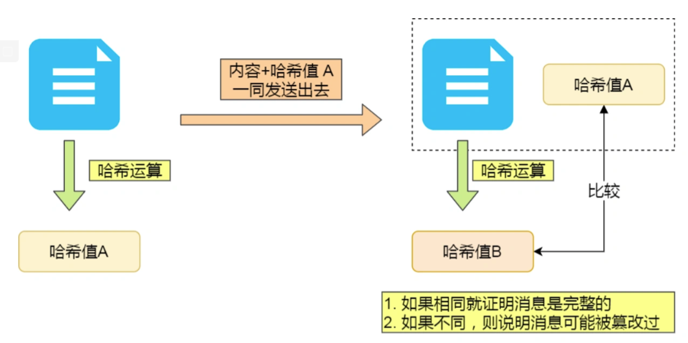

通过哈希算法可以确保内容不会被篡改，**但是并不能保证「`内容 + 哈希值`」不会`被中间人替换`，因为这里`缺少对客户端收到的消息是否来源于服务端的证明`**。

> 因此 通过公钥私钥对数据进行数字签名 从而得到 数据来源于 客户端服务端 这个连接 

计算机里会用**非对称加密算法**来解决，共有两个密钥：

- 一个是公钥，这个是可以公开给所有人的；
- 一个是私钥，这个必须由本人管理，不可泄露。

这两个密钥可以**`双向加解密`**的，比如可以用公钥加密内容，然后用私钥解密，也可以用私钥加密内容，公钥解密内容。

流程的不同，意味着目的也不相同：

- **公钥加密，私钥解密**。这个目的是为了**保证内容传输的安全**，因为被公钥加密的内容，其他人是无法解密的，只有持有私钥的人，才能解密出实际的内容；
- **私钥加密，公钥解密**。这个目的是为了**保证消息不会被冒充**，因为私钥是不可泄露的，如果公钥能正常解密出私钥加密的内容，就能证明这个消息是来源于持有私钥身份的人发送的。

一般我们不会用非对称加密来加密实际的传输内容，因为非对称加密的计算比较耗费性能的。

所以非对称加密的用途主要在于**通过「私钥加密，公钥解密」的方式，来确认消息的身份**，我们常说的**数字签名算法**，就是用的是这种方式，不过私钥加密内容不是内容本身，而是**对内容的哈希值加密**。

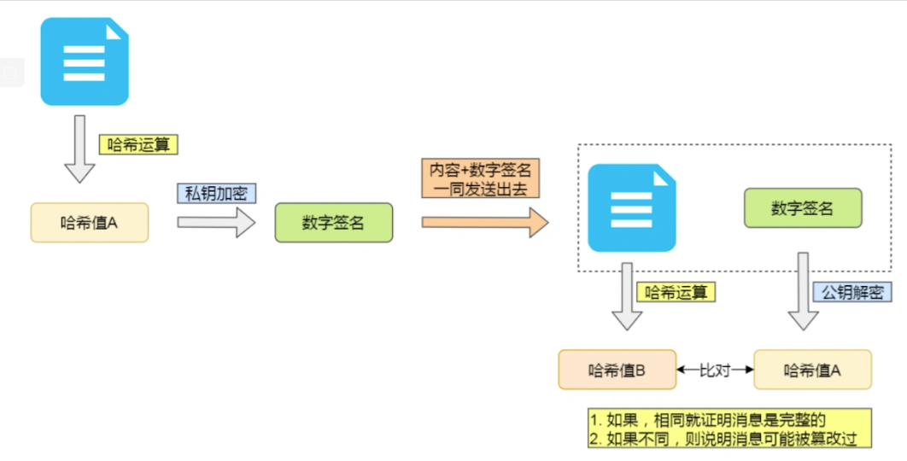

==私钥是由服务端保管==，然后服务端会向客户端颁发对应的公钥。如果客户端收到的信息，能被公钥解密，就说明该消息是由服务器发送的。

> `所以数字签名算法 只能 用来客户端确认服务端的身份`

引入了数字签名算法后，你就无法模仿你爸爸的字迹来请假了，你爸爸手上持有着私钥，你老师持有着公钥。

这样只有用你爸爸手上的私钥才对请假条进行「签名」，老师通过公钥看能不能解出这个「签名」，如果能解出并且确认内容的完整性，就能证明是由你爸爸发起的请假条，这样老师才允许你请假，否则老师就不认。

> ==<u>**我不理解为什么要用数字签名？？**</u>==
>
> `理解了：数字签名是单单用来验证数字证书用的 浏览器内置CA证书就内置了CA的公钥，服务器申请CA证书时，机构用CA的私钥去加密服务器的公钥`

##### *3. 数字证书*

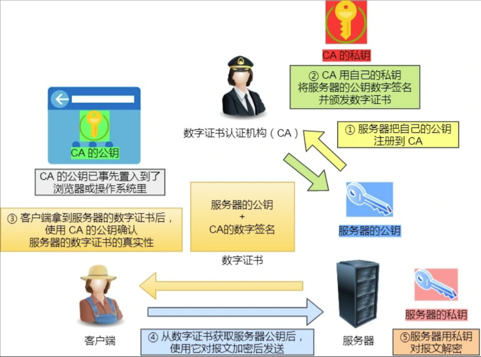

> ==<u>**搜嘎：数字签名算法是用来对数字证书进行签名的 为了用CA证书的公钥去确认服务器的身份**</u>==

## [HTTPS 是如何建立连接的？其间交互了什么？](https://xiaolincoding.com/network/2_http/http_interview.html#https-是如何建立连接的-其间交互了什么)

## HTTP/1.1、HTTP/2、HTTP/3 演变

### HTTP/1.1 相比 HTTP/1.0 提高了什么性能？

HTTP/1.1 相比 HTTP/1.0 性能上的改进：

- 使用长连接的方式改善了 HTTP/1.0 短连接造成的性能开销。
- 支持管道（pipeline）网络传输，只要第一个请求发出去了，不必等其回来，就可以发第二个请求出去，可以减少整体的响应时间。

但 HTTP/1.1 还是有性能瓶颈：

- 请求 / 响应头部（Header）未经压缩就发送，首部信息越多延迟越大。只能压缩 `Body` 的部分；
- 发送冗长的首部。每次互相发送相同的首部造成的浪费较多；
- 服务器是按请求的顺序响应的，如果服务器响应慢，会招致客户端一直请求不到数据，也就是队头阻塞；
- 没有请求优先级控制；
- 请求只能从客户端开始，服务器只能被动响应。

### HTTP/2 做了什么优化？

HTTP/2 协议是基于 HTTPS 的，所以 HTTP/2 的安全性也是有保障的。

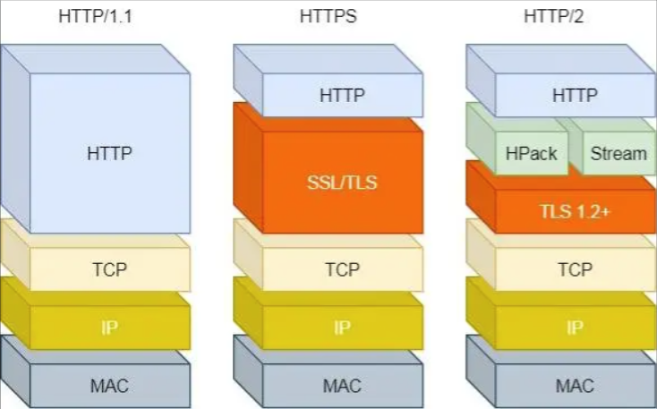

那 HTTP/2 相比 HTTP/1.1 性能上的改进：

#### *1. `头部压缩`*

HTTP/2 会**压缩头**（Header）如果你同时发出多个请求，他们的头是一样的或是相似的，那么，协议会帮你**消除重复的部分**。

这就是所谓的 `HPACK` 算法：在客户端和服务w器同时维护一张头信息表，所有字段都会存入这个表，生成一个==索引号==，以后就不发送同样字段了，只发送索引号，这样就**提高速度**了。

#### *2. `二进制`格式*

HTTP/2 不再像 HTTP/1.1 里的纯文本形式的报文，而是全面采用了**二进制格式**，头信息和数据体都是二进制，并且统称为帧（frame）：**头信息帧（Headers Frame）和数据帧（Data Frame）**。

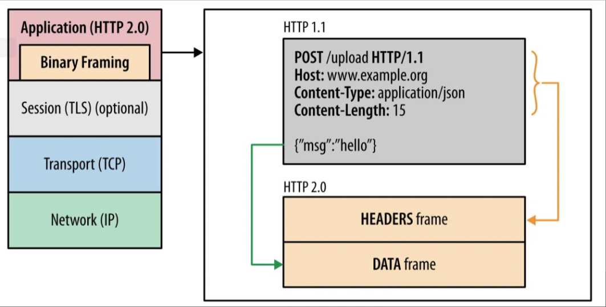

这样虽然对人不友好，但是对计算机非常友好，因为计算机只懂二进制，那么收到报文后，无需再将明文的报文转成二进制，而是直接解析二进制报文，这**增加了数据传输的效率**。

比如状态码 200 ，在 HTTP/1.1 是用 '2''0''0' 三个字符来表示（二进制：110010 110000 110000）

在 HTTP/2 是用数字 200 表示（二进制：11001000）

#### *3. `数据流`*

HTTP/2 的数据包不是按顺序发送的，同一个连接里面连续的数据包，可能属于不同的回应。因此，必须要对数据包做标记，指出它属于哪个回应。

在 HTTP/2 中每个请求或响应的所有数据包，称为一个数据流（`Stream`）。每个数据流都标记着一个独一无二的`编号（Stream ID）`，**不同 Stream 的帧是可以乱序发送的（因此可以并发不同的 Stream ）**，因为每个帧的头部会携带 Stream ID 信息，所以接收端可以通过 Stream ID 有序组装成 HTTP 消息

客户端和服务器**双方都可以建立 Stream**， Stream ID 也是有区别的，客户端建立的 Stream 必须是奇数号，而服务器建立的 Stream 必须是偶数号。

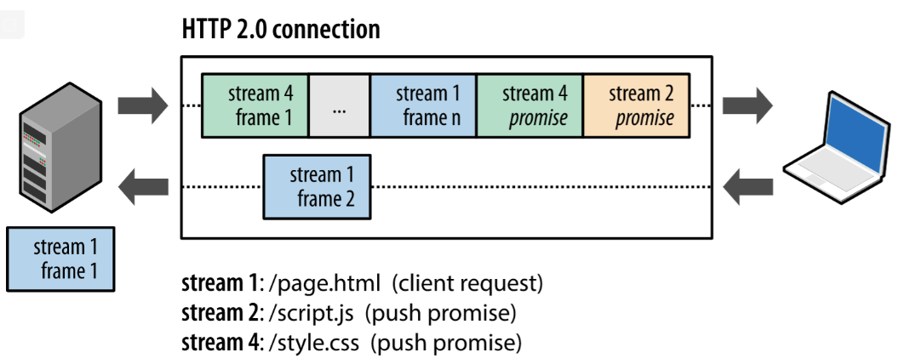

客户端还可以**指定数据流的优先级**。优先级高的请求，服务器就先响应该请求。

#### 4. 多路复用

HTTP/2 是可以在**`一个连接中并发多个请求或回应，而不用按照顺序一一对应`**。

移除了 HTTP/1.1 中的串行请求，不需要排队等待，也就不会再出现「队头阻塞」问题，**降低了延迟，大幅度提高了连接的利用率**。

举例来说，在一个 TCP 连接里，服务器收到了客户端 A 和 B 的两个请求，如果发现 A 处理过程非常耗时，于是就回应 A 请求已经处理好的部分，接着回应 B 请求，完成后，再回应 A 请求剩下的部分。

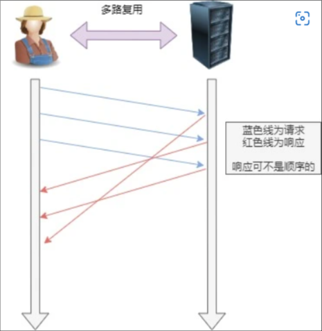

#### 5. 服务器`推送`

HTTP/2 还在一定程度上改善了传统的「请求 - 应答」工作模式，服务端不再是被动地响应，可以**`主动`**向客户端发送消息。

比如，客户端通过 HTTP/1.1 请求从服务器那获取到了 HTML 文件，而 HTML 可能还需要依赖 CSS 来渲染页面，这时客户端还要再发起获取 CSS 文件的请求，需要两次消息往返，如下图左边部分：

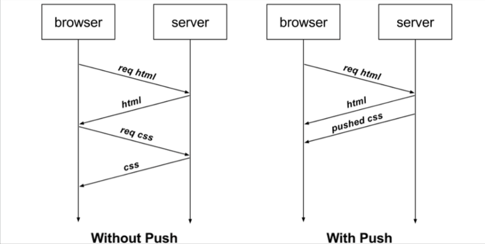

如上图右边部分，在 HTTP/2 中，客户端在访问 HTML 时，服务器可以直接主动推送 CSS 文件，减少了消息传递的次数。

> `HTTP/2 有什么缺陷？`
>
> tcp的问题 序号不对应 后面的需要重传 因此还是有tcp的大的队头阻塞的问题
>
> **HTTP/2 是基于 TCP 协议来传输数据的，TCP 是字节流协议，TCP 层必须保证收到的字节数据是完整且连续的，这样内核才会将缓冲区里的数据返回给 HTTP 应用，那么当「前 1 个字节数据」没有到达时，后收到的字节数据只能存放在内核缓冲区里，只有等到这 1 个字节数据到达时，HTTP/2 应用层才能从内核中拿到数据，这就是 HTTP/2 队头阻塞问题。**
>
> 所以，一旦发生了丢包现象，就会触发 TCP 的重传机制，这样在一个 TCP 连接中的**所有的 HTTP 请求都必须等待这个丢了的包被重传回来**。

### HTTP/3 做了哪些优化？

前面我们知道了 HTTP/1.1 和 HTTP/2 都有队头阻塞的问题：

- HTTP/1.1 中的`管道`（ pipeline）虽然`解决了请求的队头阻塞`，但是**没有解决响应的队头阻塞**，因为服务端需要按顺序响应收到的请求，如果服务端处理某个请求消耗的时间比较长，那么只能等相应完这个请求后， 才能处理下一个请求，这属于 HTTP 层队头阻塞。
- HTTP/2 虽然通过`多个请求复用一个 TCP 连接`解决了 HTTP 的队头阻塞 ，但是**一旦发生丢包，就会阻塞住所有的 HTTP 请求**，这属于 TCP 层队头阻塞。

HTTP/2 队头阻塞的问题是因为 TCP，所以 **HTTP/3 把 HTTP 下层的 TCP 协议改成了 `UDP`！**

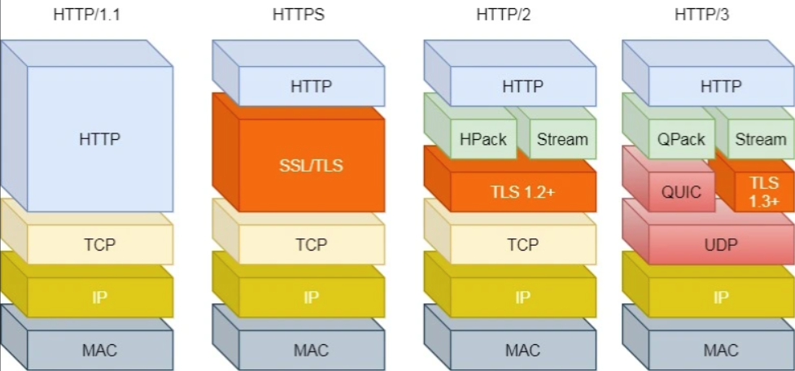

UDP 发生是不管顺序，也不管丢包的，所以不会出现像 HTTP/2 队头阻塞的问题

大家都知道 UDP 是不可靠传输的，但基于 UDP 的 **QUIC 协议** 可以实现类似 TCP 的可靠性传输。

QUIC 有以下 3 个特点。

#### 1、无队头阻塞

QUIC 协议也有类似 HTTP/2 Stream 与多路复用的概念，也是可以在同一条连接上并发传输多个 Stream，Stream 可以认为就是一条 HTTP 请求。

QUIC 有自己的一套机制可以保证传输的可靠性的。**当某个流发生丢包时，只会阻塞这个流，其他流不会受到影响，因此不存在队头阻塞问题**。这与 HTTP/2 不同，HTTP/2 只要某个流中的数据包丢失了，其他流也会因此受影响。

所以，QUIC 连接上的多个 Stream 之间并没有依赖，都是独立的，某个流发生丢包了，只会影响该流，其他流不受影响。

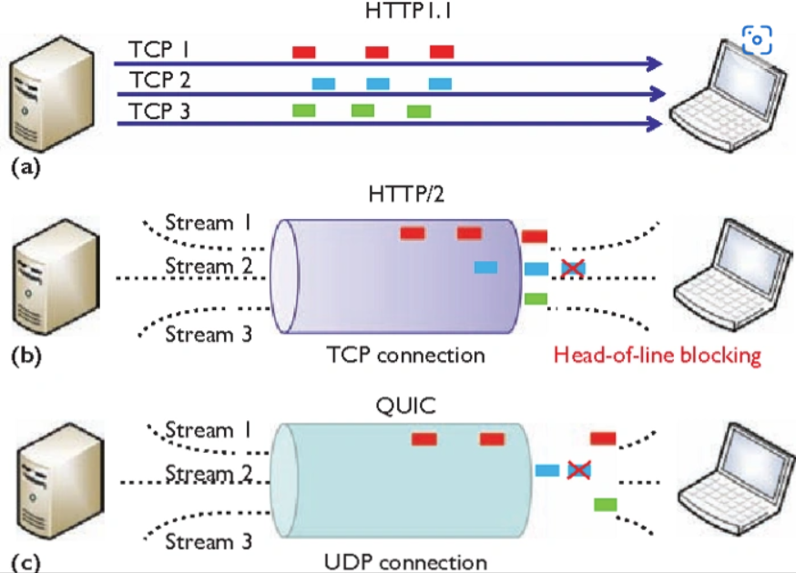

#### 2、更快的连接建立

对于 HTTP/1 和 HTTP/2 协议，TCP 和 TLS 是分层的，分别属于内核实现的传输层、openssl 库实现的表示层，因此它们难以合并在一起，需要分批次来握手，先 TCP 握手，再 TLS 握手。

HTTP/3 在传输数据前虽然需要 QUIC 协议握手，这个握手过程只需要 1 RTT，握手的目的是为确认双方的「连接 ID」，连接迁移就是基于连接 ID 实现的。

但是 HTTP/3 的 QUIC 协议并不是与 TLS 分层，而是QUIC 内部包含了 TLS，它在自己的帧会携带 TLS 里的“记录”，再加上 QUIC 使用的是 TLS/1.3，因此仅需 1 个 RTT 就可以「同时」完成建立连接与密钥协商，如下图：

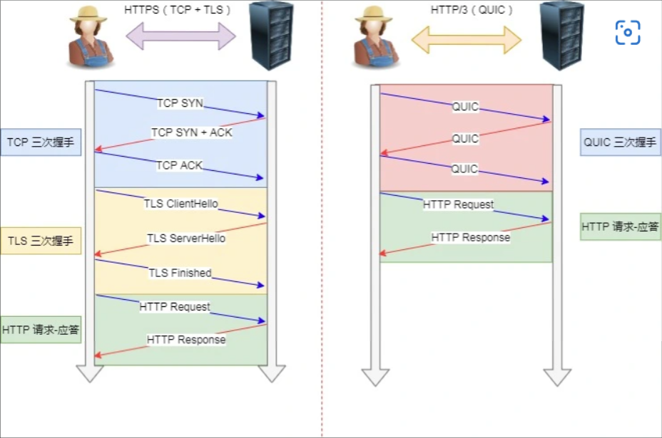

甚至，在第二次连接的时候，应用数据包可以和 QUIC 握手信息（连接信息 + TLS 信息）一起发送，达到 0-RTT 的效果。

#### 3、连接迁移

基于 TCP 传输协议的 HTTP 协议，由于是通过四元组（源 IP、源端口、目的 IP、目的端口）确定一条 TCP 连接，那么**`当移动设备的网络从 4G 切换到 WIFI 时，意味着 IP 地址变化了，那么就必须要断开连接，然后重新建立连接`**。而建立连接的过程包含 TCP 三次握手和 TLS 四次握手的时延，以及 TCP 慢启动的减速过程，<u>给用户的感觉就是网络突然卡顿了一下</u>，因此连接的迁移成本是很高的。

而 QUIC 协议没有用四元组的方式来“绑定”连接，而是通过**==连接 ID==**来标记通信的两个端点，客户端和服务器可以各自选择一组 ID 来标记自己，因此即使移动设备的网络变化后，导致 IP 地址变化了，只要仍保有上下文信息（比如连接 ID、TLS 密钥等），就可以“无缝”地复用原连接，消除重连的成本，没有丝毫卡顿感，达到了**连接迁移**的功能。

所以， `QUIC 是一个在 UDP 之上的==伪== TCP + TLS + HTTP/2 的多路复用的协议`。

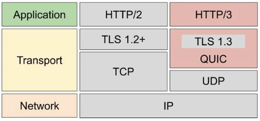

QUIC 是新协议，对于很多网络设备，根本不知道什么是 QUIC，只会当做 UDP，这样会出现新的问题，因为有的网络设备是会丢掉 UDP 包的，而 QUIC 是基于UDP 实现的，那么如果网络设备无法识别这个是 QUIC 包，那么就会当作 UDP包，然后被丢弃。

所以，`HTTP/3 现在普及的进度非常的缓慢`，不知道未来 UDP 是否能够逆袭 TCP。

## HTTP/1.1如何优化？

- *尽量避免发送 HTTP 请求*；
- *在需要发送 HTTP 请求时，考虑如何减少请求次数*；
- *减少服务器的 HTTP 响应的数据大小*；

### 如何避免发送 HTTP 请求？

使用缓存技术 分为强制缓存和协商缓存

[转向 本文中的缓存部分](#HTTP 缓存)

### 如何减少 HTTP 请求次数？

- *减少重定向请求次数*；
- *合并请求*；
- *延迟发送请求*；

#### 1. 减少重定向请求次数

服务器上的一个资源可能由于迁移、维护等原因从 url1 移至 url2 后，而客户端不知情，它还是继续`请求 url1`，这时服务器不能粗暴地返回错误，而是通过 `302` 响应码和 `Location` 头部，告诉客户端该资源已经迁移至 url2 了，于是客户端需要`再发送 url2 请求`以获得服务器的资源。

另外，服务端这一方往往不只有一台服务器，比如源服务器上一级是代理服务器，然后代理服务器才与客户端通信，这时客户端重定向就会导致客户端与代理服务器之间需要 2 次消息传递，如下图：

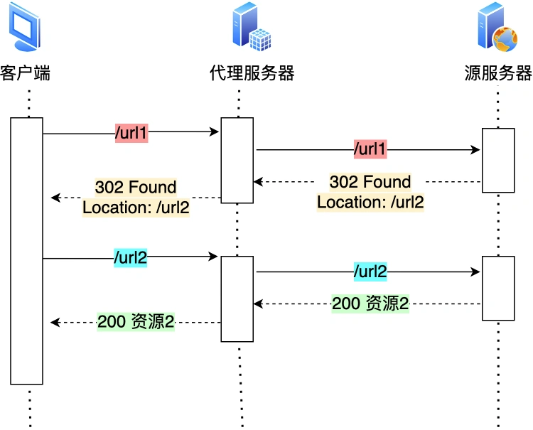

如果==<u>**重定向的工作交由代理服务器完成，就能减少 HTTP 请求次数了**</u>==，如下图：

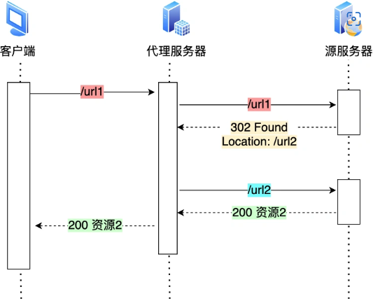

而且当代理服务器`知晓了重定向规则`后，可以进一步减少消息传递次数，如下图：

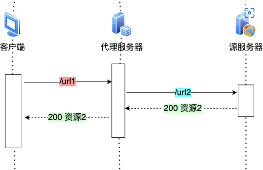

####  2. 合并请求

如果把多个访问小文件的请求合并成一个大的请求，虽然传输的总资源还是一样，但是减少请求，也就意味着**`减少了重复发送的 HTTP 头部`**。

另外由于 HTTP/1.1 是请求响应模型，如果第一个发送的请求，未收到对应的响应，那么后续的请求就不会发送，于是为了防止单个请求的阻塞，所以一般浏览器会同时发起 5-6 个请求，每一个请求都是不同的 TCP 连接，那么如果合并了请求，也就会**减少 TCP 连接的数量，因而省去了 TCP 握手和慢启动过程耗费的时间**。

#### 3. 延迟发送请求

不要一口气吃成大胖子，一般 HTML 里会含有很多 HTTP 的 URL，当前不需要的资源，我们没必要也获取过来，于是可以通过「**`按需获取`**」的方式，来减少第一时间的 HTTP 请求次数。

请求网页的时候，没必要把全部资源都获取到，而是只获取当前用户所看到的页面资源，`当用户向下滑动页面的时候，再向服务器获取接下来的资源`，这样就达到了延迟发送请求的效果。

### 如何减少 HTTP 响应的数据大小？

压缩的方式一般分为 2 种，分别是：

- *无损压缩*；
- *有损压缩*；

#### [#](https://xiaolincoding.com/network/2_http/http_optimize.html#无损压缩)无损压缩

无损压缩是指资源经过压缩后，信息不被破坏，还能完全恢复到压缩前的原样，适合用在文本文件、程序可执行文件、程序源代码。

首先，我们针对代码的语法规则进行压缩，因为通常代码文件都有很多换行符或者空格，这些是为了帮助程序员更好的阅读，但是机器执行时并不要这些符，把这些多余的符号给去除掉。

接下来，就是无损压缩了，需要对原始资源建立统计模型，利用这个统计模型，将常出现的数据用较短的二进制比特序列表示，将不常出现的数据用较长的二进制比特序列表示，生成二进制比特序列一般是「霍夫曼编码」算法。

gzip 就是比较常见的无损压缩。客户端支持的压缩算法，会在 HTTP 请求中通过头部中的 `Accept-Encoding` 字段告诉服务器：

```text
Accept-Encoding: gzip, deflate, br
```

服务器收到后，会从中选择一个服务器支持的或者合适的压缩算法，然后使用此压缩算法对响应资源进行压缩，最后通过响应头部中的 `content-encoding` 字段告诉客户端该资源使用的压缩算法。

```text
content-encoding: gzip
```

gzip 的压缩效率相比 Google 推出的 Brotli 算法还是差点意思，也就是上文中的 br，所以如果可以，服务器应该选择压缩效率更高的 br 压缩算法。

#### [#](https://xiaolincoding.com/network/2_http/http_optimize.html#有损压缩)有损压缩

与无损压缩相对的就是有损压缩，经过此方法压缩，解压的数据会与原始数据不同但是非常接近。

有损压缩主要将次要的数据舍弃，牺牲一些质量来减少数据量、提高压缩比，这种方法经常用于压缩多媒体数据，比如音频、视频、图片。

可以通过 HTTP 请求头部中的 `Accept` 字段里的「 q 质量因子」，告诉服务器期望的资源质量。

```text
Accept: audio/*; q=0.2, audio/basic
```

> 关于图片的压缩，目前压缩比较高的是 Google 推出的 **WebP 格式**

### 总结

这次主要从 3 个方面介绍了优化 HTTP/1.1 协议的思路。

- 第一个思路是，通过`缓存技术`来避免发送 HTTP 请求。客户端收到第一个请求的响应后，可以将其缓存在本地磁盘，下次请求的时候，如果缓存没过期，就直接读取本地缓存的响应数据。如果缓存过期，客户端发送请求的时候带上响应数据的摘要，服务器比对后发现资源没有变化，就发出不带包体的 304 响应，告诉客户端缓存的响应仍然有效。

- 第二个思路是，`减少 HTTP 请求的次数`，有以下的方法：
  1. 将原本由客户端处理的`重定向`请求，`交给代理服务器`处理，这样可以减少重定向请求的次数；
  2. 将`多个小资源合并成一个大资源`再传输，能够减少 HTTP 请求次数以及 头部的重复传输，再来减少 TCP 连接数量，进而省去 TCP 握手和慢启动的网络消耗；
  3. `按需访问资源`，只访问当前用户看得到/用得到的资源，`当客户往下滑动，再访问接下来的资源`，以此达到延迟请求，也就减少了同一时间的 HTTP 请求次数。

- 第三思路是，通过`压缩响应资源`，降低传输资源的大小，从而提高传输效率，所以应当选择更优秀的压缩算法。

不管怎么优化 HTTP/1.1 协议都是有限的，不然也不会出现 HTTP/2 和 HTTP/3 协议，后续我们再来介绍 HTTP/2 和 HTTP/3 协议。

## [HTTPS RSA 握手解析 | 小林coding (xiaolincoding.com)](https://xiaolincoding.com/network/2_http/https_rsa.html)

## [HTTPS ECDHE 握手解析 | 小林coding (xiaolincoding.com)](https://xiaolincoding.com/network/2_http/https_ecdhe.html)

## [HTTPS 如何优化](https://xiaolincoding.com/network/2_http/https_optimize.html)


## 加密算法

HTTPS 解决数据传输安全问题的方案就是使用加密算法，具体来说是`混合加密算法`，也就是对称加密和非对称加密的混合使用，这里有必要先了解一下这两种加密算法的区别和优缺点。

### 1. 对称加密

对称加密，顾名思义就是`加密和解密都是使用同一个密钥`，常见的对称加密算法有 DES（Data Encryption Standard）、3DES 和 AES 等，其优缺点如下：

- 优点：算法公开、计算量小、加密速度快、加密`效率高`，适合加密比较大的数据。
- 缺点：
  1. 交易双方需要使用相同的密钥，也就<u>无法避免密钥的传输</u>，而密钥在传输过程中无法保证不被截获，因此对称加密的安全性得不到保证。  <u>==（密钥在传输中仍然可能被截获）==</u>
  2. 每对用户每次使用对称加密算法时，都需要使用其他人不知道的惟一密钥，这会使得发收信双方所拥有的钥匙数量急剧增长，[密钥管理](https://link.segmentfault.com/?enc=ue%2Bb8jIV3ClgNvpQRxREtg%3D%3D.NSuaakxo1dtKPyYdkpx5juKUSvvMwcH2CZvVVAAZeNMYgy0qPHjkz5y4H8HfsXFu)成为双方的负担。对称加密算法在分布式网络系统上使用较为困难，主要是因为密钥管理困难，使用成本较高。<u>==（密钥唯一，变多 管理负担）==</u>

不对具体的加密算法做详细介绍，可以参考 [对称加密算法详解](https://link.segmentfault.com/?enc=UyJybS0fpwfGVIDnSlCQXA%3D%3D.yJngp8X2cK4CK3Vn9uNYKamXIrv1FkUDqf2WyZmuap5koz0Ud0Pbm69K9P0en2b5nw3kxwKl3ChHqGU34enItQ%3D%3D)，


从图中可以看出，被加密的数据在传输过程中是无规则的乱码，即便被第三方截获，在没有密钥的情况下也无法解密数据，也就保证了数据的安全。但是有一个致命的问题，那就是既然双方要使用相同的密钥，那就必然要在传输数据之前先由一方把密钥传给另一方，那么在此过程中<u>==**密钥就很有可能被截获**==</u>，这样一来加密的数据也会被轻松解密。那如何确保密钥在传输过程中的安全呢？这就要用到`非对称加密`了。

### 2. 非对称加密

非对称加密，顾名思义，就是加密和解密需要使用两个不同的密钥：公钥（public key）和私钥（private key）。公钥与私钥是一对，如果用公钥对数据进行加密，只有用对应的私钥才能解密；如果用私钥对数据进行加密，那么只有用对应的公钥才能解密。非对称加密算法实现机密信息交换的基本过程是：甲方生成一对密钥并将其中的一把作为公钥对外公开；得到该公钥的乙方使用公钥对机密信息进行加密后再发送给甲方；甲方再用自己保存的私钥对加密后的信息进行解密。如果对公钥和私钥不太理解，可以想象成一把钥匙和一个锁头，只是全世界只有你一个人有这把钥匙，你可以把锁头给别人，别人可以用这个锁把重要的东西锁起来，然后发给你，因为只有你一个人有这把钥匙，所以只有你才能看到被这把锁锁起来的东西。常用的非对称加密算法是 RSA 算法，想详细了解的同学点这里：[RSA 算法详解一](https://link.segmentfault.com/?enc=1N1DkxVrzw9slfAFvtB8zQ%3D%3D.DIMIymEV%2FnTMtRqgoXpxZx1L1Mq3zBRALGGEYcsquJb%2FxBjtSZrkcKf6TI7kbefS1TYJsTVP2KYTS9LxNxWMKo2hWw5bQRhFzam5GHMK6mo%3D)、[RSA 算法详解二](https://link.segmentfault.com/?enc=sIsYjXiPHcdxFzuLJ1Bj7Q%3D%3D.%2BUNw9hpET8m8mu7xFls6DPBFWlMsJ4ZjQXvwi3cCC57Buw6FV%2B4WEjSd17Ozv%2F5uviS2jE2KzNSIZucBEflIJ6LKnpSEHWJdG6q%2B6zKoKi0%3D)，其优缺点如下：

- 优点：算法公开，加密和解密使用不同的钥匙，私钥不需要通过网络进行传输，`安全性很高`。
- 缺点：`计算量比较大`，加密和解密速度相比对称加密慢很多。

由于非对称加密的强安全性，可以用它完美解决对称加密的密钥泄露问题，效果图如下：


在上述过程中，客户端在拿到服务器的公钥后，会生成一个随机码 (用 KEY 表示，这个 KEY 就是后续双方用于对称加密的密钥)，然后客户端使用公钥把 KEY 加密后再发送给服务器，服务器使用私钥将其解密，这样双方就有了同一个密钥 KEY，然后双方再使用 KEY 进行对称加密交互数据。在非对称加密传输 KEY 的过程中，即便第三方获取了公钥和加密后的 KEY，在没有私钥的情况下也无法破解 KEY (私钥存在服务器，泄露风险极小)，也就保证了接下来对称加密的数据安全。而上面这个流程图正是 HTTPS 的雏形，HTTPS 正好综合了这两种加密算法的优点，不仅保证了通信安全，还保证了数据传输效率。

## 3.9.   SSL加密 `混合加密`

https使用的是对称加密和非对称加密的结合方式。我们的证书验证部分采用的是非对称加密，信息传输部分采用的是对称加密 

### **加密过程**


1. 客户端A发出请求 给出 支持的SSL版本+一个随机数+自己支持的加密方式

2. 服务端B接收到这些信息后确认加密方式（比如TLS 1.0版本）+自己的安全证书（包含自己的公钥，为了保证公钥的安全性，上级CA用自己的私钥对数字证书进行签名）+一个随机数发给A

3. 客户端A确认数字证书有效性（内置CA证书），然后生成一个随机数，并将这个随机数用B的数字证书公钥加密后发送给A。

4. 服务端B使用自己的私钥解密这个随机数

5. A和B通过第二步确定的加密方法将前三个随机数生成一个对话密钥 用来接下来的通信（个人感觉不需要三个随机数，只用最后一个就够了，这样做可能是为了更安全）

### 安全性保证：

1. 双方通信内容的安全性是靠<u>公钥加密、私钥解密</u>来保证的，这一安全性由非对称加密的特性，即由公钥加密的信息只能使用对应的私钥才能解开来保证。由于私钥不会传递，只有拥有者知道，所以安全性就由公钥的正确性来保证。

2. 公钥由对方在通信初始所提供，但是这时很容易被中间人替换掉，**为了保证公钥的正确性，所以在发送公钥的时候也会提供对应的数字证书**，用于验证这个公钥是对方的而不是中间人的。那么安全性就是由数字证书的正确性来保证了。

3. 数字证书是由上级 CA 签发给个人 / 组织的，**上级** **CA** **用自己的私钥给个人证书进行签名，保证证书中的公钥不被篡改，而接受者需要用上级 CA** **证书中的公钥来解密个人数字证书中的数字签名来验证证书中的公钥是否是正确的。**那么安全性就是由上级 CA 证书的正确性保证的了。

4. 但是，上级 CA 证书也是由其上级 CA 签发的，这种信任关系一直到根证书。根证书没有上级 CA 为其签名，而是自签名的，也就是说，它自身为自身签名，保证正确性。所以<u>根证书就是这个信任链最重要的部分</u>。如果根证书泄露的话，其签名的所有证书及使用其签名的证书所签名的证书的安全性将不复存在。现在，安全性就是靠系统根证书的私钥不被泄露或者其公钥不被篡改来保证的了。

5. 根证书不应该通过网络分发，因为通过网络分发的话，可能会被中间人攻击。一般根证书都通过操作系统或者浏览器分发，在操作系统中会内置很多根证书，但是最初的操作系统也不能通过网络分发，因为中间人可以修改操作系统中的根证书。所以要保证安全只能靠最原始的方法，当面交流。硬件厂商会和证书签发机构合作，在电脑、手机等设备出厂的时候在其操作系统中内置签发机构的根证书，再将这些设备分发出去，这样，这些设备的用户就可以安全地进行信息交换了。所以，安全性就依赖于这些设备在分发到消费者手中之前不会被恶意修改来保证了。

## 3.10. 为什么对称加密和非对称加密一起用？

对称加密：

- 首先：非对称加密的加解密效率是非常`低`的，而 http 的应用场景中通常端与端之间存在大量的交互，非对称加密的`效率是无法接受`的。

- 另外：在 HTTPS 的场景中只有服务端保存了私钥，一对公私钥只能实现单向的加解密，所以 HTTPS 中内容传输加密采取的是对称加密，而不是非对称加密。

非对称加密：

- 只有服务器可以用自己的私钥来解密客户端的随机数，生成对话用的对称密钥。确保对称密钥的安全性。

> 1. `非对称加密的效率`低到无法接受，所以数据传输要使用对称加密
>
> 2. 非对称加密`更加安全` 所以必须使用

## 3.11. 报文被篡改会怎么样？怎么解决？

在双方的通信过程中，“黑客”除了简单的重复发送截获的消息之外，还可以`修改截获后的密文`修改后再发送，因为修改的是密文，虽然不能完全控制消息解密后的内容，但是仍然会破坏解密后的密文。因此发送过程如果黑客对密文进行了修改，“客户”和“服务器”是无法判断密文是否被修改的。虽然不一定能达到目的，但是“黑客”可以一直这样碰碰运气。 <u>==**（虽然不知道你发的内容，但是可以做破坏）**==</u>

**〖解决方法〗**

- 在每次发送信息时，先==对信息的内容进行一个hash计算得出一个hash值==，将信息的内容和这个hash值一起加密后发送。接收方在收到后进行解密得到明文的内容和hash值，然后接收方再自己对收到信息内容做一次hash计算，与收到的hash值进行对比看是否匹配，如果匹配就说明信息在传输过程中没有被修改过。如果不匹配说明中途有人故意对加密数据进行了修改，立刻中断通话过程后做其它处理。

## 3.12. HTTPS中间人攻击，劫持证书、改造证书怎么办

### 为什么需要 CA 认证机构颁发证书？

> <u>==**证书的一个重要作用就是验证公钥的合法性**==</u>

HTTP 协议被认为不安全是因为传输过程容易被监听者勾线监听、伪造服务器，而 HTTPS 协议主要解决的便是网络传输的安全性问题。

首先我们假设不存在认证机构，任何人都可以制作证书，这带来的安全风险便是经典的**“中间人攻击”**问题。
“中间人攻击”的具体过程如下：

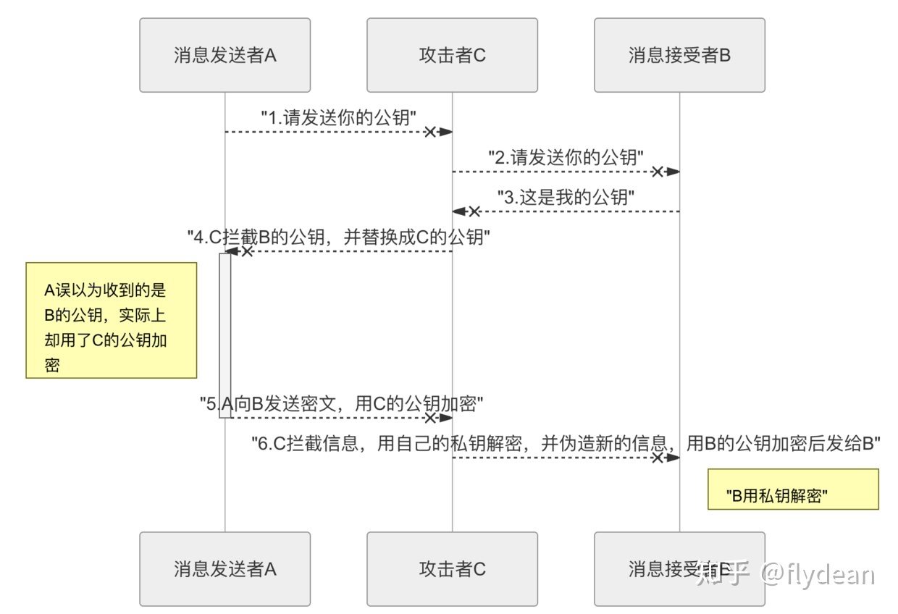

### 中间人攻击过程原理：

1. 本地请求被劫持（如DNS劫持等），所有请求均发送到中间人的服务器
2. 中间人服务器返回中间人自己的证书
3. 客户端创建随机数，通过中间人证书的公钥对随机数加密后传送给中间人，然后凭随机数构造对称加密对传输内容进行加密传输
4. 中间人因为拥有客户端的随机数，可以通过对称加密算法进行内容解密
5. 中间人以客户端的请求内容再向正规网站发起请求
6. 因为中间人与服务器的通信过程是合法的，正规网站通过建立的安全通道返回加密后的数据
7. 中间人凭借与正规网站建立的对称加密算法对内容进行解密
8. 中间人通过与客户端建立的对称加密算法对正规内容返回的数据进行加密传输
9. 客户端通过与中间人建立的对称加密算法对返回结果数据进行解密

由于缺少对证书的验证，所以客户端虽然发起的是 HTTPS 请求，但<u>客户端完全不知道自己的网络已被拦截，传输内容被中间人全部窃取</u>。

### 浏览器是如何确保 CA 证书的合法性？

#### 1. 证书包含什么信息？

- 颁发机构信息
- 公钥
- 公司信息
- 域名
- 有效期
- 指纹
- 等

#### 2. 证书的合法性依据是什么？

首先，权威机构是要有认证的，不是随便一个机构都有资格颁发证书，不然也不叫做权威机构。另外，证书的可信性基于信任制，权威机构需要对其颁发的证书进行信用背书，<u>只要是权威机构生成的证书，我们就认为是合法的</u>。所以权威机构会对申请者的信息进行审核，不同等级的权威机构对审核的要求也不一样，于是证书也分为免费的、便宜的和贵的。

#### 3. 浏览器如何验证证书的合法性？

浏览器发起 HTTPS 请求时，服务器会返回网站的 SSL 证书，浏览器需要对证书做以下验证：

> 1. `验证域名、有效期`等信息是否正确。证书上都有包含这些信息，比较容易完成验证；
>
> 2. 判断证书来源是否合法。每份签发证书都可以根据验证链查找到对应的根证书，操作系统、浏览器会在本地存储权威机构的根证书，利用本地根证书可以对对应机构签发证书完成`来源验证`；
>
>    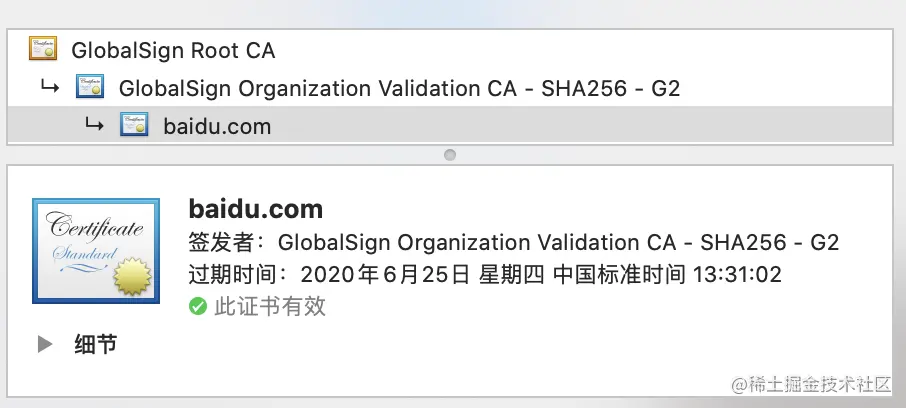
>
> 3. `判断证书是否被篡改`。需要与 CA 服务器进行校验；
>
> 4. `判断证书是否已吊销`。通过CRL（Certificate Revocation List 证书注销列表）和 OCSP（Online Certificate Status Protocol 在线证书状态协议）实现，其中 OCSP 可用于第3步中以减少与 CA 服务器的交互，提高验证效率

以上任意一步都满足的情况下浏览器才认为证书是合法的。


### `劫持证书、改造证书怎么办`

SSL劫持攻击即SSL证书欺骗攻击，攻击者为了获得HTTPS传输的明文数据，需要<u>先将自己接入到客户端和目标网站之间</u>；在传输过程中伪造服务器的证书，将服务器的公钥替换成自己的公钥，这样，中间人就可以得到明文传输带Key1、Key2和Pre-Master-Key，从而窃取客户端和服务端的通信数据；

数字证书就是申请人将一些必要信息（包括公钥、姓名、电子邮件、有效期）等提供给 CA，CA*（数字证书认证机构）*在通过各种手段确认申请人确实是他所声称的人之后，用自己的私钥对申请人所提供信息计算散列值进行加密，形成数字签名，附在证书最后，再将数字证书颁发给申请人，申请人就可以使用 CA 的证书向别人证明他自己的身份了。对方收到数字证书之后，只需要用 CA 的公钥解密证书最后的签名得到加密之前的散列值，再计算数字证书中信息的散列值，将两者进行对比，只要散列值一致，就证明这张数字证书是有效且未被篡改过的。

对于客户端来说，如果中间人伪造了证书，`在校验证书过程中会提示证书错误`，由用户选择继续操作还是返回，由于大多数用户的安全意识不强，会选择继续操作，此时，中间人就可以获取浏览器和服务器之间的通信数据

## 3.13. DNS域名解析过程

DNS 是一个分布式数据库，提供了主机名和 IP 地址之间相互转换的服务。

域名具有层次结构，从上到下依次为：根域名、顶级域名、二级域名。

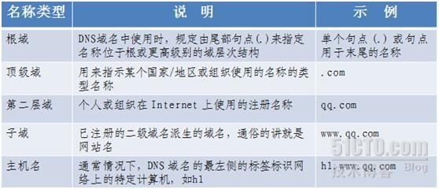

根域名服务器： 知道所有的顶级域名服务器的域名和IP地址。

顶级域名服务器： 负责管理自己下面注册的所有二级域名服务器

权限域名服务器： 负责一个区的域名服务器

本地域名服务器： 当一个主机发出DNS请求时，这个查询请求报文就是发送给了本地域名服务器

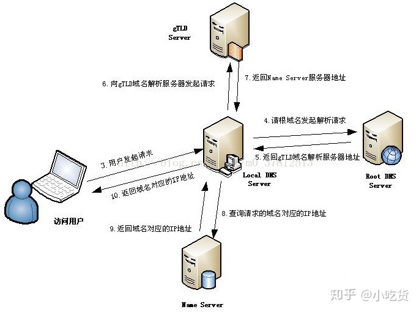

1. <u>浏览器</u>会`检查缓存`中有没有域名对应的ip地址，这个缓存是有过期时长的，一般是几分钟到几小时不等。

2. 如果浏览器缓存没有，那么就`检查操作系统的host文件`，linux在/etc/hosts文件中配置。

3. 如果本地也没有配置那么就会`根据向本机配置的本地区DNS域名服务器（LDNS）发起请求`，如果你是通过学校连接互联网的一般是你学校的DNS服务器，如果你是在小区连接互联网的一般是网络提供商比如电信，联通的DNS服务器，DNS服务器通常不会太远。如何查看本机的域名服务器，在Linux可以通过 cat /etc/resolv.conf查看。

4. `如果LDNS也不能解析，那么就直接到根域名服务器请求解析`。

5. 根域名服务器会给本地域名服务器LDNS一个所查询的`主域名服务器（gTLD）地址`，gTLD是国际顶级域名服务器，比如.com,.cn,.org等。

6. 本地域名服务器LDNS再向上一步返回的`gLTD服务器发送请求`。

7. gLTD服务器查询并返回域名对应的`Name Server域名服务器的地址`，通常是你注册的域名服务器，例如你在某个域名服务器提供商申请的域名，那么这个域名解析任务就由这个域名服务提供商来完成。

8. Name Server域名服务器会查询存储的`域名和ip的映射关系表`，将ip连同一个TTL值返回给DNS Server域名服务器。

9. LDNS拿到ip和TTL会缓存起来，缓存时间由TTL值控制。

10. 把解析的结果返回给用户，用户根据TTL值缓存在本地系统缓存中，域名解析过程结束。


> （1）递归查询：本机向本地域名服务器发出一次查询请求，就静待最终的结果。如果本地域名服务器无法解析，自己会以DNS客户机的身份向其它域名服务器查询，直到得到最终的IPq地址告诉本机。
>
> （2）迭代查询：本地域名服务器向根域名服务器查询，根域名服务器告诉它下一步到哪里去查询，然后它再去查，每次它都是以客户机的身份去各个服务器查询。
>
> 一般由DNS工作站提出的查询请求便属于递归查询。一般发生在客户端与服务器间，也有特殊情况是dns服务器与dns服务器之间。
>
> 根域名服务器总应该使用迭代查询，而不应该使用递归查询。一般的，每次指引都会更靠近根服务器（向上），查寻到根域名服务器后，则会再次根据提示向下查找。

## 5.1.   Cookie和session有什么区别 他们的作用又是什么

### 5.1.1.  Cookie

#### [Cookie是什么？](https://interviewguide.cn/#/Doc/Knowledge/计算机网络/计算机网络?id=24、cookie是什么？)

> cookie就是便利贴，每当你访问一个网站，该网站的服务器就会给你发一张便利贴。当他需要记一些和你相关的事情的时候（比如你的姓名，浏览记录等），就会写在你的便利贴上。同时，记在这张便利贴上的东西不能太重要，因为你可能会弄丢，也可能会主动撕掉它。服务器也不会心疼，再给你发一张就是了

HTTP 协议是**无状态**的，主要是为了让 HTTP 协议尽可能简单，使得它能够处理大量事务，HTTP/1.1 引入 Cookie 来保存状态信息。

Cookie 是**服务器发送到用户浏览器并保存在本地的一小块数据**，它会在浏览器之后向同一服务器再次发起请求时被携带上，用于告知服务端两个请求是否来自同一浏览器。由于之后每次请求都会需要携带 Cookie 数据，因此会带来额外的性能开销（尤其是在移动环境下）。

Cookie 曾一度用于客户端数据的存储，因为当时并没有其它合适的存储办法而作为唯一的存储手段，但现在随着现代浏览器开始支持各种各样的存储方式，Cookie 渐渐被淘汰。

新的浏览器 API 已经允许开发者直接将数据存储到本地，如使用 Web storage API（本地存储和会话存储）或 IndexedDB。

==cookie 的出现是因为 HTTP 是无状态的一种协议，换句话说，服务器记不住你，可能你每刷新一次网页，就要重新输入一次账号密码进行登录。这显然是让人无法接受的，cookie 的作用就好比服务器给你贴个标签，然后你每次向服务器再发请求时，服务器就能够 cookie 认出你。==

抽象地概括一下：一个 cookie 可以认为是一个「变量」，形如 name=value，存储在浏览器；一个 session 可以理解为一种数据结构，多数情况是「映射」（键值对），存储在服务器上。


#### [Cookie有什么用途？用途](https://zhuanlan.zhihu.com/p/131256002)

- `会话状态`管理（如用户登录状态、购物车、游戏分数或其它需要记录的信息）==(清除cookie需要重新登录)==
- `个性化设置`（如用户自定义设置、主题等）
- `浏览器行为跟踪`（如跟踪分析用户行为等）  ==（行为喜好 个性化推送）==

### 5.1.2.  session

#### session是什么

除了可以将用户信息通过 Cookie 存储在用户浏览器中，也<u>可以利用 Session 存储在==服务器==端，存储在服务器端的信息==更加安全==。</u>

Session 可以存储在服务器上的文件、数据库或者内存中。也可以将 Session 存储在 Redis 这种内存型数据库中，效率会更高。

#### [使用 Session 的过程是怎样的？](https://interviewguide.cn/#/Doc/Knowledge/计算机网络/计算机网络?id=41、使用-session-的过程是怎样的？)

过程如下：

- 用户进行登录时，`用户提交包含用户名和密码的表单`，放入 HTTP 请求报文中；
- 服务器`验证`该用户名和密码，如果正确则把用户信息`存储到 Redis` 中，它在 Redis 中的 `Key 称为 Session ID`；
- 服务器返回的响应报文的 Set-Cookie 首部字段包含了这个 `Session ID`，客户端收到响应报文之后将该 Cookie 值存入浏览器中；
- 客户端之后对同一个服务器进行请求时会包含该 Cookie 值，服务器收到之后提取出 `Session ID`，从 Redis 中取出用户信息，继续之前的业务操作。

> **注意**：
>
> Session ID 的安全性问题，不能让它被恶意攻击者轻易获取，那么就不能产生一个容易被猜到的 Session ID 值。
>
> 此外，还需要<u>经常重新生成 Session ID</u>。在对安全性要求极高的场景下，例如`转账`等操作，除了使用 Session 管理用户状态之外，还需要对用户进行`重新验证`，比如重新输入密码，或者使用短信验证码等方式。

#### [Session 的工作原理是什么？](https://interviewguide.cn/#/Doc/Knowledge/计算机网络/计算机网络?id=27、session-的工作原理是什么？)

session 的工作原理是客户端登录完成之后，服务器会创建对应的 session，session 创建完之后，会把 session 的 id 发送给客户端，客户端再存储到浏览器中。这样客户端每次访问服务器时，都会带着 sessionid，服务器拿到 sessionid 之后，在内存找到与之对应的 session 这样就可以正常工作了。

#### Session应用

Session 的主要作用就是通过服务端记录用户的状态。 典型的场景是==购物车==。

### 5.1.3.  cookie和session的区别

1. session保存在<u>`服务器`</u>，客户端不知道其中的信息；cookie保存在`客户端`，服务器能够知道其中的信息。  ==<u>保存位置</u>==
2. 都是key-value，session中保存的是`对象object`，cookie中保存的是`字符串`。  ==<u>数据类型</u>==
3. session 的运行依赖 session id，而 session id 是存在 cookie 中的，也就是说，如果浏览器禁用了 cookie ，同时 session 也会失效（但是可以通过其它方式实现，比如在 url 中传递 session_id）    ==<u>联系 禁用</u>==
4. <u>session在用户会话结束后就会关闭了，但cookie因为保存在客户端，可以长期保存</u>   ==<u>长期保存</u>==
5. cookie不是很安全，别人可以分析存放在本地的cookie并进行cookie欺骗，`考虑到安全应当使用session`。 ==<u>安全</u>==
6. session会在一定时间内保存在服务器上。当访问增多，会比较占用你服务器的性能，`考虑到减轻服务器性能方面，应当使用COOKIE`。    （<u>==性能==</u>）
7. 单个cookie保存的数据不能超过`4K`，很多浏览器都限制一个站点最多保存20个cookie。session：理论上受当前内存的限制  ==<u>大小限制</u>==

### 5.1.4 session 和 cookie 的联系　　

　　当程序需要为某个客户端的请求创建一个session时，服务器首先检查这个客户端的请求里是否已包含了一个session标识（称为session id），如果已包含则说明以前已经为此客户端创建过session，服务器就按照session id把这个session检索出来使用（检索不到，会新建一个），如果客户端请求不包含session id，则为此客户端创建一个session并且生成一个与此session相关联的session id，session id的值应该是一个既不会重复，又不容易被找到规律以仿造的字符串，这个session id将被在本次响应中返回给客户端保存。**保存这个session id的方式可以采用cookie**，这样在交互过程中浏览器可以自动的按照规则把这个标识发送给服务器。一般这个cookie的名字都是类似于SEEESIONID。

　　**cookie可以被人为的禁止，同时 session 可能会失效**，则必须有其他机制以便在cookie被禁止时仍然能够把session id传递回服务器。经常被使用的一种技术叫做**URL重写，就是把session id直接附加在URL路径的后面**。还有一种技术叫做**表单隐藏字段**。就是服务器会自动修改表单，添加一个隐藏字段，以便在表单提交时能够把session id传递回服务器

## 5.2.   keepalive和session的区别

1. 这里的keep-alive是短时间内多个http请求可复用同一个tcp连接
2. session是储存在服务端用于标识客户端请求用户的，两者并无矛盾

#### tcp的keepalive和http的keep-alive不一样。

### Tcp的keepalive

keepalive是指tcp自动断开失效连接。

<u>如果在一段时间（保活时间：tcp_ keepalive_time）内此连接都不活跃，开启保活功能的一端会向对端发送一个==保活探测报文==。</u>

若对端正常存活，且连接有效，对端必然能收到探测报文并进行响应。此时，发送端收到响应报文则证明TCP连接正常，重置保活时间计数器即可。

若由于网络原因或其他原因导致，发送端无法正常收到保活探测报文的响应。那么在一定**探测时间间隔（tcp_keepalive_intvl）后，将继续发送保活探测报文。==直到收到对端的响应==，或者达到配置的==探测循环次数上限==（tcp_keepalive_probes）**==都没有收到对端响应，这时对端会被认为不可达，TCP连接随存在但已失效，需要将连接做中断处理。==

### http的keepalive

我们知道HTTP协议采用“请求-应答”模式*

- 当使用`普通模式`，即非KeepAlive模式时，每个请求/应答客户和服务器都要新建一个连接，完成之后立即断开连接（HTTP协议为无连接的协议）；
- 当使用`Keep-Alive模式`（又称持久连接、`连接重用`）时，Keep-Alive功能使客户端到服务器端的连接持续有效，当出现对服务器的后继请求时，Keep-Alive功能避免了建立或者重新建立连接。

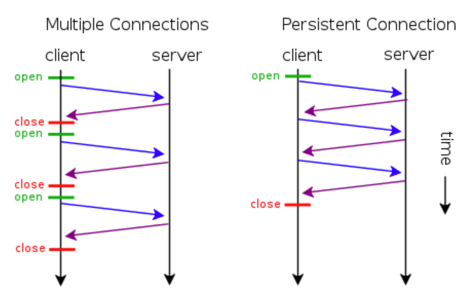

<u>http 1.0中默认是关闭的</u>，需要在http头加入"Connection: Keep-Alive"，才能启用Keep-Alive；<u>http 1.1中默认启用Keep-Alive</u>，如果加入"Connection: close "，才关闭。目前大部分浏览器都是用http1.1协议，也就是说默认都会发起Keep-Alive的连接请求了，所以是否能完成一个完整的Keep-Alive连接就看服务器设置情况。

## 5.3.   [Web页面的请求历程](https://www.cxyxiaowu.com/17476.html)

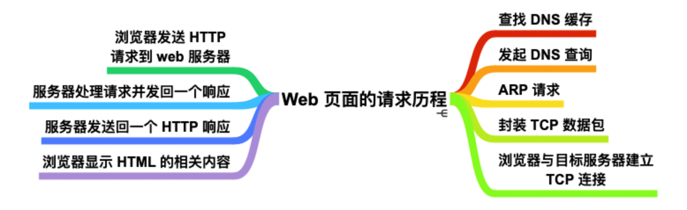

#### [在浏览器地址栏输入一个URL后回车，背后会进行哪些技术步骤？](https://interviewguide.cn/#/Doc/Knowledge/计算机网络/计算机网络?id=16、在浏览器地址栏输入一个url后回车，背后会进行哪些技术步骤？)

1. 查`浏览器缓存`，看看有没有已经缓存好的`域名IP映射`，如果没有查找`系统缓存` 如果还没

2. 检查本机host文件

   > - Hosts是一个没有扩展名的系统文件，<u>其作用就是将一些常用的网址域名与其对应的IP地址建立一个关联“数据库”。</u>
   > - hosts文件能<u>加快域名解析</u>，对于要经常访问的网站，我们可以通过在Hosts中配置域名和IP的映射关系，提高域名解析速度。
   > - hosts文件可以方便局域网用户在很多单位的局域网中，可以分别给这些服务器取个容易记住的名字，然后在Hosts中建立IP映射，这样以后访问的时候，只要输入这个服务器的名字就行了。
   > - hosts文件可以<u>屏蔽一些网站</u>，对于自己想屏蔽的一些网站我们可以利用Hosts把该网站的域名映射到一个错误的IP或本地计算机的IP，这样就不用访问了。

3. 调用API，Linux下Scoket函数 gethostbyname

   > `如果`gethostbyname`没有这个域名的缓存记录，也没有在`hosts` 里找到，它将会向 DNS 服务器发送一条 DNS 查询请求。DNS 服务器是由网络通信栈提供的，通常是本地路由器或者 ISP 的缓存 DNS 服务器。

4. 向DNS服务器发送DNS请求，查询`本地DNS服务器`，这其中用的是UDP的协议 ==（用udp发送dns请求）==

5. 如果在一个`子网内`采用ARP地址解析协议进行`ARP查询`，如果`不在一个子网`那就需要`对默认网关进行DNS查询`，如果还找不到会一直向上找根DNS服务器，直到最终拿到IP地址（全球400多个根DNS服务器，由13个不同的组织管理）

6. 这个时候我们就有了服务器的IP地址 以及默认的端口号了，http默认是80 https是 443 端口号，会，<u>首先尝试`http`然后调用Socket建立`TCP`连接</u>，

7. 经过三次握手成功建立连接后，开始传送数据，如果正是http协议的话，就返回就完事了，

8. 如果不是http协议，服务器会返回一个`5开头的的重定向消息`，告诉我们用的是`https`，那就是说IP没变，但是端口号从80变成443了，好了，再四次`挥手`，完事，

9. 再来一遍，这次除了上述的端口号从80变成443之外，还会采用`SSL的加密技术`来保证传输数据的安全性，保证数据传输过程中不被修改或者替换之类的， 

10. 这次依然是三次握手，沟通好双方使用的`认证算法，加密和检验算法`，在此过程中也会检验对方的CA安全证书。 ==SSL handshake==

11. 确认无误后，开始通信，然后服务器就会返回你所要访问的网址的一些数据，在此过程中会将界面进行渲染，牵涉到ajax技术之类的，直到最后我们看到色彩斑斓的网页


https://blog.csdn.net/wenyun_kang/article/details/81290904

1. 为主机申请IP：==<u>**DHCP动态主机配置协议**</u>==

   > 1）主机生成一个DHCP请求报文（应用层）
   >
   > 2）放入UDP报文段（传输层），UDP报文段主要包含
   >
   > ​	源端口68（DHCP客户端的固定端口）
   >
   > ​	目的端口67（DHCP服务器的固定端口）
   >
   > 3）网络层添加头部封装成IP数据报，主要包含
   >
   > ​	源IP：0.0.0.0
   >
   > ​	目的IP：255.255.255.255（广播IP）
   >
   > 4）数据链路层添加头部封装成以太网帧
   >
   > 5）以太网帧被发送到交换机
   >
   > 6）与交换机相连的默认网关路由器接收到了这个广播帧，进行解析，提取出IP数据报，发现目的IP是广播IP，就交给传输层，传输层又提取出 DHCP 请求交给应用层， DHCP 服务器就收到了该 DHCP 请求。
   >
   > 7）DHCP 服务器为此生成一个 DHCP ACK 报文，主要包含：
   >
   > ​	l 分配给DHCP请求的IP
   >
   > ​	l DNS服务器的IP
   >
   > ​	l 默认网关路由器的IP
   >
   > ​	l 子网掩码
   >
   > 8）DHCP ACK以太网帧由默认网关路由器发送给交换机，交换机根据转发表转发回给我的主机
   >
   > 9）主机收到该帧之后再从链路层到应用层，层层提取，最后得到自己的IP、DNS服务器IP、默认网关路由器IP

2. 查找默认网关路由器的MAC地址：ARP地址转换协议

   通过默认网关路由器ip找局域网默认网关路由器的MAC地址。

   这就用到了ARP地址转换协议。

   > - 主机生成一个 ARP 查询报文，目的 IP 是默认网关路由器，这个报文最终被封装成以太网帧，帧的目的MAC是 FF:FF:FF:FF:FF:FF（广播地址），然后把帧发给交换机，交换机看到是广播地址就给广播出去
   >
   > - 默认网关路由器接收到了这个帧，经过层层提取得到 ARP 报文，发现其中的目的 IP 跟他自己某个接口的 IP 匹配，就发送回去一个 ARP 应答报文给主机，这里包含他自己的 MAC

3. 查找目的域名的IP：DNS域名系统

   <u>拿到了默认网关路由器的MAC之后，离开局域网去DNS服务器查目的域名的IP</u>。

   路由表中已经配置了可以从路由器到达 DNS 服务器的路由表项。

4. 解析出 IP地址后，`根据该 IP地址和默认端口80`，和服务器建立TCP连接；

5. 浏览器发出读取文件（URL中域名后面部分对应的文件）的HTTP请求，该请求报文作为 TCP三次握手的第三个报文的数据发送给服务器；

6. 服务器对浏览器请求作出响应，并把对应的 html文本发送给浏览器；

   > 如果不是http 重定向5开头的响应序号， 然后重新建立https 的socket连接 还有ssl的`handshake`。互相检验ca证书

7. 释放 TCP连接；

8. 浏览器将该 html文本并显示内容；

 

==DNS + HTTP + TCP + IP + ARP==

 

## 5.4.   web页面请求时各层工作


### 总感觉写的有点问题

1. **应用层：**客户端浏览器通过DNS解析到www.baidu.com的IP地址220.181.27.48，通过这个IP地址找到客户端到服务器的路径。客户端浏览器发起一个HTTP会话到220.161.27.48，然后通过TCP进行封装数据包，输入到网络层。

   > DHCP DNS 

2. 运输层：在客户端的传输层，把HTTP会话请求分成报文段，添加源和目的端口，如服务器使用80端口监听客户端的请求，客户端由系统随机选择一个端口如5000，与服务器进行交换，服务器把相应的请求返回给客户端的5000端口。然后使用IP层（网络层）的IP地址查找目的端。

   > tcp？

3. 网络层：客户端的网络层不用关心应用层或者传输层的东西，主要做的是通过查找路由表确定如何到达服务器，期间可能经过多个路由器，这些都是由路由器来完成的工作，我不作过多的描述，无非就是通过查找路由表决定通过那个路径到达服务器。

   > ARP

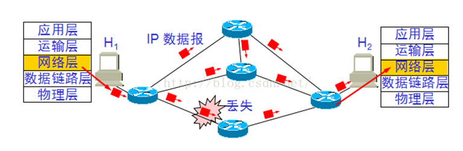

4. 链路层：客户端的链路层，包通过链路层发送到路由器，通过邻居协议查找给定IP地址的MAC地址，然后发送ARP请求查找目的地址，如果得到回应后就可以使用ARP的请求应答交换的IP数据包现在就可以传输了，然后发送IP数据包到达服务器的地址。

## 5.5.   结合7层模型讲讲输入url之后发生了什么

 用户输入网址后到收到网页，客户端需要发送三次数据。
1、DNS域名解析
2、建立TCP/IP连接
3、发送请求网页信息
建立TCP/IP连接与请求网页信息放在一起


1、DNS域名解析：首先，客户端的`应用层`会封装数据到达`传输层`，在<u>传输层标识源端口号与目的端口号</u>（源端口号为大于1023随机，目的端口号为UDP53端口）及应用层服务（这里因该是请求DNS查询服务吧）。传输层封装数据产生数据段传给网络层，在网络层标识源IP地址及目的IP地址（源IP地址为客户端IP，目的IP地址为DNS服务器IP地址），网络层将数据段封装为数据包传给数据链路层，在数据链路层将会在数据包里加入源MAC地址及目的MAC地址（源MAC地址为客户端网卡MAC地址，目的MAC地址为DNS服务器MAC地址），这里应该查询MAC缓存。数据链路层根据客户端与DNS服务器之间的链路，将数据包封装成帧，传给物理层。物理层会将数据帧转化为电信号放到物理介质上。
电信号到达DNS服务器后会从物理层到达应用层（这里和客户端发送数据差不多，只不过这个过程变成了解封装），DNS服务器做完域名解析后再将数据传给客户端，传输过程同客户端发送数据。

2、建立TCP/IP连接：客户端知道WEB服务器IP地址之后，在网络层产生建立TCP/IP三次握手的数据包（TCP/IP三次握手：客户端向服务器端发送SYN信息，服务器端收到SYN信息后回复给客户端SYN+ACK确认信息，客户端收到确认信息后再向服务器发送ACK信息建立连接），应用层标识HTTP服务将数据发送到传输层，传输层将数据+源端口号（大于1023）、目的端口号（80）+上层服务WWW封装为数据段传给网路层。网络层将数据段+源ip与目的ip（WWW服务器的ip地址）封装为数据包发送到数据链路层。数据链路层参照ARP缓存表确定源MAC地址（本机MAC地址）及目的MAC地址（客户端与路由B相连端口的MAC地址）将数据包封装成数据帧。这里还需要CRC校验。。。。。。数据帧到达物理层后变成电信号发送到介质上（这里还需要访问控制方法DSMA/CD）
路由B收到电信号后传给路由器的数据链路层，这里还需要CRC,FCS校验。。。。。。确定数据帧没有损坏后查看目的MAC地址与路由器端口地址是否相同，如果相同将解封装，将数据包发送到路由器B的物理层，路由器查看路由表确定数据包的转发端口，路由器B确定与路由A之间的链路，创建帧。
路由B与路由A可以看成是点对点，即路由B将创建PPP帧。路由A收到电信号后，确定帧的完整性，如果完整即将数据帧解封装发送到网络层，路由A查询路由表将数据包转发到与WEB相连的路由端口。
路由A的数据链路层将查询ARP缓存表确定WWW服务器的MAC地址，路由A将创建源MAC地址（路由A）及目的MAC地址（WEB服务器MAC地址）的数据帧。WEB服务器收到数据帧后比较MAC地址，确定数据帧是发给WEB服务器的，传给WEB服务器的网络层，查看目的IP地址是否与WEB服务器IP地址是否相同，相同即发送到传输层，查看为TCP协议及80端口号。应用层收到数据即向客户端响应WWW服务请求。
发送网页与请求网页数据发送相同

## 5.6.   如何保证浏览器发出的数据到路由器这一段是安全的？

ICMP协议？

数据链路层保证可靠传输，数据帧会通过一些手段对数据进行`校验`，来发现数据帧是否错误，如果错误，可以检错重发，向前纠错，反馈校验，检错丢弃等手段来保证两个节点之间传输的数据帧向上层提供的数据是无差错的。

## 5.7.   如何应对大量访问，泛洪攻击

SYN洪泛攻击发生在三次握手建立TCP连接的过程中。

1. 具体过程

   - SYN攻击就是Client在短时间内<u>伪造大量不存在的IP地址</u>，并向Server<u>不断地发送SYN包</u>，Server则回复确认包，并等待Client确认，由<u>于源地址不存在，因此Server需要不断重发直至超时</u>，这些伪造的SYN包将长时间占用未连接队列，<u>导致正常的SYN请求因为队列满而被丢弃，从而引起网络拥塞甚至系统瘫痪</u>。SYN 攻击是一种典型的 DoS/DDoS 攻击。
   - 攻击者如果发送非常大量的这种TCP连接，由于每一个都无法完成三次握手，所以服务器上这些TCP连接会因为挂起状态而消耗CPU和内存，最后服务器可能死机，就无法为正常用户提供服务。

2. 解决方法（==SYN cookie==）

   >- 缩短超时（SYN Timeout）时间
   >
   >- 增加最大半连接数
   >
   >- 过滤网关防护
   >
   > > 这里，过滤网关首要指明防火墙，当然路由器也能成为过滤网关。[防火墙](http://www.5636.com/netbar/network/489.html)摆设在分歧网络之间，防备外来不合法进击和避免保护秘密信息外泄，它处于客户端和服务器之间，应用它来防护SYN攻击能起到很好的结果。过滤网关防护首要包罗超时设置，SYN网关和SYN署理三种。
   > > 　　·网关超时设置：
   > > 　　防火墙设置SYN转发超时参数(形态检测的防火墙可在形态内外面设置)，该参数远小于服务器的timeout工夫。当<u>客户端发送完SYN包</u>，<u>效劳端发送确认包后(SYN+ACK)</u>，防火墙假如在`计数器到期`时还未收到客户端确实认包(ACK)，则往服务器发送`RST包`，以使服务器从队列中删去该半衔接。值得留意的是，网关超时参数设置不宜过小也不宜过大，超时参数设置过小会影响正常的通信，设置太大，又会影响防备SYN攻击的结果，必需依据所在的网络使用情况来设置此参数。
   > > 　　·SYN网关：
   > > 　　SYN网关收到客户端的SYN包时，直接转发给服务器；SYN网关收到服务器的SYN/ACK包后，将该包转发给客户端，还以客户端的名义给服务器发ACK确认包。此时服务器由半衔接形态进入衔接形态。当客户端确认包抵达时，假如稀有数据转发，不然丢掉。现实上，服务器除了维持半衔接队列外，还要有一个衔接队列，假如发作SYN攻击时，将使衔接队列数量添加，但普通服务器所能接受的衔接数目比半衔接数目大得多，所以这种办法能有用地减轻对服务器的进击。
   > > 　　·SYN署理：
   > > 　　当客户端SYN包抵达过滤网关时，SYN署理并不转发SYN包，而是以服务器的名义自动答复SYN/ACK包给客户，假如收到客户的ACK包，标明这是正常的拜访，此时防火墙向[服务器](http://www.5636.com/netbar/wupan/503.html)发送ACK包并完成三次握手。SYN署理现实上替代了服务器行止理SYN攻击，此时要求过滤网关本身具有很强的防备SYN进击才能。
   >
   >- SYN cookies技术

   - 检测 SYN 攻击非常的方便，当你在服务器上`看到大量的半连接状态时，特别是源IP地址是随机的`，基本上可以断定这是一次SYN攻击。在 Linux/Unix 上可以使用系统自带的 `netstats` 命令来检测 SYN 攻击。

   ==SYN cookies技术==

   - 当服务器接收到一个SYN报文段时，其并不知道该报文段来自一个合法用户还是要进行SYN洪泛攻击的攻击者，因此服务器不会为该报文段生成一个半开的连接 ，相反服务器会生成一个初始序列号（ack），该序列号是一个复杂函数（散列函数，由SYN报文段的源IP地址和目的IP地址，源端口号和目的端口号以及仅有服务器知道的秘密数构成），这个初始序列号被称为cookie。服务器会发送这种具有特殊初始序列号的SYNACK报文段，==且服务器并不记录该cookie以及其他任何关于SYN的状态信息==。 

     > (<u>不建立`半连接` 而是加密(`随机的seqNumber?`)发回去,你发回来我检查一下</u>)

   - 如果客户是合法的，则它将返回一个ACK报文段，当服务器收到ACK报文段后，需要验证ACK是否与前面发送的某个SYN相对应。由于服务器没有记录SYN报文段的相关信息，所以其会使用SYNACK报文段的源IP地址和目的IP地址，==源端口号和目的端口号以及仅有服务器知道的秘密数生成一个散列函数==。如果这个函数的结果（cookie值）加1和客户ACK报文段中的确认值相同，那么服务器会认为该ACK对应于较早的SYN报文段，则其合法，因此服务器会生成一个套接字的全开连接。

   - 如果客户没有返回一个ACK报文段，则说明之前的SYN报文段属于要进行SYN洪泛攻击的攻击者，但其并没有对服务器造成任何危害，因为服务器没有为它分配任何资源。

 

## 5.8.   `CSRF`()攻击以及如何防御

#### [CSRF攻击？你知道吗？](https://interviewguide.cn/#/Doc/Knowledge/计算机网络/计算机网络?id=96、csrf攻击？你知道吗？)

==<u>Cross-site request forgery</u>==`跨站点请求伪造，指攻击者通过跨站请求，以合法的用户的身份进行非法操作`。可以这么理解CSRF攻击：<u>攻击者`盗用你的身份`，以你的名义向第三方网站发送恶意请求。CRSF能做的事情包括利用你的身份`发邮件`，发`短信`，进行`交易转账`，甚至`盗取账号信息`。</u>

#### [如何防范CSRF`攻击`](https://interviewguide.cn/#/Doc/Knowledge/计算机网络/计算机网络?id=97、如何防范csrf攻击)

1. **安全框架**，例如Spring Security。

2. **token机制**。在HTTP请求中进行token验证，如果请求中没有token或者token内容不正确，则认为CSRF攻击而拒绝该请求。 

   > 用mac地址或者sessioonid作为token 类似浏览器session的使用 客户端每次通信附带token 服务器进行验证

3. **验证码**。通常情况下，验证码能够很好的遏制CSRF攻击，但是很多情况下，<u>出于`用户体验`考虑，验证码只能作为一种辅助手段</u>，而不是最主要的解决方案。

4. **referer识别**。在HTTP Header中有一个`字段Referer`，<u>它记录了HTTP请求的来源地址</u>。如果Referer是其他网站，就有可能是CSRF攻击，则拒绝该请求。但是，`服务器并非都能取到Referer`。很多用户出于`隐私保护`的考虑，限制了Referer的发送。在某些情况下，浏览器也不会发送Referer，例如HTTPS跳转到HTTP。

   > - 使用==<u>安全框架</u>==
   > - 在请求地址添加 ==`token`== 并验证。
   > - 关键操作添加==<u>验证码</u>==； 
   > - 验证请求来源地址 ==<u>referer</u>==；

## 5.9.   DNS劫持

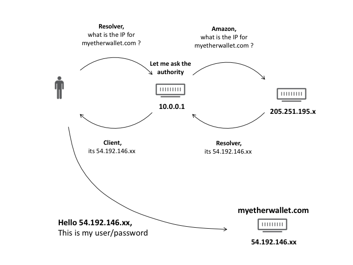

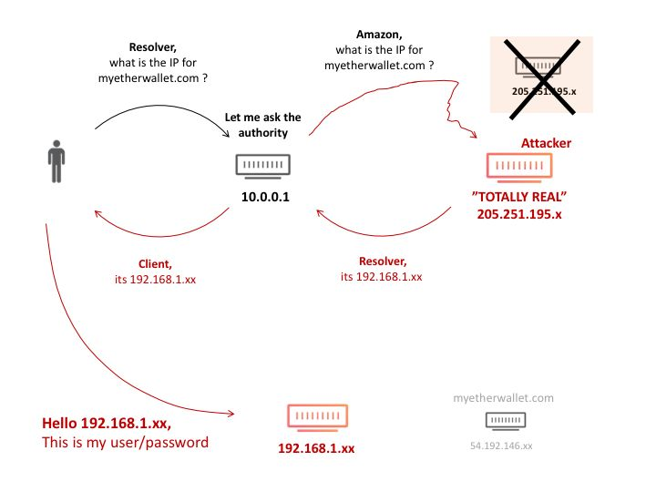

==解析域名的时候，DNS服务器返回了一个错误的地址==

### DNS劫持分类

我们按照`客户端侧--递归DNS服务器--权威DNS服务器`的路径，将DNS劫持做如下分类：

##### 【一、本地DNS劫持】 

> 主要是`修改本地dns配置`达到欺骗效果

客户端侧发生的DNS劫持统称为本地DNS劫持。本地DNS劫持可能是：

1. 黑客通过木马病毒或者恶意程序`入侵PC`，<u>篡改DNS配置</u>(hosts文件，DNS服务器地址，DNS缓存等)。
2. 黑客利用`路由器`漏洞或者破击路由器管理账号入侵路由器并且<u>篡改DNS配置</u>。
3. 一些`企业代理设备`（如Cisco Umbrella intelligent proxy）针对企业内部场景对一些特定的域名做DNS劫持解析为指定的结果。

##### 【二、DNS解析路径劫持】

> ==<u>转发</u>== <u>==复制==</u> 和 ==<u>代答</u>==

DNS解析过程中发生在客户端和DNS服务器网络通信时的DNS劫持统一归类为DNS解析路径劫持。通过对DNS解析报文在查询阶段的劫持路径进行划分，又可以将DNS解析路径劫持划分为如下三类：

###### • DNS`请求转发`

通过技术手段(中间盒子，软件等)将DNS流量==`重定向`==到其他DNS服务器

###### • DNS`请求复制`

利用分光等设备将`DNS查询复制到网络设备，并先于正常应答返回DNS劫持的结果`。

案例：一个DNS查询抓包返回两个不同的应答。

###### • DNS`请求代答`

网络设备或者软件直接代替DNS服务器对DNS查询进行应答。

案例：一些DNS服务器实现了SERVFAIL重写和NXDOMAIN重写的功能。

##### 【三、篡改DNS权威记录】

> ==<u>黑掉你要查询的 dns服务器</u>==

篡改DNS权威记录 我们这里指的黑客`非法入侵DNS权威记录管理账号`，直接修改DNS记录的行为。 （==<u>暴力</u>==）

案例：黑客黑入域名的管理账户，`篡改DNS权威记录指向自己的恶意服务器以实现DNS劫持`。

- `DDOS攻击`：在知道攻击目标的IP地址后，攻击者以这个地址为源地址去向DNS服务器发送请求，然后==攻击目标就会收到很多DNS返回的请求==

- 缓存污染：攻击者使用DNS请求，`将数据放入一个具有漏洞的DNS服务器的缓存当中`。这些缓存信息会在客户进行DNS访问时返回给用户，从而把用户客户对正常域名的访问引导到入侵者所设置挂马、钓鱼等页面上，或者通过伪造的邮件和其他的server服务获取用户口令信息，导致客户遭遇进一步的侵害。

- 中间人攻击：通过截获主机与DNS服务器之间的通信，`伪装成DNS服务器`向主机返回错误的ip。

- 如何防止DNS劫持

  > 1、互联网公司准备两个以上的域名，一旦黑客进行DNS攻击，用户还可以访问另一个域名。
  >
  > 2、手动修改DNS：
  >
  > ##### DNS劫持防范
  >
  > > • 安装杀毒软件，防御木马病毒和恶意软件；定期修改路由器管理账号密码和更新固件。
  > > • 选择安全技术实力过硬的域名注册商，并且给自己的域名权威数据上锁，防止域名权威数据被篡改。
  > > • 选择支持DNSSEC的域名解析服务商，并且给自己的域名实施DNSSEC。DNSSEC能够保证递归DNS服务器和权威DNS服 	务器之间的通信不被篡改。阿里云DNS作为一家专业的DNS解析服务厂商，一直在不断完善打磨产品功能，DNSSEC功能已经在开发中，不日就会上线发布。
  > > • 在客户端和递归DNS服务器通信的最后一英里使用DNS加密技术，如DNS-over-TLS，DNS-over-HTTPS等。

## 5.10. 为什么直播要用UDP而视频网站一般用TCP

因为<u>视频网站对画面质量有要求，且允许缓冲等待</u>；而微信视频聊天一般用udp，因为`不希望画面卡顿`，可以接受画面不太清晰

## 5.11. 游戏用tcp还是udp

1. 在实时性方面，tcp协议的网络抗性欠佳，对MOBA类或其他`实时性要求较高的游戏`，一般是不建议使用tcp作为协议载体。事实上，王者荣耀的PVP通信协议也确实是基于`udp`封装的；同样，最近大家喜闻乐见的《绝地求生》，也是基于udp的。

2. 一般游戏中TCP和UDP会同时用的，如果对于数据传输速度要求非常高的场景，比如FPS，MOBA等游戏过程中，用户对战时候的数据肯定是要用UDP来传输的，并且在程序层面保证传输的可靠性，包括自己做校验等；但其它模块，比如大厅里啊，买东西啊，创建房间啊等等，都是可以TCP实现的。==（操作时udp，抽奖时tcp）==

3. 如果客户端和服务器都可以独立发包，但是偶尔发生延迟可以容忍（比如：在线的纸牌游戏，许多MMO类的游戏），那么使用TCP长连接吧。
4. 如果客户端和服务器都可以独立发包，而且无法忍受延迟（比如：大多数的多人动作类游戏，一些MMO类游戏），那么使用UDP吧。

## 5.12. [为什么QQ用的是UDP协议而不是TCP协议？](https://www.jianshu.com/p/d9a5a954c161)

### QQ既有UDP也有TCP！

不管UDP还是TCP，最终登陆成功之后，<u>QQ都会有一个`TCP连接`来保持在线状态</u>。这个TCP连接的远程端口一般是80，采用UDP方式登陆的时候，端口是8000。

UDP协议是无连接方式的协议，它的效率高，速度快，占资源少，但是其传输机制为不可靠传送，必须依靠辅助的算法来完成传输控制。QQ采用的通信协议以UDP为主，辅以TCP协议。由于QQ的服务器设计容量是`海量级的应用`，一台服务器要同时容纳十几万的并发连接，因此服务器端只有采用UDP协议与客户端进行通讯才能保证这种超大规模的服务。 ==（UDP保证海量级，大规模服务）==

QQ客户端之间的消息传送也采用了UDP模式，因为国内的网络环境非常复杂，而且很多用户采用的方式是通过代理服务器共享一条线路上网的方式，在这些复杂的情况下，客户端之间能彼此建立起来TCP连接的概率较小，严重影响传送信息的效率。而UDP包能够穿透大部分的代理服务器，因此QQ选择了UDP作为客户之间的主要通信协议。  ==（UDP穿透复杂的代理服务器）==

采用UDP协议，通过服务器中转方式。因此，现在的IP侦探在你仅仅跟对方发送聊天消息的时候是无法获取到IP的。大家都知道，UDP 协议是不可靠协议，它只管发送，不管对方是否收到的，但它的传输很高效。但是，作为聊天软件，怎么可以采用这样的不可靠方式来传输消息呢？于是，`腾讯采用了上层协议来保证可靠传输`：如果客户端使用UDP协议发出消息后，服务器收到该包，需要使用UDP协议发回一个应答包。如此来保证消息可以无遗漏传输。之所以会发生在客户端明明看到“消息发送失败”但对方又收到了这个消息的情况，就是因为客户端发出的消息服务器已经收到并转发成功，但客户端由于网络原因没有收到服务器的应答包引起的。  ==（使用UDP做了确认应答）==


### 分情况应用tcp和udp

登陆采用TCP协议和HTTP协议，你和好友之间发送消息，主要采用UDP协议，内网传文件采用了P2P技术。总来的说：

1. <u>登陆过程，客户端client 采用TCP协议向服务器server发送信息，HTTP协议下载信息。登陆之后，会有一个`TCP连接来保持在线状态`。</u>

2. `和好友发消息，客户端client采用UDP协议`，但是需要通过服务器转发。腾讯为了确保传输消息的可靠，采用上层协议来保证可靠传输。如果消息发送失败，客户端会提示消息发送失败，并可重新发送。

3. 如果是在`内网`里面的两个客户端传文件，QQ采用的是`P2P`技术，<u>不需要服务器中转</u>


首先,QQ并不是完全基于UDP实现。比如在使用QQ进行文件传输等活动的时候，就会使用TCP作为可靠传输的保证。

UPD包比TCP包要少12字节（UDP8,TCP20）
使用UDP进行交互通信的好处在于，延迟较短，对数据丢失的处理比较简单。同时，TCP是一个全双工协议，需要建立连接，所以网络开销也会相对大。如果使用QQ语音和QQ视频的话，UDP的优势就更为突出了，首先延迟较小。最重要的一点是不可靠传输，这意味着如果数据丢失的话，不会有重传。

腾讯采用了上层协议来保证可靠传输：如果客户端使用UDP协议发出消息后，服务器收到该包，需要使用UDP协议发回一个应答包。如此来保证消息可以无遗漏传输。

 

## 5.15. 在网络弱的情况下开发者如何改进APP和服务器，提高请求和响应的准确率

 

## 5.16. 手机时间乱了，如何实现设置中的同步网络标准时间

### NTP服务器

【Network Time Protocol（NTP）】是用来使计算机时间同步化的一种协议，它可以使计算机对其服务器或时钟源（如石英钟，GPS等等)做同步化，它可以提供高精准度的时间校正（LAN上与标准间差小于1毫秒，WAN上几十毫秒），且可介由加密确认的方式来防止恶毒的协议攻击。时间按NTP服务器的等级传播。按照离外部UTC源的远近把所有服务器归入不同的Stratum（层）中。

### 解决方案

根据不同的情况，如下三种解决方案：

- 修改系统时间。
  优点：程序启动时执行一次即可，一劳永逸。
  缺点：只能在原生系统中使用，非原生系统无法安装。(具体后面会解释)。

- 获取NTP服务器时间代替系统时间。
  优点：无需Root，适用于任何手机及系统。
  缺点：需要可以访问外部网络，内网环境下则需要一台自己的NTP服务器。

  > 可以开启一个线程，做`定时任务`，不断更新该时间，以到达时间时间同步的效果

- 获取网页时间代替系统时间。
  优点：无需Root，适用于任何手机及系统，适用于任何网络环境。
  缺点：需要一条额外的线程，去维护时间准确，容易造成误差。

# 5.    网络层

## [网络层常见协议](https://interviewguide.cn/#/Doc/Knowledge/计算机网络/计算机网络?id=78、网络层常见协议？可以说一下吗？)

| 协议 | 名称                 | 作用                                                         |
| :--- | :------------------- | :----------------------------------------------------------- |
| IP   | 网际协议             | IP协议不但定义了数据传输时的基本单元和格式，还定义了数据报的递交方法和路由选择 |
| ICMP | Internet控制报文协议 | ICMP就是一个“错误侦测与回报机制”，其目的就是让我们能够检测网路的连线状况﹐也能确保连线的准确性，是ping和traceroute的工作协议 |
| RIP  | 路由信息协议         | 使用“跳数”(即metric)来衡量到达目标地址的路由距离             |
| IGMP | Internet组管理协议   | 用于实现组播、广播等通信                                     |

## 4.1.   [交换机、路由器的概念，并知道各自的用途](https://www.zhihu.com/search?q=交换机&type=content)

### 4.1.1.  交换机

- 在计算机网络系统中，交换机是针对共享工作模式的弱点而推出的。交换机拥有一条高带宽的背部总线和内部交换矩阵。交换机的所有的端口都挂接在这条背部总线上，<u>当控制电路收到数据包以后，处理端口会查找内存中的地址对照表以确定目的MAC（网卡的硬件地址）的NIC（网卡）挂接在哪个端口上，通过内部交换矩阵迅速将数据包传送到目的端口。目的MAC若不存在，交换机才广播到所有的端口，接收端口回应后交换机会“学习”新的地址，并把它添加入内部地址表中。</u>

- 交换机工作于OSI参考模型的第二层，即==数据链路层==。交换机内部的CPU会在每个端口成功连接时，通过==ARP协议==学习它的MAC地址，保存成一张ARP表。在今后的通讯中，发往该MAC地址的数据包将仅送往其对应的端口，而不是所有的端口。因此，交换机可用于划分数据链路层广播，即冲突域；但它不能划分网络层广播，即广播域。

  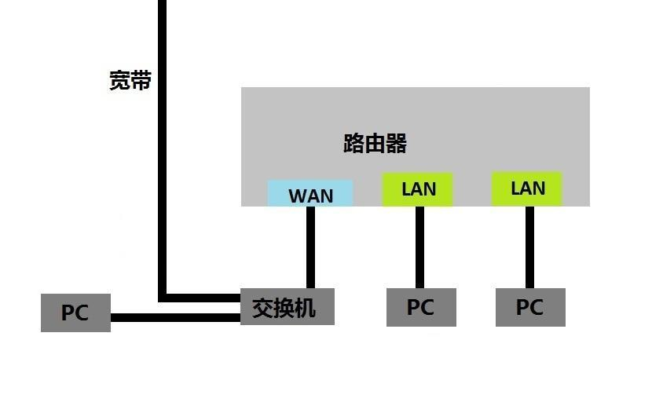

### 4.1.2.  路由器

路由器（Router）是一种计算机网络设备，提供了`路由`与`转发`两种重要机制，可以决定数据包从来源端到目的端所经过的路由路径（host到host之间的传输路径），这个过程称为路由；将路由器输入端的数据包移送至适当的路由器输出端(在路由器内部进行)，这称为转送。路由工作在OSI模型的第三层——即<u>==**网络层**==</u>，例如==<u>**IP协议**</u>==。

路由器的一个作用是`连通不同的网络`，另一个作用是`选择信息传送的线路`。 路由器与交换器的差别，路由器是属于OSI第三层的产品，交换器是OSI第二层的产品(这里特指二层交换机)。

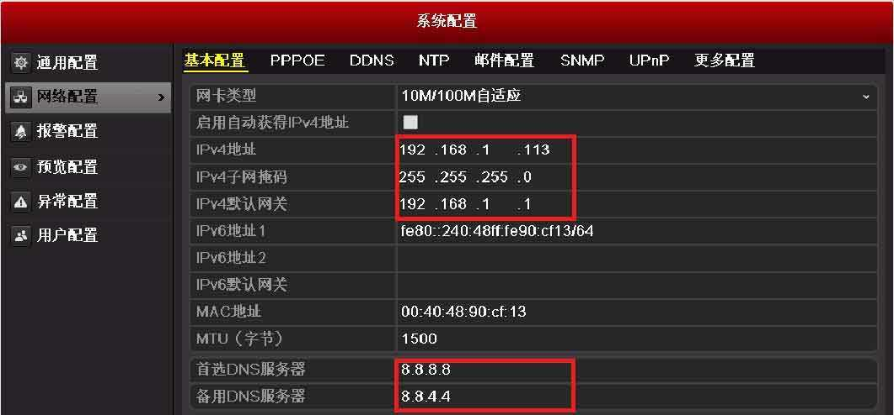

### 路由器和交换机对比：

**1、外形上**
交换机通常端口比较多看起来比较笨重，而路由器的端口就少得多体积也小得多。
**2、工作层次不同**
普通的交换机一般工作在OSI七层模型的第二层·==数据链路层==，负责==局域网之间==的连接，而路由器工作在OSI的第三层·==网络层==，负责==广域网之间==的连接。
**3、数据的转发对象不同**
交换机都是<u>根据MAC地址转发数据帧</u>，而路由器是<u>基于路由表转发数据包</u>。
**4、分工不同**
交换机主要是负责`局域网`的搭建，而路由器在中小型网络架构中，负责的是`连接外网`，与公网通信。
**5、冲突域和广播域**
前文中讲过了，默认状态下，==交换机分割冲突域，共享同一广播域==。
而路由器并不会转发广播数据，也就是说广播数据到达路由器，是会被丢弃的，从一定程度上来说，路由器本身就有一定的安全性。

**总结：**

**交换机是将不同IP地址的电脑连在一起，共享一根网线**；**路由器是将同一个IP给不同的电脑使用**，就像一条大路分成很多条小路。一句话，**路由器是接外网的，交换机是接内网的**。【 路由器可以给你的局域网自动分配IP，虚拟拨号，就像一个交通警察，指挥着你的电脑该往哪走，你自己不用操心那么多了，交换机只是用来分配网络数据的】

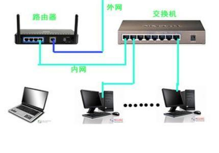

交换机利用我们熟知的MAC地址即每个设备唯一的物理地址来寻址，路由器则通过IP地址来寻址。说白了，`交换机寻找物理地址，路由器寻找软件地址`。

**路由器具有防火墙的功能**，因为其不传送不支持路由协议的数据，可`防止广播风暴`，而交换机没有这个功能。

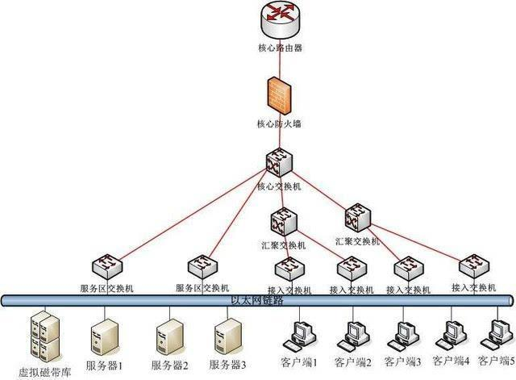

路由器可以分割广播域，广播数据不会穿过路由器，交换机则无法分割，只能区分冲突域，会导致通信拥堵和安全漏洞。

路由器产生在交换机之后，主要克服了交换机不能路由数据的不足。

 

## 4.2.   TCP/IP数据链路层的交互过程

网络层等到数据链层用mac地址作为通信目标，数据包到达网络等准备往数据链层发送的时候，首先会去自己的arp缓存表(存着ip-mac对应关系)去查找改目标ip的mac地址，如果查到了，就将目标ip的mac地址封装到链路层数据包的包头。如果缓存中没有找到，会发起一个广播：who is ip XXX tell ip XXX,所有收到的广播的机器看这个ip是不是自己的，如果是自己的，则以单拨的形式将自己的mac地址回复给请求的机器

### **一、数据链路层的概述**

#### **1.1 概述**

数据链路层是TCP/IP协议栈的第二层！

数据链路层的传输单元：帧（也就是传输单位）

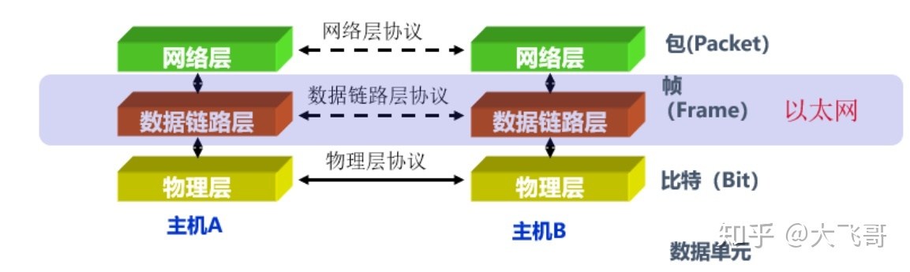

#### **1.2 帧结构**


**帧结构分析如下：**

**帧结构的构成**：MAC子层 + 上三层数据 + FCS

**比喻：**一个帧我们可以理解为一辆**火车**，MAC子层是**火车头**，上三层数据为**乘客**，FCS为火车尾巴

**MAC子层头部包含（也叫帧头）**：目标MAC地址（6字节） 源MAC地址（6字节） 类型（2字节）

**MAC地址**：也称为物理地址，是被固化到网卡的全球唯一标识，如下图：

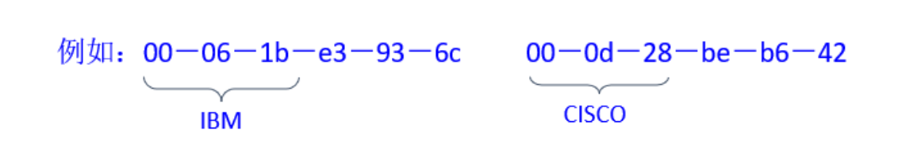

> 注释：
> MAC地址=厂家标识+内部编号====实现了全球唯一！
> 怎么查看自己的MAC地址？开始运行--cmd--ipconfig /all

**类型字段的作用**：==区分上层协议==，0806代表上层协议是ARP协议，0800代表上层是IP协议

**上三层数据：**也就是3层包头+4层包头+5层数据。其中一个帧是有最大承载能力限制的。也就是一个帧中的上三层数据就是乘客，而一辆火车中的乘客是又上限的，一个帧的最大承受能力叫MTU值，目前国际标准为1500字节

**MTU**:（最大传输单元）1500字节

**帧尾**：==FCS=帧校验==，长度4个字节，作用是校验整个帧在传输过程中是否发生传输错误。

**帧结构最终效果图如下：**

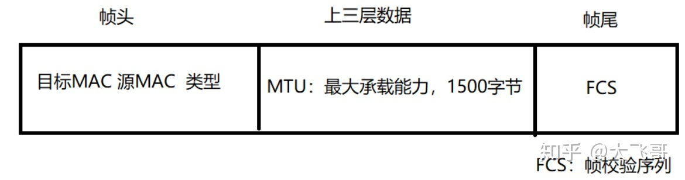

> 经典问题：请描述一下帧结构
> 答：帧是由帧头+上三层数据+帧尾，帧头包含目MAC，源MAC，类型，帧尾是FCS，MTU：1500

### **二、本层的设备**

工作在2层的设备：==交换机/网桥==

### **三、交换机的工作原理**

**交换机：**用来组建一个局域网！

交换机的工作原理：交换机是如何工作的？从收到一个帧，到将该帧转发出去的过程！

**经典问题：请描述一下交换机的工作原理**

**答：**

> 1）当收到一个`帧`，首先<u>学习帧中的MAC地址</u>来<u>`形成自己的MAC地址表`</u>！
>
> 2）然后检查帧中的目标MAC地址，并匹配MAC地址表
>
> - 如表中匹配成功，则单播转发！
>
> - 如表中无匹配项，则广播转发！
>
> 3）MAC地址表的老化时间是？300秒！

**效果图如下：**

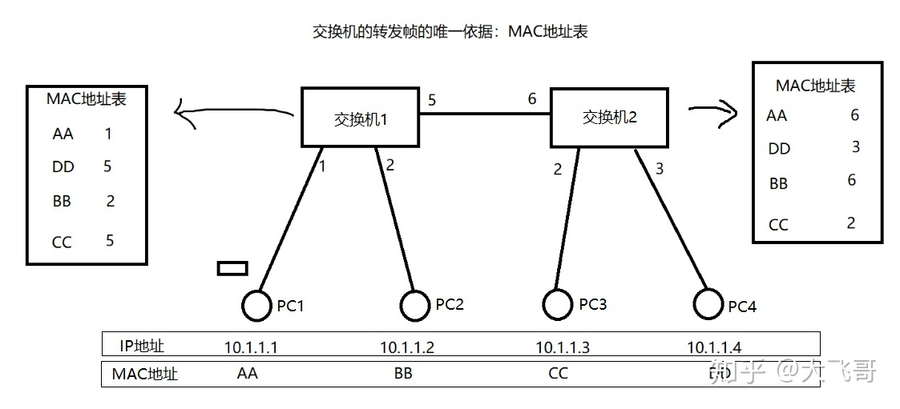

## 4.3.   传递到IP层怎么知道报文该给哪个应用程序，它怎么区分UDP报文还是TCP报文

根据上层协议tcp/udp 头部的端口标识，根据端口区分；

看ip头中的协议标识字段，17是udp，6是tcp

## 4.4. IP数据包的结构

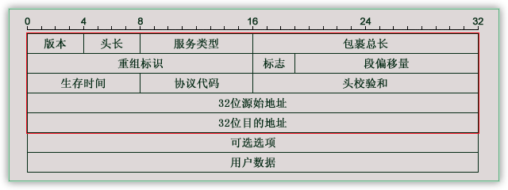

IP数据包头长度：20-60字节（一般为20字节）可选项一般不用（IPSecVPN、TTL值、对首部字段加密时用到）

IP数据包长度：mtu=1500（China）

 

- `版本`（4）：0100（ipv4）、0110（ipv6）

- `首部长度`（4）：0000~1111(0~15 x4字节 = 0~60字节)，IP包头的长度

- 优先级与服务类型（8）：前4个bit代表优先级，中间3个bit代表服务类型，最后1个bit未启用（保留，运营商可能会用到）优先级最高为5，用于语音流量

  > 优先级应用：大公司的专线，
  >
  > 服务类型：低延迟、多通道

- `总长度`（16）: 3+4+5（<u>未分片时的长度</u>，不是IP数据包长度）   

- `标识符`（16）：相当于id，是发送方随机生成的，`同一数据包的分片id相同`，不同数据包的分片标识符不同   （==<u>**标识同一组数组**</u>==）

- `标志`（3）：第1个bit保留；第2个bit若为0代表数据包进行了分片，为1未分片；第3bit代表是否为最后一个分片（0是，1不是）

- `段偏移量`（13）：0，1480,2960,···`1480`*n，`决定ip分片的先后顺序`，用于还原IP包   （<u>==**用于重组**==</u>）

  > 泪滴攻击TearDrop：
  >
  > - 构造一个段偏移量不为1480*n的分片，<u>让受害者重组数据包失败,然后一直重组直到死机</u>，也`是ddos攻击的一种`。
  >
  > 防御方法：
  >
  > - `防火墙拦截`—>最有效的方法就是在服务器前端加防火墙，过滤不安全的包。比如我利用HillStone防火墙保护后端安全，在防火墙中开启TearDrop攻击防护。
  >
  > 检测方法：
  >
  > - 对接收到的分片数据包进行分析，计算数据包的片偏移量（Offset）是否有误。

- ==<u>**TTL存活时间**</u>==（8）: Time To Live 0~255单位不是秒，是跳。`经过一个路由器-1`，默认255，主要用于`防环`。

  > TTL应用：tracert跟踪，跳了多少跳。
  >
  > Ping 返回的TTL值是初始TTL值，处理的TTL值在可选项
  >
  > ping 回显的TTL值大于100一般是window，小于100一般是Liunx；

- 协议号（8）：`表示上层所用的协议`，为上层提供服务TCP:6、UDP:17、ICMP:1、IGMP：88还有很多（网关选择协议，被路由器的hsrp技术替代了，vrrp）

- <u>首部校验和（</u>16）：校验IP包头部

## 4.5. IP协议切片

#### 一、什么是IP分片？

<u>IP协议在传输数据包时会将数据报文分成若干片进行传输，并在目标系统中进行重组。这一过程就成为分片</u>。

#### 二、为什么要进行IP分片

因为有`最大传输单元`（英語：Maximum Transmission Unit，缩写MTU）的限制。`1500个字节`

如果IP数据报加上数据帧头部后大于MTU（最大传输单元1500字节），数据报文就会分成若干片进行传输。

> 那么什么是MTU呢？
>
> 每一种物理网络都会规定链路层数据帧的最大长度，称为链路层MTU。在以太网的环境中可传输的最大IP报文为1500字节。
>
> 如果要传输的数据帧的大小超过1500字节，即IP数据报的长度大于1472(1500-20-8=1472，普通数据报)字节，需要分片之后进行传输。
>
> MTU标准对IP是1500   以太网帧最小-最大 64-1518 （以太网帧头18字节）

#### 三、IP分片是如何组装的？

在IP头里面有`16bit的识别号`唯一记录了一个IP包的ID,<u>以确定这几个分片是否属于同一个包</u>，具有同一个ID的IP分片将会从新组装。`13bit的片偏移`记录了一个IP分片相对于整个包的位置。`3bit的标志位`记录了该分片后面是否还有新的分片。这三个分片组成了IP分片的所有的信息。

> ==16bit的ip包识别号==
>
> ==13bit的片偏移==
>
> ==3bit的新分片标志位==

#### IP分片原理及分析

- 分片和重新组装的过程`对传输层是透明`的，其原因是当IP数据报进行分片之后，只有当它到达目的站时，才可进行重新组装，且它是由目的端的IP层来完成的。分片之后的数据报根据需要也可以再次进行分片

  > 只有起始网络层可见 目的ip层组装

- IP分片和完整IP报文差不多拥有相同的IP头，ID域对于每个分片都是一致的，这样才能在重新组装的时候识别出来自同一个IP报文的分片。在IP头里面，16位`识别号唯一记录`了一个IP包的ID，具有同一个ID的IP分片将会重新组装；而13位`片偏移`则记录了某IP片相对整个包的`位置`。 同时还有3bit的新分片标志位记录之后还有没有新的分片

  > 识别号识别同一个ip 片偏移记录当前分片的位置 新分片标志位记录之后还有没有新的分片

- 尽管IP分片过程看起来是透明的，但有一点让人不想使用它：<u>即使只丢失一片数据也要重传整个数据报</u>。因为IP层本身没有超时重传的机制——由更高层来负责超时和重传（TCP有超时和重传机制，但UDP没有。一些UDP应用程序本身也执行超时和重传）。当来自TCP报文段的某一片丢失后，TCP在超时后会重发整个TCP报文段，该报文段对应于一份IP数据报。没有办法只重传数据报中的一个数据报片。事实上，如果对数据报分片的是中间路由器，而不是起始端系统，那么起始端系统就无法知道数据报是如何被分片的。就这个原因，经常需要避免分片。

  > ==<u>**分片缺点：一个也不能丢失，不然整体重传**</u>==
>
  > 所以 TCP 引入了 `MSS` 也就是在 `TCP 层进行分片不由 IP 层分片`，那么对于 UDP 我们尽量不要发送一个大于 `MTU` 的数据报文。

  

## 为什么MTU限定为1500字节的数据包

是为了保证尽量大的传输效率

对包括以太网协议来说，**以太网帧长度上下限** 被限定 64 - 1518字节

64字节是为了保证在早期的以太网工作方式：==<u>**载波多路复用/冲突检测中，为了让最极端小的碰撞能够被检测到，所以将时间间隙内传输的bit位数设定在最小64字节**</u>==

> 最早的以太网工作方式：载波多路复用/冲突检测CSMA/CD，因为网络是共享的，即任何一个节点发送数据之前，先要侦听线路上是否有数据在传输，如果有，需要等待，如果线路可用，才可以发送。
>
> 假设A发出第一个bit位，到达B，而B也正在传输第一个bit位，于是产生冲突，冲突信号得让A在完成最后一个bit位之前到达A，这个一来一回的时间间隙slot time是57.6μs.
> 在10Mbps的网络中，在57.6μs的时间内，能够传输576个bit，所以要求以太网帧最小长度为576个bits，从而让最极端的碰撞都能够被检测到。这个576bit换算一下就是72个字节，去掉8个字节的前导符和帧开始符，以太网帧的最小长度为64字节

而最大被限制在1518是为了 <u>==**避免网络拥挤的同时保证足够大的有效传输速率**==</u>

> IP头total length为两个byte，理论上IP packet可以有65535 byte，加上Ethernet Frame头和尾，可以有65535 +14 + 4 = 65553 byte。如果在10Mbps以太网上，将会占用共享链路长达50ms,这将<u>严重影响其它主机的通信</u>，特别是对延迟敏感的应用是无法接受的。
>
> 由于线路质量差而引起的丢包，发生在大包的概率也比小包概率大得多，所以大包在丢包率较高的线路上不是一个好的选择。
>
> 但是如果选择一个比较小的长度，传输效率又不高，拿TCP应用来说，如果选择以太网长度为218byte，TCP payload = 218 - Ethernet Header -IP Header - TCP Header=[218-18 - 20](tel:218-18 - 20) -20= 160 byte
>
> 那有效传输效率=160/218= **73%**
>
> 而如果以太网长度为1518，那有效传输效率=1460/1518=**96%**
>
> 通过比较，选择较大的帧长度，有效传输效率更高，而更大的帧长度同时也会造成上述的问题，于是最终选择一个折衷的长度：1518 byte ! 对应的IP packet 就是 1500 byte，这就是最大传输单元MTU的由来。


**MTU（最大传输单元）规定单个网络数据包最大长度**。一般来说，在局域网中的设备通讯时，MTU 大约为 1500 字节；实际上互联网也普遍以 1500 字节运行。但是这并不意味着链路层技术无法传输更大的数据包。

例如，802.11 网络（也就是大众所了解的 WiFi）MTU 为 `2304 字节`；如果你使用光纤，则 MTU 约为 `4352` 字节。以太网本身具有“巨型帧”的概念，其中 MTU 可以设置为 9000 字节（如果网卡，交换机和路由器支持）。

但是这些在互联网上都意义不大，因为Internet 主干网目前主要由以太网链接组成，因此数据包实际最大长度现在都是非正式地设置为 1500 字节，以避免数据包在传输链路上被分片。

> 尽管某些互联网运营商使用 9000 MTU 进行运营，但绝大多数运营商不这样做， **历史一次又一次地表明，想要改变互联网的集体想法极其困难**。

## [IP协议相关技术/协议](https://xiaolincoding.com/network/4_ip/ip_base.html#点心-ip-协议相关技术)

### [DNS](#DNS)

我们在上网的时候，通常使用的方式是域名，而不是 IP 地址，因为域名方便人类记忆。

那么实现这一技术的就是 **DNS 域名解析**，DNS 可以将域名网址自动转换为具体的 IP 地址。

### ARP

在传输一个 IP 数据报的时候，确定了源 IP 地址和目标 IP 地址后，就会通过主机「路由表」确定 IP 数据包下一跳。然而，网络层的下一层是数据链路层，所以我们还要知道「下一跳」的 MAC 地址。

由于主机的路由表中可以找到下一跳的 IP 地址，所以可以通过 **ARP 协议**，求得==下一跳的 MAC 地址==。

#### **那么 ARP 又是如何知道对方 MAC 地址的呢？**

简单地说，ARP 是借助 **ARP 请求与 ARP 响应**两种类型的包确定 MAC 地址的。

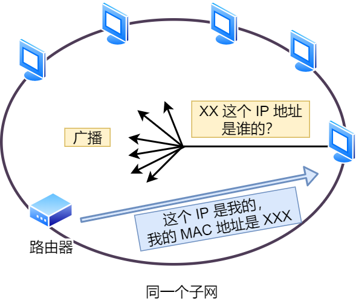

- 主机会通过**广播发送 ARP 请求**，这个包中包含了想要知道的 MAC 地址的主机 IP 地址。
- 当同个链路中的所有设备收到 ARP 请求时，会去拆开 ARP 请求包里的内容，如果 ARP 请求包中的目标 IP 地址与自己的 IP 地址一致，那么这个设备就将自己的 MAC 地址塞入 **ARP 响应包**返回给主机。

操作系统通常会把第一次通过 ARP 获取的 ==MAC 地址缓存==起来，以便下次直接从缓存中找到对应 IP 地址的 MAC 地址。

不过，MAC 地址的缓存是有一定期限的，超过这个期限，缓存的内容将被清除。

#### RARP 协议你知道是什么吗？

ARP 协议是已知 IP 地址求 MAC 地址，那 RARP 协议正好相反，它是**已知 MAC 地址求 IP 地址**。例如==将打印机服务器等小型嵌入式设备接入到网络时就经常会用得到==。

通常这需要架设一台 `RARP` 服务器，在这个服务器上注册设备的 MAC 地址及其 IP 地址。然后再将这个设备接入到网络，接着：

- 该设备会发送一条「我的 MAC 地址是XXXX，请告诉我，我的IP地址应该是什么」的请求信息。
- RARP 服务器接到这个消息后返回「MAC地址为 XXXX 的设备，IP地址为 XXXX」的信息给这个设备。

最后，设备就根据从 RARP 服务器所收到的应答信息设置自己的 IP 地址。

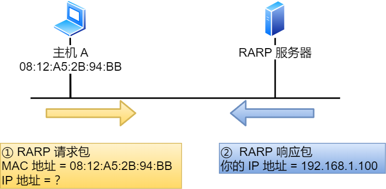

### [DHCP](https://xiaolincoding.com/network/4_ip/ip_base.html#dhcp)

DHCP 在生活中我们是很常见的了，我们的电脑通常都是通过 DHCP ==动态获取 IP 地址==，大大省去了配 IP 信息繁琐的过程。

 4 个步骤：

- 客户端首先发起 **DHCP 发现报文（DHCP DISCOVER）** 的 IP 数据报，由于客户端没有 IP 地址，也不知道 DHCP 服务器的地址，所以使用的是 ==UDP== **广播**通信，其使用的广播目的地址是 255.255.255.255（端口 67） 并且使用 0.0.0.0（端口 68） 作为源 IP 地址。DHCP 客户端将该 IP 数据报传递给链路层，链路层然后将帧广播到所有的网络中设备。
- DHCP 服务器收到 DHCP 发现报文时，用 **DHCP 提供报文（DHCP OFFER）** 向客户端做出响应。该报文仍然使用 IP 广播地址 255.255.255.255，该报文信息携带服务器提供可租约的 IP 地址、子网掩码、默认网关、DNS 服务器以及 **IP 地址租用期**。
- 客户端收到一个或多个服务器的 DHCP 提供报文后，从中选择一个服务器，并向选中的服务器发送 **DHCP 请求报文（DHCP REQUEST**进行响应，回显配置的参数。
- 最后，服务端用 **DHCP ACK 报文**对 DHCP 请求报文进行响应，应答所要求的参数。

一旦客户端收到 DHCP ACK 后，交互便完成了，并且客户端能够在租用期内使用 DHCP 服务器分配的 IP 地址。

如果租约的 DHCP IP 地址快期后，客户端会向服务器发送 DHCP 请求报文：

- 服务器如果同意继续租用，则用 DHCP ACK 报文进行应答，客户端就会延长租期。
- 服务器如果不同意继续租用，则用 DHCP NACK 报文，客户端就要停止使用租约的 IP 地址。

可以发现，DHCP 交互中，==全程都是使用 UDP 广播通信==。

> 但是有一个问题是 用到是==UDP广播== 所以路由器不会转发广播包
>
> 所以，为了解决这一问题，就出现了 **DHCP 中继代理**。有了 DHCP 中继代理以后，**对不同网段的 IP 地址分配也可以由一个 DHCP 服务器统一进行管理。**
>
> - DHCP 客户端会`向 DHCP 中继代理`发送 DHCP 请求包，而 DHCP 中继代理在收到这个广播包以后，再以==**单播**==的形式发给 DHCP 服务器。
> - 服务器端收到该包以后再向 DHCP 中继代理返回应答，并由 DHCP 中继代理将此包广播给 DHCP 客户端 。
>
> 因此，DHCP 服务器即使不在同一个链路上也可以实现统一分配和管理IP地址。

### [NAT](https://xiaolincoding.com/network/4_ip/ip_base.html#nat)

### [ICMP](https://xiaolincoding.com/network/4_ip/ip_base.html#icmp)

ICMP 全称是 **Internet Control Message Protocol**，也就是==互联网控制报文协议==。

> 网络包在复杂的网络传输环境里，常常会遇到各种问题。
>
> 当遇到问题的时候，总不能死个不明不白，没头没脑的作风不是计算机网络的风格。所以需要传出消息，报告遇到了什么问题，这样才可以调整传输策略，以此来控制整个局面。

#### ICMP 功能都有啥？

`ICMP` 主要的功能包括：**确认 IP 包是否成功送达目标地址、报告发送过程中 IP 包被废弃的原因和改善网络设置等。**

在 `IP` 通信中如果某个 `IP` 包因为某种原因未能达到目标地址，那么这个具体的原因将**由 ICMP 负责通知**。

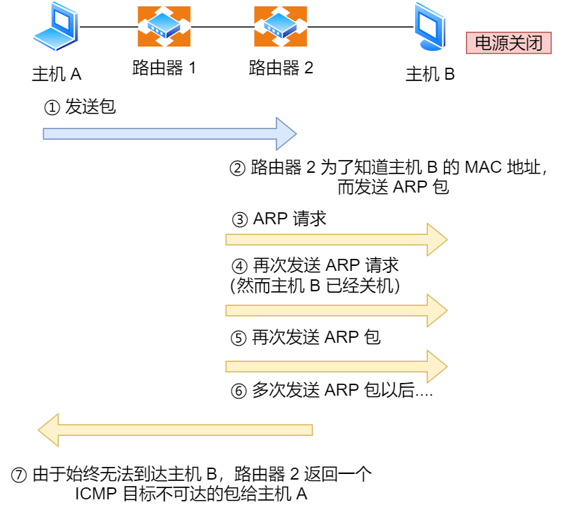

如上图例子，主机 `A` 向主机 `B` 发送了数据包，由于某种原因，途中的路由器 `2` 未能发现主机 `B` 的存在，这时，路由器 `2` 就会向主机 `A` 发送一个 `ICMP` 目标不可达数据包，说明发往主机 `B` 的包未能成功。

ICMP 的这种通知消息会使用 `IP` 进行发送 。

因此，从路由器 `2` 返回的 ICMP 包会按照往常的路由控制先经过路由器 `1` 再转发给主机 `A` 。收到该 ICMP 包的主机 `A` 则分解 ICMP 的首部和数据域以后得知具体发生问题的原因。

> ICMP 类型

ICMP 大致可以分为两大类：

- 一类是用于诊断的查询消息，也就是「**查询报文类型**」
- 另一类是通知出错原因的错误消息，也就是「**差错报文类型**」

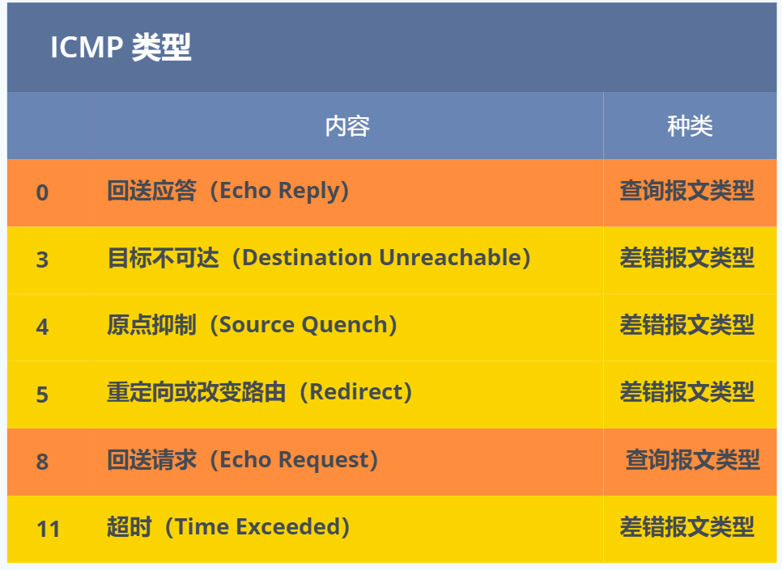

### [IGMP](https://xiaolincoding.com/network/4_ip/ip_base.html#igmp)

## 4.6.   ARP/RARP协议

arp协议只适合本地同一网段的数据通信？

> arp协议是 ==数据包在路由网络中 根据路由表查找的下一跳ip 查询得到下一跳mac地址的协议==

### ARP协议概念

- 地址解析协议，即ARP（Address Resolution Protocol），是<u>根据==IP地址==获取==物理地址==的一个TCP/IP协议</u>。主机发送信息时，将包含目标IP地址的ARP请求广播到网络上的所有主机，并接收返回消息，以此确定目标的物理地址；收到返回消息后将该IP地址和物理地址存入`本机ARP缓存`中并保留一定时间，下次请求时直接查询ARP缓存以节约资源。  

  > mac的那个自学习的表？

- 地址解析协议是建立在网络中各个主机`互相信任`的基础上的，网络上的主机可以自主发送ARP应答消息，其他主机收到应答报文时不会检测该报文的真实性就会将其记入本机ARP缓存；由此攻击者就可以向某一主机发送伪ARP应答报文，使其发送的信息无法到达预期的主机或到达错误的主机，这就构成了一个ARP欺骗。

- ARP命令可用于查询本机ARP缓存中IP地址和MAC地址的对应关系、添加或删除静态对应关系等。相关协议有RARP、Proxy-ARP。NDP用于在IPv6中代替地址解析协议。

### ARP协议工作流程：

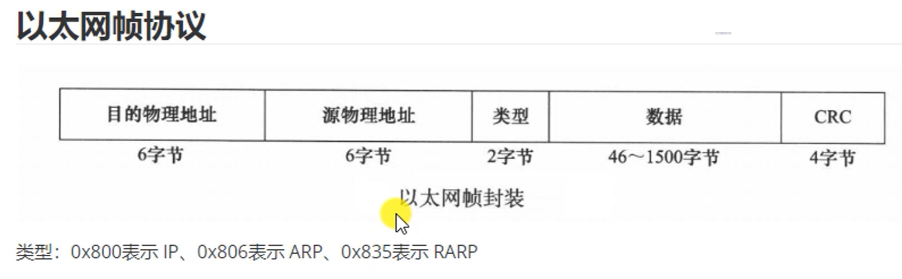

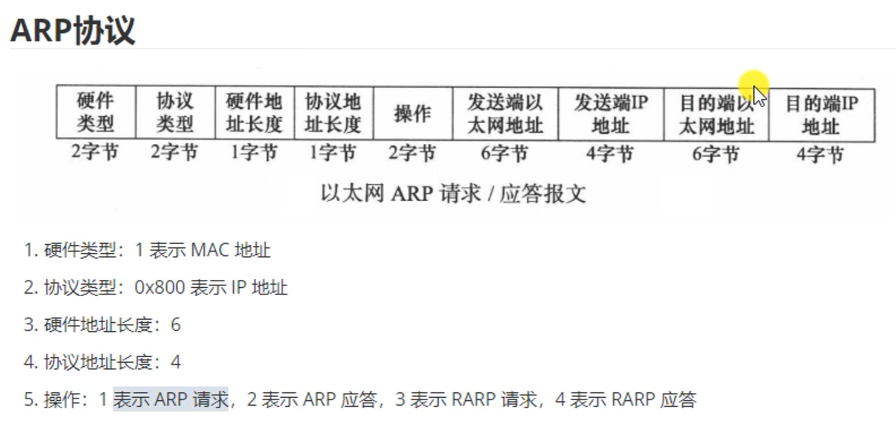

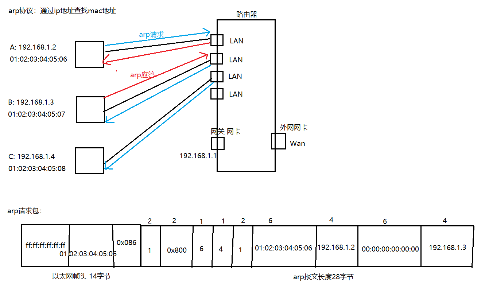

主机A的IP地址为192.168.1.1，MAC地址为0A-11-22-33-44-01；

主机B的IP地址为192.168.1.2，MAC地址为0A-11-22-33-44-02；

当主机A要与主机B通信时，==地址解析协议可以将主机B的IP地址（192.168.1.2）解析成主机B的MAC地址==，以下为工作流程：

1. 根据主机A上的[路由表](http://baike.baidu.com/view/149989.htm)内容，IP确定用于访问主机B的转发IP地址是192.168.1.2。然后A主机在自己的本地ARP缓存中检查主机B的匹配MAC地址。

2. 如果主机A在ARP缓存中`没有找到映射`，它将询问192.168.1.2的硬件地址，从而将ARP请求帧广播到本地网络上的所有主机。源主机A的IP地址和MAC地址都包括在ARP请求中。本地网络上的每台主机都接收到ARP请求并且检查是否与自己的IP地址匹配。如果主机发现请求的IP地址与自己的IP地址不匹配，它将丢弃ARP请求。

3. 主机B确定ARP请求中的IP地址与自己的IP地址匹配`（不匹配则忽略，后续所有步骤停止）`，则将主机A的IP地址和MAC地址[映射](http://baike.baidu.com/view/21249.htm)添加到本地ARP缓存中。

4. 主机B将包含其MAC地址的ARP回复消息直接发送回主机A。

5. 当主机A收到从主机B发来的ARP回复消息时，会用主机B的IP和MAC地址映射更新ARP缓存。本机缓存是有[生存期](http://baike.baidu.com/view/159877.htm)的，生存期结束后，将再次重复上面的过程。主机B的MAC地址一旦确定，主机A就能向主机B发送IP通信了。

### RARP协议的简单认识

`反向地址转换协议`，即RARP（<u>Reverse</u> Address Resolution Protocol）。 反向地址转换协议（RARP）允许局域网的物理机器从网关服务器的 ARP 表或者缓存上请求其 IP 地址。网络管理员在局域网的网关路由器里创建一个表以映射物理地址（MAC）和与其对应的 IP 地址。当设置一台新的机器时，其 RARP 客户机程序需要向路由器上的 RARP 服务器请求相应的 IP 地址。假设在路由表中已经设置了一个记录，RARP 服务器将会返回 IP 地址给机器，此机器就会存储起来以便日后使用。 RARP 可以使用于以太网、光纤分布式数据接口及令牌环 LAN等。

### RARP协议工作流程/原理：

==拿着自己的物理地址向上级查询自己的ip==

（1）给主机发送一个本地的RARP广播?，在此广播包中，声明自己的MAC地址并且请求任何收到此请求的RARP服务器分配一个IP地址；

（2）本地网段上的RARP服务器收到此请求后，检查其RARP列表，查找该MAC地址对应的IP地址；

（3）如果存在，RARP服务器就给源主机发送一个响应数据包并将此IP地址提供给对方主机使用；

（4）如果不存在，RARP服务器对此不做任何的响应；

（5）源主机收到从RARP服务器的响应信息，就利用得到的IP地址进行通讯；如果一直没有收到RARP服务器的响应信息，表示初始化失败。

答法2

> 1. 网络上的每台设备都会有一个独一无二的硬件地址，通常是由设备厂商分配的MAC地址。主机从==网卡上读取MAC地址==，然后在网络上发送一个==RARP请求的广播数据包==，请求RARP服务器回复该主机的IP地址。
>
> 2. RARP服务器收到了RARP请求数据包，==为其分配IP地址==，并将RARP回应发送给主机。
>
> 3. PC1收到RARP回应后，就使用得到的IP地址进行通讯。

## 4.7.   ICMP协议

| 协议 | 名称                 | 作用                                                         |
| :--- | :------------------- | :----------------------------------------------------------- |
| ICMP | Internet控制报文协议 | ICMP就是一个“==错误侦测与回报机制”==，其目的就是让我们能够检测网路的连线状况﹐也能确保连线的准确性，是ping和traceroute的工作协议 |

#### **ICMP**协议是一个网络层协议。

一个新搭建好的网络，往往需要先`进行一个简单的测试，来验证网络是否畅通`；<u>但是IP协议并不提供可靠传输。如果丢包了，IP协议并不能通知传输层是否丢包以及丢包的原因。</u>

所以我们就需要一种协议来完成这样的功能–ICMP协议。

#### **ICMP**协议的功能

> 1. `确认IP包是否成功到达目标地址`
>
> 2. `通知`在发送过程中IP包`被丢弃的原因`

#### **ICMP**的报文格式

==ICMP报文包含在IP数据报中==，IP报头在ICMP报文的最前面。一个ICMP报文包括IP报头（至少20字节）、ICMP报头（至少八字节）和ICMP报文（属于ICMP报文的数据部分）。当IP报头中的协议字段值为1时，就说明这是一个ICMP报文。

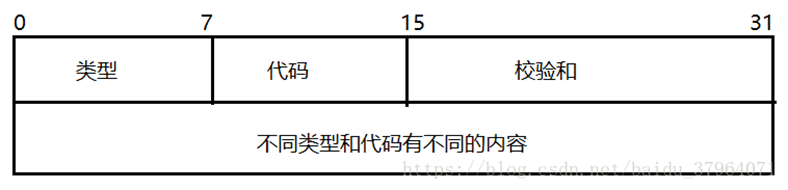

##### 类型    

- 占一字节，标识ICMP报文的类型，从类型值来看ICMP报文可以分为两大类。
- 第一类是取值为1~127的`差错`报文，第2类是取值128以上的`信息`报文

##### 代码    

- 占一字节，标识对应ICMP报文的代码。它与类型字段一起共同标识了ICMP报文的`详细类型`

##### 校验和  

- 这是对包括ICMP报文数据部分在内的整个ICMP数据报的校验和，以检验报文在传输过程中是否出现了差错（其计算方法与在我们介绍IP报头中的校验和计算方法是一样的）

 

## 4.8.   [ping 的工作原理](https://xiaolincoding.com/network/4_ip/ping.html#_5-2-ping-的工作原理)

### **ping**命令的功能

1. 用来检测网络的连通情况和分析网络速度；

2. 根据域名得到服务器IP； //dns哦

3. 会统计响应时间和TTL(IP包中的Time To Live，生存周期)

   > 根据ping返回的TTL值来判断对方所使用的操作系统及数据包经过路由器数量。

####  ==Ping 的原理是 ICMP 协议.==

### **那么如何验证的呢？**

（1）ping命令会先发送一个 `ICMP Echo Request`给对端   echo(回响 音：爱扣)

（2）对端接收到之后, 会返回一个`ICMP Echo Reply`

（3）若没有返回，就是超时了，会认为指定的网络地址不存在。

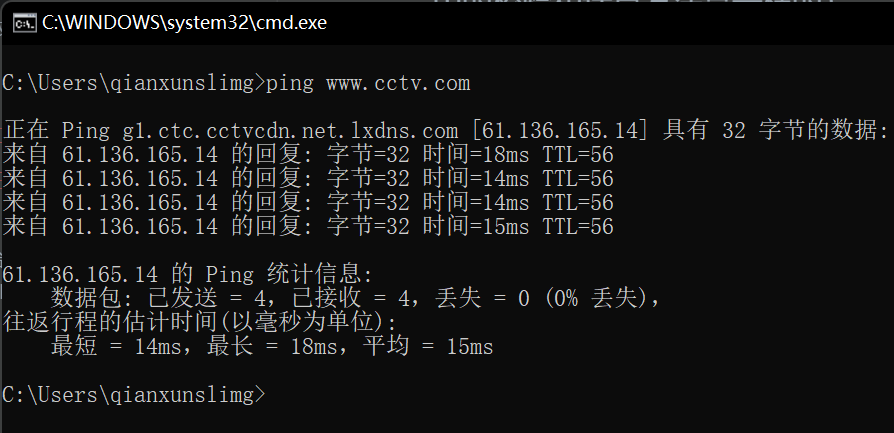

## 4.9.   IPv4和iPv6的区别

###  IPV4和IPV6的区别：

#### `扩展了路由和寻址的能力`

- IPv6把IP地址由<u>32位增加到128位</u>，从而能够==<u>**支持更大的地址空间**</u>==，估计在地球表面每平米有4*10^18个IPv6地址，使IP地址在可预见的将来不会用完。

- IPv6地址的编码采用类似于CIDR的`分层分级结构`，如同电话号码。<u>简化了路由，加快了路由速度</u>。

- 在多点传播地址中增加了一个“范围”域，从而使多点传播不仅仅局限在子网内，可以横跨不同的子网，不同的局域网。

#### `报头格式的简化`

IPv4报头格式中一些冗余的域或被丢弃或被列为扩展报头，从而降低了包处理和报头带宽的开销。虽然IPv6的地址大小是IPv4地址的4倍。但报头只有它的2倍大。

#### 对`可选项`更大的支持

IPv6的<u>可选项不放入报头，而是放在一个个独立的扩展头部</u>。如果不指定路由器不会打开处理扩展头部.这大大改变了路由性能。IPv6放宽了对可选项长度的严格要求(IPv4的可选项总长最多为40字节)，并可根据需要随时引入新选项。IPV6的很多新的特点就是由选项来提供的，如对IP层安全(IPSEC)的支持，对巨报(jumbogram)的支持以及对IP层漫游(Mobile-IP)的支持等。

#### QoS的功能

> ##### 什么是服务质量？
>
> 服务质量 (QoS) 是`对流量的操纵`，使得路由器或交换机等网络设备采取与生成该流量的应用程序所需行为一致的方式转发流量。换言之，QoS 使网络设备能够区分流量，然后向流量应用不同的行为。
>
> ##### QoS 解决的问题
>
> 过去，使用独立的物理网络来分别承载语音和数据流量。每个网络承载特定类型的流量，并提供该流量所需的内在质量水平。如今，这些相同的应用程序在基于数据包的融合网络上运行，流量在此共享通用基础架构和网络资源。这些基于数据包的网络旨在尽最大努力提供流量，它们没有固有的 QoS。
>
> 然而，语音和视频服务用户要求这些服务始终达到可接受的质量水平。基于数据包的网络将大量流量从 A 点传递到 B 点，并遵循生成该流量的所有应用程序的服务合同和性能需求，QoS 正是实现此目的的途径。
>
> ##### QoS 有何作用？
>
> QoS 对于管理当今基于数据包的网络中的流量至关重要，其包括以下功能：
>
> - 根据协议、地址和端口号区分流量优先顺序。
> - 过滤入口和出口流量。
> - 控制允许在设备上传输或接收的带宽。
> - 在数据包标头中读写 QoS 行为要求。
> - 控制拥塞，以便设备基于计划程序优先级发送优先级最高的流量。
> - 使用随机早期检测 (RED) 算法控制丢包，以便设备知道要丢弃或处理的数据包。

因特网不仅可以提供各种信息，缩短人们的距离.还可以进行网上娱乐。网上VOD现正被商家炒得热火朝天，而大多还只是准VOD的水平，且只能在局域网上实现，因特网上的VOD都很不理想.问题在于IPv4的报头虽然有服务类型的字段，实际上现在的路由器实现中都忽略了这一字段。在IPv6的头部，有两个相应的优先权和流标识字段，允许把数据报指定为某一信息流的组成部分，并可对这些数据报进行流量控制。如对于实时通信即使所有分组都丢失也要保持恒速，所以优先权最高，而一个新闻分组延迟几秒钟也没什么感觉，所以其优先权较低。IPv6指定这两字段是每一IPv6节点都必须实现的。

#### 安全

> ##### 身份验证和保密
>
> - `在IPv6中加入了关于身份验证、数据一致性和保密性的内容`。
>
> ##### `安全机制`IPSec是必选的
>
> - IPv4的是可选的或者是需要付费支持的。

#### 加强了对`移动设备的支持`

- IPv6在设计之初有有着支持移动设备的思想，允许移动终端在切换接入点时保留相同的IP地址。

#### 支持`无状态自动地址`配置

> 无状态地址自动配置会自动执行某些网络管理员的任务。
>
> 无状态地址自动配置是 IPv6 节点（主机或路由器）用于为接口自动配置 IPv6 地址的过程。节点通过将地址前缀与节点的 MAC 地址派生的标识或用户指定的接口标识组合来构建各种 IPv6 地址。这些前缀包括本地链路前缀（fe80::/10）和本地 IPv6 路由器（如果存在）所通告的长度为 64 的前缀。
>
> 将地址分配给某个接口之前，节点执行重复地址检测以验证其唯一性。节点对新地址发送邻居请求查询并等待响应。如果节点没有接收到响应，那么假设该地址是唯一的。如果节点接收到一个邻居广告格式的响应，那么该地址已在使用。如果节点确定其尝试的 IPv6 地址不是唯一的，那么自动配置将停止并要求手工配置该接口。

### 简化了`地址配置`过程

无需DNS服务器也可完成地址的配置，路由广播地址前缀，各主机根据自己MAC地址和收到的地址前缀生成可聚合全球单播地址。这也方便了某一区域内的主机同时更换IP地址前缀。

> 理解 无需rarp协议 自己进行ip的配置
>
> 使用无状态自动配置，无需手动干预就能够改变网络中所有主机的IP地址。例如，当企业更换了联入Internet的ISP时，将从新ISP处得到一个新的可聚集全局地址前缀。ISP把这个地址前缀从它的路由器上传送到企业路由器上。由于企业路由器将周期性地向本地链接中的所有主机多点广播路由器公告，因此企业网络中所有主机都将通过路由器公告收到新的地址前缀，此后，它们就会自动产生新的IP地址并覆盖旧的IP地址。

## IP地址作用，以及MAC地址作用

- MAC地址是一个硬件地址，用来定义网络设备的位置，主要由数据链路层负责。

- P地址是IP协议提供的一种统一的地址格式，为互联网上的每一个网络和每一台主机分配一个逻辑地址，以此来屏蔽物理地址的差异。

> IP地址决定了网络中数据包如何通过路由器的转发到达目的地，而MAC地址则唯一标识了接受这个数据包的主机。
>
> ”IP地址是快递地址，MAC是收件人“

> ==<u>IP 如何转发</u>==
>
> ==<u>MAC 目的地</u>==

1. ==数据包的传输过程 源ip和目的ip是一直不变的 注意==

2. ==数据包进入网络层 在路由器之间路由转发 查询路由器表查得下一跳的ip地址 然后arp查询得到下一跳的mac==

# 6. [socket](#Tcp代码实现)

## socket编程中服务器端和客户端主要用到哪些函数

### 基于TCP的socket：

1. 服务器端程序：

   > - 创建一个socket，用函数socket()
   >
   > - 绑定IP地址、端口等信息到socket上，用函数bind()
   >
   > - 设置允许的最大连接数，用函数listen()
   >
   > - 接收客户端上来的连接，用函数accept()
   >
   > - 收发数据，用函数send()和recv()，或者read()和write()
   >
   > - 关闭网络连接

2. 客户端程序：

   > - 创建一个socket，用函数socket()
   >
   > - 设置要连接的对方的IP地址和端口等属性
   >
   > - 连接服务器，用函数connect()
   >
   > - 收发数据，用函数send()和recv()，或read()和write()
   >
   > - 关闭网络连接

   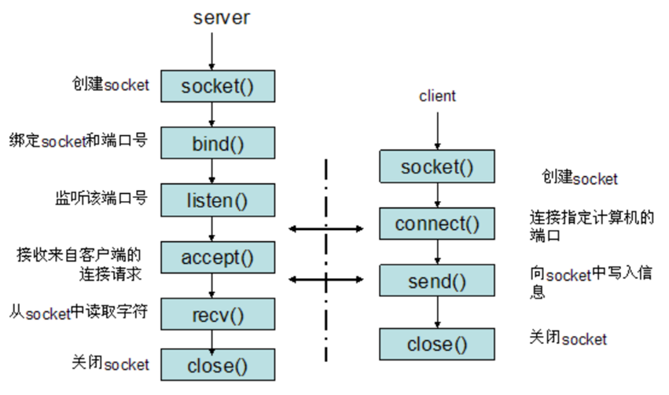

### 基于UDP的socket：

1. 服务器端流程

   > - 建立套接字文件描述符，使用函数socket()，生成套接字文件描述符。
   >
   > - 设置服务器地址和侦听端口，初始化要绑定的网络地址结构。
   >
   > - 绑定侦听端口，使用bind()函数，将套接字文件描述符和一个地址类型变量进行绑定。
   >
   > - 接收客户端的数据，使用recvfrom()函数接收客户端的网络数据。
   >
   > - 向客户端发送数据，使用sendto()函数向服务器主机发送数据。
   >
   > - 关闭套接字，使用close()函数释放资源。UDP协议的客户端流程

2. 客户端流程

   > - 建立套接字文件描述符，socket()。
   >
   > - 设置服务器地址和端口，struct sockaddr。
   >
   > - 向服务器发送数据，sendto()。
   >
   > - 接收服务器的数据，recvfrom()。
   >
   > - 关闭套接字，close()。

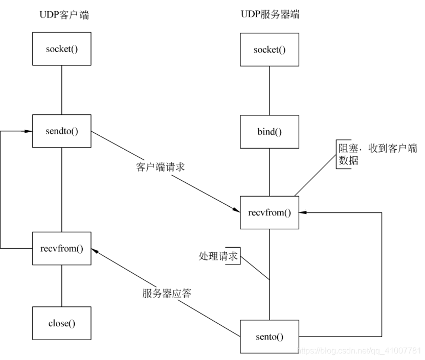

 

 

## Socket编程的send() recv() accept() socket()函数？

send函数用来向TCP连接的另一端发送数据。客户程序一般用send函数向服务器发送请求，而服务器则通常用send函数来向客户程序发送应答,send的作用是将要发送的数据拷贝到缓冲区，协议负责传输。

recv函数用来从TCP连接的另一端接收数据，当应用程序调用recv函数时，recv先等待s的发送缓冲中的数据被协议传送完毕，然后从缓冲区中读取接收到的内容给应用层。
 accept函数用了接收一个连接，内核维护了半连接队列和一个已完成连接队列，当队列为空的时候，accept函数阻塞，不为空的时候accept函数从上边取下来一个已完成连接，返回一个文件描述符。

 

## 介绍一下udp的connect函数

除非套接字已连接，否则异步错误是不会返回到UDP套接字的。我们确实可以给UDP套接字调用connect，然而这样做的结果却与TCP连接不同的是没有三路握手过程。内核只是检查是否存在立即可知的错误，记录对端的IP地址和端口号，然后立即返回调用进程。

对于已连接UDP套接字，与默认的未连接UDP套接字相比，发生了三个变化。

其实一旦UDP套接字调用了connect系统调用，那么这个UDP上的连接就变成一对一的连接，但是通过这个UDP连接传输数据的性质还是不变的，仍然是不可靠的UDP连接。一旦变成一对一的连接，在调用系统调用发送和接受数据时也就可以使用TCP那一套系统调用了。

1、我们再也不能给输出操作指定目的IP地址和端口号。也就是说，我们不使用sendto，而改用write或send。写到已连接UDP套接字上的任何内容都自动发送到由connect指定的协议地址。可以给已连接的UDP套接字调用sendto，但是不能指定目的地址。sendto的第五个参数必须为空指针，第六个参数应该为0.

2、不必使用recvfrom以获悉数据报的发送者，而改用read、recv或recvmsg。在一个已连接UDP套接字上，由内核为输入操作返回的数据报只有那些来自connect指定协议地址的数据报。这样就限制一个已连接UDP套接字能且仅能与一个对端交换数据报。

3、由已连接UDP套接字引发的异步错误会返回给它们所在的进程，而未连接的UDP套接字不接收任何异步错误。

来自任何其他IP地址或断开的数据报不投递给这个已连接套接字，因为它们要么源IP地址要么源UDP端口不与该套接字connect到的协议地址相匹配。

UDP客户进程或服务器进程只在使用自己的UDP套接字与确定的唯一对端进行通信时，才可以调用connect。调用connect的通常是UDP客户，不过有些网络应用中的UDP服务器会与单个客户长时间通信TFTP，这种情况下，客户和服务器都可能调用connect。

## 6.6.   server端监听端口，但还没有客户端连接进来，此时进程处于什么状态？

这个需要看服务端的编程模型，如果如上一个问题的回答描述的这样，则处于阻塞状态，如果使用了epoll,select等这样的io复用情况下，处于运行状态

 

## 6.7.   socket的五元组是啥

五元组格式（`协议`，`本地IP`，`本地端口`，`远方IP`，`远方端口`）

服务器一般都有两个功能：监听 和 处理

- 在监听的时候，协议/本地IP/本地端口（监听端口）都是确定的，当收到客户端的报文时，远方IP就是报文的源IP地址，远方端口就是报文的源端口，这样一来五元组就确定了。

- 客户端的话正好相反，在发送请求时采用随机的本地端口，而接受响应时采用服务器的源端口作为远方端口。

> getpeername得到远方端口号及地址
> getsockname 得到本地端口号及地址

 

 

#  7. 项目实战

 [项目实战.pdf](..\牛客学习资料\第五章项目代码PPT\第五章项目代码+PPT\项目实战.pdf) 


## 阻塞/非阻塞 同步/异步（网络io)

> 典型的一次IO的两个阶段是什么？`数据就绪` 和 `数据读写`

数据就绪：根据系统IO操作的就绪状态

- 阻塞

- 非阻塞

数据读写：根据应用程序和内核的交互方式

- 同步

- 异步

陈硕：在处理 IO 的时候，阻塞和非阻塞都是同步 IO，`只有使用了特殊的 API 才是异步 IO`。

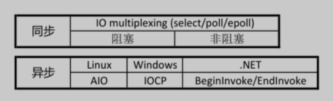

> 一个典型的网络IO接口调用，分为两个阶段，分别是“数据就绪” 和 “数据读写”，数据就绪阶段分为阻塞和非阻塞，表现得结果就是，阻塞当前线程或是直接返回。
>
> 同步表示A向B请求调用一个网络IO接口时（或者调用某个业务逻辑API接口时），<u>数据的读写都是由请求方A`自己`来完成的</u>（不管是阻塞还是非阻塞）；异步表示A向B请求调用一个网络IO接口时（或者调用某个业务逻辑API接口时），向B传入请求的事件以及事件发生时通知的方式，A就可以处理其它逻辑了，当B监听到事件处理完成后，会用事先约定好的通知方式，通知A处理`结果`。(意思是我给你处里好了 告诉你一声)

- 同步阻塞

- 同步非阻塞

- 异步阻塞

- 异步非阻塞

## Unix/Linux上的五种IO模型

### 阻塞 blocking

调用者调用了某个函数，等待这个函数返回，期间什么也不做，不停的去检查这个函数有没有返回，必

须等这个函数返回才能进行下一步动作。

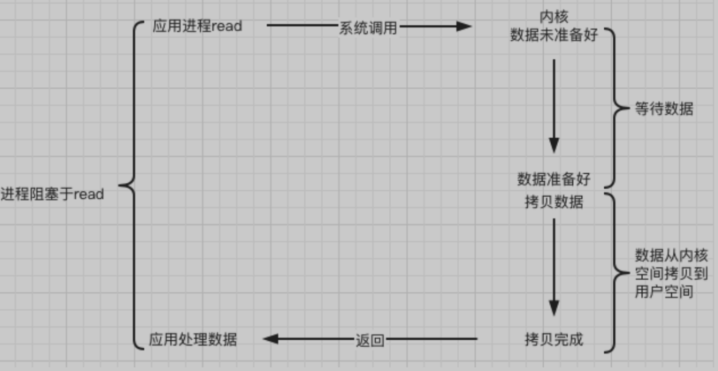

### 非阻塞 non-blocking（NIO）

非阻塞等待，<u>每隔一段时间就去检测IO事件是否就绪。没有就绪就可以做其他事</u>。非阻塞I/O执行系统调用<u>总是立即返回</u>，不管事件是否已经发生，<u>若事件没有发生，则返回-1</u>，此时可以`根据 errno` 区分这两种情况，对于accept，recv 和 send，事件未发生时，errno 通常被设置成 EAGAIN。

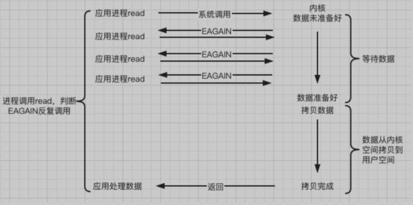

### IO复用（IO multiplexing）

Linux 用 `select/poll/epoll` 函数实现 IO 复用模型，这些函数<u>也会使进程阻塞</u>，但是和阻塞IO所不同的是这些函数<u>可以同时阻塞多个IO操作</u>。而且<u>可以同时对多个读操作、写操作的IO函数进行检测。直到有数据可读或可写时，才真正调用IO操作函数</u>。

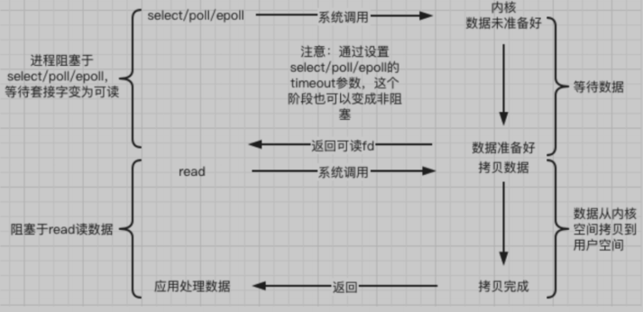

### 信号驱动（signal-driven）

Linux 用套接口进行信号驱动 IO，安装一个信号处理函数，进程继续运行并不阻塞，当IO事件就绪，进程收到SIGIO 信号，然后处理 IO 事件。

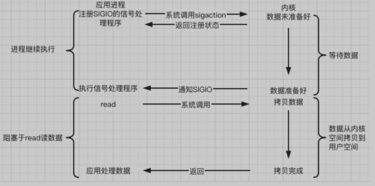

内核在`第一个阶段是异步`，在第二个阶段是同步；与非阻塞IO的区别在于它提供了消息通知机制，<u>不需要用户进程不断的轮询检查，减少了系统API的调用次数，提高了效率</u>。 

### 异步（asynchronous）

Linux中，可以调用 aio_read 函数告诉内核描述字缓冲区指针和缓冲区的大小、文件偏移及通知的方式，然后立即返回，当内核将数据拷贝到缓冲区后，再通知应用程序。

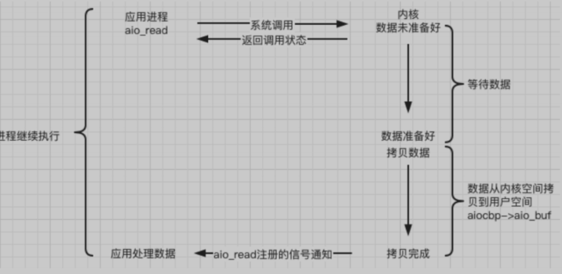

## Web Server（网页服务器）

一个 Web Server 就是一个服务器软件（程序），或者是运行这个服务器软件的硬件（计算机）。其主要功能是<u>通过 HTTP 协议与客户端（通常是浏览器（Browser））进行通信，来接收，存储，处理来自客户端的 HTTP 请求，并对其请求做出 HTTP 响应，返回给客户端其请求的内容（文件、网页等）或返回一个 Error 信息。</u>

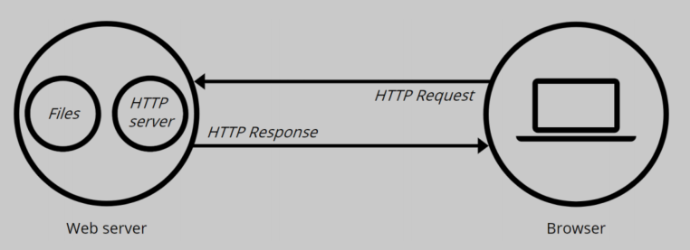

通常用户使用 Web 浏览器与相应服务器进行通信。在浏览器中键入“域名”或“IP地址:端口号”，浏览器则

1. 先将你的域名解析成相应的 IP 地址或者直接根据你的IP地址向对应的 Web 服务器发送一个 HTTP 请求。这一过程首先要通过 TCP 协议的三次握手建立与目标 Web 服务器的连接，
2. 然后 HTTP 协议生成针对目标 Web 服务器的 HTTP 请求报文，通过 TCP、IP 等协议发送到目标 Web 服务器上。

## HTTP协议(应用层的协议) [看之前的](#3. 应用层)

## 服务器编程基本框架

虽然服务器程序种类繁多，但其基本框架都一样，不同之处在于逻辑处理。

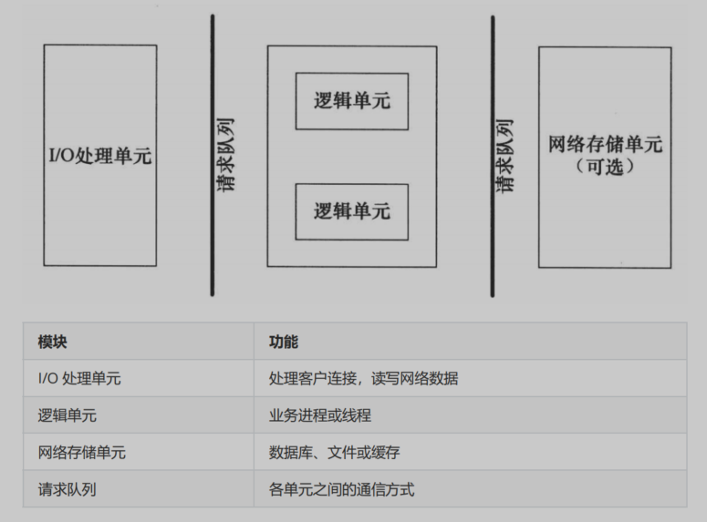

- I/O 处理单元是服务器管理客户连接的模块。它通常要完成以下工作：等待并接受新的客户连接，接收客户数据，将服务器响应数据返回给客户端。但是数据的收发不一定在 I/O 处理单元中执行，也可能在逻辑单元中执行，具体在何处执行取决于事件处理模式。

- 一个逻辑单元通常是一个进程或线程。它分析并处理客户数据，然后将结果传递给 I/O 处理单元或者直接发送给客户端（具体使用哪种方式取决于事件处理模式）。服务器通常拥有多个逻辑单元，以实现对多个客户任务的并发处理。

- 网络存储单元可以是数据库、缓存和文件，但不是必须的。

- 请求队列是各单元之间的通信方式的抽象。I/O 处理单元接收到客户请求时，需要以某种方式通知一个逻辑单元来处理该请求。同样，多个逻辑单元同时访问一个存储单元时，也需要采用某种机制来协调处理竞态条件。请求队列通常被实现为池的一部分。

## 两种高效的事件处理模式

服务器程序通常需要处理三类事件：I/O 事件、信号及定时事件。有两种高效的事件处理模式：Reactor和 Proactor，`同步 I/O 模型通常用于实现 Reactor 模式`，`异步 I/O 模型通常用于实现 Proactor 模式`。

### `Reactor模式` （核反应堆）

要求`主线程（I/O处理单元）只负责监听`文件描述符上是否有事件发生，有的话就立即将该事件通知工作线程（逻辑单元），将 socket 可读可写事件放入请求队列，交给工作线程处理。除此之外，主线程不做任何其他实质性的工作。<u>读写数据，接受新的连接，以及处理客户请求均在工作线程中完成</u>。

使用同步 I/O（以 epoll_wait 为例）实现的 Reactor 模式的工作流程是：

1. 主线程往 epoll 内核事件表中注册 socket 上的读就绪事件。
2. 主线程调用 epoll_wait 等待 socket 上有数据可读。
3. 当 socket 上有数据可读时， epoll_wait 通知主线程。主线程则将 socket 可读事件放入请求队列。
4. 睡眠在请求队列上的某个工作线程被唤醒，它从 socket 读取数据，并处理客户请求，然后往 epoll

内核事件表中注册该 socket 上的写就绪事件。

5. 当主线程调用 epoll_wait 等待 socket 可写。
6. 当 socket 可写时，epoll_wait 通知主线程。主线程将 socket 可写事件放入请求队列。
7. 睡眠在请求队列上的某个工作线程被唤醒，它往 socket 上写入服务器处理客户请求的结果。

#### Reactor 模式的工作流程：

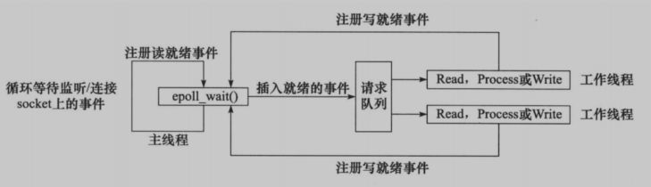

### Proactor模式

Proactor 模式将所有 I/O 操作都交给主线程和内核来处理（进行读、写），`工作线程仅仅负责业务逻辑`。使用异步 I/O 模型（以 aio_read 和 aio_write 为例）实现的 Proactor 模式的工作流程是：

1. 主线程调用 aio_read 函数向内核注册 socket 上的读完成事件，并告诉内核用户读缓冲区的位置，以及读操作完成时如何通知应用程序（这里以信号为例）。
2. 主线程继续处理其他逻辑。
3. 当 socket 上的数据被读入用户缓冲区后，内核将向应用程序发送一个信号，以通知应用程序数据已经可用。
4. 应用程序预先定义好的信号处理函数选择一个工作线程来处理客户请求。工作线程处理完客户请求后，调用 aio_write 函数向内核注册 socket 上的写完成事件，并告诉内核用户写缓冲区的位置，以及写操作完成时如何通知应用程序。
5. 主线程继续处理其他逻辑。
6. 当用户缓冲区的数据被写入 socket 之后，内核将向应用程序发送一个信号，以通知应用程序数据已经发送完毕。
7. 应用程序预先定义好的信号处理函数选择一个工作线程来做善后处理，比如决定是否关闭 socket。

#### Proactor 模式的工作流程：

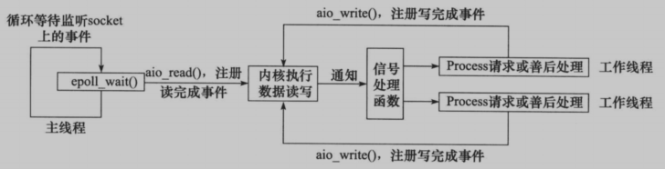

### 模拟Proactor模式

使用同步 I/O 方式模拟出 Proactor 模式。原理是：主线程执行数据读写操作，读写完成之后，主线程向

工作线程通知这一”完成事件“。那么从工作线程的角度来看，它们就直接获得了数据读写的结果，接下

来要做的只是对读写的结果进行逻辑处理。

使用同步 I/O 模型（以 epoll_wait为例）模拟出的 Proactor 模式的工作流程如下：

1. 主线程往 epoll 内核事件表中注册 socket 上的读就绪事件。
2. 主线程调用 epoll_wait 等待 socket 上有数据可读。
3. 当 socket 上有数据可读时，epoll_wait 通知主线程。主线程从 socket 循环读取数据，直到没有更多数据可读，然后将读取到的数据封装成一个请求对象并插入请求队列。
4. 睡眠在请求队列上的某个工作线程被唤醒，它获得请求对象并处理客户请求，然后往 epoll 内核事件表中注册 socket 上的写就绪事件。
5. 主线程调用 epoll_wait 等待 socket 可写。
6. 当 socket 可写时，epoll_wait 通知主线程。主线程往 socket 上写入服务器处理客户请求的结果。

#### 同步 I/O 模拟 Proactor 模式的工作流程：

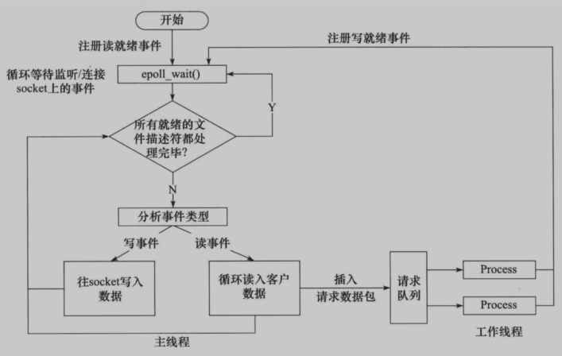

## 线程池

线程池是由`服务器预先创建的一组子线程`，线程池中的<u>线程数量应该和 CPU 数量差不多</u>。线程池中的所有子线程都运行着相同的代码。当有新的任务到来时，主线程将通过某种方式选择线程池中的某一个子线程来为之服务。相比与动态的创建子线程，选择一个已经存在的子线程的代价显然要小得多。至于主线程选择哪个子线程来为新任务服务，则有多种方式：

- 主线程使用某种算法来主动选择子线程。最简单、最常用的算法是`随机算法`和 `Round Robin（轮流选取）算法`，但更优秀、更智能的算法将使任务在各个工作线程中更均匀地分配，从而减轻服务器的整体压力。

- 主线程和所有子线程通过一个共享的工作队列来同步，子线程都睡眠在该工作队列上。当有新的任务到来时，主线程将任务添加到工作队列中。这将唤醒正在等待任务的子线程，不过只有一个子线程将获得新任务的”接管权“，它可以从工作队列中取出任务并执行之，而其他子线程将继续睡眠在工作队列上。

线程池的一般模型为：

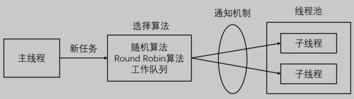

> 线程池中的线程数量最直接的限制因素是中央处理器(CPU)的处理器(processors/cores)的数量N ：如果你的CPU是4-cores的，对于CPU密集型的任务(如视频剪辑等消耗CPU计算资源的任务)来说，那线程池中的线程数量最好也设置为4（或者+1防止其他因素造成的线程阻塞）；对于IO密集型的任务，一般要多于CPU的核数，因为线程间竞争的不是CPU的计算资源而是IO，IO的处理一般较慢，多于cores数的线程将为CPU争取更多的任务，不至在线程处理IO的过程造成CPU空闲导致资源浪费。

- `空间换时间`，浪费服务器的硬件资源，换取运行效率。

- 池是一组资源的集合，<u>这组资源在服务器启动之初就被完全创建好并初始化，这称为`静态`资源</u>。

- 当服务器进入正式运行阶段，开始处理客户请求的时候，如果它需要相关的资源，可以直接从池中获取，无需动态分配。

- 当服务器处理完一个客户连接后，可以把相关的资源放回池中，<u>无需执行系统调用释放资源</u>。

## 有限状态机

逻辑单元内部的一种高效编程方法：有限状态机（finite state machine）。

有的应用层协议头部包含数据包类型字段，每种类型可以映射为逻辑单元的一种执行状态，服务器可以<u>根据它来编写相应的处理逻辑</u>。如下是一种状态独立的有限状态机：

```c++
STATE_MACHINE( Package _pack ) { 
    PackageType _type = _pack.GetType(); 
    switch( _type ) { 
        case type_A: 
            process_package_A( _pack ); 
            break; 
        case type_B: 
            process_package_B( _pack ); 
            break; 
    } 
}
```

这是一个简单的有限状态机，只不过该状态机的每个状态都是相互独立的，即状态之间没有相互转移。

状态之间的转移是需要状态机内部驱动，如下代码：

```c++
STATE_MACHINE() { 
    State cur_State = type_A;
    while( cur_State != type_C ) { 
        Package _pack = getNewPackage(); 
        switch( cur_State ) { 
            case type_A: 
                process_package_state_A( _pack ); 
                cur_State = type_B; 
                break; 
            case type_B: 
                process_package_state_B( _pack ); 
                cur_State = type_C; 
                break; 
        } 
    } 
}
```

该状态机包含三种状态：type_A、type_B 和 type_C，其中 type_A 是状态机的开始状态，type_C 是状态机的结束状态。状态机的当前状态记录在 cur_State 变量中。在一趟循环过程中，状态机先通过getNewPackage 方法获得一个新的数据包，然后根据 cur_State 变量的值判断如何处理该数据包。数据包处理完之后，状态机通过给 cur_State 变量传递目标状态值来实现状态转移。那么当状态机进入下一趟循环时，它将执行新的状态对应的逻辑。

## EPOLLONESHOT事件

- 即使可以使用 ET 模式，一个socket 上的某个事件还是可能被触发多次。这在并发程序中就会引起一个问题。<u>比如一个线程在读取完某个 socket 上的数据后开始处理这些数据，而在数据的处理过程中该socket 上又有新数据可读（EPOLLIN 再次被触发），此时另外一个线程被唤醒来读取这些新的数据。于是就出现了两个线程同时操作一个 socket 的局面。</u>`一个socket连接在任一时刻都只被一个线程处理，可以使用 epoll 的 EPOLLONESHOT 事件实现`。

- 对于注册了 EPOLLONESHOT 事件的文件描述符，操作系统最多触发其上注册的一个可读、可写或者异常事件，且只触发一次，除非我们使用 epoll_ctl 函数重置该文件描述符上注册的 EPOLLONESHOT 事件。这样，当一个线程在处理某个 socket 时，其他线程是不可能有机会操作该 socket 的。但反过来思考，注册了 EPOLLONESHOT 事件的 socket 一旦被某个线程处理完毕， 该线程就应该立即重置这个socket 上的 EPOLLONESHOT 事件，以确保这个 socket 下一次可读时，其 EPOLLIN 事件能被触发，进而让其他工作线程有机会继续处理这个 socket。

## **服务器压力测试**

`Webbench` 是 Linux 上一款知名的、优秀的 web 性能压力测试工具。它是由Lionbridge公司开发。

> - 测试处在相同硬件上，不同服务的性能以及不同硬件上同一个服务的运行状况。
>
> - 展示服务器的两项内容：每秒钟响应请求数和每秒钟传输数据量。

基本原理：Webbench 首先 fork 出多个子进程，每个子进程都循环做 web 访问测试。子进程把访问的结果通过pipe 告诉父进程，父进程做最终的统计结果。

测试示例

```
webbench -c 1000 -t 30 http://192.168.110.129:10000/index.html 
参数：
-c 表示客户端数 
-t 表示时间
```


#  其他

## [CNAME CDN IPC相关知识](https://qianxunslimg.xyz/2022/05/26/cname-cdn-ipc/)
