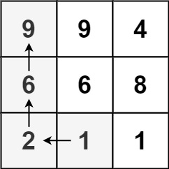

# 记忆化搜索

记忆化搜索是一种通过记录已经遍历过的状态的信息，从而避免对同一状态重复遍历的搜索实现方式。

因为记忆化搜索确保了每个状态只访问一次，它也是一种常见的动态规划实现方式。

### [509. 斐波那契数](https://leetcode.cn/problems/fibonacci-number/)

[labuladong 题解](https://labuladong.github.io/article/?qno=509)[思路](https://leetcode.cn/problems/fibonacci-number/#)

难度简单462收藏分享切换为英文接收动态反馈

**斐波那契数** （通常用 `F(n)` 表示）形成的序列称为 **斐波那契数列** 。该数列由 `0` 和 `1` 开始，后面的每一项数字都是前面两项数字的和。也就是：

```
F(0) = 0，F(1) = 1
F(n) = F(n - 1) + F(n - 2)，其中 n > 1
```

给定 `n` ，请计算 `F(n)` 。

 

**示例 1：**

```
输入：n = 2
输出：1
解释：F(2) = F(1) + F(0) = 1 + 0 = 1
```

**示例 2：**

```
输入：n = 3
输出：2
解释：F(3) = F(2) + F(1) = 1 + 1 = 2
```

#### `记忆化搜索`

是因为函数压栈 所以用时高吗

```c++
class Solution {
public:
    unordered_map<int, int> memo;
    int fib(int n) {
      if(memo.count(n)) return memo[n];
      if(n<=1) return n;
      return fib(n-1) + fib(n-2);
    }
};
```

#### 动态规划 略

### [397. 整数替换](https://leetcode.cn/problems/integer-replacement/)

难度中等235收藏分享切换为英文接收动态反馈

给定一个正整数 `n` ，你可以做如下操作：

1. 如果 `n` 是偶数，则用 `n / 2`替换 `n` 。
2. 如果 `n` 是奇数，则可以用 `n + 1`或`n - 1`替换 `n` 。

返回 `n` 变为 `1` 所需的 *最小替换次数* 。

 

**示例 1：**

```
输入：n = 8
输出：3
解释：8 -> 4 -> 2 -> 1
```

**示例 2：**

```
输入：n = 7
输出：4
解释：7 -> 8 -> 4 -> 2 -> 1
或 7 -> 6 -> 3 -> 2 -> 1
```

#### 最优 贪心

局部最优的情况肯定是 不能被2整除的情况下下向4靠拢 比如 9 - 8 - 4 - 2 - 1    9 - 10 - 5 - 6 - 3 - 4 - 2 - 1

```c++
class Solution {
public:
  int integerReplacement(int n) {
    long nn = n;
    int res = 0;
    while (nn != 1) {
      if (nn == 3) {
        res += 2;
        break;
      }
      if (nn % 2) {
        if (!((nn + 1) % 4)) {
          nn = nn + 1;
        } else {
          nn = nn - 1;
        }
      } else {
        nn /= 2;
      }
      res++;
    }
    return res;
  }
};
```

#### 记忆化搜索

递归思想 恶心的是 有个INT_MAX会导致溢出

```c++
class Solution {
public:
    unordered_map<int, int> memo;
    int integerReplacement(int n) {
      if(n == INT_MAX) return 32;  //溢出的特殊情况直接返回
      if(memo.count(n))
        return memo[n];
      if(n == 1) return 0;
      if(n%2){
        return 1 + min(integerReplacement(n+1), integerReplacement(n-1));
      }else
        return 1 + integerReplacement(n/2);
    }
};
```

#### 官方

```c++
class Solution {
public:
    int integerReplacement(int n) {
        if (n == 1) {
            return 0;
        }
        if (n % 2 == 0) {
            return 1 + integerReplacement(n / 2);
        }
        return 2 + min(integerReplacement(n / 2), integerReplacement(n / 2 + 1));
    }
};
```

### [464. 我能赢吗](https://leetcode.cn/problems/can-i-win/)

难度中等424收藏分享切换为英文接收动态反馈

在 "100 game" 这个游戏中，两名玩家轮流选择从 `1` 到 `10` 的任意整数，累计整数和，先使得累计整数和 **达到或超过** 100 的玩家，即为胜者。

如果我们将游戏规则改为 “玩家 **不能** 重复使用整数” 呢？

例如，两个玩家可以轮流从公共整数池中抽取从 1 到 15 的整数（不放回），直到累计整数和 >= 100。

给定两个整数 `maxChoosableInteger` （整数池中可选择的最大数）和 `desiredTotal`（累计和），若先出手的玩家是否能稳赢则返回 `true` ，否则返回 `false` 。假设两位玩家游戏时都表现 **最佳** 。

 

**示例 1：**

```
输入：maxChoosableInteger = 10, desiredTotal = 11
输出：false
解释：
无论第一个玩家选择哪个整数，他都会失败。
第一个玩家可以选择从 1 到 10 的整数。
如果第一个玩家选择 1，那么第二个玩家只能选择从 2 到 10 的整数。
第二个玩家可以通过选择整数 10（那么累积和为 11 >= desiredTotal），从而取得胜利.
同样地，第一个玩家选择任意其他整数，第二个玩家都会赢。
```


[【负雪明烛】图解算法：递归，步步优化，弄清每个细节 - 我能赢吗 - 力扣（LeetCode）](https://leetcode.cn/problems/can-i-win/solution/by-fuxuemingzhu-g16c/)

#### 详细但超时的解法 有基本的思路

```c++
class Solution {
public:
    bool canIWin(int maxChoosableInteger, int desiredTotal) {
        // 候选集，「公共整数池」
        unordered_set<int> choosable;
        for (int i = 1; i <= maxChoosableInteger; ++i) {
            choosable.insert(i);
        }
        // 判断当前做选择的玩家（先手），是否一定赢
        return dfs(choosable, 0, maxChoosableInteger, desiredTotal);
    }
    
    // 当前做选择的玩家是否一定赢
    bool dfs(unordered_set<int>& choosable, int sum, int maxChoosableInteger, int desiredTotal) {
        // 遍历可选择的公共整数
        for (int x : choosable) {
            // 如果选择了 x 以后，大于等于了 desiredTotal，当前玩家赢
            if (sum + x >= desiredTotal) {
                return true;
            }
            // 改变「公共整数池」
            // 为了避免影响当前的 choosable，因此复制了一份并擦出掉 x，传给对手
            unordered_set<int> choosable_copy = choosable;
            choosable_copy.erase(x);
            // 当前玩家选择了 x 以后，判断对方玩家一定输吗？
            if (!dfs(choosable_copy, sum + x, maxChoosableInteger, desiredTotal)) {
                return true;
            }
        }
        return false;
    }
    
};
```

#### 官方题解

```c++
class Solution {
public:
    unordered_map<int, bool> memo;

    bool canIWin(int maxChoosableInteger, int desiredTotal) {
        if ((1 + maxChoosableInteger) * (maxChoosableInteger) / 2 < desiredTotal) {
            return false;
        }
        return dfs(maxChoosableInteger, 0, desiredTotal, 0);
    }

    bool dfs(int maxChoosableInteger, int usedNumbers, int desiredTotal, int currentTotal) {
        if (!memo.count(usedNumbers)) {
            bool res = false;
            for (int i = 0; i < maxChoosableInteger; i++) {
                if (((usedNumbers >> i) & 1) == 0) {
                    if (i + 1 + currentTotal >= desiredTotal) {
                        res = true;
                        break;
                    }
                    if (!dfs(maxChoosableInteger, usedNumbers | (1 << i), desiredTotal, currentTotal + i + 1)) {
                        res = true;
                        break;
                    }
                }
            }
            memo[usedNumbers] = res;
        }
        return memo[usedNumbers];
    }
};
```

### [139. 单词拆分](https://leetcode.cn/problems/word-break/)

[思路](https://leetcode.cn/problems/word-break/#)

难度中等1619收藏分享切换为英文接收动态反馈

给你一个字符串 `s` 和一个字符串列表 `wordDict` 作为字典。请你判断是否可以利用字典中出现的单词拼接出 `s` 。

**注意：**不要求字典中出现的单词全部都使用，并且字典中的单词可以重复使用。

 

**示例 1：**

```
输入: s = "leetcode", wordDict = ["leet", "code"]
输出: true
解释: 返回 true 因为 "leetcode" 可以由 "leet" 和 "code" 拼接成。
```

**示例 2：**

```
输入: s = "applepenapple", wordDict = ["apple", "pen"]
输出: true
解释: 返回 true 因为 "applepenapple" 可以由 "apple" "pen" "apple" 拼接成。
     注意，你可以重复使用字典中的单词。
```

**示例 3：**

```
输入: s = "catsandog", wordDict = ["cats", "dog", "sand", "and", "cat"]
输出: false
```

### [329. 矩阵中的最长递增路径](https://leetcode.cn/problems/longest-increasing-path-in-a-matrix/)

难度困难680

给定一个 `m x n` 整数矩阵 `matrix` ，找出其中 **最长递增路径** 的长度。

对于每个单元格，你可以往上，下，左，右四个方向移动。 你 **不能** 在 **对角线** 方向上移动或移动到 **边界外**（即不允许环绕）。

 

**示例 1：**



```
输入：matrix = [[9,9,4],[6,6,8],[2,1,1]]
输出：4 
解释：最长递增路径为 [1, 2, 6, 9]。
```


#### 暴力dfs超时

```c++
class Solution {
public:
    static constexpr int dirs[4][2] = {{-1, 0}, {1, 0}, {0, -1}, {0, 1}};
    int rows, columns;

    int longestIncreasingPath(vector< vector<int> > &matrix) {
        if (matrix.size() == 0 || matrix[0].size() == 0) {
            return 0;
        }
        rows = matrix.size();
        columns = matrix[0].size();
        auto memo = vector< vector<int> > (rows, vector <int> (columns));
        int ans = 0;
        for (int i = 0; i < rows; ++i) {
            for (int j = 0; j < columns; ++j) {
                ans = max(ans, dfs(matrix, i, j, memo));
            }
        }
        return ans;
    }

    int dfs(vector< vector<int> > &matrix, int row, int column, vector< vector<int> > &memo) {
        if (memo[row][column] != 0) {
            return memo[row][column];
        }
        ++memo[row][column];
        for (int i = 0; i < 4; ++i) {
            int newRow = row + dirs[i][0], newColumn = column + dirs[i][1];
            if (newRow >= 0 && newRow < rows && newColumn >= 0 && newColumn < columns && matrix[newRow][newColumn] > matrix[row][column]) {
                memo[row][column] = max(memo[row][column], dfs(matrix, newRow, newColumn, memo) + 1);
            }
        }
        return memo[row][column];
    }
};
```

#### 记忆dfs

记忆化dfs的 深搜函数

1. 非void返回值
2. 入口处判断是否被记录
3. 中间更新记录
4. 下一阶段深搜
5. 返回记录

```c++
class Solution {
public:
    static constexpr int dirs[4][2] = {{-1, 0}, {1, 0}, {0, -1}, {0, 1}};
    int rows, columns;

    int longestIncreasingPath(vector< vector<int> > &matrix) {
        if (matrix.size() == 0 || matrix[0].size() == 0) {
            return 0;
        }
        rows = matrix.size();
        columns = matrix[0].size();
        auto memo = vector< vector<int> > (rows, vector <int> (columns));
        int ans = 0;
        for (int i = 0; i < rows; ++i) {
            for (int j = 0; j < columns; ++j) {
                ans = max(ans, dfs(matrix, i, j, memo));
            }
        }
        return ans;
    }

    int dfs(vector< vector<int> > &matrix, int row, int column, vector< vector<int> > &memo) {
        if (memo[row][column] != 0) {
            return memo[row][column];
        }
        ++memo[row][column];
        for (int i = 0; i < 4; ++i) {
            int newRow = row + dirs[i][0], newColumn = column + dirs[i][1];
            if (newRow >= 0 && newRow < rows && newColumn >= 0 && newColumn < columns && matrix[newRow][newColumn] > matrix[row][column]) {
                memo[row][column] = max(memo[row][column], dfs(matrix, newRow, newColumn, memo) + 1);
            }
        }
        return memo[row][column];
    }
};
```
