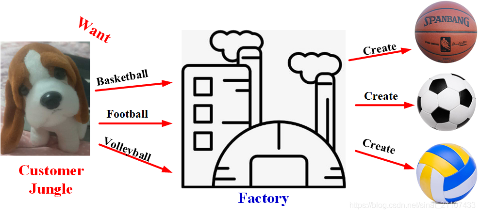
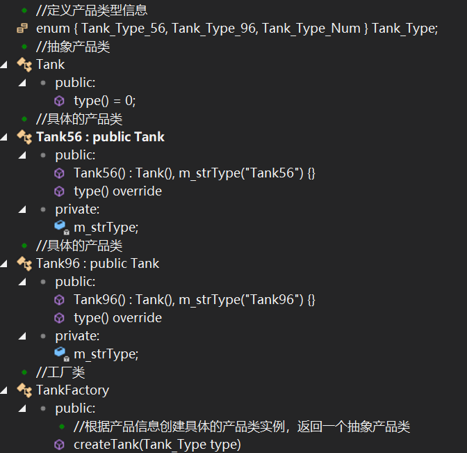
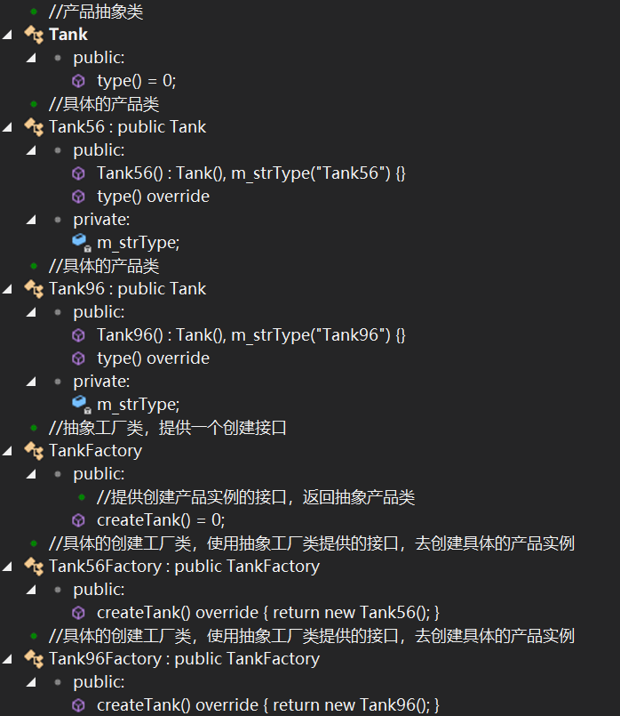
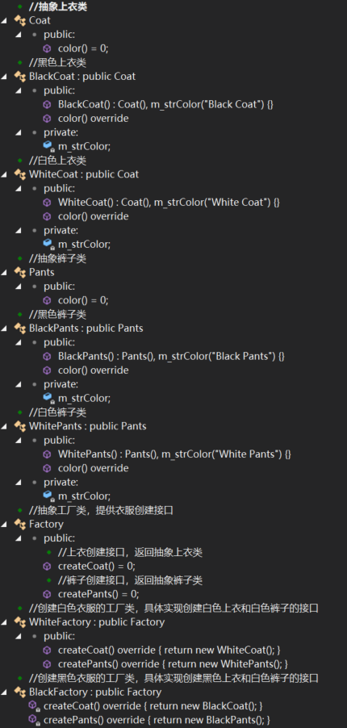
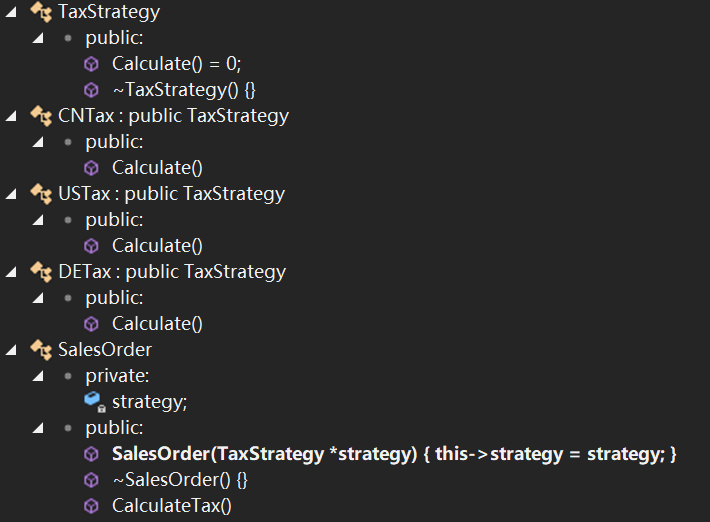
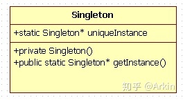

# 面试问题


# 常用设计模式

[C++ 常用设计模式 - 小肚哥 - 博客园 (cnblogs.com)](https://www.cnblogs.com/chengjundu/p/8473564.html)

## 1. 工厂模式

在工厂模式中，我们在创建对象时不会对客户端暴露创建逻辑，并且是通过使用一个共同的接口来指向新创建的对象。工厂模式作为一种创建模式，一般在创建复杂对象时，考虑使用；在创建简单对象时，建议直接new完成一个实例对象的创建。

> 简单工厂: 枚举enum产品类型 抽象产品->具体产品  工厂根据产品类型形参返回产品
>
> 工厂方法: 抽象产品->具体产品   抽象工厂->具体工厂   具体的工厂创建具体的产品
>
> 抽象工厂: 太抽象了 看例子
>
> > 抽象上衣->黑/白上衣  抽象裤子->黑/白裤子
> >
> > 抽象工厂->黑/白衣服工厂  : 黑衣服工厂生产黑上衣 黑裤子....

### 1.1、简单工厂模式

#### 应用举例

**客户Jungle需要时可以向工厂提供产品参数，工厂根据产品参数生产对应产品，客户`Jungle`并不需要关心产品的生产过程细节**。



**简单工厂模式：**

**定义一个简单工厂类，它可以根据参数的不同返回不同类的实例，被创建的实例通常都具有共同的父类**

#### 实现流程

- 设计一个==抽象产品==类，它包含一些公共方法的实现；
- 从抽象产品类中派生出多个==具体产品==类，如篮球类、足球类、排球类，具体产品类中实现具体产品生产的相关代码；
- 设计一个==工厂==类，工厂类中==提供==一个生产各种产品的==工厂方法==，该方法根据传入参数（产品名称）创建不同的具体产品类对象；
- 客户只需调用工厂类的工厂方法，并==传入具体产品参数，即可得到一个具体产品对象==。


主要特点是需要在工厂类中做判断，从而创造相应的产品，当增加新产品时，需要修改工厂类。使用简单工厂模式，我们只需要知道具体的产品型号就可以创建一个产品。


简单工厂模式的`优点`在于：

- 工厂类提供创建具体产品的方法，并包含一定判断逻辑，客户不必参与产品的创建过程；
- 客户只需要知道对应产品的参数即可，参数一般简单好记，如数字、字符或者字符串等。

`缺点`：工厂类集中了所有产品类的创建逻辑，如果产品量较大，会使得工厂类变的非常臃肿

#### 大体上有3个角色

- **工厂（Factory）**：根据客户提供的具体产品类的参数，创建具体产品实例；
- **抽象产品（AbstractProduct）**：具体产品类的基类，包含创建产品的公共方法；
- **具体产品（ConcreteProduct）**：抽象产品的派生类，包含具体产品特有的实现方法，是简单工厂模式的创建目标。



```c++
#include <iostream>

using namespace std;

//设计模式
//定义产品类型信息
typedef enum { Tank_Type_56, Tank_Type_96, Tank_Type_Num } Tank_Type;

//抽象产品类
class Tank {
public:
  virtual const string &type() = 0;
};

//具体的产品类
class Tank56 : public Tank {
public:
  Tank56() : Tank(), m_strType("Tank56") {}
  // 在派生类的成员函数中使用override时，如果基类中无此函数，或基类中的函数并不是虚函数，编译器会给出相关错误信息。
  const string &type() override {
    cout << m_strType.data() << endl;
    return m_strType;
  }

private:
  string m_strType;
};

//具体的产品类
class Tank96 : public Tank {
public:
  Tank96() : Tank(), m_strType("Tank96") {}
  const string &type() override {
    cout << m_strType.data() << endl;
    return m_strType;
  }

private:
  string m_strType;
};

//工厂类
class TankFactory {   //产品量较大，会使得工厂类变的非常臃肿
public:
  //根据产品信息创建具体的产品类实例，返回一个抽象产品类
  Tank *createTank(Tank_Type type) {
    switch (type) {
    case Tank_Type_56:
      return new Tank56();
    case Tank_Type_96:
      return new Tank96();
    default:
      return nullptr;
    }
  }
};

int main() {
  TankFactory *factory = new TankFactory();
  Tank *tank56 = factory->createTank(Tank_Type_56);
  tank56->type();    // output: Tank56
  Tank *tank96 = factory->createTank(Tank_Type_96);
  tank96->type();		// output: Tank96

  delete tank96;
  tank96 = nullptr;
  delete tank56;
  tank56 = nullptr;
  delete factory;
  factory = nullptr;

  return 0;
}
```

### 1.2、工厂方法模式

定义一个创建对象的接口，其子类去具体现实这个接口以完成具体的创建工作。如果需要增加新的产品类，只需要扩展一个相应的工厂类即可。

缺点：产品类数据较多时，需要实现大量的工厂类，这无疑增加了代码量



```c++
#include <iostream>

using namespace std;

//产品抽象类
class Tank {
public:
  virtual const string &type() = 0;
};

//具体的产品类
class Tank56 : public Tank {
public:
  Tank56() : Tank(), m_strType("Tank56") {}

  const string &type() override {
    cout << m_strType.data() << endl;
    return m_strType;
  }

private:
  string m_strType;
};

//具体的产品类
class Tank96 : public Tank {
public:
  Tank96() : Tank(), m_strType("Tank96") {}
  const string &type() override {
    cout << m_strType.data() << endl;
    return m_strType;
  }

private:
  string m_strType;
};

//抽象工厂类，提供一个创建接口
class TankFactory {
public:
  //提供创建产品实例的接口，返回抽象产品类
  virtual Tank *createTank() = 0;
};

//具体的创建工厂类，使用抽象工厂类提供的接口，去创建具体的产品实例
class Tank56Factory : public TankFactory {
public:
  Tank *createTank() override { return new Tank56(); }
};

//具体的创建工厂类，使用抽象工厂类提供的接口，去创建具体的产品实例
class Tank96Factory : public TankFactory {
public:
  Tank *createTank() override { return new Tank96(); }
};

int main() {
  TankFactory *factory56 = new Tank56Factory();
  Tank *tank56 = factory56->createTank();
  tank56->type();

  TankFactory *factory96 = new Tank96Factory();
  Tank *tank96 = factory96->createTank();
  tank96->type();

  delete tank96;
  tank96 = nullptr;
  delete factory96;
  factory96 = nullptr;

  delete tank56;
  tank56 = nullptr;
  delete factory56;
  factory56 = nullptr;

  return 0;
}
```

### 1.3、`抽象工厂模式`

一个工厂可以提供创建多种相关产品的接口，而无需像工厂方法一样，为每一个产品都提供一个具体工厂。

<u>抽象工厂模式结构与工厂方法模式结构类似，不同之处在于，一个具体工厂可以生产多种`同类相关`的产品：</u>

缺点：当增加一个新系列的产品时，不仅需要现实具体的产品类，还需要增加一个新的创建接口，扩展相对困难。

- **抽象工厂（AbstractFactory）**：所有生产具体产品的工厂类的基类，提供工厂类的公共方法；
- **具体工厂（ConcreteFactory）**：生产具体的产品
- **抽象产品（AbstractProduct）**：所有产品的基类，提供产品类的公共方法
- **具体产品（ConcreteProduct）**：`具体的产品类`



```c++
//抽象上衣类
class Coat {
public:
  virtual const string &color() = 0;
};

//黑色上衣类
class BlackCoat : public Coat {
public:
  BlackCoat() : Coat(), m_strColor("Black Coat") {}
  const string &color() override {
    cout << m_strColor.data() << endl;
    return m_strColor;
  }

private:
  string m_strColor;
};

//白色上衣类
class WhiteCoat : public Coat {
public:
  WhiteCoat() : Coat(), m_strColor("White Coat") {}
  const string &color() override {
    cout << m_strColor.data() << endl;
    return m_strColor;
  }

private:
  string m_strColor;
};

//抽象裤子类
class Pants {
public:
  virtual const string &color() = 0;
};

//黑色裤子类
class BlackPants : public Pants {
public:
  BlackPants() : Pants(), m_strColor("Black Pants") {}
  const string &color() override {
    cout << m_strColor.data() << endl;
    return m_strColor;
  }

private:
  string m_strColor;
};

//白色裤子类
class WhitePants : public Pants {
public:
  WhitePants() : Pants(), m_strColor("White Pants") {}
  const string &color() override {
    cout << m_strColor.data() << endl;
    return m_strColor;
  }

private:
  string m_strColor;
};

//抽象工厂类，提供衣服创建接口
class Factory {
public:
  //上衣创建接口，返回抽象上衣类
  virtual Coat *createCoat() = 0;
  //裤子创建接口，返回抽象裤子类
  virtual Pants *createPants() = 0;
};

//创建白色衣服的工厂类，具体实现创建白色上衣和白色裤子的接口
class WhiteFactory : public Factory {
public:
  Coat *createCoat() override { return new WhiteCoat(); }
  Pants *createPants() override { return new WhitePants(); }
};
//创建黑色衣服的工厂类，具体实现创建黑色上衣和白色裤子的接口
class BlackFactory : public Factory {
  Coat *createCoat() override { return new BlackCoat(); }
  Pants *createPants() override { return new BlackPants(); }
};
```

## 2. `策略`模式

策略模式是指定义一系列的算法，把它们单独封装起来，并且使它们可以互相替换，使得算法可以独立于使用它的客户端而变化，也是说这些算法所完成的功能类型是一样的，对外接口也是一样的，只是不同的策略为引起环境角色环境角色表现出不同的行为。

相比于使用大量的if...else，使用策略模式可以降低复杂度，使得代码更容易维护。

缺点：可能需要定义大量的策略类，并且这些策略类都要提供给客户端。

[环境角色] 持有一个策略类的引用，最终给客户端调用。

`在运行时根据需要透明地更改对象的算法？将算法与对象本身解耦`

###  

### 除了多态 `还可以利用std::function闭包实现` 略

> ==function闭包指向lamda, lamda捕获this指针==



```c++
#include <iostream>
using namespace std;

class TaxStrategy {
 public:
  virtual double Calculate() = 0;
  virtual ~TaxStrategy() {}
};

class CNTax : public TaxStrategy {
 public:
  virtual double Calculate() {
    printf("CNTax Calculate\n");
    return 0;
  }
};

class USTax : public TaxStrategy {
 public:
  virtual double Calculate() {
    printf("USTax Calculate\n");
    return 0;
  }
};

class DETax : public TaxStrategy {
 public:
  virtual double Calculate() {
    printf("DETax Calculate\n");
    return 0;
  }
};

class SalesOrder {
 private:
  TaxStrategy *strategy;

 public:
  /*SalesOrder(StrategyFactory* strategyFactory)
{//使用工厂方法
      this->strategy = strategyFactory->NewStrategy();
  }*/
  SalesOrder(TaxStrategy *strategy) { this->strategy = strategy; }
  ~SalesOrder() {}

  double CalculateTax() {
    //...
    double val = strategy->Calculate();  //多态调用
    //...
    return val;
  }
};

int main(int argc, _TCHAR *argv[]) {
  // TaxStrategy* strategy = new DETax();
  TaxStrategy *strategy = new CNTax();
  SalesOrder order(strategy);
  order.CalculateTax();
  delete strategy;
  return 0;
}
```

### 我项目中用到的策略模式

1. SubPoolWindow继承QWidget 

   ```c++
   #pragma once
   #include "SubSignalPool.h"
   #include <QWidget>
   
   class SubPoolWindow : public QWidget {
     Q_OBJECT
   public:
     SubPoolWindow(QWidget *parent = nullptr);
     virtual ~SubPoolWindow();
   
     void setSubPool(const SubSignalPool &subPool);
     SubSignalPool &subPool() { return _subPool; }
     const SubSignalPool &subPool() const { return _subPool; }
   
     void setSubPoolDataType(bool b);
     bool getSubPoolDataType() { return _isIntermediateData; }
     virtual void setWindowTitle(QString title);
   
     virtual void subPoolUpdate() = 0;
   
   protected:
     // virtual void closeEvent(QCloseEvent * e);
   
   private:
     SubSignalPool _subPool;
     bool _isIntermediateData; // 是否为中间数据，中间数据在析构时，要释放内存
   };
   ```

2. MapWindow GraphWindow TableWindow继承自SubPoolWindow并重写设置信号池等方法

   ```c++
   #pragma once
   #include "SubPoolWindow.h"
   
   class QCustomPlot;
   class MapWindow : public SubPoolWindow {
     Q_OBJECT
   public:
     MapWindow(QWidget *parent = 0);
     ~MapWindow() {}
   
     virtual void setWindowTitle(QString title);
     virtual void subPoolUpdate();
     virtual void myMoveEvent(QMouseEvent *e);
   
   private:
     QCustomPlot *_qcustom;
   };
   ```

3. 多态调用

   ```c++
   void CMainWindow::OnActionMap() {
     SubSignalPool subPool = getSubPool();
     SubPoolWindow *mapWin = new MapWindow(this);
     mapWin->setSubPool(subPool);
     mapWin->setWindowTitle(subPool.name());
     ui.mdiArea->addSubWindow(mapWin);
     mapWin->show();
   }
   ```

## 3. [观察者模式](https://zhuanlan.zhihu.com/p/119308881)

观察者模式（Observer Pattern）是一种行为型设计模式，用于建立对象之间的一对多依赖关系，当一个对象的状态发生变化时，其相关的依赖对象都会收到通知并自动更新。

观察者模式的主要参与角色包括：

1. **主题（Subject）：** 也称为被观察者或可观察对象，它维护了一组观察者对象，并提供了注册、删除和通知观察者的方法。
2. **观察者（Observer）：** 定义了观察者的接口，当主题状态发生变化时，观察者对象会收到通知，并执行相应的更新操作。

下面以一个简单的天气监测系统为例来说明观察者模式的应用：

假设我们有一个天气监测系统，包含一个气象站（WeatherStation）和多个显示器（Display）作为观察者。气象站收集实时的天气数据，并在数据发生变化时通知所有的显示器更新显示。

首先，我们定义一个观察者接口（`Observer`），其中包含一个更新方法：

```cpp
class Observer {
public:
    virtual void update(float temperature, float humidity, float pressure) = 0;
};
```

然后，我们创建具体的显示器类，实现观察者接口：

```cpp
class Display : public Observer {
public:
    void update(float temperature, float humidity, float pressure) override {
        // 更新显示器的内容
        // 根据温度、湿度、气压等数据更新显示内容
    }
};
```

接下来，我们创建主题类（`Subject`），它维护了一个观察者列表，并提供注册、删除和通知观察者的方法：

```cpp
class Subject {
private:
    std::vector<Observer*> observers;

public:
    void attach(Observer* observer) {
        observers.push_back(observer);
    }

    void detach(Observer* observer) {
        // 从观察者列表中删除观察者
    }

    void notify(float temperature, float humidity, float pressure) {
        for (Observer* observer : observers) {
            observer->update(temperature, humidity, pressure);
        }
    }
};
```

最后，我们创建一个天气站对象，并将显示器对象注册为观察者：

```cpp
WeatherStation weatherStation;
Display display1;
Display display2;

weatherStation.attach(&display1);
weatherStation.attach(&display2);
```

当天气站收集到新的天气数据时，调用通知方法通知所有的观察者进行更新：

```cpp
weatherStation.notify(25.0, 60.0, 1013.0);
```

这样，所有注册的显示器对象会收到通知，并根据新的天气数据进行更新显示。

通过观察者模式，天气站和显示器之间实现了解耦，天气站不需要直接了解每个显示器的具体实现细节，只需要通过通知方法进行统一的通知。同时，当需要新增或删除显示器时，只需进行相应的注册或注销操作，而无需修改主题类的代码，符合开闭原则。

## 4. [单例模式](https://zhuanlan.zhihu.com/p/37469260)

### **1. 什么是单例模式**

单例模式(Singleton Pattern，也称为单件模式)，使用最广泛的设计模式之一。其意图是保证一个类仅有一个实例，并提供一个访问它的全局访问点，该实例被所有程序模块共享。

定义一个单例类：

1. `私有化它的构造函数`，以防止外界创建单例类的对象；
2. 使用类的`私有静态指针变量指向类的唯一实例`；
3. 使用一个`公有的静态方法获取该实例`。



### **2. 懒汉版（Lazy Singleton）**

教学版，即懒汉版（Lazy Singleton）：`单例实例在第一次被使用时才进行初始化`，这叫做延迟初始化。

```c++
// version 1.0
class Singleton {
private:
  static Singleton *instance;

private:
  Singleton(){};
  ~Singleton(){};
  Singleton(const Singleton &);
  Singleton &operator=(const Singleton &);

public:
  static Singleton *getInstance() {
    if (instance == NULL)
      instance = new Singleton();
    return instance;
  }
};

// init static member
Singleton *Singleton::instance = NULL;
```

**问题1：**Lazy Singleton存在`内存泄露`的问题，有两种解决方法：

> 私有的析构函数 无法析构对象 delete会直接报错[C++构造与析构(10) - private析构函数_ 水草的博客-CSDN博客_private 析构函数](https://blog.csdn.net/shltsh/article/details/45958697)

1. 使用`智能指针`
2. 使用`静态的嵌套类对象`

对于第二种解决方法，代码如下：

```c++
// version 1.1
class Singleton {
private:
  static Singleton *instance;

private:
  Singleton(){};
  ~Singleton(){};
  Singleton(const Singleton &);
  Singleton &operator=(const Singleton &);

private:
  class Deletor {
  public:
    ~Deletor() {
      if (Singleton::instance != NULL)
        delete Singleton::instance;
    }
  };
  static Deletor deletor;

public:
  static Singleton *getInstance() {
    if (instance == NULL) {
      instance = new Singleton();
    }
    return instance;
  }
};

// init static member
Singleton *Singleton::instance = NULL;
Singleton::Deletor Singleton::deletor; 
```

在程序运行结束时，系统会调用静态成员`deletor`的析构函数，该析构函数会删除单例的唯一实例。使用这种方法释放单例对象有以下特征：

- 在单例类内部定义专有的嵌套类。
- 在单例类内定义私有的专门用于释放的静态成员。
- 利用程序在结束时析构全局变量的特性，选择最终的释放时机。

`在单例类内再定义一个嵌套类，总是感觉很麻烦。`

**问题2：**这个代码在单线程环境下是正确无误的，但是当拿到多线程环境下时这份代码就会出现race condition，注意version 1.0与version 1.1都不是线程安全的。要使其线程安全，能在多线程环境下实现单例模式

> 单例的初始化是不安全的 

#### 三种解决方法

1. 使用互斥锁（Mutex）：在 `getInstance()` 方法中使用互斥锁来确保只有一个线程能够创建单例对象。具体做法是在创建单例对象之前加锁，在创建完成后释放锁。

   ```cpp
   static Singleton* getInstance() {
       std::lock_guard<std::mutex> lock(mutex);  // 加锁
       if (instance == nullptr) {
           instance = new Singleton();
       }
       return instance;
   }
   ```

   这种方式通过互斥锁确保了在多线程环境下只有一个线程能够创建单例对象，但会引入一定的性能开销。

2. 使用双重检查锁定（Double-Checked Locking）：在 `getInstance()` 方法中使用双重检查锁定来减少锁的使用次数，提高性能。具体做法是先进行一次快速检查，如果单例对象已经被创建，则直接返回，否则再进行加锁和创建对象的操作。

   ```cpp
   static Singleton* getInstance() {
       if (instance == nullptr) {
           std::lock_guard<std::mutex> lock(mutex);  // 加锁
           if (instance == nullptr) {
               instance = new Singleton();
           }
       }
       return instance;
   }
   ```

   双重检查锁定方式在多线程环境下能够保证只有一个线程创建单例对象，并且在单例对象创建完成后无需再加锁，减少了性能开销


3. 

C++11规定了local static在多线程条件下的初始化行为，要求编译器保证了内部静态变量的线程安全性。在C++11标准下，《Effective C++》提出了一种更优雅的单例模式实现，使用函数内的 local static 对象。这样，只有当第一次访问`getInstance()`方法时才创建实例。这种方法也被称为==Meyers' Singleton==。C++0x之后该实现是线程安全的，C++0x之前仍需加锁。

```c++
// version 1.2
class Singleton {
private:
  Singleton(){};
  ~Singleton(){};
  Singleton(const Singleton &);
  Singleton &operator=(const Singleton &);

public:
  //这种
  static Singleton &getInstance() {
    static Singleton instance;
    return instance;
  }
  
  // 或者
  static shared_ptr<Singleton> &getInstance() {
    static shared_ptr<Singleton> instance(new Singleton);
    return instance;
  }
};
```

> 局部静态变量可以保证线程安全

### **3. 饿汉版（Eager Singleton）**

饿汉版（Eager Singleton）：`指单例实例在程序运行时被立即执行初始化`

```c++
class Singleton {
private:
    static Singleton* instance;

    // 将构造函数和析构函数声明为私有，禁止通过构造函数创建对象
    Singleton() {}
    ~Singleton() {}

public:
    // 获取单例对象的静态方法
    static Singleton* getInstance() {
        return instance;
    }

    // 其他成员函数
    // ...
};

// 在全局作用域内初始化单例对象
Singleton* Singleton::instance = new Singleton();
```

由于在main函数之前初始化，所以没有线程安全的问题。但是<u>潜在问题在于no-local static对象（函数外的static对象）在不同编译单元中的初始化顺序是未定义的</u>。也即，static Singleton instance;和static Singleton& getInstance()二者的初始化顺序不确定，如果在初始化完成之前调用 getInstance() 方法会返回一个未定义的实例。

总结：

- Eager Singleton 虽然是线程安全的，但存在潜在问题；
- Lazy Singleton通常需要加锁来保证线程安全，但局部静态变量版本在C++11后是线程安全的；
- 局部静态变量版本（Meyers Singleton）最优雅。


## 5. 装饰器模式

装饰器模式是比较常用的一种设计模式，Python中就内置了对于装饰器的支持。

具体来说，装饰器模式是用来给对象增加某些特性或者对被装饰对象进行某些修改。

下面的代码是一个买煎饼的例子，如我们生活中所见，可以选基础煎饼（鸡蛋煎饼，肉煎饼等），然后再额外加别的东西：

```c++
#include <iostream>
#include <string>
using namespace std;

class Pancake { //基类
public:
  string description = "Basic Pancake";
  virtual string getDescription() { return description; }
  virtual double cost() = 0;
};

class CondimentDecorator : public Pancake { //装饰器基类
public:
  string getDescrition();
};

class MeatPancake : public Pancake { //肉煎饼
public:
  MeatPancake() { description = "MeatPancake"; }
  double cost() { return 6; }
};

class EggPancake : public Pancake { //鸡蛋煎饼
public:
  EggPancake() { description = "EggPancake"; }
  double cost() { return 5; }
};

class Egg : public CondimentDecorator { //额外加鸡蛋
public:
  Pancake *base;
  string getDescription() { return base->getDescription() + ", Egg"; }
  Egg(Pancake *d) { base = d; }
  double cost() { return base->cost() + 1.5; }
};

class Potato : public CondimentDecorator { //额外加土豆
public:
  Pancake *base;
  string getDescription() { return base->getDescription() + ", Potato"; }
  Potato(Pancake *d) { base = d; }
  double cost() { return base->cost() + 1; }
};

class Bacon : public CondimentDecorator { //额外加培根
public:
  Pancake *base;
  string getDescription() { return base->getDescription() + ", Bacon"; }
  Bacon(Pancake *d) { base = d; }
  double cost() { return base->cost() + 2; }
};

int main() {
  Pancake *pan = new EggPancake();
  pan = &Potato(pan); //将pan的描述和花费更新了一下 并指向更新后的Potato
  pan = &Bacon(pan); //将pan的描述和花费更新了一下 并指向更新后的Potato
  cout << pan->getDescription() << "  $ : " << pan->cost() << endl;
  system("pause");
  return 0;
}

```


装饰器模式（Decorator Pattern）是一种结构型设计模式，用于动态地给一个对象添加额外的功能，而无需修改其原始类的结构。它通过创建一个包装器（Wrapper）来包裹原始对象，并在包装器中添加新的行为或修改原始对象的行为。

装饰器模式的核心思想是通过组合而非继承来实现功能的扩展。它使得可以在运行时动态地添加、删除或修改对象的行为，而不会影响其他使用该对象的代码。

下面是一个简单的示例，以咖啡和调料为例，说明装饰器模式的应用：

首先，定义一个咖啡接口（Component），表示原始的咖啡对象：

```cpp
class Coffee {
public:
    virtual double getCost() const = 0;
    virtual std::string getDescription() const = 0;
};
```

然后，实现具体的咖啡类（Concrete Component）：

```cpp
class Espresso : public Coffee {
public:
    double getCost() const override {
        return 1.99;
    }

    std::string getDescription() const override {
        return "Espresso";
    }
};
```

接下来，创建装饰器基类（Decorator），用于包装咖啡对象：

```cpp
class CoffeeDecorator : public Coffee {
protected:
    Coffee* coffee;

public:
    CoffeeDecorator(Coffee* coffee) : coffee(coffee) {}

    double getCost() const override {
        return coffee->getCost();
    }

    std::string getDescription() const override {
        return coffee->getDescription();
    }
};
```

最后，创建具体的装饰器类（Concrete Decorators），用于添加额外的调料功能：

```cpp
class MilkDecorator : public CoffeeDecorator {
public:
    MilkDecorator(Coffee* coffee) : CoffeeDecorator(coffee) {}

    double getCost() const override {
        return coffee->getCost() + 0.5;
    }

    std::string getDescription() const override {
        return coffee->getDescription() + ", Milk";
    }
};

class SugarDecorator : public CoffeeDecorator {
public:
    SugarDecorator(Coffee* coffee) : CoffeeDecorator(coffee) {}

    double getCost() const override {
        return coffee->getCost() + 0.3;
    }

    std::string getDescription() const override {
        return coffee->getDescription() + ", Sugar";
    }
};
```

现在，我们可以使用装饰器模式来创建各种不同调料的咖啡组合：

```cpp
Coffee* espresso = new Espresso();
Coffee* espressoWithMilk = new MilkDecorator(espresso);
Coffee* espressoWithMilkAndSugar = new SugarDecorator(espressoWithMilk);

std::cout << "Description: " << espressoWithMilkAndSugar->getDescription() << std::endl;
std::cout << "Cost: $" << espressoWithMilkAndSugar->getCost() << std::endl;
```

输出结果：

```cpp
Description: Espresso, Milk, Sugar
Cost: $2.79
```

在上述示例中，`Coffee` 是咖啡接口，`Espresso` 是具体的咖啡类。`CoffeeDecorator` 是装饰器基类，`MilkDecorator` 和 `SugarDecorator` 是具体的装饰器类。通过组合不同的装饰器，可以动态地给咖啡对象添加调料功能，同时保持了咖啡接口的一致性。

装饰器模式的优点是灵活性高，可以动态地添加或删除功能，避免了类爆炸的问题。同时，它遵循开闭原则，对原始对象的修改只发生在装饰器类中，不需要修改原始类的代码。这样可以更好地维护和扩展代码。
