# 链表

## 单链表解题套路

### [21. 合并两个有序链表](https://leetcode-cn.com/problems/merge-two-sorted-lists/)

[labuladong 题解](https://labuladong.gitee.io/plugin-v4/?qno=21&target=gitee)[思路](https://leetcode-cn.com/problems/merge-two-sorted-lists/#)

难度简单2259

将两个升序链表合并为一个新的 **升序** 链表并返回。新链表是通过拼接给定的两个链表的所有节点组成的。 

 

**示例 1：**


```
输入：l1 = [1,2,4], l2 = [1,3,4]
输出：[1,1,2,3,4,4]
```

**示例 2：**

```
输入：l1 = [], l2 = []
输出：[]
```

**示例 3：**

```
输入：l1 = [], l2 = [0]
输出：[0]
```

**提示：**

- 两个链表的节点数目范围是 `[0, 50]`
- `-100 <= Node.val <= 100`
- `l1` 和 `l2` 均按 **非递减顺序** 排列

#### 思路

1. 虚拟头节点占位
2. while循环&& 交替前进 
3. [1 2 3] [4 5 6] 这种情况 会先遍历完第一个 然后在后面的if判断中 拼接第二个list

#### 代码

```C++
class Solution {
public:
    ListNode* mergeTwoLists(ListNode* list1, ListNode* list2) {
      ListNode* pre = new ListNode(0);
      ListNode* curr = pre;
      while(list1 && list2){
        if(list1->val < list2->val){
          curr->next = list1;
          list1 = list1->next;
        }else{
          curr->next = list2;
          list2 = list2->next;         
        }
        curr = curr->next;
      }
      if(list1) curr->next = list1;
      if(list2) curr->next = list2;
      return pre->next;
    }
};
```

### [23. 合并K个升序链表](https://leetcode-cn.com/problems/merge-k-sorted-lists/)

[labuladong 题解](https://labuladong.gitee.io/plugin-v4/?qno=23&target=gitee)[思路](https://leetcode-cn.com/problems/merge-k-sorted-lists/#)

难度困难1803收藏分享切换为英文接收动态反馈

给你一个链表数组，每个链表都已经按升序排列。

请你将所有链表合并到一个升序链表中，返回合并后的链表。

 

**示例 1：**

```
输入：lists = [[1,4,5],[1,3,4],[2,6]]
输出：[1,1,2,3,4,4,5,6]
解释：链表数组如下：
[
  1->4->5,
  1->3->4,
  2->6
]
将它们合并到一个有序链表中得到。
1->1->2->3->4->4->5->6
```

#### 思路

1. 顶堆解法 （笨一点的解法 vector sort）
2. 循环merger two list

#### 顶堆解法

```C++
class Solution {
public:
    struct Status {
        int val;
        ListNode *ptr;
        //return 1 表示左边形参优先级低 靠后放  例如  <  (1, 3) return 1>3 左边优先级高 往前放 就是升序排列 小顶堆
        bool operator < (const Status &rhs) const {
            return val > rhs.val;
        }
    };

    priority_queue <Status> q;

    ListNode* mergeKLists(vector<ListNode*>& lists) {
        //所有非空链表 压入queue
        for (auto node: lists) {
            if (node) q.push({node->val, node});
        }
        //注意 这里这样写 一方面可以做到虚拟头的备份
        //另一方面 可以保证虚拟头被析构
        ListNode head, *tail = &head;
        while (!q.empty()) {
            //顶堆用的时候都是先top 再pop
            auto f = q.top(); q.pop(); 
            tail->next = f.ptr; 
            tail = tail->next;
            if (f.ptr->next) q.push({f.ptr->next->val, f.ptr->next});
        }
        return head.next;
    }
};
```

#### <u>涉及到的知识点</u>

1. 顶堆的一般用法，即先top存储临时变量，再pop

2. [顶堆的自定义数据结构和比较方式](https://www.cnblogs.com/shona/p/12163381.html)

   > 这里用到的就是封装到一个struct ，重载他的<，
   >
   > 顶堆的排序方式是按照<进行比较排序，返回为1时，左边形参的优先级低于右边形参 表现为升序 小顶堆

#### 双链表merge解法

```C++
class Solution {
public:
    ListNode* merge2(ListNode* node1, ListNode* node2){
      ListNode dumpy;
      ListNode* dumpyNode = &dumpy;
      while(node1 && node2){
        if(node1->val > node2->val){
          dumpyNode->next = node2;
          node2= node2->next;
        }else{
          dumpyNode->next = node1;
          node1= node1->next;          
        }
        dumpyNode = dumpyNode->next;
      }
      dumpyNode->next = node1?node1:node2;
      return dumpy.next;
    }
    ListNode* mergeKLists(vector<ListNode*>& lists) {
      int n = lists.size();
      if(n == 0) return nullptr;
      ListNode* ans = nullptr;
      for(int i = 0; i<n; i++){
        ans = merge2(lists[i], ans);
      }
      return dumpansyNode;
    }
};
```

### [剑指 Offer 22. 链表中倒数第k个节点](https://leetcode-cn.com/problems/lian-biao-zhong-dao-shu-di-kge-jie-dian-lcof/)

输入一个链表，输出该链表中倒数第k个节点。为了符合大多数人的习惯，本题从1开始计数，即链表的尾节点是倒数第1个节点。

例如，一个链表有 `6` 个节点，从头节点开始，它们的值依次是 `1、2、3、4、5、6`。这个链表的倒数第 `3` 个节点是值为 `4` 的节点。

 

**示例：**

```
给定一个链表: 1->2->3->4->5, 和 k = 2.

返回链表 4->5.
```

#### 思路

1. 笨解法 一次遍历记录长度，一次遍历计算结果
2. 一次遍历 fast先走k，然后slow fast 同时前进 直到fast为空

```cpp
class Solution {
public:
  	//两次遍历
    ListNode* getKthFromEnd(ListNode* head, int k) {
      int length = 0;
      ListNode* cpy = head;
      while(cpy){
        length++;
        cpy = cpy->next;
      }
      ListNode* node = head;
      while(node){
        if(length == k)
          return node;
        node = node->next;
        length--;
      }
      return nullptr;
    }

  	//一次遍历
    ListNode* getKthFromEnd(ListNode* head, int k) {
      ListNode* fast = head;
      int step = 0;
      while(fast){
        step++;
        fast = fast->next;
        if(step == k){
          break;
        }        
      }
      ListNode* slow = head;
      while(fast){
        fast = fast->next;
        slow = slow->next;
      }
      return slow;
    }
};
```

### [19. 删除链表的倒数第 N 个结点](https://leetcode-cn.com/problems/remove-nth-node-from-end-of-list/)

[labuladong 题解](https://labuladong.gitee.io/plugin-v4/?qno=19&target=gitee)[思路](https://leetcode-cn.com/problems/remove-nth-node-from-end-of-list/#)

给你一个链表，删除链表的倒数第 `n` 个结点，并且返回链表的头结点。

 

**示例 1：**


```
输入：head = [1,2,3,4,5], n = 2
输出：[1,2,3,5]
```

**示例 2：**

```
输入：head = [1], n = 1
输出：[]
```

#### 思路

1. 笨比遍历
2. 一次遍历 但是要注意 ==可能会删除头节点 所以遍历应该使用虚拟头==

#### 代码

```C++
class Solution {
public:
  	//笨比遍历法
    ListNode* removeNthFromEnd(ListNode* head, int n) {
        ListNode* cur = head;
        int i = 0;
        while(cur->next != NULL){
            i++;
            cur = cur->next;
        }
        int j = 0;
        ListNode* curr = head;
        while(j<=i-n-1){
            if (j == i-n-2) curr->next = curr->next->next;
            j++;
        }
        return head;
    }
		//一次遍历法
    ListNode* removeNthFromEnd(ListNode* head, int n) {
      ListNode dumpyNode;
      dumpyNode.next = head;
      ListNode* slow = &dumpyNode;
      ListNode* fast = &dumpyNode;
      n++;
      while(n--)
        fast = fast->next;
      while(fast){
        fast = fast->next;
        slow = slow->next;
      }
      ListNode* temp = slow->next;
      slow->next = temp->next;
      delete temp;
      return dumpyNode.next;
    }
};
```

### [876. 链表的中间结点](https://leetcode-cn.com/problems/middle-of-the-linked-list/)

[labuladong 题解](https://labuladong.gitee.io/plugin-v4/?qno=876&target=gitee)[思路](https://leetcode-cn.com/problems/middle-of-the-linked-list/#)

难度简单505

给定一个头结点为 `head` 的非空单链表，返回链表的中间结点。

如果有两个中间结点，则返回第二个中间结点。

 

**示例 1：**

```
输入：[1,2,3,4,5]
输出：此列表中的结点 3 (序列化形式：[3,4,5])
返回的结点值为 3 。 (测评系统对该结点序列化表述是 [3,4,5])。
注意，我们返回了一个 ListNode 类型的对象 ans，这样：
ans.val = 3, ans.next.val = 4, ans.next.next.val = 5, 以及 ans.next.next.next = NULL.
```

**示例 2：**

```
输入：[1,2,3,4,5,6]
输出：此列表中的结点 4 (序列化形式：[4,5,6])
由于该列表有两个中间结点，值分别为 3 和 4，我们返回第二个结点
```

#### 思路

1. 笨比
2. 快慢指针 注意判断条件  ==while(fast && fast->next)==

#### 代码


```C++
class Solution {
public:
    ListNode* middleNode(ListNode* head) {
        int n = 0;
        ListNode* cur = head;
        while (cur != nullptr) {
            ++n;
            cur = cur->next;
        }
        int k = 0;
        cur = head;
        while (k < n / 2) {
            ++k;
            cur = cur->next;
        }
        return cur;
    }

    ListNode* middleNode(ListNode* head) {
      ListNode* slow = head;
      ListNode* fast = head;
      while(fast && fast->next){  //刚开始准备重新用！就尼玛用混了 老老实实==nullptr吧
        fast = fast->next->next;
        slow = slow->next;
      }
      return slow;
    }
};
```

### 链表环问题

#### 1. 判断是否有环

- 哈希
- 「Floyd 判圈算法」（又称龟兔赛跑算法）
- 奇葩方法：修改节点的值

**代码**

```C++
//hash
class Solution {
public:
    bool hasCycle(ListNode *head) {
        unordered_set<ListNode*> sett;
        ListNode* cur = head;
        while(cur){
            if(sett.count(cur)) return 1;
            sett.insert(cur);
            cur = cur->next;
        }
        return 0;
    }
};
//龟兔赛跑
class Solution {
public:
    bool hasCycle(ListNode *head) {
        if(head == NULL) return false;
        ListNode* slow = head;
        ListNode* fast = head;
        while(fast != NULL && fast->next!= NULL)
        {
            slow = slow->next;
            fast = fast->next->next;
            if(fast == slow) return true;
        }
        return false;
    }
};
//修改节点值的判圈方法
class Solution {
public:
    bool hasCycle(ListNode *head) {
      while(head){
        if(head->val == '12458256442311234856461')
          return 1;
        else head->val = '12458256442311234856461';
        head = head->next;
      }
      return 0;
    }
};
```

#### 2. [环的位置](https://leetcode-cn.com/problems/linked-list-cycle-ii/)

我们假设快慢指针相遇时，慢指针 `slow` 走了 `k` 步，那么快指针 `fast` 一定走了 `2k` 步：

[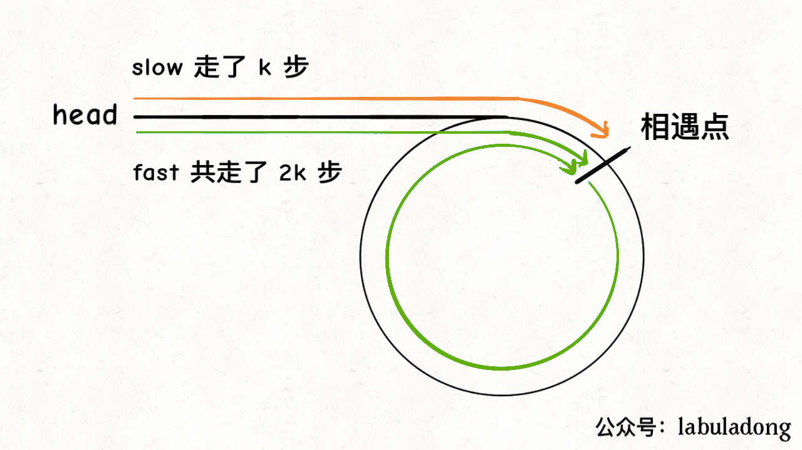](https://labuladong.gitee.io/algo/images/双指针/3.jpeg)

`fast` 一定比 `slow` 多走了 `k` 步，这多走的 `k` 步其实就是 `fast` 指针在环里转圈圈，所以 `k` 的值就是环长度的「整数倍」。

假设相遇点距环的起点的距离为 `m`，那么结合上图的 `slow` 指针，环的起点距头结点 `head` 的距离为 `k - m`，也就是说如果从 `head` 前进 `k - m` 步就能到达环起点。

巧的是，如果从相遇点继续前进 `k - m` 步，也恰好到达环起点。因为结合上图的 `fast` 指针，从相遇点开始走k步可以转回到相遇点，那走 `k - m` 步肯定就走到环起点了：

[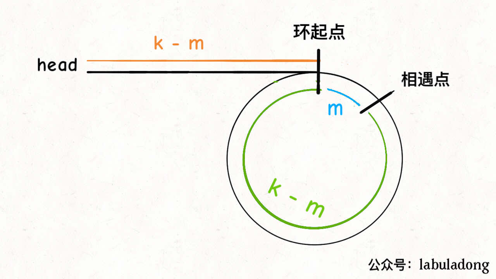](https://labuladong.gitee.io/algo/images/双指针/2.jpeg)

所以，只要我们把快慢指针中的任一个重新指向 `head`，然后两个指针同速前进，`k - m` 步后一定会相遇，相遇之处就是环的起点了。

**代码**

```C++
// hash
class Solution {
public:
    ListNode *detectCycle(ListNode *head) {
      unordered_set <ListNode*> set;
      while(head != NULL){
        if (set.count(head)) return head;
          set.insert(head);
          head = head->next;
        }
      return nullptr;
    }
};
//数学
class Solution {
public:
    ListNode *detectCycle(ListNode *head) {
      ListNode* fast = head;
      ListNode* slow = head;
      while(fast && fast->next){
        fast = fast->next->next;
        slow = slow->next;
        if(fast == slow) break;
      }

      //判断是否有环
      if(fast == nullptr || fast->next == nullptr)
        return nullptr;

      fast = head; //重新指向头节点
      while(slow != fast){
        fast = fast->next;
        slow = slow->next;
      }
      return slow;
    }
};
```

### [160. 相交链表](https://leetcode-cn.com/problems/intersection-of-two-linked-lists/)

[labuladong 题解](https://labuladong.gitee.io/plugin-v4/?qno=160&target=gitee)[思路](https://leetcode-cn.com/problems/intersection-of-two-linked-lists/#)

给你两个单链表的头节点 `headA` 和 `headB` ，请你找出并返回两个单链表相交的起始节点。如果两个链表不存在相交节点，返回 `null` 。

图示两个链表在节点 `c1` 开始相交**：**

[](https://assets.leetcode-cn.com/aliyun-lc-upload/uploads/2018/12/14/160_statement.png)

题目数据 **保证** 整个链式结构中不存在环。

**注意**，函数返回结果后，链表必须 **保持其原始结构** 。

**自定义评测：**

**评测系统** 的输入如下（你设计的程序 **不适用** 此输入）：

- `intersectVal` - 相交的起始节点的值。如果不存在相交节点，这一值为 `0`
- `listA` - 第一个链表
- `listB` - 第二个链表
- `skipA` - 在 `listA` 中（从头节点开始）跳到交叉节点的节点数
- `skipB` - 在 `listB` 中（从头节点开始）跳到交叉节点的节点数

评测系统将根据这些输入创建链式数据结构，并将两个头节点 `headA` 和 `headB` 传递给你的程序。如果程序能够正确返回相交节点，那么你的解决方案将被 **视作正确答案** 。

#### 思路

1. 笨比hash
2. 挺神奇的首尾相连

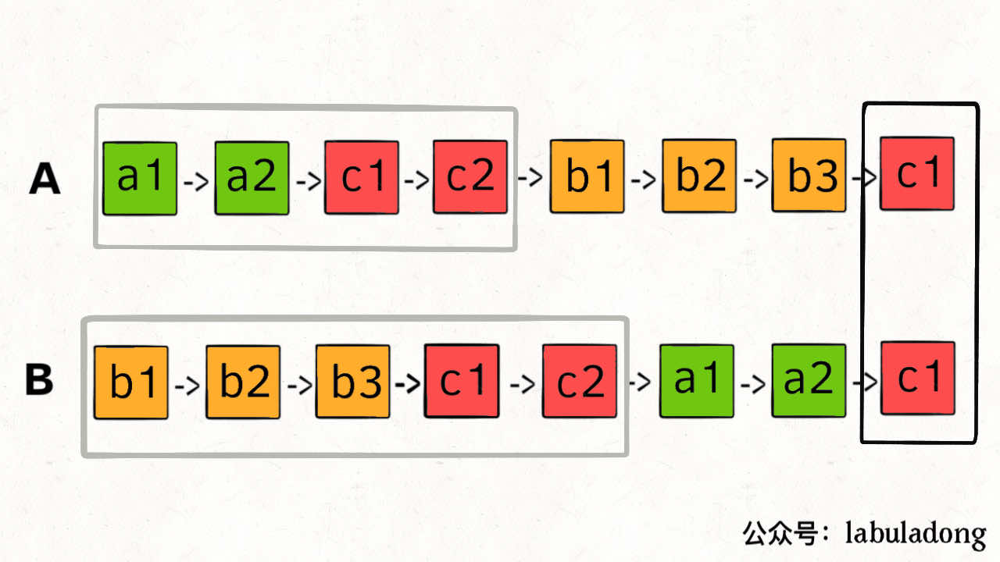

```C++
class Solution {
public:
  	//笨比hash
    ListNode *getIntersectionNode(ListNode *headA, ListNode *headB) {
      unordered_set<ListNode*> sett;
      while(headA){
        sett.insert(headA);
        headA = headA->next;
      }
      while(headB){
        if(sett.count(headB))
          return headB;
        headB = headB->next;
      }
      return nullptr;
    }
		//首尾相接
    ListNode *getIntersectionNode(ListNode *headA, ListNode *headB) {
      if (headA == nullptr || headB == nullptr) {
        return nullptr;
      }
      ListNode *pA = headA, *pB = headB;
      while (pA != pB) {
        pA = pA == nullptr ? headB : pA->next;
        pB = pB == nullptr ? headA : pB->next;
      }
      return pA;    
    }
};
```

#### [剑指 Offer II 026. 重排链表](https://leetcode-cn.com/problems/LGjMqU/)

难度中等47英文版讨论区

给定一个单链表 `L` 的头节点 `head` ，单链表 `L` 表示为：

` L0 → L1 → … → Ln-1 → Ln `
请将其重新排列后变为：

```
L0 → Ln → L1 → Ln-1 → L2 → Ln-2 → …
```

不能只是单纯的改变节点内部的值，而是需要实际的进行节点交换。

 

**示例 1:**

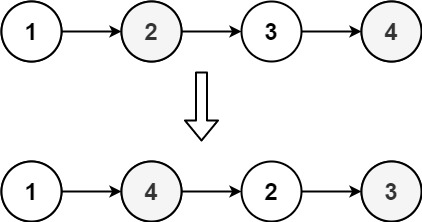

```
输入: head = [1,2,3,4]
输出: [1,4,2,3]
```

**示例 2:**

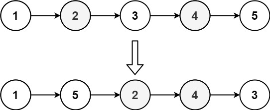

```
输入: head = [1,2,3,4,5]
输出: [1,5,2,4,3]
```

#### 思路

1. 找中点 截断 反转后半部分、

2. - 按照官方题解找中间节点
     1 2 3 4 5
     变为
     1 2 3
     5 4
     但是
     1 2 3 4 5 6
     变为
     1 2 3 4
     6 5
     这样拼接没什么问题 因为3->4本身就是连接的 无需再更改指向了

   - 也可以 找中间节点的时候 按链表长度的奇偶性返回

     ```C++
     ListNode* findMiddle(ListNode* head){
         ListNode* slow = head;
         ListNode* fast = head;
         ListNode* preSlow;
         while(fast && fast->next){
             preSlow = slow;
             slow = slow->next;
             fast = fast->next->next;
         }
         //奇数节点返回中间 偶数返回中间前一个
         return fast == nullptr?preSlow:slow;
     }
     ```

#### 代码

```C++
class Solution {
public:
    ListNode* reversList(ListNode* head){
        if(head == nullptr || head->next == nullptr)
            return head;
        ListNode* last = reversList(head->next);
        head->next->next = head;
        head->next = nullptr;
        return last;
    }

    ListNode* findMiddle(ListNode* head){
        ListNode* slow = head;
        ListNode* fast = head;
        ListNode* preSlow;
        while(fast && fast->next){
            preSlow = slow;
            slow = slow->next;
            fast = fast->next->next;
        }
        //奇数节点返回中间 偶数返回中间前一个
        return fast == nullptr?preSlow:slow;
        //return slow  //没什么问题 因为最终默认指向了 无需更改
    }

    void mergeList(ListNode* l1, ListNode* l2) {
        ListNode* l1_tmp;
        ListNode* l2_tmp;
        while (l1 != nullptr && l2 != nullptr) {
            //存储下一个节点
            l1_tmp = l1->next;
            l2_tmp = l2->next;
            //l1指向l2 并更新l1
            l1->next = l2;
            l1 = l1_tmp;
            //l2指向新的l1(也就是l1temp) 并更新l2
            l2->next = l1;
            l2 = l2_tmp;
        }
    }

    void reorderList(ListNode* head) {
        ListNode* l1 = head;
        ListNode* middle = findMiddle(head);
        ListNode* l2 = reversList(middle->next);
        middle->next = nullptr;  //切断 并且保证l1的长度>=l2 且长度差最大为1
        mergeList(l1, l2);
    }
};
```

## 递归反转链表

### [206. 反转整个链表](https://leetcode-cn.com/problems/reverse-linked-list/)

[labuladong 题解](https://labuladong.gitee.io/plugin-v4/?qno=206&target=gitee)

给你单链表的头节点 `head` ，请你反转链表，并返回反转后的链表。

 

**示例 1：**


```
输入：head = [1,2,3,4,5]
输出：[5,4,3,2,1]
```

**示例 2：**

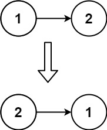

```
输入：head = [1,2]
输出：[2,1]
```

**示例 3：**

```
输入：head = []
输出：[]
```

#### 思路

1. while循环迭代
2. 递归反转整个链表

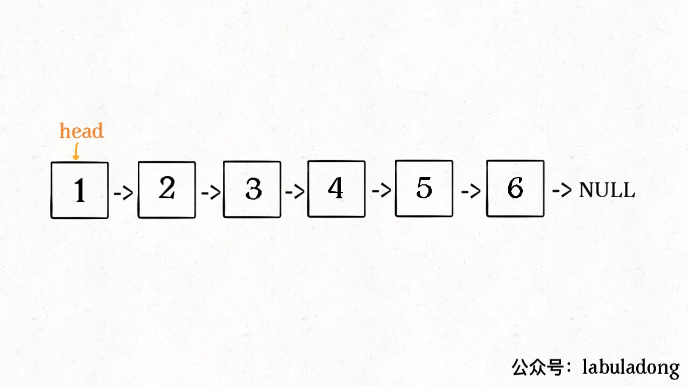

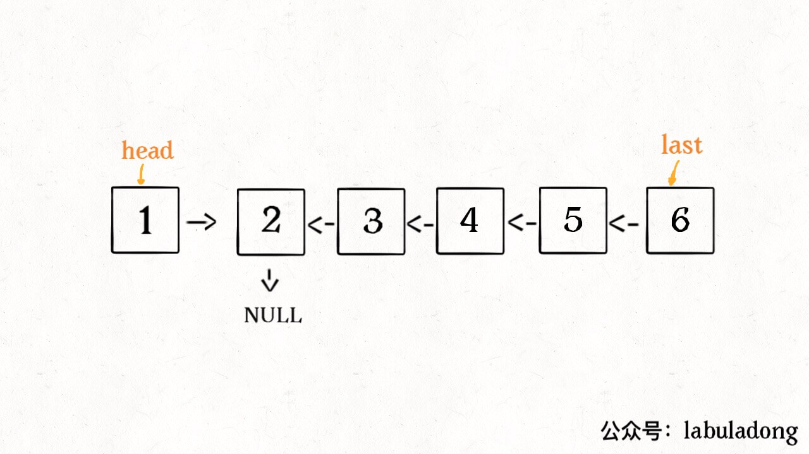


#### 代码

```C++
class Solution {
public:
    //while迭代
    ListNode* reverseList(ListNode* head) {
      ListNode* cur = head;
      ListNode* pre = nullptr;
      ListNode* temp;
      while(cur){
        temp = cur->next;
        cur->next = pre;
        pre = cur;
        cur = temp;
      }
      return pre;
    }
};

class Solution {
public:
    //递归
    ListNode* reverseList(ListNode* head) {
      //注意head == nullptr是判断传进来的链表为空
      //注意head->next == nullptr是真正的base case
      if(head == nullptr || head->next == nullptr)
        return head;
      ListNode* last = reverseList(head->next);
      head->next->next = head;
      head->next = nullptr;
      return last;
    }
};
```

### 反转链表前 N 个节点

*// 将链表的前 n 个节点反转（n <= 链表长度）*

比如说对于下图链表，执行 `reverseN(head, 3)`：

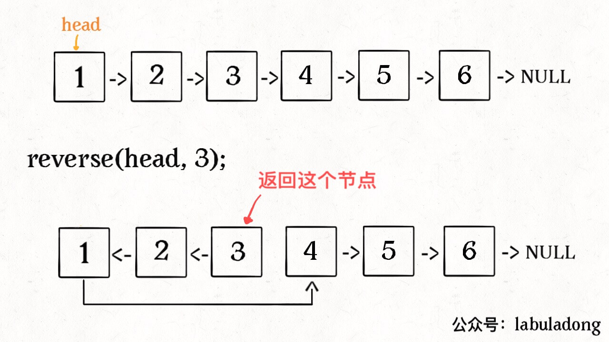

解决思路和反转整个链表差不多，只要稍加修改即可：

#### 代码

```C++
ListNode* successor = nullptr; // 后驱节点
// 反转以 head 为起点的 n 个节点，返回新的头结点
ListNode* reverseN(ListNode* head, int n) {
    if (n == 1) {
        // 记录第 n + 1 个节点
        successor = head.next;
        return head;
    }
    // 以 head.next 为起点，需要反转前 n - 1 个节点
    ListNode* last = reverseN(head->next, n - 1);
    head->next->next = head;
    // 让反转之后的 head 节点和后面的节点连起来
    head->next = successor;
    return last;
}
```

#### 具体的区别：

1、base case 变为 `n == 1`，反转一个元素，就是它本身，同时**要记录后驱节点**。

2、刚才我们直接把 `head.next` 设置为 null，因为整个链表反转后原来的 `head` 变成了整个链表的最后一个节点。但现在 `head` 节点在递归反转之后不一定是最后一个节点了，所以要记录后驱 `successor`（第 n + 1 个节点），反转之后将 `head` 连接上。


OK，如果这个函数你也能看懂，就离实现「反转一部分链表」不远了。


### [92. 反转链表的一部分](https://leetcode-cn.com/problems/reverse-linked-list-ii/)

给你单链表的头指针 head 和两个整数 left 和 right ，其中 left <= right 。请你反转从位置 left 到位置 right 的链表节点，返回 反转后的链表 。

示例 1：

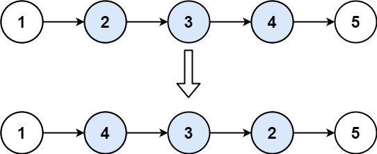

输入：head = [1,2,3,4,5], left = 2, right = 4
输出：[1,4,3,2,5]

#### 代码

```C++
class Solution {
public:
    ListNode* reverseBetween(ListNode* head, int left, int right) {
      if(left == 1)
        return reverseN(head, right);
      //前进到反转的起点触发basecase
      //left和right一起向前移动，right要跟随着left-- 
      //因为right表示的是位置，N的长度应该是移动left为头的 right跟着减的长度
      head->next = reverseBetween(head->next, left-1, right-1);
      return head;
    }

    ListNode* successor; // 后驱节点
    // 反转以 head 为起点的 n 个节点，返回新的头结点
    ListNode* reverseN(ListNode* head, int n){
      if(n == 1){
        // 记录第 n + 1 个节点
        successor = head->next;
        return head;
      }
      // 记录第 n + 1 个节点
      ListNode* last = reverseN(head->next, n-1);
      head->next->next = head;
      // 记录第 n + 1 个节点
      head->next = successor;
      return last;
    }
};
```

详细的迭代写法

```C++
class Solution {
private:
    void reverseLinkedList(ListNode *head) {
        // 也可以使用递归反转一个链表
        ListNode *pre = nullptr;
        ListNode *cur = head;

        while (cur != nullptr) {
            ListNode *next = cur->next;
            cur->next = pre;
            pre = cur;
            cur = next;
        }
    }

public:
    ListNode *reverseBetween(ListNode *head, int left, int right) {
        // 因为头节点有可能发生变化，使用虚拟头节点可以避免复杂的分类讨论
        ListNode *dummyNode = new ListNode(-1);
        dummyNode->next = head;

        ListNode *pre = dummyNode;
        // 第 1 步：从虚拟头节点走 left - 1 步，来到 left 节点的前一个节点
        // 建议写在 for 循环里，语义清晰
        for (int i = 0; i < left - 1; i++) {
            pre = pre->next;
        }

        // 第 2 步：从 pre 再走 right - left + 1 步，来到 right 节点
        ListNode *rightNode = pre;
        for (int i = 0; i < right - left + 1; i++) {
            rightNode = rightNode->next;
        }

        // 第 3 步：切断出一个子链表（截取链表）
        ListNode *leftNode = pre->next;
        ListNode *curr = rightNode->next;

        // 注意：切断链接
        pre->next = nullptr;
        rightNode->next = nullptr;

        // 第 4 步：同第 206 题，反转链表的子区间
        reverseLinkedList(leftNode);

        // 第 5 步：接回到原来的链表中
        pre->next = rightNode;
        leftNode->next = curr;
        return dummyNode->next;
    }
};
```

## 如何 K 个一组反转链表

### [25. K 个一组翻转链表](https://leetcode-cn.com/problems/reverse-nodes-in-k-group/)

[labuladong 题解](https://labuladong.gitee.io/plugin-v4/?qno=25&target=gitee)[思路](https://leetcode-cn.com/problems/reverse-nodes-in-k-group/#)

难度困难1520

给你一个链表，每 *k* 个节点一组进行翻转，请你返回翻转后的链表。

*k* 是一个正整数，它的值小于或等于链表的长度。

如果节点总数不是 *k* 的整数倍，那么请将最后剩余的节点保持原有顺序。

**进阶：**

- 你可以设计一个只使用常数额外空间的算法来解决此问题吗？
- **你不能只是单纯的改变节点内部的值**，而是需要实际进行节点交换。

 

**示例 1：**


```
输入：head = [1,2,3,4,5], k = 2
输出：[2,1,4,3,5]
```

**示例 2：**


```
输入：head = [1,2,3,4,5], k = 3
输出：[3,2,1,4,5]
```

**示例 3：**

```
输入：head = [1,2,3,4,5], k = 1
输出：[1,2,3,4,5]
```

**示例 4：**

```
输入：head = [1], k = 1
输出：[1]
```

难理解但是写起来相对简单的解法

```C++
class Solution {
public:
    /** 反转区间 [a, b) 的元素，注意是左闭右开 */
    ListNode* reverse(ListNode* a, ListNode* b) {
      ListNode* pre;
      ListNode* cur;
      ListNode* nxt;
      pre = nullptr; cur = a; nxt = a;
      // while 终止的条件改一下就行了
      while (cur != b) {
        nxt = cur->next;
        cur->next = pre;
        pre = cur;
        cur = nxt;
      }
      // 返回反转后的头结点
      return pre;
    }
    ListNode* reverseKGroup(ListNode* head, int k) {
      if(head == nullptr) return nullptr;
      ListNode* a;
      ListNode* b;
      a = b = head;
      for(int i = 0; i<k; i++){
        if(b == nullptr) return head;
        b = b->next;
      }
      ListNode* newHead = reverse(a, b);
      a->next = reverseKGroup(b, k);
      return newHead;
    }
};
```


解释一下 `for` 循环之后的几句代码，注意 `reverse` 函数是反转区间 `[a, b)`，所以情形是这样的：

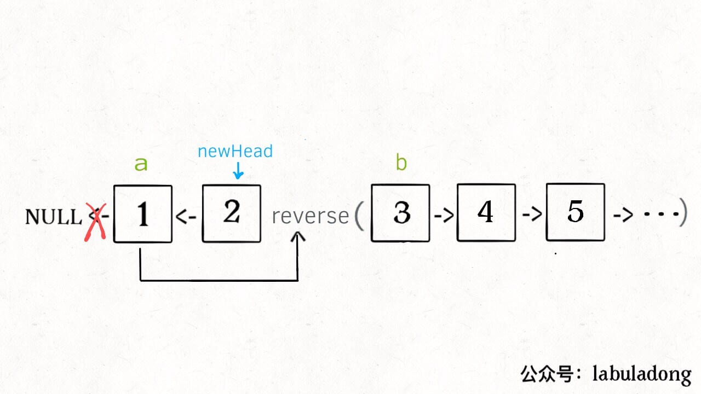

递归部分就不展开了，整个函数递归完成之后就是这个结果，完全符合题意：


==<u>**一样的优雅写法**</u>==

```c++
class Solution {
public:
    ListNode* reverseKGroup(ListNode* head, int k) {
      ListNode* tail = head;
      //移动到当前k个的尾部
      for(int i = 0; i<k; i++){
        //不足k个 不反转 直接返回head
        if(tail == nullptr) return head;
        tail = tail->next;
      }
      //反转head 到 tail的链表
      ListNode* pre = nullptr, *curr = head;
      while(curr!=tail){
        ListNode* temp = curr->next;
        curr->next = pre;
        pre = curr;
        curr = temp;
      }
      //连接下一段
      head->next = reverseKGroup(curr, k);
      return pre;
    }
};
```


#### 好理解但是写起来困难的解法

```C++
class Solution {
public:
    // 翻转一个子链表，并且返回新的头与尾
    pair<ListNode*, ListNode*> myReverse(ListNode* head, ListNode* tail) {
        //ListNode* prev = tail->next; //这个指向没有任何作用,函数外面添加了指向
        ListNode* prev;
        ListNode* p = head;

        //不能使用p!=tail->next,这是因为tail->next指向发生了更改
        //不能while(p) 因为p只有有链接
        while (prev != tail) { //pre <- p 这样循环向前移动的
            ListNode* nex = p->next;
            p->next = prev;
            prev = p;
            p = nex;
        }
        return {tail, head};
    }

    ListNode* reverseKGroup(ListNode* head, int k) {
        ListNode* hair = new ListNode(0);
        hair->next = head;
        ListNode* pre = hair;

        while (head) {
            ListNode* tail = pre;
            // 查看剩余部分长度是否大于等于 k
            for (int i = 0; i < k; ++i) {
                tail = tail->next;
                if (!tail) {
                    return hair->next;  //不足k，此区域不反转 直接返回
                }
            }
            ListNode* nexHead = tail->next;  //区域外的下一区域的头
            // 这里是 C++17 的写法，也可以写成
            // pair<ListNode*, ListNode*> result = myReverse(head, tail);
            // head = result.first;
            // tail = result.second;
            tie(head, tail) = myReverse(head, tail);
            // 把子链表重新接回原链表
            pre->next = head;
            tail->next = nexHead;
            pre = tail;
            head = nexHead;
        }
        return hair->next;
    }
};
```

## 如何判断回文链表

### [234. 回文链表](https://leetcode-cn.com/problems/palindrome-linked-list/)

[labuladong 题解](https://labuladong.gitee.io/plugin-v4/?qno=234&target=gitee)[思路](https://leetcode-cn.com/problems/palindrome-linked-list/#)

难度简单1293

给你一个单链表的头节点 `head` ，请你判断该链表是否为回文链表。如果是，返回 `true` ；否则，返回 `false` 。

 

**示例 1：**


```
输入：head = [1,2,2,1]
输出：true
```

**示例 2：**

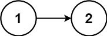

```
输入：head = [1,2]
输出：false
```

#### 代码

```C++
class Solution {
	public:
    //辅助容器
	  bool isPalindrome(ListNode* head) {
	    vector<int> vals;
	    while (head != nullptr) {
	      vals.emplace_back(head->val);
	      head = head->next;
	    }
      //回文判断的双指针写法 记一下
	    // for (int i = 0, j = (int)vals.size() - 1; i < j; ++i, --j) {
	    //   if (vals[i] != vals[j]) {
	    //       return false;
	    //   }
	    // }
      int left = 0, right = vals.size()-1;
      while(left<right){
        if(vals[left]!= vals[right])
          return false;
        left++;
        right--;
      }
	    return true;
	  }
};

class Solution {
  public:
    //递归模拟双指针
    ListNode* left;
    bool isPalindrome(ListNode* head) {
      left = head;
      return traverse(head);
    }
  
    bool traverse(ListNode* right){
      if(right == nullptr) return true;
      bool res = traverse(right->next);
      //后序遍历代码
      res = res && (right->val == left->val);
      left = left->next;
      return res;
    }
};

class Solution {
  public:
    //双指针 优化 为了秀而秀 秀nm呢
    bool isPalindrome(ListNode* head) {
      ListNode* slow;
      ListNode* fast;
      slow = fast = head;
      while(fast && fast->next){
        slow = slow->next;
        fast = fast->next->next;
      }
      if(fast){ //奇数个元素
        slow = slow->next;
      }
      ListNode* left = head;
      ListNode* right = reverse(slow);
      while(right){
        if(left->val!=right->val)
          return false;
        left = left->next;
        right = right->next;
      }
      return true;
    }
  
    ListNode* reverse(ListNode* head){
      if(head == nullptr || head->next == nullptr) return head;
      ListNode* last = reverse(head->next);
      head->next->next = head;
      head->next = nullptr;
      return last;
    }
};
```
